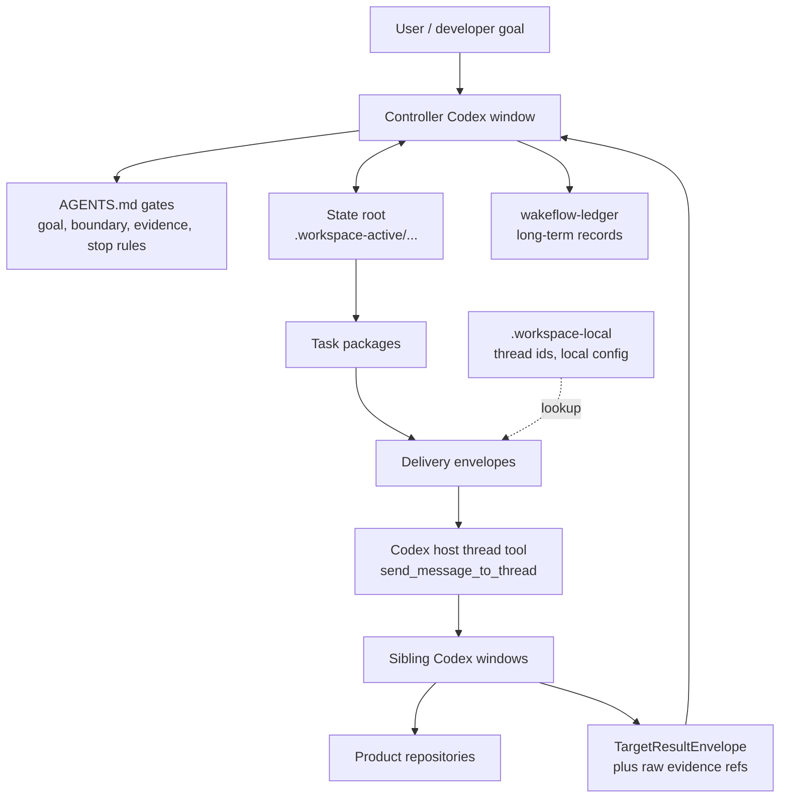

<div align="center">

# Wakeflow

A local-first Codex plugin for unattended multi-repository work: one controller,
many specialist windows, explicit evidence, and direct-thread handoff without
turning scripts into the decision maker.

</div>

---

- [What It Does](#what-it-does) · [Architecture](#architecture) · [Install Shape](#install-shape) · [How Work Moves](#how-work-moves) · [Automation Model](#automation-model) · [Daily Use](#daily-use) · [Repository Layout](#repository-layout) · [Design Philosophy](#design-philosophy)

## What It Does

One Codex window is good at one codebase. Real product work often spans a
plugin entrypoint, a local daemon, a shared core package, a dashboard, a design
thread, and a real-project test thread. Wakeflow keeps that work from turning
into scattered chat state.

The main ideas:

- **One controller brain**: the parent workspace owns goals, boundaries,
  dispatch decisions, acceptance, TODO routing, and archive decisions.
- **One state root per demand**: machine state, task packages, target results,
  and review candidates live together instead of being spread across status
  documents.
- **One readable progress surface**: `developer-progress.md` is the human-facing
  view of the goal, stage plan, task packages, backfills, and controller
  decisions.
- **Sibling Codex windows stay specialized**: product repositories keep their
  own rules, commits, tests, and responsibility boundaries.
- **Direct-thread transport is transport only**: packets move between Codex
  windows, but the controller still reviews raw evidence before accepting work.
- **Design and Test attach to the demand**: design handoffs and real-scenario
  test cards become structured intake, not parallel state machines.
- **Local-first by default**: active state and real thread ids stay out of Git;
  long-term decisions go to a project ledger.

The result is not a bigger script runner. It is a small coordination surface that
keeps judgment, evidence, and ownership visible while Codex work fans out.

## Architecture



The controller is the only place that decides whether evidence is enough. The
scripts create, validate, summarize, and record machine data; they do not accept
a feature, widen scope, or choose product behavior.

## Install Shape

Do not put product repositories inside this repository. Put the reusable
Wakeflow runtime next to the repositories it manages:

```text
MyWorkspace/
  AGENTS.md                  # unpacked controller entrypoint
  Wakeflow/                  # Wakeflow plugin and runtime
  ProductRepo/
  CoreRepo/
  PluginRepo/
  DesignRepo/
  TestRepo/
  wakeflow-ledger/          # project-specific long-term records
```

`workspace.config.json` gives reusable defaults. A local installation can
override them with `.workspace-local/workspace.config.json`; that file is never
committed. `.workspace-active/` and `.workspace-local/` are runtime surfaces,
not source-controlled product state.

Recommended installation flow:

1. Ask Codex to inspect the parent folder.
2. Wakeflow returns directory facts and an agent-selection protocol; it does not
   guess whether the workspace is clean or messy.
3. Codex judges the directory facts. In a clean workspace it passes explicit
   repository mappings and continues; in a messy workspace it asks which windows
   to manage.
4. Confirm the boundary when Codex asks.
5. Let it write only the managed `AGENTS.md` blocks and local runtime surfaces.
6. Let Codex create the controller, Design, Test, and product Codex threads from
   the returned `windowLaunchPlan`.
7. After each thread is created, Codex calls `set_thread_title` with that
   window's `displayTitle`, then stores the real thread ids under
   `.workspace-local/`.

Wakeflow detects the requested setup language from `language` (`auto`, `zh`, or
`en`). The launch plan uses short window titles with the window name first, such
as `<RepoName> Responsibility Window` in English or the localized equivalent in
Chinese, and the first line of each create-thread prompt starts with that title.
Initialization also includes a final host title-reset step so Codex-generated
conversation titles are overwritten with the canonical `displayTitle`. This
keeps the core repository visible in narrow Codex sidebars.

To rebuild only selected windows, pass them as `replaceWindows` during
initialization. Wakeflow returns a launch plan containing only those windows.
After Codex creates the replacement threads, register the new real thread ids in
the local runtime; tracked docs and prompts still never contain thread ids.

Useful first prompt:

```text
Use Wakeflow to initialize the current workspace.
Preview the plan first and wait for my confirmation before writing.
```

That prompt should route through the `wakeflow_initialize_workspace` MCP tool
with `apply: false`. If discovery is obviously clean, Codex should call the same
tool again with explicit `repositories` mappings. If the folder is mixed with
history, runtime, ledger, scratch, tooling, or unrelated repositories, Codex
should ask which windows to manage before writing. If the tool is unavailable,
reload or reinstall the plugin before attempting setup.

Wakeflow keeps Design and Test as sibling window directories such as `Design/`
and `Test/`, next to product repositories and `wakeflow-ledger/`. This lets
those windows read the same sibling product repositories while keeping long-term
records in `wakeflow-ledger/`.

Initialization also creates the durable workflow skeleton that mature controller
workspaces need: Design handoff inbox, requirement-design ledger, goal/stage
confirmation process, workspace archive index, TODO/window scheduling policy,
and requirement-to-wave flow. These are generic Wakeflow records, not copies of
any one product workspace's history.

## How Work Moves

The normal loop is intentionally boring:

1. The user gives a goal or a design handoff.
2. The controller defines completion, boundaries, first blocker, and eligible
   repositories.
3. A state root records the demand and creates task packages.
4. Target Codex windows receive compact direct-thread prompts.
5. Target windows work only inside their repository responsibility and return
   result envelopes with evidence references.
6. The controller reads the raw evidence, accepts or rejects the result, and
   records the decision.
7. The controller either dispatches the next eligible package, marks the demand
   blocked, stops for user judgment, or completes and archives.

Design and Test are supporting roles:

- **Design** clarifies requirements, tradeoffs, hidden goals, and handoff
  candidates. It does not become product truth until the user or controller
  accepts it.
- **Test** handles real-project, dashboard, cold-start, and runtime evidence
  that the controller or product repo cannot safely reproduce alone.

## Automation Model

Automation is direct-thread delivery plus result return. It is not a hidden
scheduler and not a replacement for review.

Core rules:

- Real Codex thread ids stay in `.workspace-local/`.
- Delivery prompts stay small and human-readable.
- The host thread tool sends the prompt; scripts only record the send/readback
  evidence.
- `group-ready` can wait for all expected target results before one controller
  callback.
- `per-target` can wake the controller for each target, still with a group
  snapshot.
- The controller stops on final completion, hard gates, user stop, no eligible
  TODO, missing evidence, or any state that forbids dispatch.

If you need every flag and command, use [scripts/README.md](scripts/README.md).
The README is meant to explain the coordination model, not act as a shell manual.

## Daily Use

Start by reading the active Wakeflow surface and the current state root, not by
running every script. The most common helper is:

```sh
node scripts/wakeflow-cli.mjs status
```

After that, choose the smallest action that advances the real loop:

- intake a design handoff or test card,
- create or dispatch one task package,
- import a target result,
- reduce results and make a controller decision,
- archive only after evidence and TODOs are settled.

Script families:

| Need | Script family |
| --- | --- |
| Install / sync parent and child `AGENTS.md` blocks | `wakeflow-setup.mjs` |
| Create state roots, task packages, decisions, progress projections | `wakeflow-state.mjs` |
| Record Design/Test intake | `wakeflow-intake.mjs` |
| Build delivery envelopes, review result groups, record direct-thread runs | `wakeflow-delivery.mjs` |
| Daily status, verification, and printed command shortcuts | `wakeflow-cli.mjs` |

## Repository Layout

| Path | Purpose |
| --- | --- |
| `AGENTS.md` | Source controller instructions, unpacked to the parent workspace root. |
| `workspace.config.json` | Generic window names, repository paths, role labels, and script defaults. |
| `.workspace-active/` | Ignored project runtime: current indexes, controller state roots, progress docs, TODO projections, intake, and test cards. |
| `.workspace-local/` | Ignored local runtime: real thread ids, delivery loop state, keep-live state, and local config overrides. |
| `../wakeflow-ledger/` | Project-specific long-term records outside the reusable repository. |
| `scripts/` | Installation, validation, ledger, state-machine, intake, delivery, and coordination helper scripts. |
| `skills/` | Operational manuals for controller windows, target windows, testing, ledgers, and delivery. |
| `templates/` | Minimal skeletons for state roots, developer progress docs, Design/Test support, and confirmations. |

## Design Philosophy

1. **Judgment stays at the controller**: script output, window backfill, TODO
   rows, and status docs are evidence, not acceptance.
2. **One demand has one machine state root**: repeated status and envelopes stay
   as JSON / JSONL, while Markdown remains readable context and evidence.
3. **Progress has one readable surface**: developers should not need to chase
   five status files to know the goal and next blocker.
4. **Automation moves work, not authority**: direct-thread delivery proves only
   that a prompt was sent, not that a task is complete.
5. **Repositories keep their boundaries**: shared contracts, plugin entrypoints,
   daemon behavior, dashboard UI, design, and testing stay in the right window.
6. **Small prompts beat command dumps**: target windows need the current task,
   state root, skill, and identity rules, not a full script manual.

Wakeflow is scaffolding for disciplined multi-window work. Its job is to make
the real decision points hard to skip.
