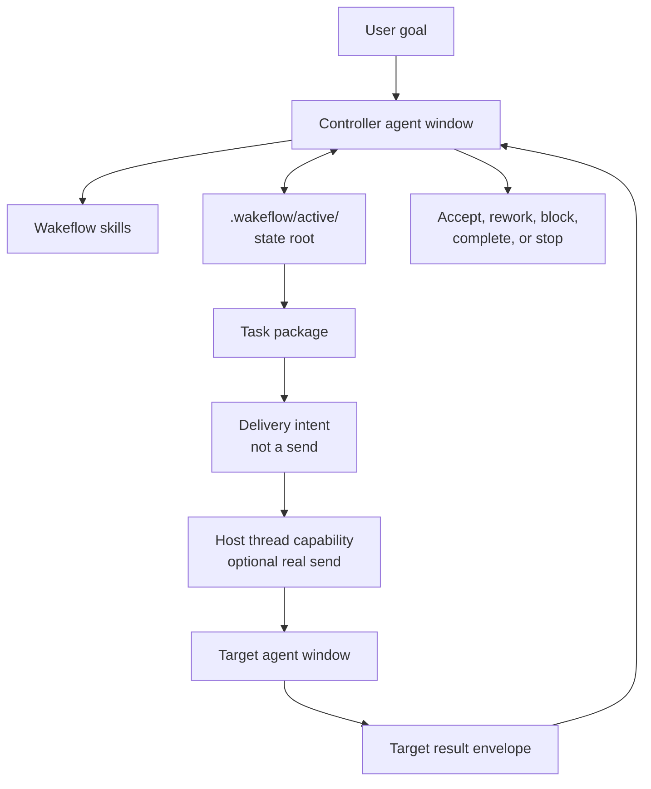

<div align="center">

# Wakeflow

Unattended control loops for multi-window agent work.

</div>

Wakeflow is the plugin-shaped version of a mature control workspace pattern:
one controller, many specialist agent windows, explicit local state, compact
handoff prompts, and evidence review before acceptance.

It is intentionally **not** a hidden thread sender. Wakeflow can create local
state roots, task packages, delivery intents, target result envelopes, and review
summaries. The host environment still performs any real thread delivery and the
controller still makes the final judgment.

## Highlights

- **Controller-first workflow**: goals, boundaries, task packages, result review,
  and completion decisions stay in one control surface.
- **Unattended-ready state**: each demand gets a local state root with machine
  JSON and a readable progress document.
- **Compact handoff prompts**: delivery intents contain only the target task,
  state root, dispatch group, and skill pointer.
- **No fake queue**: busy or missing target delivery is represented as deferred
  state instead of pretending a prompt was sent.
- **Plugin-native access**: skills teach the workflow; MCP tools expose status,
  demand initialization, task packaging, delivery intent generation, result
  import, and review.
- **Local-first by default**: `.wakeflow/` runtime state is ignored by Git.

## Architecture



## Repository Layout

| Path | Purpose |
| --- | --- |
| `.codex-plugin/plugin.json` | Plugin manifest. |
| `.mcp.json` | MCP server entrypoint for Wakeflow helper tools. |
| `skills/` | Controller, target, install, and review workflow skills. |
| `bin/wakeflow-mcp.mjs` | Dependency-free MCP server. |
| `scripts/wakeflow.mjs` | CLI helper for the same local state operations. |
| `lib/wakeflow-state.mjs` | Local state root implementation. |
| `templates/` | Prompt and progress templates. |
| `.wakeflow/` | Local runtime state; ignored by Git. |

## Quick Start

Validate the plugin:

```sh
npm test
python3 /Users/gaoxuefeng/.codex/skills/.system/plugin-creator/scripts/validate_plugin.py .
```

Create a local demand state root:

```sh
node scripts/wakeflow.mjs init \
  --demand-key demo \
  --title "Demo control loop" \
  --goal "Coordinate a multi-window task" \
  --completion-definition "Evidence reviewed and accepted" \
  --write --json
```

Add a target task and generate a delivery intent:

```sh
node scripts/wakeflow.mjs add-task \
  --state-root .wakeflow/active/demo \
  --task-id DEMO-T1 \
  --target-window ProductWindow \
  --summary "Inspect the product boundary and report evidence" \
  --write --json

node scripts/wakeflow.mjs prepare-delivery \
  --state-root .wakeflow/active/demo \
  --task-id DEMO-T1 \
  --dispatch-group DEMO-G1 \
  --write --json
```

The generated delivery intent contains a prompt. Wakeflow stops there. A host
that exposes a thread-send capability may send that prompt, then record the
delivery evidence separately.

## MCP Tools

Wakeflow exposes these helper tools:

- `wakeflow_status`
- `wakeflow_init_demand`
- `wakeflow_add_task`
- `wakeflow_prepare_delivery`
- `wakeflow_record_delivery`
- `wakeflow_submit_result`
- `wakeflow_review`

All tools operate on local files and return JSON summaries. None of them sends
messages to other agent windows.

## Boundary

Wakeflow is a control-loop kit, not a scheduler service. It helps the controller
be precise about what should happen next. It does not replace the controller,
does not hide product decisions in scripts, and does not treat transport success
as task completion.
