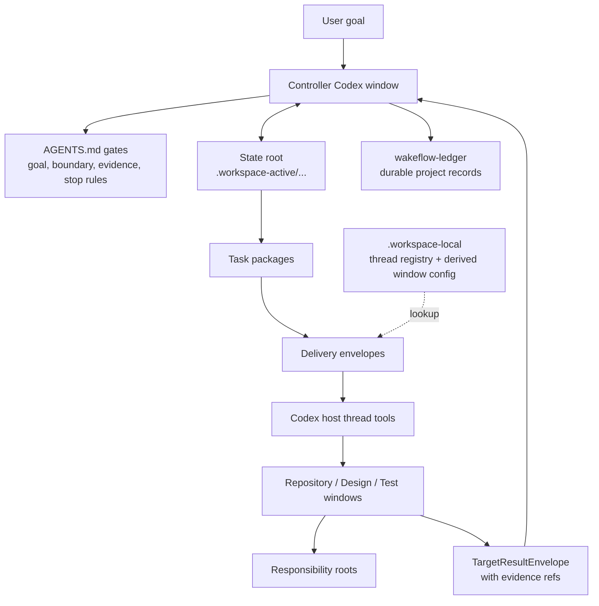

<div align="center">

# Wakeflow

Unattended control loops for multi-window agent work.

Wakeflow turns a local Codex workspace into a disciplined controller system:
one controller window, focused repository windows, explicit state roots,
compact direct-thread delivery, and evidence-based acceptance.

</div>

---

- [Why Wakeflow](#why-wakeflow)
- [System Model](#system-model)
- [Initialize A Workspace](#initialize-a-workspace)
- [What Wakeflow Creates](#what-wakeflow-creates)
- [How Work Moves](#how-work-moves)
- [Automation Semantics](#automation-semantics)
- [MCP Capability Surface](#mcp-capability-surface)
- [Runtime And Ledger Boundaries](#runtime-and-ledger-boundaries)
- [Working In This Repository](#working-in-this-repository)
- [Design Principles](#design-principles)

## Why Wakeflow

Large agent-assisted work rarely lives in one repository or one conversation.
A single goal may require a controller, product repositories, a design window,
and a real-scenario test window. Without a shared operating model, the work
degrades into scattered prompts, copied status tables, unclear ownership, and
unfinished evidence review.

Wakeflow provides the missing control layer:

- **Controller-first judgment**: the parent workspace owns goals, boundaries,
  dispatch decisions, acceptance, TODO routing, and archive decisions.
- **One state root per demand**: task packages, target results, review
  candidates, decisions, and progress projections stay tied to the same demand.
- **Focused child windows**: each repository window works only inside its
  configured responsibility boundary.
- **Compact delivery**: direct-thread prompts wake the right window with a small
  envelope; the state root and skills hold the task details.
- **Evidence before acceptance**: target backfill is input, not a conclusion.
  The controller still reviews raw evidence before completing work.
- **Local-first runtime**: real thread ids live only in the local thread
  registry; window config is a derived sendability view, and active state stays
  out of tracked source.

Wakeflow is not a command launcher with nicer names. It is a reusable workflow
capability for keeping multi-window agent work legible, bounded, and resumable.

## System Model



The controller is the only acceptance authority. Scripts and MCP tools create,
validate, summarize, and record machine data, but they do not widen scope,
decide product behavior, or declare a task complete.

## Initialize A Workspace

Wakeflow is installed as a Codex plugin. A target workspace does not need to
contain Wakeflow source code. The expected target shape is:

```text
MyWorkspace/
  AGENTS.md
  workspace.config.json
  .workspace-active/          # ignored active controller state
  .workspace-local/           # ignored thread registry and derived runtime
  wakeflow-ledger/            # durable project coordination records
  ProductRepo/
  CoreRepo/
  Design/                     # default internal requirement-design surface
  Test/                       # default internal test coordination surface
```

The simplest user prompt is:

```text
Use Wakeflow to initialize the current workspace.
Preview the plan first and wait for my confirmation before writing.
```

The operating flow is:

1. Codex calls `wakeflow_initialize_workspace` with `apply: false`.
2. Wakeflow returns directory facts and an `agentSelectionProtocol`.
3. Codex judges whether the workspace is clean or messy from those facts and
   user context.
4. For a clean workspace, Codex calls the tool again with explicit
   `repositories` mappings for the intended work windows.
5. For a messy workspace, Codex asks which directories are managed windows
   before writing. It must not use a broad discovered-directory import.
6. After user confirmation, Codex calls `wakeflow_initialize_workspace` with
   `apply: true`.
7. Codex creates the returned Codex threads, resets each thread title to the
   returned `displayTitle`, and passes each real thread id once to Wakeflow's
   local registration command. The thread registry is the only thread-id
   authority; window config is refreshed as a derived view.

Design and Test are fresh support surfaces by default. Existing similarly named
directories such as `<Product>Design` or `<Product>Test` are treated as ordinary
directory facts unless the user explicitly maps them as Design/Test.

Wakeflow supports localized initialization. Pass `language: "zh"` for Chinese
workspaces, `language: "en"` for English workspaces, or `language: "auto"` when
there is no clear preference. Generated thread titles keep the window name at
the front so the important repository name remains visible in narrow sidebars.

## What Wakeflow Creates

Initialization writes only the surfaces needed for the confirmed workspace
boundary:

| Surface | Purpose |
| --- | --- |
| `AGENTS.md` | Parent controller gates and durable boundaries. |
| Child `AGENTS.md` access cards | Per-window responsibility and read paths. |
| `workspace.config.json` | Managed windows, repository paths, roles, and default language. |
| `.workspace-active/` | Active state roots, current indexes, progress docs, TODO projections, intake, and test cards. |
| `.workspace-local/` | Thread registry, direct-thread runtime, local overrides, and derived window config. |
| `wakeflow-ledger/` | Long-term project coordination records and archives. |
| `Design/` | Internal requirement-design workspace when no external Design repository is mapped. |
| `Test/` | Internal test coordination workspace when no external Test repository is mapped. |

Wakeflow also synchronizes `.gitignore` so `.workspace-active/` and
`.workspace-local/` remain local runtime directories.

## How Work Moves

The normal Wakeflow loop is deliberately small:

1. A user goal, Design handoff, or controller intake creates a demand.
2. The controller defines completion, boundaries, phase order, and the first
   blocker.
3. A state root records the demand and creates eligible task packages.
4. The controller prepares compact delivery envelopes for the target windows.
5. Target windows read their own rules, execute only their assigned package, and
   return target result envelopes with reviewable evidence.
6. The controller reviews raw evidence, records a decision, and either creates
   the next eligible package, stops for user judgment, marks the demand blocked,
   or completes the demand.
7. Durable conclusions move to `wakeflow-ledger/`; local runtime stays local.

Design and Test are supporting roles:

- **Design** clarifies requirements, options, risks, and handoff candidates. It
  does not dispatch implementation or become product truth by itself.
- **Test** is reserved for real-scenario evidence that the controller or product
  repository cannot safely reproduce alone.

## Automation Semantics

Wakeflow automation is direct-thread delivery plus explicit result return.

Core rules:

- Real thread ids live only in `.workspace-local/wakeflow-delivery/thread-registry/`.
- Window config is derived from `workspace.config.json` plus thread-registry
  presence; it is not a second thread-id or window-semantics authority.
- Delivery prompts remain compact and human-readable.
- The host sends prompts with Codex thread tools; Wakeflow records the send and
  readback evidence.
- `group-ready` waits for the expected target results before a controller
  return.
- `per-target` can wake the controller once per target while still preserving a
  group snapshot.
- After a real send is recorded as sent with readback evidence, the controller
  turn stops. It does not sleep or poll in the same turn.
- Keep-live support is runtime assistance only. It is not task logic, transport
  authority, or acceptance evidence.

Automation stops on final completion, hard gates, user stop, no eligible work,
missing evidence, blocked state, or any condition that requires controller or
user judgment.

## MCP Capability Surface

Wakeflow exposes plugin capabilities as MCP tools. The tools wrap the runtime
scripts so Codex can use one consistent surface without copying local command
manuals into prompts.

Primary tool groups:

| Need | MCP tools |
| --- | --- |
| Setup and workspace discovery | `wakeflow_initialize_workspace`, `wakeflow_discover_workspace`, `wakeflow_sync_agents`, `wakeflow_access_profiles` |
| Demand and task state | `wakeflow_status`, `wakeflow_init_demand`, `wakeflow_add_task`, `wakeflow_next_work` |
| Delivery and returns | `wakeflow_prepare_delivery`, `wakeflow_record_delivery`, `wakeflow_build_controller_return`, `wakeflow_stop_loop` |
| Results and review | `wakeflow_submit_result`, `wakeflow_review`, `wakeflow_review_pack`, `wakeflow_decide_review`, `wakeflow_complete_demand` |
| Design and Test intake | `wakeflow_intake_design_handoff`, `wakeflow_intake_test_card` |
| Maintenance and verification | `wakeflow_archive_workspace_docs`, `wakeflow_archive_todo`, `wakeflow_run_backend`, `wakeflow_full_status`, `wakeflow_full_verify`, `wakeflow_keep_live_state` |

When the MCP server is available, agents should use these tools instead of
reconstructing setup or state transitions by hand.

## Runtime And Ledger Boundaries

Wakeflow keeps source, active runtime, and durable records separate:

| Path | Boundary |
| --- | --- |
| `skills/` | Reusable operating instructions installed with the plugin. |
| `scripts/` | Runtime implementation and validation scripts packaged by the plugin. |
| `templates/` | Starter state, Design/Test, and ledger skeletons. |
| `.workspace-active/` | Current active work in a target workspace; ignored by Git. |
| `.workspace-local/` | Machine-local thread registry, derived runtime views, and local state; ignored by Git. |
| `wakeflow-ledger/` | Project-specific durable records outside reusable Wakeflow source. |

The source repository tracks reusable Wakeflow capability. Product code,
project-specific active state, real thread ids, and derived local runtime
artifacts do not belong in Wakeflow source.

## Working In This Repository

Use this repository to develop the Wakeflow plugin itself.

```sh
npm run validate
npm run smoke
npm run test:wakeflow
npm test
```

Common source areas:

| Path | Purpose |
| --- | --- |
| `.codex-plugin/plugin.json` | Plugin manifest and MCP wiring. |
| `bin/wakeflow-mcp.mjs` | MCP server entrypoint. |
| `scripts/` | Setup, state, delivery, intake, archive, validation, and CLI runtime. |
| `skills/` | Controller, target, governance, and validation operating manuals. |
| `templates/` | Installed workspace starter documents and support surfaces. |
| `assets/` | Marketplace and plugin presentation assets. |

Detailed command references live in [scripts/README.md](scripts/README.md).
The top-level README explains the system model; the script README is the
operator manual.

## Design Principles

1. **Judgment stays visible**: script output, status rows, and target backfill
   are evidence, not acceptance.
2. **One demand, one state root**: JSON state and Markdown progress surfaces
   stay tied to the same demand.
3. **Prompts wake, state instructs**: prompts should be compact; task detail
   belongs in state roots, task packages, and installed skills.
4. **Repository boundaries matter**: each window owns its source, tests,
   commits, and evidence.
5. **Automation moves work, not authority**: direct-thread delivery proves that
   a prompt was sent, not that the result is complete.
6. **Local runtime stays local**: real thread ids stay only in the local thread
   registry, and active runtime state never enters tracked documentation.
7. **Fresh support windows by default**: Design and Test are created as clear
   Wakeflow support surfaces unless the user explicitly maps existing ones.

Wakeflow exists to make unattended multi-window work safe to resume, easy to
inspect, and hard to fake.
