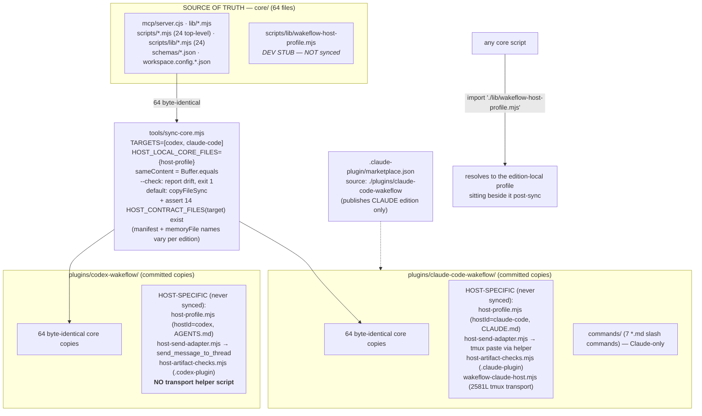
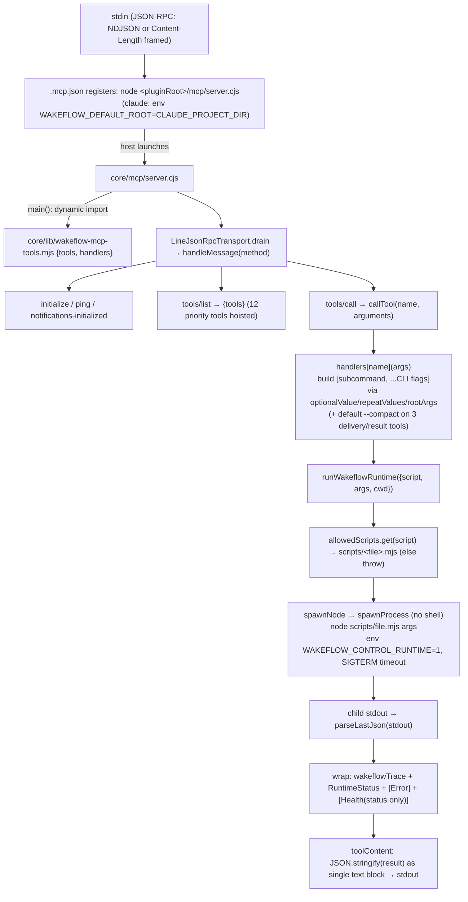
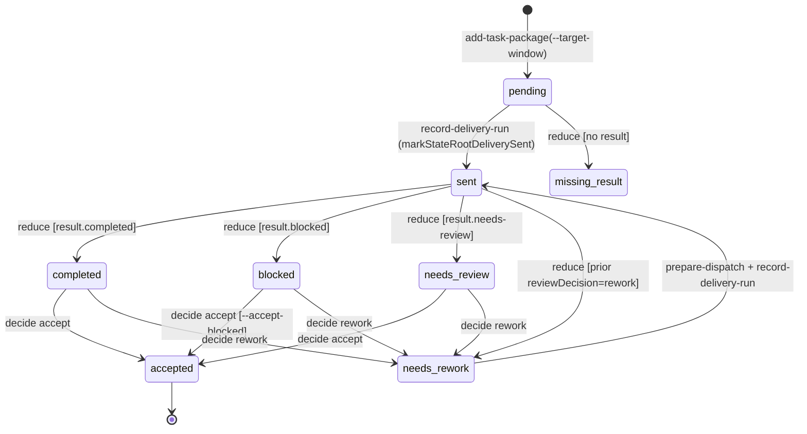
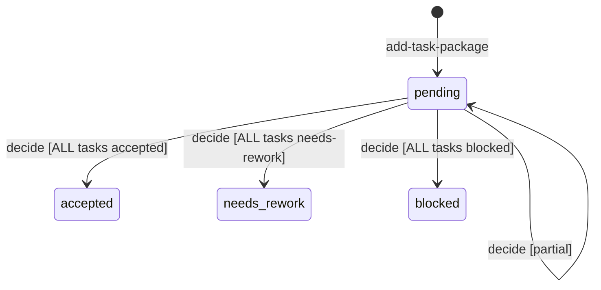
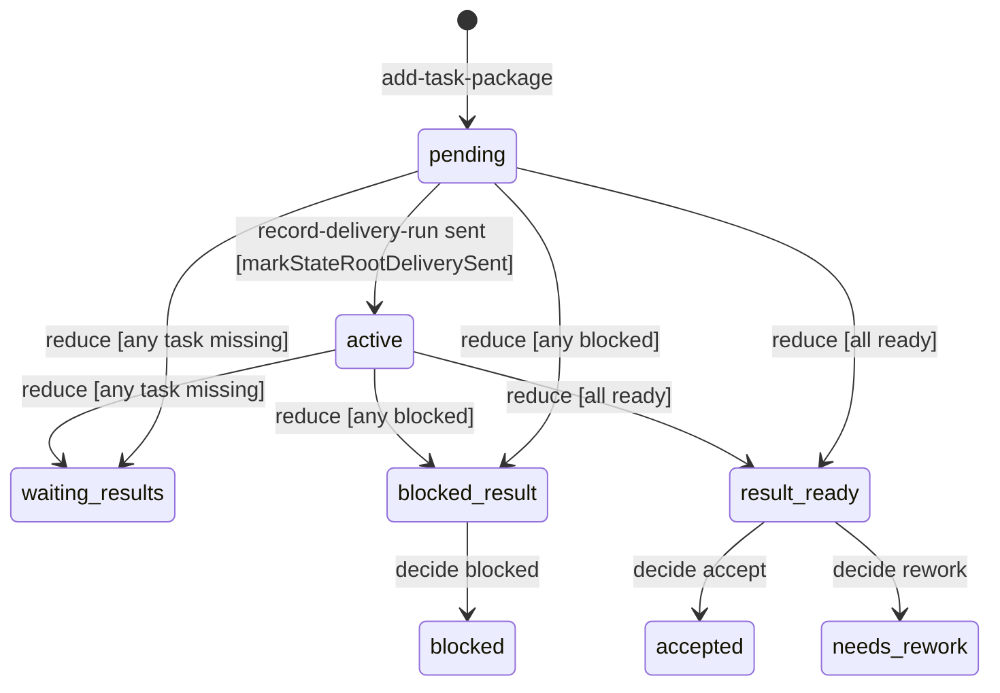
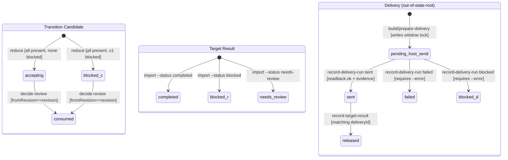
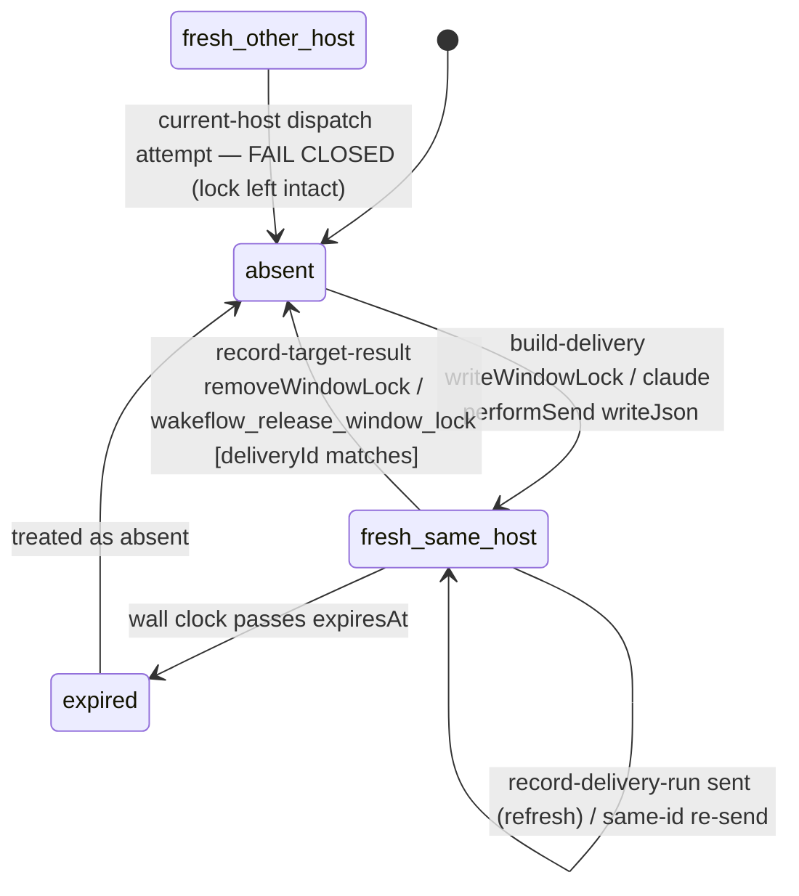
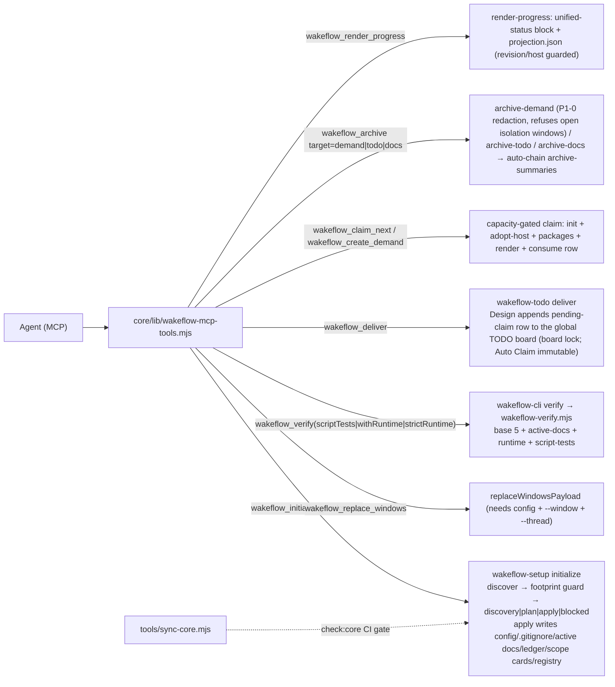

# Wakeflow: Dual-Edition Architecture and State Flow

> Generated 2026-06-19 from source at commit HEAD; **revised 2026-07-02 against v0.7.8** (state-root locks, multi-demand capacity, intent alignment, isolation worktrees, demand pods, unified create/claim/deliver, wakeflow.config.json naming). Code is the source of truth.

This document synthesizes seven parallel subsystem reads of the Wakeflow source.
Where a reader flagged an uncertainty, it is surfaced in an **Open questions /
verify** note rather than guessed. File citations use `path:line` form.

---

## 1. Overview

Wakeflow is a reusable **controller-first, multi-window agent orchestration**
capability. It is not a product repository and not the parent workspace — it is
a controller runtime that a host agent (Claude Code or Codex) installs into a
workspace to plan, dispatch, accept, and archive cross-repository work across
multiple agent windows.

The whole system runs on one model:

> **Prompts wake, state instructs.**

A *delivery prompt* is only a compact wakeup envelope that navigates a target
window to its work; the authoritative *what/why/completion-definition* lives in
durable on-disk state (the per-demand state root, dispatch packets, delivery
envelopes, and result envelopes). The controller never carries the full task in
the prompt — it carries ids and a wakeup, and the target reads state.

Three structural pillars hold this up:

1. **One host-neutral core** (`core/`) with a hand-rolled MCP server exposing 23
   `wakeflow_*` tools, each of which spawns an allowlisted Node script.
2. **A demand state machine** (`core/scripts/wakeflow-state.mjs`) of seven
   state-writing reducers (plus the state-neutral result import and two
   read-only projections) driving a single per-demand state root, and a
   separate transport lifecycle (`core/scripts/wakeflow-delivery.mjs`) for
   envelopes, runs, and results.
3. **A host-profile seam** that lets the identical core run on two different
   transports — Claude Code tmux-resident sessions and Codex host threads —
   without ever branching on host id.

Since 0.7.x a fourth pillar hardens the first three: **mechanical concurrency
and parallelism** — O_EXCL file locks around every state-root mutation (plus
board/capacity/paste locks), a `maxActiveDemands` capacity gate (default 2),
and demand-level parallelism only: within one demand each repository runs
exactly ONE window with ONE combined task package, while extra demands run as
isolated demand pods (own controller/Test/tmux session, isolation worktrees,
human-reviewed merge-back ledger).

---

## 2. Dual-Edition Architecture

### 2.1 The shape

Wakeflow ships **two self-contained marketplace plugin artifacts built from one
shared source**:

- `core/` holds **65 host-neutral runtime files** (the MCP server, runtime libs,
  24 `scripts/lib` modules, 24 top-level scripts, JSON schemas, assets, and
  config examples). The full breakdown: `scripts/`=48 (24 top-level
  + 24 `scripts/lib`), `schemas/`=7, `lib/`=4, `mcp/`=1, `assets/`=2,
  3 root files (`LICENSE` + 2 `workspace.config.*.json`).
- `plugins/codex-wakeflow/` and `plugins/claude-code-wakeflow/` are each a
  **complete install surface** that commits **plain byte-identical copies of 64
  of those core files**. The 65th — `scripts/lib/wakeflow-host-profile.mjs` — is
  excluded from sync because it is host-local.

The seam between hosts is `wakeflow-host-profile.mjs`. Every core script
statically imports `./lib/wakeflow-host-profile.mjs` (a relative sibling import),
so after sync each install surface resolves *its own* host-specific profile
sitting next to the identical core copies.

The enforced contract: **core files may interpolate `hostProfile` values but must
never branch on `hostId`.** This is verified empirically — `grep -rn 'hostId ===' core/`
returns **zero hits**. Core only interpolates, e.g. `core/lib/wakeflow-mcp-tools.mjs:29`
uses `hostProfile.memoryFileLabel`.

### 2.2 Architecture diagram



### 2.3 File-ownership table (core-synced vs host-specific)

| Class | Files | Sync behavior |
|---|---|---|
| **Synced — byte-identical (64)** | all of `core/` except `scripts/lib/wakeflow-host-profile.mjs` | `Buffer.equals` compare; `--check` reports drift (exit 1), default mode `copyFileSync` |
| **Host-local — not synced (3 lib files)** | `scripts/lib/wakeflow-host-profile.mjs`, `wakeflow-host-artifact-checks.mjs`, `wakeflow-host-send-adapter.mjs` | only the profile is an explicit `HOST_LOCAL_CORE_FILES` exclusion (`:59-61`) — it **does** exist in `core/scripts/lib/` and is skipped (`:72`). The send-adapter and artifact-checks are **not excluded** because they **do not exist in `core/` at all** (confirmed: `core/scripts/lib/` holds only `wakeflow-host-profile.mjs` among the host-* files), so they are never sync candidates. All three are listed in `HOST_CONTRACT_FILES` and only **existence-checked**. The send-adapter and artifact-checks differ **byte-for-byte** between editions |
| **Host-contract — existence-checked only (14 per target)** | manifest, `.mcp.json`, memory file (`CLAUDE.md`/`AGENTS.md`), README ×2, `package.json`, `scripts/README.md`, the 3 host-lib files, 3 `SKILL.md`, template bundle | `--check` asserts each EXISTS but never byte-compares. `HOST_CONTRACT_FILES` is a **function of `target`** (`:42-57`): `target.manifest` and `target.memoryFile` resolve to the edition's own filenames (`.codex-plugin/plugin.json`+`AGENTS.md` vs `.claude-plugin/plugin.json`+`CLAUDE.md`), so the existence checks use the right per-edition names |
| **Claude-only extra** | `scripts/lib/wakeflow-claude-host.mjs` (2581-line tmux transport helper), `commands/` (7 slash-command `.md` files) | shipped only in the Claude edition; Codex has no equivalent |

Key citations:

- `tools/sync-core.mjs:29-40` (`TARGETS`), `:42-57` (`HOST_CONTRACT_FILES`),
  `:59-61` (`HOST_LOCAL_CORE_FILES`), `:63-77` (`listCoreFiles`), `:79-82`
  (`sameContent` = `readFileSync(a).equals(readFileSync(b))`), `:102-121`
  (sync/check loop), `:115-120` (existence assertion).
- `package.json:7-10` (npm workspaces), `:11-21` (`sync:core`/`check:core`/`test`).
- `.claude-plugin/marketplace.json:11-16` (single `wakeflow` entry, source
  `./plugins/claude-code-wakeflow`).

### 2.4 The byte-identity sync rule

`sync-core.mjs` enforces identity with a raw **`Buffer.equals`** comparison
(`:79-82`), **not** a hash digest — any single-byte difference counts as drift.

- `--check` (CI gate, wired into `npm test` first, `package.json:21`): drift
  pushes `${target.dir}/${rel} drifts from core/${rel}`, missing dir pushes an
  issue, then `process.exitCode = 1`.
- default (no flag) is the write mode: `mkdirSync(recursive)` + `copyFileSync`,
  increments `copied`; `--check` is the only flag.
- Empirically `node tools/sync-core.mjs --check` returns `{ok:true, coreFiles:64, issues:[]}`.

The `TARGETS` are hardcoded with per-edition manifest + memory file names so the
existence check uses the right filenames: `{dir:'plugins/codex-wakeflow', manifest:'.codex-plugin/plugin.json', memoryFile:'AGENTS.md'}` and
`{dir:'plugins/claude-code-wakeflow', manifest:'.claude-plugin/plugin.json', memoryFile:'CLAUDE.md'}`.

### 2.5 The host-profile contract (four abstracted seams)

The profile exposes four seams that core interpolates but never branches on:

1. **Identity / vocabulary** — `hostId`, `hostName`, `decisionOwner`,
   `memoryFile`/`memoryFileLabel`, `pluginManifestDir/Path`, `kinds`
   (host-branded on-disk record kinds), `closedLoopContractName`, `handleId`
   placeholders + real-id requirement.
2. **Transport / send** — `hostTools {createWindow, retitleWindow, sendToWindow}`
   plus the separate `wakeflow-host-send-adapter.mjs`.
3. **Window launch** — `launch.{planFlags, workflowSteps, titleReset, entryExtras, effortByRole/thinkingByRole}`.
4. **Registry / keep-live / residue** — `runtime.{hostDirName, legacyRegistryFallback}`,
   `keepLiveEnv` var names, `workspaceResidueChecks`.

The transport seam **diverges structurally**:

- **Claude**: `hostTools` are subcommands of the 2581-line
  `wakeflow-claude-host.mjs` (`launch-window`/`retitle`/`send`, plus the
  one-step `deliver --delivery-file` transport — it reads the prepared
  envelope, pastes, and returns compact readback, replacing the manual
  prompt-file + send ceremony — and the `stream-open/close/list` +
  `pod-open/close/list` cross-demand isolation commands); its dispatch table
  is at `wakeflow-claude-host.mjs:2539-2565` (26 subcommands). The send-adapter pastes the
  envelope into tmux (`claudeTmuxResidentAdapter`, `send-adapter:24-34`) with a
  `claude -p --resume` headless-recovery last resort (`claudeHeadlessRecoveryAdapter`,
  `:36-46`; the `adapterForWindowMode` dispatcher that selects between them is the
  separate `:48-51`).
- **Codex**: `hostTools` are native agent tools `create_thread`/
  `set_thread_title`/`send_message_to_thread`; the adapter
  (`codexAppThreadHostAdapter`, `send-adapter:1-15`) delegates to
  `send_message_to_thread` — **no helper script, no tmux**.

Additional edition facts:

- The Claude edition ships `commands/` (7 slash commands) and `artifact-checks`
  requires both `skills/` and `commands/` (`wakeflow-host-artifact-checks.mjs:29-34`);
  Codex has no `commands/` and instead carries a `.codex-plugin` `interface{}`
  block.
- All edition manifests are version-locked at **0.8.14** in **five places**: both
  plugin manifests (`.codex-plugin/plugin.json:3`, `.claude-plugin/plugin.json:3`),
  both plugin `package.json`s, and the marketplace **plugin entry**
  (`.claude-plugin/marketplace.json` `plugins[0].version`). The marketplace file
  also carries a **second, distinct** version field — `metadata.version` is
  `1.0.0` (the catalog metadata, not the plugin version) — so the same file has
  two different version fields and only the `plugins[0]` one tracks the 0.8.14
  lock. Root `package.json` stays `0.0.0` / `private:true` (private dev
  workspace). `sync-core` does **not** enforce version equality — manifests are
  existence-only.
- The marketplace publishes **only** the Claude edition; the Codex edition's
  `artifact.marketplacePath` points at a separate `.agents/plugins/marketplace.json`.
- The `core/` host-profile copy is a **Codex dev stub** (`hostId codex` but
  `workspaceResidueChecks: []`) excluded from sync, present only so core scripts'
  relative imports resolve when running from `core/` during repo development.

**Note:** This is the single architecture reference for Wakeflow; per the header,
where any prose here and the code disagree, the code is authoritative.

> **Open questions / verify:** The no-`hostId`-branch claim rests on a grep for
> `hostId ===` returning zero hits in `core/`; this would miss exotic dynamic
> dispatch (e.g. `hostProfile.hostId` used as an object key). The five 0.8.14
> version fields currently match but `check:core` does not catch version drift. The
> Codex `.agents/plugins/marketplace.json` distribution path lives outside this
> repo's tracked tree and was not confirmed.

---

## 3. MCP Tool Surface

### 3.1 How the server boots and dispatches

The MCP surface is a **hand-written stdio JSON-RPC 2.0 server with no SDK
dependency**:

- **Registration / boot entrypoint.** Both editions' `.mcp.json` register the
  server **directly** as `node <pluginRoot>/mcp/server.cjs` — the Claude edition
  uses `${CLAUDE_PLUGIN_ROOT}/mcp/server.cjs` with `env
  WAKEFLOW_DEFAULT_ROOT=${CLAUDE_PROJECT_DIR}`; the Codex edition uses
  `./mcp/server.cjs` with `cwd:'.'`. Each `plugin.json` points
  `mcpServers` at `./.mcp.json` (`claude .claude-plugin/plugin.json:20`,
  `codex .codex-plugin/plugin.json:22`). The Claude `WAKEFLOW_DEFAULT_ROOT`
  injection is what grounds the `defaultWorkspaceRoot` fallback chain in §3.3.
- The former `core/bin/wakeflow-mcp.mjs` shim was removed (dead-capability
  cleanup); `mcp/server.cjs` is the only MCP entrypoint, exactly as the
  `.mcp.json` files register it.
- `core/mcp/server.cjs` implements the full framed transport (newline-delimited
  JSON **and** Content-Length framing, plus JSON-RPC batch arrays), protocol
  negotiation (latest `2025-11-25`, default `2025-03-26`, 5 supported versions),
  and the `initialize`/`notifications/initialized`/`ping`/`tools/list`/`tools/call`
  methods.
- On boot, `main()` dynamically imports `pluginRoot/lib/wakeflow-mcp-tools.mjs`
  to get `{tools, handlers}`, then starts `LineJsonRpcTransport` over
  stdin/stdout.
- `tools/call` → `callTool(params, handlers)` → `handlers[name](args)`, which
  builds a `[subcommand, ...flags]` list and calls `runWakeflowRuntime`. The
  return is `JSON.stringify`'d into a single text content block.

`runWakeflowRuntime` (`core/lib/wakeflow-runtime.mjs:55-103`) resolves the logical
`script` name against an **allow-list Map** of 24 entries (`:18-43`), spawns
`node <pluginRoot>/scripts/<file>.mjs <args>` through the audited `spawnProcess`
boundary (`core/lib/wakeflow-process.mjs`), with env `WAKEFLOW_CONTROL_RUNTIME=1`,
no shell, `stdio ['ignore','pipe','pipe']`, and a SIGTERM timeout (default
120000ms). It parses the **last JSON object** from stdout (`parseLastJson`,
tolerating leading log lines), then wraps the result with `wakeflowTrace`,
`wakeflowRuntimeStatus`, optional `wakeflowError` (classified code; `runtime-timeout` and
`runtime-spawn-failed` are retryable; the timeout escalates SIGTERM→SIGKILL
after 2s), and — for `wakeflow-cli status` only — `wakeflowHealth`.

The process boundary is hard-locked: `prepareWakeflowCommand`
(`wakeflow-process.mjs:60-80`) rejects `shell`, requires string-array args, and
permits **only** `node` (with blocked `eval`/`require`/`loader` flags), `git`
(allow-listed subcommands), exactly `ps -axo pid,command`, and darwin
`caffeinate`. Anything else throws `Unsupported Wakeflow process command`.

`prioritizeHostVisibleTools` (`wakeflow-mcp-tools.mjs:541-554`) hoists 12 named
tools to the front of `tools/list` because some Codex hosts only surface an early
prefix of MCP tools — ordering only, not availability.

### 3.2 Boot / dispatch diagram



### 3.3 Tool → script → command map

There are **23 tool definitions and 23 matching handler keys**. `wakeflow_verify`
is itself one of the 23 `toolDefinitions` entries (`wakeflow-mcp-tools.mjs:525`,
inside the array opened at `:26` that feeds `tools =
prioritizeHostVisibleTools(toolDefinitions)` at `:557`) — it is **not** added
separately, so the count is a flat 23, not "22 + verify". The handler keys span
`wakeflow-mcp-tools.mjs:573-1039`. All handlers always append `--json`. Only the
three delivery/result tools (four command paths) accept `verbose` and default
to `--compact` (see §3.4).

| MCP tool | Script (logical) | Subcommand + notable flags |
|---|---|---|
| `wakeflow_initialize_workspace` | `wakeflow-setup` | `initialize` — `--root`, optional `--parent`/`--workspace-name`/`--controller-window`/`--design-window`/`--test-window`/`--language`, booleans `--reset-initialization`/`--use-discovered`/`--internal-design`/`--internal-test`/`--include-real-project`, `--repo win=path` (+`--role`), repeated `--exclude-window`, `apply`→`--write` |
| `wakeflow_replace_windows` | `wakeflow-setup` | `window`→`replace-window` (`--window`); else `replace-windows` (repeated `--window` from `windows`); readOnly plan |
| `wakeflow_adopt_demand_host` | `wakeflow-state` | `adopt-demand-host` — `--state-root`, optional `--reason`, `apply`→`--write` |
| `wakeflow_render_progress` | `wakeflow-render-progress` | (no subcommand) `--state-root`, `--root`, `apply`→`--write` |
| `wakeflow_release_window_lock` | `wakeflow-delivery` | `release-window-lock` (`--window`, `apply`→`--write`) |
| `wakeflow_status` | `wakeflow-cli` | `status --root <root> --json` (fans out, §3.5) |
| `wakeflow_create_demand` | `wakeflow-demand-sequence` | `create-demand` — `--todo-id` or `--demand-key`+`--title`, optional `--controller-window`/`--goal`/`--completion-definition`/`--stage-plan`/`--task-packages <json>`, `apply`→`--write`; inits the root, adopts host, adds packages, renders, consumes the TODO row |
| `wakeflow_claim_next` | `wakeflow-demand-sequence` | `claim-todo` — optional `--design-key`/`--controller-window`, `apply`→`--write`; unattended auto-claim of the single Auto Claim=yes eligible row; delegates to create-demand under the `maxActiveDemands` capacity gate |
| `wakeflow_add_task` | `wakeflow-state` | `add-task-package` — `--state-root`, `--task-package-id`, `--summary`, `--target-window`, `--target-task-id`, optional `--target-summary`/`--source-ref`/`--design-intent`, `adoptHost`→`--adopt-host`, `--write` |
| `wakeflow_prepare_delivery` | `wakeflow-delivery` | `direction=controller-return` → `build-controller-return`; `direction=target` (default) → `prepare-dispatch-from-state` (adds `--objective`/`--task-package-id`/`--controller-window` — return-route chain: flag > stamped state.controllerWindow > workspace config — and `--return-policy`); `--compact` unless `verbose` |
| `wakeflow_record_delivery` | `wakeflow-delivery` | `record-delivery-run` — `--delivery-file`,`--status`, optional `--evidence`/`--error`/`--host-method`/`--host-mode`, `--readback-ok <bool>`, optional `--delivery-run-id`, `--compact` unless `verbose` |
| `wakeflow_record_target_result` | `wakeflow-state` | `import-target-result` — `--state-root`,`--target-task-id`,`--target-window`,`--status`, optional `--result-id`/`--summary`, repeated `--evidence-ref`/`--verification`/`--risk`, `--compact` unless `verbose` |
| `wakeflow_review_pack` | `wakeflow-delivery` | `review-pack` — optional `--state-root`/`--group`/`--task-id`; readOnly |
| `wakeflow_view` | `wakeflow-state` / `wakeflow-delivery` | by `scope`: `task-ledger`→`wakeflow-delivery task-ledger` (`--task-id`/`--target-window`); `window`→`wakeflow-state window-view` (`--window`); `focus`→`wakeflow-state focus-doc` (`--window`/`--phase`, `apply`→`--write`); `trace`→`wakeflow-delivery trace-spine` (`--group`/`--target-window`/`--task-id`/`--result-file`/`--result-id`/`--delivery-file`/`--delivery-id`); readOnly except focus+apply |
| `wakeflow_reduce_results` | `wakeflow-state` | `reduce-results` — `--state-root`, `apply`→`--write`, `adoptHost`→`--adopt-host` |
| `wakeflow_decide_review` | `wakeflow-state` | `decide-review` — `--state-root`,`--candidate-id`,`--decision`,`--reason`, repeated `--evidence-ref`, `acceptBlocked`→`--accept-blocked`, `apply`→`--write`, `adoptHost`→`--adopt-host` |
| `wakeflow_complete_demand` | `wakeflow-state` | `complete-demand` — `--state-root`,`--reason`, repeated `--evidence-ref`, `apply`→`--write`, `adoptHost`→`--adopt-host` |
| `wakeflow_continue_demand` | `wakeflow-state` | `continue-demand` — completed/unarchived only; `--continuation-type`,`--reason`, repeated `--evidence-ref`, plus the first package/target fields; preserves prior completion, moves to planned, and adds that package in one locked write; archived roots refuse |
| `wakeflow_deliver` | `wakeflow-todo` | `deliver` — `--type`,`--design-key`,`--title`, optional `--item`/`--priority`/`--original-plan`/`--requirement-design`/`--dependency`, `autoClaim`→`--auto-claim`, `apply`→`--apply`; Design's append-only `pending-claim` row on the global TODO board (board lock; `autoClaim` immutable) |
| `wakeflow_prune_runtime` | `wakeflow-delivery` | `prune-runtime` — optional `--before`, `apply`→`--write`; replay-safe transport GC (target-results never deleted) |
| `wakeflow_intake_test_card` | `wakeflow-intake` | `test-card` — `--state-root`,`--test-id`,`--target-window`,`--question`,`--object-boundary`, repeated self-check/scenario/success/failure/cannot-conclude/stop-condition, optional `--source-ref`, repeated evidence/allowed/forbidden operation, `apply`→`--write` |
| `wakeflow_next_work` | `wakeflow-next-work` | (no subcommand) `--root`, optional `--id`/`--source`/`--limit`, `afterCompletion`→`--after-completion`, `apply`→`--write` |
| `wakeflow_archive` | `wakeflow-state` / `wakeflow-archive-todo` / `wakeflow-archive-docs` | by `target`: `demand`→`wakeflow-state archive-demand` (`--state-root`/`--reason`, `redact`→`--redact`, repeated `--evidence-ref`, `apply`→`--write`); `todo`→`wakeflow-archive-todo` (optional `--month`/`--date`/`--keep-completed`/`--keep-sync`, `apply`→`--apply`); `docs`→`wakeflow-archive-docs` (optional `--topic`/`--month`, repeated `--file`, `keepIndexRows`/`pruneIndexOnly`, `apply`→`--apply`); todo/docs async — chain `wakeflow-archive-summaries` when `refreshSummaries && ok` |
| `wakeflow_sanitize_archive` | `wakeflow-state` | `sanitize-archive` — requires one existing state-root below the configured `workspace/archive/`, `state=archived`, and `archive-manifest.json`; dry-run reports categorized real-ID/workspace-path/home-path findings; apply replaces it with a re-scanned portable copy, appends `archive.sanitized`, and moves the original to local `preserved/`; never reopens the demand |
| `wakeflow_verify` | `wakeflow-cli` | `verify --root <root> [--script-tests] [--with-runtime | --strict-runtime] --json`; timeout 180000ms with any of script-tests/with-runtime/strict-runtime, else 120000ms |

Arg→flag translation is mechanical via four helpers (`wakeflow-mcp-tools.mjs:1061-1117`):
`optionalValue(flag,value)` (empty for `undefined`/`null`/`''`), `repeatValues`
(repeated flags), bare booleans inline, and `rootArgs` = `optionalValue('--root', args.root ?? defaultWorkspaceRoot())`. `defaultWorkspaceRoot` falls back to the
first existing absolute path among `WAKEFLOW_DEFAULT_ROOT` /
`CLAUDE_PROJECT_DIR`, then walks up (≤64 levels) to the nearest ancestor
carrying `wakeflow.config.json` — so a non-controller window's MCP server
resolves the WORKSPACE, not its own repo dir (the injected dir is kept as-is
only pre-init).

### 3.4 Compact vs verbose

Default-compact applies **only** to `wakeflow_prepare_delivery` (both directions),
`wakeflow_record_delivery`, and `wakeflow_record_target_result`; all append
`--compact` when `verbose` is falsy. Compact replaces the full structured payload
(envelope/packet/run/result echoes) with `{compact:true, ...ids, prompt}` because
the full artifact is always written to disk regardless — described in-code as
"the controller's single biggest context burner (60-70KB per dispatch)."

Per command, compact keeps (and the full file always lands on disk):

- `build-delivery` → `{ok,command,wrote,compact,deliveryId,targetWindow,taskId,dispatchGroup,returnRoute,prompt,deliveryFile,threadReady,windowLockWarning}`.
- `prepare-dispatch-from-state` → `{compact,deliveryId,dispatchGroup,prompt}` + `packetFile`/`deliveryFile` paths (drops windowConfig/packet/envelope; omits forbiddenConclusions).
- `build-controller-return` → `{compact,deliveryId,controllerWindow,dispatchGroup,prompt}`.
- `record-delivery-run` → `{compact,deliveryRunId,deliveryId,targetWindow}`.
- `import-target-result` → `{compact,resultId,status,dispatchGroup,targetWindow,taskId}`.

### 3.5 Special dispatch cases

- `wakeflow_status` / `wakeflow_verify` route through `core/scripts/wakeflow-cli.mjs`.
  `status` fans out to **two** scripts — `wakeflow-repo-status.mjs` (`repoStatus`)
  and `wakeflow-delivery.mjs status` (`closedLoopStatus`) — then `runStatusJson`
  emits `{ok, command:'status', checks:[...]}`; `buildWakeflowHealth` adds a
  summary only for this case.
- Archive tools are async and, when `refreshSummaries && result.ok`, chain a
  second spawn of `wakeflow-archive-summaries` and return `{ok, archive, summaries}`.
- Dispatch gating: `prepare-dispatch-from-state` fails closed when
  `state.controllerHost` is set and differs from `hostProfile.runtime.hostDirName`,
  instructing the caller to dispatch from the owning controller or run
  `adopt-demand-host` / `wakeflow_adopt_demand_host`
  (`wakeflow-dispatch-commands.mjs:372-373`; an envelope-time owner check also
  sits at `:212-213`).

> **Open questions / verify:** The full non-compact payload shapes of
> `wakeflow-setup`/`wakeflow-intake`/`wakeflow-next-work`/archive scripts were not
> read line-by-line. The `core/` host-profile is a Codex dev stub, so tool
> descriptions in this source say `Codex`/`AGENTS`/`create_thread`; a real Claude
> install surfaces the Claude equivalents. `wakeflow-cli.mjs` exposes more
> subcommands (sync, intake, install, loop, sequence, runtime, scripts, next-work)
> that are CLI-reachable but **not** wired to any MCP tool. The standalone
> `core/scripts/wakeflow-runtime.mjs` CLI is a separate dev entrypoint NOT on the
> MCP path. (Host registration/launch is now traced — see §3.1: both editions'
> `.mcp.json` register `node <pluginRoot>/mcp/server.cjs` directly, not the bin
> shim.)

---

## 4. End-to-End Lifecycle

The controller loop spans two CLI scripts plus the thin MCP proxy. The
state-machine lifecycle lives in `core/scripts/wakeflow-state.mjs` (writes the
durable state root); the transport lifecycle lives in
`core/scripts/wakeflow-delivery.mjs` and its libs (writes ignored local runtime
under `.wakeflow-local/wakeflow-delivery`).

**The single point that advances durable state during dispatch is
`record-delivery-run`** → `markStateRootDeliverySent`, which flips the target task
to `status=sent` and the demand to `state=dispatched`
(`wakeflow-result-recording-commands.mjs:86-232`). `prepare-dispatch-from-state`
writes **only** local runtime (packet/group/envelope/lock) and never touches
`wakeflow-state.json`.

> **Vocabulary note:** The reducer source writes nine demand states (`intake`,
> `planned`, `dispatched`, `waiting-results`, `review-ready`, `needs-rework`,
> `blocked`, `completed`, `archived`), where `dispatched` is the transport-driven
> write in `markStateRootDeliverySent` that `reduce-results` then resolves into
> `waiting-results`/`review-ready`. The other two enum values (`accepting`,
> `paused`) are reserved, not reducer writes. See §5.1 for the reconciliation.

### 4.1 Lifecycle sequence diagram

```mermaid
sequenceDiagram
    participant U as User/Controller
    participant NW as next_work (scan)
    participant ST as wakeflow-state.mjs (durable state root)
    participant DL as wakeflow-delivery.mjs (local runtime)
    participant H as Host send (claude tmux / codex thread)
    participant TW as Target window

    U->>NW: next_work (eligibility scan, no write)
    NW-->>U: ranked TODO candidates / autoClaimable + activeDemands & demandCapacity dashboard (at-capacity = warning; own-state-root rows lifecycle-blocked)
    U->>ST: claim_next (claim-todo: auto-claim the single Auto Claim=yes eligible row, or explicit designKey) ⇒ delegates to create_demand
    U->>ST: create_demand [--todo-id] ⇒ init (intake, rev1, controllerWindow stamped) + adopt-demand-host (claims controllerHost) + add-task-package(s) (planned, task=pending) + render + consume TODO row
    Note over U,ST: manual wakeflow_add_task still first-claims controllerHost on an unclaimed demand; packages may carry designIntent
    Note over U,DL: review_pack --state-root is read-only orientation
    U->>DL: prepare_delivery direction=target (prepare-dispatch-from-state)
    DL->>DL: eligibility gate + write packet/group/envelope + ACQUIRE window lock (TTL 7200s)
    DL-->>U: envelope.prompt (NO state change)
    U->>H: host send (paste prompt into tmux pane / send_message_to_thread)
    H-->>U: readback evidence (paneTail / thread reply)
    U->>DL: record_delivery status=sent (needs readback.ok + evidence)
    DL->>ST: markStateRootDeliverySent ⇒ task=sent, state=dispatched, refresh lock
    Note over TW: target executes its dispatch packet
    TW-->>U: TargetResultEnvelope (completed|blocked|needs-review)
    U->>ST: record_target_result (import-target-result) ⇒ write result, RELEASE lock, revision UNCHANGED
    alt returnRoute=controller
        U->>DL: review_pack --group (callbackPlan: ready-to-build)
        U->>DL: prepare_delivery direction=controller-return (readiness + duplicate guards)
        U->>H: host send controller-return prompt
        U->>DL: record_delivery (ControllerReturnEnvelope run ⇒ sent)
    end
    U->>ST: reduce_results (reduce-results)
    alt all open results present
        ST-->>U: transition-candidate, state=review-ready, allow decide-review
        U->>ST: decide_review (accept|rework|blocked|redesign)
        alt accept
            ST-->>U: tasks=accepted, state=planned, allow complete-demand
        else rework
            ST-->>U: tasks=needs-rework, reworkCount++ ⇒ loop back to prepare_delivery
        else redesign
            ST-->>U: tasks=needs-rework, redesignCount++ ⇒ route to DESIGN (outcome redesign, not a re-dispatch)
        else blocked
            ST-->>U: state=blocked + review-blocker (WEDGE; fresh result re-opens)
        end
    else missing results
        ST-->>U: state=waiting-results (no candidate)
    end
    U->>ST: complete_demand (all accepted + no blockers + ≥1 evidence-ref)
    ST-->>U: state=completed, review=demand-completed
```

### 4.2 Guards at each step

| Step | Guard(s) |
|---|---|
| `init` | refuses to write into the plugin dir (`assertWorkspaceRootResolved`); state root must be inside workspace/ledger; `controllerHost=null`; `controllerWindow` stamped; refuses at active-demand capacity (`maxActiveDemands`, default 2) under the workspace-scoped `.capacity-lock`; refuses to re-init an existing state root |
| `add-task-package` | refuses while `completed`/`archived`/`paused`, while `review-ready`/`accepting`/`waiting-results` ("reduce or decide first"), while `blocked` or any blockers; refuses ordinary work while a rework route is open (new work joins the route with `reviewRoute=rework`); optional `--design-intent`; **first driving command claims `controllerHost`** |
| `prepare-dispatch-from-state` | demand-host ownership gate; eligibility: demand not completed/archived/paused/blocked/review-ready/accepting, target task in `pending`/`needs-rework`/`missing-result`, package in `pending`/`needs-rework`; rework-first: non-rework targets are undispatched while rework targets are open; acquires the cross-host window lock (fail closed on a fresh other-host lock) |
| host send | (Claude) target window must be alive; per-window delivery lock; (Codex) controller calls the native host tool directly |
| `record-delivery-run status=sent` | requires `--readback-ok true` **and** non-empty `--evidence`; `markStateRootDeliverySent` advances state; refreshes lock |
| `import-target-result` | refuses if target task is already `accepted`; default-id collision auto-disambiguates with timestamp (rework); does **not** mutate controller state (`stateRevisionUnchanged`); releases the lock matching the answered delivery |
| `reduce-results` | refuses while `completed`/`archived`; refuses with zero open tasks; hard-fails (`evidence-repair-required`) when any path-like evidence ref is missing (refs resolve state root → producing window's repo → workspace root); reduces only the controller review scope (rework-route tasks first while a rework route is open — a still-missing rework result resolves to `needs-rework`, not `waiting-results`); creates a transition candidate only when nothing in scope is missing |
| `decide-review accept` | candidate `fromRevision == revision`; `demandKey` match; requires `--accept-blocked` if the candidate has `blockedResultIds`; clears review-blockers |
| controller-return | four readiness block reasons + duplicate-return guard (see §5) |
| `complete-demand` | every package **and** target task `accepted`; zero blockers; ≥1 `--evidence-ref` |

### 4.3 The two key safety guards

**The demand never AUTO-becomes "blocked" — but a mixed ready+blocked candidate
DOES surface as "blocked".** This corrects an earlier-believed (backwards)
safety property. The review-pack, dispatch-group snapshot, and transition
candidate **all surface `blocked` whenever ANY result is blocked, regardless of
how many ready results coexist**: the default (group-ready / state-root) review
branch computes `blocked.length > 0 ? "blocked" : "needs-controller-review"`
with **no** ready-count guard (`wakeflow-review-commands.mjs:487-493` in
`buildStateRootReviewPack`, `:697-699` in the group-ready branch; the
state-root pack also carries extra terminal decisions — `completed`,
`no-target-tasks`, `ready-to-complete-demand`);
`buildGroupSnapshot.groupStatus` is likewise `blocked` when `blocked.length>0`
regardless of `ready.length` (`wakeflow-dispatch-group-review.mjs:103-104`); and
`reduce-results` sets `candidateState='blocked'` whenever
`blockedResultIds.length>0` (`wakeflow-state.mjs:1045`). The mix is **only**
re-resolved to `needs-controller-review` in the **per-target** return-policy
branch, which alone carries the `blocked.length>0 && ready.length===0` guard
(`wakeflow-review-commands.mjs:603-605`). The real safety property is different:
the demand never AUTO-transitions to `blocked` — `decide-review blocked` is an
**explicit controller decision**, and recovery depends on review-scope (§5.1).
Operationally the controller is advised (by the MEMORY rule, **not** enforced by
code) to never CHOOSE `blocked` on a mixed candidate, precisely because the
machinery does not prevent it.

**`record_target_result` allowed for already-sent tasks but blocked for
accepted/completed.** A `sent`/`needs-review`/`blocked` task can still receive a
new result (the rework cycle); only `accepted` refuses re-import
(`wakeflow-state.mjs:832-834`).

**`markStateRootDeliverySent` (the dispatch-time `record-delivery-run` advance)
is idempotent-on-replay but fails on a conflicting delivery.** If the target task
is already `sent` with the **same** `deliveryId`, the command early-returns
`{updated:false, reason:'target-task-already-sent', idempotentReplay:true}` (a
no-op replay); if it is already `sent` with a **different** `deliveryId` it
**fails closed** (`refusing conflicting delivery …`)
(`wakeflow-result-recording-commands.mjs:114-128`). It additionally re-checks
demand-host ownership (`:101-103`) before any write.

> **Open questions / verify:** Two `record-target-result` implementations exist —
> the delivery-script command and the state-script `import-target-result`. The
> MCP tool `wakeflow_record_target_result` maps to the **state-script**
> `import-target-result` (`wakeflow-mcp-tools.mjs:757-758`), so the delivery-script
> variant is not the MCP path; its live role is uncertain (CLI/legacy).
> `decide-review accept` routes to `planned` (not directly `completed`), so a
> second explicit `complete-demand` is always required.

---

## 5. State Machines

Wakeflow has **two distinct state vocabularies that do not share an enum**:

1. The **demand** state machine (`core/scripts/wakeflow-state.mjs`) of ten
   subcommands driving the per-demand state root: seven state-writing reducers
   (init, add-task-package, reduce-results, decide-review, complete-demand,
   archive-demand, adopt-demand-host), the state-neutral import-target-result,
   and the read-only `window-view`/`focus-doc` projections (surfaced as
   `wakeflow_view` scopes `window`/`focus`).
2. A **separate window/runtime status vocabulary**
   (`core/scripts/lib/wakeflow-status-machine.mjs`, 17 values) used only by
   next-work/archive/docs-verify projections — **not** by the demand reducers.

There is also a **third** namespace: the inline `state-root window.windowState`
strings constructed in `wakeflow-state.mjs` with no schema backing. Three
distinct status namespaces is a real complexity to flag.

### 5.1 Demand state (`wakeflow-state.json .state`)

The schema enum (`wakeflow-state.schema.json:32-44`) lists **11** values
(`intake`, `planned`, `dispatched`, `waiting-results`, `review-ready`,
`accepting`, `needs-rework`, `blocked`, `paused`, `completed`, `archived`). The
reducers assign nine of them: `intake`, `planned`, `waiting-results`,
`review-ready`, `needs-rework`, `blocked`, `completed`, `archived`, plus the
transport-driven `dispatched` write in `markStateRootDeliverySent`. The remaining
two are **reserved**, not reducer writes: `accepting` is a transition-candidate
`candidateState` (the proposed state when results are ready to accept) and also
appears in read guards; `paused` is a manually-set "closed" state recognized by
the intake/dispatch/add-task guards. The earlier vestige values (`idle`,
`designing`, `needs-confirmation`, `dispatching`) were removed from the schema.
**Code wins**; the schema test `wakeflow-state-schema.test.mjs` pins this enum.

```mermaid
stateDiagram-v2
  [*] --> intake : init
  intake --> planned : add-task-package
  needs_rework --> planned : add-task-package
  planned --> planned : add-task-package
  planned --> dispatched : record-delivery-run sent
  dispatched --> waiting_results : reduce-results [missing results]
  dispatched --> review_ready : reduce-results [all present → candidate]
  planned --> waiting_results : reduce-results [missing results]
  planned --> review_ready : reduce-results [all present → candidate]
  waiting_results --> waiting_results : reduce-results [still missing]
  waiting_results --> review_ready : reduce-results [all present]
  review_ready --> planned : decide-review accept [candidate fresh; --accept-blocked if blocked]
  review_ready --> needs_rework : decide-review rework
  review_ready --> blocked : decide-review blocked [appends review-blocker → WEDGE]
  blocked --> review_ready : import-target-result(fresh) + reduce-results
  blocked --> planned : decide-review accept|rework [unblock; clears review-blockers]
  planned --> completed : complete-demand [all accepted, no blockers, evidence-ref]
  completed --> [*]
  note right of blocked
    WEDGE: add-task-package and complete-demand
    both refuse while blocked/blockers exist.
    Recovery = fresh result → reduce → accept/rework.
  end note
```

| From | To | Trigger | Guard |
|---|---|---|---|
| (none) | intake | init | not in plugin dir; root inside workspace/ledger; `controllerHost=null` |
| intake | planned | add-task-package | not completed/archived/paused; not review-ready/accepting/waiting-results; not blocked/no blockers; first-drive claim |
| needs-rework | planned | add-task-package | same gates; `nextMainState` lifts intake\|needs-rework → planned |
| planned | dispatched | record-delivery-run sent | `markStateRootDeliverySent`; envelope matches an open target task |
| planned/dispatched | waiting-results | reduce-results | ≥1 open target task lacks a latest result |
| planned/dispatched | review-ready | reduce-results | every open target task has a latest result (creates candidate) |
| waiting-results | review-ready | reduce-results | all results now present |
| review-ready | planned | decide-review accept | candidate fresh; demandKey match; `--accept-blocked` if blocked; clears review-blockers |
| review-ready | needs-rework | decide-review rework | candidate not stale; clears review-blockers |
| review-ready | blocked | decide-review blocked | candidate not stale; appends review-blocker → **WEDGE** |
| blocked | review-ready | import-target-result + reduce-results | import allowed while blocked; review-scope keeps blocked-but-not-final task reviewable |
| blocked | planned/needs-rework | decide-review accept\|rework | this decision **is** the unblock; clears review-blockers |
| planned | completed | complete-demand | all packages + tasks accepted; zero blockers; ≥1 evidence-ref |
| any non-completed | (same, re-stamped) | adopt-demand-host / `--adopt-host` | transfers `controllerHost`; bumps revision; invalidates outstanding candidates |

**The blocked wedge (core safety gotcha).** `decide-review blocked` sets
`state.state='blocked'`, marks candidate tasks `blocked`, and appends a
review-blocker. This wedges the demand: `add-task-package` refuses while blocked
or with blockers; `complete-demand` refuses with blockers or non-accepted tasks.
Recovery is designed in `wakeflow-review-scope.mjs:1-8`: only
`accepted`/`reviewDecision=accept` counts as final, so a blocked-but-not-accepted
task stays in `controllerReviewScope.reviewableTargetTasks`. The controller
imports a **fresh** result (allowed while blocked), re-reduces (re-includes the
still-open task → new candidate), then `decide-review accept|rework` clears the
review-blocker. Without review-scope keeping blocked tasks reviewable, the demand
would wedge permanently.

### 5.2 Target task (`state.targetTasks[].status`)



**decide-review applies `nextTaskStatus` to the WHOLE candidate scope at once.**
A single `decide-review` stamps the **same** `nextTaskStatus`
(`accept→accepted` / `rework→needs-rework` / `blocked→blocked`) on **every** task
in the candidate's `controllerReviewScope`, not per-prior-status
(`wakeflow-state.mjs:1209-1220`). So one `accept --accept-blocked` decision sweeps
a mixed-status set (e.g. a `blocked` task and a `completed` task) **all** to
`accepted`, and one `rework` decision moves a `blocked` task to `needs-rework`
(`blocked → needs-rework`). This is exactly how the blocked wedge is cleared in
one decision (see §5.1).

| From | To | Trigger | Guard |
|---|---|---|---|
| (none) | pending | add-task-package `--target-window` | `--target-task-id` required when `--target-window` given |
| pending | sent | record-delivery-run | delivery `readback.ok` |
| pending/sent | missing-result | reduce-results | no latest result |
| sent | completed\|blocked\|needs-review | reduce-results | maps from latest `result.status` when prior `reviewDecision != rework` |
| sent | needs-rework | reduce-results | `task.reviewDecision === 'rework'` overrides result status |
| needs-rework/missing-result | sent | prepare-dispatch + record-delivery-run | eligibility allows pending/needs-rework/missing-result |
| completed\|blocked\|needs-review (any in candidate scope) | accepted | decide accept | `decide-review` stamps `nextTaskStatus=accepted` on the **whole** candidate scope (`state.mjs:1209-1220`); not already final; `--accept-blocked` if any in-scope task is blocked |
| completed\|blocked\|needs-review (any in candidate scope) | needs-rework | decide rework | stamps `nextTaskStatus=needs-rework` + `reviewDecision=rework` on the **whole** candidate scope (so an in-scope `blocked` task also moves to `needs-rework`) |
| accepted | (refuse re-import) | import-target-result | already-accepted tasks refuse new results → create follow-up package |

### 5.3 Task package (`state.taskPackages[].status`)



A package advances to `nextTaskStatus` only when **all** its target tasks reach
that status (`updatePackageStatusesForDecision`); otherwise unchanged.
`complete-demand` requires every package and target task `accepted`.

### 5.4 State-root window (`state.windows[].windowState`)

Inline vocabulary (no schema): `pending` → on delivery-sent `active`
(`markStateRootDeliverySent` sets `windowState='active'` for the delivered task's
window, `wakeflow-result-recording-commands.mjs:161`) → on reduce
`waiting-results` (any task missing) / `blocked-result` (any blocked) /
`result-ready` (all ready) → on decide `accepted`/`needs-rework`/`blocked` for
windows owning a candidate task.



### 5.5 Transition candidate, target result, delivery



| Entity | From | To | Trigger | Guard |
|---|---|---|---|---|
| Transition candidate | (none) | accepting | reduce-results | all present, none blocked; `allowedDecisions=[accept,rework,blocked,redesign]`; `fromRevision=new revision` |
| | (none) | blocked | reduce-results | all present, ≥1 blocked |
| | accepting\|blocked | (consumed/stale) | decide-review | fails if `fromRevision != current revision` |
| Target result | (none) | completed\|blocked\|needs-review | import-target-result `--status` | task exists & belongs to window; not already-accepted; demand not completed/archived; revision unchanged |
| Delivery run | (none) | pending-host-send | build/prepare-delivery | writes window lock (TTL 7200s) |
| | pending-host-send | sent | record-delivery-run `--status sent` | `readback.ok` required |
| | pending-host-send | failed\|blocked | record-delivery-run failed\|blocked | **both** failed AND blocked require `--error` (`status !== "sent" && !error.trim()` fails, `result-recording-commands.mjs:248-249`) |
| | sent | (lock released) | record-target-result / import-target-result | releases lock when result answers the locking `deliveryId` |

### 5.6 Dispatch group, controller-return, return policy

- **Dispatch group status** (`buildGroupSnapshot.groupStatus`): `waiting`,
  `pending-dispatch`, `partially-ready`, `ready`, `blocked`.
- **Controller-return delivery status for group**: `not-applicable` →
  `not-built` → `pending-host-send` → `sent` (blocks duplicate returns).
- **Return policy** (`DispatchGroup.returnPolicy.mode`): `group-ready` |
  `per-target`. There is **no explicit mode-immutability guard** in code; the
  enforcement is non-overwrite-based: an existing dispatch-group record is
  **reused and not overwritten** (the write is gated on `!existingGroup`,
  `dispatch-commands.mjs:461`); reuse **fails** if the stored state revision
  differs from the current one (`:444-445`); and a controller-return **cannot
  override** the stored `controllerWindow` (`:541-545`). (`returnPolicyModes` is
  `Object.freeze`'d at `return-policy.mjs:1`, but that freezes the enum array,
  not any per-group field.) `returnRoute`: `controller` | `none`.

### 5.7 Host ownership, lock, activity monitor (cross-references)

These three entities are detailed in §7 (host transport). In brief:

- **Demand `controllerHost`**: `null(unclaimed)` → claim-on-first-drive →
  `claude-code` | `codex`; fail-closed for the other host; transfer only via
  `adopt-demand-host`/`--adopt-host`.
- **`WakeflowWindowDeliveryLock`**: `absent` → `fresh-same-host` (advisory) /
  `fresh-other-host` (fail-closed) → released on matching result, or `expired`
  after TTL.
- **`@wakeflow_state`** (tmux per-window option, Claude only): `unset` → `busy`
  → `running` (green ` >> ` badge) → `done` (green ` +  ` badge) → `unset`.

### 5.8 Runtime/window status vocabulary (separate projection layer)

`status-machine.mjs:1-19` defines 17 values: `draft`, `pending`, `running`,
`delivered`, `review`, `blocked`, `completed`, `paused`, `cancelled`, `rejected`,
`observing`, `none`, `idle`, `maintained`, `template`, `policy`, `archive`, with
send-eligibility predicates (`isSendEligibleState` = pending\|running\|delivered;
`isNoSendState` = review\|completed\|paused\|cancelled\|rejected\|observing\|none\|idle;
`isPausedLikeState` = paused\|cancelled\|rejected\|blocked). Consumed by
next-work/archive/docs-verify only — entirely separate from the demand enum and
the inline window strings.

> **Resolved:** The 11-value demand schema enum is pinned by
> `wakeflow-state-schema.test.mjs`. Nine values are reducer-written (`archived` via
> archive-demand at `wakeflow-state.mjs`, `dispatched` via `markStateRootDeliverySent`
> in the delivery lib); the removed vestiges `idle`/`designing`/`needs-confirmation`/
> `dispatching` are gone. The two reserved values: demand state never becomes
> `accepting` (only `candidateState` uses it; `decide accept` jumps review-ready →
> planned), and `paused` is a manually-set closed state recognized by guards. The
> inline `window.windowState` set still has no schema to validate against.
> `automation-dispatch.schema.json` may be an aspirational contract rather than a
> validated file shape.

---

## 6. Local File Storage

Wakeflow splits storage by **what the data is, not who wrote it**. Business state
(demands, state roots, packages, results, dispatch packets/groups, delivery
envelopes/runs, ledger docs) is **host-neutral**; transport runtime (window
handles, configs, tmux bindings, keep-live, activity-monitor pid) is
**host-scoped** under `hosts/<host>/`, derived from `hostProfile.runtime.hostDirName`.

Three committed/ignored boundaries are explicit:

- **`.wakeflow-local/`** — holds **REAL session/thread ids**; **never committed**.
- **`.wakeflow-active/`** — local runtime (active docs + per-demand state roots);
  gitignored.
- **`wakeflow-ledger/`** — durable long-term records; **committed**.

The workspace `.gitignore` is forced to contain exactly `.wakeflow-active/` and
`.wakeflow-local/` (`wakeflow-setup.mjs:671` `RUNTIME_GITIGNORE_ENTRIES`); the
ledger is **not** ignored. `wakeflow.config.json` is tracked while
(Naming: `wakeflow.config.json` is canonical since 0.7.8; the legacy
`workspace.config.json` name — tracked or local — keeps resolving read-side,
and `check-workspace` suggests the one-line `git mv`.)
`.wakeflow-local/wakeflow.config.json` is resolved first and wins
(`wakeflow-config.mjs:73-85`) — but it is normally a DERIVED overlay, not a
hand-written override: a machine-regenerated full copy of the tracked config
plus one `repositories[]` entry per active isolation-stream window, stamped
`derived{kind, baseHash, generatedAt, streamWindows}`, written atomically only
by the stream machinery (stream-open/close, set-unattended) under
`stream-overlay.lock` and removed when the last stream closes. A hand-maintained
(unmarked) file remains a legal user override, but it makes every stream
operation fail closed and `check-workspace` flags it (`user-owned` /
`stale-base`).

### 6.1 Annotated directory tree

```text
INSTALLED WORKSPACE LAYOUT (what Wakeflow writes locally)
Legend: [T]=tracked  [I]=gitignored/local-runtime  [L]=committed long-term ledger

<workspace>/
├── wakeflow.config.json                       [T] shared host-neutral truth; per-host knobs under "hosts"
├── CLAUDE.md / AGENTS.md                        [T] per-host controller gate cards (each plugin owns its file)
├── .gitignore                                   [T] forced to contain .wakeflow-active/ + .wakeflow-local/
│
├── .wakeflow-active/                           [I] SHARED business state (host-neutral, no handles)
│   ├── index.md                                     active controller entry (no nested workspace/ layer)
│   └── current/
│       ├── index.md
│       ├── workspace-current-status.md
│       ├── global-todo-board.md                     Design→controller lane (wakeflow_deliver rows)
│       ├── test-exchange.md
│       └── <demand-slug>/                           === PER-DEMAND STATE ROOT (one per active demand, ≤ maxActiveDemands) ===
│           ├── demand.json                           [json] immutable demand record (init)
│           ├── wakeflow-state.json                   [json] authoritative state machine (controllerWindow stamped)
│           ├── controller-events.jsonl               [jsonl] append-only event log (every mutation)
│           ├── projection.json                       [json] render projection cache
│           ├── developer-progress.md                 [md] human projection w/ unified-status marker block
│           ├── intake/                                Design/Test intake docs (lazy)
│           ├── test-cards/                            Test cards — machine source (lazy)
│           ├── task-packages/<id>.json                [json] one per task package (optional designIntent)
│           ├── target-results/<id>.json               [json] imported TargetResultEnvelopes
│           ├── evidence/                               evidence artifacts (lazy)
│           ├── focus/                                  regenerable focus cards (wakeflow_view scope=focus)
│           └── transition-candidates/<id>.json        [json] reduce-results candidates (lazy)
│   (sibling `<demand-slug>.state-lock` + `current.capacity-lock` O_EXCL mutexes appear transiently)
│
├── .wakeflow-local/                            [I] NEVER COMMITTED — holds REAL session/thread ids
│   ├── wakeflow.config.json                        [I] DERIVED stream overlay (tracked copy + stream windows + derived{baseHash}); a legal hand-written override disables stream ops
│   ├── worktrees/<Repo__id>/                        [I] isolation worktrees (branch <demandKey>/<id>, claude edition)
│   ├── wakeflow-statusline.mjs                      [I] generated statusline (model + window identity)
│   └── wakeflow-delivery/                            === stateDir default (wakeflow-delivery.mjs:27) ===
│       ├── dispatch-packets/<id>.json                [json] SHARED dispatch packets
│       ├── dispatch-groups/<id>.json                 [json] SHARED dispatch group snapshots
│       ├── delivery-envelopes/<id>.json              [json] SHARED delivery / controller-return envelopes
│       ├── delivery-runs/<id>.json                   [json] SHARED send/readback evidence
│       ├── target-results/                           [json] SHARED TargetResultEnvelopes
│       │   ├── <group>__<window>__<task>.json
│       │   └── superseded/<…>__superseded-<ts>.json  archived prior results
│       ├── locks/<window>.json                       [json] SHARED cross-host advisory delivery lock
│       ├── stop.json                                 [json] SHARED automation stop marker
│       ├── thread-registry/<window>.json             [json] LEGACY codex-only read-fallback (pre-dual-host)
│       └── hosts/<host>/                             === PER-HOST transport runtime (hostDirName) ===
│           │                                          host = "codex" | "claude-code"
│           ├── thread-registry/<window>.json         [json] window handle (threadId / session uuid)
│           ├── window-config/<window>.json           [json] derived sendability view (regenerable)
│           ├── keep-live/{state.json,control.json}   keep-live runtime state + worker control
│           ├── window-host/<window>.json             [json] claude-code ONLY: tmux binding
│           ├── activity-monitor-<server>.pid         claude-code ONLY: monitor daemon pid (O_EXCL, owned per --root)
│           ├── runtime-meta.json                     claude-code ONLY: stamped plugin version (stamp-runtime)
│           ├── entry-sync-<w>.txt / deliver-<id>.txt / pod-entry-<pod>.txt   transient prompt files
│           └── paste-<w>.lock / stream-overlay.lock  O_EXCL paste mutex + overlay mutation lock
│
└── ../wakeflow-ledger/                          [L] SHARED durable records (COMMITTED long-term; default is a SIBLING of the workspace — projectLedgerRoot "../wakeflow-ledger")
    ├── workspace/
    │   ├── workspace-record-map.md
    │   ├── pending-merges.md                         isolation branches that outlived their window; merge-back is human-reviewed, decentralized
    │   └── archive/                                  archived workspace docs (month/topic tree) + archived demand state roots
    ├── requirement-designs/
    ├── goal-stage-confirmation/
    └── <window-slug>/                                per-window long-term ledger

NOTE: this repo IS the plugin source — the tracked wakeflow.config.json files under
core/ and plugins/*/ are shipped defaults, and no dogfood runtime lives at the repo
root. [T]/[I]/[L] describe the INSTALLED-workspace contract the code enforces, not
this source checkout.
```

### 6.2 Per-path storage table

| Path | writtenBy | readBy | format | scope | committed |
|---|---|---|---|---|---|
| `wakeflow.config.json` | wakeflow-setup configure | wakeflow-config, window-runtime, claude-host | json | per-workspace | tracked (override wins locally) |
| `.wakeflow-local/wakeflow.config.json` | stream machinery (regenerateOverlay; stream-open/close, set-unattended) — hand-written override legal but disables stream ops | wakeflow-config (resolved first, wins), claude-host topology reads | json | per-workspace | **never** |
| `.wakeflow-active/index.md` + `current/*` | setup scaffold + controller edits | controller, verify-workspace-docs, check-layout | md | per-workspace | gitignored |
| `<state-root>/demand.json` | wakeflow-state init | controller orientation | json | per-demand | gitignored |
| `<state-root>/wakeflow-state.json` | wakeflow-state reducers + `markStateRootDeliverySent` (NOT import-target-result) | all reducers, render-progress, demand-sequence, delivery status scan | json | per-demand | gitignored |
| `<state-root>/controller-events.jsonl` | every mutating reducer via `appendJsonLine` (O_APPEND) | audit/trace | jsonl | per-demand | gitignored |
| `<state-root>/transition-candidates/<id>.json` | reduce-results (only when nothing missing) | decide-review (validates `fromRevision==revision`) | json | per-demand | gitignored |
| `<state-root>/target-results/<id>.json` | import-target-result (auto-timestamps on collision) | reduce-results (latest-by-createdAt), review-pack | json | per-demand | gitignored |
| `<state-root>/task-packages/<id>.json` | add-task-package | prepare-dispatch (`readTaskPackageFromStateRoot`) | json | per-demand | gitignored |
| `<state-root>/projection.json` + `developer-progress.md` | init seeds; render-progress rebuilds (reducers only flip `projection.status=stale`) | render-progress, demand-sequence, humans | json + md | per-demand | gitignored |
| `.wakeflow-local/wakeflow-delivery/dispatch-packets/<id>.json` | prepare-dispatch / build-delivery | build-delivery, review | json | per-target dispatch | never |
| `.wakeflow-local/wakeflow-delivery/dispatch-groups/<id>.json` | `upsertDispatchGroup` | review, callbackPlan, controller-return | json | per-group | never |
| `.wakeflow-local/wakeflow-delivery/delivery-envelopes/<id>.json` | build-delivery / prepare-dispatch / build-controller-return | record-delivery-run, trace-spine, host send | json | per-delivery | never |
| `.wakeflow-local/wakeflow-delivery/delivery-runs/<id>.json` | record-delivery-run | delivery-evidence (`sent` computed here), status, lock release | json | per-send-attempt | never |
| `.wakeflow-local/wakeflow-delivery/target-results/<group>__<window>__<task>.json` | delivery-script record-target-result | review-results/pack, claude-host wait-results | json | per-target-task | never |
| `.wakeflow-local/wakeflow-delivery/target-results/superseded/<…>.json` | record-target-result on supersede | audit / replay summary | json | per-target-task | never |
| `<state-root sibling>.state-lock` / `current.capacity-lock` / `global-todo-board.md.lock` / `hosts/claude-code/paste-<w>.lock` / `stream-overlay.lock` | wakeflow-state-lock (O_EXCL token, stale-break + live-pid patience) | the owning command only (transient) | json | per-resource | never |
| `.wakeflow-local/worktrees/<Repo__id>/` | stream-open (git worktree add) | the isolation window's session | git worktree | per (repo, demand) | never |
| `../wakeflow-ledger/workspace/pending-merges.md` | stream-close (append; deduped) | humans (merge-back review) | md | per-workspace | committed |
| `.wakeflow-local/wakeflow-delivery/locks/<window>.json` | build-delivery (`writeWindowLock`), record-delivery-run sent refresh, claude-host `performSend` | dispatch guard, release-window-lock, status freshLocks | json | per-window (cross-host) | never |
| `.wakeflow-local/wakeflow-delivery/stop.json` | `commandStopLoop` | unattended loop / status | json | per-workspace | never |
| `.wakeflow-local/wakeflow-delivery/hosts/<host>/thread-registry/<window>.json` | register-thread / replace-windows | `loadThreadRegistration`, buildWindowConfig, dispatch | json | per-window per-host | never (REAL handle; redacted in shared records) |
| `.wakeflow-local/wakeflow-delivery/hosts/<host>/window-config/<window>.json` | build-window-config | dispatch envelope build | json | per-window per-host | never (regenerable) |
| `.wakeflow-local/wakeflow-delivery/hosts/<host>/keep-live/{state,control}.json` | keep-live start/stop/worker | keep-live status, delivery status | json | per-host | never |
| `.wakeflow-local/wakeflow-delivery/hosts/claude-code/window-host/<window>.json` | claude-host launch-window | claude-host send/wait/activity-monitor; core lists as host marker | json | per-window (claude-code only) | never |
| `.wakeflow-local/wakeflow-delivery/hosts/claude-code/activity-monitor-<server>.pid` | claude-host activity-monitor | `isActivityMonitorRunning` | text (pid) | per-tmux-server (claude-code) | never |
| `.wakeflow-local/wakeflow-delivery/thread-registry/<window>.json` (LEGACY) | (not written — legacy only) | `findThreadFile` fallback when `legacyRegistryFallback` (codex=true) | json | per-window (codex legacy) | never |
| `wakeflow-ledger/` (record-map, requirement-designs, goal-stage, per-window) | controller (committed by hand) + setup scaffold | controller/Design, archive tooling | md | per-workspace long-term | **committed** |
| `CLAUDE.md` / `AGENTS.md` (root + child repos) | setup sync-root-agents / write-agents | host agent at entry | md | per-workspace + per-child | tracked |

Key facts:

- `createDeliveryStore` (`wakeflow-delivery-store.mjs:12-24`) is the **single
  registry** that names every shared subdir and the per-host subtree.
- `controller-events.jsonl` is append-only **JSONL** (O_APPEND), distinct from
  the `wakeflow-state.json` snapshot.
- **There is no `decisions/` directory anywhere** — every "decisions" grep hit is
  the `decisionsRequired` state field; controller decisions live inside
  `wakeflow-state.json` + `controller-events.jsonl` via `decide-review`.
- Idempotency keys live **inside** the records (no separate key files); replay
  detection scans existing `delivery-runs`/`target-results`.

> **Open questions / verify:** This repo is the plugin **source**, so its own
> `wakeflow.config.json`/`wakeflow-ledger`/`.wakeflow-active` are untracked
> dogfood runtime (git ls-files = 0); the committed/ignored semantics describe an
> installed workspace. The Codex edition's `hosts/codex/` layout was not
> re-verified line-by-line in the codex profile (high-confidence via the shared
> core derivation). Result-file naming with an empty `dispatchGroup` can yield
> `<window>__<task>.json` (no group prefix); cross-group edge collisions were not
> stress-tested.

---

## 7. Host Transport

Wakeflow has two host transports behind one host-neutral core.

### 7.1 Claude vs Codex comparison

| Aspect | CLAUDE edition | CODEX edition |
|---|---|---|
| transport script | `wakeflow-claude-host.mjs` (~2581 LOC) — the boundary | **NONE** (declarative only; host's own tools) |
| window model | tmux-resident interactive `claude --session-id` process; one tmux window per Wakeflow window | host app "thread" (`create_thread`); no tmux server |
| server | main tmux session from `hosts.claude-code.tmuxSession` (default "wakeflow"; controller lives in it) + one session per demand pod (`<session>-<podslug>`); optional dedicated socket `hosts.claude-code.tmuxSocket`; every `-t` session target is `=`-prefixed for exact match (a pod name can never prefix-match a sibling) | n/a (host manages) |
| create window | `launch-window` (tmux new-window running `claude --session-id`) | host tool `create_thread` + `set_thread_title` |
| send | tmux `load-buffer`/`paste-buffer -d` + `send-keys Enter` into pane | host tool `send_message_to_thread` |
| readback | tmux `capture-pane` tail | host thread reply |
| state glyph | `@wakeflow_state` tmux option + activity-monitor daemon | n/a |
| recover dead window | `launch-window --resume --session-id <id> --replace` | host re-opens thread |
| hostId / memory | `claude-code` / `CLAUDE.md` / `legacyRegistryFallback=false` | `codex` / `AGENTS.md` / `legacyRegistryFallback=true` |

The core asymmetry: Codex has **no** transport script — its "host tools"
(`create_thread`/`set_thread_title`/`send_message_to_thread`) are the Codex host
agent's own built-ins; Wakeflow only writes the prompt and records the run. The
Claude transport runs host binaries (tmux/claude) directly via a narrow no-shell
`execHostText` wrapper that **intentionally bypasses** the core process whitelist
(`wakeflow-claude-host.mjs:27-40`) because this helper *is* the host transport
boundary.

### 7.2 The cross-host window lock lifecycle

The lock at `.wakeflow-local/wakeflow-delivery/locks/<window>.json`
(`WakeflowWindowDeliveryLock` v1: `{windowName, host, deliveryId, createdAt, expiresAt}`,
TTL 7200s, `host = hostProfile.runtime.hostDirName`):



- **Acquired** at core `build-delivery` envelope write; the Claude helper
  `performSend` **also** writes a byte-identical lock right before pasting, so a
  manual send still locks.
- **Refreshed** on `record-delivery-run status=sent`.
- **Released** via the shared `releaseWindowLockForResult` authority
  (`wakeflow-delivery-store.mjs:11-22`, "single authority") by BOTH
  result-recording paths — the delivery script's `record-target-result` and the
  state script's `import-target-result` — when `lock.deliveryId` matches the
  answered delivery (or the lock has no `deliveryId`); a matching lock clears
  whether fresh or stale (freshness never gates release).
- **Fail-closed against the OTHER host** (a fresh other-host lock blocks dispatch
  unless `--force`); **advisory same-host** (only a warning, because the
  per-task sent-state guard already prevents true double-dispatch).
- **Controller-target deliveries skip the lock entirely** — a controller-return
  has no result-record release path, so a lock would never clear; deliveries to
  the controller window are notifications. This covers the workspace controller
  AND any pod `Controller__<pod>` (recognized by the `ControllerReturnEnvelope`
  it receives). Concurrent returns to one controller are serialized by a
  per-window `paste-<slug>.lock` paste mutex (O_EXCL, around paste+Enter only)
  — never a delivery lock.

### 7.3 The activity monitor (two badges)

A **single detached poller per tmux server** owns the `@wakeflow_state` tmux
window option:

- **Single-instance** via an O_EXCL pidfile (race-loss re-check) re-verified
  with `process.kill(pid,0)` AND a `ps -o command` probe that must match BOTH
  the monitor command and this workspace's `--root` — pid-reuse and
  cross-workspace safe; ownership (pid/root/server) is reported by
  `window-status`/`check-workspace`, and cleanup must match by `--root`, never
  by bare process name (`wakeflow-claude-host.mjs:416-434,500-514`).
  `WAKEFLOW_DISABLE_MONITOR=1` suppresses auto-start; `ensureServer` rearms it on
  every server touch.
- **Running detection is dual-signal**: matches `/esc to interrupt/i` OR any
  pane-content byte change between polls (long tool calls show only a changing
  spinner/elapsed line; an idle pane is byte-stable). Poll default 1500ms.
- **Badge 1 — running** ` >> ` (solid green bg): set when a pane is mid-turn; the
  prior marker is stashed in `@wakeflow_prev_state` and restored when running
  ends.
- **Badge 2 — done** ` +  ` (green fg): a non-running window whose effective
  marker is `busy` but whose **lock file is gone** (the result landed) flips to
  `done`.
- Glyphs are rendered **per managed window** (`window-status-format` /
  `window-status-current-format`, never `-g`) so they cannot leak into the user's
  personal tmux sessions on the same default server.
- The monitor **never marks stalls and never wakes anyone** — silence judgment is
  the controller's; residual legacy `stalled` markers are migrated to `busy`/clear.

### 7.4 Host ownership (claim-on-first-drive / adopt)

Demand `controllerHost` is **claim-on-first-drive**:

```mermaid
stateDiagram-v2
  [*] --> unclaimed : init [controllerHost=null]
  unclaimed --> owned : first state-writing drive command [stamp currentHost]
  owned --> owned : same-host reducers
  owned --> FAIL_CLOSED : reducer on different host [unless --adopt-host]
  owned --> owned_by_other : adopt-demand-host / --adopt-host [transfer event; revision bump; candidates stale]
```



- `init` sets `controllerHost=null` (host-neutral; either edition may init).
- `ensureDemandHostOwnership` (`wakeflow-state.mjs:152-176`) is called with
  `claim=true` by every mutating reducer (`add-task-package` onward). On the
  first such call when owner is null it stamps `controllerHost=currentHost`
  (`claimed:'first-driving-command'`). Thereafter `owner !== currentHost`
  **fails closed** unless `--adopt-host`. `import-target-result` calls with
  `claim=false` (read-side imports never claim).
- The gate is enforced at **every** state-mutating entrypoint, not just dispatch.
  Inside `wakeflow-state.mjs` `ensureDemandHostOwnership` is invoked from
  `add-task-package` (`:740`), `reduce-results` (`:1158`), `decide-review`
  (`:1398`), and `complete-demand` (`:1572`) with `claim=true`, and from
  `import-target-result` (`:1003`) with `claim=false`. Outside that file, the same
  ownership check is re-applied at the dispatch gate
  (`dispatch-commands.mjs:372-373`) and at `record-delivery-run`
  (`result-recording-commands.mjs:102-103`), plus render-progress and intake. So
  nearly every state-writing command **independently re-checks ownership and
  fails closed for the other host** — claim-on-first-drive is the entry point,
  but the fail-closed wall is everywhere, not just at first claim.
  Dispatch fails at packet-build time **on purpose** so the prompt is never
  pasted before the gate trips.
- **Transfer / adopt**: `adopt-demand-host` (MCP `wakeflow_adopt_demand_host`) or
  `--adopt-host` on a state-writing command stamps the new host, records a
  `demand.host-transferred`/`demand.host-adopted` event, and bumps the revision —
  which **stales outstanding transition candidates** (re-reduce required).

### 7.5 Dead-window recovery and launch dialogs

- Recovery is **interactive resume of the SAME session id**:
  `launch-window --resume --session-id <registered id> --replace` (kills the
  stale window first). The session id is stable across resumes and stays on the
  subscription pool. Headless `claude -p --resume` is a **billed last resort**
  (from 2026-06-15 it bills the separate Agent SDK credit at API rates).
  `replace-all` instead creates **brand-new** sessions (empty context) and
  re-registers via core `replace-windows`.
- `launch-window` auto-confirms up to three boot dialogs (folder-trust,
  large-session-resume always; bypass-permissions consent **only** when
  `configMode==='bypassPermissions'`, the recorded opt-in being the prior
  consent). Default permission mode is `acceptEdits` (the safe shipped default).

> **Open questions / verify:** The Codex host tools are referenced only as
> strings — their real side effects/readback shape live in the Codex host agent
> (outside this repo); the cross-host advisory lock is the only lock the Codex
> path participates in (written by core, never by a Codex script). Done-detection
> assumes the lock is removed by `record-target-result` before the next poll; a
> manually-left-fresh lock would keep a badge `busy`. No code was
> executed; all transitions are read from source.

---

### 7.6 Isolation worktree streams (both editions, cross-demand only)

The overlay/branch/worktree/cap model lives in the shared core
(`wakeflow-stream-overlay.mjs`); each edition drives it with its own window
transport. Claude: `stream-open --repo <win> --stream <id> --demand-key <key>`
creates a git worktree at `.wakeflow-local/worktrees/<Repo__id>` on branch
`<demandKey>/<id>` (ref-sanitized), launches window `<repo>__<id>`, and
registers it ONLY in the derived overlay `.wakeflow-local/wakeflow.config.json`
(full tracked-config copy + stream entries + `derived{baseHash}`; regenerated
atomically under the global `stream-overlay.lock`). Codex: the host-neutral
`wakeflow-pod.mjs` (via `wakeflow_pod_open`) creates the same worktrees +
overlay entries and emits a windowPlan the agent realizes with `create_thread`
(cwd = the worktree). Guards are identical by construction
(`streamOpenRefusal` in core): one stream per (repo, demand) — within-
demand parallelism is refused by design; `maxStreamsPerRepo` (default 2) bounds
how many demands may hold worktrees on one repo; open is idempotent-resume
(registered+dead relaunches and re-registers, registered+live reports).
`stream-close` refuses dirty worktrees (fail closed), records a surviving
branch on `../wakeflow-ledger/workspace/pending-merges.md`, and `--delete-branch`
refuses unmerged work. `archive-demand` refuses while any of the demand's
isolation windows are open. Fleet ops (`launch-all`/`replace-all`/
`arrange-windows`) read the TRACKED config only, so stream/pod windows are
never re-homed into the main session. `stream-list` reconciles overlay,
worktree, and registration state.

### 7.7 Demand pods (both editions, multi-demand parallelism)

One demand = one pod: its OWN controller (`Controller__<pod>`, fed a pod-entry
prompt: claim YOUR demand via `wakeflow_create_demand` with `todoId` + stamped
`controllerWindow`), one isolation worktree window per repo, and its OWN
`Test__<pod>` — and the WHOLE pod shares the demand's ONE worktree set: every
window, Test included, works and verifies inside those worktrees, never on a
main checkout (the Test entry prompt names the worktree paths). Claude
realization: `pod-open --demand-key <key> --repos <a,b>` opens the fleet in
the pod's OWN tmux session (`${tmuxSession}-<podslug>`); windows are
registered via `wakeflow-delivery.mjs register-thread`, so a re-run RESUMES
dead pod windows with `--resume --session-id` instead of replacing them.
Codex realization: `wakeflow_pod_open` prepares worktrees + overlay entries
and returns a windowPlan (controller/Test/work entries with prompts) the
agent realizes as a per-demand thread set. Pods are mutually unaware;
`pod-list` / `wakeflow_pod_list` is the one read-only global view (sessions,
liveness, demand states). Cross-pod repo intersections are warned at open time
(tomorrow's merge conflict). Close order — Claude: `complete-demand` →
`stream-close` each repo window → `archive` → `pod-close` (refuses until
archived unless `--force`; sweeps bindings, registry entries, delivery/paste
locks, and kills the pod session); Codex: `complete-demand` →
`wakeflow_pod_close` (worktrees down, branches to the ledger, registrations
swept) → `archive`. Merge-back of recorded branches is human-reviewed and
decentralized — no controller merges pod branches. `maxActiveDemands` bounds
pods; the one-step `deliver --delivery-file` transport routes controller-returns
to the pod controller via the envelope's stamped `controllerWindow`.

## 8. Setup, Verification & Governance

### 8.1 Init flow + guards

INIT is a **four-phase dry-run-first** flow in `wakeflow-setup.mjs initialize`:

1. **Discovery** (read-only) — `initializePayload` returns `mode=discovery` and
   writes nothing unless `hasInitializeSelection()` is true (any `--repo` /
   `--use-discovered` / `--internal-design/test` / `--thread`).
2. **Selection required** — even with selection, a write requires the `--write`
   flag.
3. **Dry-run plan** — `mode:'plan'` computes the full step plan; `okItems`
   exclude reset cleanup.
4. **Apply** — `--write` applies; `okItems` include reset cleanup only here.

Guards:

- **Re-init footprint guard** (`assertInitializeWriteAllowed`): if a footprint
  exists (config + workspace index/status, `.wakeflow-local/wakeflow-delivery`,
  root + child memory blocks) and config selection is present without
  `--reset-initialization`, `--write` fails (`reInitBlocked`); a dry-run returns
  `mode:'blocked-already-initialized'`. Reset additionally fails if
  `--use-discovered` is passed or no explicit `--repo` mappings are given.
- **Thread-registration follow-up exemption**: `initialize --thread X=<id> --write`
  (with no config selection and no reset) registers a real thread id without
  re-scaffolding; ids are validated against host-profile placeholders, must be
  whitespace-free, and land only under
  `.wakeflow-local/.../hosts/<host>/thread-registry/<window>.json`, never tracked
  docs.

Apply writes: `wakeflow.config.json`, `.gitignore` runtime entries, the starter
active docs + ledger (record-map, requirement-designs/goal-stage READMEs, policy
docs, archive index, per-window ledger READMEs), the parent + child
`AGENTS/CLAUDE.md` managed scope cards, and per-window thread-registry +
window-config JSON.

`replace-window(s)` is the high-frequency single/group rebind path: it requires
an existing `wakeflow.config.json`, ≥1 `--window`, and (on `--write`) a fresh
`--thread` per window; it regenerates only the launch plan + local registry,
never the init docs.

### 8.2 `wakeflow_verify` orchestration

`wakeflow-cli verify` → `wakeflow-verify.mjs` runs:

- **Base (always 5):** `boundary`, `repository-residue`, `repo-status`,
  `script-docs`, `git diff --check`.
- **Conditional:** when `.wakeflow-active` exists, splices in
  `workspace-docs (--all-workspace)` and `current-layout`.
- **`--with-runtime`/`--strict-runtime`:** adds `runtime-residue` (blocking
  residue fails only in strict).
- **`--with-script-tests`:** adds `node --test test/*.test.mjs`.

Each check is spawned via `runSync`; PASS/FAIL is summarized and any failure sets
`process.exitCode = 1`. A legacy thread-registry migration NOTE prints when the
host's `legacyRegistryFallback` is set (informational).

**The MCP `wakeflow_verify` handler forwards `scriptTests`, `withRuntime`, and
`strictRuntime`** (`--script-tests`/`--with-runtime`/`--strict-runtime`) — all
CLI verify modes are MCP-reachable. Legacy `--require-todo`/
`--require-task-packages` verify modes were removed everywhere; `verify`
accepts only `--runtime/--with-runtime/--strict-runtime/--script-tests/--with-script-tests`.

A separate source-script verification path (run by `package.json` `test`, not by
`wakeflow-verify`) covers `tools/sync-core --check`, `wakeflow-validate.mjs`
(plugin artifact completeness), and `wakeflow-smoke.mjs` (live
state→delivery→result→reduce in a temp dir).

### 8.3 Intake and archive

- **Intake** (`wakeflow-intake.mjs`) now covers ONLY `test-card` — read-only
  evidence attachment with strong guards: `resolveStateRoot` fails if the state
  root lacks `wakeflow-state.json`, if the demand is completed/archived, or if
  `state.controllerHost` differs from this runtime's `hostDirName`; `test-card`
  additionally refuses while the demand is
  blocked/paused/review-ready/accepting/waiting-results. Design handoff moved
  OUT of intake entirely: Design appends a `pending-claim` row to the global
  TODO board via `wakeflow_deliver` (append-only; `Auto Claim` immutable, set
  once at delivery — requirement+autoClaim requires linked Original Plan +
  Requirement Design), and the controller claims it with `wakeflow_claim_next`
  / `wakeflow_create_demand` under the `maxActiveDemands` capacity gate.
- **Archive / progress**: demand `archive-demand` scans real host IDs plus
  workspace/home absolute paths, normalizes paths to `<workspace-root>` / `~`
  when `--redact` is explicit, and re-scans the complete staged tree before
  commit. `sanitize-archive` is the sole historical amendment path and accepts
  only an existing archived demand root; it preserves the polluted original
  locally and does not change acceptance. `archive-docs` moves `current/*.md` into the ledger
  archive month/topic dir (refusing the current plan, `index.md`, dirs, non-`.md`,
  or paths outside active docs), rewrites links, and trims index rows into the
  record-map; `archive-todo` compacts completed TODO rows + old sync bullets;
  both auto-chain `archive-summaries` when `refreshSummaries` is set on the MCP
  tools. `render-progress` rewrites the single `<!-- unified-status -->` marker
  block + `projection.json` from `wakeflow-state.json` under host + revision
  (lost-update) guards.

### 8.4 Governance diagram



> **Open questions / verify:** The host-profile read while mapping `core/` is the
> Codex variant; Claude-specific launch flags/entryExtras beyond the runtime
> block were not fully read. Several `wakeflow-setup.mjs` helpers (lines
> ~600–1185: scope-card builders, access profiles, internal Design/Test README
> templates) were confirmed from call sites, not transcribed body-by-body.
> `wakeflow-validate.mjs`/`wakeflow-smoke.mjs` were read only at their heads.

---

## 9. Key File Index

| File | Role |
|---|---|
| `tools/sync-core.mjs` | The sync engine: byte-compares `core/` against both plugin targets (`Buffer.equals`), `--check` reports drift, default copies; asserts 14 host-contract files exist |
| `core/mcp/server.cjs` | Hand-rolled JSON-RPC 2.0 stdio server: framing transport, protocol negotiation, `initialize`/`tools/list`/`tools/call`/`ping` |
| `core/lib/wakeflow-mcp-tools.mjs` | Tool catalog (23 handlers, create_demand/claim_next/deliver era) — the tool → script → subcommand → args translation table; compact/verbose; host-visible prioritization |
| `core/lib/wakeflow-runtime.mjs` | Runtime dispatcher: allow-listed script Map, spawns node child, parses last JSON, builds trace/status/error/health envelope |
| `core/lib/wakeflow-process.mjs` | Central OS-process boundary: rejects shell mode; restricts commands to node/git/ps/caffeinate |
| `core/scripts/wakeflow-state.mjs` | The heart: 8 demand reducers (init … complete-demand, archive-demand w/ P1-0 redaction + open-isolation-window refusal) + host-ownership guard + window-view/focus-doc read projections; every reducer serialized by a sibling `<stateRoot>.state-lock` O_EXCL mutex, init additionally under the workspace `current.capacity-lock` (maxActiveDemands gate); decide-review decisions: accept/rework/blocked/redesign |
| `core/scripts/lib/wakeflow-review-scope.mjs` | Blocked-wedge recovery: only `accepted`/`reviewDecision=accept` is final; keeps blocked-but-not-accepted tasks reviewable |
| `core/scripts/lib/wakeflow-state-lock.mjs` | Cross-process mutex layer: O_EXCL `withFileLock`/`withStateRootLock` with stale-break + live-pid 4× patience — backs `<stateRoot>.state-lock`, `current.capacity-lock`, the TODO board lock, paste mutexes, and `stream-overlay.lock` |
| `core/scripts/wakeflow-todo.mjs` | Global TODO board writes under the board lock: `deliver` (Design's append-only pending-claim row, immutable Auto Claim) + `consume` (claim marks the row, Current Mount = state root) |
| `core/scripts/lib/wakeflow-active-demands.mjs` | Multi-demand capacity scanner: `maxActiveDemands` (default 2) over unarchived state roots; backs init/claim gates and the next-work dashboard |
| `plugins/claude-code-wakeflow/scripts/lib/wakeflow-claude-stream.mjs` | Claude-ONLY derived-overlay + worktree model: `regenerateOverlay` (atomic, `derived{baseHash}`), `assertOverlayManageable` (hand-maintained overlay fails stream ops closed), ref-sanitized branch naming |
| `core/scripts/lib/wakeflow-status-machine.mjs` | Separate 17-value window/runtime status vocabulary + send-eligibility predicates (projection/scheduling layer only) |
| `core/scripts/wakeflow-delivery.mjs` | Delivery-loop CLI dispatcher; `stateDir` default `.wakeflow-local/wakeflow-delivery`; owns `stop.json` |
| `core/scripts/lib/wakeflow-dispatch-commands.mjs` | `prepare-dispatch-from-state` / `build-delivery` / `build-controller-return`; eligibility + cross-host lock + idempotency guards |
| `core/scripts/lib/wakeflow-result-recording-commands.mjs` | `record-delivery-run` (the only dispatch-time state advance via `markStateRootDeliverySent`) + `record-target-result` (lock release) |
| `core/scripts/lib/wakeflow-review-commands.mjs` | `computeReviewResults` / `buildReviewPack` / `buildStateRootReviewPack`; the mixed ready+blocked never-`blocked` rule |
| `core/scripts/lib/wakeflow-delivery-store.mjs` | Single registry for the shared delivery dir map + per-host dirs; cross-host lock helpers; legacy fallback |
| `core/scripts/lib/wakeflow-config.mjs` | Config resolution (`.wakeflow-local` override wins) + ledger path derivation |
| `core/scripts/wakeflow-setup.mjs` | Init/setup orchestrator: 4-phase dry-run→apply, write guards, scope-card upsert, thread-registry registration, gitignore contract |
| `core/scripts/wakeflow-verify.mjs` | Verification orchestrator: base 5 checks + conditional active-docs/runtime/script-tests; PASS/FAIL summary |
| `core/scripts/wakeflow-cli.mjs` | CLI aggregator behind `wakeflow_status` (fan-out) and `wakeflow_verify` |
| `core/scripts/wakeflow-intake.mjs` | Read-only Design-handoff + Test-card intake with host-ownership + non-terminal guards |
| `core/scripts/wakeflow-render-progress.mjs` | Unified-status projection rebuild with revision (lost-update) + host guards |
| `core/scripts/wakeflow-next-work.mjs` | Eligibility scanner over Design/TODO boards (no state write, no dispatch) |
| `core/scripts/wakeflow-demand-sequence.mjs` | Capacity-gated claim/create runner (refuses only at `maxActiveDemands`, default 2): create-demand = init + adopt-host + add packages + render + consume TODO row; claim-todo = unattended auto-claim; emits dispatch candidates, never dispatches |
| `plugins/claude-code-wakeflow/scripts/lib/wakeflow-claude-host.mjs` | Claude-ONLY 2581-line tmux transport helper: launch/deliver/send/readback/wait-results/activity-monitor + fleet ops (launch-all/replace-all/arrange), permission seeding + statusline, unattended mode, workspace health check/version stamp, isolation streams (git worktrees) and demand pods |
| `plugins/*/scripts/lib/wakeflow-host-profile.mjs` | Per-edition host profile (the seam): identity, hostTools, launch, registry/keep-live — interpolated, never branched on |
| `plugins/*/scripts/lib/wakeflow-host-send-adapter.mjs` | Per-edition transport seam: Claude tmux paste vs Codex `send_message_to_thread` (byte-different) |
| `core/schemas/wakeflow-state-machine/*.json` | Schemas for state/event/candidate/result/projection/automation-dispatch (note: state enum is a superset of reducer writes) |
| `.claude-plugin/marketplace.json` | Root catalog; single `wakeflow` entry sourcing the Claude edition only |
