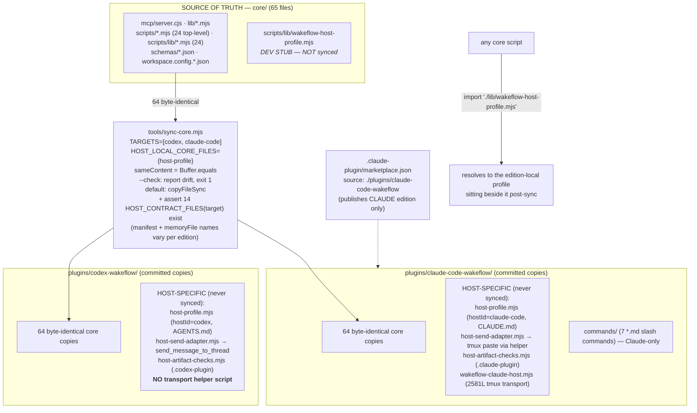
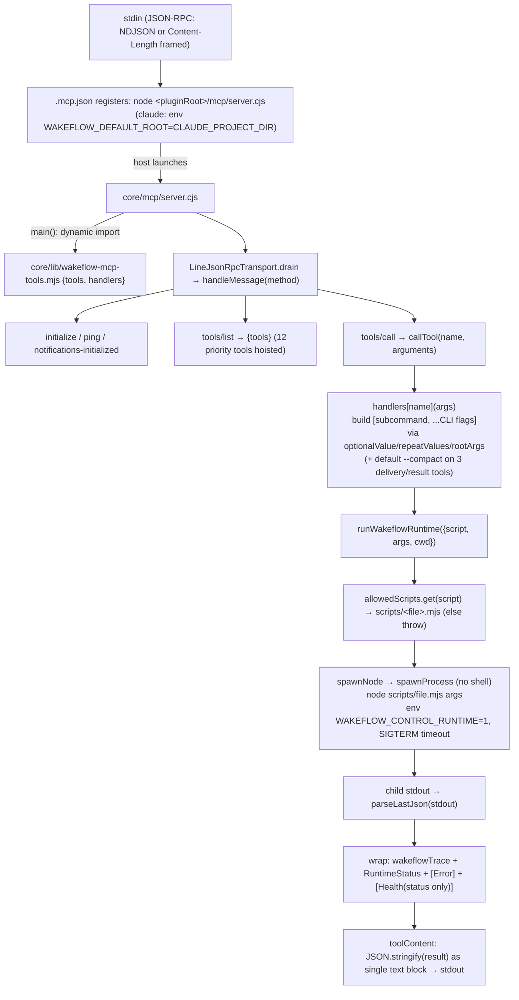
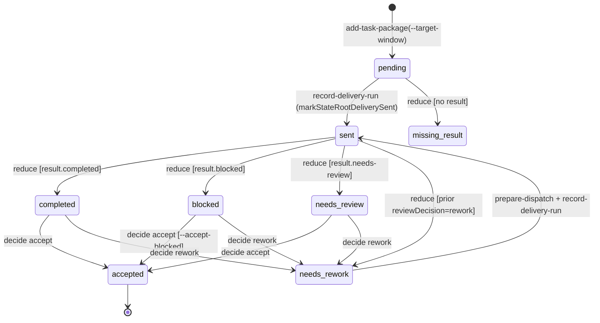
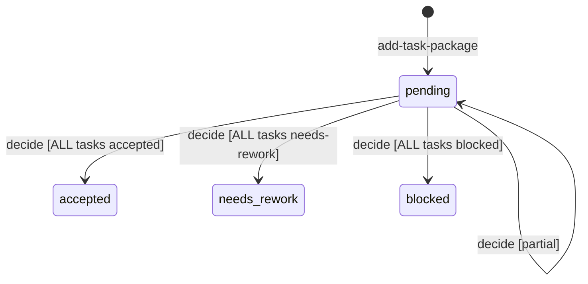
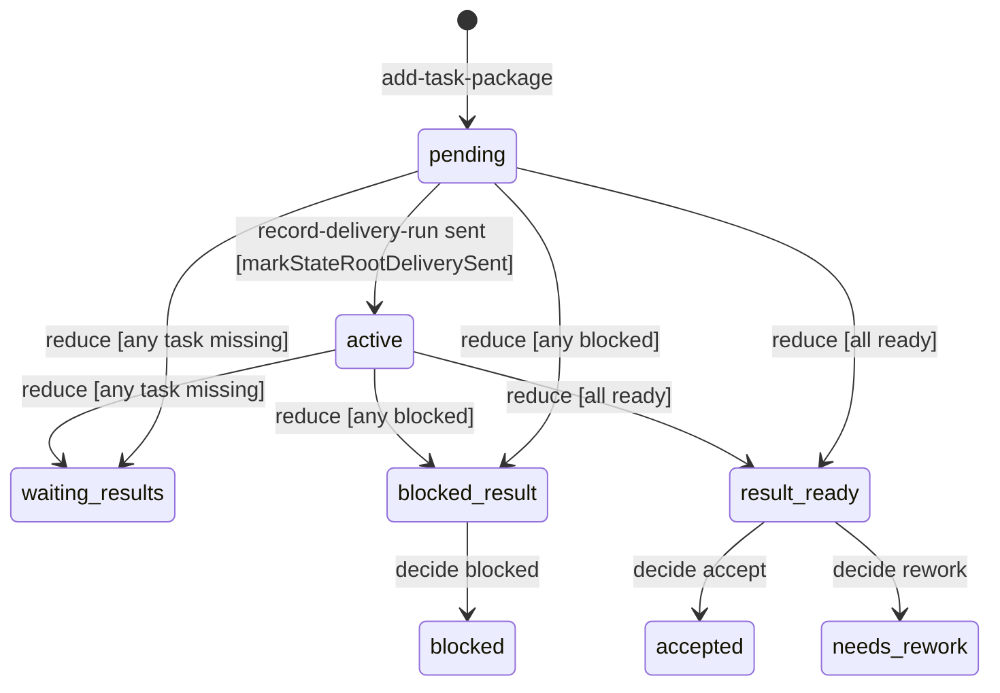
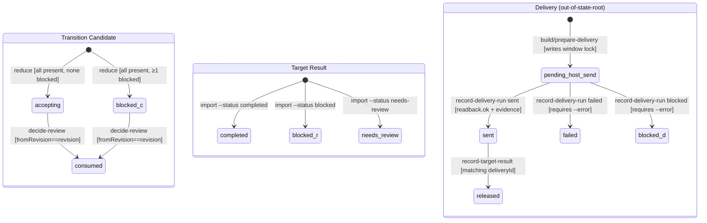
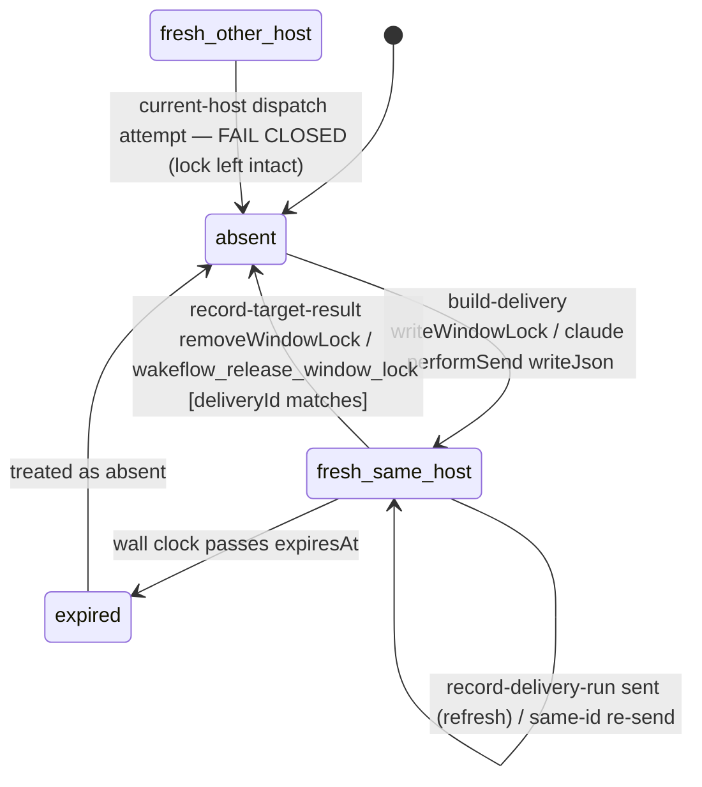
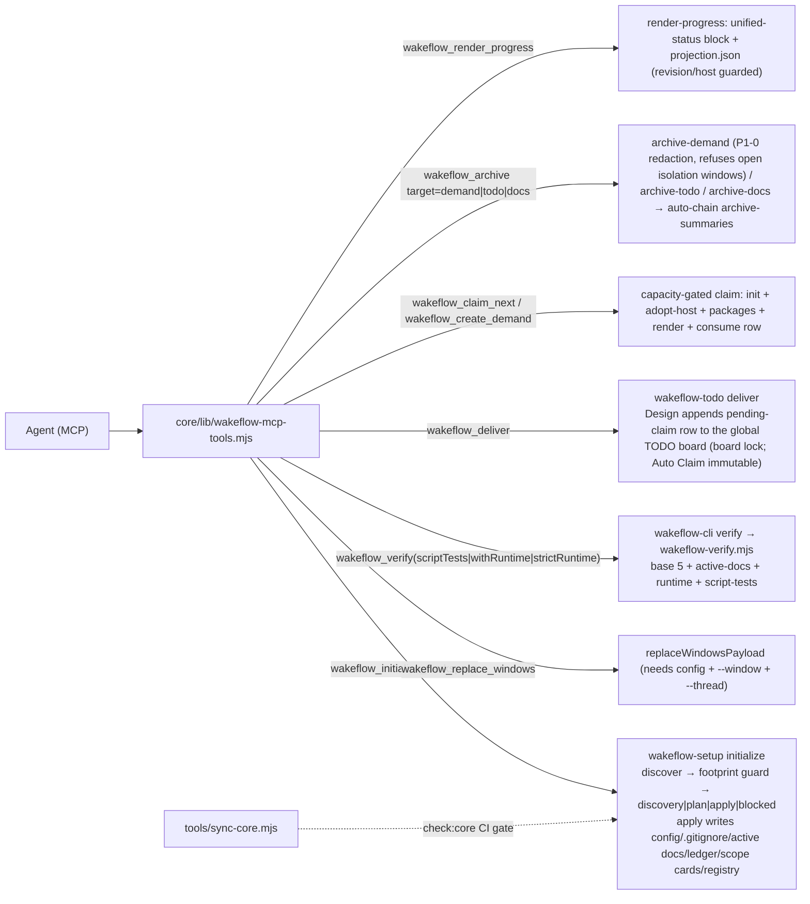

# Wakeflow：双版本架构与状态流转

> 于 2026-06-19 从 commit HEAD 处源码生成；**2026-07-02 对照 v0.7.8 修订**（state-root 文件锁、多活跃需求容量、意图对齐、隔离 worktree、需求舱、统一 create/claim/deliver、wakeflow.config.json 命名）。以代码为准。

本文档综合了对 Wakeflow 源码的七路并行子系统阅读结果。凡阅读者标记出不确定之处，均以 **待核实 / 存疑** 注记的形式呈现，而非凭猜测填充。文件引用采用 `path:line` 形式。

---

## 1. 概览

Wakeflow 是一种可复用的 **以控制器为先、多窗口智能体编排** 能力。它不是产品仓库，也不是父级工作区——它是一种控制器运行时，由宿主智能体（Claude Code 或 Codex）安装进工作区，用于跨多个智能体窗口对跨仓库工作进行规划、派发、验收与归档。

整个系统运行在同一个模型之上：

> **提示词唤醒，状态指挥。**

一份 *delivery prompt*（派发提示词）只是一个紧凑的唤醒信封，引导目标窗口走向其工作；权威的 *what/why/completion-definition*（做什么/为什么/完成定义）驻留于持久化的磁盘状态中（按需求划分的 state root、dispatch packet、delivery envelope 与 result envelope）。控制器从不在提示词中携带完整任务——它携带的是若干 id 与一次唤醒，由目标窗口去读取状态。

支撑这一切的有三根结构性支柱：

1. **一个宿主中立的内核**（`core/`），内含一个手写的 MCP server，对外暴露 23 个 `wakeflow_*` 工具，每个工具都会派生一个白名单内的 Node 脚本。
2. **一个需求状态机**（`core/scripts/wakeflow-state.mjs`），由七个写状态的 reducer（外加状态中立的结果导入与两个只读投影）驱动单一的按需求 state root，另有一条独立的传输生命周期（`core/scripts/wakeflow-delivery.mjs`），负责信封、运行记录与结果。
3. **一道宿主画像（host-profile）接缝**，让完全相同的内核运行在两种不同的传输之上——Claude Code 的 tmux 常驻会话与 Codex 的宿主线程——并且从不基于 host id 做分支。

0.7.x 起，第四根支柱为前三者加上机械保障：**机制化的并发与并行** —— 每个
state root 变更都包在 O_EXCL 文件锁里（外加 TODO 板锁 / 容量锁 / 粘贴锁）、
`maxActiveDemands` 容量门（默认 2），并且并行只存在于需求层：需求内每个仓库
严格一窗口一组合任务包，多出来的需求以隔离的需求舱运行（各自的总控 / Test /
tmux session、隔离 worktree、人工审核的合并台账）。

---

## 2. 双版本架构

### 2.1 整体形态

Wakeflow 交付 **两个自包含的 marketplace 插件产物，二者由同一份共享源码构建**：

- `core/` 持有 **65 个宿主中立的运行时文件**（MCP server、运行时库、24 个 `scripts/lib` 模块、24 个顶层脚本、JSON schema、资产与配置示例）。完整拆解为：`scripts/`=48（24 个顶层 + 24 个 `scripts/lib`）、`schemas/`=7、`lib/`=4、`mcp/`=1、`assets/`=2、3 个根文件（`LICENSE` + 2 个 `workspace.config.*.json`）。
- `plugins/codex-wakeflow/` 与 `plugins/claude-code-wakeflow/` 各自是一个 **完整的安装面**，分别提交 **这些内核文件中 64 个的纯字节级相同副本**。第 65 个——`scripts/lib/wakeflow-host-profile.mjs`——因其为宿主本地文件而被排除在同步之外。

宿主之间的接缝是 `wakeflow-host-profile.mjs`。每个内核脚本都静态导入 `./lib/wakeflow-host-profile.mjs`（一个相对同级导入），因此同步之后，每个安装面都会解析到坐落在那些相同内核副本旁边的 *它自己的* 宿主专属 profile。

强制约束是：**内核文件可以插值 `hostProfile` 的值，但绝不能基于 `hostId` 分支。** 这一点经过经验验证——`grep -rn 'hostId ===' core/` 返回 **零命中**。内核只做插值，例如 `core/lib/wakeflow-mcp-tools.mjs:29` 使用 `hostProfile.memoryFileLabel`。

### 2.2 架构图



### 2.3 文件归属表（内核同步 vs 宿主专属）

| 类别 | 文件 | 同步行为 |
|---|---|---|
| **已同步——字节级相同（64）** | `core/` 中除 `scripts/lib/wakeflow-host-profile.mjs` 以外的全部 | `Buffer.equals` 比较；`--check` 报告漂移（退出码 1），默认模式为 `copyFileSync` |
| **宿主本地——不同步（3 个 lib 文件）** | `scripts/lib/wakeflow-host-profile.mjs`、`wakeflow-host-artifact-checks.mjs`、`wakeflow-host-send-adapter.mjs` | 只有 profile 是一条显式的 `HOST_LOCAL_CORE_FILES` 排除项（`:59-61`）——它**确实**存在于 `core/scripts/lib/` 中并被跳过（`:72`）。send-adapter 与 artifact-checks **未被排除**，因为它们**根本不存在于 `core/` 中**（已确认：在那些 host-* 文件里，`core/scripts/lib/` 只持有 `wakeflow-host-profile.mjs`），所以它们从来就不是同步候选。三者均列于 `HOST_CONTRACT_FILES` 中，且仅做**存在性检查**。send-adapter 与 artifact-checks 在两个版本之间**逐字节不同** |
| **宿主契约——仅做存在性检查（每个目标 14 个）** | manifest、`.mcp.json`、memory 文件（`CLAUDE.md`/`AGENTS.md`）、README ×2、`package.json`、`scripts/README.md`、3 个 host-lib 文件、3 个 `SKILL.md`、模板 bundle | `--check` 断言每一个都 EXISTS（存在），但从不做字节比较。`HOST_CONTRACT_FILES` 是一个**关于 `target` 的函数**（`:42-57`）：`target.manifest` 与 `target.memoryFile` 解析为版本各自的文件名（`.codex-plugin/plugin.json`+`AGENTS.md` vs `.claude-plugin/plugin.json`+`CLAUDE.md`），因此存在性检查使用的是每个版本各自正确的名字 |
| **Claude 专属附加** | `scripts/lib/wakeflow-claude-host.mjs`（2581 行 tmux 传输 helper）、`commands/`（7 个斜杠命令 `.md` 文件） | 仅在 Claude 版本中交付；Codex 没有对应物 |

关键引用：

- `tools/sync-core.mjs:29-40`（`TARGETS`）、`:42-57`（`HOST_CONTRACT_FILES`）、`:59-61`（`HOST_LOCAL_CORE_FILES`）、`:63-77`（`listCoreFiles`）、`:79-82`（`sameContent` = `readFileSync(a).equals(readFileSync(b))`）、`:102-121`（sync/check 循环）、`:115-120`（存在性断言）。
- `package.json:7-10`（npm workspaces）、`:11-21`（`sync:core`/`check:core`/`test`）。
- `.claude-plugin/marketplace.json:11-16`（单一 `wakeflow` 条目，source 为 `./plugins/claude-code-wakeflow`）。

### 2.4 字节级一致同步规则

`sync-core.mjs` 用一个原始的 **`Buffer.equals`** 比较来强制一致（`:79-82`），而**不是**哈希摘要——任何单字节差异都算作漂移。

- `--check`（CI 门禁，作为 `npm test` 的第一步接入，`package.json:21`）：漂移会推入一条 `${target.dir}/${rel} drifts from core/${rel}`，缺失目录则推入一条 issue，然后设置 `process.exitCode = 1`。
- 默认（无标志）即写入模式：`mkdirSync(recursive)` + `copyFileSync`，并递增 `copied`；`--check` 是唯一的标志。
- 经验上，`node tools/sync-core.mjs --check` 返回 `{ok:true, coreFiles:64, issues:[]}`。

`TARGETS` 被硬编码，并带有每个版本各自的 manifest + memory 文件名，以便存在性检查使用正确的文件名：`{dir:'plugins/codex-wakeflow', manifest:'.codex-plugin/plugin.json', memoryFile:'AGENTS.md'}` 与 `{dir:'plugins/claude-code-wakeflow', manifest:'.claude-plugin/plugin.json', memoryFile:'CLAUDE.md'}`。

### 2.5 host-profile 契约（四道抽象接缝）

该 profile 暴露了四道接缝，内核会对其插值但绝不分支：

1. **身份 / 词汇**——`hostId`、`hostName`、`decisionOwner`、`memoryFile`/`memoryFileLabel`、`pluginManifestDir/Path`、`kinds`（宿主品牌化的磁盘记录种类）、`closedLoopContractName`、`handleId` 占位符 + 真实 id 要求。
2. **传输 / 发送**——`hostTools {createWindow, retitleWindow, sendToWindow}` 加上独立的 `wakeflow-host-send-adapter.mjs`。
3. **窗口启动**——`launch.{planFlags, workflowSteps, titleReset, entryExtras, effortByRole/thinkingByRole}`。
4. **注册 / keep-live / 残留**——`runtime.{hostDirName, legacyRegistryFallback}`、`keepLiveEnv` 变量名、`workspaceResidueChecks`。

传输接缝在**结构上发生分叉**：

- **Claude**：`hostTools` 是 2581 行的 `wakeflow-claude-host.mjs` 的子命令（`launch-window`/`retitle`/`send`，外加一步到位的 `deliver --delivery-file` 传输——它读取已备好的信封、粘贴并返回紧凑回读，取代了手动的 prompt-file + send 仪式——以及 `stream-open/close/list` + `pod-open/close/list` 跨需求隔离命令）；其分发表位于 `wakeflow-claude-host.mjs:2539-2565`（26 个子命令）。send-adapter 将信封粘贴进 tmux（`claudeTmuxResidentAdapter`，`send-adapter:24-34`），并以一个 `claude -p --resume` 无头恢复作为最后手段（`claudeHeadlessRecoveryAdapter`，`:36-46`；在二者之间做选择的 `adapterForWindowMode` 分发器是独立的 `:48-51`）。
- **Codex**：`hostTools` 是原生智能体工具 `create_thread`/`set_thread_title`/`send_message_to_thread`；其 adapter（`codexAppThreadHostAdapter`，`send-adapter:1-15`）委托给 `send_message_to_thread`——**没有 helper 脚本，没有 tmux**。

额外的版本事实：

- Claude 版本交付 `commands/`（7 个斜杠命令），且 `artifact-checks` 要求 `skills/` 与 `commands/` 同时存在（`wakeflow-host-artifact-checks.mjs:29-34`）；Codex 没有 `commands/`，转而携带一个 `.codex-plugin` 的 `interface{}` 块。
- 所有版本的 manifest 都在**五处**被版本锁定为 **0.8.15**：两个插件 manifest（`.codex-plugin/plugin.json:3`、`.claude-plugin/plugin.json:3`）、两个插件 `package.json`，以及 marketplace 的 **plugin 条目**（`.claude-plugin/marketplace.json` 的 `plugins[0].version`）。marketplace 文件还携带**第二个、不同的**版本字段——`metadata.version` 为 `1.0.0`（目录元数据，而非插件版本）——所以同一个文件有两个不同的版本字段，只有 `plugins[0]` 那个跟随 0.8.15 的锁定。根 `package.json` 保持 `0.0.0` / `private:true`（私有开发工作区）。`sync-core` **并不**强制版本一致——manifest 只做存在性检查。
- marketplace **只**发布 Claude 版本；Codex 版本的 `artifact.marketplacePath` 指向一个单独的 `.agents/plugins/marketplace.json`。
- `core/` 中的 host-profile 副本是一个 **Codex 开发桩**（`hostId codex` 但 `workspaceResidueChecks: []`），被排除在同步之外，仅在仓库开发期间从 `core/` 运行时让内核脚本的相对导入得以解析而存在。

**注：** 这是 Wakeflow 唯一的架构参考文档；根据文首声明，凡此处文字与代码相左之处，以代码为准。

> **待核实 / 存疑：** “内核不基于 `hostId` 分支”这一论断，依据是对 `core/` 中 `hostId ===` 的 grep 返回零命中；这会漏掉某些奇异的动态分发（例如把 `hostProfile.hostId` 用作对象键）。当前五处 0.8.15 版本字段彼此一致，但 `check:core` 并不会捕获版本漂移。Codex 的 `.agents/plugins/marketplace.json` 分发路径位于本仓库受跟踪树之外，未予确认。

---

## 3. MCP 工具面

### 3.1 server 如何引导与分发

MCP 面是一个 **手写的、无 SDK 依赖的 stdio JSON-RPC 2.0 server**：

- **注册 / 引导入口。** 两个版本的 `.mcp.json` 都将 server **直接**注册为 `node <pluginRoot>/mcp/server.cjs`——Claude 版本使用 `${CLAUDE_PLUGIN_ROOT}/mcp/server.cjs`，并带 `env WAKEFLOW_DEFAULT_ROOT=${CLAUDE_PROJECT_DIR}`；Codex 版本使用 `./mcp/server.cjs`，带 `cwd:'.'`。各自的 `plugin.json` 把 `mcpServers` 指向 `./.mcp.json`（`claude .claude-plugin/plugin.json:20`，`codex .codex-plugin/plugin.json:22`）。Claude 注入的 `WAKEFLOW_DEFAULT_ROOT` 正是给 §3.3 中 `defaultWorkspaceRoot` 回退链兜底的来源。
- 先前的 `core/bin/wakeflow-mcp.mjs` shim 已被移除（死能力清理）；`mcp/server.cjs` 是唯一的 MCP 入口，与 `.mcp.json` 文件所注册的完全一致。
- `core/mcp/server.cjs` 实现了完整的成帧传输（换行分隔 JSON **以及** Content-Length 成帧，外加 JSON-RPC 批量数组）、协议协商（最新 `2025-11-25`、默认 `2025-03-26`、5 个受支持版本），以及 `initialize`/`notifications/initialized`/`ping`/`tools/list`/`tools/call` 方法。
- 引导时，`main()` 动态导入 `pluginRoot/lib/wakeflow-mcp-tools.mjs` 以获取 `{tools, handlers}`，然后在 stdin/stdout 上启动 `LineJsonRpcTransport`。
- `tools/call` → `callTool(params, handlers)` → `handlers[name](args)`，后者构建一个 `[subcommand, ...flags]` 列表并调用 `runWakeflowRuntime`。其返回会被 `JSON.stringify` 成单个文本内容块。

`runWakeflowRuntime`（`core/lib/wakeflow-runtime.mjs:55-103`）将逻辑 `script` 名解析到一个 **白名单 Map**（24 个条目，`:18-43`），通过经审计的 `spawnProcess` 边界（`core/lib/wakeflow-process.mjs`）派生 `node <pluginRoot>/scripts/<file>.mjs <args>`，环境变量为 `WAKEFLOW_CONTROL_RUNTIME=1`，无 shell，`stdio ['ignore','pipe','pipe']`，并带一个 SIGTERM 超时（默认 120000ms）。它从 stdout 解析**最后一个 JSON 对象**（`parseLastJson`，容忍前导日志行），然后用 `wakeflowTrace`、`wakeflowRuntimeStatus`、可选的 `wakeflowError`（分类后的 code；`runtime-timeout` 与 `runtime-spawn-failed` 可重试；超时会在 2s 后从 SIGTERM 升级为 SIGKILL），以及——仅对 `wakeflow-cli status`——`wakeflowHealth` 来包裹结果。

进程边界被硬性锁死：`prepareWakeflowCommand`（`wakeflow-process.mjs:60-80`）拒绝 `shell`，要求字符串数组参数，并且**只**允许 `node`（屏蔽 `eval`/`require`/`loader` 标志）、`git`（白名单子命令）、恰好 `ps -axo pid,command`，以及 darwin 上的 `caffeinate`。其他任何东西都会抛出 `Unsupported Wakeflow process command`。

`prioritizeHostVisibleTools`（`wakeflow-mcp-tools.mjs:541-554`）会把 12 个具名工具提到 `tools/list` 的前部，因为某些 Codex 宿主只呈现 MCP 工具的早期前缀——只是排序，不是可用性。

### 3.2 引导 / 分发图



### 3.3 工具 → 脚本 → 命令映射

共有 **23 个工具定义与 23 个匹配的 handler 键**。`wakeflow_verify` 本身就是这 23 个 `toolDefinitions` 条目之一（`wakeflow-mcp-tools.mjs:525`，位于 `:26` 处打开、并在 `:557` 处供给 `tools = prioritizeHostVisibleTools(toolDefinitions)` 的那个数组内）——它**不是**单独添加的，所以计数是平的 23，而非“22 + verify”。handler 键跨越 `wakeflow-mcp-tools.mjs:573-1039`。所有 handler 都始终追加 `--json`。只有那三个 delivery/result 工具（四条命令路径）接受 `verbose` 并默认为 `--compact`（见 §3.4）。

| MCP 工具 | 脚本(逻辑名) | 子命令 + 关键标志 |
|---|---|---|
| `wakeflow_initialize_workspace` | `wakeflow-setup` | `initialize` — `--root`，可选 `--parent`/`--workspace-name`/`--controller-window`/`--design-window`/`--test-window`/`--language`，布尔项 `--reset-initialization`/`--use-discovered`/`--internal-design`/`--internal-test`/`--include-real-project`，`--repo win=path`（+`--role`），可重复的 `--exclude-window`，`apply`→`--write` |
| `wakeflow_replace_windows` | `wakeflow-setup` | `window`→`replace-window`（`--window`）；否则 `replace-windows`（来自 `windows` 的可重复 `--window`）；只读 plan |
| `wakeflow_adopt_demand_host` | `wakeflow-state` | `adopt-demand-host` — `--state-root`，可选 `--reason`，`apply`→`--write` |
| `wakeflow_render_progress` | `wakeflow-render-progress` | （无子命令）`--state-root`，`--root`，`apply`→`--write` |
| `wakeflow_release_window_lock` | `wakeflow-delivery` | `release-window-lock`（`--window`，`apply`→`--write`） |
| `wakeflow_status` | `wakeflow-cli` | `status --root <root> --json`（扇出，见 §3.5） |
| `wakeflow_create_demand` | `wakeflow-demand-sequence` | `create-demand` — `--todo-id` 或 `--demand-key`+`--title`，可选 `--controller-window`/`--goal`/`--completion-definition`/`--stage-plan`/`--task-packages <json>`，`apply`→`--write`；init state root、adopt 宿主、添加 package、渲染并消费该 TODO 行 |
| `wakeflow_claim_next` | `wakeflow-demand-sequence` | `claim-todo` — 可选 `--design-key`/`--controller-window`，`apply`→`--write`；无人值守地自动认领唯一一条 Auto Claim=yes 的合格行；在 `maxActiveDemands` 容量门下委托给 create-demand |
| `wakeflow_add_task` | `wakeflow-state` | `add-task-package` — `--state-root`，`--task-package-id`，`--summary`，`--target-window`，`--target-task-id`，可选 `--target-summary`/`--source-ref`/`--design-intent`，`adoptHost`→`--adopt-host`，`--write` |
| `wakeflow_prepare_delivery` | `wakeflow-delivery` | `direction=controller-return` → `build-controller-return`；`direction=target`（默认）→ `prepare-dispatch-from-state`（追加 `--objective`/`--task-package-id`/`--controller-window`——回程路由链：标志 > 打戳的 state.controllerWindow > 工作区配置——以及 `--return-policy`）；除非 `verbose`，否则 `--compact` |
| `wakeflow_record_delivery` | `wakeflow-delivery` | `record-delivery-run` — `--delivery-file`,`--status`，可选 `--evidence`/`--error`/`--host-method`/`--host-mode`，`--readback-ok <bool>`，可选 `--delivery-run-id`，除非 `verbose`，否则 `--compact` |
| `wakeflow_record_target_result` | `wakeflow-state` | `import-target-result` — `--state-root`,`--target-task-id`,`--target-window`,`--status`，可选 `--result-id`/`--summary`，可重复的 `--evidence-ref`/`--verification`/`--risk`，除非 `verbose`，否则 `--compact` |
| `wakeflow_review_pack` | `wakeflow-delivery` | `review-pack` — 可选 `--state-root`/`--group`/`--task-id`；只读 |
| `wakeflow_view` | `wakeflow-state` / `wakeflow-delivery` | 按 `scope`：`task-ledger`→`wakeflow-delivery task-ledger`（`--task-id`/`--target-window`）；`window`→`wakeflow-state window-view`（`--window`）；`focus`→`wakeflow-state focus-doc`（`--window`/`--phase`，`apply`→`--write`）；`trace`→`wakeflow-delivery trace-spine`（`--group`/`--target-window`/`--task-id`/`--result-file`/`--result-id`/`--delivery-file`/`--delivery-id`）；除 focus+apply 外只读 |
| `wakeflow_reduce_results` | `wakeflow-state` | `reduce-results` — `--state-root`，`apply`→`--write`，`adoptHost`→`--adopt-host` |
| `wakeflow_decide_review` | `wakeflow-state` | `decide-review` — `--state-root`,`--candidate-id`,`--decision`,`--reason`，可重复的 `--evidence-ref`，`acceptBlocked`→`--accept-blocked`，`apply`→`--write`，`adoptHost`→`--adopt-host` |
| `wakeflow_complete_demand` | `wakeflow-state` | `complete-demand` — `--state-root`,`--reason`，可重复的 `--evidence-ref`，`apply`→`--write`，`adoptHost`→`--adopt-host` |
| `wakeflow_continue_demand` | `wakeflow-state` | `continue-demand` —— 仅限已完成但未归档；传入 `--continuation-type`,`--reason`、可重复的 `--evidence-ref` 与首个任务包/目标字段；一次加锁写入中保留原完成记录、回到 planned 并追加任务包；归档根拒绝 |
| `wakeflow_deliver` | `wakeflow-todo` | `deliver` — `--type`,`--design-key`,`--title`，可选 `--item`/`--priority`/`--original-plan`/`--requirement-design`/`--dependency`，`autoClaim`→`--auto-claim`，`apply`→`--apply`；Design 在全局 TODO 板上的仅追加 `pending-claim` 行（板锁；`autoClaim` 不可变） |
| `wakeflow_prune_runtime` | `wakeflow-delivery` | `prune-runtime` — 可选 `--before`，`apply`→`--write`；可安全重放的传输层 GC（target-results 永不删除） |
| `wakeflow_intake_test_card` | `wakeflow-intake` | `test-card` — `--state-root`,`--test-id`,`--target-window`,`--question`,`--object-boundary`，可重复的 self-check/scenario/success/failure/cannot-conclude/stop-condition，可选 `--source-ref`，可重复的 evidence/allowed/forbidden operation，`apply`→`--write` |
| `wakeflow_next_work` | `wakeflow-next-work` | （无子命令）`--root`，可选 `--id`/`--source`/`--limit`，`afterCompletion`→`--after-completion`，`apply`→`--write` |
| `wakeflow_archive` | `wakeflow-state` / `wakeflow-archive-todo` / `wakeflow-archive-docs` | 按 `target`：`demand`→`wakeflow-state archive-demand`（`--state-root`/`--reason`，`redact`→`--redact`，可重复的 `--evidence-ref`，`apply`→`--write`）；`todo`→`wakeflow-archive-todo`（可选 `--month`/`--date`/`--keep-completed`/`--keep-sync`，`apply`→`--apply`）；`docs`→`wakeflow-archive-docs`（可选 `--topic`/`--month`，可重复的 `--file`，`keepIndexRows`/`pruneIndexOnly`，`apply`→`--apply`）；todo/docs 异步——当 `refreshSummaries && ok` 时链式调用 `wakeflow-archive-summaries` |
| `wakeflow_sanitize_archive` | `wakeflow-state` | `sanitize-archive` —— 只接受 configured `workspace/archive/` 下已有的 state root，要求 `state=archived` 和 `archive-manifest.json`；dry-run 分类报告真实 ID／工作区绝对路径／home 绝对路径；apply 用复扫通过的可移植副本原位替换，追加 `archive.sanitized`，并把原件移到本地 `preserved/`；绝不重开需求 |
| `wakeflow_verify` | `wakeflow-cli` | `verify --root <root> [--script-tests] [--with-runtime | --strict-runtime] --json`；带 script-tests/with-runtime/strict-runtime 任意其一时超时 180000ms，否则 120000ms |

参数→标志的翻译由四个 helper 机械完成（`wakeflow-mcp-tools.mjs:1061-1117`）：`optionalValue(flag,value)`（对 `undefined`/`null`/`''` 返回空）、`repeatValues`（重复标志）、裸布尔内联，以及 `rootArgs` = `optionalValue('--root', args.root ?? defaultWorkspaceRoot())`。`defaultWorkspaceRoot` 回退到 `WAKEFLOW_DEFAULT_ROOT` / `CLAUDE_PROJECT_DIR` 中第一个存在的绝对路径，随后向上行走（≤64 层）到最近一个携带 `wakeflow.config.json` 的祖先目录——因此非控制器窗口的 MCP server 解析到的是工作区本身，而非它自己的仓库目录（仅在 init 之前才原样保留注入的目录）。

### 3.4 紧凑 vs 详细

默认紧凑**仅**适用于 `wakeflow_prepare_delivery`（两个方向）、`wakeflow_record_delivery` 与 `wakeflow_record_target_result`；当 `verbose` 为假时它们都追加 `--compact`。紧凑会把完整的结构化负载（envelope/packet/run/result 回显）替换为 `{compact:true, ...ids, prompt}`，因为无论如何完整产物都已写入磁盘——代码中将其描述为“控制器最大的单一上下文消耗者（每次派发 60-70KB）”。

逐命令而言，紧凑保留以下内容（且完整文件始终会落盘）：

- `build-delivery` → `{ok,command,wrote,compact,deliveryId,targetWindow,taskId,dispatchGroup,returnRoute,prompt,deliveryFile,threadReady,windowLockWarning}`。
- `prepare-dispatch-from-state` → `{compact,deliveryId,dispatchGroup,prompt}` + `packetFile`/`deliveryFile` 路径（丢弃 windowConfig/packet/envelope；省略 forbiddenConclusions）。
- `build-controller-return` → `{compact,deliveryId,controllerWindow,dispatchGroup,prompt}`。
- `record-delivery-run` → `{compact,deliveryRunId,deliveryId,targetWindow}`。
- `import-target-result` → `{compact,resultId,status,dispatchGroup,targetWindow,taskId}`。

### 3.5 特殊分发情形

- `wakeflow_status` / `wakeflow_verify` 经由 `core/scripts/wakeflow-cli.mjs` 路由。`status` 扇出到**两个**脚本——`wakeflow-repo-status.mjs`（`repoStatus`）与 `wakeflow-delivery.mjs status`（`closedLoopStatus`）——然后 `runStatusJson` 发出 `{ok, command:'status', checks:[...]}`；`buildWakeflowHealth` 仅对这种情形添加汇总。
- 归档工具是异步的，并且当 `refreshSummaries && result.ok` 时，链式发起对 `wakeflow-archive-summaries` 的第二次 spawn，返回 `{ok, archive, summaries}`。
- 派发门控：当 `state.controllerHost` 已设置且不同于 `hostProfile.runtime.hostDirName` 时，`prepare-dispatch-from-state` 会失败关闭（fail closed），指示调用方从持有该需求的控制器派发，或运行 `adopt-demand-host` / `wakeflow_adopt_demand_host`（`wakeflow-dispatch-commands.mjs:372-373`；信封构建时还有一道 owner 检查位于 `:212-213`）。

> **待核实 / 存疑：** `wakeflow-setup`/`wakeflow-intake`/`wakeflow-next-work`/归档脚本的完整非紧凑负载形态未逐行阅读。`core/` 的 host-profile 是 Codex 开发桩，所以本源码中的工具描述说的是 `Codex`/`AGENTS`/`create_thread`；真实的 Claude 安装会呈现 Claude 的对应物。`wakeflow-cli.mjs` 暴露了更多子命令（sync、intake、install、loop、sequence、runtime、scripts、next-work），它们可经 CLI 触达，但**未**接入任何 MCP 工具。独立的 `core/scripts/wakeflow-runtime.mjs` CLI 是一个不在 MCP 路径上的单独开发入口。（宿主注册/启动现已追踪——见 §3.1：两个版本的 `.mcp.json` 都直接注册 `node <pluginRoot>/mcp/server.cjs`，而非 bin shim。）

---

## 4. 端到端生命周期

控制器循环横跨两个 CLI 脚本加上薄薄一层 MCP 代理。状态机生命周期驻留于 `core/scripts/wakeflow-state.mjs`（写入持久化的 state root）；传输生命周期驻留于 `core/scripts/wakeflow-delivery.mjs` 及其库（写入 `.wakeflow-local/wakeflow-delivery` 下被忽略的本地运行时）。

**在派发期间推进持久化状态的唯一一点是 `record-delivery-run`** → `markStateRootDeliverySent`，它把目标任务翻转为 `status=sent`、把需求翻转为 `state=dispatched`（`wakeflow-result-recording-commands.mjs:86-232`）。`prepare-dispatch-from-state` **仅**写入本地运行时（packet/group/envelope/lock），从不触碰 `wakeflow-state.json`。

> **词汇注记：** reducer 源码写入九个需求状态（`intake`、`planned`、`dispatched`、`waiting-results`、`review-ready`、`needs-rework`、`blocked`、`completed`、`archived`），其中 `dispatched` 是 `markStateRootDeliverySent` 中由传输驱动的写入，随后由 `reduce-results` 解析为 `waiting-results`/`review-ready`。另外两个 enum 值（`accepting`、`paused`）为保留值，并非 reducer 写入。对账见 §5.1。

### 4.1 生命周期时序图

```mermaid
sequenceDiagram
    participant U as User/Controller
    participant NW as next_work (scan)
    participant ST as wakeflow-state.mjs (durable state root)
    participant DL as wakeflow-delivery.mjs (local runtime)
    participant H as Host send (claude tmux / codex thread)
    participant TW as Target window

    U->>NW: next_work (eligibility scan, no write)
    NW-->>U: ranked TODO candidates / autoClaimable + activeDemands & demandCapacity dashboard (at-capacity = warning; own-state-root rows lifecycle-blocked)
    U->>ST: claim_next (claim-todo: auto-claim the single Auto Claim=yes eligible row, or explicit designKey) ⇒ delegates to create_demand
    U->>ST: create_demand [--todo-id] ⇒ init (intake, rev1, controllerWindow stamped) + adopt-demand-host (claims controllerHost) + add-task-package(s) (planned, task=pending) + render + consume TODO row
    Note over U,ST: manual wakeflow_add_task still first-claims controllerHost on an unclaimed demand; packages may carry designIntent
    Note over U,DL: review_pack --state-root is read-only orientation
    U->>DL: prepare_delivery direction=target (prepare-dispatch-from-state)
    DL->>DL: eligibility gate + write packet/group/envelope + ACQUIRE window lock (TTL 7200s)
    DL-->>U: envelope.prompt (NO state change)
    U->>H: host send (paste prompt into tmux pane / send_message_to_thread)
    H-->>U: readback evidence (paneTail / thread reply)
    U->>DL: record_delivery status=sent (needs readback.ok + evidence)
    DL->>ST: markStateRootDeliverySent ⇒ task=sent, state=dispatched, refresh lock
    Note over TW: target executes its dispatch packet
    TW-->>U: TargetResultEnvelope (completed|blocked|needs-review)
    U->>ST: record_target_result (import-target-result) ⇒ write result, RELEASE lock, revision UNCHANGED
    alt returnRoute=controller
        U->>DL: review_pack --group (callbackPlan: ready-to-build)
        U->>DL: prepare_delivery direction=controller-return (readiness + duplicate guards)
        U->>H: host send controller-return prompt
        U->>DL: record_delivery (ControllerReturnEnvelope run ⇒ sent)
    end
    U->>ST: reduce_results (reduce-results)
    alt all open results present
        ST-->>U: transition-candidate, state=review-ready, allow decide-review
        U->>ST: decide_review (accept|rework|blocked|redesign)
        alt accept
            ST-->>U: tasks=accepted, state=planned, allow complete-demand
        else rework
            ST-->>U: tasks=needs-rework, reworkCount++ ⇒ loop back to prepare_delivery
        else redesign
            ST-->>U: tasks=needs-rework, redesignCount++ ⇒ route to DESIGN (outcome redesign, not a re-dispatch)
        else blocked
            ST-->>U: state=blocked + review-blocker (WEDGE; fresh result re-opens)
        end
    else missing results
        ST-->>U: state=waiting-results (no candidate)
    end
    U->>ST: complete_demand (all accepted + no blockers + ≥1 evidence-ref)
    ST-->>U: state=completed, review=demand-completed
```

### 4.2 各步骤的守卫

| 步骤 | 守卫 |
|---|---|
| `init` | 拒绝写入插件目录（`assertWorkspaceRootResolved`）；state root 必须位于 workspace/ledger 内部；`controllerHost=null`；打戳 `controllerWindow`；在活跃需求容量已满时拒绝（`maxActiveDemands`，默认 2，处于工作区级 `.capacity-lock` 之下）；拒绝对既有 state root 重新 init |
| `add-task-package` | 在 `completed`/`archived`/`paused` 时拒绝，在 `review-ready`/`accepting`/`waiting-results`（“先 reduce 或 decide”）时拒绝，在 `blocked` 或存在任何 blocker 时拒绝；rework 通道打开期间拒绝普通新工作（新工作以 `reviewRoute=rework` 加入该通道）；可选 `--design-intent`；**第一条驱动命令认领 `controllerHost`** |
| `prepare-dispatch-from-state` | 需求-宿主归属门；资格条件：需求未 completed/archived/paused/blocked/review-ready/accepting，目标任务处于 `pending`/`needs-rework`/`missing-result`，package 处于 `pending`/`needs-rework`；rework 优先：rework 目标尚未关闭期间不派发非 rework 目标；获取跨宿主窗口锁（遇到他宿主的新鲜锁则失败关闭） |
| host send | （Claude）目标窗口必须存活；按窗口的派发锁；（Codex）控制器直接调用原生宿主工具 |
| `record-delivery-run status=sent` | 要求 `--readback-ok true` **且** 非空 `--evidence`；`markStateRootDeliverySent` 推进状态；刷新锁 |
| `import-target-result` | 若目标任务已 `accepted` 则拒绝；默认 id 冲突时以时间戳自动消歧（rework）；**不**改动控制器状态（`stateRevisionUnchanged`）；释放与所应答派发相匹配的锁 |
| `reduce-results` | 在 `completed`/`archived` 时拒绝；零打开任务时拒绝；任何路径形态的 evidence ref 缺失时硬失败（`evidence-repair-required`）（ref 依次按 state root → 产出窗口的仓库 → 工作区根解析）；只 reduce 控制器评审范围（rework 通道打开期间 rework 通道任务优先——仍缺失的 rework 结果解析为 `needs-rework`，而非 `waiting-results`）；仅当范围内无任何缺失时才创建一个转换候选 |
| `decide-review accept` | 候选 `fromRevision == revision`；`demandKey` 匹配；若候选有 `blockedResultIds` 则需 `--accept-blocked`；清除 review-blocker |
| controller-return | 四条就绪阻塞原因 + 重复返回守卫（见 §5） |
| `complete-demand` | 每个 package **且** 目标任务均 `accepted`；零 blocker；≥1 个 `--evidence-ref` |

### 4.3 两道关键安全守卫

**需求永不会自动变为 “blocked”——但一个 ready+blocked 混合的候选确实会浮现为 “blocked”。** 这纠正了此前误以为的（反向的）安全特性。review-pack、dispatch-group 快照与转换候选 **三者，只要有任何一个结果是 blocked，无论有多少 ready 结果共存，都会浮现 `blocked`**：默认（group-ready / state-root）评审分支计算 `blocked.length > 0 ? "blocked" : "needs-controller-review"`，**没有** ready 计数守卫（`wakeflow-review-commands.mjs:487-493`，在 `buildStateRootReviewPack` 中；`:697-699`，在 group-ready 分支中；state-root 评审包还携带额外的终态决策——`completed`、`no-target-tasks`、`ready-to-complete-demand`）；`buildGroupSnapshot.groupStatus` 同样在 `blocked.length>0` 时为 `blocked`，与 `ready.length` 无关（`wakeflow-dispatch-group-review.mjs:103-104`）；并且只要 `blockedResultIds.length>0`，`reduce-results` 就把 `candidateState='blocked'`（`wakeflow-state.mjs:1045`）。这种混合**仅**在**按目标**的 return-policy 分支中被重新解析为 `needs-controller-review`，唯独该分支带有 `blocked.length>0 && ready.length===0` 守卫（`wakeflow-review-commands.mjs:603-605`）。真正的安全特性是另一回事：需求永不会自动转换到 `blocked`——`decide-review blocked` 是一次**显式的控制器决策**，而恢复取决于评审范围（§5.1）。在操作上，控制器被建议（由 MEMORY 规则建议，**而非**由代码强制）永不在混合候选上**选择** `blocked`，恰恰因为这套机制并不会阻止它。

**`record_target_result` 对已 sent 的任务允许，但对 accepted/completed 阻止。** 一个 `sent`/`needs-review`/`blocked` 的任务仍可接收新结果（rework 循环）；只有 `accepted` 拒绝再次导入（`wakeflow-state.mjs:832-834`）。

**`markStateRootDeliverySent`（即派发期 `record-delivery-run` 的推进）在重放时幂等，但在派发冲突时失败。** 如果目标任务已处于 `sent` 且 `deliveryId` **相同**，命令会提前返回 `{updated:false, reason:'target-task-already-sent', idempotentReplay:true}`（一次无操作重放）；如果它已处于 `sent` 但 `deliveryId` **不同**，则**失败关闭**（`refusing conflicting delivery …`）（`wakeflow-result-recording-commands.mjs:114-128`）。它还在任何写入前重新检查需求-宿主归属（`:101-103`）。

> **待核实 / 存疑：** 存在两个 `record-target-result` 实现——delivery-script 命令与 state-script 的 `import-target-result`。MCP 工具 `wakeflow_record_target_result` 映射到 **state-script** 的 `import-target-result`（`wakeflow-mcp-tools.mjs:757-758`），所以 delivery-script 变体不在 MCP 路径上；其现役角色不确定（CLI/遗留）。`decide-review accept` 路由到 `planned`（不直接到 `completed`），所以总是还需要第二次显式的 `complete-demand`。

---

## 5. 状态机

Wakeflow 有 **两套不共享 enum 的、彼此独立的状态词汇**：

1. **需求** 状态机（`core/scripts/wakeflow-state.mjs`），由十个子命令驱动按需求 state root：七个写状态的 reducer（init、add-task-package、reduce-results、decide-review、complete-demand、archive-demand、adopt-demand-host）、状态中立的 import-target-result，以及只读的 `window-view`/`focus-doc` 投影（以 `wakeflow_view` 的 `window`/`focus` scope 呈现）。
2. 一套 **独立的窗口/运行时状态词汇**（`core/scripts/lib/wakeflow-status-machine.mjs`，17 个值），仅供 next-work/archive/docs-verify 投影使用——**不**供需求 reducer 使用。

此外还有 **第三个** 命名空间：在 `wakeflow-state.mjs` 中构建的内联 `state-root window.windowState` 字符串，无任何 schema 背书。三个彼此不同的状态命名空间是一处需要标记的真实复杂性。

### 5.1 需求状态（`wakeflow-state.json .state`）

schema enum（`wakeflow-state.schema.json:32-44`）列出 **11** 个值（`intake`、`planned`、`dispatched`、`waiting-results`、`review-ready`、`accepting`、`needs-rework`、`blocked`、`paused`、`completed`、`archived`）。reducer 写入其中九个：`intake`、`planned`、`waiting-results`、`review-ready`、`needs-rework`、`blocked`、`completed`、`archived`，外加 `markStateRootDeliverySent` 中由传输驱动的 `dispatched` 写入。其余两个为**保留值**，并非 reducer 写入：`accepting` 是转换候选的 `candidateState`（结果就绪可接受时的提案状态），同时出现在读取守卫中；`paused` 是由 intake/dispatch/add-task 守卫识别的、手动设置的“closed”状态。早先的残迹值（`idle`、`designing`、`needs-confirmation`、`dispatching`）已从 schema 中移除。**以代码为准**；schema 测试 `wakeflow-state-schema.test.mjs` 锁定此 enum。

```mermaid
stateDiagram-v2
  [*] --> intake : init
  intake --> planned : add-task-package
  needs_rework --> planned : add-task-package
  planned --> planned : add-task-package
  planned --> dispatched : record-delivery-run sent
  dispatched --> waiting_results : reduce-results [missing results]
  dispatched --> review_ready : reduce-results [all present → candidate]
  planned --> waiting_results : reduce-results [missing results]
  planned --> review_ready : reduce-results [all present → candidate]
  waiting_results --> waiting_results : reduce-results [still missing]
  waiting_results --> review_ready : reduce-results [all present]
  review_ready --> planned : decide-review accept [candidate fresh; --accept-blocked if blocked]
  review_ready --> needs_rework : decide-review rework
  review_ready --> blocked : decide-review blocked [appends review-blocker → WEDGE]
  blocked --> review_ready : import-target-result(fresh) + reduce-results
  blocked --> planned : decide-review accept|rework [unblock; clears review-blockers]
  planned --> completed : complete-demand [all accepted, no blockers, evidence-ref]
  completed --> [*]
  note right of blocked
    WEDGE: add-task-package and complete-demand
    both refuse while blocked/blockers exist.
    Recovery = fresh result → reduce → accept/rework.
  end note
```

| 起态 | 终态 | 触发 | 守卫 |
|---|---|---|---|
| （无） | intake | init | 不在插件目录内；root 位于 workspace/ledger 内部；`controllerHost=null` |
| intake | planned | add-task-package | 非 completed/archived/paused；非 review-ready/accepting/waiting-results；非 blocked/无 blocker；首次驱动认领 |
| needs-rework | planned | add-task-package | 同样的门；`nextMainState` 把 intake\|needs-rework 提升为 planned |
| planned | dispatched | record-delivery-run sent | `markStateRootDeliverySent`；信封匹配一个打开的目标任务 |
| planned/dispatched | waiting-results | reduce-results | ≥1 个打开的目标任务缺少最新结果 |
| planned/dispatched | review-ready | reduce-results | 每个打开的目标任务都有最新结果（创建候选） |
| waiting-results | review-ready | reduce-results | 现在所有结果均已就位 |
| review-ready | planned | decide-review accept | 候选新鲜；demandKey 匹配；若 blocked 则 `--accept-blocked`；清除 review-blocker |
| review-ready | needs-rework | decide-review rework | 候选未陈旧；清除 review-blocker |
| review-ready | blocked | decide-review blocked | 候选未陈旧；追加 review-blocker → **WEDGE** |
| blocked | review-ready | import-target-result + reduce-results | blocked 期间允许导入；评审范围使尚未终结的 blocked 任务保持可评审 |
| blocked | planned/needs-rework | decide-review accept\|rework | 此决策**即是**解除阻塞；清除 review-blocker |
| planned | completed | complete-demand | 所有 package + 任务均 accepted；零 blocker；≥1 evidence-ref |
| 任何非 completed | （同状态，重新打戳） | adopt-demand-host / `--adopt-host` | 转移 `controllerHost`；提升 revision；使未决候选失效 |

**blocked 楔块（核心安全坑）。** `decide-review blocked` 设置 `state.state='blocked'`，将候选任务标记为 `blocked`，并追加一条 review-blocker。这会把需求楔住：`add-task-package` 在 blocked 或存在 blocker 时拒绝；`complete-demand` 在存在 blocker 或有非 accepted 任务时拒绝。恢复方式设计于 `wakeflow-review-scope.mjs:1-8`：只有 `accepted`/`reviewDecision=accept` 才算终结，所以一个 blocked-但-未-accepted 的任务仍留在 `controllerReviewScope.reviewableTargetTasks` 中。控制器导入一个**新鲜**结果（blocked 期间允许），重新 reduce（把仍打开的任务重新纳入 → 新候选），随后 `decide-review accept|rework` 清除 review-blocker。若没有评审范围保持 blocked 任务可评审，需求将被永久楔住。

### 5.2 目标任务（`state.targetTasks[].status`）



**decide-review 一次性把 `nextTaskStatus` 施加到整个候选范围。** 单次 `decide-review` 会把**同一个** `nextTaskStatus`（`accept→accepted` / `rework→needs-rework` / `blocked→blocked`）打戳到候选的 `controllerReviewScope` 中的**每一个**任务上，而非按各自先前状态分别处理（`wakeflow-state.mjs:1209-1220`）。所以一次 `accept --accept-blocked` 决策会把一个混合状态集（例如一个 `blocked` 任务与一个 `completed` 任务）**全部**扫为 `accepted`，而一次 `rework` 决策会把一个 `blocked` 任务移到 `needs-rework`（`blocked → needs-rework`）。这正是 blocked 楔块如何在一次决策中被清除的方式（见 §5.1）。

| 起态 | 终态 | 触发 | 守卫 |
|---|---|---|---|
| （无） | pending | add-task-package `--target-window` | 给定 `--target-window` 时需要 `--target-task-id` |
| pending | sent | record-delivery-run | 派发 `readback.ok` |
| pending/sent | missing-result | reduce-results | 无最新结果 |
| sent | completed\|blocked\|needs-review | reduce-results | 当先前 `reviewDecision != rework` 时，由最新 `result.status` 映射而来 |
| sent | needs-rework | reduce-results | `task.reviewDecision === 'rework'` 覆盖结果状态 |
| needs-rework/missing-result | sent | prepare-dispatch + record-delivery-run | 资格条件允许 pending/needs-rework/missing-result |
| completed\|blocked\|needs-review（候选范围内任意） | accepted | decide accept | `decide-review` 把 `nextTaskStatus=accepted` 打戳到**整个**候选范围（`state.mjs:1209-1220`）；尚未终结；若范围内任意任务为 blocked 则需 `--accept-blocked` |
| completed\|blocked\|needs-review（候选范围内任意） | needs-rework | decide rework | 把 `nextTaskStatus=needs-rework` + `reviewDecision=rework` 打戳到**整个**候选范围（所以范围内的 `blocked` 任务也会移到 `needs-rework`） |
| accepted | （拒绝再次导入） | import-target-result | 已 accepted 的任务拒绝新结果 → 创建后续 package |

### 5.3 任务包（`state.taskPackages[].status`）



一个 package 仅当其**所有**目标任务都达到某状态时才推进到 `nextTaskStatus`（`updatePackageStatusesForDecision`）；否则保持不变。`complete-demand` 要求每个 package 与目标任务均为 `accepted`。

### 5.4 state-root 窗口（`state.windows[].windowState`）

内联词汇（无 schema）：`pending` → 在派发已发送时变 `active`（`markStateRootDeliverySent` 为已派发任务所属窗口设置 `windowState='active'`，`wakeflow-result-recording-commands.mjs:161`）→ 在 reduce 时变 `waiting-results`（任意任务缺失）/ `blocked-result`（任意 blocked）/ `result-ready`（全部就绪）→ 在 decide 时，对持有候选任务的窗口变 `accepted`/`needs-rework`/`blocked`。



### 5.5 转换候选、目标结果、派发



| 实体 | 起态 | 终态 | 触发 | 守卫 |
|---|---|---|---|---|
| 转换候选 | （无） | accepting | reduce-results | 全部就位、无 blocked；`allowedDecisions=[accept,rework,blocked,redesign]`；`fromRevision=new revision` |
| | （无） | blocked | reduce-results | 全部就位、≥1 blocked |
| | accepting\|blocked | （consumed/陈旧） | decide-review | 若 `fromRevision != current revision` 则失败 |
| 目标结果 | （无） | completed\|blocked\|needs-review | import-target-result `--status` | 任务存在且属于该窗口；尚未 accepted；需求未 completed/archived；revision 不变 |
| 派发运行 | （无） | pending-host-send | build/prepare-delivery | 写入窗口锁（TTL 7200s） |
| | pending-host-send | sent | record-delivery-run `--status sent` | 需要 `readback.ok` |
| | pending-host-send | failed\|blocked | record-delivery-run failed\|blocked | failed **与** blocked **二者都**需要 `--error`（`status !== "sent" && !error.trim()` 则失败，`result-recording-commands.mjs:248-249`） |
| | sent | （锁已释放） | record-target-result / import-target-result | 当结果应答持锁的 `deliveryId` 时释放锁 |

### 5.6 派发组、controller-return、return policy

- **派发组状态**（`buildGroupSnapshot.groupStatus`）：`waiting`、`pending-dispatch`、`partially-ready`、`ready`、`blocked`。
- **组的 controller-return 派发状态**：`not-applicable` → `not-built` → `pending-host-send` → `sent`（阻止重复返回）。
- **return policy**（`DispatchGroup.returnPolicy.mode`）：`group-ready` | `per-target`。代码中**没有显式的 mode 不可变守卫**；强制是基于非覆盖的：一个既有的 dispatch-group 记录会被**复用而不被覆盖**（写入受 `!existingGroup` 门控，`dispatch-commands.mjs:461`）；若存储的状态 revision 与当前不同，则复用**失败**（`:444-445`）；并且 controller-return **不能覆盖**已存储的 `controllerWindow`（`:541-545`）。（`returnPolicyModes` 在 `return-policy.mjs:1` 处被 `Object.freeze`，但那冻结的是 enum 数组，而非任何按组的字段。）`returnRoute`：`controller` | `none`。

### 5.7 宿主归属、锁、活动监视器（交叉引用）

这三个实体在 §7（宿主传输）中详述。简言之：

- **需求 `controllerHost`**：`null(unclaimed)` → 首次驱动时认领 → `claude-code` | `codex`；对另一宿主失败关闭；仅经由 `adopt-demand-host`/`--adopt-host` 转移。
- **`WakeflowWindowDeliveryLock`**：`absent` → `fresh-same-host`（建议性）/ `fresh-other-host`（失败关闭）→ 在匹配结果时释放，或在 TTL 后 `expired`。
- **`@wakeflow_state`**（tmux 按窗口选项，仅 Claude）：`unset` → `busy` → `running`（绿色 ` >> ` 徽标）→ `done`（绿色 ` +  ` 徽标）→ `unset`。

### 5.8 运行时/窗口状态词汇（独立的投影层）

`status-machine.mjs:1-19` 定义 17 个值：`draft`、`pending`、`running`、`delivered`、`review`、`blocked`、`completed`、`paused`、`cancelled`、`rejected`、`observing`、`none`、`idle`、`maintained`、`template`、`policy`、`archive`，并带发送资格谓词（`isSendEligibleState` = pending\|running\|delivered；`isNoSendState` = review\|completed\|paused\|cancelled\|rejected\|observing\|none\|idle；`isPausedLikeState` = paused\|cancelled\|rejected\|blocked）。仅供 next-work/archive/docs-verify 消费——与需求 enum 及内联窗口字符串完全分离。

> **已澄清：** 11 个值的需求 schema enum 由 `wakeflow-state-schema.test.mjs` 锁定。九个为 reducer 写入（`archived` 经 `wakeflow-state.mjs` 的 archive-demand，`dispatched` 经交付库的 `markStateRootDeliverySent`）；已移除的残迹 `idle`/`designing`/`needs-confirmation`/`dispatching` 不复存在。两个保留值：需求状态永不会变成 `accepting`（只有 `candidateState` 用到它；`decide accept` 由 review-ready 跳到 planned），而 `paused` 是由守卫识别的、手动设置的 closed 状态。内联 `window.windowState` 集合仍没有可校验的 schema。`automation-dispatch.schema.json` 可能是一份愿景性契约，而非一个已校验的文件形态。

---

## 6. 本地文件存储

Wakeflow 按 **数据是什么，而非谁写的** 来切分存储。业务状态（demand、state root、package、result、dispatch packet/group、delivery envelope/run、ledger 文档）是 **宿主中立** 的；传输运行时（窗口句柄、配置、tmux 绑定、keep-live、activity-monitor pid）则是 **按宿主划分** 的，置于 `hosts/<host>/` 下，由 `hostProfile.runtime.hostDirName` 派生。

三道提交/忽略边界是显式的：

- **`.wakeflow-local/`**——持有 **真实的 session/thread id**；**绝不提交**。
- **`.wakeflow-active/`**——本地运行时（活动文档 + 按需求 state root）；被 gitignore。
- **`wakeflow-ledger/`**——持久化的长期记录；**已提交**。

工作区的 `.gitignore` 被强制恰好包含 `.wakeflow-active/` 与 `.wakeflow-local/`（`wakeflow-setup.mjs:671` 的 `RUNTIME_GITIGNORE_ENTRIES`）；ledger **不**被忽略。（命名：`wakeflow.config.json` 自 0.7.8 起为规范名；旧名 `workspace.config.json`——受跟踪或本地——仍然可读回退，`check-workspace` 会建议一行 `git mv` 迁移。）`wakeflow.config.json` 受跟踪，而 `.wakeflow-local/wakeflow.config.json` 最先被解析并胜出（`wakeflow-config.mjs:73-85`）——但它通常是一个**派生 overlay**，而非手写覆盖：一份由机器重新生成的受跟踪配置完整副本，加上每个活跃隔离流窗口一条 `repositories[]` 条目，打戳 `derived{kind, baseHash, generatedAt, streamWindows}`，只由流机制（stream-open/close、set-unattended）在 `stream-overlay.lock` 下原子写入，并在最后一条流关闭时移除。手工维护的（无标记的）文件仍是合法的用户覆盖，但它会让每个流操作失败关闭，且 `check-workspace` 会标记它（`user-owned` / `stale-base`）。

### 6.1 带注解的目录树

```text
INSTALLED WORKSPACE LAYOUT (what Wakeflow writes locally)
Legend: [T]=tracked  [I]=gitignored/local-runtime  [L]=committed long-term ledger

<workspace>/
├── wakeflow.config.json                       [T] 共享的宿主中立真相；按宿主的旋钮位于 "hosts" 下
├── CLAUDE.md / AGENTS.md                        [T] 按宿主的控制器门禁卡（每个插件持有自己的文件）
├── .gitignore                                   [T] 被强制包含 .wakeflow-active/ + .wakeflow-local/
│
├── .wakeflow-active/                           [I] 共享业务状态（宿主中立，无句柄）
│   ├── index.md                                     活动控制器入口（不再有嵌套的 workspace/ 层）
│   └── current/
│       ├── index.md
│       ├── workspace-current-status.md
│       ├── global-todo-board.md                     Design→控制器通道（wakeflow_deliver 行）
│       ├── test-exchange.md
│       └── <demand-slug>/                           === 按需求 STATE ROOT（每个活跃需求一个，≤ maxActiveDemands）===
│           ├── demand.json                           [json] 不可变需求记录（init）
│           ├── wakeflow-state.json                   [json] 权威状态机（打戳 controllerWindow）
│           ├── controller-events.jsonl               [jsonl] 仅追加事件日志（每次变更）
│           ├── projection.json                       [json] 渲染投影缓存
│           ├── developer-progress.md                 [md] 人类投影，带 unified-status 标记块
│           ├── intake/                                Design/Test 接入文档（惰性）
│           ├── test-cards/                            Test 卡——机器源（惰性）
│           ├── task-packages/<id>.json                [json] 每个任务包一个（可选 designIntent）
│           ├── target-results/<id>.json               [json] 已导入的 TargetResultEnvelope
│           ├── evidence/                               证据产物（惰性）
│           ├── focus/                                  可再生的 focus 卡（wakeflow_view scope=focus）
│           └── transition-candidates/<id>.json        [json] reduce-results 候选（惰性）
│   （同级的 `<demand-slug>.state-lock` + `current.capacity-lock` O_EXCL 互斥锁会短暂出现）
│
├── .wakeflow-local/                            [I] 绝不提交——持有真实 session/thread id
│   ├── wakeflow.config.json                        [I] 派生的流 overlay（受跟踪副本 + 流窗口 + derived{baseHash}）；合法的手写覆盖会禁用流操作
│   ├── worktrees/<Repo__id>/                        [I] 隔离 worktree（分支 <demandKey>/<id>，claude 版本）
│   ├── wakeflow-statusline.mjs                      [I] 生成的 statusline（模型 + 窗口身份）
│   └── wakeflow-delivery/                            === stateDir 默认值（wakeflow-delivery.mjs:27） ===
│       ├── dispatch-packets/<id>.json                [json] 共享 dispatch packet
│       ├── dispatch-groups/<id>.json                 [json] 共享 dispatch group 快照
│       ├── delivery-envelopes/<id>.json              [json] 共享 delivery / controller-return 信封
│       ├── delivery-runs/<id>.json                   [json] 共享 send/readback 证据
│       ├── target-results/                           [json] 共享 TargetResultEnvelope
│       │   ├── <group>__<window>__<task>.json
│       │   └── superseded/<…>__superseded-<ts>.json  已归档的先前结果
│       ├── locks/<window>.json                       [json] 共享跨宿主建议性派发锁
│       ├── stop.json                                 [json] 共享自动化停止标记
│       ├── thread-registry/<window>.json             [json] 遗留的仅 codex 读取回退（双宿主之前）
│       └── hosts/<host>/                             === 按宿主传输运行时（hostDirName） ===
│           │                                          host = "codex" | "claude-code"
│           ├── thread-registry/<window>.json         [json] 窗口句柄（threadId / session uuid）
│           ├── window-config/<window>.json           [json] 派生的可发送性视图（可重新生成）
│           ├── keep-live/{state.json,control.json}   keep-live 运行时状态 + worker 控制
│           ├── window-host/<window>.json             [json] 仅 claude-code：tmux 绑定
│           ├── activity-monitor-<server>.pid         仅 claude-code：监视器守护进程 pid（O_EXCL，按 --root 归属）
│           ├── runtime-meta.json                     仅 claude-code：打戳的插件版本（stamp-runtime）
│           ├── entry-sync-<w>.txt / deliver-<id>.txt / pod-entry-<pod>.txt   瞬态提示词文件
│           └── paste-<w>.lock / stream-overlay.lock  O_EXCL 粘贴互斥锁 + overlay 变更锁
│
└── ../wakeflow-ledger/                          [L] 共享持久化记录（长期已提交；默认是工作区的同级目录——projectLedgerRoot "../wakeflow-ledger"）
    ├── workspace/
    │   ├── workspace-record-map.md
    │   ├── pending-merges.md                         存活超过其窗口的隔离分支；合并回归由人工评审、去中心化
    │   └── archive/                                  已归档工作区文档（月份/主题树）+ 已归档的需求 state root
    ├── requirement-designs/
    ├── goal-stage-confirmation/
    └── <window-slug>/                                按窗口长期 ledger

NOTE: this repo IS the plugin source — the tracked wakeflow.config.json files under
core/ and plugins/*/ are shipped defaults, and no dogfood runtime lives at the repo
root. [T]/[I]/[L] describe the INSTALLED-workspace contract the code enforces, not
this source checkout.
```

### 6.2 逐路径存储表

| 路径 | writtenBy | readBy | 格式 | 范围 | 是否提交 |
|---|---|---|---|---|---|
| `wakeflow.config.json` | wakeflow-setup configure | wakeflow-config、window-runtime、claude-host | json | 按工作区 | 受跟踪（本地覆盖胜出） |
| `.wakeflow-local/wakeflow.config.json` | 流机制（regenerateOverlay；stream-open/close、set-unattended）——手写覆盖合法但会禁用流操作 | wakeflow-config（最先解析，胜出）、claude-host 拓扑读取 | json | 按工作区 | **绝不** |
| `.wakeflow-active/index.md` + `current/*` | setup 脚手架 + 控制器编辑 | 控制器、verify-workspace-docs、check-layout | md | 按工作区 | gitignore |
| `<state-root>/demand.json` | wakeflow-state init | 控制器定位 | json | 按需求 | gitignore |
| `<state-root>/wakeflow-state.json` | wakeflow-state reducer + `markStateRootDeliverySent`（非 import-target-result） | 所有 reducer、render-progress、demand-sequence、delivery status 扫描 | json | 按需求 | gitignore |
| `<state-root>/controller-events.jsonl` | 每个变更 reducer 经 `appendJsonLine`（O_APPEND） | 审计/追踪 | jsonl | 按需求 | gitignore |
| `<state-root>/transition-candidates/<id>.json` | reduce-results（仅当无缺失时） | decide-review（校验 `fromRevision==revision`） | json | 按需求 | gitignore |
| `<state-root>/target-results/<id>.json` | import-target-result（冲突时自动加时间戳） | reduce-results（按 createdAt 取最新）、review-pack | json | 按需求 | gitignore |
| `<state-root>/task-packages/<id>.json` | add-task-package | prepare-dispatch（`readTaskPackageFromStateRoot`） | json | 按需求 | gitignore |
| `<state-root>/projection.json` + `developer-progress.md` | init 种入；render-progress 重建（reducer 只翻转 `projection.status=stale`） | render-progress、demand-sequence、人类 | json + md | 按需求 | gitignore |
| `.wakeflow-local/wakeflow-delivery/dispatch-packets/<id>.json` | prepare-dispatch / build-delivery | build-delivery、review | json | 按目标派发 | 绝不 |
| `.wakeflow-local/wakeflow-delivery/dispatch-groups/<id>.json` | `upsertDispatchGroup` | review、callbackPlan、controller-return | json | 按组 | 绝不 |
| `.wakeflow-local/wakeflow-delivery/delivery-envelopes/<id>.json` | build-delivery / prepare-dispatch / build-controller-return | record-delivery-run、trace-spine、host send | json | 按派发 | 绝不 |
| `.wakeflow-local/wakeflow-delivery/delivery-runs/<id>.json` | record-delivery-run | delivery-evidence（`sent` 在此计算）、status、锁释放 | json | 按发送尝试 | 绝不 |
| `.wakeflow-local/wakeflow-delivery/target-results/<group>__<window>__<task>.json` | delivery-script record-target-result | review-results/pack、claude-host wait-results | json | 按目标任务 | 绝不 |
| `.wakeflow-local/wakeflow-delivery/target-results/superseded/<…>.json` | record-target-result 取代时 | 审计 / 回放摘要 | json | 按目标任务 | 绝不 |
| `<state-root 同级>.state-lock` / `current.capacity-lock` / `global-todo-board.md.lock` / `hosts/claude-code/paste-<w>.lock` / `stream-overlay.lock` | wakeflow-state-lock（O_EXCL 令牌，陈旧即破 + 对存活 pid 保持耐心） | 仅持有它的命令自身（瞬态） | json | 按资源 | 绝不 |
| `.wakeflow-local/worktrees/<Repo__id>/` | stream-open（git worktree add） | 隔离窗口的会话 | git worktree | 按（仓库, 需求） | 绝不 |
| `../wakeflow-ledger/workspace/pending-merges.md` | stream-close（追加；去重） | 人工（合并回归评审） | md | 按工作区 | 已提交 |
| `.wakeflow-local/wakeflow-delivery/locks/<window>.json` | build-delivery（`writeWindowLock`）、record-delivery-run sent 刷新、claude-host `performSend` | 派发守卫、release-window-lock、status freshLocks | json | 按窗口（跨宿主） | 绝不 |
| `.wakeflow-local/wakeflow-delivery/stop.json` | `commandStopLoop` | 无人值守循环 / status | json | 按工作区 | 绝不 |
| `.wakeflow-local/wakeflow-delivery/hosts/<host>/thread-registry/<window>.json` | register-thread / replace-windows | `loadThreadRegistration`、buildWindowConfig、dispatch | json | 按窗口按宿主 | 绝不（真实句柄；在共享记录中被脱敏） |
| `.wakeflow-local/wakeflow-delivery/hosts/<host>/window-config/<window>.json` | build-window-config | dispatch 信封构建 | json | 按窗口按宿主 | 绝不（可重新生成） |
| `.wakeflow-local/wakeflow-delivery/hosts/<host>/keep-live/{state,control}.json` | keep-live start/stop/worker | keep-live status、delivery status | json | 按宿主 | 绝不 |
| `.wakeflow-local/wakeflow-delivery/hosts/claude-code/window-host/<window>.json` | claude-host launch-window | claude-host send/wait/activity-monitor；core 将其列为宿主标记 | json | 按窗口（仅 claude-code） | 绝不 |
| `.wakeflow-local/wakeflow-delivery/hosts/claude-code/activity-monitor-<server>.pid` | claude-host activity-monitor | `isActivityMonitorRunning` | text（pid） | 按 tmux server（claude-code） | 绝不 |
| `.wakeflow-local/wakeflow-delivery/thread-registry/<window>.json`（遗留） | （不写入——仅遗留） | 当 `legacyRegistryFallback`（codex=true）时 `findThreadFile` 回退 | json | 按窗口（codex 遗留） | 绝不 |
| `wakeflow-ledger/`（record-map、requirement-designs、goal-stage、按窗口） | 控制器（手动提交）+ setup 脚手架 | 控制器/Design、归档工具 | md | 按工作区长期 | **已提交** |
| `CLAUDE.md` / `AGENTS.md`（根 + 子仓库） | setup sync-root-agents / write-agents | 入口处的宿主智能体 | md | 按工作区 + 按子仓库 | 受跟踪 |

关键事实：

- `createDeliveryStore`（`wakeflow-delivery-store.mjs:12-24`）是命名每个共享子目录与按宿主子树的**唯一注册表**。
- `controller-events.jsonl` 是仅追加的 **JSONL**（O_APPEND），区别于 `wakeflow-state.json` 快照。
- **任何地方都没有 `decisions/` 目录**——每个 "decisions" grep 命中都是 `decisionsRequired` 状态字段；控制器决策经由 `decide-review` 驻留在 `wakeflow-state.json` + `controller-events.jsonl` 之内。
- 幂等键驻留于记录**内部**（无单独的键文件）；重放检测扫描现有的 `delivery-runs`/`target-results`。

> **待核实 / 存疑：** 本仓库即插件**源码**，所以它自己的 `wakeflow.config.json`/`wakeflow-ledger`/`.wakeflow-active` 是未受跟踪的自用（dogfood）运行时（git ls-files = 0）；提交/忽略语义描述的是一个已安装工作区。Codex 版本的 `hosts/codex/` 布局未在 codex profile 中逐行重新核验（经由共享内核派生，高置信度）。当 `dispatchGroup` 为空时，结果文件命名可能产出 `<window>__<task>.json`（无组前缀）；跨组边缘冲突未做压力测试。

---

## 7. 宿主传输

Wakeflow 在一个宿主中立内核之后拥有两种宿主传输。

### 7.1 Claude vs Codex 对比

| 方面 | CLAUDE 版本 | CODEX 版本 |
|---|---|---|
| 传输脚本 | `wakeflow-claude-host.mjs`（约 2581 行）——即边界 | **无**（仅声明式；宿主自带工具） |
| 窗口模型 | tmux 常驻的交互式 `claude --session-id` 进程；每个 Wakeflow 窗口一个 tmux 窗口 | 宿主应用的“线程”（`create_thread`）；无 tmux server |
| server | 主 tmux 会话来自 `hosts.claude-code.tmuxSession`（默认 "wakeflow"；控制器住在其中）+ 每个需求舱一个会话（`<session>-<podslug>`）；可选专用 socket `hosts.claude-code.tmuxSocket`；每个 `-t` 会话目标都带 `=` 前缀做精确匹配（舱名永不会前缀匹配到同级会话） | 不适用（宿主管理） |
| 创建窗口 | `launch-window`（tmux new-window 运行 `claude --session-id`） | 宿主工具 `create_thread` + `set_thread_title` |
| 发送 | tmux `load-buffer`/`paste-buffer -d` + `send-keys Enter` 进入窗格 | 宿主工具 `send_message_to_thread` |
| 回读 | tmux `capture-pane` 尾部 | 宿主线程回复 |
| 状态字形 | `@wakeflow_state` tmux 选项 + activity-monitor 守护进程 | 不适用 |
| 恢复死窗口 | `launch-window --resume --session-id <id> --replace` | 宿主重开线程 |
| hostId / memory | `claude-code` / `CLAUDE.md` / `legacyRegistryFallback=false` | `codex` / `AGENTS.md` / `legacyRegistryFallback=true` |

核心不对称：Codex **没有**传输脚本——它的“宿主工具”（`create_thread`/`set_thread_title`/`send_message_to_thread`）是 Codex 宿主智能体自带的内置工具；Wakeflow 只负责写提示词并记录运行。Claude 传输通过一个狭窄的无 shell 的 `execHostText` 包装器直接运行宿主二进制（tmux/claude），该包装器**有意绕过**内核进程白名单（`wakeflow-claude-host.mjs:27-40`），因为这个 helper *本身就是* 宿主传输边界。

### 7.2 跨宿主窗口锁生命周期

锁位于 `.wakeflow-local/wakeflow-delivery/locks/<window>.json`（`WakeflowWindowDeliveryLock` v1：`{windowName, host, deliveryId, createdAt, expiresAt}`，TTL 7200s，`host = hostProfile.runtime.hostDirName`）：



- **获取**于内核 `build-delivery` 信封写入时；Claude helper `performSend` 在粘贴前**也**会写一个字节级相同的锁，所以一次手动发送仍会上锁。
- 在 `record-delivery-run status=sent` 时**刷新**。
- **释放**经由共享的 `releaseWindowLockForResult` 权威（`wakeflow-delivery-store.mjs:11-22`，“single authority”），由**两条**结果记录路径——delivery 脚本的 `record-target-result` 与 state 脚本的 `import-target-result`——在 `lock.deliveryId` 匹配所应答的派发（或锁无 `deliveryId`）时执行；匹配的锁无论新鲜还是陈旧都会被清除（新鲜度从不门控释放）。
- **对另一宿主失败关闭**（一个新鲜的他宿主锁会阻止派发，除非 `--force`）；**对同宿主建议性**（只是一条警告，因为按任务的 sent-state 守卫已经防止了真正的双重派发）。
- **控制器目标派发完全跳过锁**——controller-return 没有结果记录的释放路径，因此锁永不会被清除；发往控制器窗口的派发是通知。这同时覆盖工作区控制器**与**任何需求舱的 `Controller__<pod>`（凭它接收的 `ControllerReturnEnvelope` 识别）。发往同一控制器的并发返回由按窗口的 `paste-<slug>.lock` 粘贴互斥锁（O_EXCL，仅包住粘贴+Enter）串行化——从不是派发锁。

### 7.3 活动监视器（两种徽标）

**每个 tmux server 一个分离的轮询器**拥有 `@wakeflow_state` tmux 窗口选项：

- **单实例**经由一个 O_EXCL pidfile（竞争落败时重查），并用 `process.kill(pid,0)` **以及**一个必须同时匹配监视器命令与本工作区 `--root` 的 `ps -o command` 探测重新核验——对 pid 复用与跨工作区均安全；归属（pid/root/server）由 `window-status`/`check-workspace` 报告，且清理必须按 `--root` 匹配，绝不按裸进程名（`wakeflow-claude-host.mjs:416-434,500-514`）。`WAKEFLOW_DISABLE_MONITOR=1` 抑制自动启动；`ensureServer` 在每次触碰 server 时重新装载它。
- **运行检测是双信号**：匹配 `/esc to interrupt/i` 或两次轮询之间任何窗格内容字节变化（漫长的工具调用只显示一个变化的 spinner/elapsed 行；空闲窗格在字节上稳定）。轮询默认 1500ms。
- **徽标 1——running** ` >> `（纯绿背景）：在窗格处于回合中（mid-turn）时设置；先前的标记被暂存于 `@wakeflow_prev_state`，并在 running 结束时恢复。
- **徽标 2——done** ` +  `（绿色前景）：一个非 running 的窗口，其有效标记为 `busy` 但其**锁文件已不在**（结果已落地）时翻转为 `done`。
- 字形是**按受管窗口**渲染的（`window-status-format` / `window-status-current-format`，从不用 `-g`），因此它们无法泄漏到同一默认 server 上用户的个人 tmux 会话中。
- 监视器**从不标记停滞、从不唤醒任何人**——沉默判断属于控制器；残留的遗留 `stalled` 标记被迁移为 `busy`/清除。

### 7.4 宿主归属（首次驱动认领 / adopt）

需求 `controllerHost` 是 **首次驱动认领**：

```mermaid
stateDiagram-v2
  [*] --> unclaimed : init [controllerHost=null]
  unclaimed --> owned : first state-writing drive command [stamp currentHost]
  owned --> owned : same-host reducers
  owned --> FAIL_CLOSED : reducer on different host [unless --adopt-host]
  owned --> owned_by_other : adopt-demand-host / --adopt-host [transfer event; revision bump; candidates stale]
```



- `init` 设置 `controllerHost=null`（宿主中立；任一版本均可 init）。
- `ensureDemandHostOwnership`（`wakeflow-state.mjs:152-176`）被每个变更 reducer（自 `add-task-package` 起）以 `claim=true` 调用。在 owner 为 null 时的首次此类调用，它打戳 `controllerHost=currentHost`（`claimed:'first-driving-command'`）。此后 `owner !== currentHost` 会**失败关闭**，除非 `--adopt-host`。`import-target-result` 以 `claim=false` 调用（读取侧的导入从不认领）。
- 该门在**每一个**状态变更入口都强制执行，而不仅在派发处。在 `wakeflow-state.mjs` 内部，`ensureDemandHostOwnership` 从 `add-task-package`（`:740`）、`reduce-results`（`:1158`）、`decide-review`（`:1398`）、`complete-demand`（`:1572`）以 `claim=true` 调用，并从 `import-target-result`（`:1003`）以 `claim=false` 调用。在该文件之外，同样的归属检查在派发门（`dispatch-commands.mjs:359-360`）与 `record-delivery-run`（`result-recording-commands.mjs:102-103`）处重新施加，外加 render-progress 与 intake。所以几乎每个状态写入命令都**独立地重新检查归属，并对另一宿主失败关闭**——首次驱动认领是入口点，但失败关闭这堵墙无处不在，而非仅在首次认领处。派发**有意**在 packet 构建时失败，以便提示词永不会在门跳闸之前被粘贴。
- **转移 / adopt**：`adopt-demand-host`（MCP `wakeflow_adopt_demand_host`）或在一个状态写入命令上加 `--adopt-host`，会打戳新宿主，记录一个 `demand.host-transferred`/`demand.host-adopted` 事件，并提升 revision——这会**使未决的转换候选陈旧**（需要重新 reduce）。

### 7.5 死窗口恢复与启动对话

- 恢复是**对同一 session id 的交互式 resume**：`launch-window --resume --session-id <registered id> --replace`（先杀掉陈旧窗口）。session id 在多次 resume 间稳定，并停留在订阅池上。无头 `claude -p --resume` 是一个**计费的最后手段**（自 2026-06-15 起，它按 API 费率扣减独立的 Agent SDK 额度）。`replace-all` 转而创建**全新**会话（空上下文）并经由内核 `replace-windows` 重新注册。
- `launch-window` 自动确认至多三个引导对话（folder-trust、large-session-resume 始终确认；bypass-permissions 同意**仅**在 `configMode==='bypassPermissions'` 时，所记录的 opt-in 即为先前的同意）。默认权限模式是 `acceptEdits`（安全的出厂默认）。

> **待核实 / 存疑：** Codex 宿主工具仅作为字符串被引用——它们真实的副作用/回读形态驻留在 Codex 宿主智能体中（本仓库之外）；跨宿主建议性锁是 Codex 路径唯一参与的锁（由内核写入，从不由 Codex 脚本写入）。done 检测假设锁在下一次轮询之前已被 `record-target-result` 移除；一个被手动留为新鲜的锁会让徽标保持 `busy`。未执行任何代码；所有转换均自源码读取。

---

### 7.6 隔离 worktree 流（两版通用，仅跨需求）

overlay/分支/worktree/上限模型驻留在共享内核（`wakeflow-stream-overlay.mjs`），各版本用自己的窗口传输驱动它。Claude：`stream-open --repo <win> --stream <id> --demand-key <key>` 会在 `.wakeflow-local/worktrees/<Repo__id>` 创建一个 git worktree（分支 `<demandKey>/<id>`，经 ref 规则清洗），启动窗口 `<repo>__<id>`，并**只**把它注册进派生 overlay `.wakeflow-local/wakeflow.config.json`（受跟踪配置的完整副本 + 流条目 + `derived{baseHash}`；在全局 `stream-overlay.lock` 下原子地重新生成）。Codex：host 中立的 `wakeflow-pod.mjs`（经 `wakeflow_pod_open`）创建同样的 worktree + overlay 条目，并产出 windowPlan，由 agent 用 `create_thread`（cwd = worktree）落实。守卫由内核 `streamOpenRefusal` 统一（两版按构造一致）：每（仓库, 需求）一条流——需求内并行按设计被拒绝；`maxStreamsPerRepo`（默认 2）限定同一仓库上可有多少个需求持有 worktree；open 幂等可续（已注册+已死则重新启动并重新注册，已注册+存活则如实报告）。`stream-close` 拒绝脏 worktree（失败关闭），把存活下来的分支记录到 `../wakeflow-ledger/workspace/pending-merges.md`，且 `--delete-branch` 拒绝删除未合并的工作。`archive-demand` 在该需求的任何隔离窗口仍打开时拒绝。舰队操作（`launch-all`/`replace-all`/`arrange-windows`）只读取**受跟踪**配置，因此流/舱窗口永不会被重新归置进主会话。`stream-list` 对 overlay、worktree 与注册三方状态做对账。

### 7.7 需求舱（两版通用，多需求并行）

一个需求 = 一个舱：它**自己的**控制器（`Controller__<pod>`，喂入一段 pod-entry 提示词：用带 `todoId` 的 `wakeflow_create_demand` 认领**你自己的**需求，并打戳 `controllerWindow`）、每仓库一个隔离 worktree 窗口、它**自己的** `Test__<pod>`——并且**整个舱共用这条需求的一套 worktree**：每个窗口（含 Test）都在这套 worktree 里工作和验证，绝不碰主检出（Test 入口提示词直接点名各 worktree 路径）。Claude 实现：`pod-open --demand-key <key> --repos <a,b>` 在舱**自己的** tmux 会话（`${tmuxSession}-<podslug>`）里打开整套舰队；窗口经由 `wakeflow-delivery.mjs register-thread` 注册，所以重跑一次 `pod-open` 会用 `--resume --session-id` **续起**已死的舱窗口，而不是替换它们。Codex 实现：`wakeflow_pod_open` 准备 worktree + overlay 条目并返回 windowPlan（控制器/Test/工作窗条目各带提示词），由 agent 落实为一套按需求划分的线程组。舱与舱互不知情；`pod-list` / `wakeflow_pod_list` 是唯一的只读全局视图（会话、存活、需求状态）。跨舱的仓库交集会在打开时收到警告（那是明天的合并冲突）。关闭顺序——Claude：`complete-demand` → 对每个仓库窗口 `stream-close` → `archive` → `pod-close`（未归档前拒绝，除非 `--force`；清扫绑定、注册表条目、派发/粘贴锁，并杀掉舱会话）；Codex：`complete-demand` → `wakeflow_pod_close`（拆 worktree、分支入台账、清扫注册）→ `archive`。已记录分支的合并回归由人工评审、去中心化——没有任何控制器会去合并舱分支。`maxActiveDemands` 限定舱的数量；一步到位的 `deliver --delivery-file` 传输经由信封上打戳的 `controllerWindow` 把 controller-return 路由到舱控制器。

## 8. 安装、验证与治理

### 8.1 Init 流程 + 守卫

INIT 是 `wakeflow-setup.mjs initialize` 中的一个 **四阶段、先 dry-run** 的流程：

1. **发现**（只读）——`initializePayload` 返回 `mode=discovery`，除非 `hasInitializeSelection()` 为真（任意 `--repo` / `--use-discovered` / `--internal-design/test` / `--thread`），否则什么都不写。
2. **需要选择**——即便有选择，写入仍需要 `--write` 标志。
3. **Dry-run 计划**——`mode:'plan'` 计算完整的步骤计划；`okItems` 排除 reset 清理。
4. **应用**——`--write` 应用；`okItems` 仅在此处包含 reset 清理。

守卫：

- **重新 init 足迹守卫**（`assertInitializeWriteAllowed`）：若足迹已存在（config + workspace index/status、`.wakeflow-local/wakeflow-delivery`、根 + 子级 memory 块）且存在 config 选择但无 `--reset-initialization`，则 `--write` 失败（`reInitBlocked`）；dry-run 返回 `mode:'blocked-already-initialized'`。reset 在传入 `--use-discovered` 或未给出显式 `--repo` 映射时还会额外失败。
- **线程注册后续豁免**：`initialize --thread X=<id> --write`（无 config 选择、无 reset）会注册一个真实 thread id 而不重新脚手架；id 会针对 host-profile 占位符校验，必须无空白，且只落于 `.wakeflow-local/.../hosts/<host>/thread-registry/<window>.json`，绝不进入受跟踪文档。

应用写入：`wakeflow.config.json`、`.gitignore` 运行时条目、起始的活动文档 + ledger（record-map、requirement-designs/goal-stage README、policy 文档、archive 索引、按窗口 ledger README）、父级 + 子级 `AGENTS/CLAUDE.md` 受管范围卡，以及按窗口的 thread-registry + window-config JSON。

`replace-window(s)` 是高频的单个/分组重绑路径：它要求一个既有的 `wakeflow.config.json`、≥1 个 `--window`，并（在 `--write` 时）每个窗口一个新鲜的 `--thread`；它只重新生成启动计划 + 本地注册表，从不重新生成 init 文档。

### 8.2 `wakeflow_verify` 编排

`wakeflow-cli verify` → `wakeflow-verify.mjs` 运行：

- **基础（始终 5 项）：** `boundary`、`repository-residue`、`repo-status`、`script-docs`、`git diff --check`。
- **条件项：** 当 `.wakeflow-active` 存在时，拼入 `workspace-docs (--all-workspace)` 与 `current-layout`。
- **`--with-runtime`/`--strict-runtime`：** 添加 `runtime-residue`（阻塞性残留仅在 strict 下失败）。
- **`--with-script-tests`：** 添加 `node --test test/*.test.mjs`。

每项检查经由 `runSync` 派生；PASS/FAIL 被汇总，且任何失败都会设置 `process.exitCode = 1`。当宿主的 `legacyRegistryFallback` 被设置时，会打印一条遗留 thread-registry 迁移 NOTE（信息性）。

**MCP `wakeflow_verify` handler 转发 `scriptTests`、`withRuntime` 与 `strictRuntime`**（`--script-tests`/`--with-runtime`/`--strict-runtime`）——所有 CLI 验证模式均可经 MCP 触达。遗留的 `--require-todo`/`--require-task-packages` 验证模式已在所有地方移除；`verify` 只接受 `--runtime/--with-runtime/--strict-runtime/--script-tests/--with-script-tests`。

一条独立的源码脚本验证路径（由 `package.json` 的 `test` 运行，而非由 `wakeflow-verify` 运行）覆盖 `tools/sync-core --check`、`wakeflow-validate.mjs`（插件产物完整性）与 `wakeflow-smoke.mjs`（在临时目录中跑活的 state→delivery→result→reduce）。

### 8.3 接入与归档

- **接入**（`wakeflow-intake.mjs`）现在**只**覆盖 `test-card`——只读的证据附加，带强守卫：若 state root 缺少 `wakeflow-state.json`、需求已 completed/archived，或 `state.controllerHost` 不同于本运行时的 `hostDirName`，则 `resolveStateRoot` 失败；`test-card` 还在需求处于 blocked/paused/review-ready/accepting/waiting-results 时拒绝。Design 交接已整体移出 intake：Design 经 `wakeflow_deliver` 向全局 TODO 板追加一条 `pending-claim` 行（仅追加；`Auto Claim` 不可变，在投递时一次性设定——requirement+autoClaim 要求关联 Original Plan + Requirement Design），控制器再在 `maxActiveDemands` 容量门下用 `wakeflow_claim_next` / `wakeflow_create_demand` 认领它。
- **归档 / 进度**：demand 的 `archive-demand` 扫描真实宿主 ID 和工作区／home 绝对路径；显式 `--redact` 时将路径规范化成 `<workspace-root>` / `~`，并在提交前复扫完整 staging tree。`sanitize-archive` 是唯一的历史归档修订入口，只接受已有 archived demand root；它在本地保留污染原件且不改变验收。`archive-docs` 将 `current/*.md` 移入 ledger 的 archive 月份/主题目录（拒绝当前计划、`index.md`、目录、非 `.md`，或位于活动文档之外的路径），重写链接，并把索引行裁剪进 record-map；`archive-todo` 压紧已完成的 TODO 行 + 旧的 sync 项；当 MCP 工具上设置了 `refreshSummaries` 时，二者都自动链式调用 `archive-summaries`。`render-progress` 在宿主 + revision（防丢失更新）守卫下，从 `wakeflow-state.json` 重写单一的 `<!-- unified-status -->` 标记块 + `projection.json`。

### 8.4 治理图



> **待核实 / 存疑：** 映射 `core/` 时所读取的 host-profile 是 Codex 变体；运行时块之外的 Claude 专属启动标志/entryExtras 未完全阅读。若干 `wakeflow-setup.mjs` helper（约 600–1185 行：scope-card 构建器、access profile、内部 Design/Test README 模板）是从调用点确认的，而非逐体转录。`wakeflow-validate.mjs`/`wakeflow-smoke.mjs` 仅读取了头部。

---

## 9. 关键文件索引

| 文件 | 角色 |
|---|---|
| `tools/sync-core.mjs` | 同步引擎：将 `core/` 与两个插件目标做字节比较（`Buffer.equals`），`--check` 报告漂移、默认复制；断言 14 个 host-contract 文件存在 |
| `core/mcp/server.cjs` | 手写 JSON-RPC 2.0 stdio server：成帧传输、协议协商、`initialize`/`tools/list`/`tools/call`/`ping` |
| `core/lib/wakeflow-mcp-tools.mjs` | 工具目录（23 个 handler，create_demand/claim_next/deliver 时代）——工具 → 脚本 → 子命令 → 参数 的翻译表；compact/verbose；host-visible 优先排序 |
| `core/lib/wakeflow-runtime.mjs` | 运行时分发器：白名单脚本 Map，派生 node 子进程，解析最后一个 JSON，构建 trace/status/error/health 信封 |
| `core/lib/wakeflow-process.mjs` | 中心化 OS 进程边界：拒绝 shell 模式；将命令限制为 node/git/ps/caffeinate |
| `core/scripts/wakeflow-state.mjs` | 核心：8 个需求 reducer（init … complete-demand、archive-demand 带 P1-0 脱敏 + 拒绝未关闭的隔离窗口）+ host-ownership 守卫 + window-view/focus-doc 只读投影；每个 reducer 由同级的 `<stateRoot>.state-lock` O_EXCL 互斥锁串行化，init 额外处于工作区 `current.capacity-lock`（maxActiveDemands 门）之下；decide-review 决策：accept/rework/blocked/redesign |
| `core/scripts/lib/wakeflow-review-scope.mjs` | blocked 楔块恢复：只有 `accepted`/`reviewDecision=accept` 才算终结；保持 blocked-但-未-accepted 的任务可评审 |
| `core/scripts/lib/wakeflow-state-lock.mjs` | 跨进程互斥层：O_EXCL 的 `withFileLock`/`withStateRootLock`，陈旧即破 + 对存活 pid 的 4× 耐心——支撑 `<stateRoot>.state-lock`、`current.capacity-lock`、TODO 板锁、粘贴互斥锁与 `stream-overlay.lock` |
| `core/scripts/wakeflow-todo.mjs` | 板锁之下的全局 TODO 板写入：`deliver`（Design 的仅追加 pending-claim 行，Auto Claim 不可变）+ `consume`（认领时标记该行，Current Mount = state root） |
| `core/scripts/lib/wakeflow-active-demands.mjs` | 多需求容量扫描器：在未归档 state root 上执行 `maxActiveDemands`（默认 2）；支撑 init/claim 门与 next-work 仪表盘 |
| `plugins/claude-code-wakeflow/scripts/lib/wakeflow-claude-stream.mjs` | 仅 Claude 的派生 overlay + worktree 模型：`regenerateOverlay`（原子，`derived{baseHash}`）、`assertOverlayManageable`（手工维护的 overlay 使流操作失败关闭）、经 ref 规则清洗的分支命名 |
| `core/scripts/lib/wakeflow-status-machine.mjs` | 独立的 17 值窗口/运行时状态词汇 + 发送资格谓词（仅投影/调度层） |
| `core/scripts/wakeflow-delivery.mjs` | Delivery-loop CLI 分发器；`stateDir` 默认 `.wakeflow-local/wakeflow-delivery`；拥有 `stop.json` |
| `core/scripts/lib/wakeflow-dispatch-commands.mjs` | `prepare-dispatch-from-state` / `build-delivery` / `build-controller-return`；资格 + 跨宿主锁 + 幂等守卫 |
| `core/scripts/lib/wakeflow-result-recording-commands.mjs` | `record-delivery-run`（经 `markStateRootDeliverySent` 的唯一派发期状态推进）+ `record-target-result`（锁释放） |
| `core/scripts/lib/wakeflow-review-commands.mjs` | `computeReviewResults` / `buildReviewPack` / `buildStateRootReviewPack`；ready+blocked 混合永不为 `blocked` 的规则 |
| `core/scripts/lib/wakeflow-delivery-store.mjs` | 共享 delivery 目录映射 + 按宿主目录的唯一注册表；跨宿主锁辅助；遗留回退 |
| `core/scripts/lib/wakeflow-config.mjs` | 配置解析（`.wakeflow-local` 覆盖胜出）+ ledger 路径派生 |
| `core/scripts/wakeflow-setup.mjs` | Init/setup 编排器：4 阶段 dry-run→apply、写入守卫、scope-card upsert、thread-registry 注册、gitignore 契约 |
| `core/scripts/wakeflow-verify.mjs` | 验证编排器：基础 5 检查 + 条件 active-docs/runtime/script-tests；PASS/FAIL 汇总 |
| `core/scripts/wakeflow-cli.mjs` | `wakeflow_status`（扇出）与 `wakeflow_verify` 背后的 CLI 聚合器 |
| `core/scripts/wakeflow-intake.mjs` | 只读 Design-handoff + Test-card 接入，带 host-ownership + 非终态守卫 |
| `core/scripts/wakeflow-render-progress.mjs` | Unified-status 投影重建，带 revision（防丢失更新）+ host 守卫 |
| `core/scripts/wakeflow-next-work.mjs` | 在 Design/TODO 看板上的资格扫描器（无状态写入，无派发） |
| `core/scripts/wakeflow-demand-sequence.mjs` | 容量门控的 claim/create 运行器（仅在 `maxActiveDemands`（默认 2）满时拒绝）：create-demand = init + adopt-host + 添加 package + render + 消费 TODO 行；claim-todo = 无人值守自动认领；发出派发候选，从不派发 |
| `plugins/claude-code-wakeflow/scripts/lib/wakeflow-claude-host.mjs` | 仅 Claude 的 2581 行 tmux 传输 helper：launch/deliver/send/readback/wait-results/activity-monitor + 舰队操作（launch-all/replace-all/arrange）、权限播种 + statusline、无人值守模式、工作区健康检查/版本打戳、隔离流（git worktree）与需求舱 |
| `plugins/*/scripts/lib/wakeflow-host-profile.mjs` | 按版本的 host profile（接缝）：身份、hostTools、launch、registry/keep-live——被插值，从不被分支 |
| `plugins/*/scripts/lib/wakeflow-host-send-adapter.mjs` | 按版本的传输接缝：Claude tmux 粘贴 vs Codex `send_message_to_thread`（字节不同） |
| `core/schemas/wakeflow-state-machine/*.json` | state/event/candidate/result/projection/automation-dispatch 的 schema（注意：state enum 是 reducer 写入的超集） |
| `.claude-plugin/marketplace.json` | 根目录目录；单一 `wakeflow` 条目，仅 source 自 Claude 版本 |
