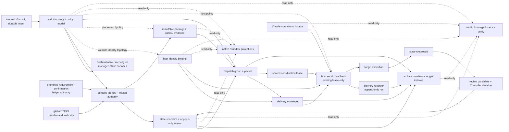

# Wakeflow 初始化新增本地目录与文件梳理需求与实施基线

> 创建日期：2026-08-05
> 状态（2026-08-11）：D1-D41 的目标裁定与开发边界全部确认；首个v3 release-ready范围已按开发文档完成`M1A-M7A`实现与验收，`M7B`按I4保持`deferred`
> 适用范围：Wakeflow 目标工作区初始化、重置初始化、Design/Test 支撑面、长期 ledger、活动状态和 host-local runtime 生成物
> 历史事实基线：Wakeflow 0.9.6开发前源码；第6-8.11节、第13节和第14节保留当时的v2/legacy真实代码、72-file实跑与producer/consumer清单，用于解释改造前因，不表示当前工作树仍具有这些路径或行为
> 当前实现权威：[《Wakeflow 初始化 v3 开发实施基线》](./wakeflow-initialization-v3-development-plan-2026-08-06.md#dev-progress)；M7A完成证据见[首发就绪记录](./wakeflow-initialization-v3-development-plan-2026-08-06.md#dev-m7a-complete)
> 剩余边界：I4 migration-only parser支持窗口尚待确认；M7B只在首个v3实际发布并走完支持窗口后另行实施。本文本身不授权真实生产workspace迁移、commit、版本更新、tag、push、publish或插件缓存刷新
> 关联需求：`docs/wakeflow-local-information-authority-refactor-requirement-2026-08-04.md`
> 安全边界：Wakeflow源码只能在本仓库修改；开发期真实初始化与精确清理由用户指定的可丢弃`WakeWorkspace`承担；`AlembicWorkspace`完全退出本轮开发操作范围。M1A-M7A代码实现曾由用户另行授权并已完成；本文仍不单独授权修改或重置其他真实项目工作区、执行真实生产迁移、提交、发布或刷新插件缓存。

<a id="req-background"></a>
## 1. 背景

Wakeflow 当前对一个目标项目执行初始化时，不只是创建配置文件，而是一次性生成或更新以下多类工作面：

- 工作区持久配置；
- Controller 常驻规则；
- 产品仓库职责访问卡；
- Design/Test 内置支撑面；
- 活跃状态入口与工作区投影；
- host-local 窗口配置与运行时说明；
- 长期 requirement、goal/stage、workspace、window 和 archive ledger 骨架。

这些文件服务于不同的所有者、生命周期和状态权威，但目前由同一个初始化聚合流程统一编排。随着 Wakeflow 的状态机、Pod、双宿主、文档归属和本地运行时能力扩展，初始化生成面的数量和语义密度已经上升，需要重新回答：

> 哪些文件必须在初始化时存在，哪些应按需生成；哪些是权威、投影、工作模板、运行时句柄或长期记录；每个文件由谁写、谁读、何时更新、是否可重建，以及是否需要继续保持独立文件。

本需求先建立完整、可讨论的事实底稿，不预设“文件越少越好”，也不以目录整齐替代运行时和用户价值判断。

<a id="req-goals"></a>
## 2. 目标

完成讨论后，应形成一套可直接指导后续实现的初始化生成面合同：

1. 完整登记初始化可能新增的目录和文件，以及条件生成差异。
2. 为每类文件明确唯一语义职责、所有者、生产者、消费者和生命周期。
3. 明确哪些文件属于初始化必需、按需生成、运行时派生、历史兼容或可移除表面。
4. 明确 tracked、active、local runtime、ledger、Design/Test 工作面的边界。
5. 明确内置与外部 Design/Test、Codex 与 Claude Code、多产品仓库之间的差异。
6. 明确刷新、受管区块更新、整体重建、迁移和删除策略。
7. 在不削弱状态权威、仓库边界、Test 门禁、隐私和双宿主一致性的前提下，减少职责重复、歧义和没有真实闭环的生成物；不以初始化耗时或文件数量为优化目标。
8. 为后续代码调整建立生产者—消费者—测试闭环和兼容验收清单。

<a id="req-non-goals"></a>
## 3. 非目标

本需求讨论阶段不做以下事情：

- 不立即调整 `wakeflow-setup.mjs` 或模板 bundle；
- 不删除、移动或重写任何真实目标工作区文件；
- 不把可重建 Markdown projection 变成 demand/runtime 状态权威；`global-todo-board.md` 继续只承担既有的 pre-demand queue authority；
- 不引入第二套配置、状态机或文档审批状态机；
- 不把 host-local thread/session id 写入 tracked 文件；
- 不改变 Controller、Design、Test、产品职责窗口的权威边界；
- 不改变 mainline-first、显式 Pod、需求冻结和 Controller 验收门；
- 不因减少文件而合并寿命、隐私或删除语义不同的数据；
- 不在本文授权下执行真实迁移，也不承诺迁移支持窗口、版本或发布时间；迁移职责合同以D38-D40为准。

<a id="req-file-taxonomy"></a>
## 4. “本地文件”的分类口径

“本地”不能作为单一存储类别。本文档按以下五类讨论：

| 类别 | 当前典型位置 | 是否跟踪 | 核心语义 |
| --- | --- | --- | --- |
| 工作区持久输入与规则 | `wakeflow.config.json`、根/产品 `AGENTS.md` 或 `CLAUDE.md` | 通常跟踪 | 用户配置意图、身份、硬边界、Skill 路由 |
| 活动状态与投影 | `.wakeflow-active/` | 忽略 | 活跃 demand 的机器权威、事件、快照及可重建工作区投影 |
| 机器本地运行时 | `.wakeflow-local/` | 忽略 | host registry、派生窗口配置、运输、锁、证据、Pod 回执和保留原件 |
| 长期项目记录 | `wakeflow-ledger/` 或配置的 ledger root | 通常跟踪 | requirement、confirmation、workspace navigation 和 archive；`windowId`只作为记录查询外键，不拥有generic window ledger |
| 角色工作面 | 内置或外部 `Design/`、`Test/` | 独立决定 | Design/Test 的本地规则、方法、草稿、模板和配置 |

必须避免以下混淆：

- ignored 不等于可随意删除；活动 state root 和 target evidence 仍有权威或证据价值；
- tracked 不等于状态权威；README、模板和状态说明可能只是规则或起始表面；
- 初始化生成不等于初始化拥有后续全部写入；大量目录由状态、交付或宿主流程在运行期继续扩展；
- 文件位于 `.wakeflow-local` 不代表寿命一致；handles、transport、evidence、preserved 的删除语义不同。

## 5. 已确认的设计裁定

<a id="req-d01-full-init"></a>
### 5.1 D1：一次性完整初始化不是问题，文件存在合法性才是问题

当前不再以“文件越少越好”或“初始化耗时越短越好”作为目标。Agent 在约 3 分钟内一次性创建完整工作面可以接受；只要文件确有稳定职责，一次性初始化全部适用静态能力目录、deterministic managed input/projection/asset、角色工作面与canonical空TODO，不构成浪费。binding、lease、transport、Pod intent/receipt、process/control、lock和audit entry等事件事实绝不初始化占位。

后续逐文件评审必须证明：

- 文件只有一个主要语义职责；
- 有明确生产者、消费者、更新方式、生命周期和删除语义；
- 与相邻文件不存在无法解释的职责重叠；
- 文件或空能力目录的提前存在能提供真实能力、导航、安全边界或离线可发现性，而不是只为了展示完整目录树；只依赖真实scan/observation的cache仍不在初始化时伪造；
- 真实事件事实仍随事件产生，例如 demand state root、dispatch、result、receipt、lock 和 preserved evidence，不在初始化时伪造空事件制品。

因此 D1 的裁定原则是“完整初始化合法的静态表面，拒绝没有独立职责的文件和虚构的事件事实”，不是按数量做最小化。

<a id="req-config-authority"></a>
### 5.2 `wakeflow.config.json` 的全局定位

`wakeflow.config.json` 是**单个已安装 Wakeflow 工作区范围内**的 tracked durable configuration authority。这里的“全局”只表示它统领该工作区的稳定配置，不表示机器全局、插件全局或跨工作区注册表。

它只应声明：

- 工作区及受管逻辑实体的稳定程序身份；
- 职责窗口、仓库和角色之间经用户确认的稳定拓扑关系；
- 确实允许用户选择且不可派生的 durable 责任根；`.wakeflow-local` 和 `.wakeflow-active` 都是固定协议根，配置只保留 ledger root；
- 用户确认的持久策略和 host 偏好；
- 为人类理解配置所需、但不参与身份判断的展示信息和注释。

它不应保存：

- 当前 demand、wave、stage、dispatch、result 或 TODO 状态；
- host thread/session id、注册句柄、锁、receipt 或运行进程事实；
- target evidence、delivery transport、Pod 运行记录或 preserved 原件；
- 可从 durable config、registry 或活动状态确定性重建的叶子路径和窗口投影视图；
- 由 `.wakeflow-active` 或 `.wakeflow-local` 反向覆盖的第二套持久配置。

`.wakeflow-active` 负责活动需求状态与投影，`.wakeflow-local` 负责机器/宿主本地运行时事实；两者可以消费 `wakeflow.config.json`，但不能改变其 durable intent。当前 legacy stream overlay 的兼容读取属于已确认退役的历史接口，不能被解释为新的配置权威。

<a id="req-stable-id-semantics"></a>
### 5.3 程序唯一 ID 与语义标题分离

稳定身份不得继续依赖可变的语义标题、显示名称或目录别名。目标配置模型至少需要为工作区及被引用的逻辑实体提供程序生成、稳定且不依赖展示语义的唯一 ID，并遵守：

- 跨字段引用使用唯一 ID，不使用标题、显示名称或角色文案作为外键；
- `displayName`、`title`、`description`、角色说明等只承担人类可读语义，允许在身份不变时修改；
- 路径是位置，不自动等于实体身份；仓库移动或重命名不应被误判为新实体；
- Controller、Design、Test 和产品职责窗口的特殊语义，应通过角色绑定到稳定实体 ID 表达，而不是让名称本身兼任身份；
- host thread/session id 是 `.wakeflow-local` 的运行时身份，不能替代 durable 程序 ID；
- demand/task/result 等活动实体 ID 仍属于 `.wakeflow-active` 或相应事件制品，不能全部上收为全局配置字段。

D13 已确认使用带类型前缀的 UUID v4，并在 5.8 节给出生成时机、不可变、迁移和重复检测合同。

### 5.4 注释是解释层，不是身份或状态权威

`wakeflow.config.json` 需要比当前版本提供更充分的可读解释，至少覆盖字段目的、责任所有者、默认值、可变性、引用关系、敏感性和真实消费者。注释分为两层：

1. schema 级说明：每个公共字段都有可由编辑器和校验器展示的明确 `description`；
2. 实例级说明：工作区、窗口、仓库等逻辑实体可带人类可读的显示名和说明，帮助用户理解其业务含义。

这两层说明都不得参与程序身份、外键匹配或状态判断。当前文件由严格 JSON 解析，直接加入 `//` 或 `/* ... */` 会破坏现有读取；D13 最终建议继续使用严格 JSON，通过完整 JSON Schema description、实体 `displayName/description` 和 config explain view 提供解释，不增加宽松注释语法或通用 metadata map。

### 5.5 后续字段增删的判断方法

对现有和候选字段统一使用以下结论之一，不以“当前已经存在”为保留理由：

| 结论 | 适用条件 |
| --- | --- |
| keep | 符合全局 durable intent，名称和职责均准确 |
| rename / reshape | 职责应保留，但名称、分组或引用方式泄漏了旧模型 |
| add | 全局稳定身份、拓扑、策略或解释层确有缺口 |
| move | 内容真实有用，但应归属 active、local、ledger、host profile 或安装记录 |
| compatibility-only | 只为读取旧工作区保留，不允许成为新初始化正典 |
| remove | 无独立职责、无真实消费者、可确定性派生或与其他权威重复 |

`.wakeflow-local`、`.wakeflow-active` 全部分析完成后，5.8 节已经给出并确认字段表、目标 schema、旧配置迁移和初始化输出。`storage.localRoot` 已确认删除；legacy overlay 已确认退役，不再讨论其新文件名或长期合并边界。

### 5.6 `wakeflow.config.json` 必须按职责分区

目标 schema 不再把身份、拓扑、路径、策略、host 参数和兼容字段平铺或混放。分区必须让每个字段只属于一个责任域，并使消费者能够只读取自己拥有的分区。下表保留讨论阶段的责任域分类；最终名称、字段归属与增删结果已经由5.8节D13定稿：

| 候选分区 | 唯一职责 | 明确排除 |
| --- | --- | --- |
| schema / metadata | 配置格式版本、配置实例身份和生成/迁移元信息 | 工作区业务标题、运行状态 |
| workspace identity | 工作区稳定 ID 与非权威显示说明 | host thread id、当前 demand |
| logical topology | 窗口、仓库、角色及其基于稳定 ID 的关系 | 运行时注册、delivery sendability |
| storage roots | active、ledger 等确实允许用户选择的 durable responsibility root | 固定协议路径 `.wakeflow-local`、由根可推导的叶子路径、当前文件清单 |
| durable governance | 用户确认且跨运行持续有效的验证、保留和边界策略 | 锁、进程观察、一次 delivery 决策 |
| host preferences | Codex、Claude Code 等宿主的持久偏好，并由各 host schema 校验 | 真实 session/thread handle、临时 readback |
| installation provenance | 仅在确有持续消费者时保存安装来源或运行模式 | 可重新发现的机器临时事实 |

旧版字段只能通过 loader/migrator 的兼容边界读取，不能在新 schema 中设置一个长期 `legacy` 杂物分区。分区的目标不是视觉分组，而是形成清晰的 owner、consumer、validation 和 migration seam。

5.8 节的最终建议进一步收敛这些前置候选：schema 顶层只保留 kind/version，不设通用 metadata；workspace identity 定名为 `program`；storage 只保留 ledger root；installation provenance 因没有持续 consumer 而删除。

### 5.7 本轮已确认的 local/config 裁定

以下方向已经由用户确认，后续实现设计不再把它们列为开放选择：

1. 删除 `storage.localRoot`。`.wakeflow-local` 是 Wakeflow 固定协议根，不伪装成用户可配置路径。
2. 删除初始化生成的三层 local README，不以文件数量为由保留说明文件。
3. local 的硬边界进入现有根 `AGENTS.md` / `CLAUDE.md` 受管区块；操作步骤进入插件 Skill/reference；实时文件分类由 `wakeflow_view scope=storage` 提供。默认不在 ignored runtime 内再生成三层 `AGENTS.md` / `CLAUDE.md`，避免形成第二套隐藏规则权威。
4. 继续在初始化时预建未注册 `window-config` 的后继投影；它必须改名或明确标注为 runtime projection，不能被理解成 local config authority。
5. 停止 `.wakeflow-local` TargetResult 新写入，活动结果只写 demand state root。
6. real host thread/session id 只允许存在于一个 host identity registry；Claude `window-host` 等其他文件不得复制它。
7. transport retention 必须以真实代码依赖为准，packet/group/envelope/run 作为同一 demand transport chain 管理，不再维持失真的“四类均已可 prune”说明。
8. Pod manifest/operation/binding/access receipt 按 host-local evidence/authority 分类，不能再聚合为 regenerable handles。
9. 删除 `stop.json` 写入面；停止 keep-live 应由真实 control/state 变化表达，不保留无 reader 的标记文件。
10. legacy overlay/worktrees、flat registry 和 migration-only reservation 进入一次性安全退役，不设永久 compatibility 分区，不继续新增写入。
11. local runtime 文件键和外键迁移到 `windowId`、`podId`、`bindingId`、`deliveryId`、`demandId` 等所属域稳定 ID；语义名称仅用于展示。
12. `.wakeflow-local` 一次性初始化全部适用静态能力边界和每个稳定窗口的未注册投影，但不创建任何虚构事实文件；reset 必须按稳定 ID 经过 decommission gate 收敛，generic reconcile 只修静态目录、确定性投影和 managed asset，storage 递归按 schema/capability 解释真实布局。D34已确认跨域maintenance必须排他；D38进一步确认用统一workspace mutation gate把普通runtime commit及尚无前置领域事实保护的有界宿主副作用纳入同一原子互斥，避免check-then-write/check-then-effect竞态。

<a id="req-d13-config-v3"></a>
### 5.8 D13：`wakeflow.config.json` 最终分区与字段裁定（已确认）

结论：**目标配置升级为严格的 v3 tracked durable authority，只保存“这个 Wakeflow program 是谁、有哪些长期责任面和窗口、长期记录放在哪里、用户明确选择了哪些跨运行策略与 host 偏好”。固定协议路径、可派生路径、安装探测结果、运行状态、真实 host handle 和兼容残留一律不进入配置。**

当前 v2 的主要问题不是字段数量，而是字段职责和运行时事实没有分开：

1. loader 先把分区 v2 转成扁平 effective shape，setup 又主要用扁平字段重建 v2；`durable input` 与内部兼容投影彼此反向泄漏。
2. `storage.activeRoot` 看似可配置，但 `.gitignore`、layout validator、storage map、verify、state 和 delivery 多处直接使用 `.wakeflow-active`；改变字段只会得到部分生效的危险布局。
3. `roles.*` 和 `repositories[].windowName` 用语义标题充当外键；rename 会被误判为删除旧窗口、新建新窗口，无法保持 identity/binding 连续性。
4. `repositories[]` 同时表示产品仓库、Design/Test 支持面、窗口、角色说明和文件管理权限；同仓库多窗口、外部 Design/Test 及 repository identity 都只能靠名称和 `mode` 猜测。
5. `workspace.runtimeMode/root/wakeflowRepoDir` 只服务 setup 的安装形态探测；它们不是 program 的长期业务事实，且可由配置所在根、显式 `--root`、当前 artifact/manifest 确定。
6. `policy` 混合审计提醒、workspace 边界、repository residue 例外和 OS 进程检查；这些消费者、作用域和失败语义并不相同。
7. `hosts` 与 `repositories[]` 允许任意额外字段；Claude raw `claudeArgs` 还允许未建模参数绕过配置责任边界。
8. local overlay 会覆盖 tracked config，导致同一 program 存在两个配置权威；D19 已确认退役，v3 loader 不再读取 overlay。

#### v3 顶层责任域

| 顶层字段 | 唯一职责 | owner / 主要 consumer | 明确排除 |
| --- | --- | --- | --- |
| `$schema`、`kind`、`schemaVersion` | 文件类型与严格 schema 版本 | config loader / validator / migrator | 迁移历史、运行版本水位 |
| `program` | program 稳定身份和非权威人类说明 | 全部跨域外键、render/setup | 路径、host handle、当前 demand |
| `topology` | 产品仓库、Design/Test 支持面、长期窗口及稳定引用 | setup、layout、dispatch、identity projection | 注册状态、sendability、Pod 动态窗口 |
| `storage` | 用户确实可以选择、且不能从协议常量推导的 durable root | ledger/document placement | active/local 根、全部叶子路径 |
| `governance` | 用户确认且跨运行持续有效的审计与验证规则 | audit、verify、repository/runtime checks | PID、当前进程、lease、一次 delivery 决策 |
| `hosts` | 各 host 的持久启动/物理容器偏好 | host profile / host adapter | thread/session handle、tmux live locator、readback |

不再设置通用 `metadata`、`extensions`、`legacy` 或 `derived` 杂物区。新增持久能力必须先取得明确 owner、consumer、validation 和 migration contract，再通过 schema version 增加正式字段。

#### 建议的目标形状

以下 JSON 只表达职责和引用结构，真实初始化由程序生成 ID 和用户确认的路径/偏好，不复制示例 ID：

```json
{
  "$schema": "<wakeflow-config-schema-url>",
  "kind": "WakeflowConfig",
  "schemaVersion": 3,
  "program": {
    "programId": "program_<program-uuid-v4>",
    "displayName": "Example Program",
    "description": "Controller-visible human explanation only.",
    "interfaceLanguage": "zh"
  },
  "topology": {
    "repositories": [
      {
        "repositoryId": "repository_<product-a-uuid-v4>",
        "path": "../ProductA",
        "displayName": "Product A",
        "description": "Product source responsibility root.",
        "instructionManagement": "managed-block",
        "validation": {
          "residueExceptions": [
            {
              "path": ".cursor/skills",
              "reason": "Repository owner explicitly keeps this integration."
            }
          ]
        }
      }
    ],
    "supportSurfaces": [
      {
        "surfaceId": "surface_<design-uuid-v4>",
        "capability": "design",
        "path": "Design",
        "displayName": "Design",
        "description": "Requirement and outcome design surface.",
        "ownership": "wakeflow-managed"
      },
      {
        "surfaceId": "surface_<test-uuid-v4>",
        "capability": "test",
        "path": "Test",
        "displayName": "Test",
        "description": "Independent test coordination surface.",
        "ownership": "wakeflow-managed"
      }
    ],
    "windows": [
      {
        "windowId": "window_<controller-uuid-v4>",
        "role": "controller",
        "displayName": "Controller",
        "description": "Wakeflow control window.",
        "root": { "kind": "program" }
      },
      {
        "windowId": "window_<design-uuid-v4>",
        "role": "design",
        "displayName": "Design",
        "root": {
          "kind": "support-surface",
          "surfaceId": "surface_<design-uuid-v4>"
        }
      },
      {
        "windowId": "window_<test-uuid-v4>",
        "role": "test",
        "displayName": "Test",
        "root": {
          "kind": "support-surface",
          "surfaceId": "surface_<test-uuid-v4>"
        }
      },
      {
        "windowId": "window_<product-a-uuid-v4>",
        "role": "product",
        "displayName": "Product A",
        "root": {
          "kind": "repository",
          "repositoryId": "repository_<product-a-uuid-v4>"
        }
      }
    ]
  },
  "storage": {
    "ledgerRoot": "wakeflow-ledger"
  },
  "governance": {
    "audit": {
      "preservedReviewAfterDays": 30
    },
    "validation": {
      "runtimeResidue": {
        "label": "product runtime",
        "matchers": [
          { "kind": "substring", "value": "product-dev-server" }
        ]
      }
    }
  },
  "hosts": {
    "codex": {
      "launch": {
        "modelByRole": {},
        "reasoningEffortByRole": {}
      }
    },
    "claude-code": {
      "launch": {
        "modelByRole": {},
        "reasoningEffortByRole": {},
        "permissionMode": "acceptEdits"
      },
      "tmux": {
        "sessionName": "wakeflow"
      }
    }
  }
}
```

这不是把当前 `repositories[]` 换一个名字，而是拆成三个独立实体：

- `repositories[]` 只表示产品源码责任根，`repositoryId` 在路径移动或显示名修改后保持不变；
- `supportSurfaces[]` 只表示当前唯一 Design 工作面和唯一 Test 工作面，两者必须分别由单例Design/Test window引用；当前v3没有“未激活support surface”语义。它们使用discriminated ownership合同：`ownership=wakeflow-managed`时Wakeflow拥有内置surface及整份generated memory，`instructionManagement`必须省略；`ownership=external-owned`时Wakeflow不拥有surface，且必须以`instructionManagement=owner-managed | managed-block`明确是否允许维护memory受管块；
- `windows[]` 只表示长期逻辑窗口，以 `windowId` 为身份，通过 discriminated `root` 引用 program、support surface 或 repository。一个 repository 可被多个 product window 引用，不再复制仓库实体。

`controller`、`design`、`test` 和 `product` 是协议角色，不是显示标题。schema 要求 Design/Test support surface各一个，controller/design/test window各一个，两个support window分别引用同capability surface，product window引用repository；Pod动态窗口不写入durable topology，而是由active Pod authority生成新的全局`windowId`并在生命周期结束后保留审计引用。

#### 稳定 ID 合同

配置域采用带类型前缀的 UUID v4，例如 `program_<uuid>`、`repository_<uuid>`、`surface_<uuid>`、`window_<uuid>`。选择 UUID v4 是因为 Node 原生可安全生成、无需引入排序语义或时间信息、可直接作为安全文件键；类型前缀用于阻止跨域 ID 误接。

- fresh initialize 只生成一次；reset、display rename、path move 和 host preference 更新不得重生成；
- ID 不是用户标题的 hash，也不从 path、role、Git remote、窗口名或数组位置派生；
- 所有 ID 在一个 program 配置内唯一，类型前缀后的UUID主体也不得被另一类型复用；重复、跨类型UUID碰撞、悬空、跨类型引用或同 ID 内容冲突一律 fail closed；
- `configDigest`、topology digest 和各分区 digest由 canonical config 在运行时计算，不写回配置形成可漂移的自摘要；
- `hostId` 继续使用协议枚举 `codex` / `claude-code`；真实 thread/session handle 只进入该 host 的 local identity registry。

#### storage 字段裁定

| 当前字段 | 目标 | 原因 |
| --- | --- | --- |
| `storage.localRoot` | remove | `.wakeflow-local` 是固定 ignored protocol root，已确认 |
| `storage.activeRoot` | remove | `.wakeflow-active` 已被 gitignore、validator、state、delivery 和 storage 当作固定 protocol root；保留只会制造伪可配置性 |
| `storage.ledgerRoot` | keep | tracked 长期记录根是唯一真实的用户 placement 选择，不能从协议常量推导 |
| `storage.windowLedgerRoot` | remove | D5 已确认 generic per-window ledger 没有独立 artifact/writer/consumer 闭环，删除的是能力本身，不再派生替代路径 |
| `storage.windowLedgerDirs` | remove | 同上；责任历史回到 demand archive、goal-stage decision 或所属 repository/surface，不按 `windowId` 重建通用 drop zone |
| `storage.paths.*` | remove | active/ledger 全部叶子路径归 document placement registry；D35 已删除其中的 current index/test exchange 表面 |

`.wakeflow-active`、`.wakeflow-local` 及其内部布局成为版本化代码常量；schema 和 `wakeflow_view scope=storage/config` 应明确展示“fixed protocol root / derived path”，而不是要求用户在 JSON 中重复默认值。`ledgerRoot` 只接受可规范化的显式相对 placement，resolve 后必须避开 active/local、产品仓库和不允许的重叠；绝对本机私有路径不写入 tracked config。

#### workspace / roles / repositories 字段裁定

| 当前字段 | 目标 | 原因 |
| --- | --- | --- |
| `workspace.name` | rename → `program.displayName` | 仅供人类展示，不再充当身份 |
| `workspace.language` | rename → `program.interfaceLanguage` | presentation preference，不参与状态判断 |
| `workspace.runtimeMode` | remove | 由调用入口、当前 artifact/manifest 和显式 root 探测 |
| `workspace.root` | remove | config 所在 program root 是边界；不再让文件声明另一个自己的 authority root |
| `workspace.wakeflowRepoDir` | remove | 安装/源码位置可发现且不应进入目标 program 的 tracked 事实 |
| `roles.controller/design/test` | replace → `topology.windows[].role` | 角色按稳定 window entity 查询，不再按标题反查 |
| `roles.realProject` | remove | 当前只是特殊排除名称；产品归 repository/product window，Test 环境归 demand/Test contract，不保留隐式“真实项目”例外 |
| `roles.base` | remove | 除 setup 回写/诊断外没有运行期 consumer，首个 repository 也不应隐式获得特殊身份 |
| `repositories[].windowName` | split | 显示名归 window，repository identity 用 `repositoryId`，两者不再绑定 |
| `repositories[].path` | move → repository/support surface | path 是 placement，不是 window identity |
| `repositories[].role` | rename → `description` | 非权威说明，不参与分派 |
| `repositories[].mode` | replace → support surface `ownership` | 只表达 Wakeflow 是否管理完整 Design/Test 内容面，不混入 repository/window |
| `repositories[].managedAgents` | rename → `instructionManagement` | 产品repository及external support surface使用`owner-managed`或`managed-block`；internal `wakeflow-managed` surface的memory是Wakeflow-owned whole file且该字段必须省略 |
| `repositories[].stream` | remove | stream/dispatch 是 local runtime 或 active demand 事实，不是 durable topology |

配置不再保存 `allowMissingRepos`。一个已声明 repository/surface 的物理缺失是当前机器的 preflight observation：status 应报告，目标派发应阻断；是否让一个只读诊断命令因其他不相关 root 缺失而非零退出，由命令 scope/strict mode决定，不能用全局布尔值永久掩盖缺失。

#### governance 字段裁定

| 当前字段 | 目标 | 原因 |
| --- | --- | --- |
| `policy.preservedRetentionDays` | rename/move → `governance.audit.preservedReviewAfterDays` | D33 已确认它只产生复核提醒，绝不授权按天删除 |
| `policy.disallowedTrackedPaths` | remove | 当前默认 `.DS_Store` 又被代码硬编码；Wakeflow protocol boundary 应由代码强制，通用 repo hygiene 不属于配置核心 |
| `policy.allowedRepositoryResiduePaths` | move/reshape → 每个 repository 的 `validation.residueExceptions[]` | 例外必须绑定稳定 repository、精确相对路径和非空理由，不能用 `windowName:path` 猜作用域 |
| `policy.runtimeProcessMatchers/Label` | keep/reshape → `governance.validation.runtimeResidue` | 这是用户确认的跨运行验证意图，不是当前 PID 事实；删除 magic `/regex/` 字符串，改用 typed substring/regex matcher |

`preservedReviewAfterDays` 只控制何时进入 review queue。真正 release 仍要求 D33 的 exact preservation ID/digest、关联关闭/归档 gate 和显式决定。runtime residue 只保存匹配规则；扫描时间、PID、command observation 和结果只能进入即时输出或 host-local operation evidence。

#### host preference 子 schema

`hosts` 从任意对象改为 host-specific strict schema，未知 host/字段拒绝，不再以 `additionalProperties` 充当扩展机制：

| 目标字段 | 裁定 | 边界 |
| --- | --- | --- |
| `hosts.codex.launch.modelByRole` | keep + 分区 | 可选模型 pin；缺失时继承当前 Codex/profile |
| `hosts.codex.launch.reasoningEffortByRole` | rename from `thinkingByRole` | 仅角色级启动偏好，不记录 live model observation |
| `hosts.claude-code.launch.modelByRole` | keep + 分区 | 可选模型 pin |
| `hosts.claude-code.launch.reasoningEffortByRole` | rename from `effortByRole` | 与 Codex 使用同一概念名，由 adapter 映射 host 参数 |
| `hosts.claude-code.launch.permissionMode` | keep + strict enum | `acceptEdits` 为安全默认；`bypassPermissions` 必须由用户显式留痕选择 |
| `hosts.claude-code.tmux.sessionName/socketName` | rename + 分区 | 只是期望的 tmux 容器偏好；D30 locator 仍冻结实际 socket/session/window/pane |
| `hosts.claude-code.claudeArgs` | remove | raw argv 可绕过 typed policy、产生冲突优先级并把未来未知行为塞入 durable authority |

`modelByRole` / `reasoningEffortByRole` 只允许 `controller/design/test/product/default` 键；model 值保持非空字符串以允许 host 新模型，effort 和 permission mode 使用 Wakeflow 实际支持且有测试的枚举。若需要新的持久 host 能力，先增加 typed 字段和 adapter contract；一次调用覆盖继续使用显式 CLI 输入，不写回全局配置。

host entry 和其中的 override map 都是可选项：缺失表示使用当前 host profile 的受测默认值，不表示 host 已注册、live 或被禁用；initializer 不为了“字段齐全”写空 override。当前运行的 host artifact 决定初始化哪一个 local host capability surface，真实启用/注册事实仍只来自该 host 的 identity 与 operations 层。

#### 注释和可解释性

目标继续使用严格 JSON，不允许 `//`、块注释或宽松 parser。用户要求的“更多注释”由三层承担：

1. JSON Schema 为每个分区、字段、enum、约束和 default/fallback 写完整 `description` 与安全示例；
2. `displayName`、`description` 是实体级人类说明，schema 明确它们不参与 ID、外键、状态或文件路径；
3. setup preview 与 `wakeflow_view scope=config` 输出每个有效值的来源：`durable input / host profile default / fixed protocol constant / derived placement / live observation`。

不增加通用 `comment`、`notes`、`metadata` map；这类无 owner 字段最终会重新变成不可校验的杂物层。时间戳、生成器版本、迁移历史和安装来源也不写入config；可由target refs/manifest重算的mapping不新增receipt。只有确实存在不可重算副作用、独立consumer和retention时，才可另行评审create-only migration receipt，且不得成为新loader的常规权威。

#### v2 → v3 一次性迁移

迁移必须是显式 preview/apply 流程，不允许 loader 长期静默“双读”：

1. 只读取tracked `wakeflow.config.json`；若legacy local overlay存在且与base不等价，原位保留并blocked，要求人工解决，不能选择其中一份继续。只有后续能独立证明它已inactive且符合D33 source gate时，才可在另一个逐path授权动作中进入`audit/preserved`；preview不自动搬走配置。
2. strict-load v2 后生成 mapping plan：workspace → program，Design/Test entries → support surfaces，其余真实产品 entries → repositories/windows；每个实体一次性生成带类型前缀 UUID v4。
3. `realProject` 必须由用户明确归类为 product repository/window、Test demand environment 或删除；migrator 不沿用“跳过这个语义名称”的隐式行为。`base`、未知 repository extras 和 raw `claudeArgs` 同样列入人工 review，不能静默丢弃。
4. 对规范化 path、重复 window name、同 path 多 entry、ID collision、悬空 role、缺失 root 及 ledger/active/local 重叠做完整 preflight；同 repository 多窗口要合并为一个 repository entity 加多个 window refs，而不是复制 identity。
5. preview 展示每个 keep/rename/move/remove、生成的 ID、root diff、host preference diff 和将受影响的 local/ledger 引用；未确认前零写入。
6. apply只在D11静止门成立后进入workspace maintenance fence：无active demand/task/legacy stream、coordination或keep-live automation lease、open/pending/ambiguous transport、Pod binding/open/transition、retained/unknown resource claim、dirty/unknown worktree或未处置overlay，且旧Controller/target任务、Claude session/helper/process writer及其current identity/locator已按D38撤销current authority并冻结旧输入。它再以恢复事务写v3 config、非活跃stable refs/已有typed manifest wrapper与投影；任何冲突保留原件并fail closed，不生成通用crosswalk registry。
7. reset 只保留并比较 v3 stable IDs；显示名/path 修改不改变 identity。被移除窗口必须通过 D34 decommission gate，不能因数组缺项直接删 registry。
8. 迁移窗口结束后删除 v1/v2 flatten/serialize、overlay precedence、name-key fallback 和 legacy `derived` reader。旧配置只得到“需要运行 migrator”的明确错误，不继续形成永久 compatibility lane。

#### D13 验收条件

- schema 对全部分区 `additionalProperties: false`，所有 discriminated refs、ID 类型、role cardinality、路径和 host enum 都有共享 validator；
- 运行时代码只消费 typed v3 domain model，setup preview/effective view 不再反向充当 durable serializer 输入；
- 修改 display name 不改变任何 stable ID、identity binding 或文件键；同 repository 多窗口不复制 repository identity；
- active/local/leaf path 不再出现在配置，所有 consumer 从固定 protocol constants 或同一 placement registry取得；
- tracked config 中不存在 real thread/session handle、PID、absolute cwd、tmux live locator、prompt、delivery/Pod/demand status或本机安装缓存路径；
- Codex 与 Claude Code 对共享 program/topology/storage/governance 使用同一 loader，差异只留在各自严格的 `hosts` 子 schema和adapter；
- v2 fixture 的每个旧字段都有明确 keep/rename/move/remove 或人工阻断结果，未知字段不能静默通过。

<a id="req-current-init-chain"></a>
## 6. 开发前真实初始化链（历史基线）

以下内容冻结开发前共享实现的真实调用链；其中若干路径已在M6 public cutover或M7A normal legacy清理中删除。开发前实现集中在 `core/scripts/wakeflow-setup.mjs`，大致执行以下聚合步骤：

1. 解析源码仓库运行模式或插件管理的目标工作区模式；
2. 发现相邻仓库事实，但不替 Agent 判断工作区是否适合自动选择；
3. 根据显式仓库、Design/Test 模式、语言和 host 配置生成 durable v2 config；
4. 生成窗口启动计划；
5. 同步根 `.gitignore`；
6. 同步 active/local/ledger starter 与 Design/Test 模板；
7. 更新根 Controller memory；
8. 更新产品仓库 access card 或内置角色 memory；
9. 生成 host-local 派生窗口配置；
10. 在 reset 初始化时清理不再受管的 access-card 区块和本地窗口注册残留。

这十步是共享setup backend，不等于完整Claude `/wakeflow:init` host流程。Claude命令在shared apply后还会调用`seed-permissions --write`，为workspace root和当前config枚举的repository创建/合并tracked `.claude/settings.json`与machine-local `.claude/settings.local.json`，并生成statusline脚本，然后才launch/register窗口；Codex没有这两类Claude settings。第7节72文件是Codex shared-setup基线，因此未把这些Claude-only host写入计数，D38必须单独给出其目标职责。

交叉校正：当前`mergePermissionSettings()`与`settingsSeeded()`已把absolute workspace root及repository的relative parent都当作legacy `additionalDirectories`授权删除，`test/claude-host-helper.test.mjs`也同时断言两者不存在；但`commands/init.md`、`commands/check.md`及`commandSeedPermissions()`返回的note仍声称会保留/写入RELATIVE parent reference。本需求以可执行writer + validator + test的一致行为为当前事实：不保留持久parent grant；陈旧命令说明与output note是后续实现必须同步的consumer偏差，不能反向恢复宽授权。

初始化写入必须继续区分四种行为：

| 写入模式 | 当前用途 | 讨论重点 |
| --- | --- | --- |
| 缺失时新建 | 配置、README、模板、starter | 是否真的必须首次初始化即存在 |
| starter 刷新 | 未进入真实活动状态的起始文档 | starter 判定是否明确、是否会误覆盖用户内容 |
| 受管区块更新 | 根 memory、产品 access card | 受管边界、用户内容保留、旧规则迁移 |
| 完全派生重建 | window-config 等运行时视图 | 是否应在初始化创建、能否随时重建、真实权威在哪里 |

<a id="req-current-init-baseline"></a>
## 7. 开发前初始化实跑基线（历史对照）

为获得开发前真实清单，使用当时的 Codex 插件产物在隔离临时目录执行了一次初始化，条件为：

- 一个产品仓库；
- 内置 `Design`；
- 内置 `Test`；
- 中文界面；
- 尚未注册真实线程；
- 不包含运行期 demand、dispatch、result 或 Pod 扩展文件。

该基线共生成 72 个文件：

| 区域 | 文件数 | 说明 |
| --- | ---: | --- |
| 根目录 | 3 | `.gitignore`、Controller memory、durable config |
| `.wakeflow-active/` | 6 | active 入口和 current 工作区投影 starter |
| `.wakeflow-local/` | 7 | 三层说明文件和四个未注册窗口的派生配置 |
| 产品仓库 | 1 | 产品责任窗口 access card |
| `Design/` | 17 | 内置 Design memory、说明、文档、Skills、模板 |
| `Test/` | 26 | 内置 Test memory、配置、文档、Skills、PCV reference、模板 |
| `wakeflow-ledger/` | 12 | ledger 说明、三个窗口目录、共享长期记录骨架 |
| 合计 | 72 | 这是一个具体基线，不是所有配置下的固定总数 |

这72项仅代表上述“单产品 + 内置Design/Test + Codex shared setup”实跑，不是全局current scaffold清单。Claude完整init还会按实际root集合生成/合并两层`.claude` settings和statusline asset；多repository、external surface或已存在mixed-owned settings会进一步改变文件数与update结果。

以下条件会改变生成清单：

- 产品仓库数量；
- Controller、Design、Test 的名称；
- Codex 的 `AGENTS.md` 与 Claude Code 的 `CLAUDE.md`；
- Design/Test 是内置支撑面还是显式外部目录；
- 是否执行 reset 初始化；
- 是否已有用户文件、旧 starter、旧 managed block 或兼容配置；
- 是否已经注册真实窗口；
- 后续是否创建 demand、dispatch、target result 或 Pod。

## 8. 开发前文件组事实与已确认目标职责

本节各表的“当前”列均指2026-08-05讨论时冻结的pre-v3事实。它们继续作为删除、迁移和replacement证明的历史输入；当前v3实现状态只由开发文档、当前manifest、validator和测试证据判定。

### 8.1 根工作区

| 文件 | 当前实现事实 | 当前写入方式 | 已确认目标 |
| --- | --- | --- | --- |
| `.gitignore` | 只忽略 `.wakeflow-active/` 和 `.wakeflow-local/` | 只添加缺失条目 | 继续由初始化负责，但只维护自身受管条目，不接管其他 ignore 规则 |
| `wakeflow.config.json` | tracked durable config authority；当前仍是 v2 混合结构、语义名称外键和 overlay-first loader | 配置生成/reset 覆盖及 legacy overlay 兼容读取 | D13 的严格 v3：稳定程序/拓扑 ID、职责分区、固定协议根、单一 tracked 权威和显式迁移；本表不把目标字段伪装成当前实现 |
| `AGENTS.md` / `CLAUDE.md` | 当前同时承载 Controller 身份、硬边界、状态权威、Skill 路由及部分已过时入口 | 受管区块更新 | 保留最小 host memory：硬边界、first read、MCP 不可用时的停止条件与 Skill 路由；详细流程下沉插件 Skill/reference |

### 8.2 产品仓库

| 文件 | 当前实现事实 | 当前写入方式 | 已确认目标 |
| --- | --- | --- | --- |
| `<ProductRepo>/AGENTS.md` 或 `CLAUDE.md` | 当前按 repository 配置项反复规划同一 instruction destination，并在共享路径中聚合窗口责任；reset 仍可能按 stale semantic window 删除整块 | 受管区块更新 | D10/D11：每 host、每 repository instruction root 至多一个以 `repositoryId` 拥有的 access block；多窗口只列责任索引，真实身份与本轮 scope 不写入；移除前走 stable-ID decommission gate |

产品 access card 不应变成：

- 完整 Wakeflow 操作手册；
- 当前 demand 的任务包副本；
- thread/session id 存储；
- 产品仓库原有规则的替代品。

### 8.3 `.wakeflow-active/`

| 文件 | 当前职责 | 权威级别 | 初步讨论问题 |
| --- | --- | --- | --- |
| `.wakeflow-active/README.md` | active 树的就地说明 | 规则/说明 | 是否需要独立存在，还是可由 storage view 解释 |
| `.wakeflow-active/index.md` | Controller 单一活动入口 | 投影/导航 | 空工作区是否必须初始化即生成 |
| `current/index.md` | current 区域导航 | 投影 | 与上层 index 的分工是否足够明确 |
| `current/workspace-current-status.md` | 工作区当前状态投影 | 投影 | idle starter 的价值与刷新边界 |
| `current/global-todo-board.md` | Controller TODO/Backlog 运行入口 | 运营记录与投影混合面 | 是否仍应初始化创建；其权威语义需单独明确 |
| `current/test-exchange.md` | Controller 与 Test 的人类可读交换投影 | 投影 | 无 Test 工作时是否应按需生成 |

运行期还会在 `current/<demand-key>/` 下创建 demand state root。它不是初始化 starter 文件清单的一部分，但本需求必须确认初始化文案是否准确说明其后续所有权和删除边界。

<a id="req-d35-active-global"></a>
#### 8.3.1 D35：顶层入口、current 全局文件与初始化职责（已确认）

结论：**初始化继续一次性创建真正需要的 active 静态入口，不按文件数量做延迟安装；但当前 6 个文件中只有 `index.md`、`workspace-current-status.md` 和 `global-todo-board.md` 具有独立运行职责。删除 active README、`current/index.md` 和持久化 `test-exchange.md`，把目标初始化表面收敛为“一个导航投影、一个工作区状态投影、一个 pre-demand TODO 权威表”。** 这不是为了少三个文件，而是因为被删除的三个文件没有独立且真实的生产者—消费者闭环。

##### 当前 6 个文件的真实生产者与消费者

| 当前文件 | 当前真实生产者 | 当前真实消费者 | 真实性判断 |
| --- | --- | --- | --- |
| `.wakeflow-active/README.md` | `wakeflow-setup sync-templates` 间接调用 storage README seeder；每次按受管 marker 整体刷新 | `wakeflow-check-layout` 要求其与生成器 exact match；人类可能偶尔阅读 | 它不参与 active 状态、导航、恢复或安全门；validator 对它的强制依赖是实现自证，不是产品消费者 |
| `.wakeflow-active/index.md` | setup 先写 starter；运行期 `refreshWorkspaceProjection()` 在 create/render/transition/archive 后整体重写 | 根 `AGENTS.md`/`CLAUDE.md` 明确要求进入工作区先读；所有产品 access card 指向它；`verify-workspace-docs` 从其第一条 current link 解析 status；layout validator 校验窗口覆盖 | 有真实稳定入口职责，但当前同时存在 template writer 与 runtime renderer 两套内容模型，且与 status 重复窗口状态、active demand 和状态枚举 |
| `current/index.md` | 只有 setup starter/refresh writer；运行期 workspace projection 不刷新它 | status 只链接它；layout validator只校验 `Current Map` 表头；没有状态机、delivery、next-work 或 Agent read order 把它作为入口 | 仅重复列出 status/TODO/test-exchange 三个同级文件，是静态目录清单，不是 current 状态投影 |
| `current/workspace-current-status.md` | setup 写 idle starter；运行期 `refreshWorkspaceProjection()` 从所有未归档 state root 和 config 整体重写 | 根 memory 和产品 access card要求读取；`wakeflow-next-work`读取 `Status:` 但只当 projection diagnostics，真实可继续性来自 state roots；verify/layout 校验固定章节 | 有真实工作区级派生状态职责；不是 demand authority、dispatch authority 或 append-only ledger |
| `current/global-todo-board.md` | setup 写 starter；Design delivery append、demand claim/consume 更新、archive-demand 更新 mount/status、TODO archive 压缩历史；所有写入围绕 board lock | `wakeflow-next-work`、demand sequence、create-demand、layout validator 和 TODO archive 解析固定 Markdown table | **不是普通投影。** 它是 demand 建立前的 Controller intake/claim queue 及其短期运营记录；被 claim 后执行权威转入 state root |
| `current/test-exchange.md` | setup 只写一次 starter/初始化历史；源码没有从 state-root `test-cards/*.json` 生成 Active Test Cards/History 的运行期 writer | Test access card和状态文档链接它，Skill要求在某些 Test 场景读取；layout只要求文件存在，不校验它是否与 test cards 一致 | 当前“active/historical Test cards 的 human-readable projection”声明不真实：有 reader 指针但无 projection producer，必然可空白或过期 |

这里存在两个需要直接修正的旧判断：

1. `global-todo-board.md` 不能继续归类为“TODO projection”。它的 `## Global TODO` 和 13 列表头是程序协议，Design delivery 对它 append-only，Controller claim/归档对行做受锁状态变换；在 demand 创建前，它承载的是唯一真实的待领取入口记录。
2. `test-exchange.md` 不能因为文案叫“projection”就按投影保留。真实代码只在 status、access card和Skill中传播其路径，没有任何 reducer/renderer把 state-root test card 写进去；初始化写一行 `Workspace initialized` 不能建立投影职责。

##### 目标顶层模型

```text
.wakeflow-active/
├── index.md                              # 工作区 active 导航投影
└── current/
    ├── workspace-current-status.md       # 跨 demand 的当前状态投影
    ├── global-todo-board.md              # demand 前 intake/claim 运行权威
    └── <demand-id>/                       # 真实 demand 产生时创建；不属于初始化 starter
```

三个保留文件都在初始化时一次性创建。空工作区不是按需生成的理由：没有 demand 时，Agent 仍需要一个稳定入口、一个明确的 idle 投影和一张可接收 Design delivery 的空 TODO 表。初始化耗时和文件数量在这里不构成取舍。

| 目标文件 | 唯一职责 | 权威/更新模式 | 初始化内容 | 明确排除 |
| --- | --- | --- | --- | --- |
| `.wakeflow-active/index.md` | 从固定入口导航到工作区 status、TODO 和 active demand state roots | 可重建导航投影；由单一 workspace entry projector 整体重写 | 无 demand 的确定性导航；不含当前时间造成无意义漂移 | 完整状态说明、窗口 dispatch 表、状态枚举手册、历史记录、操作授权 |
| `current/workspace-current-status.md` | 汇总所有未归档 state root 的健康、phase/authority/placement 摘要和当前下一步方向 | 可重建状态投影；只以strict config与state roots/events中的portable placement摘要为source，整体重写 | 同一 projector 对零 demand 的 `idle` 结果 | host identity/send/process/Git观察、demand/task真值、TODO队列、copyable dispatch prompt、append-only backfill/history、人工维护区 |
| `current/global-todo-board.md` | 保存尚未进入 demand state machine 的 confirmed delivery/intake 候选及领取结果 | pre-demand 运营权威；严格 parser/schema、board lock、atomic mutation；完成记录按既有 archive owner 迁出 | 标题、协议说明、canonical空表头；**不创建 `TODO-EXAMPLE-001` 假记录** | demand执行状态、target结果、Test卡真值、窗口identity、长期需求定义正文 |

##### `index.md` 与 `workspace-current-status.md` 的严格边界

`index.md` 保留是因为双宿主根 memory、产品 access card和workspace verifier都有真实入口依赖。目标不把它合并进 status，也不让 Agent 猜测当前 demand 目录；但它应缩成稳定、低变化的导航投影：workspace/program稳定身份、status/TODO/current目录链接，以及必要的active state-root链接。它不再复制 Window Coverage、Status Enum、Pod摘要、authority摘要或下一步说明。

`workspace-current-status.md` 才负责跨 demand 的当前快照。它可以显示：整体 `idle/active/blocked/degraded`、unarchived demand摘要、frozen/pending authority计数、main/Pod placement摘要、配置窗口是否有open task，以及一条由当前权威状态推导的next action。它必须显式声明“projection only”，每个 demand 的 `wakeflow-state.json`/events仍是权威。

当前 status 里的 `Copyable Prompt` 和 `Backfill Area` 应删除：前者把导航投影变成潜在dispatch入口，且没有绑定exact task package/binding fence；后者看似append-only，实际每次projection refresh都会整体覆盖，只留下最新一条renderer日志，不能承担历史。dispatch prompt归delivery packet/envelope，历史归state-root events或ledger。

setup 不再从 template bundle分别写 index/status starter，然后让 runtime renderer换成另一套格式。初始化直接调用与create/render/transition/archive相同的 workspace entry projector，并以零 state root生成idle结果。这样每个投影只有一个owner、一种schema和一个刷新合同；reset/reconcile也只调用这个projector，不使用“starter marker”猜测能否覆盖。

投影刷新失败不能回滚已经成功提交的state transition；它返回degraded/stale诊断并允许同一projector重建。相反，投影内容不得被`next-work`当作可继续性权威：当前实现已基本做到state-root-first，只把status文本放在`projection`诊断字段，目标继续保持并补充source digest/revision或明确stale标记。

##### `global-todo-board.md` 的职责边界

这张表值得在空工作区初始化时存在，因为它不是示例文档，而是Design向Controller交付confirmed demand的唯一共享写面。目标保持现有核心时序：

1. 初始化只生成canonical空表，不生成示例ID；
2. Design delivery在完整demand authority通过校验后只append一行，不能修改既有行；
3. Controller/sequence读取eligible row，创建并冻结state root后，由同一事务边界把行标为claimed并写current mount；
4. 自此执行、target、Test和acceptance真值只在state root，TODO行只是intake lineage；
5. demand完成/归档后由TODO/archive owner更新或压缩，不由workspace projection renderer重写整张表。

现有Markdown可以继续作为人类可读且机器解析的运行协议，但必须被当作schema surface管理：固定heading/列、stable row ID、严格转义、锁、atomic write、duplicate拒绝和corrupt fail-closed。若文件在一个已初始化工作区中缺失或损坏，generic initialize/reconcile不能以空starter覆盖并造成TODO丢失；只能诊断，交给TODO recovery/migration owner。fresh init确认文件不存在时才创建空表。

`TODO-EXAMPLE-001` 必须删除。它会被真实parser作为一行普通TODO读取，再依靠`parked/template`状态让next-work判为不eligible；这既污染运营数据，也让“空队列”必须靠特殊内容而不是零行表达。

##### 删除的三个文件与替代入口

1. **删除 `.wakeflow-active/README.md`。** active根边界进入根`AGENTS.md`/`CLAUDE.md`受管区块，操作方法进入Wakeflow Skill，实时存储分类进入`wakeflow_view scope=storage`。layout validator不再要求README exact match，storage seeder不再生成它。与local README的已确认删除原则一致。
2. **删除 `current/index.md`。** 它只是三个同级文件的静态目录表，唯一代码消费者是layout validator的自证；status中的“Current map”改为返回根`../index.md`或直接删除该链接。当前目录中的demand列表由根index/status投影从真实state roots生成，不依赖静态文件清单。
3. **删除持久化 `test-exchange.md`。** Test窗口直接消费被分配state root内的`test-cards/*.json`和对应task package；Controller或人类需要跨demand摘要时，通过`wakeflow_view`/status的只读派生视图查询，不能再要求Agent维护一个无renderer的第二份Markdown。未来若确有离线全局Test投影需求，应先实现state-root-first renderer、source revision和stale检测，再作为明确产品能力重新评审，不能先保留空文件等待用途。

删除 `test-exchange.md` 不等于删除Test evidence。机器Test卡、result、attempt和state transition仍在各自demand state root；长期结论/责任记录保留在demand archive，确需跨demand提升时按类型进入D5确认的confirmation/workspace/archive record，不再归入Test/window ledger。只删除当前这个既非权威、也非真实投影的全局镜像面。

##### 配置与路径职责的连贯收口

当前config同时暴露 `activeLedgerRoot`、`workspaceDocsDir`、`workspaceCurrentDir`、`workspaceIndexPath`、`workspaceCurrentIndexPath`、`workspaceCurrentStatusPath`、`globalTodoPath` 和 `testExchangePath`，loader又从这些字段互相推导默认值。这允许用户把同一active协议拆散到互不一致的位置，也把确定性叶子路径伪装成durable intent。

后续 D13 已确认 `.wakeflow-active` 本身也是固定协议根，v3 config 不再保存 active root 或任何 active 叶子路径；全部路径由 typed placement registry 从固定根确定性派生。由此：

- 删除`workspaceCurrentIndexPath`和`testExchangePath`，因为对应文件删除；
- `activeLedgerRoot`、`workspaceDocsDir`、`workspaceCurrentDir`、`workspaceIndexPath`、`workspaceCurrentStatusPath`和`globalTodoPath`均不再作为durable config字段；
- 代码通过typed placement获取`active root / current root / entry / status / todo / state-root(demandId)`，不在producer/consumer中散落字符串拼接；
- legacy自定义叶子路径只由一次性migrator读取并收敛，不建立长期alias、双写或per-file override。

因此 active placement 不再存在“配置 root 还是配置叶子”的开放选择：root 与叶子都属于版本化协议布局，只有 tracked `storage.ledgerRoot` 仍是用户可选择的文档责任根。

##### 迁移、删除安全与最小回归

既有工作区不能因为目标判断为“projection/README”就无条件删除内容：

- exact managed-marker active README和exact starter/current index可由migrator识别后删除；有marker外内容或自定义链接时先报告并将仍有价值的导航合并到根index/ledger；
- `test-exchange.md`只有初始化行/`None`时可删除；若包含真实Test记录，先按demand关联迁入对应state-root evidence/archive，确需跨demand保留的结论再显式promotion为D5 typed record；无法归属的内容进入workspace historical archive并记录source digest，不能把它升级为当前状态权威；
- index/status由single projector重建前先验证全部state root；遇到corrupt root要生成degraded条目而不是跳过或覆盖root；
- global TODO任何非空、noncanonical或corrupt内容都不得被空表覆盖，migration/recovery必须保留原字节并在strict parse后受锁转换。

最小回归覆盖增加：

- fresh Codex/Claude初始化都只生成三个active全局文件：根`index.md`以及`current/`内的status、TODO两文件；此时无demand root、active/local README、`current/index.md`或`test-exchange.md`，双宿主内容和placement一致；
- 零demand初始化与随后显式projection refresh字节一致（除明确允许的source revision），证明setup/runtime只有一个projector；
- 根memory和所有access card仍能按`root memory -> active index -> current status -> assigned state root`顺序导航；index不复制status的窗口/状态正文；
- status从多个unarchived state roots稳定派生idle/active/blocked/degraded、authority和Pod摘要，corrupt root可见且不被修改；没有Copyable Prompt或伪Backfill历史；
- TODO fresh init为零数据行；真实delivery/duplicate/consume/archive/parallel writer/corrupt board完整覆盖，示例行不再进入next-work；缺失/损坏的既有board不会被initialize/reconcile清空重建；
- Test access card/Skill/layout/schema/config不再引用`testExchangePath`，Test只通过exact state root/card/package读取；跨demandTest摘要若保留为view，必须由真实cards派生；
- legacy自定义叶子路径、包含真实记录的test exchange和自定义current index有显式迁移结果，零永久fallback/alias/双写；
- `npm run sync:core`、双宿主validator/smoke、focused workspace/TODO/Test回归和`npm test`作为未来实施验收门。

<a id="req-d36-demand-core"></a>
#### 8.3.2 D36：demand state root 顶层核心文件与权威分层（已确认）

结论：**保留 `demand.json`、`demand-authority.json`、`wakeflow-state.json`、`controller-events.jsonl`、`developer-progress.md` 和 demand `index.md`，删除 `projection.json`；同时删除 state 内对完整 demand/task package 和 projection 状态的重复权威。demand state root 应被明确拆成“不可变身份、冻结执行授权、可变当前状态、追加审计、可重建人类投影、短期事务恢复”六层。** 文件数量不是裁定依据；裁定依据是每个文件是否拥有不可替代的生产者—消费者合同，以及损坏时应阻断权威状态还是仅降级阅读体验。

##### 当前创建链的真实文件集合

`wakeflow-state init` 当前先在同级隐藏 staging root 中写入初始文件，再通过目录 rename 原子发布。基础初始化实际写入：

| 当前文件 | 创建/更新事实 | 当前真实消费者 | 当前问题 |
| --- | --- | --- | --- |
| `demand.json` | demand 创建时写一次，后续通常不改 | add/continue task package、Test intake、Pod design、archive | 没有独立 schema；`demandKey`、title、type、placement 等又被 state 复制，二者没有 digest 身份链 |
| `demand-authority.json` | authority 已提供时随 init 写入，也允许后续 freeze 时创建 | dispatch、active health、archive 对 exact digest 做校验 | 职责独立且已经接近严格不可变合同，但仍以语义 `demandKey` 连接其他文件 |
| `wakeflow-state.json` | revisioned mutable snapshot；所有 reducer 更新 | next-work、dispatch/review/result、Pod、render、archive | 除可变状态外还保存 demand 重复字段、完整 task package 副本和 projection metadata，扩大了可变权威边界 |
| `controller-events.jsonl` | 每次 state transition 追加一条；要求末事件 revision 与 state 对齐 | recovery、health、render、archive/audit | 是完整状态变更审计，但事件载荷不足以单独重放出全部 state/artifact，不能声称为 event-sourced 唯一状态权威 |
| `projection.json` | init 创建，render 时整体重写 | 主要由 active demand health scanner 校验自身存在和 synced 状态；核心 dispatch/review/state 消费者仍直接读 state | 既不替代 state，又因缺失/过期把健康 demand 判为 unhealthy；这是“为验证投影而存在”的第二份机器快照 |
| `developer-progress.md` | init 创建；render 只替换统一状态区，部分 reducer best-effort 追加人类行 | Controller/Skill 的主要人类阅读入口，archive 保留 | 一部分整体派生、一部分尽力 append；append 失败不影响 transition，因此正文不能保证完整，却容易被误认成 ledger |
| `index.md` | `init` 本身不创建，后续 render 才整体生成 | 人类按 demand 导航 core records、packages、tasks、evidence | 有独立导航价值，但正常 demand 在 render 前存在一个短暂无 index 的发布状态 |

此外存在三类恢复文件和一个锁：

- `<state-root>.create-intent.json` 与 `<state-root>.create-lock` 在 root 发布前位于同级；
- `.wakeflow-create-demand.json` 当前即使创建成功仍留在 state root，随后还会进入 archive；
- `wakeflow-state.pending-transition.json` 只在 state/event/artifact 多文件提交未完成时恢复；
- `wakeflow-archive.pending-intent.json` 只在 archive 操作未完成时恢复；
- `<state-root>.state-lock` 是跨进程互斥量，必须位于 root 同级，因为 archive 会在持锁期间移动或删除整个 root；它不是 demand 记录，不能进入 archive。

##### 目标 authority stack

目标不把所有内容合并进一个“大 state”，而是按变化频率和权威类型严格分层：

```text
.wakeflow-active/current/<demand-id>/
├── index.md                         # 可重建的 demand 导航投影
├── demand.json                      # 不可变的 demand 身份、目标与来源
├── demand-authority.json            # freeze 后不可变的执行授权合同
├── wakeflow-state.json              # 唯一可变的当前逻辑状态快照
├── controller-events.jsonl          # 与 state revision 一一对齐的追加审计
├── developer-progress.md            # 可重建的人类进度投影
├── transactions/                    # 只容纳未完成的恢复 journal；clean root 无 journal
└── <demand-scoped capability dirs>  # task/results/test/evidence/Pod 等，D37 继续确认
```

state root 目录名和所有跨文件主键改用程序生成的稳定 `demandId`。标题、slug、Design key、TODO intake ID 和用户可读名称都只是显示或 lineage 字段，不能再兼任目录身份。`demand.json` 保存来源映射，允许人类从原始 delivery/intake 记录追溯到 stable demand。

##### 六层文件的唯一职责

1. **`demand.json`：不可变 demand identity。** 它回答“这是什么需求、为何创建、来自哪里、完成定义是什么、用户选择了何种执行 placement intent”。目标增加严格 schema、`artifactKind`、schema version 和 canonical digest；发布后 create-only。它不保存当前 phase、窗口、attempt、Test 结果或 Pod 运行事实。`demandType` 若在创建时已确定可属于 identity；authority 必须引用并校验它，而不是另造不一致值。
2. **`demand-authority.json`：不可变 execution authority。** 它回答“Controller 当前被授权按哪些 requirement/design/test references 执行什么范围”。demand 可以在研究/待冻结阶段没有该文件，但任何 implementation dispatch 前必须 freeze；freeze 应原子写 authority、authority digest 引用和对应 state event。它不复制整个 demand，不保存 mutable status。
3. **`wakeflow-state.json`：唯一 mutable current-state authority。** 它只回答“现在处于什么逻辑状态”。保留 revision、phase/stage/task/attempt/placement/Pod/Test gate 等需要 reducer 更新的字段，以及对不可变 artifact 的 `{id, ref, digest, status}` 引用；删除 title/goal/completion/source 等 demand 正文副本、完整 task-package payload 和 `projection` metadata。任何 reducer 仍需 package 字段时，必须通过 strict loader 读取并核验 exact ref/digest，不能从 state 内另一份完整副本取值。
4. **`controller-events.jsonl`：append-only transition audit。** 每个成功 state revision 恰好对应一个 event，事件记录 transition identity、previous/next revision、actor/command、关键 artifact refs/digests 和必要决策摘要。它是审计与恢复对齐证据，不冒充能独立重建所有状态的完整 event store；current truth 仍是通过 event-tail 校验的 state snapshot。
5. **`developer-progress.md`：fully generated human projection。** 它从 demand identity、authority、state、events 和已验证 artifact refs 确定性整体渲染，不再由 reducer best-effort 追加不可重建的人类事实。需要长期保存的决定/说明必须先进入其真正事件、artifact 或 ledger，再被投影展示。投影缺失或过期只降级 orientation，并允许安全重建，不能使权威 state unhealthy。
6. **`index.md`：thin navigation projection。** 它只列出本 demand 的 core records、当前有效 package/result/test/evidence/Pod artifact 链接和必要的健康标记，不复制 phase、窗口表、状态枚举或完整进度正文。它与 progress 由同一 demand projector 在 root 初次发布时生成，确保对外可见的完整 root 从一开始就有稳定入口。

##### 删除 `projection.json` 的原因与替代

`projection.json` 当前没有形成独立业务消费面。dispatch、review、state mutation 和 archive 仍必须读取 `wakeflow-state.json`；active scanner反而把 projection 缺失、损坏或 source revision 不同步当成 demand unhealthy。这让一个声称“可重建”的副本拥有了阻断权威流程的能力。

目标直接删除文件及 `wakeflow-state.json.projection`：

- 程序读取通过 typed state/artifact loader 或 `wakeflow_view` 获取机器视图；不再读取第二份 lossy state summary；
- 人类读取使用 `developer-progress.md` 和 `index.md`；两者写入 source state revision/event digest，以便显示 stale/degraded；
- authority health 只检查 identity/authority/state/event/artifact digest/未完成事务；orientation health 单独检查可重建 Markdown 投影；
- render 不再修改 `wakeflow-state.json`，也不偷偷改变 authority bytes 而不增加 revision/event；
- state transition 成功后可 best-effort 触发 projector，但 render 失败不回滚已提交状态，只报告可重建的 projection degradation。

##### task package 双权威必须在本项收口

当前独立 `task-packages/<task-package-id>.json` 已是派发读取面，但 state 又保存完整 task package。真实代码中 dispatch strict-load 独立文件，render、review、layout、trace 和多个 reducer 判断却读取 `state.taskPackages` 的完整副本；两份内容没有统一 digest fence，一旦漂移，不同消费者会对同一 demand 得出不同答案。

D36 先确认权威原则：**独立 task package artifact 是不可变 payload authority，state 只保存 ID/ref/digest 和可变 lifecycle status。** D37 再确认 task-package 目录、命名、版本/continuation 和完整 schema。迁移完成前，所有消费者必须先比较两份等价性；有任何差异即 fail closed，不能自行选择“看起来更新”的一份。

##### 事务、锁与 clean-root 合同

恢复能力保留，但 completed journal 不能永久混入 demand 内容：

- root 发布前的 create intent/lock 仍可位于同级，因为此时 root 尚不存在；发布后将未完成 journal 转入 `transactions/create.json`，成功完成且 sidecar 清理后删除；
- `.wakeflow-create-demand.json` 的成功副本不再永久保留，也不进入 archive。只有在 sidecar/root 完成边界中断时它才有恢复价值；
- state transition 与 archive pending intent 分别归 `transactions/state-transition.json`、`transactions/archive.json`，沿用现有 exact payload/digest 恢复语义，成功后删除；
- `transactions/` 可以作为完整静态 capability 目录在 demand 创建时初始化，但健康 root 中必须为空；发现 journal 表示需要先 recover，不得继续普通 dispatch；
- state/create/archive 锁都是同级 ephemeral process coordination，释放后无文件。stale lock只能在核验精确进程身份和owner token后处置，绝不归档；
- 不新增第二套 transaction state machine，只给现有恢复 intent 统一 namespace、schema、kind、digest 和清理门。

##### 原子发布与跨文件不变量

fresh demand root 的第一次可见发布应至少满足：

1. `demand.json`、初始 `wakeflow-state.json`、初始revision event（当前合同从revision 1开始）、`index.md`、`developer-progress.md` 一起在 staging root 完成并校验；已在创建时提供的 authority 一并写入；
2. state 保存 demand artifact exact ref/digest；有 authority 时也保存 exact ref/digest；目录 stable `demandId`、文件内 ID 和 TODO current mount 一致；
3. event tail revision/hash 与 state 完全一致；event 中引用的 artifact 在发布前全部存在且 digest 正确；
4. `index.md`/progress 的 source revision 与发布 state 一致，但其失败属于发布前错误；root 发布后后续 projection failure 只造成 orientation degraded；
5. staged root 完整验证后一次 rename；TODO claim/current mount 更新必须拥有可恢复的跨资源意图，不能留下“已 claim 但 root 不存在”或“root 存在但 stable demand 未挂载”的半状态；
6. 未识别顶层文件不能被普通 loader 悄悄采用为权威，也不能被 archive 漏掉；storage view 应按 strict known/unknown/corrupt 分类显示。

##### 迁移与删除安全

- 先为现有 `demand.json` 建立 canonical digest，并核对其与 state 中重复字段；相同才收敛为引用，不同则保留原字节、标记冲突并人工选择，不能按 mtime 自动获胜；
- 独立 task package 与 state 副本逐个做 canonical equivalence/digest 检查；仅在等价时删除 payload duplication；
- `projection.json` 先与同 revision state 做一次严格比对并保留 migration report，然后删除；损坏/过期 projection 不阻止从健康 authority 重建人类投影；
- 现有 `developer-progress.md` 中无法从真实 source 重建的自定义/人工内容先迁入明确的 decision/evidence/ledger owner；不得整体重写后静默丢失；
- completed `.wakeflow-create-demand.json` 只有在 root、event/state、TODO mount 和 sidecar cleanup 均验证完成后才能删除；破损或 pending journal 先交 recovery，不按“旧文件”清理；
- legacy semantic demand directory不在活跃期原地改名；先由demand owner完成并归档。显式migrator只用新typed archive manifest包装旧归档字节与digest并重建当前索引，不改写历史event/packet/result原文，不生成通用crosswalk，也不保留永久alias或双路径读取。

##### 最小回归与验收门

- fresh demand 发布即有 identity/state/event/index/progress；authority 有/无两种入口都覆盖，implementation dispatch 在未 freeze 时 fail closed；
- `demand.json` create-only，state mutation 不改变其 bytes/digest；state 不再复制 demand正文、完整 package payload或 projection metadata；
- state revision与event tail在正常、多进程竞争、crash-recovery、artifact write失败下始终对齐；event不可单独重放时文档和API不声称event-sourced authority；
- 删除/损坏 index/progress 只产生orientation degradation并可确定性重建；删除/损坏 demand/state/event/digest ref必须阻断；render前后 authority bytes和state revision不变；
- 所有package消费者只经strict artifact loader读取，state refs/digests不匹配时dispatch/review/render/layout/trace一致fail closed；
- create/state/archive pending journals在中断后可精确恢复，成功路径clean root无journal；同级lock不进入archive，live owner不可被年龄阈值偷锁；
- semantic-key到stable demand ID的cutover只在active demand已完成归档后进行；TODO/current索引重建，只有通过portable/privacy分类的transport与需求历史原字节可作为opaque digest members由typed archive manifest包装；旧Pod/Test host-local材料只进入manifest内严格脱敏的legacy evidence summary/digest，含handle/private root的原件按D33本机处置。无永久fallback/alias/双写、通用crosswalk或历史原文改写；
- core同步、双宿主validator/smoke、focused authority/recovery/render/archive回归和`npm test`作为未来实施验收门。

<a id="req-d37-demand-capabilities"></a>
#### 8.3.3 D37：demand state root capability directories（已确认）

结论：**demand 创建时一次性建立全部适用的空能力目录，不再延迟创建目录；目录内的事实文件仍只能由真实事件和唯一 owner 创建。目标保留 `task-packages/`、`target-results/`、重命名后的 `review-candidates/`、`test-cards/`、重构后的 `evidence/`，以及仅 isolated Pod demand 适用的 `pod/design-requests/`、`pod/design-handoffs/`；删除无真实数据闭环的 `intake/` 和持久化 `focus/`。**

这延续已确认的“一次初始化全部”原则，但需要严格区分：

- **空目录是能力声明**：说明此 demand 可以在后续真实阶段产生某类 artifact；
- **JSON/Markdown/payload 是事实**：没有 task、result、review、Test、evidence 或 Pod Design 事件时，不得写示例、空对象、placeholder、`None` 记录或伪状态；
- **placement-specific 目录只对适用 demand 初始化**：mainline demand 不创建 `pod/` 假表面，explicit isolated demand 在 state root 第一次发布时即创建完整 Pod portable 目录；
- **目录不各自生成 README/index**：demand 顶层 `index.md` 是唯一导航投影，schema/流程属于插件代码、Skill 和 source schema。

##### 当前目录清单的真实性审计

当前 `wakeflow-state init` 只返回六个所谓 `lazyStateDirectories`，实际不创建：`intake/`、`test-cards/`、`task-packages/`、`target-results/`、`evidence/`、`transition-candidates/`。`focus/` 不在这份返回清单，却被 demand index 硬编码展示；Pod Design 的两个目录由 Pod writer 动态创建，却没有被 demand index 展示。这个清单已经无法作为真实 capability descriptor。

| 当前目录 | 当前真实 writer | 当前真实 consumer | 真实性判断 |
| --- | --- | --- | --- |
| `task-packages/` | add/continue/create-demand 通过 state transition 写 package JSON | dispatch strict-load 独立文件；render/review/layout等仍大量读取state副本 | 核心能力，保留；D36已确认消除state完整副本 |
| `target-results/` | result import写/覆盖顶层current结果，并把旧结果移入`history/` | reduce/review/trace/status/archive | 核心结果正典，保留；当前可变current文件与immutable history并存，职责错误 |
| `transition-candidates/` | reduce-results在完整结果集后创建 | decide-review按candidate读取，archive保留 | 有真实Controller review提议职责，但名称过宽、摘要链不完整 |
| `test-cards/` | `wakeflow-intake test-card`直接原子写文件 | add-task-package读取executionContract，review ledger扫描card status，archive列出 | 有真实Test执行合同职责，但没有独立schema/digest/state lock/event引用，`draft`状态永不更新 |
| `evidence/` | core没有受管writer；测试/手工调用方直接写任意文件或目录 | evidence ref存在性检查、Pod Design引用、completion/review/continuation、archive/redaction | 便携证据需求真实，但当前是无schema、无owner的任意drop zone，不能原样保留 |
| `intake/` | **无writer** | **无reader**；只有init返回值和index展示 | 删除；Design intake已归global TODO/demand authority，Test intake归test card，Pod Design归专用artifact |
| `focus/` | `focus-doc --write`生成window MD+JSON或phase MD | 无机器consumer；index只显示目录存在 | 删除持久化文件；这是可从state/package即时生成的易过期第二投影 |
| `pod-design-requests/` | Pod Controller在control-ready时与state/event原子写content-addressed request | Pod Design send、handoff校验、resume/archive | 保留；当前content digest和create-once方向正确 |
| `pod-design-handoffs/` | Pod Controller校验Design返回后与authority/state/event原子写digest命名handoff | product coverage、execution-ready gate、resume/archive | 保留；当前content digest方向正确，但缺正式artifact schema和独立handoff identity |

另有 D36 已确认的 `transactions/`。它是恢复能力目录，不属于本节业务artifact，但与本节目录一起在 clean root 初始化为空，只有未完成事务才允许出现journal。

##### 目标能力目录树

所有普通 demand 的完整适用静态树为：

```text
<demand-id>/
├── task-packages/                   # immutable Controller execution contracts
├── target-results/                  # immutable target-authored result envelopes
├── review-candidates/               # immutable reducer proposals for Controller decision
├── test-cards/                      # immutable Controller-authored Test execution contracts
├── evidence/                        # manifest-governed portable evidence snapshots
└── transactions/                    # empty when healthy; D36 recovery journals only
```

explicit isolated Pod demand 额外初始化：

```text
<demand-id>/pod/
├── design-requests/                 # frozen Controller -> Pod Design requests
└── design-handoffs/                 # validated Pod Design -> Controller handoffs
```

目录存在本身不进入state revision，也不生成event；它们在staging root内与顶层核心文件一起发布。初始化/reconcile可以补回一个确认应存在且为空的能力目录，但不得把“目录缺失”修复成任何事实文件。目录一旦包含未知、损坏或未引用内容，只报告并进入migration/preserve路由，不能清空重建。

##### `task-packages/`：不可变执行合同

目标路径为`task-packages/<task-package-id>.json`，其中`task-package-id`必须是程序生成的stable ID并满足安全文件名合同，不再把用户语义ID经`slug()`后当文件身份。当前不同字符串可规范化成同一路径，属于collision而不是正常alias。

package只保存冻结的执行上下文：demand ref/digest、target task ID/window assignment、work type、objective、confirmed context、requirement refs、scope boundaries、completion/commit expectations、dependencies、Design intent、acceptance anchors、craft review-input contract、可选Test contract ref/digest及continuation/replacement lineage。它不再保存永远停在`pending`的package status，也不保存会变化的target task status；lifecycle只归`wakeflow-state.json`。

每个package：

- create-once，使用strict schema、`artifactKind`、schema version和canonical digest；
- 与add/continue state revision和event在同一恢复事务内提交；
- state只保存`{taskPackageId, ref, digest, lifecycleStatus}`；
- dispatch/review/render/layout/trace全部经同一个strict loader读取并核验ref/digest；
- rework若合同不变继续引用原package；新增scope、supplement、redesign replacement必须生成新package，不修改旧包；
- `sourceRef`、requirement refs和Test card ref都必须使用portable、受约束引用，不能复制host-local handle或绝对私有路径。

当前`task-package.schema.json`顶层`additionalProperties: true`、`targetTasks`和`evidenceContract`形状宽松，而且schema文件并未成为所有runtime reader的统一门禁。目标schema、canonical normalizer和strict loader必须共用同一实现，不能只把更严格JSON schema留在validator里自证。

<a id="req-d15-target-result"></a>
##### `target-results/`：所有结果都是不可变事实

目标取消当前“顶层current文件被覆盖 + `history/`保存旧快照”的模型，改为：

```text
target-results/<target-task-id>/<result-id>.json
```

每次真实返回、显式纠正或late dispatch-group结果都使用新的程序`resultId`并create-only。结果保存exact demand/task/package/group/envelope refs与digests、target claim、changed repos/commits disposition、evidence locators、verification summaries、risks、craft mapping、observed revision和可选`supersedesResultRef/digest`。删除artifact内的`currentResult`布尔值：一份历史事实不能靠修改自身宣告“现在是否current”。

目标时序为：

1. target result importer严格校验当前target/package/dispatch contract和result schema/digest；
2. create-only写入result，并以`result.recorded` state event记录该任务当前接收的result ref/digest；late旧round可记录为historical但不得替换当前round；
3. reducer只从state记录的exact result refs读取，形成review candidate；不扫描目录后按文件名、mtime、`currentResult`或“只有一份”猜current；
4. corrected result必须显式引用被纠正结果并生成新event；旧result永不移动、覆盖或改名；
5. result依旧只是target-authored review input，不是Controller acceptance；即使文件、evidence ref和mapping都完整，也不能自动把task改为accepted。

这样可以删除`target-results/history/`这一第二生命周期区。目录层级负责按task导航，state/event负责current selection，immutable artifact负责历史。当前schema中`additionalProperties: true`、缺artifact digest、允许弱外键等问题一并收紧；本地transport result fallback已在D15确认删除，state root仍是唯一结果正典。

##### `review-candidates/`：Reducer提议，不是状态转移授权

`transition-candidates/`改名为`review-candidates/`，因为当前唯一writer只在reduce-results生成Controller review候选；它不是任意状态转移队列，也不拥有accept/rework/redesign/blocked决定。

目标每个`review-candidates/<candidate-id>.json`都是create-only：保存from state revision/event digest、review scope、所有exact result refs/digests、ready/blocked/missing集合、允许的Controller决定和结构性gap。state只保存当前pending candidate ref/digest；Controller决定进入新的state revision/event，candidate本身不写`decided`状态并永久留作审计。

当前candidate只快照`resultId/resultRevision/group/status`，decide-review直接读JSON并使用其中的target task集合和evidence refs；没有candidate digest fence，schema也不是runtime统一门禁。目标必须使任何字段篡改都在决定前失败，并拒绝：

- candidate省略原review scope中的task；
- result内容变化但identity字段未变；
- stale candidate针对新state revision做决定；
- candidate或state引用不存在/损坏；
- 文件名slug碰撞或两个candidate占用同一stable ID。

##### `test-cards/`：Controller冻结的Test执行合同

Test card保留，但不是“Test intake草稿”或状态镜像。它是Controller在功能验收门和已确认环境/Test plan之后冻结的、供Test执行的不可变合同，路径为`test-cards/<test-card-id>.json`。

目标改动：

- 增加正式strict schema、artifact kind/version/digest；card create-only且通过state-root lock和事务写入；
- card创建形成`test.card-created` event，state记录ref/digest；后续task package引用同一ref/digest，不能只复制executionContract后失去来源完整性；
- 删除永远不更新的`status: draft`。card lifecycle、dispatch attempt、Test task结果和acceptance均从state/task/result派生，不能写回card；
- 一个card可以授权受限attempt/continuation lineage；改变goal、environment、allowed skills、plan或restart policy必须创建新card或回到Design/user，绝不覆盖；
- Test result仍写`target-results/`，真实环境原始材料留在Test surface或经显式evidence import进入`evidence/`；card目录不存报告、日志或结果；
- main/Pod Test都消费相同card合同；Pod额外的host-local multi-root access plan/receipt仍归`.wakeflow-local` evidence gate，不复制进card。

当前writer先`existsSync`再rename，未持state-root lock；并发同ID存在check/write race。reader只检查executionContract部分字段，没有核验card identity、demand、observed revision或digest。review ledger又读取永久`draft`并展示为状态。以上都必须随schema/event/state引用一起修正，而不能只把目录提前创建。

##### `evidence/`：保留能力，但禁止任意drop zone

state root需要可携带的demand-scoped evidence：否则target/product/Test仓库中的路径会随文件变化、工作树删除或跨机器归档而失去可复核性。现有archive/redaction也明确处理`evidence/`中的文本、目录和opaque bytes，因此保留这一能力；但当前core没有writer，任意调用方可以直接写裸文件，职责并不成立。

目标结构为：

```text
evidence/<evidence-id>/
├── evidence.json                    # strict immutable manifest
└── payload/                         # optional immutable bounded bytes/tree
```

manifest至少记录stable evidence ID、demand ID、kind、producer/recordedBy、source locator、capturedAt、payload相对路径/bytes/digests、sensitivity/redaction classification、关联task/result/candidate/event refs。payload可以为空，此时manifest只冻结外部commit/report/URL等locator及其可验证摘要。

只有显式Controller evidence-record/import能力可以在staging目录完成copy/hash/size/path/symlink/secret检查后原子发布；target/Test不得直接写Controller state root。evidence artifact create-only，发布时形成`evidence.recorded` state event和ref/digest记录；引用它的result/candidate/decision/completion event也必须带exact ref/digest。存在性和digest只能证明“这份材料被记录且未变”，不能证明内容真实、验证通过或需求已完成。

安全边界：

- 禁止secret、real thread/session handle和host-private absolute path进入portable payload/manifest；
- opaque或敏感内容沿用archive redaction/preservation gate，不能因为在`evidence/`就绕过；
- symlink、路径逃逸、无界目录、device file和未知格式fail closed；
- unreferenced evidence可见但不自动删除，需明确关联、preserve或用户决定；
- 若未来不实现受管writer，应删除该目录能力并只保存外部evidence locators，不能继续接受手工裸写作为隐式合同。

##### 删除 `intake/` 与持久化 `focus/`

**`intake/`直接删除。** 当前没有writer或reader；`wakeflow-intake.mjs`实际只写`test-cards/`。Design交付是全局TODO与demand authority，普通Controller创建输入在`demand.json`，Pod Design输入/输出是专用request/handoff，Test边界是test card。保留一个generic intake目录只会重新制造“什么都能放”的非权威入口。state枚举值`intake`继续保留，它与目录无关。

**持久化`focus/`删除。** window/phase focus内容完全由state、package和当前revision派生，且没有机器consumer；写入MD/JSON后没有刷新或stale gate，会形成第二份过期任务上下文。目标通过既有只读`wakeflow_view scope=window`或`progress`增加window/phase filter即时返回所需结构，不保留`scope=focus`，也不写state root；target仍从exact task package读取完整上下文，Controller从index/progress读取导航。若将来需要离线导出，应作为明确export结果写到用户指定位置，不伪装成active authority。

##### Pod portable Design 目录

当前Pod request/handoff已经使用内容摘要路径并与state/event原子提交，是本组中最接近目标的实现。保留能力并收敛到`pod/design-requests/`和`pod/design-handoffs/`，只为explicit isolated demand初始化；host materialization、binding、Test access和close receipts继续留在`.wakeflow-local/runtime/hosts/<host>/evidence/pods/<pod-id>/`，不能混入portable state root。

目标补齐：

- request和handoff分别有strict schema、artifact kind/version、program/content identity和canonical digest；
- state同时保存request/handoff的ID、ref、digest，不只靠文件名隐式表达digest；
- handoff必须引用exact request ID/ref/digest，并冻结demand authority、repository landing coverage和Test decision；
- 文件create-only，state phase可变；resume读取exact artifact，不能从semantic Pod/window suffix重建；
- 当前实现仍只支持一个request/handoff generation，目标文档继续明确这一capability limit；目录结构不被解释为已支持任意多代redesign。

##### 跨目录引用合同

| From | To | 必需引用 |
| --- | --- | --- |
| state | demand/package/card/result/candidate/Pod Design artifact | stable ID + canonical ref + digest + lifecycle status（status仅在state） |
| task package | demand authority / requirement / Test card | exact ref + digest；requirement Markdown另带anchor |
| target result | task package / target task / dispatch group/envelope / evidence | exact ID/ref/digest；不复制mutable lifecycle |
| review candidate | state revision/event + result set | 每一项exact ref/digest + ordered set digest |
| decision event | review candidate + accepted evidence | exact candidate ref/digest + evidence refs/digests |
| Test card | demand/requirement Test plan | exact goal/authority refs/digests；Pod access只引用logical gate，不复制host evidence |
| Pod Design handoff | Pod Design request + demand authority | exact request ref/digest + authority ref/digest |

任何权威consumer都必须从state给出的ref出发，而不是扫描目录后猜“最新”文件。目录扫描只用于storage/diagnostic/orphan detection；unknown/corrupt artifact不能贡献next action、review readiness或completion。

##### 初始化、reconcile与health分级

- fresh state root在staging阶段建立全部适用空目录，再原子发布；初始目录字节集合由capability/placement descriptor确定，双宿主一致；
- clean空目录可以由generic reconcile补建；已含内容的目录缺失、改名、损坏或结构漂移只能diagnose/migrate，不能生成空目录掩盖数据丢失；
- 空`target-results/`不代表“结果为空”的事实，只表示结果能力可用；result state由state refs决定；其他目录同理；
- referenced artifact缺失/digest不符属于authority unhealthy并阻断；未引用unknown artifact属于storage degraded并待复核；可重建focus不存在不再是health问题；
- demand index从layout descriptor和state refs生成，显示空/有内容/unknown/corrupt，不再维护一份会漏Pod目录的硬编码字符串数组。

##### 迁移与删除安全

- `task-packages/`：先比较独立文件与state副本的canonical authority snapshot；一致时收敛为ref/digest，不一致时保留双原件并人工裁定；移除package内伪status前把真实lifecycle留在state；
- `target-results/`：每个顶层current和`history/`文件转成新的immutable result artifact，保留原result/round/revision/supersedes关系；由event/state明确选current，绝不按mtime；冲突或多个current fail closed；
- `transition-candidates/`：严格校验state revision/result snapshots后迁到`review-candidates/`并建立digest；已经决定的candidate也保留，decision event补ref/digest；损坏candidate不参与新决定；
- `test-cards/`：原card bytes先保留，建立canonical digest并核对demand/target/strategy/contract；旧`draft`只作legacy字段丢弃，不据此推断状态；与已存在Test task不一致时阻断；
- `evidence/`：裸文件/目录不删除，逐项计算hash并包装manifest；敏感/opaque内容先走preservation/redaction，无法判定producer/关联的内容标unknown并要求用户复核；
- `intake/`：空目录可在逐path授权后移除；非空内容按Design/Test/Pod/evidence类型显式归属，unknown原位保留并阻断。只有内容已inactive、符合D33 source gate且获得逐path授权时才可进入本机audit，绝不为完成cutover自动搬走或丢弃；
- `focus/`：能由同revision source完全重建且无额外内容的generated文件可删除；含手工内容先迁到真正decision/evidence/ledger owner；
- Pod Design artifacts先验证当前content-addressed ref和state关系，再移动路径并更新exact refs；不建立永久旧路径fallback。

##### 最小回归与验收门

- fresh main demand一次发布全部普通空能力目录，无placeholder文件、示例task/result/card/evidence/candidate；fresh isolated demand额外有`pod/design-*`，main demand没有伪Pod表面；
- 初始化/reconcile目录集合来自同一layout descriptor；双宿主字节/权限一致，index不硬编码漏项；
- package create-only、strict schema/digest/state ref闭环；semantic slug collision拒绝；rework复用与supplement/redesign新包路径正确；
- 每个TargetResult immutable；corrected/late/rework round并发返回不覆盖旧文件，state/event唯一决定current；删除`history/`后review/status/trace/archive仍保留完整历史；
- candidate篡改task scope、result内容、ref/digest或revision都会在decide前失败；旧candidate保留且不能被重新决定；
- Test card并发同ID只有一个精确winner；card篡改、跨demand/target、超过attempt、开放non-Test target、Pod access未验证均fail closed；card不再显示永久draft伪状态；
- evidence import覆盖text/binary/tree、size/path/symlink/secret、digest、redaction、unreferenced和archive portable场景；记录存在不自动通过acceptance；
- `wakeflow_view scope=window`或`progress`的只读filter结果与同revision state/package一致，state root无`focus/`且不保留`scope=focus`；legacy自定义内容迁移不丢失；
- nonempty `intake/`和unknown目录不会被initialize/reconcile删除；migration report记录source digest和目标owner；
- core同步、双宿主validator/smoke、focused package/result/review/Test/evidence/Pod/archive回归和`npm test`作为未来实施验收门。

### 8.4 `.wakeflow-local/`

`.wakeflow-local` 当前不是单一语义的“运行时目录”。真实实现至少混合了：本地审计保留、跨 host transport、host 路由身份、可重建投影、Pod host 证据、短期进程句柄和 legacy compatibility。目标已经确认：它只保存本机运行事实，不保存 durable config 或 active demand authority，并按 shared runtime、host runtime、local audit 三个一级责任域重组。

#### 8.4.1 初始化直接生成的表面

| 文件/目录 | 当前生产者 | 当前消费者 | 结论方向 |
| --- | --- | --- | --- |
| `.wakeflow-local/README.md` | setup / `seed-readmes` | 人类、存储排障 | remove；边界上收根 memory，实时分类交给 storage view |
| `wakeflow-delivery/README.md` | setup / `seed-readmes` | delivery 操作者 | remove；delivery procedure 归插件 Skill/reference |
| `wakeflow-delivery/hosts/README.md` | setup / `seed-readmes` | host 操作者 | remove；host seam 归根 memory + host Skill/reference |
| `hosts/<host>/window-config/<window>.json` | setup、注册、派发准备 | mainline health、窗口视图、排障 | keep + rename/reshape；初始化预建，始终为可重建健康投影 |

三层 README 的问题不只是内容失真，还把产品规则复制进 ignored runtime。删除后使用三层职责承载：根 memory 只保留不可违反的硬边界，插件 Skill/reference 保存流程细节，machine-readable storage view 回答当前“What / Who writes / May I touch”。除非以后能证明 path-scoped memory 有独立消费者和不可替代的安全作用，否则不在 `.wakeflow-local` 内新增替代 README 的 memory 文件。

#### 8.4.2 `.wakeflow-local/` 根层

| Path / pattern | 当前主职责 | 创建时机 | 生命周期/删除 | 分析结论 |
| --- | --- | --- | --- | --- |
| `README.md` | 机器本地边界、rescue 和 unknown-tree 规则 | initialize | 生成式说明 | remove；职责迁移到根 memory、Skill 和 storage view |
| `preserved/<date>-<reason>/` | 未脱敏原件或显式保留材料的本地 audit hold | archive redact / explicit preserve | manifest + retention；用户复核后 prune | keep；它是 audit tier，不是普通 runtime |
| `wakeflow.config.json` / `workspace.config.json` | legacy stream 的 tracked config 全量派生副本 | legacy stream open | 安全迁移后删除 | retire；停止 loader 优先读取，不进入目标树 |
| `stream-overlay.lock` | 双 host 共享 legacy overlay 的互斥锁 | legacy stream mutation | 迁移检查后删除 | retire；随 overlay writer 一并移除 |
| `worktrees/` | Claude legacy stream 的 Wakeflow-owned Git worktree | legacy stream open | dirty/unmerged 检查后显式处理 | retire；绝不把潜在改动当普通 residue 自动删除 |
| `wakeflow-statusline.mjs` | Claude Code statusline 生成脚本 | Claude host configure | 可重建 host asset | move：应归属 `hosts/claude-code/`，不应占用 host-neutral 根层 |
| `pod-reservations/` 等已知旧目录 | pre-0.9 / 手工 rescue residue | 当前无正典 writer | 用户复核后 preserve/delete | retire；移除 migration-only reader 后不进入目标树 |
| 其他未知条目 | Wakeflow 无法证明来源 | 任意 | 永不自动删除 | route-to-user |

`.wakeflow-local` 在代码中是固定协议路径：document placement、delivery、Pod、lock release、archive preserve、storage scan 和 host helper 多处直接使用它。`wakeflow.config.json` 中 `storage.localRoot` 目前又被要求恒等于 `.wakeflow-local`，effective config 不实际消费该字段。现已确认保留固定协议路径并删除该伪配置字段；schema、serializer、示例、模板和测试必须同步删除，代码继续通过唯一常量/placement registry 获取该根，不能散落新的字符串拼接。

#### 8.4.3 shared delivery / coordination 层

| Path / pattern | 当前主职责 | 真实生产者/消费者 | 生命周期 | 分析结论 |
| --- | --- | --- | --- | --- |
| `dispatch-packets/*.json` | 从 state-root task package 冻结的派发机器包 | prepare delivery / delivery、review、trace | demand/dispatch scoped replay input | keep；真实派发时生成 |
| `dispatch-groups/*.json` | 一组目标和 return policy 的冻结 transport snapshot | prepare delivery / review、controller return | dispatch-group scoped | keep；真实派发时生成 |
| `delivery-envelopes/*.json` | target/controller-return 的 exact host-send envelope | prepare delivery / host send、run record | delivery scoped | keep；真实派发时生成 |
| `delivery-runs/*.json` | host acceptance/readback 观察 | record delivery / state transition、replay、status | transport evidence | keep；明确可删前提和保留链 |
| `locks/<window>.json` | 跨 host 的单窗口 in-flight work lease | prepare/send / result、cancel、recovery | 短期 coordination | keep 在 shared 层；不能放入某个 host 目录 |
| `handles/wakeflow-next-work.json` | 可选持久化 next-work 扫描输出 | `wakeflow-next-work --write`是唯一writer；全库无业务reader，demand sequence直接解析scanner stdout | 无消费的cache | remove；候选扫描只返回即时只读结果，不建立`runtime/shared/projections`替代目录 |
| `target-results/*.json` | 旧 delivery CLI 的本地 TargetResultEnvelope | `record-target-result` / review fallback、Claude wait | 永不由 transport GC 删除 | stop-new-write + 旧result owner在cutover前归一/归档 + 仅删exact inactive duplicate；state root是唯一结果正典 |
| `stop.json` | 写入“停止自动循环”声明 | `stop-loop`；当前无 reader | 无明确消费和清理 | remove；`stop-loop` 只操作真实 keep-live control/state |

当前 transport GC 合同存在直接偏差：README/storage map 把 packets、groups、envelopes、runs 都描述为 `wakeflow_prune_runtime` 管理的 replay-safe transport；实际 `commandPruneRuntime` 只枚举 `dirs.deliveryRuns`。run 必须是 accepted transport + confirmed readback、不能处于 replay chain、必须早于 cutoff，而且只要 matching envelope 仍存在就以 `delivery-envelope-still-present` 拒绝删除。当前没有配套命令清理 envelope、packet 或 group，因此正常 envelope-backed 生产链会持续保留。现有回归测试也只证明“无 envelope 的旧 confirmed run 可删”，没有证明四类 transport 可统一 GC。

Target result也存在两条真实写入链：正常MCP/Skill路径写入`.wakeflow-active/current/<demand>/target-results/`；旧`wakeflow-delivery record-target-result`仍可写local `target-results/`，review再优先local、回退state root，Claude `wait-results`也扫描两处。目标只保留state-root结果作为活动需求正典，但切换不由W10 migrator改写active root：先停local新writer，再由旧result owner在cutover前按result ID/digest将缺失项导入state root、完成review/闭环并归档。W10只能删除与已归档正典exact-equivalent且全域无引用的inactive local副本，同ID冲突、只存local的未闭环result或无法对应archive都fail closed，不能按“local优先”静默决定真值。正典闭环后才删除review/wait fallback和local route。

<a id="req-d17-transport-retention"></a>
##### 8.4.3.1 目标 transport retention 合同

packet、group、envelope、run 是同一派发事实链的不同阶段，不是四组互不相关的缓存。目标按 `demandId` 命名空间整链管理：

| Demand/transport 状态 | 处理 |
| --- | --- |
| demand active，或仍有 pending target / controller return | 整链保留，不执行 transport prune |
| target 已返回/接受，但 demand 尚未 terminal + archived | 整链保留，继续支持 review、trace、readback 和幂等判断 |
| demand 已 terminal 但尚未完成 archive | 整链保留；terminal 不等于可删除 |
| demand 已形成可验证 archive，全部 target 已决，且无 fresh lease、pending/ambiguous send/readback、pending controller return | 可按 demand 整链 prune packet/group/envelope/run；不得只删其中一类 |
| failed、ambiguous、unconfirmed 或无法唯一关联 archive 的链 | 不自动删除；进入 storage view 待用户复核，必要时移入 local audit |
| 旧版无 namespace 或引用不完整的 transport | 不自动删除；先迁移/保留，再由显式操作处理 |

archive 必须先保存 portable demand state、结果、必要事件、transport summary 和内容 digest；local transport 只在这些前提成立后失去恢复价值。实现上应把当前“run-only prune”替换为“archive-gated demand-chain prune”，复用既有 terminal/archive 事实，不新增第二套状态机。

<a id="req-d21-transport-contract"></a>
##### 8.4.3.2 shared transport 四类文件职责（已确认方向，经核心链路交叉审计）

当前分析结论是四类文件都有独立存在价值，不建议合并。它们分别回答四个不同问题：

```text
DispatchGroup（这一轮有哪些目标、由谁回收）
└── ControllerDispatchPacket × N（每个目标被授权做什么）
    └── DeliveryEnvelope × 1..N（哪份消息按哪个路由发送）
        └── DirectThreadDeliveryRun × 0..N（宿主每次实际做了什么）

TargetResultEnvelope 属于 demand state root，不属于 shared transport。
```

| 文件类型 | 基数 | 唯一职责 | 正典生产者 | 真实消费者 | 目标更新合同 |
| --- | --- | --- | --- | --- | --- |
| `DispatchGroup` | 每个 dispatch round 一个；单目标也创建 | 冻结完整目标成员、Controller 回收窗口、return policy 和 demand/revision 归属 | Controller delivery prepare | group review、缺失/待派发判断、controller return、status/trace | create-once immutable；内容相同可幂等复用，不允许 upsert 改写 |
| `ControllerDispatchPacket` | 每个 group 内每个 target task 一个 | 冻结 Controller 对该目标授权的工作内容与 review contract | 从 state-root task package 构建并经 preview 确认 | envelope builder、TargetResult review/reduce、intent check、status/trace | create-once immutable；同 ID 只允许完全相同内容重放 |
| `DeliveryEnvelope` / `ControllerReturnEnvelope` | 每个逻辑 host send 一个；同一 packet 在路由变化时可有新 envelope | 冻结 host 可直接执行的 exact message、目标 binding 引用和 transport/readback policy | delivery assembler | Codex/Claude host send adapter、run recorder、status/trace | create-once immutable；路由或消息变化必须使用新 `deliveryId` |
| `DirectThreadDeliveryRun` | 每个 envelope 零到多个 attempt | 记录一次真实 host transport 尝试及其独立 readback 观察 | host adapter 通过 record-delivery | state sent transition、重复发送保护、controller-return 状态、status/trace | append-only immutable；同 `runId` 仅允许完全相同重放 |

四类文件的目标边界如下。

**1. `DispatchGroup` 是 dispatch round manifest。**

它只拥有：`groupId`、`demandId/stateRevision`、`controllerWindowId`、完整且有序的 `{windowId, taskId, packetId}` 成员、return policy、`groupDigest` 和创建时间。成员必须在第一个 packet/envelope apply 前一次冻结；尚未派发的成员仍然存在，用于区分“等待结果”和“尚未派发”。单目标也使用 group，避免 single/multi 两套 review 和 controller-return 语义。

它不拥有 prompt、task briefing、host binding、send status、TargetResult 或动态 group status。`ready/blocked/missing/pending-dispatch` 都是由 group manifest + packet/envelope/run + state-root result 计算出的投影，不能写回 group。

当前新路径已经接近该目标：第一次 prepare 会要求完整 `groupTaskIds`，预先计算全部 `packetId`，在 group lock 内一次冻结成员；后续相同 prepare 虽会在内存里构造新的 `updatedAt`，但成员和策略未变化时不会落盘重写。真正的偏差是：API 仍以 `upsertDispatchGroup` 命名并保留 legacy finalize 分支，group 没有内容 digest，group 缺失时 review 仍可从现存 packets 重建，而且 review/status 等 reader 不统一验证 group 完整性。目标应改为 mandatory immutable group；reconstruction 只允许一次性 migrator 使用，活动链缺失或摘要不匹配必须报 transport integrity error。

**2. `ControllerDispatchPacket` 是单目标授权快照。**

它只拥有 Controller 在该 round 对一个 target task 冻结的执行输入：`groupId/groupDigest`、`windowId/taskId`、task-package ref/digest、objective、task briefing、scope/out-of-scope/forbidden、acceptance anchors、result/evidence/Test contract、context policy、exact target prompt、`packetDigest` 和创建时间。state root 的 task package 仍是完整任务上下文；packet 保存的是“这一轮实际派发了什么”，不能反向修改 task package 或 Controller state。

它不拥有 real thread/session id、host routing、window health、send/readback、TargetResult 或 Controller verdict。rework 必须产生新 group + 新 packet，不能覆盖旧 packet。

当前 `taskPackageDigest` 已覆盖 `designIntent` 和 `evidenceContract`，但 `dispatchPacketDigest`/`previewDigest` 的 packet comparable 明确排除了这两个 packet 副本；review 又直接读取 packet 副本，其中 `evidenceContract.required` 会参与 craft evidence gap 判断。更严重的是，部分 group review、state-root review enrichment、result group discovery 和 status reader 只按 kind/ID 读取 packet，并不先验证 `packetDigest`。这使“完整 preview/frozen packet”声明不完全真实，也使摘要存在但没有成为所有权威 consumer 的统一门禁。

目标确定为：所有保存在 immutable packet 中、会被 target/review/status/trace 解释的字段都纳入 `packetDigest`；`designIntent` 即使是 advisory，也属于“当轮实际展示过的上下文”，advisory 只表示不自动裁决，不表示允许绕过内容完整性。task-package digest 继续证明来源，packet digest 证明当轮冻结副本；所有会影响 review/reduce/controller-return 的 reader 必须先验证两者关系。若将来确实需要 backfill，只能生成新版本/新 group，不能静默修改旧 packet。

**3. `DeliveryEnvelope` 是 self-contained host send command。**

Target envelope 引用 `packetId + packetDigest + groupDigest`；Controller-return envelope 引用 `groupId + groupDigest + resultSetDigest/reviewSnapshotDigest`。两者共享统一 base contract，保存 host 发送所需的 exact prompt、`windowId`、`preparedByHostId`、`bindingId/registryRef`、one-shot、transport/readback policy、correlation id、`envelopeDigest` 和创建时间。real thread/session id 继续只在 host identity registry，envelope 不复制敏感 handle。`preparedByHostId` 表达这份 routing snapshot 属于哪个宿主适配器，不等同于需求的 Controller 所有者。

packet 中的 exact prompt 允许复制到 envelope，这是有意的 transport snapshot：host adapter 应能从单个 envelope 完成发送，不在发送瞬间重新拼装 task package、group 和 packet。该副本必须由 packet/envelope digest chain 证明完全一致。

它不应继续嵌入完整 `windowConfig`，也不应保存 keep-live 当前状态。真实 Codex adapter 只依赖 canonical envelope、registry ref、exact prompt 和 delivery identity；Claude `deliver` 只依赖 envelope kind、目标窗口、prompt、delivery id，再从 host binding 解析会话。两者都不消费完整 `windowConfig`。因此目标只冻结最小 routing snapshot、必要 evidence refs 和 `automationRequested` 这类不可变请求事实；health/sendability 的完整投影留在 host projection，keep-live control/state 留在 host operations。binding、host、prompt、return route 或 transport policy 变化时创建新 envelope，不能改写原文件；公共 prepare API 必须能生成新的程序 `deliveryId`，不能要求用户拼语义 ID。

当前 target envelope 已有 `sourcePacketDigest + preparationDigest`，但没有独立 `envelopeDigest`；Controller-return envelope 连这条摘要链也没有，且其 `targetThread` 没有 target envelope 已带的 `bindingId`。更关键的是，target 的强校验发生在 `record-delivery-run`，也就是宿主副作用之后；Codex resume instruction 和 Claude `deliver` 没有共用一条 pre-send 摘要/状态验证。目标必须在 host send 之前验证 canonical group/packet/envelope chain、host/binding、当前 task/round 可执行性和既有 lease；发送后的 recorder 再做一次同样校验，不能用“发送后拒绝记账”代替副作用前保护。

**4. `DirectThreadDeliveryRun` 是一次 host attempt evidence。**

它只拥有：`runId`、`deliveryId/envelopeDigest`、host/method/mode、transport status、readback status/attempts/evidence、观察到的 lease ref、错误、前序 attempt ref（如有）、`runDigest` 和创建时间。`accepted`、`rejected-before-send`、`ambiguous` 与 `confirmed`、`pending`、`unavailable` 必须保持为两组独立事实。

run 不拥有 target completion、代码 evidence、Controller acceptance 或下一步决策。accepted transport 即使 readback pending/unavailable 也禁止重新发送；只有可证明 `rejected-before-send` 时，Controller 才能显式 re-arm 同一 immutable envelope 并用新 `runId` 重试。host adapter 不得在 lease 缺失时自行重建授权；binding/host/prompt 已变化则必须创建新 envelope。ambiguous 必须交 Controller 判断，不能自动重发。

当前 recorder 在写 run 前会重新验证 canonical path；对 target envelope 还会验证 packet digest 和 preparation digest，并把 target state/event 更新放入 state-root 临界区。run 写入先于 state 更新，精确重放能修复中断的状态迁移，这一恢复合同应保留。但 run 本身只长期保存 `deliveryId`，没有固定 `envelopeDigest`/`runDigest`；Controller-return recorder 只验证 canonical 文件位置，不验证内容来源摘要。目标应把 envelope digest 写入每个 run，并为 run 自身生成稳定内容摘要；Controller-return 与 target envelope 使用同一 base integrity contract。

四类文件之间只允许以下引用方向：

| From | To | 必需引用 |
| --- | --- | --- |
| packet | group | `groupId + groupDigest` |
| target envelope | packet/group | `packetId + packetDigest + groupDigest` |
| controller-return envelope | group/result set | `groupId + groupDigest + resultSetDigest/reviewSnapshotDigest` |
| run | envelope | `deliveryId + envelopeDigest` |
| demand state | transport chain | 当前 delivery 的 group/packet/envelope/run ID 与 digest 摘要；不复制完整 local 文件 |

这也明确了不能合并的原因：group 与 packet 的基数和完成时间不同；packet 是 Controller intent，envelope 是 host routing snapshot；run 是事实回执，写入时间和 writer 都不同于 envelope。把 run 追加进 envelope 会破坏冻结请求，把 packet 合进 envelope 会让 routing replacement 复制并竞争 Controller intent，把 group 分散进 packets 会丢失尚未派发成员。

本节已确认：四类全部保留；单目标也创建 group；group/packet/envelope create-once immutable，run append-only immutable；envelope 只保留最小 routing snapshot。该确认不代表当前实现已经满足目标，下面的执行门禁、reader 完整性和 archive 条件必须一起落地，否则仅调整目录不会提升核心协议正确性。

##### 8.4.3.3 核心链路交叉审计与必须补齐的执行合同

本轮不是只从文件结构反推职责，而是从公共 MCP 入口一直交叉到双宿主副作用、状态机、回传、归档和测试。结论如下：

| 链路 | 当前真实行为 | 对目标设计的裁定 |
| --- | --- | --- |
| MCP prepare/record | `wakeflow_prepare_delivery` 只 prepare，不发送；target 支持 preview/apply digest，controller-return 直接写；`wakeflow_record_delivery` 记录显式 transport/readback | 继续保持“准备、宿主副作用、事实记录”三段式；不能把 host send 混入 packet/group writer |
| preview → apply | full-context target apply 要求 reviewed `expectedPreviewDigest`；同 group 用 group lock 串行，但 apply 未与 demand state-root writer 形成同一 revision commit barrier | preview digest 保留为人工确认门；apply 还必须在 state-root + group 的固定锁序下重新确认 task/package/round 仍可派发，再拿 lease 和发布 immutable artifacts |
| Codex host send | adapter 指示读取 canonical envelope/registry ref，调用 `send_message_to_thread`，再做一次 bounded `read_thread` | 增加共享 pre-send validator；只向 validator 返回的 exact handle/prompt 执行一次副作用，不允许 Agent 自行解释损坏 envelope |
| Claude host send | `wakeflow-claude-host deliver` 读取 kind/window/prompt/deliveryId，再从 host binding 发送并观察 pane；当前 lease 缺失/过期时可自动新建 | 改为消费同一 pre-send validator；缺失/released lease 视为未授权，不得由 helper 自动 re-arm 旧 envelope |
| run → state/event | target run 持 run lock + state-root lock；先落 immutable run，再以 event-first/state-last 更新，精确重放可恢复；controller-return run 不改 target state | 保留该原子性和恢复合同；新增 envelope/run digest 后，恢复必须验证完全相同的事实链 |
| TargetResult/review/reduce | state-root 是新主路径；group review 与 state-root review 都消费 packet 中的 intent/evidence contract；部分 packet/group reader 未校验 digest | 删除 local result fallback 后，所有会授权 result group、review、reduce、controller-return 的 reader 必须走统一 strict loader；摘要失败即 fail closed |
| controller-return | 独立 envelope，按 return policy/result revisions 去重；不拿 target work lease；当前无 source/envelope digest，binding snapshot 也弱于 target envelope | 保留独立 envelope variant 和 transport-only run；增加 group/result-set/review-snapshot/envelope digest、host/binding snapshot和 pre-send 校验 |
| status/trace/storage | 四类文件均被扫描并用于 resume plan/trace；多数仅按 JSON kind/ID 聚合，archived state root 会从 live status 过滤 | observability reader 可容错读取，但损坏 artifact 只能进入 diagnostics/quarantine，不能继续贡献 `nextAction` 或 dispatch/review 判断 |
| archive/prune | archive 复制 state root并写 manifest，但只扫描 dangling envelope ref；manifest 无 transport summary/digest。prune 只删满足条件且无 envelope 的 run | archive 先写 portable transport summary、完整 ID/digest 链和 unresolved facts；只有摘要可验证、无 pending/ambiguous/unconfirmed/lease/return 后才能按 demand 整链 prune |

统一 loader 必须分成两种模式，但共享同一 schema/digest 实现：

1. **strict authority mode**：pre-send、record、result group 识别、review、reduce、controller-return 必须校验 kind/version、canonical path、stable ID、state/demand namespace、digest chain、host/binding 和引用存在性；任一失败停止，不从其他文件“猜”回来。
2. **diagnostic mode**：status、trace、storage 可以报告损坏和遗留文件，但必须把它们排除出 live decision/resume plan，并给出 preserve/migrate/repair 路由。

当前没有四类 transport 的统一 JSON schema/validator；验证散落在 builder、recorder 和 reader 中。目标实现应建立一套共享 contract module，而不是在各命令里继续复制 if 判断。schema 负责形状/version，canonical digest 负责内容不可变，strict loader 负责引用和活动状态；三者不能互相替代。

pre-send validator 的最小门禁为：

- canonical envelope 与全部 source digest 匹配，且 `preparedByHostId` 与实际 adapter 一致；
- target/controller window 的 stable ID、bindingId 和 registry ref 仍精确对应，real handle 仍只从 host identity registry 解析；
- demand 未 terminal/cancelled/archived，Controller host 未发生使该 routing snapshot 失效的转移，target task/package/group 仍是当前合法 round；
- prepare 创建的 exact delivery lease 仍存在且属于该 `deliveryId`；adapter 不得把“lease 不存在”解释成可自动新建；
- 同 envelope 没有 accepted 或 ambiguous run；若先前是 `rejected-before-send`，必须存在 Controller 显式 re-arm 事实；
- 校验完成到真实 send 之间使用宿主可实现的最小互斥，避免同一 envelope 被两个执行者同时发送。

这里不要求把 lease 合并进四类 transport：lease 仍属于 shared coordination。它只是在 envelope 从“冻结命令”变成“一次可执行授权”时必须通过的外部门禁。

##### 8.4.3.4 已有测试证明范围与未证明风险

本轮运行了 delivery、atomicity、result contract、host ownership、archive、prune 和 Claude host surface 七组相关回归，共 **148/148 通过**。它们真实证明了：完整 group membership 并发 prepare、target run/state/event 串行与崩溃重放、canonical envelope path、accepted/readback 分离、lease compare-and-delete、result round 隔离、双 host ownership gate、controller-return 去重/transport-only、archive 隔离 live status，以及当前 run-only prune 条件。

这些通过项不证明以下目标已经存在；它们正是实施 D21 时必须新增的回归面：

- host 副作用前验证 target/controller-return envelope digest，并拒绝发送已取消、host 已转移或 lease 已释放的旧 envelope；
- `designIntent`、`evidenceContract` 等所有 review-consumed packet 字段纳入 packet/preview digest；
- review/reduce/result group discovery/status resume plan 对损坏 group/packet/envelope/run 的 strict/diagnostic 分流；
- Controller-return 的 group/result-set/envelope digest、bindingId 与 run envelopeDigest；
- prepare apply 与 demand state revision 并发变化的 commit barrier；
- archive manifest 的 portable transport summary/digest 与 archive-gated demand-chain prune；
- route/binding 变化创建新程序 `deliveryId`，以及 rejected-before-send 后显式 re-arm、helper 不自动续权。

##### 8.4.3.5 D21 实施顺序约束

D21 不能从“先移动四个目录”开始。安全顺序是：

1. 先建立共享 schema、canonical digest、strict/diagnostic loader 和当前行为 characterization tests；旧路径仍读写。
2. 再让 group/packet/envelope/run producer 写出完整 digest chain，补齐 Controller-return base contract，并把 pre-send validator 接入 Codex/Claude 两个真实 host seam。
3. 然后切换 result import、review/reduce、controller-return、status/trace/storage 的全部 consumer；权威 reader 不再直接扫描/猜测裸 JSON。
4. archive manifest 具备 transport summary/digest 后，实施 demand-chain retention/prune，验证不会把 archived history重新投影为 live work。
5. 最后让v3 producer/consumer在唯一cutover后只对**新事件**使用`runtime/shared/transport/demands/<demand-id>/`，停止旧路径新写入并删除reconstruction/fallback；cutover前所有active transport必须由旧owner闭环归档，旧closed/archived transport只由typed archive manifest作为opaque legacy payload包装，不搬进新runtime树。不得长期双写或让normal loader同时读取新旧两棵transport树。

每一步都必须先让当前 producer 和全部真实 consumer 在同一 artifact version 上闭环，再进入下一步；不能让新 writer 与旧 reader、或旧 writer 与新 strict reader 长期并存。

#### 8.4.4 `hosts/<host>/` 层

`hosts/<host>/` 当前被 storage map 整体标成 `handles / regenerable`，但内部事实并不具有相同寿命：

| 子层 | Path / pattern | 当前职责 | 删除后果 | 正确分类方向 |
| --- | --- | --- | --- | --- |
| 路由身份 | `thread-registry/<window>.json` | logical window → real host session/thread id；含 binding id 和时间戳 | 主线窗口失去直接投递/恢复身份；Pod 绑定链断裂 | sensitive host identity authority |
| 派生投影 | `window-config/<window>.json` | durable topology + registry + Pod gate 的 sendability/health view | 可由配置、registry、Pod state 重建 | projection |
| Pod 生命周期 | `pod-manifests/*.json`、`pod-operations/*.json` | host launch/materialization/close 操作历史和 manifest | Pod resume/bind/close 审计链断裂 | host-local evidence |
| Pod 绑定 | `pod-bindings/<pod>/<window>.json` | binding id、handle digest、cwd/Git receipt 和 active/closed 状态 | Pod target root 和真实 host 资源身份无法验证 | sensitive host-local binding authority/evidence |
| Pod Test 访问 | `pod-test-access-plans/*.json`、`pod-test-access-receipts/*.json` | exact multi-root probe 与独立回执 | Test dispatch gate 的本地证据链断裂 | host-local evidence |
| keep-live | `keep-live/state.json`、`control.json` 及锁 | automation lease、worker/child pid 和控制动作 | 可重建，但错误删除可能打断当前 automation | operational handle |
| Claude host binding | `window-host/<window>.json` | tmux locator、cwd、host receipt、session id | Claude 窗口恢复和 host receipt 丢失 | host binding；当前与 registry 职责重叠 |
| Claude 临时资产 | `activity-monitor-*.pid`、`entry-sync-*.txt`、`deliver-*.txt`、`pod-entry-*.txt`、`paste-*.lock`、`runtime-meta.json` | 进程互斥、prompt 搬运、入口同步和版本戳 | 多数可重建；部分失败路径会残留 | ephemeral/runtime-meta，需逐类 GC |

这里有四个已确认必须修正的责任冲突：

1. `thread-registry` 被规则定义为 real session/thread id 的唯一位置，但 Claude `window-host` 同时保存 `threadId`；收敛为单一敏感身份权威，其他文件只保存 `bindingId` 或 registry ref。
2. Pod manifest/operation/binding/receipt 不是普通 handles，也不能简单声称“删除即可重建”；它们与 state-root 的 Pod 摘要和 digest 共同构成验证链。
3. Pod 关闭后，本地 manifest/operation/binding 仍长期保留，当前没有统一的 closed + archived 后迁移/retention 合同；Claude 会主动删除部分 registry/window-config/window-host，Codex 没有等价清理，双 host 行为不一致。
4. storage map 只把整个 `hosts/` 聚合成一棵树，不枚举 host 内的上述类别，也不发现 host 子树中的 unknown residue；当前“every known tree”可观察性声明并不成立。

<a id="req-d22-window-identity-runtime"></a>
##### 8.4.4.1 `window binding` 与 `window-runtime` 的权威边界（已确认）

两类文件都位于 host-local runtime，但它们不是同一级事实，也不能相互兜底：

```text
wakeflow.config.json / canonical Pod plan
        │ stable topology、windowId、repositoryId、role、预期根
        ├──────────────────────────────┐
        ▼                              ▼
identity/window-bindings/<window-id>  Pod binding / Test-access evidence
        │ real host handle             │ verified cwd/Git/access facts
        └──────────────┬───────────────┘
                       ▼
projections/window-runtime/<window-id>
        │ 可重建的本机预检视图，不拥有上游事实
        ▼
prepare-time identity snapshot → pre-send binding fence → host transport result
```

权威优先级固定为：

1. `wakeflow.config.json` 或正典 Pod plan/state 决定 logical window 和工作拓扑；
2. host identity binding 唯一决定当前 real thread/session handle；
3. Pod binding/Test-access receipt 决定 Pod cwd/Git/access 事实；
4. `window-runtime` 只投影这些输入，不能覆盖、补写或替代任何上游；
5. host send 的 accepted/rejected/ambiguous 结果才是实际运输事实，投影中的 ready 不能提前宣称 host 已接受。

注册成功只表示 routing identity 已记录。它不证明子窗口初始化回复成功、Agent 空闲、线程当前可达、宿主会接受消息或目标已具备执行任务的业务条件。Wakeflow 不新增一套“窗口 ready 状态机”来猜测这些事实。

##### 8.4.4.2 host identity binding 合同

`thread-registry` 目标改名并抽象为 `identity/window-bindings/<window-id>.json`；`thread` 是 Codex 术语，不能继续作为同时承载 Claude session 的跨 host 概念。每个文件只表达“一次 logical window 到一个真实 host handle 的当前绑定”。

| 允许字段 | 语义 |
| --- | --- |
| `kind` / `schemaVersion` | 严格 artifact 类型和 schema 版本 |
| `programId` / `hostId` / `windowId` | 防止跨工作区、跨 host、跨窗口误读的稳定身份 |
| `bindingId` | 一次物理 host binding 的程序 ID；所有窗口必填，不只 Pod |
| `handle.kind` / `handle.value` | `codex-thread`、`claude-session` 等真实敏感句柄；只允许在本文件出现 |
| `registeredAt` | 当前 binding 首次被登记的时间 |
| `hostVerifiedAt` | 可选；只有真实 host create/resume/probe receipt 才能写，普通 JSON 登记不能伪造 |

明确禁止 display title、`windowName` 语义标题、repository path、role、cwd、responsibility、dispatch/sendability、delivery policy、prompt、Pod receipt 和 automation/process 状态。需要人类展示时由 storage view 使用 `windowId` 连接 durable config，不把显示文本复制成身份字段。

`bindingId` 的生命周期也固定下来：首次真实注册创建；同一 host handle 的幂等重登记保留原 `bindingId` 和 `registeredAt`；不同 handle 的合法窗口替换创建新 `bindingId`；Pod 必须复用 launch plan 预授权的 `bindingId`。同一 host handle 不能同时绑定两个 active `windowId`。普通注册不得悄悄承担 replace 语义。

`lastVerifiedAt` 只有在 producer 真正验证过 host handle 时才有意义。当前共享 `register-thread` 只校验字符串和本地关联，却立即写入该字段，mainline health 又只校验时间格式、不校验验证事实或 freshness；目标删除这种伪验证，改成有真实 host evidence 才存在的 `hostVerifiedAt`。

##### 8.4.4.3 `window-runtime` 投影合同

初始化仍为每个 durable `windowId` 一次性生成投影，但未发生注册时必须明确表达 `identity.status=unregistered` 和 preflight blocked；不得创建空 binding 文件或占位 handle。Pod 动态窗口不属于初始化静态拓扑，只在正典 Pod launch/operation 出现后生成对应投影。

投影允许保存：

- `programId`、`hostId`、`windowId`、派生role及typed `rootRef`；只有`root.kind=repository`的product window才出现`repositoryId`，controller使用program root、Design/Test使用support-surface ref，禁止为空值凑统一shape；
- identity binding ref、当前 `bindingId` 以及 `unregistered / valid / invalid` 状态，但不保存 handle；`missing`只用于“已有权威引用却缺少预期binding文件”的异常诊断；
- baseline 的 configured/resolved root，或 Pod 的 verified execution root、evidence ref/digest；baseline 未经 host receipt 的路径只能叫 expected/resolved root，不能伪称实际 session `cwd`；
- `dispatchEligibility`（durable role/policy 是否允许）、`preflightStatus`（本地可观察门禁是否通过）、结构化 `blockingReasons`；
- `hostAvailability=unobserved | available | unavailable` 及真实 observation ref/time；没有 host observation 时不得用 `sendable=true` 代替；
- config/topology digest、identity `bindingId`、Pod evidence digest等source fingerprints和projection schema，用于发现stale projection；确定性部分不写`generatedAt=now`，只有真实host observation可以带`observedAt`与source ref/digest。

投影明确删除当前每窗口重复的静态 `delivery`、`automation`、`result` policy 块。transport/readback 规则属于 host adapter/Delivery schema，keep-live 属于 operations，return route 属于 packet/group/envelope；它们不因窗口不同而成为本地配置字段。display title、完整 prompt、real handle、Pod 原始 receipt 和 durable policy 同样禁止进入投影。

当前单一 `dispatchable` 同时混合“配置允许”“已注册”“Pod 门禁通过”“当前能发送”四种含义，必须拆除。真实代码已经允许 configured dispatch window 在 `threadRegistered=false` 时得到 `dispatchable=true`，同时又写 `delivery.requireThread=true`；这不是可接受的长期合同。目标含义为：

- `dispatchEligibility=eligible`：只说明逻辑允许；
- `preflightStatus=ready`：说明当前可观察的 config/identity/evidence 门禁通过；
- host accepted：只能由真实 send 结果证明；
- target ready/idle：不由这两个文件判断，窗口工作租约只约束 Wakeflow 自己的一次在途 target delivery。

##### 8.4.4.4 producer、刷新和故障恢复合同

目标只保留一个 canonical projection builder。`initialize` 调用它生成未注册投影；`wakeflow_register_window` 作为 identity binding 唯一 writer，在注册后调用同一 builder；config/topology 变化、合法 replacement、Pod binding/Test-access 变化、Pod close 和显式 verify 都触发重建。dispatch prepare 可以基于当前权威输入重算并刷新投影，但不能维护第二套构建逻辑。

当前 `wakeflow-setup.mjs` 的 `buildLocalWindowConfig/localWindowRegistrationPayload` 与 `wakeflow-window-runtime.mjs` 的 runtime builder 是两套 producer；setup 还保留 `initialize --thread`/replacement 直接写 v2 registry 的旧链，缺少统一 `bindingId`、duplicate-handle 和 Pod 关联检查。目标删除 setup 的 identity writer 和 v2 record 入口；初始化只写 projection，所有真实 handle 必须经过唯一 registration service。host-specific launch helper 也只能调用该服务，不能手写 binding。

identity binding 写入与 projection 刷新不需要新增第二个事务状态机：binding 先作为权威原子落盘，再生成可重建投影。若后者失败，必须报告“identity persisted / projection stale”，保留真实 handle，并让 health fail closed 到 projection 重建；不得为了投影失败回滚或遗失已经创建的宿主身份。投影 consumer 必须用 source fingerprints 检查 config digest 和 `bindingId`，发现 stale/missing/invalid 时阻止派发或重建，不能把旧投影当缓存真值。

##### 8.4.4.5 prepare/send 身份栅栏（必须补齐）

每个 direct-thread target delivery 和 controller return 在 prepare 时都必须存在有效 identity binding，并在 immutable envelope 中只冻结 `{programId, hostId, windowId, bindingId, identityRef}`；不再嵌入完整 `windowConfig`。prepare preview 到 apply 的 digest 必须覆盖该 identity snapshot。

真正 host send 之前，adapter 必须重新读取 envelope 指向的 exact identity binding，并逐项验证 program/host/window/binding 和 handle kind。任何缺失、损坏或 `bindingId` 变化都是 `rejected-before-send`：不解析语义名称猜路径、不回退另一 host、不把旧 envelope 发给 replacement window；总控必须基于新 binding 创建新的 envelope/delivery identity。Claude 还必须验证 operations locator 的 `bindingId` 与 identity 相同且 tmux locator 存活，locator 只能帮助物理发送，不能提供第二份 session identity。

当前实现尚未闭合这一栅栏：DeliveryEnvelope 已写 `targetThread.bindingId`，Codex adapter 指令只要求按 registry path 读取当前 id、没有要求比对 stamped binding；Claude `deliver` 更是按 `windowName` 读取 `window-host` 后直接 paste，没有消费 envelope 的 binding snapshot。窗口在 prepare 与 send 之间被替换时，旧 envelope 存在误投新 handle 的风险。该问题必须在 D21 transport pre-send validator 与本节 identity fence 中作为同一个合同修复。

##### 8.4.4.6 最小回归覆盖

1. initialize 为全部 durable window 写未注册投影，不写任何 identity binding；动态 Pod window 不被伪造。
2. 初次注册只在 identity 文件保存 raw handle，所有输出、投影、envelope、tracked docs 和 fixtures 均不泄露。
3. 同 handle 幂等注册保留 `bindingId/registeredAt`；合法 replacement 更换 `bindingId`；未授权不同 handle 覆盖失败。
4. registry missing/corrupt/duplicate-handle/dual legacy-new path 均 fail closed，projection 不能兜底。
5. config digest、identity binding 或 Pod evidence 变化会使旧 projection stale，并由唯一 builder 重建。
6. 未注册 target/controller 不得生成可发送 envelope；旧 binding envelope 在 Codex/Claude send 前均被拒绝，且拒绝发生在 lease/paste/send 之前。
7. Claude `window-host` 拆分后，operations locator 不含 session handle，Pod cwd/Git receipt 仍由 evidence 层验证；locator 与 identity `bindingId` 不一致时不 paste。
8. mainline health 分别报告 topology、identity、projection freshness 和 host observation，不把 registration 当作 Agent ready，也不把 `preflightStatus=ready` 当作 host accepted。

<a id="req-d23-claude-window-host"></a>
##### 8.4.4.7 Claude `window-host/<window>.json` 拆分合同（已确认）

`window-host` 是 Claude Code host adapter 的运行事件文件，不是 Codex 文件，也不是 core initialize 的直接生成物。Claude `/wakeflow:init` 在 scaffold 完成后继续 materialize tmux fleet，所以完整首次启动流程结束时会看到它；单独执行 workspace initialize、尚未真正启动 Claude 窗口时不应生成。目标不为 Codex 创建空的对称文件。

真实 `ClaudeWindowHostBinding` 当前包含：

```text
kind/version
bindingId/windowName/threadId
cwd/repositoryRoot/environmentIntent/worktreeName
launchCorrelationId/podId/stateRootRelative/expectedBaseHead
tmux.session/tmux.windowId/tmux.title
createdAt/observedAt
hostReceipt/lastResumeObservation
```

这不是一个职责，而是四类不同权威和寿命的事实被聚合在一起：

| 当前混入的职责 | 代表字段 | 当前真实 consumer | 正确归属 |
| --- | --- | --- | --- |
| real Claude session identity | `threadId`、`bindingId` | registry repair、baseline/Pod resume、Pod registration comparison | `identity/window-bindings/<window-id>.json`；locator 只引用 `bindingId` |
| tmux live locator | `tmux.session/windowId/title`、`windowName` | send/readback/retitle/arrange/status/activity monitor/close | Claude-only `operations/window-locators/<window-id>.json` |
| topology/launch intent | `repositoryRoot`、`environmentIntent`、`worktreeName`、`podId`、`stateRootRelative`、`expectedBaseHead` | resume conflict check、Pod materialization | durable topology、active Pod state与canonical `pod-scope`/launch intent；actual resource事实归creation receipt，不复制到locator |
| host verification evidence | `cwd`、`hostReceipt`、`lastResumeObservation`、Git identity、时间 | Pod bind/recovery；baseline cwd observation | Pod 进入 `evidence/pods/...`；baseline 最新 observation 进入 `window-runtime` projection |

字段迁移结论如下：

| 当前字段 | 目标处理 |
| --- | --- |
| `threadId` | 从 `window-host` 删除；只在 identity binding 的 `handle.value` 保存 |
| `bindingId` | identity binding 拥有；locator、Pod evidence 和 envelope 只作必需外键 |
| `windowName` | 不再作为文件键或机器关联；改用 `windowId`，展示名按需连接 durable config |
| `cwd` | baseline 改名为带来源的 expected/observed root 投影；Pod actual cwd 只由 binding receipt/evidence 拥有 |
| `repositoryRoot` | baseline从durable repository ref推导；Pod expected repository由canonical launch intent的`repositoryId`连接，actual cwd/Git只从creation receipt读取 |
| `environmentIntent` / `worktreeName` | canonical host launch/Pod operation 的创建意图，不进 locator |
| `launchCorrelationId` / `podId` / `stateRootRelative` / `expectedBaseHead` | target使用program-generated `launchOperationId`、`pod-scope`、active `demandId` ref、launch intent与creation receipt分责；删除local `stateRootRelative`，baseline不制造这些字段 |
| `tmux.session` / `tmux.windowId` | 保留在 Claude-only locator；同时记录实际 socket/server 坐标，不能只依赖后来可能变化的 config |
| `tmux.title` | 删除持久化；期望 title 从 config/host profile 推导，实际 title 直接查询 tmux |
| `createdAt` / `observedAt` | 分别进入所属 identity、locator 或 evidence，禁止一个时间戳同时解释多种事件 |
| `hostReceipt` | Pod creation receipt 作为 immutable evidence 独立保存；baseline 不长期保存整份 receipt |
| `lastResumeObservation` | 不再覆盖单字段；Pod 每次 resume observation 按 operation/observation id 保存，creation receipt 不改写 |

目标 Claude locator 是最小、可重建的 operational handle：

```json
{
  "kind": "WakeflowClaudeWindowLocator",
  "schemaVersion": 1,
  "programId": "<program-id>",
  "hostId": "claude-code",
  "windowId": "<window-id>",
  "bindingId": "<binding-id>",
  "locatorId": "<physical-window-generation-id>",
  "tmux": {
    "socketName": "<actual-socket-or-null>",
    "sessionName": "<actual-server-session>",
    "windowId": "<tmux-window-id>",
    "paneId": "<tmux-pane-id>"
  },
  "locatedAt": "<iso-time>"
}
```

它明确不含 Claude session id、title、cwd、repository、role、prompt、permission/model/effort policy、Pod plan、Git receipt、delivery state 或 target result。`locatorId`每次创建新的物理tmux window都变化；`paneId`固定Wakeflow实际运行Claude并执行paste/readback的exact pane，不能依赖后来可能切换的active pane。liveness/last-observed是实时projection，不通过普通status轮询反复改写locator。tmux locator 丢失会打断当前物理发送，但不能丢失 logical/host identity 或 Pod recovery authority；因此它属于“可重建但活跃时不可随意删除”的 operational handle，不是 evidence，也不是 config。

为使“可重建”真实成立，Claude helper 在创建/恢复 tmux window 时应写入精确的 tmux custom metadata（至少 `programId/windowId/bindingId`），locator refresh 只扫描配置指定的 exact socket/server 并与 identity binding 核验。零个匹配表示 dead/missing；多个匹配或 binding mismatch 一律 fail closed。禁止使用 tab title、`windowName` 前缀或 Pod 展示后缀猜测物理窗口。

##### 8.4.4.8 Claude launch、resume、send 与 close 生命周期

**首次 launch**：helper 生成/接收 `bindingId`，创建真实 Claude session/tmux window 后立即调用唯一 registration service，把 session handle 原子写入 identity binding；registration成功后由Claude host adapter另写locator，最后进行boot/cwd observation。Claude 主线窗口也应由 helper 内部完成注册，不再把 session id 通过 `registerArgv`/setup v2 writer 往返给 Agent；Pod 已有的内部注册方向推广到 baseline。registration 只证明 routing identity，不拥有locator，也不把 boot/login/entry prompt 结果升级成 readiness 状态。

当前 `launch-window` 在 host boot/cwd 验证前先写整份 `window-host`，成功后再把 receipt 回写；baseline 又把 `sessionId` 暴露给外层流程后单独注册。目标 identity-first 后，即使 projection/locator 写入失败，唯一 session handle 仍可从 registry 恢复；若 physical create 已成功但 registration 失败，helper 必须报告 orphan host operation 并停止，不能把 handle 写进 locator 作为隐形恢复副本。

**resume**：baseline从identity binding取得原session handle，从durable config取得expected root；Pod从identity binding取得handle，从active state引用的canonical creation receipt取得immutable actual cwd。旧locator可以缺失或指向已经死亡的tmux window，resume不依赖其中的session/cwd/Pod副本，成功后覆盖重建locator。Pod recovery继续只观察当前HEAD/cwd，不重做creation HEAD gate、不创建第二worktree、不改变`bindingId`。

**retitle / arrange / status / activity monitor**：只消费locator和实时tmux查询。retitle/arrange不再为了title重写locator；status应以durable configured windows + active/archived Pod state membership + identity inventory为全集，再left-join locator/liveness，不能像当前实现只枚举`window-host`而漏掉registered-but-dead窗口。activity monitor遇到malformed/stale locator必须报告storage/health issue，不能静默跳过并把窗口从视图中消失。

**send/readback**：先在 per-`windowId` host-operation mutex 内完成 envelope identity snapshot、当前 identity binding、locator `bindingId`、exact tmux liveness 与 **prepare/apply 已创建的 exact target delivery lease** 五方核验，再 paste。host adapter 只读取并验证既有 lease；它不得创建、重新激活或释放 lease。lease 缺失、已释放、owner/delivery 不匹配都必须在 paste 前成为 `rejected-before-send`，由 Controller/prepare owner 决定重新 prepare 或执行显式 rollback。这样避免“校验后、paste 前被 replacement 改写”的 TOCTOU。controller return 仍无 target work lease，但同样需要 identity/locator 栅栏和 paste mutex。

**replacement**：同 handle 的 tmux 冷恢复保留 `bindingId`；创建全新 Claude session 是 identity replacement，必须获得 replacement authority、生成新 `bindingId`，使旧 envelope 自动失效。单窗口和 fleet replacement 都必须经过同一 registration service，不能再调用 setup 的 `replace-windows --thread` v2 writer。locator 随新物理窗口覆盖，旧 locator 不保留为身份历史。

**Pod close**：当前 helper 先 kill window、删除 `window-host`/registry/window-config/lock，再把 close receipt 仅放在命令输出中等待调用者记录；进程在删除后、receipt 落盘前崩溃会留下“物理资源已关闭但无正典 close evidence”的缺口。目标顺序必须是：执行 exact close plan → 在 host evidence 层持久化 close receipt → 确认 receipt 可读和关联正确 → 删除 locator → 只有 receipt 已确认时才删除 identity binding/刷新 projection。worktree cleanup 继续独立表达，不因 session closed 自动声称成功。

##### 8.4.4.9 Claude evidence、retention 与迁移

Pod creation receipt 必须在 `evidence/pods/<pod-id>/bindings/<window-id>/` 下独立、immutable 保存，包含 `bindingId`、launch correlation、actual cwd、Git top/common-dir/HEAD、environment intent 和观察时间，但不保存 raw session handle。resume observation 是新的 evidence event，不覆盖 creation receipt；baseline cwd/liveness observation 没有跨需求审计价值，只进入最新 runtime projection 或 host status 输出。

locator 只在真实 tmux window 创建/恢复时生成，不随 core initialize 预建文件。live locator 不 prune；确认 exact tmux window 不存在且没有 host launch/send/close mutex 后，可作为 stale operational residue 删除。identity binding 跨 tmux 死亡和机器重启保留以支持同 session resume；Pod evidence 遵循 D18 的 closed + archived retention gate。

旧 `window-host` 一次性退役与非活跃证据转换规则为：

1. `threadId`、tmux坐标和旧registry handle只用于切换前核对、关闭或诊断旧物理会话；所有旧Controller/target任务、Claude session/helper及其current identity/locator必须由旧owner先decommission，migrator不把这些live handle或locator提升到v3；
2. registry缺失、handle唯一或旧window仍存活都不能授权migrator“补注册”。cutover后由新host adapter创建新的session/window，唯一registration service写新的`bindingId`/identity binding，Claude adapter再按真实tmux metadata写locator；普通runtime reader同样不得自行修复注册；
3. registry与旧`window-host` handle/`bindingId`冲突时fail closed并原位保留，不按mtime或“窗口仍活着”猜真值，也不通过迁移计划选择一个作为current；
4. 只有已经closed/archived、且与旧Pod id、binding、launch correlation、state/archive chain一致的`hostReceipt`，才可支持portable archive中的脱敏摘要/digest；由于旧聚合文件没有v3创建时immutable identity/evidence链，它不能被反向合成为canonical Pod receipt。含handle、tmux坐标或private path的原件只按D33逐项授权留在本机audit，或继续原位阻断；
5. `stream-open/close/list`、按`windowName` suffix从binding推断Pod inventory、以及依赖旧file fallback的repair分支按D19删除，不迁移到locator；
6. 切换版本更新Claude commands、Skills/reference、host profile、helper、storage view和回归测试后，删除普通`window-host` reader/writer，不长期双写旧文件与新locator。

最小回归覆盖增加：

- locator 永不包含 session handle、cwd 或 Pod receipt，Codex 不生成空 locator；
- Claude baseline/Pod launch 都通过唯一 registration service，输出和临时 prompt 不泄露 handle；
- identity 存在但 locator missing/dead 时可按 canonical root 恢复同 session，locator 重建且 `bindingId` 不变；
- stale locator、duplicate tmux metadata、registry/locator/envelope binding mismatch 均在 paste/lease 前拒绝；
- retitle/arrange 不改写 identity/evidence，activity/status 不漏报 registered-but-dead 窗口；
- Pod creation receipt immutable，resume observations 不覆盖；locator 删除不破坏 Pod recovery；
- close receipt 在 identity 删除前持久化，close 后 raw handle 不进入 archive；
- legacy `window-host` handle conflict、partial receipt 和 unreadable file 均 fail closed，普通流程没有 fallback repair；cutover不生成current identity/locator，新host launch后才产生新的binding与物理locator。

Pod evidence 的统一 retention 合同为：open/active Pod 永不 prune；closed 但 demand 未 archived 继续保留；closed + archived 且archive已保存脱敏摘要和digest后，raw host evidence才**有资格进入显式retention review**。review可以把材料转入D33 audit hold；任何release/delete仍要求exact artifact IDs/digests、完整引用与物理资源关闭gate以及显式决定，不能由age或泛化policy自动授权。只有物理host close已由receipt确认后，real handle registry才能删除。Codex与Claude Code必须共享相同逻辑gate，host adapter只负责各自物理关闭动作。

<a id="req-d24-pod-model"></a>
##### 8.4.4.10 Codex / Claude Code Pod 统一审查（已确认）

Pod 应作为一个跨宿主领域统一设计、实现和审查，而不是分别维护“Codex Pod”和“Claude Pod”两套业务模型。真实代码已经部分做到这一点：`core/scripts/wakeflow-pod.mjs`、`wakeflow-pod-runtime.mjs`、state schema、Design/Test gate 和 close reducer 由 `core/` 同步到两个插件；宿主差异通过 `hostProfile.pod.entryExtras`、Codex Pod host helper 和 Claude host helper 注入。统一审查不能抹平宿主能力差异，但必须让两个 adapter 服从同一组 ID、状态、证据和关闭合同。

当前完整链路可分成五个责任域：

| 责任域 | 当前真实内容 | 目标权威 |
| --- | --- | --- |
| Pod 选择与逻辑生命周期 | `executionPlacement`、`podProvisioning`、controller events | active demand state；唯一逻辑状态权威 |
| Pod Design/Test 需求门 | state-root 内 Design request/handoff，local Test-access plan/receipt | Design request/handoff 继续归 active demand；Test host probe 归 host evidence，state 只存 ref/digest/结论 |
| Host launch / materialization | `pod-manifests`、`pod-operations`、host launch plan | immutable host launch intent + append-only materialization evidence；不得成为第二 phase 权威 |
| Window identity 与创建证明 | thread registry、`pod-bindings`、Claude `window-host` | real handle 只归 identity；Pod creation receipt 独立 immutable，引用 `bindingId` 但不保存 raw handle |
| Transport 与验收 | Pod controller 的 packet/group/envelope/run、TargetResult 和 reducer | 继续沿用 shared transport 与 active state，不进入 Pod host evidence |

两种宿主的共同语义与物理差异应固定为：

| 阶段 | 共享 core 合同 | Codex adapter | Claude Code adapter |
| --- | --- | --- | --- |
| create | exact launch intent、预授权 `bindingId`、一次创建、final handle 才能注册 | `create_thread` + saved project + `environment.type=worktree`；异步 `clientThreadId` 只存 digest，以 exact correlation marker 找唯一 final thread | helper 调用 `claude --worktree` 或本地 session 并放入 exact tmux window；同步取得 final session |
| bind | registration、creation receipt、Git/cwd 交叉校验后才变 `bound` | Agent/host tool 调用唯一 registration service，再提交 receipt | helper 内部调用同一 registration service，再提交 receipt |
| resume | 只恢复同一 registered handle 与 immutable bound cwd；当前 HEAD/dirty 是 observation | 恢复同一 Codex task；不再 create worktree | 恢复同一 Claude session 并重建 tmux locator；不再 `--worktree` |
| send | envelope snapshot、identity、Pod receipt 和 host locator/liveness 必须同一 `bindingId` | Codex thread send adapter | Claude tmux locator + paste mutex |
| close | exact close intent → physical result → receipt 持久化/归约 → identity cleanup | host/thread/worktree 的真实结果分别报告 | kill exact tmux window；native worktree 是否保留/移除单独报告 |

真实代码目前还没有完全满足这张统一表。Codex launch plan 明确要求在 create 前后记录 `creating/pending/finalized` materialization；Claude `realizePodWindow` 则直接创建/恢复、注册并返回 host receipt，没有调用共享 materialization recorder，而 core `bind` 也未强制 operation 已 `finalized`，所以 Claude 路径可以从 `planned` 直接变成 `bound`。此外 Claude helper 还有一套独立 `pod-list`，会从 `windowName` 的 `__<pod>` 后缀和 `window-host` 推断 inventory，与共享 `wakeflow-pod list`/state authority 重复。目标实现必须补齐 synchronous adapter 的 `creating → finalized` 证据并删除 host-private inventory reducer；“共享 core 文件相同”不能代替共享运行合同真的一致。

这里的“宿主创建 worktree”是同一上层合同下的两种实现：Codex 让宿主通过 `environment.type=worktree` 创建，Claude Code 使用原生 `--worktree` 创建。Wakeflow core 只冻结 base HEAD、repository identity 和 correlation，验证实际 cwd/Git receipt；不创建、接管、删除或猜测 Git worktree。旧 local stream/worktree writer 不属于这套 Pod 模型，继续按 D19 删除。

###### 当前五类 Pod local 文件的审查结论

| 当前路径 | 真实问题 | 目标处理 |
| --- | --- | --- |
| `pod-manifests/<pod>.json` | 同时复制 demand/pod/host、operation membership、request digest 和可变 `lastKnownPhase`；phase 与 state root 重复 | 改为 immutable `pod-scope.json`，只证明 program/host/pod/demand 归属和创建时间；phase、window status 不进入 scope |
| `pod-operations/<operation>.json` | 同一文件混合完整 launch intent、host-specific argv/helper path/create prompt、materialization 状态、binding/receipt digest；close operation 又把 receipt 回写；插件路径或 profile 升级会改变整份 intent digest | 拆为精简 immutable launch/close intent 与 append-only materialization/close evidence；不持久化 executable argv、绝对插件路径、完整 entry prompt 或可由 profile 推导的说明文本 |
| `pod-bindings/<pod>/<window>.json` | 同时保存 handle digest、完整 creation receipt、`active/closed` 状态和 close receipt；与 identity registry、state window status 形成多重状态 | 删除 mutable binding aggregate；identity 保存 raw handle，creation receipt immutable，close receipt 独立；active/closed 只由 state reducer + receipt ref/digest 表达 |
| `pod-test-access-plans/`、`pod-test-access-receipts/` | 计划/回执职责合理，但当前为 host 根下扁平全局目录，不利于按 Pod 审计、归档和 GC | 保留两类文件，按 `<pod-id>/test-access/<probe-id>/{plan,receipt}.json` 成对归档；state 只保存 probe id、digest 和 gate 结论 |
| `.wakeflow-local/pod-reservations/` | pre-0.9 placement hint；没有正典 writer，projection/status 仅作 migration reader | 不进入新 Pod 树；一次性报告/迁移后删除 reader、library 和测试 |

当前 operation intent 还持久化 `displayTitle`、完整 `createPrompt`、Codex create/recovery 指令或 Claude helper 的绝对路径/argv。这些内容既不是 Pod identity，也不是不可替代的创建证据：展示标题应从 durable topology 连接，prompt 从冻结需求与角色模板生成，host command 从当前 adapter profile 生成。继续把它们纳入 immutable digest 会导致插件安装路径、版本或 host profile 变化后，同一个 Pod 被误判为 launch intent 冲突。目标 intent 只冻结不可变业务事实和资源前置条件：所有member使用`programId/hostId/podId/windowId/demandId/role/environmentIntent/launchOperationId/bindingId`；仅product member增加`repositoryId/expectedBaseHead`，其他role不得制造空repository字段。执行参数作为临时 host plan，不进入长期 evidence。`demandId`已经是state-root稳定身份，不再新增同义`stateRootId`。

###### 目标 Pod evidence 树

```text
.wakeflow-local/runtime/hosts/<host-id>/evidence/pods/<pod-id>/
├── pod-scope.json
├── launch-intents/
│   └── <launch-operation-id>.json
├── materialization/
│   └── <launch-operation-id>/events/<event-id>.json
├── bindings/
│   └── <window-id>/
│       ├── creation-receipt.json
│       └── resume-observations/<observation-id>.json
├── test-access/
│   └── <probe-id>/
│       ├── plan.json
│       └── receipt.json
└── close/
    └── <close-operation-id>/
        ├── intent.json
        └── receipt.json
```

`pod-scope.json` 不是现有 manifest 的改名版：它不得保存 `phase`、window status、operation 可变状态或 host handle。目录下的 intent/receipt/event 一经确认均 immutable；新的 materialization attempt、resume observation 或 retry 产生新 event，不覆盖旧证据。需要面向 UI/status 的 Pod 汇总时，从 active/archived state、identity 和上述 evidence 构建 projection，不再写第三份 mutable Pod aggregate。

目标v3 active state 的 `podProvisioning.windows[]` 使用稳定外键：至少包含全局`windowId`、role、可选 `repositoryId`、`launchOperationId`、预授权/已绑定 `bindingId`、creation receipt ref/digest、逻辑 status；close 后增加 close receipt ref/digest。`podId` 也必须是程序生成的稳定 ID，需求标题、demand key 和 `Controller__<pod>` 仅作为 label/display title 输入。所有 inventory、role、Pod membership 和 controller-return routing 禁止再通过 `__<pod>` 后缀解析。现存active Pod不在cutover中原地改写为该shape，必须先由旧owner关闭并归档；新shape只由v3真实create/bind事件产生。

###### 创建、初始化、关闭和 retention

- fresh initialize或后续host-surface reconcile中，当前实际运行的adapter/profile只声明Pod capability descriptor，由唯一layout manager创建该host的`evidence/pods/`静态目录；adapter不拥有目录布局，也不创建`pod-scope`、intent、receipt、event或空Pod。`hosts`偏好不等于启用，任何adapter都不得代另一宿主请求对称目录。
- explicit user authorization 先进入 active demand authority；`wakeflow_pod_open mode=create` 才创建 `pod-scope` 与 launch intents。Design request/handoff 留在 state root，不复制进 local Pod evidence。
- materialization 必须遵循 `planned → creating → pending/finalized/failed → registered → receipt-verified → bound` 的同一语义顺序；Claude 没有异步 pending 也不能跳过 registration/receipt gate。
- resume 不写新的 creation receipt、不改变 `bindingId`，只追加 observation；若 identity 缺失、receipt 冲突或实际 cwd 不匹配则 fail closed，不重新创建“看起来相同”的窗口。
- close 统一为两阶段：core 冻结 close intent；adapter 执行物理动作并先提交 receipt；core 验证、记录 ref/digest 并归约逻辑状态；最后才清理 identity/locator/temp。worktree `removed/retained/unknown` 与 session `closed/archived/handed-off` 独立报告。
- retention 沿用D18，但按整个`<host>/<pod-id>` evidence subtree原子判定：active/open不prune；closed未archived保留；closed + archived且archive已保存脱敏摘要/digest后，只成为显式retention candidate。任何preserve/release/delete仍走D33 exact digest/reference gate和明确决定；partial/corrupt/conflicting evidence必须preserve并人工复核，不能逐文件猜测清理。

###### 统一实现与回归边界

1. Pod domain schema、ID、phase reducer、intent/receipt schema、digest、迁移器和 retention gate 只在 `core/` 维护并同步两端。
2. host adapter 只实现 create/resume/observe/close；不能改写 Pod membership、phase、Design/Test gate、binding identity 或 archive verdict。
3. 建立同一组 adapter contract fixtures：完全相同的 launch intent 输入必须在两端生成同语义 receipt；缺 handle、重复 handle、cwd/Git mismatch、stale binding、重复 close 和 crash-between-close-and-record 均产生相同逻辑结果。
4. Codex 专测 async final-thread recovery、temporary handle digest 和 exact saved project/worktree；Claude 专测 native worktree、tmux locator、同 session resume、close receipt-before-identity-delete。
5. 迁移器按exact pod/binding/correlation/digest核验旧manifest/operation/binding/Test-access平铺结构，但不把这些mutable aggregate拆写进新evidence树；closed + archived链只形成脱敏typed archive摘要/digest。含prompt、argv、handle或绝对路径的原件只有在inactive + D33 gate + 逐path授权成立时可进入bounded本机audit；冲突、缺链或suffix-only membership一律原位fail closed。

<a id="req-d25-pod-scope"></a>
##### 8.4.4.11 `pod-manifests/<pod>.json` 单文件组审查（已确认）

结论：**不保留当前 mutable manifest 合同，保留一个职责更窄、create-once 的 `pod-scope.json`。** 当前 manifest 不是可删除缓存，因为许多 reader 用它把 Pod、operation、state root 和 close chain 连接起来；但也不能原样保留，因为它把 namespace ownership、operation membership、host plan digest、phase cache 和 close index 聚在同一个反复覆盖的文件中。

当前真实 shape 为：

```json
{
  "kind": "WakeflowHostManagedPodManifest",
  "version": 1,
  "demandKey": "<semantic-demand-key>",
  "podId": "<currently-slug-derived-id>",
  "host": "codex | claude-code",
  "stateRootRelative": "<mutable-path-reference>",
  "requestDigest": "<digest-of-full-operations-including-host-extras>",
  "repositoryWindows": ["<semantic-window-name>"],
  "operationIds": ["<launch-correlation-id>"],
  "closeOperationIds": ["<close-correlation-id>"],
  "lastKnownPhase": "<duplicated-pod-phase>",
  "createdAt": "<iso-time>",
  "updatedAt": "<iso-time>"
}
```

`closeOperationIds` 只在 close plan 后出现。`operationIds` 也不是首次创建后冻结：当前流程允许先以空 repository list 创建 Controller/Design/Test，记录 Design handoff 后再把 product launch intents 追加进同一 manifest。因此这个文件在整个 Pod 生命周期被持续重写，不是 conventional immutable manifest。

###### 字段逐项裁定

| 当前字段 | 当前用途 | 目标裁定 |
| --- | --- | --- |
| `kind/version` | reader 的最低类型判断；当前没有独立 JSON Schema，且不同 reader 校验强度不一致 | 保留为新 `WakeflowPodEvidenceScope/schemaVersion`，增加共享 strict schema/loader |
| `demandKey` | 查找 current state root、Design/Test/close 关联 | 替换为稳定 `demandId`；语义 key 仅供 active state/display，不进 scope identity |
| `podId` | 文件名、Pod identity、窗口后缀 | 保留字段但改为程序生成的 opaque stable ID；不得再由 demand key slug 或展示名充当 |
| `host` | 限定证据所属 adapter | 保留并规范为 `hostId`；必须与目录 host 和 active state owner 一致 |
| `stateRootRelative` | registration/resume/window-runtime 定位 active state | 从 scope 删除；state root 会从 current 移到 archive，path 不是稳定身份。只用`demandId`通过canonical active/archive placement解析，不新增`stateRootId` |
| `requestDigest` | open idempotency；hash 包含全部 operation 和 host extras | 删除 aggregate digest；逐个 immutable launch intent 自带 schema/digest，state 保存 exact intent refs/digests |
| `repositoryWindows` | Pod repository coverage 汇总 | 删除；coverage 由 Design handoff + active state 的 stable `repositoryId` 集合决定 |
| `operationIds` | resume、bind、close、inventory 和 materialization lookup 的 membership index | 从 scope 删除；active state 保存 canonical membership，evidence 目录按 `<pod-id>/<operation-id>` 直接寻址 |
| `closeOperationIds` | close receipt membership 和 all-closed 判断 | 从 scope 删除；active state 保存 close intent refs/digests，close evidence 按 operation 目录寻址 |
| `lastKnownPhase` | state 不可读时的 list fallback；每次 bind/Design/close 都覆盖 | 删除；phase 只能来自 active/archived reducer。state 缺失时报告 `orphan/unlinked evidence`，不从本地缓存猜 phase |
| `createdAt` | host-local Pod evidence namespace 首次创建时间 | 保留；create-once |
| `updatedAt` | 不同职责更新共享一个时间戳，无法说明发生了什么 | 删除；每个 intent/event/receipt 自有准确事件时间 |

新 scope 只表达一个事实：**某个 Wakeflow program 在某个 host 下，为一个已授权 Pod 建立了本地 evidence namespace。** 建议最小 shape：

```json
{
  "kind": "WakeflowPodEvidenceScope",
  "schemaVersion": 1,
  "programId": "<program-id>",
  "hostId": "<codex-or-claude-code>",
  "podId": "<opaque-pod-id>",
  "demandId": "<opaque-demand-id>",
  "placementAuthorizationDigest": "<sha256>",
  "createdAt": "<iso-time>"
}
```

禁止加入 phase、window/operation lists、repository coverage、state-root path、display title、prompt、host argv/helper path、real handle、binding/receipt、Test status、close status 和 `updatedAt`。`placementAuthorizationDigest` 只证明 scope 来源于被冻结的显式用户授权，不复制原始语义文本。

###### 当前 producer / consumer 真实性与替代路径

| 当前调用点 | 当前依赖 manifest 做什么 | 目标替代 |
| --- | --- | --- |
| `pod open create` | 首次写 operations + manifest；提交 state 后再写一次 phase；重开时比较 aggregate request digest 和 operation membership | 首次 create-only 写 scope；每个 launch intent 单独 create-only；state transition 追加 intent ref/digest。后续追加 product intent 不改 scope |
| `pod open resume` | 由 `operationIds` 枚举 bound operations，并用 `stateRootRelative` 验证 state | 由 active state 的 `podProvisioning.windows[]` 枚举，用 stable state identity + intent/receipt digest 验证 |
| materialization recorder | 扫描所有 manifests，寻找包含 launch correlation 的唯一文件 | MCP/plan 同时携带 `podId + launchOperationId`，按确定路径直接读取；禁止全局 membership scan |
| window registration / target-root / window-runtime | 验证 operation 属于 manifest，并比较 state-root path | 核验 scope identity、active state membership、intent digest、identity `bindingId` 和 creation receipt；不比较可移动路径 |
| bind | receipt 后更新 `lastKnownPhase` | bind 只提交 creation receipt 和 state transition；scope 永不写 |
| Design request/handoff | 仅用 manifest 证明 Pod 存在并取得 `podId`，之后覆盖 phase | 从 active state 取得 Pod identity；scope 只作 host evidence existence check，不参与 phase |
| Test access | 用 manifest 连接 Pod/binding 并构造 probe | 从 state membership + creation receipt 构造；scope 只验证 evidence owner |
| close / close receipt | 用 operation/close lists 生成计划、校验 membership、判断 all closed，再覆盖 phase | state 冻结 exact close intent refs；receipt 按 close operation 直接寻址，reducer 从 state refs 判断 completion |
| Pod inventory | 先枚举 manifests，state 不可读时回退 `lastKnownPhase` | 先枚举 active/archived Pod state，再 left-join scope/evidence；额外扫描 scope 只用于 orphan evidence 报告 |

###### 当前实现的具体一致性风险

1. `open` 在 state transition 前写一次 manifest，transition 后再覆盖；`bind` 先写 binding/operation、提交 state、再覆盖 manifest。state transition journal 不包含 `.wakeflow-local` manifest，崩溃可留下 state 与 `lastKnownPhase/requestDigest/operationIds` 不一致。
2. `lastKnownPhase` 在 bind、Design request、Design handoff、close plan、close receipt 中反复覆盖，即使部分操作并未改变 phase；Test-access 等其他 state 更新又不触碰 manifest。其 `updatedAt` 既不是 phase transition 时间，也不是完整 state mirror 时间，不能承担状态证据。
3. `requestDigest` hash 的 operation 包含 Codex exact absolute project path、registration call template，或 Claude helper absolute plugin path、argv、完整 create prompt。插件缓存路径、profile 或模板升级即可让同一业务 Pod 的 aggregate digest 改变。
4. `writeManifest` 是 atomic replacement，不是 create-only；同一 demand 内依赖 state-root lock 串行，但两个不同 demand 可显式选择同一个 `podId`，或不同语义 key slug 成相同 ID。它们持有不同 state lock，却写同一个 host manifest path；当前 demand 创建只检查 demand key/mainline，不检查全局 Pod ID uniqueness。
5. 不同 readers 只做局部 ad hoc 检查，没有一个共享 manifest schema/digest。部分检查 `kind/pod/host/stateRoot/operationIds`，部分只检查 `podId` 或存在性，corrupt/partial manifest 的失败语义不一致。
6. archive 不重写 `stateRootRelative`；manifest 留存后只能依赖 `lastKnownPhase` fallback，进一步证明它不能同时承担 durable state locator 与 evidence scope。

###### 写入顺序、迁移和回归要求

- `wakeflow_pod_open mode=create` 在全局 Pod namespace lock 下验证 `programId/hostId/podId` 唯一性；scope 不存在则 create-only，存在则必须全字段完全相同才算 idempotent，任何差异 fail closed。
- scope/launch intent 可以 evidence-first 创建，再由 state transition 引用其 digest；若进程在 state commit 前崩溃，文件只能呈现为 `unlinked planned evidence`，精确重试可完成引用，普通 reader 不得把它提升成 active Pod。
- control-only → Design handoff → append products 只增加新的 launch intent 和 state membership，不改 scope；plugin/profile/path 变化也不改 scope。
- 旧manifest只在Pod/demand已closed且archived、host operation已停止后与exact state/archive/operation chain核验；active/open/transitioning或无法唯一对应者阻断cutover。`demandKey/podId/host/createdAt`仅作为当前migration plan中的typed correlation与脱敏archive摘要输入，不创建`pod-scope.json`或crosswalk文件；`operationIds/closeOperationIds`只指导旧链核验；`requestDigest/repositoryWindows/lastKnownPhase/updatedAt/stateRootRelative`不升级为新canonical事实。
- state缺失、同一旧`podId`映射多个demand、operation membership冲突、时间或host不可信时原位保留并阻断；只有已inactive且符合D33 source gate、并获得逐path授权的原件才可进入bounded本机audit，不创建scope。
- 回归至少覆盖：scope create-once；无 mutable/status/path/semantic fields；相同 scope 幂等、冲突 scope 拒绝；两个 demand 不得共享 Pod ID；追加 product 不改 scope bytes；state 缺失只报 orphan；materialization 不扫描所有 Pod；archive path 迁移不改 scope；双 host 运行同一 contract fixture。

<a id="req-d26-pod-operations"></a>
##### 8.4.4.12 `pod-operations/<operation>.json` 单文件组审查（已确认）

结论：**删除 `WakeflowHostPodOperation` 这种 mutable aggregate，不再让 launch 与 close 共用同一种 operation 文件。** 目标拆成三类职责单一的文件：create-only launch intent、append-only materialization events、create-only close intent/receipt。active state 继续拥有 `planned/bound/closed` 等逻辑状态，host evidence 只证明发生过什么。

当前一个 flat `pod-operations/` 目录同时保存两种 shape：

| operation type | create 时字段 | 后续整文件覆盖 |
| --- | --- | --- |
| `launch` | kind/version/type/id、demand/pod/host/window/role、完整 `intent` + digest、`status=planned`、created/updated | materialization 最新快照；bind 再写 `status=bound`、`bindingId`、`receiptDigest` |
| `close` | 同一 kind/version、close intent + digest、`status=planned`、created/updated | close receipt 到达后写 `status=closed`、`receiptDigest` 和完整 receipt |

同一个 `status` 字段因此没有统一语义：launch 的 `planned/bound` 描述逻辑绑定，close 的 `planned/closed` 描述关闭回执；storage status 又把两类文件按 status 聚合计数，无法区分“待创建窗口”和“待关闭窗口”。launch operation 代码还检查 `status=closed`，但当前关闭流程只关闭独立 close operation 和 binding，并不把 launch operation 写成 closed。

###### 当前 materialization 不是 journal

当前 `operation.materialization` 只保存一个对象：

```json
{
  "status": "creating | pending | finalized | failed",
  "observedAt": "<iso-time>",
  "hostRequestIdDigest": "<pending-only>",
  "terminalFailure": true,
  "failureReason": "<failed-only>",
  "retryAuthorizationRef": "<retry-creating-only>"
}
```

每次 `wakeflow_pod_record event=materialization` 都用 `materialization: nextAttempt` 覆盖前一个对象。因此 `creating → pending → finalized` 后只剩 finalized；pending request digest 消失；`failed → creating(retry)` 后失败原因和旧 attempt 也消失。代码和测试把它称为 journal/history，但磁盘只保留 latest snapshot，无法证明创建调用次数、异步 request 链、失败后 retry 授权或时间顺序。

并且这个 snapshot 不是强制 gate。Codex launch guidance 要求 create 前后记录 materialization，但 `wakeflow_pod_bind` 不检查 `operation.materialization.status === finalized`；现有测试也可以在没有任何 materialization record 时直接 bind。Claude helper 的同步 create 路径没有调用共享 recorder，所以当前两个宿主都可能形成 `planned → bound` 而没有 host-create evidence，只是 Codex 的 agent 指令更强。

###### 当前锁域存在 lost-update 竞态

`record-materialization` 只持有 host-wide `pod-operations.lock`；`open` 在 state-root lock 下写 launch operation，`bind` 持有 thread-registry + pod-bindings + state-root locks，close 在 state-root lock 下写 close operation，但这些 writer 都不取得 `pod-operations.lock`。尤其 bind 在进入锁域前就读取整个 operation，之后通过 `{...operation, status: "bound"}` 覆盖文件：

1. materialization 先读 planned，bind 随后写 bound，materialization 再用旧对象写回，可把 status 回退成 planned；
2. bind 先读没有 materialization 的旧对象，materialization 写 finalized，bind 再写 stale spread，可把 finalized evidence 删除；
3. atomic temp + rename 只能保证单文件不半写，不能解决不同锁域的 last-writer-wins。

目标不靠“给所有 writer 再套一个大锁”修补，因为 mutable aggregate 本身没有必要。拆成 create-only/append-only 文件后，不同事实不再竞争同一个 inode；每个 materialization chain 只需 per-`launchOperationId` 的短锁与 digest fence。

###### launch intent 目标合同

建议路径：

```text
evidence/pods/<pod-id>/launch-intents/<launch-operation-id>.json
```

最小 schema：

```json
{
  "kind": "WakeflowPodLaunchIntent",
  "schemaVersion": 1,
  "programId": "<program-id>",
  "hostId": "<host-id>",
  "podId": "<pod-id>",
  "demandId": "<demand-id>",
  "windowId": "<window-id>",
  "launchOperationId": "<operation-id>",
  "bindingId": "<preauthorized-binding-id>",
  "role": "controller | design | test | product",
  "repositoryId": "<product-only>",
  "repositorySourceDigest": "<product-only-source-identity-digest>",
  "environmentIntent": "host-local | host-worktree",
  "basePolicy": "local-head",
  "expectedBaseHead": "<product-only-full-object-id>",
  "hostResourceKey": "<optional-stable-host-resource-key>",
  "createdAt": "<iso-time>"
}
```

`repositoryId/repositorySourceDigest/basePolicy/expectedBaseHead` 只用于 product；control intent 不制造空值。`hostResourceKey` 仅允许保存恢复物理资源所需、schema 约束的稳定非敏感键，例如 Claude deterministic native worktree name；不允许借这个扩展重新塞入任意 host plan。

明确删除当前 intent 中的 semantic `windowName/repositoryWindow/displayTitle`、absolute `repositoryRoot/expectedControlRoot/stateRootRelative/hostCwd/plugin helper path`、完整 `createPrompt`、Codex project-resolution/create/register call template、Claude `nativeArgvIntent/launchArgv/resumeArgv/addDirectories` 和说明性 policy 文本。host adapter 从 immutable core facts + 当前 profile 生成一次性 execution plan，并在执行前验证 `repositorySourceDigest`；profile/path 变化不能改变已冻结 intent。

launch intent 使用 exclusive create；相同 ID 文件已存在时，除首次 `createdAt` 外的 canonical immutable fields 必须完全一致，并保留已有时间戳才算幂等。它没有 `status`、`updatedAt`、materialization、handle、receipt 或 close 字段。active state 保存其 ref/digest 和 logical status。

###### materialization event 目标合同

建议路径：

```text
evidence/pods/<pod-id>/materialization/
└── <launch-operation-id>/
    └── events/<event-id>.json
```

每个 event create-only，沿用现有四个 status，但增加 attempt 与链身份：

```json
{
  "kind": "WakeflowPodMaterializationEvent",
  "schemaVersion": 1,
  "programId": "<program-id>",
  "hostId": "<host-id>",
  "podId": "<pod-id>",
  "windowId": "<window-id>",
  "launchOperationId": "<operation-id>",
  "attemptId": "<attempt-id>",
  "eventId": "<event-id>",
  "previousEventDigest": "<null-or-sha256>",
  "status": "creating | pending | finalized | failed",
  "hostRequestIdDigest": "<pending-only>",
  "failureCode": "<failed-only-bounded-code>",
  "failureDetailDigest": "<failed-only-optional>",
  "retryAuthorizationDigest": "<new-attempt-only>",
  "observedAt": "<iso-time>"
}
```

首个 attempt 必须从 creating 开始；同步宿主可 `creating → finalized`，异步宿主可 `creating → pending → finalized/failed`。failed 后 retry 创建新的 `attemptId`，首事件引用 retry authorization digest；旧 attempt 永不覆盖。raw async request id、session handle 和未经清理的 failure text 不进入 canonical evidence。

strict reducer 按 previous digest、attempt、status 和时间验证 chain。`register_window` 和 `pod_bind` 都必须捕获并校验 terminal finalized event digest；未 finalized、chain 分叉、重复 event ID 或 Claude 未写同步 events 时一律不能注册/bind。final handle 仍只写 identity registry，creation cwd/Git facts仍只写 creation receipt。

###### close intent / receipt 目标合同

close 不再使用 generic operation：

```text
evidence/pods/<pod-id>/close/<close-operation-id>/
├── intent.json
└── receipt.json
```

`intent.json` create-only 保存 program/host/pod/demand/podWindow/launch/binding/close IDs、role、session intent、worktree reporting policy 和 createdAt；state 保存 ref/digest。`receipt.json` create-only 保存 exact close ID、binding ID、独立的 `sessionStatus`、`worktreeStatus` 和 confirmedAt。intent 不含 `status`，receipt 是否已验证以及 Pod 是否 logical closed 由 active reducer 决定；receipt 不能再同时嵌入 close operation 和 mutable binding。

这也修正当前 close 的时序：adapter 执行 exact intent 后先通过 core API create-only 保存 receipt，core commit state ref/digest，得到确认后再删除 identity/locator/temp。host adapter 不能直接改 intent 或把“kill tmux/thread”推断为 worktree removed。

###### consumer、projection、迁移与回归

| 当前消费者 | 目标读取方式 |
| --- | --- |
| open/idempotency | state membership + exact launch intent ref/digest；不比较 mutable aggregate |
| materialization record/recovery | `podId + launchOperationId` 直接定位 intent/event chain；不扫描 manifest/flat operations |
| registration/bind | intent + terminal finalized event + identity binding + creation receipt 四方 digest fence |
| resume/target root/Test access | active state + immutable intent + creation receipt；materialization 只作创建历史，不作 cwd authority |
| close/close receipt | exact close intent ref/digest +独立 receipt；all-closed 从 state 的计划集合归约 |
| inventory/status | state-first 构建 logical phase；events/receipts生成 typed evidence health，不再把 launch/close status 混计 |

迁移时按`operationType`分流，但旧mutable aggregate不能反向合成v3 launch intent、materialization event或close receipt：所属Pod/demand已closed + archived后，只把可验证的脱敏结论/digest写入typed archive wrapper；prompt、argv、绝对路径、说明文本只在inactive + D33 gate + 逐path授权成立时随旧原件进入bounded本机audit。旧`materialization`只有latest snapshot，archive摘要必须标记`historyComplete=false`。active bound、planned/pending/finalized但未closed的operation都必须先由旧owner完成、关闭或撤销，不在cutover中补写verified observation或继续resume；已有close字段只用于exact binding/correlation/state/archive核验，不拆写成看似create-only的新证据。

回归至少覆盖：

- launch intent create-only，禁止 prompt/argv/absolute path/semantic title/handle/status；profile 或插件路径改变不影响 intent bytes；
- `creating → pending → finalized` 三个文件都保留，failed + authorized retry 保留两个 attempt；raw request id/failure detail不落盘；
- bind/register 在缺失或非 finalized chain 时拒绝，Claude synchronous path 也必须写 creating/finalized；
- materialization 与 bind 并发不能丢 event、回退 logical status或改写 intent；
- close intent/receipt 分离且 immutable，state commit 前 receipt 已可读，identity cleanup 只能发生在 core acknowledgement 后；
- status 分开报告 launch intent、materialization health、creation receipt、close receipt，不再聚合 generic operation status；
- legacy snapshot history 不被伪称完整，冲突/分叉/partial migration fail closed；Codex/Claude 运行同一 reducer fixture。

<a id="req-d27-pod-bindings"></a>
##### 8.4.4.13 `pod-bindings/<pod>/<window>.json` 单文件组审查（已确认）

结论：**删除当前`WakeflowHostPodBinding` mutable aggregate，但保留“真实v3 bind事件必须生成canonical creation receipt”这项领域能力，不把legacy inline receipt直接晋升。** 目标`bindings/`不是第二套host identity registry，也不再保存一份“当前binding状态”；它只保存切换后某个预授权Pod window的final host identity、materialization与实际cwd/Git资源被core在当时共同验证后生成的immutable evidence。旧aggregate只作为legacy summary/audit的核验输入。真实session/thread handle仍只在`identity/window-bindings`，`bound/closed`仍只在active/archived state，close receipt仍只在`close/`。

当前文件实际 shape 为：

```json
{
  "kind": "WakeflowHostPodBinding",
  "version": 1,
  "demandKey": "<semantic-demand-key>",
  "podId": "<pod-id>",
  "host": "codex | claude-code",
  "windowName": "<semantic-window-name>",
  "role": "controller | design | test | product",
  "repositoryWindow": "<product-only-semantic-name>",
  "launchCorrelationId": "<launch-operation-id>",
  "bindingId": "<opaque-correlation>",
  "handleDigest": "<digest-of-host-and-real-handle>",
  "receiptDigest": "<digest-of-inline-receipt>",
  "receipt": {
    "launchCorrelationId": "<launch-operation-id>",
    "windowName": "<same-window-name>",
    "host": "<same-host>",
    "bindingId": "<same-binding-id>",
    "handleRegistered": true,
    "handleKind": "final",
    "stateRootRelative": "<path>",
    "actualCwd": "<absolute-realpath>",
    "gitTopLevel": "<product-only-absolute-realpath>",
    "gitCommonDir": "<product-only-absolute-realpath>",
    "head": "<product-only-object-id>",
    "branch": "<string-or-null>",
    "detached": true,
    "mainCheckout": false,
    "createdAt": "<host-supplied-time>"
  },
  "status": "active | closed",
  "closeReceipt": "<closed-only-inline-receipt>",
  "createdAt": "<core-binding-time>",
  "updatedAt": "<last-overwrite-time>"
}
```

Claude adapter 还会在 inline receipt 增加 `kind/version/environmentIntent/expectedBaseHead/observedAt`；Codex contract 并不要求这些字段。当前 MCP schema 没有对 receipt 设置 `additionalProperties: false`，而 core 又通过 `{ ...receipt }` 原样持久化和计算 digest。因此 adapter、Agent 或调用方增加一个不影响 binding 真值的说明字段，也会把相同物理事实变成不同 `receiptDigest`；反过来，宿主私有字段也能不经 shared schema 进入所谓 immutable evidence。目标必须由 core 从验证结果构造 canonical receipt，不能把调用方对象直接升级为正典。

###### 当前文件实际混合的四种职责

| 混合职责 | 当前字段/行为 | 目标 owner |
| --- | --- | --- |
| host routing identity 的指纹 | `bindingId`、`handleDigest`，并再次用 `handleRegistered/handleKind` 声明 registry 已注册 | `identity/window-bindings/<window-id>.json` 保存唯一 real handle；creation receipt 只引用 `bindingId + identityBindingDigest` |
| 创建后的物理资源事实 | inline receipt 的 actual cwd 和 Git top/common-dir/HEAD/branch | v3真实bind事件由core重验并生成create-only `creation-receipt.json`；legacy inline值只用于脱敏archive摘要/audit核验，不直接转换 |
| logical lifecycle | `status=active/closed`，inventory/window-runtime 按它选择 active binding | active/archived state reducer；本地 receipt 存在不代表 active |
| close evidence | binding 被原地改成 closed 并嵌入 `closeReceipt` | `close/<close-operation-id>/receipt.json`；creation receipt 永不因关闭而变化 |

当前代码把 binding 称为 immutable，但 `writeBinding` 实际使用 atomic replacement：bind 写 `active`，close 再用 `{...binding, status: "closed", closeReceipt}` 覆盖同一个文件。atomic rename 只能防止半文件，不能让内容 immutable，也不能把它与 state transition 变成一个事务。

###### 当前 producer / consumer 交叉验证

| 当前调用点 | 对 binding 的真实依赖 | 删除 aggregate 后的等价读取 |
| --- | --- | --- |
| `wakeflow_pod_bind` | 校验 registry、cwd/Git、全 host handle/cwd 唯一性；写 binding，随后覆盖 launch operation，最后提交 state | 校验 finalized materialization + identity + cwd/Git；create-only 写 canonical creation receipt；state 原子记录 receipt ref/digest 并改为 bound；launch intent/event 不改写 |
| Pod resume | 要求 state、operation、binding、registry 的 ID/digest 一致；从 receipt 恢复 exact cwd 并重新探测 Git | state membership + launch intent digest + creation receipt digest + current identity binding；resume 结果追加 observation，不覆盖 receipt |
| target root / review / reducer | 只允许 state 中 bound 且存在 active binding 的 product cwd，禁止回退主 checkout | 只跟随 state 中 exact creation receipt ref/digest；receipt 自身不能激活 cwd，closed state 不能再解析为执行根 |
| `window-runtime` / registration | 扫描 `status=active` binding 得到 Pod topology/cwd，并阻止 bound Pod 替换 final session | topology 从 stable state/intent；cwd 从 state 引用的 receipt；final handle/replacement fence 从 identity；不扫描所有 receipt 猜 active |
| Test-access plan | 读取 Test/product binding set、cwd/Git 和 receipt digest，构造 `bindingSetDigest` | state 中 bound window 集合 + exact creation receipt digests；Test access 仍生成独立 plan/receipt |
| close plan / close receipt | close intent引用 binding；回执到达后把 binding 改成 closed 并嵌入回执 | close intent引用 `bindingId + creationReceiptDigest`；独立 close receipt完成后 reducer改 state，creation receipt不写 |
| Pod list / storage view | binding status 与 operation status 混合形成窗口状态/计数 | state-first logical status；storage 按 creation receipt、resume observation、close receipt分别报告 evidence health |

`wakeflow_pod_bind` 当前先写 binding 和 mutable operation，再提交 state。若 state commit 失败，会留下 local `binding.status=active`、operation `status=bound`，但 canonical window 仍是 planned；不同 reader 又不一致：target-root reader要求 state 已 bound，`window-runtime` 却先扫描 active binding 再连接 state。close receipt 路径则先把 binding 改成 closed，再提交 state；崩溃时 state 仍可显示 bound，而 window-runtime 已找不到 active binding。两种情况都会 fail closed，但已经证明 binding status 是一个与 state 竞争的第二状态源。

目标采用 evidence-first + state-reference：receipt 可以在 state commit 前安全落盘，但在 state 没有 exact ref/digest 前，它只能报告为 `unlinked creation evidence`，任何 runtime reader都不能把它提升为 active。精确重试在重新核验 intent、materialization、identity 和资源事实后复用已有 receipt bytes并补交 state transition；普通扫描器不做自动绑定修复。

###### creation receipt 的目标路径与 schema

沿用已确认的 Pod evidence 树：

```text
evidence/pods/<pod-id>/bindings/<window-id>/
├── creation-receipt.json
└── resume-observations/<observation-id>.json
```

这里的 `bindings` 表示 **Pod binding evidence**，不是 **current host identity binding**。前者按 Pod 生命周期保留、没有 raw handle且不可改写；后者位于 `identity/window-bindings`，是当前路由所需的唯一 handle authority，close acknowledgement 后可以按规则清理。两者只通过 opaque `bindingId` 和 identity record digest相连。

此前讨论中的`podWindowId`只是Pod member全局`windowId`的同义称谓，目标schema直接删除该别名并统一使用`windowId`；identity registry文件名也使用这个值。实现中不得保存两套可分叉字段，也不得维护name-to-id之外的第二映射表。

建议 creation receipt 最小 shape：

```json
{
  "kind": "WakeflowPodCreationReceipt",
  "schemaVersion": 1,
  "programId": "<program-id>",
  "hostId": "<host-id>",
  "podId": "<pod-id>",
  "demandId": "<demand-id>",
  "windowId": "<window-id>",
  "launchOperationId": "<launch-operation-id>",
  "bindingId": "<preauthorized-binding-id>",
  "launchIntentDigest": "<sha256>",
  "materializationFinalEventDigest": "<sha256>",
  "identityBindingDigest": "<sha256-of-exact-final-identity-record>",
  "resource": {
    "kind": "program-root | git-worktree",
    "actualCwd": "<absolute-realpath>",
    "gitTopLevel": "<git-worktree-only-absolute-realpath>",
    "gitCommonDir": "<git-worktree-only-absolute-realpath>",
    "head": "<git-worktree-only-object-id>",
    "branch": "<git-worktree-only-string-or-null>",
    "detached": "<git-worktree-only-boolean>",
    "mainCheckout": false
  },
  "hostCreatedAt": "<optional-host-observed-creation-time>",
  "verifiedAt": "<core-verification-time>"
}
```

`program-root` 只允许 `actualCwd`，不制造空 Git 字段；`git-worktree` 要求完整 Git facts、`gitTopLevel === actualCwd`、`mainCheckout=false`，且 common-dir/repository source/initial HEAD 与 launch intent和实时 Git probe一致。`role/repositoryId/environmentIntent/expectedBaseHead` 已由 exact launch intent表达，不在 receipt 重复；`windowName/repositoryWindow/demandKey/displayTitle/stateRootRelative` 等语义名或可移动 path删除。`handleRegistered/handleKind` 也删除，因为 core 已读取并验证 exact final identity binding，调用方布尔声明不能增加可信度。

absolute cwd、Git top-level 和 common-dir 在这个 host-local receipt 中是必要事实，因此明确允许；它们不得进入 durable config、launch intent、shared transport、普通 status 输出或脱敏 archive摘要。receipt 不保存 raw session/thread handle、Codex client request id、Claude tmux坐标、prompt、argv、token、插件路径或任意 adapter extension。

`identityBindingDigest` 必须由统一 identity service 对包含 real handle 的 canonical record计算；receipt 只持有 digest，不能用于发送。这样 registry 被静默替换 handle或重用错误 binding 时，creation receipt 会失配，但不会复制第二份 real handle。state 的每个 bound window保存 `bindingId + creationReceiptRef + creationReceiptDigest + identityBindingDigest`；receipt 文件本身不保存自己的 digest。

core 接收 host provisioning observation 后应执行 strict schema validation，独立读取 identity、re-probe cwd/Git，再从允许字段构造上述 receipt。exclusive create 后若文件已存在，只有所有 canonical immutable fields完全一致时才幂等，并保留首次 `verifiedAt`；任何差异均 fail closed。不得使用 `{...receipt}`、不得通过覆盖更新 `verifiedAt`，也不得因 host adapter新增字段改变 canonical digest。

###### 唯一性和并发不依赖 mutable binding

当前 binding 全局扫描实际承担三项检查，删除时必须分别落回正确边界：

1. **final handle / binding identity 唯一性**：由唯一 registration service 在 host identity lock 下保证；`bindingId` 必须是 core 预授权、domain-separated 的 opaque ID，adapter不能自造。creation receipt只冻结 identity digest。
2. **同一 Pod repository membership 唯一性**：由 active state的 `windowId/repositoryId` 集合保证，不再扫描语义 `repositoryWindow` 和 active binding status。
3. **product actual cwd不能并发复用**：由 bind 时的 host resource-claim validator保证。它从 state-authoritative bound windows、creation receipts和close receipts归约真实占用：active/bound始终占用；closed但 `worktreeStatus=retained/unknown` 仍占用；只有 exact `removed` receipt释放。控制窗口共享 program root是预期行为，不参与 cwd互斥。

两个不同 demand 持有不同 state lock，仍可能同时尝试绑定同一个 worktree，因此资源检查需要 host-wide resource-claim lock，或按 canonical cwd digest 的同键锁；它只是短期并发 primitive，不是持久化状态权威。若为性能生成 `active-resource-claims` 索引，它必须是可删除、带 source ref/digest 的 projection，任何 bind 都不能只相信索引。现有“两个并发 product bind只能一个成功”和“retained/unknown不允许复用、removed才允许”的安全语义必须保持。

###### resume、replacement、close 与 retention

- resume 必须保留相同 `bindingId`、identity digest 和 creation receipt，只重新核验 session/locator、actual cwd 与当前 Git。每次有审计价值的 Pod resume追加 `resume-observations/<observation-id>.json`；至少引用 creation receipt digest和identity digest，并保存 `cwdMatch/liveness/currentHead/branch/detached/dirty/observedAt` 等观察，不重复保存 raw handle或另一份 cwd authority。
- 当前实现已经禁止 bound Pod window换成不同 final handle；目标继续禁止静默 replacement。未来若引入显式 Pod rebind，它必须有新的授权、binding epoch和state transition，不能覆盖当前 receipt或复用旧 `bindingId`；本次整理不顺带增加新恢复状态机。
- close intent必须冻结 `bindingId + creationReceiptDigest`。物理 close receipt先 create-only落盘并由 state引用，随后才能清理 identity/locator。creation receipt不添加 `status`、`closeReceipt` 或 `updatedAt`，close 后保留作历史证据。
- target-root、send、Test access和resume都先检查 state window仍为 bound，再检查 state保存的 receipt ref/digest、当前 identity digest和各自前置条件。仅发现 receipt文件永远不能恢复活跃资格。
- retention与D18/D24一致：open或closed-but-unarchived整棵Pod evidence保留；closed + archived且脱敏摘要/digest已保存后，raw host evidence只进入显式retention review，随后仍须D33 exact digest/reference gate和明确preserve/release决定。`worktreeStatus=retained/unknown`的物理资源问题必须先被显式处置；安全性不明时只能preserve，不能删除资源占用证据。

###### 迁移与回归要求

旧binding只有在outer/inline receipt的pod/host/window/launch/binding一致、`receiptDigest`正确、registry handle digest一致、launch operation/state membership一致，且state已`closed`并能连接exact close operation/receipt/archive时，才可用于生成脱敏legacy archive摘要/digest；active binding直接阻断cutover。migrator不得从允许字段构造新的`WakeflowPodCreationReceipt`：v2 aggregate没有保存v3创建时exact canonical identity record与immutable verification chain，事后填充`verifiedAt/hostCreatedAt/identityBindingDigest`会把迁移判断伪装成历史事实。`status/closeReceipt`只指导旧state/archive核验；宿主扩展字段、raw handle、cwd/Git和旧原件只有在inactive + D33 gate + 逐path授权成立时才可进入bounded本机audit，不进入canonical receipt。

registry/handle、receipt digest、cwd/Git、state status或close chain任何一项冲突时，原位保留并fail closed；不得按mtime、文件存在、semantic suffix或“host窗口似乎还活着”猜测。旧`handleDigest`不能反推出或替代identity record，也不能为一个从未落盘的v3 identity record计算新digest。

最小回归覆盖增加：

- canonical receipt strict schema且双宿主相同；adapter extra field不能落入文件或改变 digest，raw handle/tmux locator/prompt/argv/state path均不存在；
- control/product conditional resource schema、realpath、main checkout、common-dir和base HEAD验证完整；
- receipt exclusive create、exact retry bytes不变、conflicting retry拒绝；state commit前崩溃只留下unlinked evidence，重试可安全引用；
- state planned/closed时即使 receipt存在也不能生成执行 cwd；state bound但 receipt missing/corrupt/identity digest changed时resume/send/Test/review全部fail closed；
- bind/close不再改写 launch intent、creation receipt或materialization event；close receipt和logical state独立；
- duplicate final handle、duplicate repository membership、并发相同cwd均拒绝；retained/unknown继续占用，exact removed才释放；
- Codex和Claude都追加相同schema的resume observation，creation receipt bytes不变；
- legacy active/partial/conflicting binding的cutover rejection，以及closed + archived binding的脱敏archive摘要、本机audit/retention分流运行同一组cross-host fixtures；断言不会生成v3 creation receipt或current identity。

<a id="req-d28-pod-test-access"></a>
##### 8.4.4.14 `pod-test-access-plans/` 与 `pod-test-access-receipts/` 文件组审查（已确认）

结论：**plan 与 receipt 两类文件都保留，但必须按 Pod/probe 配对、create-only 保存，并重新收紧它们与 active state、identity 和 creation receipt 的引用合同。** plan 是 Test session 执行前的私有、精确资源边界，必须包含本机 absolute roots；receipt 是执行后的脱敏观察结果，不能包含 roots。二者发生时点、敏感级别和失败语义不同，不能合并成一份 mutable `test-access.json`，也不能只在 state 里保存一个 `validated` 布尔值。

目标仍沿用已确认的路径：

```text
evidence/pods/<pod-id>/test-access/<probe-id>/
├── plan.json
└── receipt.json
```

fresh initialize或当前host-surface reconcile只由layout manager根据adapter capability descriptor创建该host的静态`evidence/pods/`根，不存在Pod时不创建`test-access/`。真实`pod-scope`事件建立`<pod-id>/`后可以创建该Pod的空capability子目录；`<probe-id>/`、plan、receipt和`validated`状态仍只能由Controller针对exact bound Test window与exact product binding set准备/记录真实探测时产生。

###### 当前 plan 与 receipt 的真实职责

当前 `plan` 大致保存：

```json
{
  "kind": "WakeflowPodTestAccessProbePlan",
  "version": 1,
  "probeId": "<content-derived-id>",
  "demandKey": "<semantic-demand-key>",
  "podId": "<pod-id>",
  "host": "<host>",
  "testWindowName": "<semantic-test-window>",
  "testBindingId": "<binding-id>",
  "bindingSetDigest": "<sha256>",
  "capabilityUnderTest": "direct-multi-root",
  "probeTargets": [{
    "windowName": "<semantic-product-window>",
    "repositoryWindow": "<semantic-repository-window>",
    "bindingId": "<binding-id>",
    "receiptDigest": "<creation-receipt-digest>",
    "actualRoot": "<private-absolute-root>",
    "expectedRootDigest": "<sha256>",
    "expectedGitTopLevelDigest": "<sha256>",
    "expectedHead": "<creation-time-head>"
  }],
  "prohibitedFallbacks": ["main-checkout", "product-window-as-test", "unverified-per-repository-executor"],
  "planDigest": "<sha256>"
}
```

当前 `receipt` 大致保存：

```json
{
  "kind": "WakeflowPodTestAccessProbeReceipt",
  "version": 1,
  "probeId": "<probe-id>",
  "demandKey": "<semantic-demand-key>",
  "podId": "<pod-id>",
  "host": "<host>",
  "testWindowName": "<semantic-test-window>",
  "testBindingId": "<binding-id>",
  "bindingSetDigest": "<sha256>",
  "planDigest": "<sha256>",
  "status": "validated | blocked",
  "capability": "direct-multi-root | unsupported | per-repo-executor-unavailable",
  "productAccess": [{
    "windowName": "<semantic-product-window>",
    "repositoryWindow": "<semantic-repository-window>",
    "bindingId": "<binding-id>",
    "rootDigest": "<sha256>",
    "gitTopLevelDigest": "<sha256>",
    "head": "<object-id>",
    "readable": true,
    "gitIdentityVerified": true
  }],
  "reasonCode": "<blocked-only>",
  "observedAt": "<host-supplied-time>"
}
```

这两份文件确实具有不同的独立价值：

| 文件 | 唯一主职责 | 为什么不能由另一层替代 |
| --- | --- | --- |
| `plan.json` | 冻结“哪个独立 Test identity 要探测哪些 exact private worktree roots，以及预期资源身份是什么” | state 不能保存 absolute roots；creation receipt只证明每个 root被创建，不证明 Test 被要求同时访问哪一组 root |
| `receipt.json` | 记录该 plan执行后的每目标脱敏观察和整体结果 | plan不能证明动作已发生；state summary不应复制全部 per-target evidence |
| active state `testAccess` | reducer决定当前 probe 是 pending/validated/blocked，并作为 Test dispatch logical gate | local文件存在本身不能授权派发；state必须引用 exact plan/receipt digest |

当前实现已有几项正确边界，应继续保留：只有 `execution-ready`、Design handoff已记录、恰好一个 bound Test window且全部 product windows bound时才允许 prepare；validated receipt必须覆盖每个 product binding恰好一次；root digest被篡改、漏目标、重复目标或 blocked声称 direct-multi-root都会被拒绝；absolute roots只留在 plan，receipt、state、事件和普通输出不泄漏路径；blocked不会让 Test dispatch回退主 checkout或产品窗口。

###### 当前实现仍存在的真实性缺口

1. **creation-time HEAD 被错误当成 access-time identity。** plan 的 `expectedHead` 来自 product creation receipt，即 worktree刚创建时的 base HEAD。若在产品提交之后再做真实 Test probe，当前 HEAD合法变化会使诚实 receipt被拒绝；若在产品执行前先 probe，后续 HEAD变化又不会使已验证 gate失效。Test access要证明的是 exact root、Git top-level/common-dir和repository identity，current HEAD只能作为观察值，不能等同于初始创建门禁。
2. **没有 common-dir access observation。** bind 时 common-dir才是 worktree属于目标 repository的稳定 Git身份，但 Test plan/receipt只比较 root/top-level digest和初始 HEAD。`gitIdentityVerified=true` 是调用方布尔声明，core没有从 receipt字段推导这一结论。
3. **observer identity fence不完整。** plan只保存 `testBindingId`，binding set未冻结当前 Test/product `identityBindingDigest`；record阶段重读 mutable binding/operation，但不重新核对 registry real handle。identity损坏或错误复用 bindingId时，probe链不能精确发现。目标必须引用 Test及每个product的creation receipt digest和current identity digest。
4. **当前 machine gate验证的是结构正确的 assertion，不是 host-authenticated actor proof。** 调用方只要复制 plan中的expected digests并提交 `readable=true/gitIdentityVerified=true`，core就会接受；MCP调用上下文不提供“这次调用来自哪个真实 Test thread/session”的可信证明。`testBindingId` 只能做归属/correlation，不能被文档表述为密码学意义上的独立会话证明。当前可信边界仍依赖Controller把plan送到exact Test identity以及Test按规则执行；core能验证内容、当前identity和state，但不能凭布尔值证明观察动作的物理来源。
5. **dispatch只信 state摘要，没有重验local evidence。** `window-runtime` 当前只检查 `testAccess.status=validated` 与 `capability=direct-multi-root`；若 plan/receipt被删除、损坏或与当前product receipts/identities失配，Test window仍可能保持 `dispatchable=true`。Test dispatch preflight必须读取state的exact refs/digests并验证整条evidence chain。
6. **底层 writer不是 create-only，并允许普通路径回填缺失证据。** `writeTestAccessPlan/Receipt` 都是 atomic replacement。虽然命令在文件已存在时比较deep equality，但若state已pending/validated而文件被删除，再调用普通prepare/record会重新生成文件。state commit采用plan/receipt-first，所以state已有引用意味着文件曾经存在；之后缺失属于integrity fault，不能用普通幂等重试悄悄补写。只有“文件已写、state尚未commit”的明确crash窗口可由exact retry补交state引用。
7. **blocked是不可恢复的单次终局。** `probeId`只由当前binding set确定；blocked receipt immutable，prepare同一binding set只会返回原blocked状态，连 `access-probe-failed` 这种瞬时失败也无法形成第二次attempt。安全结果不应覆盖，但需要新probe ID、保留旧attempt的显式retry路径。
8. **state schema没有约束合法组合。** 当前独立enum允许结构上出现 `pending + direct-multi-root`、`validated + unsupported` 或 `blocked + pending` 一类非法组合；`updatedAt/validatedAt` 又把host观察时间与core记录时间混在一起。plan本身没有created time，receipt的parseable `observedAt`也未验证相对顺序或未来时间。
9. **双宿主只有shared-core静态一致，没有真实host capability证据。** Codex与Claude artifact使用相同core producer/reducer，但host helper没有专门的Test-access executor；现有回归由测试代码直接复制plan digest并设置两个true布尔值，未在真实Codex/Claude独立Test session中验证多root读取。不能把artifact同步或synthetic fixture声称为real-host pass。
10. **storage/retention不可见。** 当前storage status只统计generic operations和bindings，不枚举Test-access plan/receipt的缺失、孤儿、冲突或状态；archive也没有消费它们的统一摘要/GC gate。flat host-wide目录进一步妨碍按Pod原子保留。

###### 目标 plan 合同

建议 `plan.json` 由 core从active state、launch intent、current identity和creation receipts构造，使用opaque program-generated `probeId`，而不是只按binding set内容生成唯一ID：

```json
{
  "kind": "WakeflowPodTestAccessPlan",
  "schemaVersion": 1,
  "programId": "<program-id>",
  "hostId": "<host-id>",
  "podId": "<pod-id>",
  "demandId": "<demand-id>",
  "probeId": "<opaque-probe-id>",
  "attempt": 1,
  "previousProbeId": "<retry-only-probe-id>",
  "probeType": "direct-multi-root",
  "bindingSetDigest": "<sha256>",
  "observer": {
    "windowId": "<test-window-id>",
    "bindingId": "<test-binding-id>",
    "identityBindingDigest": "<sha256>",
    "creationReceiptDigest": "<sha256>"
  },
  "targets": [{
    "windowId": "<product-window-id>",
    "repositoryId": "<repository-id>",
    "bindingId": "<product-binding-id>",
    "identityBindingDigest": "<sha256>",
    "creationReceiptDigest": "<sha256>",
    "actualRoot": "<private-absolute-realpath>",
    "expectedRootDigest": "<sha256>",
    "expectedGitTopLevelDigest": "<sha256>",
    "expectedGitCommonDirDigest": "<sha256>"
  }],
  "createdAt": "<core-time>"
}
```

`targets` 按stable `repositoryId/windowId` canonical排序；`bindingSetDigest`覆盖observer和全部targets的stable IDs、binding IDs、identity/creation digests，不依赖semantic title或absolute path。plan file digest由state保存且receipt引用，文件内不再保存可自相矛盾的`planDigest`字段。

`actualRoot` 是plan唯一允许的本机敏感路径，Test必须知道它才能执行direct access；三个expected digest让receipt可以脱敏返回exact root/top-level/common-dir观察。`expectedHead`删除：creation receipt digest已经冻结初始HEAD，Test receipt可报告probe时`currentHead`，但HEAD变化不改变root/repository identity。`prohibitedFallbacks`也删除，禁止main checkout/product-window/unverified executor是shared schema、Skill和dispatch validator的硬规则，不需要在每份plan重复静态policy文本。

plan exclusive create；已有同ID文件只有byte/digest完全相同才幂等。state尚未引用的plan报告为unlinked planned evidence，exact retry可补交state transition；state已经引用但文件missing/corrupt时fail closed并进入storage repair，不由普通prepare重建。

###### 目标 receipt 合同

Test返回的是原始观察，core负责推导identity match和overall outcome，不再相信调用方直接给出的`gitIdentityVerified=true`：

```json
{
  "kind": "WakeflowPodTestAccessReceipt",
  "schemaVersion": 1,
  "programId": "<program-id>",
  "hostId": "<host-id>",
  "podId": "<pod-id>",
  "demandId": "<demand-id>",
  "probeId": "<probe-id>",
  "planDigest": "<sha256>",
  "bindingSetDigest": "<sha256>",
  "observerBindingId": "<test-binding-id>",
  "observerIdentityBindingDigest": "<sha256>",
  "status": "validated | blocked",
  "capability": "direct-multi-root",
  "targetObservations": [{
    "windowId": "<product-window-id>",
    "repositoryId": "<repository-id>",
    "bindingId": "<product-binding-id>",
    "creationReceiptDigest": "<sha256>",
    "accessResult": "readable | unreadable",
    "observedRootDigest": "<readable-only-sha256>",
    "observedGitTopLevelDigest": "<readable-only-sha256>",
    "observedGitCommonDirDigest": "<readable-only-sha256>",
    "currentHead": "<readable-only-object-id>"
  }],
  "reasonCode": "<blocked-only-bounded-code>",
  "observedAt": "<host-observation-time>",
  "recordedAt": "<core-time>"
}
```

validated要求所有target恰好一次、均readable且三个observed digest与plan一致；core由此派生Git identity verified与`capability=direct-multi-root`。blocked可以保留已完成的partial observations，但必须使用bounded reason，例如`capability-unsupported/root-unreadable/git-identity-mismatch/probe-execution-failed/observer-identity-mismatch`；不再用`capability=unsupported`或`per-repo-executor-unavailable`同时充当结果和原因。未经实现和验证的per-repo executor继续不是fallback。

receipt不保存absolute roots、real handles、semantic names、prompt、命令、自由文本错误或任意host extension。`observedAt`是Test报告的观察时点，`recordedAt`是core接受并写文件的时点，二者分开；core拒绝早于plan createdAt、明显未来或格式错误的观察。current HEAD用于诊断和Test上下文，不与creation-time HEAD做相等门禁。

receipt exclusive create且引用exact plan digest。receipt-first/state-second的crash窗口允许相同receipt重试补交state；state已经validated/blocked但receipt缺失时作为evidence corruption处理，普通record不能回填。machine能够保证schema、digest、binding set、current identity与state一致，但文档必须诚实标注observer attribution边界：没有host attestation时，它不是对真实调用线程的密码学证明。

###### state gate、retry 和 dispatch preflight

active state仍保留一个current Test-access summary，因为是否允许Test dispatch是logical decision，不是“文件存在即授权”。建议按状态使用discriminated union：

- pending：`probeId/planRef/planDigest/bindingSetDigest/productBindingCount/plannedAt`；没有capability或receipt字段；
- validated：在pending字段上增加`receiptRef/receiptDigest/capability=direct-multi-root/observedAt/recordedAt`；
- blocked：增加`receiptRef/receiptDigest/reasonCode/observedAt/recordedAt`，不伪装成另一种已验证capability；
- generic `updatedAt`删除，准确时间来自上述字段和controller event。

blocked attempt不覆盖。Controller显式retry时创建新的opaque `probeId`，plan写`attempt + previousProbeId`，state current pointer转到新pending；旧plan/receipt和state event history保留。retry只允许同一canonical binding set或由新binding set明确触发；validated attempt不会被普通prepare替换。若Pod window membership、binding ID、identity digest或creation receipt digest变化，reducer必须立即使旧validation不再满足gate并要求新probe。

Test dispatch必须在发送前完成以下同一快照验证：Pod仍`execution-ready`；Test window和全部product windows仍bound；current state probe为validated；plan/receipt存在、strict schema且digest与state一致；observer/target identity和creation digests仍匹配；receipt覆盖当前全部product set；当前private roots仍存在且Git top/common-dir身份未漂移。HEAD/dirty变化作为观察，不关闭access gate。任何missing/corrupt/orphan/mismatch都使`window-runtime.preflightStatus=blocked`并附结构化、脱敏的`blockingReasons`；它不改写只表达durable role/policy的`dispatchEligibility`，真实dispatch gate同时消费两者及发送时live preflight，不能只看state中的两个字符串。

这不会取代现有“Controller先完成功能验收”的Test package gate。Test access可以在产品窗口全部bound后提前探测，但真正Test task的创建和派发仍要求所有active non-Test targets已accepted、Test card边界完整；`validated direct-multi-root`只证明环境访问能力，不证明产品完成、测试通过或Test任务已授权。

###### storage、retention、迁移与回归

storage view按Pod/probe报告`plan-only pending pair / complete validated pair / complete blocked pair / unlinked / missing / corrupt / identity-stale`，但不输出absolute roots或raw root digests。open Pod全部保留；closed但unarchived保留；closed + archived后archive只保存probe type、outcome、reason、target count、plan/receipt digests和必要时间，raw private plan/receipt只成为显式retention candidate，并继续受D33 exact digest/reference与人工决定门禁。retained/unknown worktree相关evidence不能先于物理资源处置被清掉。

迁移旧flat plan/receipt时必须连接exact Pod state、Test/product bindings、receipt digests和probe summary，但这些材料只形成typed legacy archive摘要/digest，不重写成v3 plan/receipt，也不能重新打开Test access gate。semantic window/repository名称只在本次plan内映射stable IDs；absolute roots、raw root digest等private材料只有在inactive + D33 gate + 逐path授权成立时可留在本机audit。旧`expectedHead`仅标注legacy creation context；缺少common-dir observation的旧validated结论在archive摘要中标记`legacyIdentityCoverage=partial`，不能被伪称为新式完整probe。state声称validated但plan/receipt missing、同probe存在冲突文件、时间无法排序或binding set不一致时原位保留并fail closed，不从state摘要重建证据。

最小回归覆盖增加：

- plan/receipt按Pod/probe成对create-only；initialize不制造空probe；普通prepare/record不能回填state已引用但缺失的证据；
- plan包含private roots但普通输出/state/receipt/archive摘要均不含root、real handle或semantic title；strict schema拒绝host extension；
- binding set使用stable IDs、observer/target identity digests和creation receipt digests；identity replacement、receipt replacement、target增删都使旧gate失效；
- product HEAD/dirty可在creation后变化且不破坏root/common-dir access identity；wrong root/top/common-dir、missing/duplicate target均拒绝；
- core从observed digests推导validated，不接受裸`gitIdentityVerified=true`；blocked partial evidence和bounded reason正确保留；
- receipt-first crash可exact retry提交state；state validated但receipt删除/损坏时Test dispatch必须关闭；
- blocked attempt显式retry生成新probe并保留旧pair；无retry授权不得覆盖；
- Test access validated仍不能绕过non-Test acceptance、Test card、attempt bound和task-package gate；
- Codex/Claude运行相同schema/reducer/dispatch fixture；各自在显式disposable workspace做真实独立Test-session multi-root smoke，host不可用时必须报告未运行而不是声称通过；
- storage/retention识别orphan/missing/corrupt/legacy-partial probe pair且不泄漏private roots。

<a id="req-d29-keep-live"></a>
##### 8.4.4.15 `keep-live/state.json`、`control.json` 与锁审查（已确认）

结论：**keep-live 继续保留在每个 host 的 operations 分区，但当前单一 `state.json` 必须拆成“automation 租约”和“当前 OS 进程代际”两类职责；`control.json` 只保留为当前代际的短期控制握手，锁改为语义明确的 manager mutex。** keep-live 只回答“这个 host 是否正为哪些 automation owner 尝试维持机器唤醒，以及当前进程是否可验证地健康”，不能成为 demand、dispatch、acceptance 或 readiness 的第二状态机，也不能凭一个 mutable 文件证明过去某次 send 时机器处于唤醒状态。

目标路径建议为：

```text
runtime/hosts/<host-id>/operations/keep-live/
├── leases/
│   └── <automation-run-id>.json
├── process.json
├── control.json
└── manager.lock                 # 仅临界区存在
```

initialize 可以一次性创建 `keep-live/` 与 `leases/` 静态目录，但不得预写空 lease、默认 stopped process、空 control 或 lock。它们都代表已经发生的本机运行事件。

###### 当前三个文件面的真实职责与问题

当前 `state.json` 同时保存了四组性质不同的数据：

- automation ownership：`automationRunId`、`leases`、`activeAutomationRunIds`、`activeRunCount`；
- OS process generation：`token`、`workerPid`、`childPid`、`command`、`args`、`strategy`、`mechanism`；
- mutable health projection：`active`、`workerActive`、`childActive`、`status`、`lastCheckedAt`；
- request/diagnostic residue：`requestedAutomationRunId`、`releasedAutomationRunId`、`stopReason`、`error`。

这不是合理的聚合。真实代码已经出现由混合职责导致的并发错误：parent 的 start/stop 在 `state.json.lock` 下对整份 lease table 做 read-modify-write，worker 为避免和等待自身退出的 parent 死锁而不拿锁，只用同一个 `token` 防止覆盖“下一代”进程；但 worker 退出时仍会重写整份 `state.json`，且不携带 lease table。同一进程代际内 parent 刚加入第二个 automation lease 时，worker 的 terminal write 可以把这些租约全部抹掉。`token` 只能隔离不同进程代际，不能防止同代的不同职责互相覆盖。

`control.json` 当前是 parent 与 worker 共写的单槽 mailbox：parent 写 `run/stop` 请求，worker再写 PID、`run/failed` ack，并靠 token 忽略旧代命令。这个机制可以继续存在于 operations，因为它不需要成为 immutable evidence；但它必须有 strict schema、`generationId + requestId` fence、明确 request/ack phase，并在对应进程确认终止后清除。它不能长期冒充操作历史，也不能保存任意 prompt、语义标题、自由扩展字段或 secret。

当前 sibling `state.json.lock` 是 O_EXCL 临时锁，正常临界区结束即删除，死 owner 可按 PID回收。锁的机制合理，但命名和保护范围不再应绑定某一个 state file；目标改为 `manager.lock`，只串行化 lease acquire/release、进程代际创建/停止和 control 切换。worker只允许更新它拥有的 exact generation process 记录，不能写 lease 文件。

###### PID、损坏文件和 capability 的真实性边界

当前 `isPidRunning()` 只执行 `process.kill(pid, 0)`。它只能证明“此刻有一个该 PID 的进程或调用者无权探测”，不能证明该 PID 仍是 Wakeflow 启动的 worker/caffeinate。PID被操作系统复用后，start可能把新lease挂到无关进程而不启动 keep-live；旧 manual state还可能进入直接 `SIGTERM` fallback，对无关进程发送信号。目标必须遵守：

1. PID只是 locator，不是process identity；复用现有进程或发送TERM/KILL前，必须核对generation、expected executable/argv fingerprint、parent-child关系和可获得的OS start identity；
2. identity不匹配时标记 `process-identity-mismatch`，停止自动 signal，保留诊断并要求显式reconcile；
3. `kill(pid, 0)`可以作为liveness observation，但不能单独得出“Wakeflow keep-live active”；
4. process identity检查也必须通过固定的process adapter完成，不能恢复任意shell/command执行面。

`readOptionalJson()` 目前把 missing 与 corrupt/unparseable 都归一为 `{}`。对操作句柄这会让start/stop覆盖损坏文件，丢失真实租约或进程ownership。目标 reader必须区分 `missing / valid / corrupt / schema-mismatch`：missing可按生命周期创建，corrupt或schema mismatch必须fail closed；在无法验证PID identity时不能自动覆盖、重启或kill。storage/repair可以报告并在确认无归属进程后显式隔离旧文件。

当前真正可执行的机制只有macOS `caffeinate`：process guard只允许固定 Node、Git、`ps -axo pid,command`及受限caffeinate参数。`process-watch`、`manual`和任意 `--keep-live-command`并不是已经实现的通用provider。目标应把 policy request、host capability和runtime health分开报告：

- `requested`：某automation owner请求keep-live；
- `capability`：当前host adapter是否实现并可使用，例如`macos-caffeinate`或`unavailable`；
- `health`：当前可验证进程是`starting/running/stopping/failed/missing`。

disabled或non-darwin不能伪装成普通 `stopped` success，也不能写假active lease；prepare应收到明确的`disabled/unavailable`风险，由Controller按当前automation policy决定是否继续。未来支持Linux或其他机制时新增受验证的host capability adapter，不用泛化字符串冒充实现。

###### 目标 lease、process 与 control 合同

`leases/<automation-run-id>.json` 的唯一职责是表达“这个host的keep-live manager当前接受了哪个exact automation owner的需求”。`automation-run-id`必须是程序生成、文件名安全的stable ID；direct-thread dispatch automation始终复用已经冻结的`DispatchGroup.groupId`作为owner ID，因为D21已确认单目标也必须建group，不允许回退到packet ID形成第二套owner语义。未来若出现不属于dispatch group的独立automation，必须先定义专属`automationRunId`及真实生命周期，不能借packet或标题凑ID。建议最小字段为：

```json
{
  "kind": "WakeflowKeepLiveLease",
  "schemaVersion": 1,
  "programId": "<program-id>",
  "hostId": "<host-id>",
  "automationRunId": "<automation-run-id>",
  "acquiredAt": "<core-time>",
  "lastConfirmedAt": "<core-time>"
}
```

同一个automation run重复prepare只原子刷新自己的`lastConfirmedAt`；它不是heartbeat或TTL authority，不能只因时间久就自动删除。stop必须释放exact run的文件；多租约时不允许空ID猜测要释放谁，也不允许一个run停止其他run。异常进程退出时lease仍保留，用于表达“仍有需求但process失败”；是否重启由下一次ensure/reconcile决定，而不是worker静默清空ownership。只有对应automation lifecycle明确terminal/cancelled，或显式storage repair证明orphan时才释放。

`process.json` 的唯一职责是描述这个host当前keep-live OS process generation。建议保存`programId/hostId/generationId/capability/mechanism/status`、worker/child locator与可验证identity fingerprint、`startedAt/observedAt/stopRequestedAt`和bounded error code。明确删除lease table、`automationRunId`、重复`pid` alias、raw自由`command/args`、semantic reason和持久化的`active/workerActive/childActive`派生布尔值。active/health由strict process record加实时identity observation生成；worker只能在generationId仍匹配时推进本代状态。

`control.json` 的唯一职责是当前generation的一次start/stop request与worker ack。它使用`generationId + requestId`隔离陈旧消息，action与phase采用bounded enum，error/reason使用bounded code；parent与worker更新时必须比较当前request revision，旧worker ack不得覆盖新stop或新generation。进程终止、ack已消费且没有待处理动作后删除；如崩溃残留则由reconcile识别，不归档为evidence。

`manager.lock`只是一把host-local临时mutex：持有者身份、创建时间和必要的process locator可以存在，释放即删除。stale lock恢复必须验证lock owner，不因“超过固定时间”盲删；锁、control、process、lease都不得承担cross-host global authority。

###### prepare、replay、stop 与 transport 的调用合同

automation prepare 的正确动作不是“非幂等时start一次”，而是每次apply都调用 `ensureKeepLive(automationRunId)`：

1. 在manager lock内create/touch exact lease；
2. strict读取process/control并验证generation与process identity；
3. 已健康则复用，缺失/已退出且有lease则创建新generation，corrupt/identity mismatch则fail closed；
4. 返回`leaseCreated`、`leaseId/automationRunId`、`generationId`、capability和health，供caller准确处理。

这样幂等replay遇到worker已死时可以修复keep-live，而不需要改写immutable packet/envelope。当前代码在首次prepare中先start keep-live，再写window config/group/packet/envelope；若后续写入失败，catch只回滚window lease，不释放新keep-live lease。目标caller必须只在`leaseCreated=true`且本次prepare尚未形成任何可接受send artifact时释放exact lease；若只是touch/复用已有lease，则绝不能因后续projection写失败而删除其他已接受发送所需的ownership。

`stop-loop`删除无reader的`stop.json`后，必须以exact automation run调用release；有其他lease时process继续运行，最后一个lease释放后才请求worker停止。没有run ID而存在多个lease时返回ambiguous并不做修改；“stop all”若未来需要，必须是名称和权限都明确的独立操作。单个TargetResult到达也不能自动释放group lease，因为同group可能仍有目标、return或review动作；release owner应是Controller确认该automation run terminal/cancelled的生命周期点。

keep-live仍按host隔离。Codex和Claude在同一机器上各自运行一个caffeinate虽可能重复，但ownership、进程权限和故障域清楚；不能仅因物理效果是machine-wide就让两个host共享一份PID/control文件。若未来确实需要machine-level coordinator，应作为新的受控adapter设计，而不是把当前host operations上提成shared runtime。

envelope只冻结`automationRequested`这一不可变请求事实，不再保存`keepLiveStateFile`。delivery run若需要说明send-time环境，只保存最小immutable observation，如`requested/capability/health/generationId/observedAt`；不保存mutable process file引用、raw PID、command/args，也不把该观察表述为delivery/readback evidence。keep-live active不证明send成功，keep-live failed也不能改写已经发生的transport事实。

###### 删除、迁移、storage 与最小回归

当前 `keep-live-state` CLI直接atomic overwrite `state.json`，不经过manager lock，不保留leases/token/worker-child generation；它是会破坏真实运行状态的第二writer。目标直接删除该command、help/switch、`manual` mechanism、相关文档和只验证legacy路径重定向的测试。`start-keep-live`、`stop-keep-live`与prepare/stop-loop统一调用同一个manager，不再允许调用方手写进程状态。

旧文件迁移采用一次性诊断，不做dual-write：strict读取旧state/control；只有能证明worker/child已终止且所有lease已由exact owner释放时，才清理strict-known stale process/control并切换新manager。活跃worker、任何未释放lease、corrupt、PID identity不明、manual strategy或字段冲突都保留原件并fail closed，禁止向可疑PID发信号。完成迁移后删除旧reader/writer，不长期支持两种shape。

storage view按host报告`lease count / capability / process health / control pending / lock active`以及`orphan lease / process-without-lease / lease-without-process / corrupt / identity-mismatch / stale-control`，默认不输出raw PID、absolute command或token。idle且无lease、进程已确认终止、control已消费时删除process/control残留；keep-live是可重建operations，不进入长期audit。若需要历史事实，由delivery run的脱敏快照承担。

最小回归覆盖增加：

- 两个automation run共享一代process，worker exit/write不能删除任何lease；并发start/stop与同run幂等touch无lost update；
- exact stop只删自己的lease，其他lease保留；无ID多lease拒绝，最后一个lease释放才stop process；
- process异常退出保留lease并报告unmet demand，下一次prepare/replay可安全创建新generation；
- prepare后续artifact写失败只回滚本次新建lease，不删pre-existing lease；
- corrupt state/control、schema mismatch和PID identity mismatch全部fail closed且绝不signal无关PID；mock PID reuse覆盖start复用与stop TERM/KILL两条路径；
- stale control/旧generation worker ack不能覆盖当前generation；terminal ack消费后control清理；manager lock只在临界区存在；
- disabled/non-darwin返回准确`disabled/unavailable`，不伪装running/stopped success；未实现provider不能通过`manual/process-watch`字符串绕过；
- 删除`keep-live-state`后只有manager能写lease/process/control；两个host使用独立operations目录和process generation；
- envelope不引用mutable process file，delivery run只保存脱敏send-time observation且不会把keep-live误判为transport/readback证据；
- initialize只创建静态目录，storage能识别orphan/missing/corrupt/mismatch但不泄漏PID、token或本机命令。

<a id="req-d30-window-locators"></a>
##### 8.4.4.16 `operations/window-locators` 深度审查（已确认）

结论：**`window-locators` 是 Claude Code tmux adapter专属的当前物理坐标表，不是双宿主都必须拥有的通用文件，也不是 identity registry 的镜像。** D23 已确认从混合 `window-host` 中抽出 locator；本轮交叉检查进一步确认 locator必须增加独立物理代际`locatorId`和exact `paneId`，并由per-window operation mutex保护。Codex当前通过host thread API直接使用identity binding里的thread handle，没有独立于handle的本机UI/terminal坐标，因此不应创建对称locator记录或复制thread id。

目标路径为：

```text
runtime/hosts/claude-code/operations/window-locators/
├── <window-id>.json
└── <window-id>.lock          # launch/resume/replace/close/send等临界区短期存在
```

fresh initialize或后续host-surface reconcile只有在**当前实际运行的Claude adapter声明tmux locator capability**时，才由layout manager创建静态`window-locators/`目录，且不得创建默认locator文件；只有host lifecycle adapter真实创建、恢复或采用一个tmux window后才能落盘。Codex不请求locator capability，也不生成通用空`operations/`占位来伪造能力。未来某个host只有在“routing identity之外确实还存在第二层物理坐标”时才实现该adapter。

###### 当前 locator 的真实消费者

当前Claude `window-host/<window>.json` 中的 `tmux.session/windowId/title` 被以下路径直接消费：

| consumer | 当前动作 | locator正确职责 |
| --- | --- | --- |
| `launch-window` / resume / replace | 判断旧窗口是否live、kill旧window、创建新window并覆盖binding | 创建/切换current physical generation；不拥有session identity或Pod evidence |
| `send` / `deliver` | paste buffer、send Enter、设置busy | 只解析exact send endpoint，并在paste前核验identity/metadata |
| `readback` / provisioning receipt | capture pane、读取pane cwd | 只定位exact pane；观察结果进入run/evidence/projection，不回写locator |
| `retitle` / `arrange-windows` | rename/move tmux window并把title写回整份binding | 使用window-level locator；title从config/profile派生，不持久化 |
| activity monitor / window status | 枚举binding、capture pane、读写tmux user option | identity全集left-join locator和live observation，不能以locator目录作为窗口全集 |
| Pod close / stream cleanup | kill window、删除binding/registry/config/lock | exact关闭物理window；receipt先持久化，随后删locator |

这些consumer确实需要Claude-only locator，但都不需要locator保存Claude session id、cwd、repository、role、title、permission/model/effort、Pod scope、creation receipt或resume observation。session handle继续只在`identity/window-bindings/<window-id>.json`；root/Git事实继续在config、projection或Pod evidence。

###### 当前实现新增确认的真实性缺口

1. **缺少exact pane坐标。** 当前只保存tmux `windowId`，而`paste-buffer`、`send-keys`、`capture-pane`和`pane_current_path`都以windowId为target；tmux会解析到该window当前active pane。用户分屏或切换pane后，Wakeflow可能向错误pane投递，并从错误pane生成readback/cwd观察。目标必须在创建时同时取得并保存`paneId`；paste/readback/cwd只用paneId，windowId只用于rename/move/kill和window级option。
2. **windowId存在server重启/复用风险。** `@1`一类tmux window id只在当前tmux server生命周期内唯一。当前`windowAlive()`仅检查指定session是否出现同一windowId，没有验证该window由本workspace、window和binding创建；server重启后或binding被篡改时可能命中无关window。
3. **actual socket没有进入旧binding。** helper在进程启动时从当前config或`--socket`选择tmux server，但binding只保存session/window。config从default socket切换到dedicated socket后，旧物理window可能仍在原server；routine health会在新server上判dead，replace/close可以在新server创建或“关闭”另一资源，同时遗留旧窗口。Pod close又在allow-failure后无条件输出`sessionClosed: true`，不能证明旧socket上的资源已关闭。
4. **没有live metadata fence。** helper只写`@wakeflow_state`等UI状态，不给tmux window写`programId/windowId/bindingId/locatorId`。liveness、send、close和monitor都只信本地JSON坐标；文件指错时没有第二观察面阻止paste或kill。
5. **多个整文件writer存在lost update。** launch/resume会覆盖tmux坐标和host receipt；retitle/arrange又读取并重写整份`window-host`，且没有共同锁。arrange读到旧binding后，resume可能已写新windowId，随后arrange把旧tmux坐标、identity和evidence整体写回。拆文件后retitle/arrange不应为了title写locator，所有物理切换和send必须共用per-window mutex。
6. **send存在TOCTOU。** `performSend`读取binding、检查windowAlive，然后才拿target delivery lease并paste；replace/close没有使用同一host-operation mutex，可在检查与paste之间换掉或杀掉window。controller return虽然有paste lock，但该lock也不覆盖identity/locator检查与replacement。
7. **status全集和错误处理不正确。** activity monitor只枚举`window-host`文件且吞掉unreadable JSON，registered-but-missing/dead locator会从视图消失；Pod inventory还按`windowName` suffix从binding反推。locator只能left-join identity/state全集，corrupt/duplicate/mismatch必须显式报告。
8. **现有测试证明了基本tmux功能，但没有覆盖locator身份。** dedicated socket、replace kill-old、send/readback和Pod resume已有测试；尚无split-pane、server restart/window-id reuse、live metadata mismatch、socket drift、duplicate metadata、concurrent arrange/resume/send/close或corrupt locator fail-closed覆盖。

当前实现中有两点正确做法应保留：session target统一加`=`避免`wakeflow`误匹配`wakeflow-<pod>`前缀；Pod错误resume identity在kill旧window前校验。这两个fence需要扩展到socket、locator generation、binding和pane，而不是删除。

###### 目标 locator schema 与live metadata

目标`<window-id>.json`是“current physical window generation”的最小mutable pointer：

```json
{
  "kind": "WakeflowClaudeWindowLocator",
  "schemaVersion": 1,
  "programId": "<program-id>",
  "hostId": "claude-code",
  "windowId": "<stable-window-id>",
  "bindingId": "<current-identity-binding-id>",
  "locatorId": "<opaque-physical-generation-id>",
  "provider": "tmux",
  "tmux": {
    "socketName": "<actual-socket-name-or-null>",
    "sessionName": "<exact-session-name>",
    "windowId": "<@window-id>",
    "paneId": "<%pane-id>"
  },
  "locatedAt": "<host-adapter-time>"
}
```

文件以stable `windowId`命名并由Claude host lifecycle manager独占写入。每次创建新的物理tmux window生成新`locatorId`并atomic replace；同物理window的retitle、move、UI state或普通health read不改变文件。`bindingId`只是identity外键，不保存handle。`socketName/sessionName/windowId/paneId`都是本机operations坐标，不进入tracked config以外的共享层、prompt、TargetResult或archive。

helper在创建window后必须给exact tmux window/pane写入可查询metadata，至少包括`programId/hostId/windowId/bindingId/locatorId`；metadata不含raw Claude session handle。读取locator时需在其actual socket和exact `=session`中验证：window与pane均存在、pane属于该window、metadata全部一致、pane未dead且仍符合该host adapter的Claude process contract。只看到相同windowId或title不算live。`tmux.title`和Pod名称后缀永远不能作为关联键。

`socketName`保存“创建时实际选择的server context”，解决config或`--socket`漂移后的可诊断性。routine send要求locator context与当前已采用host context一致；不一致报告`host-context-drift`并禁止paste。显式repair/close可以在用户可见的迁移流程中读取旧context处理orphan，不能让普通命令静默切换server后声称恢复完成。host adapter应按locator context调用tmux，而不是像现在一样只使用进程启动时全局解析的一组socket args。

###### per-window operation mutex 与调用顺序

`<window-id>.lock`是短期host-operation mutex，不是shared target delivery lease。两者职责不同：

- shared `coordination/window-leases/<window-id>.json`防止两个delivery同时占用同一目标工作窗口；
- Claude locator mutex防止物理window在launch/resume/replace/close/retitle/arrange/send/readback临界区被并发切换。

所有会创建、替换、删除、paste或依据locator做强结论的操作都先锁stable windowId。send在锁内依次读取envelope binding snapshot、current identity、current locator和prepare/apply已创建的exact target delivery lease，验证bindingId、live metadata与lease owner/delivery后，向exact paneId paste并完成有界readback；adapter不得取得“本次新lease”，也不得在失败时自行release或re-arm。缺失/失配只返回`rejected-before-send`，rollback/reprepare由Controller和lease owner处理。controller return不拿target work lease，但仍使用同一locator mutex，不能只锁paste那一瞬间。retitle只锁后直接操作exact windowId，不回写locator；arrange按windowId canonical排序逐个锁，避免与resume/close交叉及多锁死锁。

mutex不能把host process卡死：长时间Claude任务不持锁，只有短期坐标验证、物理变更、paste和固定budget readback持有。stale lock recovery验证owner process identity；corrupt lock fail closed，不按mtime盲删。

###### launch、reconcile、replacement 与close合同

**launch/首次注册**：host创建window和exact pane，写live metadata，调用唯一identity registration service保存final Claude session handle；registration成功后由Claude host lifecycle adapter按已核验metadata写locator。registration失败时新物理window是orphan host operation：helper应保留可诊断的operation result或安全关闭本次新window，但不能把session handle塞进locator充当registry fallback。baseline和Pod都走同一原则，外部输出不暴露handle。

**cold resume**：从identity binding取session handle，baseline root从durable config取，Pod cwd从immutable creation evidence取；旧locator不是恢复权威。若locator missing，helper先在exact configured server扫描metadata：零匹配才创建/恢复新物理window，一个exact match可以重建locator，多个match或binding mismatch拒绝。恢复同一session保持bindingId，但创建新locatorId/paneId。禁止按title/windowName prefix猜测或盲目二次launch。

**new-session replacement**：这是identity replacement而不是locator refresh。必须先取得replacement authority并确保没有不允许打断的delivery；新session注册产生新bindingId，locator随后指向新physical generation，旧envelope因binding mismatch失效。实现应先创建带metadata的candidate window，registration失败时只清理candidate并保留旧current binding/locator；registration成功但locator写入前崩溃时必须凭registration CAS/operation receipt和candidate metadata进入显式recovery，不能静默接受identity/locator mismatch。只有新identity与atomic-replaced current locator都可读且互相匹配后才关闭旧physical window，避免当前“先kill后发现后续失败”的不可恢复窗口。

**close**：在mutex内核验close plan、identity、locator和live metadata；kill exact window后重新查询window/pane消失，不能因tmux command用了`allowFailure`就声称closed。host close receipt先以immutable evidence持久化并可读确认，再删除locator；Pod按已确认合同随后处理identity和projection。post-check仍live时保留locator并返回failed；原本已不存在时可记录`already-absent`，但不能伪造本次kill成功。Pod session级kill同样必须使用locator实际socket并验证post-condition。

###### projection、storage、迁移与回归

`window-runtime`从durable topology + identity binding + locator + live metadata生成脱敏状态：`live / resumable(identity-only) / dead / corrupt / metadata-mismatch / duplicate / host-context-drift`。这些是sendability/health，不是业务readiness。默认输出不包含raw session handle、socket、tmux window/pane id或metadata token；需要人工修复时通过受控verbose诊断显示最小本机坐标。

storage view按Claude host列出`identity-without-locator / locator-without-identity / dead / corrupt / context-drift / metadata-mismatch / duplicate-live-window / stale-lock`。live locator不prune；identity存在但window已死时locator可由显式reconcile删除或resume覆盖；identity已合法删除且live metadata证明window不存在时locator是可删除orphan。locator不进入audit，close/transport需要的历史由相应immutable receipt/run承担。

旧`window-host`退役继续遵守D23规则，并增加物理校验：先由旧host helper证明无in-flight send/replace/Pod operation，再仅用旧socket/window/pane线索定位并关闭或报告旧物理资源；这一步不是v3 locator转换，不为旧window补metadata，也不把旧pane/session坐标写入新tree。找不到pane、存在多个pane且无法确定原Claude pane、socket drift、windowId复用、registry/binding冲突或旧文件损坏时原位保留并fail closed；不能把active pane当成历史正确pane。旧资源和current identity/locator全部decommission、W10完成后，新host artifact首次launch才写新metadata、binding和locator；随后删除旧reader、suffix inventory和普通repair fallback。

最小回归覆盖增加：

- Claude locator strict schema只含stable IDs、binding外键、locator代际和socket/session/window/pane坐标；不含session handle、cwd、title、role或Pod evidence；Codex无locator记录；
- split-pane后send/readback/cwd仍命中创建时exact paneId，切换active pane不能改变目标；pane missing/dead/移到其他window时拒绝；
- tmux server restart或windowId复用但metadata不匹配时不得判live、paste或kill；duplicate metadata匹配拒绝自动选择；
- default/dedicated socket切换和`--socket`漂移明确报告context drift，旧server资源不会被新server上的同名session掩盖；exact `=session`前缀隔离继续通过；
- launch/resume写完整metadata并生成新locatorId；同session cold resume保持bindingId但更新physical generation；retitle/arrange不改locator bytes；
- concurrent arrange/resume、send/replace、readback/close由per-window mutex串行，identity/locator检查到paste之间不存在TOCTOU；
- locator/identity/envelope binding mismatch在target lease和paste前拒绝；controller return也执行相同physical fence；
- registered identity但locator missing/dead可按唯一metadata或canonical resume重建；零/多匹配、corrupt locator或lock均fail closed；
- close必须验证post-condition并先持久化receipt；kill失败保留locator，already-absent与closed结果区分，session-level close使用actual socket；
- status以topology/identity为全集，不因locator missing/corrupt漏窗口；storage输出orphan/mismatch/duplicate但默认不泄漏host coordinates。

<a id="req-d31-claude-ops-assets"></a>
##### 8.4.4.17 `operations/assets`、`activity-monitor` 与 `temp` 深度审查（已确认）

结论：**当前Claude host目录中的“临时资产”不能继续作为一个生命周期不明的杂项集合。** 交叉检查真实producer/consumer后，应拆成三类职责完全不同的operations：确定性可重建的host asset、可验证的activity-monitor进程代际、短命且可能敏感的prompt工作区。`runtime-meta.json`不属于这三类，本轮暂不定案，留到下一项单独审查。

目标Claude-only结构为：

```text
runtime/hosts/claude-code/operations/
├── assets/
│   └── statusline.mjs
├── activity-monitor/
│   └── <server-context-id>/
│       ├── process.json
│       └── manager.lock
└── temp/
    └── prompts/
```

fresh initialize或host-surface reconcile中，当前实际运行的Claude adapter/profile只提供capability descriptor；layout manager创建适用静态目录，host asset/settings owner生成当前版本managed `statusline.mjs`。activity-monitor manager、temp operation owner和各mutex owner只在真实事件中写文件，不得生成虚假`process.json`、lock或prompt。Codex当前没有statusline、tmux activity monitor或文件式paste capability，因此不请求对称目录/文件；v3 `hosts.claude-code`偏好存在与否不充当启用开关。

###### `assets/statusline.mjs`：Claude-only可重建程序资产

当前`seed-permissions`把内嵌`STATUSLINE_SCRIPT`写到顶层`.wakeflow-local/wakeflow-statusline.mjs`，再把该绝对路径写入用户本机`.claude/settings.local.json`的`statusLine.command`。这证明它不是配置权威、运行证据或用户文档，而是Claude adapter拥有、可从当前插件版本确定性再生的本地程序资产。目标移动到`runtime/hosts/claude-code/operations/assets/statusline.mjs`，不再污染`.wakeflow-local`顶层。

保留本地生成副本而不是直接指向插件cache是合理的：插件版本/cache位置变化时，workspace内的command target仍可稳定；但生成合同需要强化：

- asset只由Claude host seeder/repair拥有，带明确generated header和template/schema版本，采用sibling atomic staging后rename，普通文件权限不高于`0600`；Node按路径执行，不需要exec bit；
- 文件内容不得嵌入workspace绝对路径、session handle、window title或其他本机身份；workspace root通过command参数或受控环境变量显式传入，不能再依赖asset所在目录层级反推；
- `.claude/settings.local.json`是用户与Wakeflow混合拥有的文件：缺少statusline时可安装；识别到旧Wakeflow command签名时可更新managed path；遇到用户自定义statusline必须保留并报告`custom/unmanaged`，不得因“不是当前模板”而覆盖；
- status view区分`managed-current / managed-drift / custom / missing`。asset自身可以在apply/repair时按当前模板重建，但dry-run必须报告变化；它不进入archive，也不承担业务历史；
- exact bytes比较只证明模板一致，不证明脚本可运行。当前生成脚本从两层目录反推root，移动后必然失效；脚本还调用了未在生成脚本内定义的`trackedConfigFile(root)`，异常被`try/catch`吞掉后controller label静默降级。因此必须增加真实stdin render smoke，而不是只检查文件存在或command字符串。

statusline读取identity registry来把Claude输入的`session_id`映射为stable window语义是合法consumer关系，但它只能读取identity，不能复制、更新或输出real handle；默认显示也不得暴露socket、pane或session id。

###### `activity-monitor/<server-context-id>/process.json`：UI投影进程，不是运行权威

当前activity monitor轮询Claude tmux pane并写`@wakeflow_state` glyph，只负责“正在执行/完成”的UI投影；它不判断delivery成功、目标业务readiness或keep-live需求。现有`activity-monitor-<slug(serverSession)>.pid`只有一个PID，filename又以语义session slug为键，既可能发生slug碰撞，也没有纳入actual tmux socket/server context。PID存活本身不能证明它仍是本workspace、本server的monitor。

真实代码还存在一项会改变运行结果的缺陷：`activityMonitorRunning()`用`RegExp`构造root边界时写成了模板字符串中的`(\s|$)`；运行时反斜线被字符串转义吃掉，实际匹配接近`(s|$)`。正常monitor命令在`--root <root>`后仍有`--server`，因此live monitor常被误判为“不属于当前workspace”，pidfile会被移除并再启动一个detached进程，形成多个monitor并发写tmux glyph的风险。

目标由activity-monitor manager维护每个exact server context的一代process：

```json
{
  "kind": "WakeflowClaudeActivityMonitorProcess",
  "schemaVersion": 1,
  "programId": "<program-id>",
  "hostId": "claude-code",
  "serverContextId": "<opaque-id>",
  "monitorId": "<process-generation-id>",
  "pid": "<local-process-locator>",
  "processIdentity": "<verified-start-identity>",
  "startedAt": "<host-time>"
}
```

`serverContextId`由actual socket context与exact session的规范表示生成，不使用display title或普通slug。`processIdentity`必须足以防PID复用和workspace root前缀误匹配；默认storage输出只报告generation/health/context，不输出raw PID、绝对命令或socket。`manager.lock`只保护ensure/start/replace/stop临界区：双重ensure只能产生一代monitor；stale recovery只有在exact process identity证明旧进程死亡或不匹配后才能替换记录，绝不能向仅PID匹配的进程发信号。monitor退出时只能CAS式删除仍指向自身`monitorId`的process文件。

这是Claude-only host operation，不应并入D29的keep-live：keep-live表达automation demand与保活进程，activity monitor只是tmux UI projection，二者生命周期、consumer和failure impact都不同。

###### 三类prompt文件：默认消除持久化，fallback才进入`temp/prompts`

当前三类`.txt`不是asset：

| 当前文件 | 真实用途与现状 | 目标合同 |
| --- | --- | --- |
| `deliver-*.txt` | 把envelope内已有prompt复制到文件后交给tmux buffer；正常`finally`删除，崩溃可残留 | helper已持有prompt，优先直接通过stdin/in-memory tmux buffer发送，不落盘 |
| `entry-sync-*.txt` | baseline replace时写入后不删除；legacy stream-open保留到stream-close | 删除legacy stream路径；baseline entry prompt从当前launch plan重建并在send attempt结束立即销毁 |
| `pod-entry-*.txt` | fresh Pod launch写入，成功后一直保留到Pod close | launch attempt完成即`finally`删除；retry从immutable intent、identity与host template重建，不把prompt当证据 |

这些prompt可能包含任务上下文、仓库路径和用户输入。文件存在既不证明已paste，也不证明send失败，更不能授权自动重发；transport ambiguity仍由delivery run、binding fence、lease与readback处理。entry/pod prompt也不属于Pod evidence，archive不得收集正文。

优先实现无文件传输：使用stdin加载opaque tmux buffer，buffer名称采用随机operation ID，并在成功/失败两条路径删除。只有底层接口或外部进程确实要求path时才使用`temp/prompts/<opaque-operation-id>`：目录`0700`、文件`0600`、exclusive create/no symlink、不使用window title或delivery语义命名，并在调用完成的`finally`中删除。caller显式传入的`--prompt-file`仍归caller所有，helper不能误删；Wakeflow内部生成的文件必须带明确ownership并自行清理。

进程崩溃后的sweeper只在无live owner operation/process、超过保守期限且文件确属Wakeflow temp schema时安全删除；默认storage只报告数量、age和orphan分类，禁止读取或打印prompt正文。用户已经接受一次性创建全部静态目录，因此`temp/prompts/`通常为空是正确状态，不需要placeholder文件来证明初始化完整。

###### `paste-*.lock`与atomic sibling temp不再混入prompt temp

当前`paste-<slug(windowName)>.lock`只覆盖controller notification的一次paste，其他deliver/send/replace/close没有共享它，而且语义slug存在碰撞。D30已确认的`window-locators/<window-id>.lock`是统一per-window operation mutex，应覆盖全部物理坐标核验与paste临界区；目标删除`paste-*.lock`producer、close cleanup和storage分类，不保留第二套锁。

另一方面，`writeJson()`在canonical文件旁创建的`<file>.tmp-<pid>`是atomic replace的sibling staging，不是prompt工作文件。为了保证同filesystem rename语义，不应为了目录整齐把它搬到`operations/temp/`。目标将名称改为包含opaque operation ID并使用exclusive create，成功rename后消失；崩溃残留按`atomic-staging-residue`诊断。只有能验证owner已死且final target存在并通过strict loader，或进入显式repair时才能删除；staging文件永远不自动晋升为evidence或canonical state。

###### 迁移、storage 与最小回归

迁移时可直接重建statusline asset，并且只更新可识别的旧Wakeflow-owned statusline command；自定义command保留。旧activity monitor必须先由exact owner停止，旧PID文件只在process identity与actual tmux context证明进程已终止后移除；live monitor、无法验证、slug碰撞或PID复用都fail closed且不signal。旧prompt/paste lock不得迁为证据；确认无live owner后安全删除，不能自动重放。unknown或疑似用户文件进入受控preserve，而不是按后缀批量删除。

storage view分别报告：asset的`managed-current/drift/custom/missing`，monitor的`running/dead/corrupt/identity-mismatch/duplicate/context-collision/stale-lock`，prompt temp的`live/orphan/expired`计数，以及sibling atomic staging residue；不得继续把整个host目录概括成“可重建临时资产”。

最小回归覆盖增加：

- Claude asset路径、模板version、atomic write与权限正确，Codex不生成对称asset；迁移只更新旧Wakeflow command并保留custom statusline；
- 生成statusline在目标深层路径下用显式root真实执行，registered/controller、unregistered fallback和invalid stdin均有输出，且源码不含未定义helper、绝对root或real handle；
- 同一server context并发/double ensure只启动一代monitor；default/dedicated socket、同名session、slug碰撞和root前缀都不串线；
- PID reuse、command mismatch、corrupt process/lock全部fail closed且不kill无关进程；旧generation退出不能删除当前process；
- deliver默认全程不创建prompt文件；baseline replace和Pod fresh launch在成功、paste失败、launch失败及异常退出恢复后均无长期prompt；fallback验证`0700/0600`、opaque name、no-symlink和finally cleanup；
- temp文件存在不触发resend，也不进入transport/Pod evidence/archive；storage不输出prompt正文；
- 删除所有`paste-*.lock`读写，controller notification与普通send都使用D30的stable-window mutex；
- sibling atomic staging保持同目录、并发名称不碰撞，只有strict final可读且owner死亡时才作为residue清理。

<a id="req-d32-runtime-meta-remove"></a>
##### 8.4.4.18 `operations/runtime-meta.json` 深度审查（已确认删除）

结论：**删除`runtime-meta.json`以及独立`stamp-runtime`命令，不用另一个全局版本文件替代。** 当前文件不参与runtime读取、schema选择、迁移判定、host dispatch、Pod生命周期或初始化，只把“某个Agent曾声称workspace已由当前Claude插件版本收敛”保存为可覆盖JSON。它把Agent判断伪装成机器证据，不能承担兼容性或健康权威。

###### 当前文件的唯一真实读写链

当前Claude helper中的合同只有：

```json
{
  "kind": "ClaudeHostRuntimeMeta",
  "version": 1,
  "pluginVersion": "<claude-plugin-package-version>",
  "convergedAt": "<host-time>"
}
```

- producer只有`wakeflow-claude-host stamp-runtime --write`；它读取当前Claude artifact的`package.json.version`并直接atomic overwrite该文件；
- consumer只有`check-workspace`；文件缺失时报告`plugin-version/unstamped`，version字符串不相等时报告`stale`，相等时不产生gap；
- `/wakeflow:check --fix`的说明让Agent在修复流程最后调用stamp，但`stamp-runtime`本身不读取check结果、不要求零gap，也不验证任何managed surface；
- initializer、reset initializer、config/runtime loader、delivery、identity、Pod、Codex host和所有migration path都不读取该文件；fresh initialization也不写它，因此一个刚由当前版本完整初始化的workspace仍会被单独报告`unstamped`；
- storage map只在说明文本中把它叫作plugin version stamp，没有基于其内容执行保留、迁移或兼容决策。

这说明该文件不是核心流程依赖，而是Claude `/check`命令形成的host-specific旁路。

###### 为什么它不能证明“已收敛”

1. **writer不验证声明。** 任意时点都可以执行`stamp-runtime --write`。现有回归测试在workspace仍缺`hosts.claude-code`、managed memory、window registration等gap时打戳，然后只断言`plugin-version` gap消失；这恰好证明stamp与真实收敛相互独立。
2. **package semver不是runtime schema。** 一个插件版本可同时包含多个互不相关的config、transport、Pod、asset schema；并非每次版本变化都要求workspace migration，也不能据“版本相同”推导所有本地shape兼容。
3. **无法标识真实artifact。** 同一semver下的不同commit、local build或cache refresh都得到相同字符串；反过来，代码未变而只做version bump也会产生stale。该值没有artifact digest、manifest digest或source revision，不能证明当前运行代码。
4. **`unknown`可以形成假相等。** `pluginVersion()`读取package失败时回退字符串`unknown`；stamp可以把`unknown`写入，后续check也读取`unknown`并认为相等，没有fail closed。
5. **没有strict schema。** reader只做通用JSON parse，不验证`kind/version/pluginVersion/convergedAt`或额外字段；malformed JSON会让整个`check-workspace`异常退出，而不是作为一个可诊断gap继续检查其他真实surface。
6. **时间戳不是证据。** `convergedAt`来自本机时钟、每次stamp覆盖，没有operation ID、checked surface、input/output digest、actor或append-only历史；既不能审计谁修了什么，也不能用于rollback/recovery。
7. **双宿主不对称且没有必要能力差异。** 版本/schema兼容如果真是Wakeflow核心问题，应该由共享schema与各自artifact合同表达；当前只有Claude写一个package version stamp，Codex没有等价物，说明它来自host检查体验而不是运行模型。

###### 目标版本、健康和迁移职责如何归位

删除全局stamp后，各类“版本”由真正owner表达：

| 需要回答的问题 | 正确权威 | 不再使用 |
| --- | --- | --- |
| 当前运行的是哪个插件artifact | host/plugin manifest与当前进程只读输出；发布阶段验证五个release source一致 | workspace内可覆盖的package version副本 |
| 某个文件是否可读 | 该文件自己的`kind + schemaVersion`和strict loader | “最后由版本X收敛”推断 |
| managed asset是否当前 | asset template/schema version与内容digest；repair可确定性重建 | runtime-meta的semver相等 |
| workspace健康与否 | 共享`wakeflow_verify`是唯一严格workspace gate；Claude `check-workspace`若保留，只作为read-only host collector检查managed memory、permissions、identity、locator/process和asset，并把typed observations交给共享verify/status | 第二个public validator、`check-workspace --fix`、全局`plugin-version` gap或stamp |
| 是否需要迁移 | 旧路径/旧kind/旧schema的真实输入检测，以及目标shape是否已成立 | package版本区间猜测 |
| 某次迁移是否完成 | 优先由“旧输入已消失 + 新strict shape/digest可读”证明；确有非幂等需求时才设计per-migration immutable receipt | 一个会覆盖的`convergedAt` |

Claude host collector仍可在输出中显示当前`artifactVersion`作为纯信息，帮助用户说明正在运行哪个发布物；它不能把“没有本地stamp”算作health gap，也不能因semver不同自动要求重跑所有修复。它必须保持read-only，不拥有`--fix`、seed、stamp或任何写入步骤；需要修复时只返回typed owner action，由显式reconcile/migration capability执行。新版本若增加Claude managed surface，由对应owner增加deterministic validator并接入共享verify/status；若schema不兼容，strict loader返回明确`migration-required`，不能依赖stamp间接发现。

不提前创建通用`migration-state.json`或`last-migrated-version`。D19等一次性迁移优先做成幂等source-shape迁移：识别旧输入、验证新输出、停止旧writer并删除旧reader。只有未来某个迁移确实存在无法从source/destination复原的一次性外部副作用时，才为那个具体migration ID设计create-once receipt，冻结作用域与input/output digest；不能复活一个全局mutable watermark。

###### 删除、迁移、storage与回归

目标实现删除：`runtimeMetaFile()`、`pluginVersion()`仅为stamp服务的读取、`commandStampRuntime()`、command switch/help/README中的`stamp-runtime`、`/wakeflow:check`的打戳与fix写入步骤、`check-workspace`的stamp读取与`plugin-version` gap，以及storage map对`runtime-meta.json`的active分类。`check-workspace`若继续作为Claude host collector，必须重命名/收窄其public说明并接入共享verify/status，不能继续承担第二套workspace health authority。若`pluginVersion()`仍用于纯信息输出，应改为读取失败显式报告`artifact-version-unavailable`，不能返回可被当作正常版本的`unknown`。

旧`runtime-meta.json`无需做内容转换或进入portable archive：能strict识别为`ClaudeHostRuntimeMeta version:1`且只有预期字段时，它只是obsolete Wakeflow-owned generated claim，但仍只能由D10独立generated-file migrator在逐path preview/apply中删除，reset/reconcile只报告；损坏或shape未知时按unknown residue报告并受控preserve，不能按文件名盲删。经显式迁移删除该文件不会影响任何send、resume或evidence chain。

初始化仍可一次性创建完整operations静态目录，但不生成`runtime-meta.json`占位。storage不再报告`unstamped/stale plugin version`，而是递归报告每个真实managed surface的current/drift/missing/corrupt状态。

最小回归覆盖调整为：

- fresh initialize后不需要额外stamp即满足版本相关健康合同，且Claude/Codex都不生成runtime meta；
- Claude host collector只返回host-specific typed observations，由共享`wakeflow_verify`作唯一严格workspace判断；当前artifact version可以显示但不产生local stamp依赖；
- 删除`stamp-runtime`命令、help、check fix/write step和active storage分类，所有producer/consumer引用归零；
- managed asset旧模板、config/identity/locator schema mismatch分别由自身validator报告，不能被任意command清除；
- exact旧v1 runtime meta可由显式generated-file migrator逐path安全删除，reset/reconcile不代删；corrupt/unknown shape进入preserve诊断；删除前后dispatch、Pod、window resume结果相同；
- package读取失败明确fail/report unavailable，不允许`unknown === unknown`形成健康结论；同semver不同artifact不能借本地stamp伪装已验证；
- 若未来新增migration receipt，contract test必须证明它是migration-specific、create-once、带作用域和input/output digest，且普通插件升级不会写它。

<a id="req-d33-audit-preserved"></a>
##### 8.4.4.19 `audit/preserved` 深度审查（已确认保留重构）

结论：**保留本机audit hold能力，但把当前宽松的`preserved/<date>-<reason>/ + MANIFEST.md`重构为带稳定ID、strict manifest、隔离payload、完整digest和显式release gate的`audit/preserved/<preservation-id>/`。** preserved只保存已经退出活动职责、但暂时不能安全丢弃或不能进入portable archive的原件；任何runtime loader、migration fallback、dispatch、resume和repair都不得自动读取其payload。它是审计保全层，不是兼容层、恢复层、第二archive或长期业务权威。

目标结构为：

```text
.wakeflow-local/audit/
├── preserved/
│   └── <preservation-id>/
│       ├── preservation.json
│       └── payload/
└── manager.lock                    # preserve/release临界区短期存在
```

initialize可以一次性创建`audit/`与`audit/preserved/`静态目录，但不生成preservation entry、manifest或lock。preservation只随真实保全事件产生。目录使用程序生成的opaque `preservationId`，日期、reason、demand title和旧路径只作为manifest内容或storage projection，不再兼任文件身份。

###### 当前真实producer与consumer

当前`.wakeflow-local/preserved/`有三条独立writer路径：

| producer | 当前动作 | 正确职责 |
| --- | --- | --- |
| `wakeflow-storage preserve` / `wakeflow_storage_preserve` | 用户显式选择`.wakeflow-local`下一个文件或目录，move到date/reason目录并写Markdown manifest | 保全经诊断确认已退出活动职责的legacy、unknown或corrupt原件 |
| `archive-demand --redact` | portable ledger copy通过隐私扫描后，把未脱敏active state root复制到preserved并移除active原件 | 保存redacted archive遗漏的raw原件，portable archive只持稳定ID/digest引用 |
| `sanitize-archive` | 替换已有portable archive前复制未清理archive到preserved | 保存sanitization前原件并记录immutable amendment关联 |

真实consumer只有storage map、Claude `check-workspace`的aging提示、`prune-preserved`和portable archive manifest中的本机原件指针。delivery、identity、Pod、window resume和普通config/runtime loader都不读取preserved payload；这一点应升级为硬合同并增加“引用归零”测试。storage view可以读取strict manifest和校验digest，但默认不能打开、展示或索引payload正文。

###### 当前实现的真实性与安全缺口

1. **manual preserve可以搬走活动runtime。** 当前安全检查只证明source位于真实、非symlink的`.wakeflow-local`内部，并拒绝local root本身及已在preserved中的路径；它不读取storage class、producer liveness、delivery/identity/Pod状态或operation lock。显式apply可以直接move整个`wakeflow-delivery/`、活动identity registry、target evidence或live process目录，破坏核心流程。
2. **metadata与payload没有隔离。** preserve一个目录时，source目录本身成为entry root，随后直接写`MANIFEST.md`；若原目录已有同名文件，它会被覆盖，所谓“保全原件”反而修改/丢失原始字节。archive-demand也先把`MANIFEST.md`写进active state root再复制，因此保留的并非preservation动作前的exact tree。
3. **manual move缺少完整性事务。** 同filesystem `rename`后若manifest写入失败，source已经消失且目标成为无manifest残留；`EXDEV` fallback使用recursive copy后立即删除source，没有tree digest校验、staging commit或rollback。并发相同date/reason选择也没有共同lock，destination suffix检查存在TOCTOU。
4. **三类producer合同不一致。** archive两条路径已有`copyArchiveTreeVerified()`和full-tree digest校验，manual preserve没有；但archive writer没有把返回的original tree digest冻结到preservation metadata。每条路径又分别拼接Markdown，字段和恢复语义可能漂移。
5. **manifest不是机器合同。** 当前Markdown只有time/source/reason/producer/retention prose，没有`kind/schemaVersion/programId/preservationId`、source class、payload digest/size、稳定archive或migration关联。`note`可原样插入Markdown；storage map只报告`hasManifest`布尔值，无法严格判断entry属于谁、内容是否被改动或何时真正保全。
6. **扫描存在盲区。** preserved root只枚举直接子目录；直接文件、symlink或特殊entry不会进入`preserved[]`，也不会作为顶层unknown报告。递归stats吞掉unreadable错误并忽略symlink，不能形成完整的corrupt/unsupported诊断。
7. **aging使用错误时间。** candidate依据整棵目录的`newest mtime`而不是manifest的immutable `createdAt/reviewAfter`；任何payload touch会推迟review，恢复旧mtime、clock drift或无文件目录又会产生不可解释结果。`preservedRetentionDays`实际只是review提示，却被命名成仿佛到期即可删除的retention。
8. **prune会删除未验证entry。** `prune-preserved --apply`按cutoff批量`rmSync`所有candidate，不要求manifest存在/可读，不核验payload digest、不检查active引用、不要求逐entry ID和expected digest，也没有manager lock。MCP说明声称“列出候选及其manifest”，真实输出只有path/files/bytes/newest/hasManifest。
9. **prune边界弱于archive writer。** archive路径明确拒绝symlinked local/preserved root；storage prune没有复用该检查。corrupt root、嵌套异常或扫描与删除间被替换都没有fail-closed fence。
10. **portable archive保存了会失效的路径声明。** `originalPreservedAt`记录date/reason本机相对路径；prune删除后archive仍像是在指向一个存在的原件，而且没有original payload digest或“本机hold受期限管理”的语义。该字段既不portable，也不能证明原件内容。

现有测试覆盖了基本move、dry-run、cutoff删除、source containment、顶层symlink和archive copy failure/resume，但没有覆盖上述active-source、manifest collision、copy verification、并发、missing/corrupt manifest prune、payload drift、preserved-root symlink prune、mtime歧义或archive pointer expiry。

###### preservation schema与不可变payload合同

目标`preservation.json`为create-only机器manifest，最小shape为：

```json
{
  "kind": "WakeflowLocalPreservation",
  "schemaVersion": 1,
  "programId": "<program-id>",
  "preservationId": "<opaque-id>",
  "producer": "storage-preserve | archive-demand | sanitize-archive | migration",
  "createdAt": "<host-time>",
  "source": {
    "relativePath": "<original-local-path>",
    "storageClass": "legacy | unknown | corrupt | archive-original | migration-preimage"
  },
  "reason": {
    "code": "<bounded-reason-code>",
    "note": "<optional-local-note>"
  },
  "payload": {
    "treeDigest": { "algorithm": "sha256", "value": "<digest>", "entries": 0 },
    "bytes": 0
  },
  "retention": {
    "class": "reviewable-local-audit",
    "reviewAfter": "<host-time>",
    "requiresExplicitRelease": true
  },
  "links": {
    "demandId": "<optional-stable-id>",
    "archiveManifestDigest": "<optional-digest>",
    "migrationId": "<optional-id>"
  }
}
```

`payload/`始终是独立子目录：directory source复制其完整tree到payload内，single-file source保留原始basename但metadata仍在外层。这样用户payload内即使存在`MANIFEST.md`、`preservation.json`或其他Wakeflow同名文件也不会被覆盖。manifest冻结source provenance和内容digest，不保存absolute workspace/home path、real host handle或prompt正文；确有敏感的相对路径/note只留本机manifest，storage默认输出需脱敏。

payload在entry commit后immutable。writer以临时opaque staging目录创建`payload/`、按lstat遍历并计算path/type/content digest、写strict manifest、复算staging，再在`audit/manager.lock`内atomic rename到最终`preservationId`。symlink只记录link自身且不follow；socket/device等unsupported filesystem entry拒绝。entry根与audit根权限为`0700`，通过父目录隔离可能包含secret、real ID或未脱敏路径的原件；payload文件内容和模式不因生成manifest被改写。

manual source在成功commit目标后才能detach/remove。跨filesystem时必须verified copy成功再删除source；失败保留source和可安全清理的staging。archive-demand/sanitize-archive/manual preserve/migration全部调用同一个core preservation writer，不能继续维护三套manifest与copy语义。

###### 允许进入audit的来源与禁止来源

preservation不是“任何不敢删的东西都搬进去”。目标source gate为：

- 允许：storage map识别的legacy tree；用户在dry-run后明确确认的unknown residue；strict loader确认损坏且已退出writer/reader的原件；archive redaction/sanitization原件；显式迁移前镜像；
- 禁止：任何active demand state、未归档transport chain、active/open/unarchived target/Pod evidence、live identity binding、locator/process/lock、正在被host/runtime写入的asset/temp，以及tracked config/ledger。closed + archived legacy host原件在物理resource已处置、脱敏summary已strict验证并在同一maintenance plan中完成staging、逐path授权成立时，可先verified-copy并atomic publish本机audit entry，但source必须保持原位；只有portable archive wrapper随后成功publish并引用preservation ID/digest后，source才可独立detach/release；
- known active source必须由其owning lifecycle先完成archive/close/release，不能靠`storage_preserve apply:true`绕过；unknown source在无法证明inactive时保持原位并报告blocked，用户确认保全也不能替代live producer检查；
- preserve完成后payload永远不进入普通loader search path。人工恢复必须显式选定preservationId、核验digest，并调用拥有目标schema的专用migrator/repair；禁止copy-back即自动恢复、按旧path fallback或“preserved优先读取”。

这使audit hold与D19删除compatibility lane保持一致：保留原字节不等于继续支持旧shape。

###### archive引用与retention/release边界

future portable archive不再保存`originalPreservedAt`本机路径，而是记录与本机`preservation.json`逐字段一致的`preservationId + payloadTreeDigest + retentionClass`，其中digest对应`payload.treeDigest`、class对应`retention.class`；它明确表示“创建时已验证存在、受本机review/release管理的raw hold”，不是永久可解析locator。portable archive继续保留redacted summary、placeholder和digest；raw payload删除后，portable历史仍自洽，且不会声称本机原件仍存在。

`policy.preservedRetentionDays`目标reshape到durable governance的retention分区，并改成表达真实语义的`preservedReviewAfterDays`：它只决定何时进入review queue，不自动授权删除。storage aging从strict manifest的`reviewAfter`计算，payload mtime不参与。

preserved release不应继续作为`wakeflow_prune_runtime`的一个target；runtime GC只处理可重建/已归档transport，audit release由preservation owner执行。目标release流程：

1. read-only list只把strict-valid、digest-current且到达reviewAfter的entry列为`review-eligible`；missing/corrupt manifest、digest mismatch、symlink/root mismatch、unreadable或unsupported entry全部列为blocked；
2. 用户逐entry复核reason、producer、脱敏source summary、bytes、created/review time及外部link；默认不读取payload正文；
3. apply必须给exact `preservationId + expectedTreeDigest`，重新核验manifest、payload和外部gate；不允许仅凭`--before`批量删除；
4. archive original需确认portable archive已提交且引用相同preservationId/digest，active source已经消失；migration preimage需确认迁移终态成立；unknown/manual entry只由显式用户release；
5. 在manager lock内将entry先原子detach到audit-local staging，再删除；扫描后被替换、内容漂移或关联不明全部fail closed。

“继续保留”不需要修改immutable manifest；entry可以持续显示review-eligible。若未来确实需要snooze/review history，应设计独立append-only review event，而不是手改manifest或payload mtime。audit不是legal hold系统，默认review period也不是删除承诺；必须保留更久的portable结论进入ledger，raw sensitive bytes仍只留本机受控hold。

###### 迁移、storage与最小回归

旧`.wakeflow-local/preserved/<date>-<reason>/`由一次性migrator处理。每个entry先视为opaque legacy payload，完整保留现有字节（包括旧`MANIFEST.md`）到新`payload/`，计算digest并创建新opaque preservationId；能安全解析旧manifest时只提取producer/source/reason/time作为legacy provenance，不能信任其文字作为删除授权。direct file、missing manifest、unknown shape或digest/read错误保留原位并报告，不能为目录整洁强迁。

已有archive v2 `originalPreservedAt`只作为历史创建位置，不再被runtime解析；新manifest记录可验证的archive关联。只有通过受管archive amendment时才把portable引用升级为preservationId/digest，不为兼容建立symlink、alias目录或old-path reader。迁移完成后删除旧preserve/prune writer和`.wakeflow-local/preserved`普通reader。

storage view按entry报告`valid / review-eligible / missing-manifest / corrupt-manifest / missing-payload / digest-mismatch / unsupported-entry / linked-archive-mismatch / blocked-active-reference`，并汇总count/bytes/oldest review time；默认不输出raw note、源路径、文件名列表或payload正文。audit root中的direct file、symlink和unexpected sibling必须可见为unknown/corrupt，不再形成扫描盲区。

最小回归覆盖增加：

- initializer只创建静态`audit/preserved/`目录；没有真实事件时无entry/manifest/lock；Codex与Claude共享同一core schema/writer；
- manual preserve拒绝transport root、active identity/evidence/process/lock和无法证明inactive的unknown；legacy/inactive unknown经显式确认可保全；
- payload内同名`MANIFEST.md`/`preservation.json`保持exact bytes；single file与directory均使用隔离payload，manifest strict且不含absolute path/real handle；
- same-filesystem move、EXDEV verified copy、manifest write failure、digest mismatch、并发相同reason和process crash均保留至少一份完整原件，不产生两个current entry；
- symlink不follow、unsupported node拒绝，audit root/preserved root symlink和path swap全部fail closed；entry/root权限隔离敏感raw payload；
- archive-demand与sanitize-archive使用同一preservation writer并冻结original digest；portable manifest只保存ID/digest/retention语义，不保存live local locator；
- review eligibility只看manifest `reviewAfter`；touch payload不改变候选，missing/corrupt manifest和digest drift绝不进入可删除集合；
- release必须exact ID+expected digest并重验archive/migration/active-reference gate；future cutoff不能批量删除，dry-run与apply间内容变化拒绝；
- release一个raw hold后portable archive的redacted summary/digest仍可验证，delivery/resume/repair结果不因preserved payload存在与否而变化；
- 旧entry迁移保留完整字节且不建alias/old reader；storage能看到direct files、unexpected siblings、corrupt和aging状态但不泄漏payload内容。

<a id="req-d34-local-lifecycle"></a>
##### 8.4.4.20 `.wakeflow-local` 初始化、reset、reconcile 与storage横向收口（已确认）

结论：**一次性完整初始化所有适用的静态目录和确定性managed projection/asset；真实身份、transport、evidence、process、lock与audit entry仍只随真实事件产生。reset只调整durable scope、静态骨架和可重建projection，不是runtime wipe；reconcile只恢复可确定性派生的内容，不能伪造或重建事实。** `.wakeflow-local`需要一个明确layout owner和capability-driven plan，但不新增`layout-meta.json`、installed-version stamp、空事件JSON或README。

这与用户已确认的“一次性初始化全部不浪费”完全一致：**目录数量不需要优化，文件存在必须具有真实语义。** 空静态目录表示Wakeflow为该已配置能力预留了合法写入边界；空`process.json`、空binding、空receipt、空transport文件却会伪造事件，所以禁止生成。

###### 当前initialize/reset链的真实行为与横向缺口

当前core setup没有独立local layout plan。`initialize`为每个窗口写`hosts/<current-host>/window-config/<semantic-window>.json`，`writeJson()`的recursive mkdir顺带创建部分父目录；未注册窗口也写projection，但shared transport、coordination、host evidence/operations、audit等静态边界并未由同一个owner显式创建。`wakeflow-next-work --write`还会按需生成一个无人读取的scanner输出。实际目录树取决于哪条writer先运行，不是初始化合同。

当前链还有以下跨文件问题：

1. **初始化与注册仍在backend命令中混合。** public MCP已经把`wakeflow_initialize_workspace`与`wakeflow_register_window`分开，但setup backend仍允许`initialize --thread`绕过re-initialization footprint gate。目标registration可以复用内部service，不能再被表述成initialize的第二阶段写法；initialize永远不接收或写real handle。
2. **reset直接删除stale registry。** `resetInitializationCleanupPayload()`只按旧/新semantic window set找差异，然后删除当前host的thread registry、window config和legacy flat registry；它不检查shared window lease、未归档transport、active demand/package、open Pod evidence、Claude live locator、host process或真实会话关闭结果。配置中移除一个窗口即可孤儿化真实thread/session。
3. **reset没有稳定ID diff。** 当前以`windowName`判断保留/删除；display rename会被理解为旧窗口删除+新窗口创建，丢失identity连续性。D20确认后的reset必须按`windowId`比较，语义标题变化只刷新projection。
4. **写入不是统一atomic contract。** setup的`writeJson()`直接覆盖配置、registry和projection；与delivery/Claude helper各自的atomic writer不一致。初始化中断可能留下torn JSON或config/docs/local projection跨阶段不一致。
5. **没有workspace maintenance fence。** reset可以与register、prepare delivery、host launch/close、storage migration同时运行；即使每个子系统有自己的file lock，也没有阻止“reset刚判定stale，send随后取得旧binding”这类跨域TOCTOU。
6. **reset cleanup过窄也过宽。** 它过宽地删除identity，过窄地忽略与被移除窗口关联的locator/operation/Pod/lease/transport；但后者又不能简单一起删除，因为它们分别有自己的close、archive和retention owner。
7. **storage map没有验证目标layout。** 当前只对白名单顶层和若干聚合目录统计files/bytes/newest；整个`hosts/`被归成regenerable handles，无法证明expected static dir缺失、非法placeholder存在、event file出现在错误阶段、host capability不适用或unknown residue藏在已知子树内。
8. **初始化权限未形成协议。** `.wakeflow-local`及包含real handle、prompt、raw archive original的子树主要依赖默认umask；目标应把machine-local sensitive root的权限作为初始化合同，而不是只在个别writer补救。

现有setup测试证明了首次生成未注册window config、registration后不回显thread id、重复初始化阻断、reset dry-run和stale registry/config删除；它们没有覆盖活动lease/Pod/live host resource下的reset阻断、stable-ID rename、并发register/send、partial failure恢复、完整静态树或敏感权限。

###### 完整初始化的静态与事件边界

目标layout manager依据shared layout descriptor与当前host profile capability descriptor生成plan。core不出现`if codex/if claude`分支；host-specific目录与asset由profile声明，shared code只迭代descriptor。首次initialize创建：

| 目标路径 | initialize动作 | 禁止初始化的内容 |
| --- | --- | --- |
| `.wakeflow-local/` | 创建固定协议根，目录权限`0700`；不由config选择路径 | README、第二memory、overlay config、全局version/layout stamp |
| `runtime/maintenance/transactions/` | 创建静态recovery root，健康状态为空 | success record、版本stamp、预建journal或approval记录 |
| `runtime/shared/transport/demands/` | 创建静态root | demand/group/packet/envelope/run或空index |
| `runtime/shared/coordination/window-leases/` | 创建静态root | 默认lease、全局busy标记 |
| `runtime/hosts/<current-host>/identity/window-bindings/` | layout manager消费当前host profile capability descriptor后创建静态root | placeholder/current-thread/unknown binding |
| `runtime/hosts/<current-host>/projections/window-runtime/` | 创建root，并为每个durable `windowId`写未注册projection | real handle、ready/send成功或live host observation |
| `runtime/hosts/<current-host>/evidence/pods/` | 创建Pod evidence root | 空podId、manifest/receipt占位 |
| `runtime/hosts/<current-host>/operations/keep-live/leases/` | 当前host profile声明keep-live capability时创建静态root | process/control/lease/manager.lock |
| Claude `operations/window-locators/` | Claude profile声明时创建静态root | locator和mutex文件 |
| Claude `operations/assets/` | 创建root并可写确定性managed `statusline.mjs` | user custom setting、session/window事实 |
| Claude `operations/activity-monitor/` | 创建静态root | server-context/process/lock占位 |
| Claude `operations/temp/prompts/` | 创建权限受限的fallback root | prompt placeholder或示例内容 |
| `audit/preserved/` | 创建静态audit root | preservation entry、manifest、payload、manager.lock |

v3 `hosts`分区只保存偏好，不表示某个host已启用、已注册或应被另一个artifact代为物化。fresh initialize时，**当前实际运行的host adapter/profile只提供capability descriptor并请求限定的host-surface plan**；唯一layout manager物化静态目录，memory/ignore/settings/asset各自由专属owner写入，adapter仅在真实事件中写locator/observation。同一workspace日后首次由另一host进入时，那个adapter请求限定为自身表面的host-surface reconcile，不重跑fresh initialize或发明host-enable状态。一个artifact不得为了目录对称而伪造另一个host的locator、asset、monitor或identity表面。以后新增host通过profile descriptor加入，不修改core layout判断。

这里同时删除此前建议的`runtime/shared/projections/`。真实代码交叉检索证明，当前`wakeflow-next-work --write`的JSON只有writer、storage说明和测试，没有业务reader；`wakeflow-demand-sequence`每次直接执行scanner并解析stdout。候选扫描结果因此应只作为即时只读返回，不落`next-work.json`，public `wakeflow_next_work`也不再暴露`apply`。没有其他共享持久投影后，不为空目录保留该分区。

初始`window-runtime`必须是deterministic projection：它引用programId/windowId、durable topology digest与`identity.status=unregistered`，不写`generatedAt=now`造成每次reset bytes漂移，不把目录存在解释为host可发送。若projection包含真实一次性observation，必须显式携带observedAt/source digest并由projection builder拥有，initializer不能虚构。

###### 每类文件的唯一创建触发器

| 文件/模式 | 唯一创建或更新触发器 | initialize/reset/reconcile权限 |
| --- | --- | --- |
| `window-runtime/<window-id>.json` | topology/identity/evidence/host observation的projection builder | initialize写unregistered；reset按stable ID重建；reconcile可确定性重建 |
| `runtime/maintenance.lock`、`runtime/.wakeflow-publish.lock.<operation-id>.<generation>.<process-identity>.<nonce>.stage`、`maintenance/transactions/<operation-id>.json`、`maintenance/transactions/.wakeflow-publish.<journal\|claim\|checkpoint>.<operation-id>.<generation>.<process-identity>.<nonce>.stage`、`maintenance/transactions/.<operation-id>.<generation>.checkpoint-stage`与`maintenance/transactions/<operation-id>.recovery-<generation>.json` | 唯一mutation-gate manager为普通runtime commit取得短期admission；无前置领域事实保护的有界副作用沿用该admission；四类maintenance apply取得长fence，任何有physical step的apply在首次domain staging前建recovery journal；lock/journal/claim/checkpoint的canonical create统一经private durable sidecar + hard-link no-replace发布；journal replace只用同root deterministic checkpoint stage；explicit recovery以generation claim做单赢家仲裁 | initialize先建空transactions root；普通admission不预建journal/stage/claim，publisher sidecar只在create与崩溃恢复窗口存在且不具authority，healthy completion删除全部operation-scoped residue；generic reconcile禁止伪造成功或按mtime清理 |
| `window-bindings/<window-id>.json` | real host registration/replacement service完成exact handle验证 | initialize禁止；reset只保留或经decommission删除；generic reconcile禁止生成 |
| transport `groups/packets/envelopes/runs` | prepare/record delivery的真实事件 | initialize/reset/reconcile均禁止生成或删除；只按D17 retention处理 |
| `window-leases/<window-id>.json` | applied prepare取得target work lease | initialize/reset禁止；matching result/release service删除 |
| Pod evidence各文件 | Pod plan/materialization/bind/test/close的对应core event | initialize/reset/reconcile禁止伪造、覆盖或逐文件清理 |
| keep-live lease/process/control | automation lease manager的ensure/release/worker事件 | 只建静态父目录；generic reconcile只能诊断，不能声称running |
| locator/per-window operation mutex | host lifecycle adapter的真实物理创建或临界区 | 只建父目录；stale处理归host lifecycle manager |
| activity-monitor process/manager mutex | Claude UI monitor manager的ensure/start/replace/stop | 只建适用父目录；不得由generic host adapter或reconcile伪造running |
| statusline asset | Claude managed asset seeder/repair | 可确定性生成；只更新recognized Wakeflow-owned setting引用 |
| `temp/prompts/*`与atomic sibling staging | 一次有owner的短期operation | 初始化无文件；crash residue由owning sweeper诊断清理 |
| `audit/preserved/<id>` | D33 preservation manager完成verified commit | 初始化只建root；generic reconcile绝不创建、恢复或release |

所有JSON writer共享strict schema、sibling atomic staging、exclusive/random operation ID和fsync/rename所需的最小一致性合同；不能让setup、delivery、host helper各自维护质量不同的writer。事实文件corrupt时fail closed并保留原件，不能由initialize/reset以“重新生成”为名覆盖；只有projection和managed asset可以根据已验证source重建。

###### workspace mutation gate 与 maintenance fence

D34已确认“maintenance apply不能与runtime commit交叉”的语义；D38已进一步确认下面的atomic admission目标合同，把原先仅靠writer检查lock的草案收紧。它不新增第二个全局mutex、业务authority或健康持久状态；operation-scoped journal、checkpoint stage与recovery claim只在physical apply/崩溃恢复期间存在，并改变`maintenance.lock`的精确职责。

目标只有一个maintenance manager，它同时是唯一workspace mutation-gate owner；其他domain writer不得自行读一个lock后直接commit。manager以exclusive no-replace publisher协议管理`.wakeflow-local/runtime/maintenance.lock`，record至少包含opaque operation ID、`mode=runtime-mutation | maintenance | recovery-cleanup`、kind、owner token、PID locator和可验证process identity。普通纯文件writer只在最终domain commit期间请求短期`runtime-mutation` admission；fresh initialize、reconfigure、reconcile和explicit migration四个coordinator请求长时间`maintenance` fence，自己不写lock/journal。任何admission前manager可以在gate外做transactions fast-fail scan，但唯一授权判断只能发生在canonical gate发布成功并stable read-back后的第二次strict scan：incomplete要求explicit recovery，terminal先以`recovery-cleanup`完成bounded cleanup，claim与publisher residue只按同operation恢复状态机解释；不得让普通runtime越过残留journal/claim/publisher。三种模式互斥，因此maintenance取得fence前必然等待已admit的runtime mutation结束，取得后新runtime mutation无法进入，不存在`check absent → maintenance inventory → runtime commit/effect`窗口。该lock不是状态、版本stamp或审计记录，健康操作结束时不存在，也禁止只凭mtime/PID回收。

process identity必须由固定、无shell且环境不变的platform adapter产生。Linux只使用PID、boot ID和`/proc/<pid>/stat` start ticks；Darwin只使用固定绝对`/bin/ps`读取的process start fingerprint，并为capture与probe强制同一最小`LC_ALL=C`、`LANG=C`、`TZ=UTC`环境，不能继承caller的locale、timezone、PATH或shell配置。否则同一live PID会因环境差异产生不同fingerprint并被误判为PID reuse。adapter不可得或结果无法验证时进入`unverifiable/manual`，不能把它降级为gone/reused或发送signal。

任何含physical step的maintenance apply——包括单文件、单一atomic root rename、同filesystem多文件与跨filesystem——都在`runtime/maintenance/transactions/<operation-id>.json`保存recovery journal；它在首次domain staging、owner physical callback或effect前创建并stable read-back，每个prepare/commit边界后checkpoint，terminal closure后删除，不保留success或“已初始化”记录。为取得gate而发生的fixed bootstrap与create-only publisher plumbing不是domain step，不能反过来要求一个尚无parent/gate的递归journal；严格no-op maintenance可以不建journal，普通runtime commit也不预建该journal。

explicit recovery还可短暂创建`runtime/maintenance/transactions/<operation-id>.recovery-<generation>.json`。它是strict、0600、canonical single-link且经exclusive no-replace publisher协议建立的operation-scoped arbitration claim，不是第二个全局mutex、业务状态、approval或成功记录，也不在initialize中占位。claim绑定旧journal、旧lock和前一claim的exact digest/identity以及新owner process identity；同一generation只有一个winner。恢复者必须先持久化claim，再exact切换旧lock；若在claim、lock切换或journal owner checkpoint之间再次崩溃，下一generation只沿完整digest链继续，不能把`new lock + old journal + matching claim`误判为普通owner mismatch。健康terminal cleanup在仍持gate时删除全部matching claim与journal，最后才释放lock。

所有create-only protocol artifact——gate、初始journal、generation claim及deterministic checkpoint stage——共用同一发布合同：先在target同目录以唯一、owner-bound名称`O_EXCL`创建0600 sidecar，完成文件与parent fsync及stable read-back，再以hard link向仍absent的canonical名称做no-replace publish；target parent fsync和同bytes/dev/inode的`nlink=2` pair验证成功后，exact unlink sidecar并再次fsync parent，最终canonical target必须是同一inode的strict `nlink=1`文件。publisher sidecar的名称绑定artifact kind、operation、generation、platform process identity与nonce，其authority固定为`none`，不能被domain loader当作lock、journal、claim、checkpoint或成功事实。

classifier必须把中断窗口分为三类：canonical link前只剩single-link sidecar；link后清理前为canonical target与sidecar的exact two-link pair；sidecar清理后为single-link canonical target。pre-link single-link sidecar可能在write/fchmod/fsync任一点中断，因此只要求名称携带可验证process identity、current-euid regular file、bounded size、`nlink=1`、mode不超出0600及删除前后stat identity/size稳定；它允许partial/empty bytes且始终`authority=none`，不得解析成canonical payload。只有two-link pair才必须以strict 0600、same bytes/dev/inode和完整canonical payload/descriptor闭环验证。same-live publisher owner返回busy且不改字节；gone/reused owner只能在上述对应规则及inventory/claim/journal关系稳定时exact cleanup或继续恢复；unverifiable、unknown pattern、third-party target、多个ordinary checkpoint stage或链不闭合一律manual，同operation的合法claim suffix及已登记publisher/checkpoint过渡态不得仅因数量大于一被误判。跨operation默认manual，唯一例外是两个严格限定且前后全量复验的dead lock-publisher loser/interloper cleanup lane，它们不能被扩张为通用foreign artifact adoption。初始journal在canonical publish前只留下sidecar时，原nonzero plan没有canonical recovery authority，不能从sidecar反推或收养；纯publisher-only清理必须在cleanup前后两次重推同一zero-step计划；若pre-link journal sidecar与canonical orphan gate并存，则publisher cleanup前先证明zero-step，再由orphan recovery在claim前和successor gate后继续证明，三次总计一致才可清协议 residue。canonical journal或与其同inode的exact pair存在时，才可沿该journal执行正常forward recovery。canonical target的hard-link publish若在target parent fsync时报错，必须先重试该parent fsync并复验exact pair；只有target link已经durable，而publisher sidecar unlink的parent fsync报错时，才允许在重读证明sidecar absent且target仍为same-inode/bytes、strict 0600、`nlink=1`后把publication同步settle为成功。canonical lock/journal/claim/checkpoint自身的exact unlink若parent fsync失败，仍是`durability-unknown/recovery-required`，不能套用sidecar特例；只有下文具名pre-successor恢复流程可通过补做parent fsync及exact absence复验建立新的durable事实。

deterministic `.<operation-id>.<generation>.checkpoint-stage`是journal replace在rename前的完整候选，不是第二journal authority。shared classifier只接受同operation且至多一个ordinary checkpoint stage，并要求其bytes要么与当前canonical journal完全相同，要么是schema/runtime都可证明的一次合法checkpoint successor：单个step只前进一级、active→relinquished、incomplete→terminal closure，或由latest matching claim绑定的owner takeover；plan、operation、owner链及其余execution字段必须保持相应不变量。stage-only、多个ordinary stage、generation超前、越级step或任一不变量不闭合都manual且保留证据；exact-current或one-exact-successor统一为recovery-required，阻断fresh及所有normal admission，只有explicit recovery可在重验canonical journal/claim/gate与current plan后消费或清理。

journal的`ownerDisposition`只表达当前operation执行权是否仍由记录中的process持有，不是业务状态、成功标记或第二份lock。新建journal与terminal checkpoint必须为`active`；通常matching gate也对应`active`，但有两个严格过渡例外：（1）owner callback/effect已经完全settle、observer已把可识别physical状态稳定checkpoint而operation仍incomplete时，manager先atomic checkpoint为`relinquished`再exact释放matching gate，二者之间崩溃可留下`relinquished + matching gate`；（2）D10 lock-only cleanup-ready明确允许`relinquished + matching recovery-cleanup gate`，只用于按claim→journal→gate继续清理。两种例外中的gate仍是阻断/清理authority，不能被另一恢复者绕过。gate确已durable absent且journal稳定为`relinquished`后，即使原宿主长寿进程仍存活，explicit recovery也可发起generation claim；若在写入`relinquished`前崩溃，journal保持`active`，仍必须证明旧process为gone-or-reused。

固定lock parent的bootstrap由四类maintenance apply共用，但每类可接受的source严格封闭。`fresh-initialize`只可从完全absent或仅含current-euid、real、0700、空的exact protocol prefix（`.wakeflow-local[/runtime[/maintenance[/transactions]]]`）补齐；任何domain、authority、managed、legacy或unknown footprint仍使fresh拒绝。`reconfigure`与`reconcile`可补齐完全或部分缺失的exact prefix，但已存在的local/runtime ancestor必须是current-euid、real、0700目录；它们不得在gate外或domain plan中顺手修复`.wakeflow-local`的legacy mode。`explicit-migration`除上述0700形态外，还可接受current-euid、real、非group/world-writable的安全legacy local ancestor（典型0755/0750），创建缺失的0700 `runtime` lock parent，并把local mode repair作为已确认migration plan中的journaled physical step。symlink、wrong type、foreign owner、group/world-writable或不受支持的runtime residue一律manual。layout manager仍决定local/runtime的desired existence与lifecycle；mutation-gate manager只是固定lock parent的physical bootstrap executor，不得据此声称workspace已初始化。

该fixed protocol prefix是取得唯一gate与容纳journal所必需的gate plumbing，不是owner plan中的domain physical step，因此bootstrap自身不递归生成maintenance-apply journal；它只能按下述exact identity清理/crash-resume规则存在，不能作为成功、配置、layout authority或“已初始化”证据。plan中的local mode repair、static layout materialization及其他真实domain change仍全部遵守journal-first。

manager在内存记录本次bootstrap创建节点的dev/inode。正常遇到blocked或plan-stale且尚未发生journal/domain callback时，先在仍持gate时、再在释放gate后分层exact-rmdir本次创建且仍为空/identity匹配的节点，并逐次fsync parent；完整清理后才返回原错误，失败升级为`bootstrap-recovery-required`。进程在canonical gate发布前崩溃可留下上述exact empty prefix或exact lock publisher stage；下一次同类apply只把它们视为可恢复的protocol residue，不视为initialized authority，并通过同一shared classifier而不是fresh专用猜测处理。于是preview仍是严格零filesystem write，apply的blocked/stale是零业务/domain/plan commit且正常返回不留本次bootstrap新增；crash residue也不会把fresh永久锁死。

目录physical step只允许两个closed、`staging=null`的原语，不把目录rename伪装成portable no-replace事务：（1）四类apply都可对owner plan中的exact static ref执行`absent → current-euid real 0700 directory`，commit边界是exclusive `mkdir`并持久化target与parent；（2）只对current-euid、real、非group/world-writable的安全旧`07xx`目录执行same-inode mode repair，`reconfigure/reconcile`只能修复非`.wakeflow-local`的layout-owned static目录，`explicit-migration`只能修复`.wakeflow-local`，`fresh-initialize`不能接收mode-repair step。两者都必须在prepare、commit及recovery adoption前重验ref、type、uid、mode、dev/inode与owner plan；replacement、unsafe mode、unknown owner或越界ref保留journal并进入recovery-required/manual。固定四级protocol prefix在layout realization中恒为`protocol-provided`，不重复生成domain step，也不把bootstrap前后的缺失差异绑定进confirmed plan。

preview/dry-run在fence外只读运行；任一四类apply都由maintenance manager先取得长fence，再在同一临界区重做inventory/preflight、stage、journal与commit。manager向本次调用的domain owner传递只能由进程内编排器构造的`maintenanceMutationContext={operationId, ownerToken, recoveryGeneration}`；owner必须逐字节核验它与当前lock匹配，matching operation可以在fence内写自己的domain文件且不得重新请求mutation admission，其他caller一律等待短budget或返回`workspace-maintenance-active`。普通runtime owner则必须先从同一manager取得短期admission，才可取得domain lock并commit。实际锁顺序固定为`workspace mutation gate → domain lock → sibling staging/atomic commit`，禁止反向取得。

外部副作用不能藏在两个短commit之间。delivery send、Pod materialization、Test probe、host create/replace、keep-live/monitor process start等流程只有两种合法方式：先在短admission内提交该领域**已经定义**的intent、lease、`creating`或pending事实，释放gate后执行副作用，并让maintenance preflight强制inventory该非terminal事实；任何会改变其config/identity/path/owner输入的maintenance plan都blocked，W10则要求全部terminal；或在没有这种前置事实的领域持有同一个短admission直到副作用及其canonical record/失败清理完成。前一种允许真实长任务不长期占用workspace gate，也不因无关静态reconcile全局停工；后一种只用于有界host operation。不得为绕过此规则新增generic operation文件，也不得先执行副作用、最后才让workspace第一次看见它。最终record仍须CAS前置事实与当前config/identity/state，不能因为曾经取得admission就跳过重验。

所有会改变plan输入、引用或阻断条件的mutating owner都必须通过上述gate，包括TODO claim/update、demand create/freeze/transition/result/review/archive、registration、delivery prepare/record/release、host identity/locator/operation、Pod bind/close、retention与audit preserve/release。storage/status/view/verify始终可只读运行并显示当前gate模式；不得把只读观察升级成admission owner。

不新增`layout-meta.json`或“上次完整初始化版本”。expected layout来自当前running shared descriptor + host capability profile；实际兼容性来自每个文件自身schema与source shape，延续D32结论。

###### reset的目标语义

reset initialization是“用户明确重新确认durable scope后收敛managed surfaces”，不是删除`.wakeflow-local`。apply前必须冻结旧/新config digest并按stable ID生成diff：`unchanged / metadata-changed / added / removed`。在任何durable config或memory写入前完成local dependency preflight：

- **unchanged**：保留exact identity binding、transport、lease、evidence和operations；仅在source digest变化时重建window-runtime/managed asset；
- **metadata-changed**：display title、role说明或repository展示名变化不改变windowId/bindingId；projection刷新，真实handle不重注册；
- **added**：创建unregistered projection和静态父目录，等待真实registration；不生成binding；
- **removed**：若存在active task/demand、未归档transport chain、fresh lease、open/closing Pod、live locator/process或未完成host close，reset整体blocked且零写入；先走各owning close/archive/release流程；
- **removed且已decommissioned**：由identity service在明确decommission authority与host outcome后删除current binding，layout manager删除projection；历史transport/evidence按各自retention保留，不能随window移除一起抹除。

v3没有host enable/disable topology字段，不能从`hosts`偏好条目有无生成`host-disabled` diff。若未来需要退出某个host的全部runtime，必须另行定义显式fleet/decommission操作及其真实resource close合同；本次reset不得通过删除host subtree模拟该能力。

因此当前“reset直接删除stale thread-registry/config”的测试合同需要反转：有real binding但没有close/decommission evidence时应blocked；只有未注册projection可直接移除。semantic rename用同windowId必须保留binding。legacy flat registry只在D19 migrator内处理，不能让reset继续承担兼容清理。

reset的dry-run必须返回完整dependency table和blocked reason；apply使用相同old/new digest，变化后要求重新preview。跨tracked config、external memory和local runtime无法做单filesystem transaction时，执行顺序必须保持可重试：dry-run只在fence外预览；apply先取得maintenance fence，再重做全量inventory/preflight并stage deterministic outputs，随后提交managed surfaces。任一步失败返回已提交/未提交列表与safe rerun输入，不能清理unknown或事实文件来制造表面一致。配置切换后所有projection source digest必须匹配，否则workspace health为partial而非healthy。

###### reconcile与storage职责

不设计一个“ensure all files”命令。reconcile只有三种合法动作：

1. layout manager可补回缺失的静态目录；`reconcile/reconfigure`只可把current-euid、real、非group/world-writable的非protocol static directory修正为`0700`，fixed protocol prefix由mutation-gate manager拥有，`.wakeflow-local` legacy mode只归explicit migration；
2. projection builder可由strict durable/identity/evidence source重建`window-runtime`；候选scanner只返回即时结果，不写共享持久投影；
3. managed asset owner可重建Wakeflow-owned statusline等确定性asset，同时保留user-owned mixed settings。

identity binding、transport、Pod evidence、process state和audit payload缺失/corrupt时只能诊断或进入各自recovery/migration，generic reconcile禁止生成。static directory缺失本身通常不阻断writer，因为owner可安全mkdir；但“期望文件为目录却实际是file/symlink”、权限异常、unknown sibling或事实文件出现在错误host/capability下必须fail closed。

storage view从顶层白名单升级为递归、schema-aware、capability-aware projection：

- 对每个static path报告`current/missing/wrong-type/permission-drift/symlink`；
- 对每个durable window left-join expected projection、identity、Pod evidence和host operations，不以实际目录作为全集；
- 逐类报告event counts、schema/corrupt/orphan/mismatch/retention，而不是把整个host subtree归成regenerable；
- 区分`not-applicable`与`missing`，Codex没有Claude locator/monitor不能报缺失；
- unknown扫描递归进入所有known子树，atomic staging/temp/audit异常按各自合同分类；
- 默认只输出stable IDs、counts和脱敏状态，不输出real handle、PID、socket、absolute cwd、prompt或preserved payload；
- storage classification是诊断，不自动授权删除；repair建议必须指向真实owner。

递归layout inspection是candidate layout plan、storage projection与verify结论共同消费的同一只读观察权威；三者不能各自扫描后用相似路径猜测一致。maintenance lock/journal/claim/checkpoint/publisher命名空间完全委托mutation-gate manager的shared classifier，generic event matcher不得给出第二份结论。owner schema/codec尚未交付的binding、transport、lease、Pod、audit和host-operation节点，即使路径组件语法安全，也只能报告`owner-validator-pending`并阻断generic realization，不能宣称healthy；known foreign-host surface保持原位并报告not-applicable，未知host仍阻断。观察结果默认只暴露portable ref、stable ID、owner、classification、count与digest；动态未知名称、PID/private token、real handle、absolute path和payload正文不得进入projection或blocker，caller也不能通过自报digest构造一份可写入的“已验证inspection”。

###### initialize返回合同、迁移与最小回归

initialize dry-run/apply新增结构化`localRuntimePlan`/`localRuntimeResult`，它们是命令输出而不是落盘meta：

```json
{
  "protocolRoot": ".wakeflow-local",
  "programId": "<program-id>",
  "staticDirectories": [],
  "managedFiles": [],
  "initialProjections": [],
  "deferredEventPatterns": [],
  "preservedExisting": [],
  "blocked": []
}
```

每项包含owner、trigger、host applicability和`would-create/current/update/deferred/blocked`，不含raw handle或本机absolute path。apply结果逐项说明created/current/updated/deferred，用户可验证“一次初始化全部静态能力”而无需README或磁盘layout stamp。

旧flat树迁移沿用D19及各D项合同，但由maintenance manager按D38唯一cutover顺序编排：停旧writer并取得fence；strict scan旧source；提交v3 config与typed ledger record后，先由legacy validator产生ephemeral脱敏结果并按计划完成必要的本机audit verified-copy（此时不detach source），再把archived portable transport member和closed Pod/host summary与`archive-manifest.json`作为一个staged wrapper root原子发布，最后才detach/delete获准的旧source；随后处理managed memory/ignore/asset/settings与projection。不把旧mutable aggregate反向合成v3 event/evidence，也不让manifest先引用不存在的member。coordination lease必须为零，旧identity/locator必须先撤销current authority并冻结，在摘要核验后再处置原字节；cutover后重新注册，不搬迁live authority。验证新tree和消费者后，最后按逐path授权移除旧reader/空旧目录。unknown、conflict、active resource或digest不明时保留原位并blocked，不允许为了得到漂亮目标树批量move/delete。完成后新writer零旧路径，兼容migrator只保留明确版本窗口。

最小回归覆盖增加：

- Codex/Claude fresh init分别产生exact capability-driven静态树、正确`0700`权限和每个stable window的unregistered projection；无README/layout stamp/placeholder fact；
- Claude-only locator/assets/monitor/temp由profile声明，Codex报告not-applicable；新增fake host通过descriptor contract fixture验证core无host-name branch；
- 初始化前后static tree完整，但group/packet/envelope/run/lease/binding/Pod/process/audit entry数量仍为零，且不存在`next-work.json`或其他scanner cache；对应首次事件只由owning command创建；
- public initialize不写real handle；registration是唯一identity writer并atomic刷新projection，输出继续redact handle；
- semantic title rename保持windowId/binding bytes，added window只有unregistered projection；removed window在active lease/transport/Pod/live locator/real binding未decommission时reset零写入blocked；
- completed decommission只删除current binding/projection，历史transport/evidence按retention保留；`hosts`偏好增删不触发host subtree清理；
- reset dry-run/apply使用相同old/new config digest；preview后输入变化拒绝；mid-apply failure给出可重试partial结果，不覆盖unknown/corrupt fact；
- concurrent reset与register/prepare/send/Pod close通过同一workspace mutation gate原子admit或有界阻断，stale/corrupt gate不按mtime盲删；普通read-only view仍可运行；
- multi-filesystem apply在首次domain staging、owner physical callback或effect前已有strict journal，每个stage/commit后checkpoint；只接受D10按create/update、remove tombstone、audit preserve定义的step-kind exact filesystem state，其他组合或owner接管校验失败才进入manual recovery；healthy completion时`maintenance.lock`、journal、recovery claim、ordinary checkpoint stage及全部publisher sidecar都不存在；
- setup、delivery和host helper的JSON写入使用共同atomic contract；parallel projection refresh无torn/lost update，事实corrupt不会被generic reconcile覆盖；
- layout reconcile只补目录/权限/derived projection/managed asset；identity/evidence/process/audit缺失保持诊断；
- storage递归识别missing/wrong-type/permission/symlink/unknown/orphan/schema mismatch与not-applicable，不泄漏host/prompt/audit敏感内容；
- 一次性migrator完成后所有新producer/consumer零旧路径，旧reader按版本窗删除；`npm run sync:core`、两端validator/smoke、focused regression与`npm test`作为实施验收门。

<a id="req-d20-local-stable-ids"></a>
#### 8.4.5 稳定 ID 对 local runtime 的影响

当前 registry、window-config、lock 文件名及大量 transport 外键仍以 `windowName` 为机器身份；Pod 又通过 `<base-window>__<pod>` 名称后缀推断角色。这与已确认的“程序唯一 ID 与语义标题分离”冲突。

已确认的目标模型让：

- `windowId` 成为 registry、window-config、lock、packet 和 binding 的稳定外键/文件身份；
- display title、window name 和 Pod 展示后缀只承担人类可读语义；
- host `threadId/sessionId` 只表示某次宿主会话句柄，绑定到 `windowId`，不能替代它；
- `bindingId`、`podId`、`deliveryId`、`taskId` 继续各自表达所属事件域，不能退化为语义名称拼接；
- 旧的 name-keyed 文件只由一次性 migrator 读取，不能建立长期兼容索引，也不能让新模型双写 name/id 两套文件。

<a id="req-d14-local-layout"></a>
#### 8.4.6 目标物理分区与职责

目标树不再保留 `wakeflow-delivery` 这个把 transport、identity、evidence 和 process handles 混为一体的总桶，也不保留长期 `compatibility/`。建议实施时一次性迁移所有真实 producer/consumer 到以下正典路径，旧路径只由有期限的一次性 migrator 读取：

```text
.wakeflow-local/
├── runtime/
│   ├── maintenance.lock                    # runtime commit/有界副作用admission或maintenance长fence时短期存在
│   ├── maintenance/
│   │   └── transactions/                       # recovery/terminal-cleanup journal；健康时为空
│   ├── shared/
│   │   ├── transport/
│   │   │   └── demands/<demand-id>/
│   │   │       ├── groups/
│   │   │       ├── packets/
│   │   │       ├── envelopes/
│   │   │       └── runs/
│   │   └── coordination/
│   │       └── window-leases/<window-id>.json
│   └── hosts/<host-id>/
│       ├── identity/
│       │   └── window-bindings/<window-id>.json
│       ├── projections/
│       │   └── window-runtime/<window-id>.json
│       ├── evidence/
│       │   └── pods/<pod-id>/
│       │       ├── pod-scope.json
│       │       ├── launch-intents/
│       │       ├── materialization/
│       │       ├── bindings/
│       │       ├── test-access/
│       │       └── close/
│       └── operations/
│           ├── keep-live/
│           │   ├── leases/
│           │   ├── process.json
│           │   ├── control.json
│           │   └── manager.lock
│           ├── window-locators/            # Claude tmux capability only
│           │   ├── <window-id>.json
│           │   └── <window-id>.lock
│           ├── assets/                      # Claude host当前只生成statusline.mjs
│           │   └── statusline.mjs
│           ├── activity-monitor/            # Claude tmux UI projection only
│           │   └── <server-context-id>/
│           │       ├── process.json
│           │       └── manager.lock
│           └── temp/
│               └── prompts/                 # 正常为空；仅用于无法避免的secure fallback
└── audit/
    ├── preserved/
    │   └── <preservation-id>/
    │       ├── preservation.json
    │       └── payload/
    └── manager.lock                        # preserve/release临界区短期存在
```

| 分区 | 唯一 owner | 允许内容 | 明确禁止 |
| --- | --- | --- | --- |
| `runtime/shared/transport` | delivery runtime | demand-scoped packet/group/envelope/run | TargetResult、real host id、durable policy |
| `runtime/shared/coordination` | lease manager | 跨 host window lease | host 私有进程、长期状态 |
| `runtime/maintenance` + `runtime/maintenance.lock` | maintenance / mutation-gate manager | 普通runtime commit与无前置领域事实保护的有界副作用短期admission、四类maintenance apply长fence，以及多step apply的recovery journal/checkpoint | 业务状态、approval、generic operation、success/version stamp、年龄删除 |
| `runtime/hosts/<host>/identity` | window registration service | real handle、`windowId`、必需 `bindingId`、注册时间和有真实 evidence 的 host 验证时间 | cwd、role、title、sendability、prompt |
| `runtime/hosts/<host>/projections` | runtime projection builder | topology + registry + Pod gate 形成的 health/sendability view | real handle 副本、第二配置权威 |
| `runtime/hosts/<host>/evidence` | core Pod service | Pod scope、launch/materialization、creation/resume、Test access 和 close evidence | 普通临时 pid/prompt、real handle、全局 durable config、logical phase 副本 |
| `operations/keep-live` | keep-live manager | automation lease、可验证process generation、短期control与manager mutex | delivery lease、Pod state、host locator |
| `operations/window-locators` | host lifecycle adapter | host确有第二层物理坐标时的locator与per-window operation mutex | real handle authority、Pod evidence；Codex对称占位 |
| `operations/assets` | host asset owner | deterministic statusline等受管程序资产 | process/identity/evidence、版本水位 |
| `operations/activity-monitor` | activity-monitor manager | Claude UI monitor process generation与manager mutex | delivery成功、keep-live authority、业务readiness |
| `operations/temp` | secure temp operation owner / sweeper | 无文件传输不可行时的短命prompt fallback | evidence、retry authority、caller-owned prompt |
| `audit/preserved` | core preservation manager | 已退出活动职责的原件、strict preservation manifest、payload digest与review policy | 活跃runtime、compatibility reader、自动恢复权威、portable长期结论 |

这套分区遵守五条引用规则：durable config 只给 stable logical ID/topology；active state 只给 demand/task/result authority；shared runtime 不复制 host secret；host projection 只引用 identity/evidence；audit 只接收已经脱离活跃职责的材料。`window-config` 目标改名为 `window-runtime`，`thread-registry` 的逻辑职责落到 `identity/window-bindings`，Claude `window-host` 被拆为 identity 引用、Pod evidence 和 operations locator，不再作为一个混合文件存在。storage view 必须递归枚举这些子类并报告每个 host 子树中的 unknown residue，不能再把整个 `hosts/` 聚合成一个 “regenerable handles” 结论。

初始化可以一次性创建上述全部静态目录，并为每个 durable `windowId` 生成未注册的 `window-runtime` 投影；packet、group、envelope、run、lease、registry binding、Pod evidence、process handle 和 preserved entry 仍只随真实事件产生。这样保留“一次完整初始化”的可发现性，同时不伪造运行事实。

<a id="req-d19-legacy-retirement"></a>
#### 8.4.7 legacy 退役与删除方案

legacy 删除必须清理弃用逻辑，但不能把可能带用户改动的 worktree 当缓存直接删除。目标采用一次有期限、无双写的迁移：

1. **立即停止新入口**：删除 Claude helper 的 `stream-open`、`stream-close`、`stream-list` 命令/help/import，删除 `wakeflow-stream-overlay.mjs` 及 core manifest 条目；新版本不再创建 overlay、lock 或 local worktree。
2. **切断第二配置权威**：`effectiveWorkspaceConfigPath` 不再优先 `.wakeflow-local/wakeflow.config.json` / `workspace.config.json`；schema/loader/serializer 删除 top-level `derived` 和 repository `stream`；archive 删除 `repo.stream` gate。所有普通写命令在发现旧 overlay/worktree 时 fail closed，并指向一次性 migration report。
3. **显式处理旧 worktree**：migrator 报告 window、repository、worktree、branch、demand、dirty、HEAD 和 merge 状态。dirty/unmerged 一律不自动删；用户先合并、保留分支或明确放弃。只有 clean 且处理意图明确时，apply 才可移除 worktree；branch 删除必须是单独显式选择。
4. **区分生成 overlay 与用户 override**：active stream直接阻断D38静止cutover，必须先由旧stream/worktree owner完成、关闭并按上一步处置物理worktree。只有重新inventory证明无active stream、`baseHash`有效且overlay为strict-known generated时，apply才可把它列为逐path删除候选；无法证明为生成物的本地配置只输出与tracked config的差异，禁止自动merge/overwrite/delete。
5. **退役 flat registry**：它是旧current identity authority，不是可搬运的历史记录。切换前由旧owner完成所有相关任务/会话/host operation的close与decommission，并证明archive/transport不再需要通过该文件解析real handle；W10只核验其record kind、引用闭包和逐path exact-known删除资格，不把real handle、current binding或locator写进v3 identity。冲突、活跃会话或悬空引用均原位保留并blocked；cutover后由新registration事件创建新binding，随后删除`legacyRegistryFallback`及delivery store、mainline health、setup reset、verify中的fallback consumer。
6. **收口 local results**：在W10之前停止旧local writer，由旧result owner按result ID/digest将缺失项导入active state root、完成review/归档；这是旧owner lifecycle，不是cutover migrator职责。W10重新比对后只删除与已归档正典exact-equivalent、无引用的inactive local副本；缺失正典、冲突或未归档一律blocked。之后删除旧`record-target-result` local route、review fallback和Claude dual-directory wait。
7. **移除 migration-only residue**：`pod-reservations` 等无正典 writer 的结构只出现在 migration report；用户选择 preserve 或 delete 后，删除 reservation library、projection reader、manifest 和相关测试，不在新 runtime 留长期 reader。
8. **完成切换**：同一版本内更新 storage map、root memory、Skills/reference、schemas、两个 host artifact 和测试；验证旧路径零新写入后删除空旧目录。migrator 只保留一个明确版本窗口，随后从产品代码移除。

不采用“长期兼容读取 + 新路径写入”的双轨，因为它会让旧 overlay、旧 registry 和新 identity 再次形成两个事实源。

### 8.5 `wakeflow-ledger/`

| 文件组 | 当前职责 | 权威级别 | 初步讨论问题 |
| --- | --- | --- | --- |
| 根 `README.md` | ledger 总览和记录地图入口 | 说明 | 是否需要链接所有真实配置路径 |
| `<Window>/README.md` | 职责窗口长期记录边界 | 说明 | 空窗口目录是否需要初始化创建 |
| `requirement-designs/README.md` | 正典 requirement 目录说明 | 说明/入口 | 是否应在首次 requirement 提升时创建 |
| `goal-stage-confirmation/*` | goal/stage 决策规则与流程 | 长期规则/记录入口 | `process.md` 是否是项目记录还是可复用模板 |
| `workspace/*` | 工作区记录地图、需求到执行流、TODO 调度、归档政策 | 长期项目规则 | 哪些是项目实例文件，哪些其实是 Wakeflow 产品模板 |
| `workspace/archive/index.md` | 归档导航 | 投影/长期索引 | 空归档是否应初始化即生成 |

ledger 是长期、通常可版本化的项目记录，不能为了减少文件而将其内容回流到 `.wakeflow-local` 或活动状态树。

<a id="req-d05-ledger"></a>
#### 8.5.1 D5：ledger 预建深度与记录职责（已确认）

结论：**初始化继续一次性创建全部适用的 durable ledger 能力目录，但只预建有独立导航职责、确定性 producer 和重建合同的索引；当前 12 个文件收敛为 4 个全局/domain index。删除根与窗口 README，删除复制到每个项目的通用流程政策文件，并删除没有真实 artifact writer 的 generic per-window ledger。真实 requirement、confirmation、archive entry 仍只随对应事件产生。**

##### 当前 12 文件的真实 consumer 审计

| 当前文件 | 当前真实 producer | 当前真实 consumer | 裁定 |
| --- | --- | --- | --- |
| `README.md` | setup 后又由 `seed-readmes` 整体重写 | storage 测试、人类说明 | 删除；`workspace-record-map.md` 是唯一长期入口，root memory/Skill 和 storage view解释边界 |
| `<ProductWindow>/README.md` | setup create-if-missing | access-card 文案、`ledger-paths`、测试；没有记录 writer/reader | 删除整个 generic window ledger 能力 |
| `Design/README.md` | 同上 | 同上 | 删除；Design 工作历史在 Design surface，demand结论在authority/archive |
| `Test/README.md` | 同上 | 同上 | 删除；Test原始工作在Test surface，card/result/conclusion在state/archive |
| `requirement-designs/README.md` | setup create-if-missing，并在内存中插入promotion说明 | 人类说明；authority checker只按父目录接受任意文件 | replace → deterministic `index.md`；通用流程移入Skill，index本身明确禁止成为authority anchor |
| `goal-stage-confirmation/README.md` | setup create-if-missing | 人类说明；没有机器reader | replace → deterministic `index.md` |
| `goal-stage-confirmation/process.md` | setup复制通用流程且以后不刷新 | 没有机器reader，但路径级authority checker会把它误当合法anchor | 删除安装副本；规则归governance stage route/reference，避免通用方法文档混入正典authority root |
| `workspace/workspace-record-map.md` | setup starter；archive-docs局部upsert | active index、archive docs/summaries、TODO archive链接 | 保留但降级为single-projector导航投影，不再宣称自身是记录authority |
| `workspace/requirement-to-wave-execution-flow.md` | setup复制且以后不刷新 | 没有机器reader | 删除安装副本；规则归stage-route/window-dispatch Skill |
| `workspace/todo-window-scheduling-policy.md` | setup复制且以后不刷新 | 没有机器reader | 删除安装副本；规则归todo-backlog/window-dispatch Skill |
| `workspace/workspace-doc-archive-policy.md` | setup复制且以后不刷新 | 没有机器reader | 删除安装副本；规则归wakeflow-ledgers/reference与archive tool contract |
| `workspace/archive/index.md` | setup starter；`archive-summaries`可整页重建 | 人类导航、archive summaries | 保留为deterministic projection；所有archive mutation后自动刷新，不再依赖可选flag |

这里有两个需要修正的真实性问题：

1. setup 对四份通用流程/政策文档使用 create-if-missing，不会随插件规则演进刷新。它们留在项目后会成为内容陈旧、看似仍有权威的规则副本。
2. `demandAuthorityPlacementIssue()` 当前只检查引用是否位于 `requirement-designs/` 或 `goal-stage-confirmation/`，因此 README、`process.md` 甚至未来任意杂项都可能被误冻为 demand authority。目标必须同时校验 record kind、manifest/ref/digest 和允许的文档角色；domain index与规则文档明确不可作为anchor。

##### generic per-window ledger 删除理由

当前 per-window ledger 不是“暂时没有内容的成熟能力”，而是没有闭环的通用 drop zone：

- 唯一 machine writer 只创建 README；`ledger-paths` 甚至返回一个并不存在的 `example-task-YYYY-MM-DD.md` 名称；
- 没有工具创建、登记、读取、归档或校验所谓 window handoff/acceptance/history；
- README 同时声称可放 coordination、acceptance evidence 和handoff，这些都与 demand state root/archive 重叠；
- 目录按 `windowName` slug 派生，会发生语义rename断链与slug collision；同仓库多窗口又人为复制多套历史；
- 产品功能/价值文档应归产品repository，Design/Test工作材料应归各自surface，跨窗口决定应归goal-stage，执行与验收历史应归demand archive。

因此目标删除 `windowLedgerRoot`、`windowLedgerDirs`、`windowLedgerDirFor()`、`windowRecord` placement、`ledger-paths` 命令、access-card/window memory 中的 window-ledger 指针及所有 `<Window>/README.md` 初始化。D13 已确认删除这两个配置字段；本节进一步把理由从“按 `windowId` 派生”修正为“其对应能力没有独立职责，整体删除”。

若未来出现真实的跨 demand、按责任面累计的记录需求，应先定义专门 artifact kind、writer、consumer、index 和生命周期，再新增例如 `responsibility-records/`；不能复活一个任意 Markdown 目录。

##### 目标初始化树

单 program 的 ledger 初始化为：

```text
<ledger-root>/
├── requirement-designs/
│   └── index.md                       # canonical requirement record projection
├── goal-stage-confirmation/
│   └── index.md                       # concrete confirmation record projection
└── workspace/
    ├── workspace-record-map.md        # whole-ledger navigation projection
    └── archive/
        └── index.md                   # archive month/entry projection
```

初始化创建以上4个文件和对应目录；不写README、`.gitkeep`、example demand、`None`伪记录、示例窗口或空artifact manifest。空索引可以只有严格marker、表头和零条数据行，因为“当前没有记录”是projection状态，不是虚构业务事实。

真实事件再创建：

```text
requirement-designs/<requirement-id>/
├── record.json                         # strict identity/roles/file digests
└── <human requirement documents>

goal-stage-confirmation/<confirmation-id>/
├── record.json                         # strict demand/decision/user-confirmation refs
└── <human confirmation documents>

workspace/archive/<YYYY-MM>/<archive-id>/
├── archive-manifest.json               # existing demand archive or typed docs/TODO archive manifest
└── <immutable archived payload>
```

`requirementId`、`confirmationId`、`archiveId` 使用各自domain的program-generated stable ID；标题和日期只进入manifest/index显示。现有 demand archive 已有 `archive-manifest.json`，docs/TODO archive 也必须补成typed manifest，索引器不得再从文件名关键词、mtime或目录名猜kind/current关系。

##### 四个索引的职责

| 目标文件 | 唯一职责 | source of truth | 更新模式 |
| --- | --- | --- | --- |
| `requirement-designs/index.md` | requirement ID、标题、状态、入口和最近关联 demand 的导航 | strict requirement record manifests | deterministic rewrite |
| `goal-stage-confirmation/index.md` | concrete confirmation ID、demand ref、decision status和文档入口导航 | strict confirmation record manifests | deterministic rewrite |
| `workspace/workspace-record-map.md` | 连接上述两个domain index、TODO history与archive index的唯一长期入口 | config program identity + 三个domain inventory | deterministic managed sections |
| `workspace/archive/index.md` | month/archive ID/type/title/conclusion入口导航 | strict archive manifests | deterministic rewrite |

索引都只是 tracked projection，不拥有 requirement、user confirmation、acceptance 或 archive conclusion。它们不得保存 `Updated Date: now`、手工状态、真实host ID或绝对路径；相同authority bytes与config必须生成相同index bytes。用户补充说明若确有长期价值，应进入相应record artifact，而不是写进下一次会被projector覆盖的managed section。

##### archive 与 record-map 的当前断链修正

当前实现还存在三处交叉不一致：

1. `archive-demand` 写入完整 demand archive，但不会刷新 `workspace-record-map.md` 或 `archive/index.md`；status直接扫描目录，因此“archive成功”和“长期导航可见”可以分叉。
2. docs/TODO archive只有在调用方额外设置 `refreshSummaries` 时才运行summary projector；默认MCP路径可以留下过期index。
3. TODO archive把活动board链接到 `workspace-record-map.md#todo-records`，但 starter record map没有该section，archive-todo也不创建或更新它，当前链接天然落空。

目标建立一个 ledger index projector，并由 requirement promotion、confirmation creation、demand/docs/TODO archive 在authority commit后统一调用。projector失败不能回滚已经安全提交的immutable authority，但命令必须返回 `authorityCommitted=true / projectionStatus=stale`，ledger health阻断“导航完整”结论；reconcile可按manifest无损重建。删除可选 `refreshSummaries` 语义和多个局部upsert writer。

`workspace-record-map.md` 至少拥有稳定的 `Record Domains`、`TODO History`、`Archive` managed sections；active TODO board链接真实存在的 `#todo-history` anchor或直接链接archive index，不能再引用未生成的锚点。archive description来自manifest，不由旧record-map行反向充当authority。

##### initialize / reset / migration

- fresh initialize 一次性创建四个空索引；目录和索引存在不产生ledger revision或业务event。
- reset只重建可证明为deterministic projection的四个索引；requirement/confirmation/archive payload永不由setup覆盖、移动或删除。
- 旧根README、流程政策和per-window README若与已知bundled/generated hash完全一致，可在迁移apply中删除；有用户修改时列出diff并要求归类为正式requirement、confirmation、workspace record、repository doc或删除，不能静默丢弃。
- 旧 `<Window>/` 中除README外有真实文件时必须逐项报告；不得依据旧windowName自动绑定新`windowId`。内容按真实职责迁移，未能确定就原地保留并阻断移除generic lane。
- 旧 requirement/goal目录把说明文件与真实records混放；migrator先排除已知模板，再为可识别记录生成stable ID/manifest。引用冲突、同文件多身份、损坏链接或用户修改的process文件一律人工确认。
- 旧archive index可从严格manifest重建；缺manifest的历史docs/TODO entry先生成migration report和digest，不把任意目录伪装成有效新archive。
- `workspace-record-map.md` 的旧managed rows迁移为新projector输入；managed section外的用户文本进入显式record或保留待确认，不能被整页rewrite吞掉。

##### D5 验收条件

- clean initialization只生成4个职责明确的ledger索引，不生成任何README、通用流程副本、示例记录或per-window目录；
- requirement/confirmation/archive的真实artifact都有stable ID、strict manifest、portable refs与digests，并且只能由所属事件writer创建；
- generic规则只存在于插件AGENTS/Skill/reference，目标项目不保留以后不会更新的政策副本；
- demand authority loader拒绝index、README、process、未知文件和仅凭“位于允许目录”通过的引用；
- archive-demand、docs archive、TODO archive和requirement/confirmation写入都触发同一projector，四个索引可确定性重建；
- record map 的每个anchor真实存在，archive index与目录manifest集合完全一致；stale/corrupt/unknown entry进入health诊断而不是被漏掉；
- 产品、Design、Test和同仓库多窗口不再各自产生generic ledger；既有非空window目录未迁移前fail closed；
- ledger validator检查manifest/digest/ref、projection byte equivalence、敏感路径/handle和unknown residue，不再仅依赖Markdown链接扫描。

### 8.6 内置 `Design/`

当前包含四层语义：

1. 角色规则：`AGENTS.md` / `CLAUDE.md`；
2. 就地说明与工作政策：`README.md`、`docs/`；
3. 方法能力：`skills/`；
4. 需求与 handoff 起始资产：`templates/`。

原始问题（已由下一节回答）：

- 内置 Design 是完整工作面还是最小 fallback；
- Skills 是否必须复制到每个目标项目，还是可由插件提供并在工作面只保留路由；
- 工作政策与 Skill/reference 是否重复；
- `docs/current/README.md` 是否应等首次草稿创建时再生成；
- 外部 Design 目录应收到哪些 alignment 文件，哪些必须保持不受管。

<a id="req-d06-d08-design"></a>
#### 8.6.1 D6 + D8（Design）：内置与外部 Design 工作面职责（已确认）

结论：**Design 是 Wakeflow 的逻辑责任角色和可选草稿工作面，不是需要复制一整套产品方法文档的独立运行时。内置 Design 初始化收敛为一份 host memory 和一个空 `drafts/` 能力目录；Design 方法、格式和交付规则进入插件可发现的 `wakeflow-design` Skill。外部 Design 默认零 scaffold 写入，只在用户明确选择 `instructionManagement=managed-block` 时维护一份 Design 专用 memory 受管块。两种模式共享同一角色、promotion 和 delivery 合同，差别只在工作面所有权。**

这不是“按需初始化以减少 3 分钟耗时”。静态能力目录仍可一次性创建；删除的是没有项目实例职责、会随插件演进漂移，或与机器交付协议形成第二权威的复制文件。

##### 当前写入面和测试名称的真实性修正

当前 `syncDesignSupportFiles()` 的实际写入不是“external Design only alignment templates”：

| 模式 | 当前实际写入 | 数量 | 额外行为 |
| --- | --- | ---: | --- |
| internal Design | `.gitignore`、完整 host memory、根 `README.md`、4 份 `docs/`、4 份 `templates/`、`skills/README.md` + 5 份 Design `SKILL.md` | 17 files | host memory 使用 `refreshGenerated` 整页刷新 |
| external Design | 4 份 `docs/`、4 份 `templates/`、`skills/README.md` + 5 份 Design `SKILL.md` | 14 files | `mode=external` 本身并不阻止这些写入 |
| external Design + 默认 managed memory | 上述 14 files，再由 initialize 的 `writeAgentsPayload(all=true)` upsert `AGENTS.md` / `CLAUDE.md` | 14 files + 1 mutated/created memory | 新显式 repo mapping 默认 `managedAgents=true` |

`managedAgents=false` 只阻止 memory writer，不会阻止 `syncTemplatesPayload()` 把 14 个支持文件写进外部仓库；因此当前 `mode`、`managedAgents` 和内容所有权并没有连贯起来。测试 `external Design and Test directories get only alignment templates` 也与断言事实不符：它实际要求所有 docs/templates/Skills 存在，不能用测试名称证明外部面是轻量接入。

##### 五层职责必须拆开

| 当前混合层 | 正确 owner | 目标位置/形式 | 是否初始化复制到 Design |
| --- | --- | --- | --- |
| Design 身份、禁止实现/调度/验收、首次读取、可写边界 | host-specific memory renderer | internal 完整 generated memory；external 可选 managed block | internal 1 file；external 0 或 1 block |
| clarification / option / requirement design / slicing / handoff 方法 | Wakeflow 插件能力 | 安装后可发现的 `wakeflow-design` Skill 及其 focused references | 否 |
| original plan / requirement design 格式 | Design Skill assets | Agent 在用户/控制器明确要求记录时读取并实例化 | 否 |
| 项目当前草稿 | Design surface owner | internal `drafts/` 或外部仓库自有位置 | 目录可初始化；事实文件 event/user-request only |
| durable requirement / confirmation authority | controller-owned ledger capability | D5 的 strict record + manifest + digest | 不在 Design 初始化生成 |
| mainline / Pod 交付 | Wakeflow machine contract | `wakeflow_deliver` + `demandAuthority`；Pod 使用 `PodDesignHandoffEnvelope` | 不复制 signal/handoff board 文件 |

Design 的角色规则是常驻硬边界；Design 方法是跨项目、随插件版本演进的可复用能力；草稿是项目实例内容；durable record 是 promoted authority；delivery 是结构化机器写入。这五层任何两层都不能再靠同一份复制 Markdown 同时承担。

##### 17 个内置文件逐类裁定

| 当前文件组 | 当前问题 | 目标裁定 |
| --- | --- | --- |
| `AGENTS.md` / `CLAUDE.md` | 当前身份边界基本正确，但仍指向本地 `skills/README.md`、`docs/current/`、generic window ledger 和 `<demand-key>` 目录 | **keep + regenerate**；只保留 Design 专属身份/authority/write/promotion/delivery 硬规则，引用 stable IDs 和插件 `wakeflow-design` Skill |
| `.gitignore` | 写入 `.DS_Store`、编辑器、tmp、log、`.env` 等通用忽略；会在父 Git 中静默影响整个 Design 子树，且根 gitignore policy 已明确 Wakeflow 不管理通用噪音 | **remove**；Design 草稿不得保存 secrets，临时/私有文件使用 host/local temp；若 Design 是独立仓库，其 owner 自行管理 ignore |
| 根 `README.md` | 只是 16 个复制文件的目录索引，删除复制面后没有独立机器/工作流职责 | **remove**；入口由 memory、Skill 和 `wakeflow_view` 解释 |
| `docs/index.md` | 索引三份说明和四份模板，无 record writer；内容会随复制面漂移 | **remove** |
| `docs/current/README.md` | 用 README 占位空目录，固定 semantic-date filename，并仍声称通过 state root/TODO/intake 变成可执行 | **remove**；目录改名为 `drafts/` 并可空初始化，不写 `.gitkeep`/README/示例；真实草稿只在明确写请求后创建 |
| `docs/design-window-operating-policy.md` | 大量重复 memory/governance；仍宣称 handoff board、`intake/*.json` 和 detached re-import，已与 D37 和当前 S1 route 冲突 | **remove project copy**；有效规则并入 generated memory 与 `wakeflow-design`/governance reference，删除 obsolete intake/handoff-board 语义 |
| `docs/workspace-alignment-checklist.md` | 重复 authority/phase/Test gates；把 Test 决策写成 controller 后续决定，弱化 Design 必须冻结 testing decision/environment 的当前合同 | **remove project copy**；readiness 由 Design Skill + `demandAuthority` validator 证明 |
| `skills/README.md` + 5 个 `SKILL.md` | 内容是跨项目方法，没有项目实例值；当前插件 skill catalog 只安装 controller/governance/target/target-craft，这些文件并非稳定可发现的插件能力，只能靠 memory 手工读路径 | **move to installed plugin capability**；建议一个 `wakeflow-design` router Skill + clarification/option/design/slicing/handoff focused references，不复制到项目 |
| `templates/original-plan-template.md` | 是可复用方法资产，不是项目初始化事实 | **move to Design Skill asset**；明确创建草稿时才实例化 |
| `templates/requirement-design-template.md` | 同上，且最终 authority 需要 strict promotion record 而不是任意路径 Markdown | **move to Design Skill asset**；实例化后仍是 draft，promotion 后才成为 authority member |
| `templates/workspace-signal-template.md` | 建立 bug/TODO/research/signal 的并行 Markdown 入口，与 `wakeflow_deliver` 的 typed row + `demandAuthority` 重叠 | **remove generated template**；mainline 使用结构化 delivery，未就绪讨论留在对话/草稿 |
| `templates/workspace-handoff-template.md` | 仍包含 current-mainline relation、controller state-root/task-package建议、alignment checklist 等旧包装；与 `wakeflow_deliver` / Pod handoff envelope 重复 | **remove generated template**；人类摘要作为 delivery 输入/投影，Pod 只用其 handoff envelope |

D38后续列出的conditional `.gitignore`不恢复这份Design scaffold：D6仍删除通用噪音ignore文件。它只表示Claude host-surface plan遇到独立Git ignore root时，必须先由repository owner已有规则或经逐root显式授权维护exact `.claude/settings.local.json` managed entry；否则不写local settings。

`requirement-clarification`、`option-planning`、`requirement-design`、`work-slicing`、`design-handoff` 的方法价值保留；本裁定改变的是交付载体与 source ownership，不是删减方法能力。D9 再裁定双宿主 Skill/assets 的 canonical source 和同步方式，但不得以“D9 未完成”为由继续向目标项目复制它们。

##### 目标内置 Design 初始化树

```text
Design/
├── AGENTS.md | CLAUDE.md     # Wakeflow-owned generated Design role contract
└── drafts/                   # initialized empty capability directory
```

- `drafts/` 是非权威工作区，不写 README、`.gitkeep`、空 manifest、日期占位或示例需求；setup/reconcile 根据 topology 可重建空目录。
- 草稿文件名是人类工作选择，不充当 requirement identity；需要跨会话稳定引用时由草稿 writer/Skill 返回 digest/ref，而不是从标题和日期猜 ID。
- 草稿只允许在用户/控制器明确要求持久记录，或已分配的 Design 工作明确要求产物时创建；普通澄清、方案讨论默认停留在对话。
- Design surface 不是 controller state、TODO、dispatch、Test evidence 或 host runtime 的存储位置。
- 内置模式依赖当前 Wakeflow 插件提供 `wakeflow-design`；Skill 缺失时 preflight fail closed，不通过复制 fallback Skills 掩盖 artifact 安装不完整。

##### 目标外部 Design 边界

external Design 是外部 owner 的已有工作面，不是“把内置 Design 模板安装到另一个目录”：

1. `ownership=external-owned` 时，Wakeflow 永不创建/刷新其 `docs/`、`templates/`、`skills/`、`.gitignore` 或 `README.md`。
2. `instructionManagement=owner-managed` 时零文件写入；launch/delivery prompt提供当次坐标和入口，外部 owner 自行维护长期规则。
3. 只有用户明确选择 `instructionManagement=managed-block` 时，Wakeflow 才能在 `AGENTS.md` / `CLAUDE.md` 维护一个带 marker 的 Design 专用受管块；是否允许创建缺失 memory 也必须在 setup preview 中明确展示。
4. Design access card 不能复用当前 generic responsibility target card。当前卡片仍要求“assigned package only”、实现前 RED probe、diff/acceptance 比对、`wakeflow-target` 与 `wakeflow-target-craft`，会把 Design 错写成实现窗口。
5. Design 专用块只保存稳定 program/surface/window identity、first read、外部 repository write boundary、插件 Design Skill、promotion/delivery route 和禁止事项；不保存绝对 cwd、thread/session handle、window ledger、Test exchange、local skill path或完整方法清单。
6. external repository 已有的设计方法、文档布局和命名均归外部 owner；Wakeflow 只验证其交付是否满足 machine contract，不要求目录长得像内置 `Design/`。

`supportSurfaces[].ownership` 先决定工作面的owner，再由strict conditional schema决定memory写法：`wakeflow-managed`只允许Wakeflow-owned整页memory且禁止出现`instructionManagement`；`external-owned`禁止任何scaffold writer，并要求`instructionManagement=owner-managed | managed-block`。两种职责保持分离，但不是允许任意组合的笛卡尔积；不能继续由`mode`或`managedAgents`间接推断，更不能让memory的false只挡住一个writer、却放任template writer继续写14个文件。

##### Design authority 与交付闭环

目标链路统一为：

```text
conversation
  -> optional Design draft
  -> explicit promotion capability
  -> requirement record + manifest/digests in wakeflow-ledger
  -> demandAuthority references exact promoted members
  -> mainline wakeflow_deliver OR PodDesignHandoffEnvelope
  -> controller judgment/state transition
```

- draft 永远不是 execution/demand authority；“位于 `Design/drafts/`”不产生合法性。
- Design 不手工复制文件到 ledger。promotion capability 验证 confirmed status、roles、portable refs、digests、testing decision和 stable requirement ID，再创建 D5 record；失败时不产生半个 authority record。
- 当前 `wakeflow_deliver` 已严格要求 `demandAuthority` 并把 role-labeled refs投影到 TODO Documents，但它只验证/追加 TODO row，不负责把 draft 升级成 ledger record；promotion 是需要补齐的上游职责，不能继续由文案暗示“Agent 自己复制一下”。
- mainline 不再使用 handoff board、workspace signal file 或 generic `intake/*.json`；Pod Design 不追加第二条 global TODO，只写该 Pod 的 typed handoff envelope。
- `originalPlan` / `requirementDesign` compatibility args继续退役；机器消费只认 complete `demandAuthority` 中的 typed refs和digests。

##### initialize / reset / migration

- fresh internal initialize：生成一份 Design memory 并创建空 `drafts/`；不生成其余16个文件。
- fresh external initialize：`owner-managed` 零写入；`managed-block` 只预览/写入一份 Design-specific memory block。
- reset/reconcile：只重建 internal empty capability directory、generated memory或external managed block；不得重新安装 docs/templates/Skills，不得覆盖草稿。
- 对旧生成文件按 source hash/known managed marker分类：与已知 bundle 内容等价者可在显式 migration apply 中删除；有用户修改者转为 external-owner content并逐项报告，不能用新 bundle覆盖或静默删除。
- `docs/current/` 中真实草稿先列 inventory：仍在讨论的移到 `drafts/`，已确认且被 demand引用的通过 promotion 生成 strict record；仅凭日期/文件名不能自动认定状态。
- 用户修改过的 policy/checklist/templates/Skills 不能自动并入新插件能力；应保留原件并要求选择“外部 Design 自有方法/文档、提交为 Wakeflow source 变更候选、或删除”。
- 旧 `.gitignore` 只有在整体等于已知生成内容时才能删除；有 owner 追加内容时保留并解除 Wakeflow ownership。
- internal generated memory整页升级；external 只替换 marker 内块并保留 owner 文本。两者都删除 local Skills、window ledger、`intake/*.json`、handoff board和旧 `<demand-key>` 推断指针。
- 外部仓库删除任何已生成 tracked file 都必须出现在 migration preview；本节是目标语义确认，不授权现在删除真实项目文件。

##### D6 + D8（Design）验收条件

- clean internal Design 的初始化面严格为一份 host memory + 空 `drafts/` 目录；clean external Design 为零写入或一份明确授权的 managed memory block；
- 两个 host artifact 都提供可发现、版本化的 `wakeflow-design` capability；任何目标项目都不再复制 Design Skills或方法 README；
- original-plan / requirement-design 格式由 Skill asset按明确写请求实例化；workspace signal/handoff模板不再形成并行 transport；
- internal/external Design memory 使用同一 Design role model，且不包含 target implementation、RED probe、target-craft、window ledger、Test exchange、绝对 cwd或real host handle；
- external support surface ownership和instruction management由strict config分别控制，任一 writer不能绕过它们；dry-run精确列出将创建、修改、删除/保留的文件；
- draft → promotion → strict ledger record → `demandAuthority` → delivery 全链有 focused tests；TODO row或Pod handoff不能引用未promote、错误kind、digest不匹配或Design draft路径；
- reset/reconcile不覆盖草稿或外部 owner 内容；旧复制文件按known hash/marker安全迁移，modified/unknown一律保留并提示；
- Codex与Claude Code只在memory文件名、host启动/呈现seam上不同，Design业务方法、authority和delivery合同完全一致；D9负责消除源文件重复。

### 8.7 内置 `Test/`

当前包含五层语义：

1. 角色规则；
2. Test 工作政策和 current alignment；
3. 默认配置；
4. 通用测试 Skills；
5. Progressive Chain Validation 的 reference 和模板。

原始问题（已由下一节回答）：

- PCV 是否属于所有 Wakeflow 初始化的基础能力；
- 测试配置是否应在确认 Test 环境前生成；
- 空 `scripts/README.md` 是否提供足够独立价值；
- Test handoff template、test-exchange 和 state-root test card 的分工；
- 外部 Test 工作面应由 Wakeflow 管理多少文件；
- Controller 自测优先和 Test 后置门是否在所有生成文案中一致。

<a id="req-d07-d08-test"></a>
#### 8.7.1 D7 + D8（Test）：内置与外部 Test 工作面职责（已确认）

结论：**Test 是在 controller 功能验收之后，或在 controller 已界定当前scope的 Test-only reproduction/environment diagnostic 中，依照 frozen Test card 执行真实环境风险验证的责任角色。内置 Test 工作面只需要 host memory 和 Test-owned `harnesses/`、`fixtures/` 空能力目录；测试方法进入插件可发现的 `wakeflow-test` capability，PCV 作为必须由 Test card 显式授权的独立高级 capability。Test Environment Spec、执行合同、attempt/restart policy 和结果证据已经由 demand authority、state-root Test card/task package、TargetResultEnvelope 和 demand archive承担，不再在 Test surface 复制第二套 config、policy、handoff 或状态文档。外部 Test 与外部 Design 一样默认零 scaffold 写入，仅可显式授权 Test 专用 memory managed block。**

Test 与 Design 的差异不在“Test 要多复制一些说明文件”，而在 Test 确实可能拥有可复用 harness/fixture 源资产，并依 Test card 对确认环境执行有限 mutation。产品源码永远不归 Test；原始执行证据归当前 demand，最终判断仍归 controller。

##### 当前26文件和external写入面的真实构成

| 模式 | 当前实际写入 | 数量 | 额外行为 |
| --- | --- | ---: | --- |
| internal Test | generated host memory + testing bundle的24个文件 + bundle外`test-handoff-template.md` | 26 files | memory整页`refreshGenerated`；其余多数create-if-missing |
| external Test | testing bundle中除`.gitignore`/根README外的22个文件 + `test-handoff-template.md` | 23 files | external mode本身不阻止docs/config/scripts/Skills/templates写入 |
| external Test + 默认managed memory | 上述23 files，再由initialize upsert `AGENTS.md` / `CLAUDE.md` | 23 files + 1 mutated/created memory | 显式repo mapping默认`managedAgents=true` |

双宿主24个testing bundle键中，除根README因memory文件名不同外，其余内容相同；它们是共享Test业务能力的两份host artifact副本，不是项目实例数据。

当前external alignment还存在一个确定性实现错误：`syncTestSupportFiles()`先以通用内置模板create-if-missing写`docs/current/test-window-alignment.md`，随后才以同一路径调用`externalTestAlignment()`。apply时第二个writer看到文件已经存在且没有refresh选项，因此fresh external install最终保留的是内置模板，external专用内容实际上不生效；dry-run却可能报告两个同路径changed结果。目标不是修复这个重复writer，而是删除整个external alignment复制面。

##### 当前真正的 Test 执行权威已经不在这些26个文件里

真实代码链路是：

```text
Design-stage Test decision + Environment Spec
  -> demandAuthority
  -> controller wakeflow_intake_test_card
  -> state-root test-cards/<test-id>.json
  -> task-package.testExecution
  -> dispatch packet/envelope
  -> wakeflow-target Test Alignment Gate
  -> TargetResultEnvelope.craftEvidence[kind=test-step]
  -> controller review/decision
  -> demand archive
```

机器合同已经强制：

- Test card必须有`strategySource`、confirmed `requirementGoal`、非空`approvedPlan`、`allowedSkills`、`setupPolicy`、`maxAttempts`和restart条件；
- 非Test target未全部`accepted/superseded`前，Test package不能创建；
- Test window没有`testExecution`不能派发，非Test window又不能携带它；
- 每个完成结果必须用`{kind:"test-step", planIndex, step, ref}`对`approvedPlan`逐项且恰好一次映射；unknown/missing/duplicate/mismatched step会失败；
- `progressive-chain-validation`只有出现在`allowedSkills`时才能使用；未映射的目标、gate、skill、restart或步骤必须先blocked返回controller。

因此Test surface内的`defaults.json`、alignment、handoff template、policy和skill map都不是上述权威链的producer/consumer。它们不能因为“说明了同一件事”就继续成为第二套配置或协议。

##### 26个文件逐类裁定

| 当前文件组 | 真实性问题 | 目标裁定 |
| --- | --- | --- |
| `AGENTS.md` / `CLAUDE.md` | Test硬边界基本存在，但仍指向local Skills、Test exchange、generic window ledger；还无条件禁止live data，未表达Test card可授权的环境内操作 | **keep + regenerate**；保留Test身份、S4后置门、card/task/result读取、环境/源码边界、allowedSkills和return contract |
| `.gitignore` | 忽略`.DS_Store`、包管理器、tmp/log、`.env`等通用噪音，且与实际PCV `scratch/`位置并不一致 | **remove**；raw/private材料留在执行工具自身临时位置或外部owner明确管理的ignored位置，只有bounded、redacted、portable snapshot可经D37受管import进入state-root evidence；不靠Test子树通用ignore兜底 |
| 根`README.md` | 只是余下25个文件的目录索引，并继续宣传Test exchange、defaults、本地Skills和handoff template | **remove** |
| `docs/README.md`、`docs/current/README.md` | 说明policy/alignment/current notes，没有机器reader；把per-demand报告留在无manifest的generic docs drop zone | **remove**；当前计划/结果/证据进入assigned state root，长期结论随archive |
| `docs/current/test-window-alignment.md` | 重复memory/card边界、引用已删除的Test exchange；external专用writer因顺序失效 | **remove**；无internal/external alignment文件 |
| `docs/testing-operation-policy.md` | 重复governance/Test skill；仍引用`config/defaults.json`、`wakeflow-ledger/<Test-window>/`和Test exchange，与D5/D35冲突 | **remove project copy**；硬门归memory，执行方法归plugin Skill |
| `config/README.md` + `config/defaults.json` | `defaultTarget:""`/`targets:{}`没有schema loader或runtime consumer，只有setup existence test；会与per-demand Environment Spec/Test card形成第二配置权威 | **remove**；环境事实只能来自confirmed Design authority和Test card |
| `scripts/README.md` | 没有脚本producer/registry/runner，只说明一个空目录；还允许Test card授权fixture/harness变更时“avoid modifying product repositories”，留下产品源码例外 | **remove README，replace capability dirs**；内置面创建空`harnesses/`和`fixtures/`，只容纳Test-owned资产，永不写产品源码 |
| `skills/README.md` | 五种方法全复制到项目，且当前plugin skill catalog并未安装它们；方法入口仍靠memory手工路径读取 | **move to installed capability**；不复制local skill map |
| `test-strategy/SKILL.md` | 风险/层级/flake方法有价值，目标边界基本一致 | **keep method → `wakeflow-test` reference**；只能细化card已有approved plan，不能自己选择新的test target |
| `debugging-and-triage/SKILL.md` | 方法有价值，但“no product fix unless authorized by card”错误暗示Test card可授予产品修复权 | **keep method + remove loophole**；只复现、诊断、分类、返回evidence/owner建议 |
| `regression-design/SKILL.md` | 公共seam和fail-before/pass-after方法有价值，但多处保留“unless card authorizes Test to implement”语义 | **keep advisory method + remove loophole**；只提出regression plan/fixture建议，实际产品测试代码归product window |
| `evidence-review/SKILL.md` | 让Test审查product diff/target result并推荐controller decision，容易把S4 controller独立验证外包给Test；另保留product code edit exception | **split/rehome**；Test只检查自己将返回的evidence完整性和scope，product diff/target-result review方法归`wakeflow-controller`，不再是Test capability |
| PCV `SKILL.md` + 8 references + 469行plan template | 具有长链切分、隔离、metrics价值，但当前自身形成第二状态机并在references授权repair/source edit，详见下节 | **不复制；保留为独立插件capability但先强制re-derive** |
| `templates/test-handoff-template.md` | 没有runtime consumer，只有existence test；重复TestBoundaryCard与TargetResultEnvelope字段 | **remove**；controller→Test只用card/package，Test→controller只用TargetResultEnvelope |

##### `config/defaults.json` 不是“以后也许能用”的本地配置

全仓搜索只有template、setup writer和existence test读取`config/defaults.json`/`defaultTarget`/`targets`；没有loader、schema validator、Test card builder、dispatch、host adapter或Test Skill消费它。保留它会造成三个错误暗示：

1. target/environment可以脱离Design确认在Test阶段选择；
2.一个workspace级defaults可以覆盖per-demand Test Environment Spec；
3.任意`targets`map是受支持扩展面。

目标直接删除，不设计兼容loader。若未来确有跨demand复用的Test adapter，必须先定义typed adapter ID、owner、consumer、secret/reference边界和card如何显式引用，再作为外部Test repository能力或新的正式schema加入；不能复活无消费`targets:{}`。

##### PCV能力的独立审计与重构边界

PCV不是所有Test任务的基础方法。当前机器合同也明确要求Test card逐项列出`progressive-chain-validation`，所以正确定位是“插件随Wakeflow安装、默认未授权的高级Test capability”，而不是“复制到每个项目就自然可用”。

当前PCV不能原样迁入plugin Skills，至少存在六个跨文件冲突：

1. 主Skill要求把`report/plan.md`“treat as the state machine”，记录current-node cursor、node status、round和advance rule；governance却明确Wakeflow workspace是唯一控制状态机，PCV只能产生evidence labels。
2. 主Skill说Product repair always returns to owner，但`safety-boundaries.md`允许直接编辑current-node repair、加测试，`chain-plan-generation.md`和469行模板反复要求repair/harden/rerun；当前validator只检查主Skill几个字符串，没有审计references。
3. `data-location-preflight.md`要求把展开后的绝对路径写入`report/plan.md`；`scratch/chain-runs/`又不在当前`.gitignore`，没有redaction、portable ref、retention或archive合同，可能把本机路径和runtime事实留在tracked Test surface。
4. run ID使用分钟级日期语义`pcv-YYYYMMDD-HHMM-<slug>`，没有program/demand/task/evidence stable ID、collision fence、manifest或并发writer合同。
5. PCV node/round/scorecard没有与`approvedPlan`的exact `planIndex`和TargetResult `test-step` evidence mapping连接，可能内部完成一套“pass”却无法满足Wakeflow结果合同。
6. `long chains normally need 10 or more nodes`、repair/optimization/full-run readiness等方法可能在仅授权一个环境问题时扩大scope；仅列出PCV Skill ID不能替代card中每个approved plan item和allowed operation。

目标PCV保留以下方法价值：source-derived chain map、真实boundary切分、fixture/isolation、bounded terminal、scope verdict、metrics/evidence linkage。重构必须满足：

- PCV report是当前Test task的非权威evidence artifact，不保存Wakeflow状态、不决定advance/accept；task/card/event仍是唯一状态权威；
- 每个PCV node必须映射到一个已有`approvedPlan[planIndex]`；允许把一个approved item细化为观察节点，但不得增加新goal/gate/environment/method；
- Test永不repair产品源码。只允许在Test-owned `harnesses/`/`fixtures/`创建card明确允许的测试资产；发现testability/observability缺口时blocked返回product/controller；
- run/evidence identity由demand/testCard/task/evidence stable IDs生成并防碰撞，不从时间/标题派生；
- raw absolute paths、private roots和large logs留在执行环境或外部owner明确管理的ignored位置；Wakeflow不为此新增通用active/local drop zone，portable report和受管evidence import只保存bounded、redacted refs/digests；
- final TargetResult仍必须逐项提交`test-step` mapping，PCV verdict不能替代结果contract或controller review；
- validator递归审计PCV所有references/assets，禁止第二状态机、产品repair、unbounded command、未授权write和tracked absolute-path要求。

在这些条件实现前，PCV应被标记为capability migration blocker：不能继续靠setup的字符串替换让主Skill看似安全、同时把旧references复制给新项目。

##### 目标内置 Test 初始化树

```text
Test/
├── AGENTS.md | CLAUDE.md     # Wakeflow-owned generated Test role contract
├── harnesses/                # reusable Test-owned probes/helpers; initially empty
└── fixtures/                 # reusable non-secret Test-owned fixtures; initially empty
```

- 两个能力目录一次性创建，但不写README、`.gitkeep`、示例脚本、示例数据、package manifest或空config；真正资产随明确Test任务/用户请求产生。
- harness/fixture不是产品实现。Test card只能授权Test在自身surface创建/修改这些资产，不能授权修改product source、把临时probe塞进产品repo或接管产品regression implementation。
- raw logs、screenshots、runtime JSON、private path map和一次性run attachments不进入上述tracked能力目录，也不直接写assigned demand state-root。它们留在执行工具自身临时位置或外部Test owner明确管理的ignored位置；需要进入demand历史时，只能经D37受管import形成bounded、redacted、portable evidence snapshot。TargetResult只返回portable refs/digests和必要摘要。
- 可复用fixture不得包含secret、真实credential、private thread/session ID或不可脱敏用户数据；凭证只保留confirmed reference并由运行环境解析。
- Test Environment Spec不写进Test surface config。internal/external Test都从当前card/package读取同一冻结合同。

##### 目标 Test Skill 层

插件提供：

1. `wakeflow-target`：已有的task receipt、Test Alignment Gate、step-to-plan evidence mapping和TargetResultEnvelope返回程序；
2. `wakeflow-test`：Test角色方法router，按card的`allowedSkills`加载risk strategy、triage、regression advisory和self-evidence review references；
3. `progressive-chain-validation`：单独的高级capability，仅在完成上述re-derive且当前card显式列出其logical skill ID时可用。

`allowedSkills=[]`表示不需要额外方法，Test仍可严格执行card已批准的operational steps；不得为了“Skill齐全”自动加入`wakeflow-test`子方法或PCV。card创建和dispatch必须验证每个logical skill ID在当前artifact capability registry中可解析；unknown/missing capability fail closed。artifact/version observation属于dispatch host stamp或runtime health，不新增项目级Skill配置文件。

##### 目标外部 Test 边界

1. `ownership=external-owned`时，Wakeflow不创建/刷新外部repo的`docs/`、`config/`、`scripts/`、`skills/`、`templates/`、`.gitignore`或README。
2. `instructionManagement=owner-managed`时零写入；外部owner自行维护测试框架、依赖、脚本、fixtures、ignore和文档。
3. `instructionManagement=managed-block`只允许维护一份Test专用memory marker block，并在preview中说明是否创建缺失memory。
4. Test access card不能复用generic responsibility card中的implementation acceptance-anchor/RED probe/diff完成逻辑；它只引用stable identity、assigned card/package、`wakeflow-target` + allowed Test capability、environment operation boundary和return contract。
5. 产品源码始终read-only；card可授权的mutation仅限confirmed test environment、Test-owned harness/fixture和明确allowed operations。reset/delete/live data等高风险动作仍需card + 用户/控制器安全权限共同满足，不能由managed memory或Skill自行放宽。
6. 外部Test repo的自有配置不是Wakeflow authority。Test result必须记录实际使用的card ref、environment ref、portable evidence和step mapping；repo defaults不能静默覆盖card。

##### initialize / reset / migration

- fresh internal initialize：一份Test memory + 空`harnesses/`/`fixtures/`；不生成其余25个文件。
- fresh external initialize：owner-managed零写入；managed-block仅Test专用memory受管块。
- reset/reconcile只修generated memory/managed block和空能力目录，不重装docs/config/Skills/templates，不改用户Test资产或evidence。
- 已知未修改的README/policy/alignment/config/defaults/local Skills/PCV assets/test-handoff template可在显式migration apply中按bundle hash删除；unknown/modified全部保留并报告。
- 旧`docs/current/`/`docs/`中的真实计划、repro和报告必须关联testCard/demand：active工作移入对应state-root evidence，历史结论进入typed docs/demand archive；无法关联时preserve并人工归类，不能塞入generic Test ledger。
- 旧`scripts/`中的真实helper逐项判断：Test-owned reusable资产移入`harnesses/`，fixture/data移入`fixtures/`，产品测试源码留在product repo；仅有README时删除空能力。
- 用户修改的`config/defaults.json`不自动迁移到card或v3 config；先识别是否属于external Test自有配置、具体demand Environment Spec或尚未实现的adapter需求。
- 既有PCV `scratch/chain-runs/`只作为非权威历史evidence inventory：能关联的链接到对应archive并redact，含private path/raw data的进入local preservation；不得把其node status重放为Wakeflow events。
- 旧Test Skills有用户修改时作为owner customization保留，不能静默并入plugin capability；由用户选择提交为Wakeflow source候选、转成external Test自有Skill或删除。
- external tracked文件删除和memory块替换全部进入preview；本节不授权当前直接清理真实Test仓库。

##### D7 + D8（Test）验收条件

- clean internal Test严格只有host memory和两个空能力目录；clean external Test严格为零写入或一个明确授权的managed memory block；
- `config/defaults.json`、Test exchange、generic window ledger、alignment/policy/handoff template和local Skills没有任何新writer/reader/compatibility lane；
- `wakeflow-test`在双host artifact中可发现；basic methods按card授权执行，`evidence-review`不再替controller审查product target；
- PCV所有文件完成recursive boundary audit后才成为可用plugin capability；card未列出时无法加载/执行，列出后仍逐node映射approvedPlan且不形成第二状态机；
- Test memory和external managed block不含implementation RED probe、target-craft、window ledger、Test exchange、local Skill path或绝对cwd；同时准确表达card允许的环境mutation与永不允许的product-source mutation；
- controller→Test只有strict TestBoundaryCard/task package，Test→controller只有TargetResultEnvelope/test-step evidence；不存在Markdown handoff的并行authority；
- unknown skill ID、missing strategySource、unaccepted non-Test target、unauthorized restart、unmapped step、digest/ref mismatch和product-source write全部fail closed；
- reset/migration保留harness/fixture/报告/外部owner内容，旧generated copies只按known hash/marker安全删除；
- Codex与Claude Code仅在memory文件名、启动/物理host seam上不同，Test role、card、skills、evidence和PCV合同共享；D9负责canonical source和artifact同步。

<a id="req-d09-source-ownership"></a>
### 8.8 D9：共享模板、Skill 与宿主生成物的 source ownership（已确认）

结论：**共享业务语义只维护一份 canonical source；Codex/Claude Code 各自保留真正依赖宿主能力的 Skill 入口、profile、adapter、manifest 和 memory 呈现；安装包中的 bundle 是由 canonical source 确定性构建的只读运输物，不是可手工编辑的第二真源。** D9 不把当前64个bundle entry原样搬到一个共享目录，而是先按D5/D6/D7删除无职责资产，再把仍有真实consumer的内容分别归入：typed projector template、共享plugin Skill asset、宿主入口或代码生成器。

当前 `templates/wakeflow-template-bundle.json` 不能整体删除：`wakeflow-state.mjs` 和 `wakeflow-render-progress.mjs` 仍从中读取进度文档模板。但它也不能继续同时承担“源文件、宿主差异、setup scaffold、Skill发行包和安装压缩格式”五种职责。

#### 当前真实代码与两份artifact的交叉结果

| 检查面 | 当前事实 | D9判断 |
| --- | --- | --- |
| bundle物理形态 | 两个artifact都只有一个`templates/wakeflow-template-bundle.json`，各193,521 bytes、64个content entry、184,007 bytes解包payload | 这是安装运输格式，不是可审查的源目录 |
| 双宿主差异 | 64个entry中只有Design/Test两个根README不同，差异只是`AGENTS.md`/`CLAUDE.md`；其余62项逐字相同 | 绝大多数内容没有独立宿主ownership；两个README又已在D6/D7删除 |
| `generatedFrom`声明 | bundle写`generatedFrom: "templates/"`，但artifact内没有对应散文件，仓库也没有bundle generator | 当前字段没有可验证source；bundle实际上由人直接维护 |
| 维护指令 | governance的`script-pipeline.md`要求修改文档格式时直接编辑bundle entry | 当前流程明确把生成物当源文件，必须反转 |
| core同步 | `sync-core.mjs`把bundle、controller/target/governance入口Skill列为host contract，不同步其内容；但`core/skills`又实际同步`wakeflow-target-craft`和5份共享governance reference | 现状已经是“部分Skill共享、部分宿主自有”，只是ownership没有形成清晰规则 |
| Skill双宿主内容 | 每个artifact有17个Skill/reference文件；其中6个由core同步且相同，另11个不同 | 不能对整个`skills/`做字节级统一；应按文件语义决定共享或host seam |
| setup读取 | `readWakeflowFile()`按“指定root散文件 → 指定root bundle → default root散文件 → default bundle”选择内容 | 四级fallback允许同一个logical asset被散文件或另一份bundle静默遮蔽 |
| setup变换 | `configuredStarterContent()`做大量literal replace；`canonicalizeWindowSupportContent()`又在安装时修补旧Skill/policy字符串 | runtime正在承担source migration和宿主渲染，无法证明最终文件来自哪个版本 |
| bundle验证 | validator只检查`version=1`、必需key和少数字符串；没有source digest、entry digest、deterministic rebuild或双宿主delta检查 | 只能证明“有字符串”，不能证明artifact与source一致 |
| state-machine template | 7项中只有英文/中文`developer-progress`与`unified-status`四项被真实renderer读取；decision/task-package/backfill三个entry只有validator要求存在 | 后三项是validation-only dead asset，应删除而不是继续打包 |
| 顶层8项 | original-plan、requirement-design、workspace-signal、workspace-handoff和test-handoff只有setup copy consumer；goal-stage confirmation、demand-authority和template README没有runtime consumer | D6/D7后没有理由继续作为setup bundle顶层模板 |

这里还确认一个边界：**内容相同不自动意味着整个宿主文件应合并，内容不同也不自动意味着业务语义应复制。** 例如controller/target Skill包含Codex thread API与Claude tmux send/return程序，必须保留宿主入口；而Design/Test方法没有宿主执行差异，应只有一份共享源。反过来，`AGENTS.md`/`CLAUDE.md`文件名差异只是render input，不应复制完整Design/Test业务内容。

#### 三层 ownership 模型

```text
canonical semantic source
  ├── shared runtime/view templates
  ├── shared Design/Test/craft Skills and references
  └── schemas + typed render contracts
            |
            v
host materialization seam
  ├── Codex profile / adapter / entry Skills / AGENTS renderer inputs
  └── Claude profile / adapter / entry Skills / CLAUDE renderer inputs
            |
            v
installed artifact outputs
  ├── discovered plugin Skills
  ├── host manifests/memory/commands
  └── generated read-only asset bundle
```

1. **canonical semantic source**回答“Wakeflow规则和格式是什么”。共享变更只在这里编辑；它不能读取host名称来决定业务边界。
2. **host materialization seam**回答“该宿主如何发现Skill、创建/恢复窗口、发送prompt、命名memory和呈现host-specific指令”。宿主差异只能来自typed host profile或artifact-local source，不能靠全局字符串替换猜测。
3. **installed artifact output**回答“marketplace安装后runtime从哪里读取”。它必须自包含，但只是构建结果；自包含不等于拥有独立语义真源。

目标项目中的`.wakeflow-active/`、`Design/`、`Test/`和memory文件不属于上述source层。它们是特定program的状态、工作面或generated projection；不能反向作为下次plugin构建的模板来源。

#### 当前64项的目标归属

| 当前bundle组 | 当前数量 | 目标source owner | 目标artifact/项目行为 |
| --- | ---: | --- | --- |
| `wakeflow-state-machine/*` | 7 | core typed projection assets | 保留真实被读的4个语言模板；删除3个validation-only entry；只进入generated install asset bundle，不复制到目标项目 |
| `starter-workspace/*` | 13 | D35 workspace projector、TODO service与D5 ledger projector各自的typed format assets | 替换成2个active projection格式、1个TODO authority starter和4个ledger index格式；可共享renderer基础设施，但owner、source与触发器保持分离，初始化生成项目实例并删除其余旧starter格式 |
| Design support | 12 | `wakeflow-design`共享plugin Skill/reference | 不进入setup bundle，不复制到Design项目；D6目标只生成memory与空`drafts/` |
| Test support | 24 | `wakeflow-test`及审计后PCV共享plugin Skill/reference | 不进入setup bundle，不复制到Test项目；D7目标只生成memory与两个空能力目录 |
| original-plan / requirement-design | 2 | `wakeflow-design` Skill assets | 仅在明确写请求时由Skill实例化，不由initialize复制 |
| goal-stage confirmation | 1 | controller/governance capability的typed record creator | 按真实确认事件创建ledger record，不在空工作区预放模板 |
| demand-authority示例 | 1 | schema example或governance reference | 只作开发/Agent解释，不作为runtime模板或第二schema |
| workspace signal / handoff | 2 | 无 | D6已确认删除并行transport；不迁移到新source |
| test handoff | 1 | 无 | D7已确认由Test card/package/result取代，删除 |
| templates README | 1 | 无 | plugin文档和asset manifest已能解释，不进入bundle |

按已确认的D5/D6/D7目标，最终安装asset bundle预计只需要**11个格式asset**：4个进度/状态语言模板、2个active projection格式、1个TODO authority starter、4个ledger index格式。实现时若某个格式由typed renderer直接完整生成且不再读取模板，还可继续减少；不得为维持“11”而保留无consumer entry。TODO starter只用于fresh create，后续只能由TODO service受锁修改，workspace projector永不重写它。

#### canonical source 的目标目录职责

建议目标source形状：

```text
core/
├── template-sources/                    # authoring-only；不作为散文件直接发布
│   ├── active/
│   │   ├── workspace-index.template.md
│   │   ├── workspace-current-status.template.md
│   │   └── global-todo-board.template.md
│   ├── ledger/
│   │   ├── requirements-index.template.md
│   │   ├── confirmations-index.template.md
│   │   ├── workspace-index.template.md
│   │   └── archive-index.template.md
│   └── progress/
│       ├── developer-progress.template.md
│       ├── developer-progress.zh-CN.template.md
│       ├── unified-status.template.md
│       └── unified-status.zh-CN.template.md
├── skills/
│   ├── wakeflow-design/                 # shared, host-neutral capability
│   ├── wakeflow-test/                   # shared, host-neutral capability
│   ├── progressive-chain-validation/    # only after D7 recursive audit passes
│   └── wakeflow-target-craft/           # existing shared precedent
└── scripts/lib/
    ├── wakeflow-rule-model.mjs          # memory业务模型
    └── <typed asset renderer/loader>    # logical asset + typed render input

plugins/<host>/
├── skills/
│   ├── wakeflow-controller/             # actual host entry source
│   ├── wakeflow-target/                 # actual host receive/return source
│   └── wakeflow-governance/             # actual host setup/launch source
├── scripts/lib/<host profile/adapters>
├── AGENTS.md | CLAUDE.md
└── templates/wakeflow-asset-bundle.json # generated output; never hand-edited
```

`core/template-sources/`是authoring source class，不应被当前“递归复制core全部文件”的逻辑原样再放进artifact。`sync-core`需要理解至少两类core member：

- `copy`: shared runtime/schema/Skill文件，按当前core manifest复制；
- `materialize`: template source，经确定性builder生成artifact bundle，不复制source tree。

对维护者仍只保留一个入口：`npm run sync:core`执行共享copy并重建双host bundle；`npm run check:core`在内存中重建并检查diff。无需再增加一个容易漏跑的人工同步步骤。`wakeflow-core-manifest.json`只列实际复制文件；bundle自身携带source digest证明materialization来源。

共享Skill遵循同一原则：完全host-neutral的方法文件可由core逐字同步；controller/target/governance等宿主入口继续留在各artifact。某份宿主Skill中存在大量相同段落时，只有经过边界审查、确认不含send/resume/memory/tool语义的段落，才抽成core reference；不能用`AGENTS↔CLAUDE`、`Codex↔Claude`批量替换来伪造共享source。

#### generated install bundle 的严格合同

目标将文件改名为`templates/wakeflow-asset-bundle.json`，明确它是安装asset carrier而不是源目录。目标shape至少包含：

```json
{
  "schemaVersion": 2,
  "artifactKind": "wakeflow-install-assets",
  "source": "core/template-sources",
  "sourceDigest": "sha256:<digest>",
  "assets": {
    "progress.developer.en": {
      "kind": "projection-template",
      "sha256": "sha256:<digest>",
      "content": "..."
    }
  },
  "bundleDigest": "sha256:<digest>"
}
```

- logical asset ID表达职责，不再伪装成将要复制到项目的`templates/...`路径；目标输出路径由placement/projector决定；
- 每项有固定kind和digest；loader验证schema、bundle digest、entry digest和已知ID，unknown/missing/corrupt全部fail closed；
- key顺序、UTF-8、换行和JSON格式确定，bundle不写`generatedAt`等每次构建变化字段；相同source必须生成字节相同输出；
- bundle不得包含Skill、memory、README、host locator、项目配置、示例状态或event事实；
- bundle由两个独立artifact各携带一份以保证安装自包含，但D9目标下内容应字节相同。未来若存在真实host-only asset，必须进入artifact-local source和显式delta allowlist，不能向core模板加入`if host`分支；
- plugin升级直接替换bundle，它不是workspace durable state，因此v1→v2不需要在目标项目留下compatibility copy或migration receipt。若用户显式配置的自定义Wakeflow runtime仍是v1，health/initialize应报告artifact incompatible并停止，不能长期双读。

#### loader、renderer 与 memory 的目标边界

1. installed runtime只从当前artifact的validated asset bundle按logical ID读取；删除“散文件优先、default root再fallback”的普通运行路径。开发source是否完整由build/check验证，不由生产loader临时寻找另一份副本。
2. renderer使用typed input一次生成目标内容；workspace name、stable ID、日期、placement ref、host memory filename等必须是明确字段。找不到placeholder、出现unknown placeholder或render后仍有token时失败。
3. 删除normal setup中的`canonicalizeWindowSupportContent()`。当前那些string patch应先合并进canonical Skill source；已安装目标项目的旧文件升级则由D6/D7 fingerprint migrator处理，不能复用生产asset renderer修改任意用户内容。
4. 删除`configuredStarterContent()`中针对旧句子、旧日期和旧路径的大量literal replace，改为目标11项各自的typed renderer。表格行、链接和标题由结构化输入生成，而不是依赖模板恰好包含某句英文。
5. root、Design和Test memory继续由`wakeflow-rule-model.mjs`的共享role model生成，`hostProfile.memoryFile/hostName`只作为render input。bundle中不出现`AGENTS.md`或`CLAUDE.md`版本的整页副本。
6. generated memory、active projection和ledger index都记录可诊断的generator/schema version或source digest；它们仍不是反向配置或业务权威。

#### source / artifact / consumer 验证矩阵

| Gate | 必须证明 |
| --- | --- |
| source inventory | 每个template source有唯一logical ID、kind、producer、consumer；无consumer asset不能构建 |
| deterministic build | 连续两次build字节相同；`--check`能发现任一artifact被手改、漏项、多项或digest drift |
| dual-host parity | 共享Skill与bundle完全相同；宿主入口差异只落在allowlisted artifact-local文件，并通过共同语义invariant测试 |
| loader strictness | bundle schema/digest、entry digest、known ID和kind全部验证；不fallback到另一root或loose source |
| renderer contract | typed input完整、unknown token失败、path/ref portable；同输入同输出 |
| Skill closure | 递归检查每个Skill引用的reference/asset存在；PCV所有reference都过D7边界审计，而非只扫主SKILL几个字符串 |
| project write surface | clean internal/external Design/Test和D5/D35目标树精确匹配；bundle内存在asset不等于initialize必须复制 |
| stale consumer removal | 删除entry前全仓没有setup、validator、test、README或Skill引用；测试fixture不再直接遍历旧64项bundle |
| packaging | 两个package都包含generated bundle和应发现的Skills；Codex/Claude validators、smoke和repository test全通过 |

测试应从canonical source或正式projector构造fixture，不再把artifact bundle展开当作“标准工作区”。否则bundle key会继续反向决定产品目录。需要保留的bundle contract测试只验证构建、digest、loader和package closure。

#### 迁移与实施顺序

1. 从两份现有bundle提取inventory并验证62项相同、2项仅memory文件名差异；任何未识别差异先blocked，不选择一份覆盖另一份。
2. 建立canonical source和确定性builder，先让目标保留项可由source重建；把当前runtime string patch的有效语义合并到source。
3. 建立logical asset registry/strict loader和双host build check；禁止继续手工编辑bundle。
4. 按D5/D35切换7个active/ledger格式：active与ledger各保留自己的projector，TODO由独立service维护；三者只共享typed renderer基础设施，按真实consumer删除旧13项starter entry。
5. 按D6/D7安装`wakeflow-design`、`wakeflow-test`并完成PCV audit；先切所有consumer，再从bundle删除Design/Test与五个copy-only顶层模板。
6. 删除三个validation-only state-machine entry、无consumer顶层entry、runtime canonicalization/fallback reader和旧测试假设。
7. 最后生成v2 asset bundle、更新两宿主validator/smoke/README与release packaging检查。

这段source迁移不授权删除目标项目中已经生成的Design/Test/ledger文件。那些文件按D5/D6/D7的known digest/managed marker迁移：未修改generated copy可在显式apply中删除；modified/unknown保留并解除Wakeflow模板ownership。plugin source bundle则是构建输出，可由新artifact整体替换。

#### D9验收条件

- 任一共享业务模板、Design/Test方法或host-neutral Skill只有一个可编辑canonical source；
- 两份artifact bundle都由同一source确定性生成，默认字节相同，且不能通过`check:core`接受手工修改；
- controller/target/governance宿主入口保留真实差异，共享方法不复制，host差异不渗入core业务模板；
- bundle从64项收敛到只有真实install consumer的asset，Skill/memory/project scaffold不再打包；
- runtime只认strict logical asset ID和digest，不再有loose-file/default-root fallback或setup-time source string patch；
- D5/D35 projector、D6 Design、D7 Test和state progress renderer都从各自正确owner读取，不互相借bundle路径充当协议；
- 双宿主Skill发现、asset package closure、deterministic build、strict loader、目标项目精确write surface和旧项目安全迁移都有focused tests；
- 文档明确区分canonical source、host seam、installed output和target project instance，任何一层都不能反向成为上一层权威。

<a id="req-d10-reset-reconcile"></a>
### 8.9 D10：reset / reconcile 对 generated、用户修改与未知文件的职责（已确认）

结论：**reset initialization只表示“基于用户重新确认的v3 durable intent重新配置Wakeflow managed surfaces”，绝不表示恢复出厂、重铺模板或清空runtime。reconcile只修复能够从严格权威确定性重建的目录、projection、managed block和host asset；legacy scaffold删除/搬迁必须走独立、显式、逐路径可预览的migration。** 两者都不得覆盖用户内容、TODO/record authority、identity/transport/evidence事实或unknown residue。

D34已经确认local runtime的stable-ID diff、decommission gate、maintenance apply与runtime commit不得交叉的排他语义，以及事实文件禁改规则；D38已确认统一atomic workspace mutation gate目标合同。本节不重复发明第二套reset，而是把同一合同横向扩展到tracked config、root/child memory、`.gitignore`、active/ledger、Design/Test工作面和旧generated项目文件。

#### 当前reset不是一个完整事务

当前`initialize --reset-initialization`的真实调用顺序是：

```text
configurePayload()                 # 先直接覆盖 wakeflow.config.json
  -> syncGitignorePayload()
  -> syncTemplatesPayload()        # active/ledger/Design/Test一起处理
  -> syncRootAgentsPayload()
  -> writeAgentsPayload()
  -> localWindowRegistrationPayload()
  -> accessProfilesPayload()       # 此时只读检查
  -> resetInitializationCleanupPayload() # 最后才删除stale memory/registry/config
```

这条链已经有一些正确安全门：已初始化workspace默认拒绝再次apply；reset要求显式`resetInitialization`、拒绝`useDiscovered`，dry-run能列出按名称认定的stale window；root/product memory使用marker保护块外内容；`.gitignore`只追加两类runtime ignore。它们不等于reset安全闭环，当前至少有以下确定性缺口：

1. **config先提交，无全链preflight。** `writeJson()`不是atomic writer；后续任一目录、外部memory、模板或local写入失败时，tracked config已经变成新scope，其他surface仍可能是旧scope。
2. **cleanup在所有新写入之后。** `accessProfiles`可能刚报告新access card正确，cleanup随后又修改同一文件；返回结果不是最终磁盘状态的完整验证。
3. **同仓库多窗口存在实质误删。** cleanup按stale window逐repository调用`removeScopeBlock()`。若旧窗口A与保留窗口B共享一个memory文件，`writeAgentsPayload()`先写入B聚合后的新block，cleanup再因A stale删除整块，B最终也失去access card。D11会继续确定聚合形状，但D10先确认reset不能按窗口直接删共享文件。
4. **identity按语义名称直接删除。** 当前测试要求reset删除stale `thread-registry`、`window-config`和legacy flat registry；这已与D20/D34的stable ID和decommission gate冲突。
5. **“starter”判定是内容关键词启发式。** 任意文件只要保留`Workspace initialized.`、`TODO-EXAMPLE-001`等一个marker，且没有特定Status/Active demand句子，就可能被整页覆盖；用户追加内容不一定能阻止。反过来，旧generated文案稍有变化又会被当作不可刷新，分类不稳定。
6. **`refreshGenerated`整页无条件覆盖。** internal Design/Test memory只要不同就写入新全文，没有验证旧文件是否仍是未修改generated output；用户附加规则可能丢失。
7. **runtime string patch会修改无ownership marker的内容。** `transformExisting`/`canonicalizeWindowSupportContent`按句子替换旧Skill/policy文本；当前测试甚至把“保留用户追加note同时替换正文”当作升级合同。D6/D7/D9后这类项目Skill本就不再由Wakeflow管理，不能继续任意改owner文件。
8. **memory marker不strict。** root/scope helper只找第一对substring；duplicate、orphan、反序marker没有fail-closed验证，可能追加第二块、删除错误范围或把malformed block留在已切换config旁边。
9. **Design/Test模式“重新确认”只写在提示里。** backend没有证明用户本次显式选择了internal/external与instruction management；缺省参数可复用previous或生成default surface。
10. **unknown、wrong-type和symlink没有完整inventory。** lexical `isInside()`不能证明managed path没有穿过symlink；setup也没有在提交config前枚举目标路径冲突、用户文件、未知子树或权限漂移。
11. **reset仍混入registration。** backend允许`initialize --thread`作为后续注册路径，并在reset链中调用local registration builder；D34已确认public initialize与real handle registration必须分离。
12. **现有回归只覆盖少数正向案例。** 已验证重复初始化阻断、starter status刷新、active status表面保留、root personal rule保留和stale registry删除；没有覆盖modified generated memory、malformed marker、shared repo cleanup、TODO authority、symlink、active dependency、mid-apply failure或apply前输入漂移。

#### 四种操作必须明确分开

| 操作 | 允许目的 | 明确禁止 |
| --- | --- | --- |
| fresh initialize | 为一个没有Wakeflow footprint的新program写v3 config、完整静态能力目录、初始projection、managed memory和空TODO | 读取旧runtime猜scope、创建事实placeholder、接管相似Design/Test目录 |
| reset / reconfigure | 用户重新确认当前program topology后，以stable ID调整managed scope；保留program identity和所有仍有效事实 | 恢复模板、清空active/local/ledger、刷新所有文件、绕过decommission |
| reconcile | 对当前未改变的v3 config，补静态目录/权限并重建derived projection、合法managed block和deterministic host asset | 修改config/topology、创建/删除identity/transport/evidence、处理legacy content |
| generated-file migration | 对旧版本确知generated的项目文件做显式删除、搬迁、promotion或解除ownership | 作为reset的隐藏cleanup；按文件名/目录名推断可删 |

不继续保留一个含义宽泛的`sync-templates --all`作为installed workspace修复入口。D5/D6/D7/D9实施后，它应拆到各owner：workspace projector、ledger projector、memory manager、layout manager和一次性generated-file migrator。需要installed repair时通过明确的reconcile capability协调这些owner，而不是重新展开bundle。

public `wakeflow_initialize_workspace(resetInitialization=true)`可以暂时保留作为现有外层入口，返回模式必须明确为`reconfigure`；它不能再接受real handle。是否最终单列`wakeflow_reconcile_workspace`由实现API评审决定，但语义上不能让fresh initialize、reconfigure和reconcile继续共用一个“再跑一次初始化”分支。

#### 文件ownership分类是任何写入前置条件

目标planner对每个将接触的path先给出以下唯一分类：

| 分类 | 识别依据 | reset / reconcile动作 |
| --- | --- | --- |
| `managed-current` | strict marker/kind/schema正确，内容等于当前source+input的确定性render | current；不重写以保持byte stability |
| `managed-stale-known` | 内容等于某个受支持旧source+旧input的完整render，或managed block完整且旧digest可验证 | 可预览更新到当前render |
| `managed-modified` | 路径/marker表明Wakeflow管理，但内容不等于known render；managed block内部被人工修改 | preserve + blocked；用户先移动自有内容或显式接受替换 |
| `user-owned` | 无Wakeflow ownership marker，且不等于known historical generated fingerprint | preserve；永不修改、移动或删除 |
| `legacy-generated-exact` | 完整bytes或结构/digest精确匹配已发布legacy generated asset | reset只报告；独立migration可按逐path授权删除/搬迁 |
| `legacy-generated-modified` | legacy路径/marker存在但bytes不匹配known asset | 视为owner customization，preserve并解除自动ownership |
| `derived-projection` | 严格kind/schema，且有完整authoritative source可重新计算 | reconcile可重建；corrupt原件先保留/报告，不能静默覆盖 |
| `runtime-fact` | identity/transport/lease/Pod/evidence/process/audit的strict owner schema | reset/reconcile禁止写；交owning lifecycle处理 |
| `unknown-nonconflicting` | 已知root中的未知sibling，但不占expected path、不影响dependency | 原位保留并报告；不妨碍安全additive repair |
| `conflict` | expected file被directory/symlink占用、expected directory被file占用、marker malformed/duplicate、path逃逸或权限无法安全修正 | 全链零写入blocked |

`known`必须来自当前/受支持历史版本的canonical source、strict schema和可重算input，不能来自“包含某个英文句子”。known fingerprint registry属于Wakeflow source/migrator，不在目标项目新增sidecar清单。对动态generated content优先使用旧config和strict source重新render后比较；只写了一个未经验证的`generated`注释不能授权覆盖。

managed block也不是丢失用户工作的许可。block外永远保留；block内若不等于known previous render，planner报告`managed-modified`，而不是把用户编辑解释成“他们本来就不该改”。用户确认接受refresh后才可替换，并在结果中记录被替换block的digest；不自动把原文塞进D33 audit，因为preservation本身也需要明确owner和reason。

#### 各表面的reset / reconcile权限

| 表面 | Fresh initialize | Reset / reconfigure | Reconcile |
| --- | --- | --- | --- |
| `wakeflow.config.json` | 生成strict v3和新program/entity IDs | 保持`programId`不变；按stable ID生成old/new diff并atomic提交；unknown field/invalid ref先失败 | 只验证，不改配置 |
| root memory | 插入一个strict managed block，保留已有owner文本 | 只更新known block；malformed/modified block阻断；block外原字节保留 | 同reset的managed-block repair，不改scope |
| product/external memory | 仅在`instructionManagement=managed-block`时插入role/repository聚合block | 以repository/surface identity聚合更新；最后一个职责移除后只删除该known block | 只修当前config应存在的known block |
| internal Design/Test memory | 创建Wakeflow-owned整页generated role memory | 旧页为known render才整页升级；modified时阻断；切换external不删除含用户内容的旧surface | known generated页可重建；不处理draft/harness/fixture |
| `.gitignore` | 满足active/local两个ignore；优先写strict Wakeflow block | 只更新自己的known block；owner已有等价规则可标记`satisfied-user-owned`；只从known旧Wakeflow block移除obsolete项 | 可补缺失managed block，不整理owner规则 |
| active index/status | 从v3 topology和active roots生成 | 只在strict authority可读时重建derived view；modified/unknown旧页先报告 | projector owner可重建 |
| global TODO board | 创建strict空authority表 | 原字节和所有row保留；只通过TODO service做typed transition，reset不刷新header/示例 | 缺失/corrupt视为authority recovery，不创建空表冒充无TODO |
| ledger四类index | 从strict record manifest投影 | 可重建index；不改任何record/member/archive authority | ledger projector可重建 |
| ledger records / archives | 无真实事件时不创建 | 永不删改/搬迁；storage root变化走专用durable migration | 只读校验并重建index |
| internal `drafts/`、`harnesses/`、`fixtures/` | 创建空能力目录 | 保留全部内容；缺目录可补，wrong-type/symlink阻断；切模式不递归删除 | 只补目录/权限，不写示例/README |
| external Design/Test/product目录 | 默认零scaffold；可写明确授权的memory block | 不删除旧scaffold；只处理授权block并报告legacy inventory | 不接管owner目录 |
| `.wakeflow-local` | 按D34创建静态tree和unregistered projection | stable-ID diff + dependency/decommission gate；事实按owner保留 | 只补layout/权限/projection/managed asset |
| plugin asset bundle / Skills | 由artifact安装提供 | workspace reset不修改plugin artifact | artifact health不通过时停止并要求升级/重装 |

active index/status和ledger index虽然是projection，也不能在source缺失/corrupt时写一个“空”页面掩盖事实。重建前必须验证其完整source set；旧projection若含无法归属的人工信息，先报告/迁出，再由projector接管。TODO缺失尤其不能用初始化模板恢复，因为空表会错误宣称没有pending demand。

#### durable topology reset的额外边界

reset preview按D13 stable IDs比较，而不是按title/path：

- `unchanged`：所有bytes和事实保持；仅source digest改变的managed projection/block进入update候选；
- `metadata-changed`：display name/description变化只刷新projection和known memory，不改变entity ID、binding或record ref；
- `added`：创建静态能力和unregistered projection，等待独立registration；
- `removed`：先通过D34 decommission dependency table；任何active task/demand引用、lease、unarchived transport、Pod、live locator/process或current binding都会使整个apply零写入blocked；
- `repository path/root changed`：不是普通metadata。存在active package、dirty/unknown physical scope或无法证明同一repository identity时blocked；不能仅保留repositoryId就假装物理边界未变；
- `controller/design/test role reassigned`：是跨window拓扑变更，对全部受影响window执行同样dependency/decommission gate；`hosts`偏好增删不是host启停操作；
- `ledgerRoot changed`：不属于reset可直接写入的字段更新；必须由专用durable ledger migration验证完整record/manifest/ref closure后切换；
- `programId`、既有repository/surface/window stable ID不得在reset中重新生成。ID collision、丢失或引用不闭合进入config migration/recovery，不通过“重新初始化”修复。

Design/Test模式必须是本次preview的显式输入：internal/external ownership和instruction management分别确认。没有传入时，apply返回`selection-required`；不能只因为旧config里有Design/Test或磁盘存在同名目录就默认继续。repository scope也必须由stable ID或显式旧ID映射表达，避免semantic rename变成remove+add。

#### dry-run / apply 的结构化合同

dry-run至少返回：

```json
{
  "mode": "reconfigure",
  "planDigest": "sha256:<digest>",
  "oldConfigDigest": "sha256:<digest>",
  "desiredConfigDigest": "sha256:<digest>",
  "topologyDiff": [],
  "filesystemActions": [],
  "dependencyChecks": [],
  "preserved": [],
  "deferredOwnerActions": [],
  "blocked": []
}
```

整个结构化响应经canonicalization后就是migration/reconfigure plan payload，`planDigest`只是它的校验摘要。apply必须提交完整payload + digest；server不信任caller提交的action/target/digest，而是在maintenance fence内用当前config、inventory、descriptor和domain validator重新推导允许的target/action/desired bytes，再逐项验证与payload等价。UUID mapping只是经唯一性/外键校验的输入；任何`manual`或`blocked`项存在时apply为零业务/domain/plan commit，用户回传同一payload不等于已解决。preview仍严格零filesystem write；apply为取得固定gate而创建的exact private bootstrap prefix遵守D34的正常返回清理与crash-resume规则，不算初始化成功或业务commit。

每个filesystem action包含portable path、owner、classification、observed digest/type、expected digest/type、action、reason和authorization requirement；不返回real handle、absolute cwd、socket、PID、prompt、secret或raw preserved content。合法action限定为`current/create-managed/update-managed/remove-managed-block/remove-empty-static-dir/preserve/defer/blocked`。legacy file删除不出现在reset action集合。

apply必须携带用户确认过的完整plan payload与`planDigest`，并在maintenance mutex内重新验证old config digest、每个observed path digest/type、dependency和host capability descriptor。任一变化或重推导不等价返回`plan-stale`且零业务/domain/plan commit，要求重新preview；正常返回前还要按D34 exact清理由本次新建且仍为空的bootstrap节点。不能只比较config然后忽略用户刚修改的memory/TODO/Design/Test文件。

#### 提交顺序与失败恢复

在多filesystem workspace中无法声称全局原子事务，preview只读且在fence外；apply统一采用以下顺序：

1. 由唯一maintenance manager取得D34 mutex；已有incomplete journal时拒绝新apply，只允许explicit recovery。
2. 在fence内重做inventory/preflight，从当前v3 config、stable refs、active/ledger authority、TODO、local dependencies、external roots、descriptor/marker和所有expected path重推导plan；发现blocked或与确认payload不等价立即返回，零commit。
3. 任何含physical step的apply都在**首次domain staging、owner physical callback或effect前**创建并stable read-back incomplete journal，内联完整canonical plan payload、plan digest、每个step kind、source/staging/final digest与初始`planned`状态；即使最终只做一个atomic root rename也不例外。固定gate bootstrap与create-only publisher sidecar是D34 protocol plumbing，不是可绕过journal的domain step。随后每完成一个prepare或commit boundary都atomic checkpoint；每次owner callback最多跨一个physical boundary。这样domain stage期间或单rename后崩溃都有可接管输入，而不是只留下无法解释的residue。严格no-op可以不建journal。
4. 仍在fence内由各domain owner同目录stage输出并验证render/schema/digest。普通deterministic managed surface使用共享writer；TODO等authority转换必须由TODO service消费matching maintenance context，保留old bytes/digest并以自己的strict schema、domain lock和sibling staging完成，coordinator不得把它当projection直接写。active runtime事实不允许在cutover中转换。
5. 每一个rename/detach/remove前再次lstat目标及parent，验证path containment、非symlink、exact current type/digest与journal prepared状态；maintenance lock只排斥Wakeflow writer，不能代替对用户或外部工具修改的逐step CAS。随后atomic提交new v3 config，使desired topology成为唯一durable intent；若此步失败，只清理本operation可证明的staging并保持旧状态。
6. 按owner提交add/update型managed surface、TODO authority transform和projection，每步后checkpoint；此时失败允许workspace显示`partial-reconfigure`，但旧用户内容和runtime事实仍在，explicit recovery按同一plan收敛。
7. 只在add/update全部验证成功后移除known stale managed block、已decommission projection或确认为空的static directory。可删除文件/目录先atomic rename为同filesystem operation-scoped tombstone并checkpoint，不直接unlink/rmdir；audit跨盘动作调用D33 preservation manager完成verified copy与entry atomic publish，但保持source不变并checkpoint。只有相应portable archive/ref gate随后成立时，才把source detach作为独立remove-tombstone step执行；maintenance journal分别跟踪两步，不能在audit publish一步里提前删除source。
8. 最终重新运行config/memory/layout/projector/storage closure checks，写入带最终closure digests的terminal checkpoint，在仍持gate时清理exact tombstone/staging、ordinary checkpoint stage、publisher sidecar与matching recovery claim，随后exact删除terminal journal并fsync transactions目录，最后才删除lock并fsync runtime目录。正常路径要求transactions root严格为空，且不留lock、journal、claim、checkpoint stage或runtime/transactions任一publisher sidecar；若进程在terminal checkpoint后崩溃，新manager只在重验closure与owner已死后完成bounded cleanup，不重跑业务转换。canonical artifact unlink已经成功但parent fsync失败时只能返回`durability-unknown/recovery-required`，不能声称路径仍在。

发生进程崩溃时不能按mtime盲删maintenance lock或staging。所有新runtime admission与maintenance apply都先扫描runtime与`maintenance/transactions/`中的canonical artifact、checkpoint stage和publisher residue：gate外扫描只作fast-fail hint；canonical gate经exclusive no-replace publisher成功建立并stable-readback后的第二次strict scan才可作授权判断。incomplete journal阻断新operation，terminal journal只允许上述bounded cleanup，claim与publisher residue必须沿同operation/generation/process identity链解释。

explicit recovery先strict读取journal/lock/既有claim及其publisher/checkpoint residue：存在matching lock时必须以真实process probe证明当前owner已终止，`same-live`为busy，`unverifiable`为manual，只有`gone-or-reused`可接管；lock absent时，`ownerDisposition=active`仍要求同样证明，只有stable incomplete journal明确为`relinquished`才可跳过等待原宿主process死亡。generation必须同时成为schema与runtime codec的判别条件：generation 0 gate只允许`runtime-mutation | maintenance`且`claim=null`；generation大于0的gate只允许`recovery-cleanup`并引用同generation的claim ref；lock-only journal从generation 1开始。恢复者先用exclusive no-replace publisher协议建立`<operation-id>.recovery-<next-generation>.json`竞争单赢家，claim绑定旧journal、旧lock（允许D10已确认的合法missing）、previous owner disposition与previous claim exact digest；winner才可exact删除旧lock并用同一协议创建同operation的新`recoveryGeneration + ownerToken + process identity` gate，再把journal owner checkpoint到新generation并恢复为`active`。`claim-only + old journal`与`claim + successor lock + old journal`都是takeover自身崩溃的合法过渡态，下一generation只沿完整digest链接管；有journal、claim、checkpoint stage或任何domain step时，高代gate缺磁盘上同generation matching claim都不是authority，必须保持证据并进入manual。若进程在取得lock后、创建业务journal前崩溃，owner-specific confirmed/current plan必须先后两次证明没有未闭合staging/final/effect变化，且先持久化同root lock-only recovery claim/journal，才能切换gate；pre-successor失败还必须重扫全部证据、处理exact旧checkpoint stage，并在旧gate absent时补做parent fsync与absence复验后，才可把新claimant checkpoint为`relinquished`。不确定、identity/plan/generation/digest链不闭合或payload无法重推导都进入manual recovery。

lock-only recovery只有在第二次owner-specific proof仍得到同一canonical plan/digest后，才可把journal checkpoint为`ownerDisposition=relinquished`并绑定当前matching `recovery-cleanup` gate，然后按claim升序、journal、gate清理。该cleanup-ready marker只接受仍覆盖authoritative generation的连续claim suffix，或claims已经清理为零；只剩旧generation prefix、缺当前claim或链中间断裂均为corruption，不能据此删除证据。多文件清理的最后一个合法崩溃窗口是journal unlink已经完成或其parent fsync结果未知、gate尚未exact释放，此时可只剩`transactions`严格空且owner已gone-or-reused的高代`recovery-cleanup` gate。它只能作为cleanup-tail candidate：caller必须提交空handlers与零step canonical plan，manager在新claim/journal/successor gate前后各重推一次相同零工作结论，最终只能清理协议gate，不能据此恢复、采用或修改任何domain状态；除此唯一尾部例外外，高代gate缺matching claim一律manual。安全legacy local上的zero-journal orphan只能来自已由manager准入的`explicit-migration`，因此durable lock-only journal必须保留该action；0700普通runtime orphan使用独立的runtime recovery action，二者不得按目录mode猜测后混写。

恢复不把副作用与checkpoint之间的正常崩溃误判为损坏，并按step kind使用独立exact矩阵：create/update的content-publication variant接受`prepared = old/absent final + new staging`、`renamed-uncheckpointed = new final + staging absent + journal仍为prepared`、`committed = new final + staging absent + journal已checkpoint`；同kind的in-place-mode-repair variant只允许`staging=null`、source/final为同一directory ref与同一digest、source mode必须来自schema/runtime共同冻结的安全legacy `07xx`集合且final为0700，prepared保持old mode，单一commit boundary只做chmod，new mode + journal仍prepared即committed-uncheckpointed。remove接受`prepared = old exact final + tombstone absent`、`detached-uncheckpointed = final absent + exact tombstone + journal仍为prepared`、`committed = final absent + exact tombstone + journal已checkpoint`；audit publish接受`copy-prepared = source exact + staged entry exact`、`published-uncheckpointed = source exact + final entry exact + staging absent`、`committed = source仍exact + final entry exact + journal已checkpoint`。audit后的source detach必须是另一个remove step，并重验archive/ref prerequisite。recovery重验全部digest后只补缺失checkpoint或继续下一步；`journal=planned + physical=committed`证明某个callback越过两个physical boundary，三类step都必须保留原gate/journal并进入manual，不能替越界writer补成committed。除相应矩阵外的组合均进入manual recovery。所有含physical step的initialize、reconfigure、reconcile或migration apply都必须在首次domain staging、owner physical callback或effect前创建该journal；健康完成即删除，不留“上次reset版本”、success stamp、第二配置或approval记录。

#### 删除与旧generated文件迁移

reset本身最多删除三类内容：

1. strict known managed block，且对应repository/surface职责已合法移除；
2. 已完成decommission后可重建的current projection；
3. exact expected、确认为空且不再适用的静态目录。

它不删除README、policy、local Skill、template、old config、draft、report、harness、fixture、ledger record、unknown file或整个Design/Test/repository目录。D6/D7/D9留下的旧scaffold由generated-file migrator处理：

- dry-run逐path给出`exact-generated / modified / unknown / active-content / wrong-type`；
- `exact-generated`只有在用户批准该path action后删除，目录只用bottom-up `rmdir`；
- Design draft先归类active/promotion/history，Test report/harness/fixture先关联demand/card和owner；不能为了移除旧目录先移动到generic ledger；
- modified local Skill/policy/config转为external owner content或source change candidate，不自动merge进plugin；
- path与known fingerprint匹配但被其他artifact引用时仍defer，先切consumer；
- deletion gate遵循phased migration：replacement已连接、reference scan干净、focused验证通过后才删，临时compatibility必须有consumer/removal condition/owner。

#### D10最小回归矩阵

- fresh initialize exact生成D5/D6/D7/D34目标树；第二次相同reconcile/reset为byte-stable no-op；
- reset plan缺explicit Design/Test ownership/instruction selection时不apply；`useDiscovered`继续拒绝；
- preview后config、memory、TODO、projection、external file或local dependency任一digest改变，apply以`plan-stale`零写入；
- config write、external memory write、projection commit和final verify逐阶段注入失败，结果可重试且不丢用户/authority/runtime事实；
- root/product memory block外规则原字节保留；duplicate/orphan/reversed marker阻断；managed block内修改不静默覆盖；
- internal Design/Test generated memory仅在known render时升级，附加用户内容触发blocked；draft/harness/fixture始终保留；
- global TODO含零行、多行、custom text、legacy row和active claim时reset均不按starter刷新；缺失TODO进入recovery而非创建空表；
- active/ledger projection只有在完整strict source下重建；record/archive bytes不变；
- shared repository中移除一个window、rename一个window或保留多个window都只更新一个聚合access block，不会把保留职责一起删除；
- real binding、lease、transport、Pod、locator/process任一存在时removed window reset blocked；只有unregistered projection可直接移除；现有“stale registry必须删除”测试反转；
- semantic rename保持stable ID/binding bytes；repository path、role reassignment、host disable和ledger root change走各自强gate；
- wrong-type、symlink、path escape、permission drift、unknown sibling和legacy scaffold被准确分类；unknown不删除，冲突全链零写入；
- `.gitignore`只管理自己的active/local block，owner等价规则保留，obsolete legacy line只在known Wakeflow block内移除；
- independent generated-file migration只删除逐path批准的exact fingerprints；modified/unknown和仍有consumer的文件保留；
- Codex/Claude共享同一planner/classifier/transaction合同，只在memory文件名、host descriptor和物理dependency adapter不同；两端validator/smoke与repository tests覆盖同一invariant。

#### D10验收条件

- reset、reconcile和legacy migration有互斥且可解释的职责，不再以`sync-templates --all`混合执行；
- reset apply前完成全表面strict classification、stable-ID topology diff、local dependency gate和plan digest冻结；任何blocked状态零写入；
- config、managed memory、`.gitignore`、active/ledger projection、Design/Test capability dirs和local projection各有唯一owner与刷新条件；
- TODO、ledger record/archive、draft/harness/fixture、external owner file和runtime facts没有reset writer；
- 用户内容的默认动作永远是preserve；modified managed和malformed marker要求显式处理，不以ownership名义静默覆盖；
- stale window只有完成decommission才能移除current binding/projection；共享repository cleanup按repository/surface identity聚合，不能按semantic window删整块memory；
- dry-run与apply验证同一plan和observed digests；跨filesystem partial failure有明确、无数据丢失的重试路径；
- 删除只发生于exact managed block、decommissioned projection、empty static dir或独立migration中逐path批准的known generated bytes；不存在recursive reset cleanup；
- no-op reset/reconcile byte-stable，不生成时间戳、空事实、success stamp、backup副本或第二配置权威；
- 文档、MCP说明、Skills、两个host artifacts和测试不再宣称reset会“重写setup surfaces/清理stale runtime”，而准确表达reconfigure、decommission、reconcile和migration边界。

<a id="req-d11-multi-window-repository"></a>
### 8.10 D11：多个长期窗口共享同一产品仓库的职责边界（已确认）

结论：**保留“一个产品repository可被多个长期product window引用”，但这些window表示可替换选择的长期责任入口和独立host身份，不表示同一checkout的并行执行分片。repository拥有源码根、instruction management、物理健康和唯一access card；window拥有责任说明、host binding、运行投影和精确dispatch地址；demand task package拥有本轮边界。一个demand内同一repository只允许一条产品任务lineage和一个被选中的window，一个Pod内同一repository只允许一个动态产品会话与一个worktree。**

因此，D11对初始化文件的直接裁定是：**每个host、每个repository instruction root只生成/维护一个memory managed block；不按window复制access card，更不恢复D5已删除的generic window ledger。** 多窗口责任通过该共享block中的确定性责任索引、每窗口独立`window-runtime`和每轮exact task package表达。

#### 当前实现把“repository”和“window”绑在同一条记录上

当前v2 `repositories[]`中的一项同时保存`windowName/path/role/mode/managedAgents`。这使“同仓库多窗口”只能通过复制整条repository记录表达，随后各consumer又用不同方式解释这些副本：

1. config schema没有`windowName`或规范化path唯一性；loader大量使用`repositories.find(windowName)`，只取第一个同名项，而`repositoryRoles`等派生map会以后一个值覆盖前一个，重复配置可得到first-win与last-win并存的结果。
2. setup用`path.resolve(wakeflowRoot, repo.path)`的lexical equality聚合同路径项，不验证realpath、Git top-level/common-dir或symlink身份；两个不同字符串可以指向同一物理root，两个相同Git source的worktree又可能被误作durable repository副本。
3. `scopeBlock()`从同路径项中选择一个`primaryRepositoryForScope()`。只要其中任一项叫Design/Test，整个共享block就可能获得Design/Test Skill和读写边界；mixed-role alias会让一个窗口的角色污染同文件内其他窗口，而不是形成可验证的责任拆分。
4. `writeAgentsPayload()`仍逐repository项调用writer。共享同一path时，同一个`AGENTS.md`/`CLAUDE.md`会在一次命令中被重复生成、检查和报告；通常最后bytes相同，但没有“这个物理memory文件只有一个writer action”的合同，D10 reset cleanup还会在移除一个alias时删掉全部聚合block。
5. `accessProfilesPayload()`逐window验证同一个共享block；其coordinate一部分来自当前repo项，一部分来自同路径聚合和primary项。结果表面看似“每个window都有profile”，实际没有独立文件，也不能证明不同责任没有相互污染。
6. 现有`write-agents supports multiple window responsibilities that share one repository path`回归只覆盖两个Test语义alias共享一条Test边界，并继续断言per-window ledger链接。它证明旧聚合器能输出兼容文本，不证明产品多责任、角色隔离、并发、identity或Pod模型正确。
7. runtime、mainline health和workspace status继续按`windowName -> first repository entry`各自解析cwd并重复检查物理root；同一仓库可以在相邻时刻产生多份不一致观察，也没有repository级source fingerprint。
8. state root的task package、target task、dispatch packet和TargetResult只携带`targetWindow`/语义名，没有`repositoryId`。add-task-package不检查同一repository已有任务；prepare只检查target/package状态和本window的fresh lease。
9. `.wakeflow-local`的in-flight lease按window文件键互斥。两个window共享一个main checkout时，A、B可各自拿到fresh lease并同时写同一工作树；当前“一个窗口一次一个delivery”不能推出“一个checkout一次一个writer”。
10. Pod request、Design landing plan和动态产品窗口使用`repositoryWindow`（实际仍是长期window name）作为repository membership。每个配置项生成`<repositoryWindow>__<pod>`和一份host worktree；binding只禁止同一semantic `repositoryWindow`重复，不能识别两个window指向同一个物理repository。

所以当前共享memory只是局部文本聚合能力，不能据此宣称系统已支持“多窗口、同仓库”的完整语义。

#### 五类身份必须保持正交

| 身份/引用 | 唯一职责 | 基数与生命周期 | 不得承担 |
| --- | --- | --- | --- |
| `repositoryId` | durable产品源码责任根、portable placement、instruction management、repository级validation | 一个repository实体；rename/path move后按D10强校验保持ID | window标题、real handle、当前任务、worktree实例 |
| `windowId` | durable逻辑责任入口和dispatch address | 一个repository可引用多个product window；每window长期稳定 | 复制repository path/policy、代表物理锁、保存结果历史 |
| `bindingId` | 某host上一个window的一代真实会话identity | 每`hostId + windowId`至多一个current binding；replacement换代 | repository identity、cwd权威、责任边界 |
| `checkoutResourceKey` | 一次执行placement中的物理写冲突域 | main为`main:<repositoryId>`；Pod为`pod:<podId>:<repositoryId>`；runtime派生，不写config | 用户语义名、跨Pod互斥、durable repository ID替代品 |
| `taskPackageId/targetTaskId` | 一个demand中本轮完整任务边界、验收和结果lineage | product任务绑定exact `repositoryId + windowId`；rework复用，redesign显式接续 | 长期window责任说明、repository配置、共享memory |

`displayName`和`description`继续是人类可读说明，不参与ID或文件路径。对于同仓库多个window，`windows[].description`应清楚说明各自长期责任，供Controller选择；本轮`inScope/outOfScope/forbidden`仍必须冻结在task package中，不能把模糊description当作执行授权。若未来需要机器自动路由，应单独评审typed routing policy，而不是解析自然语言description。

host允许为同一repository打开多个独立thread/session，且这些session可以观察同一个cwd；**cwd相同绝不等于window identity相同，window identity不同也绝不授权并行写。** host send始终按exact binding，执行权始终来自exact packet，checkout冲突由state/dispatch resource claim阻断。

#### v3 topology 的硬约束

D13已经拆出`repositories[] / supportSurfaces[] / windows[]`。D11把多窗口基数补全为以下strict invariants：

- 每个product window的`root.kind`必须是`repository`且引用一个存在的`repositoryId`；一个repository可以被一个或多个product window引用；数组顺序不赋予“主窗口”语义。
- controller/design/test仍各恰好一个。Design/Test window只能引用匹配capability的support surface，不能作为共享repository的alias；Pod动态Controller/Design/Test也不写durable topology。
- 两个durable repository实体不得解析到同一物理root或同一local Git common-dir下的两个worktree。后者属于runtime checkout，不是第二个durable product repository；必须退出/迁移legacy runtime后再配置。
- repository和support surface不得占用同一物理root或互相嵌套到会共享同一instruction file/ownership边界。若现有Design/Test与产品源码共址，迁移必须由用户选择真实owner和新placement，不能把mixed role塞进一个managed block。
- `instructionManagement`只存在于产品repository或`external-owned` support surface，不存在于window实体，也不出现在`wakeflow-managed` internal surface；后者的host memory是Wakeflow-owned whole file。同一repository的所有window天然共享repository上的一个值；external Design/Test surface各自使用自身的值，不能再出现两个window对同一文件给出相反写权限。
- 每个repository至少有一个product window；没有consumer的repository实体在preview中为invalid，而不是为未来用途保留无owner inventory。
- `windowId`、`repositoryId`分别唯一，引用闭合；display rename不改变任何引用。把window改指向另一个repository是root reassignment，必须无active dependency并替换该host binding/preflight代际，不能作为普通description更新。

初始化和reconfigure应先建立`repositoryById`、`windowById`、`windowsByRepositoryId`这三类typed index，再交给各consumer；禁止业务代码恢复`find(windowName)`、按数组第一项选primary或按display name推断特殊角色。

#### 一个repository access card，而不是每window一份memory

每个当前host的instruction filename在一个repository root内最多有一个Wakeflow managed block。目标block按`repositoryId`拥有，建议只包含四组信息：

1. **repository common boundary**：这是哪个portable repository responsibility、允许/禁止的源码范围、dirty/commit/validation基本边界、Wakeflow managed block ownership；
2. **responsibility index**：按`windowId`稳定排序列出所有长期product window的`displayName + description`，声明它们是可选责任入口而不是并行lane；
3. **exact assignment rule**：当前Agent只服从host entry identity与本轮packet中完全一致的`programId/repositoryId/windowId/taskId`，没有packet时只做identity sync/等待；看到另一个同仓库window的任务不得接管；
4. **portable coordinates**：只链接真实存在且跨机器有效的Skill/active/ledger入口；不链接per-window ledger、Test exchange、local registry、real handle、absolute cwd、Pod worktree或本机plugin cache path。

共享静态memory不能声称“你就是Window A”，因为A/B打开的是同一文件。它只列出可用责任并把当前身份判定交给binding + entry prompt + packet。窗口特有的本轮scope也不写回共享block，否则A派发会改动B随后读取的tracked repository文件，并把runtime状态伪装成durable instruction。

writer按**resolved instruction destination**建立action set，而不是按window循环：

- 一个repository/root/host memory文件只产生一个plan action和一次atomic write；所有window refs先canonical sort再render；
- marker至少绑定`programId + repositoryId + block kind/schema`，duplicate/orphan/reversed或modified-known block按D10 fail closed；
- 移除一个window只更新责任索引；移除最后一个window先使repository实体本身无效，只有整个repository完成decommission后才可删除known block；
- user-owned block外内容原字节保留；Codex的`AGENTS.md`和Claude的`CLAUDE.md`由同一role model生成等价语义，但各自仍是host-specific destination；
- access-profile命令改为“一次repository card验证 + N个window assignment映射”。它可以为每window返回检查结果，但不得重复读取/写入同一文件来伪造N份ownership。

D5已经确认generic window ledger没有producer/consumer闭环。多窗口责任的长期证据继续落在demand identity/authority、task package、TargetResult、controller events和archive中，并以`repositoryId + windowId`可查询；不创建`ledger/windows/<window-id>/`、window README、窗口drop zone或共享文件中的mutable history段。

#### demand dispatch：多窗口是选择面，不是并行化手段

目标规则沿用`window-dispatch`现有意图并改成机器门禁：**一个demand、一个repository、一个产品任务lineage、一个当前责任window。**

- 创建第一个product task package时必须解析并冻结`repositoryId`与`windowId`，验证window确实引用该repository；target task/state summary保存两者，semantic label只作display。
- 同一demand若已存在该repository的产品package/target，第二个普通package即使选择另一个window也以`repository-task-conflict`拒绝。Controller应把同仓库兼容scope合并到一个完整package，而不是用两个window拆成隐式并行任务。
- 普通rework重新派发原`targetTaskId/windowId/repositoryId`。redesign可以生成显式replacement lineage并重新选择同repository的另一个责任window，但旧task必须处于`needs-rework/redesign`且被replacement edge唯一封存；两者不能同时dispatch。
- 一个dispatch group可覆盖多个不同repository的目标；group membership不得包含同一`repositoryId`两次。Test任务不使用产品repository claim，它服从独立Test card和产品accepted gate。
- task package是本轮scope权威，shared memory只是常驻边界。Window A的description包含“backend”不能授权它自行扩大到未在package中的backend工作；Window B也不能因为同cwd看到文件就消费A的package。

packet、envelope、TargetResult和review链都要携带或严格引用同一repository外键：

```text
config repositoryId <- window.root.repositoryId
                      <- target task / task package repositoryId
                      <- dispatch packet repositoryId + windowId
                      <- exact binding/preflight repositoryId check
                      <- TargetResult echo + state-root cross-check
```

这些重复字段不是多份authority：state-root target task冻结assignment，packet冻结本round实际发送内容，identity binding只证明路由到哪一代host session，config/resource claim证明预期repository placement；只有存在相应host creation/observation receipt时，preflight才能进一步证明session实际cwd/Git placement。result只回显并接受严格相等校验。任一缺失、悬空或不相等都在prepare/pre-send/import阶段fail closed；host不具备实际cwd观察能力时必须显示`unobserved/blocked`，不能从expected root或binding推导healthy。

#### checkout并发门禁与window lease的边界

现有`window-leases/<window-id>.json`继续表达“该window已有一份fresh in-flight delivery”，不改名为repository lease，也不成为checkout ownership authority。但每次产品dispatch还必须派生`checkoutResourceKey`并把claim纳入同一prepare事务：

- 在shared delivery manager mutex内，写window lease前扫描fresh claims；相同`checkoutResourceKey`只能有一个winner，不同window不能绕过；
- lease记录保存stable `windowId/repositoryId/checkoutResourceKey/deliveryId/bindingId/expiresAt`，不保存absolute cwd；release仍只由matching result/cancel/authorized recovery按exact delivery和binding释放；
- main checkout的key对同repository所有长期window相同；不同repository互不阻断；不同Pod的key包含`podId`，因为它们使用已验证的独立worktree，可以并行；
- state add/dispatch gate仍是业务第一道约束，resource claim是物理防线，不能只实现其中一个；低层legacy delivery命令不得绕过state-root assignment直接向product window发送写任务；
- pre-send重新验证window current binding、repository ref、main-vs-Pod placement与claim一致；若当前host capability提供了受验证的cwd/Git observation，还必须核对实际top-level/common-dir，否则保持`unobserved/blocked`而非猜测一致。这样避免prepare后binding/cwd被替换。

这不增加一个新的tracked/local“repository lock配置文件”。`checkoutResourceKey`是可从stable assignment与execution placement重算的runtime claim；status可以按repository聚合展示占用，config和memory都不保存live锁状态。

#### Pod：每repository一个动态产品会话/worktree

Pod隔离粒度必须从旧`repositoryWindow`改为stable repository membership：

- Pod Design landing plan按唯一`repositoryId`列出产品落点；同一repository重复出现直接拒绝；
- 每个repository只生成一个Pod作用域内全局唯一`windowId`、一个launch intent、一个binding、一个creation receipt和一个host worktree；不为长期alias window各复制一套；
- launch intent可记录所承接的`responsibilityWindowId`，该ID必须是引用同repository的durable product window；它只用于责任说明和一次性host launch选择的来源，不新增per-window durable模型偏好，也不把mainline binding或window identity复制进Pod；
- 若本demand跨越同仓库多个责任，Design/Controller把scope合并给这个Pod产品会话，不能再建第二worktree“模拟并行”；需要改选责任时，在产品materialization前更新冻结landing plan，绑定后按close/replan流程处理；
- Pod Test binding set按`repositoryId -> windowId/bindingId/creationReceiptDigest`一一对应；同repository出现两项、漏项或指向main checkout均拒绝。

这样既保留不同Pod对同一个source repository的真实隔离并行，也阻止一个Pod因为durable window alias而浪费/冲突两份worktree。v3的新state、`pod-scope`、intent/receipt、Design handoff和测试随D24-D28改用stable refs且不保留suffix解析兼容；旧active Pod先由旧owner关闭归档，旧closed aggregate只做typed archive/audit分流，不反向合成新evidence。

#### identity、runtime projection、health与status

共享repository不合并window identity：

- 每个`hostId + windowId`仍有独立current binding和独立`window-runtime/<window-id>.json`；两个窗口可以有不同handle、registration状态、last verified observation及一次性host launch选择，但v3 durable模型偏好仍按role/default配置，不在window实体另存一份。
- `window-runtime`引用`repositoryId`与同一config/topology digest，展示该window的eligibility/identity/preflight；repository物理检查在一次builder运行中按repository去重，再把同一observation digest投影到相关window，避免重复probe得到不一致结果。
- 一个window未注册不影响同repository另一window的identity；但repository missing/dirty/conflict可让所有相关window共享同一preflight blocker。
- config view只按repository展示portable durable topology并列出其window责任，不含binding、dispatchability或live health；`wakeflow_status`才按repository汇总物理health，再列子window的identity/preflight。direct-thread send仍按window执行，不能把“repository healthy”显示成“所有窗口已注册”。
- display rename只刷新projection/title，不动binding。root reassignment即使保留`windowId`也必须在无active refs后替换binding和runtime generation，因为旧session cwd不能通过改config自动变成新repository。

initialization仍一次性为所有长期window生成unregistered runtime projection，即使多个window共享repository；这是N份window状态，不是N份repository配置或memory。repository health不需要新增一个持久化`repository-runtime`文件，除非未来有独立、不能由window projection source digest表达的真实consumer再单独评审。

#### v2 → v3 migration 与冲突处理

旧配置迁移先做只读identity inventory，再生成ID；不能简单按数组项一对一变成repository：

1. 规范化lexical path；存在时再验证realpath、Git top-level/common-dir、symlink和nested ownership。明确为同一产品root的旧项合并为一个`repositoryId`，每个真实产品责任生成独立`windowId`。
2. 同path项的`managedAgents/mode`或owner语义冲突时要求用户选择唯一repository instruction management；不以后一个覆盖前一个，也不因为内容相同自动选择primary。
3. Design/Test旧项分别迁入support surface与唯一durable Design/Test window。它们若与产品root物理重叠，迁移blocked并要求分离placement/owner；现有两个Test alias不能静默变成两个Test window，用户必须选择canonical Test responsibility并处理另一个alias。
4. 指向同一Git common-dir的两个legacy worktree不是两个durable repository；必须先按D19由旧owner完成物理worktree的exact remove并以`worktreeStatus=removed`释放resource claim，再把durable topology指向稳定产品root。需要保留的只能是分支，或已退出活动职责且按D33保全的材料；不能preserve仍占用资源的runtime worktree，也不能把`retained/unknown`解释成已释放。两个独立clone不能仅凭remote URL相同自动合并。
5. 只有legacy durable config与可重建projection按D20映射到每个真实`windowId`。name-keyed current registry/binding先撤销current authority并由旧owner关闭会话，W10不搬handle；lease必须归零而非映射；active transport必须闭环归档，closed历史只在typed archive wrapper内使用本次plan的stable-ID correlation。若同名指向不同root、同一个handle绑定多个window或存在in-flight事实，migration保持blocked。
6. 共享memory由目标repository renderer生成一次；旧block只有strict known render才能替换。per-window ledger链接和旧Test alias文案按D5/D10 known-generated migration删除，block外用户内容保留。
7. 只有没有active demand/task/legacy stream、coordination或keep-live automation lease、open transport、Pod binding/open/transition、retained/unknown resource claim、dirty/unknown worktree或未处置overlay时才允许durable topology migration；否则先完成对应owner lifecycle，不能在运行中重写assignment外键。

历史demand archive仍保留旧semantic label作为当时展示证据；migrator使用D5已有typed `archive-manifest.json`将其登记为opaque、带digest的legacy payload member，不覆盖历史event/packet/result原文冒充当时已使用v3 identity，也不新增全局ID crosswalk registry。

#### D11最小回归矩阵

- strict v3允许两个product window引用同一`repositoryId`，拒绝duplicate ID、悬空ref、零window repository、两个repository物理同root和repository/support-surface overlap；
- config normalization对同repository得到一个repository entity和稳定排序的N个window refs，不再出现first-win/last-win或primary item；
- Codex/Claude各自对同repository只计划/写一次memory block，责任索引包含全部window；删除/rename一个window不会删除另一责任，block外bytes不变；
- product多窗口不会因任何alias拥有Design/Test role、Skill、ledger或write boundary；旧mixed-role/双Test alias测试改为migration rejection/selection测试；
- access profile只probe共享card一次并返回N个assignment结果；malformed/modified block按D10阻断；
- 初始化生成N个unregistered window-runtime和零binding；分别注册A/B得到不同binding，同cwd不合并identity；rename保持binding，root reassignment强制replacement；
- 同一demand先为repository/A创建package后，再为repository/B创建普通package失败；不同repository可加入同一dispatch group；redesign replacement只允许一条同repository lineage active；
- 两个同repository window并发prepare只有一个checkout claim winner；matching result释放exact claim，late result/旧binding不能释放新claim；不同repository和不同Pod可并行；
- packet/envelope/result任一repositoryId/windowId/binding/preflight不一致时prepare、pre-send或import失败；semantic display rename不影响digest外键；
- mainline physical repository health只probe一次并fan-out到window projection；一个window未注册与repository unhealthy在status中分别显示；
- Pod landing plan对同repository去重，只产生一个dynamic product window/worktree/binding/receipt；responsibilityWindowId必须引用该repository；Test access binding set一repository恰好一项；
- v2同path产品项安全合并为一个repository + 多window；conflicting instruction ownership、mixed Design/Test、legacy worktree、duplicate name/handle或active runtime事实全部fail closed；
- D10 reset移除共享repository中的一个window只更新single card和该window projection/identity lifecycle，不删除repository block、不创建window ledger、不清理其他window事实。

#### D11验收条件

- repository、window、binding、checkout resource和task assignment五种身份各有唯一owner，代码与文档不再用`windowName`代替repository membership；
- 一个repository可有多个长期product责任window，但同一demand只选一个window并形成一个产品任务lineage；多窗口不是同checkout并行机制；
- 每repository/host只有一个managed access block和一次writer action，静态memory列责任但不声明current identity或本轮scope；
- generic per-window ledger继续不存在，责任历史可由stable `repositoryId + windowId`连接task/result/event/archive查询；
- 每window的host binding、registration和runtime projection独立，repository physical health在builder内去重且可fan-out；
- state/package/packet/envelope/result形成exact repository/window引用闭环，state gate和checkout resource claim共同阻止alias窗口并发写同一placement；
- 一个Pod对一个repository只创建一个动态产品session/worktree，长期责任window只作为选择来源，不复制repository membership；
- Design/Test support surface与产品repository不通过同path alias混合，v3 cardinality和ownership冲突fail closed；
- D10 reset、D20 stable identity退役/新注册、D24-D28新Pod evidence与D34 local layout都采用同一repository/window split，不在下游重新发明`repositoryWindow`混合实体；
- 两host validators、setup/runtime/state/dispatch/Pod focused tests和repository-wide test共同覆盖single-card、independent identity、one-package/one-resource/one-Pod-worktree合同。

<a id="req-d12-observability"></a>
### 8.11 D12：删除就地 README 后的离线定向、配置解释、存储视图与运行状态（已确认）

结论：**删除target workspace中的active/local/ledger/Design/Test README不会牺牲可观察性，但前提是把“静态安全定向、durable配置解释、实际storage inventory、实时运行健康、严格一致性验证”拆给五个不同consumer。** 根`AGENTS.md`/`CLAUDE.md`与`.wakeflow-active`两个入口文件承担无MCP时的最小安全定向；新增严格只读的`wakeflow_view scope=config`解释配置来源；强化已有`scope=storage`解释实际文件布局与owner；`wakeflow_status`独占实时closed-loop健康与resume建议；`wakeflow_verify`只做pass/fail一致性门禁。**不新增`scope=status`、local README替代物、`storage-catalog.json`、status JSON cache或layout/version stamp。**

这不是让“一个命令解释一切”，而是让每个问题只有一个最小、可信回答面：

| 用户问题 | 唯一主要回答面 | 为什么不是其他表面 |
| --- | --- | --- |
| 我进入workspace后先读什么、哪些地方绝不能手改？ | root memory + active index/status | host自动加载、即使MCP不可用也能看到；只放硬边界与next authority |
| tracked config实际保存了什么，哪些值是fixed/derived/default？ | `wakeflow_view scope=config` | storage/status不再复制整份durable input或effective config |
| 磁盘上实际有哪些Wakeflow-managed/runtime表面，谁写、何时创建、当前健康吗？ | `wakeflow_view scope=storage` | README无法表达实时presence/schema/orphan/permission；verify不适合做inventory浏览 |
| 当前有没有active demand、待发送、回调、lease、Pod、host或repository blocker，如何恢复？ | `wakeflow_status` | active Markdown只做portable/state-root-first摘要；storage class不等于运行状态 |
| 当前workspace是否满足严格合同、能否进入下一操作？ | `wakeflow_verify` | status的degraded/next action不是validator gate，Agent判断也不能替代结构校验 |

#### 先纠正当前public surface的真实形状

当前public `wakeflow_view`只枚举：

```text
task-ledger | window | focus | trace | storage | progress | pods
```

并没有`scope=config`或`scope=status`。目前配置解释被复制在两个位置：`wakeflow-storage map`返回`workspaceConfigDiagnostics()`，`wakeflow-cli status --json`也返回同一diagnostics；前者又同时扫描storage，后者再依次运行repository status与delivery status。D13文档已经把`wakeflow_view scope=config`写成目标解释层，本节确认它是**待实现的新read-only scope**，不是当前能力。

当前`wakeflow_view`的描述甚至写着“Read-only (mostly)”并被标为local-write tool，因为`focus`和`progress`允许`apply:true`落盘。D37已确认删除persistent focus；projection写入又有state reducer/projector owner。观察命令继续混入apply会让权限提示、Agent预期和审计都不清楚，目标必须让`wakeflow_view`真正只读。

当前四类主要可观察面还存在确定性重叠和缺口：

1. `readmeContents()`生成active、local、delivery、hosts、ledger五份就地README，`seed-readmes`覆盖刷新，layout validator把字节不一致视为失败。内容已经同时引用D5/D19/D23/D31/D32/D35删除的window ledger、local overlay、`window-host`、runtime-meta、stop、Test exchange和旧Pod结构。
2. storage map只有两个手写顶层known-name set和约十个聚合tree；整个host subtree被概括为handles，无法发现known子树中的unknown、schema错误、orphan receipt、wrong capability、symlink或permission drift。`statsFor()`吞掉read/stat错误、忽略symlink文件、只给files/bytes/newest，可能把不完整扫描显示成普通统计。
3. storage map把`.wakeflow-active`整体标为authority并写“docs yes”，把local target-results仍列为evidence，把`projection safe to delete`、preserved按mtime可prune写成通用提示；这与D15、D33、D34、D35/D37后的逐文件owner和删除门禁冲突。
4. storage map返回整份`configuration.durableInput + effectiveLayout`；status再次返回同样内容。一个storage inventory不应顺带成为第二config explorer，status也不应让repo/runtime失败阻断最基本的config解释。
5. `wakeflow_status`当前是两个backend命令的shell聚合：repository Git状态 + closed-loop delivery状态。它能看到packet/group/envelope/run、result、lease、keep-live、Pod和部分active demand，但不会验证D34完整layout，也不直接拥有active Markdown freshness；结果仍输出absolute `workspaceRoot/stateDir`等本机路径。
6. `.wakeflow-active/index.md`和`workspace-current-status.md`当前projector仍生成`Updated: now`、Copyable Prompt、Backfill Area，并链接D35删除的`current/index.md`与`test-exchange.md`；没有source fingerprint/stale检测。setup starter与runtime projector又是两个内容来源。
7. root rule model已经有正确first-read与authority边界，但仍指向generic window ledger、Design/Test local Skills和旧storage README体系；plugin `AGENTS.md`/`CLAUDE.md`同时宣称“READMEs explain each tier”。删除文件而不切这些consumer会让离线定向更差。
8. layout/check/storage测试把README存在和exact bytes当成成功，把`seed-readmes`幂等当作产品合同；artifact validator又要求旧starter/Test/ledger README bundle entry。它们是实现旧设计的回归，不是保留README的独立需求证据。

#### “离线可发现”只承诺最小安全定向，不复制运行手册

这里的离线指：用户或Agent能打开workspace文件，但MCP/plugin runtime暂时不可调用；不表示Wakeflow可以靠Markdown继续执行状态变更。离线时必须仍能确定：

- 这是哪个program，tracked durable config在哪里；
- `.wakeflow-active`是当前authority/projection入口，先读哪个index/status；
- `.wakeflow-local`含本机identity/transport/evidence/operations/audit，绝不commit、手改、移动或删除；
- durable history从配置的ledger indexes进入；
- active work必须继续到exact state root/task package，不能从文件名、空目录或status文字猜任务；
- MCP不可用时只能只读定向并报告plugin-surface blocker，不能照README里的backend命令手工修复。

这些内容放在host自动加载的root managed memory block中，每项一句即可。memory链接`wakeflow.config.json`、`.wakeflow-active/index.md`、`.wakeflow-active/current/workspace-current-status.md`和ledger唯一长期入口`workspace/workspace-record-map.md`；后三个domain index由record map继续导航。详细storage class、Pod、transport、retention和migration步骤仍归插件Skill/reference。产品repository access card只链接回上述入口并声明local runtime不可手改，不复制全workspace storage map。

离线不承诺显示live binding、transport、lease、PID、Pod worktree或当前sendability，因为把这些写进Markdown只会产生第二份过期事实。没有MCP时，active index/status可以说明“已知active demand与下一authority在哪”，但不能宣称live runtime healthy；需要live事实就必须恢复Wakeflow plugin后运行status/verify。

plugin artifact自身的`README.md`、`README.zh-CN.md`和开发者`scripts/README.md`不属于target initialization文件，本D项不删除。删除的是安装目标内由setup/template/`seed-readmes`产生的orientation/scaffold README；D9 canonical source仍可保留真正服务artifact用户的文档。

#### 新增 `wakeflow_view scope=config`：只解释durable intent

config view由D13 strict v3 loader唯一构建，独立于repository是否存在、runtime是否healthy或MCP当前host是否已注册。目标返回结构至少包含：

```json
{
  "kind": "WakeflowConfigView",
  "status": "valid",
  "configRef": "wakeflow.config.json",
  "configDigest": "sha256:<digest>",
  "program": {},
  "topology": {
    "repositories": [],
    "supportSurfaces": [],
    "windows": []
  },
  "storage": {},
  "governance": {},
  "hosts": [],
  "fixedProtocolRoots": [".wakeflow-active", ".wakeflow-local"],
  "valueSources": [],
  "diagnostics": []
}
```

`valueSources`按JSON pointer说明`durable-input / fixed-protocol / derived-placement / host-profile-default`，让用户看到“字段没写”和“值不存在”的区别；display explanation不得参与程序判断。config view只返回portable relative refs、stable IDs、enum/value source和脱敏diagnostics，不返回absolute resolved path、real handle、PID/socket、live model、当前demand或raw host observation。

缺失config返回`uninitialized`；v2返回`migration-required`和显式migrator摘要；invalid v3返回JSON pointer/schema错误与raw-byte digest。三种情况都**不得**加载implicit defaults、local overlay或last-known-good后伪装`valid`。离线时用户可直接阅读strict JSON中的实体说明；完整字段description依赖已安装/缓存的schema或恢复plugin后的config view，不在target workspace复制第二份schema。config view是运行期解释，不是另一份配置文件或写入入口。

storage view只引用`configDigest`和需要的portable placement，不再嵌入完整`durableInput/effectiveLayout`。`wakeflow_status`同样引用同一config health摘要；需要逐字段解释时引导到config scope。

#### 强化 `wakeflow_view scope=storage`：描述expected layout与actual inventory

D34已确认recursive、schema-aware、capability-aware storage projection；D12补充它必须覆盖**全部Wakeflow-managed target surfaces**，不只旧active/local/ledger三棵聚合树：

- tracked `wakeflow.config.json`与root managed memory block；
- `.wakeflow-active`导航、status、TODO和每个demand state root/capability directory；
- `.wakeflow-local/runtime/shared`、每个host的identity/projection/evidence/operations及`audit/preserved`；
- ledger四类index、records和archives；
- internal Design/Test role memory与空capability dirs；
- external support surface/product repository中仅Wakeflow拥有的managed memory block状态，不递归统计owner源码树。
- Claude host的当前真实表面必须纳入inventory，但target状态分开标注：D31已确认`.claude/settings.local.json#statusLine`及其statusline asset引用；D38已确认在Wakeflow-owned/product eligible root中保留`.claude/settings.json` exact portable allow entries与逐root授权，external-owned support root只诊断不写。两者的custom/unmanaged、invalid、tracked-local或绝对路径泄漏都必须显式诊断，不能把目标合同写成当前已实现能力。

唯一layout source是D34 shared layout descriptor + host capability descriptor + D5/D6/D7/D35 document placement/projector registry。initialize planner、reconcile、storage view和validator都消费它；不再维护`KNOWN_LOCAL_ENTRIES`、`KNOWN_DELIVERY_ENTRIES`和`readmeContents()`三套手工列表。

每个inventory item至少表达：

| 字段 | 含义 |
| --- | --- |
| `logicalPath/pattern` | portable path或ID pattern；默认不暴露绝对位置 |
| `owner` | 唯一writer/service；不是泛称“Wakeflow” |
| `class` | durable-input / authority / projection / transport / evidence / identity / operation / managed-asset / audit / work-surface |
| `createTrigger` | initialize-static / register / demand-create / dispatch / result / Pod-event / archive / preserve 等 |
| `applicability` | applicable / not-applicable，附host/capability原因 |
| `expectedPresence` | required-static / required-derived / deferred-until-event / optional-owner-content |
| `actual` | absent / empty / count/bytes/age summary；不读取payload正文 |
| `health` | current / empty-ready / not-created-yet / missing / wrong-type / permission-drift / symlink / schema-invalid / digest-mismatch / orphan / unknown / blocked-reference |
| `sensitivity` | public / workspace-private / host-secret / payload-private；决定输出redaction |
| `lifecycle` | immutable / append-only / mutable-snapshot / regenerable / event-retained / archive-gated / explicit-release |
| `ownerAction` | inspect/reconcile/register/archive/release等真实capability；只给建议，不授权执行 |

empty static capability dir显示`empty-ready`，event fact尚未发生显示`not-created-yet`，host不具备Claude locator能力显示`not-applicable`；三者都不能报`missing`。wrong-type、symlink、unreadable和递归unknown必须显式可见，scanner不能像当前`statsFor()`一样吞错后继续显示普通counts。

storage class永远不是删除权限。`projection`只能说明有source可重建，真正删除/覆盖仍服从D10 ownership classification；transport按D17 archive-gated整链处理；audit按D33 exact preservation ID/digest和reference gate release；age/reviewAfter只是复核提示。输出固定包含`forbiddenConclusions`，至少禁止：

- `storage-health-authorizes-repair-or-deletion`；
- `empty-directory-means-unused-capability`；
- `missing-event-file-means-event-completed-or-never-needed`；
- `legacy-or-unknown-is-safe-to-auto-migrate`；
- `projection-or-host-operation-is-non-sensitive`。

默认输出stable IDs、redacted path pattern、counts、schema/digest status和bounded diagnostics，不输出real handle、raw unknown basename中的疑似secret、absolute cwd、PID、socket、prompt、process argv、private Test plan roots、preserved note/source/payload或文件名清单。需要定位敏感unknown时返回opaque observation ID、safe parent pattern和digest，由显式maintenance/audit工具在本机处理。

#### `wakeflow_status`：唯一实时健康与resume projection

不新增`wakeflow_view scope=status`。现有`wakeflow_status`继续是用户/Controller询问“现在发生什么、下一步由谁做”的唯一实时入口，但目标从两个脚本的松散拼接收敛为共享collector上的domain summaries：

| Domain | status必须回答 | 不得推出 |
| --- | --- | --- |
| config/topology | valid/migration/invalid、program/config digest、repository/window coverage | config值可由status修改 |
| repositories | 每`repositoryId`存在、Git/dirty/ahead-behind与当前checkout resource health | dirty等于失败、所有window已注册 |
| active demands | idle/active/blocked/degraded、state/revision/authority/placement、next allowed owner | active Markdown或Agent claim是authority |
| window identity/runtime | 每host/window registered/unregistered/identity-stale/preflight blocker；只显示binding ID或redacted状态 | 返回real handle或用cwd猜window |
| transport/lease | group/packet/envelope/run/result current chain、pending send/readback/callback、fresh claim | sent/returned等于accepted |
| Pods | phase、membership、materialization/Test-access/close evidence health | logical close等于worktree已删除 |
| projection/maintenance | active/window projection current/stale、maintenance active/recovery-needed | stale projection可覆盖authority |

overall使用`uninitialized / migration-required / idle / active / blocked / degraded / maintenance`等orientation状态，并保留每domain独立health；一个missing repository不能使config解释不可读，一个corrupt transport也不能隐藏其他active demand。`nextActions[]`必须指出owner、capability、reason和source refs，不能直接执行、接受、release或删除。

status默认输出portable refs、host enum、stable IDs、counts和脱敏Git摘要；当前`workspaceRoot/stateDir` absolute path、raw process IDs、real handle和private plan paths删除。详细模式也只增加bounded evidence refs/diagnostics，不解除secret redaction。所有数组稳定排序并明确`truncated/count/cursor`，不能静默只取前十项后给出全局healthy结论。

`wakeflow_status`是read-only observation，不刷新Markdown、不reconcile projection、不释放lease、不发送host消息。它可以报告projection stale并给出owner action，但不能把“查看状态”变成写操作。

#### `.wakeflow-active` 的两个文件是offline projection，不是第二status service

D35已确认只保留根`index.md`、`current/workspace-current-status.md`与TODO authority。本节固定两个projection的最小离线职责：

- `index.md`：program active入口、current status/TODO、每个active state root以及ledger唯一长期入口`workspace-record-map.md`的portable导航；不复制其他ledger domain index、状态正文、storage树、配置字段或host runtime。
- `workspace-current-status.md`：从strict config + 全部unarchived state roots生成的state-root-first摘要，包含overall orientation、active/degraded demand、authority/revision/placement、repository/window assignment和下一authority链接；不包含real registration、send/readback、lease、PID、Git dirty、storage unknown或acceptance判断。

每次projector输出canonical source fingerprint（config digest + state root ID/revision/event tail digest集合）与projector schema；不使用`Updated: now`、Backfill Area或无事实时间戳制造no-op drift。validator可重算fingerprint并报告`current/stale/source-unreadable`。source不完整时保留旧projection并报告degraded，不能写一个空/idle文件掩盖丢失的authority。

删除Copyable Prompt、`current/index.md`、Test exchange链接和手工状态区。next action只写成“read exact state root / inspect TODO / repair listed authority”，不复制MCP call template或backend命令。initialize在零demand时生成deterministic idle projection；后续只有single workspace projector在demand create/transition/archive和合法config reconfigure后更新。

身份注册、transport变化和host process不会触发这份portable status，因为它们归live `wakeflow_status`和per-window runtime projection。这样offline文件不会因另一个host发送一次消息就变成必须同步的跨host状态镜像。

#### `wakeflow_verify`：只判断合同，不承担orientation或修复

verify从与initialize/storage相同的layout descriptor和strict schemas检查：v3 config/ref closure、managed memory marker/portability、active projector fingerprint、TODO schema、D5 ledger index/record manifest、D34 static/permission/unknown、identity/transport/evidence/Pod引用闭环、Claude mixed-owned settings/asset引用、host capability差异和privacy leakage。

它返回typed gate与diagnostics，exit/nonzero或`ok:false`表示合同不满足；不输出一份长期inventory、不给删除授权、不刷新projection、不seed README、不修permission、不猜migration。`wakeflow_status`可以引用最近一次即时verify摘要或共享read-only checks，但不能把status=idle等同verify=pass；verify也不能因为runtime当前active就判失败。

generic reconcile保持D10/D34边界：只修static/derived/managed，且是独立显式apply能力。view/status/verify全部只读，三者任何一个都不能因为“诊断到可修复”就顺带写磁盘。

#### `wakeflow_view` 收敛为真正read-only

目标public view scopes建议为：

```text
config | storage | task-ledger | window | trace | progress | pods
```

- 删除D37已弃用的persistent `focus` scope及`focus/` writer；需要聚焦阅读时直接返回内存projection或按task/window filter现有view，不落文件。
- `progress`只预览当前render/freshness；实际progress写入由state transition/projector owner或显式projection reconcile触发，删除view的`apply`参数。
- `config/storage/task-ledger/window/trace/pods`始终read-only；MCP annotations改为真实read-only tool，description不再写“mostly”。
- view返回事实、source refs、freshness和forbidden conclusions，不返回host send call、acceptance verdict、repair apply或删除动作。

这项API调整不要求把所有现有scope拆成多个tool；只要求“view”这个名称不再隐藏写入。新schema不再暴露`apply`；旧调用收到明确的迁移错误并指向owning projector/reconcile capability，不在普通runtime保留可写deprecated alias。

#### 删除 README 的producer/consumer清单

实施D12时必须同时删除或改写：

- `readmeContents()`、storage README markers、`seed-readmes` backend命令和MCP/Skill中的seed说明；
- layout validator的`validateStorageOrientationReadmes()`与missing/stale README gate；
- setup/template bundle中active/local/delivery/hosts/ledger以及D5/D6/D7已裁定的目标README assets；
- storage/check-layout/thin-doc/setup/validator/smoke中“README exact存在”的旧回归；
- root/plugin memory与governance/ledger references中关于in-place README、window ledger、Test exchange、local overlay和旧host目录的说明；
- `sync-templates --all`或reconcile对README的刷新动作；modified legacy README按D10 migrator分类，不由普通initialize删除。

旧target README迁移按D10执行：strict exact generated/marker-only可在逐path approved migration删除；marker外或modified内容preserve为owner文档并移出Wakeflow ownership；含真实记录的README先promotion到正确typed record。不能因为新版本有storage view就在reset中递归清理所有`README.md`。

#### D12最小回归矩阵

- fresh Codex/Claude target生成root memory、strict config、active index/status、TODO与D5 indexes，但active/local/ledger/Design/Test无orientation README或替代catalog/meta文件；
- MCP完全不可用时，root memory + active files足以找到config、current state root/TODO、ledger index并明确local禁止手改；任何写/repair动作仍blocked并提示恢复plugin；
- `scope=config`在repository missing/runtime corrupt时仍可返回valid durable view；missing/v2/invalid分别返回uninitialized/migration-required/invalid且零implicit/local fallback；
- config value source逐字段区分durable/fixed/derived/profile default，输出无absolute path、handle或live observation；storage/status只引用config摘要，不复制整份config；
- storage从descriptor递归覆盖active/local/ledger/support/memory，正确区分empty-ready/not-created-yet/not-applicable/missing，并发现known子树内wrong-type/symlink/permission/schema/orphan/unknown；
- unreadable/stat失败显式degraded；sensitive unknown、identity、Pod plan、prompt/process/audit payload均只返回redacted ID/count/digest；
- storage的class/age/health不会产生delete/repair apply；projection、transport、audit、legacy/unknown分别受D10/D17/D33/migrator gate；
- `wakeflow_status`覆盖config/repository/demand/window/transport/lease/Pod/projection/maintenance domain且无绝对root/real handle/PID/socket；pending send、returned、Test pass均不显示accepted；
- active index/status no-op render字节稳定，source revision变化才更新；corrupt/missing source保留旧projection并报告stale/degraded，不写空idle；
- active status不含Copyable Prompt、Backfill、Test exchange/current index、Git/runtime/registration或storage正文；host send变化不要求重写portable status；
- `wakeflow_verify`独立验证合同且不写；status idle不替代verify pass，verify active不因运行中而失败；
- `wakeflow_view`所有scope真实read-only，删除focus持久化和view apply；progress写入只来自owning projector/reconcile；
- legacy exact README只由显式migration删除，modified/user README保留；plugin artifact README和developer script catalog不受影响；
- shared descriptor同时驱动initialize plan、storage inventory、reconcile和verify，新增fake host capability不需要core host-name branch；两host focused tests与`npm test`覆盖相同observability/privacy invariants。

#### D12验收条件

- 删除target in-place README后，无MCP场景仍有root memory + active index/status + strict config/schema + ledger indexes构成最小安全定向闭环；
- config、storage、live status、verify分别回答durable intent、actual ownership inventory、current operation health、strict contract，不互相复制权威；
- 新增`wakeflow_view scope=config`且不新增`scope=status`；现有`wakeflow_status`是唯一live summary，active Markdown只是portable state-root-first projection；
- `wakeflow_view`成为完全read-only，focus持久化和progress apply退出view；任何修复都进入显式owner/reconcile capability；
- storage view由D34 descriptor递归生成，覆盖全部managed target surfaces、正确区分expected/actual/applicability/event timing，并不泄漏敏感事实或授权删除；
- active index/status deterministic、source-fingerprinted、stale可诊断，不含host runtime、storage细节、copyable prompt或第二状态；
- root memory只保留硬边界/first read/MCP unavailable stop，Skill保存流程，Schema/config view保存解释，README不再作为安全规则唯一载体；
- read/stat/schema/corrupt/unknown错误都可见，不因统计吞错、隐式default或truncation得到假healthy；
- setup/storage/layout/validator/template/Skill/test所有旧README consumer被切除，legacy删除只走D10逐path migration；
- 目标没有新增orientation sidecar、catalog cache、status snapshot或layout stamp，文件数量减少但可观察能力增强且职责唯一。

<a id="req-d38-global-contract"></a>
### 8.12 D38：全局职责闭环、目标生成树与迁移依赖（已确认）

结论：**D1-D38经生产者—消费者、双宿主、状态权威、retention和迁移依赖交叉审计后，组成一套职责闭合的目标模型；D38不增加新的业务状态文件，而是补回开发前基线未单独计数、但当时Claude init确实写入的mixed-owned settings表面，明确其在Wakeflow-owned/product root与external-owned support root之间不同的写入权限，并固定这些局部裁定之间的单向关系、完整目标树、动作边界和实施顺序。** 该目标的W1-W10已在M1A-M6实现，M7A已完成normal legacy删除、import firewall与reference closure，当前代码达到携带显式migrator的首个v3 release-ready；详细实现与验收证据只以开发文档为准。本节仍不授权真实生产workspace迁移或发布动作，W11/M7B继续等待I4支持窗口。

为避免历史事实和当前实现混淆，本文对**实现状态**统一使用以下四类状态词；讨论日志的`direction-confirmed/proposal-drafted`仍只表示产品决策进度：

| 状态词 | 含义 |
| --- | --- |
| `HISTORICAL IMPLEMENTED` | 开发前代码曾有真实writer、reader和回归闭环；只作为迁移/删除事实来源 |
| `HISTORICAL LEGACY/COMPAT` | 开发前仍在读写、M6/M7A后只允许由显式migrator解释或已被删除的表面 |
| `TARGET IMPLEMENTED — RELEASE-READY` | D1-D41首发范围已由M1A-M7A实现并通过仓库与WakeWorkspace门；不等于已commit或发布 |
| `CONDITIONAL / REMOVE` | 只有真实owner/consumer落地才创建，或已证明应删除且不得留空壳 |

<a id="req-d38-global-dataflow"></a>
#### 全局authority与数据流



该图表达主authority/write flow与关键只读依赖，不是把每个reader调用展开的完整调用图。active index/status的canonical source是strict config + 全部unarchived demand identity/authority/state/event/artifact chain；`window-runtime`的source是config/topology + current identity + 适用Pod evidence + 可选真实host observation；config view只读config，storage读取layout descriptor与actual filesystem，status/verify再按各domain strict collector聚合。任何投影都不得因图中省略一条reader边而改用相邻projection作source。

这里有四条不能反向的边：

1. TODO只在demand创建前拥有排队、claim与来源职责；创建后只把TODO ID/ref作为lineage写入`demand.json`，不能继续用TODO行覆盖active state。
2. projection、index、status、storage和verify只读config/authority/state/events/identity/evidence；它们不得反写source、接受结果、释放资源或触发修复。
3. shared transport只协调一次delivery，不能保存TargetResult正典、host secret或durable policy；TargetResult只进入state root。
4. archive冻结portable结论与transport摘要后，retention manager才可产生candidate；是否release仍需exact ref/digest、closed/archive/decommission gate和明确决定。

#### 责任类别与共同边界

本表只固定同类文件的共同边界；精确producer以本节后面的producer—consumer表为准，不能把一行类别重新实现成一个全域writer。

| 类别 | 共同职责边界 | 明确不是 |
| --- | --- | --- |
| tracked config | 用户确认的program、topology、placement、governance与host偏好 | live host状态、路径探测结果、第二份local overlay |
| root/repository/support memory | host自动加载的硬边界、first read、责任索引和Skill路由 | 完整操作手册、当前任务、real identity |
| TODO | pre-demand queue、claim和原始来源 | active demand state或长期archive |
| `demand.json` / frozen authority | immutable需求身份与执行授权 | 当前phase、结果或host observation |
| state / events | current mutable snapshot / append-only transition audit | 互相替代的两份状态或完整event store |
| package/result/candidate/card/evidence | immutable、typed、ID+ref+digest闭合的业务artifact | generic drop zone、可覆盖current文件 |
| shared transport | group/packet/envelope/run四类delivery artifact | window lease、第五种transaction artifact、结果正典、repository锁 |
| shared coordination | exact window delivery lease | transport artifact、workspace maintenance、长期业务状态或host process |
| workspace mutation/maintenance | 所有mutating owner最终commit的短期admission、尚无前置领域事实保护的有界宿主副作用admission、四类maintenance apply的operation-scoped长fence与recovery journal | 业务状态、approval、success/version stamp、domain业务锁或generic operation事实 |
| host local | registration identity、Pod host evidence、物理locator/process和短期mutex | portable authority、另一个host的对称占位 |
| projections/observability | deterministic navigation、inventory、live summary和strict gate | 修复、删除、配置或acceptance authority |
| ledger/archive | promoted record、confirmation和portable长期结论 | generic per-window日记或raw local evidence仓库 |
| audit hold | inactive原件的本机隔离保全 | compatibility reader、恢复fallback或portable archive |

<a id="req-d38-fresh-tree"></a>
#### fresh workspace目标树

下树是**由已确认D1-D38职责共同组成、并已由M1A-M7A实现和验证的首发目标合同**；包括`.claude/settings.json` portable permission保留方案在内均已落入对应owner与授权门。`[fresh]`表示新program初始化时创建；`[current-host]`表示只由当前实际运行且声明capability的adapter物化；`[conditional]`表示由v3 ownership/capability决定。未列出的binding、lease、transport、receipt、process、lock和audit entry均为event-only。

```text
<workspace>/
├── wakeflow.config.json                                  [fresh, tracked v3]
├── AGENTS.md | CLAUDE.md                                 [fresh/current-host memory]
├── .gitignore                                            [fresh, D38 confirmed: exact managed block]
├── .claude/settings.json                                 [Claude current-host, D38 confirmed: portable keys]
├── .claude/settings.local.json                           [Claude current-host, mixed-owned statusLine key]
├── .wakeflow-active/                                     [fresh, ignored]
│   ├── index.md                                          [deterministic projection]
│   └── current/
│       ├── workspace-current-status.md                   [deterministic projection]
│       └── global-todo-board.md                          [canonical empty pre-demand authority]
├── .wakeflow-local/                                      [fresh, ignored, mode 0700]
│   ├── runtime/
│   │   ├── maintenance/transactions/                      [static recovery root; healthy empty]
│   │   ├── shared/
│   │   │   ├── transport/demands/                        [static capability root]
│   │   │   └── coordination/window-leases/               [static capability root]
│   │   └── hosts/<current-host-id>/                      [current-host only]
│   │       ├── identity/window-bindings/                 [static root; no binding file]
│   │       ├── projections/window-runtime/
│   │       │   └── <durable-window-id>.json              [deterministic unregistered projection]
│   │       ├── evidence/pods/                            [if host profile has Pod capability; no Pod]
│   │       └── operations/
│   │           ├── keep-live/leases/                     [if capability applies]
│   │           ├── window-locators/                      [Claude tmux capability only]
│   │           ├── assets/statusline.mjs                 [Claude deterministic asset only]
│   │           ├── activity-monitor/                     [Claude tmux UI capability only]
│   │           └── temp/prompts/                         [Claude secure fallback root only]
│   └── audit/preserved/                                  [static hold root; no entry]

<configured-ledger-root>/                                 [fresh, tracked placement]
├── requirement-designs/index.md
├── goal-stage-confirmation/index.md
└── workspace/
    ├── workspace-record-map.md
    └── archive/index.md

<configured-internal-design-root>/                        [conditional Wakeflow-managed surface]
├── AGENTS.md | CLAUDE.md                                 [current-host, Wakeflow-owned whole file]
├── drafts/                                               [empty work capability]
├── .gitignore                                            [D38 confirmed: host plan if distinct ignore root]
├── .claude/settings.json                                 [Claude current-host, D38 confirmed: portable keys]
└── .claude/settings.local.json                           [Claude current-host, mixed-owned statusLine key]

<configured-internal-test-root>/                          [conditional Wakeflow-managed surface]
├── AGENTS.md | CLAUDE.md                                 [current-host, Wakeflow-owned whole file]
├── harnesses/                                            [empty owner capability]
├── fixtures/                                             [empty owner capability]
├── .gitignore                                            [D38 confirmed: host plan if distinct ignore root]
├── .claude/settings.json                                 [Claude current-host, D38 confirmed: portable keys]
└── .claude/settings.local.json                           [Claude current-host, mixed-owned statusLine key]

<configured-external-support-root>/                      [external-owned; no Wakeflow scaffold]
└── AGENTS.md | CLAUDE.md                                 [only explicit managed-block; otherwise zero write]

<configured-product-repository-root>/                     [configured placement; may be outside workspace]
├── AGENTS.md | CLAUDE.md                                 [current-host, conditional repository block]
├── .gitignore                                            [D38 confirmed: explicit host plan if distinct ignore root]
├── .claude/settings.json                                 [Claude current-host, D38 confirmed: explicit seed plan]
└── .claude/settings.local.json                           [Claude current-host, conditional statusLine key]
```

补充边界：

- ledger、support surface和product repository都是config placement，可能位于workspace外；树中的`configured-*`不是固定目录名，也不授权initializer按`Design`/`Test`标题或相似路径猜placement。
- `ownership=external-owned`的Design/Test不生成上述scaffold；`instructionManagement=owner-managed`表示Wakeflow对该root零文件写入，`managed-block`也只授权一份role-specific memory block。Claude settings不属于instruction memory，不能借host-surface plan绕过D8：external root已有`.gitignore`或`.claude/settings*`只做inventory/诊断，由external owner自行维护；若未来要授权Wakeflow写这些表面，必须另行重开ownership合同，D38不预设新opt-in字段。
- 当前Claude seeder若已经向external root写过Wakeflow-owned setting entry，W10只能把它列为一次性legacy cleanup：exact recognized entry经逐path/key显式授权后可移除，其他user keys原字节保留；custom/unknown或owner不授权时不写该root，并在旧statusline asset仍被引用时阻断asset删除/cutover，要求external owner先自行解除引用。cleanup完成后不保留regular external settings writer。
- product repository同样只在`instructionManagement=managed-block`时维护一个repository-owned聚合block；多个window不复制文件。
- fresh init只创建当前host在workspace、Wakeflow-owned internal support surface及明确获准product repository中的memory/settings/local subtree；external-owned support surface最多写已选择的memory managed block。另一host日后进入时执行自己的host-surface reconcile，只物化相同ownership边界内属于自身的表面；不重跑fresh init、不从`hosts`偏好推断enable，也不伪造另一host表面。
- D31已经确认`.claude/settings.local.json#statusLine`是`assets/statusline.mjs`的真实consumer：缺失时可安装、旧Wakeflow签名可更新，custom statusline必须保留并报告。当前`settingsSeeded()`只验证“存在任意local statusLine + managed script bytes”，没有验证effective两层precedence后的command实际引用该asset，因而custom/unmanaged command可被误报healthy。目标validator必须验证exact managed signature/ref；custom只报`custom/unmanaged`，不覆盖也不伪装managed current。D38确认保留`.claude/settings.json`中的精确portable allow entries，但删除持久`additionalDirectories` grant；该JSON只做key/array-entry级mixed merge，保留所有user keys，invalid/conflict fail closed。
- workspace `.gitignore`的唯一managed-block owner同时维护active/local与该Git ignore root内的exact `.claude/settings.local.json` ignore entry。对任何位于另一Git ignore root的Wakeflow-owned internal surface或明确获准product repository，host-surface plan必须逐root证明owner已ignore，或展示并获准一个exact Wakeflow managed ignore block；不能证明时不写`.claude/settings.local.json`并返回blocked，不能仅凭文件名声称“never committed”。external-owned support surface无论ignore现状如何都只诊断不写。`.claude/settings.json`是portable tracked mixed-owned表面，不被该ignore规则隐藏。
- `process.json`、`control.json`、`manager.lock`、locator、binding、lease、Pod文件、transport artifact、prompt fallback和preservation entry均不属于fresh文件；目录存在只证明写入边界可用。
- 不存在`runtime/shared/projections/`或`next-work.json`。`wakeflow-next_work`只返回即时scanner结果，不apply、不持久化cache。

<a id="req-d38-maintenance-vs-events"></a>
#### 四类维护动作与运行事件必须隔离

| 动作 | 唯一目的 | 禁止越界 |
| --- | --- | --- |
| fresh initialize | 只为没有Wakeflow footprint的新program创建v3 config、适用静态能力、managed memory和初始deterministic surface | 读取legacy runtime猜scope、注册handle、创建event fact |
| reconfigure | 用户重新确认durable topology后按stable ID收敛managed scope | 当作factory reset、删除active/runtime/history、绕过decommission |
| reconcile | 在config不变时补静态目录/权限，重建verified projection/asset，并修复strict-known managed whole-file/block/settings key；另一host首次进入只物化自己的memory/settings/local host surfaces | 改config、覆盖modified/custom内容、生成identity/evidence、处理legacy或接受结果 |
| explicit migration | inventory/preview/apply旧config、路径和known generated内容，完成一次性cutover | 进入normal loader、长期双读写、按名字或mtime猜删除 |

registration、dispatch、result、Pod和host operation不属于上述维护动作，只能由各自事件owner写事实。任何一个“万能初始化/修复”入口都不得同时拥有维护面和运行事实。

<a id="req-d38-event-tree"></a>
#### demand与运行事件目标树

demand创建是独立事件，不属于workspace初始化。fresh demand root一次性发布核心文件和全部适用空能力目录；`demand-authority.json`仅在创建时已有或后来真实freeze时出现：

```text
.wakeflow-active/current/<demand-id>/
├── index.md                                             [generated navigation]
├── demand.json                                         [immutable identity]
├── demand-authority.json                               [conditional immutable authority]
├── wakeflow-state.json                                 [mutable current snapshot]
├── controller-events.jsonl                             [append-only revision audit]
├── developer-progress.md                               [generated projection]
├── task-packages/                                      [immutable event artifacts]
├── target-results/                                     [immutable result envelopes]
├── review-candidates/                                  [immutable reducer proposals]
├── test-cards/                                         [immutable Test contracts]
├── evidence/                                           [only if managed importer is delivered]
├── transactions/                                       [healthy root empty; incomplete journals only]
└── pod/                                                [isolated demand only]
    ├── design-requests/
    └── design-handoffs/
```

host-side Pod scope、launch/materialization、creation/resume、Test-access和close evidence进入`.wakeflow-local/runtime/hosts/<host>/evidence/pods/<pod-id>/`；它们不复制到portable state root。state-root `evidence/`只有受管、脱敏、带manifest/digest的import writer，不接受Agent自由落文件；若实施时没有该writer/consumer，宁可不交付该能力，也不能留下generic drop zone。

完整event surface由本节state root、8.5.1 ledger event tree和8.4.6 local event tree共同组成；下面只汇总canonical pattern与trigger，具体schema/子层仍以前述已确认章节为准：

| event domain | canonical pattern | 唯一触发器 |
| --- | --- | --- |
| promoted records | `<ledger-root>/requirement-designs/<requirement-id>/`、`goal-stage-confirmation/<confirmation-id>/` | promotion/confirmation service写strict record + documents |
| portable archive | `<ledger-root>/workspace/archive/<YYYY-MM>/<archive-id>/` | archive service在active闭环后、docs/TODO archive service提交typed source后，或explicit migration对closed legacy chain完成strict validation后，将payload/summary与manifest作为同一staged root原子发布 |
| demand state root | `.wakeflow-active/current/<demand-id>/` | demand create/freeze/transition/result/review owner按上树写入 |
| transport | `.wakeflow-local/runtime/shared/transport/demands/<demand-id>/{groups,packets,envelopes,runs}/` | prepare或delivery recorder的真实事件 |
| coordination | `.wakeflow-local/runtime/shared/coordination/window-leases/<window-id>.json` | applied prepare取得，matching result/cancel/release owner清理 |
| workspace mutation/maintenance | `.wakeflow-local/runtime/maintenance.lock`、`runtime/.wakeflow-publish.lock.*.stage`、`runtime/maintenance/transactions/<operation-id>.json`、`<operation-id>.recovery-<generation>.json`、`.<operation-id>.<generation>.checkpoint-stage`与`.wakeflow-publish.<journal-or-claim-or-checkpoint>.*.stage` | gate manager为普通runtime commit短持admission；外部副作用若没有已提交且会阻断maintenance的领域intent/lease/pending事实，则同一admission覆盖有界副作用与record/cleanup；四类maintenance apply长持fence，journal在首次domain staging/callback/effect前创建并checkpoint，healthy completion要求transactions root为空并删除全部protocol residue |
| host identity/projection | `runtime/hosts/<host>/identity/window-bindings/<window-id>.json`及对应`window-runtime` | registration/replacement写identity；projector只派生runtime view |
| Pod host evidence | `runtime/hosts/<host>/evidence/pods/<pod-id>/...` | core Pod service按三类trigger分项create-only写入：授权/state/identity生成scope、intent、Test plan和物理副作用前的materialization `creating`事件；validated host-adapter result生成后续materialization及creation/resume/close observation或receipt；validated Test-probe report生成Test receipt |
| host operations | keep-live process/control、Claude locator/monitor/temp及其短期mutex | keep-live、host lifecycle、activity-monitor、secure-temp各自manager的exact operation；layout manager只建适用目录，健康完成后短命文件消失 |
| audit hold | `.wakeflow-local/audit/preserved/<preservation-id>/{preservation.json,payload/}` | D33 manager仅对inactive且符合保全条件的原件创建 |

legacy Pod/host material不新增第五种archive文件。migration-only validator在preflight与commit前各运行一次，只返回内存中的strict、脱敏结果；archive service把它写入现有`archive-manifest.json#legacyEvidenceSummaries[]`，与对应portable payload member一起在staging root完成后一次publish。最小shape为：

```json
{
  "summarySchemaVersion": 1,
  "sourceKind": "pod-test-access",
  "sourceDigest": "sha256:<digest-of-legacy-source-set>",
  "outcome": "verified-closed-archived",
  "coverage": ["state-membership", "binding-correlation", "plan-receipt-pair", "close-chain"],
  "artifactCount": 2,
  "details": {
    "kind": "pod-test-access",
    "probeType": "direct-multi-root",
    "probeOutcome": "validated",
    "targetCount": 2,
    "planDigest": "sha256:<digest>",
    "receiptDigest": "sha256:<digest>",
    "legacyIdentityCoverage": "partial",
    "observedAt": "<validated-original-time>",
    "recordedAt": "<validated-original-time>"
  },
  "rawDisposition": "preserved",
  "preservation": {
    "preservationId": "preservation_<opaque-id>",
    "payloadTreeDigest": {
      "algorithm": "sha256",
      "value": "<digest>",
      "entries": 2
    },
    "retentionClass": "reviewable-local-audit"
  }
}
```

`sourceKind/outcome/coverage/rawDisposition`都是按source kind限定的closed enum；`details`不是generic metadata bag，而是以`details.kind`与`sourceKind`严格对应的discriminated object，未知字段拒绝。至少保留前文已经确认的source-specific caveat：`pod-materialization`必须写`historyComplete=false`，不能把legacy latest snapshot冒充完整event chain；`pod-test-access`必须写probe type、probe outcome、blocked时的bounded reason、target count、plan/receipt digests、原件中可严格验证的必要时间，以及`legacyIdentityCoverage=partial | full`。时间只允许逐字段复制并校验原件真实字段，缺失就通过coverage/blocked显式表达，不得从mtime补造。

`rawDisposition`只允许表达wrapper publish时已经成立或明确排定的处理：`preserved`或`release-after-wrapper`。前者要求D33 entry已经verified-publish，且`preservation`对象必填，其`preservationId/payloadTreeDigest/retentionClass`必须与本机strict manifest逐字段相等；后者要求`preservation`字段不存在，并只授权在wrapper成功publish后执行独立exact detach/release，不能提前声称source已经删除。严格禁止real handle、cwd/private root、root digest、prompt/argv、自由文本和文件名清单。`legacyEvidenceSummaries[]`只被archive projector、retention、storage和verify读取；normal Pod/Test/identity/transport loader永不读取它，也不能用`outcome`恢复active资格。若选择preserve，顺序是audit entry verified-publish但保留source → archive wrapper atomic publish并引用ID/digest → source detach；选择exact release时也必须先发布archive wrapper再删除source。任一步失败由maintenance journal按对应step kind恢复。

因此“完整event tree”不表示所有这些文件同时存在；它表示每个真实事件只有一个canonical owner/path，fresh初始化只创建前一节列出的静态root。

<a id="req-d38-producer-consumer"></a>
#### producer—consumer闭环

| 生产者 | 唯一写入 | 主要消费者 | 强制边界 |
| --- | --- | --- | --- |
| initialize/reconfigure/reconcile coordinator | 不新增持久authority；冻结plan并按顺序调用各owner | config、layout、memory、ignore、host settings/asset、TODO、ledger/workspace/window projectors | 不直接render/overwrite owner surface，不注册handle或写event fact |
| existing-workspace migration coordinator | 不直接写domain文件；冻结legacy inventory/plan并按唯一cutover顺序调用config、TODO、archive/transport、legacy Pod/host validator、preservation、managed-surface和projection owner | maintenance manager、各domain migrator-only parser/validator、explicit recovery | 不执行旧lifecycle transition，不从aggregate合成evidence，不搬运current identity/locator，不成为normal loader或通用crosswalk owner |
| maintenance / mutation-gate manager | 为普通runtime commit及未被前置领域事实保护的有界副作用写短期admission；为apply写长fence与recovery journal/checkpoint | 所有mutating owner的atomic admission、matching maintenance context、exact recovery | 不拥有config/业务事实、approval或generic operation；有既有intent/lease/pending blocker时不跨长任务持锁，healthy completion不留文件 |
| config service | fresh v3 config或经确认的stable-ID topology update | strict domain model及全部runtime consumers | normal runtime只有一个tracked config authority |
| layout manager | descriptor允许的静态目录与本机权限 | 各domain writer、storage、verify | 不渲染memory/settings，不生成event fact |
| memory renderer | recognized Wakeflow-owned whole file或唯一managed block | host自动加载、用户/Agent、verify | 不越过ownership覆盖user/external content，不写runtime |
| ignore block owner | exact active/local及Claude local-settings ignore entries | Git tracking gate、host settings owner、storage/verify | 不管理通用编辑器/日志/环境文件规则；不能证明ignore时不允许local settings writer继续 |
| host asset/settings owner | deterministic host asset与Wakeflow-owned root或明确获准product root中的精确mixed-owned settings key/array entry | host UI、settings loader、storage、verify | 先消费ignore gate；不整文件接管settings；external-owned support root零写入，product root授权不从topology隐式推导 |
| TODO service | canonical empty board及后续pre-demand row/claim | demand creation、active projector、TODO archive | initializer只请求空板创建，不自己渲染/覆盖TODO |
| promotion/record service | typed requirement/confirmation record与manifest | demand authority loader、ledger projector、archive | 只有strict record member可成为authority；index不可freeze |
| ledger projector | 4个deterministic index | root/active navigation、用户/Agent | 只读strict records重建，不写record/decision |
| demand state service | demand identity、state/events、immutableartifact refs | dispatch/review/projector/archive | state不复制完整artifact，event与revision对齐 |
| registration service | exact host binding与binding generation | window projection、prepare、host adapter | raw handle唯一writer，replacement必须换`bindingId` |
| dispatch prepare/apply | mandatory group、packet、envelope及exact window lease | host send、status/trace/review/archive | 单目标也建group；lease只在这里取得 |
| host lifecycle adapter | 返回physical send/readback与Pod resource observation；仅写其适用的物理operations locator/mutex | delivery recorder、Pod service、host status | 不创建静态目录，不构造canonical Pod receipt，不直接写shared run或业务state/phase/acceptance |
| keep-live manager | per-run automation lease、process generation、短期control与manager mutex | automation scheduler、status/storage、exact stop/recovery | 不写delivery lease、transport、Pod phase或activity glyph |
| activity-monitor manager | Claude exact server-context monitor generation与manager mutex | Claude UI、host status/storage | 不判断delivery/业务完成，不充当keep-live或identity owner |
| secure temp operation owner / sweeper | 必要时创建并finally删除opaque prompt fallback；只清理strict orphan | host lifecycle adapter、storage | 优先内存传输；不读取输出正文、不接管caller文件、不把temp当evidence/retry授权 |
| core Pod service | 授权/state/identity触发的Pod scope、launch/close intent、Test plan及副作用前materialization `creating`；validated host-adapter result触发后续materialization和creation/resume/close event或receipt；validated Test-probe report触发Test receipt；同时提交对应state refs | Pod reducer、resume/status/archive | canonical文件始终由core写，adapter/Test reporter都不直接落盘；外部观察输入strict校验/脱敏/create-only，raw handle仍只归identity |
| delivery recorder | append-only `DirectThreadDeliveryRun`与对应sent transition/event | duplicate guard、status/trace、review/archive | 重验canonical envelope/digest；记录事实而非accept结果 |
| target result service | state-root immutable TargetResultEnvelope | reducer/review/trace/archive | local result writer/fallback删除，不按mtime选current |
| reducer / Controller | immutable review candidate与Controller decision state/event | projector、next dispatch、archive | reducer只提议，Controller决定；candidate不自带decision authority |
| workspace/demand/window projectors | deterministic Markdown与window-runtime projection | 用户/Agent、status/storage/verify | 只从完整source重建；不修改authority |
| config/storage/status/verify | 无持久写入；只返回即时view/summary/gate | 用户/Agent/CI | 不apply、不seed、不reconcile、不删除 |
| archive service | portable archive payload/manifest、结论、transport摘要及manifest内strict `legacyEvidenceSummaries[]` | ledger projector、status、retention、storage/verify | summary只消费ephemeral legacy validator结果；payload/member先stage、wrapper root一次publish，不保存raw host secret或供normal loader恢复active |
| retention manager | review/prune candidate及经授权的exact chain release | storage/status/audit | age/candidate不等于删除；必须重验archive/ref/digest |
| preservation manager | strict local audit manifest与immutable payload | storage、explicit audit review/release | raw hold不进入normal loader、recovery或portable archive正文 |

#### 跨repository、window、host与隐私不变量

1. 每个domain只使用一个typed stable ID；删除`stateRootId`、`podWindowId`、`repositoryWindow`和name-keyed alias。portable业务authority使用exact typed ID + portable ref + digest；host-local immutable authority/evidence使用canonical local ref + digest；短期operation handle使用typed ID/generation + path containment/owner token。不得为了统一外观把local ref伪装portable，display title/path只服务展示和placement。
2. repository拥有源码root、instruction ownership、physical health和单一access block；window拥有长期责任、binding和runtime projection；task package拥有本轮scope。同一demand/repository只有一条task lineage和一个checkout resource claim，同一Pod/repository只有一个host worktree。
3. physical worktree始终由宿主创建、恢复和关闭；Wakeflow只冻结base identity/correlation、验证receipt并维护logical state，不实现第二套Git worktree manager。
4. tracked/portable面不得含real handle、private cwd、PID、socket、prompt、token或raw Test root；host-local raw evidence只有经bounded/redacted managed import才能进入portable evidence。
5. `dispatchEligibility`只表达durable role/policy，`preflightStatus`表达当前门禁，host accepted来自真实send结果；禁止恢复一个混合`dispatchable`布尔值。
6. 删除不是任何诊断命令的副作用。durable history、transport/evidence和audit hold的release遵守exact ref/digest、archive/closed/decommission、reference scan与明确决定；短期lease、lock、temp和control则由exact lifecycle owner在matching result/cancel、owner token或finally cleanup成立时删除，不等待archive。init/reconfigure/reconcile/view/status/verify都不得顺带删除任一类事实。
7. 外部副作用必须在workspace可见后才能离开gate：优先提交本领域已有的intent/lease/`creating`/pending事实，maintenance必须inventory它并阻断会改变其引用输入的plan，W10要求全部terminal；没有该事实的有界host operation则持有admission到record或失败清理。不得用generic operation文件补洞，也不得让“最终commit会加锁”掩盖未登记副作用窗口。
8. migration不能把旧mutable aggregate拆写成它从未记录过的v3 immutable事件或receipt。只有原本就存在、可逐字段和完整verification chain验证的immutable事实才可转换；当前Pod manifest/operation/binding/Test-access aggregate默认只产生脱敏typed archive摘要/digest，含handle/private path的raw原件只按D33进入本机audit。v3 canonical evidence只由切换后的真实owner事件创建。

#### 开发前public v2 normal runtime与当前v3合同差距（历史对照）

下表冻结W10切换前的差距，用于解释replacement与删除门；右列现已成为public normal runtime，左列只允许作为显式迁移输入或已在M7A删除。

| 领域 | `PRE-CUTOVER PUBLIC V2 / LEGACY` | `CURRENT PUBLIC V3 — RELEASE-READY`（D1-D38 implemented） |
| --- | --- | --- |
| config | v2混合shape、semantic name、overlay-first effective config | strict tracked v3、stable typed IDs、无normal overlay reader |
| target scaffold | 第13节“单产品+内置Design/Test+Codex shared setup”72-file参考基线；Claude/多repository会另增host settings与surface | 上述职责最小但静态完整的fresh tree；Design/Test方法来自插件Skill；逐Git root exact ignore managed block属于D38 confirmed target |
| active/state | 六个global文件、semantic demand path、state/artifact重复和`projection.json`依赖 | 三个global surface、stable demand root、六层authority、无machine projection副本 |
| local runtime | `wakeflow-delivery`混合桶、name-keyed registry/window-config、next-work死写入 | shared/host/audit分区、stable identity、无scanner cache |
| result/transport | state-root与local result双路径；group仍有legacy reconstruction；lease/send边界不统一 | state-root唯一result；四类transport严格闭环；prepare sole lease acquire |
| Pod/Claude | mutable manifest/operation/binding聚合，Claude `window-host`混合identity/locator/evidence；两层settings由旁路seed写入，validator未验证effective `statusLine.command`确实指向managed asset | state-first Pod、分项immutable evidence、Claude-only locator/asset/monitor/temp；D31 confirmed的local statusLine exact signature/ref校验；D38 confirmed的portable allow entries与逐root授权只适用于Wakeflow-owned root或明确获准product root，external-owned support root零写入 |
| observability | README seed、浅storage、重叠status/check、view含apply、Claude version stamp | memory + config/storage/status/verify五层；host check只作collector；全部观察面只读 |
| migration | normal loader持续兼容、多writer/reader交错；当前无安全baseline unregister/decommission、offline bootstrap或Codex machine-verifiable close receipt | exact-artifact offline/bootstrap + migrator-only legacy parser；普通runtime返回`migration-required`，Claude exact close与Codex manual-host-gate诚实分级 |

Design/Test插件capability、v3 schema、layout descriptor、strict record/evidence schema和migration tooling均已先于M7A删除闭合；后续重构仍必须保持“replacement producer/consumer与验证先成立，再删除旧表面”的同一顺序。

#### 明确不新增的表面

全局闭环不需要以下文件或子系统：额外的全局ID映射registry（host identity binding registry不在此列）、repository-runtime状态文件、第五transport transaction artifact、shared `next-work` cache、layout/version/success stamp、status cache、README替代catalog、第二配置/第二state、generic intake/focus/window ledger、正常runtime legacy fallback，以及Wakeflow自建worktree manager。未来若出现新的真实需求，必须重新证明独立writer、consumer和生命周期，不能以“目录完整”恢复空壳。

<a id="req-d38-wave-order"></a>
#### 实施依赖顺序

以下是**代码实施波次**，不是对真实workspace立即执行的迁移命令：

| 波次 | 依赖成果 |
| --- | --- |
| W0 | 固化目标合同、legacy fixture全集及每个旧path/field的keep/transform/remove/manual结果；D39/D40已完成合同冻结，fixture实物包必须在W10前完成，但不阻塞纯净v3 fresh主链开发 |
| W1 | core canonical template/Skill source、`wakeflow-design`/`wakeflow-test`、memory renderer、deterministic双host materialization，以及typed ID、strict schema/digest、atomic writer、layout/host-capability seam；v3 schema/loader先以internal candidate入口存在，不替换当前唯一public schema/dispatcher |
| W2 | 在integration seam后完成v3 config strict schema/domain loader和stable topology ID；当前public schema、默认示例和normal dispatcher仍保持v2合同，不对现有workspace形成第二条公开normal runtime |
| W3 | typed requirement/confirmation/archive record及4个ledger projector |
| W4 | global TODO strict schema/service、active authority stack、immutable state-root artifacts和唯一TargetResult路径 |
| W5 | local layout、identity/window-runtime、coordination、maintenance和audit基础 |
| W6 | mandatory group/packet/envelope/run、pre-send fence和整链retention |
| W7 | state-first Pod、分项host evidence、Codex/Claude adapter与D29-D32 keep-live/locator/asset/activity/temp收口；补齐可由offline bootstrap调用的baseline close/revoke result并明确Codex manual-host-gate，切断runtime-meta writer/reader，旧文件留待W10处理 |
| W8 | fresh initialize、reconfigure、reconcile按已完成的W1-W7 domain validator编排，不自建第二套分类/写入逻辑；本波只经internal/test candidate入口及指定`WakeWorkspace`验证，不单独发布、不提前替换public schema或normal dispatcher |
| W9 | 在同一candidate内收口read-only config/storage/status/verify；privacy、layout及各domain validator已在W1-W7完成，本波只聚合观察/门禁，仍不形成可独立发布的半完成v3表面 |
| W10 | 先完成exact-artifact offline/bootstrap中的existing-workspace inventory/preview/decommission/apply，再执行唯一公开切换：同一集成边界原子提升v3 public schema、默认示例、MCP/CLI合同和normal dispatcher；原owner先排空active work，bootstrap/host gate撤销旧任务/会话current authority并冻结原字节，切换后normal runtime只认v3并对legacy返回`migration-required`，再按逐path授权处置known legacy；切换后新host重新注册。首个v3 release candidate允许并必须保留显式migration-only parser |
| W11 | **首个v3 release-ready之后的延期里程碑**：仅在已约定支持窗口结束后删除migration-only legacy parser；永久保留最小v1/v2/overlay/name-keyed negative fixtures，确保normal runtime不恢复fallback。W11不是首个v3 release-ready的前置门 |

W1-W9是同一集成发布内的代码依赖波次，不是可独立发布或对真实workspace分步cutover的中间版本。W10是唯一公开集成切换边界：切换前public schema、默认示例与普通runtime仍完整使用旧合同，切换后完整使用v3合同；显式offline/bootstrap migrator可以读取legacy，但normal runtime不存在双读/双写窗口。完成W10及首发清理门后即可形成携带migrator的首个v3 release-ready；W11只负责支持窗口后的parser退役。

开发排期将W0分成两个不同性质的成果：逐路径动作、origin和fixture合同已经由D39/D40冻结；历史fixture的checked-in物化、classifier和migration golden则安排在纯净v3 fresh主链验证之后、W10实现之前。这样不会让旧环境迁移继续主导新功能开发，也不会放松W10必须先有完整fixture与逐artifact判定的依赖。W1-W9开发期间可以在内部模块和测试入口中逐步形成v3能力，但在W8/W9闭环、双宿主验证通过前不得把不完整v3表面作为正式normal runtime切换给现有workspace。

发布激活与cutover是两个时点，但这里不能假设未安装的新MCP已经可调用。目标artifact必须提供一个**不注册normal runtime、从其exact artifact path显式运行的offline/bootstrap入口**，只对用户明确给出的workspace root执行legacy inventory/preview/decommission/apply；具体CLI/MCP公开名称仍属实施选择。plan冻结从真实loaded artifact/manifest计算的`legacyOwnerArtifactDigest`，不能用semantic version或已删除的`runtime-meta.json`猜owner。active demand/result/stream/Pod仍只能由最后实际拥有它们的原v2 artifact完成、归一、close与archive；preview报告`drain-required`时bootstrap不得代做旧state transition。若用户过早替换正常插件，新runtime只返回`legacy-owner-required`，必须重新pin/安装digest匹配的上一owner artifact完成drain；无法取得或验证该artifact时进入manual recovery。

drain后还必须decommission所有旧Controller/target任务、Claude session/helper和其identity/locator，使任何不认识新mutation gate的旧mutator都不再可运行。这里的decommission分两步：先由真实host capability撤销current routing authority、停止/关闭物理任务或session并冻结旧registry/binding/locator字节为只读migration input；W10完成legacy摘要核验和逐pathaudit/delete决定后才处理这些原字节，不能把“decommission”误写成先删证据。locator若已由exact host-close receipt证明无后续核验价值可先删除，否则同样冻结到W10。

当前公开代码只有baseline register/replace，没有安全的baseline unregister/decommission与统一receipt；Claude exact tmux close、Codex任务归档/停止的可验证性也不同。因此这是实现前置而非当前能力：bootstrap/host seam必须补齐exact close/revoke result；无法从Codex host取得关闭证明时，plan明确标为`manual-host-gate`，要求用户在宿主中停止/归档任务并承认机器无法证明“未来绝不再运行旧writer”，不得伪报machine-verified。未知、仍live或用户不确认时W10 blocked。cutover完成后由新host artifact创建/启动新的宿主session/window，registration service只写新identity binding，Claude host adapter在物理metadata核验后另写locator；Codex没有locator文件。

插件激活作用域必须按真实宿主验证：若某宿主只能host-wide切换artifact，不能把“本workspace成功”描述成per-workspace插件激活。该宿主在替换artifact前必须显式处理所有仍需v2 normal runtime的已知workspace，或接受未迁移workspace只返回`migration-required`；Wakeflow不为此新增机器全局workspace registry。无法界定受影响workspace集合时禁止无人值守host-wide切换。

不可颠倒的关键依赖是：stable IDs先于路径/外键mapping；ledger promotion先于authority ref；TODO service先于任何非空TODO转换；旧local result必须在cutover前由原owner导入state root、闭环并归档，才能删除local writer/reader；新identity service先于cutover后的registration/envelope fence；所有active Pod membership先close/archive，再对旧host材料做脱敏archive摘要/digest与本机audit处置，不能合成v3 receipt；Design/Test插件Skill与新memory/view先接通再删local复制物；新consumer、双宿主validator和完整回归通过后才删旧producer/reader。

<a id="req-d38-cutover"></a>
#### existing workspace cutover合同

从W10切换点开始，普通runtime发现v1/v2 config、local overlay或旧name-keyed authority时只返回`migration-required`；legacy reader只存在于显式inventory/preview/apply migrator，不能进入正常config/state/identity/transport loader，也不做长期双读双写。

1. **preview只读且返回完整计划。** 它冻结canonical migration plan payload：包含`legacyOwnerArtifactDigest`、每个typed UUID mapping、source/target type与digest、keep/transform/remove/manual action、root与host-surface diff、decommission evidence/coverage、dependency/blocker及commit顺序；`planDigest`只是该payload的摘要，不能替代payload或作为无密钥授权。apply必须消费用户确认的同一payload/mapping，但server仍要用当前inventory/config/descriptor重推导target/action/desired bytes并验证等价；任何未解决的`manual/blocked`项都使apply零业务/domain/plan commit，dry-run全程零filesystem write。为取得固定gate而新建的exact bootstrap节点必须按D34在正常返回前清理；crash只可留下可识别、可resume的空protocol prefix。
2. **cutover入口是完全静止且旧宿主已撤销current authority的点。** 所有active demand/task和legacy stream必须先由旧owner完成并归档；coordination lease与keep-live automation lease必须为零，无open/pending/ambiguous transport、未完state transaction、Pod binding/open/transition、retained/unknown resource claim、dirty/unknown worktree、未处置overlay或仍运行的legacy Agent/helper/keep-live/activity writer。旧baseline identity/Claude locator和对应任务/会话必须按上文完成物理close/revoke并冻结旧字节；W10不映射current binding/locator，Codex manual host gate未确认也视为blocked。
3. **durable placement不与config shape一起搬迁。** v2→v3 schema/layout cutover中`ledgerRoot`必须保持为当前已resolve的ledger root，且所有legacy `windowLedgerRoot`、`windowLedgerDirs`和`storage.paths.*` durable leaf已由独立durable-placement owner证明等价收敛到D5确定性ledger tree。任一leaf仍指向树外、内容未归属或ref closure不成立都blocked；改变ledger root/leaf placement是独立durable-ledger migration，不能塞进本次config mapping。
4. **apply从第二次inventory开始持有workspace mutation gate的maintenance模式。** preview可在fence外运行；apply取得长fence后先确认已admit runtime commit全部结束并验证旧writer/process/session已停，再重做inventory/preflight、比对全部input digest、重推导plan。journal建立后才在每个目标filesystem同目录stage；每个副作用前仍做exact type/digest/containment/symlink CAS。任一变化返回`plan-stale`且零业务/domain/plan commit，并按D34清理本次bootstrap新增。
5. **journal先于首次domain staging、owner physical callback或effect持久化。** operation-scoped journal内联完整canonical plan payload（本机`0700`边界，storage默认脱敏）、plan digest、old operation/owner/process identity、step kind、source/staging/final type + digest和每步status，并在每次stage/commit后atomic checkpoint。固定gate bootstrap与create-only publisher plumbing只建立该前置协议，不属于domain staging。恢复使用D10/D34按create/update、remove tombstone和audit preserve分别定义的exact matrix，不把副作用后checkpoint前的崩溃误判为损坏。
6. **commit只转换非活跃事实和已有authority，历史原文不改写。** 顺序为`v3 config → typed ledger records → 受TODO service锁定的TODO authority transform → 获准raw材料的D33 verified audit entry（source仍保留） → archived portable transport members + legacyEvidenceSummaries + archive-manifest同root原子发布 → 已归档旧source的detach/exact release → managed memory/ignore/settings/assets → ledger/active/window projections`。这样manifest从不先引用不存在的member或preservation。只有通过portable/privacy分类的legacy event/packet/result bytes可作为opaque digest members；含real handle、private path或其他host secret的raw bytes不得复制进portable archive，只能按上序进入本机audit或原位阻断。旧mutable Pod/host aggregate不反向合成v3 evidence；coordination lease必须为zero gate而非迁移对象；current identity/locator不迁移，冻结旧字节在summary核验后才处置，cutover后由新registration/host locator事件生成。任何residual active root都阻断，不新增通用migration crosswalk/receipt。
7. **exact-known只是删除的必要条件，不是充分条件。** 还必须证明replacement producer/consumer已接通、owner lifecycle/decommission/archive gate成立，并有逐path明确授权。old-reference scan只要求**所有live loader/import/executable path与新canonical refs**为零legacy reference；已被typed archive manifest包装的opaque historical payload明确排除，普通runtime不扫描其内文判定`migration-required`。modified/unknown/dirty/非等价原件留在原地并阻断；只有已inactive且符合D33条件的原件才可进入`audit/preserved`，不能为了完成cutover强行preserve活跃或未知内容。
8. **跨filesystem不伪称全局原子，recovery必须显式接管。** 新apply看到incomplete journal一律阻断；terminal journal只允许bounded cleanup。explicit recovery先验证journal、lock、已有claim及publisher/checkpoint residue的digest/owner链、`ownerDisposition`与旧process状态，再按D10/D34用同transactions root的generation claim经exclusive no-replace publisher协议竞争单赢家；winner才用同一协议建立同operation的新`recoveryGeneration + ownerToken` gate并checkpoint journal owner为`active`。只有lock absent且stable journal为`relinquished`时可不等待原宿主process死亡；旧lock合法missing以及`new lock + old journal + matching claim`都按明确过渡矩阵处理；仅在plan可重推导等价且每step匹配其step-kind exact matrix时续跑，否则manual recovery。
9. **成功后该workspace才进入v3 normal runtime资格。** 先验证config/ref/digest/privacy/layout全闭环，完成terminal cleanup并释放fence，不留global migration stamp；再由新host adapter创建/启动新的宿主session/window，registration service写新identity binding，Claude adapter随后写经metadata核验的locator。它不是对旧current handle的恢复或注册迁移。此后normal runtime对该root只读v3，v1/v2/overlay/name-keyed输入只得到`migration-required`；host-wide artifact何时替换仍遵守上文作用域门禁。

<a id="req-d38-open-decisions"></a>
#### D38仍保留的实施级选择

以下选择不改变已确认的D38文件职责，但必须在开发文档登记owner、最迟冻结阶段和验收影响；未到其冻结门不阻塞更早的internal domain开发，到门后不得用占位名称继续实现：

| 选择 | 尚待冻结的内容 | 最迟冻结门 |
| --- | --- | --- |
| I1 public maintenance surface | **已确认（2026-08-09；I2于2026-08-10补齐部署边界）**：采用单一`wakeflow_maintain_workspace`严格discriminated action family；action词汇固定为`fresh-initialize / reconfigure / reconcile / explicit-migration`，mode固定为`preview / apply / recover`，每个action仍有唯一schema、backend validator和action-specific coordinator。normal public MCP只注册前三个v3 action并在W10原子替换旧initialize；`explicit-migration`只由I2 exact bootstrap承载，normal dependency graph不得import legacy parser；不保留reset/repair等alias | 已在M5-T01和`WakeWorkspace` exact invocation前冻结；I2部署边界在M6-T00冻结；public发布发生在W10 |
| I2 offline/bootstrap packaging | **已确认（2026-08-10）**：双artifact各自携带但不注册`bin/wakeflow-bootstrap`和固定sibling backend；只允许从用户给出的exact artifact path零argv启动，单workspace完整request经stdin JSON、结果经stdout JSON。new artifact root从backend real path推导，legacy owner root由用户每次显式提供；两者均用bounded、lexically sorted、无排除的完整regular-file tree manifest计算digest，symlink/special/越界fail closed，不以semver/tag/runtime-meta/npm integrity代替。bootstrap仅承载`explicit-migration`，不进入`.mcp.json`、plugin manifest、package bin、normal MCP/CLI/Skill或workspace树；不加载/执行旧artifact，旧owner仍自行drain。双host只加载各自adapter，一次只处理一个显式workspace，不扫描磁盘、不建全局registry | 已在M6-T01 fixture provenance与W10 apply实现前冻结；M7B支持窗口结束后才可另行删除该入口 |
| I3 host decommission / activation scope | **已确认（2026-08-09）**：Claude仅在exact close成功且bounded post-close probe证明exact pane/window/session不存在时为machine-verified；Codex archive不构成“旧writer绝不再运行”的机器证明，统一走`manual-host-gate`；activation scope无exact host证据时为`unknown`，`unknown`或`host-wide` coverage禁止unattended activation，影响workspace集合由用户显式提供/确认，不新增全局workspace registry | 能力合同已在M4-T12前冻结；W10公开激活仍必须通过同一coverage gate |
| I4 migrator支持窗口 | **`pending`**：migration-only parser保留的明确发行版本数及退役公告方式尚待用户确认 | 首个v3 release notes冻结前；不阻塞携带migrator的首个release-ready，只决定W11/M7B何时可开始 |
| I5 product-root Claude permission authorization | **已确认（2026-08-09）**：调用方以配置中stable `repositoryId` exact set逐root授权；plan/apply重验repository→root映射，未列入集合的product root对permission key/entry零写入；不得从`instructionManagement`、host preference、topology或一次初始化推导 | 已在M4 settings writer与M5真实写入前冻结并实现 |

D39已经冻结legacy实例的`keep / transform / remove / manual`分类与安全动作合同，因此“非等价overlay、modified generated文件和opaque legacy archive采用什么通用策略”**不再是设计选择**；真实实例仍必须在preview中逐项分类，并由用户对`manual`项和任何获准处置作实例级确认。已确认边界继续是：bootstrap不进入normal loader、不新增workspace registry；Wakeflow-owned/product host-surface写入必须逐root显式授权，不从topology或host preference隐式推导；external-owned support root继续遵守D8零写入/managed-block-only合同。发布、版本提升、实际迁移、删除、提交和缓存刷新继续分别需要明确授权。

<a id="req-i2-confirmed"></a>
**I2制品身份与调用边界。** `legacyOwnerArtifactDigest`与执行本次计划的`bootstrapArtifactDigest`都来自各自exact loaded artifact的canonical完整tree manifest：每个regular file记录portable ref、byte length、content SHA-256及必要的executable分类，按lexical order闭合；absolute install path不参与digest，因此同bytes换位置仍是同一artifact，任一packaged byte变化则形成不同artifact。manifest inventory必须有文件数/总bytes上限并拒绝symlink、special node、path escape、非canonical/重复ref，不跟随、不按名称排除。fixture另存的transitive execution manifest负责解释historical generator/reader来源，不取代loaded artifact identity；`npm pack` integrity只可作为来源传输证据。

唯一调用形式为`<exact-artifact-root>/bin/wakeflow-bootstrap`：launcher零argv并固定执行自己的sibling backend；workspace root、legacy artifact root、完整plan与确认信息只进stdin，不进argv或临时request文件。每次只允许一个normalized absolute workspace root；`legacyOwnerRoot=null`最多产生只读inventory及`legacy-owner-required/manual`，没有apply资格。preview/apply/recover每次都重新提供并重验old artifact context；confirmed plan和journal只冻结artifact/subject digests，不泄露absolute roots。bootstrap不import/spawn旧artifact，不替旧owner完成active lifecycle；双host effect必须由对应exact host artifact贡献typed result。

<a id="req-i3-confirmed"></a>
**I3证据边界。** Claude的machine-verified结果必须同时绑定current identity、exact locator generation与被关闭的pane/window/session，记录host close成功，并在同一有界操作流程中复查这些exact对象不存在；locator mismatch、ambiguous metadata、close/probe失败或probe不可用都只能形成blocked/manual observation，不能生成canonical machine-verified receipt。Codex可以记录用户或宿主已执行archive的事实，但现有能力不能证明旧Agent未来绝不再运行，因此cutover/decommission资格始终要求`manual-host-gate`及用户确认。identity/locator原字节在host结果和state acknowledgement之前不得删除。

**I3 activation coverage边界。** `per-workspace`或`host-wide`只能来自exact host-provided installation observation，调用方不能自报；缺少此证据时固定为`unknown`。`unknown`与`host-wide`均禁止无人值守激活，offline/bootstrap只消费用户显式给出的workspace root集合和确认，不扫描任意磁盘、不维护机器全局workspace registry，也不能从一个workspace成功推断其余workspace安全。用户可以明确接受未列入集合的旧workspace在新artifact下返回`migration-required`，但这仍是人工coverage决定，不是机器枚举证明。

<a id="req-d39-legacy-actions"></a>
### 8.13 D39：W0 legacy逐路径、逐字段处置矩阵（已确认）

确认结论：**W0不执行任何真实workspace迁移，而是把D38要求的existing-workspace preview合同固化到“每个旧path、每个旧字段都有且只有一个最终动作”这一层。最终动作只允许`keep / transform / remove / manual`四种；`owner-drain`、host decommission、archive closure、replacement consumer和reference closure都是动作前置条件，不是第五种含糊的“migrate”动作。** 该合同已在M6实现为classifier、inventory、冻结plan、唯一journal apply/recovery、owner-drain/decommission与strict archive/preservation组合，并在M7A证明normal runtime不再回退legacy；本节本身仍不授权迁移真实生产workspace、提交、发布或刷新插件。

#### 本轮源码交叉核验后的事实修正

1. `core/scripts/lib/wakeflow-pod-reservations.mjs`仍导出`writePodReservation()`和`removePodReservation()`，但仓库内没有production caller；唯一writer调用来自测试。当前`wakeflow-workspace-projection.mjs`和`wakeflow-delivery-status-command.mjs`只把现存记录展示为`migration-only`，且测试明确验证它们不驱动active placement、health或next action。因此`pod-reservations`是**仍暴露写API的旧迁移表面**，不是当前Pod权威；旧文件中的`reserved/prepared`也不能反向冒充active authority。
2. `wakeflow-next-work.mjs --write`会写`wakeflow-delivery/handles/wakeflow-next-work.json`，但demand sequence直接执行scanner并解析stdout，仓库内没有该JSON consumer。它是可删除的持久cache，不是route handle。
3. `wakeflow-delivery stop-loop`会写`stop.json`，仓库内除writer测试外没有runtime reader。它是dead write；但只有旧loop/keep-live/process全部terminal且writer已退役后，才具备逐path删除资格。
4. local target result不能因“目标停止新写入”立即删除：`wakeflow-review-commands.mjs`和`wakeflow-delivery-status-command.mjs`目前都先读local result、缺失时才回退state root，trace也联合读取两层。必须先由旧result owner导入、评审、归档，再切换全部consumer。
5. `wakeflow-storage map`是描述性视图而不是处置权威。当前known-entry集合漏列真实的`.wakeflow-local/stream-overlay.lock`；同时把`pod-reservations`统一标成pre-0.9 residue、把host tree笼统描述为“regenerable”，都不足以判定现存资源是否可删。W0 inventory必须直接调用各domain strict reader/validator并报告其缺口，不能把storage class翻译成删除动作。
6. 当前top-level `.wakeflow-local/wakeflow-delivery/keep-live/`已无writer/reader，真正keep-live写在`hosts/<host>/keep-live/`；`.workspace-local/wakeflow-delivery`参数只被重定向到canonical root，也没有旧目录reader。这两类路径都必须作为独立legacy source inventory，不能因当前代码忽略它们而批量删除。

#### 四种动作与有界处置路线

动作描述的是**某个exact source或mixed-owned子项的最终结果**；路线只说明如何达到结果。它们属于preview/apply plan payload，不新增workspace文件、全局registry、迁移状态机或第五类transport artifact。

| 最终动作 | 精确定义 | 禁止的宽松解释 |
| --- | --- | --- |
| `keep` | source在目标合同中仍是同一domain authority，或已明确归user/external owner且退出Wakeflow normal-loader/managed surface；path与bytes或mixed-owned非Wakeflow部分保持不变 | “历史可能有用所以先留着”、把legacy path留给normal loader继续读，或声称Wakeflow仍会维护已移交的external文件 |
| `transform` | strict验证source后，由拥有target schema的既有domain owner生成新的canonical representation；成功提交target后source才进入release判断 | 改文件名、复制mutable aggregate、把projection当authority、根据mtime补事实 |
| `remove` | 目标没有语义继任者，且replacement、lifecycle、decommission、archive、reference和exact-source gate全部成立后删除exact source | 因目录叫legacy/cache/lock就递归删除，或把preserve当作删除前垃圾桶 |
| `manual` | 自动计划无法证明唯一安全结果；原件原位保留，列出冲突、所需owner选择或host proof，整个W10 apply保持零写入 | 自动选“看起来最新”的一份、静默丢未知字段、先局部写入再等待用户修复 |

| 有界路线 | 适用动作 | 职责 |
| --- | --- | --- |
| `schema-map` | `transform` | 将旧authoritative intent严格映射到已确认target schema，例如v2 config到v3、旧TODO到新TODO schema；mapping与生成ID冻结在plan中 |
| `managed-merge` | `keep + transform/remove`的mixed组合 | 只更新Wakeflow-owned marker block、JSON key或array entry，保留文件中所有user-owned内容 |
| `rebuild-derived` | `transform` | 忽略旧projection bytes，从已提交target authority确定性重建index/status/window-runtime等投影 |
| `archive-wrap` | `transform` | 对已closed + archived且通过privacy/ref验证的legacy材料，发布portable opaque member及现有archive manifest内的strict summary；不生成live v3 evidence |
| `audit-preserve` | `transform` | 仅对inactive且通过D33 source gate的raw本机原件创建verified local hold；它不是普通fallback、不是cutover成功的必要装饰 |
| `remove-exact` | `remove` | 对exact kind/schema/digest/path、已无consumer/ref的known source执行逐path release |
| `ephemeral-cleanup` | `remove` | owner/process已证明终止后清理orphan lock、PID、prompt或atomic sibling；先验证canonical artifact和process identity |
| `manual-owner-choice` / `manual-host-proof` | `manual` | 要求内容owner裁定、修复冲突、处置dirty worktree，或在机器无法证明时完成明确host gate |

`owner-drain`不出现在路线表：它发生在W10之前，由最后真实拥有v2 lifecycle的artifact完成state transition、result import/review、transport closure、Pod close或stream/worktree close。bootstrap只能报告`drain-required`和exact legacy owner digest，不能代替旧owner执行业务动作。

#### 所有逐path计划共同遵守的硬规则

1. inventory中的每个pattern必须展开为exact normalized path，并记录`lstat`类型、size、content/tree digest、source version/kind、owner、consumer/ref、privacy class和当前阻断原因；目录动作不能替代子项动作。
2. mixed-owned文件按组件处置：同一`.gitignore`或settings文件可以同时具有“user bytes keep、managed entry transform/remove”；plan不得把它压成whole-file overwrite。
3. `exact-known`只是必要条件。任何删除还要同时满足replacement producer/consumer已接通、旧writer已停、owner lifecycle已闭环、archive/retention gate成立、live ref为零、用户确认同一plan。
4. 不以文件名、semantic title、数组位置、mtime/ctime、目录中“最后一个文件”或host tab title判断身份、先后或真值；时间只接受source schema内存在且可验证的字段。
5. W10入口要求active demand/task、local-only result、open transport、window/automation lease、Pod transition/binding、stream、dirty/unknown worktree、host operation和旧writer全部归零。不能把active资源移动到audit后声称静止。
6. real handle、PID、tmux locator、absolute cwd/private root、raw prompt/argv和root digest不得进入portable archive或tracked config。只有inactive + D33 gate + 逐path明确授权时，raw source才可进入本机audit。
7. 双宿主按实际存在的每个`hosts/<host>`目录和live host进程审计；“当前由Codex运行”不能自动忽略遗留Claude资源，反之亦然。Codex没有locator文件，不创建对称占位。
8. source目录只在全部child得到终态、source refs为零且目录为空后移除。unknown、symlink、socket/device、unreadable或目录逃逸一律`manual`。
9. 任一`manual/blocked`项都会使同一W10 apply零写入；不允许先切config再留下旧authority等待下次清理。preview可以并应完整报告所有其他可行项。

#### tracked config、mixed-owned表面与scaffold逐路径矩阵

| legacy source | 当前writer / reader事实 | W0建议动作与前置 | target / release gate |
| --- | --- | --- | --- |
| tracked `wakeflow.config.json` v1/v2 | setup/configure写；loader解析v1 flat或v2 nested，normal runtime广泛消费effective flat view | `transform(schema-map)`；若canonical与`workspace.config.json`并存且不等价、unknown field无法归属或root/ref冲突则`manual` | 原子发布唯一strict v3到`wakeflow.config.json`；所有normal consumer切v3后才移除legacy name/parser |
| tracked `workspace.config.json` | `trackedWorkspaceConfigPath()`在canonical缺失时read fallback，writer可继续写resolved legacy file | 与上一行同一config source set处理，不能各自独立选“最新”；语义等价时plan仍分别冻结两份source digest，只生成一个canonical v3 target | v3 readback、plan mapping和old-reference scan通过后`remove-exact` |
| `.wakeflow-local/wakeflow.config.json`或`workspace.config.json` | 当前effective loader优先读它；stream helper写带`derived.kind/baseHash`的完整config copy，也可能遇到手工override | active stream先`owner-drain`；zero-stream且strict-known generated overlay为`remove`；非等价、无derived marker、stale/conflict/invalid为`manual`，禁止merge进v3 | target没有local config authority；normal loader和Claude helper overlay precedence均切断后release |
| `.wakeflow-local/stream-overlay.lock` | stream helper的互斥文件；storage known set目前漏报 | live owner或不明锁`manual/blocked`；只在old owner/process已死且锁形状可证明为orphan时`remove(ephemeral-cleanup)` | target无overlay lock；不能把旧锁转换成maintenance lock |
| workspace、product、internal support root的`.gitignore` | setup当前只append loose `.wakeflow-active/`和`.wakeflow-local/`；Claude local settings还要求各Git ignore root保护`.claude/settings.local.json` | `managed-merge`：保留所有user pattern，建立D38 exact managed block；重复/反向/custom Wakeflow-like规则先`manual` | 每个实际Git ignore root按ownership/host plan独立验证；不因父root已ignore就假定子Git root安全 |
| root及product/external support的`AGENTS.md`或`CLAUDE.md` | root/scope renderer更新marker block；当前多个writer和semantic-window聚合 | 文件与user bytes`keep`，known block`transform(managed-merge)`；duplicate/reversed/modified marker或同root多window冲突为`manual`。managed block外若存在会继续生效的旧Wakeflow executable/local-Skill/authority指令，只报告exact冲突并要求owner裁定，不能以“用户文本”名义静默留下双规则 | v3 block绑定program/repository/surface stable ID；最后一个职责移除只删exact block，不删用户文件 |
| Wakeflow-owned internal Design/Test memory | 当前setup可整页覆盖generated memory | exact legacy generated page`transform`为目标whole-file memory；检测到非generated/user修改则`manual-owner-choice` | 新memory/Skill routing存在且readback通过后替换；host filename差异留在materialization seam |
| applicable root的`.claude/settings.json` | Claude `seed-permissions`添加四个allow rule、移除部分`additionalDirectories`和旧Wakeflow statusLine；文件mixed-owned | Wakeflow-owned/product root做key/array-entry级`managed-merge`；user keys`keep`，exact portable allow entries保留/收敛，broad grant和known旧statusLine移除；invalid/custom冲突`manual` | effective settings validator通过；永不whole-file覆盖。external-owned support root只做经逐root授权的一次性legacy key cleanup，否则owner自行处理 |
| applicable root的`.claude/settings.local.json` | Claude只在无`statusLine`时插入当前absolute asset command；current validator只验证“有任意statusLine” | exact Wakeflow signature`transform`到新asset ref；与Wakeflow无关的custom/unmanaged statusLine只`keep`并报告`custom/unmanaged`，不安装Wakeflow key也不伪报managed healthy；只有custom仍引用旧Wakeflow asset或与managed signature冲突时才`manual`。其他user keys全部`keep` | 所有managed ref已指向新asset且所在Git root已确实ignore后，旧asset才可删；external-owned root零常规writer |
| internal Design legacy `README.md`、`docs/**`、`skills/**`、`templates/**` | section 13列出的setup/template静态产物；多数无runtime consumer，部分内容已过时 | exact versioned generated bytes`remove-exact`；任何修改、真实draft/requirement内容先`manual-owner-choice`并由Design promotion owner决定是否形成typed record | `wakeflow-design`插件Skill与目标`drafts/`能力须先实现并通过验证；不能把旧local Skill目录继续留作fallback |
| internal Test legacy `README.md`、`config/**`、`docs/**`、`scripts/README.md`、`skills/**`、`templates/**` | section 13列出的静态产物；`defaults.json`/handoff等无真实consumer，PCV旧材料含第二状态机问题 | exact generated bytes`remove-exact`；真实fixture/harness/evidence或modified文件`manual-owner-choice`，不得按目录名误删 | `wakeflow-test`与重构后的explicit-card capability须先实现并通过验证；目标只预建`harnesses/`、`fixtures/`能力根 |
| Design/Test legacy `.gitignore` | 当前是通用scaffold文件，D6/D7原建议删除；D38又确认独立Git root需要exact managed ignore block | 若该surface是实际独立Git ignore root且ownership允许，`transform(managed-merge)`；否则exact old generated file`remove`；modified/user规则`keep + manual` | 不把旧generic noise规则直接当目标block，也不在external-owned root写入 |
| external-owned Design/Test历史scaffold | 旧setup可能已写14/23个scaffold及memory/settings | 普通docs/templates/Skills/README等在无live Wakeflow ref时`keep`并明确移交external owner，Wakeflow停止刷新/校验，W10不以“目标树更干净”为由删除；只有实际会被Agent/host消费的旧memory managed block、settings、ignore或asset ref按前述逐key/block合同处理，冲突才`manual`。owner另行要求删除exact generated文件属于独立显式cleanup，不是cutover默认动作 | normal runtime和managed memory不再引用旧scaffold即可切换；external surface回到D8零scaffold writer、owner-managed或单memory block合同，任何旧statusline ref须先由owner解除 |

section 13继续是当前Codex shared-setup静态path全集；Claude settings、动态demand/local/Pod路径由本节补齐。真正W0 fixture不能只保存“Design目录”或glob，必须把supported legacy artifact中的每个静态entry和expected generated digest展开为独立case。

#### `.wakeflow-active`与ledger逐路径矩阵

| legacy source | 当前事实 | W0建议动作与前置 | target / release gate |
| --- | --- | --- | --- |
| `.wakeflow-active/README.md` | setup seed、layout exact-byte检查；不承载状态 | exact generated whole file`remove-exact`；含marker外内容则`manual`并要求owner移出protocol root | root memory/config/storage/status须先提供并验证replacement orientation，validator不再要求README |
| `.wakeflow-active/index.md` | workspace projector整体重写导航 | `transform(rebuild-derived)`，不复制旧Markdown | v3 config、TODO/state/archive refs提交后由唯一projector重建 |
| `current/workspace-current-status.md` | projector整体重写；当前包含legacy Pod reservation迁移诊断 | `transform(rebuild-derived)`；不从旧status恢复state或Pod | state-root-first projector接通，legacy reservation只在migration preview报告 |
| `current/global-todo-board.md` | Design/Controller共享Markdown authority，有固定表和锁 | `transform(schema-map)`，由TODO service在同一锁域解析每一行、保留未闭环事实并生成typed/stable refs；corrupt/ambiguous row为`manual` | target TODO readback、历史归档和active demand引用闭合后替换；绝不按关键词重写 |
| `current/index.md` | 静态重复入口，无独立writer价值 | exact generated`remove-exact`；modified`manual` | root index已成为唯一active导航 |
| `current/test-exchange.md` | setup starter，无持续runtime writer；真实用户内容可能存在 | 空/精确starter`remove`；非空内容由Test/state/archive owner逐条`transform`或`manual`，不能整文件丢弃 | target Test card/result/evidence或archive wrapper已提交并可追溯 |
| `current/<legacy-demand>/`及其中state/package/result/card/evidence/focus/projection/recovery文件 | current v2 lifecycle authority；部分projection和focus目标将删除，但active root不能由W10改写 | 非terminal、completed未归档、pending transaction或Pod未closed一律`owner-drain`并阻断；W10不逐文件“升级”active root | 最后legacy owner完成result/review/complete-or-cancel/Pod close/archive；之后只处理已归档source set，切换点要求active demand root为零 |
| ledger四个目标index的旧版本 | setup/projector写record map和archive index；requirement/confirmation目前多为README入口 | `transform(rebuild-derived)`；不复制旧导航bytes | typed requirement/confirmation/archive records提交后由四个唯一projector重建 |
| requirement design、goal/stage confirmation、workspace/archive中的真实历史文档 | durable human/business records，不能按starter目录一起删 | strict可归属内容`transform(schema-map/archive-wrap)`；无法归属、冲突或含私有事实`manual`或获准`audit-preserve` | stable record/archive ID、manifest、source digest和index ref闭合；原文是否作为portable member由privacy classifier决定 |
| ledger `README.md`、requirement/confirmation README/process、generic window README、三份workspace policy副本 | 当前starter/setup复制，缺持续业务writer；section 13列出静态集 | exact generated`remove-exact`；marker外或modified内容`manual-owner-choice` | root memory/Skill/typed index已替代；不保留generic window ledger或README fallback |
| `workspace/pending-merges.md` | legacy Claude stream-close在branch保留时append；没有新worktree manager接手 | 所有未解决行先由旧stream/branch owner确认merge/drop，属于`owner-drain`；可验证closed历史才`transform`进typed workspace/archive record，corrupt/ambiguous为`manual` | 所有branch/worktree resource claim终止、历史ref已提交后删除整个generic file；不能仅因overlay已消失就删pending merge事实 |
| 非默认`activeRoot`、`windowLedgerRoot/windowLedgerDirs`或`storage.paths.*`指向的旧内容 | 当前consumer不一致，可能形成fixed path与configured path双树 | inventory必须同时扫描configured-resolved与fixed protocol roots；任何非空分叉为`manual`或独立durable-placement owner收敛，不能静默选择一棵 | D38要求ledger leaf先等价收敛、active最终固定；完成前v3 config不能commit |

#### `.wakeflow-local` shared、compatibility与audit逐路径矩阵

| legacy source | 当前writer / reader事实 | W0建议动作与前置 | target / release gate |
| --- | --- | --- | --- |
| local、delivery、hosts三层`README.md` | setup/storage seed写，layout validator要求exact bytes | exact generated whole file`remove-exact`；任何附加内容`manual-owner-choice` | root memory、Skill及read-only storage view接通后删除；不生成替代catalog |
| `dispatch-groups/`、`dispatch-packets/`、`delivery-envelopes/`、`delivery-runs/` | prepare/send/record真实写；review/status/trace/archive消费；当前prune只真正枚举run | active/open/pending/ambiguous/orphan chain先`owner-drain`；closed + archived + strict ref/privacy通过的完整demand chain`transform(archive-wrap)`，其后source按整链`remove` | 不映射为live v3 transport；portable member与archive transport summary同wrapper发布，四类source整链release，任何断链`manual` |
| `archived-transport/` | 只有storage legacy分类，无当前reader/writer | 不能因名称含archived直接删；按上一行重新验证每条旧chain，portable closed材料`archive-wrap`，未知/断链`manual` | target archive manifest证明成员digest/ref后逐source release |
| `target-results/**/*.json`含`superseded/` | legacy delivery writer仍可写；review/status local-first，state-root fallback；GC不删 | 先停writer，由旧result owner按result ID/digest导入state root、评审、归档；exact-equivalent inactive副本`remove`，superseded历史按archive evidence处理；local-only/conflict/corrupt为`manual` | state-root/archive结果正典、全部consumer切换和ref closure同时成立；不能让W10选择哪份结果为真 |
| `locks/*.json`、`.guard`及相关lock文件 | applied prepare/host send写window lease，matching result/cancel/release消费；corrupt reader有时当null | fresh/live/ambiguous/corrupt全部阻断；terminal且delivery/result链闭合的exact lease由旧owner release，旧process死后的orphan guard才`ephemeral-cleanup` | target不迁移lease；cutover后只由stable window ID的新事件创建新lease |
| `handles/wakeflow-next-work.json` | `wakeflow-next-work --write`唯一writer；无consumer | writer/CLI apply面切断后，strict-known cache`remove-exact`；其他handle文件或modified JSON为`manual` | targetscanner只返回即时结果，不存在shared cache/handles目录 |
| `stop.json` | `stop-loop` writer及测试；无runtime reader | 旧loop、automation和keep-live terminal且writer移除后`remove-exact`；invalid/modified为`manual` | 不创建替代stop marker；停止语义由真实control/lease/owner lifecycle表达 |
| top-level `wakeflow-delivery/keep-live/` | 当前真正manager不再读写此处；storage known set仍静默接受 | 作为旧host-unscoped process source strict inventory；任何可能live PID/control阻断，terminal exact-known可`remove`，未知`manual` | 不转换到新host keep-live；cutover后新process只由新事件创建 |
| `.wakeflow-local/worktrees/<repo>__<stream>` | legacy stream helper创建/删除Git worktree；当前Pod明确由host创建worktree | 先由旧stream/worktree owner关闭；dirty、unreadable、unmerged branch、missing repo或resource identity不明为`manual`，不能`rm -rf`或audit-hide active tree | worktree/branch真实资源已merge/drop/明确保留且overlay/pending merge/ref归零后，旧空container删除；Wakeflow不接管为新manager |
| `.wakeflow-local/preserved/<legacy-entry>/` | current preserve/archive writer生成日期语义目录和`MANIFEST.md`；prune按age且无strict digest/ref gate | 满足D33时`transform(audit-preserve)`：把**整个旧entry含旧MANIFEST原字节**作为opaque payload写新strict entry；direct file、missing manifest、read/digest/shape错误原位`manual` | 新entry verified-publish、必要archive amendment和source detach journal完成后移除旧entry；绝不建立old-path reader/symlink |
| `preserved-state-roots/`、`preserved-wakeflow-delivery/`、`preserved-delivery-artifacts/`、`runtime-quarantine/`、`wakeflow-delivery-quarantine/` | 除storage分类/测试外无normal reader；来源可能是旧手工救援 | 每个child独立判定；inactive且owner/source可证明时可`audit-preserve`，否则`manual`。不因“preserved/quarantine”命名自动信任或释放 | 只有strict D33 entry提交后才detach source；不得自动进入portable archive或normal recovery |
| `.wakeflow-local/wakeflow-intake/` | 当前`wakeflow-intake.mjs`实际写state-root `test-cards/`，不读此legacy目录 | 目录内容逐项`manual-owner-choice`；可证明为需求/Test事实的由相应domain owner显式transform，exact empty/known obsolete source才remove | 不创建target generic intake；无法归属的原件留位阻断或经D33授权保全 |
| `.workspace-local/wakeflow-delivery/` | 当前CLI只把该`--state-dir`参数重定向到canonical path，不读取物理旧目录 | 若物理存在，按transport/identity/host规则递归inventory；不能因代码忽略就删。empty exact legacy root可remove，其他为相应transform/manual | normal redirect code在M7A首发清理中移除；所有真实child先有终态，migration classifier按raw fixture独立识别 |
| `.DS_Store`、atomic sibling `.tmp-*`、orphan lock/PID及其他environment residue | 不是业务authority；部分是崩溃中间物，当前storage扫描可能漏报 | exact OS noise只在plan显式列出后remove；staging/lock/PID须先证明owner process已死且canonical target一致，否则`manual` | cleanup后重新strict scan；mtime不构成orphan证明 |
| 任意unknown entry、symlink、socket/device、unreadable或越界path | 无可信owner/schema | `manual`且原位保留，整个W10 apply零写入 | 由用户/真实owner修复、移出或显式定义新domain合同；禁止generic preserve/delete兜底 |

#### host identity、projection、keep-live、Pod与Claude逐路径矩阵

| legacy source | 当前writer / reader事实 | W0建议动作与前置 | target / release gate |
| --- | --- | --- | --- |
| top-level `wakeflow-delivery/thread-registry/*.json` | Codex profile仍允许fallback；verify/mainline health/setup也知道此路径 | 每个real handle先由旧host decommission；不迁移current binding。conflict、同handle多window、live/unknown session为`manual/blocked` | 旧transport/archive不再需解析handle且close/revoke gate成立后`remove-exact`；切换后新registration写stable-ID binding |
| `hosts/<host>/thread-registry/*.json` | registration唯一真实route handle authority，但以semantic window名键；两宿主各自持有 | 与上一行相同；所有存在host都必须撤销current authority并冻结source供W10核验，`threadId/bindingId`不复制 | W10摘要/refs完成后source release；new host artifact launch后重新注册，不把旧session当恢复 |
| `hosts/<host>/window-config/*.json` | setup/runtime两套builder写derived dispatch view；health、prepare/status消费 | source本身`remove`，target用`rebuild-derived`生成stable-ID `window-runtime`未注册投影；旧`dispatchable/threadRegistered`不迁移 | v3 topology提交、old identity decommission、new projector/consumer接通后删除；cutover前不伪造ready/send事实 |
| `hosts/<host>/keep-live/state.json`、`control.json`、锁 | aggregate writer/worker/CLI整文件更新，混合leases、process generation和projection；corrupt被当missing | 任何lease、live/不可验证PID、pending control或corrupt阻断并由旧owner停止/修复；terminal exact source`remove`，不拆成新lease/process事实 | 新per-run lease/process/control只由cutover后真实启动事件创建；旧raw process数据不进portable archive |
| `hosts/<host>/pod-operations.lock`、`thread-registry.lock`、`pod-bindings.lock`、`pod-test-access.lock`及其guard | core Pod在materialization、registration/bind和Test probe临界区使用`withFileLock`；正常结束应清理 | live/unknown owner阻断；只有old process已死、对应operation/state/registry/canonical artifact一致且无临界区可恢复时才`ephemeral-cleanup`；不能按mtime判stale | 不转换成target evidence或manager lock；cutover后新domain mutex只随新operation短暂创建 |
| `.wakeflow-local/pod-reservations/*.json` | library仍导出writer/remover但无production writer call；两个consumer只作migration-only诊断 | strict source先与canonical state、host/stream/worktree资源交叉核验；`reserved/prepared`不自动代表active但任何未排除resource claim都阻断，`consumed`也不自动授权删除。只有canonical state/archive和实际host资源共同证明该hint已inactive且无引用时才`remove-exact`；确需保留raw历史则走D33，冲突`manual` | 不映射到v3 placement/state，也不为它发明专用portable summary；source consumer/API退役且相关resource/ref为零后release |
| `hosts/<host>/pod-manifests/*.json` | core Pod写mutable scope/operation membership/phase cache；resume/list/window runtime读取 | active/nonterminal先由旧Pod owner close/archive；closed chain只`archive-wrap`成既有manifest内legacy summary，raw敏感项可获准`audit-preserve`；不生成v3 `pod-scope` | canonical state、operation/binding/close chain和archive严格一致后detach；orphan/conflict/invalid为`manual` |
| `pod-operations/*.json` | launch/close共用mutable aggregate，含intent、materialization latest snapshot、status/receipt | 与manifest作为同一source set处理；不得拆写成v3 intent/event/receipt。summary必须对materialization标`historyComplete=false` | closed + archived + digest/ref/privacy gate；planned/creating/pending/finalized/bound未closed均`owner-drain` |
| `pod-bindings/<pod>/<window>.json` | aggregate保存handle digest、inline创建receipt、logical status和close receipt；window runtime/Pod/Test gate消费 | active binding必须旧owner close；closed source只供correlation/legacy summary或local audit，绝不晋升为v3 binding/creation receipt | registry、operation、state、close receipt和physical resource结果一致；unknown/retained worktree按host gate处理 |
| `pod-test-access-plans/*.json`与`receipts/*.json` | host-local plan含absolute root，receipt含redacted observation；state保存gate摘要 | active/pending/blocked unresolved lifecycle先旧owner收口；closed archived pair只写strict legacy summary，缺common-dir证据必须标`legacyIdentityCoverage=partial`；raw roots/root digests不portable | exact plan/receipt/state/binding-set digest一致、archive wrapper发布后release；missing/conflict不从state重建 |
| Claude `window-host/<window>.json` | helper整文件写，混合session id、tmux locator、topology/Pod intent、creation receipt、resume observation；send/monitor/close读取 | 旧Claude helper先停止send/replace/Pod operation并按actual socket/window/pane close或明确报告；source冻结供核验，不转换成新locator/identity/evidence。只有与closed archived Pod严格关联的source可贡献该demand的bounded legacy summary；baseline binding不新建无归属archive artifact，decommission后只选exact release或获准D33 local hold。歧义、ID复用、socket drift、corrupt为`manual` | current identity撤销、物理close/revoke及对应source disposition完成后release；新launch经metadata核验另写新locator |
| `.wakeflow-local/wakeflow-statusline.mjs` | Claude seeder生成；各managed `.claude/settings.local.json#statusLine`消费 | `transform(rebuild-derived)`生成新`operations/assets/statusline.mjs`并逐root更新exact managed refs；旧script有custom bytes则`manual` | 全workspace/product/internal root ref scan为零且external owner refs已解除后删除旧asset |
| `hosts/claude-code/activity-monitor-<server>.pid` | helper O_EXCL写PID并用kill-0/ps/root regex判断；monitor读取window-host | live或identity不明process阻断；能严格证明旧process已死的exact PID file`ephemeral-cleanup`，corrupt/复用歧义`manual` | 新monitor generation只由cutover后真实start创建；不迁移PID或假造process receipt |
| `deliver-*.txt`、`entry-sync-*.txt`、`pod-entry-*.txt` | Claude helper写prompt；deliver通常finally清理，entry/Pod prompt可长期残留 | owning send/launch/process仍可能读取时阻断；owner死且operation terminal后`ephemeral-cleanup`。内容可能敏感，不进portable archive；仅有明确审计必要时D33保全 | target默认内存传输，secure fallback立即清理；source删除前不从内容恢复业务authority |
| `paste-<window>.lock` | Claude send mutex；Pod/stream close会清理部分 | live owner阻断；old process死且无send/replace后`ephemeral-cleanup`，不映射为新mutex | target统一window operation mutex只随新operation创建 |
| `hosts/claude-code/runtime-meta.json` | `stamp-runtime`覆盖写；check比较package semver，其他init/dispatch/Pod不消费 | writer/reader切断后exact v1`remove-exact`；invalid/custom为`manual` | 不生成版本stamp/watermark替代；artifact健康由真实surface validator判断 |
| 其他host目录或未知host-specific文件 | `listHostRuntimes()`只凭少数marker识别host，可能漏掉孤立资源 | 每个实际目录按host profile/进程/文件schema inventory；未知host或无profile source为`manual`，不能随hosts父目录删除 | 所有child终态且host decommission后才删旧host root；新tree只物化实际current-host capability |

#### 旧JSON字段的精确去向

下面的“用于核验”表示字段只在migration-only validator内帮助证明source set一致，不代表它被复制到target。所有digest都必须从canonical source bytes重新计算并与字段比较；字段中自称的digest不能单独成为证据。

##### config v1/v2字段矩阵

| 旧字段或字段组 | 动作 | target / 额外条件 |
| --- | --- | --- |
| `$schema`、`schemaVersion` | `transform` | 由v3 writer写新schema URL、`kind=WakeflowConfig`和version 3；不是保留旧版本号 |
| `workspace.name` / flat `workspaceName` | `transform` | 仅到`program.displayName`；program ID新生成并冻结，不从标题hash |
| `workspace.language` / `interfaceLanguage` | `transform` | 到`program.interfaceLanguage`，只影响呈现 |
| `workspace.runtimeMode`、`workspace.root`、`workspace.wakeflowRepoDir`及flat同义字段 | `remove` | 安装/调用边界由artifact、config所在root和显式root确定；若旧root指向另一真实authority tree则先`manual` |
| `roles.controller/design/test`及flat window字段 | `transform` | 生成三个稳定window entity与protocol role；旧字符串只作display/mapping input，不作ID |
| `roles.realProject/base`及flat同义字段 | `manual/remove` | `realProject`必须由用户归类为product repository、Test environment或删除；`base`无目标职责 |
| `storage.localRoot` | `remove` | 仅接受已实现const `.wakeflow-local`的source；异常值本就invalid，不“修正”成默认 |
| `storage.activeRoot` / `activeLedgerRoot` | default时`remove`，非默认时`manual` | target固定`.wakeflow-active`；非默认或双树必须先逐artifact收敛，不能只删字段 |
| `storage.ledgerRoot` / `projectLedgerRoot` | `transform` | 保持当前已resolve durable placement等价，规范为v3相对`storage.ledgerRoot`；与active/local/repository重叠、绝对本机私有路径、越过用户确认placement边界或leaf未收敛均阻断；合法`../`相对placement不能仅因位于workspace外被误判 |
| `windowLedgerRoot`、`windowLedgerDirs` | `remove` | 先核验真实内容已归typed ledger/archive或人工处置；不重建per-window drop zone |
| `storage.paths.*`及flat leaf path字段 | default时`remove`，override时`manual/transform` | 标准叶子由placement registry推导；任何非空override source先由对应document owner收敛，尤其archive/TODO/record map |
| `repositories[].windowName` | `transform` | 拆成window display/mapping；repository/window分别生成稳定ID，同path多window合并repository entity |
| `repositories[].path`、flat `internalDesignPath/internalTestPath` | `transform` | 唯一归到product repository或Design/Test support surface placement；重复/冲突/缺失root为`manual` |
| `repositories[].role` / flat `repositoryRoles` | `transform/remove` | 有意义说明到entity `description`；纯派生map删除，显式map与entries冲突则`manual` |
| `repositories[].mode` | `transform` | 只对Design/Test映射strict `ownership`；产品repository不使用internal/external猜owner |
| `repositories[].managedAgents` | `transform` | 产品或external support映射`instructionManagement`；Wakeflow-managed internal surface禁止该字段；含义不唯一时`manual` |
| `repositories[].stream`、local overlay `derived`、flat `windows/dispatchWindows/requiredDispatchWindows/repoNames/protectedWorkspacePrefixes` | exact-derived时`remove`，不等价时`manual` | stream必须先drain；其余是runtime/derived view，不能静默覆盖v3 topology中更明确的用户意图 |
| `allowMissingRepos` | `remove` | 物理缺失成为preflight observation；若它曾掩盖实际缺失root，cutover仍blocked |
| `preservedRetentionDays` | `transform` | 到`governance.audit.preservedReviewAfterDays`，只产生复核提醒，不授权删除 |
| `disallowedTrackedPaths` | `remove` | protocol边界由代码强制，通用repo hygiene不进入核心config；非默认值若表达真实组织政策由owner另行处理，不静默声称已迁移 |
| `allowedRepositoryResiduePaths` | `transform` | 拆到exact repository的`validation.residueExceptions[]`，每项需相对path和非空reason；无法确定repository为`manual` |
| `runtimeProcessMatchers/runtimeProcessLabel` | `transform` | 到typed `governance.validation.runtimeResidue`；magic regex字符串或invalid matcher需用户确认，不执行任意regex猜测 |
| `maxActiveDemands`、host/repository `maxStreams/maxStreamsPerRepo` | `remove` | 当前loader已警告它们无admission effect；不把旧数字映射成Pod/parallel policy |
| Codex `modelByRole/thinkingByRole` | `transform` | 到`hosts.codex.launch.modelByRole/reasoningEffortByRole`，只允许目标role keys和受测effort enum |
| Claude `modelByRole/effortByRole/permissionMode/tmuxSession/tmuxSocket` | `transform` | 到strict launch/tmux分区；permission和socket/session仅为持久偏好，不表示live host |
| Claude `claudeArgs`及任意unknown host/repository extra | `manual/remove` | raw argv和未知字段不进入v3；preview必须逐项展示，只有用户确认其无目标职责才remove |

##### local identity、coordination与keep-live字段矩阵

| source fields | migration-only用途 | target处置 |
| --- | --- | --- |
| registry `kind/version/windowName` | 验证source类型并连接v2 topology mapping | 不复制semantic key；cutover后新registration使用stable window ID |
| registry `threadId/bindingId/registeredAt/lastVerifiedAt` | real handle仅用于旧host close/revoke与ref closure | 全部不迁移、不portable；必要raw仅在明确D33授权下本机保全 |
| window-config `repositoryPath/responsibility/cwd/responsibilityRoot/deliveryRole` | 检测source与v2 config/Pod receipt是否冲突 | target从v3 topology和validated host observation重建；旧cwd/private path不复制 |
| window-config `dispatchable/threadRegistered/threadBindingId/pod.*` | 证明旧current authority或active Pod gate是否仍存在 | 必须归零；target初始projection固定`identity.status=unregistered`，不继承布尔值 |
| window-config `delivery/automation/result`常量与`generatedAt` | 无需作为业务事实，只用于识别known legacy shape | 删除；目标规则来自code/profile，projection bytes确定性生成 |
| window lock `leaseId/windowName/host/deliveryId/createdAt/expiresAt` | 连接exact delivery/result并判断是否仍有resource claim | zero gate；不生成新lease、archive或“已过期即可删”推断 |
| keep-live `leases/automationRunId/active*` | 判定旧automation是否全部release | 归零，不迁移到per-run lease |
| keep-live `token/pid/workerPid/childPid/command/args/platform/mechanism/strategy` | 验证旧process identity与停止结果 | 不portable、不拆成新process；terminal后exact source删除，必要raw仅local audit |
| keep-live `status/times/error/control` | 辅助旧owner完成stop和诊断 | 不晋升为新evidence；corrupt不能按missing处理 |

##### Pod aggregate与Claude `window-host`字段矩阵

| source fields | migration-only用途 | target处置 |
| --- | --- | --- |
| 所有记录的`kind/version` | strict source discriminator | 只验证，不复制旧schema version |
| `demandKey/podId/host/windowName/role/repositoryWindow`及operation/probe/correlation IDs | 连接canonical state、registry、operation、binding、Test pair和archive | 只进入plan内typed mapping/strict bounded legacy summary；不成为current v3 identity或name-keyed path |
| manifest `repositoryWindows/operationIds/closeOperationIds/lastKnownPhase/requestDigest` | 验证source set完整性、closed coverage和摘要source digest | phase/membership不迁移；任何缺项/冲突`manual`，不从manifest重建state |
| operation `intent/status/materialization/bindingId/receipt` | 验证launch/close链、最新materialization和close outcome | 不拆成v3 intent/event/receipt；materialization summary必须`historyComplete=false` |
| binding `handleDigest/status/receipt/closeReceipt` | 连接registry final handle、creation/close source和physical resource结果 | real handle/digest不portable；logical status不迁移；只允许strict legacy outcome/coverage或local raw hold |
| Test plan的`actualRoot/expectedRootDigest/expectedGitTopLevelDigest/expectedHead` | 在本机验证旧plan/binding/receipt配对 | absolute root与root digest禁止portable；`expectedHead`仅是legacy creation context，不等于access identity |
| Test receipt的`status/capability/productAccess/reasonCode/observedAt` | 生成bounded probe outcome、coverage、target count与validated original time | 只写D38已定义strict legacy summary；缺common-dir observation标`legacyIdentityCoverage=partial`，不能恢复Test dispatch资格 |
| 所有`*Digest` | 与重新canonicalize的实际source bytes比对 | 只有比对通过的plan/receipt/source-set digest可进strict summary；自报digest不单独可信 |
| 所有时间字段 | 在source schema、关联链和顺序一致时提供历史时间 | 只复制summary schema明确允许且原件真实存在的字段；缺失不从mtime补造 |
| launch intent或Claude binding中的`displayTitle/createPrompt/claudeArgs/argv` | 无权威迁移用途 | 删除；prompt/argv仅可能作为敏感inactive raw source进入D33 hold |
| `repositoryRoot/cwd/actualCwd/gitTopLevel/gitCommonDir/worktreeName/tmux.*` | 旧host decommission、resource identity与冲突核验 | 不进入tracked/portable target；新locator/receipt只来自cutover后的真实host事件 |
| Claude `threadId/bindingId` | 旧registry/window-host一致性及close/revoke | `threadId`绝不迁移；旧`bindingId`也不变成新current binding，切换后重新注册 |
| Claude `hostReceipt/lastResumeObservation/observedAt/createdAt` | 验证旧create/resume/close覆盖及source是否latest aggregate | 不晋升为v3 creation/resume evidence；只允许source-kind summary中已明确的bounded outcome/time，不能声称完整event history |

#### W0依赖顺序与删除门槛

W0必须把每个exact source绑定到以下唯一顺序；顺序不是可以交换的性能优化：

1. **只读inventory/preview**：识别legacy owner artifact、全部tracked/ignored/external roots、双host进程与source digest，展开每个path/field动作；任何写入都还未发生。
2. **旧owner drain**：用最后实际v2 owner处理active state/result/transport/Pod/stream/keep-live生命周期和pending merge；bootstrap只复核结果。
3. **host decommission与source freeze**：关闭/revoke旧Controller/target/Claude helper/session，Codex无法机器证明时要求`manual-host-gate`；冻结identity/locator等字节，不先删证据。
4. **取得workspace mutation gate并重做inventory**：plan/input/owner/process digest任一变化即`plan-stale`、零commit；journal先于首次domain staging、owner physical callback或effect。
5. **先建立target authority与durable records**：v3 config、typed ledger、TODO transform，随后才允许projection或旧source release。
6. **先保全/发布archive wrapper，再detach source**：D33 verified local hold可选且先完成；portable members、transport summary、legacyEvidenceSummaries与archive manifest同root发布；manifest不引用尚不存在的member/hold。
7. **再更新mixed-owned表面和derived views**：memory/ignore/settings/new asset按owner合并，最后重建ledger/active/window projections。
8. **最后移除legacy reader/空目录并重新注册**：验证normal runtime只读v3后移除fallback/old dirs；释放fence后由新host事件创建新identity，Claude再创建新locator。旧handle永远不作为“迁移成功后恢复”。

#### W0 fixture与验收要求

W0只有同时满足以下条件才算完成；写出一张高层目录表还不够：

1. 建立supported migration window内的v1 flat、v2 canonical、legacy filename、canonical + legacy冲突、derived overlay、hand-maintained local override fixture；每个旧config字段均命中上表一个结果。
2. 保存Codex/Claude fresh init、internal/external Design/Test、多个window共享repository、不同Git ignore root及mixed memory/settings fixture；静态bundle每个entry均有versioned expected digest或明确mixed-owned classifier。
3. 覆盖idle、active、completed-unarchived、archived、pending transaction、local-only/conflicting result、完整/断裂/ambiguous transport chain。
4. 覆盖Pod reservation、open/closed/orphan/corrupt Pod aggregate、Test access full/partial/conflict、Codex和Claude Pod close差异；验证旧aggregate绝不生成live v3 evidence。
5. 覆盖baseline registry、flat fallback、同handle多window、Claude live/dead/ambiguous window-host、statusline custom ref、live/stale/corrupt activity PID、residual prompt/paste lock/runtime-meta。
6. 覆盖keep-live live/terminal/corrupt、dirty/unmerged/missing-repo worktree、pending merge、legacy preservation direct-file/missing-manifest/valid-entry，以及所有known quarantine树。
7. 覆盖unknown regular file、modified generated file、symlink、FIFO/socket/device、unreadable path、case/Unicode collision和source root逃逸；所有这类case默认`manual`且apply零写入。
8. preview必须稳定输出exact action、route、prerequisite、target/ref、release gate和理由；同一bytes重复preview得到同一plan digest，任何source变化使apply返回`plan-stale`。
9. 每个`remove` case都有负向测试证明缺replacement、live ref、active owner、archive未发布、host proof不足或digest变化时不删除；每个`transform`都有target strict readback与source仍在的失败恢复测试。
10. 双宿主artifact共享core matrix并只在host seam增加真实差异；不得用host名分支改变shared authority/retention结论。

#### D39已确认的五个核心裁定

1. 四种最终动作固定为`keep / transform / remove / manual`；不再使用无边界的“migrate/fold/cleanup later”。
2. old-owner drain与W10 source处置严格分开：W10不执行active lifecycle transition，也不把current identity/locator搬进新tree。
3. `next-work.json`和`stop.json`在writer/consumer退役、旧process terminal后走`remove-exact`；`pod-reservations`按migration-only source核验，不按active authority或文件status直接决定。
4. closed legacy transport/Pod/Claude材料只允许archive wrapper内的portable member/strict bounded summary或获准local audit；旧mutable aggregate不拆成新事件，raw secret不portable。
5. 任一manual/unknown/conflict使整个W10 apply零写入；不通过部分cutover把workspace留在v2/v3混合authority状态。

<a id="req-d40-origin-fixtures"></a>
### 8.14 D40：W0 supported legacy origin与fixture合同（已确认）

确认结论：**W0不建立“先猜整个workspace来自哪个Wakeflow版本，再按版本整树迁移”的模型。真实workspace没有可靠generator version stamp，并且会经过多次reset、host切换、局部升级和用户修改，完全可能同时含有多个历史origin的artifact。W0逐artifact使用strict classifier识别source shape，以exact source digest冻结本次plan；release/package version和source commit只作为fixture provenance，不是运行期迁移权威。** 第一版自动apply资格覆盖`.wakeflow-active + .wakeflow-local`当前根族中的flat config与v2 config；更早的`.workspace-active/workspace + .workspace-local`根族完整inventory后保持`manual`。该合同已在M6以self-contained双宿主origin/fixture、raw与typed-slot digest、strict classifier和WakeWorkspace synthetic migration矩阵实现；M7A进一步关闭current-writer execution。本节仍不授权迁移真实生产workspace、删除真实原件或刷新插件。

#### 源码与历史artifact交叉核验事实

1. 当前生成的workspace文件中没有`generatorVersion`、`generatedBy`、plugin commit或artifact build ID。对历史setup/template和Claude host helper的release-source扫描也没有找到此类写入；不能从现存workspace直接证明“它就是0.8.12生成的”。
2. Codex artifact在早期几个Claude发行提交中仍把自身package version保留为`0.1.2`，而Claude artifact已经进入`0.5.0/0.5.1/0.5.2`；package semver从一开始就不能唯一标识双宿主生成器组合。
3. config历史存在三个真实主族：`0.5.8`及更早使用`workspace.config.json + .workspace-active/workspace + .workspace-local`；`0.5.9–0.7.7`使用`workspace.config.json + .wakeflow-active + .wakeflow-local`；`0.7.8–0.9.4`改名为flat `wakeflow.config.json`；`0.9.6`才发布nested `schemaVersion: 2`。仓库没有`0.9.5` package-version边界，不能为不存在的release origin造fixture。
4. 当前loader接受无`schemaVersion`或`schemaVersion: 1`的flat input，并接受strict nested v2；future schema会被拒绝。loader的read compatibility不等于W10已具备完整迁移能力，尤其不能把`.workspace-*`旧根族的configured path可读误写成整树可自动处置。
5. 隔离运行历史artifact的同一“单产品 + internal Design/Test”setup后，Codex静态文件数分别为：`0.5.8 = 68`（旧根族）、`0.5.9 = 68`、`0.7.8 = 65`、`0.9.4 = 65`、`0.9.6 = 72`。`0.7.8`与`0.9.4`路径集合相同但内容来源不同，证明path tree不能充当origin classifier。
6. Claude shared setup的文件数与Codex相同但memory filename和host window-config path不同；完整Claude init runbook还会单独执行`seed-permissions`，为四个适用root各增加两层settings并生成一个statusline asset，因此同组实跑总数为`77 / 77 / 74 / 74 / 81`。这九项是Claude host activation产物，不是`wakeflow_initialize_workspace`/shared setup内部写入。
7. `0.9.6` release commit与当前HEAD都声明`0.9.6`，隔离实跑得到相同72-path集合，但workspace status、active index和四份Codex window-config共六个生成文件内容不同；即使“version + path set”同时相同，也不能证明bytes或语义合同相同。
8. 以repository中每次Codex package-version边界加当前HEAD为origin，当前根族共有42个origin记录；仅比较直接入口文件，`setup + template bundle`已经形成16种Codex组合，`Claude setup + template bundle + host helper`已经形成26种Claude组合。它们是**静态cohort数量的下界，不是安全去重结果**：config/rule-model/host-profile/window-runtime等transitive source也可能改变生成bytes，必须通过exact artifact source manifest和normalized output再决定是否合并。实现时还要给动态runtime schema建立独立scenario fixture，不能把这些直接producer组合数冒充完整迁移覆盖数。
9. 当前`test/fixtures/`没有历史Wakeflow workspace快照，只有Alembic旧config和state-machine route fixtures；legacy coverage散落在config-name、delivery、Pod、storage、Claude helper等inline test setup中，尚不能证明一个真实existing workspace从inventory到W10的闭环。

#### origin识别与apply资格分层

`origin`只回答“该artifact可由哪组已知producer合同生成”，`eligibility`才回答“本轮是否可以自动处置”。同一workspace允许识别出多个origin；不得为了得到单一版本标签而选mtime最新、文件最多或semantic title最像的一组。

| origin family | 历史事实范围 | W0识别结果 | 第一版W10 apply资格建议 |
| --- | --- | --- | --- |
| `old-root-flat` | `workspace.config.json`，配置指向`.workspace-active/workspace`与`.workspace-local`；涵盖pre-plugin/early双宿主到`0.5.8`的多种generator bytes | 对config和exact path做完整inventory；已知静态artifact可标注provenance，但旧active/local整树仍按D39逐项报告 | `manual`；原位保留、零写入。只有未来补齐旧根逐path矩阵、replacement和fixtures后才能提升资格，不暗中先搬到`.wakeflow-*` |
| `current-root-flat-legacy-name` | `0.5.9–0.7.7` provenance；flat `workspace.config.json`，`.wakeflow-active/.wakeflow-local` | 逐artifact strict classifier；config字段走D39 `schema-map`，静态/动态artifact分别匹配自身合同 | 条件可自动：全部source均recognized、old-owner/host/manual gate清零时才可进入同一W10 plan |
| `current-root-flat-canonical-name` | `0.7.8–0.9.4` provenance；flat `wakeflow.config.json` | 同上；不能因路径集合长期相同而把不同内容cohort合并 | 条件可自动，门槛同上 |
| `current-root-v2` | `0.9.6` release origin与当前HEAD origin；nested `schemaVersion: 2` | 两个origin独立记录generator digests；config严格按v2字段矩阵处理 | 条件可自动，不能仅凭`schemaVersion: 2`放行其他artifact |
| `mixed-known` | reset/升级/双host切换后，同root出现多个recognized origin或等价legacy/canonical config | 每个source独立归类，报告origin set；不存在global version winner | 仅当每个exact source的D39结果唯一且无冲突/manual时条件可自动 |
| `unknown-or-future` | 无可验证config、future schema、unknown generator bytes、非法JSON、路径逃逸或不支持的development build | `origin=unknown`并给出exact blocker；若bytes与某个已知cohort完全等价，可归入该cohort而不依赖版本声明 | `manual`，零写入 |

这里的版本范围仅是repository provenance说明，运行期不得实现为`if version >= 0.5.9`。真正门禁是config shape、typed fields、path kind、component classifier、source digest、consumer/ref和owner lifecycle的合取。一个用户修改过但字段仍strict-known的config可以正常`schema-map`；一个声称0.9.6但含unknown key或旧活跃资源的workspace仍然阻断。

#### fixture的五层职责

fixture必须自包含提交到source tree，CI不能依赖本地tag、完整Git history、网络、插件cache或当前机器上的真实workspace。维护工具可以从历史commit生成候选fixture，但生成结果、provenance和expected manifest必须进入repository并可在shallow checkout中验证。

| fixture layer | 必须保存的内容 | 明确不承担 |
| --- | --- | --- |
| `origin baseline` | exact source commit、artifact package/manifest version、host、transitive artifact source-manifest digest、setup/template/helper入口digest、生成命令、固定synthetic topology、expected path/type/owner清单 | 不预造active demand、transport、Pod、PID或host session事实 |
| `artifact classifier` | path family、schema/kind、producer route、允许的typed variable slots、canonical classifier digest、real-source raw digest计算规则、D39默认动作 | 不用宽泛正则把任意相似Markdown/JSON判为generated |
| `lifecycle scenario` | 由对应历史writer sequence产生的active/closed/archive/result/transport/identity/keep-live/Pod/Claude operation材料及其引用链 | 不把所有event-only文件塞进“fresh init snapshot”，不伪造不存在的production caller |
| `mutation/ownership overlay` | user bytes、managed block、external-owned root、custom settings、equivalent/conflicting config、modified generated、unknown/symlink/unreadable/race等增量 | 不复制一整棵近似workspace来隐藏究竟修改了什么 |
| `golden preview/apply` | exact action、route、prerequisite、target、release gate、blocker code、plan digest；允许apply的target tree或阻断时的zero-write证明 | 不把脚本退出0、fixture存在或snapshot更新本身当成职责正确性证明 |

动态artifact必须从真实writer合同产生：例如transport通过prepare/record/result/review链构造，Pod通过对应plan/record/bind/close route构造，Claude settings通过`seed-permissions`构造。已退役且当前无production caller的artifact（例如reservation/stop/next-work cache）可保存历史exact source样本，但manifest必须标明`historical-seed`及其原writer commit，不能调用当前不存在的业务事件来“重现”它。

#### digest、变量槽与mixed-owned分类

每个real inventory item始终记录**原始bytes/tree digest**，它负责plan stale和apply fence；fixture classifier另有**canonical classifier digest**，只负责判断是否匹配已知生成合同。两者不能混用。

1. JSON按strict schema和exact field path canonicalize；只允许manifest列出的workspace/window/repository name、synthetic ID、ISO date、relative root、host名等槽位。unknown key、数组重复/重排歧义和schema外值不被归一化。
2. Markdown只对已知renderer的exact marker block或whole-file template执行slot substitution；普通用户段落、标题相似文本和marker外内容保持原样参与digest。
3. `.gitignore`、`AGENTS.md/CLAUDE.md`、`.claude/settings*.json`始终component级分类；whole-file raw digest不能授权覆盖user-owned bytes。
4. Claude machine-local absolute asset command只在fixture sandbox中使用synthetic absolute root，并按exact JSON field + known asset signature归一化；fixture和golden output不得包含开发者真实home、socket、PID、thread handle或cache path。
5. 时间槽只接受producer实际写入且格式合法的位置；不得以filesystem mtime/ctime补版本或先后。生成日期不同不应把一个未修改的known template误判为custom，但任意非槽位差异必须成为`modified/manual`。
6. synthetic identity使用明确测试命名空间且永不冒充real handle；真实thread id、tmux locator和clientThreadId既不进入committed fixture，也不出现在golden preview。

#### origin baseline与scenario覆盖要求

1. baseline source map覆盖repository可证明的每个package-version边界和当前HEAD；只有combined relevant generator digests与normalized expected artifacts均一致时才允许多个origin引用同一cohort。不得按semver、文件数或path digest去重。
2. 对第一版自动资格范围，direct producer digest已经证明Codex不少于16个静态组合、Claude不少于26个完整init组合；fixture必须先计算transitive source/output identity，最终cohort数只能等于或高于该下界。若完整source map得到不同数字，必须checked-in provenance audit逐项解释，不能静默缩小范围。
3. 每个host baseline区分shared setup与host activation：Codex没有Claude settings/locator占位；Claude的`seed-permissions`九项增量单独列producer和ownership，不重复算作shared setup。
4. Design/Test四种internal/external组合全部覆盖；另有多个window共享repository、多个Git root、root与product mixed memory/settings以及external-owned零写入fixture。
5. 一个fixture不得假装代表完整release runtime。static baseline与D39列出的transport/result/identity/keep-live/Pod/stream/worktree/preservation/Claude operation场景正交组合；每个scenario只创建真实发生该事件后应存在的artifact。
6. 每个recognized generated artifact至少有一项slot变化仍匹配、一项非slot修改转`manual`、一项source变化触发`plan-stale`；每个mixed-owned surface至少有user bytes保留和Wakeflow component conflict负例。
7. `old-root-flat`至少保存Codex/Claude各一个完整68-path shared setup baseline及Claude完整77-path host workflow baseline，用于证明inventory无遗漏；在资格仍为manual时，不生成“成功迁移”golden，只验证完整报告与零写入。
8. 所有fixture都必须通过privacy scan、path escape scan、JSON/schema validation、expected manifest completeness和双宿主shared-core parity；任何fixture refresh必须显示origin/generator/expected-action diff，不能用批量snapshot更新掩盖语义变化。

#### D40已确认的五个核心裁定

1. W0逐artifact识别known origin，不给整个workspace猜一个全局版本；semver/source commit只作provenance。
2. 第一版自动apply资格覆盖`.wakeflow-*`当前根族的flat config与v2；`.workspace-*`旧根族完整inventory但保持`manual`，直到另有逐path合同。
3. fixture self-contained入库，覆盖所有可证明package-version origin加当前HEAD；相同version但不同generator bytes必须是不同origin。
4. static initialization baseline与event-only lifecycle scenario分开；Claude shared setup与`seed-permissions`host activation分开，绝不靠占位文件制造“完整工作区”。
5. real source raw digest负责stale fence，typed-slot canonical classifier digest负责known-generated识别；mixed-owned文件永远按组件判定。

<a id="req-d41-dev-boundaries"></a>
### 8.15 D41：开发阶段环境、权限与执行顺序（已确认）

确认结论：**需求调研阶段到此结束。Wakeflow源码仓库是唯一功能开发位置，`WakeWorkspace`是唯一允许反复初始化和精确清理Wakeflow生成物的真实集成验证环境，`AlembicWorkspace`完全退出本轮开发操作范围。开发先完成纯净v3主链，再处理legacy fixture与一次性迁移；不能用“迁移旧真实项目”替代新功能的实现和验证。** 本节固定开发执行边界，不改变D1-D40的产品职责，也不把文档更新自动扩大为代码实现、提交、发布或缓存刷新授权。

#### 三类环境的唯一职责

| 环境 | 开发阶段职责 | 允许操作 | 明确禁止 |
| --- | --- | --- | --- |
| Wakeflow源码仓库 | `core/`共享真源、双宿主artifact、schema、测试与需求文档的唯一开发位置 | 在用户明确启动实现后修改源码和测试；共享变更经`sync:core`同步并验证双宿主 | 把plugin cache当源码、把测试workspace内容复制成源码事实、未经授权commit/push/tag/publish/cache refresh |
| `WakeWorkspace` | 唯一真实、可丢弃的fresh init / reset / reconcile / migration-fixture集成环境 | 真实初始化；读取生成树；依据本次plan冻结的exact ownership inventory反复移除Wakeflow-owned whole-file、managed component和ignored runtime后重建；验证幂等、保留用户内容和失败恢复 | 对workspace root做递归清空；删除计划外文件；用名字相似、glob或mtime猜Wakeflow ownership；把其中的临时handle、绝对路径或运行证据提交入库 |
| `AlembicWorkspace` | 无开发期职责；仅保留为前期讨论时已经使用过的历史参考背景 | 无 | 不读取、不扫描、不执行命令、不preview、不初始化、不迁移、不写入，也不把它作为开发验收或发布门禁 |

#### 开发期事实核验边界

1. 需求级调研和职责讨论已经完成；实现阶段不再重新发散文件职责、重开已确认裁定或寻找新的真实项目参考。
2. 开发时仍必须做有界源码核验：每个代码里程碑先执行一次只覆盖本阶段的`Mx-R0`，定位即将修改字段/path的真实producer、consumer、schema、validator和双宿主seam，形成精确实现落点后立即进入编码。这属于实现正确性检查，不是继续做项目级调研，也不是新的产品波次。
3. 若真实代码与D1-D41直接冲突，先在本文登记“当前事实 / 已确认目标 / 实现影响”，停止该冲突切片并向用户说明；不得静默改变需求，也不得为了服从文档伪造不存在的实现。
4. 历史origin、legacy classifier和migration行为只使用Wakeflow仓库内self-contained fixture；需要真实filesystem闭环时，只能把fixture显式物化到`WakeWorkspace`，不得访问`AlembicWorkspace`补证据。

<a id="req-d41-wakeworkspace-rebuild"></a>
#### `WakeWorkspace`精确重建协议

每轮真实验证固定执行同一闭环：

1. 用待测artifact的preview/layout descriptor生成expected surface与ownership清单，记录存在、缺失、managed、mixed-owned、unknown和event-only分类。
2. 清理前冻结exact path、文件类型、digest和managed component；任何unknown、symlink逃逸、计划外用户内容或ownership冲突都停止清理，不能因环境可丢弃而扩大删除范围。
3. 只移除清单中已证明由Wakeflow拥有的whole-file/whole-directory和exact managed component；`.wakeflow-active`、`.wakeflow-local`也必须先验证root与类型，禁止对workspace根或未解析变量执行递归删除。
4. 重新执行fresh initialize，核对v3 config、目标静态树、零虚构event fact、权限、managed memory/settings/ignore和返回合同。
5. 在不清空的情况下再次运行reconcile/reconfigure，验证stable ID、用户内容、mixed-owned key/block和事实文件不被覆盖；随后运行status/storage/verify并保存脱敏测试结果。
6. 凡进入真实环境验收的切片（M5及以后），只有自动化回归、双宿主静态/烟雾验证和`WakeWorkspace`真实闭环同时通过，才进入下一实现里程碑；M1-M4只使用仓库测试创建的临时目录，不把半成品写入真实workspace。

#### 开发优先级

1. 先建立v3 config、typed ID、layout descriptor、strict schema/loader、atomic writer和host capability seam。
2. 再接通ledger、active authority、local runtime、identity、transport、Pod和双宿主真实consumer，期间不切换现有workspace的normal runtime。
3. 在各domain validator可用后，通过internal/test candidate入口编排fresh initialize、reconfigure、reconcile，并首先在`WakeWorkspace`完成纯净v3端到端验收；此时不得提前替换public schema或normal dispatcher。
4. 随后在同一candidate内收口只读config/storage/status/verify以及privacy/layout/ownership诊断。
5. 最后物化D39/D40 fixture pack并实现W10显式migration与唯一公开切换；migration测试只针对self-contained fixture和`WakeWorkspace`，不触碰`AlembicWorkspace`。W10完成后可进入携带migration-only parser的首个v3 release-ready清理门。
6. W11 migration-only legacy parser及其专属reader删除是首发后的延期工作，只能在已约定支持窗口、negative fixture和normal-runtime no-fallback门禁完成后进行，不得反向阻塞首个v3 release-ready；normal-path legacy readers已在M7A收口。

<a id="req-decision-register"></a>
## 9. D1-D41 决策台账

每项记录讨论时冻结的pre-v3事实与目标裁定；“当前事实”列是历史输入，不代表M7A后的工作树。D1-D41职责方向均已确认，首发代码范围已由M1A-M7A实现；真实生产迁移、提交和发布仍是彼此独立的授权：

| 编号 | 决策项 | 当前事实 | 已确认结论或状态 |
| --- | --- | --- | --- |
| D1 | 完整初始化与文件存在合法性 | 一次性完整初始化的时间和文件数量可接受 | **已确认**：逐文件证明独立职责；适用静态能力面可全量生成，事件事实只随真实事件生成 |
| D2 | active 空状态文件 | 空工作区已有 6 个 active 文件 | **已由D35确认**：初始化只生成根index、workspace status和pre-demand TODO三种真实表面，删除README、current index和持久Test exchange |
| D3 | local orientation README | 三层 README 分别解释 local 根、shared delivery 和 host seam | **已确认 remove**；硬边界上收根 memory，流程进入 Skill/reference，实时分类进入 storage view |
| D4 | 未注册 window-config | 初始化预建；注册/派发会刷新；mainline health 真实消费；当前 `dispatchable` 混合 eligibility/registration/Pod gate/sendability | **已确认 keep + rename/reshape**；一次性预建 `window-runtime`，拆成 eligibility、identity、preflight、host observation，不伪造 send/ready 事实 |
| D5 | ledger 预建深度 | 12文件中仅record map/archive index有持续writer；通用政策复制后不刷新；per-window ledger无artifact writer；TODO链接指向不存在anchor | **已确认收敛为4个deterministic index**：保留requirement/confirmation/workspace/archive能力目录；删除README、通用流程副本和generic window ledger；真实records event-only + stable ID/strict manifest；统一projector与ledger validator |
| D6 | 内置 Design 体量 | 当前生成17个文件；5个local `SKILL.md`不在插件skill catalog，只靠memory手工路径路由；policy仍含已废弃intake/handoff board | **已确认收敛为1份host memory + 空`drafts/`目录**：方法和格式移入可发现的`wakeflow-design` Skill；删除README/gitignore/docs/本地Skills/复制模板；草稿按明确写请求创建并经promotion成为ledger authority |
| D7 | 内置 Test 体量 | 当前生成26个文件；`defaults.json`无runtime consumer；Test handoff无consumer；PCV references形成第二状态机并残留product repair/absolute-path tracked evidence冲突 | **已确认收敛为1份host memory + 空`harnesses/`/`fixtures/`**：basic方法移入`wakeflow-test`；PCV保留为explicit-card gated插件capability但先re-derive；card/result/archive承担config/state/evidence |
| D8 | 外部 Design/Test 管理面 | external Design写14个scaffold + 默认memory；external Test写23个scaffold + 默认memory，external alignment writer还因同路径create-if-missing顺序失效 | **已完整确认**：两类external surface都零scaffold；`external-owned`要求在owner-managed零写入和role-specific managed memory block间明确选择；`wakeflow-managed` internal surface则拥有整页memory且不使用该字段 |
| D9 | 模板 source ownership | 双宿主各有193,521-byte/64-entry bundle；只有Design/Test根README两项因memory文件名不同；无真实source tree/generator，setup还会runtime string patch；部分Skills已core共享、部分是host入口 | **已确认三层分责**：core canonical template/Skill source → typed host materialization seam → generated read-only install asset bundle；按D5/D6/D7把bundle收敛为真实consumer资产，Design/Test Skills独立安装，memory代码生成；strict logical ID/digest、deterministic双host build、删除loose fallback和runtime source patch |
| D10 | reset 语义 | 当前config先覆盖、setup surfaces逐项写、最后按semantic name删stale memory/registry/config；starter靠关键词刷新、internal memory整页覆盖、runtime string patch修改旧项目文件；无全链preflight/plan digest/transaction，shared-repo cleanup可删掉保留窗口的聚合access block | **已确认收敛为reconfigure**：stable-ID topology diff + 全表面ownership classification + D34 dependency/decommission gate + frozen plan digest；用户/authority/runtime事实默认preserve；reconcile只修static/derived/managed；旧scaffold独立逐path migration；每文件atomic、可重试partial commit、禁止recursive reset cleanup |
| D11 | 多窗口/同仓库 | v2以复制repository项表达多window；setup按lexical path聚合并选primary，memory重复write；state/lease只有window键；Pod按`repositoryWindow`为每alias建session/worktree | **已确认保留多product window引用一个repository实体**：repository唯一拥有root/instruction/card/health，window独立拥有责任/binding/runtime；每host/repository单一access block、无window ledger；同demand同repository一条task lineage + checkout claim；同Pod同repository一个动态window/worktree；Design/Test surface不得以同path alias混入 |
| D12 | 可观察性 | 当前5份target README由seed覆盖且validator要求exact bytes；storage只做浅层白名单并混入config；`wakeflow_view`无config/status scope且因focus/progress apply并非真正只读；status、active Markdown与verify边界重叠 | **已确认五层分责**：root memory + active index/status承担离线最小定向；新增只读`scope=config`；descriptor-driven `scope=storage`覆盖actual ownership inventory；保留`wakeflow_status`作为唯一live summary且不增`scope=status`；`wakeflow_verify`独立门禁；view全部read-only，删除focus/apply、README producer/validator和任何替代catalog/meta文件 |
| D13 | durable config schema | v2同时混合语义身份、伪可配协议路径、安装探测、宽松host参数和不同作用域policy | **已确认升级严格v3**：`program/topology/storage/governance/hosts`分区；prefixed UUID v4稳定外键；产品repository、Design/Test surface、window拆实体；active/local/叶子路径删除；ledger root保留；policy按真实作用域reshape；host typed schema；v2显式一次性迁移后删双读 |
| D14 | local semantic partitions | `.wakeflow-local` 混合 transport、identity、projection、host evidence、operations、audit、compatibility | **已确认调整**；目标按 `runtime/shared`、`runtime/hosts/<host>`、`audit` 分区，不保留永久 compatibility lane |
| D15 | TargetResult 单一正典 | MCP 写 state root；旧 delivery CLI 仍写 local，review 同时读取两层 | **已确认 stop-new-write + old-owner close + remove**；state root是唯一结果正典，旧result owner在cutover前导入/评审/归档，W10只删exact-equivalent inactive副本，local-only或冲突结果直接阻断 |
| D16 | host identity 单一权威 | registry 应唯一持有 real id；Claude `window-host` 当前也存 session id | **已确认收敛**；identity registry 唯一持有 real handle，其他 host 文件只引用 `bindingId`/registry ref |
| D17 | transport retention | 已验证实现只枚举 delivery run；envelope 存在即拒绝删除，packet/group/envelope 无 GC | **已确认目标合同**；active 到 archive 前整链保留，archive gate 成立后按 demand 整链 prune，歧义链转人工复核 |
| D18 | Pod host evidence retention | 关闭后的 manifest/operation/binding/receipt 无统一 GC，Codex/Claude 清理不同 | **已确认按 evidence 管理**；open 或 unarchived 保留，closed + archived 后按 digest/audit/retention 统一处理 |
| D19 | compatibility lane | legacy overlay/worktrees 仍有 Claude writer，overlay 又被全局 loader 优先读取 | **已确认 retire**；停writer、切loader；active stream先由旧owner关闭，dirty/unmerged worktree与非等价overlay原位保留并人工处理，flat registry在旧会话decommission后退役，再删除弃用逻辑 |
| D20 | local runtime stable IDs | registry、config、lock 和 transport 大量以 `windowName` 作文件键/外键 | **已确认迁移到stable-ID正典**；非活跃历史由一次性migrator以typed wrapper/ref处理且不永久兼容，旧current identity/name-keyed binding不搬运，切换后重新注册 |
| D21 | shared transport 四类职责 | group/packet/envelope/run 均有独立 writer、时点、基数和消费者；当前仍存在 legacy group reconstruction、摘要覆盖/reader 门禁不完整、pre-send 校验缺失、controller-return 无等价摘要、archive 无 transport 摘要等偏差 | **已确认四类全部保留并强化**；单目标也建 group；group/packet/envelope immutable、run append-only；统一 schema/digest/strict loader、pre-send validator 和 archive-gated 整链 retention 是同一目标合同的必要部分 |
| D22 | window identity 与 runtime projection | setup/runtime 双 builder、v2/v3 registry writer 并存；Claude `window-host` 复制 session id；envelope 有 binding snapshot 但双 host send 未形成一致 binding fence | **已确认严格拆分**；identity binding 唯一保存 real handle，`window-runtime` 只做带 source fingerprint 的可重建预检投影；初始化不写 binding；prepare/apply/send 全链校验 exact `bindingId`，replacement 后旧 envelope 必须拒绝 |
| D23 | Claude `window-host` 混合文件 | 同时保存 session identity、tmux locator、topology/Pod intent、creation receipt 和 resume observation；多 writer 整文件覆盖，close 在 receipt 落盘前删除身份文件 | **已确认删除混合文件**；session handle 归 identity，Claude-only tmux 坐标归 operations locator，Pod receipt/observation 归 evidence，baseline observation 归 projection；locator 不在 core init 生成，send 使用 mutex + binding fence，close receipt 必须先持久化 |
| D24 | Codex / Claude Code Pod 模型 | core 文件已经共享，但 manifest/operation/binding 混合逻辑状态、host plan、identity digest 与 receipt；Claude 可绕过 materialization journal 并另有 suffix-based inventory，双宿主 cleanup/observation 仍不对称 | **已确认统一领域模型**；active state 唯一管理 Pod phase/membership，host evidence 按 Pod 嵌套并拆 immutable intent/event/creation/test/close receipt，identity 独立保存 handle；Codex/Claude 仅保留物理 adapter 差异，共享 schema/reducer/retention/contract tests |
| D25 | `pod-manifests/<pod>.json` | scope、mutable operation/close membership、包含 host extras 的 aggregate digest、phase cache 和 state-root path 混合；多次覆盖且无共享 strict schema，全局 semantic Pod ID 也未防碰撞 | **已确认替换**；删除 current manifest，新增 create-once `pod-scope.json`，仅保存 program/host/pod/demand identity、authorization digest 和 createdAt；membership/phase/ref/digest 归 active state，intent/receipt/event 分项保存，inventory 采用 state-first + orphan-scope scan |
| D26 | `pod-operations/<operation>.json` | launch/close 共用 mutable aggregate；materialization 只保留 latest snapshot且 bind 不强制 finalized；operation writers 使用不同锁，存在 lost update；status 和 receipt 与 state/binding 重复 | **已确认拆除**；launch intent create-only，materialization 按 attempt/event append-only，close intent/receipt 独立 immutable；register/bind 强制 finalized event digest，logical status 只归 active reducer，status projection 按证据类型输出 |
| D27 | `pod-bindings/<pod>/<window>.json` | identity digest、inline cwd/Git receipt、active/closed status和close receipt混合；文件被close原地覆盖，binding/operation/state非原子，receipt schema允许adapter扩展污染canonical digest | **已确认删除 mutable aggregate**；切换后真实v3 bind由core生成create-only creation receipt，identity只留registry、logical status只留state、close receipt独立；legacy inline receipt不晋升，只用于脱敏archive摘要/audit核验；state引用新receipt/identity digest，resume只追加observation，resource-claim validator保持隔离与并发安全 |
| D28 | `pod-test-access-plans/`、`pod-test-access-receipts/` | plan私有absolute roots与receipt脱敏观察职责合理，但flat目录、overwrite writer、state-only dispatch gate、creation HEAD误作access HEAD、identity fence不全、blocked不可retry且无真实双宿主probe证据 | **已确认两类都保留并重构**；按Pod/probe配对create-only，plan冻结stable binding set与private roots，receipt保存core派生的redacted observations；state引用exact digests并管理pending/validated/blocked/retry，dispatch重验完整evidence chain，HEAD只作观察、root/top/common-dir才是access identity |
| D29 | host `keep-live/state.json`、`control.json` 与锁 | state混合automation leases、进程代际和health projection；worker同代整文件写会抹lease；PID仅kill-0判活；corrupt被当missing；manual writer绕锁覆盖；prepare失败泄漏lease、replay不reconcile | **已确认保留功能并拆职责**；per-run lease文件、current process generation、短期control和manager mutex分开；每次automation prepare ensure/reconcile，exact rollback/release；严格process identity与corrupt fail-closed；删除`keep-live-state`第二writer和mutable stateFile历史引用 |
| D30 | Claude `operations/window-locators` | 当前window-host locator混入identity/evidence；只存windowId导致active-pane误投；socket未冻结、无live metadata、server重启可复用ID；多writer无锁且send/replace有TOCTOU；Codex无等价物理坐标 | **已确认Claude-only保留并强化**；locator保存stable window/binding/locator代际与actual socket/session/window/pane，tmux metadata二次核验；per-window operation mutex覆盖物理变更和paste/readback；Codex不生成对称记录；status以identity全集left-join locator |
| D31 | Claude `operations/assets`、`activity-monitor` 与 `temp` | statusline是可重建asset却放在local顶层且脚本有路径/未定义helper缺口；PID文件缺exact server/process identity且root正则转义错误可导致重复monitor；entry-sync/pod-entry prompt长期残留；paste lock与统一window mutex重复；atomic sibling staging被笼统归为temp | **已确认按三类职责拆分**；statusline归Claude managed asset并做可执行验证；monitor使用server-context process generation与manager lock；内部prompt默认内存传输、secure fallback立即清理且不作证据；paste lock并入D30 mutex；atomic staging保持canonical sibling并独立诊断 |
| D32 | Claude `operations/runtime-meta.json` | 仅`stamp-runtime`覆盖写、`check-workspace`比较package semver；不参与init/loader/migration/dispatch/Pod；writer不验证零gap，同semver不能标识artifact，`unknown`可假相等，corrupt文件反而中断诊断 | **已确认退役删除**；停止stamp/health writer-reader，健康归真实surface validator；exact v1只由D10显式逐path migrator删除，reset/reconcile不代删；artifact version最多只读展示，不新增全局watermark |
| D33 | local `preserved/` / target `audit/preserved` | 三个writer合同不同；manual preserve可搬走活动runtime并覆盖payload同名manifest，EXDEV无copy验证；manifest非机器schema；scan有盲区；aging按newest mtime；prune可按cutoff删除missing/corrupt manifest且无digest/reference fence；archive保存会失效的本机路径 | **已确认保留能力并彻底重构**；opaque preservationId + strict create-only manifest + isolated immutable payload + verified digest；统一core writer和manager lock；只允许inactive legacy/unknown/corrupt及archive/migration原件；reviewAfter不授权删除，release需exact ID/digest和关联gate；audit不进入任何普通loader/compatibility/recovery path |
| D34 | `.wakeflow-local` initialize/reset/reconcile/storage横向合同 | initialize依赖window-config writer顺带建目录，无显式layout plan/权限；backend混合register；reset按semantic name直接删registry且不检查lease/transport/Pod/live host资源；无maintenance fence；storage只做浅层聚合 | **已确认一次性初始化全部适用静态能力与跨域maintenance排他语义**；capability-driven layout descriptor，事实文件仅随事件；initial unregistered projection deterministic；registration唯一写identity；reset按stable ID并在decommission gate后收敛，不做runtime wipe；generic reconcile只修目录/projection/managed asset；递归schema-aware storage；D38进一步确认统一workspace mutation gate与健康为空的recovery journal |
| D35 | `.wakeflow-active` 顶层入口与current全局文件 | 6个文件混合README、双writer导航/状态、机器解析TODO、静态重复index及无运行期writer的test exchange | **已确认保留并初始化3个真实表面**：根`index.md`为导航投影，`workspace-current-status.md`为state-root-first工作区状态投影，`global-todo-board.md`为pre-demand intake/claim权威且初始化空表；删除active README、`current/index.md`和持久化`test-exchange.md`；single projector、root-only path config、既有内容安全迁移 |
| D36 | demand state root 顶层核心文件与权威分层 | identity/authority/state/event/projection/progress混合；state复制demand与完整package；`projection.json`无独立业务消费者却参与health；completed create manifest长期残留 | **已确认保留六层真实职责**：immutable demand identity、frozen authority、mutable state snapshot、append-only transition audit、generated progress/index、incomplete-only transaction journals；删除`projection.json`和state重复payload/projection metadata；stable demand ID、digest refs、authority/orientation分级健康、clean-root事务合同 |
| D37 | demand state root capability directories | 六个lazy目录不创建；index硬编码`focus`却漏Pod；`intake`无writer/reader；result覆盖current另存history；card无schema/digest/lock且永久draft；evidence无受管writer | **已确认一次性初始化全部适用空能力目录**：保留immutable packages/results/review candidates/Test cards、manifest-governed portable evidence及isolated-only Pod Design artifacts；删除generic intake与persistent focus；事实文件event-only、stable ID/ref/digest、strict loader、无placeholder |
| D38 | 全局职责闭环、目标生成树与迁移依赖 | 开发前D1-D37局部合同已确认，但代码仍是v2/旧树，Codex 72-file基线漏单独计入Claude mixed-owned settings，且没有安全baseline decommission/offline bootstrap | **首发范围已实现；I1/I2/I3/I5已冻结，I4继续等待release-notes门**：M1A-M6交付单向authority、完整fresh/event目标树、producer-consumer矩阵、Claude settings/ignore mixed-ownership、统一mutation gate、健康为空的recovery journal、manifest内legacy脱敏摘要、exact artifact identity、固定bootstrap和W10 public v3切换；M7A完成normal legacy清理。W11仅在支持窗口后退役parser；真实生产迁移/发布仍另行授权 |
| D39 | W0 legacy逐路径、逐字段处置合同 | 开发前旧路径分散在config fallback、active/ledger starter、local transport/result/identity/Pod/Claude、overlay/worktree/preservation及mixed-owned文件，且存在无consumer/writer残留 | **合同与实现均完成**：每个exact source与mixed-owned子项只取`keep/transform/remove/manual`之一；M6实现owner-drain、host decommission、strict archive/local audit、manual全局阻断和零写stale/blocked apply，M7A删除normal fallback；不自动处置真实生产workspace |
| D40 | W0 supported legacy origin与fixture合同 | 开发前workspace无generator version stamp，同version可能对应不同artifact bytes，legacy测试仅有inline碎片且没有自包含历史fixture pack | **合同与实现均完成**：M6实现逐artifact strict classifier、`.wakeflow-*` flat/v2自动资格、旧`.workspace-*`完整inventory+manual、self-contained双host origin/static/scenario fixture和raw/typed-slot digest分责；M7A关闭current退役writer execution |
| D41 | 开发阶段环境、权限与执行顺序 | `AlembicWorkspace`已完成前期参考作用；用户提供可反复初始化的`WakeWorkspace`，Wakeflow源码仓库与真实验证workspace的职责在开工前冻结 | **合同与开发验收均完成**：源码只在Wakeflow仓库开发；M5/M6/M7A只用`WakeWorkspace`完成fresh/reconfigure/reconcile、observability、synthetic migration与最终no-op门；`AlembicWorkspace`不进入开发操作；真实host、真实生产迁移和release动作未被隐式执行 |

<a id="req-review-template"></a>
## 10. 单文件评审模板

后续逐文件讨论统一记录以下字段：

| 字段 | 要求 |
| --- | --- |
| Path / pattern | 使用配置无关的相对路径或占位符 |
| Category | durable input / rule / authority / projection / runtime / evidence / ledger / work surface |
| Purpose | 只允许一个主职责 |
| Producer | 初始化、状态机、delivery、host helper、Agent 或用户 |
| Consumers | 真实代码、Skill、Agent 阅读入口、验证器 |
| Create timing | initialize / register / first use / state transition / archive |
| Update mode | create-only / managed block / starter refresh / derived rewrite / append-only |
| Lifecycle | active / demand-scoped / host-scoped / durable / archive / compatibility |
| Tracking | tracked / ignored / external repository decision |
| Sensitive data | 是否允许 thread id、绝对路径、token、环境信息 |
| Delete/GC | 不可删除、归档、可重建、runtime prune、用户决定 |
| Host variance | shared / Codex-only / Claude-only |
| Decision | keep / lazy-create / merge / move / deprecate / remove |
| Migration | 新写入、兼容读取、warning、显式迁移或不迁移 |
| Test contract | producer、consumer、幂等、保留用户内容、双宿主 |

<a id="req-constraints"></a>
## 11. 方案约束

任何后续方案都必须满足：

- `core/` 继续是共享运行时真源；host 差异留在 host profile、adapter、manifest、memory 和明确的 host seam；
- durable config 只表达用户意图，派生视图不得反向成为第二配置权威；
- `.wakeflow-local` 是固定协议根，`storage.localRoot` 不再出现在 durable config；
- durable 实体使用稳定程序 ID；显示标题、说明和路径不得兼任跨字段身份；
- 配置解释层不得参与程序判断，内联注释方案不得破坏严格 JSON 读取和兼容合同；
- authority类别关系保持不变：`wakeflow-state.json`是可变当前快照、`controller-events.jsonl`是追加审计、冻结authority是不可变执行授权；D36允许重构字段与引用，但不得互换三者职责；
- root/child memory 更新继续保留 managed block 外的用户和仓库规则；
- 真实 thread/session id、私有 cwd、binding 和 receipt 只进入 host-local runtime；
- host-local 不等于可重建；route identity、Pod binding/receipt 和短期 handle 必须使用不同 storage class 和 retention；
- state-root target result 是活动需求结果正典；local transport 不得长期维持第二个可写结果权威；
- target result evidence 不得被普通 transport GC 删除；
- packet/group/envelope/run 必须按 demand transport chain 保留和删除，不得独立 GC 破坏引用与幂等证据；
- local runtime 不生成 README；硬边界、流程说明和实时分类分别归 root memory、Skill/reference 和 storage view；
- requirement、confirmation、workspace navigation与archive记录不得重新混用；`windowId`只能作为查询/引用外键，不再成为独立ledger record domain；
- Design/Test 内外部模式必须显式，不按相似目录名推断；
- reset 不得借“重新初始化”覆盖未识别的用户文件或删除未知 runtime；
- 共享变更必须覆盖两个插件真实生产者、消费者和回归测试；
- 历史兼容只存在于有期限的一次性 migrator，不得长期留在普通 loader/producer/consumer，也不得让旧结构重新成为新写入正典。
- 开发期真实工作区验证只允许使用用户指定的`WakeWorkspace`；`AlembicWorkspace`不得作为读取、写入、preview、迁移或验收对象。

<a id="req-requirement-done"></a>
## 12. 需求讨论完成标准

本需求从讨论稿进入可实施基线必须满足以下条件；截至D41确认，本节产品决策与开发边界已经满足，首发代码完成状态以开发文档[`§10.1当前阶段状态`](./wakeflow-initialization-v3-development-plan-2026-08-06.md#dev-progress)为准：

1. 完整文件矩阵已逐项评审，不只评审顶层目录。
2. 每个保留文件只有一个主要语义职责。
3. 每个文件都有真实生产者和消费者；无消费者文件必须说明保留价值。
4. 初始化必需与首次使用延迟生成的边界已确认。
5. 内置/外部 Design/Test 和 Codex/Claude Code 差异已确认。
6. tracked、ignored、external、sensitive 和 GC 规则已确认。
7. reset、升级、旧 starter、用户定制和未知 residue 的兼容策略已确认。
8. 目标目录树和初始化返回合同已确认。
9. 测试覆盖矩阵和真实隔离工作区验收步骤已确认。
10. `wakeflow.config.json` 的实体 ID、引用、解释层、字段归属和迁移合同已确认。
11. `.wakeflow-local` 的 shared transport/coordination、host identity/projection/evidence/operations 和 local audit 分区已确认；不存在shared持久projection，compatibility 不进入目标树。
12. packet/group/envelope/run、Pod evidence、registry 和 preserved 的 retention/GC 合同已确认。
13. D38的全局authority方向、fresh/event目标树、producer-consumer闭环、current/target差距和实施依赖已由用户明确确认。
14. D39的W0四动作词汇、逐路径/逐字段结果、old-owner drain边界、manual全局阻断和fixture覆盖得到用户明确确认。
15. D40的逐artifact origin识别、第一版supported root边界、self-contained fixture分层、raw/classifier digest分责和双宿主origin覆盖得到用户明确确认。
16. 用户已明确确认开发范围、环境职责和不实施项：Wakeflow源码仓库负责实现，`WakeWorkspace`负责真实可重复验证，`AlembicWorkspace`完全退出开发操作范围。
17. M1A-M7A代码实现已在另行授权后完成；M7B、真实生产迁移、提交、版本更新、tag、push、发布和缓存刷新继续分别取得明确授权，不能由release-ready结论自动推导。

测试通过只能证明已覆盖合同没有被破坏，不能替代以上产品决策。

<a id="req-current-tree-baseline"></a>
## 13. 当前实现基线完整文件树（历史对照，不是目标树）

以下只用于表达当前 v2 “单产品仓库 + 内置 Design/Test + Codex”初始化的 72 个文件，方便迁移时核对旧producer/consumer；它不是D38目标目录合同。实际名称由当前工作区配置决定。

```text
<workspace>/
├── .gitignore
├── AGENTS.md
├── wakeflow.config.json
├── .wakeflow-active/
│   ├── README.md
│   ├── index.md
│   └── current/
│       ├── index.md
│       ├── workspace-current-status.md
│       ├── global-todo-board.md
│       └── test-exchange.md
├── .wakeflow-local/
│   ├── README.md
│   └── wakeflow-delivery/
│       ├── README.md
│       └── hosts/
│           ├── README.md
│           └── codex/window-config/
│               ├── <ControllerWindow>.json
│               ├── <ProductWindow>.json
│               ├── Design.json
│               └── Test.json
├── <ProductRepo>/
│   └── AGENTS.md
├── Design/
│   ├── .gitignore
│   ├── AGENTS.md
│   ├── README.md
│   ├── docs/
│   │   ├── index.md
│   │   ├── design-window-operating-policy.md
│   │   ├── workspace-alignment-checklist.md
│   │   └── current/README.md
│   ├── skills/
│   │   ├── README.md
│   │   ├── design-handoff/SKILL.md
│   │   ├── option-planning/SKILL.md
│   │   ├── requirement-clarification/SKILL.md
│   │   ├── requirement-design/SKILL.md
│   │   └── work-slicing/SKILL.md
│   └── templates/
│       ├── original-plan-template.md
│       ├── requirement-design-template.md
│       ├── workspace-handoff-template.md
│       └── workspace-signal-template.md
├── Test/
│   ├── .gitignore
│   ├── AGENTS.md
│   ├── README.md
│   ├── config/
│   │   ├── README.md
│   │   └── defaults.json
│   ├── docs/
│   │   ├── README.md
│   │   ├── testing-operation-policy.md
│   │   └── current/
│   │       ├── README.md
│   │       └── test-window-alignment.md
│   ├── scripts/README.md
│   ├── skills/
│   │   ├── README.md
│   │   ├── debugging-and-triage/SKILL.md
│   │   ├── evidence-review/SKILL.md
│   │   ├── regression-design/SKILL.md
│   │   ├── test-strategy/SKILL.md
│   │   └── progressive-chain-validation/
│   │       ├── SKILL.md
│   │       ├── references/
│   │       │   ├── artifact-layout.md
│   │       │   ├── chain-plan-generation.md
│   │       │   ├── data-location-preflight.md
│   │       │   ├── local-chain-optimization.md
│   │       │   ├── metrics-contract.md
│   │       │   ├── plan-quality-standard.md
│   │       │   ├── round-model.md
│   │       │   └── safety-boundaries.md
│   │       └── templates/plan.md
│   └── templates/test-handoff-template.md
└── wakeflow-ledger/
    ├── README.md
    ├── <ProductWindow>/README.md
    ├── Design/README.md
    ├── Test/README.md
    ├── requirement-designs/README.md
    ├── goal-stage-confirmation/
    │   ├── README.md
    │   └── process.md
    └── workspace/
        ├── workspace-record-map.md
        ├── requirement-to-wave-execution-flow.md
        ├── todo-window-scheduling-policy.md
        ├── workspace-doc-archive-policy.md
        └── archive/index.md
```

当前Claude Code基线使用`CLAUDE.md`和`hosts/claude-code/`；当前v2多产品配置还会按repository item增加access card、window-config和window ledger入口。D4/D5/D11目标分别把它们收敛为per-window runtime projection、per-repository single access block和零generic window ledger。

<a id="req-fact-sources"></a>
## 14. 开发前事实来源与后续更新规则（历史清单）

以下实现清单冻结需求讨论与R0所依据的pre-v3源码事实。M6/M7A已经替换或删除其中多项路径；不得把本清单当作current packaging/command surface。当前实现位置、删除证明与验收结果以开发文档、当前core manifest、双artifact validator和测试为准：

- `core/scripts/wakeflow-setup.mjs`：初始化聚合器和覆盖策略；
- `core/schemas/wakeflow-config.schema.json`、`core/scripts/lib/wakeflow-config.mjs`：v2 durable字段、v1/v2 normalizer、local overlay优先级、legacy filename fallback与effective layout；
- `core/scripts/lib/wakeflow-document-placement.mjs`：文档类别、所有者和生命周期；
- `core/scripts/lib/wakeflow-rule-model.mjs`：常驻 memory/access-card 共享语义；
- `core/scripts/lib/wakeflow-storage-map.mjs`：本地存储分类、GC 和就地说明；
- `core/scripts/wakeflow-storage.mjs`、`core/scripts/wakeflow-check-layout.mjs`：当前storage map/seed-readmes producer与layout对五份orientation README的exact-byte consumer；
- `core/scripts/lib/wakeflow-thread-registry.mjs`：host registry 与派生 window-config；
- `core/scripts/lib/wakeflow-window-runtime.mjs`、`core/scripts/lib/wakeflow-mainline-health.mjs`：按window解析repository cwd、构建runtime projection及检查registry/repository健康的当前边界；
- `core/lib/wakeflow-mcp-tools.mjs`：`wakeflow_view`现有七类scope、focus/progress apply造成的mixed read/write annotation，以及`wakeflow_status`public路由；
- `core/scripts/wakeflow-cli.mjs`、`core/scripts/wakeflow-repo-status.mjs`、`core/scripts/lib/wakeflow-delivery-status-command.mjs`：当前config/repository/closed-loop live status聚合、resume plan和本机路径输出边界；
- `core/scripts/lib/wakeflow-delivery-store.mjs`、`core/scripts/wakeflow-delivery.mjs`：transport chain、双结果层、registry fallback、stop marker 与真实 prune 条件；
- `core/scripts/lib/wakeflow-dispatch-commands.mjs`、`core/scripts/lib/wakeflow-dispatch-group-review.mjs`、`core/scripts/lib/wakeflow-result-recording-commands.mjs`、`core/scripts/lib/wakeflow-idempotency.mjs`：四类 transport 的 producer、review、digest、幂等和 host attempt 合同；
- `core/lib/wakeflow-mcp-tools.mjs`、`plugins/codex-wakeflow/scripts/lib/wakeflow-host-send-adapter.mjs`、`plugins/claude-code-wakeflow/scripts/lib/wakeflow-claude-host.mjs`：prepare/record 公共边界、Codex exact send/readback 指令和 Claude 真实 paste/readback/lease 行为；
- `core/scripts/lib/wakeflow-review-commands.mjs`、`core/scripts/lib/wakeflow-delivery-status-command.mjs`、`core/scripts/lib/wakeflow-trace-spine-command.mjs`：packet/group/result 的评审消费者、live resume projection 与追踪消费者；
- `core/scripts/wakeflow-state.mjs`、`core/schemas/wakeflow-state-machine/task-package.schema.json`、`core/schemas/wakeflow-state-machine/target-result.schema.json`：TargetResult 唯一state-root方向、当前仅window-keyed的task/result assignment、deliveryContext、host transfer、cancel lease release、archive manifest和dangling transport ref；
- `core/scripts/lib/wakeflow-mainline-health.mjs`：window-config 和 registry 的健康检查消费者；
- `core/scripts/lib/wakeflow-workspace-projection.mjs`、`core/scripts/wakeflow-next-work.mjs`、`core/scripts/wakeflow-demand-sequence.mjs`：active index/status 的真实整体重写边界；next-work `--write`的持久JSON只有writer，而demand sequence直接执行scanner并解析stdout，支持删除shared scanner cache；
- `core/scripts/lib/wakeflow-rule-model.mjs`：root/access/Design/Test memory的first-read、hard boundary、Skill路由与仍待移除的window-ledger/local-Skill引用；
- `core/scripts/wakeflow-todo.mjs`、`core/scripts/lib/wakeflow-todo-table.mjs`、`core/scripts/wakeflow-archive-todo.mjs`：global TODO 的固定 Markdown schema、Design append、Controller consume、锁与历史压缩合同；
- `core/scripts/wakeflow-check-layout.mjs`、`core/scripts/verify-workspace-docs.mjs`：active 六文件的当前 required-file、入口解析、固定章节和自证式 validator 依赖；
- `core/scripts/lib/wakeflow-stream-overlay.mjs`、`plugins/claude-code-wakeflow/scripts/lib/wakeflow-claude-host.mjs`：legacy overlay/worktree 的真实 writer、reader 和 host binding 重叠；
- `plugins/claude-code-wakeflow/commands/init.md`、`plugins/claude-code-wakeflow/commands/check.md`、`plugins/claude-code-wakeflow/scripts/lib/wakeflow-claude-host.mjs`：Claude初始化实际触发的两层settings seed、portable allow/local statusLine writer，以及命令文案与当前`additionalDirectories`删除行为的偏差；
- `core/scripts/lib/wakeflow-keep-live.mjs`：当前host-scoped aggregate keep-live state/control/lock、lease表、PID探测与corrupt-as-missing偏差；
- `core/scripts/lib/wakeflow-pod-reservations.mjs`、`core/scripts/lib/wakeflow-workspace-projection.mjs`、`core/scripts/lib/wakeflow-delivery-status-command.mjs`：reservation writer API无production caller、两个migration-only reader及其不参与active/health的真实边界；
- `core/scripts/lib/wakeflow-pod-runtime.mjs`、`core/scripts/wakeflow-pod.mjs`：当前按`repositoryWindow`规划Pod membership、mutable manifest/operation/binding、Test access plan/receipt、动态产品window/worktree和close receipt的host-local依赖链；
- `plugins/*/templates/wakeflow-template-bundle.json`：宿主产物中的初始化模板；
- repository package-version边界commit、release tag和当前HEAD下的双宿主setup/template/helper artifact：历史origin provenance、config/root改名边界、同version不同generator bytes及隔离初始化path/content cohort事实；这些Git facts只用于生成checked-in fixture，不成为运行期版本权威或CI依赖；
- `test/fixtures/`、`test/wakeflow-config-name.test.mjs`、`test/wakeflow-delivery.test.mjs`、`test/wakeflow-pod.test.mjs`、`test/wakeflow-storage.test.mjs`、`test/claude-host-helper.test.mjs`：当前只有零散inline legacy场景、尚无历史Wakeflow workspace fixture pack的事实；
- `test/wakeflow-setup.test.mjs`、`test/wakeflow-state.test.mjs`、`test/wakeflow-state-concurrency.test.mjs`、`test/wakeflow-pod.test.mjs`、`test/wakeflow-workspace-invariants.test.mjs`、`test/wakeflow-document-placement.test.mjs`、`test/wakeflow-storage.test.mjs`、`test/wakeflow-delivery.test.mjs`、`test/wakeflow-delivery-atomicity.test.mjs`、`test/wakeflow-result-contract-invariants.test.mjs`、`test/wakeflow-host-ownership.test.mjs`、`test/wakeflow-archive-demand.test.mjs`、`test/wakeflow-delivery-prune.test.mjs`、`test/claude-host-surface.test.mjs`、`test/claude-host-helper.test.mjs`：当前共享memory、window-keyed state/lease、Pod repositoryWindow、初始化分类、transport原子性/双宿主/归档、真实run-only prune与Claude settings迁移回归合同。

后续若发现本历史清单与当时fixture/provenance不一致，应登记为“历史事实 / 当前实现 / 兼容影响”；若发现当前实现偏离D1-D41，则以需求合同为准修正代码或显式重开用户决策，不能静默改写需求。

<a id="req-development-entry"></a>
## 15. 开发实施文档入口

逐任务代码实现、阶段依赖、验收矩阵和开发进度只在[《Wakeflow 初始化 v3 开发实施基线》](./wakeflow-initialization-v3-development-plan-2026-08-06.md)维护；本文继续只拥有需求事实、目标职责、迁移合同与开发环境边界，避免形成两份实施权威。

高层阶段及当前状态固定为：M0-M4、M5、M6与M7A全部`complete`；其中M5交付initialize/reconfigure/reconcile/observability及`WakeWorkspace`真实闭环，M6交付W0-B fixture/classifier、W10 cutover与唯一public v3激活，M7A完成保留显式migrator的首个v3 release-ready清理和全仓门禁。M7B是支持窗口后的W11 legacy parser退役，按I4保持`deferred`。W0-A表示D39/D40已经完成的合同冻结，M6表示其代码实现与验证完成。

除M0外，每个阶段必须先完成开发文档定义的[`Mx-R0`阶段前真实代码实现核验](./wakeflow-initialization-v3-development-plan-2026-08-06.md#dev-realization-audit)。R0只审查当前阶段真实定义、直接caller、producer-consumer、写入/副作用和测试接缝：内部文件或符号落点偏差可更新开发文档后继续；若当前代码任务范围触及D1-D41职责、public API、状态权威、host能力、安全边界或尚未冻结的I1-I5选择，必须阻塞并请求用户确认。已有明确后续冻结点且不影响当前任务前缀的pending选择，可以登记首个被阻塞任务后准入该前缀；唯一例外是可准入专门形成并记录该决定的非源码T00，但答案确认前T00不能完成、范围不能扩展。任何情况都不得越过停止栅栏或假定答案。R0完成只准入记录中列出的本阶段任务范围，不重开需求、不提前调查后续阶段，也不授权真实迁移、发布或任何`AlembicWorkspace`操作。

M1A-M7A代码实现已经在单独授权下完成；M7B、真实生产迁移、commit、版本更新、tag、push、发布和缓存刷新仍分别取得明确授权。开发实施文档不得反向修改本需求已确认的D1-D41目标。

## 16. 讨论记录

| 日期 | 议题 | 用户确认 | 影响范围 | 状态 |
| --- | --- | --- | --- | --- |
| 2026-08-05 | 建立当前初始化新增目录与文件的完整讨论底稿 | 已完成当前基线盘点；后续D1-D41职责、迁移合同与开发边界已全部确认 | setup、模板、规则、active/local/ledger、Design/Test | direction-confirmed |
| 2026-08-05 | D1 初始化完成面 | 接受一次性完整初始化；文件数量和约 3 分钟耗时不是优化目标，逐文件职责合法性才是评审标准 | 全部初始化生成物 | direction-confirmed |
| 2026-08-05 | `wakeflow.config.json` 全局定位 | 确认 tracked durable config authority、稳定程序 ID 与非权威解释层；最终字段与兼容迁移已由D13/D19收口 | config schema、setup、active/local 消费边界 | direction-confirmed |
| 2026-08-05 | `wakeflow.config.json` 分区设计 | 接受按身份、拓扑、storage、durable policy、host preference 等责任域分区；不保留长期 legacy 杂物区 | config schema、loader、host profile、迁移 | direction-confirmed |
| 2026-08-05 | `.wakeflow-local` 逐层事实分析 | 接受删除 `storage.localRoot`/三层 README/`stop.json`，保留初始化投影，停止 local result 新写入，registry 作为唯一 real handle authority，Pod 文件按 evidence 管理，runtime 改用 stable ID | config、setup、storage map、delivery、thread registry、Pod runtime、双 host helper | direction-confirmed |
| 2026-08-05 | local 目标分区 | 接受把 local 连贯拆为 shared runtime、host runtime、local audit；不保留 local config authority 或永久 compatibility 分区 | 目标目录树、owner/consumer、storage view、root memory、Skills | direction-confirmed |
| 2026-08-05 | transport retention 真实性校正 | 确认当前仅 prune 无 envelope 的旧 confirmed delivery run；目标为archive-gated demand-chain retention/prune | delivery store、prune command、archive、review、回归测试 | direction-confirmed-core-audited |
| 2026-08-05 | legacy 安全退役 | 确认停止 overlay/worktree/flat registry/reservation 新写入并清理弃用逻辑；dirty/unmerged worktree 和冲突事实必须 fail closed | config loader/schema、Claude helper、state archive、registry fallback、migration tool | direction-confirmed |
| 2026-08-05 | shared transport 四类职责 | 接受四类全部保留、单目标建 group、严格冻结/append-only 和最小 envelope；经 MCP→prepare/apply→双宿主 send→run/state→result/review→controller-return→status/trace→archive/prune 交叉审计后，补充统一 schema/digest/strict loader、pre-send validator、host stamp、state commit barrier 与 archive transport summary | dispatch prepare、host send、result review、controller return、status/trace、archive/prune | direction-confirmed-core-audited |
| 2026-08-06 | D37 demand capability directories | 确认 demand 创建时一次性初始化全部适用空能力目录；删除 generic intake 与 persistent focus；事实 artifact 仍严格 event-only | demand state-root init、package/result/candidate/Test/evidence/Pod Design schemas、reconcile | direction-confirmed |
| 2026-08-06 | D13 durable config 最终字段 | 确认严格 v3 分区、prefixed UUID v4、topology 拆分、字段增删、host typed schema 和一次性迁移方案 | config schema/loader/setup、placement、host profile、identity/reset/migrator | direction-confirmed |
| 2026-08-06 | D5 ledger 预建深度 | 确认从12个骨架文件收敛为4个deterministic index，删除通用规则副本与generic window ledger，真实record改用stable ID/manifest和统一projector | ledger layout、document placement、archive/requirement/confirmation writers、memory/access card、migration/validator | direction-confirmed |
| 2026-08-06 | D6 + D8 Design 工作面 | 确认内置Design收敛为host memory + 空`drafts/`，Design方法/格式移入可发现插件Skill；外部Design默认零scaffold写入、仅可选managed memory block；draft经显式promotion进入strict ledger authority后再delivery | setup/template bundle、Design memory/Skill、external ownership、promotion/demandAuthority、reset/migration、双host测试 | direction-confirmed |
| 2026-08-06 | D7 + D8 Test 工作面 | 确认内置Test收敛为host memory + 空`harnesses/`/`fixtures/`，删除无consumer defaults/policy/alignment/handoff/local Skills；basic Test方法插件化，PCV保留为显式card授权但必须先移除第二状态机/product repair/private-path缺口；外部Test默认零scaffold、仅可选managed memory block | setup/template bundle、Test memory/Skill、Test card/result、PCV、external ownership、reset/migration、双host测试 | direction-confirmed |
| 2026-08-06 | D10 reset / reconcile | 确认reset收敛为stable-ID reconfigure；全表面ownership classification、decommission gate和frozen plan digest前置，reconcile只修static/derived/managed，legacy scaffold走独立逐path migration | config/setup transaction、managed memory、active/ledger/local projection、runtime preservation、migration测试 | direction-confirmed |
| 2026-08-06 | D11 多窗口共享repository | 确认保留多个product window引用一个repository，但repository单一拥有root/instruction/access card/health；window独立拥有责任/binding/runtime；同demand、checkout placement和Pod分别收敛为one lineage/claim/worktree | v3 topology、memory writer、runtime/identity、state/dispatch lease、Pod、reset/migration | direction-confirmed |
| 2026-08-06 | D12 删除README后的可观察性 | 确认root memory/active文件、config view、storage view、live status和verify五层分责；新增只读config scope、不新增status scope，view退出focus/progress apply且不生成README替代catalog/meta | memory/active projector、MCP view/status、storage descriptor、verify、README migration、双host tests | direction-confirmed |
| 2026-08-06 | D38 全局职责闭环 | 已确认D1-D37组合后的单向authority、fresh/event两棵目标树、producer-consumer矩阵、Claude settings/ignore mixed-ownership（external-owned support零写入）、统一mutation/effect gate、offline bootstrap/decommission、manifest内legacy脱敏摘要与事实零占位；W1-W9仅为同版本internal candidate依赖，W10同时切public schema/normal runtime并保留显式migrator，W11只在支持窗口后退役parser；I1-I5按各自实施冻结门独立确认，后续I2已于2026-08-10冻结、I4仍等待release-notes门，实际迁移/删除另行授权 | config/ledger/active/local/Pod/host/observability/retention/migration全链 | direction-confirmed-implementation-choices-partially-frozen |
| 2026-08-06 | D39 W0 legacy逐路径/逐字段处置矩阵 | 已确认固定`keep/transform/remove/manual`四种终态，区分old-owner drain与W10 source处置；补齐config/scaffold、active/ledger、transport/result/locks/cache、overlay/worktree/preservation、identity/keep-live/Pod/Claude及mixed-owned字段矩阵，任一manual使apply零写入 | supported legacy fixture、migration preview/apply、双host decommission、privacy/archive/release gate | direction-confirmed |
| 2026-08-06 | D40 W0 supported legacy origin与fixture合同 | 已确认不猜global workspace version，逐artifact使用strict classifier；第一版自动资格覆盖`.wakeflow-*` flat/v2，旧`.workspace-*`完整inventory但manual；fixture自包含保存exact origin，分离static init、Claude activation与真实lifecycle scenario，并区分raw digest和typed-slot classifier digest | package/version provenance、历史双host initializer、fixture pack、preview/apply determinism、privacy | direction-confirmed |
| 2026-08-06 | D41 开发阶段环境与执行顺序 | 已确认Wakeflow源码仓库为唯一开发位置，`WakeWorkspace`为唯一真实、可反复精确清理和初始化的集成环境，`AlembicWorkspace`完全退出本轮开发操作范围；先实现纯净v3主链，legacy fixture/migrator后置但须在W10前闭环 | source ownership、真实workspace测试、清理边界、实施里程碑、迁移排期 | direction-confirmed |
| 2026-08-06 | 开发前双文档交叉复审修正 | 不重开D1-D41职责结论；补登记I1-I5实施冻结门，明确M1-M5仅internal candidate、W10唯一public schema/runtime切换，首个release-ready保留显式migrator，W11 parser sunset后置；同步修正asset/memory、evidence、transport archive、fixture coverage、host-wide activation和测试门 | 需求W1-W11、D38实施选择、开发M1A-M7B | docs-corrected-code-not-started |
| 2026-08-06 | 每阶段真实代码实现核验 | 确认除M0外每个代码里程碑先执行有界、只读的`Mx-R0`：验证当前阶段真实调用链和实现接缝，按偏差类型准入exact任务范围或阻塞；已有后续冻结点的pending选择必须登记停止栅栏，满足退出条件后立即实施，不重开需求、不做跨阶段全仓调研 | 开发准入、producer-consumer核验、偏差分流、进度与交接 | direction-confirmed-doc-added |
| 2026-08-09 | I3 host decommission与activation coverage | 确认Claude仅在exact close成功并bounded复查对象不存在后为machine-verified；Codex archive不作为永久撤销证明，继续走`manual-host-gate`；activation scope无证据时为`unknown`，unknown/host-wide coverage禁止无人值守激活，用户显式提供影响workspace集合且不新增全局registry | M4-T12/T13 host capability、M6 offline bootstrap/decommission/public activation gate | implementation-choice-confirmed |
| 2026-08-10 | I2 offline/bootstrap packaging与exact artifact identity | 确认双artifact携带但不注册固定`bin/wakeflow-bootstrap`；zero-argv exact-path启动、stdin/stdout单workspace合同、backend real-path self identity、legacy owner每次显式重验、完整regular-file tree canonical digest及symlink/special fail-closed；normal MCP只保留三项v3 maintenance action，migration branch与legacy parser只存在于bootstrap，不加载/代执行旧owner，不扫描磁盘或新增全局registry | M6-T01 fixture provenance、T03 classifier、T06 owner drain、T08 bootstrap/apply、T10 normal import firewall、M7B parser sunset | implementation-choice-confirmed |
| 2026-08-11 | M1A-M7A首发代码范围完成 | 在不重开D1-D41职责的前提下完成strict v3 config/authority/local runtime/transport/Pod/双host/maintenance/observability、explicit migrator、W10 public cutover与M7A normal legacy清理；仓库全门和WakeWorkspace真实门通过。I4仍pending，M7B deferred；未执行真实host、真实生产迁移或release动作 | 开发文档M1A-M7A、D1-D41首发实现状态、后续I4/M7B与release边界 | release-ready-not-released |
