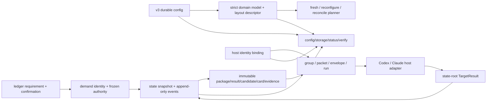
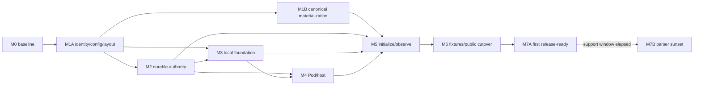
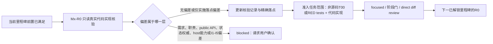

# Wakeflow 初始化 v3 开发实施基线

> 创建日期：2026-08-06
> 状态：`M1A`至`M7A`功能实现均已完成；`M7B`按I4保持`deferred`。M7A历史完成点闭合current-writer fixture退役、Claude facade/profile分责、61个shared normal legacy文件与双host旧send adapter删除、normal/migrator import firewall及live reference closure；2026-08-24的R67完成性审计又删除2个零production-consumer shared facade，当前exact retired shared path为63个。
> 当前结论：v3实现与运行门已经闭合；R67发现的1346个Git ignore隐藏fixture已在用户明确授权的检查点`12503b6`中全部显式纳入，提交后release consistency报告source closure为0、shared core一致且双宿主pack通过。该提交不等于版本更新、tag、发布或插件缓存刷新授权；`M7B`继续等待I4支持窗口，`I3`继续固定Claude exact close+bounded absence、Codex `manual-host-gate`以及unknown/host-wide coverage禁止无人值守激活，且不新增全局workspace registry。
> 未执行边界：已只在用户指定的可丢弃`WakeWorkspace`执行public fresh及self-contained legacy migration lab；未执行真实Codex/Claude host或Git/worktree effect、release操作，整个开发阶段未读取、扫描、运行或写入`AlembicWorkspace`。
> 需求权威：[《Wakeflow 初始化新增本地目录与文件梳理需求与实施基线》](./wakeflow-initialization-generated-files-requirement-2026-08-05.md)
> 实施权威：本文唯一维护阶段拆分、代码落点、依赖、进度与验收证据；不得反向修改需求文档已经确认的D1-D41目标
> 源码范围：Wakeflow开发仓库的`core/`、双宿主artifact、host-specific seam、测试和本文档
> 真实验证环境：仅`WakeWorkspace`；`AlembicWorkspace`在整个开发阶段保持零读取、零命令、零写入
> 授权边界：创建和维护本文档不等于授权代码实现、真实迁移、commit、push、tag、发布或插件缓存刷新

<a id="dev-purpose"></a>
## 1. 文档职责与使用方式

本文解决一个执行期问题：需求文档已经完整回答“Wakeflow为什么需要这些文件、每类文件的唯一职责是什么”，但开发时还需要一份能直接落到代码的上下文，明确“先改什么、为什么先改、改哪些producer/consumer、怎样证明阶段完成”。

两份文档严格分责：

| 文档 | 唯一职责 | 不承担 |
| --- | --- | --- |
| [需求文档](./wakeflow-initialization-generated-files-requirement-2026-08-05.md) | 当前事实、D1-D41目标职责、目标树、迁移合同、环境边界 | 逐任务进度、代码文件清单、阶段完成记录 |
| 本开发文档 | 实施阶段、任务ID、代码落点、依赖、producer-consumer闭环、验证命令、完成证据 | 重开产品决策、修改需求目标、授权真实迁移或发布 |

开发时固定阅读顺序：

1. 根[`AGENTS.md`](../AGENTS.md)，确认源码ownership、安全和验证门。
2. 本阶段任务列出的需求锚点，确认目标与非目标。
3. 本文对应阶段卡，确认前置、代码落点和验收。
4. 在零代码改动下执行本文[`Mx-R0`真实代码实现核验](#dev-realization-audit)：打开真实定义、直接caller/import、schema、writer、consumer、validator和focused tests，形成当前阶段的精确落点与准入结论；只看`rg`命中或历史文档不算完成。
5. `Mx-R0`标记`complete`且结论为`admitted`后，才执行记录中列出的非源码T00或进入RED test和代码修改；开始修改前再次核对`git status --short --branch`和相关diff。

如果源码事实与需求锚点冲突，只允许登记“当前事实 / 已确认目标 / 实现影响”并暂停冲突任务；不得静默改需求，也不得为了满足计划制造不存在的事实。代码文件名、符号名或模块拆分若因真实ownership核验需要调整，但不改变已确认职责，可先更新本文的实施落点和原因后继续；涉及需求职责、public API、状态权威、host能力或I1-I5选择的偏差必须停下请求用户确认。

<a id="dev-status-vocabulary"></a>
### 1.1 状态词

| 状态 | 含义 |
| --- | --- |
| `not-started` | 尚未修改本阶段代码 |
| `in-progress` | 已开始，仍有producer/consumer/test或验收缺口 |
| `blocked` | 明确缺少需求输入、外部能力或安全前置；必须记录解除条件 |
| `deferred` | 有意安排在首个release-ready之后，当前里程碑不以它为依赖；必须记录重新进入条件 |
| `complete` | 本阶段全部代码、消费者、focused tests、规定门禁和直接diff审查均完成 |
| `superseded` | 任务被新的已确认任务替代；必须保留替代指针，不能直接删除历史 |

“脚本退出0”“测试通过一部分”“目标文件已经出现”都不能单独把任务标记为`complete`。

`Mx-R0`复用同一组状态词，但其`complete`仅表示“当前阶段实现核验已完成，并已准入记录中明确列出的任务范围”，不表示整个里程碑代码已完成，也不允许越过记录中的决策停止栅栏。

<a id="dev-requirement-index"></a>
## 2. 需求锚点索引

以下ASCII锚点是开发任务引用需求的唯一方式；不依赖中文标题自动slug，避免标题调整后链接漂移。

| 锚点键 | 需求依据 | 开发用途 |
| --- | --- | --- |
| <a id="dev-req-goal"></a>`REQ-GOAL` | [目标](./wakeflow-initialization-generated-files-requirement-2026-08-05.md#req-goals)、[非目标](./wakeflow-initialization-generated-files-requirement-2026-08-05.md#req-non-goals) | 全局范围与停止条件 |
| <a id="dev-req-d1"></a>`REQ-D1` | [D1 完整初始化](./wakeflow-initialization-generated-files-requirement-2026-08-05.md#req-d01-full-init) | 静态能力可一次性创建，event fact不得占位 |
| <a id="dev-req-config"></a>`REQ-CONFIG` | [config全局定位](./wakeflow-initialization-generated-files-requirement-2026-08-05.md#req-config-authority)、[stable ID](./wakeflow-initialization-generated-files-requirement-2026-08-05.md#req-stable-id-semantics)、[D13 v3合同](./wakeflow-initialization-generated-files-requirement-2026-08-05.md#req-d13-config-v3) | M1A config/identity/layout |
| <a id="dev-req-active"></a>`REQ-ACTIVE` | [D35全局active面](./wakeflow-initialization-generated-files-requirement-2026-08-05.md#req-d35-active-global)、[D36 demand核心](./wakeflow-initialization-generated-files-requirement-2026-08-05.md#req-d36-demand-core)、[D37 capability目录](./wakeflow-initialization-generated-files-requirement-2026-08-05.md#req-d37-demand-capabilities) | M2 durable authority与projection |
| <a id="dev-req-ledger"></a>`REQ-LEDGER` | [D5 ledger](./wakeflow-initialization-generated-files-requirement-2026-08-05.md#req-d05-ledger)、[D15 TargetResult正典](./wakeflow-initialization-generated-files-requirement-2026-08-05.md#req-d15-target-result) | M2 typed records、四个projector与结果单一正典 |
| <a id="dev-req-design-test"></a>`REQ-DESIGN-TEST` | [D6+D8 Design](./wakeflow-initialization-generated-files-requirement-2026-08-05.md#req-d06-d08-design)、[D7+D8 Test](./wakeflow-initialization-generated-files-requirement-2026-08-05.md#req-d07-d08-test) | M1B canonical assets与M5 materialization |
| <a id="dev-req-source"></a>`REQ-SOURCE` | [D9 source ownership](./wakeflow-initialization-generated-files-requirement-2026-08-05.md#req-d09-source-ownership) | core真源、renderer、bundle与双宿主生成物 |
| <a id="dev-req-maintenance"></a>`REQ-MAINTENANCE` | [D10 reset/reconcile](./wakeflow-initialization-generated-files-requirement-2026-08-05.md#req-d10-reset-reconcile)、[D34 local lifecycle](./wakeflow-initialization-generated-files-requirement-2026-08-05.md#req-d34-local-lifecycle)、[维护动作与事件隔离](./wakeflow-initialization-generated-files-requirement-2026-08-05.md#req-d38-maintenance-vs-events) | mutation gate、fresh/reconfigure/reconcile |
| <a id="dev-req-topology"></a>`REQ-TOPOLOGY` | [D11多窗口/同repository](./wakeflow-initialization-generated-files-requirement-2026-08-05.md#req-d11-multi-window-repository) | repository/window/surface正交与共享access card |
| <a id="dev-req-local"></a>`REQ-LOCAL` | [D14 local布局](./wakeflow-initialization-generated-files-requirement-2026-08-05.md#req-d14-local-layout)、[D20 local stable ID](./wakeflow-initialization-generated-files-requirement-2026-08-05.md#req-d20-local-stable-ids)、[D33 audit preserved](./wakeflow-initialization-generated-files-requirement-2026-08-05.md#req-d33-audit-preserved) | M3 local runtime与audit |
| <a id="dev-req-transport"></a>`REQ-TRANSPORT` | [D17 retention](./wakeflow-initialization-generated-files-requirement-2026-08-05.md#req-d17-transport-retention)、[D21四类transport](./wakeflow-initialization-generated-files-requirement-2026-08-05.md#req-d21-transport-contract)、[D22 identity/runtime](./wakeflow-initialization-generated-files-requirement-2026-08-05.md#req-d22-window-identity-runtime) | M3 delivery链与binding fence |
| <a id="dev-req-pod-host"></a>`REQ-POD-HOST` | [D23 Claude window-host](./wakeflow-initialization-generated-files-requirement-2026-08-05.md#req-d23-claude-window-host)、[D24 Pod模型](./wakeflow-initialization-generated-files-requirement-2026-08-05.md#req-d24-pod-model)、[D25 scope](./wakeflow-initialization-generated-files-requirement-2026-08-05.md#req-d25-pod-scope)、[D26 operation](./wakeflow-initialization-generated-files-requirement-2026-08-05.md#req-d26-pod-operations)、[D27 binding](./wakeflow-initialization-generated-files-requirement-2026-08-05.md#req-d27-pod-bindings)、[D28 Test access](./wakeflow-initialization-generated-files-requirement-2026-08-05.md#req-d28-pod-test-access) | M4 Pod state/evidence/host adapter |
| <a id="dev-req-host-ops"></a>`REQ-HOST-OPS` | [D29 keep-live](./wakeflow-initialization-generated-files-requirement-2026-08-05.md#req-d29-keep-live)、[D30 locator](./wakeflow-initialization-generated-files-requirement-2026-08-05.md#req-d30-window-locators)、[D31 Claude operations](./wakeflow-initialization-generated-files-requirement-2026-08-05.md#req-d31-claude-ops-assets)、[D32 runtime-meta删除](./wakeflow-initialization-generated-files-requirement-2026-08-05.md#req-d32-runtime-meta-remove) | M4 host-local操作面 |
| <a id="dev-req-obs"></a>`REQ-OBS` | [D12 observability](./wakeflow-initialization-generated-files-requirement-2026-08-05.md#req-d12-observability) | M5 config/storage/status/verify |
| <a id="dev-req-global"></a>`REQ-GLOBAL` | [D38全局合同](./wakeflow-initialization-generated-files-requirement-2026-08-05.md#req-d38-global-contract)、[fresh tree](./wakeflow-initialization-generated-files-requirement-2026-08-05.md#req-d38-fresh-tree)、[event tree](./wakeflow-initialization-generated-files-requirement-2026-08-05.md#req-d38-event-tree)、[producer-consumer](./wakeflow-initialization-generated-files-requirement-2026-08-05.md#req-d38-producer-consumer)、[波次顺序](./wakeflow-initialization-generated-files-requirement-2026-08-05.md#req-d38-wave-order) | 全阶段共同不变量与依赖 |
| <a id="dev-req-migration"></a>`REQ-MIGRATION` | [D38 cutover](./wakeflow-initialization-generated-files-requirement-2026-08-05.md#req-d38-cutover)、[待决实现选择](./wakeflow-initialization-generated-files-requirement-2026-08-05.md#req-d38-open-decisions)、[D39逐path动作](./wakeflow-initialization-generated-files-requirement-2026-08-05.md#req-d39-legacy-actions)、[D40 origin/fixture](./wakeflow-initialization-generated-files-requirement-2026-08-05.md#req-d40-origin-fixtures)、[D19 legacy退役](./wakeflow-initialization-generated-files-requirement-2026-08-05.md#req-d19-legacy-retirement) | M6 cutover、M7A首发清理与M7B延期parser退役 |
| <a id="dev-req-env"></a>`REQ-ENV` | [D41开发边界](./wakeflow-initialization-generated-files-requirement-2026-08-05.md#req-d41-dev-boundaries)、[WakeWorkspace重建协议](./wakeflow-initialization-generated-files-requirement-2026-08-05.md#req-d41-wakeworkspace-rebuild) | 开发环境与真实验收边界 |
| <a id="dev-req-constraints"></a>`REQ-CONSTRAINTS` | [方案约束](./wakeflow-initialization-generated-files-requirement-2026-08-05.md#req-constraints)、[完成标准](./wakeflow-initialization-generated-files-requirement-2026-08-05.md#req-requirement-done) | 全局验收与授权边界 |

阶段卡引用上表的`dev-req-*`行锚点；复合键表示该行列出的**全部**需求链接共同构成验收依据，不能只按第一个链接实现。

<a id="dev-current-baseline"></a>
## 3. 当前真实代码基线与根因

本文以当前源码为基线，不把目标设计写成已经实现。当前初始化调用链、当前生成基线与逐文件事实来源分别见需求文档的[初始化调用链](./wakeflow-initialization-generated-files-requirement-2026-08-05.md#req-current-init-chain)、[初始化基线](./wakeflow-initialization-generated-files-requirement-2026-08-05.md#req-current-init-baseline)和[事实来源](./wakeflow-initialization-generated-files-requirement-2026-08-05.md#req-fact-sources)：

| 领域 | 当前真实入口 | 当前根因 | 目标实施方向 |
| --- | --- | --- | --- |
| config | `core/schemas/wakeflow-config.schema.json`、`core/scripts/lib/wakeflow-config.mjs` | v2 durable input先被归一成flat effective shape；normal loader仍识别旧文件名和local overlay；semantic name仍参与关系与文件键 | strict v3 domain model、typed stable refs、normal runtime零legacy fallback |
| setup | `core/scripts/wakeflow-setup.mjs` | 单文件同时拥有config、模板bundle、Design/Test scaffold、memory、gitignore、local registry/projection和semantic-name reset；继续加分支会放大双权威 | 保留CLI facade，把格式、planner、writer、validator下沉到各domain service |
| template/Skill | 两个artifact的`templates/wakeflow-template-bundle.json`及setup literal patch | 64-entry bundle没有可审计canonical source builder，host差异和runtime patch混合 | `core/` canonical source → typed renderer → deterministic host artifact |
| ledger/active | state脚本、TODO脚本、archive脚本、workspace projector、state schemas | Markdown/JSON的authority、projection、starter和历史兼容仍有重复；capability目录及artifact schema不完整 | typed records、唯一TODO、六层demand authority、四个ledger projector |
| local identity | `wakeflow-thread-registry.mjs`、`wakeflow-window-runtime.mjs`、setup内registry路径逻辑 | v2/v3 registry和semantic filename并存；projection混合eligibility/registration/sendability | stable `windowId` binding唯一保存real handle；window-runtime纯投影 |
| delivery | delivery store/commands/review/result/trace/status | group重建、legacy packet/result路径、lease与state commit fence不完整；GC主要只覆盖run | mandatory group/packet/envelope/run，strict ref/digest，archive-gated整链retention |
| Pod | `wakeflow-pod-runtime.mjs`、`wakeflow-pod.mjs`、state reducer | mutable manifest/operation/binding聚合逻辑状态、host事实与receipt | state-first membership/phase，分项immutable intent/event/receipt |
| Claude host | `plugins/claude-code-wakeflow/scripts/lib/wakeflow-claude-host.mjs` | 单体混合identity、locator、paste/readback、monitor、settings/statusline、runtime-meta、legacy stream和Pod | 保留CLI facade，内部拆为locator/transport/settings-assets/activity/Pod seam |
| storage/observability | storage map/CLI、layout/verify、MCP view/status | README seed、浅白名单、read/write混合view、多个状态解释面 | descriptor-driven递归inventory；config/storage/status/verify严格分责且只读 |
| migration | normal config fallback、overlay、legacy readers散落各domain | 没有独立classifier、冻结plan、journal、recovery和host decommission合同 | self-contained fixture + offline/bootstrap explicit migrator；normal runtime只报`migration-required` |

当前聚合模块不能“一次性重写”。正确顺序是先抽出共享domain contract并让现有facade调用，再在完整consumer闭环后切换公开入口，最后删除旧分支。这样既避免第二套权威，也能让每一步拥有可运行的focused test。

<a id="dev-target-flow"></a>
## 4. 目标数据流与实施依赖



依赖关系：



W0拆为两个性质不同的成果：

- **W0-A（已完成）**：D39逐path动作和D40 origin/fixture合同已经冻结，属于需求基线。
- **W0-B（M6实施）**：把合同物化为checked-in fixture、classifier、golden preview/apply和migration tests；必须先于W10 apply完成，但不阻塞纯净v3主链开发。

M1A-M5可以逐步形成internal/test-only v3 candidate，但不得把半完成v3作为public schema或现有workspace的normal runtime。M5用candidate artifact在指定`WakeWorkspace`验证完整fresh链；M6才在唯一公开切换点同时提升public schema、默认示例、MCP/CLI合同与normal dispatcher。不存在正式的normal runtime双读/双写版本。

每个代码里程碑都先经过同一条实现准入链；`Mx-R0`是该里程碑的首个子阶段，不是新的产品波次：



<a id="dev-global-rules"></a>
## 5. 全阶段实施规则

### 5.1 每个任务必须闭合六个角色

| 角色 | 必答问题 |
| --- | --- |
| schema/domain | 文件、字段、ID、ref、状态和错误码由谁严格定义？ |
| producer | 哪个事件或维护动作可以创建/更新？是否唯一？ |
| writer | 原子性、锁、CAS、managed component和失败恢复如何实现？ |
| consumer | 哪些runtime、MCP、host adapter或Agent入口真实读取？ |
| projector/validator | 哪些视图可重建；哪个validator判断合同而不修复？ |
| test/retention | 正例、负例、并发、崩溃、隐私、删除门和支持窗口如何证明？ |

缺任一项，任务保持`in-progress`；不能以“未来可能有consumer”为文件或字段辩护。

### 5.2 共享与宿主源码边界

- host-neutral schema、domain service、state、layout、transport、retention和validator只修改`core/`，随后运行`npm run sync:core`和`npm run check:core`。
- Codex/Claude差异只进入各自host profile、artifact checks、send adapter、manifest、memory、commands和明确的host helper seam。
- 不直接维护同步生成到`plugins/*`的core副本；只检查同步diff。
- plugin cache是安装输出，不是开发源；未经授权不刷新。

### 5.3 写入与删除纪律

- fresh initialize、reconfigure、reconcile、runtime event、explicit migration是五种不同入口，不共享“万能修复”分支。
- 每次写入先做strict read、ownership classification、path/type/containment检查和plan；mixed-owned文件只修改exact key/block/entry。
- host副作用不能伪装成文件事务；使用frozen intent、binding/state fence、append-only receipt/run和可恢复journal表达。
- 删除必须晚于replacement producer/consumer、reference scan、lifecycle/retention gate和exact source授权。
- unknown、corrupt、symlink escape、private evidence、modified generated和manual项默认原位保留并fail closed。

### 5.4 环境边界

- M1A-M4只使用仓库测试创建的临时目录，不把半成品写入真实workspace。
- M5开始在`WakeWorkspace`执行真实fresh/reconcile/reconfigure；M6可把self-contained legacy fixture显式物化到该环境。
- 每次`WakeWorkspace`清理都先输出exact path/type/digest/ownership清单；禁止清空workspace根、使用宽泛glob或按名称/mtime猜ownership。
- `AlembicWorkspace`不读取、不扫描、不执行命令、不preview、不初始化、不迁移、不写入，也不作为验收门。

### 5.5 阶段完成证据

每个阶段完成记录必须包含：对应`Mx-R0`核验记录及其源码基线、实际改动文件、producer/consumer闭环、focused test命令和结果、同步artifact diff、host validator/smoke、真实环境证据（若适用）、残余风险、未运行项、是否允许进入下一阶段的R0。子任务或脚本自报成功只作为审查输入，最终结论必须由直接diff和证据检查得出。

<a id="dev-implementation-decisions"></a>
### 5.6 实施选择登记与冻结门

D1-D41的职责方向已经确认；下列是不会改变文件职责、但会改变public API、打包或验收命令的实施选择。M0的`complete`表示它们已被识别并设置冻结门，不表示具体方案已经选定。

| ID | 实施选择 | 当前状态 | 决策owner | 必须在何时冻结 | 未冻结时允许/禁止 |
| --- | --- | --- | --- | --- | --- |
| I1 | `initialize / reconfigure / reconcile`及显式migration采用独立MCP工具，还是单一严格discriminated maintenance action | `confirmed`（2026-08-09；I2于2026-08-10补齐部署边界）：采用单一`wakeflow_maintain_workspace` logical action family，action词汇固定为`fresh-initialize / reconfigure / reconcile / explicit-migration`，mode固定为`preview / apply / recover`；每个action仍有唯一schema、backend validator和action-specific coordinator。normal public MCP只注册前三个v3 action并在M6-T10原子替换旧initialize；`explicit-migration`只由I2 exact bootstrap承载，normal dependency graph不得import legacy parser | 用户确认，开发者提供基于真实MCP surface的选项与影响 | 已在M5-T01与`WakeWorkspace` exact invocation前冻结；I2部署边界在M6-T00冻结；M6-T10才公开激活三项normal action | 禁止占位migration branch、generic repair handler、public-v2提前cutover、通过argv传完整plan或把legacy parser导回normal MCP |
| I2 | offline/bootstrap的artifact定位、打包和exact invocation | `confirmed`（2026-08-10）：采用[`M6-R0`](#dev-m6-r0)合同；每个artifact内置、不注册`bin/wakeflow-bootstrap`，从自身real path固定启动migration-only backend，零argv、stdin/stdout、一次单workspace；new/legacy artifact均用bounded完整regular-file tree manifest计算identity，legacy root由用户每次显式提供，symlink/special/越界fail closed；不使用semver/tag/runtime-meta/npm integrity猜owner，不加载/代执行旧artifact，不扫描磁盘或建全局registry | 用户确认，开发者提供双artifact可离线执行方案 | 已在M6 fixture provenance实现前冻结 | 准入M6-T01起的fixture/provenance/classifier/bootstrap内部实现；public-v2、normal migration import、真实workspace migration/apply继续禁止至各自任务门 |
| I3 | Codex/Claude decommission receipt与host-wide activation coverage | `confirmed`（2026-08-09）：Claude仅在exact close成功且bounded post-close probe证明exact pane/window/session不存在时为machine-verified；Codex archive不是“旧writer绝不再运行”的机器证明，统一输出`manual-host-gate`；activation scope无host证据时为`unknown`，`unknown`或`host-wide` coverage禁止unattended activation，影响workspace集合只能由用户显式提供/确认，不新增全局workspace registry | 开发者按真实host capability给方案，用户确认人工门语义 | 已在M4-T12能力合同前冻结；M6 public activation仍必须消费同一coverage gate | T12可实现host-neutral result及双host outcome；T13只可从exact host observation提升scope，不能由调用方自报或由单workspace成功推断全宿主安全 |
| I4 | migration-only parser支持几个发行版本 | `pending` | 用户确认，开发者提供兼容/维护成本 | 首个v3 release notes冻结前 | 不阻塞M1A-M7A；M7B保持`deferred`直到窗口结束 |
| I5 | product root Claude permission seed的逐root显式授权表面 | `confirmed`（2026-08-09）：调用方以配置中stable `repositoryId` exact set逐root授权；plan/apply均重验当前repository→root映射，未列入集合的product root对permission key/entry零写入；不得由`instructionManagement`、host preference、workspace topology或一次初始化授权推导 | 用户确认；mixed-owned writer负责机械消费，不拥有授权判断 | 已在M4-T09 writer前冻结；M5/M6沿用同一合同 | 只准对exact authorized repository root合并Wakeflow-owned portable allow entries；custom/unmanaged/invalid冲突保留并诊断，授权集合之外禁止permission写入 |

任何选择一经确认，必须在本表记录`confirmed`、选定合同、日期和受影响任务，再补齐exact command/schema测试。`instructionManagement`、host preference、workspace拓扑或一次初始化授权都不能隐式替代I5；D39已冻结legacy通用分类，真实实例的`manual`确认不是新的设计分支。

<a id="dev-realization-audit"></a>
### 5.7 `Mx-R0`：阶段前真实代码实现核验

**硬门：M1A、M1B、M2、M3、M4、M5、M6、M7A和解除`deferred`后的M7B，都必须先完成各自的`<阶段>-R0`；当前R0未达到`complete + admitted`时，不得修改该阶段的源码、schema、artifact或测试期待。** R0回答“已确认目标怎样接入当前真实代码”，不重新回答“产品目标应该是什么”。

#### 为什么按阶段执行

M0与§3/§7提供的是开工前全局地图，不可能替代未来HEAD上的真实调用链；如果现在一次性深挖所有阶段，后续前置实现会让结论过期，也容易把实现核验重新扩散成需求讨论。因此R0采用just-in-time方式：只在阶段依赖满足后核验该阶段的真实接缝，形成可执行落点和RED计划，随后立即进入准入范围，不长期囤积推测性调研。

#### 范围与停止条件

- R0只审查当前里程碑以及其已完成前置提供的直接接口；不得顺手审查后续里程碑或重新做全仓项目调研。
- R0对源码、artifact、fixture和workspace保持只读；允许更新本文的核验记录，并运行只读搜索、现有baseline test和validator。RED test属于实现，必须等`admitted`后再写。
- R0 baseline只运行当前HEAD已存在的测试文件和命令；阶段卡中标注“计划新增”的测试只能登记为future RED计划。准入后必须先创建包含真实失败断言的测试再运行，不能把“测试文件不存在”或命令无法解析当成RED证据。
- M1A-M4的R0只在Wakeflow源码仓库内完成；M5以后也不以R0为理由提前写`WakeWorkspace`。`AlembicWorkspace`在所有R0中仍为零读取、零命令、零写入。
- 当下表的输入、产出和退出条件全部闭合即停止核验并进入实现，不以“也许还能发现更多”为理由无限扩展。

#### 固定输入

| 输入 | 必须核对的事实 |
| --- | --- |
| 权威与范围 | 根及相关嵌套`AGENTS.md`、本阶段需求锚点、阶段卡、I1-I5相关冻结门 |
| 源码基线 | branch、HEAD、`git status --short --branch`、与本阶段重叠的既有diff；保留用户变更，不把它归因于本阶段 |
| 真实调用链 | 入口定义、直接caller/import、schema/domain、producer/writer、lock/CAS/journal/外部副作用、consumer/projector/validator |
| 宿主与生成边界 | `core/`真源、双宿主同步副本、host profile/adapter、artifact validator和打包脚本的真实分界 |
| 测试与迁移边界 | 当前确实存在的focused tests、package scripts、sync/parity/validate/smoke入口；计划新增的RED合同；旧producer/reader与预定删除门 |
| 前置阶段成果 | 已交付接口、完成记录、残余风险，以及它们是否仍与当前HEAD一致 |

#### 必须产出的核验记录

| 产出 | 记录要求 |
| --- | --- |
| source baseline | branch、HEAD、相关dirty path/diff摘要及必要digest；不得写入本机私有绝对路径、real handle或secret |
| symbol/call graph | 以符号和仓库相对路径记录`entry → domain → writer → consumer/projector/validator`；行号只可作当次辅助，不作为长期权威 |
| producer-consumer迁移矩阵 | 当前owner/reader、目标seam、过渡阶段、old path保留原因与删除门 |
| write/effect model | 原子写、lock/CAS、journal、外部host effect、失败顺序和恢复边界；纯只读阶段也要明确“无writer” |
| test baseline与RED计划 | existing-only baseline的exact命令与当前结果；准入后才创建/执行的future RED文件、命令和预期失败合同；阶段级门禁 |
| deviation ledger | 逐项记录“当前事实 / 本文假设 / 实现影响 / 处置”；没有偏差也明确写`none` |
| admission decision | `admitted`或`blocked`、本次准入的exact任务范围、源码落点、禁止事项，以及尚未冻结选择对应的首个停止任务 |

#### 偏差分流

| 偏差类型 | 处置 |
| --- | --- |
| 无偏差 | 记录R0为`complete`、结论`admitted`，立即执行记录中的任务范围；进入代码任务时先取得真实RED |
| 仅实施落点偏差 | 文件名、符号名、内部模块拆分或测试文件需要调整，但职责、外部合同和阶段顺序不变；更新本文的精确落点与原因，R0仍可准入 |
| 产品/合同偏差 | 若触及D1-D41职责、public API、状态或证据权威、host capability、安全边界、阶段依赖，或当前代码任务范围需要的I1-I5选择，R0标记`blocked`并请求用户确认；已有明确后续冻结点且不影响当前任务范围的pending I项，可以登记停止栅栏后准入独立前缀。唯一例外是仅形成并记录该用户决定的非源码T00可以作为准入范围，但不得越过T00或自行假设答案 |
| 既有dirty/failure | 保存和归属既有变化；只在与本阶段重叠、无法安全隔离或导致baseline不可判定时阻塞，不得把它报告为新实现结果 |

#### `complete + admitted`退出条件

1. 已直接打开入口定义与全部直接caller/import，而不是只依据`rg`列表、历史文档或子任务摘要。
2. schema/domain、producer、writer、consumer、projector/validator、test/retention六个角色均已映射；无角色时写清为何不存在。
3. 当前consumer、过渡consumer、public surface、legacy-only reader和删除门已分类，不存在未登记双权威。
4. 本次准入任务范围的exact代码落点、host/core ownership、写入/副作用顺序和首批RED test已经确定。
5. baseline命令及其真实结果已记录；既有失败已和本阶段预期失败分开。
6. 每个偏差都已按上表处置；代码任务准入范围开始前或执行中不存在未解决的用户决定。允许保留的pending I项必须同时记录owner、冻结点、首个被阻塞任务和禁止越过的停止栅栏；若准入范围仅为decision-only T00，记录必须明确列出`User decision required`和T01停止栅栏，答案确认前T00不能完成、范围不能扩展。
7. 主执行窗口已直接复核源码事实、相关diff和证据；不能只凭Agent、脚本或测试自报成功。

R0的`admitted`不是整阶段无条件放行：无pending gate时可列出全部阶段任务；有pending I项时只准入不依赖它的任务前缀，或只准入负责形成用户决策输入的非源码T00。到达停止栅栏前必须先冻结该选择并更新R0记录；若选择改变了已核验假设或调用链，只把受影响部分退回`in-progress`做增量复核。实现开始前若HEAD、相关dirty diff、前置接口或已核验调用链发生变化，也采用同一规则，不重跑无关范围。R0记录使用[§10.2模板](#dev-realization-audit-record)，其结论只准入当前阶段列出的任务范围，不授权commit、release、cache refresh、真实迁移或任何计划外workspace写入。

<a id="dev-phases"></a>
## 6. 分阶段代码实施卡

除纯文档基线M0外，以下每张阶段卡都隐含一个首个子阶段`<阶段>-R0`。任务表列出的是R0准入后的执行任务；只有明确标为“非源码”的T00负责冻结选择，其余均为代码任务。前一阶段完成只允许启动已满足依赖的后续R0，不直接允许编码。

<a id="dev-phase-m0"></a>
### 6.0 M0：需求、代码与测试基线冻结

**状态：`complete`（仅表示已确认需求、真实代码/测试基线和待决实施选择均已登记；不表示I1-I5已选定，也不表示任何v3源码已实现）**

**需求依据：**[`REQ-GOAL`](#dev-req-goal)、[`REQ-GLOBAL`](#dev-req-global)、[`REQ-MIGRATION`](#dev-req-migration)、[`REQ-ENV`](#dev-req-env)、[`REQ-CONSTRAINTS`](#dev-req-constraints)

#### 前因与目的

D1-D41已经确认，但如果需求文档和开发文档同时维护任务拆分，或开发任务依赖中文自动锚点，实施中会出现“同一阶段两种范围”和链接漂移。M0只解决执行上下文问题，不修改runtime行为。

#### 最终目标

- 需求文档只拥有产品合同，新文档只拥有任务拆分和进度。
- 每个阶段可通过稳定ASCII锚点回到原始需求。
- 当前源码入口、测试入口、环境边界、待决实施选择和未提交状态有可复核基线。
- W0-A/W0-B、M1A/M1B及M5才进入真实workspace的边界无歧义。

#### 拆分任务

| 任务 | 实现/文档落点 | 必须完成 |
| --- | --- | --- |
| M0-T01 锚点注册 | 需求文档关键章节前的`<a id="req-..."></a>` | 新文档所有需求链接可解析且无duplicate id |
| M0-T02 权威分责 | 需求文档§15与本文§1 | 删除双计划权威；需求只保留实施入口和高层阶段摘要 |
| M0-T03 状态矛盾收口 | 需求文档顶部、非目标、D40/D41、WakeWorkspace协议 | “整体未实现”不否认已有CURRENT能力；迁移合同已确认但未授权执行；M1-M4不要求真实workspace |
| M0-T04 代码入口盘点 | 本文§3、§7 | 覆盖config/setup/template/state/local/delivery/Pod/host/observability/migration真实owner |
| M0-T05 测试入口盘点 | 本文§9 | 固定focused、sync/parity、双host validate/smoke、全仓和WakeWorkspace五层门 |
| M0-T06 待决选择登记 | 本文§5.6、需求D38实施级选择 | 登记I1-I5的owner、最迟冻结阶段和未冻结时禁止事项；不把“已识别”误写成“已确认方案” |

#### 验收标准

1. 两份文档没有冲突状态或重复任务权威。
2. 所有`#req-*`链接均指向需求文档中唯一显式id。
3. Markdown fence、表格、JSON示例和相对文件链接通过结构校验。
4. `git status`仅包含用户已知文档变化；不出现源码、artifact或workspace写入。
5. 开发环境说明中不存在本机绝对路径、real handle或`AlembicWorkspace`操作步骤。

M0完成后只允许进入`M1A-R0`；其结论达到`complete + admitted`后才允许开始`M1A-T01`。I1-I5分别在自己的最迟冻结门前确认，不阻塞与其无关的更早internal domain工作。

<a id="dev-phase-m1a"></a>
### 6.1 M1A：typed identity、v3 config与layout内核

**状态：`complete`（`M1A-R0 complete + admitted`；T01-T07 complete；M1A阶段统一门通过）**

**对应波次：**W1-W2内核部分

**需求依据：**[`REQ-D1`](#dev-req-d1)、[`REQ-CONFIG`](#dev-req-config)、[`REQ-TOPOLOGY`](#dev-req-topology)、[`REQ-GLOBAL`](#dev-req-global)、[`REQ-SOURCE`](#dev-req-source)

#### 前因与为什么先做

当前`wakeflow-config.mjs`把v2 durable input归一成flat effective config，normal read路径还包含legacy filename与local overlay；`stableArtifactPart()`从语义字符串生成文件名，只适合显示/legacy，不能成为program/repository/window/binding的持久身份。后续ledger、local、transport、Pod和setup若先各自实现ID或路径，会形成多套mapping与验证逻辑。

因此M1A先建立所有writer共享的严格模型和纯函数layout contract，但不切换现有workspace、不公开半成品v3 initializer。

#### 最终目标

- v3 config只含`program/topology/storage/governance/hosts` durable intent。
- program/repository/surface/window使用带类型前缀的UUID v4；跨字段只用typed ref。
- `.wakeflow-active`和`.wakeflow-local`是固定协议根，storage只保留真实durable ledger root。
- 一个纯函数layout descriptor给出expected path、owner、lifecycle、tracking、permission、host capability和create timing。
- v3 config parser、serializer、digest和path safety只有一个共享实现；旧public v2 parser在切换前保持隔离，不复用v3 writer。
- internal v3 schema/loader拥有独立、明确的candidate入口；当前唯一public schema、默认示例和normal dispatcher在M6原子切换前保持v2。
- v1/v2 normal runtime在完整cutover前保持当前行为；v3 internal/test入口与旧入口不会同时写同一workspace。

#### 代码任务

| 任务 | 主要代码落点 | 实现动作 | 下游consumer与完成输出 |
| --- | --- | --- | --- |
| M1A-T01 typed ID/ref | 计划新增`core/scripts/lib/wakeflow-identifiers.mjs`、`core/schemas/wakeflow-config-v3.schema.json` | 定义`program/repository/surface/window`前缀、UUID v4生成/校验、类型匹配、重复和悬空ref错误；禁止semantic name/path/host handle充当ID；v3 schema先作为internal candidate，不覆盖public schema | v3 config loader、layout、state、identity、Pod和migrator共用；非法/跨类型ref fail closed |
| M1A-T02 strict v3 domain model | 计划新增`core/scripts/lib/wakeflow-config-v3.mjs`及测试用v3 examples；保留当前`wakeflow-config.mjs`、`core/schemas/wakeflow-config.schema.json`和public defaults | v3拒绝unknown field；按D13建立program/topology/storage/governance/hosts；candidate schema使用独立internal `$id`（固定为`urn:wakeflow:internal:config:v3-candidate`），candidate config的`$schema`必须精确引用它，绝不冒充public URL；提供read-only explain model并与v1/v2 public normal入口隔离 | internal setup candidate、document placement、status/storage/verify、host profile只读所需domain；M6前不改变public schema URL/default examples/normal dispatch，internal URN不得出现在release artifact的public defaults |
| M1A-T03 canonical bytes/digest | 计划新增`core/scripts/lib/wakeflow-canonical-json.mjs`；收敛Pod/delivery中重复stable JSON | 统一canonical JSON、content digest、typed ref digest；禁止把展示字段、mtime或host secret归一成identity | config plan、immutable artifacts、migration stale fence共享同一算法 |
| M1A-T04 layout descriptor | 计划新增`core/scripts/lib/wakeflow-layout-descriptor.mjs`；修改`wakeflow-document-placement.mjs`、`wakeflow-storage-map.mjs` | 从v3 model+host capability生成fresh/static/event-only/conditional surface descriptors；固定active/local协议根；描述configured ledger/support/product roots及ownership | initialize、reconcile、storage、verify和migration inventory不再各写路径表 |
| M1A-T05 filesystem写入原语 | 扩展`wakeflow-fs-safety.mjs`；计划新增`wakeflow-atomic-write.mjs` | 提供same-directory stage/rename、exact type/digest CAS、realpath containment、mode和mixed-owned前置接口；不实现业务状态机 | 所有后续domain writer复用；path escape、symlink、类型变化和stale source可结构化失败 |
| M1A-T06 host capability seam | 计划新增`core/scripts/lib/wakeflow-host-capability.mjs`；`core/scripts/lib/wakeflow-host-profile.mjs`及两个artifact的host profile/contract tests | profile以同形strict descriptor显式声明identity、Pod、keep-live、locator、settings/assets、activity/temp、close/revoke的适用性与当前realization；shared code只消费capability/path数据，不写host名分支，也不把适用性冒充live/available | layout和M4 host adapter按capability物化；Codex不产生Claude占位；core开发profile补齐Pod/profile合同但不冒充真实host adapter |
| M1A-T07 consumer过渡层 | config直接消费者：state/delivery/TODO/archive/storage/layout/repo status等 | 为internal v3 candidate增加typed accessor；逐一登记旧public v2 consumer和预定切换阶段，禁止新增未登记flat read；不得让同一normal invocation同时尝试v2/v3 | 得到“旧public路径 / 新candidate路径 / M6删除门”清单；M6可原子翻转dispatcher而非临时双读 |

#### 明确不在本阶段做

- 不创建真实workspace文件，不修改`WakeWorkspace`。
- 不迁移v1/v2 workspace，不删除legacy loader/overlay。
- 不创建demand、binding、transport、Pod或host evidence。
- 不让`wakeflow_initialize_workspace`对用户公开不完整v3 apply。
- 不修改public `wakeflow-config.schema.json`、默认config样例或正常MCP dispatcher的版本含义。
- 不把所有ID塞进config；demand/task/result/binding仍由其领域事件生成。

#### Focused tests

计划新增：

- `test/wakeflow-v3-config.test.mjs`
- `test/wakeflow-canonical-json.test.mjs`
- `test/wakeflow-layout-descriptor.test.mjs`
- `test/wakeflow-atomic-write.test.mjs`
- `test/wakeflow-host-capability-contract.test.mjs`
- `test/wakeflow-config-consumer-registry.test.mjs`

保留并重构：`wakeflow-config-name.test.mjs`、`wakeflow-validate.test.mjs`、`sync-core.test.mjs`、`claude-host-surface.test.mjs`。

```sh
node --test test/wakeflow-v3-config.test.mjs test/wakeflow-canonical-json.test.mjs test/wakeflow-layout-descriptor.test.mjs test/wakeflow-atomic-write.test.mjs test/wakeflow-host-capability-contract.test.mjs test/wakeflow-config-consumer-registry.test.mjs test/wakeflow-config-name.test.mjs test/wakeflow-document-placement.test.mjs test/wakeflow-storage.test.mjs test/wakeflow-validate.test.mjs test/sync-core.test.mjs test/claude-host-surface.test.mjs
```

#### 阶段验收

1. 合法最小/完整v3、多window同repository、四种Design/Test ownership组合和双host偏好可严格解析；candidate schema `$id`与config `$schema`精确等于internal URN，且public schema/default/runtime均未引用该URN。
2. unknown field、非法/重复ID、悬空/跨类型ref、非法root、path escape、symlink全部有稳定错误码并零写入。
3. 同一input在Codex/Claude生成相同host-neutral model和layout digest；host-only surface只因capability不同。
4. config explain只解释durable intent，不读取live host/runtime。
5. current public schema/default examples/normal dispatcher仍为v2；现有v1/v2 normal runtime未被半完成v3改写，任何v3写入口仍限于测试/internal seam。
6. focused tests、shared-core同步与双host基础验证通过，diff证明共享代码只从`core/`生成。

M1A交付给M1B/M2/M3的是typed model、layout descriptor和写入原语，不是可发布initializer。

#### M1A-R0 核验记录

```text
Realization audit:
Status: complete
Admission: admitted
Milestone: M1A
Requirement anchors: REQ-D1 / REQ-CONFIG / REQ-TOPOLOGY / REQ-GLOBAL / REQ-SOURCE
Source baseline (branch / HEAD / relevant dirty paths and diff): branch main at 70d79d720d65837a068993006f356e8de91215d4; main...origin/main; only the two user-known untracked requirement/development documents exist; no overlapping source diff
Definitions opened: public v2 schema/defaults; wakeflow-config exports and overlay/durable/effective loaders; setup/CLI/MCP/runtime entry; document placement/storage map/fs safety/state-path helpers; Pod/idempotency digest helpers; three host profiles and two send adapters; sync-core/artifact validators; focused tests
Entry symbols and direct callers/imports: public wakeflow_initialize_workspace -> runWakeflowRuntime(wakeflow-setup initialize) -> commandContext()/initializePayload()/configurePayload() -> v2 durable/effective config; candidate v3 currently has no entry or writer; 27 direct wakeflow-config.mjs importers are classified below and will be frozen by a test-enforced registry
Schema/domain owner: public wakeflow-config.schema.json + normalizeWorkspaceConfigInput() remain v2; new internal wakeflow-config-v3.schema.json + parseWakeflowConfigV3Candidate() own v3 structural/semantic validation without Ajv, v2 flatten, implicit defaults, legacy-name lookup, env override or local overlay
Producer/writer/lock/effect/recovery: R0 itself is read-only; current setup writeJson() and Claude set-unattended remain legacy v2 writers and are not changed in M1A; new candidate serializer has no public writer; atomic primitive provides same-directory wx stage/rename, explicit type+digest expectation, path/type/mode checks and mixed-owned precondition, but no business lock/state machine and no claim of fsync durability or race-proof CAS without the later mutation gate
Consumers/projectors/validators: typed v3 indexes/accessors feed only candidate layout/document-placement/storage paths in M1A; all normal state/delivery/TODO/archive/status/setup/CLI/MCP consumers stay v2 until their recorded phase and M6 cutover; artifact validator checks the candidate schema/profile contract without changing public defaults
Core/host/artifact ownership seams: shared modules and candidate schema originate in core and sync to both artifacts; all three host profiles are maintained separately because sync-core excludes the core development profile and preserves artifact host profiles; send adapters/manifests/MCP wiring remain host-local
Existing-only baseline commands and results: npm test completed check:core, both validators and both smokes, then reported 599/600 once; an immediate exact `node --test --test-reporter=dot test/*.test.mjs` rerun passed 600/600, so the wrapper-only non-reproduction is retained as baseline risk rather than a RED; the six-file M1A existing subset passed 40/40; independent identity/path/Pod/delivery and host/artifact subsets passed 156/156 and 68/68 respectively
Future RED tests/commands and expected failures (create only after admission): wakeflow-v3-config rejects unknown/invalid IDs/refs/cardinality/host/path fields and proves v2 isolation; wakeflow-canonical-json proves recursive ordering, JSON-domain rejection and current Pod/delivery digest equivalence; wakeflow-layout-descriptor proves fresh/event-only/capability/ownership paths and host-neutral digest; wakeflow-atomic-write proves missing/file digest CAS, mode, cleanup, escape/symlink/type and mixed-owned failure; wakeflow-host-capability-contract proves strict three-profile shape and no fake host surfaces
Current -> target producer/consumer migration: M2=document placement/TODO/next-work/archive; M3=state/delivery/intake/demand-sequence/status/review/window-runtime/workspace projection/render; M4=Pod and raw Codex/Claude host preference readers/writers; M5=setup/storage/layout/health/repository checks; M6=CLI/validator/public dispatcher. T07's exact registry records current symbols, candidate accessor, cutover phase and M6 deletion gate, and fails on an unregistered new flat importer
Legacy/current retention and deletion gates: public v1/v2 loader, overlay precedence, stableArtifactPart semantic filenames, legacy raw host readers/writers and current public defaults remain unchanged through M1A; they are removed only by their later owner and M6/M7 gates, never by this candidate kernel
Plan deviations (current fact / prior assumption / impact / disposition): T04 depends on a capability contract absent from current profiles, so execute T06 before T04; add wakeflow-host-capability.mjs. The original three planned tests did not isolate canonical/atomic contracts, so add two focused suites. T07 had no executable importer guard, so implement the registry in tests rather than a fake runtime state file. Core development profile lacks pod.entryExtras, so add an explicit development seam without copying an artifact adapter. supportSurfaces has no confirmed maxItems=2 constraint, so validate referenced capability/cardinality without inventing that limit. These are implementation landing corrections only; product contract deviation: none
Admitted task range: M1A-T01 through M1A-T07, executed as T01 -> T02 -> T03 -> T05 -> T06 -> T04 -> T07 so dependencies are real
Decision stop fences (pending item / owner / freeze point / first blocked task): I1 user/M5 candidate public-action freeze/T00-T01 fence; I2 user/M6 migration fixture; I3 user+developer/M4 capability/decommission T12; I4 user/pre-release notes/M7B; I5 user/M4 settings writer T09. None blocks M1A; no fence may be crossed early
Exact code landing after admission: core/scripts/lib/wakeflow-{identifiers,config-v3,canonical-json,fs-safety,atomic-write,host-capability,layout-descriptor}.mjs; internal v3 schema; explicit descriptor adapters in document-placement/storage-map; three separate host profiles; shared validator; five RED suites plus current regression/consumer guard
Forbidden scope: no public v3 schema/default/MCP/normal dispatcher, no current v2 writer conversion, no state/delivery/TODO/archive/Pod fact or migration implementation, no real workspace, no WakeWorkspace before M5, zero AlembicWorkspace access, no commit/release/cache refresh
User decision required: none for admitted M1A range
Primary direct review: root window opened the definitions/callers, reproduced the direct 600/600 suite and 40/40 focused subset, checked the unchanged git baseline, and treated subagent findings only as cross-check input
```

#### M1A-T01 完成记录

```text
Task: M1A-T01 typed ID/ref
Status: complete
Requirement anchors: REQ-D1 / REQ-CONFIG / REQ-TOPOLOGY
Realization audit pointer: M1A-R0
R0 assumptions/call graph still valid after this task: yes
Current code facts verified: program/repository/surface/window使用typed-prefix UUID v4；全局duplicate index、typed ref、悬空ref和跨类型ref均fail closed；semantic title/path/host handle不参与identity
Files added/modified/deleted: core/scripts/lib/wakeflow-identifiers.mjs；core/schemas/wakeflow-config-v3.schema.json；test/fixtures/wakeflow-config-v3/*；test/wakeflow-v3-config.test.mjs
Schema/domain owner: wakeflow-identifiers.mjs拥有typed ID/ref语法与index；candidate schema只声明结构，不取代领域semantic closure
Producer/writer: generateWakeflowId()只生成typed identity；本任务没有workspace writer
Consumers/projectors/validators: strict v3 loader/indexes和后续layout/state/Pod/migrator domain可复用；当前normal public consumer仍不导入candidate入口
Focused tests and results: wakeflow-v3-config共享套件9/9通过，覆盖生成、解析、duplicate、悬空和跨类型负例
Shared-core/host gates: 见“M1A阶段完成证据”，双artifact由core同步
WakeWorkspace evidence (M5+ only): N/A — M1A禁止真实workspace
Legacy/reference closure: demand/task/result/binding identity仍由后续领域事件拥有；public v1/v2 identity行为未变
Residual risk or deviation: none；不把typed config identity扩展成所有领域ID
Direct diff review: root直接复核，最终只读交叉审查无剩余P1/P2
Next task within active R0 admitted range: M1A-T02
```

#### M1A-T02 完成记录

```text
Task: M1A-T02 strict v3 domain model
Status: complete
Requirement anchors: REQ-CONFIG / REQ-TOPOLOGY / REQ-GLOBAL
Realization audit pointer: M1A-R0
R0 assumptions/call graph still valid after this task: yes
Current code facts verified: model仅含program/topology/storage/governance/hosts；unknown field拒绝；schema/loader lexical parity；controller/design/test各恰好一个、product至少一个；exact internal URN、deterministic serialize/digest/explain和deep-frozen typed indexes均闭合
Files added/modified/deleted: core/scripts/lib/wakeflow-config-v3.mjs；core/schemas/wakeflow-config-v3.schema.json；v3 fixtures；test/wakeflow-v3-config.test.mjs；core/scripts/wakeflow-validate.mjs；test/wakeflow-validate.test.mjs
Schema/domain owner: internal candidate由wakeflow-config-v3.schema.json与parseWakeflowConfigV3Candidate()共同拥有；public wakeflow-config.schema.json仍为v2
Producer/writer: serializer只返回canonical candidate bytes；没有public或workspace writer
Consumers/projectors/validators: typed accessors供candidate layout/document/storage使用；validator核对candidate schema/profile合同并守住public v2边界
Focused tests and results: wakeflow-v3-config 9/9；config+canonical+validator交叉集33/33；schema definitions/properties descriptions与safe examples完整
Shared-core/host gates: 见“M1A阶段完成证据”
WakeWorkspace evidence (M5+ only): N/A — M1A禁止真实workspace
Legacy/reference closure: public schema/default/MCP/normal dispatcher未引用internal URN；promotion只归M6
Residual risk or deviation: public cutover未实现且不属于本阶段
Direct diff review: root直接复核；schema lexical/docs/cardinality审查缺口已修复并有回归；最终无剩余P1/P2
Next task within active R0 admitted range: M1A-T03
```

#### M1A-T03 完成记录

```text
Task: M1A-T03 canonical bytes/digest
Status: complete
Requirement anchors: REQ-CONFIG / REQ-SOURCE / REQ-GLOBAL
Realization audit pointer: M1A-R0
R0 assumptions/call graph still valid after this task: yes
Current code facts verified: recursive object key order稳定、array顺序保留、lossless JSON domain严格拒绝undefined/non-finite/Date/non-plain/sparse/cycle/symbol/accessor等输入；canonical bytes与SHA-256 digest只有一个实现
Files added/modified/deleted: core/scripts/lib/wakeflow-canonical-json.mjs；core/scripts/lib/wakeflow-idempotency.mjs；core/scripts/lib/wakeflow-pod-runtime.mjs；test/wakeflow-canonical-json.test.mjs
Schema/domain owner: canonical模块只拥有JSON byte/digest算法，不拥有业务schema
Producer/writer: canonicalJsonBytes()/canonicalJsonDigest()为纯函数，无文件写入
Consumers/projectors/validators: candidate config/layout digest复用；Pod/delivery comparable normalization保持既有JSON.stringify omission/null语义和golden bytes
Focused tests and results: canonical suite 4/4；Pod/canonical兼容链33/33
Shared-core/host gates: 见“M1A阶段完成证据”
WakeWorkspace evidence (M5+ only): N/A — M1A禁止真实workspace
Legacy/reference closure: 旧delivery/Pod digest可比性保持；未改变artifact identity职责
Residual risk or deviation: 业务schema和domain ref digest输入选择仍由各领域owner决定
Direct diff review: root直接复核，最终只读交叉审查无剩余P1/P2
Next task within active R0 admitted range: M1A-T05
```

#### M1A-T05 完成记录

```text
Task: M1A-T05 filesystem写入原语
Status: complete
Requirement anchors: REQ-GLOBAL / REQ-SOURCE
Realization audit pointer: M1A-R0
R0 assumptions/call graph still valid after this task: yes
Current code facts verified: future-file lexical/realpath containment、ancestor/target symlink与type检查、same-directory exclusive stage/rename、absent或file+SHA-256 expectation、final recheck、mode、mixed-owned guard和failure cleanup均结构化
Files added/modified/deleted: core/scripts/lib/wakeflow-fs-safety.mjs；core/scripts/lib/wakeflow-atomic-write.mjs；test/wakeflow-atomic-write.test.mjs
Schema/domain owner: fs-safety拥有path/type前置检查；atomic-write拥有单文件stage/rename合同，不拥有业务状态机
Producer/writer: atomicWriteFile()只按显式expectation写单个文件并清理自己的stage
Consumers/projectors/validators: M2-M5的domain mutation gate可复用；M1A没有迁移任何public writer
Focused tests and results: 11项中10通过、1项Windows-only跳过、0失败
Shared-core/host gates: 见“M1A阶段完成证据”
WakeWorkspace evidence (M5+ only): N/A — M1A禁止真实workspace
Legacy/reference closure: 现有业务writer/lock未切换；该primitive不引入双写路径
Residual risk or deviation: 不宣称business lock/state machine、fsync durability或race-proof CAS；由M3/M5 mutation gate负责
Direct diff review: root直接复核，最终只读交叉审查无剩余P1/P2
Next task within active R0 admitted range: M1A-T06
```

#### M1A-T06 完成记录

```text
Task: M1A-T06 host capability seam
Status: complete
Requirement anchors: REQ-D1 / REQ-TOPOLOGY / REQ-GLOBAL
Realization audit pointer: M1A-R0
R0 assumptions/call graph still valid after this task: yes
Current code facts verified: core-dev/Codex/Claude三个profile满足同形strict capability合同；applicable与realization分离；unknown、fake和contradictory声明拒绝；hostId到hostDirName精确映射且path fail closed
Files added/modified/deleted: core/scripts/lib/wakeflow-host-capability.mjs；core/scripts/lib/wakeflow-host-profile.mjs；双artifact各自的scripts/lib/wakeflow-host-profile.mjs；test/wakeflow-host-capability-contract.test.mjs；test/claude-host-surface.test.mjs
Schema/domain owner: host-capability normalizer拥有shared descriptor；三个profile仍分别由core开发面、Codex artifact和Claude artifact维护
Producer/writer: host profile只提供capability/path data；不探测live runtime、不写host state
Consumers/projectors/validators: layout只消费normalized capability；validator和host surface tests核对artifact合同；shared core没有Codex-versus-Claude条件分支
Focused tests and results: host-capability 4/4；Claude surface回归纳入最终89项focused门
Shared-core/host gates: 见“M1A阶段完成证据”；host-specific profile未被sync-core覆盖
WakeWorkspace evidence (M5+ only): N/A — M1A禁止真实workspace
Legacy/reference closure: Codex不生成Claude占位；Claude legacy-layout realization只描述当前事实，不冒充live/available
Residual risk or deviation: 真实adapter、locator、close/revoke evidence归M4
Direct diff review: root直接复核，最终只读交叉审查无剩余P1/P2
Next task within active R0 admitted range: M1A-T04
```

#### M1A-T04 完成记录

```text
Task: M1A-T04 layout descriptor
Status: complete
Requirement anchors: REQ-D1 / REQ-CONFIG / REQ-TOPOLOGY / REQ-GLOBAL
Realization audit pointer: M1A-R0
R0 assumptions/call graph still valid after this task: yes
Current code facts verified: fixed active/local、configured ledger/support/product、fresh/static/event-only/conditional surface均带path/type/owner/lifecycle/tracking/mode/capability/create timing；host-local owner matrix已显式收口；physical overlap/symlink检查零写入
Files added/modified/deleted: core/scripts/lib/wakeflow-layout-descriptor.mjs；core/scripts/lib/wakeflow-document-placement.mjs；core/scripts/lib/wakeflow-storage-map.mjs；test/wakeflow-layout-descriptor.test.mjs
Schema/domain owner: layout descriptor是expected surface与ownership唯一candidate registry；document-placement仍拥有文档类别，storage-map仍拥有inventory view
Producer/writer: createWakeflowLayoutDescriptor()为纯函数；validateWakeflowLayoutPlacements()只读；本任务无materializer/writer
Consumers/projectors/validators: document placement和storage通过显式descriptor adapter消费；v2 default调用路径不变
Focused tests and results: layout suite 10/10；layout/document/storage组合17/17；完整12-file focused门89项中88通过、1项Windows-only跳过
Shared-core/host gates: 见“M1A阶段完成证据”
WakeWorkspace evidence (M5+ only): N/A — M1A禁止真实workspace
Legacy/reference closure: legacy/unknown/preserved分类保留且可解释；materializer/local writer/full storage/physical Git common-dir分别归M1B/M3/M5
Residual risk or deviation: descriptor描述合同，不证明真实文件已创建
Direct diff review: root直接复核；generic owner缺口已修复，最终无剩余P1/P2
Next task within active R0 admitted range: M1A-T07
```

#### M1A-T07 完成记录

```text
Task: M1A-T07 consumer过渡层
Status: complete
Requirement anchors: REQ-CONFIG / REQ-GLOBAL
Realization audit pointer: M1A-R0
R0 assumptions/call graph still valid after this task: yes
Current code facts verified: 27个live core direct importers及其symbols与registry exact parity；5类caller-injected/raw flat consumers和4类host raw reader/writer均登记cutover阶段；candidate入口不会进入normal v2 consumer
Files added/modified/deleted: test/fixtures/wakeflow-config-v3/legacy-consumers.json；test/wakeflow-config-consumer-registry.test.mjs；引用M1A-T02 typed accessor
Schema/domain owner: registry是test-enforced migration inventory，不创建runtime authority文件
Producer/writer: 无新writer；新增未登记flat import会直接使测试失败
Consumers/projectors/validators: public v2、internal candidate、host raw surface及M6/M7删除门均按真实symbol分类
Focused tests and results: consumer registry 5/5
Shared-core/host gates: 见“M1A阶段完成证据”
WakeWorkspace evidence (M5+ only): N/A — M1A禁止真实workspace
Legacy/reference closure: public dispatcher原子切换归M6，断开的normal legacy删除归M7A；旧consumer保留原因和owner均明确
Residual risk or deviation: 后续新增真实consumer必须同提交更新registry与切换阶段
Direct diff review: root直接复核，最终只读交叉审查无剩余P1/P2
Next task within active R0 admitted range: M1A stage gate
```

#### M1A 阶段完成证据

- **R0与源码基线：**本节的`M1A-R0`记录；branch `main`，HEAD `70d79d720d65837a068993006f356e8de91215d4`，相对`origin/main`为0 ahead/0 behind。当前实现保持未提交，未改写R0的历史baseline事实。
- **实际源码：**canonical source新增internal v3 schema及`wakeflow-identifiers`、`wakeflow-config-v3`、`wakeflow-canonical-json`、`wakeflow-atomic-write`、`wakeflow-host-capability`、`wakeflow-layout-descriptor`；修改`wakeflow-fs-safety`、`wakeflow-document-placement`、`wakeflow-storage-map`、`wakeflow-idempotency`、`wakeflow-pod-runtime`、core开发host profile和validator。两个artifact host profile分别维护；六个新focused suite、v3 fixtures、validator/Claude surface回归共同覆盖。
- **生成artifact：**`npm run sync:core`从`core/`同步candidate schema、共享modules和validator到双artifact，并更新两个`wakeflow-core-manifest.json`；每个manifest为100项。host-specific profile未被同步覆盖，未直接维护任何共享生成副本。
- **producer/consumer闭环：**typed identifiers → strict config/indexes → normalized host capability → layout descriptor → explicit document/storage adapters；canonical JSON → config/layout digest与Pod/delivery兼容层；fs-safety → atomic primitive/layout validation；validator与consumer registry共同守住internal candidate/public v2边界。没有public writer、workspace materializer或normal dispatcher切换。
- **focused与交叉验证：**12-file focused门89项中88通过、1项Windows-only跳过、0失败；Pod/canonical兼容链33/33；layout/document/storage 17/17；config/canonical/validator 33/33；consumer registry 5/5。
- **统一门：**`npm run sync:core`、`npm run check:core`、`npm run validate`、`npm run validate:claude`、`npm run smoke`、`npm run smoke:claude`均退出0；两个validator各核对39个required files、25个runtime scripts和4个Skills，两个smoke各识别31个MCP tools。最终`npm test`为649项、648通过、0失败、1项Windows-only跳过；`git diff --check`通过。
- **阶段门测试合同修正：**第一次全量候选运行仅有既有`create-demand serializes concurrent same-intent creators`失败；精确复核证明全量进程压力下loser可能在winner释放前耗尽bounded acquire timeout并安全返回live-lock。仅扩展测试接受该fail-closed结果，同时新增winner完成后create-lock不存在断言；未改变state/lock实现。精确用例与整个`wakeflow-demand-create`文件分别1/1和25/25通过，随后仓库聚合门全绿。
- **环境证据：**N/A by design。M1A-M4只使用仓库测试创建的临时目录；`WakeWorkspace`未读取/未写入，`AlembicWorkspace`保持零读取、零命令、零写入。
- **未运行项：**真实Codex/Claude账号或session测试不属于M1A硬门且未执行；`release:check`、commit、push、tag、publish和plugin cache refresh均未获授权、未执行。
- **残余边界：**Windows atomic path以结构化unsupported fail closed并保留1项平台skip；business lock、fsync、race-proof CAS归后续mutation gate；public v2保留至M6；materializer/domain writer、Git common-dir、full storage/retention/migration均已有M1B-M7 owner。最终直接diff和独立交叉审查没有剩余P1/P2。
- **阶段交接：**M1A的R0、T01-T07完成记录、producer/consumer闭环、focused/统一门、artifact同步diff和直接源码审查一致，无未归属unknown或未跨越decision fence；允许启动`M1B-R0`与依赖已满足的`M2-R0`只读核验，不代表任一后续阶段源码实现已经admitted。计划上的立即下一步是`M1B-R0`。

<a id="dev-phase-m1b"></a>
### 6.2 M1B：canonical template/Skill source与双宿主materialization

**状态：`complete`（`M1B-R0 complete + admitted`；T01-T07 complete；M1B阶段统一门通过）**

**对应波次：**W1 source/materialization部分

**需求依据：**[`REQ-DESIGN-TEST`](#dev-req-design-test)、[`REQ-SOURCE`](#dev-req-source)、[`REQ-D1`](#dev-req-d1)、[`REQ-GLOBAL`](#dev-req-global)

#### 前因与为什么独立成阶段

当前两个artifact各带一份大型`wakeflow-template-bundle.json`，但仓库没有可审计的canonical source builder；setup还会做runtime literal patch。把这部分混入M1A会导致“config内核已完成”与“可生成目标memory/Design/Test/ledger资产”被误报为同一完成状态。

M1B独立建立source→renderer→artifact链。它只解决静态资产真源和确定性物化，不负责在目标workspace执行完整initialize。

#### 最终目标

- `core/template-sources/`只允许目标集合内**至多11项**host-neutral格式asset；M1B-R0已根据真实consumer把首批集合收敛为4项进度/状态语言模板。2项active projection由既有workspace projector完整生成，TODO与4项ledger index分别由M2 domain owner完整生成，不能为凑数保留无consumer entry。它是materialize-only authoring source。
- root/repository/Design/Test memory继续由`wakeflow-rule-model.mjs`的typed role model生成，不进入template source或bundle；空能力目录由layout/setup创建，不伪装成asset。
- Design/Test方法位于可发现插件Skill，不再复制进每个workspace的本地Skills/README。
- 双artifact的`templates/wakeflow-asset-bundle.json`是只读生成物，默认字节完全相同；logical ID和digest可验证，不含host variance。
- renderer不做字符串全局替换，不读取live runtime，也不制造event fact。

#### 代码任务

| 任务 | 主要代码落点 | 实现动作 | 下游consumer与完成输出 |
| --- | --- | --- | --- |
| M1B-T01 canonical asset source | 计划新增`core/template-sources/`与logical asset manifest | 首批只保存4个真实consumer资产：`progress.developer.en`、`progress.developer.zh-CN`、`progress.unified-status.en`、`progress.unified-status.zh-CN`；manifest声明logical ID/kind/owner/consumer/source，digest由builder从精确UTF-8 source计算，避免手写第二份摘要真源；不保存Skill、memory、README、目录占位、host文件或event示例 | asset builder唯一输入；禁止把旧bundle或目标workspace反向当source，也禁止为固定数量保留无consumer asset |
| M1B-T02 typed asset renderer与memory边界 | 计划新增`core/scripts/lib/wakeflow-template-renderer.mjs`；修改`wakeflow-rule-model.mjs` | asset renderer只接收每类格式的exact typed input；memory在既有rule model内增加strict candidate renderer，接收stable program/surface/window identity、layout、host presentation并输出UTF-8 content/digest；两者均拒绝missing/unknown token或字段 | `wakeflow-state.mjs`/`wakeflow-render-progress.mjs`直接切到新bundle且不fallback；M5 internal setup/reconcile candidate消费memory/support plan；M1B不改公开v2 setup的旧literal patch行为，memory不经bundle |
| M1B-T03 Design/Test插件Skill | `core/skills/wakeflow-design/`、`core/skills/wakeflow-test/`及同步生成的双artifact副本 | 把D6/D7保留的方法、格式和边界拆成可发现`wakeflow-design`/`wakeflow-test`能力；Design格式进入Skill assets；更新旧source map；不在工作区复制完整操作手册，不直接维护artifact shared副本 | 内置/外部support memory只保留身份、硬边界、first read和Skill路由；PCV因第二状态机/product-repair/private-path冲突继续作为独立migration blocker，不混入本阶段basic Test Skill |
| M1B-T04最小support materialization | 计划新增`core/scripts/lib/wakeflow-support-materialization.mjs`，消费rule model与layout descriptor | 纯plan、零filesystem write：internal Design输出host memory+`drafts/` ensure-directory；internal Test输出host memory+`harnesses/`/`fixtures/` ensure-directory；external owner-managed输出零operation，managed-block只输出一项role-specific memory component合同。I5/D38的Claude settings/ignore由独立host-surface owner处理，不与role-owned最小树混用 | M5 mutation gate/writer按ownership消费plan；M1B不接公开setup apply，不创建无consumer docs/config/scripts，不把目录或memory塞进bundle |
| M1B-T05 deterministic asset bundle builder | 计划新增`tools/build-asset-bundle.mjs`并接入`tools/sync-core.mjs`/`--check` | 将core member分类为`copy`与`materialize`：`template-sources/`不进core copy manifest，只构建双artifact `templates/wakeflow-asset-bundle.json`；固定排序/UTF-8/newline/schema/source+entry+bundle digest | 两份新bundle重复构建字节相同，禁止手改generated copy；sync/check一个入口同时完成copy与materialize |
| M1B-T06 consumer/validator过渡 | `wakeflow-state.mjs`、`wakeflow-render-progress.mjs`、`wakeflow-validate.mjs`、`tools/check-release-consistency.mjs`、plugin layout/contract tests | state/render改用新bundle logical IDs和strict loader；公开v2 setup继续只读冻结旧bundle，不建立同一调用的双读fallback；validator/release checker识别新asset合同并核对双host同字节；过渡期pack纯合同明确要求“新bundle + 冻结legacy-v2 bundle”同时存在，M6再原子翻转为“仅新bundle”；pack-required-files逻辑抽成可单测纯合同，普通开发不运行要求clean/tag/remote的strict release gate | 形成M6 public setup/dispatcher翻转与旧`wakeflow-template-bundle.json`删除清单；旧bundle不再新增entry或承担candidate source，package检查不会漏掉新bundle或过早放弃public setup唯一旧资产 |
| M1B-T07 Skill/source closure | `core/skills/`、双artifact Skill surface、sync manifest、Design/Test source map | `wakeflow-design`/`wakeflow-test`按host-neutral source同步；递归验证Skill引用、路径边界和orphan；host controller/target/governance入口仍归各artifact | Skill不是bundle entry；双host共享内容逐字相同，host entry差异留在seam；unknown allowedSkills的runtime fail-close wiring归M2/M3 consumer阶段，不在M1B偷改public intake/dispatch |

#### 明确不在本阶段做

- 不在真实workspace写入memory、Design/Test或ledger。
- 不创建README替代catalog，不恢复D6/D7已删除的scaffold。
- 不把host-specific settings/locator逻辑放进canonical template source。
- 不把root/repository/Design/Test memory、Skill或README放进asset bundle。
- 不直接编辑同步生成的artifact core文件；host-specific Skill/manifest变更留在各自artifact。
- 不在M1B删除切换前public v2仍唯一使用的冻结`wakeflow-template-bundle.json`；它在M6唯一public切换中与最后的legacy consumer同提交删除，不拖到M7A或M7B。

#### Focused tests

计划新增：

- `test/wakeflow-template-source.test.mjs`
- `test/wakeflow-template-builder.test.mjs`
- `test/wakeflow-support-materialization.test.mjs`
- `test/wakeflow-release-packaging-contract.test.mjs`
- `test/wakeflow-skill-surface.test.mjs`

并更新：`wakeflow-render-invariants.test.mjs`、`wakeflow-contract-lint.test.mjs`、`plugin-layout.test.mjs`、`claude-plugin-layout.test.mjs`、`sync-core.test.mjs`。

```sh
node --test test/wakeflow-template-source.test.mjs test/wakeflow-template-builder.test.mjs test/wakeflow-support-materialization.test.mjs test/wakeflow-release-packaging-contract.test.mjs test/wakeflow-skill-surface.test.mjs test/wakeflow-render-invariants.test.mjs test/wakeflow-state.test.mjs test/wakeflow-setup.test.mjs test/wakeflow-validate.test.mjs test/wakeflow-contract-lint.test.mjs test/plugin-layout.test.mjs test/claude-plugin-layout.test.mjs test/sync-core.test.mjs
```

#### 阶段验收

1. 删除任一canonical entry会使builder/validator失败；artifact bundle不能比source多出无法解释的entry。
2. 相同source重复构建bytes和digest一致；Codex/Claude新asset bundle逐字节相同，host-only内容不进入bundle。
3. Design/Test四种internal/external组合输出符合D6-D8，external-owned无越权写入。
4. memory由rule model生成且bundle扫描为零memory/Skill/README；managed block外用户内容由后续writer保留，renderer自身不读写目标文件。
5. `sync-core`不会把`core/template-sources/`散文件复制进artifact；新bundle目标名、strict digest和全部candidate consumer闭合。
6. internal v3 candidate不再需要setup对旧template内容做literal replace；冻结v2 bundle只服务切换前public路径，并已有M6精确删除门。
7. focused、artifact layout、Skill catalog和shared-core parity门通过。

#### M1B-R0 核验记录（2026-08-06）

**准入结论：`complete + admitted`。** 需求D5-D9已经给出足够明确的产品裁定；本轮没有需要用户再次选择的实现分叉。准入只覆盖M1B-T01...T07，不授权M5 workspace apply、M6 public config/setup切换、旧workspace迁移或任何真实workspace写入。

**仓库与环境基线。** 核验基于`main`、HEAD `70d79d720d65837a068993006f356e8de91215d4`，本地与`origin/main`为`0/0`；工作树包含已验收但未提交的M1A源码、生成副本、测试与两份初始化文档。M1B-R0全程只读，未访问或运行`WakeWorkspace`，也未访问`AlembicWorkspace`。现有M1B相关测试族精确基线为116/116通过；M1A v3 config合同复核为9/9通过。

**真实source/consumer闭环。** 两个legacy bundle均为193,521 bytes、64项，key集合相同；Codex SHA-256为`15059b93c8c799a41429b4833d1b3224c53eccd707a991e83d2f8bde6cb19bd5`，Claude为`54b9b8b954d73053b78687cb0c100d774a918b91ae76230c599057581e5901be`。只有Design/Test根README两项因`AGENTS.md`/`CLAUDE.md`文件名不同，其余62项逐字相同。仓库没有它所宣称的可验证source tree或builder；`sync-core`把它当host contract，`wakeflow-setup.mjs`再通过`readWakeflowFile()`和`configuredStarterContent()`/`canonicalizeWindowSupportContent()`执行loose/bundle读取与runtime literal patch。

当前64项中，只有四项由非setup运行时真正读取：`wakeflow-state.mjs`读取developer progress和unified status的中英文模板，`wakeflow-render-progress.mjs`读取unified status中英文模板。三个state-machine entry只有validator消费，另三项连validator/runtime consumer都没有；active index/status已有`wakeflow-workspace-projection.mjs`完整owner，TODO表结构已有`wakeflow-todo-table.mjs`且M2将建立唯一service，四个ledger index也归M2 projector。因此M1B source首批精确为四项，不创建其余七个空壳asset。

**renderer与effects边界。** 当前state/render各自重复bundle loader并使用宽松regex renderer：缺失token静默变空、多余input不报错、loose file可遮蔽bundle。M1B将两者一次切到同一个strict installed-bundle loader；新bundle缺失/unknown/corrupt时即使旧bundle存在也失败，不建立fallback。现有setup仍是唯一需要legacy scaffold的public consumer，M1B保持其行为和legacy bytes冻结；M5才把纯support plan接入candidate mutation gate，M6与public setup切换同提交删除最后legacy consumer和旧bundle，M7A只清理已经断开的旧函数/文案，不延长兼容期。

**memory/support职责。** `wakeflow-rule-model.mjs`是现有root/access-card/internal role memory owner，唯一生产调用方是setup；它当前不拒绝unknown input，且internal role内容仍引用local Skills、`docs/current`、window ledger和Test exchange。M1B在同一owner内新增strict candidate renderer，不重建第二套memory系统，也不改变旧setup调用。`wakeflow-layout-descriptor.mjs`已经正确表达四类ownership：internal whole-file memory与role capability dirs、external managed-block仅memory、external owner-managed reference-only。新增support materialization模块只把descriptor+renderer转换为确定性operation plan，不读取/写入filesystem；external owner文本的merge、marker校验、CAS与恢复归M3/M5 writer。

**Skill/source职责。** 旧Design五种方法保留为`wakeflow-design` router的focused references，original-plan/requirement-design格式作为Skill assets按明确写请求实例化；旧Test方法收敛为risk strategy、triage、regression advisory和self-evidence review，product diff/target-result审查仍归controller。PCV旧references仍含独立state machine、product repair、tracked absolute-path与scope expansion冲突，且当前setup只patch主Skill；本阶段明确排除PCV，保留其独立re-derive blocker。`core/skills/`是两项新Skill的唯一shared source，artifact副本只由sync生成；旧Design/Test source map和两宿主script-pipeline维护说明必须同步改正，不再要求setup复制local Skills或手改legacy bundle。

**builder、validator与packaging。** `core/template-sources/`属于materialize-only，必须从core copy manifest排除。builder固定logical ID/source排序、UTF-8 LF/末尾换行，按精确source bytes计算entry digest，按排序后的manifest metadata+entry digests计算source digest，并对排除`bundleDigest`的bundle计算canonical digest；相同source重复构建及双宿主输出必须逐字相同。validator在保留legacy-v2检查的同时新增strict bundle校验和递归Skill引用/路径/orphan检查。release checker的required-files判断抽成纯合同与synthetic pack report测试；严格clean/tag/remote release gate不作为普通开发测试运行。过渡合同同时要求新bundle、冻结旧bundle和六项插件Skill。

**准入后的RED顺序。** T01先锁定4项source inventory与禁止内容；T02锁定strict bundle/token/memory输入；T03/T07锁定两个Skill的递归closure、双host byte parity和PCV排除；T04锁定两宿主×Design/Test independent ownership组合且零filesystem effect；T05锁定deterministic build、source不散装发布和`sync-core --check`漂移；T06最后切state/render、validator与pack纯合同，同时证明legacy public setup仍工作。所有shared实现只修改`core/`再同步；Skill Creator只在临时目录生成脚手架供结构核验，最终repo文件仍用受审查patch创建，不生成`agents/openai.yaml`，因为Wakeflow当前双宿主Skill发现面只消费`SKILL.md`目录且不存在该host-neutral合同。

M1B交付给M5的是确定性静态资产和renderer，不拥有workspace apply。

#### M1B 实现完成记录（2026-08-06）

**实现范围与因果闭环。** M1B严格停留在R0准入的T01-T07：`core/template-sources/`建立4项有真实consumer的host-neutral source及manifest；`wakeflow-template-renderer.mjs`提供strict bundle/token输入，`wakeflow-rule-model.mjs`提供strict memory candidate；新增`wakeflow-design`/`wakeflow-test`两项插件Skill及其13个递归source文件；`wakeflow-support-materialization.mjs`以纯plan表达两宿主×Design/Test×internal/external ownership，不读写filesystem；builder把source确定性物化为双artifact新bundle；state/render切到新bundle且无旧bundlefallback；validator、sync和pack纯合同闭合新bundle、renderer依赖与全部递归Skill资源。公开setup、公开config和normal dispatcher仍保持v2，冻结旧bundle没有新增entry，workspace apply仍归M5、public切换与旧bundle删除仍归M6。

**确定性产物。** 两宿主`templates/wakeflow-asset-bundle.json`均为2,435 bytes，文件SHA-256均为`edc7741d515992d581557f15ec6b9fec999a0e19e0338033c65d242ded7de2a1`；`sourceDigest`为`sha256:064775a1bb4ef5f2df6469dedaa19cb1dbbf67c6a22a43d3f869f2e253d8c968`，`bundleDigest`为`sha256:2304f6335406df80b880e321bf2b8935ad66c8c5829d39ecfb15705b7f683c9f`。artifact只含4个logical asset，不含memory、Skill、README、host内容、目录占位或event事实；`core/template-sources/`没有散装进入发布包。Codex/Claude共享Skill副本逐字同步，host-specific入口仍留在各artifact seam。

**独立交叉审查与修正。** 实现后独立审查找到并关闭6个fail-open点：pack合同从只列6个`SKILL.md`改为精确要求30个递归发布Skill资源，并加入renderer的canonical-json依赖；Skill validator补全reference-style Markdown link解析、duplicate/missing reference检查、Skill root/目录/SKILL.md非symlink和每目录必须有`SKILL.md`；asset renderer拒绝残留或畸形`{{...}}`token；memory component拒绝`..`路径；support materialization对四类ownership统一拒绝未trim、多行、含NUL的host presentation name。全量门首次暴露的新candidate consumer也已登记进M1A隔离清单，证明它是`candidate-domain-only`且未进入任何normal v2 consumer。

**验证证据。** M1B focused命令153/153通过；`npm run sync:core`与`npm run check:core`收敛，双artifact validator均检查44个required files、25个runtime scripts、6个Skills并通过，Codex/Claude smoke均通过。最终`npm test`为688项、687通过、0失败、1项仅Windows平台skip。`node tools/check-release-consistency.mjs --json`为`ok:true`，core parity与Codex 140项/Claude 147项pack dry-run合同均通过；dirty worktree和当前tag未指向HEAD只作为未获授权release动作的预期warning，没有被弱化或伪装成已发布。`git diff --check`与未跟踪源码空白检查在阶段最终文档更新后仍须作为交接末门重跑。

**环境与残余边界。** 本阶段没有读取、写入或运行`WakeWorkspace`，没有读取、写入或运行`AlembicWorkspace`，也没有commit、push、tag、publish、cache refresh或version bump。当前实现保持未提交；public v2唯一切换、M5 mutation gate、旧bundle删除和真实workspace验证均未被提前声明完成。M1B的R0、任务记录、直接diff、focused/统一门和pack证据一致，允许启动`M2-R0`；这不自动准入M2源码实现。

<a id="dev-phase-m2"></a>
### 6.3 M2：ledger、TODO与demand durable authority闭环

**状态：`complete`；`R0 complete + admitted`且`M2-T01...T09`实现与阶段验收均已闭合**

**对应波次：**W3-W4

**需求依据：**[`REQ-LEDGER`](#dev-req-ledger)、[`REQ-ACTIVE`](#dev-req-active)、[`REQ-GLOBAL`](#dev-req-global)

#### 前因与为什么在local/delivery之前

transport和Pod必须引用已经存在的demand、task package、state revision、result与archive identity。若先改local transport，再补authority，会继续让packet/local result/Pod aggregate承担业务正典。M2先把tracked ledger、pre-demand TODO和ignored active state的唯一权威链闭合，后续local只保存传输与host事实。

#### 最终目标

- ledger初始化只保留4个确定性index；真实requirement、confirmation与archive三类authority artifact按事件创建并有typed schema/ref/digest；`workspace-record-map.md`只是由program identity与三类inventory重建的全局导航投影，不新增generic workspace record。
- `global-todo-board.md`是唯一pre-demand queue/claim authority，所有写入经过一个strict service和锁。
- demand root原子发布identity、可选frozen authority、state snapshot、append-only events、deterministic index/progress及全部适用空能力目录。
- `projection.json`、persistent `focus/`、generic `intake/`和重复task payload退出目标树。
- internal v3 candidate的TargetResult只在state root创建不可变revision；local result不再进入candidate writer/reader。公开v2 local writer与双层reader在M2保持兼容行为，到M6唯一public cutover才停止新写入并交给显式migrator。
- evidence只能由显式Controller record/import经受管staging与验证发布；无真实导入不创建evidence事实。
- archive manifest在本阶段只冻结portable业务结论、state/result ref和M3 transport extension seam；不提前声称transport closure，也不保存host secret或失效私有路径。

#### 代码任务

| 任务 | 主要代码落点 | 实现动作 | 下游consumer与完成输出 |
| --- | --- | --- | --- |
| M2-T01 typed ledger domain | 计划新增`core/schemas/wakeflow-ledger/`、`wakeflow-ledger-records.mjs`、`wakeflow-ledger-projector.mjs`；修改document placement与archive脚本 | 定义requirement/confirmation/archive三类authority artifact kind、stable ID/ref/digest、create-only staged writer和4个index projector；workspace record map只消费program identity与三类strict inventory，不建立第四种workspace record或drop zone | demand authority、next-work、archive/status只读typed record；generic window ledger删除；archive实际producer切换在T09完成 |
| M2-T02 global TODO domain service | 计划新增`core/scripts/lib/wakeflow-todo-service.mjs`；让`wakeflow-todo.mjs` CLI、`wakeflow-todo-table.mjs`、`wakeflow-next-work.mjs`、`wakeflow-archive-todo.mjs`、`wakeflow-demand-sequence.mjs`共同调用 | 将strict schema/parser、同一board锁、exact row snapshot/digest/CAS、原子行变换、stable lineage ref做成可导入service；CLI只解析参数；demand sequence不得再通过另一个未登记writer旁路修改；scanner只读，不持久`next-work.json`；旧宽松normalize只归M6 migrator | create-demand/claim/archive与next-work共用唯一TODO authority；projection不反写TODO，所有production writer可静态枚举；跨TODO board与demand root的可恢复事务journal由T03编排，T02不宣称跨文件系统原子性 |
| M2-T03 demand create transaction | 新增`core/scripts/lib/wakeflow-demand-publication-service.mjs`、`core/schemas/wakeflow-demand-publication/create-transaction.schema.json`与`test/wakeflow-demand-v3-layout.test.mjs`；复用/最小扩展`wakeflow-demand-layout.mjs`、T02 TODO seam、T04 strict stack、T08 pure builder、layout descriptor与state lock | 以独立internal candidate服务和immutable create journal一次发布核心文件/capability roots并编排TODO exact claim；登记sidecar/stage/create/identity/state锁路径及private mode；不修改public `wakeflow-state`、sequence、setup或MCP入口 | M3 delivery和M4 Pod只引用已提交demand root；健康根无create transaction；fresh workspace不因此产生demand，public v2持续冻结到M6 |
| M2-T04 authority/state/events | `core/schemas/wakeflow-demand-core/`下五份strict schema、`core/scripts/lib/wakeflow-demand-core-records.mjs`、`core/scripts/lib/wakeflow-demand-state-service.mjs` | 只建立internal candidate合同：demand identity immutable；authority create-once/frozen；state只保存identity/ref/digest current snapshot；events追加revision audit；所有transition持锁并验证previous revision/state digest；public v2入口保持冻结 | T08/T03后续只读同一strict stack；当前无public consumer，Markdown不成为状态源 |
| M2-T05 immutable artifact families | 新增`core/schemas/wakeflow-demand-artifacts/`、`wakeflow-demand-artifact-records.mjs`、`wakeflow-demand-artifact-service.mjs`与focused test；扩展typed IDs、T04 demand core schema/validator/state service及layout descriptor；旧`wakeflow-task-package.mjs`、state results/review/intake仅作public-v2审计面，本任务不接线 | 为task package、TargetResult、review candidate和Test card建立closed internal candidate合同、canonical ref/digest与strict exact loader；五类实体使用typed UUID；产品package冻结commit expectation，Test package明确禁止该产品字段；state只保存显式ref摘要和lifecycle/current/pending关系；受限artifact create intent复用唯一`transactions/state-transition.json`按journal→artifact→event→state→cleanup恢复；TargetResult固定为`target-results/{targetTaskId}/{resultId}.json` | candidate service可create package/card/result/candidate且恢复任一commit边界；后续T07/M3/T09/T08只复用strict loader；public v2继续保留legacy slug/current/history/transition-candidates/local fallback直到M6唯一切换 |
| M2-T06 managed evidence importer与internal action | 新增`core/schemas/wakeflow-demand-evidence/evidence.schema.json`、evidence records/tree模块与`core/scripts/lib/wakeflow-evidence-importer.mjs`；只扩展T04 state/event/transaction的candidate seam，不修改或导入public-v2 `wakeflow-state.mjs` | preview严格输入`stateRoot/configPath/controllerWindowId/kind/source`及可选relations/sensitivity/opaque review，生成含program-owned `evidenceId/capturedAt/eventId`的完整canonical plan；apply只接受`plan + planDigest + runtimeContext`，在同一state锁内用当前config/state/source重推导等价，不能只凭digest授权。`source`严格one-of为typed repository/support-surface root + relative path + expected type/digest，或无payload的typed HTTPS/Git portable locator + verification digest；不接收program/ledger/Pod/generic/absolute root。随后只允许创建`evidence/<evidenceId>/evidence.json`与可选`payload/`，在staging检查type/containment/no-follow/content class/privacy/path/size/count并重算digest，再以同一可恢复事务按`journal → evidence root publish → evidence.recorded event → state exact ref/digest snapshot → cleanup`提交；journal先于首次staging | preview成功返回deep-frozen `{plan,planDigest}`；apply成功返回`recorded|already-recorded`、原plan、identity/ref/digest/event/state revision及零finding/blocker结果，失败通过脱敏structured error抛出而不返回不完整计划。`recordedBy`只证明typed window是当前config Controller的topology admission，不冒充真实host caller认证。M5 candidate、M6 public MCP复用该library；Target/Test仍只能返回source locator/result。incomplete journal阻断普通reader；没有import事件就没有可用evidence事实 |
| M2-T07唯一TargetResult | 新增`wakeflow-target-result-authority.mjs`、`wakeflow-delivery-run-recording-command.mjs`与`wakeflow-legacy-local-result-recording-command.mjs`；`wakeflow-state-results.mjs`、原recording facade、MCP result handler及delivery review consumers只作public-v2审计/冻结面 | internal candidate复用T04/T05 exact closure与state selector读取唯一state-root immutable结果，补齐committed event与state inventory的反向闭包；拆开delivery-run和旧local result源码职责但保持原composition facade逐字节行为，不在M2切public route或停止local写入 | 后续candidate review/reducer/controller return只经这一authority seam读取；M6 public cutover同提交停止旧local writer，旧local source只留migrator读取 |
| M2-T08 active projector | 第一小步已有`core/scripts/lib/wakeflow-demand-document-builder.mjs`、两项candidate-only demand progress格式asset与`test/wakeflow-active-projector-v3.test.mjs`；完整编排新增`wakeflow-active-projector.mjs`及绑定真实config文件的共享安全snapshot seam；旧`wakeflow-workspace-projection.mjs`、`wakeflow-render-progress.mjs`、`wakeflow-active-demands.mjs`仅审计并冻结 | pure builder继续唯一生成demand `index.md`/`developer-progress.md`；完整projector只从安全v3 config snapshot与全部typed current demand的T04/T05/T06/T07闭包构造workspace index/status和demand documents，在共享ephemeral lock内预检、重读source并逐文件CAS；不抽取或接入旧v2 projector | T03初始bytes继续有效；full projector把source health、storage health、orientation和projection freshness分轴，source不完整时保留旧投影；public-v2 state/render/workspace入口到M6前冻结 |
| M2-T09 business archive基础 | 新增`core/schemas/wakeflow-business-archive/`、`wakeflow-business-archive-records.mjs`与`wakeflow-business-archive-service.mjs`；窄扩展T01 ledger、T02 TODO、T03 identity reuse fence、T04 recovery reader、T06 portable evidence、T08 active recovery classification与两个共享锁seam | internal candidate在任何写入前验证terminal、T05/T06/T07 artifact/ref/privacy及TestCard/task关系；以immutable plan、ledger-first authority、exact TODO delete、sidecar+tombstone detach和bounded crash recovery完成归档；transport固定为`unsupported/[]`，不导入或改造旧public archive链 | M3-T09只通过已冻结extension seam加入真实group/packet/envelope/run closure；M4 Pod retention复用business gate；public v2仍到M6才原子切换 |

#### 关键实现因果

- 删除`projection.json`之前必须先让所有reader读取state/events或统一projector；不能先删文件再等consumer报错。
- T08先提供无I/O的candidate demand document builder，T03再用它把初始`index.md`/progress与authority root一次staged发布；T04/T05/T07 strict loader闭合后，T08才完成全部active/workspace projector编排。任务编号表达职责，不要求按编号机械串行。
- `wakeflow-result-recording-commands.mjs`同时包含delivery-run和旧local result逻辑，必须拆分职责，不能整文件删除。
- capability目录可以在demand create时全部创建，但package/result/card/evidence文件只能由真实事件生成。
- evidence importer先形成一个完整staged evidence root，再与`evidence.recorded` event和state ref/digest走同一可恢复事务；不能把外部路径直接记入portable manifest，不能在manifest先可见、payload后补齐，也不能把只有artifact没有event/state的崩溃态当作健康成功。
- TODO转demand必须冻结lineage ref；demand创建后TODO不得继续覆盖active state。

#### Focused tests

计划新增：

- `test/wakeflow-ledger-v3.test.mjs`
- `test/wakeflow-todo-service.test.mjs`
- `test/wakeflow-demand-core-v3.test.mjs`
- `test/wakeflow-demand-v3-layout.test.mjs`
- `test/wakeflow-target-result-authority.test.mjs`
- `test/wakeflow-evidence-records.test.mjs`
- `test/wakeflow-evidence-importer.test.mjs`
- `test/wakeflow-active-projector-v3.test.mjs`
- `test/wakeflow-business-archive-v3.test.mjs`
- `test/wakeflow-business-archive-recovery-v3.test.mjs`

重点复用：TODO、demand authority/create、controller events、state/concurrency/invariants、render invariants、result contract、archive系列测试。

```sh
node --test test/wakeflow-ledger-v3.test.mjs test/wakeflow-todo-service.test.mjs test/wakeflow-demand-core-v3.test.mjs test/wakeflow-demand-v3-layout.test.mjs test/wakeflow-target-result-authority.test.mjs test/wakeflow-evidence-records.test.mjs test/wakeflow-evidence-importer.test.mjs test/wakeflow-active-projector-v3.test.mjs test/wakeflow-todo-table.test.mjs test/wakeflow-todo.test.mjs test/wakeflow-next-work.test.mjs test/wakeflow-demand-authority.test.mjs test/wakeflow-demand-create.test.mjs test/wakeflow-controller-events.test.mjs test/wakeflow-state.test.mjs test/wakeflow-state-concurrency.test.mjs test/wakeflow-state-invariants.test.mjs test/wakeflow-render-invariants.test.mjs test/wakeflow-document-placement.test.mjs test/wakeflow-result-contract-invariants.test.mjs test/wakeflow-archive-demand.test.mjs test/wakeflow-archive-todo.test.mjs test/wakeflow-archive-sanitize.test.mjs
```

#### 阶段验收

1. ledger四个index可由typed records重建，generic window ledger和复制政策文件没有新producer/consumer。
2. TODO并发claim/append/archive不丢行、不重复claim、不越过demand authority。
3. demand create失败注入下不会留下部分authority；恢复只按journal exact step处理。
4. state/events revision一致；projection删除或损坏可重建且不会反写source。
5. TargetResult只有state-root writer，changed result使用显式revision/supersede，不覆盖历史。
6. state root初始化无虚构package/result/Test/evidence/Pod事实；显式evidence import覆盖source变更、symlink、oversize、secret、copy后digest变化，以及evidence root/event/state每个commit边界的崩溃；恢复后artifact、`evidence.recorded` event和state exact ref/digest三者一致，失败或未恢复事务不会被普通reader当作可用evidence。
7. business archive的state/result/artifact/privacy/ref closure通过，host-local raw evidence不进入portable ledger；transport extension在M3接入前保持empty/unsupported而非虚构summary。

#### M2-R0 核验记录（2026-08-06）

**Realization audit：**`complete`；**Admission：**`admitted`。准入只覆盖M2-T01...T09的internal/test candidate与为保持边界所需的结构性抽取，不授权public v2行为切换、真实workspace写入、迁移、transport/Pod实现或release动作。

**Requirement anchors。** [`D5 ledger`](./wakeflow-initialization-generated-files-requirement-2026-08-05.md#req-d05-ledger)、[`D35 active global`](./wakeflow-initialization-generated-files-requirement-2026-08-05.md#req-d35-active-global)、[`D36 demand core`](./wakeflow-initialization-generated-files-requirement-2026-08-05.md#req-d36-demand-core)、[`D37 demand capabilities`](./wakeflow-initialization-generated-files-requirement-2026-08-05.md#req-d37-demand-capabilities)与[`D38 global contract`](./wakeflow-initialization-generated-files-requirement-2026-08-05.md#req-d38-global-contract)已经冻结本阶段所需产品边界；本轮只修正真实代码落点和实现依赖，没有重开需求选择。

**Source baseline。** `main`，HEAD `70d79d720d65837a068993006f356e8de91215d4`，相对`origin/main`为`0/0`。相关dirty内容是已验收但未提交的M1A/M1B源码、双artifact生成副本、测试与两份初始化文档；R0读取时public normal runtime仍为v2。R0没有读取、写入或运行`WakeWorkspace`，没有读取、写入或运行`AlembicWorkspace`。

**Definitions opened与entry call graph。** 直接打开并交叉追踪了`wakeflow-identifiers.mjs`、`wakeflow-layout-descriptor.mjs`、`wakeflow-document-placement.mjs`、TODO table/CLI/next-work/archive、`wakeflow-demand-sequence.mjs`、`wakeflow-state.mjs`、demand authority/controller events/state transition/state lock/state results/task package/result recording/review、intake/Test card、active demands/workspace projection/render/progress appends、archive docs/summaries/sanitize/status、MCP tool routes、现有schemas和consumer registry。当前TODO链是`next-work scanner → demand-sequence claim/create → state init/add/render → subprocess todo consume`；当前state初始发布是隐藏同级staging root写6类文件后directory rename；后续state mutation主要使用state-root lock与pending transition；delivery recorder另有event-first恢复路径。当前public MCP已经有state-root result import，但delivery CLI仍写local result，review/Claude wait/status/trace仍双层读取。

**Schema/domain owner。** 当前仓库没有typed ledger schema/loader/writer/projector；M1A ID只支持program/repository/surface/window。M2扩展同一typed ID与canonical ref/digest基础，不建立第二套slug ID。ledger事实精确为requirement、confirmation、archive三类，四个Markdown只是projection；workspace map不是第四类record。现有task-package/target-result schema仍`additionalProperties:true`，Test card无正式schema，result使用mutable current/history，review目录仍名为`transition-candidates`，evidence只有自由字符串ref，均不能直接视为目标合同。

**Producer/writer/lock/effect/recovery。** TODO至少有CLI deliver/consume、archive-todo、workspace projector archive和setup starter四类writer；前三类虽多使用同一board lock，但宽松parser会normalize旧表，row没有source digest/CAS，standalone consume接受任意mount，TODO与demand root没有同一恢复意图。T02建立唯一strict board service；T03才以journal协调board row CAS与staged demand root publication，不宣称跨filesystem全局原子性。现有state init的同文件系统directory rename是可复用的更强publication point，不为形式统一改成逐文件可见；目标journal只处理跨资源或后续多步事务，健康`transactions/`为空。evidence需要`evidence root → event → state exact ref`逐checkpoint恢复；archive已有pending intent可复用语义但必须换strict closure。

**Consumers/projectors/validators。** demand authority当前只检查父目录且placement问题只是warning，README/process/任意文件可被误当anchor；目标必须strict-load typed member/role/ref/digest。active health当前把authority问题与`projection.json`/progress漂移混为一个`issues`并让delivery status阻断，目标collector分`authorityIssues`与`orientationIssues`。render-progress会重写projection与state，progress append有多个best-effort writer；candidate projector只能读取identity/authority/state/events/exact artifacts并整体生成Markdown。archive summaries依文件名/目录猜kind，甚至可能在demand archive root覆盖`index.md`；docs/TODO archive无typed manifest/privacy事务；demand archive只证明terminal事件，没有exact business member closure。所有这些旧consumer保留在public v2 facade，candidate使用strict服务，M6再原子切换。

**Core/host/artifact ownership seam。** M2 domain/schema/projector/transaction全部属于`core/`共享真源；不在host profile中推断Codex/Claude差异，也不修改host send/locator/Pod seam。shared变更只落`core/`后通过`sync-core`生成双artifact副本。`test/fixtures/wakeflow-config-v3/legacy-consumers.json`继续把normal policy固定为`v2-only-until-M6`；M2新增candidate consumer必须登记为`normalRuntime:false`。现有registry把部分state/render/projector public cutover列在M3是实施位置偏差：M2建立candidate，M6切public，M7A删除旧实现，不在M2偷改normal route。

**Existing-only baseline。** 本阶段精确existing-only组合命令覆盖TODO、next-work、authority/create、events/state/concurrency/invariants、render/document placement/result contract和archive，共171/171通过。独立T08投影基线52/52、T09 archive/redaction基线51/51通过；这些是current行为基线，不表示目标能力已实现。M1B前置最终`npm test`为688项、687通过、0失败、1项Windows-only skip，shared-core、双validator与双smoke均通过。

**Future RED与预期失败。** T01新增`wakeflow-ledger-v3.test.mjs`，先锁三类strict schema/typed ID/ref/digest、create-only staged root、tamper/symlink/traversal/unknown失败、四投影byte determinism和authority committed/projection stale。T02新增`wakeflow-todo-service.test.mjs`，锁exact空表、strict header/cells/enums、duplicate/corrupt零写入、row snapshot digest/CAS、并发claim/archive、pure scanner无cache和standalone consume不可用于candidate。T03新增`wakeflow-demand-v3-layout.test.mjs`，覆盖exact fresh tree、main/Pod目录差异、每个publication crash点、并发、TODO/root半提交恢复与clean transaction root。T04覆盖immutable identity/authority、prevRevision CAS、state/event tail、journal read gate和render零authority write。T05覆盖typed ID无slug碰撞、strict schemas/create-only、state无payload副本、result supersedes、stale review candidate、Test card并发/event/ref闭环及D37嵌套result路径。T06新增`wakeflow-evidence-importer.test.mjs`，覆盖preview零写、source/plan/controller重验、symlink/device/size/count/secret/private path及三个commit边界恢复。T07新增`wakeflow-target-result-authority.test.mjs`，证明candidate只读state exact ref且local冲突无影响，同时保留public-v2 facade回归。T08新增pure active projector测试，锁fingerprint、empty/stale/degraded分类、无wall clock/TODO/state write。T09锁typed business closure、archiveId碰撞/idempotency、privacy、projector stale、summary永不写entry root和transport`unsupported`。

**Current → target migration与精确landing顺序。** 任务号表达职责而非机械串行：先T01 typed ledger/ID/ref基础与T02 strict TODO service；再落T04的identity/authority/state/event strict基础、T08无I/O demand document builder和T03 staged root/跨TODO transaction；随后T05 immutable artifact services、T06 evidence transaction、T07 state-root-only candidate result/review；再闭合T08 active/workspace orchestration，最后T09 business archive与统一ledger projector。T01只定义archive schema/seam，现有demand/docs/TODO archive producer转换由T09完成。legacy normalization、persistent next-work cache、generic window ledger、projection.json/state.projection/progress append、local result和旧archive推断均不在M2 normal路径直接删除；M6 migrator/public cutover与M7A清理拥有删除门。

**Plan deviations与处置。** （1）原T01写成四类record，已按D5/D38修正为三类authority+四投影，无需用户选择；（2）T02不能单独宣称TODO→demand事务，board service归T02、跨资源journal归T03，已修正文档；（3）T08 pure builder必须先于T03初始发布，full orchestration等待T04/T05/T07 strict loader，已登记依赖顺序；（4）保留现有directory rename，不新增重复initial-root state machine；（5）M1A TargetResult descriptor的flat path必须在T05改为D37嵌套路径；（6）T07停止local writer/双读只作用于candidate，public stop归M6；（7）T09不得用legacy envelope scan伪造transport closure，M2只写typed`unsupported` seam，M3接完整transport链。以上均是已确认合同下的实现落点修正，不改变产品职责。

**Admitted task range与exact code landing。** 准入M2-T01...T09 internal candidate：新增`core/schemas/wakeflow-ledger/`及demand/artifact/evidence strict schemas，新增ledger records/projector、TODO service、demand transaction/domain loader、immutable artifact services、evidence importer、active projector和business archive库；在既有state/demand/result/archive模块上只做candidate seam或结构抽取；更新layout/document placement/identifiers、consumer registry、shared manifest与focused tests。每个task先取得真实RED，再实现、同步双artifact并跑focused gate；不得以R0一次性准入为由跳过逐任务完成记录。

**Decision stop fences。** I1只在M5/M6 public evidence MCP exact invocation处阻断，不阻塞本阶段internal importer/action；I2-I5不影响M2准入范围。任何需要public CLI/MCP/default schema改变、generic workspace/window record、semantic path fallback、从local transport推断business fact、host capability新增或真实workspace操作的实现立即停止并退回对应owner。strict reader遇missing/corrupt/unknown/symlink/digest mismatch、stale row/revision/journal均fail closed；projection失败保留已提交authority并返回stale。

**Forbidden scope与user decision。** 禁止访问或修改`WakeWorkspace`/`AlembicWorkspace`，禁止M3 transport/local preservation、M4 Pod/host、M5 initializer apply、M6 public cutover/migration和commit/push/tag/publish/cache/version动作。**User decision required：none。** D5/D35-D38已足以准入internal candidate；I1保持其既定后续冻结门。

**Primary direct review。** 主窗口直接核对定义、caller/import、schemas、writer/locks/recovery、consumer registry、现有tests与最终记录；三路独立只读审查分别覆盖T01-T02、T03-T07和T08-T09。子审查结论只作为输入，准入由主窗口按真实源码、171/171 existing-only基线和M1A/M1B前置统一门复核后作出。

#### M2-T01 完成记录（2026-08-06）

```text
Task: M2-T01 typed ledger domain
Status: complete
Requirement anchors: D5、D35、D38；本阶段卡“ledger三类authority + 四个Markdown投影”合同
Realization audit pointer: M2-R0核验记录中的Schema/domain owner、Consumers/projectors/validators、Future RED与Decision stop fences
R0 assumptions/call graph still valid after this task: yes；只新增internal candidate模块与共享基础扩展，public v2 archive/status/demand route未导入candidate ledger
Current code facts verified: typed identity仅扩展archive/confirmation/demand/program/repository/requirement/surface/window；没有新增event/task等推测ID；authority只有requirement/confirmation/archive三类，workspace record map只是第四个投影；projection失败不会回滚已提交authority
Files added/modified/deleted: 新增core/schemas/wakeflow-ledger/{requirement-record,confirmation-record,archive-manifest}.schema.json、core/scripts/lib/wakeflow-ledger-{records,projector}.mjs与test/wakeflow-ledger-v3.test.mjs；扩展identifiers/layout/document-placement/state-lock及其focused tests；删除none；双artifact副本只由sync-core生成
Schema/domain owner: 三个schema负责structural/lexical shape；wakeflow-ledger-records.mjs的validateLedgerRecord负责排序、path唯一性、prefix closure、cross-field与member digest语义；没有generic workspace record schema
Producer/writer: createLedgerRecord在已存在tracked root内以create-only staged publication提交；同级<ledger>.ledger-lock保护mutation；commitLedgerRecordAndProject先提交authority再刷新projection，并显式返回authorityCommitted与current/stale
Consumers/projectors/validators: wakeflow-ledger-projector.mjs严格枚举三类authority并确定性生成requirements/confirmations/archives/workspace-record-map四个Markdown；unknown、symlink、tamper、orphan archive month与unsafe projection均fail closed
Focused tests and results: 首个真实RED为8项、0通过/8失败；最终ledger focused为10/10；包含shared invalid runtime corpus、create/load、digest、concurrency、stale projection、lock与filesystem safety回归
Shared-core/host gates: npm run sync:core与npm run check:core通过；与T02合并后的post-sync focused regression为79/79；Codex/Claude validate与smoke全部通过
WakeWorkspace evidence (M5+ only): n/a；M1A-M4禁止访问真实workspace
Legacy/reference closure: public v2 ledger/archive consumers保持冻结；candidate document placement只指向typed record service，不再建议向ledger root写loose Markdown；实际archive producer切换仍归T09/M6
Residual risk or deviation: archive transport members固定为status=unsupported/memberRefs=[]，等待M3真实transport closure；projection stale必须由调用方呈现，不能冒充authority失败
Direct diff review: 主窗口逐文件复核，并吸收独立审查的五项修正：dangling sibling lock、candidate loose-file guidance、empty archive month、projection lstat/read race、schema/runtime语义归属
Next task within active R0 admitted range: M2-T02 strict TODO service
```

#### M2-T02 完成记录（2026-08-06）

```text
Task: M2-T02 global TODO domain service
Status: complete
Requirement anchors: D35、D36、D38；本阶段卡“唯一pre-demand queue/claim authority”合同
Realization audit pointer: M2-R0核验记录中的Producer/writer/lock/effect/recovery、Current → target migration与Decision stop fences
R0 assumptions/call graph still valid after this task: yes；T02只提供strict board service，不宣称TODO与demand root跨资源原子性，不切换public v2 CLI/next-work/archive route
Current code facts verified: global-todo-board.md固定为唯一candidate board；13-cell header/row、LF与状态词汇严格；TODO token保持opaque portable identity，没有新增推测typed TODO ID；Documents只接受canonical portable relative file ref和最多一个anchor
Files added/modified/deleted: 新增core/scripts/lib/wakeflow-todo-service.mjs与test/wakeflow-todo-service.test.mjs；删除none；双artifact副本只由sync-core生成
Schema/domain owner: service内strict parser/serializer与row validator共同拥有candidate board合同；拒绝../、./、重复slash、trailing slash、absolute/URI/query/backslash与C1 control；旧宽松normalize仍只属于public v2/M6 migrator
Producer/writer: createTodoBoardIfAbsent只允许freshWorkspace=true、已存在parent、create-only且不mkdir/overwrite/normalize；append/claim/archive统一使用board lock、atomic CAS与0644 mode；claim要求exact row snapshot及demandId/stateRootRef/identityDigest，archive要求T09 business receipt
Consumers/projectors/validators: pure scanner返回board/row snapshot、digest与lineage；不写next-work cache；T03将证明并发布claim mount，T09决定terminal archive，T02不从投影或旧process文件推断业务状态
Focused tests and results: 首个合同RED为11项、2通过/9失败；最终11/11；candidate与现有public-v2 TODO组合回归36/36
Shared-core/host gates: npm run sync:core与npm run check:core通过；与T01合并后的post-sync focused regression为79/79；Codex/Claude validate与smoke全部通过
WakeWorkspace evidence (M5+ only): n/a；M1A-M4禁止访问真实workspace
Legacy/reference closure: wakeflow-todo CLI、next-work、archive-todo与demand-sequence的public v2 writer尚未切到新service；该冻结是刻意边界而非遗漏，唯一public切换归M6
Residual risk or deviation: create fresh proof由M5 initializer提供；TODO/root journal、crash recovery与mount publication归T03；T09 receipt尚未实现，因此candidate archive调用在此前必须fail closed
Direct diff review: 主窗口复核parser、path containment、O_NOFOLLOW、CAS、lineage与public import fence；独立审查未留下未处置的高优先级问题
Next task within active R0 admitted range: M2-T04 candidate demand core foundation；随后M2-T08 pure builder，再由M2-T03编排initial publication
```

#### M2-T04 task-level realization audit（2026-08-06）

**状态：**`complete + admitted for behavior RED`。这是T04进入实现前的增量真实代码审计，不是任务完成记录，也不扩大M2-R0准入范围。

**真实代码事实与保留边界。** 当前public v2由`wakeflow-state.mjs`创建语义`demandKey`式`demand.json`并复制state/projection信息；authority仍是宽松`{role, ref}`，主state transition走既有`commitStateTransition`，delivery recorder则有另一套writer/recovery。它们在T04不得被candidate实现替换。可复用的是typed demandId、canonical JSON/digest、atomic write、state-root lock/path resolver、existing revision/journal ordering思想、T01 exact ledger member refs与T02 TODO lineage；必须拒绝的是slug/design/TODO token充当demand identity、path-only ref、state payload copy、projection authority、unlocked append、scan-as-authority、第二套initial-root状态机和“events是业务真相”的event-sourcing声明。

**最小代码落点。** T04只新增`core/scripts/lib/wakeflow-demand-core-records.mjs`、`core/scripts/lib/wakeflow-demand-state-service.mjs`与`core/schemas/wakeflow-demand-core/`下的`demand`、`demand-authority`、`wakeflow-state`、`controller-event`、`state-transition`五个strict schema，并新增candidate focused test。模块由调用方显式传入program/demand/ledger/TODO refs，不导入public config facade或normal dispatcher；任何双artifact副本只能由`sync-core`生成。

**最小合同。** `demand.json`只保存programId/demandId/createdAt/title/goal/completionDefinition/demandType、strict discriminated source与immutable executionPlacement intent；`authority.json`只保存demand tuple、entryMode、T01 exact member refs与testDecision，不新增authority ID/status；`state.json`保存exact demand/可选authority tuple、revision、现有state vocabulary、reason/updatedAt与lastEvent tuple，不提前加入T05 artifact字段或extensions bag；event沿用opaque unique eventId，记录command/type、previous/next revision、from/to/reason/decision summary与exact changed-artifact refs，digest在event外计算并写入state tail；`transactions/state-transition.json`只保存expected previous snapshot与next event/state/write intents，不新增operation ID、status或checkpoint state machine。

**writer与恢复顺序。** authority create-once后freeze；transition在state-root lock内重新读取并做revision/state digest CAS，然后exclusive-create journal，按exact write intent提交artifact、event、state，成功后删除journal。普通reader遇pending/corrupt/ambiguous journal必须fail closed；恢复只验证并完成同一意图，不从目录扫描猜测。T04只拥有已发布root内的authority freeze与state transition；T03拥有root staging/whole-directory rename、TODO CAS、cross-resource journal和初始文档发布。

**行为RED分组。** 先锁定：（1）strict immutable identity；（2）authority create-once/freeze与T01 refs；（3）state snapshot purity；（4）event revision chain与state→tail digest binding；（5）stale revision与并发CAS；（6）journal各commit边界恢复；（7）render/projector零authority写；（8）public v2 import/call graph冻结。实现顺序为T04 strict foundation → T08纯无I/O demand documents builder → T03 staged root/TODO transaction，而不是按任务编号机械执行。

**停止栅栏。** T04不得实现T03 initial publication、T05 artifact families、T06 evidence、T07 result cutover、T08 filesystem projector、T09 archive、M3/M4 transport/Pod、M5 workspace apply或M6 public切换；不得新增推测ID/phase enum/approval layer/generic extension bag，也不得访问任何真实workspace。

#### M2-T04 完成记录（2026-08-07）

```text
Task: M2-T04 candidate demand identity / authority / current state / controller event foundation
Status: complete
Requirement anchors: D5、D35、D36、D38；本任务只冻结已发布demand root内的五类机器合同与单一transition owner
Realization audit pointer: 本节“M2-T04 task-level realization audit”中的真实代码事实、最小合同、writer与恢复顺序、行为RED分组和停止栅栏
R0 assumptions/call graph still valid after this task: yes；candidate只有demand-state-service → demand-core-records这一条production入边，core、Codex与Claude全部.mjs反向扫描已锁定；MCP、dispatcher、public state/render/demand-sequence与host adapter均未导入
Current code facts verified: demand/program使用既有typed ID；TODO保持T02 opaque lineage；confirmation可作为跨demand source lineage，但isolated placement和frozen authority只接受绑定当前demand的confirmation；state沿用既有10项vocabulary，只保存identity/ref/digest tuple，不复制demand正文、artifact payload或projection；初始event固定controller/init/state.initialized/null→intake，后续eventId保持opaque unique token；普通reader与writer共享state-root lock，writer还强制expectedProgramId与previous revision/state digest
Files added/modified/deleted: 新增core/schemas/wakeflow-demand-core/{demand,demand-authority,wakeflow-state,controller-event,state-transition}.schema.json、core/scripts/lib/wakeflow-demand-core-records.mjs、core/scripts/lib/wakeflow-demand-state-service.mjs与test/wakeflow-demand-core-v3.test.mjs；删除none；Codex/Claude副本与两份core manifest仅由sync-core生成
Schema/domain owner: 五个schema只拥有closed structural/lexical shape；records runtime拥有真实RFC3339日历、T01/T02 exact ref resolution、same-demand confirmation authority、immutable tuple、event revision/tail、canonical UTF-8 JSONL及full-stack cross-record不变量；18/18数据对象均additionalProperties=false，schema外部ref、枚举、角色与runtime有防漂移测试
Producer/writer: commitDemandStateTransition与freezeDemandAuthority只修改已存在root；同级state-root lock内重新strict-load并校验expectedProgramId和CAS，先证明proposed final stack，再exclusive-create transactions/state-transition.json，按authority(optional) → event → state提交，最后只删除exact journal；authority create-once，同bytes重复为no-op，不同bytes冲突
Consumers/projectors/validators: loadDemandCoreRecords是持锁普通reader，任何pending/unknown transaction、known core atomic stage、symlink/type、noncanonical/invalid UTF-8、digest/ref/event-tail drift均fail closed；显式recovery reader只可由持锁service调用，恢复在所有durable boundary都从exact event prefix与authority-before规则重建previous state并校验previous digest/CAS，再验证同一journal的final stack；不扫描猜测、不覆盖竞争authority/event/state；T08/T03后续消费strict stack，当前没有public consumer
Focused tests and results: 首个模块/Schema行为RED为9项、0通过/9失败；显式recovery首个RED为1项、0通过/1失败；独立审查追加的initial tuple、写前full-stack、same-demand confirmation、reader lock、invalid UTF-8、stage residue、expectedProgramId、伪造previous-state digest与schema parity均先复现失败再修正；最终T04 focused 16/16，关联广回归125项中124通过、0失败、1项Windows-only跳过
Shared-core/host gates: npm run sync:core与npm run check:core通过；post-sync T04/sync/packaging组合22/22；Codex/Claude validate与smoke全部通过；npm test统一仓库门退出0；git diff --check通过
WakeWorkspace evidence (M5+ only): n/a；M1A-M4禁止访问真实workspace，本任务只使用仓库代码与系统临时fixture
Legacy/reference closure: public v2 demandKey identity、宽authority、legacy state/event writer、render/projector与normal MCP route全部保持冻结；T04没有双读、双写或compatibility branch，唯一public切换与legacy处理仍归M6/M7A
Residual risk or deviation: controller event history由Wakeflow writer逻辑append并以raw event-log byte CAS防并发改写，state只digest锚定tail；更早event没有previousEventDigest链，因此不宣称offline tamper-evident，若需求升级须先改合同。atomicWriteFile仍不fsync、不声称断电持久性；已知core private stage崩溃残留只fail closed并保留人工/后续explicit处置，不猜测删除。T03仍拥有初始root staged publication与TODO跨资源journal，T05拥有artifact families，T08只先做pure documents builder
Direct diff review: 主窗口逐项复核records/service/schema/test与同步副本；独立schema、边界、records/recovery审查提出的RFC3339、递归schema parity、全入边扫描、cross-demand authority、reader TOCTOU、invalid UTF-8、atomic stage residue、duplicate event/proposed-final validation、program fence与state-written forged previous digest均已用回归闭合；未以审查结论替代主窗口源码和门禁核验
Next task within active R0 admitted range: M2-T08 pure demand document builder task-level realization audit与行为RED；完成pure builder后再进入M2-T03 initial staged publication
```

#### M2-T08 pure demand document builder task-level realization audit（2026-08-07）

**状态：**`complete + admitted for behavior RED`。本记录只准入T08第一小步的pure demand documents builder；T08 filesystem collector/writer、workspace entry/status projector和orientation freshness编排仍未准入实现，也不因任务编号相同而被提前视为完成。

**需求锚点与前置。** [`D36 demand core`](./wakeflow-initialization-generated-files-requirement-2026-08-05.md#req-d36-demand-core)要求`index.md`为thin navigation、`developer-progress.md`为fully generated human projection、删除`projection.json`并禁止render反写state；[`D38 global dataflow`](./wakeflow-initialization-generated-files-requirement-2026-08-05.md#req-d38-global-dataflow)要求projector只读完整authority source、输出canonical source fingerprint且不触发修复。T04已提供纯内存可校验的demand/optional authority/state/events stack；M1B已提供canonical asset source、strict typed renderer和双artifact deterministic bundle。因此本任务不再建立第三套record parser、template loader或filesystem transaction。

**真实producer/consumer调用链。** 当前public v2的初始`developer-progress.md`由`wakeflow-state.mjs commandInit → progressDocText`从legacy state、`stagePlan`和新asset bundle生成，同时发布`projection.json`但不生成demand `index.md`。后续`wakeflow-render-progress.mjs`读取宽state/authority/events、调用wall clock、patch progress marker、生成`projection.json`和private `buildStateRootIndex()`输出，再在同一lock内写progress/index/projection/state并触发workspace projector；`wakeflow-progress-appends.mjs`又被state/result路径best-effort追加正文。workspace projector同时扫描legacy state/progress/projection/reservation、默认取当前时间、写active index/status并夹带TODO archive mutator；setup还是active starter的第二writer。`inspectActiveDemandStateRoot()`把authority错误和orientation漂移混入同一`issues[]`，当前delivery health因此会被可重建Markdown阻断。以上均是必须保持到M6的public-v2事实，不是candidate可复用边界。

**现有函数与格式的可复用性。** 可以复用`validateDemandCoreStack()`、`canonicalJsonDigest()`、已解析bundle的`renderWakeflowAsset()`、T04 core filename常量和layout已确认的`event.demand.index/progress` placement。不能复用`buildStateRootIndex()`，因为它读取filesystem、链接`projection.json`并展示已删除/改名目录；不能复用`progressDocText()`或unified-status asset，因为它们要求T04合同不存在的`stagePlan/windows/taskPackages/review/automation`并保留append区；不能调用`loadWakeflowAssetBundle()`、`detectInterfaceLanguage(auto)`、workspace projector、progress append或任何public CLI模块。

**canonical asset处置。** 现有`progress.developer.*`与`progress.unified-status.*`四项资产继续逐字服务public v2，本轮不得改变其token或输出。新增`progress.demand.en`和`progress.demand.zh-CN`两项candidate-only projection template，owner为`demand-projector`、唯一consumer为新builder；它们只定义fully generated progress的中英文稳定章节，业务解释、escaping、source fingerprint和record摘要仍归builder。asset source/bundle schema无需升级，双artifact只由`sync-core`物化。`index.md`没有适合复用的template，且结构完全由closed T04合同决定，因此由builder代码确定性生成，不为凑asset数量新增index template。

**精确pure合同与代码落点。** 新增`core/scripts/lib/wakeflow-demand-document-builder.mjs`，唯一入口接收exact `{bundle, language, demand, authority, state, events}`；`language`只允许caller已解析的`en|zh`，`authority`允许`null`，bundle必须已由canonical parser/load boundary验证并冻结。入口不接受root/path/config/TODO/current time/host/artifact inventory/apply选项，先用T04 stack validator得到canonical frozen records，再输出deep-frozen `WakeflowDemandDocumentProjection`：固定schema version、program/demand/language、source metadata、exact two-file map及UTF-8 byte digests。`sourceFingerprint`覆盖projector schema、resolved language、demand/authority/state digest、**完整event history digest**和实际选中template entry digest；不只依赖tail event，也不因同bundle内无关asset变化而漂移。

**两份文档的职责。** `index.md`只给出projector marker/fingerprint、source revision/event tuple、core records、progress和D37已确认的适用capability-root导航；D36恢复协议的`transactions/`单列为recovery root，不归类成业务capability或event-only事实。不扫描目录、不声称链接目标已经通过filesystem health、不复制goal/state/event正文、不生成artifact文件链接。`developer-progress.md`整体展示immutable demand goal/completion/source/placement、current state/reason/revision、authority有无及exact refs/test decision、完整controller event摘要与source digests；不含append/backfill手工区，不生成`now`，不把Markdown当authority。两份文档都使用相同source fingerprint，并对human text、token和portable ref做Markdown上下文安全编码；不存在`projection.json`、state projection metadata、builder自行读取或生成的host/runtime/private path、TODO payload或虚构package/result/Test/evidence/Pod事实。T04合法human text若本身包含路径仍会作为source事实被如实展示；T08 renderer不冒充privacy classifier，private/portable准入必须由对应source或artifact owner在写入权威记录前fail closed或分类处理。

**状态分类边界。** authority缺失是合法的“not frozen”orientation，存在且通过state digest绑定才可显示frozen；它与state的`intake...archived`词汇是两个独立轴，builder不得新增`draft/active/terminal`机器enum。workspace `empty`、existing document `current/stale`、source unreadable或orientation `degraded`都需要filesystem collector及actual-byte比较，延后到T05/T07 strict artifact loader闭合后的T08 full orchestration；pure builder只生成expected bytes和fingerprint，不伪称已检查existing root。

**public与后续边界。** 新builder只形成candidate production入边`demand-document-builder → demand-core-records/template-renderer`；T03是首个允许消费其输出的candidate caller。`wakeflow-state.mjs`、`wakeflow-render-progress.mjs`、`wakeflow-active-demands.mjs`、`wakeflow-workspace-projection.mjs`、MCP/runtime/dispatcher、setup和旧progress append均不得导入它或改变行为；consumer registry继续`v2-only-until-M6`。T05/T07后才能给builder增加strict typed artifact inventory并完成full T08；不得现在增加generic links/drop-zone、filesystem writer或compatibility branch。

**Existing-only baseline。** task audit前复跑：`node --test test/wakeflow-workspace-invariants.test.mjs test/wakeflow-render-invariants.test.mjs test/wakeflow-check-layout.test.mjs test/wakeflow-document-placement.test.mjs test/wakeflow-layout-descriptor.test.mjs test/wakeflow-template-builder.test.mjs test/wakeflow-template-source.test.mjs`，结果52/52通过、0失败。这只固定现有public行为、M1A layout与M1B bundle基线，不表示目标builder已实现。

**行为RED。** 新增`test/wakeflow-active-projector-v3.test.mjs`，首轮至少锁：（1）module/两项asset/exact input与输出shape；（2）同stack+bundle+language逐字确定、deep freeze和输入零修改；（3）authority absent/frozen、main/isolated与合法state/event变化；（4）invalid stack/tail/fingerprint mismatch拒绝；（5）fingerprint随full event history、state、language和selected template变化但不随wall clock/cwd/host或无关bundle asset变化；（6）exact two files、canonical LF、byte digest、shared marker与Markdown injection防护；（7）零filesystem/config/TODO/state write、零`Date/process`依赖；（8）新增candidate ingress且public-v2 imports、现有四项asset输出和normal route冻结。首个RED必须来自缺少真实module/asset的有效断言，不接受placeholder throw或只读源码字符串冒充行为失败。

**停止栅栏与准入结论。** 本轮不得实现T03 root publication/TODO journal、T05 artifacts、T08 filesystem freshness/write、workspace index/status、setup切换、`projection.json`删除、progress append删除、M3/M4、M5真实workspace或M6 public切换；不得读取、写入或运行WakeWorkspace/AlembicWorkspace。上述真实call graph、52/52 baseline、asset seam、pure合同和RED组已足以准入本任务，不需要用户新选择。下一步是先取得T08 focused RED，再实现core source、仅由sync-core生成双artifact并完成focused/相邻/host/统一门；完成后才进入M2-T03 task-level audit。

#### M2-T08 pure demand document builder 完成记录（2026-08-07）

```text
Task: M2-T08 pure demand index/progress document builder（仅第一小步，不含filesystem/workspace projector）
Status: complete
Requirement anchors: D36 demand core、D37 demand capability roots、D38 global dataflow；对应本任务审计中的pure contract/public freeze/stop fence
Realization audit pointer: 本节“M2-T08 pure demand document builder task-level realization audit”中的真实调用链、asset处置、两份文档职责、状态分类边界、行为RED与停止栅栏
R0 assumptions/call graph still valid after this task: yes；production反向扫描确认builder当前零caller，唯一出边为demand-core-records与template-renderer；public state/render/workspace/MCP/dispatcher/setup均未导入，T03是首个获准future caller
Current code facts verified: builder只接收exact data-property {bundle,language,demand,authority,state,events}；拒绝accessor、Symbol、non-enumerable、unknown/missing字段且一次快照，不读取filesystem/config/TODO/clock/process/host；先验证T04完整stack，再确定性生成exact index.md/developer-progress.md、UTF-8 digest、shared projector marker与source fingerprint
Files added/modified/deleted: 新增core/scripts/lib/wakeflow-demand-document-builder.mjs、core/template-sources/progress/{demand-progress.template.md,demand-progress.zh-CN.template.md}与test/wakeflow-active-projector-v3.test.mjs；更新template source manifest、wakeflow-template-renderer.mjs、wakeflow-validate.mjs的exact localized-runtime登记、template/demand-core regression；删除none；Codex/Claude builder、renderer、validator、core manifest与asset bundle只由sync-core生成
Format/domain owner: 两项progress.demand.* asset只拥有中英文fully-generated progress章节，owner=demand-projector且唯一consumer=builder；index结构由builder程序化拥有。原四项public-v2 progress asset raw digest和两份legacy wakeflow-template-bundle.json bytes保持冻结
Producer/projector: sourceFingerprint覆盖projector schema、resolved language、program/demand identity、demand/optional-authority/state digest、完整event-history digest、tail tuple及实际选中template entry digest；无关bundle asset变化不造成漂移。index只导航core records、progress、D37适用capability roots，并把D36 transactions/单列Recovery；progress完整显示已验证source事实，不保留append/backfill区
Consumers/validators: bundle必须先由strict parser验证并递归冻结；预冻结root/assets不能绕过child freeze，accessor/symbol/hidden bundle/input一律拒绝。两份文档只做Markdown上下文安全编码，不冒充privacy classifier；T04 source human text中的路径会如实展示，portable/privacy admission必须由source/artifact owner在权威写入前处理
Focused tests and results: 首个有效RED为8项、0通过/8失败（缺module/两项asset）；最终T08 contract 8/8。最终focused组合60/60，邻接public-v2 create/placement/workspace/document回归60/60
Shared-core/host gates: npm run sync:core与npm run check:core通过；Codex/Claude validate与smoke全部通过；npm test统一仓库门退出0，共736项、735通过、0失败、1项Windows-only skip；两host asset bundle sourceDigest=sha256:56a2e711044eda25cec73e4a2e06543b96799fc18455124f6aafec9d5810357a、bundleDigest=sha256:6b7d5d81879f9b1d561fb72c4e0dfb3aedcf32f839be57966a3ffde091e1be50；git diff --check通过
WakeWorkspace evidence (M5+ only): n/a；M1A-M4禁止访问真实workspace，本任务只使用仓库代码与系统临时fixture
Legacy/reference closure: public-v2 wakeflow-state/render/progress append/projection.json/workspace projector及现有四项asset consumer全部保持原行为；candidate没有双读、双写、compatibility branch或public route，M6切换门未跨越
Residual risk or deviation: 本完成记录不代表full T08完成；filesystem collector、existing projection current/stale/degraded、workspace idle/index/status、strict artifact inventory与post-transition best-effort rebuild仍等待T05/T07后续编排。T03接入前必须在task audit明确source privacy admission、language resolution、bundle load边界、staging/recovery/TODO cross-resource顺序；不得把renderer的忠实展示误当隐私审查
Direct diff review: 主窗口逐项复核builder/renderer/assets/tests/generated parity及public imports；三路独立复核发现并闭合pre-frozen bundle child mutation、getter多读导致fingerprint/bytes不一致、privacy过度声明、transactions职责误分和ledger ref摘要不完整；二次复核均无剩余高/中问题
Next task within active R0 admitted range: M2-T03 initial staged publication task-level realization audit与行为RED；仍不进入真实workspace、不切换public v2 route
```

#### M2-T03 initial staged publication task-level realization audit（2026-08-07）

**状态：**`complete + admitted for behavior RED`。本记录只准入internal candidate demand首次发布和TODO/root跨资源恢复；不准入public create-demand切换、workspace initialize、后续state transition、artifact事实writer或full T08 projector。需求锚点为[`D35 TODO authority`](./wakeflow-initialization-generated-files-requirement-2026-08-05.md#req-d35-active-global)、[`D36 demand core`](./wakeflow-initialization-generated-files-requirement-2026-08-05.md#req-d36-demand-core)、[`D37 capability roots`](./wakeflow-initialization-generated-files-requirement-2026-08-05.md#req-d37-demand-capabilities)和[`D38 event tree`](./wakeflow-initialization-generated-files-requirement-2026-08-05.md#req-d38-event-tree)。

**真实public调用链与不可复用边界。** 当前normal入口仍是`MCP → wakeflow-demand-sequence create-demand/claim-todo → public wakeflow-state init/adopt/add/render → legacy TODO consume`。`wakeflow-state init`虽已有同父隐藏staging加directory rename，但写的是semantic`demandKey`目录、v2 state、`projection.json`及旧placement/window/Pod字段；sequence另有subprocess TODO consume、永久`.wakeflow-create-demand.json`、250ms recovery启发式和失败后猜测external progress并可能删除已发布root。上述实现全部冻结到M6，不能被candidate导入、包装或逐步改写。T03新增独立`core/scripts/lib/wakeflow-demand-publication-service.mjs`，只组合T02 strict TODO、T04 strict stack、T08 pure documents与M1A写入/锁原语；create transaction schema单独放入`core/schemas/wakeflow-demand-publication/`，不扩张T04已经冻结的五类post-publication core schema。

**候选API与职责分配。** `planInitialDemandPublication({workspaceRoot,ledgerRoot,expectedProgramId,bundle,language,demand,authority,initialTransition,expectedTodoRow})`只做read-only preflight并返回deep-frozen完整canonical plan；`publishInitialDemandPublication()`用同一输入重建并commit，避免接受caller伪造的任意plan；`recoverInitialDemandPublication({workspaceRoot,ledgerRoot,expectedProgramId,demandId})`只读取exact sibling/root journal并forward-complete。T03不接受任意`stateRoot/boardPath`、`demandKey`、controller window、task package、host profile、`apply`布尔、clock或ID factory：final root和board都从fixed active protocol+demandId派生，language必须已解析为`en|zh`，bundle必须已strict parse/freeze。T03从caller提供的exact`initialTransition={eventId,createdAt,reason,decisionSummary}`构造唯一revision-1 `controller/init/state.initialized null→intake` event与state，T04负责最终stack校验；这避免每个caller另造initial state，同时不让T03生成时间或语义身份。

**T02/T04/T08最小seam。** T02增加纯`planTodoClaim()`及持同一board lock的read-only inspection/recovery入口，normal`claimTodoRow()`复用同一planner但第二次调用仍保持CAS失败；只有T03 recovery可以把“exact pending row”推进为claimed，或确认TODO行已经是planner计算出的exact claimed snapshot。T02只证明TODO before/after、`stateRootRef`和所携mount字段一致；T03还必须用immutable journal与canonical `demand.json`独立证明`identityDigest`及完整demand identity，不能让一行孤立claimed TODO代替create证据。T03不得复制13列表解析、把claim改成模糊幂等或用“TODO行消失”推断成功。T04 ordinary loader继续拒绝任何非空`transactions/`，state-transition recovery loader也不认识create journal；T03用自己的exact pending-tree validator验证hidden stage/已发布pending root，健康清理后才调用ordinary strict loader。T08仍无I/O；T03把exact stack交给builder并逐字写入其`index.md`和`developer-progress.md`结果。

**单一布局与mode。** main demand精确创建5个必有文件`demand.json/wakeflow-state.json/controller-events.jsonl/index.md/developer-progress.md`、可选`demand-authority.json`及6个空目录`task-packages/target-results/review-candidates/test-cards/evidence/transactions`；isolated只额外创建`pod/design-requests`和`pod/design-handoffs`。不得出现`projection.json`、`intake/`、`focus/`、`transition-candidates/`、README、placeholder或任何事实文件。为避免layout/T08/T03三份硬编码，新增host-neutral demand capability descriptor供三者共同消费；layout descriptor同时登记`<demandId>.create-intent.json`、`.wakeflow-create-stage-<demandId>`、`<demandId>.create-lock`、`current.identity-lock`、`<demandId>.state-lock`及create/state-transition两类独立journal owner。demand root、stage与目录固定`0700`，core/docs/journal/lock固定`0600`且锁创建不依赖umask；这不改变public v2 writer。

**完整immutable journal。** sibling ref固定为`.wakeflow-active/current/<demandId>.create-intent.json`，private stage固定为同父隐藏且按demandId唯一的ref，published pending journal固定为`transactions/create.json`。sidecar与root journal字节完全相同，保存schema/kind/planDigest、program/demand/language、全部portable refs、exact canonical core/event/doc contents+digests、selected template source tuple、目录集合及optional TODO before/after exact snapshot+mount；不保存workspace/ledger/plugin绝对路径、PID、clock、mutable status/checkpoint、完成记录或第二套operation state machine。恢复只从immutable plan与actual filesystem/board bytes推导当前边界。

**锁与提交顺序。** 在任何写入前完成stack、ledger member、bundle/language、TODO lineage/mount、path/type和计划字节验证；随后按`<stateRoot>.create-lock → current.identity-lock → T02 board lock`固定顺序执行，current-wide gate持有到TODO exact claim结束，因此不同demand竞争同一TODO时失败方在sidecar/stage/root之前失败。仓库内不存在反向取得这些candidate锁的writer；未来M3 mutation admission只能包在最外层。持锁后重验外部refs/CAS，先create-only写sidecar，再建hidden stage并写exact tree及同字节`transactions/create.json`，读回验证后重验final absent并一次directory rename发布root；然后T02 exact claim、重验root+board closure、先exact删除sibling sidecar，最后exact删除root create journal。最后一删才使ordinary reader看到健康root。选择**root-first、TODO-second**是因为claim-first会制造`Current Mount`已指向但final root尚不存在的更危险状态；root-first期间journal让所有普通root reader fail closed。任何rename后的失败均保留root和journal并只允许forward recovery，绝不补偿删除已发布root或反向unclaim TODO。

**恢复分类。** sidecar存在且final absent时，只允许验证/重建它命名的exact private stage并继续publish；final含exact create journal且TODO仍为原pending snapshot时继续claim；TODO已经是planner计算出的exact claimed row时只继续closure；sidecar已删而root journal仍在时验证closure后只删root journal；同intent再次调用遇到clean exact root+exact claimed row返回already-published。sidecar/root journal不一致、final与stage同时存在、unknown/symlink/unsupported entry、different mount/row、TODO已claimed但final absent、clean root仍有sidecar或任何digest/ledger drift一律fail closed并保留证据，不按glob、mtime、slug或相似名称采用/删除residue。

**privacy与可承诺的原子性。** T08 renderer仍只忠实转义。T03在计划字节持久化前做field-aware portable admission：至少拒绝当前workspace/ledger/home exact absolute prefix及canonical user-home path形状，且自身生成的journal只含portable refs；不扫描typed Wakeflow IDs/digests，也不复用会把typed UUID误判为host handle的archive整树scanner。仓库目前没有已冻结的通用credential/host-handle source classifier，因此本任务不伪称能识别所有自由文本secret或host opaque token；结构化schema禁止host/private字段，剩余classifier门在public M6前必须由对应source ingress owner闭合。directory rename只承诺同filesystem一次可见、Wakeflow compliant writer锁与rename前absence recheck；Node没有portable `NOREPLACE`和fsync合同，不能宣称对任意外部actor全局CAS或断电持久。

**Existing-only baseline。** task audit后复跑`node --test test/wakeflow-demand-create.test.mjs test/wakeflow-state.test.mjs test/wakeflow-state-invariants.test.mjs test/wakeflow-state-concurrency.test.mjs test/wakeflow-todo-service.test.mjs test/wakeflow-demand-core-v3.test.mjs test/wakeflow-active-projector-v3.test.mjs test/wakeflow-layout-descriptor.test.mjs test/wakeflow-placement-policy.test.mjs test/wakeflow-document-placement.test.mjs`，147/147通过、0失败。它只固定legacy create/state和已完成T02/T04/T08/M1A边界，不表示T03已实现。

**行为RED与停止栅栏。** 新增`test/wakeflow-demand-v3-layout.test.mjs`，先锁：（1）pure plan和initial revision-1 stack；（2）main/isolated exact tree、mode、canonical bytes、T08 exact docs及零placeholder；（3）sidecar/stage/root journal逐边界forward recovery与healthy transactions为空；（4）TODO pending/committed/conflict classification和root-first closure；（5）same/different intent、same/different TODO并发；（6）symlink/type/path/traversal/unknown/digest/ledger drift fail closed；（7）journal零absolute derived path与已冻结的machine-root admission；（8）public-v2 import/call graph、legacy projection/manifest行为冻结。首个RED必须因真实module/schema/seam尚不存在而失败。T03不得改public state/sequence/render/MCP/setup、不得创建T05+事实、不得实现M3/M4/M5/M6、不得访问WakeWorkspace或AlembicWorkspace。上述audit已足以准入RED，不需要重新发散需求讨论。

#### M2-T03 完成记录（2026-08-07）

```text
Task: M2-T03 initial staged demand publication and TODO/root recovery transaction
Status: complete
Requirement anchors: D35、D36、D37、D38；本任务只闭合internal candidate的首次demand root发布、TODO exact claim和create recovery
Realization audit pointer: 本节“M2-T03 initial staged publication task-level realization audit”中的候选API、最小seam、单一布局、immutable journal、锁/提交顺序、恢复分类、privacy边界和停止栅栏
R0 assumptions/call graph still valid after this task: yes；normal MCP → demand-sequence → public wakeflow-state/TODO链仍是唯一public v2路径，core及双artifact的CLI/setup/runtime/state/sequence/render/MCP tools/server反向扫描均未导入candidate publication service
Current code facts verified: T03只接受typed program/demand、resolved language、strict parsed bundle、可选T01 ledger authority、exact initial transition和可选T02 row snapshot；固定生成revision-1 controller/init/state.initialized null→intake stack，不接受任意stateRoot/boardPath/demandKey/clock/ID factory/apply开关；main与isolated目录集合来自同一demand layout descriptor
Files added/modified/deleted: 新增core/scripts/lib/wakeflow-demand-publication-service.mjs、core/schemas/wakeflow-demand-publication/create-transaction.schema.json与test/wakeflow-demand-v3-layout.test.mjs；最小扩展wakeflow-demand-layout.mjs、wakeflow-todo-service.mjs、wakeflow-layout-descriptor.mjs、wakeflow-state-lock.mjs及其candidate/import/layout/lock tests；删除none；Codex/Claude副本与core manifests只由sync-core生成
Schema/domain owner: create-transaction schema拥有closed envelope/plan/files/paths/tree lexical shape；publication service拥有canonical bytes、planDigest、initial stack/TODO/identityDigest/ledger、exact main/isolated inventory、portable refs、raw+serialized private-path、UTF-8、mode/type/link与cross-record语义；planDigest只覆盖plan，不自引用
Producer/writer/lock/recovery: plan API严格只读；publish/recover固定按<stateRoot>.create-lock → current.identity-lock → T02 board lock，先create-only sidecar，再0700 hidden stage+0600 exact files/root journal，directory rename发布root后才claim TODO；重验closure后先删sidecar，预构造frozen result并完成全部fallible检查，最后删除root create journal且其后只return；root-first后的失败只保留证据并forward recover，绝不删除已发布root或反向unclaim
Consumers/projectors/validators: T04 ordinary loader继续拒绝非空transactions，只有T03 pending-tree validator读取create journal；T08 pure builder只贡献exact文档bytes；current-wide scanner校验所有known sidecar/stage/root residue及其TODO状态，orphan/unknown/symlink/type/mode/byte/CAS/order冲突全部阻断；layout分别登记intent、stage、create/identity/state locks及create/state-transition journals的owner、lifecycle与0600/0700 mode
Focused tests and results: 首个有效RED为9项、0通过/9失败（缺publication module/schema/T02 seam）；最终T03 focused 21/21，覆盖pure plan、exact tree、逐边界恢复、两份合法但不一致journal、false planDigest、ledger drift、same-demand different-plan、TODO row/identity、invalid UTF-8、Unix/Windows private path、unrelated residue/TODO drift、same-intent与different-demand真实双进程竞争、public-v2双artifact import fence；T03+layout+lock定向组合36/36
Shared-core/host gates: npm run sync:core与npm run check:core通过；Codex/Claude validate均检查44 required files、25 runtime scripts、6 Skills并通过；Codex/Claude smoke均通过且只使用系统临时fixture；npm test统一仓库门退出0，共763项、762通过、0失败、1项Windows-only skip；git diff --check通过
WakeWorkspace evidence (M5+ only): n/a；M1A-M4禁止访问真实workspace，本任务只使用系统临时fixture；WakeWorkspace与AlembicWorkspace均零读取、零命令、零写入
Legacy/reference closure: public v2 state/sequence/render/setup/MCP、legacy semantic root、projection.json与旧create manifest全部保持原行为；candidate没有public facade、双读、双写或compatibility branch，M6唯一切换门未跨越
Residual risk or deviation: same-intent只有在root仍是exact revision-1 pristine tree时返回already-published；合法T04推进后的再次create会刻意fail closed，caller应读取现有demand而不是用create API识别任意后续状态。Node不提供portable NOREPLACE/fsync合同，故不宣称对非协作外部actor的全局CAS或断电持久；结构化字段及已知machine path已拦截，但通用自由文本secret/opaque host token classifier仍归对应source ingress/M6前冻结门
Direct diff review: 主窗口逐项复核service/schema/T02 seam/layout/lock/test及generated parity；事务、安全、合同三路独立只读审查发现并闭合journal删除后fallible读取、unrelated TODO未重验、invalid UTF-8 lossy decode、Windows escaped path、descriptor transient职责/mode、四类T03编排回归缺口；最终复核无剩余P1/P2
Next task within active R0 admitted range: M2-T05 immutable artifact families task-level realization audit；仍不进入真实workspace、不切换public v2 route
```

#### M2-T05 immutable artifact families task-level realization audit（2026-08-07）

**状态：**`complete + admitted for behavior RED`。本记录只准入internal candidate的task package、TargetResult、review candidate和Test card四类不可变事实，以及它们对T04同一state-transition事务的受限扩展；不准入public CLI/MCP切换、local TargetResult停写、legacy reader删除、transport、evidence、archive、full projector、迁移或真实workspace写入。需求锚点为[`D11 repository/window/task职责`](./wakeflow-initialization-generated-files-requirement-2026-08-05.md#req-d11-multi-window-repository)、[`D36 demand核心`](./wakeflow-initialization-generated-files-requirement-2026-08-05.md#req-d36-demand-core)、[`D37 capability与跨目录引用`](./wakeflow-initialization-generated-files-requirement-2026-08-05.md#req-d37-demand-capabilities)和[`D38全局dataflow`](./wakeflow-initialization-generated-files-requirement-2026-08-05.md#req-d38-global-contract)。

**Definitions opened与真实call graph。** 逐项追踪`wakeflow-state.mjs`的`add-task-package`/`continue-demand`/`import-target-result`/`reduce-results`/`decide-review`，`wakeflow-intake.mjs test-card`，`wakeflow-task-package.mjs`、state results/result recording/review pack/review scope/result contract、legacy transition/recovery、delivery review/status/trace/Claude wait、archive/render及MCP routes。当前package虽经state-root锁和legacy journal写独立文件，但路径使用slug、state复制完整payload且恢复允许重写artifact；state-root result直接覆盖顶层current并搬`history/`，不写event或revision，local delivery另有第二writer；candidate仍写`transition-candidates/`且decide只比较identity snapshot；Test card在锁外`existsSync → rename`、无schema/event/state且永久`draft`。这些是必须修复的真实缺口，不是从目标文档反推的假设。

**Typed identity与路径合同。** 在现有同一typed ID域只新增`task-package`、`target-task`、`target-result`、`review-candidate`、`test-card`五类UUID v4前缀；`evidence`留给T06，transport identity留给M3。四类canonical refs固定为`task-packages/{taskPackageId}.json`、`target-results/{targetTaskId}/{targetResultId}.json`、`review-candidates/{reviewCandidateId}.json`和`test-cards/{testCardId}.json`；不接受semantic title/window name/slug、absolute ref、backslash、dot segment或caller自选路径。layout descriptor修正flat TargetResult file并登记`target-results/{targetTaskId}` event-only 0700目录；事实文件为0600且create-only。

**Schema/domain owner。** 新增`core/schemas/wakeflow-demand-artifacts/`四份closed schema与`wakeflow-demand-artifact-records.mjs`。所有artifact共有`schemaVersion/artifactKind/programId/demandId/demandRef/demandDigest/createdAt`，自身不内嵌self digest；digest由strict validator后的canonical bytes计算并只出现在state/event/ref tuple。TaskPackage一包一task，冻结typed `targetTaskId + windowId + repositoryId`、执行上下文、portable requirement refs/digests、边界、依赖、commit/acceptance/craft合同及可选Test card exact tuple，不含status或targetTasks数组。TargetResult回显同一assignment和package tuple，保存observed state/event、真实outcome、changed repository/commit disposition、portable evidence locator、verification/risk/craft mapping及可选exact supersedes tuple，不含`currentResult/resultRevision/historyFile`。ReviewCandidate绑定previous state revision/digest/event、完整ordered result refs/digests、scope/ready/blocked/missing/allowed decisions/gaps和result-set digest，不含decision或mutable status。TestCard冻结demand/authority/strategy source、Test window/target task、observed state/event、boundary gate及execution contract，不含`draft`、suggested package、result/report或allowed-next-action投影。

**State/event最小扩展。** T04 `wakeflow-state.json`只新增显式、closed、canonical-order summary：`taskPackages[{taskPackageId,ref,digest,lifecycleStatus}]`、`targetTasks[{targetTaskId,taskPackageId,repositoryId,windowId,lifecycleStatus,currentResult?,testCard?}]`、`targetResults[{targetResultId,targetTaskId,ref,digest,lifecycleStatus}]`、`testCards[{testCardId,ref,digest,lifecycleStatus}]`和`review{status,readyTargetTaskIds,blockedTargetTaskIds,missingTargetTaskIds,pendingCandidate?}`；绝不保存artifact payload或generic extension bag。`changedArtifacts`扩成closed discriminated union并携带exact artifact ID/ref/digest；`task-package.created`、`target-result.recorded`、`review-candidate.created`与`test-card.created`各推进一次revision。current result只由target task exact tuple选择；late result可以作为historical state/event事实但不能替换current；candidate decision另走后续state event且永不修改candidate bytes。

**唯一事务与恢复边界。** 不新增artifact transaction state machine。`wakeflow-demand-artifact-service.mjs`的family APIs先用strict domain builder验证input、v3 topology assignment、previous state及所有被引用artifact，再调用T04受限`commitDemandArtifactTransition`；后者只接受domain registry生成的closed create intent，不接受任意path/value。唯一持久顺序保持`<stateRoot>.state-lock → transactions/state-transition.json → create-only artifact → append exact event → replace exact state → verified journal unlink`。恢复按同一journal forward-complete，并验证artifact absent或exact same canonical bytes；different bytes、symlink/type/mode/ID-ref不一致全部fail closed。ordinary loader在journal存在时继续拒绝读取，目录扫描只服务diagnostic/orphan inventory，不能选择current或next action。

**Candidate APIs与后续consumer seam。** record层导出四类validator、canonical bytes/digest/ref resolver、`loadDemandArtifactByRef()`和只读inventory；service层导出`createTaskPackageArtifact()`、`createTestCardArtifact()`、`recordTargetResultArtifact()`、`createReviewCandidateArtifact()`，以及复用T04的`recoverDemandStateTransition()`。每个API都要求typed program/demand、exact expected previous revision/state digest和caller提供的event ID/timestamp/reason/decision summary；不生成clock或语义identity。T05只证明candidate writer/strict loader闭环；T07接result/reducer/review，M3接transport group/envelope与dispatch，T09接archive，后续T08接full projector，M6才切public facade。

**Existing-only baseline。** 主窗口复跑task-context/result-contract/intake/state-schema/state-invariants/controller-events/state-concurrency共61/61通过、0失败；独立consumer审计扩大到state/delivery/continuation/craft/intent/archive/render等226/226通过、0失败。该基线只固定旧public v2行为，不代表candidate T05能力已经存在。

**行为RED与停止栅栏。** 新增`test/wakeflow-demand-artifacts-v3.test.mjs`，首先锁：（1）五类typed ID exact set、cross-type和slug碰撞；（2）四份closed schema与runtime validator对unknown/control/time/ref/digest/traversal失败；（3）四类canonical ref、nested result路径、canonical bytes、0600/0700、symlink/type/mode失败；（4）state无payload、显式ref/lifecycle/current/pending关系及canonical order；（5）同ID相同bytes idempotency、不同bytes conflict、真实双进程并发单winner；（6）journal/artifact/event/state/cleanup各边界forward recovery与ordinary-reader gate；（7）result correction新ID+exact supersedes且旧bytes不变、late不替换current；（8）candidate result/scope/revision/tamper/stale失败；（9）Test card无draft、跨demand/target失败，并严格验证attempt上限和fresh-attempt restart条件的结构合同；（10）public state/intake/delivery/sequence/render/CLI/MCP/server及双artifact反向import与行为冻结。首个RED必须因candidate schema/modules/ID/path/transaction seam尚不存在而失败；测试与实现均只用系统临时目录。attempt运行时消费明确留给M3-T07。

**审计处置。** 三路独立只读审计分别核对schema/identity、writer/transaction和consumer/read-path，结论一致且没有需要重新打开的产品选择。T05不会直接收紧旧`wakeflow-state-machine/*.schema.json`或修改`wakeflow-state.mjs`、`wakeflow-intake.mjs`、delivery/review/status行为，因为那会在M6前暗中切换public v2；candidate合同使用独立schema/module并以静态import fence防止反向渗透。审计在当时准入上述focused RED与最小实现；完成结果见下一记录。

#### M2-T05 实现完成记录（2026-08-07）

**状态与需求闭环。** `M2-T05`为`complete`，实现严格落在[`D11 repository/window/task职责`](./wakeflow-initialization-generated-files-requirement-2026-08-05.md#req-d11-multi-window-repository)、[`D36 demand核心`](./wakeflow-initialization-generated-files-requirement-2026-08-05.md#req-d36-demand-core)、[`D37 capability与跨目录引用`](./wakeflow-initialization-generated-files-requirement-2026-08-05.md#req-d37-demand-capabilities)和[`D38全局dataflow`](./wakeflow-initialization-generated-files-requirement-2026-08-05.md#req-d38-global-contract)。本任务只完成internal v3 candidate的四类不可变artifact及其state/event提交闭环；没有接入public CLI/MCP、没有停止legacy local TargetResult写入，也没有提前实现transport、evidence、archive、full projector或workspace migration。

**代码落点与合同。** 新增`core/schemas/wakeflow-demand-artifacts/`下task package、TargetResult、review candidate、TestCard四份closed schema，以及`wakeflow-demand-artifact-records.mjs`和`wakeflow-demand-artifact-service.mjs`；同步扩展typed IDs、T04 core/state records与state service、ledger exact-byte loader、layout descriptor、validator、release packaging合同和focused tests。双宿主副本及manifest均由`sync-core`生成。四类record使用canonical bytes/ref/digest和strict exact loader；TaskPackage必须回显exact frozen demand authority tuple，产品package必须冻结`commitExpectation`而Test package必须省略该产品字段；全部requirement refs必须指向同一ledger中的exact immutable bytes/digest/frozen authority，非evidence Markdown ref还必须存在exact heading anchor。TestCard校验exact Test assignment、demand goal、authority strategy tuple、允许Skill、零产品任务或全部产品任务closed的门，以及`maxAttempts`/fresh-attempt restart条件。TargetResult使用typed evidence locator和discriminated craft mapping：completed结果必须给出完整合同映射，blocked结果只允许诚实的partial mapping；current/historical选择、correction/supersedes和repository/commit disposition均与现有state/package exact tuple闭合。ReviewCandidate必须覆盖state当前选择的完整result集合、scope和分类，不允许从目录扫描或自由文本推断current。

**唯一事务、恢复与authority边界。** 四类writer都在`<stateRoot>.state-lock`内复用唯一`transactions/state-transition.json`，按`journal → create-only artifact → append exact event → replace exact state → verified journal unlink`提交。每次正常mutation及recovery都按全部已提交artifact事件历史重验artifact closure，缺失、tamper、symlink/type/mode、ID/ref/digest或state/event不一致均fail closed；若event已经可见但artifact缺失，recovery拒绝“补写事实”。空TargetResult parent等可恢复目录只在journal证明的forward-completion中创建。authority freeze的same-intent重放只对原始expected CAS、当前latest event与exact next state幂等，不把历史调用或不同intent伪装成成功。该合同覆盖协作进程的process-crash边界，不宣称Node未提供的fsync/断电持久或对非协作外部actor的全局文件系统原子性。

**验证与独立审查证据。** T04+T05定向组合为50/50通过，覆盖四类正反合同、exact authority/ledger refs、Test零产品门与attempt边界、产品completed/blocked mapping、ordinary rework与explicit redesign、late/corrected result、真实双进程竞争、全部journal边界、历史artifact缺失/tamper、inventory duplicate/nonfile/mode以及public-v2反向import冻结。validator/packaging定向组合47/47通过；`npm run sync:core`收敛到138个shared core files，`npm run check:core`通过；Codex/Claude validator均检查51个required files、25个runtime scripts和6个Skills并通过，双宿主smoke通过。最终`npm test`为802项、801通过、0失败、1项Windows-only skip；candidate consumer registry明确登记artifact service为`candidate-domain-only`且证明其没有进入normal v2 runtime。

**环境、遗留与下一任务。** 实现和测试只使用系统临时目录；`WakeWorkspace`与`AlembicWorkspace`均保持零读取、零命令、零写入。当前改动未commit、未push、未tag、未publish、未刷新插件缓存。TestCard只在T05冻结并验证`maxAttempts/setupPolicy/restartConditions`策略字段；真正的logical Test attempt authority、next ordinal、previous-attempt lineage、restart intent/reason及pre-send上限/条件拒绝由`M3-T07`在重开真实producer/consumer后确定，不能把host delivery run直接等同为Test执行attempt。没有真实dedicated strategy ledger role，因此T05没有虚构新authority种类。public v2继续冻结。下一任务是`M2-T06` managed evidence importer的task-level realization audit；只有审计确认真实producer/consumer、source authority、transaction seam和public fence后才进入RED与实现。

#### M2-T06 managed evidence importer task-level realization audit（2026-08-07）

**状态与准入范围。** `complete + admitted for behavior RED`。本记录只准入[`D37 evidence受管能力`](./wakeflow-initialization-generated-files-requirement-2026-08-05.md#req-d37-demand-capabilities)、[`D36同一state/event权威`](./wakeflow-initialization-generated-files-requirement-2026-08-05.md#req-d36-demand-core)和[`D38全局dataflow`](./wakeflow-initialization-generated-files-requirement-2026-08-05.md#req-d38-global-contract)所需的internal candidate evidence preview/apply/strict loader/inventory及目录事务扩展；不准入public CLI/MCP注册、Target/Test直接写state root、legacy裸evidence迁移、T07 result consumer cutover、T09 archive promotion、M4 Pod private root、M5 workspace mutation或真实workspace写入。

**Definitions opened与当前真实call graph。** 已逐项打开public MCP `wakeflow_record_target_result`、`wakeflow-state.mjs import-target-result`、local result recorder、review/reducer、trace/render/document placement、archive/redaction、candidate TargetResult、v3 config/indexes、layout descriptor、T03 directory publication及T04/T05 state transaction/closure。当前public result和review只把`evidenceRefs`当任意字符串：absolute/repository/workspace/Pod actual cwd候选依次用`existsSync`判断，不做containment、no-follow、digest或managed import；archive redaction是整棵state-root copy/placeholder流程，没有通用credential scanner、source limits或import事务；candidate TargetResult只冻结`{kind,ref,digest}` source locator，这一职责应保持。相关public evidence/archive/state/review/layout定向基线187/187通过，全仓门为802项、801通过、0失败、1项Windows-only skip。

**Public fence与修正后的代码落点。** `core/scripts/wakeflow-state.mjs`是consumer registry明确冻结到M6的normal public-v2 CLI，T06不能按原任务表给它静态导入candidate importer。新增落点固定为`core/schemas/wakeflow-demand-evidence/evidence.schema.json`、独立evidence records/tree模块、`core/scripts/lib/wakeflow-evidence-importer.mjs`和focused test；只在`wakeflow-identifiers.mjs`、T04 state/event/transition schemas及records/service、T03 initial empty state、layout/validator/packaging/candidate consumer registry上增加internal seam。现有`wakeflow-demand-artifact-records.mjs`继续只拥有T05四类单文件artifact；evidence是第五种目录artifact，不能勉强走`atomicCreateCandidateArtifact()`单文件分支。

**Identity、manifest、state与event合同。** 新增typed `evidence_<uuid-v4>`。final root固定为`evidence/{evidenceId}/`，manifest ref固定为`evidence/{evidenceId}/evidence.json`，同父私有stage固定为`evidence/.{evidenceId}.wakeflow-stage`；root/dirs为0700、文件为single-link 0600。manifest是`wakeflow-evidence` closed record，冻结program/demand与demand digest、evidence ID/kind/capturedAt、typed Controller+config digest、source、sensitivity/privacy scan结论、closed relations、可选payload member inventory/total bytes/tree digest；manifest canonical digest是state/event artifact digest，payload tree digest在manifest内闭合全部成员。state新增必填、按ID排序的`evidence[{evidenceId,ref,digest}]`，不复制manifest/payload也不制造可变lifecycle；`evidence.recorded`保持from/to业务state不变、只推进revision并携带单个`wakeflow-evidence` changed artifact。relations允许为空以保留D37的unreferenced诊断事实；非空时只接受task package/TargetResult/review candidate/TestCard的exact ID/ref/digest或controller event的exact ID/digest，并用strict loader/event history验证同一demand。

**Source、preview/apply与Controller边界。** payload source只允许当前v3 config中的typed `repositoryId`或`surfaceId`加canonical child relative path及exact expected `file|tree` digest；configured sibling root合法，containment相对解析后的configured root计算，且program/active/local/ledger/support/repository各配置root先做lexical+physical overlap与symlink-placement验证。program、ledger、Pod、generic root和caller提供的absolute path全部拒绝，Pod private source等M4形成真实authority后再扩展。locator-only source只允许无userinfo/query/fragment的HTTPS URL，或当前config中已存在的typed repository + full lowercase SHA-1/SHA-256 commit OID；二者必须带verification digest，当前不联网、不调用Git，因此诚实记录为caller-supplied locator verification而非Wakeflow实证。preview零写入并生成完整immutable plan，plan内冻结program-generated evidence ID、capturedAt、由evidence ID确定的event ID、config/state/source snapshots、manifest/event/next state及plan digest；apply必须提交同一完整plan和digest，在state锁内重新读取有界config并从当前state/source重推导canonical等价。digest不是授权，`controllerWindowId === indexes.controllerWindow.windowId`只证明当前topology role admission，不是对真实host caller的密码学认证；M5/M6 handler仍需承担调用面限制。

**版本1固定limits、content与privacy合同。** 为避免新增config/policy state machine，limits是evidence schema/version对应的代码常量：最多256个文件、256个目录、单文件16 MiB、总payload 32 MiB、source相对路径最大深度16且最多512 UTF-8 bytes；manifest中的`payload/`只是受管wrapper，所以存储ref最多17段/520字符，不能反向扩大source边界。manifest canonical bytes最多1 MiB、relations最多256项、portable token最多128 UTF-8 bytes、HTTPS locator最多2048 UTF-8 bytes；config/core/journal及source读取均在分配前有明确上限。tree digest覆盖按code-unit lexical order排序的空目录与`{path,bytes,digest,contentClass}`文件清单，single file payload固定写为`payload/content`。content allowlist为无NUL的UTF-8 text及magic验证的PNG/JPEG/GIF/WebP/PDF；archive/container、executable、device/FIFO/socket、symlink、hardlink和unknown binary fail closed。`sensitivity`只允许`public|internal`，binary另需显式`controllerReviewedOpaque:true`；这只是审阅声明，不是内容真实性证明。source root path、全部tree member/empty-directory name、payload refs、URL hostname与decoded pathname以及text/opaque raw bytes执行有限、版本化的reject-only scan：private-key header、known provider credential prefix、token/password/secret/key assignment、URL中的known POSIX/Windows/home绝对根，以及未被合法Wakeflow typed-ID前缀包裹的UUID形host handle；relative path不会把合法`home`目录误判为absolute root。命中只返回bounded code/count，不回显原值或raw cause。T06不自动改写证据，也不声称能识别所有secret或图像/PDF中的视觉/压缩内容；有finding的source必须先在外部owner处脱敏，或改用locator-only/local preservation。

**唯一事务与恢复位置。** 同一`<stateRoot>.state-lock`和唯一`transactions/state-transition.json`扩展一项strict evidence-directory write intent；不增加journal、phase字段或第二状态机。顺序固定为：锁内重验plan/config/state/source → create-only journal → no-follow复制并验证partial/complete stage → closed stage同父rename为final root → append exact event → CAS replace exact state → 重载全部已提交evidence/T05 artifact closure → verified journal unlink。成员原子写只使用stage内固定私有`.wakeflow-evidence-member-stages/<sha256(relative-target)>.stage`命名空间，恢复仅清理可证明属于exact target的single-link 0600 residue；合法payload名和255-byte basename不与私有协议碰撞。只有journal、partial stage或complete stage时可在source snapshot仍exact时forward-complete；final root可见后以验证过的immutable root为准，即使source随后删除或漂移也不反向依赖source；event/state一旦可见但root缺失或损坏，禁止从source补写。generic core recovery无config/source admission时拒绝evidence journal，evidence recovery也以artifact-kind fence拒绝普通T04/T05 journal。stage+final共存、unknown stage member、source drift、destination conflict、event revision占用或state mismatch均保留journal并fail closed。所有正常mutation和same-intent fast replay在CAS/幂等判定前先证明历史T05+evidence全域closure；历史evidence replay从原event prefix重建原previous state/authority，而不把当前最新authority套入旧事务。能力只承诺协作进程的process-crash恢复，不宣称fsync/power-loss或对非协作actor的全局`RENAME_NOREPLACE` CAS。

**行为RED、legacy freeze与停止栅栏。** 新增`test/wakeflow-evidence-importer.test.mjs`首先锁：（1）preview零写、完整plan round-trip、identity/time稳定与apply重推导；（2）repository/support file/tree/locator正例及program/generic/absolute/traversal/unknown ID失败；（3）source/root/intermediate/leaf symlink、hardlink、device、type/digest/copy-drift失败；（4）limits、empty file/dir、content allowlist、private path/host ID/credential及错误零泄漏；（5）relations exact loader与跨demand/tamper失败、空relations合法；（6）journal/partial stage/complete stage/root/event/state/cleanup边界恢复，event后缺root不回填；（7）manifest/payload tamper、orphan/duplicate identity、normal后续mutation closure；（8）同plan replay、同ID不同plan冲突与真实双进程单winner；（9）schema/module/manifest/validator/packaging及双artifact同步；（10）public state/MCP/result/review/archive/layout和双artifact反向import行为冻结。首个RED必须因evidence schema/modules/typed ID/state/event/directory transaction尚不存在而失败。测试只用系统临时目录；`WakeWorkspace`和`AlembicWorkspace`继续零访问。

**审计处置。** 三路独立只读审计分别覆盖真实producer/consumer、state transaction/recovery和source/privacy安全，均确认无需重开D37产品选择；发现并关闭了“planDigest单独授权”“public-v2 CLI提前接线”“T05单文件原语假装支持目录”“archive scanner等同secret scanner”四项错误假设。上述合同足以准入focused RED与最小internal实现；若实现事实迫使改变limits、source root种类、public边界、state authority或privacy承诺，必须先更新本记录并停止，不得静默扩张。

#### M2-T06 完成记录（2026-08-07）

```text
Task: M2-T06 managed evidence importer and internal evidence directory transaction
Status: complete
Requirement anchors: D37 evidence受管能力、D36 state/event权威、D38全局dataflow；仅internal candidate
Realization audit pointer: “M2-T06 managed evidence importer task-level realization audit（2026-08-07）”
R0 assumptions/call graph still valid: yes；public v2入口、Target/Test source locator职责与archive边界均未改变
Current code facts verified: preview/apply精确API、program-owned identity/time/event、typed source roots/locators、strict manifest/tree loader、same-demand relations、state/event/transaction closure均与本节合同一致
Files added: core/schemas/wakeflow-demand-evidence/evidence.schema.json；core/scripts/lib/wakeflow-evidence-records.mjs；core/scripts/lib/wakeflow-evidence-tree.mjs；core/scripts/lib/wakeflow-evidence-importer.mjs；test/wakeflow-evidence-records.test.mjs；test/wakeflow-evidence-importer.test.mjs
Files modified: typed identifiers、demand core schemas/records/state service、artifact service、layout/config root placement、validator/packaging/consumer registry、shared-core inventory及双artifact同步生成副本；本文档
Files deleted: none
Schema/domain owner: evidence schema + evidence records/tree/importer属于core internal candidate；public MCP/CLI没有producer或consumer
Producer/writer/lock/recovery: importer是唯一candidate producer；同一state-root lock与state-transition journal；确定性member stage；final immutable root一旦验证发布即成为恢复authority；generic/evidence journal按artifact-kind互相拒绝
Consumers/projectors/validators: T04/T05 normal mutation、authority replay与candidate artifact load在CAS/幂等返回前验证已提交T05+evidence closure；validator/packaging登记candidate-only；normal public-v2 consumer保持冻结
Focused tests and results: evidence records+importer 106/106；T04+T05+T06组合161/161；覆盖真实双进程竞争、历史replay、全部commit边界、source漂移、cross-entry recovery fence、symlink/hardlink/special file、limits/privacy/error zero-leak
Shared-core/host gates: sync-core收敛到142个shared files；check-core通过；Codex/Claude validator均为55 required files、25 runtime scripts、6 Skills；双smoke通过；最终npm test为916项、915通过、0失败、1项Windows-only skip
WakeWorkspace evidence: n/a；WakeWorkspace与AlembicWorkspace均零读取、零命令、零写入，全部测试只使用系统临时目录
Legacy/reference closure: public v2 state/MCP/result/review/archive/layout与legacy local TargetResult路径未接入或删除；迁移/切换仍归M6，清理仍归M7A
Residual risk/deviation: records与tree存在仅在运行期取值的ESM循环依赖，当前双向import顺序与全量测试均通过，作为P3维护耦合留待出现真实故障再拆；Node文件系统原语不承诺fsync/power-loss或全局RENAME_NOREPLACE；有限scanner不宣称识别图像/PDF视觉或压缩内容中的全部secret
Direct diff review: 主窗口复核实现、同步副本与测试证据；三路独立审查覆盖records/state history、transaction/recovery及source/privacy/security，未发现剩余P1/P2
Next task: M2-T07 state-root-only result/review consumer task-level realization audit
```

#### M2-T07 state-root-only TargetResult authority task-level realization audit（2026-08-07）

**状态与准入范围。** `complete + admitted for behavior RED`。本记录只准入[`D15 state-root immutable TargetResult`](./wakeflow-initialization-generated-files-requirement-2026-08-05.md#req-d15-target-result)、[`D37 capability directories`](./wakeflow-initialization-generated-files-requirement-2026-08-05.md#req-d37-demand-capabilities)与[`D38单向authority/dataflow`](./wakeflow-initialization-generated-files-requirement-2026-08-05.md#req-d38-global-dataflow)所需的internal candidate authority snapshot，以及delivery-run/local-result源码职责拆分；不准入public MCP/CLI切换、local结果迁移或删除、transport strict loader、controller-return envelope接线、M3 review/status/trace消费转换、M6 public cutover、M7A清理或真实workspace写入。

**Definitions opened与当前真实call graph。** 已逐项打开public MCP `wakeflow_record_target_result`、`wakeflow-state import-target-result/reduce-results`、delivery `record-target-result/record-delivery-run`、delivery store path resolver、group/state-root review pack、controller-return builder、delivery status、trace、Claude `wait-results`、T04/T05 strict state/artifact loader与writer。public MCP虽写state root，当前仍是flat `target-results/<semantic-result>.json` + mutable current + `history/`的v2 importer，不是T05 candidate writer，也不增加candidate event/state revision。旧delivery CLI则写`.wakeflow-local/wakeflow-delivery/target-results/`，使用semantic window/task/group ID、local record lock和`superseded/`。两者均是真实public producer，M2不能删除或改接。

**双层consumer与当前分裂事实。** `wakeflow-state-results.mjs`只扫描state-root顶层JSON，再按dispatch group、`currentResult`布尔值或唯一文件猜选current；它不理解T05的`target-results/<typed-targetTaskId>/<typed-resultId>.json`。`computeReviewResults()`、delivery status和controller-return builder均local-first、state-root fallback；`buildStateRootReviewPack()`虽然展示state-root结果，其callback plan仍回调同一个local-first group review，因此展示结果和controller-return readiness可由两层不同事实计算。trace合并两层，Claude `wait-results`也扫描两层。这些偏差证明需要candidate-only单一读取边界，但同时也是M6前必须冻结的public-v2行为，不能在T07静默翻转。

**现有writer与T07缺口。** T05的`recordTargetResultArtifact()`已经是唯一candidate writer：strict closed schema、nested typed ref、canonical digest、create-only file、current/historical state selection、explicit exact supersedes、同一state lock/journal/event/state事务以及exact replay。`createReviewCandidateArtifact()`已经要求candidate result set等于state当前选择并逐项exact-load；`loadDemandCoreRecordsWithArtifactClosure()`已在锁内验证全部T05+evidence历史closure。因此T07不得再包一层writer、idempotency或事务。真实缺口只是一项无副作用reader，使未来review/reducer/controller-return从同一个state snapshot取得exact current结果，而不是各自扫目录。

**精确candidate API与返回合同。** 新增`core/scripts/lib/wakeflow-target-result-authority.mjs`。普通caller只使用结构化错误与`loadTargetResultAuthoritySnapshot({stateRoot, expectedProgramId, ledgerRoot})`；T08为避免在已经持有同一`stateRoot`锁时再开第二个读取区间，另有internal exact-locked composition seam `buildTargetResultAuthoritySnapshotFromLoaded(loaded)`，它只接受T04 strict loader刚返回的完整loaded snapshot，不读取路径、不取得锁，也不是public-v2入口。普通loader必须先调用`loadDemandCoreRecordsWithArtifactClosure()`，两条路径再共用同一pure snapshot builder：从`state.targetTasks[].currentResult`取得唯一selector，与`state.targetResults[]` exact current tuple交叉核对，并以`loadDemandArtifactByRef(ref,digest,expected kind/id/program/demand)`读取immutable bytes；不得接受workspace/local root、result file、semantic window、dispatch group或mtime作为selector。返回closed、排序、deep-frozen且无wall clock的ephemeral snapshot：demand tuple、exact state revision/digest/event tail、全部committed result artifact及其current/historical lifecycle、每个target task的state-selected current tuple、按当前task lifecycle派生的ready/blocked/missing/closed集合、review用exact result tuples与`resultSetDigest`、以及存在时由state exact ref/digest加载的pending review candidate。模块自身不返回`file/stateRoot/ledgerRoot/bytes`或新生成runtime绝对路径；immutable record中的target-authored human text按原字节返回，不由reader充当redactor，portable archive/privacy gate归T09；本模块不持久化任何projection。

**Review分类与stale边界。** `review-ready`任务必须选择一个outcome非`blocked`的current result，`blocked`任务必须选择一个outcome=`blocked`的current result；`planned|dispatched|waiting-result|needs-rework`进入missing集合，即使它仍保留上一轮current历史选择也不得满足新一轮review；`accepted|cancelled|superseded`只进入closed集合。snapshot不自行决定review scope exclusions、allowed decision或Controller verdict。未来caller以snapshot的state tuple构造candidate，真正提交仍由`createReviewCandidateArtifact()`重验expected previous；snapshot后任何state推进都会stale-fail。

**源码职责拆分与public fence。** `commandRecordDeliveryRun()`记录host send/readback transport事实，`commandRecordTargetResult()`写legacy local业务结果，两者虽当前同处`wakeflow-result-recording-commands.mjs`，authority和生命周期完全不同。T07将它们分别抽到`wakeflow-delivery-run-recording-command.mjs`与`wakeflow-legacy-local-result-recording-command.mjs`，原模块仅保留同形composition facade；`wakeflow-delivery.mjs`的help/switch/context/输出、文件bytes、锁与side effect保持兼容。candidate authority模块不得被`wakeflow-state.mjs`、`wakeflow-delivery.mjs`、MCP、review/status/trace或Claude host normal runtime导入；M3才把strict transport链与snapshot组合，M6同提交切public并停止local新写，M7A在迁移/归档证明后删除compatibility facade与fallback。

**不可越过的真实性边界。** delivery-run `accepted/readback`只证明transport观察，不证明TargetResult、任务完成或Controller acceptance；result触发的lease release也不是result authority。T05 TargetResult中的group/envelope tuple当前只冻结portable locator与digest形状，尚无M3 strict transport artifact loader，T07不能反向从local transport声称其真实性。state-root orphan、flat legacy result、`history/`或local-only结果均不能被candidate提升为current；local/state冲突对candidate日常读取必须完全无影响，但M6 migration inventory必须把local-only与同ID/digest冲突作为阻断项，不能静默丢弃。

**Existing-only baseline、行为RED与停止栅栏。** 当前T05 artifact、public state/result、delivery、delivery atomicity、result contract和concurrency定向组合176/176通过；这是v2冻结与T05 writer基线，不代表T07 reader已存在。新增`test/wakeflow-target-result-authority.test.mjs`先因模块/API不存在而RED，并锁：（1）只读state exact current、correction保留旧bytes且切current、late historical不抢current；（2）local-only/冲突/损坏/symlink均不影响candidate；（3）orphan nested、flat、history、错task目录不获权威；（4）ref/digest/kind/ID/task/program/demand/mode/symlink/hardlink/tamper与pending journal fail closed；（5）ready/blocked/missing/closed、result-set digest、pending candidate exact closure、deep-freeze、确定性与零写入；（6）delivery-run不创建candidate result，candidate result不创建delivery-run；（7）职责拆分前后public facade回归与静态反向import fence；（8）validator、packaging、core manifest及双artifact同步。测试只使用系统临时目录，`WakeWorkspace`与`AlembicWorkspace`继续零访问。

**审计处置。** 主窗口直接复核真实call graph并执行176/176 existing-only组合；独立审计分别确认writer/idempotency权威、review/controller-return双层读取与public/host迁移边界。已关闭“MCP state-root writer等于T05 writer”“显式state-root review已经strict”“停止local writer可在M2直接实施”“delivery accepted可作为result证据”四项错误假设。上述边界无需重开产品选择，准入RED和最小实现；若实现要求修改public route、引入transport真实性、接受local selector、改变T05 schema/state authority或提前迁移，必须停止并更新本记录。

#### M2-T07 实现完成记录（2026-08-07）

**状态与需求闭合。** `complete`。实现闭合[`D15 state-root immutable TargetResult`](./wakeflow-initialization-generated-files-requirement-2026-08-05.md#req-d15-target-result)、[`D37 capability directories`](./wakeflow-initialization-generated-files-requirement-2026-08-05.md#req-d37-demand-capabilities)与[`D38单向authority/dataflow`](./wakeflow-initialization-generated-files-requirement-2026-08-05.md#req-d38-global-dataflow)在M2范围内的唯一结果读取边界；只新增internal candidate seam和源码职责拆分，public MCP/CLI、state v2 importer、local writer、review/status/trace及双宿主normal runtime均保持冻结。

**实现落点与authority合同。** 新增`wakeflow-target-result-authority.mjs`，以`loadDemandCoreRecordsWithArtifactClosure()`为普通入口，逐项exact-load state登记的全部TargetResult并交叉验证kind/ID/program/demand/task/ref/digest/current selector；同时反向验证每个已提交`wakeflow-target-result` event identity仍存在于state inventory，历史tuple缺失也fail closed。T08实现期间补入`buildTargetResultAuthoritySnapshotFromLoaded()`这一internal locked-composition seam，使projector在同一state锁内复用完全相同的pure builder，不再混合两个revision；非法loaded shape fail closed，真实correction/history/pending栈与普通loader canonical-byte等价。返回确定性、deep-frozen、零写入snapshot，并按当前task lifecycle派生ready/blocked/missing/closed集合、current result set digest及pending review candidate exact closure；`needs-rework`即使保留上一轮current也仍为missing。local-only、local冲突/损坏/symlink、flat/history/orphan/wrong-task文件均不进入authority，也不影响candidate读取。

**职责拆分与等价证据。** `commandRecordDeliveryRun()`与`commandRecordTargetResult()`分别移入`wakeflow-delivery-run-recording-command.mjs`和`wakeflow-legacy-local-result-recording-command.mjs`，原`wakeflow-result-recording-commands.mjs`缩为同形composition facade。抽取前后两个函数块分别逐字节哈希相等，context依赖集合无遗漏；delivery行为回归18/18与public-v2静态冻结测试通过。该拆分只建立未来删除legacy local writer的源码边界，没有提前改变help/switch、锁、路径、输出或side effect。

**public、同步与包装闭合。** authority模块没有被`wakeflow-state.mjs`、`wakeflow-delivery.mjs`、MCP、review/status/trace或Claude normal runtime反向导入；validator、release packaging contract、shared-core manifest、双artifact layout与负向export检查已登记新模块。`npm run sync:core`后shared core为145个文件，`npm run check:core`通过；Codex与Claude validator均为56个required files、25个runtime scripts、6个Skills，双smoke均通过且各暴露31个既有MCP tools，未增加public tool。

**验收证据。** 新增focused authority测试21/21通过，覆盖真实T04/T05 fixture、correction/history/late result、四类review状态、pending candidate、event/state反向闭包、tamper/missing/mode/symlink/hardlink/pending journal、脱敏错误、deep-freeze、零写入、local隔离及public fence。最终统一`npm test`为937项、936通过、0失败、1项Windows-only skip；`git diff --check`通过。全部fixture只使用系统临时目录，`WakeWorkspace`与`AlembicWorkspace`均零读取、零命令、零写入；没有commit、push、tag、发布或插件缓存刷新。

**真实性与剩余边界。** snapshot返回经过exact digest验证的完整immutable TargetResult record；reader不擅自改写或清洗target-authored human text，只保证自身不附加`file/stateRoot/ledgerRoot/bytes`等runtime位置字段，portable archive/privacy审查仍归M2-T09。pending candidate的`fromState.stateDigest`由T05 writer在创建时通过锁内CAS证明；读取时可重验event tail的ID/digest，但不能从event-only历史重新推导那个旧state digest。core closure在state锁内读取，之后只按create-only immutable ref exact-load；返回的state tuple是后续writer的CAS输入，若snapshot后state推进，提交必须stale-fail，而不是把一次读取宣称为跨调用事务锁。

**下一任务。** 执行`M2-T08` active/workspace projector完整编排的task-level realization audit；pure demand document builder已完成，本轮只审查并实现从v3 config与全部unarchived strict demand事实重建projection的剩余部分，不提前切public v2入口。

#### M2-T08 active/workspace projector完整编排 task-level realization audit（2026-08-07）

**状态、需求锚点与准入范围。** `complete + admitted for behavior RED`。本记录只准入[`D12 离线定向与运行状态`](./wakeflow-initialization-generated-files-requirement-2026-08-05.md#req-d12-offline-orientation)、[`D35 active顶层投影`](./wakeflow-initialization-generated-files-requirement-2026-08-05.md#req-d35-active-root)、[`D36 demand state root权威`](./wakeflow-initialization-generated-files-requirement-2026-08-05.md#req-d36-demand-core)与[`D38单向authority/dataflow`](./wakeflow-initialization-generated-files-requirement-2026-08-05.md#req-d38-global-dataflow)在M2中的internal candidate projector。准入内容为：绑定真实`wakeflow.config.json`的安全config snapshot、typed current demand discovery、逐demand strict source closure、pure plan、projection freshness检查及有界重建。它不准入setup/CLI/MCP/next-work/delivery/status/Claude host接线，不改public v2 state/render/projection路径，不处理archive move、transport、Pod事实、migration或真实workspace。

**真实call graph与冻结面。** 已交叉打开旧`wakeflow-active-demands.mjs`、`wakeflow-workspace-projection.mjs`、`wakeflow-render-progress.mjs`、`wakeflow-progress-appends.mjs`、`wakeflow-state.mjs`、`wakeflow-demand-sequence.mjs`及其setup/CLI/MCP/next-work/delivery/status/Claude callers。旧scanner会raw-parse state、混合pending/legacy并按`updatedAt`选择；旧workspace projector会读取Pod reservation、修改TODO并使用wall clock；旧renderer/append入口仍属于public-v2工作流。它们不能成为v3 source collector，也不能在M2被静默改接。完整实现落在新的共享core `wakeflow-active-projector.mjs`；三条旧链只作为M6 public cutover前的静态反向import fence。

**config composition boundary。** projector不能接受任意`parseWakeflowConfigV3Candidate(model)`结果冒充当前workspace配置，也不能同时接受可能互相矛盾的`workspaceRoot/configPath/ledgerRoot`。新增共享的安全config snapshot loader，以workspace root唯一定位`wakeflow.config.json`，复用no-follow、single-link、1 MiB、fatal UTF-8、前后stat稳定读取、strict v3 parse、semantic config digest、indexes及`validateWakeflowConfigRootPlacements()`；snapshot内部携带绝对root供collector使用，但返回projection、Markdown、issue与error不得泄漏绝对路径或原始bytes。`interfaceLanguage:auto`必须由调用方解析为`en|zh`；显式`en|zh`配置必须与输入一致，解析结果进入fingerprint。

**source closure与一致性。** collector只枚举固定`.wakeflow-active/current/<typed-demandId>`，明确识别两个全局文件、publication sidecar/stage、create/state lock、projector lock和unknown entry；不复用v2 scanner，不按mtime/title/filesystem order猜选。create lock即表示T03 publication仍在进行，必须`recovery-required`并保留旧投影；有对应typed root的state lock由逐root reader等待/重验，无对应root的孤立state lock同样`recovery-required`。每个root在同一`stateRoot`锁内走T04 normal strict loader、T05/T06 inventory closure、immutable TaskPackage/TestCard/TargetResult与当前config assignment交叉验证，再把同一loaded snapshot交给T07 internal exact-locked composition seam；不存在第二个T07锁区间或混合revision。pending/unknown transaction只能标记`recovery-required`，不得调用recovery reader。多demand没有全局线性化快照：projector lock覆盖collect→build→source-set重检→write，每个demand只保证自身闭合，统一fingerprint和下次freshness检查承担并发后验真实性。

**authority、storage、orientation与freshness分轴。** 计划必须分别表达`demandSet=empty|nonempty|unknown`、`sourceHealth=complete|degraded|recovery-required|unreadable`、`storageHealth=healthy|degraded`、`orientation=idle|active|blocked|degraded`及`projectionStatus=missing|current|stale|unsafe`，不能用单一`degraded`混合业务authority、orphan残留和Markdown漂移。这里的`demandSet=unknown`只允许出现在config或current目录不可安全读取、因而无法诚实断言empty/nonempty时；同一情况的storage不得声称healthy，固定为degraded。这是实现期真实性审查对原二值枚举的必要修正，不会写进workspace Markdown或建立新的durable状态。state exact ref缺失/digest不符属于authority unhealthy；未被state引用的known orphan/unknown artifact只属于storage degraded，永不进入next action/review/completion；stage/incomplete residue属于`recovery-required`。inventory capability-root failure必须使用显式code，unknown child使用opaque ref，projector不得根据ref字符串猜分类或回显raw basename/PID。healthy `state=archived` root仍留在`current/`是`archived-current-residue`，不能静默排除后声称idle；corrupt root的archive状态未知，必须保留degraded占位。

**四类投影文档的唯一职责。** demand `index.md`和`developer-progress.md`仍只由现有pure builder生成；builder通过唯一pure selector `selectWakeflowStateSelectedArtifacts(state)`按state条件列出active task package、current TargetResult、active Test card、pending review candidate与全部state evidence exact refs，workspace status复用同一selector生成next authority refs，不再从target task另抄一套规则；TestCard-before-task因此可见，closed/superseded/history/orphan/local均不可见，且初始空inventory必须保持T03 bytes/fingerprint兼容。workspace `index.md`只显示program identity、status/TODO、active demand roots与`storage.ledgerRoot/workspace/workspace-record-map.md`导航；workspace status只显示`idle|active|blocked|degraded`、demand ID/title/state/revision/authority/placement、config-derived repository/window assignment、next authority refs及有界下一动作。Markdown inline human label统一折叠为单行，portable link destination按segment进行URL编码，合法空格/括号不能打断或注入链接。二者不得写registration、transport、lease、PID、Git、storage unknown、acceptance、Copyable Prompt、Backfill、Test exchange或旧current/index结构；当前M4尚无strict Pod artifact，只能诚实显示`main|isolated`，不能虚构Pod ID/phase/evidence。

**损坏source与旧投影保留。** D35“损坏root可见”与D12“source不完整不得覆盖为idle”的组合解释为：若typed root集合能安全稳定枚举、单一root strict authority损坏，可以在内存plan/诊断中形成有界degraded entry；若config或current目录不可安全读取、root集合不可证明完整，则整个source为`unreadable`。两种情况都不得持久化空闲页面掩盖损坏；任何source非complete时，磁盘已有投影原字节保留。inspect可返回脱敏`source-unreadable/recovery-required/authority-unhealthy`issue，但不返回raw error、绝对路径、PID或文件bytes。

**fingerprint、锁与写入合同。** authority source digest绑定strict config digest及按code-unit稳定排序的`demandId/revision/eventId/eventDigest`；projection fingerprint再绑定projector schema、resolved language、所选template digest、完整event-history digest及每个demand document source fingerprint，不含clock/cwd/host/PID/local/mtime/TODO bytes或未选asset。新增`.wakeflow-active/projector.lock`作为`active-projector`所有的`0600`、event-only、ephemeral lock，健康tree中不存在。rebuild不接受调用方缓存plan，而是在锁内重新collect/build/preflight；所有target必须先验证为missing或带candidate marker的safe regular single-link file，symlink/hardlink/wrong type/unmanaged旧v2文件均`unsafe`并零写入。写入只允许demand docs→workspace status→workspace index，逐文件同目录atomic CAS、mode `0600`；同内容no-op。两份workspace文档共享fingerprint；不新增持久projection journal或第二状态机，中途失败只留下可重建的mixed freshness，结构化回执必须如实列出失败前已经成功CAS的`written[]`，不能把部分提交伪报为零写入。

**相邻任务边界。** T03仍唯一拥有initial demand root/TODO transaction，T08只在ordinary strict reader可加载root后运行且不能回滚T03/state/archive；T09拥有archive manifest、portable privacy、current→archive move/delete与transport extension；M6才把public post-commit callers接到candidate projector并处理unmanaged v2投影。ledger只链接`workspace-record-map.md`，不读取或重建ledger；TODO只链接，不解析、计数或重写；`.wakeflow-local`、host identity、delivery receipt与lease均不是source。

**行为RED与停止栅栏。** 新增focused service test先以module/API不存在RED，并锁：（1）zero/multi-demand稳定排序与idle/active/blocked/degraded；（2）config/language/core/event/template/source fingerprint变化轴与clock/cwd/TODO/local/mtime/未选asset不变轴；（3）T03初始docs no-op及state-selected artifact链接，orphan/local/history不进入；（4）T07同revision反向闭包、config assignment closure和archived-current residue；（5）missing/current/stale/mixed/unmanaged/unsafe freshness；（6）source损坏、pending journal、unknown root、symlink/hardlink时脱敏诊断和旧投影零写入；（7）共享锁、并发收敛、0600、无stage/lock残留及只写四类projection；（8）validator、packaging、manifest、双artifact parity和public反向import fence。若实现要求新增持久sidecar/事务状态机、扫描local/ledger/Pod、修改public-v2 consumer、把corrupt source写成idle或访问真实workspace，立即停止并更新本记录。

#### M2-T08 active/workspace projector完整编排完成记录

**完成状态与需求闭合。** `complete`。实现闭合[`D12 离线定向与运行状态`](./wakeflow-initialization-generated-files-requirement-2026-08-05.md#req-d12-offline-orientation)、[`D35 active顶层投影`](./wakeflow-initialization-generated-files-requirement-2026-08-05.md#req-d35-active-root)、[`D36 demand state root权威`](./wakeflow-initialization-generated-files-requirement-2026-08-05.md#req-d36-demand-core)和[`D38 单向authority/dataflow`](./wakeflow-initialization-generated-files-requirement-2026-08-05.md#req-d38-global-dataflow)在M2 internal candidate内的投影职责。新增`core/scripts/lib/wakeflow-config-v3-snapshot.mjs`与`core/scripts/lib/wakeflow-active-projector.mjs`；对pure builder、TargetResult authority、artifact inventory及validator/layout/packaging测试只增加所需窄seam。双宿主副本仅由`npm run sync:core`生成，未手工维护generated copies。

**最终实现合同。** projector只有`inspectWakeflowActiveProjection()`与`rebuildWakeflowActiveProjection()`两个行为入口，并只接受exact `workspaceRoot/bundle/language`。config snapshot由固定`wakeflow.config.json`经no-follow、single-link、1 MiB、fatal UTF-8、前后stat稳定读取、strict v3 parse、semantic digest/index与root placement验证生成。collector在同一state lock中闭合T04/T05/T06/T07事实，按`demandSet/sourceHealth/storageHealth/orientation/projectionStatus`五轴分类；source不完整保留旧投影，storage-only residue不伪造成authority损坏。isolated placement按descriptor检查`pod/`、`pod/design-requests/`、`pod/design-handoffs/`目录结构，但M2不读取其业务内容；main placement不要求Pod。当前阶段Pod leaf内unknown内容只降级storage，M4引入typed Pod artifact/inventory后必须替换为严格闭包。

写边界固定为每个demand的`index.md`、`developer-progress.md`及workspace status/index四类projection，均由共享selector、稳定fingerprint、projector lock、全量preflight和逐文件CAS控制；部分写失败回执保留已经提交的`written[]`。能力root缺失按是否存在expected exact/descendant ref区分：空且无expected ref只影响storage；存在预期成员时才是authority unhealthy。实现没有新增持久journal或第二状态机，没有读取`.wakeflow-local`、ledger内容或Pod内容，没有修改public v2入口。

**验证证据。** active projector focused tests为`23/23`；T08相关组合为`148/148`；更宽focused组合为`209/209`。`npm run sync:core`与`npm run check:core`通过，双宿主validator均验证`58`个required files、`25`个runtime scripts和`6`个skills，双宿主smoke均通过并保持`31`个MCP tools。最终`npm test`为`979`项、`978`通过、`0`失败、`1`项仅Windows运行而跳过；`git diff --check`通过。两轮独立复核均无P1/P2发现，故M2-T08完成。

**真实性与剩余边界。** 多demand只具逐root线性化，不宣称全局同时刻快照；portable fsync和恶意filesystem race仍由现有原语的明确边界约束。M2不会把Pod未知leaf误当业务authority，也不会生成transport事实。public v2、真实workspace、migration、archive current→ledger转换仍未切换。

**下一任务。** 进入`M2-T09` business archive基础。必须先完成task-level realization audit并冻结terminal closure、typed summary/member closure、同demand唯一性、TODO exact-row删除、current→archive崩溃恢复和projector stale回执，再建立行为RED；不得沿旧v2 archive/redaction/summary链增量改造。

#### M2-T09 business archive基础 task-level realization audit

**状态、需求锚点与准入范围。** `complete + admitted for behavior RED`。本记录把[`D5 ledger archive与索引`](./wakeflow-initialization-generated-files-requirement-2026-08-05.md#req-d05-ledger)、[`D15 TargetResult单一正典`](./wakeflow-initialization-generated-files-requirement-2026-08-05.md#req-d15-target-result)、[`D17 transport retention边界`](./wakeflow-initialization-generated-files-requirement-2026-08-05.md#req-d17-transport-retention)、[`D36 demand core与archive journal`](./wakeflow-initialization-generated-files-requirement-2026-08-05.md#req-d36-demand-core)、[`D37 capability inventory`](./wakeflow-initialization-generated-files-requirement-2026-08-05.md#req-d37-demand-capabilities)及[`D38 archive单向dataflow`](./wakeflow-initialization-generated-files-requirement-2026-08-05.md#req-d38-global-dataflow)收敛为M2的一个internal candidate demand archive owner。D33只提供“portable不安全即阻断”的边界；本任务不实现本机preservation manager。准入只覆盖v3 main-placement demand的typed business archive、TODO lineage消费、ledger/active freshness回执和精确恢复；不切MCP/CLI/public-v2，不归档M3 transport，不解释M4 Pod事实，不改真实workspace。

**真实调用链与冻结面。** 当前public `wakeflow_archive target=demand`仍进入`wakeflow-state.mjs commandArchiveDemandLocked()`，沿途扫描legacy local envelope字符串、解释旧Pod aggregate、整树复制、可选redaction/preservation、写旧summary并更新旧TODO；docs/TODO archive和archive-summaries又分别从Markdown、文件名、目录名及旧record-map反推事实。`copyArchiveTreeVerified()`允许symlink复制，legacy redaction会改写canonical payload却不重建内部ref/digest，archive-summaries会向entry root补写`index.md`，sanitize还会原地修改已发布archive。这些行为全部保留为v2/迁移characterization，candidate不得import、调用或逐步改造它们。新实现落在`wakeflow-business-archive-records.mjs`与`wakeflow-business-archive-service.mjs`；公共切换仍归M6。

**唯一archive authority与typed member职责。** 不新增第四类ledger family。T01 `wakeflow-archive-manifest`继续是唯一archive record authority，拥有`archiveId/programId/yearMonth/archiveKind/title/conclusion/source/transport/members`和全部member byte digests；`source.demandRef/demandDigest`继续指向exact `payload/demand.json`。新增严格的`business-summary.json`作为manifest声明的`summary` member，而不是第二archive authority：它机器可读地冻结terminal admission、archive transition、core refs、全部event-bound T05 artifact、T06 evidence tree、T07 result-set digest及可选TODO lineage。ledger entry root除manifest与声明members外不允许任何文件；禁止生成`index.md`、旧`archive-summary.md`或事后补写summary。

portable payload白名单固定为：`payload/demand.json`、可选`payload/demand-authority.json`、生成后的`payload/wakeflow-state.json`、生成后的`payload/controller-events.jsonl`、全部由controller event闭合的T05 current/historical artifacts、全部T06 evidence manifest及payload bytes、`business-summary.json`和可选`todo-history.json`。`index.md`、`developer-progress.md`、空capability目录、`transactions/`、lock、local/host/transport文件都不进入payload。每个summary identity同时区分source canonical identity digest和archive member raw-byte digest，避免把“canonical object摘要”和“带单LF文件摘要”混为一谈；所有数组按portable ref/code-unit稳定排序并与manifest member集合做双向闭包。

**terminal business closure。** plan与commit都必须从安全v3 config snapshot推导固定state/ledger/TODO路径，并在state锁内读取同一T04/T05/T06/T07 snapshot。归档只接受`completed|cancelled`，且event tail必须分别为Controller产生的`demand.completed|demand.cancelled`并与state的revision/state/event ID/digest完全一致。review必须`idle`且ready/blocked/missing/pending均为空；task package与Test card只能`closed|superseded`；target task只能`accepted|cancelled|superseded`，其中accepted必须选择exact current、非blocked TargetResult。T07不得留下ready/blocked/missing；T05和T06 inventory必须`issues.length===0`，因此missing、tamper、orphan、unknown、empty target-result root、stage、duplicate identity、symlink/hardlink/special entry均阻断删除源。无task的terminal research demand可以归档；archive不得为了满足gate虚构TargetResult或authority。

归档在内存中生成唯一`demand.archived`事件及revision+1的`archived` state，actor/command固定为`controller/archive-demand`，时间、event ID、reason和conclusion来自本次显式输入；经完整T04 stack重验后只把新state/event history写入archive members，不先修改current root。这样current在wrapper发布前始终是原terminal authority，wrapper一旦发布就同时拥有可验证的最终archived stack；不会出现独立state-transition journal与archive journal争夺同一revision。

**TODO lineage与history。** ledger-backed demand不读写TODO，summary中的TODO字段为`null`。TODO-backed demand由T02在board锁内从当前exact claimed row只逆变`Status/Current Mount`，重建原pending snapshot并验证`demand.source.todoId/intakeRowDigest/stateRootRef/identityDigest`；任何缺失或差异均零写失败。`todo-history.json`保存exact intake/claimed lineage并作为`todo-history` member；ledger manifest成功发布后，business archive owner才用`wakeflow-business-archive-receipt`绑定`archiveId/demandId/todoId/claimedRowDigest/manifestDigest`删除这一行。T02新增archive recovery seam：exact claimed行删除一次，已缺失返回already-committed，同ID不同内容拒绝；不得批量压缩、按状态关键词删除或改动其他行。ledger projector的TODO History筛选改为“存在`todo-history` member的archive”，不能只认`archiveKind=todo`。

**portable privacy gate。** candidate只做non-mutating、field-aware reject scan，不调用legacy whole-tree redaction，也不提供`allowOpaque`。schema已验证的typed ID、event ID、portable ref、digest和timestamp作为结构token允许；所有human/freeform字符串、TODO row和binary/opaque bytes检查credential/private-key、真实workspace/home/ledger绝对路径、未被结构字段承认的host-like UUID/handle及控制字符。T06 payload即使已有import privacy receipt，归档仍从fully verified immutable tree取得defensive byte copies并重验archive gate。失败只返回bounded finding code/count与opaque ref hash，不返回匹配值、raw basename、绝对路径或bytes。M2不自动清洗不安全canonical artifact：无法portable即保持current与TODO不变并fail closed。

**API与不可变计划。** candidate只导出`WakeflowBusinessArchiveError`、`planDemandBusinessArchive(input)`、`commitDemandBusinessArchive(input)`和`recoverDemandBusinessArchive(input)`。plan/commit输入固定为`workspaceRoot/expectedProgramId/demandId/archiveId/archivedAt/archiveEventId/archiveReason/conclusion/expectedPrevious`；调用方生成typed `archiveId`和显式UTC时间，service不读wall clock、不接受任意`ledgerRoot/stateRoot/configPath/yearMonth/member path`。commit像T03一样从同一input重算而不信任caller缓存plan；recovery只接受`workspaceRoot/expectedProgramId/demandId/archiveId`并从exact journal/archive事实恢复。plan返回脱敏、冻结的record/member摘要和planDigest，零写入且不暴露member bytes或绝对路径。

**journal、发布顺序与恢复状态。** 唯一事务journal为`<state-root>/transactions/archive.json`，schema与canonical bytes冻结完整plan、source tree inventory、terminal/archived tuple、manifest/member digests、TODO claimed snapshot和planDigest；不保存PID、绝对路径、mutable phase或raw payload。finalize使用同字节的`.wakeflow-active/current/.<demandId>.wakeflow-archive-intent.json` sidecar与确定性`.wakeflow-active/current/.<demandId>.wakeflow-archive-stage` tombstone。sidecar不是第二状态机，只保证root rename或部分删除后仍能证明tombstone归属；恢复阶段完全从exact source/tombstone/sidecar、ledger archive和TODO行推导。

固定顺序为：（1）取得T08已经存在的`active-projector`协调锁，再取得T03已经存在的`current.identity-lock`，最后取得state锁并重验完整source/TODO/privacy，create-only写journal；（2）组装全部member bytes并调用T01 authority-first publish，strict reload成功后manifest才算authority committed；（3）ledger projector失败只返回`projectionStatus=stale`，不回滚archive；（4）凭manifest digest exact删除TODO；（5）重验journal/source inventory，写sidecar并把current root原子rename为tombstone；（6）只删除仍是计划成员或已缺失成员的tombstone，最后exact删除sidecar；（7）释放state、active identity和active-projector锁后返回active projection stale，由M6 public编排或显式candidate projector调用重建，T09不在持锁期间反向调用projector。锁从步骤（1）持续到步骤（6），固定嵌套顺序为`active-projector → active-identity → state → ledger → TODO`且ledger/TODO锁不同时持有；T08使用`active-projector → state`，T03使用`per-demand create → active-identity → ledger/TODO`且不反向取得projector/state，因此不存在反向顺序。必须复用这两个fixed-placement ephemeral锁，不新增archive专用锁或第二状态机。第一次修正来自对T08真实写入窗口的交叉验证：T08逐root收集后会释放state锁再执行projection CAS，仅持state锁不能排除其落盘；第二次修正来自对T03真实publication锁链的交叉验证：仅持state锁不能阻止同一demandId在detach窗口被重新publication。共享projector与identity gate才能保证投影已完成，并使同一typed current identity的发布/移除互斥。T03还必须在identity锁内通过T01 strict lookup拒绝已存在的同demand archive，防止归档完成后复用同一demandId。任意崩溃点前向重放；manifest未发布时不得删TODO/current，manifest已发布后不得回滚或另造archive ID。

source tree删除inventory覆盖core、全部artifact/evidence、projection和capability目录；projection bytes虽不进入archive，仍在journal中按exact digest冻结，以防把并发或用户替换内容当可删除残留。unknown/unsafe/不匹配成员一律保留并阻断。active projector把exact archive journal、sidecar、tombstone归为`recovery-required`并保留旧projection，不能把归档中途状态写成idle。

**ledger幂等、唯一性与T01硬化。** T01已有“同archiveId同record bytes幂等、同ID不同bytes冲突”，但尚未阻止同一demand使用不同archiveId重复归档；T09前置seam在同一个ledger mutation lock内strict扫描全部archive manifest，并对`archiveKind=demand + source.demandId`建立唯一约束。现有随机ledger stage在进程崩溃后不可证明归属，也会使projector永久stale，不能作为本任务残余接受：T01改为per-record deterministic stage，manifest/intent先写；重试只对exact同record、已存在成员字节完全相同或缺失的stage前向补齐并publish，unknown/conflicting/unsafe stage阻断，绝不按PID、名字近似或mtime盲删。不同archiveId并发归档同一demand最多一个成功。

**最小代码拆分。** `wakeflow-business-archive-records.mjs`拥有summary、TODO history、archive transaction的shape/canonical bytes/digest和member cross-closure；`wakeflow-business-archive-service.mjs`拥有config composition、terminal/privacy admission、journal、ledger-first/TODO/detach编排及recovery。两个窄lock seam分别统一提供T08/T09对固定`.wakeflow-active/projector.lock`的获取，以及T03/T09对固定`.wakeflow-active/current.identity-lock`的获取；T08与T03既有行为入口及public-v2反向import边界保持不变。T01增加strict archive inventory、same-demand uniqueness、按archiveId/demandId strict lookup、deterministic staged recovery和TODO History projector seam；T02增加TODO archive inspect/recovery；T04增加只承认exact `transactions/archive.json`的locked archive recovery loader与event-log bytes seam；T06增加fully verified portable member byte loader；T08/layout识别journal/sidecar/tombstone。所有共享修改只落`core/`后sync双宿主，不在generated artifact直接维护。

**行为RED与停止栅栏。** 新增`test/wakeflow-business-archive-v3.test.mjs`，先以module/API/schema不存在RED，并锁：（1）exact API、typed ID、显式时间、plan零写和public反向import fence；（2）completed/cancelled/zero-task合法闭包及所有非terminal、错误tail、pending review、未关闭task/package/card零副作用；（3）current+historical T05、T06 payload、T07 result set与summary/member双向闭包；（4）missing/tamper/orphan/unknown/stage/symlink/hardlink/special/private/credential/handle全部阻断且不泄漏；（5）transport始终精确`unsupported/[]`，植入legacy local group/packet/envelope/run不改变输出；（6）同IDexact replay、same-ID conflict、same-demand/different-ID conflict及并发唯一性；（7）journal、ledger stage/publish、projector stale、TODO delete、sidecar、rename、partial tombstone cleanup每个fault point的exact recovery；（8）TODO-backed exact单行删除与ledger-backed no-op；（9）archive entry无未声明文件、无entry/month index写入、无local/preserved/prune副作用；（10）sync/validator/packaging/双artifact parity及相关T01-T08回归。若实现需要接public-v2、扫描`.wakeflow-local`、归档isolated Pod、伪造transport、自动redact、引入mutable checkpoint/第二archive authority或访问真实workspace，立即停止并更新本记录。

**本任务剩余实施顺序。** `T09-RED`先冻结上述合同；`T09-A`落records/schema与privacy pure gate；`T09-B`补T01/T02/T04/T06/T08窄seam；`T09-C`实现plan和terminal/member closure；`T09-D`实现ledger-first commit、TODO及detach；`T09-E`完成全部fault recovery、独立复核和仓库级门禁。每个子步先运行focused tests，全部完成后再执行sync/check、双宿主validator/smoke、`git diff --check`和`npm test`。

<a id="dev-m2-t09-complete"></a>
#### M2-T09 business archive基础完成记录（2026-08-06）

**状态与需求闭合。** `complete`。实现闭合[`D5 ledger archive`](./wakeflow-initialization-generated-files-requirement-2026-08-05.md#req-d05-ledger)、[`D15 TargetResult正典`](./wakeflow-initialization-generated-files-requirement-2026-08-05.md#req-d15-target-result)、[`D17 transport retention边界`](./wakeflow-initialization-generated-files-requirement-2026-08-05.md#req-d17-transport-retention)、[`D33 portable/audit边界`](./wakeflow-initialization-generated-files-requirement-2026-08-05.md#req-d33-audit-preserved)、[`D36 demand core`](./wakeflow-initialization-generated-files-requirement-2026-08-05.md#req-d36-demand-core)、[`D37 capability inventory`](./wakeflow-initialization-generated-files-requirement-2026-08-05.md#req-d37-demand-capabilities)与[`D38单向dataflow`](./wakeflow-initialization-generated-files-requirement-2026-08-05.md#req-d38-global-dataflow)在M2 internal candidate中的business archive职责。没有修改或导入旧`wakeflow-state.mjs`/archive docs/summaries/sanitize public链，normal runtime与public schema仍为v2。

**实际代码落点与owner。** 新增三份strict schema：`archive-transaction.schema.json`、`business-summary.schema.json`、`todo-history.schema.json`；新增`core/scripts/lib/wakeflow-business-archive-records.mjs`作为record/canonical/member cross-closure owner，新增`core/scripts/lib/wakeflow-business-archive-service.mjs`作为唯一plan/commit/recover编排owner。T09只窄扩展`wakeflow-ledger-records.mjs`、`wakeflow-ledger-projector.mjs`、`wakeflow-todo-service.mjs`、`wakeflow-demand-publication-service.mjs`、`wakeflow-demand-core-records.mjs`、`wakeflow-evidence-tree.mjs`、`wakeflow-active-projector.mjs`及共享`wakeflow-active-projection-lock.mjs`/`wakeflow-active-identity-lock.mjs` seam；双artifact副本只由`sync-core`生成。focused实现与恢复覆盖在`test/wakeflow-business-archive-v3.test.mjs`、`test/wakeflow-business-archive-recovery-v3.test.mjs`，并扩展ledger/TODO/projector关联回归。

**发布前business closure。** `plan`与`commit`在journal/ledger/TODO写入前，从同一安全config和T04/T05/T06/T07 snapshot重验terminal event tail、state revision/digest、idle review、package/card/task lifecycle、current result与result-set。全部event-bound artifact、evidence relations和portable members必须双向闭合；TargetResult的repository集合必须与assignment精确一致，completed结果的`committed|left-uncommitted`还必须符合package `commitExpectation`。TestCard有task时必须与task中的card tuple和window一致；没有task只允许真实`cancelled` terminal，`completed + closed card + no task`在plan/commit均零写入拒绝。UTC输入和archive record时间采用组件级校验，不能让`Date.parse`把不存在的日历日期归一化后通过。

**authority、锁与恢复。** manifest仍是唯一ledger archive authority，business summary/TODO history只是声明member；同一demand不同archive ID在ledger mutation lock内唯一。固定锁序为`active-projector → active-identity → state → ledger/TODO`，ledger和TODO锁不同时持有。正常顺序为create-only archive journal、deterministic ledger stage/authority publish、projector回执、receipt-bound TODO exact delete、同字节sidecar、current root rename为tombstone、exact inventory删除与sidecar清理。partial journal在显式commit仍能从完整调用意图安全重建；没有完整transaction intent的recover保留现场并阻断。partial sidecar可从journal重建，完整但不同transaction冲突；month/projector stage、TODO atomic board stage及tombstone只在ancestor/type/mode/single-link/inode identity全部可证明时前向恢复或清理，symlink、hardlink、wrong mode、多stage、row/receipt冲突一律保留并fail closed。T03还通过ledger exact lookup禁止已归档demandId重新publication。

**transport、privacy与职责边界。** portable archive只包含manifest声明的core、T05、T06、summary和可选TODO lineage bytes；projection、lock、transaction、host/local raw事实不进入ledger。transport在每个成功manifest中精确保持`status: unsupported`与空member refs；植入旧`.wakeflow-local`group/packet/envelope/run不会改变plan，也不会被扫描。T09不伪造M3 transport closure、不解释M4 Pod、不自动redact canonical artifact、不写preservation payload；发现不portable内容时保留current/TODO并阻断。

**验证与独立审查。** M2 candidate组合覆盖ledger、TODO、layout/core/artifacts/evidence/result/projector和archive共`375/375`通过；TestCard合法cancelled-orphan与非法completed-orphan定向`2/2`，ledger inode-swap反向编排连续六轮`6/6`。`npm run sync:core`同步`154`个shared-core文件，本次最终复制2项，`npm run check:core`无漂移。Codex与Claude validator各验证`65`个required files、`25`个runtime scripts和`6`个Skills；双smoke各识别`31`个MCP tools。最终同一候选`npm test`退出0：`1121`项、`1120`通过、`0`失败、`1`项平台条件跳过；`git diff --check`通过。独立只读复审发现并关闭TestCard/task admission时机、TargetResult repository disposition、严格UTC日历和并发测试编排问题，复核后无剩余P1/P2。

**环境、未执行项与残余边界。** 全部测试只使用系统临时目录；本阶段未读取、扫描、运行或写入`WakeWorkspace`，也未读取、扫描、运行或写入`AlembicWorkspace`。没有commit、push、tag、publish、cache refresh或version bump。当前恢复合同覆盖可证明的协作进程崩溃边界，不宣称fsync/power-loss或抵抗非协作actor的全局原子性；M3 transport、M4 Pod、M5 initializer、M6 public cutover/migration与M7A legacy清理仍按各阶段独立准入。

<a id="dev-phase-m2-complete"></a>
#### M2阶段完成结论

`M2-R0`、T01...T09 task-level audit、源码实现、producer/consumer闭环、focused/全仓门禁、双artifact同步和独立审查一致，M2状态为`complete`。M2交付的是internal candidate durable authority，不是public v3 runtime。下一任务只能是`M3-R0`只读核验：重新打开当前HEAD中的local/identity/coordination/delivery真实producer、consumer、lock、effect和recovery，再决定M3任务是否admitted；本记录本身不授权M3写代码。

M2完成后，M3/M4才能引用稳定的demand/task/result/state revision；不能用local文件补缺失authority。

<a id="dev-phase-m3"></a>
### 6.4 M3：local runtime、identity、coordination与delivery transport

**状态：`R0 complete + internal candidate admitted；T01a complete；T02 complete；T01b complete；T03 complete；T04 complete；T05 complete；T06 complete；T07 complete；T08 complete；T09 complete；T10 complete；M3 complete`**

**对应波次：**W5-W6

**需求依据：**[`REQ-LOCAL`](#dev-req-local)、[`REQ-TRANSPORT`](#dev-req-transport)、[`REQ-MAINTENANCE`](#dev-req-maintenance)、[`REQ-GLOBAL`](#dev-req-global)

#### 前因与为什么这样拆

`.wakeflow-local`当前把registry、window config、transport、locks、result、preserved和legacy路径放在同一宽泛命名空间。identity和window projection存在重叠；delivery仍有group reconstruction、legacy path fallback和只prune run的缺口。M3先建立local布局、mutation admission和identity，再切transport；否则send fence会继续依赖不稳定的semantic registry。

#### 最终目标

- 物理分区固定为`runtime/shared`、`runtime/hosts/<host>`、`audit`；只有适用静态能力目录在fresh init存在。
- identity binding按stable `windowId/bindingId`保存real handle且只有registration service可写。
- `window-runtime`是从config/state/identity/host observation重建的投影，不保存第二配置或send success。
- coordination lease只协调exact delivery，不承担workspace maintenance或业务状态。
- group/packet/envelope/run全部mandatory并按demand分区；前三类immutable，run追加attempt/fact。
- transport archive closure后按完整chain prune；TargetResult不在local。
- audit preserved使用opaque ID、strict manifest、immutable payload与digest，不进入normal loader。

#### 代码任务

| 任务 | 主要代码落点 | 实现动作 | 下游consumer与完成输出 |
| --- | --- | --- | --- |
| M3-T01a local layout pure planner | 已新增`core/scripts/lib/wakeflow-local-layout.mjs` | 纯消费M1A descriptor与host capability，冻结完整静态目录闭包、delegated/projection/event分类和plan digest；零filesystem authority | 为T01b及后续owner提供唯一desired structure；public v2零接线 |
| M3-T01b local layout inspection/realization | 已新增`core/scripts/lib/wakeflow-local-layout-inspection.mjs`与`wakeflow-local-layout-realization.mjs`；窄补T02 transaction schema/runtime | 递归no-follow inspection、T02唯一protocol classifier、owner-validator pending、static directory create/safe mode repair participant及candidate storage/verify projection | internal initialize/reconcile候选共享真实inspection与T02；不写projection/asset/event、不发remove，public setup/storage/verify保持v2 |
| M3-T02 workspace mutation gate | 已新增`core/scripts/lib/wakeflow-workspace-mutation.mjs`、三份strict schema及descriptor protocol events；现有file lock/fs safety/atomic writer保持原合同 | 所有runtime commit先短期admission；maintenance apply持operation-scoped fence+journal；lock/journal/claim/checkpoint create经durable sidecar + hard-link no-replace publisher；shared classifier与explicit recovery验证owner/process/plan/step及publisher/checkpoint residue | 避免runtime commit与reconfigure/reconcile/migration交叉；不成为业务state；为T01b及后续domain owner提供唯一internal context |
| M3-T03 identity binding service | 已新增`core/schemas/wakeflow-window-identity/`、`wakeflow-window-binding-records.mjs`与`wakeflow-window-binding-service.mjs`；窄扩展host profile、atomic writer与T01b inspector | strict binding schema/codec、stable filename、完整inventory owner validation、create/replay/explicit replace/decommission CAS、exact inode/durability proof；real handle只在0600 host-local binding，公开结果脱敏 | internal identity authority与双artifact已闭合；window-runtime、envelope、health、Pod/host close及public registration继续分别等待T04、T05-T07、M4与M6 |
| M3-T04 window-runtime projector | 已新增`core/schemas/wakeflow-window-runtime/window-runtime.schema.json`、`wakeflow-window-runtime-records.mjs`与`wakeflow-window-runtime-projector.mjs`；窄接T01b inspector | strict deterministic projection、T02 runtime admission、exact CAS/durability、完整owner validation；拆eligibility、identity、root preflight与host availability，删除混合`dispatchable`和inline handle | internal candidate已为全部durable window生成/重建投影；public status/dispatch/mainline health与旧`wakeflow-window-runtime.mjs`保持冻结，分别等待M5/M6及T05-T07切换 |
| M3-T05 coordination lease | 已新增`core/schemas/wakeflow-coordination/window-lease.schema.json`、`wakeflow-window-lease-records.mjs`与`wakeflow-window-lease-service.mjs`；窄接T01b inspector及T03 binding guard | stable-window exact lease，冻结demand/task/group/envelope/current binding generation；product lease内派生main checkout claim；T02完整inventory互斥、exact replay/release、跨宿主binding generation验证及corrupt/ambiguous fail closed；不新增第二mutex/journal | internal lease authority、T01b、validator、packaging与双artifact已闭合；future prepare/result/cancel/rejected复用同一合同，T06/T07接线前保持internal，dynamic Pod owner等待M4 authority |
| M3-T06 transport schemas/store | 已新增`core/schemas/wakeflow-delivery/`四份schema、`wakeflow-transport-records.mjs`与`wakeflow-transport-store.mjs`；已窄扩typed ID、T01b owner validation、T02 live publisher admission及T05同步admitted seam，并完成validator/packaging、双artifact同步和仓库级验收 | 隔离的internal candidate冻结group/packet/envelope/run strict kind/version/ref/digest、程序ID、按demand精确寻址、create-once/append-only及strict/diagnostic inventory；单目标也创建group，禁止packet反向重建group；T01b逐demand只调用一次脱敏owner scan | public v2 delivery store/CLI/MCP/host/review/status/trace/archive保持零import；T07-T09再逐层接producer、consumer与retention |
| M3-T07 prepare/pre-send/state fence | 已新增`wakeflow-delivery-orchestration.mjs`；已窄扩candidate demand state/event、typed Test attempt ID与state-service locked commit/recovery seam；旧`wakeflow-dispatch-commands.mjs`、`wakeflow-delivery.mjs`及双host adapter保持冻结 | reviewed plan在apply首写前从embedded source authority与原始请求完整重推；按`T02 → state lock → T06 group/packets/envelopes → T05 leases-last → per-target prepared state/event`提交；以`prepared → send-claimed`一次性CAS授权；按`run-first → state/event settlement → rejected-before-send lease release-last`记录host事实；Test logical attempt持久化于state，same-envelope rearm只递增send generation；四类delivery journal均做command-specific exact前向恢复 | internal candidate已证明零副作用拒绝、双claim单winner、accepted三类readback与ambiguous保留lease、rejected显式rearm、Test attempt/replacement lineage及failure closure；未新增local permit/mutex/attempt文件，未泄漏raw handle，未把run ordinal当Test attempt，未接真实host effect、public CLI/MCP或旧adapter |
| M3-T08 result/review closure | 已新增`wakeflow-result-review-orchestration.mjs`并窄扩M2 artifact/state event owner、T03 binding、T05 lease和T06 store consumer | run settlement后才导入state-root TargetResult；review按strict group与exact current result集合生成candidate并用独立reviewDecision event决定；controller-return是独立envelope/run而不是acceptance | local无第二result authority；internal result/review/return/status/trace闭合，public v2与真实host effect继续冻结 |
| M3-T09 transport archive closure与retention/prune | 已新增`transport-summary.schema.json`、`transport-retention-plan.schema.json`与`wakeflow-transport-retention.mjs`；已窄扩M2 archive records/service、T01 ledger、T02 maintenance、T06 store release seam及validator/packaging/双artifact合同 | 从strict store生成不含prompt/error message/raw handle的portable summary并与manifest/business summary/transaction/member四向闭合；planner只接受exact archive identity，apply/recover通过T02把整条demand目录一次rename到同级stage，再按archive声明精确cleanup | 不再只删run或留下dangling envelope；缺member/digest/ref、ambiguous/rejected/unconfirmed chain、pending Controller return或任何matching lease一律阻断；crash与非法residue保留证据；public v2 prune继续冻结 |
| M3-T10 audit preserved | 已新增`wakeflow-preservation.mjs`、strict manifest/maintenance-plan schema，并窄接local layout owner validator、validator/packaging与双artifact合同；public-v2 storage/state/redaction writer保持冻结 | opaque preservationId、create-only JSON manifest、isolated payload、verified digest、reviewAfter与explicit release分离；T02仍是唯一物理事务，audit manager lock只作同operation短期domain mutex | internal candidate只准入真实路径owner可证明inactive的legacy/quarantine source；archive/sanitize/unknown adapter在拥有真实closure前明确blocked，normal loader/recovery绝不读取audit payload；并发、EXDEV、crash recovery、tamper与exact release已通过focused及全仓门 |

#### 关键实现因果

- registration写binding后再刷新projection；projection绝不能反向注册handle。
- host send跨越外部系统，只能由frozen intent+pre-send fence+append-only run表达，不能宣称跨host原子事务。
- TestCard只冻结attempt上限与可重启条件；logical attempt identity、ordinal、previous-attempt lineage和restart授权由M3-T07先基于state-root真实执行/result authority确定，再用strict transport history验证同一授权是否已发送或处于ambiguous，T05不提前承担transport执行状态，delivery run也不充当Test attempt正典。
- transport schema和strict reader必须先落地，再删除legacy reconstruction/finder。
- retention以demand chain和archive ref为单位，不以单文件年龄或目录存在性决定。
- preservation不是“遇错就搬走”；active、unknown ownership、private raw evidence和无digest原件保持原位并blocked。

#### Focused tests

计划新增：

- `test/wakeflow-local-layout-v3.test.mjs`
- `test/wakeflow-maintenance-transaction.test.mjs`
- `test/wakeflow-window-binding-v3.test.mjs`
- `test/wakeflow-transport-v3.test.mjs`
- `test/wakeflow-audit-preservation.test.mjs`

```sh
node --test test/wakeflow-local-layout-v3.test.mjs test/wakeflow-maintenance-transaction.test.mjs test/wakeflow-window-binding-v3.test.mjs test/wakeflow-transport-v3.test.mjs test/wakeflow-audit-preservation.test.mjs test/wakeflow-document-placement.test.mjs test/wakeflow-task-context.test.mjs test/wakeflow-redaction.test.mjs test/wakeflow-delivery.test.mjs test/wakeflow-delivery-atomicity.test.mjs test/wakeflow-delivery-store-boundary.test.mjs test/wakeflow-delivery-prune.test.mjs test/wakeflow-result-contract-invariants.test.mjs test/wakeflow-archive-demand.test.mjs test/wakeflow-storage.test.mjs test/wakeflow-host-ownership.test.mjs
```

#### 阶段验收

1. fresh local tree只有静态能力root和未注册window-runtime projection，不含binding/lease/packet/run/result/lock/audit占位。
2. registration是real handle唯一writer；输出、tracked docs和projection均不泄漏handle。
3. replacement后旧envelope不可send；并发prepare不产生重复group membership或双lease。
4. replay不重复run/state event/lease；host接受但readback pending保持诚实且不自动重发。
5. state-root result/review chain可在没有local result副本时完整工作。
6. archive-gated prune处理完整chain；missing/conflict/dangling ref阻断并保留原件。
7. maintenance gate、crash journal、CAS/path/symlink/unknown测试覆盖成功与失败恢复。

<a id="dev-m3-r0-complete"></a>
#### M3-R0真实代码核验记录（2026-08-06）

**结论与准入范围。** 本轮已按[`D14 local布局`](./wakeflow-initialization-generated-files-requirement-2026-08-05.md#req-d14-local-layout)、[`D17 transport retention`](./wakeflow-initialization-generated-files-requirement-2026-08-05.md#req-d17-transport-retention)、[`D20 local stable ID`](./wakeflow-initialization-generated-files-requirement-2026-08-05.md#req-d20-local-stable-ids)、[`D21四类transport`](./wakeflow-initialization-generated-files-requirement-2026-08-05.md#req-d21-transport-contract)、[`D22 identity/runtime`](./wakeflow-initialization-generated-files-requirement-2026-08-05.md#req-d22-window-identity-runtime)、[`D33 audit preserved`](./wakeflow-initialization-generated-files-requirement-2026-08-05.md#req-d33-audit-preserved)及[`D38全局数据流`](./wakeflow-initialization-generated-files-requirement-2026-08-05.md#req-d38-global-dataflow)重新打开当前HEAD中的真实producer、consumer、lock、host effect、recovery与测试。证据足以准入`M3-T01...T10`的internal/test candidate和行为RED，不足以准入public v2切换、真实workspace迁移、旧path/writer删除或M4 Pod重写。`M3-T07`当前只准入RED和接口冻结；实现必须等待T03 binding、T05 exact lease及T06 strict envelope/store同时存在。

**核验环境与基线。** 核验基于`main`、HEAD `70d79d720d65837a068993006f356e8de91215d4`以及当前已有M1/M2未提交工作树；三条并行核验均只读，未把生成artifact当source维护。主线M3现行行为组合基线为`176/176`；交叉扩大集合分别得到local/layout `107 pass + 1 Windows-only skip`、identity/runtime `210/210`、transport/archive `245/245`，这些集合彼此重叠，不能相加。M2完成后的仓库级门仍为`1120 pass + 1 platform skip / 0 fail`。计划中的五个M3测试文件在R0时均不存在，证明没有把未来合同误认为现有实现。`WakeWorkspace`与`AlembicWorkspace`均为零读取、零命令、零写入；没有commit、push、tag、publish或插件缓存刷新。

**当前真实物理与调用链。** M1A descriptor已冻结目标`runtime/shared`、`runtime/hosts/<host>`、`audit/preserved`、per-demand transport、per-window lease、identity binding与projection路径；但public runtime仍走`.wakeflow-local/wakeflow-delivery`平铺bucket。真实链如下：

| 领域 | 当前producer → store/effect → consumer | R0确认的职责冲突 |
| --- | --- | --- |
| init/storage/verify | `wakeflow_initialize → wakeflow-setup`直接创建local文件和README；`wakeflow_storage_view → scanStorage`默认走v2浅扫描；`wakeflow_verify`仍检查v2 README | 没有统一layout owner和workspace mutation admission；`ensureStateDirs()`会预建event-only目录；mode依赖umask；descriptor scanner虽已存在但public CLI未传入 |
| identity/projection | `wakeflow_register_window → wakeflow-delivery register-thread → createWindowRuntime → thread-registry.lock → registry write → window-config write` | setup/replace与Claude helper仍是旁路writer/deleter；registry按语义名保存raw handle；projection混合eligibility、identity、preflight与policy，且有多个writer |
| prepare/send/run | `wakeflow_prepare_delivery → group lock → window-config/group/packet/envelope`；随后Codex执行指令或Claude helper paste；最后`wakeflow_record_delivery → run record lock → run + state event` | 机器级canonical校验发生在不可逆host effect之后；旧envelope没有在send前重验binding/state/lease；effect后、run前崩溃可能造成自动重发 |
| result/review | public state importer与legacy local result recorder并存；review/status先读local再fallback state；group缺失时可从packets重建 | TargetResult authority分裂；缺group也能进入review；M2 exact nested result尚未成为candidate transport的唯一reader/writer链 |
| archive/prune | M2 business archive明确冻结transport为`unsupported/[]`；旧delivery prune只按run和cutoff处理 | 尚无strict transport closure；active lease/ref/digest/terminal/archive receipt没有共同决定整链删除 |
| preservation | storage preserve、state archive-demand、sanitize-archive三条writer分别移动/复制并写Markdown manifest；prune按mtime递归删除 | 没有opaque ID、strict create-only JSON、digest/reference/release gate或统一manager；手工preserve可移动活跃runtime source |

**必须纠正而不能继承的现状。** R0将以下事实定为实现约束，而不是兼容目标：

1. v2 `storage-map`中的README seed、`preservedRetentionDays`、flat delivery、legacy finder/reconstruction和local result只作为M6前public冻结面；M3 candidate不得复制这些语义。
2. `thread-registry`的raw handle只能迁入host-local identity binding；Claude `window-host`不能继续成为第二identity authority，locator只能引用binding ID/digest。create只允许absent或exact replay；replace/decommission必须exact CAS，旧调用者不得覆盖或删除successor。
3. `window-runtime`必须是可删除重建的投影：分别表达config eligibility、identity availability、host observation与preflight，不再以单个`dispatchable`掩盖来源；projector绝不反向注册handle。
4. 单目标也必须有immutable group；group/packet/envelope不得由邻近文件猜测或重建，run只能append。packet、group、envelope、run的strict ref/digest链必须覆盖全部授权字段，而不是沿用当前漏掉`designIntent/evidenceContract`的digest范围。
5. lease以typed `windowId`寻址并冻结demand/task/group/envelope digest与binding generation；corrupt/ambiguous lease一律fail closed，release只能compare-and-release exact holder。
6. Codex与Claude都必须在host side effect紧前执行同一candidate fence；replacement、decommission、state revision/cancel、lease或envelope digest变化时effect call count必须为零。effect结果不确定时只记录ambiguous并要求人工判断，绝不自动重发。
7. M2 `recordTargetResultArtifact()`和`loadTargetResultAuthoritySnapshot()`是M3 candidate的唯一结果authority seam；M3不得让M2反向扫描legacy local transport。T09只向M2 archive注入已严格验证、已脱敏的transport snapshot，并复用既有单root发布事务。
8. audit preservation不是“遇错即搬走”；active、未知owner、被引用、private raw evidence或无verified digest的source保持原位并blocked。`reviewAfter`只提示，释放必须exact ID + digest + zero-reference的显式事务。

**实现依赖与落地顺序。** 为避免T01建立静态目录时绕过尚不存在的mutation gate，T01在内部拆为两个非公开步骤，但不新增产品任务：

1. `M3-T01a`先落纯`derive/plan/classify`与RED：由已解析model、当前host profile和M1A descriptor交叉验证后生成结构计划，不读取或写入workspace、不接public CLI；真实filesystem inspection留给T01b在typed event matcher和T02边界内接入。
2. `M3-T02`建立short runtime admission、long maintenance fence、journal-first/checkpoint/recovery与全域lock order。
3. `M3-T01b`再让candidate `materialize/reconcile`通过T02执行，并使candidate storage/verify共用同一manager；public setup仍冻结。
4. `M3-T03 → T04`依次建立唯一binding writer和纯projection；setup/Claude旁路必须在candidate链内收敛，但normal public handler到M6才切换。
5. `M3-T05 → T06 → T07 → T08 → T09`依次建立exact lease、strict transport store、pre-send fence、state-root result/review及archive-gated chain prune；不可交换T07的三个前置。
6. `M3-T10`依赖T01分类和T02 admission，统一三类preservation producer；可以在identity/transport之后落地，但不得形成第四条旁路writer。

**行为RED与停止栅栏。** 首轮五个测试文件必须覆盖：（1）双宿主fresh exact tree、capability roots、0700/0600、无README/event placeholder/next-work cache，以及wrong type/mode/symlink/unknown/not-applicable；（2）maintenance journal先于首个stage、runtime/maintenance互斥、process identity、crash resume与external-effect prepare/commit/compensate；（3）strict binding schema、stable-ID filename、ambiguous legacy拒绝、create/replace/decommission并发CAS、projection可重建及raw handle唯一落点；（4）exact lease、四类strict transport、单目标group、pre-send零副作用拒绝、effect/run crash ambiguous、TestCard attempt/restart history、M2唯一result、完整archive/prune；（5）opaque preservation、payload隔离、digest/create-only、active/ref拒绝、EXDEV恢复、显式release及normal loader永不读取audit payload。所有源码与测试只在`core/`和系统临时目录中完成；public v2反向import与行为冻结测试必须持续为绿。R0不授权M4、M5、M6、M7，也不授权任何真实宿主发送副作用。

**R0最终判定。** `M3-R0 = complete + admitted`，但M3实现仍为`not-started`。下一任务严格限定为`M3-T01a` task-level realization audit：冻结manager的输入/输出、classifier集合、路径安全与纯plan合同，写出首个RED后再实现；不得在该任务中顺手改setup、storage、verify或删除v2 README逻辑。

<a id="dev-m3-t01a-audit"></a>
#### M3-T01a pure local layout planner task-level realization audit（2026-08-06）

**状态：**`complete + admitted for behavior RED`。本记录只准入local结构计划的纯函数和focused test；不准入filesystem inspection、mkdir/chmod、projection/asset内容生成、T02 mutation gate、setup/storage/verify接线或public cutover。需求锚点为[`D14 local布局`](./wakeflow-initialization-generated-files-requirement-2026-08-05.md#req-d14-local-layout)、[`D20 stable IDs`](./wakeflow-initialization-generated-files-requirement-2026-08-05.md#req-d20-local-stable-ids)、[`D34 local lifecycle`](./wakeflow-initialization-generated-files-requirement-2026-08-05.md#req-d34-local-lifecycle)和[`D38 fresh tree`](./wakeflow-initialization-generated-files-requirement-2026-08-05.md#req-d38-fresh-tree)。

**真实代码事实与不能直接复用的边界。** M1A descriptor已经为local最终leaf保存`key/path/pathKind/owner/lifecycle/createTiming/mode/capability/condition`，local目录和文件默认分别为`0700/0600`，并由host capability决定Claude-only路径是否出现。它没有显式列出`runtime/shared`、`runtime/hosts`、`identity`、`operations`、`audit`等中间目录；若仍依赖递归`mkdir`隐式产生这些路径，计划就不完整，既有父目录的权限也无法被后续reconcile证明。当前descriptor explicit fresh directory只有Codex 12、Claude 16项；从所有非event local leaf推导、去重后的完整静态目录闭包分别是Codex 22、Claude 27项。两宿主另各有4项stable `windowId.json`初始投影；Claude有1项statusline managed asset而Codex为0；event pattern分别为30和35项。

现有`scanStorageFromLayoutDescriptor()`只能作为R0证据，不能成为新planner：它读取filesystem与mtime、把placeholder宽松匹配为任意非slash component、对多匹配静默择一、缺少mode/完整父目录闭包，并与legacy README/retention/flat delivery逻辑同文件。`validateWakeflowLayoutPlacements()`只验证configured physical roots，`inspectFutureFileInside()`只验证单一未来文件，`atomicWriteFile()`是writer；三者都不属于本pure task。尤其delivery/preservation等M3 typed ID尚未冻结，T01a不得提前发布宽path matcher并把shape candidate冒充domain-valid event。

**最小代码落点与输入防伪。** 只新增`core/scripts/lib/wakeflow-local-layout.mjs`，唯一入口为`planWakeflowLocalLayout({model, layoutDescriptor, hostProfile})`。输入必须是exact plain data object；模块先通过v3 config parser与host capability normalizer取得canonical model/profile，再用`createWakeflowLayoutDescriptor()`重算expected descriptor，同时比较config/layout digest和完整canonical descriptor digest。跨config、跨host、篡改entry、path escape、额外`workspaceRoot/write/apply/now`字段一律拒绝。planner不导入`node:fs`、atomic writer、clock、random、process、public config/setup/storage facade，也不接受real handle、绝对路径或文件内容。

**精确输出合同。** 返回deep-frozen `WakeflowLocalLayoutPlan`，固定`schemaVersion=1`，保存`protocolRoot=.wakeflow-local`、program/config/layout/host identity、全部host capability applicability、四个互斥结构分区和`planDigest`：

- `staticDirectories`包含全部explicit fresh local directory以及从fresh local file/directory向`.wakeflow-local`推导的父目录闭包；derived父目录固定owner=`layout-manager`、lifecycle=`structural-parent`、mode=`0700`并保存排序后的`sourceKeys`，不伪造descriptor key。
- `managedFiles`只保存非projection的确定性managed file requirement；当前仅Claude `operations/assets/statusline.mjs`。planner只声明content owner和trigger，不生成bytes。
- `initialProjections`只保存每个durable `windowId`的`window-runtime/<windowId>.json` requirement；owner仍为projection builder、mode `0600`，不写空JSON、real handle、live observation或`generatedAt`。
- `deferredEventPatterns`完整保存local event-only descriptor entry并统一标记`deferred`；不从其template推导目录，不生成binding、lease、group、packet、envelope、run、Pod receipt、process、lock或audit entry。

每项保留原descriptor职责字段及`trigger/hostApplicability/status`；static directory只标记中性`required`，projection/asset只标记`delegated`，event只标记`deferred`。结构计划没有检查磁盘，因此不得输出空`preservedExisting/blocked`并暗示实际为零，也不得使用`would-create/current/update/missing`等filesystem health。相同输入必须逐字得到相同plan和digest；四分区中的非derived项必须对local descriptor entries完成exact、无重叠、无遗漏覆盖。

**行为RED。** 新增`test/wakeflow-local-layout-v3.test.mjs`，首轮锁定：（1）Codex/Claude exact目录闭包22/27、managed 0/1、projection 4/4、event 30/35；（2）所有目录0700、file requirement 0600、stable ID文件名和capability-only差异；（3）四分区互斥/完整、derived sourceKeys确定、deep freeze、相同输入同bytes/digest；（4）无README、flat delivery、next-work cache、local result、compatibility、stamp或placeholder fact；（5）输出无absolute path、handle/PID/socket/prompt/clock；（6）额外输入、forged/cross-host/cross-config/escape descriptor fail closed；（7）源码零filesystem/writer/time/random/process依赖；（8）core与双artifact public setup/storage/check-layout/CLI/MCP仍零import新模块。首个有效RED必须因真实module尚不存在而失败，不接受placeholder throw或仅有源码字符串断言。

**停止栅栏与下一步。** T01a不修改descriptor、storage map、document placement、setup、check-layout、MCP或host adapter；不创建或修改任何临时夹具之外的workspace文件。完成后先同步shared core并复跑descriptor/config/host capability/public storage布局门。随后进入`M3-T02` mutation gate；T01b只在T02可用、M3 event typed ID/path validator冻结后实现read-only recursive inspection与materialize/reconcile，且public normal route仍到M6才切换。

<a id="dev-m3-t01a-complete"></a>
#### M3-T01a 完成记录（2026-08-07）

**状态与需求闭合。** `complete`。本任务只闭合[`D14 local布局`](./wakeflow-initialization-generated-files-requirement-2026-08-05.md#req-d14-local-layout)、[`D20 stable IDs`](./wakeflow-initialization-generated-files-requirement-2026-08-05.md#req-d20-local-stable-ids)、[`D34 local lifecycle`](./wakeflow-initialization-generated-files-requirement-2026-08-05.md#req-d34-local-lifecycle)和[`D38 fresh tree`](./wakeflow-initialization-generated-files-requirement-2026-08-05.md#req-d38-fresh-tree)中的纯结构计划职责。新增`core/scripts/lib/wakeflow-local-layout.mjs`与`test/wakeflow-local-layout-v3.test.mjs`；双宿主副本仅由`npm run sync:core`生成，并把该internal importer登记到`test/fixtures/wakeflow-config-v3/legacy-consumers.json`。没有修改setup、storage、verify、MCP、host adapter、public v2 config/runtime或任何真实workspace。

**最终实现合同。** `planWakeflowLocalLayout({model, layoutDescriptor, hostProfile})`先安全复制并严格验证candidate model、host capability和完整descriptor，再重算config/layout/descriptor digest；nested accessor、symbol、non-enumerable、额外authority、跨config/host descriptor、path escape与forged entry全部fail closed，且不会执行输入getter。输出是deterministic、deep-frozen且带`planDigest`的四分区计划：Codex/Claude完整静态父目录闭包分别为22/27，managed asset为0/1，minimal fixture初始window projection均为4，event pattern为30/35；`valid-full`另证明projection数量来自durable window集合而不是写死四个。static、managed/projection与event分别只使用`required`、`delegated`、`deferred`中性状态，不虚构磁盘存在性、文件bytes、event fact、handle、PID、绝对路径或clock。

**防伪、职责与公开边界。** 所有适用local descriptor entry恰好进入一个分区；非适用host capability被完整过滤；fresh path全局唯一，任何delegated file都不能成为另一项祖先。源码只导入path、canonical JSON、v3 candidate parser、host capability与layout descriptor，没有filesystem/writer/time/random/process依赖。递归源码门确认`core/`及双artifact除生成副本外都没有生产import edge；normal runtime和public schema继续固定为v2。T01a不检查磁盘、不创建目录、不生成projection/asset bytes，T01b必须等待T02 mutation gate和typed event matcher。

**RED、回归与独立审查。** 首个有效RED为6项全部因真实module不存在而失败；实现与审查修正后focused为`10/10`，相邻descriptor/config/host capability/sync/layout/packaging组合为`62/62`。第一次全仓门正确发现candidate config consumer登记遗漏：`1131`项中`1129`通过、`1`失败、`1`跳过；补入唯一`normalRuntime:false`登记后，consumer registry + T01a定向为`15/15`，第二次完整`npm test`为`1130`通过、`0`失败、`1`平台条件跳过。`npm run sync:core`同步155个shared-core文件，`npm run check:core`无漂移；Codex/Claude validator各验证65个required files、25个runtime scripts与6个Skills，双smoke各识别31个MCP tools。三路独立只读复核最终均为剩余P0/P1=0，`git diff --check`通过。

**环境与下一任务。** 全部行为测试只使用系统临时目录；`WakeWorkspace`与`AlembicWorkspace`均为零读取、零命令、零写入。没有commit、push、tag、publish、cache refresh或version bump。下一任务严格为`M3-T02` task-level realization audit：先冻结唯一workspace gate、admission/fence、journal/checkpoint/recovery、process identity与既有domain lock的顺序，再写RED；T01b、T03及任何public接线均不得提前。

<a id="dev-m3-t02-audit"></a>
#### M3-T02 workspace mutation gate task-level realization audit（2026-08-07）

**状态、需求锚点与准入范围。** `complete`。首轮审计后的多轮filesystem/recovery review关闭了legacy bootstrap、bootstrap crash residue、create-only publisher崩溃窗口、recovery单赢家、takeover自身崩溃、relinquished owner交接、claim suffix/zero cleanup、safe-legacy orphan二次崩溃和高代lock缺claim等缺口；本记录只实现internal mutation manager、strict lock/transaction/recovery-claim codec、四个focused test文件、descriptor中的event-only claim、journal checkpoint-stage及两类publisher-stage pattern，以及实现该协议所需的gate-private durable filesystem helper。依据为[`D34 local lifecycle`](./wakeflow-initialization-generated-files-requirement-2026-08-05.md#req-d34-local-lifecycle)、[`D10 reset/reconcile`](./wakeflow-initialization-generated-files-requirement-2026-08-05.md#req-d10-reset-reconcile)、[`D38 maintenance/event隔离`](./wakeflow-initialization-generated-files-requirement-2026-08-05.md#req-d38-maintenance-vs-events)、[`D38 producer-consumer`](./wakeflow-initialization-generated-files-requirement-2026-08-05.md#req-d38-producer-consumer)及[`D38 cutover`](./wakeflow-initialization-generated-files-requirement-2026-08-05.md#req-d38-cutover)。本任务不接setup/MCP/CLI、public state/delivery/storage/Pod或双宿主adapter，不批量包裹M2 candidate owner，不命名M5 public maintenance action，也不访问真实workspace。T01b是T02完成后的第一个internal consumer；T03-T10、M4与M5由各自task把所属owner接入，M6才切normal runtime。

**当前原语与真实调用图结论。** 现有`withFileLock()`的O_EXCL、0600、O_NOFOLLOW、inode重读与own-token release思路可借鉴，但函数会按`createdAt/mtime + PID`自动删除aged/dead或malformed lock，只有`kill(pid, 0)`而不能识别PID reuse，并在callback返回Promise时立即执行`finally`释放；它不能直接承担D34 gate，也不能就地改变而破坏现有26类v2/domain lock caller。`atomicWriteFile()`可继续作为“已持gate+domain lock”的单文件叶子writer，但它隐藏stage path、一次调用内立即rename且明确不fsync，不能表达`journal durable → stage → checkpoint → rename → checkpoint`。`inspectFutureFileInside()`只提供lexical/realpath/type/symlink preflight，不关闭ancestor swap、hardlink、mode或commit race。T02因此在新模块内实现strict lock codec、stable single-link read、durable create/replace/unlink及directory fsync；不修改上述frozen默认语义，也不反向import任何业务service。

当前candidate领域锁序保持原样，只在最外层增加workspace gate：business archive仍为`active-projector → active-identity → state-root → ledger或TODO`，demand publication仍为`create-lock → active-identity → TODO`，delivery run未来仍为`run-record-lock → state-root`。总顺序固定为`workspace mutation gate → 已确认domain lock顺序 → operation-scoped sibling stage / exact CAS / atomic commit`；禁止先持domain lock再请求gate。T02用async-aware执行上下文拒绝无matching context的reentrant admission，但不提前发明T03-T10领域rank或重排M2事务。

**P0-1：bootstrap闭环。** canonical lock位于尚不存在的`.wakeflow-local/runtime/maintenance.lock`，因此“零footprint先取得该lock”在物理上不可能；真实v2 `writeJson()`又使用无显式mode的recursive mkdir，安全旧local常为0755/0750。manager必须在任何write前先取得可验证self process identity。只对`fresh-initialize`和`explicit-migration`，manager可在admission前逐层处理固定`.wakeflow-local/`与`runtime/`：fresh只接受完全absent或current-euid、real、0700、无domain/legacy/unknown内容的exact空bootstrap prefix；migration还可接受current-euid、real、`mode & 0022 == 0`的legacy local ancestor，但只创建/验证0700 runtime，不在gate外chmod/delete，local mode repair必须是已确认plan中的journaled step。symlink、wrong type、foreign owner、group/world-writable及unsafe runtime均manual；runtime-mutation、reconfigure、reconcile缺协议root仍fail closed。

每次mkdir后fsync新dir与parent，记录本次创建节点的dev/inode；EEXIST后重新严格验证。取得gate后才创建/验证0700 `maintenance/transactions`并做权威residue scan、重推plan。这里为取得唯一gate而补齐的fixed protocol prefix是gate plumbing，不是owner plan中的domain physical step，也不生成maintenance-apply journal；否则journal自身的parent不存在会形成递归前置条件。它只有exact bootstrap identity、清理和crash-resume语义，不能被计作初始化成功。blocked/plan-stale且尚无journal/domain callback时，仍持gate先exact-rmdir本次新建且仍为空/identity匹配的transactions/maintenance，释放gate后再反序清理本次新建的runtime/local，每次fsync parent；完整清理后返回原错误，失败为`bootstrap-recovery-required`。进程在canonical gate发布前崩溃可能只留下exact空prefix，也可能留下可由shared residue classifier识别的lock publisher stage；两者都不是initialized authority，下一次同类apply只能按各自exact recovery规则处理，任何额外entry或identity/mode变化都manual。descriptor的layout-manager仍是local/runtime semantic plan owner，gate manager只是固定lock-parent bootstrap executor。preview严格零写，blocked/stale为零业务/domain/plan commit且clean return不留本次bootstrap新增。

**P0-2：唯一async gate与process identity。** 新`core/scripts/lib/wakeflow-workspace-mutation.mjs`唯一管理strict canonical 0600、`nlink=1`的`maintenance.lock`；只有该稳定single-link形态可成为可执行gate authority，瞬时`nlink=2` publisher pair只是待收敛的恢复证据。mode仅为`runtime-mutation | maintenance | recovery-cleanup`。record保存opaque operation ID、operation kind/domain owner、cryptographic owner token、recovery generation、PID locator及由固定platform adapter生成的稳定OS lifetime `startIdentity`；时间只可诊断，绝不参与reclaim。PPID会reparent，argv/process title可变，磁盘executable也可能被替换，三者都不得进入identity equality或gone/reused判定。Linux identity只由PID、boot ID与`/proc/<pid>/stat` start ticks生成，Darwin只由PID与固定绝对`/bin/ps`取得的process start fingerprint生成且不经shell；self identity在任何mkdir或publisher-stage写入前不可得即零写失败。旧owner probe只返回`same-live / old-identity-gone-or-reused / unverifiable`：same-live阻断，gone/reused才允许explicit takeover，unverifiable/manual；不发送signal。manager必须await callback/thenable settle。gate外transaction scan只作fast-fail hint；唯一授权判断是canonical gate经no-replace publisher协议成功建立并stable read-back后的第二次strict scan。

**P0-3：同进程context与最小internal API。** 对外只提供internal service API：`inspectWakeflowWorkspaceMutation()`、`withWakeflowRuntimeMutation()`、`runWakeflowMaintenanceMutation()`、覆盖maintenance与runtime lock-only分派的`recoverWakeflowWorkspaceMutation()`和`assertWakeflowMutationContext()`。manager发放frozen、non-enumerable且module-private WeakSet/WeakMap branded的`maintenanceMutationContext={operationId, ownerToken, recoveryGeneration}`；JSON序列化不产生token，伪造、跨进程、过期、错workspace/mode/generation全部拒绝。maintenance内domain owner只能消费matching context并逐字节重读当前lock，不得嵌套申请runtime admission；未来M5 coordinator必须直接组合service，不能把token放进CLI参数或子进程环境。T02只拒绝nested/reentrant gate；旧domain lock→gate的反向顺序由T01b/T03-T10各owner接入时以“入口先取context、domain commit assert context”验证，本任务不虚构rank-aware domain wrapper。

**P0-4：plan、journal、checkpoint与失败语义。** `runWakeflowMaintenanceMutation()`先调用owner提供的strict `validatePlan({plan})`验证完整canonical `{schemaId,payload}`；它只能返回exact `{valid:true}`或抛错，不能返回/替换另一份plan。随后在fence内调用`deriveCurrentPlan({context})`、对结果再次走相同codec，再与caller确认payload/digest逐字比较；blocked、derive失败或不等价均在physical callback/journal之前返回`plan-stale`或明确blocked。T02把`payload.steps`冻结为最小runtime seam：必须是own array，stepId唯一、ordinal严格为`0..n-1`，每项与journal step逐字一致，`stepHandlers` exact coverage；M5 plan schema可在payload中增加自己的closed字段，但不能另给一份未被plan digest绑定的steps。所有含physical step的maintenance——包括single-root/单rename——都在首次physical callback前durable create并stable read-back strict journal；只有真正零physical change的no-op可无journal。journal外层shape由internal schema与runtime codec共同关闭，保存完整plan+digest、owner/process/generation、monotonic checkpoint及三类step：`create-or-update`、`remove`、`audit-publish`；每项冻结portable refs和source/staging/final type、mode与digest。`create-or-update`另有唯一closed in-place-mode-repair variant：staging为null，source/final必须是同ref、同directory digest，source mode必须命中schema/runtime共享的安全legacy `07xx`集合、final为0700，commit callback只跨一次chmod boundary；它专门关闭explicit-migration local-root mode repair，不扩张为generic metadata mutation。manager不生成domain bytes；一次只调用一个step的一个physical boundary：`prepare → strict observe → durable checkpoint → commit → strict observe → durable checkpoint`，不允许owner一次callback跨多个rename/effect。`journal=planned + physical=committed`在三类step上都不是可收养的uncheckpointed状态，而是callback跨越prepare与commit两个boundary的证据，必须保留原gate/journal并进入manual。首commit前任何失败必须零final commit；首commit后失败的正确结果是exact partial state + incomplete journal + explicit forward recovery，禁止回滚成表面“零部分发布”。

callback throw/reject不走无条件finally release：journal存在时manager先用observer把可识别的prepared/committed-uncheckpointed状态补成durable incomplete checkpoint；callback已经settle且journal stable后，必须先atomic checkpoint `ownerDisposition=relinquished`，再exact释放gate，由journal继续阻断normal admission并返回`recovery-required`。`ownerDisposition`只表示该operation的执行权是否仍由记录中的process持有，不是业务状态、success stamp或第二mutex；新建、matching gate、recovery successor与terminal journal均为`active`。若relinquish前崩溃仍按active owner等待gone-or-reused；若relinquish后、unlink前崩溃，仍存在的matching gate继续是active authority。所有step committed后，owner的`deriveTerminalClosure`必须从当前strict domain authority重算`{planDigest,closureDigests}`；manager验证plan digest、非空唯一name/digest并在terminal checkpoint前后/恢复cleanup前重复推导逐字相等，禁止用step数量、expected final或manager自造digest冒充业务closure。只有durable terminal checkpoint后才能执行idempotent cleanup callback，随后再observe/verify closure，删除matching claim、exact删journal并fsync transactions，最后删lock并fsync runtime。

普通runtime callback失败必须调用可重跑owner-specific verifier：第一次在仍持generation-0原gate时返回`safe-to-release`或完整`lock-only-recovery` plan/digest；后者经同一strict plan codec验证后，依次durable创建generation-1 claim、active lock-only journal，exact释放原gate并以claim owner取得generation-1 `recovery-cleanup` successor gate；第二次proof在该successor context下重算同一plan/digest，逐字一致后才把journal checkpoint为`relinquished`并exact释放successor。explicit lock-only recovery同样在generation claim前与successor gate后各证明一次；任何一次不一致、无法证明或无法落claim/journal都保留当前exact gate和已经durable的证据并返回recovery-required，长寿进程不得把这种状态当普通可重试错误。pre-unlink failure保留residue；unlink已成功但parent fsync失败只能报告`durability-unknown/recovery-required`。healthy root没有lock、journal、claim、success stamp或第二状态。

**恢复与外部effect边界。** 每次normal admission在canonical gate发布前可做fast-fail scan，取得并stable-readback gate后必须再strict scan；incomplete阻断，terminal只能进入`recovery-cleanup`，corrupt、unknown、多个ordinary checkpoint stage或无法由合法claim suffix/过渡态解释的组合均manual；跨operation residue除下文两个exact dead lock-publisher loser/interloper cleanup lane外同样manual。generation-0 lock只允许`runtime-mutation | maintenance`且claim为null；generation大于0只允许`recovery-cleanup`并引用同generation claim；lock-only journal必须从generation-1开始。既有journal不是并发claim：恢复者先以exclusive no-replace publisher协议durable创建同transactions root的`<operationId>.recovery-<nextGeneration>.json`，绑定旧journal、旧lock或合法missing、previous owner disposition、previous claim digest以及新owner token/process；同generation只有一个winner。matching lock存在，或lock absent但journal仍为`active`时，previous owner必须为gone-or-reused；只有lock absent且stable incomplete journal为`relinquished`时可在原宿主process仍活着的情况下接管。winner再次重验后exact删除旧lock并以同一协议创建同operation successor gate，再atomic checkpoint journal owner与`ownerDisposition=active`。`claim-only + old journal`、`claim + successor lock + old journal`都是takeover自身崩溃的合法过渡态；下一generation只在previous owner/artifact、current lock与claim digest链闭合时继续，缺失matching claim的高代lock不得成为authority。

lock-only cleanup在第二次proof后先checkpoint为`relinquished + matching recovery-cleanup gate`，再按claims升序、journal、gate清理；该精确marker只允许仍覆盖authoritative generation的claim suffix或claims已经为零，不能把只剩旧prefix、缺当前claim的corruption解释为cleanup。由于journal unlink成功或其parent fsync不确定、gate release尚未完成时会合法留下`transactions`严格空的高代`recovery-cleanup` gate，缺matching claim规则只有一个cleanup-tail例外：owner必须gone-or-reused，caller只能提交零step plan与空handlers，manager在新claim/journal/successor gate前后两次重推相同零工作结论，最后只清协议gate；它不成为domain authority，也不能收养任何step。safe-legacy local下的zero-journal orphan只能来自manager准入的explicit migration，因此其durable lock-only journal保留`action=explicit-migration`，使恢复自身再次崩溃后仍能进入同一lane；0700 orphan使用`runtime-mutation-recovery`。三类step只接受需求已冻结的prepared、rename/detach/publish-before-checkpoint及committed组合，其他type/digest/mode/link/parent或source组合一律manual。外部effect仍只有两种合法方式：短admission内先提交既有intent/lease/creating/pending后释放，再effect并CAS final record；或对没有前置事实的有界effect持同一async admission直到record/失败清理。T02测试只用synthetic owner事实与effect，不创建generic operation fact，也不声称没有owner receipt的ambiguous effect为零副作用。

**P1 durability与path race。** gate-private canonical create固定为：在目标同目录以唯一、owner-bound名称`O_EXCL`创建0600 publisher stage，完成write/fchmod/fsync/fstat、parent fsync与stable read-back后，用hard link对仍absent的canonical名称做no-replace publish；随后fsync target parent，逐字节及dev/inode验证`nlink=2` exact pair，exact unlink stage并再次fsync parent，最后要求canonical target为同一inode的strict `nlink=1`文件。该协议同时用于lock、journal、claim与deterministic checkpoint stage；publisher sidecar本身`authority=none`。replace仍固定为same-directory sibling stage write/fchmod/fsync/stable verify → parent identity reassert → rename → parent fsync；mkdir后fsync新dir与parent；unlink后fsync parent。每个protocol ancestor/target/stage/claim都验证current euid、realpath containment、dev/inode、mode与允许的精确link count并在commit前后重验。Node path API不能把同euid恶意进程排除在威胁模型之外，因此检测到post-check replacement或durability不确定时fail closed并报告recovery-required，不夸大为不可发生。

**首轮行为RED设计（历史记录）。** 新增`test/wakeflow-maintenance-transaction.test.mjs`，对齐三份canonical schema后必须因manager module/API真实不存在失败，并覆盖：（1）fresh exact-prefix resume、migration safe legacy 0755/0750、正常stale清理、bootstrap crash resume、0700 roots、lock/journal/claim 0600及symlink/hardlink/wrong-type/wrong-mode/unknown/corrupt零越界；（2）真实双进程runtime/runtime串行、runtime/maintenance互斥、async callback不提前释放和read-only inspect零写；（3）acquire前fast-fail与post-acquire authoritative scan、plan-stale与journal-create失败零physical callback/零domain bytes；（4）所有physical maintenance journal-first、每step单boundary prepare/commit checkpoint、terminal `claim → journal → lock` cleanup顺序；（5）same-live、PID reuse、unverifiable、self identity prewrite failure、owner/plan/generation mismatch、双recovery单赢家及claim/lock/journal各crash transition；（6）create/update、remove、audit三类exact recovery matrix和非法邻近组合manual；（7）首commit前零final、首commit后partial forward recovery、terminal后只cleanup、runtime callback safe-release/lock-only/manual；（8）两类synthetic external-effect ordering与ambiguous不重发；（9）context forge、expiry和reentrant拒绝；reverse domain-order留给真实owner接入测试；（10）ancestor-swap/outside sentinel、durability-unknown与public v2 facade继续零import。现有lock/atomic/domain recovery基线共99项为98通过、1项Windows-only跳过；它们证明旧行为稳定，不证明T02已经实现。

**有效RED记录。** 三份schema、descriptor event pattern、strict callback签名与focused fixture闭合后，`node --test test/wakeflow-maintenance-transaction.test.mjs`得到12项中2项通过、10项失败；通过项仅为schema closure与public-v2反向import fence，10项失败均为`ERR_MODULE_NOT_FOUND`指向尚未创建的`core/scripts/lib/wakeflow-workspace-mutation.mjs`，没有fixture、schema或前置实现错误遮挡目标缺口。该结果只准入新internal manager实现，不代表T02行为已经通过。

**实现GREEN记录。** 新增gate-private `core/scripts/lib/wakeflow-workspace-mutation.mjs`，只导出上述五个internal service API；新增maintenance lock、transaction journal和recovery claim三份Draft 2020-12 schema，并以真实Ajv validator同时校验manager产生的正例与closed-shape反例。多轮实现审查依次补齐bootstrap residue、canonical gate发布后的权威扫描、create-only publisher崩溃分类、single-link/inode CAS、generation claim链、claim-only/successor-lock takeover、`relinquished`交接、claim-suffix/zero-claim/cleanup-tail清理、safe-legacy orphan、PID reuse/unverifiable分流、legacy mode schema/runtime parity，以及三类step拒绝`planned + committed`越界收养。在T02独立完成时，canonical manager SHA-256为`ff956e3d994770832a8d94624ee012dbad4b0b2911fea8f230b9e0197471abda`；T01b随后按已准入窄合同扩展了同一manager，当前最终证据以下方T01b完成记录为准。

**准入判定。** 上述P0/P1已冻结并完成internal实现、focused acceptance、shared-core parity、双宿主validator/smoke、完整仓库回归与diff审查，`M3-T02 = complete`。generation claim、deterministic checkpoint sibling和两类publisher sidecar只是恢复竞争/持久化的event-only实现事实，不改变业务authority或public surface。实现落点仍限定为新manager、internal lock/transaction/recovery-claim schema、descriptor中的claim/checkpoint/publisher event pattern、focused tests及必要的gate-private helper；没有修改现有atomic writer/domain lock默认语义，也没有把manager接入public v2。`M3-T01b`现已准入task-level realization audit；若真实接线还需要public facade或超出已登记protocol residue的descriptor扩张，必须先回到本记录说明原因，不能顺手扩张。

<a id="dev-m3-t02-complete"></a>
#### M3-T02 完成记录（2026-08-08）

**create-only发布与职责边界。** lock、journal、recovery claim和checkpoint stage不再把未完成payload直接暴露在canonical名称下：manager先持久化唯一publisher stage，再以hard link no-replace发布canonical名称，持久化并验证exact two-link pair，最后删除sidecar并收敛到single-link target。sidecar名称绑定artifact kind、operation、generation、platform process identity与nonce，只是`authority=none`的恢复证据。进程中断后，single-link stage、exact two-link pair和single-link target分别被shared classifier识别；same-live owner保持busy，gone/reused owner只能exact cleanup或沿现有journal恢复，unverifiable、unknown、多个ordinary checkpoint stage或关系不闭合一律manual；同operation的合法claim suffix、已登记过渡态，以及两个严格限定的dead foreign lock-publisher loser/interloper cleanup lane不被误判为“multiple/cross-operation residue”。canonical journal发布前的stage不能替代原journal授权非零plan：纯publisher-only清理在cleanup前后两次重推同一zero-step计划；若pre-link journal stage与canonical orphan gate并存，则publisher cleanup前先证明zero-step，再由orphan recovery在claim前和successor gate后三次总计证明一致，才可清理协议 residue。canonical journal或其exact pair存在时才保留正常forward recovery authority。

**恢复竞态闭合。** fresh、missing-root、normal admission和explicit recovery共用同一residue classifier，不再由bootstrap分支把publisher/checkpoint residue降级为空目录。foreign interloper必须在旧owner为gone/reused、无claim绑定且前后inventory/identity逐字稳定时才可删除；pre-successor takeover失败会先重扫全部journal/claim/checkpoint/publisher证据，清理旧checkpoint stage，并在旧gate absent时补做runtime parent fsync及absence复验，之后才把新claimant durable checkpoint为`relinquished`。runtime callback和maintenance callback的失败路径均在checkpoint前后复验file/absent gate，不能留下同一PID永远被自己旧active journal阻断的状态，也不能把unlink成功但parent fsync失败伪报为仍持有旧gate。

**验收证据。** `wakeflow-maintenance-transaction`为`131/131`；加上真实子进程SIGKILL publisher窗口`7/7`、recovery race`10/10`和shared residue classifier`15/15`，M3-T02四文件focused为`163/163`；连同T01a/local layout回归为`173/173`。`npm run sync:core`与`npm run check:core`收敛159个shared-core文件；Codex/Claude validator均核验65个required files、25个runtime scripts和6个Skills，双smoke均识别31个MCP tools。最终`npm test`共1294项：1293通过、0失败、1项仅Windows平台条件跳过；三路独立只读审查剩余P0/P1均为0，`git diff --check`通过。全部行为测试只使用系统临时目录，`WakeWorkspace`与`AlembicWorkspace`均为零读取、零命令、零写入。

**残余风险与停止栅栏。** 当前证据覆盖真实进程SIGKILL、双进程竞争、同PID重试、ancestor/interloper替换及一次性/持续fsync故障注入，但不把本机POSIX hard-link与directory-fsync语义外推为跨filesystem原子，也没有模拟物理断电或同euid恶意进程不可检测的全部内核级时序；此类不确定性继续fail closed为recovery-required/manual。按artifact kind扩展更多同构SIGKILL参数化用例属于非阻塞P2覆盖增强，不扩张协议。没有commit、push、tag、publish、cache refresh或version bump；在本记录完成时，下一任务只能先做`M3-T01b`真实代码核验，再决定local materialize/reconcile的具体接线。

<a id="dev-m3-t01b-audit"></a>
#### M3-T01b local layout realization task-level audit（2026-08-08）

**状态、依据与准入范围。** `audit complete + admitted for narrow T02 amendment RED and T01b behavior RED`。本轮重新打开并交叉追踪了T01a planner、M1A descriptor、host capability/profile、candidate storage adapter、public setup/storage/verify/check-layout调用图、T02 schema/runtime/recovery矩阵及focused tests，依据为[`D14 local布局`](./wakeflow-initialization-generated-files-requirement-2026-08-05.md#req-d14-local-layout)、[`D20 stable ID`](./wakeflow-initialization-generated-files-requirement-2026-08-05.md#req-d20-local-stable-ids)、[`D34 local lifecycle`](./wakeflow-initialization-generated-files-requirement-2026-08-05.md#req-d34-local-lifecycle)与[`D38 maintenance/event隔离`](./wakeflow-initialization-generated-files-requirement-2026-08-05.md#req-d38-maintenance-vs-events)。审计准入新的internal只读inspector、realization participant、candidate storage/verify projection及下述两个T02窄合同补充；不准入public setup/CLI/MCP、现有v2 storage/verify切换、projection/asset bytes、event事实生成、目录删除、真实workspace初始化或legacy迁移执行。

**真实调用图与为什么不能复用现有candidate scanner。** 当前`wakeflow_initialize_workspace → wakeflow-setup.mjs`、`wakeflow_view(scope=storage) → wakeflow-storage.mjs → scanStorage({config})`及`wakeflow_verify → wakeflow-verify.mjs → wakeflow-check-layout.mjs`仍全部是public v2；`planWakeflowLocalLayout()`与T02五个API均无生产consumer，`scanStorage({layoutDescriptor})`只有descriptor测试使用。该descriptor分支把所有`{placeholder}`降为`[^/]+`、同级冲突时静默择一、吞掉部分read/stat失败，且不校验typed ID、uid、mode、nlink、inode稳定或领域schema；它会把“路径长得像”误报为canonical，不能成为authority inspector。T01b必须建立唯一递归inspector，candidate storage只作描述性投影，candidate verify只消费同一inspection与digest；public v2默认分支和consumer registry继续冻结。

**保留的T01a/T02职责。** `planWakeflowLocalLayout()`继续是唯一desired结构源并保持纯函数；config/descriptor/profile防伪、双宿主`22/27`个静态目录、delegated file/projection、deferred event与layout plan digest均直接复用。新的realization模块不得把filesystem依赖放回T01a。所有apply/recovery复用T02 branded context、单一workspace gate、journal/checkpoint/claim及forward-recovery矩阵，不建立第二把layout lock。四个固定协议目录`.wakeflow-local`、`.wakeflow-local/runtime`、`.wakeflow-local/runtime/maintenance`、`.wakeflow-local/runtime/maintenance/transactions`归T02 bootstrap plumbing：realization plan把它们稳定标记为`protocol-provided`，不生成domain physical step，也不把preview时的`missing/current`差异绑定进confirmed maintenance payload；否则gate内重推必然`plan-stale`。

**P0：T02窄内部合同补充。** 真实代码证明现有contract只允许`explicit-migration`对`.wakeflow-local`做一种`staging:null` mode repair，其余create/update都要求sibling stage；这不足以安全实现D34。Node没有portable directory rename-no-replace，sibling directory rename还可能覆盖并发出现的空目标；普通`reconcile/reconfigure`又会在固定protocol prefix缺失时于gate前失败。因此先在既有`create-or-update`内增加两个closed `staging:null` directory variant，不增加step kind、lock、schema family或descriptor residue：

1. `atomic-directory-create`：source与final同ref，source为absent，final为current-euid真实directory/`0700`/node-contract digest；prepare只做exact no-op preflight，prepared checkpoint后commit只跨一次exclusive `mkdir(final)`边界并完成new-directory与parent fsync。
2. `in-place-directory-mode-repair`：source/final为同ref、同node-contract digest的current-euid真实directory；source只接受非group/world-writable的安全旧`07xx`且非`0700`，final固定`0700`；prepare不改物理状态，commit对已打开并重验identity的exact inode只跨一次chmod边界并fsync。owner codec必须把ref限定为T01a exact static set；group/world-writable、symlink、foreign owner、wrong type、unknown或path replacement继续`blocked/manual`。

现有null-staging observation classifier已经能把old/absent或old-mode识别为`prepared`，把new-directory/new-mode识别为`committed`；prepared后commit、checkpoint前崩溃可前向收养，`journal=planned + physical=committed`仍证明callback越界并保持manual。step内directory digest只表达节点合同，不能递归包含children；完整递归inventory digest单独绑定owner plan与terminal closure，避免先提交父目录、后创建子目录导致已committed父step摘要漂移。`reconcile/reconfigure`还必须只为取得同一gate而补exact fixed protocol prefix；该bootstrap仍不是domain step。safe legacy `.wakeflow-local` mode进入gate的现有`explicit-migration`边界保持不变。

**递归inspection与typed event边界。** T01a item需补回descriptor中的`authority`、`tracking`和`allowDescendants`，以便`audit/preserved/<id>/payload/**`保持受保护边界；不改变public版本。inspector使用descriptor-digest-bound segment trie，不再把placeholder全局猜成宽regex；exact多匹配为`ambiguous/manual`，中间合法前缀只分类为`event-structural-parent`且绝不物化。`windowId/demandId`使用已冻结typed codec；T02 lock/journal/claim/checkpoint/publisher完全委托`inspectWakeflowWorkspaceMutation()`，不复制第二套classifier。T03/T05/T06/T10尚未交付codec的binding/transport/lease/Pod/audit及host-operation ID只报告`owner-validator-pending`，不能宣称valid；这些事实存在时generic mutation阻断。symlink/special node不follow，普通文件要求current-euid、`0600`、single-link，目录要求current-euid、`0700`；`allowDescendants`不能放行payload中的symlink或special node。

static分类固定为`current | missing | permission-drift | wrong-type | symlink | foreign-owner | unsafe-mode`；delegated分类为`delegated-current-shape | delegated-missing | delegated-drift`；event/boundary分类覆盖`event-exact | event-structural-parent | event-descendant | owner-validator-pending | invalid-parameter | foreign-host-surface | legacy | unknown | unreadable | unstable`。整体只允许`healthy | drift | partial-owner-validation | blocked`。输出只含portable ref、stable ID、owner、classification、count/digest与repair owner，不含absolute path、real handle、PID、socket、prompt或payload正文。当前profile只拥有自己的host subtree；capability=false报告`not-applicable`而非missing，另一个已知protocol host root报告`foreign-host-surface/not-applicable-to-current-adapter`并原位保留，未知host component仍为unknown；core不加载另一个artifact profile或增加host-name分支。

**internal API与materialize停止栅栏。** 保持`wakeflow-local-layout.mjs`纯净，新增窄realization seam：`inspectWakeflowLocalLayout({workspaceRoot,model,layoutDescriptor,hostProfile})`、`planWakeflowLocalLayoutRealization({... ,action})`及`createWakeflowLocalLayoutMutationParticipant({workspaceRoot,confirmedPlan,...})`。participant只向T02提供owner codec、`deriveCurrentPlan`、step handlers与terminal closure；正常generation校验`maintenance` context，recovery generation校验`recovery-cleanup` context，pre-claim `context=null`只做只读重验。T01b只物化static directory：不写managed asset、window-runtime、README、layout meta/version stamp、空JSON或任一deferred event。T01a没有old topology、decommission或zero-reference authority，因此T01b不得发出remove/rmdir；后续M5 reconfigure只能在真实owner前置事实闭合后组合既有remove合同。

**行为RED顺序与验收。** 先为T02 schema/runtime写原子mkdir与通用static mode repair的正反例，覆盖prepared/committed恢复、unsafe mode及越界callback；再新增T01b RED覆盖：（1）Codex/Claude absent inspection零写、fresh exact `22/27`目录全部`0700`且无delegated/event占位；（2）固定bootstrap plan逐字稳定、journal先于mkdir/chmod、立即重跑no-op及healthy protocol residue为空；（3）partial prefix、safe drift、crash forward recovery；wrong type/symlink/foreign owner/unsafe mode/unknown/legacy零domain写；（4）typed ambiguity、event structural parent、protected audit descendant、future owner pending与foreign-host保留；（5）candidate storage/verify共享inspection digest；（6）context forgery/expiry/wrong workspace/nested gate拒绝；（7）public setup/storage/verify/check-layout/CLI/MCP和legacy consumer registry继续零接线。若上述T02窄补充未通过，不得把T01b降格标成“只完成fresh mkdir”。

**审计证据与环境。** 三路并行审计均只读；layout审计focused基线`25/25`，public v2 local/storage/verify冻结集合`47/47`。未读取、扫描、运行或写入`WakeWorkspace`及`AlembicWorkspace`，没有commit、push、tag、publish、cache refresh或version bump。在本审计完成时，下一步严格为上述T02 amendment RED；GREEN后才进入T01b inspector/participant RED与实现。

<a id="dev-m3-t01b-complete"></a>
#### M3-T01b 完成记录（2026-08-08）

**状态与需求闭环。** `M3-T01b = complete`，实现继续只属于internal candidate，满足[`D14 local布局`](./wakeflow-initialization-generated-files-requirement-2026-08-05.md#req-d14-local-layout)、[`D20 stable ID`](./wakeflow-initialization-generated-files-requirement-2026-08-05.md#req-d20-local-stable-ids)、[`D34 local lifecycle`](./wakeflow-initialization-generated-files-requirement-2026-08-05.md#req-d34-local-lifecycle)与[`D38 maintenance/event隔离`](./wakeflow-initialization-generated-files-requirement-2026-08-05.md#req-d38-maintenance-vs-events)。没有把candidate接入public setup、storage、verify、CLI或MCP，也没有生成managed asset、window-runtime、README、layout/version stamp、空JSON、event fact或remove step；public v2 import/consumer fence继续递归覆盖core与双宿主artifact。

**唯一观察权威。** 新增`core/scripts/lib/wakeflow-local-layout-inspection.mjs`，以no-follow递归扫描输出static directory、delegated file、initial projection、event与boundary五个分区；每个真实节点在扫描前后比较dev/inode/type/uid/mode/nlink/size/mtime/ctime，symlink、special node、foreign owner、unsafe mode、unknown与unstable均fail closed。T02 protocol namespace只由`inspectWakeflowWorkspaceMutation()`分类，generic matcher不再复制lock/journal/claim/checkpoint/publisher判断；尚无owner validator的binding/transport/lease/Pod/audit/host-operation保持`owner-validator-pending`，不能因路径合法被误报healthy。动态未知名称只返回`pathDigest`，不泄漏PID、private token或原始文件名。inspection由模块私有brand签发，candidate storage/verify只能消费同一份immutable观察结果与digest，不能接受caller自签摘要。

**确定性plan与mutation participant。** 新增`core/scripts/lib/wakeflow-local-layout-realization.mjs`，直接消费T01a pure plan并产生closed internal plan。`.wakeflow-local`、`runtime`、`runtime/maintenance`和`runtime/maintenance/transactions`四级固定前缀恒为`protocol-provided`，只由T02 bootstrap取得gate，永不重复成为layout domain step；完整structural inventory digest也归一化这些协议节点和动态T02 residue，避免gate内重推产生假`plan-stale`。T01b只对exact static directory发`staging=null`的exclusive create，或在`reconcile/reconfigure`中对非local安全旧`07xx`目录发same-inode mode repair；safe legacy `.wakeflow-local` mode仍由`explicit-migration`唯一负责，其他action返回`protocol-permission-drift`。participant在prepare、commit与recovery adoption前后重验workspace/context、parent/target inode、current euid与mode，prepared恢复也必须消费紧邻T02 observation的CAS；同mode inode replacement会拒绝并保留relinquished journal与claim证据。

**T02窄合同补充。** `maintenance-transaction.schema.json`与`wakeflow-workspace-mutation.mjs`在既有`create-or-update`中加入closed null-staging directory create/mode-repair矩阵，没有新增step kind、lock或schema family。四类maintenance action都能从其允许的source补齐exact fixed prefix；fresh仍拒绝任何非protocol footprint，reconfigure/reconcile要求现有local为0700，explicit migration可在安全legacy local mode下创建runtime并以journaled step修复local。blocked/stale且尚无domain callback时会按记录的dev/inode及parent mode精确清理本次bootstrap创建；真实回归证明explicit migration在安全legacy root下也能删除自己新建的runtime，不把protocol residue留成假初始化事实。

**验收证据。** T01b realization suite为`24/24`，T01a layout suite为`10/10`，扩展后的T02 maintenance suite为`146/146`；public v2 local/storage/verify/consumer冻结集合为`37/37`，双artifact同步与host/parity focused集合为`27/27`。`npm run sync:core`与`npm run check:core`收敛161个shared-core文件；Codex与Claude validator均核验65个required files、25个runtime scripts和6个Skills，双smoke均识别31个MCP tools。最终`npm test`共1333项：1332通过、0失败、1项按既有平台条件跳过；三路独立只读审查没有剩余行为级P0/P1，`git diff --check`通过。

**环境、残余风险与下一任务。** 所有行为验证只使用系统临时目录；`WakeWorkspace`与`AlembicWorkspace`继续零读取、零命令、零写入。当前机器以Node 22验证POSIX实现，源码未使用高于声明最低Node 20的API，但没有可用Node 20 runtime，因此最低版本实跑仍留给CI或具备Node 20的环境；不把这一项虚报为通过。没有commit、push、tag、publish、cache refresh或version bump。M3仍为`in-progress`，下一任务严格为`M3-T03 identity binding service` task-level realization audit；先重新核验registry/setup/MCP/Claude helper与binding消费者，再决定RED和实现落点，T04及public切换不得提前。

<a id="dev-m3-t03-audit"></a>
#### M3-T03 identity binding service task-level audit（2026-08-08）

**状态、依据与准入范围。** `audit complete + admitted for internal binding RED`。本轮依据[`D20 stable ID`](./wakeflow-initialization-generated-files-requirement-2026-08-05.md#req-d20-local-stable-ids)、[`D22 identity/runtime`](./wakeflow-initialization-generated-files-requirement-2026-08-05.md#req-d22-window-identity-runtime)、[`D34 local lifecycle`](./wakeflow-initialization-generated-files-requirement-2026-08-05.md#req-d34-local-lifecycle)与[`D38 global dataflow`](./wakeflow-initialization-generated-files-requirement-2026-08-05.md#req-d38-global-dataflow)，重新打开并交叉追踪了public MCP facade、delivery CLI、`wakeflow-window-runtime.mjs`、`wakeflow-thread-registry.mjs`、setup/reset旁路、delivery store、mainline health、dispatch/controller-return、Pod runtime、T01b layout inspector、T02 branded mutation gate与Claude host helper。证据准入新的internal strict schema、record codec、唯一candidate registration service、typed `bindingId`、T01b identity owner-validator接线、candidate import graph fence与focused RED；不准入public MCP/CLI/setup接线、旧registry删除、window-runtime投影、dispatch/send fence、Claude locator拆分、Pod evidence改造或真实workspace迁移。

**当前真实writer与为什么不能原位渐改。** public链仍为`wakeflow_register_window → wakeflow-delivery register-thread → createWindowRuntime → thread-registry.lock → semantic thread-registry write → window-config write`。旧record每次登记都会生成新的随机`bindingId/registeredAt`并把普通字符串校验伪装成`lastVerifiedAt`；不同handle的普通登记默认覆盖。`wakeflow-setup.mjs`还保留initialize/replace直写与reset直接删除，均不经过同一业务CAS；Claude `window-host`同时保存session handle、cwd、tmux locator和receipt，并在launch/replace/repair/close路径继续调用或绕过旧writer。health、dispatch prepare、controller return和Pod又读取semantic registry、window-config或legacy fallback。若直接把旧reader改严，新旧producer会立即断链；若只把旧writer换路径，Claude/setup旁路和现有consumer仍会形成双authority。因此T03先落完全内部化candidate，normal public facade只在M6一次切换。

**准入的精确落点与职责。** 新增`core/schemas/wakeflow-window-identity/window-binding.schema.json`、`core/scripts/lib/wakeflow-window-binding-records.mjs`、`core/scripts/lib/wakeflow-window-binding-service.mjs`和`test/wakeflow-window-binding-v3.test.mjs`；records模块建立identity-domain自己的`binding_<uuid-v4>` opaque codec，不把host-local binding强塞进portable durable entity index，三份host profile只增加本宿主的`handleId.kind`（Codex为`codex-thread`、Claude Code为`claude-session`），shared service只消费profile，不按host名称分支。canonical ref固定为`.wakeflow-local/runtime/hosts/<host>/identity/window-bindings/<windowId>.json`，文件严格只含`kind/schemaVersion/programId/hostId/windowId/bindingId/handle/registeredAt`及有真实host evidence时才允许的可选`hostVerifiedAt`。record codec拒绝semantic title、路径、role/cwd、policy、prompt、Pod/process字段及伪`lastVerifiedAt`，并冻结canonical bytes与identity digest。

candidate service只负责一个host identity domain的strict inspect及`create/replay/replace/decommission`物理CAS：create只接受absent；同handle replay保持原bytes、`bindingId`与`registeredAt`且零写；不同handle必须走显式replace并同时匹配expected binding ID和canonical digest，再由core service生成新typed binding ID；decommission同样匹配expected identity，绝不能删除successor。同一raw handle或binding ID不得同时属于两个active window。所有authoritative apply在T02 runtime mutation gate内重载v3 config并重扫完整binding inventory；预期业务拒绝必须在gate内转换为零写结果并在释放后抛出，不能因普通validation错误遗留exact gate。目录必须为current-euid真实`0700`链，binding必须为canonical、current-euid、single-link `0600`文件，symlink/hardlink/wrong type/mode、unknown sibling、duplicate handle、unstable read及legacy/new双路径一律fail closed。T03 ordinary service只支持v3 config中的durable window authority，也不接受caller-supplied `bindingId`；Pod动态window与预授权binding ID必须等M4正典plan以branded seam接入，host close证明同样等待M4/M6，不能用caller自报字段代替。

**T01b owner-validator闭环。** 当前递归layout inspector对除maintenance以外的实际event文件统一报告`owner-validator-pending`。T03落地后只把`event.identity.binding`交给同一service的完整inventory validator：合法文件以同一canonical digest成为`owner-validated`，corrupt、wrong identity、未配置window或重复binding/handle继续使inspection阻断；不得在layout模块复制第二套binding parser或逐文件绕过set-level invariant。candidate storage/verify自然消费这份已签发inspection及digest，public storage/verify仍保持v2。现有`test/fixtures/wakeflow-config-v3/legacy-consumers.json`只登记`wakeflow-config-v3.mjs`的direct importer，T03 service实际消费`wakeflow-config-v3-snapshot.mjs`，因此不伪造一条registry记录；改由production exact-import graph固定`records → service → layout inspection → layout realization → no production caller`，并把snapshot的core与双artifact direct consumer列入既有全局allowlist，防止它被误当成public cutover。

**隐私、故障与decommission停止栅栏。** raw handle只进入strict binding文件和进程内临时比较；inspection、mutation result、错误、plan、projection、tracked fixture和文档只能返回`bindingId/ref/digest/status`，不得返回handle或由handle直接派生的可逆内容。写入复用exact-source atomic primitive并由identity owner在T02 gate内补足target/parent durability核验；确定仍为旧identity或已完整提交新identity时才释放gate，未知stage、inode/source变化或持久化不确定保持recovery-required/manual。不得新增第二套binding transaction、tombstone、crosswalk或ready状态机。T03的decommission只交付无人调用的exact storage primitive，不证明host已经close/revoke；实际调用授权、Pod successor与host receipt属于M4/M6，public reset本轮保持冻结。

**明确延期的consumer闭环。** T04才建立唯一`window-runtime` projector并处理“identity persisted / projection stale”；T05-T07才冻结lease、envelope identity snapshot和pre-send exact binding fence；M4才拆Claude `window-host`、Pod binding/evidence、locator与close/revoke；M5/M6才移除setup writer并切public facade。T03 candidate不得import `wakeflow-setup.mjs`、`wakeflow-window-runtime.mjs`、`wakeflow-thread-registry.mjs`或`wakeflow-delivery-store.mjs`，这些public/legacy模块也不得反向import candidate。这个延期不是遗留双authority的认可，而是保证每一步的producer与全部真实consumer在同一artifact version上闭环。

**首批行为RED与验收。** RED先证明新schema/record/service真实不存在，并覆盖：（1）strict shape、typed ID、host-kind/value与真实UTC，ordinary registration不能写`hostVerifiedAt`；（2）displayName变化不改变stable ref；（3）create、same-handle byte-stable replay、different-handle register拒绝及explicit replace新binding；（4）replace/decommission stale ID或digest不能覆盖/删除successor；（5）duplicate handle/binding ID、legacy/new双path、unknown/symlink/hardlink/wrong mode/type/owner及unstable inventory零写；（6）T02 gate串行、busy零domain write和并发replace单赢家；（7）commit前/后故障与inode replacement只产生明确old/new或保留恢复证据；（8）结果/错误/inspection/raw JSON序列化不泄漏handle；（9）T01b identity owner-validator闭合且candidate storage/verify共享同一inspection；（10）candidate与public v2双向零import，旧public行为测试继续通过。schema与codec GREEN后才实现service；focused通过后才同步双artifact并执行双宿主validator/smoke与全仓门。

**有效RED记录。** 新增`test/wakeflow-window-binding-v3.test.mjs`后，`node --check`通过；首次`node --test test/wakeflow-window-binding-v3.test.mjs`在文件加载阶段得到`0 pass / 1 fail`，唯一失败为`ERR_MODULE_NOT_FOUND`指向尚未创建的`core/scripts/lib/wakeflow-window-binding-records.mjs`。schema/codec、stable ref、create/replay、replace/decommission CAS、duplicate/legacy、安全inventory、T02 gate/并发及public-v2零import断言均已真实写入测试源码，没有fixture、旧实现错误或跳过条件伪装GREEN。该结果只准入上段列明的internal实现，不改变public切换停止栅栏。

**审计证据与环境。** public identity/setup/Claude helper/Pod/ownership/redaction基线`93/93`通过，只证明当前v2行为在改动前稳定，不证明T03目标已实现。两路并行只读审计与主窗口交叉核验均未编辑源码，也未读取、扫描、运行或写入`WakeWorkspace`及`AlembicWorkspace`；没有commit、push、tag、publish、cache refresh或version bump。下一步严格为上述T03 RED，T04及任何public切换继续停止。

<a id="dev-m3-t03-complete"></a>
#### M3-T03 完成记录（2026-08-08）

**状态与需求闭环。** `M3-T03 = complete`，实现继续只属于internal candidate，闭合[`D20 stable ID`](./wakeflow-initialization-generated-files-requirement-2026-08-05.md#req-d20-local-stable-ids)、[`D22 identity/runtime`](./wakeflow-initialization-generated-files-requirement-2026-08-05.md#req-d22-window-identity-runtime)、[`D34 local lifecycle`](./wakeflow-initialization-generated-files-requirement-2026-08-05.md#req-d34-local-lifecycle)与[`D38 global dataflow`](./wakeflow-initialization-generated-files-requirement-2026-08-05.md#req-d38-global-dataflow)中“稳定逻辑窗口ID与真实宿主handle分离、唯一identity owner、可验证本地生命周期和producer/consumer边界”的本阶段职责。没有接入public MCP/CLI/setup、旧registry/window-config、dispatch/send、window-runtime、Claude locator或Pod writer，也没有删除legacy路径；normal runtime与public schema仍固定为v2。

**最终数据与owner合同。** 新增strict `window-binding.schema.json`、records codec与唯一registration service；binding identity为service生成的`binding_<uuid-v4>`，canonical ref固定使用stable `windowId`，Codex/Claude handle kind分别由host profile提供`codex-thread`与`claude-session`，shared core没有host-name分支。binding文件只允许closed identity字段与有真实证据时的可选`hostVerifiedAt`，要求current-euid、single-link、`0600`、canonical UTF-8 JSON；标题、role、cwd、prompt、policy、Pod/process字段和伪验证时间均被schema/codec拒绝。公开inspection与mutation result只返回program/host/window/binding ID、portable ref、digest和时间/status，不返回raw handle。

**注册、替换、退役与T02边界。** service在T02 runtime mutation gate内重载strict v3 config并扫描完整host binding inventory；ordinary register只执行absent create或同handle byte-stable零写replay，不同handle必须携带旧`bindingId + canonical digest`走explicit replace并生成新binding ID，decommission使用同一双CAS。重复handle、重复binding ID、未配置window、legacy/new双authority、unknown sibling、symlink、hardlink、wrong type/mode、non-canonical/unstable source全部fail closed。业务前置拒绝在gate内归类为零写并安全释放；一旦跨越commit边界而不能证明exact old/new，T02保留busy/recovery evidence，不把不确定状态降成普通重试错误。

**exact inode、durability与故障收口。** `atomicWriteFile()`只通过可选`sourceIdentity/captureCommitIdentity`为T03增加exact模式，默认caller的原有rename合同不变。absent create用same-directory hard-link no-replace publication；replace先把已验证旧inode捕获为private predecessor，再发布新stage，持有旧inode descriptor完成`unlink → nlink=0 → predecessor path absent`证明后才返回新commit identity；target file与parent随后分别fsync并按commit inode复验。decommission把旧source移入随机removal stage并持fd，只有旧inode已证明`nlink=0`、canonical与stage均absent、parent fsync及同步后复验全部成立，才签发绑定原`source`对象的内部removal receipt；recovery reconciliation没有该receipt时不得仅凭canonical absent宣称成功。两项最终`lstat → unlink`同名替换竞态均有回归，未知replacement只能留下recovery gate，不能返回`replaced/decommissioned`。

**T01b、调用图与发布表面。** T01b不复制binding parser，而是把完整candidate inventory交给同一service owner-validator；合法binding变为`owner-validated`，set-level unauthorized/duplicate/corrupt仍整体阻断，同时保留对安全`0744` identity目录漂移的T01b repair能力。production exact-import graph锁定为`records → service → local-layout-inspection → local-layout-realization → no production caller`，config snapshot的core与双artifact consumer名单同步更新，candidate service另进入既有config/state/dispatch反向依赖围栏；public-v2双向零import保持不变。schema/records/service已登记进release packaging、双host layout、core manifest与validator的required/schema/export负例，并仅通过`sync:core`生成artifact副本。

**RED、验收与独立复核。** 首个有效RED为module缺失导致`0 pass / 1 fail`；最终十文件focused集合共`173`项，`172`通过、`0`失败、`1`项Windows条件跳过，覆盖dual-host真实artifact、schema/codec、replay/CAS、完整unsafe inventory、T02并发、九个commit fault、T01b owner validation、packaging/validator与exact import graph。`npm run sync:core`收敛`164`个shared-core文件，`npm run check:core`无漂移；Codex/Claude validator各核验`68`个required files、`25`个runtime scripts和`6`个Skills，双smoke各识别`31`个MCP tools。最终`npm test`共`1384`项：`1383`通过、`0`失败、`1`项既有Windows条件跳过；文档focused为`9/9`，`git diff --check`通过。layout/import、packaging和fault/inode三路独立只读复核均无剩余P0/P1。

**环境、残余风险与下一任务。** 所有行为验证只使用系统临时目录；`WakeWorkspace`与`AlembicWorkspace`继续零读取、零命令、零写入。当前机器以Node 22验证POSIX实现，没有可用Node 20 runtime，最低版本实跑仍留给CI或具备Node 20的环境；不虚报该项通过。没有commit、push、tag、publish、cache refresh或version bump。T03 decommission仍是无production caller的storage primitive，不代表host close/revoke已经完成；Pod动态window与预授权binding、window-runtime projector、delivery snapshot/send fence及public facade分别等待M4、M3-T04、M3-T05-T07与M6。下一任务严格为`M3-T04 window-runtime projector` task-level realization audit，先核验真实producer/consumer与projection stale边界，再决定RED和实现落点。

<a id="dev-m3-t04-audit"></a>
#### M3-T04 window-runtime projector task-level audit（2026-08-08）

**状态、依据与准入结论。** `audit complete + admitted for internal behavior RED`，没有未决P0/P1或需要用户补充的产品决策。本轮依据[`D20 stable ID`](./wakeflow-initialization-generated-files-requirement-2026-08-05.md#req-d20-local-stable-ids)、[`D22 identity/runtime`](./wakeflow-initialization-generated-files-requirement-2026-08-05.md#req-d22-window-identity-runtime)、[`D34 local lifecycle`](./wakeflow-initialization-generated-files-requirement-2026-08-05.md#req-d34-local-lifecycle)与[`D38 global dataflow`](./wakeflow-initialization-generated-files-requirement-2026-08-05.md#req-d38-global-dataflow)，重新打开并交叉追踪旧runtime、setup、mainline health、demand sequence/state gate、dispatch prepare/controller return、delivery status/run、双host send adapter、Claude lifecycle/Pod旁路、T01b layout inspection、T02 mutation gate、T03 binding service、config snapshot及release/validator/import graph。证据准入独立strict schema、pure records codec、唯一candidate projector、T01b projection owner-validator、packaging和focused RED；不准入public v2接线、旧文件删除、Pod动态window、真实host observation、dispatch/send identity fence或任一真实workspace操作。

**为什么修正原计划落点。** 当前`wakeflow-window-runtime.mjs`不是纯projector：它同时读取v2 config和旧Pod aggregate、推导semantic window role、格式化prompt、登记raw handle、持有旧registry lock、生成并写`window-config`；`wakeflow-delivery.mjs`仍直接实例化它。`wakeflow-setup.mjs`又保存第二套registry/config builder、writer和reset删除路径，dispatch prepare还会在dispatch-group锁内重写window config。`wakeflow-mainline-health.mjs`继续以旧`.wakeflow-local/wakeflow-delivery/hosts/<host>/{thread-registry,window-config}`作为mainline硬门，并由state/demand-sequence真实调用。若T04原位重写这两个文件，会同时打断setup、status、prepare、controller return、Pod和双宿主发送链并越过M6停止栅栏。因此任务表落点改为新internal candidate；旧runtime/mainline health只做characterization，M5/M6才切consumer。

**精确代码landing与依赖方向。** 新增`core/schemas/wakeflow-window-runtime/window-runtime.schema.json`、`core/scripts/lib/wakeflow-window-runtime-records.mjs`、`core/scripts/lib/wakeflow-window-runtime-projector.mjs`和`test/wakeflow-window-runtime-v3.test.mjs`；仅窄修改`wakeflow-local-layout-inspection.mjs`、validator、release packaging、双artifact layout与import graph测试。生产依赖固定为`config-v3-snapshot + window-binding-service + host-profile → window-runtime-records/projector → local-layout-inspection → local-layout-realization → no public caller`。T03 service不得反向import projector以制造cycle；注册后刷新由M6 facade、M4 replacement/close coordinator按“binding commit后调用同一projector”编排。candidate禁止读取旧thread registry、window config、Claude `window-host`、旧Pod manifest/operation/binding aggregate、public state或dispatch模块。

**baseline projection合同与隐私细化。** T04一次从同一strict config/binding/root observation构造全部durable window。每个strict record只含program/host/window stable ID、派生role、typed root ref、配置placement、解析root的可用性与脱敏observation digest、`identity.status=unregistered|valid`及valid时的identity ref/binding ID/digest、`dispatchEligibility`、`preflightStatus`、排序后的结构化`blockingReasons`、`hostAvailability.status=unobserved`、config/topology/window/root/identity source fingerprints和排除自身后的`projectionDigest`。controller/product/test按当前已确认角色语义为eligible，Design为ineligible；root不可用或identity未注册使preflight blocked，但host unobserved与preflight正交，ready绝不表示host accepted、Agent idle或target ready。D22允许baseline configured/resolved root；结合D38默认输出隐私合同，本阶段保存typed ref、portable配置placement、availability与从安全解析结果生成的digest，不保存本机绝对path，也不伪称session `cwd`。raw handle、display title/semantic name、prompt、`dispatchable/sendable/threadRegistered`、delivery/automation/result policy、Pod receipt、host send结果和wall-clock `generatedAt`全部禁止。

**source、故障和owner边界。** T03脱敏inventory已经给出完整set、config/inventory digest及每窗口binding ref/ID/digest，足以供T04 left join且不需扩展T03 API。corrupt/duplicate/legacy-dual binding由T03整体fail closed，projector保留旧projection并报告source/projection stale，不能猜测单窗口并写一个`identity.invalid`掩盖authority故障；baseline实际只生成`unregistered|valid`，可归因的`missing/invalid`、Pod verified execution root和available/unavailable host observation等待M4真实authority。root observation只验证配置root是否为安全可解析directory，不加入Git dirty、Pod、session活性或send acceptance；同一repository的多个window复用同一root observation，但各自identity/preflight独立。

**T02 admission、原子提交与恢复。** preview只读；rebuild进入唯一T02 short runtime mutation gate后重新读取config、完整binding inventory、root observations和全部projection targets，比较source plan后只处理missing或strict可识别的stale文件。写入使用single-link `0600` exact absent/file-digest CAS，stale替换绑定已观察source inode，随后fsync committed target与parent并复验inode；全set current且source再次一致后才能返回current/rebuilt。projection是派生文件，不新增lock、journal或第二状态机：明确old/current/部分safe stale可释放gate并返回可重建状态；stage/predecessor/commit inode/durability不确定则保留T02 recovery evidence。identity已先提交而projection失败时必须返回`identity persisted / projection stale`并保留binding，绝不回滚identity或在错误中暴露handle。

**T01b owner validation与公开延期。** 当前initial projection即使文件类型、mode和link安全也只到`delegated-current-shape`，因此T04必须用同一projector做完整set-level owner validation：strict schema/canonical bytes、program/host/window/filename、source fingerprint和expected bytes都一致才变为`owner-validated`；安全旧bytes为`owner-validator-stale`，corrupt/cross-ID/unknown/symlink/hardlink/wrong mode/owner/noncanonical/source异常为invalid或既有boundary blocker。layout模块不得复制第二套parser。T04不修改旧setup/runtime/mainline health/status/dispatch/send：immutable binding snapshot、lease及pre-send fence归T05-T07，controller return/result closure归T08，Claude locator/Pod evidence/close归M4，setup writer删除和public consumer切换归M5/M6。

**首批行为RED与验收。** RED必须先因新records/projector module不存在而失败，并已真实覆盖：（1）schema/codec closed shape、role/root语义、canonical bytes/digest及旧字段/handle禁止；（2）双host、minimal/full配置的全durable-window deterministic unregistered projection，删除重建逐字一致且无Pod占位；（3）root missing、T03 register/replace及config/binding/root变化分别驱动blocked/valid/stale/rebuild，handle在record/result/error/序列化中零出现；（4）corrupt identity、unknown/symlink/hardlink/wrong mode/noncanonical/cross-ID projection、busy T02和source race零猜测写；（5）exact CAS、partial failure、fsync/inode fault只得到明确old/new/safe stale或retained recovery gate；（6）T01b pending→owner-validated、candidate/public双向零import；（7）schema/module/manifest/validator/release packaging及双artifact同步。public-v2 characterization、双validator/smoke、shared-core parity和最终`npm test`仍是GREEN后的统一门。

**有效RED记录。** 新增`test/wakeflow-window-runtime-v3.test.mjs`后，`node --check`与focused `git diff --check`均通过；首次`node --test test/wakeflow-window-runtime-v3.test.mjs`得到`0 pass / 1 fail`，唯一失败为`ERR_MODULE_NOT_FOUND`并精确指向尚未创建的`core/scripts/lib/wakeflow-window-runtime-records.mjs`。测试源码已经包含strict codec、全durable projection、deterministic replay、root/identity分轴、register/replace stale、unsafe source/target、T02 nested gate、T01b owner validation、隐私与public-v2零import断言，不以fixture错误、skip或placeholder throw伪装RED。该结果只准入本节列明的internal实现，仍不授权public切换或真实workspace验证。

**审计基线与环境。** 主窗口直接执行的旧runtime/delivery/setup/T01b/T03集合为`198/198`通过；独立existing-only扩展基线为行为/identity/layout `267/267`及packaging/import `81/81`，并通过`check:core`、双validator、双smoke与`git diff --check`。这些结果只证明改动前旧链稳定，不证明T04已经实现。三路独立审计均为只读；主窗口和子审查都没有读取、扫描、运行或写入`WakeWorkspace`及`AlembicWorkspace`，没有commit、push、tag、publish、cache refresh或version bump。下一步严格为新focused RED，再按schema/records→projector→owner validation→packaging顺序GREEN。

<a id="dev-m3-t04-complete"></a>
#### M3-T04 完成记录（2026-08-08）

**状态与需求闭环。** `M3-T04 = complete`，实现仍只属于internal v3 candidate，闭合[`D20 stable ID`](./wakeflow-initialization-generated-files-requirement-2026-08-05.md#req-d20-local-stable-ids)、[`D22 identity/runtime`](./wakeflow-initialization-generated-files-requirement-2026-08-05.md#req-d22-window-identity-runtime)、[`D34 local lifecycle`](./wakeflow-initialization-generated-files-requirement-2026-08-05.md#req-d34-local-lifecycle)与[`D38 global dataflow`](./wakeflow-initialization-generated-files-requirement-2026-08-05.md#req-d38-global-dataflow)中“稳定window identity派生为可删除重建runtime projection、来源职责可解释、local owner validation闭环且不建立第二authority”的本阶段职责。public setup/MCP/CLI、旧registry/window-config、dispatch/send、mainline health、Claude locator和Pod writer均未接入或删除；normal runtime与public schema继续固定为v2。

**record、来源分区与隐私合同。** 新增closed `window-runtime.schema.json`、records codec和唯一projector，严格record只保存program/host/window stable ID、role、typed root ref、portable configured root、root availability及脱敏digest、`unregistered|valid` identity、独立的`dispatchEligibility`与`preflightStatus`、结构化blocking reasons、`hostAvailability=unobserved`、source fingerprints和排除自身后的projection digest。Design可以合法处于`ineligible + ready`，host未观察不冒充preflight失败；raw handle、semantic title、绝对path/cwd、prompt、旧`dispatchable`、Pod/transport/result policy和wall-clock生成时间均无入口。完整T03 inventory digest作为set-level source fingerprint：任一binding变化会使全套projection可验证地stale，但各窗口identity和preflight仍独立计算，不把集合一致性降成逐文件猜测。

**一致性、root traversal与T02故障收口。** normal inspect与rebuild使用有界`source A → target inventory → source B`一致性围栏；config snapshot自身又在binding inventory前后复验。每个typed root只探测一次并向同root窗口复用同一observation；探测从workspace anchor沿`.`、嵌套placement或`../sibling`逐段执行`lstat + realpath`，捕获并复验各段identity，首个missing segment也必须在返回前仍为missing，因此中间祖先symlink/类型替换不能借末端同inode伪装current。projection namespace只有canonical、同program/host/window的strict旧record可判stale并exact-CAS替换；corrupt、noncanonical、cross-ID、unknown sibling、symlink、hardlink和wrong mode一律unsafe、保留原bytes并阻断。rebuild只复用T02 short runtime gate与shared atomic primitive，没有新增projection锁、journal或状态机；single-link `0600`提交绑定旧source inode，target及parent fsync后复验commit identity，一次性fsync故障只对同一identity有界重试。明确old/current/partial safe-stale和安全source failure可释放gate；stage/predecessor/commit inode/durability不确定继续保留T02 recovery evidence。

**T01b、双宿主产物与公开延期。** `wakeflow-local-layout-inspection.mjs`把initial projection交给同一projector做完整set-level owner validation：current、strict stale和invalid分别映射为`owner-validated`、`owner-validator-stale`和`owner-validator-invalid`，没有复制第二套parser。schema、records、projector进入release packaging、core manifest、validator exact-export/schema负例和双artifact layout；只通过`npm run sync:core`生成Codex/Claude副本。直接从两套插件artifact加载实现的`Codex/Claude × minimal/full`矩阵证明exact durable filenames、全unregistered、host-local ref、目录`0700`/文件`0600`、删除后逐字重建、identity root为空、无Pod/dynamic占位，以及full配置两个product window共享同一repository observation。candidate/public-v2双向import fence继续为零，T03也不反向import projector。

**RED、验收与独立复核。** 首个有效RED为records module缺失导致`0 pass / 1 fail`；最终T04 focused为`36/36`，T01b/T02/T03/T04交叉集合为`267/267`，同步后layout/packaging/validator/import集合为`85/85`。`npm run sync:core`收敛`167`个shared-core文件且本轮复制10个漂移文件，`npm run check:core`无漂移；Codex/Claude validator各核验`71`个required files、`25`个runtime scripts和`6`个Skills，双smoke各识别`31`个MCP tools。最终原样`npm test`共`1426`项：`1425`通过、`0`失败、`1`项既有平台条件跳过。此前一次全仓执行出现2项未复现失败，失败正文因长输出截断而无法可靠归因；随后失败过滤重跑没有捕获任何失败，最终原样gate也全绿，因此将其保留为测试可重复性的P2观察，不把它隐去或误判为已证明的产品缺陷。三路独立审查提出的unsafe覆盖、failure reconciliation、source coherence、shared-root probe、路径脱敏和祖先symlink问题均已实现回归并收敛，最终剩余P0/P1为0。

**环境、残余风险与下一任务。** 全部行为验证只使用系统临时目录；`WakeWorkspace`与`AlembicWorkspace`继续零读取、零命令、零写入。当前机器以Node 22和本机POSIX filesystem语义验证，未做Node 20实跑、物理断电或跨filesystem原子性外推；这些不确定边界仍由fail-closed/recovery-required承担。没有commit、push、tag、publish、cache refresh或version bump。下一任务严格为`M3-T05 lease/mutex service` task-level realization audit：先核验现有window lock、delivery prepare/send与T02 lock order，再冻结stable-window owner lease和dynamic product scope lease；T06-T10、M4以及任何public切换不得顺手提前。

<a id="dev-m3-t05-audit"></a>
#### M3-T05 coordination lease task-level realization audit（2026-08-08）

**状态、依据与准入结论。** `audit complete + admitted for internal behavior RED`，没有需要用户补充的产品决策。本轮依据[`D11多window共享repository`](./wakeflow-initialization-generated-files-requirement-2026-08-05.md#req-d11-multi-window-repository)、[`D21 transport合同`](./wakeflow-initialization-generated-files-requirement-2026-08-05.md#req-d21-transport-contract)、[`D22 identity/runtime`](./wakeflow-initialization-generated-files-requirement-2026-08-05.md#req-d22-window-identity-runtime)、[`D34 local lifecycle`](./wakeflow-initialization-generated-files-requirement-2026-08-05.md#req-d34-local-lifecycle)、[`D38 maintenance/event隔离`](./wakeflow-initialization-generated-files-requirement-2026-08-05.md#req-d38-maintenance-vs-events)与[`D38 producer/consumer`](./wakeflow-initialization-generated-files-requirement-2026-08-05.md#req-d38-producer-consumer)，交叉追踪public prepare/build-delivery、target/controller-return、run/result/cancel、双host send、Claude UI/lifecycle、T02 admission、T03 binding、T04 projection、full topology alias和legacy Pod链。证据准入独立strict lease schema/codec/service、完整inventory owner validation、T02 admitted API与focused RED；不准入public-v2接线、T06 transport schema、T07 prepare/pre-send、M4 host mutex/Pod authority、旧lock删除或任何真实workspace操作。

**真实现状与不能原位复用的边界。** 当前target prepare只按`group .lock → semantic-window lease .guard`串行，随后写window-config/group/packet/envelope；低层`build-delivery`可绕过state/group直接取得lease。旧lease位于`.wakeflow-local/wakeflow-delivery/locks/<window-name>.json`，只保存`leaseId/windowName/host/deliveryId/time`；corrupt读取为null、expired可覆盖、status/UI又把corrupt/expired静默当不忙。Claude target send会自行创建或续租，accepted run可在发送后补租；result/cancel主要只按deliveryId释放，manual recovery还能无exact holder删除corrupt文件。controller-return当前不拿target lease，这一点是正确边界，必须保留。Codex只有文字化send instruction，Claude的paste/replace/close另有host-local竞态；这些属于T07/M4，不得用T05 storage primitive伪称已关闭。

**唯一持久事实与main checkout claim。** T05只新增`core/schemas/wakeflow-coordination/window-lease.schema.json`、`wakeflow-window-lease-records.mjs`、`wakeflow-window-lease-service.mjs`和focused test，并窄接T01b owner validation、validator/release packaging及双artifact同步。唯一持久路径继续是descriptor已经冻结的`.wakeflow-local/runtime/shared/coordination/window-leases/<windowId>.json`；不新增repository-lock、claim sidecar、success marker或第二份lease。record冻结program/host/window、独立lease generation、demand/target-task/group、delivery/envelope、current binding generation、canonical refs/digests、acquired/expires时间和lease digest。durable product window由当前strict config唯一派生`repositoryId`与`checkoutResourceKey=main:<repositoryId>`；controller/Test没有产品checkout claim。semantic window/title、raw handle、absolute cwd/root、prompt、host locator、Pod aggregate和mutable状态均禁止。

**API、owner与T06/T07接缝。** pure records层负责closed shape、canonical bytes/digest、stable filename和exact holder比较。service层提供strict read-only inventory，以及public T02 wrapper和接收`assertWakeflowMutationContext()` branded context的already-admitted acquire/release入口。acquire输入只接受现有typed demand/window/target-task、T06将拥有的program-generated group/delivery identity与digest、以及T03 current binding ID/digest；service在gate内重读config与完整binding/lease inventory，且只允许durable topology中的eligible target window。T05保存但不解释group/envelope内容：T06负责strict transport loader，T07负责state/task/group/envelope业务可执行性并把其已验证snapshot交给already-admitted入口。唯一acquire owner仍是未来target prepare/apply；controller-return、host adapter、run recorder、status与maintenance不得创建、touch或续租。

**并发、replay、expiry与release。** 同一window文件只允许absent create或完整owner tuple exact replay；同window不同owner拒绝。每次product acquire在同一T02临界区扫描全部strict lease：相同`checkoutResourceKey`只能有一个active winner，因此full fixture中共享一个repository的两个durable product alias不能并发写main checkout；不同repository互不阻断。expired strict lease仍是需要exact owner/recovery处置的事实，普通prepare不得自动覆盖或按时间删除；re-arm由T07在明确rejected-before-send事实下编排新generation，T05不提前发明retry状态。result/cancel/rejected-before-send/authorized recovery必须携带`windowId + leaseId + deliveryId + bindingId + leaseDigest`并对当前source inode做compare-and-release；mismatch、ambiguous或corrupt一律保留，旧holder不能删除successor。binding replacement/decommission在T05只获得“存在lease则拒绝”的guard seam，不自动释放工作授权。

**T02与mutex裁定。** 固定顺序仍是`T02 workspace mutation gate → 调用者domain lock → exact atomic commit`。T05不取得state/group/run锁，也不在lease commit内回调其他domain；standalone acquire/release自行取得T02，future T07/T08在已经持有T02时必须调用branded-context入口，禁止嵌套重新admit。所谓shared delivery manager临界区由T02对完整lease inventory的跨进程独占直接实现，本任务不再创建一把文件型manager mutex：T02已经串行所有runtime mutation，而旧`withFileLock()`对async callback会提前释放、stale恢复只基于PID/mtime；叠加它既没有增加当前安全性，又会制造新锁序、residue和恢复协议。M4的per-window host-operation mutex负责locator与有界host effect，仍与shared target lease正交。

**atomic、故障与owner validation。** create使用canonical `0600` bytes、`expectation=absent`和commit identity，随后对同一inode做有界fsync重试、parent fsync和完整postscan；release复用T03已经验证的exact source fd + same-directory removal stage + unlink/`nlink=0` + parent durability模式。无写入的业务冲突、unsafe inventory和可证明清理完毕的precommit失败作为结构化rejection返回，使T02安全释放；stage/predecessor/removal residue、commit inode不明或持续fsync失败必须保留T02 recovery evidence。T01b只把schema/canonical/program/window/filename/mode/link和全inventory claim一致的lease标为`owner-validated`；corrupt、noncanonical、cross-ID、unknown sibling、symlink、hardlink、wrong mode和重复active checkout claim均为invalid，initialize/reconcile不得覆盖、删除或“修复”事件事实。

**Pod/dynamic scope停止栅栏。** 当前T03只授权durable config window，现有Pod仍以semantic `repositoryWindow`、suffix windowName、mutable manifest/operation/binding和actualCwd工作；旧reservation没有production writer且仅作migration diagnosis。这些来源不能生成stable dynamic windowId、canonical Pod membership、preauthorized binding或creation/worktree receipt。因此T05遇到config外window必须返回结构化`dynamic-pod-owner-not-realized`并零写，即使旧reservation/manifest/binding存在也一样。M4完成typed pod-scope、state membership、intent、binding和receipt后，才可把其validated owner snapshot接入同一lease manager并派生`pod:<podId>:<repositoryId>`；T05不预建可由caller自由填写的Pod分支，也不把logical closed或retained/unknown worktree误判为可释放claim。

**RED、基线与验收。** 首个RED必须先因新records/service module不存在而失败，随后覆盖：（1）schema/codec/ref/digest和禁用字段；（2）create、byte-stable replay、same-window conflict、exact release及旧holder不删successor；（3）共享repository两个window并发仅一赢家、不同repository不冲突、Test无checkout claim；（4）binding create/replace/decommission变化、expired recovery、T02 busy/nested admitted API；（5）corrupt/noncanonical/unknown/symlink/hardlink/wrong-mode/duplicate claim、stage/removal/inode/fsync故障；（6）T01b owner validation、双host artifact与public-v2双向零import；（7）旧Pod aggregate不能授权dynamic lease。审计后的existing-only组合为`322/322`通过，真实证明旧delivery/T02/T03/T04基线稳定，但不证明上述candidate能力已经存在。

**有效首个RED（2026-08-08）。** 已新增`test/wakeflow-window-lease-v3.test.mjs`并先锁定closed record、canonical group/envelope/binding/lease ref、排除自身的`leaseDigest`、product main checkout条件约束、Test无checkout claim、严格时间顺序与禁止semantic/handle/path/prompt/Pod/mutable status字段。`node --check`与`git diff --check`通过；单测以`0 pass / 1 fail`退出，唯一失败为预期的`ERR_MODULE_NOT_FOUND: core/scripts/lib/wakeflow-window-lease-records.mjs`，证明RED来自尚未实现的T05 owner，而非旧public delivery链、环境或fixture异常。此后先实现schema/records使该合同GREEN，再增加service行为RED；在service、T01b与packaging完成前不得把局部GREEN记为T05完成。

**records GREEN与service RED（2026-08-08）。** schema/codec已按分层复核修正为：`identityRef`复用T03/T04术语；product claim字段成对出现，非产品窗口不写`null`占位；pure codec只验证claim内部一致，真实product/Test角色由service从strict config裁决；group/delivery ID仅做有界portable lexical检查，生成格式继续由T06拥有。records focused test为`1/1`通过。随后加入create/replay/exact release、同repository并发单赢家、Test无claim、Design ineligible与legacy Pod不得授权dynamic window的service RED；语法与diff检查通过，测试唯一失败为预期的`ERR_MODULE_NOT_FOUND: core/scripts/lib/wakeflow-window-lease-service.mjs`。这保持了“每一层先失败于本层缺失实现，再进入GREEN”的可审计顺序。

**审计与RED阶段环境。** 三路独立审计与主窗口baseline只读取Wakeflow源码并在系统临时目录运行；`WakeWorkspace`与`AlembicWorkspace`保持零读取、零命令、零写入。没有commit、push、tag、publish、cache refresh或version bump。后续GREEN严格按schema/records → inventory/service → T01b owner validation → packaging/双artifact顺序推进，没有提前实现T06-T10、M4或public切换。

<a id="dev-m3-t05-complete"></a>
#### M3-T05 coordination lease 完成记录（2026-08-08）

**完成结论与需求闭环。** `M3-T05 = complete`。实现继续服从[`D11多window共享repository`](./wakeflow-initialization-generated-files-requirement-2026-08-05.md#req-d11-multi-window-repository)、[`D21 transport合同`](./wakeflow-initialization-generated-files-requirement-2026-08-05.md#req-d21-transport-contract)、[`D22 identity/runtime`](./wakeflow-initialization-generated-files-requirement-2026-08-05.md#req-d22-window-identity-runtime)、[`D34 local lifecycle`](./wakeflow-initialization-generated-files-requirement-2026-08-05.md#req-d34-local-lifecycle)和[`D38 maintenance/event隔离`](./wakeflow-initialization-generated-files-requirement-2026-08-05.md#req-d38-maintenance-vs-events)：唯一持久事实是`.wakeflow-local/runtime/shared/coordination/window-leases/<windowId>.json`，没有增加repository lock、claim sidecar、success marker、第二mutex、journal或状态机。closed record只保存stable ID/ref/digest、current binding generation、acquired/expires时间及可验证lease digest；不保存semantic title、raw handle、绝对path/cwd、prompt、host locator、Pod aggregate或mutable业务状态。

**owner、claim与T06边界。** service只接受strict config中的Product/Test durable target：Product从config唯一派生`repositoryId`及`checkoutResourceKey=main:<repositoryId>`，共享repository的两个product window在同一T02临界区只有一个winner；Test只占自己的window，不取得checkout claim；Controller、Design及config外dynamic Pod均零写拒绝。`deliveryId`与checkout claim在完整inventory中唯一，expired strict lease也不能被普通acquire覆盖。create只允许absent publish，完整owner tuple replay保持bytes稳定；release必须匹配`windowId + leaseId + deliveryId + bindingId + leaseDigest`并证明exact source，旧holder不能删除successor。T05只把group/delivery视为有界opaque transport identity，不解释group/envelope语义；其生成格式、内容真实性和task-level可执行性继续由T06/T07拥有。

**跨宿主identity职责。** shared lease inventory可以同时验证Codex与Claude持有者，但没有把foreign host profile、raw handle或host locator引入shared authority。T03新增的protocol-host窄入口只接受allowlist中的host ID，读取并严格验证对应host-local binding inventory，再返回无handle、无绝对路径的current binding tuple与inventory digest；T05只对lease实际引用的foreign host惰性调用该入口。双artifact双方向用例证明Codex可观察/阻断/精确释放Claude lease，Claude也可对Codex执行同样操作。这里证明的是binding generation，不替代M4对locator、liveness、sendability及host effect的验证。

**T02、atomic与故障收口。** standalone acquire/release取得唯一T02 runtime gate，already-admitted入口只接受真实branded mutation context，拒绝嵌套admission。业务冲突在callback内返回结构化rejection，使外层在释放安全gate后抛出；commit、durability或transition歧义直接保留T02 recovery evidence。create与release分别复用absent-only atomic publish、exact inode/source fd、target/parent fsync和same-directory removal stage；interloper、successor、one-shot/persistent fsync与unlink receipt均有定向故障用例。T03 replace/decommission在同一T02 callback内对coordination ancestor chain及exact lease node做pre/post-commit guard：canonical、corrupt、unsafe-mode或symlink lease都阻断；guard后新发布lease不能被报告为binding成功，而进入保留新binding、旧lease与busy T02的诚实recovery-required状态。ordinary register保持原冻结边界，不被该guard扩大。

**producer/consumer、公开面与制品闭合。** T01b把完整lease inventory交给T05 owner-validator，current strict事实标记为`owner-validated`，corrupt/noncanonical/cross-ID/unknown/symlink/hardlink/wrong-mode/重复claim或非法owner标记为invalid；generic layout不复制lease parser。validator固定schema identity、kind与exact exports，并维持candidate/public-v2双向零import；strict v3 consumer registry和snapshot importer精确图已登记lease service，不增加legacy v2 consumer计数。release packaging、core manifest与Codex/Claude artifact均包含schema/records/service，`npm run sync:core`及`npm run check:core`最终确认`170`个shared-core文件零漂移。public v2 prepare/send/result/status、旧lease删除、T06/T07 transport接线、M4 dynamic Pod与host operation仍未改变。

**验收证据与审查结论。** schema/records的首个RED与service RED均按本节历史记录先失败于owner module缺失；最终T03/T05聚焦集合`84/84`、受影响layout/validator/packaging/artifact组合`183/183`、两项遗漏消费者合同修正后的关联集合`59/59`全部通过。Codex与Claude validator各核验`74`个required files、`25`个runtime scripts与`6`个Skills，双smoke各识别`31`个MCP tools。最终从头执行`npm test`共`1473`项：`1472`通过、`0`失败、`1`项平台条件跳过；此前一次全仓运行的2项失败被定位为新增candidate config/snapshot consumer未写入精确清单，补录合同后原失败与全仓门均转绿。独立只读审查复核exact API、T02 rejection/recovery、binding guard、跨宿主inventory、atomic fault、privacy与import graph，最终P0=0、P1=0；`git diff --check`通过。

**环境、残余边界与下一任务。** 全部行为验证仅使用系统临时目录；本任务没有读取、扫描、运行或写入`WakeWorkspace`，也没有读取、扫描、运行或写入`AlembicWorkspace`。当前证据基于Node 22与本机POSIX filesystem，未把它外推为Node 20实跑、物理断电或跨filesystem原子性证明；不确定状态继续fail closed。没有commit、push、tag、publish、cache refresh或version bump。M3仍为`in-progress`，下一任务严格为`M3-T06 transport schemas/store` task-level realization audit：先重新打开当前delivery group/packet/envelope/run的真实producer、consumer、寻址、lock、recovery与retention，再决定RED和最小实现；T07-T10、M4及M6 public切换不得提前。

<a id="dev-m3-t06-audit"></a>
#### M3-T06 transport schemas/store task-level realization audit（2026-08-08）

**状态、依据与准入结论。** `audit complete + admitted for internal behavior RED`，没有需要用户补充的产品决策。本轮依据[`D17 transport retention`](./wakeflow-initialization-generated-files-requirement-2026-08-05.md#req-d17-transport-retention)、[`D21四类transport`](./wakeflow-initialization-generated-files-requirement-2026-08-05.md#req-d21-transport-contract)、[`D22 identity/runtime`](./wakeflow-initialization-generated-files-requirement-2026-08-05.md#req-d22-window-identity-runtime)、[`D34 local lifecycle`](./wakeflow-initialization-generated-files-requirement-2026-08-05.md#req-d34-local-lifecycle)与[`D38 producer/consumer`](./wakeflow-initialization-generated-files-requirement-2026-08-05.md#req-d38-producer-consumer)，重新追踪public MCP/CLI、group/packet/envelope/run producer、双host send、state/result/review/status/trace、archive/prune、T01b owner validation、T02 mutation gate及T05 lease。审计准入四份closed schema、程序生成的transport typed ID、pure records、隔离strict store/loader、diagnostic inventory、T02 already-admitted同步写入、T01b owner validator及validator/packaging/focused RED；不准入public-v2接线、host副作用、state可执行性、binding/lease判断、TargetResult切换、archive/prune、legacy删除或真实workspace操作。

**当前真实调用图与为什么不能原位修改旧store。** `wakeflow_prepare_delivery`和`wakeflow_record_delivery`仍经`wakeflow-mcp-tools.mjs → wakeflow-delivery.mjs`进入`wakeflow-delivery-store.mjs`、dispatch/group review、run recorder及status/trace/prune。旧store在`.wakeflow-local/wakeflow-delivery/`平铺创建packet/group/envelope/run/result/lock/host目录，以semantic demand+logical ID命名，canonical miss后回退无namespace legacy文件，普通temp+rename可覆盖目标，全目录reader会跳过坏JSON。group仍是`upsert`/repair模型，无digest且被删除后prepare会补写；review的`groupFromPackets()`能从packet合成活动group；packet digest排除但review实际解释`designIntent/evidenceContract`；target envelope无group/envelope digest并嵌完整`windowConfig`，controller-return连result/review digest也没有；run无envelope/run digest。直接把这个混合模块改成v3会同时改变T07 producer、T08 result/review、T09 retention及M6 public行为。因此T06改为新增`wakeflow-transport-records.mjs`与`wakeflow-transport-store.mjs`，现有delivery store、CLI/MCP、host adapter、review/status/trace/prune及local TargetResult writer/reader保持双向零import。

**四类closed记录与typed identity。** T06把`dispatch-group`、`dispatch-packet`、`delivery`、`delivery-run`加入既有typed UUID v4框架，不再接受task package、window title或caller拼接的semantic transport ID。四类record统一保存`schemaVersion/artifactKind/programId/demandId/createdAt`及排除自身摘要字段后的完整canonical digest。group只冻结state revision、Controller window、完整有序成员`{windowId,targetTaskId,packetId}`与return policy；它不反向引用mutable current state文件，避免归档后ref失效或形成`transport → state`反向authority，没有`updatedAt`、`membershipFinalized`或动态状态，单目标也必须有group。packet冻结group ref/digest、task-package ref/digest、目标身份、objective/briefing/boundaries、acceptance、design/evidence/result、exact TestCard tuple与execution contract、context policy及exact prompt；任何会被target/review解释的字段都进入`packetDigest`，但logical Test attempt不属于packet。envelope采用同一base contract：target variant引用group与packet，controller-return variant引用group及result-set/review-snapshot；两者只保存prepared host、window、binding ref/id/digest、exact prompt、one-shot、transport/readback policy、correlation及`envelopeDigest`，禁止完整`windowConfig`、real handle、当前health/keep-live状态。run保存envelope ref/digest、host method/mode、host-send attempt ordinal、previous-run ref/digest、独立transport/readback事实、观察到的lease tuple、error及`runDigest`；不保存Test execution attempt、target completion、Controller acceptance或下一步决策。

**canonical tree、chain与inventory裁决。** 唯一目标树为`.wakeflow-local/runtime/shared/transport/demands/<demandId>/{groups,packets,envelopes,runs}/`；store只由exact `programId + demandId`定位，不扫描相邻demand，不读旧平铺目录，也不提供legacy finder。group可合法列出尚未产生的member packet，因此`group-only`或`group + 部分packet/envelope`是可前向完成的immutable prefix；但任何现存packet必须被其group精确列出，target envelope必须闭合packet+group，controller-return必须闭合group+result/review摘要，run必须闭合envelope及线性previous host-send run。descendant存在而ancestor缺失、跨demand/program、filename/ID/ref/digest不一致均为integrity failure，绝不repair、guess或`reconstructedFromPackets`。strict authority与diagnostic mode复用同一schema/digest/parser：strict对missing/corrupt/unknown/noncanonical/cross-ref/symlink/hardlink/wrong owner-mode-type全部fail closed；diagnostic只输出有界issue、preserve/migrate/manual路由，无效项不得贡献next action、resume、review或return判断。

**写入、锁序与恢复。** 唯一顺序固定为`T02 runtime gate →（仅T07/T08需要）state-root lock → T06/T05同步already-admitted操作 → exact durability/post-scan`。T06不得复用旧group `.lock`、run `.record-lock`或lease `.guard`，也不新增transport mutex、journal或状态机。group/packet/envelope只允许absent publish、byte-identical replay和same-ID/different-bytes conflict；run是`runs/<runId>.json`文件集合的append-only create，不是改写envelope或JSONL。首次per-demand目录也必须在T02内逐级no-follow/exclusive `0700`创建并fsync，文件使用canonical `0600` bytes、absent-only publish、target/parent fsync及完整postscan。多record顺序为`group → packet → envelope → lease-last`；已提交合法prefix不回滚，重试只前向收口。unchanged或可证明exact commit可安全释放gate，stage/source/inode/durability不明则保留T02 recovery evidence。当前T05 admitted wrapper虽内部同步却声明`async`，若未来传入同步`withStateRootLock()`会提前释放state锁；T06先以回归锁定并把T05 admitted export收窄为同步函数，public T02 wrapper仍可保持async。

**阶段边界与后续consumer。** T06只证明shape、canonical bytes、typed ID/ref/digest、目录安全、create-once/append-only及图完整性。state revision当前是否仍可派发、binding是否current、lease acquire/release、Test attempt/restart、accepted/ambiguous重发规则和pre-send host fence属于T07；TargetResult仍只以M2 state root为目标正典，关闭旧local writer/local-first review/Claude双扫及controller-return真实构建属于T08；M2 archive当前硬冻结`transport.status=unsupported/memberRefs=[]`且没有可调用扩展hook，扩schema/service/recovery并执行archive-gated整demand chain prune属于T09。T06不得读local result作正典、写archive、prune或删除任何旧artifact。

**最小API、owner接线与RED顺序。** records导出四类`create/validate/canonicalBytes/digest/ref`、typed ID generator及cross-record validator；store导出`inspectTransportDemandAuthority()`、`inspectTransportDemandForLayout()`和四类同步`publish...Admitted/append...Admitted`，standalone测试/未来编排可由薄public T02 wrapper取得gate，但不形成public MCP。T01b把exact transport subtree交给同一owner validator，从`owner-validator-pending`收敛为`owner-validated`或`owner-validator-invalid`；generic layout不复制parser。首批RED按以下顺序冻结：（1）四schema、typed ID/ref/full-field digest、禁止字段与单目标group；（2）group→packet→target/return envelope→run引用闭包、缺group绝不反向重建、previous-run无fork/gap；（3）exact replay、same-ID conflict、双进程单winner、partial prefix前向完成；（4）T02 busy、伪造/过期/wrong-workspace context、同步admitted API且零旧私锁；（5）stage/publish/target/parent fsync故障与unsafe tree；（6）strict/diagnostic分流、T01b owner validation、T05 ref兼容；（7）candidate/public-v2双向import fence、validator/manifest/release packaging及双artifact parity。审计前旧public delivery相关八文件基线为`148/148`，只证明冻结行为仍稳定，不证明candidate已实现。

**环境与下一步。** 三路审计均只读Wakeflow源码，行为基线只使用系统临时目录；没有读取、扫描、运行或写入`WakeWorkspace`，也没有读取、扫描、运行或写入`AlembicWorkspace`。没有commit、push、tag、publish、cache refresh或version bump。下一步严格为T06首个records/schema RED；该层GREEN后才进入store/inventory/T02/T01b与packaging，不得以局部schema通过宣称T06完成。

**有效首个records/schema RED（2026-08-08）。** 已新增`test/wakeflow-transport-v3.test.mjs`，先锁定四种program-generated typed ID、single-target mandatory group、closed immutable group shape、revision/member/return-policy全字段摘要、canonical ref/bytes及schema identity。`node --test test/wakeflow-transport-v3.test.mjs`以`0 pass / 1 fail`退出，唯一失败为预期的`ERR_MODULE_NOT_FOUND: core/scripts/lib/wakeflow-transport-records.mjs`；这证明RED来自T06 records owner尚不存在，而非旧public delivery行为、fixture或环境异常。独立审查在GREEN前删除了不属于D21“只拥有”清单的`stateRef/stateDigest`反向引用，并补齐多成员词法顺序、重复拒绝、nested closed shape与摘要只排除自身的直接证明。下一步先实现typed ID、group schema/records使本层GREEN，再在同一测试文件分层加入packet/envelope/run及cross-chain RED。

**typed ID与DispatchGroup GREEN（2026-08-08）。** shared identifier codec现已加入`dispatch-group/dispatch-packet/delivery/delivery-run`四类UUID v4 ID；`dispatch-group.schema.json`与records层实现closed create/validate/ref/digest/canonical bytes。group只保存`programId/demandId/stateRevision`及Controller/成员/return policy，不反向引用mutable state；成员由caller按`windowId → targetTaskId`词法序提供，重复task、packet或window/task assignment均拒绝，单目标仍有一项manifest。摘要覆盖除自身外的完整canonical record，nested对象与返回值deep-freeze，文件bytes带单LF。focused及三处旧exact-ID snapshot交叉集合最终为`118/118`，`git diff --check`通过；尚未同步双artifact或接public runtime。下一RED严格进入packet full-field digest与group membership closure。

**DispatchPacket RED（2026-08-08）。** 同一focused test加入packet closed shape、derived group/task-package ref、full-field self-excluding digest、canonical bytes、nested deep-freeze及packet→group exact membership closure；特别直接证明修改`designIntent`、与M2同名同义的`reviewInputContract`、objective或exact prompt都会改变`packetDigest`，并拒绝完整`windowConfig`、绝对cwd、验收anchor弱化、wrong program/demand/group/member/digest。`taskPackageRef`保持demand-root-relative，避免把transport反向绑定到mutable `.wakeflow-active/current`；`designIntent`可省略但存在即入摘要。首版RED曾把`initial|restart`与previous delivery-run tuple放进Test packet，后续独立复审证明这同时违反D21的`packet → group`引用方向，并把host send attempt错误当成Test执行attempt；该部分RED已明确撤销。有效Test packet合同只冻结原样TestCard tuple和当轮executionContract，Test省略commit expectation，非Test禁止test contract。schema RED同时锁定task briefing、boundaries、acceptance、review input、result与Test contract的nested closed shape。首轮执行以`0 pass / 1 fail`退出，唯一失败为records模块尚未导出`WAKEFLOW_DISPATCH_PACKET_KIND`，因此实现只进入packet schema/records/cross-validator，没有提前实现envelope/store。

**DispatchPacket GREEN与独立复审修正（2026-08-08）。** `dispatch-packet.schema.json`与records codec现已实现上述closed contract，kind固定为`wakeflow-controller-dispatch-packet`。derived `groupRef`与demand-root-relative`taskPackageRef`不能由caller漂移；review input必须覆盖exact完整anchor set，Test则保持空anchor mapping；portable Skill使用真实`skills/<skill>/SKILL.md` ref。独立复审又以真实builder交叉验证并关闭三处P1：（1）`requiredSkills`不再词法排序，严格保留执行顺序并强制首项为`skills/wakeflow-target/SKILL.md`，implementation/Test fixture分别为`target → target-craft`与`target → test`；（2）从packet和schema删除全部logical attempt/previous-run字段，T06只拥有TestCard tuple+execution contract；（3）从M2复制的`requiredKinds/requiredAcceptanceAnchorIds/allowedSkills`与anchor exact-set比较统一复用`localeCompare`语义，避免M2-valid Unicode token被T06拒绝。TestCard tuple和execution contract是“本轮实际派发内容”的immutable snapshot，T07仍必须在state锁内证明它与M2正典相等，不能由packet反向修改正典。cross-validator逐项闭合program/demand/group ref+digest与`windowId/targetTaskId/packetId`成员三元组；records focused最终为`18/18`，schema parse、module syntax与diff check通过，尚未接public。下一步继续store完整图与owner validation。

**DeliveryEnvelope RED（2026-08-08）。** focused test现已锁定同一closed base上的`wakeflow-target-delivery-envelope`与`wakeflow-controller-return-envelope`两种kind。两者共同冻结group、prepared host、window、T03 binding ref/id/digest snapshot、exact prompt、one-shot/direct-thread/readback policy、automation request、group correlation和完整`envelopeDigest`；target额外只闭合packet ref/digest，controller-return额外只携带result-set/review-snapshot digest，不发明不存在的ref。RED还直接证明raw host handle不得进入canonical bytes、target静态source必须与group/packet/member/prompt完全一致、return window必须是group Controller，并证明target tuple可无转换地构造T05 lease record。当前执行以`0 pass / 1 fail`退出，唯一失败为records模块尚未导出`WAKEFLOW_CONTROLLER_RETURN_ENVELOPE_KIND`；下一步只实现统一envelope schema/records/cross-validator，不读取current binding/lease/state/result，也不提前接store或host send。

**DeliveryEnvelope GREEN（2026-08-08）。** `delivery-envelope.schema.json`与统一records codec现已实现两种严格kind，`preparedByHostId`复用现有协议host权威并限定为`codex|claude-code`，而不是接受语义标题或任意目录名。group/packet/identity ref与correlation均由typed ID派生，policy为closed常量，`envelopeDigest`覆盖除自身外的完整routing snapshot；target cross-validator闭合group、packet、成员、window和exact prompt，controller-return只闭合group与Controller window，result/review digest的正典重算仍留给T08。focused最终`12/12`，schema通过JSON parse与Ajv 2020 compile，module syntax和diff check通过；实现未读取current binding/lease/state/result、未接public v2或host副作用。下一RED进入append-only DeliveryRun attempt evidence与线性previous-run closure。

**DeliveryRun RED（2026-08-08）。** focused test现已冻结`wakeflow-direct-thread-delivery-run`为单次host attempt事实：typed run/delivery/envelope identity，exact host/window/method/mode，彼此独立的`accepted|rejected-before-send|ambiguous`与`confirmed|pending|unavailable`，至多一次的digest-only readback evidence，可选T05 observed lease tuple、closed error、连续previous-run lineage及完整`runDigest`。RED明确删除旧`sent|blocked|failed`派生状态和`thread/hostAction/wakeflowTrace/idempotency`包装，拒绝state/result/review/retry/lease-current authority；controller-return不得声称target work lease，历史run也不会因current lease后来释放或替换而失效。当前执行以`0 pass / 1 fail`退出，唯一失败为records模块尚未导出`WAKEFLOW_DIRECT_THREAD_DELIVERY_RUN_KIND`；下一步只实现run schema/codec、静态envelope/previous/record-time lease closure与pure chain validator，不提前解释重发/re-arm或接state transition/store。

**T05 admitted同步seam RED→GREEN（2026-08-08）。** T05真实磁盘流程原本完全同步，但两个`...Admitted()` export和T02 callback被声明为`async`；未来T07若在同步state-root lock callback内调用它们，Promise会越出临界区，使state lock先于lease durable result释放。回归先直接断言admitted acquire/release返回值没有`.then`，RED在T02内准确失败并保留recovery gate；最小修正只删除这四处无意义的`async`，public acquire/release wrapper仍保持async并继续由T02控制。过期/伪造context现以同步throw验证，public wrapper嵌套T02仍拒绝；完整T05 suite最终`32/32`。没有收窄T05历史transport ID regex，也没有令T05反向import T06。

**DeliveryRun GREEN（2026-08-08）。** `delivery-run.schema.json`与records codec现已实现单次host-send attempt contract；它不是Test执行attempt正典。`envelopeRef`、previous-run ref和observed lease ref均由typed identity派生；method/mode接受真实Codex snake_case工具名及稳定kebab token但拒绝`unknown`、raw command和路径，Claude raw helper命令的稳定映射仍归M4。readback evidence数量必须等于0/1次observation，`unavailable`可真实表达“未观察”或“一次观察但工具不可用”，而`rejected-before-send`仍严格为0次；ambiguous与confirmed可以同时存在，避免readback倒推覆盖transport事实。历史run可在current lease已释放后只凭immutable tuple继续验证；若record-time lease source被显式提供，则其program/host/window/demand/group/delivery/envelope/binding与有效时间必须全闭合。previous chain要求同一envelope、连续ordinal、严格时间前进、无gap/fork。复审修正packet后，全部records focused最终为`18/18`；schema通过Ajv 2020 compile，module syntax与diff check通过；T05 exact importer snapshot待T06同步双artifact时统一更新。

**TransportStore首层 RED（2026-08-08）。** 新增独立focused test先冻结store入口和最小durability语义：strict exact-demand inventory以`status + entries.{groups,packets,envelopes,runs}`返回，不扫描相邻demand或旧flat tree；输入必须显式带`programId+demandId+record`；group在真实T02 context内同步创建demand及四个0700 collection、0600 canonical文件，same bytes replay，same ID divergent bytes conflict；packet缺exact group时同步拒绝且不得顺带建树。public wrapper只负责取得/释放T02，admitted伪造或过期context同步throw，零旧`.lock/.record-lock/.guard`。当前测试以`0 pass / 1 fail`退出，唯一失败为预期的`ERR_MODULE_NOT_FOUND: wakeflow-transport-store.mjs`；下一步实现这一层owner，不接public v2、state或retention。

**TransportStore首层 GREEN与完整图第二层 RED→GREEN（2026-08-08）。** 首层新增隔离`wakeflow-transport-store.mjs`，以T02为唯一协作进程mutation gate，group/packet admitted API同步完成，public wrapper只负责异步取得/释放gate；canonical 0600 absent-only写、target/parent fsync、strict postscan、exact replay/conflict及packet ancestor先达到`3/3`。第二层随后以缺少`appendDeliveryRun` named export形成单一有效RED，并补齐统一`publishDeliveryEnvelope[Admitted]`、`appendDeliveryRun[Admitted]`与`inspectTransportDemandForLayout()`。strict graph现在同时验证跨group packet identity唯一性、packet→group、target envelope→packet+group、controller-return envelope→group、run→envelope及同一delivery的连续previous-run chain；group-only、group+packet及无run envelope均是合法前向prefix，完整四目录零record则明确为`empty`残留而非`missing/current`。写入前先把candidate加入同一pure graph validator，orphan、wrong prompt/source、gap或fork均同步拒绝且零目标文件；成功后仍以全需求postscan证明持久闭包。完整store focused最终为`20/20`，records+store组合为`38/38`。

**strict/diagnostic职责与T01b owner closure（2026-08-08）。** authority inspector只接受exact program+demand、0700动态目录、single-link 0600 canonical records，并对tamper、unknown、wrong type/mode、symlink/hardlink、orphan及图断裂fail closed；layout diagnostic复用相同record parser/schema/digest与graph validator，但逐项收集至多64条仅含safe code/scope/manual route的issue，不回传cwd、动态文件名、prompt、record payload或原始error details。diagnostic中合法前缀可以保留`ref+digest`用于可观察性，但只要有issue，status即`degraded`，T01b会把该typed demand的全部可闭合actual events统一判为`owner-validator-invalid`，不会让局部合法文件贡献authority。local inspector没有新增descriptor pattern或broad descendants，而是复用现有event matcher内部capture的typed `demandId`分组，每个demand只扫描一次；`current + zero issue + 至少一组`才把root、四collection及records闭合为`owner-validated`并只投影inventory/record digest。只建demand root、完整空树、missing/degraded均阻断；相邻坏demand不会污染合法demand。安全的静态祖先0744漂移仍由layout标为`permission-drift`并可reconcile，不被diagnostic误判为transport corruption。完整T01b suite为`31/31`。

**目录创建能力边界。** demand/collection创建在T02协作互斥内使用exclusive `mkdir`，创建前后重验owner/type/mode与父链identity并fsync child/parent；既有symlink/wrong-mode demand或collection严格拒绝。Node当前没有`mkdirat`/fd-relative mkdir API，因此本实现不宣称能对绕过T02的恶意外部进程提供“绝不产生一次越界mkdir”的全局文件系统原子性；若外部actor在检查与`mkdirSync`之间替换父路径，后验identity会fail closed并保留recovery evidence，但不能撤销外部竞态期间已经产生的目录。这与T04/T05已冻结的“只覆盖协作进程与process-crash，不外推非协作actor全局原子性”边界一致；没有为填补Node能力缺口引入native helper、第二目录状态机或新的锁。

<a id="dev-m3-t06-completion"></a>
#### M3-T06 transport schemas/store 完成记录（2026-08-08）

**完成状态与需求闭合。** `complete`。实现严格停留在[`D17 transport retention`](./wakeflow-initialization-generated-files-requirement-2026-08-05.md#req-d17-transport-retention)、[`D21四类transport`](./wakeflow-initialization-generated-files-requirement-2026-08-05.md#req-d21-transport-contract)、[`D22 identity/runtime`](./wakeflow-initialization-generated-files-requirement-2026-08-05.md#req-d22-window-identity-runtime)、[`D34 local lifecycle`](./wakeflow-initialization-generated-files-requirement-2026-08-05.md#req-d34-local-lifecycle)和[`D38 producer/consumer`](./wakeflow-initialization-generated-files-requirement-2026-08-05.md#req-d38-producer-consumer)准入的internal candidate边界。四类schema/records、typed IDs、exact-demand store、strict/diagnostic inventory、T01b owner validation、T02 admitted writer、T05同步seam、双宿主artifact、validator与packaging已经形成可执行闭环；public v2 delivery producer/consumer、host副作用、state可执行性、logical Test attempt、TargetResult切换和archive/prune仍未接入，分别保留给T07-T09与M6。

**最终源码与单向authority。** `core/schemas/wakeflow-delivery/{dispatch-group,dispatch-packet,delivery-envelope,delivery-run}.schema.json`固定closed root和nested shape；`wakeflow-transport-records.mjs`拥有create/validate/canonical bytes/self-excluding digest/ref及cross-record closure；`wakeflow-transport-store.mjs`只在`.wakeflow-local/runtime/shared/transport/demands/<demandId>/`内按exact `programId+demandId`读取和发布。group/packet/envelope为create-once，run为独立append-only文件；group-only及合法partial prefix可前向完成，任何orphan、gap、fork、跨program/demand、ref/digest/filename偏差或unsafe filesystem shape均fail closed。TargetResult、acceptance、current binding/lease/state和Test execution attempt没有被复制进transport authority。

**写入、稳定快照与恢复证明。** T02仍是唯一workspace mutation gate，T06没有新增私有transport lock/journal/state machine。目录创建验证父链identity并fsync child/parent；record publish使用absent-only canonical `0600`文件、target/parent fsync和完整strict post-scan。strict scan在图验证后重新枚举demand root与四个collection，并重验每个source inode/stat；发布成功必须证明inventory只发生预期的一条转换且目标仍是exact committed inode。一次性fsync或post-scan故障可通过重新同步和最终strict rescan闭合；持久durability、inode或graph不确定则保留T02 recovery evidence。FIFO及其他非regular source在open前拒绝并使用nonblocking no-follow读取，strict和diagnostic均不会挂起。

**T02并发回归修正。** 双公开publisher压力暴露出一个真实TOCTOU：正常进程发布`maintenance.lock`时的短暂`.wakeflow-publish.*.stage`会被另一进程的pre-gate residue scan误判为abandoned recovery state。修正没有删除或放宽通用residue gate，只在transaction journal/claim/checkpoint/publisher/unknown全部为空、runtime publisherUnknown为空且stage的exact process identity仍为`same-live`时，把该runtime lock stage视为gate contender；canonical lock target继续承担排他。dead、unverifiable或伴随任何transaction residue的stage仍走原classifier并阻断owner callback，gate后的第二次residue检查保持不变。确定性`pre-link-hold`与`SIGKILL pre-link`回归分别证明live contender可竞争、死亡stage保持证据不变且零owner work。

**validator、packaging与public-v2 fence。** shared validator固定四份schema的exact root `required`数组，并递归要求所有明确`type: object`且含`properties`的record shape设置`additionalProperties: false`；records/store exact exports、kind/version、manifest membership和schema `$ref`继续受检。public-v2双向import fence覆盖CLI、runtime、config、trace、host-send adapter、review scope及全部既有delivery/review/status入口，candidate也不能反向import这些冻结模块。release packaging和Codex/Claude layout均精确要求四份schema与records/store；`sync-core`后176个shared-core文件在双artifact零漂移。

**验收证据与独立审查。** records+store focused为`53/53`，store+T01b layout组合为`66/66`，publisher/residue/T02组合为`179/179`，validator为`58/58`，layout/sync/packaging为`18/18`；双公开publisher额外压力连续通过，独立复审执行`20/20`并确认最终`P0=0、P1=0、P2=0`。Codex与Claude validator各核验`80`个required files、`25`个runtime scripts与`6`个Skills，双smoke各识别`31`个MCP tools。最终从头执行`npm test`共`1535`项：`1534`通过、`0`失败、`1`项平台条件跳过；`npm run check:core`与`git diff --check`通过。

**环境、残余边界与下一任务。** 本任务及全部行为验证只使用Wakeflow源码和系统临时目录；没有读取、扫描、运行或写入`WakeWorkspace`，也没有读取、扫描、运行或写入`AlembicWorkspace`。没有commit、push、tag、publish、cache refresh或version bump。证据基于本机Node 22与POSIX filesystem，不外推为Node 20实跑、物理断电、跨filesystem或绕过T02的恶意actor全局原子性证明。M3仍为`in-progress`；下一任务严格为`M3-T07 prepare/pre-send/state fence` task-level realization audit，先重开真实state/task/TestCard、binding、lease、prepare/send/run producer-consumer与锁序，再决定RED和精确实现，不提前进入T08-T10、M4、M6或任何真实workspace操作。

<a id="dev-m3-t07-audit"></a>
#### M3-T07 prepare/pre-send/state fence task-level realization audit（2026-08-08）

**状态、需求依据与准入结论。** `audit complete + admitted for internal behavior RED`。本轮依据[`D15 state-root artifact与TestCard`](./wakeflow-initialization-generated-files-requirement-2026-08-05.md#req-d15-target-result)、[`D21四类transport与pre-send门禁`](./wakeflow-initialization-generated-files-requirement-2026-08-05.md#req-d21-transport-contract)、[`D22 identity/runtime分责`](./wakeflow-initialization-generated-files-requirement-2026-08-05.md#req-d22-window-identity-runtime)及[`D38 producer/consumer闭环`](./wakeflow-initialization-generated-files-requirement-2026-08-05.md#req-d38-producer-consumer)，重新追踪candidate demand state、TaskPackage、TestCard、TargetResult、T03 binding、T05 lease、T06 transport、T02 mutation、public MCP/CLI、Codex指令式发送与Claude helper真实调用面。审计准入candidate-only reviewed plan/apply、state-owned delivery authorization、logical Test attempt lineage、pre-send one-shot claim、run-first outcome settlement、rejected-before-send explicit rearm及owner-specific failure closure；不准入public-v2切换、真实Codex/Claude发送接线、raw handle resolver、TargetResult/review改造、archive/prune、legacy删除或任何真实workspace操作。

**当前真实调用链与不能原位改造的原因。** public `wakeflow_prepare_delivery`仍经`wakeflow-mcp-tools.mjs → wakeflow-runtime.mjs → wakeflow-delivery.mjs → wakeflow-dispatch-commands.mjs`进入旧平铺delivery store：它持旧group私锁、从`dispatchCount`推Test attempt、读取旧registry/window-config、lease-first并写入旧envelope。`wakeflow_record_delivery`仍经旧recorder在host副作用后做canonical校验，并使用run私锁与legacy state字段。Codex adapter目前只是Agent执行指令；Claude helper是独立进程，会自行取得旧lease且没有覆盖整段target paste的共同mutex。T02 branded context是进程内`AsyncLocalStorage`，既不能跨Codex host tool，也不能跨Claude helper进程。因此T07只能新增隔离shared candidate orchestration；旧CLI/MCP/dispatcher/recorder/双host adapter及public-v2双向import fence保持不变，正式host seam归M4，公开原子切换归M6。

**为什么现有正典无法推导logical Test attempt。** candidate state当前只有target task lifecycle、current result和TestCard tuple；TestCard只拥有immutable `maxAttempts/setupPolicy/restartConditions`策略；TargetResult只绑定group/envelope并可选supersedes；controller event没有task/attempt/transport/restart结构；T06 run的`attemptOrdinal`只表示同一envelope的host-send序号。已授权但无结果、同envelope的结果纠正、不同envelope的新Test执行、同envelope rejected-before-send rearm以及free-text restart reason都能产生相同现有投影，无法唯一判定。因此T07不得继续读`dispatchCount`、不得把run ordinal提升为Test attempt、不得把attempt塞回packet/run，也不新增attempt artifact或local目录。logical attempt与当前可发送授权必须由`wakeflow-state.json`持久化，controller event保留对应结构化审计尾。

**最小state/event权威模型。** candidate `targetTasks[]`新增可选`currentDelivery`；Test target另有append-only、上限受TestCard约束的`testAttempts[]`，Test package创建时初始化为空数组，非Test target禁止该字段。`currentDelivery`只保存当前链的exact摘要，不复制local完整记录：source state `{revision,stateDigest,eventId,eventDigest}`，group/packet/envelope `{id,ref,digest}`，lease `{leaseId,ref,digest}`，`phase/sendGeneration`，prepared/authorized/claimed/recorded event tuple，以及可选`rearmedFrom/latestRun`；Test delivery额外引用一个`testAttemptId`。`phase`只允许`prepared|send-claimed|accepted|rejected-before-send|ambiguous`。每个`testAttempts[]`成员保存typed `test-attempt_<uuid>`、连续ordinal、`initial|resume|restart`、exact TestCard tuple与非空append-only `deliveryAuthorizations[]`；每个authorization保存连续ordinal、group/packet/envelope映射、authorization event及可选`replacesRun`。attempt ordinal大于1还必须引用紧邻previous attempt和该attempt的exact current TargetResult。`restart`必须按index和值精确选择immutable card中的restart condition并保存bounded reason；`fresh-per-attempt`后续只能走restart，其他setup policy可走不重建环境的resume。相同envelope的rearm只递增send generation并引用exact rejected run，不追加authorization或Test attempt。

controller event新增closed `deliveryTransition`摘要，固定保存`targetTaskId/deliveryId/envelopeDigest/sendGeneration/fromPhase/toPhase/previousSummaryDigest/nextSummaryDigest`及可选exact run tuple；command/type/actor/phase有唯一映射。summary digest覆盖对应current-delivery投影但排除当前event自身引用，避免self-digest cycle；state中的event tuple在event canonical digest产生后补入并由transition validator交叉验证。普通event不得携带该字段。existing generic state writer仍不能修改current delivery或attempt；只新增command-specific validator/reducer，且普通TaskPackage/TargetResult/review/evidence transition必须逐task保持既有delivery/attempt bytes不变。

**Test attempt裁决。** 首次Test prepare创建ordinal 1、mode `initial`，没有previous/restart，且产生authorization ordinal 1；后续logical attempt必须使用新group/packet/envelope、attempt ordinal严格+1，并先证明前一attempt存在exact current result。`rejected-before-send`明确证明host attempts为0且Test execution尚未发生：若binding/host/prompt变化使same-envelope rearm不再合法，必须在同一logical attempt内追加新envelope authorization并以`replacesRun`绑定exact rejected run，不能错误消耗`maxAttempts`；若prompt变化导致packet/group也变化，则新authorization保存新的exact group/packet/envelope整链。只有accepted/ambiguous后的Controller rework才能创建下一logical attempt。新attempt不得把前一结果强制解释为correction；同attempt同envelope的corrected result才要求exact supersedes。旧envelope在新attempt出现后的late result只能historical。当前`wakeflow-demand-artifact-service.mjs`仍把“已有current result”一律解释为correction，这是T08的真实consumer缺口：T07先锁state attempt/envelope映射与边界RED，不提前修改T08 TargetResult selection。任何attempt达到`maxAttempts`、TestCard tuple漂移、previous result不闭合、restart condition越界、replacement run不精确或自由文本猜匹配都必须在第一个local写入前拒绝。

**reviewed plan与prepare apply。** 新`wakeflow-delivery-orchestration.mjs`先提供零写入plan：在state lock内strict-load同一M2 core/artifact closure，按完整目标集合生成稳定typed group/packet/envelope ID与每目标event/Test-attempt ID，冻结source state、task/package/TestCard、Controller window、T03脱敏binding tuple、exact prompt/policy和plan digest。`group.stateRevision`继续表示plan读取的source revision；真正使transport可执行的是随后state中的exact prepared event，不把两个revision混为一谈。apply只接受同一plan+digest，在一个`T02 runtime gate → state-root lock`中重读全部source并逐项相等比较；任何state、package、card、binding、host、prompt或计划漂移均零写入拒绝。全部成员preflight通过后，同步执行`group → 全部packets → 全部envelopes → 全部T05 leases-last → 按member canonical顺序逐个delivery prepared event/state`。每个state revision只改变一个target，已提交member是合法前向prefix，exact retry只补未授权member；state未指向某成员链之前，该成员的T06/T05前缀不可发送。单目标仍创建group，任一成员preflight失败则第一个写入前整组拒绝。

**pre-send、host effect与outcome三段边界。** 真正发送前执行第二个短事务：`T02 → state lock → strict重读state/task/package/TestCard + T03 binding + T05 lease + T06 group/packet/envelope/run chain → prepared到send-claimed CAS`。同一send generation只有一个claim winner；terminal/cancel/rework/replacement、非delivery-only state后缀、binding/host/lease/digest漂移、accepted/ambiguous run、send-claimed无run或rejected未rearm均在外部副作用前拒绝，fake effect调用次数必须为零。锁和T02释放后才允许M4 host adapter使用redacted permit执行一次host side effect和一次有界readback；T07测试只注入fake callback证明顺序，不把它宣称为真实宿主接线。host返回后第三个短事务按`append T06 run first → delivery-only state/event settlement → 仅rejected-before-send exact lease release-last`执行；accepted的confirmed/pending/unavailable和ambiguous都保留lease并禁止自动重发。这里的state transition只记录transport授权/事实摘要，不推导TargetResult、task completion或Controller acceptance。

**显式rearm与崩溃不确定区间。** `rejected-before-send`必须是`readback=unavailable + attempts=0 + 无evidence`，确定host send尚未发生；recorder在run/state耐久后精确释放lease。Controller随后才可对同一immutable envelope执行rearm：验证exact previous rejected run、同一binding/host/prompt和无后继run，重新取得T05 lease，send generation严格+1，下一run使用新runId、连续host-send ordinal和exact previousRun；logical Test attempt不变。accepted或ambiguous永不rearm。claim前崩溃可安全重试；claim后、effect前以及effect后、run前均属于无法由本地事实区分的未知发送区间，保持claimed、保留lease、禁止自动重发并交Controller处理。

**锁序、合法前缀与恢复。** 所有state lock callback保持同步，禁止Promise越出临界区；只调用T05/T06同步admitted API，不嵌套T02。prepare允许`group / group+部分packet / group+packets+部分envelope / 完整transport+部分或全部lease / 完整local+部分或全部prepared state`等严格前向前缀，绝不逆向删除已证明的immutable bytes。T02 `onCallbackFailure`只能在重新取得state lock并证明“原snapshot未变或exact transition已提交、T06图为plan前缀、T05变化只含exact计划holder、无未知stage/inode/durability”后返回safe-release；存在state journal时必须先走delivery-specific recovery admission，重验transport+lease闭包后再重放event/state。run已存在而state未结算时exact replay只补state/event；rejected run/state已结算而lease未释放时只补exact release。任何unknown residue、source replacement、fork/gap或durability不明保留T02 recovery evidence，不伪装普通业务拒绝。

**多target revision后缀。** 一组prepare先冻结全部local成员，再以连续per-target state revisions逐一授权；其后某member的prepare/claim/run settlement会推进全局revision，但不能使同组尚未发送member无条件失效。pre-send只接受从当前target authorization revision到当前的完整event后缀全部为T07 delivery-only transition，且每个事件只改变一个target、before/after摘要和digest可验证、待发送目标自身summary仍精确相等；任何artifact写入、lifecycle/review/result/cancel/rework/replacement或未知普通transition都使旧envelope stale。这样既保持“业务state变化使旧授权失效”，又不因同组兄弟的合法transport记账破坏多目标发送。

**源码、API与验证落点。** 首轮计划修改`wakeflow-state.schema.json`及其runtime validator、`controller-event.schema.json`、typed identifier、Test task初始state、state service的locked load/command-specific commit/recovery seam；新增`core/scripts/lib/wakeflow-delivery-orchestration.mjs`，候选exact API暂定为`planTargetDelivery/applyTargetDeliveryPlan/claimTargetDelivery/recordTargetDeliveryOutcome/rearmTargetDelivery`和单一error class，首个RED后只可按真实ownership做不改变职责的命名修正。T03现有inventory已在内部strict验证0600 raw binding、handle kind、canonical bytes与digest，输出只给脱敏tuple；T07完全不新增或导出raw-handle resolver。validator把新模块归现有transport candidate集合，并自动施加required-file、exact export、manifest及candidate/public双向import fence；release packaging、sync-core、Codex/Claude layout同步登记，双插件副本只由`npm run sync:core`生成。

**行为RED与停止栅栏。** 新增`test/wakeflow-delivery-orchestration-v3.test.mjs`并扩candidate state/core测试，依次锁：（1）preview零写、稳定typed IDs/plan digest、apply source漂移零写；（2）Test初始/连续attempt、max上限、resume/restart/condition/previous result、rearm不增ordinal；（3）整组local冻结、per-target state前向授权、并发exact replay/冲突winner及多target delivery-only后缀；（4）每个T06/T05/state journal/event/state fault point的前向恢复；（5）binding/lease/transport缺失、损坏、替换、过期、fork/gap全部fail closed；（6）双pre-send sender只一个claim，claim/run崩溃窗口禁止重发；（7）accepted三类readback与ambiguous保留lease，rejected无显式rearm拒绝；（8）run-first/state recovery和release-last recovery；（9）通用transition继续拒绝target authority变化，packet仍拒绝attempt字段、run ordinal仍只表示host send；（10）全返回值、error、manifest与双artifact均不含raw handle。若实现需要新增local permit/mutex/journal、真实host tool、public CLI/MCP、修改旧adapter、把TargetResult写回local、进入T08+、或访问`WakeWorkspace`/`AlembicWorkspace`，立即停止并回到本记录。

**有效首个state/orchestration RED（2026-08-08）。** 已新增`test/wakeflow-delivery-orchestration-v3.test.mjs`，先锁candidate module的唯一exact API、`test-attempt_<uuid>` typed identity，以及state target task的`currentDelivery/testAttempts`和controller event的`deliveryTransition` schema入口。`node --test test/wakeflow-delivery-orchestration-v3.test.mjs`以`0 pass / 1 fail`退出，唯一失败为预期的`ERR_MODULE_NOT_FOUND: core/scripts/lib/wakeflow-delivery-orchestration.mjs`；旧public delivery、fixture和环境均未参与。下一步先实现typed ID与closed state/event authority，再把同一focused suite扩为真实pure reducer不变量，不能以空壳module把RED变绿。

**state authority RED扩展与模型纠偏（2026-08-08）。** 首个RED后已先实现并验证typed `test-attempt`、closed `currentDelivery/testAttempts/deliveryTransition`、delivery-owned state-service锁内seam、generic/delivery journal owner隔离及命令级state delta；focused suite当前`3/4`通过，唯一失败仍是候选orchestration module不存在，旧demand-core与T05组合`55/55`通过。实现中发现并关闭两处审计级矛盾：（1）event authority必须保留`eventDigest`以绑定非尾历史事件，但summary digest排除四个current-event pointer中的digest，再由transition单独交叉验证，既避免self-cycle也不削弱字节权威；（2）`rejected-before-send`后的新routing envelope属于同一logical Test attempt的append-only delivery authorization，不得伪增attempt。该纠偏来自D21的零host-attempt事实与new-envelope规则，不改变requirements文档，只把开发模型补成可实现闭环。

**最终实现与职责闭合（2026-08-08）。** 已按本节引用的D15、D21、D22、D38完成internal candidate。`wakeflow-delivery-orchestration.mjs`只导出error class与`plan/apply/claim/outcome/rearm`五个exact API：plan零写并冻结完整source/request；apply不信任caller重算的plan digest，而是在state lock内从plan embedded source event prefix、原始target request、TaskPackage、TestCard、binding、config与当前immutable local facts完整重推计划，canonical全量相等后才执行首写。真实提交顺序固定为group、全部packet、全部envelope、全部lease、per-target prepared state；完整local前缀与逐member state前缀均只向前补齐。claim再次闭合package/card、完整dispatch group、binding、lease、run prefix与delivery-only event后缀，只让一个竞争调用取得send permit。outcome只持久化host事实，按run-first、state-later、rejected lease release-last收敛；accepted的confirmed/pending/unavailable与ambiguous均保留lease且不能rearm。rejected-before-send只能由exact rejected run触发same-envelope rearm，新lease generation与连续host-send run lineage均可验证，logical Test attempt不增加。

**Test attempt与防伪事实。** Test首次prepare生成ordinal 1 initial attempt；后续attempt先验证前一authorization的exact current TargetResult，再按TestCard的`maxAttempts/setupPolicy/restartConditions`裁决restart或resume。same-envelope rearm只改变send generation；routing变化产生新envelope时在同一attempt追加authorization并绑定`replacesRun`。apply会从原source重新推导上述intent，因此篡改`testAttemptId`、mode、restart或上限后即使重算SHA-256 plan digest也会在transport、lease、state首写前拒绝。T08尚未拥有的corrected-result与late historical result选择没有在T07伪实现。

**故障顺序与恢复事实。** 同调用failure closure保留首写前的完整config、binding、transport、lease与state快照，只允许该owner的精确前向前缀；malformed admitted success、未知artifact、非连续lease、提前release或state/run倒序均保留T02 recovery evidence。四类state-only delivery journal均可由同输入前向恢复：apply从exact plan/member prefix重建，claim从prepared generation重建，outcome从exact immutable run tail重建，rearm从exact rejected tail与distinct replacement lease重建；只有重新生成的event与nextState和journal逐字相等，并且当前command-specific local prerequisite闭合，才可重放。state/event已经完整可见时只删除exact journal。state journal并不是其他独立local owner的历史inventory快照：跨调用恢复在admission时以当前strict inventories重建本次callback baseline，再验证该plan/target实际消费的全部事实；相关config、binding、transport、lease漂移会拒绝，无关且自身合法的owner事实被保留，不能反向授权本journal。没有为此新增第二mutex、permit、attempt文件或delivery journal。

**打包、验证与最终判定。** validator、release packaging、sync/layout合同已登记新orchestration module的exact六项export与candidate/public-v2双向import fence；`npm run sync:core`把177个shared-core文件同步到Codex与Claude artifact，`npm run check:core`通过。orchestration focused为`30/30`；双host validator均核验81个required files、25个runtime scripts和6个Skills，双smoke均识别31个MCP tools。最终`npm test`共1565项：1564通过、0失败、1项平台条件跳过；`M3-T07 = complete`。首次全仓门曾暴露ledger typed-ID静态期望遗漏`test-attempt`，修正唯一consumer allowlist后ledger focused与完整门均通过；没有以重跑掩盖失败。

**环境、残余边界与下一步。** 全部实现与行为验证只使用Wakeflow源码和系统临时目录；没有读取、扫描、运行或写入`WakeWorkspace`，也没有读取、扫描、运行或写入`AlembicWorkspace`。当前证据基于Node 22与本机POSIX filesystem，不外推为Node 20实跑、物理断电、跨filesystem或绕过T02的恶意actor全局原子性证明。没有commit、push、tag、publish、cache refresh或version bump。public v2、真实Codex/Claude host effect与旧adapter继续冻结；下一任务严格先做`M3-T08 state-root TargetResult/review consumer`的task-level realization audit，重新核验corrected result、late historical result、review candidate与lease release consumer后再决定RED，不得顺手进入T09-T10、M4或M6。

<a id="dev-m3-t08-audit"></a>
#### M3-T08 state-root TargetResult、group review与controller-return task-level realization audit（2026-08-08）

**状态、需求依据与准入结论。** `audit complete + admitted for internal behavior RED`。本轮依据[`D15 TargetResult/review candidate`](./wakeflow-initialization-generated-files-requirement-2026-08-05.md#req-d15-target-result)、[`D21四类transport与Controller-return`](./wakeflow-initialization-generated-files-requirement-2026-08-05.md#req-d21-transport-contract)、[`D22 identity/runtime`](./wakeflow-initialization-generated-files-requirement-2026-08-05.md#req-d22-window-identity-runtime)和[`D38 producer/consumer`](./wakeflow-initialization-generated-files-requirement-2026-08-05.md#req-d38-producer-consumer)，交叉追踪M2 immutable TargetResult/review candidate、M3-T05 exact lease、T06 strict transport graph、T07 delivery authorization/settlement、T03 redacted binding、business archive闭包以及冻结public-v2 review/return/status实现。准入一个shared internal orchestration：从strict transport与state authority推导result round，提交state-root result后释放exact lease；按完整group生成纯review snapshot和immutable candidate；以独立review-decision event提交Controller决定；生成transport-only Controller-return与只读status/trace。public MCP/CLI、旧review/status模块、真实host发送、raw handle resolver、archive/prune和真实workspace继续冻结。

**为什么不能继续让调用方选择result lifecycle。** 当前`recordTargetResultArtifact()`把`selection=current|historical`暴露给调用方，并在已有`currentResult`时无条件要求incoming `supersedes`当前tuple；这会把新rework round或下一logical Test attempt的新envelope首个结果错误解释为correction。historical supersession又只验证同target，未验证同package/group/envelope。TargetResult schema中的transport ID只能证明lexical shape，不能证明group→packet→target envelope→run与T07 settlement闭包。因此M2 artifact service继续是唯一result artifact/event/state writer，但T08 real producer不得接受caller选择的selection、lease、attempt或transport verdict；它必须从T06/T07/M2事实推导。低层writer应取消隐式`current`默认值并补齐同envelope round约束，既有直接测试调用只能显式声明已经推导的disposition，不能成为未来public authority。

**唯一result round判定。** incoming group与envelope必须精确命中该target的T06 group member、packet、target envelope和连续run tail，且存在对应T07 `record-target-delivery-run` settlement event；prepared、send-claimed、rejected-before-send、orphan/fork/gap或Controller-return envelope全部在首个result写入前拒绝。tail仅`accepted|ambiguous`可产生TargetResult。若incoming匹配`task.currentDelivery.envelope`且无旧current result，是`first-current`并禁止supersedes；若旧current来自同envelope，是`same-envelope-correction`并要求exact supersedes；若旧current来自不同envelope，是`new-envelope-round`并禁止supersedes、旧选择转historical；若incoming只匹配已经settled的旧authorization，是`late-envelope` historical且不得改变task lifecycle/currentResult。historical correction只可supersede同task、同package、同group/envelope的exact historical tuple。最初以current提交、后来转historical的artifact重放必须按其唯一committed event command恢复原disposition，不能按当前lifecycle重解释；是否释放lease则始终按当前envelope判断，旧artifact replay绝不能删除successor lease。

**Test attempt交叉约束。** Test result还必须命中`testAttempts[].deliveryAuthorizations[]`的exact TestCard、group、packet、envelope和T07 event pointers。当前只允许最新attempt最新accepted/ambiguous authorization成为current；旧accepted/ambiguous attempt可记录late historical；rejected authorization永不产出result。下一logical attempt的新envelope首个结果不是前一attempt的correction，禁止supersedes；同attempt同envelope的纠正才要求exact supersedes。rejected-before-send后的replacement envelope仍属于同一attempt，只有replacement成功settled后才可导入。T08不得修改attempt ordinal、restart authorization、TestCard或`maxAttempts`。

**Result提交、lease与恢复顺序。** 正常current路径固定为`T02 runtime gate → strict config/state/transport/lease preflight → immutable TargetResult + result event + state commit → exact post-commit closure → coordination lease exact CAS release-last`。first/new-round首写前必须存在匹配完整`program/host/window/demand/task/group/envelope/binding/lease`的holder；expired但exact的lease仍由匹配result释放，不能按wall clock猜orphan。same-envelope correction或exact replay只有在state已经证明matching committed result时，才可把lease缺失解释为`already-released`；historical从不调用release，T05 release service也不得新增全局`allowMissing`。故障安全闭包只允许state/result完全未变、或exact result/event/state已经前向提交且exact lease仍在/已释放；绝不承认“lease缺失但result闭包未完成”。pending result journal使用现有state transition journal做command-specific recovery admission，不新增第二journal、permit或result local文件。

**DispatchGroupReviewSnapshot不是第五份文件。** T08从T06 strict inventory与M2 locked result authority计算deterministic deep-frozen `DispatchGroupReviewSnapshot`；它不是artifact、candidate或verdict，不落盘。每个member只由state `currentDelivery`选择exact group/packet/envelope并分类为`pending-dispatch`、`pending-host-send`、`waiting-result`、`ready`、`blocked`或`transport-review`；旧envelope/historical result只进入trace，不能使当前group ready。snapshot的`resultSetDigest`按当前return unit的exact current result tuple、以`targetTaskId`排序重算，不能复用全demand result digest；`reviewSnapshotDigest`只覆盖exact group/state/member分类与所选ref/digest，不包含无关transport inventory或已有Controller-return，避免自引用和无关写入使其失效。任何strict graph/state/result mismatch fail closed；diagnostic inventory只能展示issue，不能贡献next action。

**Candidate构造与完整scope。** `group-ready`仅在当前group所有仍eligible且已经形成result期待的成员拥有matching current result时创建candidate；`per-target`按一个exact current result形成scope，其余eligible state task进入excluded。两种candidate的`missingTargetTaskIds`都必须为空，scope+excluded继续覆盖当前全部eligible task；ready/blocked从M2 authority派生。allowed decisions确定性派生：`blocked`和`rework`始终允许；`accept`仅在blocked集合为空时允许，不能继承public-v2的`--accept-blocked`例外，因为business archive要求accepted task选择nonblocked current result；`redesign`仅在scope全部为repository implementation task时允许。candidate本身仍只是create-once提议，不保存decision，也不作为Controller-return的来源或发送授权。

**Review decision必须是独立state authority。** 现有generic transition正确地禁止无artifact事件修改`review/taskPackages/targetTasks/testCards`，T08不得绕过。controller event新增closed `reviewDecision`摘要，绑定exact pending candidate tuple、exact dispatch group tuple、resultSetDigest、canonical target task set、decision以及before/after review digest；固定`actor=controller`、`command=decide-review-candidate`，type按`accept → review.accepted`、`rework → review.rework-requested`、`redesign → review.redesign-requested`、`blocked → review.blocked`映射，`changedArtifacts=[]`且不得与`deliveryTransition`共存。专用validator/commit/recovery seam在锁内重载candidate bytes、candidate create event、current result set、strict transport和allowed decisions；stale/tampered/missing candidate零写拒绝，exact same event+decision replay零新增revision，冲突decision fail closed。

**Decision state delta。** 四种决定都清空pending review为idle并保留全部immutable result、`currentResult`、`currentDelivery`和Test attempt bytes。`accept`把scope task置`accepted`、对应package置`closed`、TestCard置`closed`，demand回到`planned`，不自动宣称整单completed；`rework`把scope task置`needs-rework`、package保持active，demand置`needs-rework`；`redesign`使用相同parking delta，但只允许product implementation scope，`review.redesign-requested`事件成为replacement admission authority；`blocked`同样把scope task置`needs-rework`以避免同一blocked result立即再次reduce，package保持active，demand置`blocked`等待Controller/user处理。多target redesign不能再依赖`events.at(-1)`：`createTaskPackageArtifact()`必须按exact target搜索仍有效且覆盖它的redesign decision event，并同时验证旧task/package/repository/无successor，才能让同一group内第二个replacement不丢失authority。

**Controller-return是transport callback，不是acceptance。** pure plan先按group return policy派生return unit：`group-ready`等待全部result期待闭合，但matching blocked result可触发Controller介入；`per-target`按每个exact current result独立生成unit。apply在`T02 → state lock`下重载config、state/results、T06 graph和T03 redacted current Controller binding并完整重推plan，随后只create-once发布一个T06 `controller-return` envelope；不写state/event/candidate/lease，不读window-runtime。pre-send再次重算group/result/review digests、binding、nonterminal state和run tail，只返回redacted envelope/prompt/binding read model及`requiresHostOperationFence:true`，不返回raw handle、locator或send permit。相同group+return-unit resultSet已有accepted/ambiguous或accepted+pending/unavailable run时一律禁止重发；无run且snapshot完全相等可复用envelope，旧无run envelope因binding/review漂移而stale时可用新delivery ID。rejected-before-send只返回`explicit-rearm-required`，T08不自动retry、不造lease或rearm state。outcome仅追加T06 run且`observedLease`为空，不修改业务state。

**真实host并发边界。** T08只能证明host-neutral artifact与pre-send read model，不能把validation到physical effect之间的间隙宣称已封闭。Claude raw identity→locator/live metadata、stable-window operation mutex、paste与bounded readback归M4；Codex真实thread tool、raw thread解析和等价operation fence归M6。mutex最终必须覆盖`pre-send validation → physical effect → readback`整段，controller-return仍不取得target work lease。若宿主没有等价operation fence，public切换前必须停止，不能用T02或state lock冒充跨host副作用互斥。

**Status、trace与最小候选API。** 同一snapshot builder是group review、controller-return和strict status的唯一语义源；strict健康时才返回next action，diagnostic mode固定`authorityEligible=false/nextAction=null`并只展示过滤后的refs/digests/issues。trace枚举T06 chain与M2全部immutable results，标注current/historical及exact lineage，不扫描legacy local result、不依赖mtime/cwd/raw handle、不落持久status文件。首个RED前候选模块为`core/scripts/lib/wakeflow-result-review-orchestration.mjs`，职责API覆盖`recordTargetResultFromTransport`、`inspectDispatchGroupReview`、`createDispatchGroupReviewCandidate`、`decideDispatchGroupReviewCandidate`、`inspectDemandResultReviewTrace`、Controller-return `plan/apply/pre-send/outcome`和一个error class；exact export只在首个真实fixture RED后冻结，不拆第二状态机，也不复用冻结v2 controller-return/review-pack/runtime-summary。

**行为RED、包装与停止栅栏。** 新增`test/wakeflow-result-review-orchestration-v3.test.mjs`，测试必须使用真实T07 plan/apply/claim/outcome夹具而非手工伪造current delivery。依次锁：（1）accepted三类readback与ambiguous result import、prepared/claimed/rejected/orphan/tamper零写拒绝；（2）first/correction/new-round/late与historical correction、Test多attempt/replacement和closed task；（3）result journal各fault point、release-last、successor CAS、exact replay/already-released；（4）group-ready/per-target与全部member分类、group-specific digest、candidate完整scope/allowed decisions；（5）accept/rework/redesign/blocked delta、candidate stale/tamper/replay和多target redesign replacement；（6）return plan零写、apply stale全零写、binding replacement、accepted/ambiguous/sent-unconfirmed去重、rejected无自动retry、run零lease/state；（7）strict corrupt阻断、diagnostic无next action、deep-freeze/determinism/无raw handle和legacy residue无影响；（8）validator exact exports、candidate/public-v2双向import fence、release packaging、双artifact layout与T06/T07/result-authority邻接回归。若实现要求新增local result、status cache、第五transport文件、真实host adapter、公用CLI/MCP、archive/prune或访问`WakeWorkspace`/`AlembicWorkspace`，立即停止并回到本记录。

**有效首个T08 RED（2026-08-08）。** 已新增focused suite并先锁候选模块唯一十项export及对冻结public-v2 `controller-return/dispatch-group-review/return-policy/review-pack/runtime-summary`的零import。`node --test test/wakeflow-result-review-orchestration-v3.test.mjs`以`0 pass / 1 fail`退出，唯一失败为预期的`ERR_MODULE_NOT_FOUND: core/scripts/lib/wakeflow-result-review-orchestration.mjs`；没有用占位module、mock transport或真实workspace把RED提前变绿。下一步先建立真实T07 fixture驱动的result round/lease行为，再冻结内部实现细节。

<a id="dev-m3-t08-complete"></a>
#### M3-T08 实现完成记录（2026-08-08）

**状态与需求闭合。** `complete`。实现按本节audit闭合[`D15 TargetResult/review candidate`](./wakeflow-initialization-generated-files-requirement-2026-08-05.md#req-d15-target-result)、[`D21四类transport与Controller-return`](./wakeflow-initialization-generated-files-requirement-2026-08-05.md#req-d21-transport-contract)、[`D22 identity/runtime`](./wakeflow-initialization-generated-files-requirement-2026-08-05.md#req-d22-window-identity-runtime)和[`D38 producer/consumer`](./wakeflow-initialization-generated-files-requirement-2026-08-05.md#req-d38-producer-consumer)。新增shared internal owner `core/scripts/lib/wakeflow-result-review-orchestration.mjs`，冻结一个error class和九个函数的十项exact export：transport-derived TargetResult importer、group snapshot/trace、candidate create/decision以及Controller-return plan/apply/pre-send/outcome。它没有接入public MCP/CLI、旧v2 review/status/return、真实host adapter或archive/prune。

**TargetResult与Test authority实现。** `recordTargetResultFromTransport()`从T06 strict group→packet→target envelope→continuous run tail及T07 settlement event重推`first-current/same-envelope-correction/new-envelope-round/late-envelope`，caller不能传selection、lease或transport verdict。M2 `recordTargetResultArtifact()`取消selection默认值并强制same-envelope correction的exact supersedes；新envelope首个结果禁止跨round supersedes，旧current转historical，historical correction必须留在同package/group/envelope。current result的artifact/event/state全部提交后才exact CAS release当前target lease；historical、旧envelope replay和successor lease永不释放。Test路径另外验证exact TestCard、attempt与delivery authorization，真实Test attempt fixture已走同一入口，不存在product-only旁路。

**Review authority实现。** 同一个确定性、deep-frozen、非持久化snapshot builder负责member classification、group-specific `resultSetDigest`、`reviewSnapshotDigest`、strict status与diagnostic trace；旧envelope/historical result只进trace，损坏inventory固定`authorityEligible=false/nextAction=null`。candidate只从完整eligible scope创建并按`targetTaskId`排序result tuple。controller event schema新增closed且与`deliveryTransition`互斥的`reviewDecision`；records/state service新增专用delta validator、locked commit与recovery owner，generic seam继续拒绝review-owned变更。accept/rework/redesign/blocked按audit中的exact state delta实现；多target redesign replacement改为搜索仍覆盖exact target的immutable decision/candidate/result/group证据，不再依赖event tail。实现过程中修正ReviewCandidate原先按整个canonical object排序造成的多target nondeterminism，明确以`targetTaskId`作为领域顺序。

**Controller-return与去重实现。** pure plan零写且只消费T03 redacted Controller binding、strict T06 inventory和同一review snapshot；apply在T02与state lock内完整重推，只发布一个T06 `controller-return` envelope。plan保存排除其自身expected envelope/run的`transportBaselineDigest`，因此首次apply后的exact replay仍可逐字重推，而无关或竞争transport变化继续使plan stale。pre-send只返回redacted envelope/prompt/binding与`requiresHostOperationFence:true`；outcome只追加无`observedLease`的T06 run，不写state/event/candidate/lease。accepted/ambiguous和accepted-pending/unavailable阻断同result set重发，rejected固定`explicit-rearm-required`且不自动创建第二attempt、lease或rearm authority；binding replacement使旧未发送envelope失效并允许当前snapshot生成新plan。

**代码、schema、包装与producer/consumer闭环。** canonical source改动集中在新orchestration module、`wakeflow-demand-artifact-{records,service}.mjs`、`wakeflow-demand-core-records.mjs`、`wakeflow-demand-state-service.mjs`、`controller-event.schema.json`与shared validator；测试新增真实T07 disposable fixture和T08 focused suite，并更新T05/T06/T07、binding/lease、active/archive/result authority邻接合同。release packaging、sync-core、Codex/Claude layout及validator exact exports均登记新模块；同时把此前漏出冻结basename清单的public `wakeflow-return-policy.mjs`与`wakeflow-runtime-summary.mjs`补入双向import fence。所有shared变更只在`core/`维护后同步，最终178个shared-core文件在两个artifact逐字一致。

**RED→GREEN与回归证据。** 首个有效RED为候选模块缺失的`0/1`。最终T08 focused为`10/10`；T08与demand-core为`32/32`，完整T05/T06/T07/result/binding/lease邻接矩阵为`255/255`，evidence recovery邻接为`82/82`，validator合同为`58/58`，sync/layout/release packaging为`18/18`。双host validator各通过`82 required files / 25 runtime scripts / 6 Skills`，双smoke均通过并识别31个MCP tools。首次`npm test`真实暴露state recovery owner路由把evidence journal误归generic，导致`1561 pass / 13 fail / 1 skip`；修正为`delivery → review → evidence artifact → generic`的互斥分类后，evidence与T08 focused复绿，最终`npm test`为`1575 tests / 1574 pass / 0 fail / 1 platform skip`。没有用重跑掩盖该回归。

**环境、残余边界与下一步。** 所有行为测试只使用Wakeflow源码与系统临时目录；没有读取、扫描、运行或写入`WakeWorkspace`，也没有读取、扫描、运行或写入`AlembicWorkspace`。没有真实Codex/Claude physical send测试，因此T08只交付host-neutral pre-send contract，不声称跨host副作用mutex已经闭合；Node 20、物理断电和跨filesystem也未实跑。没有commit、push、tag、publish、cache refresh或version bump。public v2继续冻结；下一任务只能先执行`M3-T09 transport archive closure与retention/prune`的task-level realization audit，不得提前进入T10 preservation、M4真实host seam、M5 workspace apply或M6 public切换。

<a id="dev-m3-t09-audit"></a>
#### M3-T09 transport archive closure与整demand链retention/prune task-level realization audit（2026-08-08）

**状态、依据与准入结论。** `audit complete + admitted for internal behavior RED`。本轮依据[`D5 ledger archive`](./wakeflow-initialization-generated-files-requirement-2026-08-05.md#req-d05-ledger)、[`D17 transport retention`](./wakeflow-initialization-generated-files-requirement-2026-08-05.md#req-d17-transport-retention)、[`D21四类transport`](./wakeflow-initialization-generated-files-requirement-2026-08-05.md#req-d21-transport-contract)、[`D38全局dataflow`](./wakeflow-initialization-generated-files-requirement-2026-08-05.md#req-d38-global-dataflow)和[`D38 producer/consumer`](./wakeflow-initialization-generated-files-requirement-2026-08-05.md#req-d38-producer-consumer)，重新追踪M2 business archive、T01 ledger manifest/member closure、T02 maintenance remove/recovery、T05 lease inventory、T06 strict transport graph、T07 delivery settlement、T08 state-root result/review与冻结public-v2 run-only prune。准入范围只有internal portable transport archive member、business archive read-only inspector和archive-gated整demand目录release；不准入按时间删除、run-only删除、T10 preservation、public CLI/MCP、旧v2 prune改写、真实host或真实workspace。

**真实源码基线与现有缺口。** 审计前组合执行business archive及recovery、ledger、T06 records/store、T07/T08 orchestration、T05 lease、v2 prune和storage邻接套件，结果为`258/258`。`wakeflow-business-archive-service.mjs`当前只归档core、T05 artifacts、T06 evidence、result authority、business summary和可选TODO history；其summary、ledger manifest及records validator均把`transport`硬编码为`status=unsupported/memberRefs=[]`，且没有已提交archive的只读深检API。T06 `inspectTransportDemandAuthority()`已经按一个demand严格验证group→packet→envelope→run、canonical bytes、0700/0600、same-program/demand、单一non-forking run链并返回exact refs/digests与`inventoryDigest`，但没有release seam。T05 inventory可按`demandId`发现全部持久lease，任何matching lease都必须阻断，不能以过期时间猜测孤儿。旧`commandPruneRuntime()`只按cutoff枚举v2 flat runs；它不是新实现基础且保持冻结。

**archive不是raw transport复制。** T06 packet和envelope含完整objective、briefing与prompt，run可含host error message；逐字复制四类原件会把执行提示和host局部事实扩散到portable ledger，不符合D17的“transport摘要”与D38的redaction边界。新增`transport-summary.json`只保存：（1）`sourceStatus + inventoryDigest`；（2）每个group的exact `ref/digest`、revision、Controller、return policy和member set；（3）每个packet的exact `ref/digest`及group/target/window/task-package/work-type/TestCard结构事实，不保存objective、briefing、boundaries或prompt；（4）每个envelope的kind、exact lineage refs/digests、target或return result/review digests、host/window/correlation/time，不保存prompt、raw binding handle或locator；（5）每个run的exact lineage、ordinal、host method/mode、transport/readback状态、digest-only readback evidence、可选observed-lease tuple与error code，不保存error message。数组按领域ID/ordinal确定性排序，整个record deep-freeze并以canonical LF bytes进入archive。

**manifest与business closure。** `business-summary.transport`和demand-kind `archive-manifest.transport`由固定`unsupported/[]`改为`{status: archived, inventoryDigest, memberRefs:[{ref,digest}]}`，唯一member为`transport-summary.json`且ledger role为`transport-summary`；documents/todo archive仍严格保持`unsupported/[]`。`archive-transaction.plan`增加exact transport summary，records validator把其byte digest加入manifest↔summary双向member closure。archive service从同一state锁内读取T06 strict inventory并交叉验证：（1）全部TargetResult group/envelope tuple存在且ref/digest逐项相等；（2）state `currentDelivery`及Test attempt授权指向exact group/packet/envelope；（3）每个deliveryTransition的delivery/envelope/run tuple与T06一致；（4）reviewDecision group tuple一致。missing或empty demand仍生成summary member并保存`sourceStatus`，因为`inventoryDigest`本身不能区分这两种物理状态。

**为什么archive提交不另造T02事务。** M2 archive已经有create-once journal、ledger-first publish、TODO CAS、current-root detach和固定`active-projector → active-identity → state → ledger/TODO`恢复链；把它改写成第二maintenance状态机或异步套锁会重复authority。T09只在该既有state锁内加入strict transport snapshot。T07/T08的正常writer先取得T02、随后取得state锁并在写transport前重载非terminal state；一旦archive持state锁把terminal源闭合并detach，等待中的正常writer重载后必定零transport写。直接绕过orchestration调用T06低层publication不属于admitted producer；即使发生，retention仍会因archive/live inventory不一致而保留原件。真正不可逆的local删除必须在T02 maintenance fence内再次重验完整archive、live store与lease。

**retention判定不是年龄判定。** 新internal planner只接受`workspaceRoot + expectedProgramId + demandId + archiveId`，不接受`now/cutoff/retentionDays`。它先通过新增的business archive inspector深检manifest、全部members、archived state/events/artifacts/evidence/result authority及transport summary，再读取live strict T06 inventory和T05 strict lease inventory。以下任一事实产生稳定blocker并保持原件：archive/member缺失或digest冲突、live inventory与archive summary不同、任意matching lease、任意`ambiguous`或`rejected-before-send` run、accepted但readback为pending/unavailable、Controller-return envelope无run、以及非`cancelled|superseded` target对应的group member/packet/envelope没有accepted+confirmed settlement。group/packet没有后代仅在archived terminal state明确取消或替代对应target时可释放；旧envelope/historical链仍完整归档，不能被“当前结果已成功”掩盖。canonical demand root已经不存在时只报告source-absent且零写，不创建回执文件冒充删除证据。

**唯一物理事务与恢复模型。** eligible plan的`steps`必须恰好一个T02 `remove`：source/final均为`.wakeflow-local/runtime/shared/transport/demands/<demandId>`，staging是同一parent下由typed demand/archive ID确定的隐藏目录，source/staging使用相同0700 type与archive inventory digest。`prepare`只重验exact source且不改文件；`commit`在gate内把整个demand root原子rename到stage，因此canonical namespace要么保留完整四类链，要么整体缺失，不存在dangling中间态；`cleanup`只按archive summary声明的四个目录和exact record refs/digests逐项unlink/rmdir，禁止宽泛recursive delete。terminal closure只绑定已深检archive与canonical source absent，不依赖尚待清理的stage。恢复接受完整stage或严格的确定性cleanup前缀，未知成员、非前缀缺失、symlink/hardlink/wrong mode、source+stage并存或archive/lease漂移全部保留journal和stage并要求manual recovery。

**最小代码/API落点。** 新schema为`core/schemas/wakeflow-business-archive/transport-summary.schema.json`与`core/schemas/wakeflow-maintenance/transport-retention-plan.schema.json`。`wakeflow-business-archive-records.mjs`拥有transport summary shape/canonical bytes/member cross-closure；`wakeflow-business-archive-service.mjs`继续拥有plan/commit/recover并新增一个只读`inspectDemandBusinessArchive`，不暴露ledger绝对路径。T06 store只增加exact release participant所需的source/stage strict observation、whole-root rename与archive-declared cleanup，不把retention policy放入store。新`core/scripts/lib/wakeflow-transport-retention.mjs`候选只拥有error、plan/apply/recover编排；首个RED后冻结精确export。T02现有maintenance journal仍是唯一物理恢复authority，不新增prune receipt、status cache、第五transport文件或第二业务state。

**行为RED、包装与停止栅栏。** 新增`test/wakeflow-transport-retention-v3.test.mjs`并扩business archive/ledger/store/recovery邻接，依次锁：（1）raw prompt/error/handle/private path绝不进入transport member，refs/digests/member set与source status完整；（2）manifest/summary/transaction/member四向closure、tamper/missing/duplicate/unknown阻断；（3）TargetResult/currentDelivery/Test attempt/deliveryTransition/reviewDecision与T06交叉不一致零archive写；（4）active lease、ambiguous/rejected/unconfirmed/pending Controller-return、unterminated member逐类阻断；（5）accepted+confirmed closed chain与cancelled unsent member准入；（6）plan零写、apply在archive/store/lease漂移时零detach；（7）一次whole-root rename、canonical namespace无半链、cleanup只删exact archive members；（8）prepare/commit/terminal/cleanup各fault point前向恢复、partial cleanup前缀可恢复、非法组合manual；（9）already-absent/no-transport幂等零写，legacy local/flat v2 residue无影响；（10）public-v2 prune零import、validator exact exports、schema registration、release packaging、sync/layout双host parity及T05-T08/archive邻接回归。若RED要求保存raw四类原件、按mtime/age删、自动处理failed/ambiguous、忽略lease、逐文件直接删canonical chain、扫描preserved、修改public v2或访问`WakeWorkspace`/`AlembicWorkspace`，立即停止并回到本记录。

**有效首个T09 RED（2026-08-08）。** 已新增focused suite并先冻结候选retention模块的error + `plan/apply/recover`四项exact export、两份独立schema identity以及冻结public-v2 prune零import。`node --test test/wakeflow-transport-retention-v3.test.mjs`得到`1 pass / 2 fail`：public-v2隔离测试通过，两个失败分别为预期的`ERR_MODULE_NOT_FOUND: wakeflow-transport-retention.mjs`和缺失`transport-summary.schema.json`；同一schema测试还未越过首个缺失项，不把未执行断言冒充RED证据。下一步先实现纯schema/record closure，再接archive service和物理release participant。

<a id="dev-m3-t09-complete"></a>
#### M3-T09 transport archive closure与整demand链retention/prune完成记录（2026-08-08）

**完成状态与最终职责。** `complete`。T09没有建立第二套archive或prune状态机：M2 business archive仍是唯一业务归档writer，T01 ledger仍是portable manifest/member authority，T02 maintenance仍是唯一不可逆local mutation gate，T06 strict store仍是四类transport事实authority；新retention模块只组合这些既有边界。归档完成与物理删除继续是两个独立事实：archive commit不会顺带删除local transport，retention也不能凭terminal state、时间或目录存在自行推断archive已经可信。

**代码、schema与闭包落点。** canonical source新增`core/schemas/wakeflow-business-archive/transport-summary.schema.json`、`core/schemas/wakeflow-maintenance/transport-retention-plan.schema.json`和`core/scripts/lib/wakeflow-transport-retention.mjs`，并窄扩`wakeflow-business-archive-{records,service}.mjs`、`wakeflow-ledger-records.mjs`与`wakeflow-transport-store.mjs`。archive service从同一次strict T06 inventory生成确定性、deep-frozen、portable且脱敏的`transport-summary.json`，只保留exact lineage/ref/digest与host transport事实；packet/envelope的objective、briefing、boundaries、prompt，binding raw handle/locator及run error message均不进入ledger。manifest、business summary、archive transaction与transport member对同一`inventoryDigest/ref/digest`双向闭合，新增`inspectDemandBusinessArchive`只读深检已提交archive而不暴露绝对ledger路径。

**retention、原子性与恢复。** `planTransportDemandPrune`只接受`workspaceRoot/expectedProgramId/demandId/archiveId`，拒绝`now/cutoff/retentionDays`；它重验完整archive、live inventory、state closure与全部matching lease，并阻断ambiguous、rejected-before-send、accepted但readback未确认、pending Controller-return和未被terminal cancellation/supersession解释的成员。`applyTransportDemandPrunePlan`在T02 maintenance fence内重推plan，只通过`createTransportDemandReleaseParticipant`把完整demand root一次rename到同parent确定性stage；cleanup按archive声明以`runs → envelopes → packets → groups`顺序执行exact unlink/rmdir，不使用recursive delete。`recoverTransportDemandPrune`只接受完整stage或确定性cleanup前缀；真实dead-child full-stage与partial-prefix fault fixture均可前向完成，unknown member、非前缀hole、symlink/hardlink/wrong mode、source+stage并存或authority漂移均保留stage/journal并返回recovery-required。canonical source已不存在时是幂等`source-absent`，不创建receipt/status文件。

**包装、隔离与同步。** shared validator登记两份schema identity、retention/store/service exact exports、manifest membership与strict schema/public-v2 import fences；release packaging、sync-core、Codex/Claude layout tests同步登记。所有shared源码只在`core/`维护后通过`npm run sync:core`生成双artifact，最终`181`个shared-core文件逐字同步；冻结public-v2 prune、CLI/MCP、host adapter仍零import，未提前宣称真实host或public v3能力。

**RED→GREEN与回归证据。** 首个有效RED为`1 pass / 2 fail`，随后T09 focused为`8/8`，archive/ledger/store/T05-T08/validator/layout/packaging邻接组合为`244/244`。第一次全仓门真实暴露三处consumer合同遗漏，结果为`1584 tests / 1580 pass / 3 fail / 1 platform skip`：strict config snapshot与lease service的exact importer集合未登记新retention consumer，另一个旧demand archive fixture仍声明已经禁止的`transport unsupported`形状。修正只更新exact consumer集合，并把fixture改成真实`archived + transport-summary.json`闭包；三个精确回归为`3/3`。最终`npm test`为`1584 tests / 1583 pass / 0 fail / 1 platform skip`，其中双host validator各通过`85 required files / 25 runtime scripts / 6 Skills`，双smoke均识别`31`个MCP tools；没有用重跑或放宽validator掩盖首次失败。

**环境、残余边界与下一步。** 所有行为与crash测试只使用Wakeflow源码及系统临时目录；没有读取、扫描、运行或写入`WakeWorkspace`，也没有读取、扫描、运行或写入`AlembicWorkspace`。未执行真实Codex/Claude physical effect、Node 20、物理断电或跨filesystem测试；未commit、push、tag、publish、cache refresh或version bump。public v2继续冻结；下一任务只能先执行`M3-T10 audit preserved`的task-level realization audit，重新核验现有preserve/prune/redaction producer与normal loader/recovery边界后才决定internal RED，不得提前进入M4、M5或M6。

<a id="dev-m3-t10-audit"></a>
#### M3-T10 audit preserved task-level realization audit（2026-08-08）

**状态、需求依据与准入结论。** `audit complete + admitted for internal behavior RED`。本轮依据[`D14 local布局`](./wakeflow-initialization-generated-files-requirement-2026-08-05.md#req-d14-local-layout)、[`D20 stable IDs`](./wakeflow-initialization-generated-files-requirement-2026-08-05.md#req-d20-local-stable-ids)、[`D33 audit preserved`](./wakeflow-initialization-generated-files-requirement-2026-08-05.md#req-d33-audit-preserved)、[`D34 local lifecycle`](./wakeflow-initialization-generated-files-requirement-2026-08-05.md#req-d34-local-lifecycle)与[`D38 producer/consumer`](./wakeflow-initialization-generated-files-requirement-2026-08-05.md#req-d38-producer-consumer)，重新追踪了public-v2 manual preserve、`archive-demand --redact`、`sanitize-archive`、mtime prune、storage map、redaction pointer、M1A descriptor、T01b recursive layout inspection、T02 workspace mutation、strict v3 config snapshot、M2 business archive及全部普通loader/recovery import。准入范围是internal candidate的唯一preservation manager、strict manifest/tree、publish/detach/release participant、recursive inventory与layout owner validation；不准入public CLI/MCP切换、改写三条v2 writer、自动迁移旧entry、为archive/sanitize伪造尚不存在的v3 source closure、读取真实workspace或进入M4-M6。

**真实producer/consumer事实与冻结面。** `wakeflow-storage.mjs preserve`当前只做local containment/symlink检查，按日期/reason选择目标，directory source直接成为entry root并被补写`MANIFEST.md`；EXDEV路径copy后立即删除，`prune-preserved`按mtime递归删除且不要求strict manifest/digest。`wakeflow-state.mjs`中的redacted archive与sanitize各自复制原树并写另一份Markdown manifest，portable archive保存会失效的`originalPreservedAt`路径；`wakeflow-redaction.mjs`又把该字段硬编码为placeholder pointer。MCP说明、旧smoke及storage tests仍主动覆盖这些v2行为，所以M3不得让`wakeflow-storage.mjs`、`wakeflow-state.mjs`、`wakeflow-redaction.mjs`或MCP反向import新candidate。新模块成为未来三类producer唯一可用的写入seam，但public adapter删除与接线仍归M6；M3不能为了表面“统一”而形成第四条已公开writer。

**source admission不能是调用方布尔值。** 当前代码没有archive-sanitization amendment authority，也没有能证明任意unknown residue已停止全部writer/reader的migration inventory；`confirmed:true`或`inactive:true`因此都可伪造。首版只准入现有路径语义与零真实writer引用共同证明inactive的legacy quarantine roots，以及旧`.wakeflow-local/preserved/<direct-entry>`的显式migration preimage；`.wakeflow-active`、canonical config/ledger、`.wakeflow-local/runtime/**`、identity/lease/transport/evidence/process/lock、整个旧preserved root、未分类unknown以及archive/sanitize source一律blocked。archive/sanitize producer枚举仍进入closed schema，但在其owner能提供已提交wrapper/amendment与source terminal closure前不得生成physical step。未来M6 adapter必须调用同一manager并补真实owner validator，不能把用户确认替代liveness检查。

**manifest、payload与tree合同。** 新typed `preservation_<uuid-v4>`只作opaque文件身份；entry固定为`.wakeflow-local/audit/preserved/<preservationId>/{preservation.json,payload/}`。`preservation.json`采用`WakeflowLocalPreservation/v1` strict create-only canonical JSON，冻结program/producer/source class、bounded reason、payload tree digest/entry count/bytes、created/review time、explicit-release policy及nullable stable links，不保存absolute path、raw handle、prompt正文或payload成员列表。directory source的内容进入独立`payload/`，single file保留basename；payload内已有`MANIFEST.md`或`preservation.json`不被解释或覆盖。no-follow walker按code-unit lexical order记录relative path/type/mode/content-or-link digest，symlink只保存link target而不follow，regular hardlink及socket/device/FIFO等unsupported节点fail closed；copy后必须复算同一tree projection。entry/payload/audit root为0700、manifest为0600，payload成员保留已验证的原mode与exact bytes。

**为什么复用T02但仍保留`audit/manager.lock`。** T02已经是所有candidate runtime/maintenance写入的全workspace admission、journal与recovery authority；T10不得再建立第二事务状态机。eligible preserve plan先用一个`audit-publish`把source exact snapshot复制到同parent opaque stage并atomic rename为final entry；只有manual/migration owner要求脱离时，随后才用独立`remove`把原source原子rename到其同parent tombstone，terminal checkpoint后按strict tree prefix清理。这样任何故障点至少保留source或已验证entry，不存在“先删后写manifest”。`audit/manager.lock`只在已经持有T02 gate后create-once，固定顺序为`T02 → audit manager`，记录同operation/preservation/action并可被同一T02 recovery operation接管；完成后必须消失，不能成为第二authority或长期receipt。

**release与review严格分离。** recursive inventory只从strict manifest的`reviewAfter`计算`review-eligible`，payload mtime不参与；direct file/symlink/unexpected sibling、missing/corrupt manifest、missing payload、tree drift、wrong mode/owner/link count与unsupported node全部显式blocked且不泄漏note、source path、成员名或正文。release plan必须逐entry提供exact typed ID、expected payload tree digest、reviewedAt与显式decision，并在T02 gate内重验manifest、entry digest、payload与producer external gate；不接受before/cutoff、批量ID或retention days作为删除authority。首版只有无external-link的manual legacy hold可凭显式用户release；migration、archive与sanitize hold在相应terminal/amendment inspector落地前返回stable blocker。eligible release只把exact entry原子detach到`audit/preserved`同parent stage，再按验证过的tree prefix清理，不使用recursive force delete。

**layout与normal-loader边界。** M1A descriptor已经声明静态`audit/preserved`、短期`audit/manager.lock`及entry/manifest/payload event pattern，但T01b目前把它们停在`owner-validator-pending`。T10新增`inspectLocalPreservationInventoryForLayout()`后，T01b只将strict entry nodes闭合为`owner-validated`，任一corrupt/unknown node仍阻断reconcile；initializer仍只建静态目录，不建entry/manifest/lock。除T01b、candidate storage projection与未来显式producer adapter外，config/state/delivery/Pod/identity/archive normal loader及所有recovery search path对`audit/preserved/**`保持零import、零fallback；payload存在、漂移或释放不得改变dispatch/resume/review结果。

**最小代码/API、RED与停止栅栏。** canonical source计划新增`core/schemas/wakeflow-maintenance/local-preservation.schema.json`、`local-preservation-plan.schema.json`与`core/scripts/lib/wakeflow-preservation.mjs`，窄扩typed ID、T01b owner closure、validator/packaging/sync双artifact合同。模块冻结error、manifest codec、`inspectLocalPreservationInventory[ForLayout]`、preserve/release planner、统一apply与recovery API；不新增status文件、receipt、payload index、old-path alias或普通restore API。首个`test/wakeflow-audit-preservation.test.mjs`依次锁module/schema缺失RED、opaque ID与payload隔离、tree/copy/tamper/symlink/unsupported、active/unknown/archive source blocked、journal-first与publish-before-detach、crash recovery、strict inventory/review time、exact release、layout owner validation、normal-loader/public-v2 import fences、双host packaging parity。若实现需要读取audit payload作为兼容fallback、自动删除review-eligible entry、接受forgeable inactive flag、修改public-v2 behavior、扫描`WakeWorkspace`/`AlembicWorkspace`或提前实现M4-M6，立即停止并回到本记录。

**有效首个T10 RED（2026-08-08）。** 已新增focused suite并先冻结两份schema identity、九项exact module export、typed preservation ID及五个public-v2 producer/consumer零import。`node --test test/wakeflow-audit-preservation.test.mjs`得到`1 pass / 2 fail`：public-v2隔离测试通过，两个失败分别停在缺失`local-preservation.schema.json`及缺失`wakeflow-preservation.mjs`；plan schema与module后续断言尚未执行，不把它们计作独立RED。下一步先实现strict manifest/plan codec与no-follow tree inventory，再接T02 physical participant。

<a id="dev-m3-t10-complete"></a>
#### M3-T10 audit preserved完成记录（2026-08-09）

**完成状态、需求锚点与最终职责。** `complete`。实现保持[`D14 local布局`](./wakeflow-initialization-generated-files-requirement-2026-08-05.md#req-d14-local-layout)、[`D20 stable IDs`](./wakeflow-initialization-generated-files-requirement-2026-08-05.md#req-d20-local-stable-ids)、[`D33 audit preserved`](./wakeflow-initialization-generated-files-requirement-2026-08-05.md#req-d33-audit-preserved)、[`D34 local lifecycle`](./wakeflow-initialization-generated-files-requirement-2026-08-05.md#req-d34-local-lifecycle)与[`D38 producer/consumer`](./wakeflow-initialization-generated-files-requirement-2026-08-05.md#req-d38-producer-consumer)的职责不变：`audit/preserved`是normal runtime之外的机器本地审计隔离区，不是兼容回读、恢复输入、业务archive或第二状态authority。public-v2的storage preserve、state archive/sanitize、redaction、storage-map与MCP仍保持原合同且不得import internal candidate；接线和旧writer删除继续属于M6原子切换。

**schema、owner与source admission。** canonical source新增`core/schemas/wakeflow-maintenance/local-preservation.schema.json`、`local-preservation-plan.schema.json`与`core/scripts/lib/wakeflow-preservation.mjs`，typed ID owner新增`preservation_<uuid-v4>`。manifest与plan均为strict closed schema；模块冻结九项exact export，统一拥有manifest codec、no-follow tree inventory、preserve/release纯plan、T02 apply与显式recovery。首版只准入五个已知inactive legacy/quarantine root及带具名migration link的direct legacy preimage；active runtime、unknown/corrupt任意路径以及缺少真实terminal/amendment closure的archive/sanitize producer稳定blocked，调用方不能用`inactive/confirmed`布尔值伪造authority。

**payload、事务与恢复闭包。** entry固定为`audit/preserved/<preservationId>/{preservation.json,payload/}`；payload保存原bytes、安全mode与不跟随的symlink target，原树中的`MANIFEST.md`或`preservation.json`只作为普通payload，hardlink与special node fail closed。T02 maintenance仍是唯一journal/admission/recovery owner，preservation manager lock仅在`T02 → manager`顺序下短期保护同operation domain；preserve先以`audit-publish`发布并复核完整entry，再按plan需要用独立`remove`脱离source，绝不先删source。same-parent atomic rename是硬边界，synthetic `EXDEV`不会降级为copy-delete；source保留且原T02 operation可恢复。并发duplicate apply只有一个winner，publish、detach、partial cleanup和release各故障前缀均由同一journal确定性前向恢复，未知stage成员或authority drift继续保留证据并要求manual recovery。

**inventory、release与layout闭包。** recursive inventory只从strict `reviewAfter`产生只读`review-eligible`，不把age或mtime变成删除权；结果只暴露typed ID、digest、计数和稳定issue，不泄漏source path、reason note或payload成员。release要求exact preservation ID、expected tree digest、reviewedAt和`explicit-release` decision；当前只有无external link的manual legacy hold可释放，migration/archive/sanitize仍需未来具名external authority。eligible release先把exact entry原子detach到同parent stage，再按hash-only cleanup inventory清理，不使用recursive force delete。`wakeflow-local-layout-inspection.mjs`通过同一owner inventory闭合entry、payload与短期manager lock并附exact digests；corrupt/tamper继续阻断reconcile，initializer仍只创建静态audit目录。全部normal loader与recovery search path对payload保持零读取。

**validator、包装与双artifact。** shared validator登记两份schema identity/reference closure、九项exact export、core manifest membership、五个public-v2零import及candidate→frozen-public反向零import；release packaging、sync-core、Codex/Claude layout与validator tests同步登记。所有shared源修改都先落`core/`，再由`npm run sync:core`生成双宿主副本；`npm run check:core`确认`184`个shared-core文件逐字一致。双host validator各通过`88 required files / 25 runtime scripts / 6 Skills`，双smoke均识别`31`个MCP tools；没有提前修改public MCP/CLI、host adapter或真实host effect。

**RED→GREEN与验收证据。** 首个有效RED为`1 pass / 2 fail`；最终`test/wakeflow-audit-preservation.test.mjs`为`11/11`，覆盖source admission、opaque payload、mode/symlink、hardlink/tamper、exact release、layout owner、并发duplicate apply、synthetic EXDEV、publish/release partial cleanup recovery及显式migration preimage。T01/T02/config/layout/validator/packaging及M3邻接组合为`443/443`。最终`npm test`为`1599 tests / 1598 pass / 0 fail / 1 platform skip`；唯一skip为既有平台条件，不用于掩盖失败。

**环境、残余边界与下一步。** 全部行为、并发和crash fixture只使用Wakeflow源码与系统临时目录；没有读取、扫描、运行或写入`WakeWorkspace`，也没有读取、扫描、运行或写入`AlembicWorkspace`。未执行真实Codex/Claude physical effect、Node 20、物理断电或真实跨filesystem迁移；未commit、push、tag、publish、cache refresh或version bump。M3至此完成，public v2继续冻结；下一任务只能是`M4-R0`只读有界核验，先重新打开当前Pod/keep-live/Claude facade/Codex host seam的真实producer、consumer、lock、effect与recovery，再决定M4 admitted范围，不能把本完成记录视为M4编码授权。

M3交付给M4的是稳定identity、host operation边界和transport contract；M4不得重新定义这些共享schema。

<a id="dev-phase-m4"></a>
### 6.5 M4：state-first Pod与双宿主运行面

**状态：`complete`（`M4-R0`及`M4-T01...T13`均已完成）**

**对应波次：**W7

**需求依据：**[`REQ-POD-HOST`](#dev-req-pod-host)、[`REQ-HOST-OPS`](#dev-req-host-ops)、[`REQ-TRANSPORT`](#dev-req-transport)、[`REQ-GLOBAL`](#dev-req-global)

#### 前因与为什么在公开initialize之前

当前Pod manifest/operation/binding把active state、host intent、identity digest、cwd/Git receipt和close status聚合在mutable文件中；Claude helper又把identity、tmux locator、delivery、activity、settings、runtime-meta、legacy stream和Pod放在一个大facade内。如果先验证完整v3 candidate、再补这些运行面，新目录会立即被旧host writer写回旧结构。

M4先让两宿主共享同一个Pod/keep-live/identity/evidence合同，只保留物理调用差异。host helper可以继续是CLI facade，但内部owner必须分开。

I5或I3在`M4-R0`时仍pending，不阻塞与它们无关的前置实现：R0先准入M4-T01至T08。I5已于2026-08-09按逐`repositoryId`显式授权合同冻结，因此只解除T09增量R0核验门，不自动准入真实workspace写入。I3也已于2026-08-09按“Claude exact close + bounded absence proof；Codex manual-host-gate；unknown/host-wide coverage禁止unattended；无全局workspace registry”冻结，因此只解除T12任务级核验门；T13仍须等T12完成后单独核验，I3确认不授权public切换或真实宿主动作。

#### 最终目标

- Pod membership/phase只在demand active state；host local只保存create-once scope和分项immutable evidence。
- 每个Pod/repository只有一个动态产品window/worktree；Codex物理worktree仍由宿主拥有。
- materialization、creation、Test access、close和resume observation各有独立schema/ref/digest与生命周期。
- keep-live拆为per-run lease、process generation、control和manager mutex；corrupt fail closed。
- Claude session handle归M3 identity；tmux坐标归locator；settings/assets/activity/temp分责；删除mixed `window-host`和runtime-meta新写入。
- Codex不生成Claude locator占位；无法机器证明host关闭时诚实返回`manual-host-gate`。

#### 代码任务

| 任务 | 主要代码落点 | 实现动作 | 下游consumer与完成输出 |
| --- | --- | --- | --- |
| M4-T01 Pod shared schema/state（complete） | `core/schemas/wakeflow-pod/`、`wakeflow-pod-records.mjs`、M2 demand state/event/schema/service | 定义podId/scope、state membership/phase、resource claim和各evidence ref；以专用Pod delta与locked commit/recovery owner保持state-first；禁止host extras污染canonical digest | Pod后续service/status/archive只能消费state-authoritative membership与exact evidence tuple；public v2和旧Pod writer保持冻结 |
| M4-T02 scope与launch intent（complete） | 窄`wakeflow-pod-service.mjs`、两个portable Design demand artifact、M2 Pod selector/event owner；不修改旧public Pod正常路径 | 以create-once`pod-scope.json`和恰好Controller/Design/Test三个immutable control intent建立state-linked Pod；随后按`request → frozen pod-design authority → handoff`顺序冻结portable Design事实，并按exact landing coverage一次性追加product intent | T03 host materialization只消费冻结intent与exact Design lineage；不存在mutable manifest status cache，product append不能分批或绕过handoff |
| M4-T03 materialization/creation（complete） | `wakeflow-pod-service.mjs`、M3 identity/runtime projector、Codex candidate Pod seam与新增Claude candidate Pod seam；不修改public facade路由 | materialization按attempt append-only并在finalized后才准入exact preauthorized identity与receipt/state提交；core重验control root或真实product worktree/Git/common-dir/base HEAD及跨demand cwd claim；两宿主candidate seam只规划/归一化注入的物理observation | T04及后续resume/status只消费exact intent→finalized event→binding→creation receipt→state闭包；public v2、真实host调用与Claude facade接线继续冻结；pending clientThreadId与failure detail只形成digest或transient observation |
| M4-T04 Test access（complete） | `wakeflow-pod-service.mjs`、既有Pod plan/receipt schema/codec与M2 Pod transition owner；不修改public dispatch/window-runtime | plan从state-selected identity与creation receipt冻结stable binding/private roots；host-neutral probe返回redacted raw observations，由core派生outcome；receipt create-only，state管理pending/validated/blocked及新probe retry | `inspectPodTestAccess()`重验exact plan/receipt/binding/state与live root/top/common-dir，供未来dispatch消费；unsupported保留blocked证据且无main checkout/product fallback，public consumer仍冻结到M6 |
| M4-T05 close intent/receipt（complete） | `wakeflow-pod-service.mjs`、M2 Pod transition owner、M3 binding decommission seam与business archive；不修改真实host adapter | terminal-only logical intent与结构化host observation分开；receipt create-only后由state-last事件关闭member/resource claim，ack后才允许exact binding CAS decommission；unknown保持manual gate，Wakeflow不删除worktree | strict inspection和archive复用同一close reducer；只有全部state-selected receipt闭合且local evidence/claim映射一致时isolated archive通过，旧aggregate无authority |
| M4-T06 keep-live职责拆分（complete） | `wakeflow-keep-live-records.mjs`、`wakeflow-keep-live-service.mjs`、`wakeflow-process-identity.mjs`、四个closed schema及layout/validator/packaging合同；旧public caller不修改 | per-run lease、current process generation、short-lived control、manager mutex；T02→manager.lock序列、exact rollback/release、generation/revision settle与crash-prefix reconcile | internal owner只产生host-neutral start/stop operation与脱敏health；不参与task/transport/acceptance，PID重用/corrupt/stale代际fail closed；真实host effect/public接线留M6 |
| M4-T07 Claude locator（complete） | Claude-only `window-locator.schema.json`、`wakeflow-claude-locator.mjs`、host profile owner seam；shared local-layout inspector与validator/packaging合同 | closed locator只保存binding-linked tmux socket/session/window/exact pane和locator generation；strict identity-left-join inventory、live metadata归约、T02 admission下的per-window operation mutex、issued-context/CAS commit-remove及显式dead/retained recovery；send/readback context无locator mutation authority | T01b验证current locator与active/stale operation；Claude artifact独占schema/module且required-files=111，Codex保持not-applicable/109且无占位；真实tmux与transport调用留T08 |
| M4-T08 Claude transport seam（complete） | Claude-only `wakeflow-claude-transport.mjs`、T07 issued endpoint resolver、host profile/validator/packaging合同；不修改旧public adapter/facade | 只闭合已有current binding+live locator的frozen target/Controller envelope send：stable-window mutex覆盖claim/preflight、exact pane paste、一次bounded readback和M3 settlement；固定argv且no-shell，paste调用后故障一律ambiguous | target仅由M3写run/event/state并按exact rejected settlement释放lease；Controller只追加run且零state/lease写入；subject-bound recovery保留claim/run不确定性，Codex无对称module，launch/resume/replace/close与public routing留M6 |
| M4-T09 Claude settings/assets（complete） | Claude-only `wakeflow-claude-settings.mjs`；host profile、artifact validator、packaging/layout/sync合同 | `.claude/settings.json`只merge exact portable allow entries；local settings只管exact statusLine key；asset进入operations/assets并通过真实Node render验证effective command；product root permission seed只消费I5 exact `repositoryId`集合并在apply时重验root mapping | M5 host-surface planner逐root授权并编排单operation；无I5授权的product、external-owned support及custom/unmanaged表面零写入，旧helper/public routing冻结到M6 |
| M4-T10 Claude activity/temp（complete） | Claude-only `wakeflow-claude-activity.mjs`、两份host process/manager-lock schema；host profile、local-layout inspector、validator与packaging/layout/sync合同 | opaque server context下的process generation+manager lock与两阶段adoption handshake；activity只叠加/恢复glyph；prompt默认内存，必要fallback在T02内以`0700/0600`短命文件执行并exact cleanup，sweeper只删严格expired orphan | status/layout只消费脱敏observation；temp不是evidence或retention source；T07 window mutex继续唯一paste fence，旧public monitor/prompt/paste路径冻结到M6 |
| M4-T11 runtime-meta/legacy writer停止（complete） | Claude facade、commands/check、双语/脚本README、stage route、shared storage文案、artifact checks | 删除`stamp-runtime`命令、help/switch入口与runtime-meta读写；`check-workspace`收窄为diagnostic-only host observations，package version只作显式available/unavailable信息；旧文件逐字保留给M6 exact migrator | shared `wakeflow_verify`仍是严格workspace结论；Claude artifact negative fence阻止退役producer/consumer回流，Codex无对称文件或状态 |
| M4-T12 双宿主baseline close/revoke result（complete） | host-neutral close/revoke result；Claude locator/Pod host与Codex Pod host/profile seam；不接public facade | Claude只在exact close成功且bounded absence probe闭合时归约machine-verified；Codex即使archive observed也只归约manual-host-gate；canonical result不伪造未来永不运行证明，identity decommission仍晚于state acknowledgement | M6 decommission plan可诚实区分machine-verified/manual-host-gate/blocked，并保留exact source供后续逐path disposition |
| M4-T13 activation scope capability（complete） | host-neutral transient scope observation、两宿主profile/adapter contract与host activation scope tests | 按I3冻结每宿主`per-workspace / host-wide / unknown`观察、exact host evidence与机器可证明边界；`unknown/host-wide`固定禁止unattended，T13不创建人工确认payload、workspace集合或机器全局registry | M6 public activation gate消费exact observation后再拥有coverage/user-confirmation决策；workspace cutover成功不能反推宿主artifact安全切换 |

#### Host-specific拆分纪律

- `wakeflow-claude-host.mjs`在阶段内保留命令解析/facade，业务格式与读写转交locator、transport、settings/assets、activity和Pod seam；不得继续新增第二套schema。
- core不可出现`if (host === "claude")`式物理分支，只消费host profile capabilities和adapter outcome。
- Claude settings是mixed-owned表面，按JSON key/array entry合并；invalid/custom/conflict不覆盖。
- statusline asset可重建，但只有effective settings仍引用managed signature时才报告healthy。

#### Focused tests

计划新增：

- `test/wakeflow-pod-evidence-v3.test.mjs`
- `test/wakeflow-pod-service-v3.test.mjs`
- `test/wakeflow-keep-live-v3.test.mjs`
- `test/wakeflow-claude-window-locator.test.mjs`
- `test/wakeflow-claude-transport.test.mjs`
- `test/wakeflow-claude-settings.test.mjs`
- `test/wakeflow-claude-activity.test.mjs`
- `test/wakeflow-claude-runtime-meta-removal.test.mjs`
- `test/wakeflow-host-activation-scope.test.mjs`

```sh
node --test test/wakeflow-pod-evidence-v3.test.mjs test/wakeflow-pod-service-v3.test.mjs test/wakeflow-keep-live-v3.test.mjs test/wakeflow-claude-window-locator.test.mjs test/wakeflow-claude-transport.test.mjs test/wakeflow-claude-settings.test.mjs test/wakeflow-claude-activity.test.mjs test/wakeflow-claude-runtime-meta-removal.test.mjs test/wakeflow-host-activation-scope.test.mjs test/wakeflow-pod.test.mjs test/wakeflow-codex-pod-host.test.mjs test/wakeflow-claude-pod-host.test.mjs test/claude-host-surface.test.mjs test/claude-host-helper.test.mjs
```

#### 阶段验收

1. Pod scope/create/materialization/bind/Test-access/close/resume链全部通过typed ref/digest，logical status不复制到host evidence。
2. 同一Pod/repository并发bind不能得到两个active worktree/window；跨Pod资源claim不冲突。
3. bind拒绝未finalized materialization；close receipt落盘顺序和archive gate有failure-injection覆盖。
4. keep-live并发lease不丢失；PID复用、corrupt文件、prepare失败和replay不泄漏lease。
5. Claude locator验证exact pane/server metadata并受统一mutex保护；binding replacement后旧locator/send失败。
6. user settings完整保留；managed statusLine/asset匹配才healthy；external-owned support root零写入。
7. runtime-meta和mixed window-host无新writer；Codex不出现伪locator/Claude asset。
8. 无法自动证明的host close结果明确blocked/manual，不能进入M6自动apply资格；host-wide/unknown activation scope有独立coverage结论，不能由单workspace成功推断全宿主安全。

M4完成后，M5才能让fresh init创建host capability roots和managed assets；初始化本身仍不创建locator、Pod或process事实。

<a id="dev-m4-r0-complete"></a>
#### M4-R0真实代码核验记录（2026-08-09）

**结论与准入范围。** 本轮已按[`D23 Claude window-host`](./wakeflow-initialization-generated-files-requirement-2026-08-05.md#req-d23-claude-window-host)、[`D24 Pod模型`](./wakeflow-initialization-generated-files-requirement-2026-08-05.md#req-d24-pod-model)、[`D25 Pod scope`](./wakeflow-initialization-generated-files-requirement-2026-08-05.md#req-d25-pod-scope)、[`D26 Pod operations`](./wakeflow-initialization-generated-files-requirement-2026-08-05.md#req-d26-pod-operations)、[`D27 Pod bindings`](./wakeflow-initialization-generated-files-requirement-2026-08-05.md#req-d27-pod-bindings)、[`D28 Pod Test access`](./wakeflow-initialization-generated-files-requirement-2026-08-05.md#req-d28-pod-test-access)、[`D29 keep-live`](./wakeflow-initialization-generated-files-requirement-2026-08-05.md#req-d29-keep-live)、[`D30 window locator`](./wakeflow-initialization-generated-files-requirement-2026-08-05.md#req-d30-window-locators)、[`D31 Claude operations`](./wakeflow-initialization-generated-files-requirement-2026-08-05.md#req-d31-claude-ops-assets)、[`D32 runtime-meta`](./wakeflow-initialization-generated-files-requirement-2026-08-05.md#req-d32-runtime-meta-remove)及[`D38 producer/consumer`](./wakeflow-initialization-generated-files-requirement-2026-08-05.md#req-d38-producer-consumer)，重新打开当前HEAD中的Pod、keep-live、M3 identity/runtime、双宿主profile、Claude facade、Codex Pod plan和真实MCP入口。证据足以准入`M4-T01...T08`的internal candidate、host-neutral/host-specific seam与行为RED；不准入T09的product-root settings writer、T12/T13的decommission/activation capability、public MCP/CLI切换、真实宿主动作或M5/M6。

**核验环境与基线。** 核验基于`main`、HEAD `70d79d720d65837a068993006f356e8de91215d4`及当前已有M1-M3未提交工作树；`core/scripts/lib/wakeflow-pod-runtime.mjs`的现有dirty diff只是M1 canonical JSON收敛，不能误报成M4实现。R0只读组合基线运行`wakeflow-pod.test`、Codex/Claude Pod host、Claude host surface/helper及host capability contract，共`71/71`通过；其中若干绿测明确冻结旧`stamp-runtime`、mixed `window-host`和Pod name suffix行为，只能在新owner与facade routing同批存在时翻转。核验与测试仅使用Wakeflow源码和系统临时目录；`WakeWorkspace`、`AlembicWorkspace`均零读取、零命令、零写入，没有真实Codex/Claude host effect，也没有commit、push、tag、publish、cache refresh或version bump。

**当前真实调用链与职责冲突。** M1A descriptor已经声明最终`runtime/hosts/<host>/evidence/pods`、`operations/keep-live`、Claude locator/operation mutex及分项event路径；R0没有发现需要新增第二棵目录树。现行producer/consumer仍是旧aggregate：

| 领域 | 当前producer → store/effect → consumer | R0确认的缺口 |
| --- | --- | --- |
| shared Pod runtime | public `wakeflow-pod.mjs → createPodRuntime()`写`pod-manifests/pod-operations/pod-bindings`及flat Test plan/receipt；review/state/window-runtime再读这些mutable文件 | 文件名含semantic key；generic operation被覆盖更新；manifest同时承担phase、binding和host evidence；删除后普通路径可回填；state-first authority不存在 |
| Pod state与archive | public state的`executionPlacement + podProvisioning`由generic transition维护；archive只检查旧close摘要 | M2 strict state尚无Pod member/phase/resource claim/evidence tuple；旧close summary不能证明每个required host receipt已先落盘 |
| identity/bind | M3 `registerWindowBinding()`已经是T02内唯一raw-handle writer；旧Pod bind仍先读operation，再嵌套registry/binding/state locks并写mutable binding/operation | bind不要求finalized materialization；不同demand可在各自state lock下同时认领同一repository资源；Pod不得削弱或复制M3 identity authority |
| Codex host | `wakeflow-codex-pod-host.mjs`只生成create-thread/recovery计划与回传提示，真实tool调用在公开host seam之外 | M4只能冻结可验证observation合同，不能把instruction-only plan宣称为已执行或自动close |
| Claude host | 单个`wakeflow-claude-host.mjs`直接调用tmux/claude/git/process，并读写mixed `window-host`、prompt、pid、runtime-meta | locator只到window不含exact pane/server generation；send/replace/close没有共享per-window mutex；`pod-close`先删session/registry/config/temp，core receipt后记，崩溃可丢失事实；activity PID匹配还存在转义缺陷 |
| keep-live | `wakeflow-keep-live.mjs`用一个`state.json`混存leases、PID、generation、health和request residue，另有`control.json`与单lock | corrupt被归一为空对象；PID只用`kill(pid,0)`；worker可能覆盖同generation lease表；generic command/watch超出固定provider职责 |
| public入口与投影 | 两artifact MCP均路由旧`wakeflow_pod_*`到public CLI；旧review/status/window-runtime直接消费aggregate | 这些是M6 public cutover面；M4若直接改public行为会制造candidate未闭合时的双写/半切换 |

**R0纠正的实现假设。** （1）M4是owner拆分，不是目录再设计；所有动态ref必须落到既有descriptor并由T01b owner validator闭合。（2）`podId/windowId/repositoryId`是程序ID；display name、`__pod`后缀和host raw handle都不是Pod membership authority。（3）M2 state是logical phase/resource claim唯一authority；host local只保存create-once scope与immutable intent/event/receipt，orphan evidence只可诊断，不能反向激活state。（4）M3 identity binding仍是raw handle唯一落点；Pod只引用exact binding ID/digest，materialization finalized前不得注册/绑定。（5）external effect遵守T02的`intent/creating state first → 释放gate执行host effect → canonical record短事务`，不得先执行再让workspace第一次看见。（6）旧public Pod/keep-live正常路径保持冻结；M4建立并验证旁路internal candidate，M6才原子切换，M7A才删除旧reader/writer。

**准入后的最小代码落点与顺序。** `M4-T01`先新增`core/schemas/wakeflow-pod/`的closed schemas、`core/scripts/lib/wakeflow-pod-records.mjs`的纯codec/ref/digest及M2 demand state/schema/service中的专用Pod delta seam；不把Pod变更塞进generic transition。`T02...T05`再由一个窄`wakeflow-pod-service.mjs`依次接scope/launch intent、append-only materialization与creation receipt、Test probe和close intent/receipt，并复用T02与M3 binding inventory，不建立第二状态机。Pod resource claim在workspace mutation gate内按current strict state全集重验，避免不同demand各锁各的并发重复认领。`T06`新增internal keep-live manager/schema，旧public manager不反向import；`T07/T08`分别在Claude artifact新增locator与transport seam，facade只负责参数解析/routing，core只消费profile与结构化outcome。每一任务完成后才扩validator exact exports、owner closure、release packaging和双artifact sync合同。

**首批RED、迁移边界与停止栅栏。** `wakeflow-pod-evidence-v3.test.mjs`首先锁typed/closed schema、canonical bytes、state-only membership、create-once evidence、orphan inert、generic transition拒绝Pod-owned delta及public-v2零import；其后按任务增加finalized-before-bind、跨demand resource claim并发、Test exact chain/retry、receipt-before-release与archive gate。`wakeflow-keep-live-v3.test.mjs`锁per-run lease/process identity/corrupt/replay/rollback；Claude locator/operations测试锁exact pane+server generation、binding replacement、统一mutex与bounded readback。I5仍是T09 writer硬门；T09前必须由用户冻结逐product-root具名授权。T10/T11虽不依赖I5，但在T08完成后仍须单独增量R0，不能由本记录自动准入。I3仍是T12/T13硬门；未冻结时不得伪造machine close或host-wide coverage。任何实现若要求修改public MCP schema/CLI行为、读取真实workspace、生成Codex locator占位、把host extras纳入canonical digest、从旧aggregate反向合成新receipt或提前进入M5/M6，立即停止并回到本记录。

**R0最终判定。** `M4-R0 = complete + admitted`，M4实现进入`in-progress`。下一任务严格是`M4-T01 Pod shared schema/state`的task-level realization audit与首批RED；先证明exact state/evidence模型能复用M2/T02/M3边界，再写candidate代码，不得顺手进入物理host、keep-live、settings或public cutover。

<a id="dev-m4-t01-audit"></a>
#### M4-T01 Pod shared schema/state任务级核验（2026-08-09）

**状态与准入。** `complete + admitted for behavior RED`。本记录只准入shared Pod typed record codec、closed schema、M2 state中的optional Pod authority、专用Pod event/delta/locked commit与owner/packaging闭环；不准入任何local writer、host adapter调用、identity registration变更、materialization执行、Test probe、close effect、keep-live或public v2接线。需求锚点为[`D24 Pod模型`](./wakeflow-initialization-generated-files-requirement-2026-08-05.md#req-d24-pod-model)、[`D25 Pod scope`](./wakeflow-initialization-generated-files-requirement-2026-08-05.md#req-d25-pod-scope)、[`D26 Pod operations`](./wakeflow-initialization-generated-files-requirement-2026-08-05.md#req-d26-pod-operations)、[`D27 Pod bindings`](./wakeflow-initialization-generated-files-requirement-2026-08-05.md#req-d27-pod-bindings)、[`D28 Pod Test access`](./wakeflow-initialization-generated-files-requirement-2026-08-05.md#req-d28-pod-test-access)与[`D38 state/evidence dataflow`](./wakeflow-initialization-generated-files-requirement-2026-08-05.md#req-d38-producer-consumer)。

**真实代码前置与边界选择。** M2 `wakeflow-state.json`已经是revision/event-tail、artifact、delivery与review的strict logical authority，T04 transaction是`journal → artifact/event → state-last`，M3又提供T02 workspace mutation gate和唯一identity binding inventory；因此T01不得建立独立Pod state文件或复用旧`podProvisioning` reducer。candidate state新增optional `pod`，只允许isolated demand在专用Pod事件中创建；main placement始终拒绝。`pod`保存`podId/hostId/placementAuthorizationDigest/scope tuple/phase/windows/current Test-access tuple`，窗口按stable `windowId`排序，保存role、product-only `repositoryId`、preauthorized binding ID、launch intent、逻辑`planned/bound/closing/closed`及对应exact evidence tuple；raw handle、cwd、Git、tmux、prompt、argv、display name和host extras永不进入state。

**状态与evidence的职责线。** scope、launch intent、materialization event、creation receipt、resume observation、Test plan/receipt、close intent/receipt都使用closed schema和canonical ref/digest，但文件存在不能激活任何Pod资格。state中的product resource claim只表达`reserved/active/retained/unknown/released`逻辑门；真实cwd/common-dir和session/worktree observation仍只在receipt，后续service每次归约都必须重读exact bytes。Test access使用`pending/validated/blocked`判别联合，pending没有receipt/capability，validated只能是`direct-multi-root`，blocked只保存bounded reason；普通prepare不得覆盖validated/blocked attempt。

**专用事件与恢复owner。** controller event新增closed `podTransition={podId,action,previousPodDigest,nextPodDigest,可选exact selector}`；`initialize/add-members/bind-window/plan-test-access/settle-test-access/retry-test-access/plan-close/settle-close`各有固定command/type/action组合且`changedArtifacts=[]`。普通artifact/generic、delivery和review seam必须逐字节保留`pod`；Pod seam反过来必须保留全部artifact/delivery/review authority。全事件链按上一个Pod事件的`nextPodDigest`校验当前事件`previousPodDigest`，最终state必须等于最后Pod事件的`nextPodDigest`，避免用“最后一次普通事件”猜Pod authority。state service新增Pod专用locked commit/recovery owner；T01不提供绕过T02的public writer，后续Pod service必须在`workspace mutation gate → state-root lock → immutable evidence/state commit`顺序调用它。

**首批RED与完成门。** `test/wakeflow-pod-evidence-v3.test.mjs`先证明模块/schema不存在，再锁：（1）`pod_<uuid-v4>`及domain-separated operation/event IDs；（2）scope/intent/receipt strict field set、conditional resource和敏感字段拒绝；（3）canonical bytes/ref/digest确定性和deep-freeze；（4）Pod state stable排序、role/repository/status/evidence组合、Test判别联合和isolated placement；（5）generic/delivery/review不能改Pod、Pod transition不能改artifact/delivery/review；（6）Pod digest event chain/replay/recovery owner；（7）public v2零import、descriptor path吻合、validator/release/sync双artifact parity。首个RED通过缺少`wakeflow-pod-records.mjs`与schemas失败后才实现；若实现需要写local、接受semantic ID、让receipt存在反向激活state、修改旧`wakeflow-pod.mjs`行为或调用真实host，立即停止。

<a id="dev-m4-t01-complete"></a>
#### M4-T01 Pod shared schema/state完成记录（2026-08-09）

**状态：`complete`。** T01只交付internal、host-neutral的record/state合同，没有写入任何workspace，也没有接线旧public Pod/MCP/CLI。首个行为RED因`wakeflow-pod-records.mjs`及9个schema不存在而失败；实现后`test/wakeflow-pod-evidence-v3.test.mjs`为`15/15`，证明schema/runtime exemplar一致、closed field set、canonical bytes/ref/digest、deep-freeze、product/control隔离、append-only attempt identity、creation/resume脱敏、Test plan/receipt分责、close双结果、state role/status/evidence判别联合、isolated placement、专用event owner及三种crash位置恢复。

**落地实现与职责闭环。** 新增`core/scripts/lib/wakeflow-pod-records.mjs`及`core/schemas/wakeflow-pod/`下scope、launch intent、materialization event、creation receipt、resume observation、Test plan/receipt、close intent/receipt共9个closed schema；共享ID codec新增程序生成的`pod`类型。M2 state新增optional `pod`，保存stable Pod/window/repository/binding identity、logical phase/resource claim与exact evidence tuple，不保存raw handle、semantic name、cwd/Git、prompt、argv或host locator。controller event新增8种closed Pod command/action/selector组合；generic/artifact/delivery/review seam不能改变Pod，Pod seam不能改变artifact/delivery/review或frozen demand authority。`commitDemandPodTransitionWhileLocked()`与`recoverDemandPodTransitionWhileLocked()`复用T04的event-first/state-last journal和owner隔离，没有建立第二状态机或public writer。

**契约、双产物与验收证据。** validator精确锁定Pod module exports、schema ID/kind/version、全部object闭合、M2 integration exports、core manifest及candidate↔frozen-public双向零import；release packaging、sync-core和Codex/Claude layout合同均包含同一组Pod文件。`npm run sync:core`与`npm run check:core`通过，Codex/Claude validator与smoke均通过；M2/M3邻接组合为`275/275`。最终`npm test`为`1614 tests / 1613 pass / 0 fail / 1 platform skip`，唯一skip仍为既有平台条件。所有状态/恢复fixture使用系统临时目录和真实临时ledger reference；未读取、扫描、运行或写入`WakeWorkspace`与`AlembicWorkspace`，未执行真实Codex/Claude host effect，也未commit、push、tag、publish、cache refresh或version bump。

**下一任务与停止栅栏。** 下一步严格进入`M4-T02 scope与launch intent`的task-level真实代码核验：在T01 codec/state之上新增窄Pod service，先定义create-once writer、T02/state-root锁序、orphan/replay/crash语义，再写RED。不得顺手进入materialization physical effect、identity registration、creation receipt bind、Test probe、close、keep-live、host adapter或public v2接线。

<a id="dev-m4-t02-audit"></a>
#### M4-T02 scope与launch intent任务级核验（2026-08-09）

**状态与本轮纠正。** `in-progress；T02a admitted for behavior RED，T02b pending prerequisite`。真实调用图确认旧`commandOpen()`把两种不同准入混在一次mutable manifest更新中：首次open可以建立Controller/Design/Test三个control launch，后续open则只有在已记录Design handoff且repository coverage逐项一致时才能追加product launch。T01虽然预留了`add-pod-members`事件，但candidate state尚未保存[`D37 Pod Design artifact`](./wakeflow-initialization-generated-files-requirement-2026-08-05.md#req-d37-demand-capabilities)的exact ID/ref/digest，当前也没有strict request/handoff loader；因此T02若直接让任意caller提交product intent，会绕过[`D25 scope`](./wakeflow-initialization-generated-files-requirement-2026-08-05.md#req-d25-pod-scope)已确认的`control-only → Design handoff → append products`门。实现据此拆成同一任务内两个有序子段：T02a只发布scope与恰好三个control intent；T02b先补portable Design authority及其state/event闭包，再开放只覆盖exact handoff repository set的product append。这个拆分不增加运行时状态机，也不把Design artifact复制到local evidence。

**T02a writer、锁序和目录职责。** 计划新增单一`core/scripts/lib/wakeflow-pod-service.mjs`。writer从当前artifact的host profile取得`hostId`与Pod capability，从strict v3 config取得`programId/ledgerRoot`，从M2 locked demand取得`demandId/isolated placement authorization`；调用方只能提交已经通过T01 codec的scope、三个control intents和显式controller event metadata，service重算全部ref/digest、Pod state和event，不接受caller传入任意nextState或phase。顺序固定为`workspace mutation gate → state-root lock → 重载config/state与Pod evidence inventory → 建立exact 0700 Pod capability tree → 0600 create-only scope/intents → 专用Pod journal/event/state-last commit → 全量重载闭包`。初始化phase固定`reserved`；T03只有先写`creating` materialization intent/event后才可把phase推进到`creating-control`。动态Pod window不要求出现在durable config topology，M3 registration在T03按exact active Pod membership扩展；T02不提前注册identity。

**create-once、orphan与恢复。** static `runtime/hosts/<current-host>/evidence/pods/`必须已由layout manager建立且保持current-euid真实0700，T02不得代替M5初始化静态root。真实scope事件建立`<podId>/`以及`launch-intents/materialization/bindings/test-access/close`空capability子目录；无scope时不建立Pod目录。scope和intent使用exclusive same-directory staging；同ID只有canonical bytes逐字相同才可replay，不同bytes、wrong type/mode/owner/link、symlink、unknown sibling和另一个demand占用同一Pod ID全部fail closed。evidence-first崩溃留下的exact空/部分/完整prefix始终是`unlinked`，文件存在不激活Pod；同一输入可补齐并提交state。state已引用后缺失/损坏证据不能由retry重建。service不增加第二journal：local immutable prefix可由exact inventory判定，M2 state journal继续唯一拥有event/state forward recovery；callback failure verifier只在“previous state + exact unlinked prefix”或“intended state + complete exact evidence”两种闭包成立时释放workspace gate，否则保留gate要求显式恢复。

**T02a API、RED与停止栅栏。** 首批RED锁定`planPodLaunchInitialization()`、`applyPodLaunchInitializationPlan()`、`inspectPodEvidenceInventory()`、layout-only inspector与唯一错误类的exact export surface：纯plan闭包、current-host capability、isolated placement、恰好三个唯一control role、semantic/path/raw-handle字段拒绝由T01 schema继承；首次写入、exact replay、conflicting Pod ID、两个demand竞争同一Pod、partial orphan续写、state-committed evidence缺失拒绝、state journal三边界forward recovery、外部unknown/corrupt residuefail closed，以及local layout从`owner-validator-pending`收敛为owner-validated/明确stale。首个RED以缺少`wakeflow-pod-service.mjs`精确失败；测试只用系统临时workspace。T02a明确拒绝任何product intent；T02b准入前不得把`add-members`暴露为可调用writer。materialization、host effect、identity registration、creation receipt、Test/close、public MCP/CLI和旧Pod writer仍全部冻结。

<a id="dev-m4-t02a-complete"></a>
#### M4-T02a control scope与launch intent完成记录（2026-08-09）

**状态：`complete`；本记录形成时M4-T02整体仍为`in-progress`。** 本子段只交付control-only初始化，没有开放product append。需求锚点为[`D24 Pod模型`](./wakeflow-initialization-generated-files-requirement-2026-08-05.md#req-d24-pod-model)、[`D25 Pod scope`](./wakeflow-initialization-generated-files-requirement-2026-08-05.md#req-d25-pod-scope)、[`D26 Pod operations`](./wakeflow-initialization-generated-files-requirement-2026-08-05.md#req-d26-pod-operations)、[`D37 demand/Pod Design artifacts`](./wakeflow-initialization-generated-files-requirement-2026-08-05.md#req-d37-demand-capabilities)与[`D38 producer/consumer`](./wakeflow-initialization-generated-files-requirement-2026-08-05.md#req-d38-producer-consumer)；任务级核验见[`M4-T02 scope与launch intent任务级核验`](#dev-m4-t02-audit)。

**实现、authority与写入顺序。** 新增`core/scripts/lib/wakeflow-pod-service.mjs`，exact surface只有计划、应用、通用/布局inventory与错误类。plan是deep-frozen纯读模型；只接受当前artifact host profile、strict v3 config、isolated demand的exact placement authorization、一个scope和恰好Controller/Design/Test三个唯一control intent，并显式以`wakeflow-pod-service-product-admission-pending`拒绝product。apply顺序为`workspace mutation gate → state-root lock → 重载并比对config/state/目标Pod inventory → 建立0700动态Pod capability tree → 0600 same-directory atomic create-only scope/intents → M2 Pod event/state-last commit → 全量闭包重验`。动态Pod窗口不要求预先出现在durable topology；T02a不注册identity、不调用host，也不修改public v2。

**幂等、并发与恢复闭包。** 计划只绑定目标Pod的structural inventory digest，避免无关Pod写入造成伪stale；同一workspace的真实apply仍由唯一T02 gate串行化。exact unlinked空/部分/完整prefix可续写，冲突bytes、unknown nested node、wrong mode/owner/link、symlink或同Pod不同identity均fail closed且不删除残留。state选中后缺失证据是authority damage，retry不得重建。M2原有Pod journal继续唯一拥有event/state三边界forward recovery；callback失败只有在`previous state + exact target prefix`或`committed state + complete evidence`成立时才释放gate。apply在gate与state lock内重新加载config，旧计划遇到目标evidence或config漂移会拒绝；安全stale失败释放gate后可重新plan。

**owner、发布合同与验证证据。** `wakeflow-local-layout-inspection.mjs`现在把合法未完成Pod标记为`owner-validator-stale`、完整immutable control prefix标记为`owner-validated`、损坏Pod标记为`owner-validator-invalid`；相邻损坏Pod不会污染另一个exact valid Pod，且inventory只返回portable refs/digests，不把structural检查冒充active state linkage。validator锁定service exact exports、manifest和candidate↔frozen-public零import；release packaging、sync-core、Codex/Claude layout合同均包含新模块。Pod service/evidence/local-layout联合回归为`60/60`；release/sync/layout/validator focused tests通过，`npm run sync:core`、`npm run check:core`、双宿主validator与smoke均通过，仓库`npm test`退出码为0。全部写入/恢复fixture只使用系统临时目录；`WakeWorkspace`与`AlembicWorkspace`均零读取、零命令、零写入，也未执行真实host effect或commit/push/tag/publish/cache refresh/version bump。

**直接审查、当时残余边界与下一任务。** 主窗口已逐项检查canonical core实现、两宿主同步副本、manifest、local-layout owner分类、target-only stale判定、config二次加载、gate释放和M2 journal恢复证据；没有新增第二状态机、mutable manifest cache或host-specific core分支。本记录形成时T02尚未完成的唯一功能段是T02b：candidate state没有portable Pod Design request/handoff exact authority，因此product writer仍必须关闭。后续已严格先完成T02b task-level真实代码核验和行为RED，完成事实见[`M4-T02b完成记录`](#dev-m4-t02b-complete)。

<a id="dev-m4-t02b-audit"></a>
#### M4-T02b portable Design authority与product intent append任务级核验（2026-08-09）

**状态：`complete + admitted for behavior RED`；只准入internal candidate。** 本次重新读取旧`wakeflow-pod.mjs`的request、handoff与reopen product分支，交叉检查T01 Pod state/event delta、M2 artifact journal/inventory、strict v3 repository topology、Design Skill提交边界及[`D11 repository membership`](./wakeflow-initialization-generated-files-requirement-2026-08-05.md#req-d11-multi-window-repository)、[`D25 immutable scope`](./wakeflow-initialization-generated-files-requirement-2026-08-05.md#req-d25-pod-scope)、[`D37 portable Pod Design artifacts`](./wakeflow-initialization-generated-files-requirement-2026-08-05.md#req-d37-demand-capabilities)与[`D38 producer/consumer`](./wakeflow-initialization-generated-files-requirement-2026-08-05.md#req-d38-producer-consumer)。旧实现可保留的事实只有content-addressed create-once、exact request引用、control-ready门和handoff repository coverage；legacy digest-derived ID、semantic `repositoryWindow`、mutable manifest、state内单独ref、handoff内嵌authority及public CLI流程均不是v3合同。T02b不修改或导入冻结public v2，也不执行materialization、identity registration、worktree/session创建或真实host动作。

**portable artifact与唯一owner。** 在现有state-root demand artifact family中增加`wakeflow-pod-design-request`和`wakeflow-pod-design-handoff`两个closed kind，而不扩张host-private`wakeflow-pod-records.mjs`：前者固定Controller给Design的immutable demand tuple、程序生成的`pod-design-request_<uuid-v4>`、`podId`、request type、原始goal/completion、demand type、便携requirement refs、non-goals与待决事项；后者使用独立`pod-design-handoff_<uuid-v4>`，引用exact request ID/ref/digest和`demand-authority.json` ref/digest，显式`preservesOriginalGoal=true`，冻结同一requirement refs、Design intent、Test decision、risks及按`repositoryId`排序去重的landing plan。landing entry只保存stable `repositoryId`、引用同repository的durable `responsibilityWindowId`和本次work scope；禁止semantic window title、absolute path、raw handle、cwd/Git observation、prompt、argv、host locator或任意environment object。当前capability仍只允许一个request/handoff generation；目录中的多个不可变文件不等于已支持任意多代redesign。

**authority顺序与state/event闭包。** request允许在独立demand authority尚未冻结时记录，因为它正是Design工作的输入；它要求三个control member均已bound且phase=`control-ready`，通过单一`record-pod-design-request`事件和一个M2 artifact write把state推进到`designing`。Design返回后，Controller必须先用既有M2 owner冻结并验证`demand-authority.json`，下一revision才允许`record-pod-design-handoff`；handoff的authority tuple与Test decision必须逐字等于当前authority，request tuple与requirement refs必须逐字等于当前request，三个control member仍须bound，state随后进入`creating-products`。两个Pod事件分别携带唯一artifact changed tuple和typed selector；generic artifact seam不能伪造Pod selector，Pod seam也不能同时创建authority。state保存request/handoff各自ID/ref/digest，consumer永远从state selector strict-load，目录扫描只做orphan/corrupt诊断。

**product append与repository门。** `add-pod-members`只在phase=`creating-products`、request/handoff均current、尚无product member时开放一次；输入必须为整个landing plan的一一对应集合。每个repository只允许一个动态Pod `windowId`、一个launch/binding ID和一个product intent；intent的`repositoryId`必须等于landing item，`responsibilityWindowId`必须是strict config中引用该repository的durable product window，`repositorySourceDigest`由portable `{repositoryId,path}`重算，`expectedBaseHead`仍是后续host materialization必须重验的冻结前置条件。缺项、额外项、重复repository、跨repository责任window、分批append或已有product membership全部fail closed。写入沿用T02a的`workspace mutation gate → state-root lock → config/state/request/handoff/local inventory全量重验 → exact product intent prefix补齐 → add-members event/state-last`；scope绝不改写，product local evidence在state提交前只是unlinked prefix。

**replay、恢复、RED与停止栅栏。** request/handoff使用M2既有单artifact journal，exact committed event/state/artifact可零写replay，journal-only、artifact-written、event-written和state-written均只允许同一输入forward recovery；同ID不同bytes、selector已被另一事实占用、referenced artifact缺失/篡改或Design目录存在unknown/corrupt/orphan均阻断且不清理。product append复用T02a target-Pod inventory、exact prefix和workspace-gate失败闭包：previous state只允许absent/partial exact prefix，committed state必须完整覆盖handoff landing set；旧计划遇到config、authority、request/handoff、state或目标local evidence变化必须零state写入拒绝。RED先锁typed IDs、两个schema/codec、state/event/artifact-write owner和四边界恢复，再锁request→authority→handoff→exact product append、coverage mismatch、responsibility mismatch、replay/conflict、scope bytes不变、public-v2零import及双宿主packaging。T02b完成前不得进入T03；T02b完成后仍不得调用真实host、注册identity、写receipt/Test/close/keep-live或接public MCP/CLI。

<a id="dev-m4-t02b-complete"></a>
#### M4-T02b portable Design authority与product intent append完成记录（2026-08-09）

**状态、需求锚点与最终职责。** `complete`，因此`M4-T02`整体完成。实现保持[`D11 repository membership`](./wakeflow-initialization-generated-files-requirement-2026-08-05.md#req-d11-multi-window-repository)、[`D24 Pod模型`](./wakeflow-initialization-generated-files-requirement-2026-08-05.md#req-d24-pod-model)、[`D25 Pod scope`](./wakeflow-initialization-generated-files-requirement-2026-08-05.md#req-d25-pod-scope)、[`D26 Pod operations`](./wakeflow-initialization-generated-files-requirement-2026-08-05.md#req-d26-pod-operations)、[`D37 portable Design artifacts`](./wakeflow-initialization-generated-files-requirement-2026-08-05.md#req-d37-demand-capabilities)与[`D38 producer/consumer`](./wakeflow-initialization-generated-files-requirement-2026-08-05.md#req-d38-producer-consumer)的职责线：demand state-root保存跨宿主可验证的Design request/handoff，Pod local只保存当前宿主后续要消费的immutable launch intent，active state只保存exact selectors与logical phase/membership。没有把Design artifact复制进local、把local文件存在提升成authority，或恢复mutable Pod manifest。

**artifact、identity与state owner。** `core/schemas/wakeflow-demand-artifacts/`新增closed `pod-design-request.schema.json`和`pod-design-handoff.schema.json`，typed ID owner新增程序生成的`pod-design-request_<uuid-v4>`与`pod-design-handoff_<uuid-v4>`；`wakeflow-demand-artifact-records.mjs`统一提供codec/ref/digest，不让Pod service复制schema。M2 state分别保存request/handoff的exact `artifactId/ref/digest`，专用`record-pod-design-request`与`record-pod-design-handoff`事件同时闭合Pod delta和唯一artifact write；generic artifact、delivery、review及普通Pod transition均不能伪造这两个selector。request把`control-ready`推进到`designing`；handoff只接受当前`entryMode=pod-design`的frozen authority，并把state推进到`creating-products`。

**request→authority→handoff的真实顺序。** `recordPodDesignRequestArtifact()`要求isolated、nonterminal demand、当前宿主Pod、三个control均已bound且不存在Design authority/selector，冻结原始goal、completion contract、demand type、requirement refs、non-goals与当前event timestamp。Controller随后仍通过既有M2 authority owner单独冻结`demand-authority.json`；`recordPodDesignHandoffArtifact()`再重载request与authority，要求request tuple/requirement refs逐字一致、authority仍为portable Pod Design入口、Test decision一致，并验证每个landing的`repositoryId/responsibilityWindowId`确实对应strict v3 config中的durable product window。这个顺序没有新增第二approval/state machine，也不能由caller提交任意next state绕过。

**一次性product append与T03前置。** `planPodProductLaunchAppend()`是deep-frozen纯读计划；`applyPodProductLaunchAppendPlan()`在`workspace mutation gate → state-root lock`内重载config、state、request、handoff、authority及目标Pod inventory并逐字重推。输入必须一次覆盖handoff的完整repository集合；每个product intent都有唯一动态`windowId/launchIntentId/bindingId`、exact `responsibilityWindowId`，并由当前config重算portable `repositorySourceDigest=canonicalJsonDigest({repositoryId,path})`。scope bytes保持不变，local product intent按exact prefix create-once，最后才以`add-pod-members`事件提交state；缺项、额外项、重复repository、跨repository责任window、control identity碰撞、分批append、已有product member或任一source drift均fail closed。`expectedBaseHead`只是T03必须重新观察和验证的冻结前置，本阶段没有读取Git或把caller值冒充materialization receipt。

**幂等、崩溃恢复与边界证明。** request/handoff对“相同artifact、相同event、相同previous/next state”的最近已提交事务提供零写replay；pending journal可在journal、artifact、event、state四个边界确定性forward recovery。product append允许previous state下absent/partial exact local prefix续写，也允许complete local evidence配合pending journal完成event/state；不同bytes、unknown/corrupt sibling或已经提交却缺失evidence继续保留证据并阻断。测试专用fixture仅用T01专用commit seam物化T03之前必须存在的三个bound control，明确不把测试夹具变成product runtime writer。覆盖还包括invalid responsibility、pre-handoff gate、config source digest drift、scope byte stability、plan stale gate release和exact replay。

**发布合同、验证证据与未越界事项。** validator锁定两个schema的identity/kind/closure、demand artifact与Pod service exact exports、core manifest及candidate↔frozen-public双向零import；release packaging、sync-core、Codex/Claude layout合同同步登记。`npm run sync:core`与`npm run check:core`通过，`197`个shared-core文件在双artifact逐字一致；两宿主validator均通过`101 required files / 25 runtime scripts / 6 Skills`，两宿主smoke均通过并保持`31`个public MCP tools。最终`npm test`为`1651 tests / 1650 pass / 0 fail / 1 platform skip`；唯一skip为既有平台条件。所有写入、并发和恢复fixture只使用Wakeflow源码与系统临时目录；`WakeWorkspace`与`AlembicWorkspace`均零读取、零命令、零写入，且未执行真实Codex/Claude host effect、identity registration、creation receipt、commit、push、tag、publish、cache refresh或version bump。

**下一任务与停止栅栏。** 下一步严格进入`M4-T03 materialization/creation`的task-level真实代码核验：重新打开当前Pod runtime、Codex Pod seam、Claude facade和M3 identity registration的实际调用链，先冻结intent消费、attempt/event、host observation、creation receipt、binding与recovery的唯一顺序，再写行为RED。不得凭T02已有launch intent声称window/worktree已创建，也不得顺手进入Test access、close、keep-live、Claude locator/transport、public MCP/CLI或M5 workspace初始化。

<a id="dev-m4-t03-audit"></a>
#### M4-T03 materialization/creation任务级真实代码核验（2026-08-09）

**状态：`complete + admitted for behavior RED`；只准入internal candidate。** 本轮直接重读T02已提交的state-linked launch intent、`wakeflow-pod-records.mjs`中的materialization/creation closed codec、M2 Pod delta owner、M3 `wakeflow-window-binding-service.mjs`、`wakeflow-window-runtime-projector.mjs`、旧shared Pod runtime、Codex Pod plan seam及Claude host facade的真实create/recovery路径，并按[`D24 Pod模型`](./wakeflow-initialization-generated-files-requirement-2026-08-05.md#req-d24-pod-model)、[`D26 Pod operations`](./wakeflow-initialization-generated-files-requirement-2026-08-05.md#req-d26-pod-operations)、[`D27 Pod bindings`](./wakeflow-initialization-generated-files-requirement-2026-08-05.md#req-d27-pod-bindings)与[`D38 producer/consumer`](./wakeflow-initialization-generated-files-requirement-2026-08-05.md#req-d38-producer-consumer)交叉核验。核验确认现有schema/ref无需新增目录或第二状态机；真正缺口是materialization chain reducer、动态Pod identity授权、core-owned creation receipt、跨demand资源claim重验及candidate host observation seam。

**旧实现与可复用事实。** 旧`wakeflow-pod-runtime.mjs`把launch、latest materialization、binding和receipt混在mutable aggregate中，bind不要求finalized chain，不能复用为v3 writer；只保留它已经证明必要的Git/cwd观察项和“control全部bound后才Design、product全部bound后才execution-ready”的归约语义。Codex seam已具备exact saved-project、`create_thread` local/worktree环境、final thread ID与correlation-marker recovery事实，但其输入仍是semantic `windowName/repositoryRoot/createPrompt/registrationBindingId`旧operation；Claude facade已能同步创建/恢复tmux session和native worktree，却同时写mixed `window-host`、旧thread registry和mutable host receipt。T03为两宿主建立只消费v3 ephemeral plan、只返回最小physical observation的新candidate seam；冻结public v2不导入candidate，旧CLI/MCP正常路径本阶段保持字节与行为兼容。

**identity职责修正。** M3 binding record的字段已经正确限制为`programId/hostId/windowId/bindingId/raw handle/registration timestamps`，Pod不得加role、repository、cwd或receipt字段；但现有inventory把每个binding filename都要求出现在durable config topology，导致任何合法动态Pod window一注册就会让普通inventory/runtime projector失败。T03把这个判定拆成两层：（1）binding store负责typed record、canonical bytes、host/profile、binding ID与raw handle全局唯一性；（2）consumer分别用config durable window或当前strict Pod state的exact member选择authority。合法但未被config/state选中的binding只作为orphan identity诊断，不成为dispatch、bind或runtime authority；普通durable registration仍只能接受config window，Pod registration必须通过Pod service的窄preauthorized seam并使用launch intent里既有的exact `bindingId`。runtime projector继续只投影durable topology，并对其durable binding子集重算source digest，Pod identity增删不会伪造durable projection stale。

**materialization chain与唯一物理effect顺序。** 每个launch使用既有`materialization/<launchOperationId>/events/<eventId>.json` create-only链；strict reducer从唯一`previousEventDigest=null`根开始，拒绝缺父、分叉、孤儿、重复身份、非单调时间和非法状态跳转。首attempt只能`creating → finalized|failed`或`creating → pending → finalized|failed`；failed之后只能用新attempt、`creating`和具名retry authorization digest重启；finalized后链终止。raw async request ID和failure detail只作为调用期输入，由core哈希后丢弃，canonical event只保存digest。T02 state中planned member与immutable intent已是effect前置authority；T03先持`workspace mutation gate → state-root lock`记录并闭合`creating` event，释放gate后才允许host create/recovery，随后以短事务追加pending/finalized/failed。intermediate materialization不新增一套demand-state command或把latest status复制进state；Pod phase在成功bind时由当前membership确定性归约。

**creation、binding与state的唯一提交顺序。** finalized event本身不含raw handle，也不等于bound。host返回final handle和最小`actualCwd`/可选host-created time后，core固定执行：`workspace mutation gate → 逐个state-root锁读取全部current demand Pod/resource claims并释放 → 目标state-root lock → 重载config/state/intent/strict finalized chain → M3窄seam按preauthorized bindingId写或exact replay raw identity → core重新realpath/Git探测 → 0600 create-only creation receipt → bind-pod-window event/state-last commit → 全量重读闭包`。control receipt只允许当前program root；product receipt必须证明actual cwd是真实非main worktree、`gitTopLevel=actualCwd`、common dir等于配置repository、HEAD等于intent冻结的`expectedBaseHead`，并重算`repositorySourceDigest`。跨demand已由active/retained/unknown claim占用的actual cwd全部阻断；local receipt存在、identity存在或finalized event存在都不能单独激活state。

**崩溃、replay与锁边界。** materialization append失败只有“旧exact chain”或“包含本次event的exact新chain”可安全释放T02 gate；冲突/分叉保留gate要求恢复。creation调用允许在planned state下出现三种可恢复prefix：identity尚未写、exact identity已写但receipt未写、exact identity+receipt已写但state未提交；相同final handle/observation/transition可继续，不创建第二binding或覆盖receipt。M2 Pod journal仍唯一处理event-first/state-last恢复；state已bound后缺失/篡改final event、binding或receipt立即视为authority damage，retry不得重建。任何不同handle、不同preauthorized binding ID、不同resource observation、同actual cwd竞争、pending journal不匹配或config/state/intent drift都fail closed且不清理证据。

**准入API与host seam。** shared Pod service的T03 surface准入`inspectPodWindowMaterialization()`、`planPodWindowMaterialization()`、`recordPodMaterializationEvent()`与`recordPodCreationReceipt()`：inspection/plan是deep-frozen只读模型，按`record-creating / host-create / host-recovery / record-creation / bound`给出下一步；host plan只包含当前调用所需的ephemeral absolute roots、exact refs/digests、role/environment和`requiresHostOperationFence=true`，不落盘、不含raw handle。M3 service只新增供Pod orchestrator在既有T02 mutation context内调用的exact preauthorized registration seam，普通register/replace/decommission合同不变。Codex candidate seam负责exact project、correlation search、clientThreadId只作pending raw输入及final thread ID observation；计划新增的Claude Pod candidate module负责同步create/recovery observation合同和可注入physical adapter编排，不定义Pod state、不写local evidence。真实Codex/Claude账号或窗口不作为本阶段测试通过条件。

**行为RED矩阵。** 首轮RED固定覆盖：（1）空链、sync/async成功链、failed+authorized retry、finalized终止；（2）缺父/分叉/重复event/attempt复用/倒序时间/非法跳转零写拒绝；（3）raw async ID、failure detail和raw handle不出现在event、receipt、返回值或错误；（4）无creating不得host plan、pending/finalized只允许recovery、不盲目二次create；（5）未finalized registration/bind拒绝；（6）动态Pod identity使用exact preauthorized binding ID，durable普通register仍只接受config，orphan binding不激活state，handle/binding全局唯一；（7）control root与product worktree/Git/common-dir/base HEAD重验；（8）receipt-first/state-last各崩溃边界、exact replay与journal forward recovery；（9）跨demand实际cwd竞争；（10）phase `reserved → creating-control → control-ready`及`creating-products → execution-ready`只由successful bind归约；（11）Codex/Claude candidate plan与observation直接测试、public facade零candidate import；（12）validator、双artifact、packaging、sync和existing public Pod邻接回归。

**停止栅栏。** 本记录不准入真实host effect测试、Test access、resume observation writer、close intent/receipt、identity decommission、keep-live、Claude locator/transport/settings/activity、public MCP/CLI切换、M5 workspace initialize或M6 migration。尤其不能把“candidate host plan可执行”写成“真实窗口已创建”，不能从旧`window-host`/thread registry/mutable Pod aggregate反向合成v3 finalized event或creation receipt，也不能读取或修改`WakeWorkspace`、`AlembicWorkspace`。下一步先让上述RED以缺少T03 API/动态identity seam/Claude candidate module精确失败，再按同一顺序实现。

<a id="dev-m4-t03-complete"></a>
#### M4-T03 materialization/creation完成记录（2026-08-09）

**状态：`complete`；交付范围仍是internal candidate。** `wakeflow-pod-service.mjs`现已提供`inspectPodWindowMaterialization()`、`planPodWindowMaterialization()`、`recordPodMaterializationEvent()`与`recordPodCreationReceipt()`四个exact surface。materialization reducer只接受唯一root、无分叉/孤儿、时间单调、attempt内合法状态迁移的append-only事件链；失败后只有新attempt加exact retry authorization digest可继续，finalized后终止。raw pending request ID与失败详情不进入canonical event，host plan必须由已有`creating`事件导出，pending/finalized只走recovery/creation路径，不能把一次host plan冒充已完成物理创建。

**identity、receipt与state闭包。** M3 binding store继续唯一保存raw host handle，并新增仅供持有T02 mutation context的`registerPreauthorizedWindowBindingWithinMutation()`；它逐字验证program/config/window/binding/handle、全局binding与handle唯一性及exact replay，不放宽普通durable registration。结构inventory允许读取配置外typed动态Pod identity，但authority consumer仍必须从当前strict Pod state选择exact member；durable runtime projector只投影配置拓扑子集，因此orphan/Pod identity不会激活普通window或制造durable projection漂移。creation路径在写state前重载intent、finalized chain、identity和receipt：control必须落在真实program root，product必须是真实non-main Git worktree，top-level/common-dir/base HEAD与冻结intent一致。creation receipt先create-once，再由M2专用Pod journal完成event-first/state-last；journal-only、event-written与state-written三个边界均可按原intent forward recovery，bound state缺失或篡改任一exact证据则fail closed。

**跨demand资源claim与宿主边界。** product receipt提交前会严格扫描`.wakeflow-active/current`的typed current demand集合，拒绝symlink、unknown entry、filename/identity不一致、corrupt state、重复window及重复active/retained/unknown actual cwd；目标demand在持锁重载后与其余current demand合并复核，避免不同state-root锁各自通过同一worktree。Codex candidate seam增加exact correlation search-before-create、saved project/local或worktree create请求、observe-existing/host-recovery和final thread observation；Claude新增独立`wakeflow-claude-pod-host.mjs`，以同步可注入adapter执行search→至多一次create/recovery并只返回final session/cwd observation。两者都不写Pod/state/evidence，不调用真实host，也没有接入冻结的public MCP/CLI或Claude facade；这正是本阶段的宿主停止线，而非遗漏的“已公开能力”。

**验证、packaging与回归证据。** validator精确登记四个Pod service export、M3 preauthorized binding export及每宿主`podMaterializationHostFile`；release packaging、双artifact layout、core manifest与candidate↔frozen-public零import合同同步更新。`npm run sync:core`与`npm run check:core`确认`197`个shared-core文件逐字一致；Codex/Claude validator均通过`102 required files / 25 runtime scripts / 6 Skills`，双宿主smoke均保持`31`个public MCP tools。T03 Pod service矩阵`41/41`通过，双宿主candidate seam矩阵`13/13`通过；旧layout测试按新职责修正为“配置外typed identity可结构inventory，但重复binding/handle仍阻断”。最终`npm test`为`1664 tests / 1663 pass / 0 fail / 1 platform skip`。

**环境边界与下一停止点。** 所有writer、Git worktree、跨demand、并发和恢复fixture只使用Wakeflow源码及系统临时目录；没有读取、扫描、运行或写入`WakeWorkspace`与`AlembicWorkspace`，没有真实Codex/Claude窗口、账号或host effect，也没有commit、push、tag、publish、cache refresh或version bump。下一任务严格为`M4-T04 Test access`的task-level真实代码核验：先重读现有Test plan/receipt codec、Pod reducer、binding/creation closure、真实dispatch consumer与旧probe路径，再冻结stable binding/private-root/probe observation/retry的最小合同；核验前不得新增writer或顺手进入resume、close、keep-live、public接线或M5初始化。

<a id="dev-m4-t04-audit"></a>
#### M4-T04 Test access任务级真实代码核验（2026-08-09）

**状态：`complete + admitted for behavior RED`；只准入internal candidate。** 本轮按[`D28 Pod Test access`](./wakeflow-initialization-generated-files-requirement-2026-08-05.md#req-d28-pod-test-access)、[`D27 Pod binding`](./wakeflow-initialization-generated-files-requirement-2026-08-05.md#req-d27-pod-bindings)与[`D38 producer/consumer`](./wakeflow-initialization-generated-files-requirement-2026-08-05.md#req-d38-producer-consumer)直接重读现有两份closed schema、`wakeflow-pod-records.mjs` codec、M2 Pod Test transition owner、T03 exact bound-evidence closure、旧`wakeflow-pod.mjs` prepare/record实现、旧window-runtime/dispatch gate和candidate M3 delivery调用图。结论是目标目录、record shape与state discriminated union已经由T01建立，不需要新文件族、第二状态机或宿主专属schema；缺口集中在`wakeflow-pod-service.mjs`中的plan/receipt create-only owner、redacted probe observation、显式retry和可供未来dispatch使用的strict preflight。

**当前真实producer/consumer与不能复用的部分。** 旧public `prepare-test-access`从mutable manifest/operation/binding拼接flat plan，先写local再用generic state transition记录摘要；`record-test-access`接受调用方`readable/gitIdentityVerified`布尔、把creation-time HEAD当成access-time相等门、用atomic replacement写receipt，并允许state已经引用后通过普通重试回填缺失文件。旧window-runtime/dispatch只读取`validated/direct-multi-root`两个字符串，不重验plan、receipt、identity、creation receipt或当前Git root；blocked probe又由binding set content固定同一ID，无法形成保留历史的新attempt。上述public路径冻结到M6，只作为语义与回归证据，T04不得import、包装或半切换它。candidate M3 delivery当前没有任何Pod/Test-access import，因此T04只提供future preflight owner，不声称已经改变正式派发。

**已存在合同的最小修正。** plan继续只在private local evidence中保存absolute product roots，binding set digest只覆盖stable observer/target window、repository、binding、current identity与creation receipt digests；expected root/top-level/common-dir digest从T03 receipt和实时Git identity构造，creation-time HEAD不进入门，probe时current HEAD只作观察。receipt不含absolute path、raw handle、semantic title、prompt、命令、自由文本或host extension；core从observer tuple、每目标`readable/unreadable`及三个observed digest推导validated/blocked，不接受`gitIdentityVerified`或caller自报status。现有receipt schema的`targetObservations.minItems=1`需窄修正为“validated至少一项、blocked允许零或partial”，否则`capability-unsupported/probe-execution-failed/observer-identity-mismatch`在尚无成功目标时无法诚实记录。state transition owner同时补严phase：首次plan保持`execution-ready`，blocked settlement进入`blocked`，显式retry生成新opaque probe并进入`retryable` pending，validated settlement回到`execution-ready`；validated不能被普通prepare替换。

**准入API、写入顺序与恢复。** shared service准入`recordPodTestAccessPlan()`、`observePodTestAccessPlan()`、`recordPodTestAccessReceipt()`与`inspectPodTestAccess()`四个surface。plan writer在`workspace mutation gate → state-root lock`内重载config/state/Pod scope/intent/全部bound creation+identity evidence，要求exact一个bound Test observer、至少一个bound product和完整Design handoff；随后exclusive-create private plan，再以`plan-pod-test-access`或`retry-pod-test-access`事件做state-last。observer只读取state-selected current pending plan，实际尝试每个private root的realpath及Git top/common-dir/HEAD，返回不含path的transient observation；它是可复现的host-neutral probe，不写任何文件。receipt writer重载同一闭包与plan，验证时间顺序、canonical target coverage和raw observation后由core构造create-only receipt，再以`record-pod-test-access`事件state-last。plan-only、receipt-only、journal-only、event-written和state-written prefix都只允许exact forward recovery；state已经引用而证据missing/corrupt时普通调用不得重建。

**preflight与可信边界。** `inspectPodTestAccess()`是唯一strict current gate：pending/blocked/absent返回脱敏原因；validated必须重新读取state exact plan/receipt ref+digest、observer/target identity与creation receipt、完整target coverage，并实时验证private root仍存在且Git top/common-dir匹配，HEAD/dirty变化不关闭access gate。任何missing/corrupt/orphan/mismatch都返回`authorityEligible:false`，不得由文件存在反向激活state。该preflight只证明当前程序证据与观察内容闭合；当前Codex/Claude调用上下文都没有可验证的“观察确由这个Test thread/session发出”attestation，observer binding只能用于correlation，文档和测试不得把synthetic fixture或双artifact parity写成real-host pass。真正Test task仍受non-Test acceptance、TestCard、attempt与task-package authority约束，validated access不能绕过它们。

**行为RED与停止栅栏。** RED固定覆盖：（1）plan按Pod/probe create-only、private root只在plan、普通返回/state/receipt无path；（2）stable binding set精确覆盖observer与每repository一次，identity/creation变更使旧gate失效；（3）product HEAD在creation后变化仍可validated，wrong root/top/common、missing/duplicate target由core阻断或派生bounded blocked；（4）blocked zero/partial observation合法，caller status/布尔/extension拒绝；（5）receipt-first与state journal各边界exact recovery，state-linked missing evidence不得回填；（6）blocked新probe retry保留旧pair，pending/validated无覆盖；（7）validated preflight在receipt删除、identity tamper或root消失后关闭且不泄漏path；（8）Pod phase、public-v2零import、validator/sync/双artifact/旧public邻接回归。不得在本任务执行真实Codex/Claude Test session、修改public MCP/CLI/window-runtime/dispatch、实现per-repository fallback、resume、close、keep-live、storage deletion、M5初始化或M6迁移；真实双宿主multi-root smoke留给明确的disposable host验收，未运行必须如实记录。

<a id="dev-m4-t04-complete"></a>
#### M4-T04 Test access完成记录（2026-08-09）

**状态、需求锚点与交付边界。** `complete`，交付仍严格位于internal candidate。实现闭合[`D28 Pod Test access`](./wakeflow-initialization-generated-files-requirement-2026-08-05.md#req-d28-pod-test-access)、[`D27 Pod binding`](./wakeflow-initialization-generated-files-requirement-2026-08-05.md#req-d27-pod-bindings)与[`D38 producer/consumer`](./wakeflow-initialization-generated-files-requirement-2026-08-05.md#req-d38-producer-consumer)，没有新增文件族或第二状态机：既有Test plan/receipt schema与codec继续拥有immutable record，`wakeflow-pod-service.mjs`新增`recordPodTestAccessPlan()`、`observePodTestAccessPlan()`、`recordPodTestAccessReceipt()`和`inspectPodTestAccess()`四个exact surface，M2专用Pod transition继续唯一拥有logical state。首个行为RED精确停在四个API尚不存在；没有先改public入口来制造表面通过。

**plan、observation与receipt职责。** plan由当前strict Pod state选择exact一个bound Test observer、至少一个bound product，并重读每个current identity binding与T03 creation receipt；只有plan保留private absolute product root，stable binding digest覆盖observer/target window、repository、binding、identity与creation tuple。计划与live probe都重验realpath、Git top-level和common-dir，creation-time HEAD不再是授权门；probe记录current HEAD只用于观察，因此product实现提交后仍可validated。observer返回无path的transient raw observation，receipt也只保存binding/creation tuple、path digests、HEAD和bounded outcome；调用方不能提交`status`、`gitIdentityVerified`或host extension，validated/blocked完全由core归约。receipt schema/codec已收敛为validated至少一个且全部readable，blocked允许零或partial observation，从而能诚实保存`capability-unsupported`或probe失败而不伪造成功目标。

**写入、重试、恢复与preflight。** plan与receipt writer都遵守`workspace mutation gate → state-root lock → reload config/state/Pod/identity/creation → create-once evidence → Pod event/state-last → full closure reload`。首次plan保持`execution-ready`；blocked settlement进入`blocked`，只有fresh opaque probe才能显式推进到`retryable/pending`，旧plan/receipt pair保留；validated回到`execution-ready`且不能被普通调用覆盖。exact evidence-first、journal-only、event-written与state-written前缀均可确定性前向完成，state已经选择的plan或receipt一旦missing/corrupt，普通replay拒绝且不补写。`inspectPodTestAccess()`对absent/pending/blocked/damaged均返回脱敏的`authorityEligible:false`；validated仍逐次重读exact state-selected plan/receipt、identity/creation及live root/top/common-dir，HEAD与dirty变化不关闭gate，路径或authority漂移立即关闭。

**源码、双产物与公共边界。** canonical修改集中在`core/schemas/wakeflow-pod/test-access-receipt.schema.json`、`core/scripts/lib/wakeflow-pod-records.mjs`、`core/scripts/lib/wakeflow-demand-core-records.mjs`、`core/scripts/lib/wakeflow-pod-service.mjs`与`core/scripts/wakeflow-validate.mjs`；测试落在`test/wakeflow-pod-service-v3.test.mjs`。`npm run sync:core`只从`core/`生成两个artifact对应副本，`npm run check:core`确认`197`个shared-core文件一致；validator精确登记四个新export。候选service仍与旧`wakeflow-pod.mjs`、window-runtime、两宿主MCP和真实host adapter保持双向零接线，public smoke继续只有既有`31`个MCP tools。`observePodTestAccessPlan()`是host-neutral可复现probe，不拥有Test thread/session attestation；observer binding只作correlation，不能据此声称真实Test Agent已经执行。

**验收证据、环境与下一步。** T04 focused为`14/14`，覆盖private-root/redaction、changed HEAD、core-owned mismatch、zero-observation blocked、fresh retry、evidence-first及三种M2 journal边界、state-linked plan/receipt丢失不回填和strict live preflight；Pod schema/state/service邻接组合为`69/69`，双host validator/smoke、sync、layout、release packaging、validator与旧public Pod回归均通过。最终`npm test`为`1677 tests / 1676 pass / 0 fail / 1 platform skip`，唯一skip为既有平台条件，不用于掩盖失败。全部Git/worktree与crash fixture只使用Wakeflow源码和系统临时目录，`WakeWorkspace`与`AlembicWorkspace`均保持零读取、零命令、零写入。未执行真实Codex/Claude Test session或账号级multi-root effect，也未commit、push、tag、publish、cache refresh或version bump。下一任务只能先做`M4-T05 close intent/receipt`的task-level只读核验，重读close schema/state/archive/cancel与双宿主真实effect边界后再决定RED；不得把T04 preflight直接接入public dispatch，也不得提前进入keep-live、Claude operations、M5或M6。

<a id="dev-m4-t05-audit"></a>
#### M4-T05 close intent/receipt任务级真实代码核验（2026-08-09）

**状态：`complete + admitted for behavior RED`；只准入internal candidate。** 本轮按[`D24 Pod模型`](./wakeflow-initialization-generated-files-requirement-2026-08-05.md#req-d24-pod-model)、[`D26 Pod operations`](./wakeflow-initialization-generated-files-requirement-2026-08-05.md#req-d26-pod-operations)、[`D27 Pod bindings`](./wakeflow-initialization-generated-files-requirement-2026-08-05.md#req-d27-pod-bindings)、[`D34 local lifecycle`](./wakeflow-initialization-generated-files-requirement-2026-08-05.md#req-d34-local-lifecycle)与[`D38 producer/consumer`](./wakeflow-initialization-generated-files-requirement-2026-08-05.md#req-d38-producer-consumer)，重新追踪既有close intent/receipt schema与codec、M2 Pod close transition owner、旧`wakeflow-pod.mjs` plan/record、M3 binding decommission与active-lease guard、candidate business archive、Codex/Claude candidate Pod seam及后续T07/T08/T12 owner。核验确认目标evidence目录、两类record与专用Pod event已存在，不需要新文件族、mutable aggregate、第二状态机或host-specific receipt schema；缺口集中在`wakeflow-pod-service.mjs`的strict close owner、receipt-first恢复、acknowledgement后的identity gate，以及business archive对isolated closed Pod的portable准入。

**当前真实调用图与不能复用的旧路径。** 旧public close从mutable manifest枚举launch operation，写同一generic close operation，再在receipt后覆盖operation、binding与manifest，最后提交state；Claude旧helper还会先kill tmux并删除`window-host`/registry，再把尚未持久化的receipt返回调用者。这两个顺序都会在物理关闭与canonical receipt之间留下崩溃缺口，也让binding status和manifest phase成为state之外的第二权威。candidate两宿主模块目前只拥有T03 materialization plan/observation，没有真实close/revoke、Claude locator或stable-window operation mutex；这些物理能力仍分别属于T08与T12，T05不得通过包装旧helper来伪称已经实现。public MCP/CLI、旧aggregate reader/writer和31-tool surface继续冻结到M6，legacy operation/binding也不得反向拆成v3 receipt。

**close状态、receipt与资源claim归约。** close只允许在active root中的`completed|cancelled`需求开始；业务完成/取消必须先由其原owner提交，Pod close event随后保持同一个terminal demand state，不能把物理关闭当成acceptance。每个state-selected member使用一个fresh opaque `closeOperationId`：intent create-only冻结program/host/pod/demand/window/launch/binding/role；成员已有creation receipt时必须同时冻结其exact digest，未materialize的planned member不得伪造该字段。首个intent把Pod置为`closing`并删除旧Test access selector，后续intent逐成员前向追加；receipt只有在exact intent、member和host observation闭合后才create-only落盘并由`record-pod-close`事件引用。`sessionStatus=archived|closed|handed-off`可证明host session终止；`not-found`仅可关闭没有creation receipt/current bound identity的成员；`unknown`只返回`manual-host-gate`且零canonical receipt、零state归约。control必须报告`worktreeStatus=not-applicable`；product按`removed|retained|unknown`归约为`released|retained|unknown`，从未materialize且确认不存在的product可用`not-applicable → released`。worktree结论独立于session结论，Wakeflow不创建、删除或推断Codex/Claude worktree。

**写入、恢复与identity cleanup。** intent和receipt writer统一遵守`workspace mutation gate → state-root lock → reload config/state/scope/launch/materialization/creation/identity → create-once evidence → Pod event/state-last → full closure reload`。intent-only、receipt-only、journal-only、event-written与state-written前缀只能按exact input前向恢复；state已经选择而对应evidence missing/corrupt时普通replay不得补造。receipt文件可在state commit前作为unlinked evidence存在，但不能关闭window、释放resource claim、启用archive或授权identity deletion。只有state已选择同一receipt ref/digest且member logical closed后，专用cleanup seam才可在同一T02→state锁序下以state保存的`bindingId + identityBindingDigest`执行M3 exact CAS decommission；active coordination lease、successor binding、stale acknowledgement或缺receipt全部零删除拒绝。locator/temp删除仍留给各host operation owner，T05只暴露acknowledged/cleanup-eligible合同，不提前实现Claude locator或Codex revoke证明。

**archive/cancel与portable边界。** M2 business archive当前硬拒绝非main placement且只认terminal lifecycle event为events tail；T05需改为：main demand维持原规则；isolated demand必须存在exact Pod state，先找到唯一`complete-demand|cancel-demand`terminal event，并只允许其后出现closed-contract的Pod close events，当前Pod必须`phase=closed`且全部member拥有state-selected exact intent/receipt。archive plan/apply在既有state锁内重读整棵local Pod evidence并验证ref/digest/身份/status/resource-claim映射；identity可已按acknowledgement删除，不能反向要求live handle或已移除worktree。portable archive不复制含cwd/Git/private path的local evidence：现有archived state与controller event member只保存Pod identity及receipt ref/digest，business summary已绑定terminal/archived state bytes和digest，正好作为D24要求的脱敏摘要。`retained|unknown`worktree不阻断业务archive，但会继续保存在logical claim与local receipt中；raw Pod evidence只有closed+archived后才成为后续D33显式retention review候选，T05不执行prune。

**准入API、RED矩阵与停止栅栏。** shared service准入`recordPodCloseIntent()`、`observePodCloseIntent()`、`recordPodCloseReceipt()`、`inspectPodClose()`与`decommissionClosedPodWindowBinding()`；archive只消费一个host-neutral的strict closed-Pod gate，不复制reducer。RED依次锁定：（1）terminal-only逐member intent、bound creation digest与planned缺省、canonical replay/conflict；（2）unknown manual gate、bound not-found拒绝、control/product worktree分类及resource claim；（3）receipt-first和state journal全部崩溃边界、state-linked missing evidence不回填；（4）receipt acknowledgement前identity绝不删除，ack后exact CAS、active lease与successor阻断；（5）部分close与main/isolated archive gate、post-terminal event链、portable archive零raw path/handle；（6）old aggregate residue无authority、validator exact exports、sync/packaging/双artifact及旧public邻接回归。若实现要求真实kill/archive host session、创建/删除worktree、Claude locator/mutex、Codex revoke attestation、keep-live、public routing、retention deletion、M5 initialize，或访问`WakeWorkspace`/`AlembicWorkspace`，立即停止并回到本记录。

**首个有效behavior RED（2026-08-09）。** `test/wakeflow-pod-service-v3.test.mjs`先把candidate service的exact surface从T04推进到上述五个T05 API；聚焦`--test-name-pattern='M4-T05 exposes'`以`0 pass / 1 fail`退出，diff只显示`decommissionClosedPodWindowBinding`、`inspectPodClose`、`observePodCloseIntent`、`recordPodCloseIntent`与`recordPodCloseReceipt`尚未导出。失败没有经过旧public Pod、真实host、WakeWorkspace或AlembicWorkspace，证明当前RED来自strict T05 owner确实不存在，而不是fixture、环境或MCP routing漂移。下一步先实现authority/reducer/evidence/recovery，再按矩阵增加identity与archive RED；不得只增加空函数满足export断言。

<a id="dev-m4-t05-complete"></a>
#### M4-T05 close intent/receipt完成记录（2026-08-09）

**状态、需求锚点与职责闭合。** `complete`。实现严格落在[`D24 Pod模型`](./wakeflow-initialization-generated-files-requirement-2026-08-05.md#req-d24-pod-model)、[`D26 Pod operations`](./wakeflow-initialization-generated-files-requirement-2026-08-05.md#req-d26-pod-operations)、[`D27 Pod bindings`](./wakeflow-initialization-generated-files-requirement-2026-08-05.md#req-d27-pod-bindings)、[`D34 local lifecycle`](./wakeflow-initialization-generated-files-requirement-2026-08-05.md#req-d34-local-lifecycle)与[`D38 producer/consumer`](./wakeflow-initialization-generated-files-requirement-2026-08-05.md#req-d38-producer-consumer)确认的internal candidate边界。`wakeflow-pod-service.mjs`新增五个常规T05入口：intent记录、host-neutral observation归一化、receipt记录、strict close inspection和receipt acknowledgement后的binding cleanup；没有新增schema、aggregate、approval layer或第二状态机。真实kill/archive/revoke、Claude locator/mutex、Codex host attestation及worktree物理删除仍不属于T05。

**权威、归约与恢复。** close只能消费`completed|cancelled`需求中state-selected的Pod/scope/launch/materialization/creation/binding闭包。intent按window create-once；observation只把注入的session/worktree事实归一化为结构化结果，`unknown`返回`manual-host-gate`且零canonical写入，已有creation/current identity的member不能用`not-found`越过关闭证明。receipt先持久化，再通过专用`plan-close|settle-close` event和state-last提交把member置为closed；product claim只按receipt映射为`released|retained|unknown`，control保持无worktree语义。intent/receipt的evidence-only、journal-only、event-written和state-written前缀均复用M2 journal确定性恢复；state已选择的evidence丢失或变化时fail closed且绝不回填。

**identity与archive边界。** `decommissionClosedPodWindowBinding()`仅在state已exact选择同一receipt、member逻辑关闭且`revision + stateDigest` acknowledgement仍当前时调用M3预授权decommission seam；该seam在同一T02 mutation context内重验`bindingId + identityBindingDigest`，active lease、successor、stale snapshot或不确定unlink结果均阻断，且不会删除worktree。business archive现在允许terminal isolated root的exact post-terminal close event链，但只在全部member receipt-acknowledged后通过。归档已经持有非重入state锁，因此新增仅供该owner使用的`inspectPodCloseFromLoadedWhileLocked()`只读接口：它接收归档刚加载的exact snapshot并复用同一个close authority/reducer，完整重验local evidence、session/worktree与resource claim映射；归档不复制解析规则，也不把raw path、handle或local receipt写进portable ledger。

**源码、产物与公共边界。** canonical改动集中在`core/scripts/lib/wakeflow-pod-service.mjs`、`wakeflow-window-binding-service.mjs`、`wakeflow-demand-core-records.mjs`、`wakeflow-business-archive-service.mjs`、`wakeflow-business-archive-records.mjs`及validator exact export合同，行为测试扩展`test/wakeflow-pod-service-v3.test.mjs`与`test/wakeflow-business-archive-v3.test.mjs`。`npm run sync:core`把同一实现生成到Codex/Claude artifact，`npm run check:core`确认`197`个shared-core文件一致。public v2 Pod/dispatch/MCP、真实host adapters和31-tool surface保持冻结，旧aggregate residue不参与candidate close或archive authority。

**验收证据、环境与下一步。** T05关键surface/isolated archive聚焦为`2/2`，Pod、business archive/recovery、binding、demand-core与validator邻接组合为`165`个顶层测试、`270`个测试及子测试全部通过；双host validator各核验`102`个required files、`25`个runtime scripts与`6`个Skills，双smoke各识别`31`个MCP tools，sync/layout/release packaging组合`18/18`通过。最终`npm test`为`1690 tests / 1689 pass / 0 fail / 1 platform skip`，唯一skip为既有平台条件，不用于掩盖失败。全部行为、Git/worktree与crash fixture只使用Wakeflow源码和系统临时目录；`WakeWorkspace`与`AlembicWorkspace`均保持零读取、零命令、零写入。未执行真实Codex/Claude物理关闭、账号session、Codex revoke证明、Node 20、物理断电或跨filesystem验证，也未commit、push、tag、publish、cache refresh或version bump。下一任务严格为`M4-T06 keep-live职责拆分`的task-level真实代码核验：先重读现有manager/process/lease/control/status与双宿主caller，冻结generation、mutex、reconcile和rollback边界后再决定RED，不得提前进入Claude locator/transport、public接线或M5初始化。

<a id="dev-m4-t06-audit"></a>
#### M4-T06 keep-live职责拆分任务级真实代码核验（2026-08-09）

**状态：`complete + admitted for internal behavior RED`；public v2继续冻结。** 本轮重新读取[`D29 keep-live`](./wakeflow-initialization-generated-files-requirement-2026-08-05.md#req-d29-keep-live)、T02 workspace mutation、M1A layout descriptor、T03-T06 transport envelope、现行`wakeflow-keep-live.mjs`、`wakeflow-delivery.mjs`、dispatch/controller-return/status/run-recording caller、双宿主profile、process guard、state lock和local-layout owner validator。核验确认目标目录已经是`runtime/hosts/<host>/operations/keep-live/{leases/,process.json,control.json,manager.lock}`，初始化只需保留两个静态目录；T06不新增目录树，也不修改`.wakeflow-active`、demand state、TargetResult、transport或Pod authority。旧public manager、`start/stop/worker/keep-live-state`命令、legacy `keepLiveStateFile` envelope/run/status字段与31-tool MCP surface仍由v2消费者使用，必须等M6原子切换及M7A删除，不能在M4让它们反向import candidate形成半切换。

**当前真实缺陷与不能复用的行为。** legacy `state.json`同时保存lease table、worker/child PID、command/args、generation token、health派生布尔值和request residue；worker不持lock却重写整份state，能够抹掉parent刚加入的同代第二个lease。`readOptionalJson()`把missing、corrupt和schema mismatch都当`{}`，`kill(pid,0)`又把任何复用PID当原进程；stop的fallback因此可能向无关进程发送`SIGTERM`。`--keep-live-command`、`process-watch`和`manual`只是字符串扩张，不是已实现provider；disabled/non-darwin当前还会写假stopped state并清空需求。通用`withFileLock()`以PID、mtime和固定30秒阈值恢复，不能证明lock owner的OS start identity，故不得作为`manager.lock`的stale判据。可复用的只有T02外层唯一mutation admission、0600同目录atomic write、固定Node/caffeinate process guard以及macOS `caffeinate`这一项真实capability。

**候选源码、schema与唯一职责。** T06新增closed `wakeflow-keep-live/{lease,process,control,manager-lock}.schema.json`、纯codec/ref/digest模块`wakeflow-keep-live-records.mjs`、owner service `wakeflow-keep-live-service.mjs`和窄process-identity helper；若真实worker入口需要独立进程，只增加一个internal candidate worker脚本，不增加public CLI action。lease文件名与`automationRunId`严格复用`DispatchGroup.groupId`，同时冻结exact `demandId`以供caller关联，字段只保存program/host/owner、acquired/last-confirmed时间和self digest。process只保存一个current generation、固定capability/mechanism、`starting|running|stopping|failed`、worker/child的OS start identity与executable/argv fingerprint、parent关系、control revision和bounded时间/error code；不保存lease table、raw command/args、semantic reason或active派生值。control只保存同generation的requestId、revision、`start|stop`与`requested|acknowledged|failed`，ack消费后删除。manager.lock只在临界区存在，绑定T02 operation与当前manager process lifetime identity，stale恢复只接受“exact owner已死或PID已复用”的机器证明，不按墙钟年龄盲删。

**事务、外部effect与恢复顺序。** 所有manager mutation固定为`T02 runtime mutation → keep-live manager.lock → strict inventory → exact individual CAS writes → exact lock release`；manager.lock只是host-local短mutex，不成为第二事务日志。ensure先在短事务create/touch自己的lease，再创建或修复`starting process → start control`前置事实，释放两层gate后才允许固定host adapter启动worker/caffeinate，随后由短settle事务按`generationId + requestId + revision`提交running/failed并消费control。release必须携带automationRunId与当前lease digest，只删自己的exact文件；仍有其他lease时不碰process，最后一个lease才提交stopping/control，物理stop完成后再由settle删除terminal process/control。worker只能调用process/control settle seam，永远不能枚举、覆盖或删除leases。逐文件写入的合法崩溃prefix包括lease-only、starting-without-control、running-with-stale-start-control及stopping-without-control；reconcile只按exact generation前向补齐或清理，corrupt、unknown sibling、identity mismatch/unverifiable、旧generation ack和无法证明的signal全部fail closed。

**进程真实性、capability与返回模型。** 新process helper从Darwin `ps`或Linux `/proc`读取OS start identity并形成opaque digest，PID只作locator；running复用、stop signal和manager-lock recovery都必须同时核对start identity，process generation还要核对worker/child executable/argv fingerprint及child→worker parent关系。默认provider只可能报告`macos-caffeinate`，effective disable报告`disabled`，non-darwin或固定binary不可用报告`unavailable`；后二者零lease、零process/control占位，不能伪装running/stopped success。service输出只含`requested/capability/health/generationId/observedAt/leaseCreated`及portable ref/digest，不回显PID、token、absolute path、command或argv。layout/storage owner inventory同样只给count、refs/digests和`orphan/process-without-lease/lease-without-process/corrupt/identity-mismatch/stale-control`分类；live observation不是send/readback evidence，也不改变任何transport事实。

**ensure、replay、rollback与调用边界。** 每次candidate delivery apply未来都必须调用同一个ensure seam；健康代际复用，同run只原子更新自己的`lastConfirmedAt`，异常退出保留lease并在下一次ensure创建新generation。ensure返回的immutable result带`leaseCreated`和exact lease digest；rollback只接受本次确实新建且仍为同digest的结果，touch/replay、后续再次确认或其他owner的lease都不能被删除。是否已经形成可接受send artifact仍由M6 delivery orchestration在其strict transport authority内判断，keep-live service不扫描transport、不决定group terminal，也不因单个TargetResult到达自动release。envelope继续只冻结`automationRequested`；candidate send-time observation以后最多写入脱敏capability/health/generation tuple，不能引用mutable process文件或冒充transport/readback证明。

**首批RED矩阵与停止栅栏。** `test/wakeflow-keep-live-v3.test.mjs`依次锁定：（1）四个closed schema、canonical bytes/self digest、程序ID与ref；（2）missing/valid/corrupt/schema-mismatch/unknown sibling严格区分；（3）同run touch、双run共享generation、并发ensure/release无lost update；（4）exact release、最后lease才stop、new-lease-only rollback及digest drift拒绝；（5）lease-only/control residue/replay/reconcile和旧generation ack；（6）PID reuse、argv/executable/parent mismatch绝不复用或signal；（7）disabled/non-darwin零event文件；（8）layout owner closure、脱敏输出、sync/packaging/双artifact与public-v2零import。若实现需要改旧`wakeflow-keep-live.mjs`或public caller、删除`keep-live-state`、写delivery run observation、调用真实Codex/Claude session、进入T07 Claude locator/transport、M5 initialize，或访问`WakeWorkspace`/`AlembicWorkspace`，立即停止；这些分别属于M6/M7A、后续host seam或M5真实环境验收。

**首个有效behavior RED（2026-08-09）。** 新增测试先只要求四个record schema、唯一records owner及service的exact internal surface存在；聚焦`--test-name-pattern='M4-T06 exposes'`以`0 pass / 1 fail`退出，唯一失败是`core/schemas/wakeflow-keep-live/lease.schema.json`尚不存在。失败发生在任何旧public import、host process、workspace写入或fixture构造之前，证明RED来自T06 owner确实缺失；下一步必须实现closed codec、strict inventory和真实mutation/recovery语义，不能用空导出满足surface断言。

<a id="dev-m4-t06-complete"></a>
#### M4-T06 keep-live职责拆分完成记录（2026-08-09）

**状态、需求锚点与完成边界。** `complete`，但完成面严格是internal candidate。实现闭合[`D29 keep-live`](./wakeflow-initialization-generated-files-requirement-2026-08-05.md#req-d29-keep-live)、[`D14 local layout`](./wakeflow-initialization-generated-files-requirement-2026-08-05.md#req-d14-local-layout)、[`D34 local lifecycle`](./wakeflow-initialization-generated-files-requirement-2026-08-05.md#req-d34-local-lifecycle)及[`D38 producer/consumer`](./wakeflow-initialization-generated-files-requirement-2026-08-05.md#req-d38-producer-consumer)确认的职责：四个closed schema与`wakeflow-keep-live-records.mjs`唯一拥有lease/process/control/manager-lock格式，`wakeflow-keep-live-service.mjs`唯一拥有严格inventory和mutation/recovery，`wakeflow-process-identity.mjs`唯一把OS locator归约为可比较的进程身份。没有新建第二状态机、通用operation ledger、keep-live status文件或host占位文件。

**四类文件与写入顺序。** `leases/<automationRunId>.json`只保存一个exact automation owner，其中direct-thread delivery复用`DispatchGroup.groupId`；`process.json`只保存当前generation及worker/child身份与`starting|running|stopping|failed`事实；`control.json`只保存同generation的start/stop request、revision及短期settlement；`manager.lock`只保护一个host的短临界区。所有写入口固定执行`strict v3 config preflight → T02 runtime mutation → manager.lock → strict inventory → exact per-file CAS → manager.lock release → T02 release`，API返回前会移除已经物理释放的manager lock投影，真实并发inspect仍能观察当前lock。ensure、release、rollback、reconcile与start/stop settlement都按exact lease digest、generation、requestId和revision工作；旧generation、冲突replay、wrong-generation control及无法证明的stale owner一律零覆盖拒绝。

**恢复与进程真实性。** service已闭合lease-only、process-only、control-only、starting/stopping缺control、running残留已ack control等合法崩溃prefix；最后一个lease只提交stop intent，不在manager内直接signal。进程身份统一通过Darwin固定`ps -o <field>= -p <pid>`或Linux `/proc`观察并形成opaque start digest，复用、manager-lock recovery和未来signal同时核对lifetime、executable、argv fingerprint及child→worker parent关系。中央process guard只新增这组固定Darwin单PID查询，仍拒绝宽查询、PID 0、字段/参数注入和任意命令。

**effect seam、layout与public fence。** candidate service只返回结构化`start-keep-live-generation`或`stop-keep-live-generation` operation，可信host caller执行物理effect后再调用settle seam；本任务没有启动/终止真实caffeinate、没有调用Codex/Claude session，也没有把live health写成transport/readback证据。local-layout owner可严格验证四类记录并只输出refs/digests/count/health issue，不泄露PID、argv或绝对路径。validator、release packaging、sync-core及Codex/Claude layout合同均登记四schema和三个module，并双向阻止冻结public-v2 keep-live/runtime/status模块与candidate互相import；旧`wakeflow-keep-live.mjs`、`keep-live-state`、legacy fields及public callers继续冻结到M6/M7A。

**总门暴露并修复的T02邻接竞态。** 首次全量门禁在两处候选config消费者清单修正后，又稳定暴露既有transport双进程首写偶发泄露原生`ENOENT`：一个live gate publisher在admission枚举其publisher stage后完成并删除该名称，另一进程在`lstat → realpath`窗口错误退出。修正限定在普通runtime gate admission：已确认消失的临时publisher名称交回后续gate acquisition裁决；仍存在、类型/mode异常、unknown或transaction-root residue继续fail closed。新增确定性故障注入回归，并以48轮并行双publisher压力确认无再现；该修正保护所有T02 candidate owner，不改变业务authority。

**验收证据、环境与下一步。** T06 focused为`12/12`；keep-live、T02 maintenance、transport publisher/store邻接组合为`85`个顶层测试、`202`个测试及子测试全部通过；validator/layout/release/sync组合为`151/151`。`npm run sync:core`与`npm run check:core`确认`204`个shared-core文件在双artifact一致；双host validator各核验`109`个required files、`25`个runtime scripts和`6`个Skills，双smoke各识别`31`个MCP tools。最终`npm test`为`1709 tests / 1708 pass / 0 fail / 1 platform skip`，唯一skip为既有平台条件。全部fixture只使用Wakeflow源码与系统临时目录；`WakeWorkspace`与`AlembicWorkspace`均保持零读取、零命令、零写入。未commit、push、tag、publish、cache refresh或version bump。下一任务严格为`M4-T07 Claude locator`的task-level只读核验：先交叉读取Claude facade、binding、tmux locator、send/resume/replace/close与mutex真实调用图，再决定RED；不得把T06 manager接入public caller，也不得提前进入T08 transport、M5或M6。

<a id="dev-m4-t07-audit"></a>
#### M4-T07 Claude locator任务级真实代码核验（2026-08-09）

**状态、需求锚点与准入结论。** `audit complete + admitted for Claude-only internal behavior RED`，没有需要用户补充的产品决定。本轮按[`D23 Claude window-host`](./wakeflow-initialization-generated-files-requirement-2026-08-05.md#req-d23-claude-window-host)、[`D27 Pod binding`](./wakeflow-initialization-generated-files-requirement-2026-08-05.md#req-d27-pod-bindings)、[`D30 window locator`](./wakeflow-initialization-generated-files-requirement-2026-08-05.md#req-d30-window-locators)、[`D31 Claude operations`](./wakeflow-initialization-generated-files-requirement-2026-08-05.md#req-d31-claude-ops-assets)、[`D34 local lifecycle`](./wakeflow-initialization-generated-files-requirement-2026-08-05.md#req-d34-local-lifecycle)及[`D38 producer/consumer`](./wakeflow-initialization-generated-files-requirement-2026-08-05.md#req-d38-producer-consumer)，逐段重读Claude host facade的launch/resume/replace/send/readback/retitle/arrange/status/activity/stream/Pod close链，并与M3 binding service、T01a descriptor、T01b recursive inventory、T02 runtime admission、host profile/capability、send adapter、validator/packaging和相关测试交叉核对。证据准入Claude artifact内一个strict locator schema与一个窄locator owner、host-profile注入的T01b owner-validation seam、focused RED及artifact/packaging合同；不准入真实tmux调用、public MCP/CLI切换、transport envelope/lease/run接线、旧`window-host`迁移或删除、Pod close顺序改写、status/activity改线、M5初始化或任何真实workspace操作。

**当前producer/consumer与真实性缺口。** `wakeflow-claude-host.mjs`仍以semantic `windowName`命名`.wakeflow-local/wakeflow-delivery/hosts/claude-code/window-host/<window>.json`，同一`ClaudeWindowHostBinding`混存`threadId/bindingId`、cwd/repository/Pod/Git/receipt、`tmux.session/windowId/title`和时间。`launch-window`只用`new-window -F #{window_id}`取得window坐标，在boot/cwd验证前先写mixed binding；resume和receipt继续覆盖同文件。`windowAlive()`仅在进程启动时解析的当前socket上检查session内相同window ID，paste、capture和`pane_current_path`都以window ID定位当前active pane；没有exact pane、socket generation或`programId/windowId/bindingId/locatorId` live metadata。Controller通知只在paste一瞬使用name-slug `paste-*.lock`，普通target send没有physical mutex；replace/close/retitle/arrange/activity也不共享该锁。因此split-pane、socket drift、server重启后的`@N`复用、metadata指错以及validation→paste/readback间replacement均不能被现实现阻止。Pod close还会在receipt进入core前删除mixed binding/registry/config/lock并对allow-failure kill输出closed；这些分别属于T08/T05/M6接线，T07不能用新locator文件伪装它们已修复。

**最终职责与record合同。** T07只新增Claude专属`WakeflowClaudeWindowLocator` current pointer，路径固定为`.wakeflow-local/runtime/hosts/claude-code/operations/window-locators/<windowId>.json`。closed record精确保存`programId/hostId/windowId/bindingId/locatorId/provider=tmux/socketName/sessionName/tmux windowId/exact paneId/locatedAt`；`locatorId`自身就是physical generation，不再增加与已确认D30 schema重复的numeric generation。它不得保存Claude session handle、identity digest副本、cwd/repository/title/role、Pod plan/evidence、Git事实、prompt、delivery/result或live status。identity binding仍是raw handle唯一authority；locator inventory必须以M3 redacted binding全集left join，binding缺失、binding replacement、locator orphan、corrupt/noncanonical/wrong-mode/unknown sibling均fail closed。Codex capability继续`not-applicable`，不得增加schema、module、directory record或占位文件。

**physical observation、mutex与T02关系。** 新owner把tmux查询结果归一为closed observation，严格比较创建时actual socket、exact `=session`、window/pane归属、pane dead状态、Claude process contract及五项live metadata；零匹配为missing，多匹配为duplicate，任一字段不符为metadata/context mismatch，返回模型默认只含status和stable ref/digest，不泄露socket/window/pane/PID/absolute path。`<windowId>.lock`是带program/window、operation kind/ID、初始binding/locator CAS、OS process lifetime identity和self digest的短期operation mutex；corrupt或unverifiable owner阻断，live owner报告busy，dead/reused owner只进入显式recovery而不按mtime删除。mutex的创建先经短T02 admission，随后可在既有Pod materialization/launch intent保护下跨短physical effect存在；locator CAS和exact lock release再次经T02并重验同一lock、当前identity和source inode/digest。任何竞争者在T02内发现operation lock必须立即返回而非等待，因此不会形成“持T02等待window lock、当前owner又等待T02”的反向死锁。T01b把current locator标为owner-validated，把live operation lock标为显式active-operation blocker，把stale/corrupt lock标为stale/invalid；maintenance不能在长host effect中穿过该domain事实。

**T07与T08/M6的切面。** T07提供pure record/observation codec、strict inventory、operation-context capability、locator commit/remove CAS及layout inspector，不直接执行`tmux`或构造transport outcome。T08才让新的Claude transport seam在同一operation context内执行`reload envelope/binding/locator/lease → exact metadata observation → paste → bounded readback`，并把结构化host outcome交给M3 recorder；launch/resume/replace/close也由T08/后续facade routing设置live metadata并调用T07 owner。旧public helper、`paste-*.lock`、mixed `window-host` reader/writer、name-suffix Pod inventory和public-v2 adapter在M6原子切换前保持冻结，M7A再按migration证据删除。这个切面避免T07为了展示“已接通”而提前复制session handle、创建第二identity registry或改变尚未闭合的physical effect顺序。

**首批RED与验收矩阵。** `test/wakeflow-claude-window-locator.test.mjs`首先锁定Claude-only schema/module exact exports、closed canonical record和Codex零对称表面，预期因schema/module尚不存在而单点失败；随后覆盖：（1）typed stable IDs、locator generation、portable ref和禁止敏感/业务字段；（2）identity current/orphan/replacement、noncanonical/corrupt/symlink/hardlink/mode/unknown sibling；（3）default/dedicated socket、exact session/window/pane、split-pane active切换、pane dead/移窗、window ID复用、metadata mismatch和duplicate；（4）operation mutex串行、live busy、dead/reused recovery-required、corrupt fail closed、异常保留与owner-proven safe release；（5）commit/remove必须持有issued context并按binding/locator/source CAS，retitle/read-only observation不改bytes；（6）T01b locator owner closure、active-operation maintenance blocker、Claude capability=`current`、validator/release packaging/Claude layout登记及Codex absence；（7）public-v2 helper/send adapter与candidate双向零import。现有邻接基线为`70`个顶层测试、`127`个测试及子测试全部通过，其中real tmux helper测试仅证明旧行为基线，不算T07新locator通过。若实现需要读取或操作`WakeWorkspace`/`AlembicWorkspace`、调用真实Claude/tmux、修改旧public facade发送语义、把raw handle写进locator、为Codex造locator、删除legacy文件或进入T08/M5/M6，立即停止。

<a id="dev-m4-t07-complete"></a>
#### M4-T07 Claude locator完成记录（2026-08-09）

**完成状态与实际落点。** `complete`，完成面严格是Claude-only internal candidate。新增`plugins/claude-code-wakeflow/schemas/wakeflow-claude-host/window-locator.schema.json`与`plugins/claude-code-wakeflow/scripts/lib/wakeflow-claude-locator.mjs`；Claude host profile把locator capability从legacy-layout提升为`current`，并以`localEventInspectors.locator`向shared T01b注入owner validator。shared `wakeflow-local-layout-inspection.mjs`只消费profile seam，没有出现host ID分支；Codex profile继续声明`not-applicable`，Codex artifact没有schema、module、目录record或占位文件。旧`wakeflow-claude-host.mjs`、send adapter、MCP/CLI和public v2仍未导入或调用新owner。

**record、观察与mutation闭环。** locator是以stable `windowId`命名的单一current pointer，`locatorId`就是物理代际；codec/schema关闭所有identity handle、cwd/repository/title/role、Pod/Git、prompt、delivery/result和live status字段。strict inventory验证current-euid、0700目录链、0600单链接canonical JSON、stable inode/stat、known siblings及program/window filename关系，再以T03 redacted identity全集left join；binding replacement中间态、identity-only、orphan、socket drift、pane/window/process/metadata mismatch及duplicate均不能成为live authority。operation mutex记录exact初始binding/locator CAS、operation kind/ID、OS process lifetime identity和self digest；获取、locator CAS/remove与exact release分别进入短T02 admission，物理effect区间不持有T02。live owner立即busy，dead/reused或callback不确定状态必须由exact operation ID和owner-specific inspector显式恢复；same-process retained recovery也只允许对同一锁给出`safe-to-release`证明。issued context与issued observation不可用plain object伪造，释放后不可复用；只有`launch|resume|replace|reconcile`可commit，只有`replace|close|reconcile`可remove，`send|readback`只能持锁观察而不能改变locator。

**validator、包装与consumer登记。** shared validator按host profile条件读取locator schema/module，不按`hostId`分支：验证schema ID、closed root/nested object、kind/version/host/provider常量、exact 16项module export、Claude capability/owner inspector，以及candidate与已冻结public-v2文件的双向直接零import。release packaging与Claude layout把两份文件列为Claude-only required surface；Codex packaging与layout明确验证不存在。全仓首次门禁又准确发现T03 binding service与strict config snapshot两份exact consumer registry未登记新Claude consumer；修正只增加`plugins/claude-code-wakeflow/scripts/lib/wakeflow-claude-locator.mjs`，没有扩大任何Codex或public caller。

**RED→GREEN与验收证据。** 首个RED为`0 pass / 1 fail`，唯一失败是locator schema/module不存在。最终focused为`10`个顶层、`16`个测试及子测试全部通过，覆盖closed codec、脱敏观察、binding replacement、operation kind authority、伪造/已释放capability、live busy、same-process与dead/reused恢复、corrupt/noncanonical/symlink/hardlink/mode/unknown sibling、T01b active-operation blocker及Claude-only source graph。canonical validator完整套件`69/69`通过；去掉慢速旧helper后的identity/layout/T02/packaging/sync邻接集合`287/287`通过，旧Claude helper/surface独立基线`28/28`通过。`npm run sync:core`与`npm run check:core`确认`204`个shared-core文件在双artifact一致；Codex validator为`109 required files / 25 runtime scripts / 6 Skills`，Claude为`111 / 25 / 6`，双smoke均保持`31`个MCP tools。最终`npm test`为`1728 tests / 1727 pass / 0 fail / 1 platform skip`；唯一skip为既有平台条件，不用于掩盖失败。

**环境、残余边界与下一步。** 全部locator行为与故障fixture只使用Wakeflow源码和系统临时目录；旧Claude helper回归使用测试宿主/临时环境，没有创建真实Claude账号session或操作用户tmux fleet。`WakeWorkspace`与`AlembicWorkspace`均保持零读取、零命令、零写入；没有commit、push、tag、publish、cache refresh或version bump。T07没有写live tmux metadata、解析真实tmux、核验T05 delivery lease、paste/readback、生成M3 run、改变旧window-host或执行close receipt顺序，因此不能声称Claude transport已接通。下一任务严格为`M4-T08 Claude transport seam` task-level真实代码核验：重新打开T07 locator、M3 envelope/pre-send/lease/run与旧Claude launch/send/readback/close调用链，先冻结host effect顺序和故障归约，再决定RED；不得提前进入settings/activity、M5或M6。

<a id="dev-m4-t08-audit"></a>
#### M4-T08 Claude transport seam任务级真实代码核验（2026-08-09）

**状态、需求锚点与准入结论。** `audit complete + admitted for Claude-only internal target/controller send behavior RED`，没有需要用户补充的产品决定。本轮按[`D16 shared transport`](./wakeflow-initialization-generated-files-requirement-2026-08-05.md#req-d16-local-shared-transport)、[`D17 transport retention`](./wakeflow-initialization-generated-files-requirement-2026-08-05.md#req-d17-transport-retention)、[`D23 Claude window-host`](./wakeflow-initialization-generated-files-requirement-2026-08-05.md#req-d23-claude-window-host)、[`D30 window locator`](./wakeflow-initialization-generated-files-requirement-2026-08-05.md#req-d30-window-locators)、[`D34 local lifecycle`](./wakeflow-initialization-generated-files-requirement-2026-08-05.md#req-d34-local-lifecycle)及[`D38 producer/consumer`](./wakeflow-initialization-generated-files-requirement-2026-08-05.md#req-d38-producer-consumer)，逐段重读旧Claude `performSend()/pastePromptFile()/capturePaneTailObservation()`、T07 locator/mutex、M3 `claimTargetDelivery()/recordTargetDeliveryOutcome()`、Controller-return pre-send/outcome、T05 lease、T06 transport store/schema、T03 binding以及现有integration/recovery测试。证据只准入一个Claude-only internal transport owner、T07的最小issued endpoint解析扩展、真实no-shell tmux effect adapter、target/controller send编排与owner-specific mutex recovery；不准入public MCP/CLI/facade切换、旧helper改线、真实workspace/session操作、第二lease或第二transport状态机。

**真实权威链与不可交换的执行顺序。** M3 target send的唯一外部效果授权是`prepared currentDelivery + strict group/packet/envelope + current binding + exact unexpired T05 lease`经`claimTargetDelivery()`原子推进为`send-claimed`后返回的`WakeflowTargetDeliverySendPermit`；Controller return没有target lease，唯一授权是`inspectControllerReturnPreSend()`在当前result/review/binding/run闭包上返回`ready + requiresHostOperationFence=true`。Claude物理互斥必须先于M3 claim/pre-send重验，并覆盖整个短临界区：`acquire stable-window mutex → claim或重验Controller return → reload exact state/transport/binding/lease → T07解析current locator与live metadata → paste exact pane → one bounded readback → M3 record immutable run（target同时event/state-last）→ release mutex`。如果先claim再取mutex，replace可插入state claim与物理paste之间；如果只锁paste，binding/locator验证与effect之间仍有TOCTOU。mutex不代替target lease，target adapter不得acquire/release/rearm lease；Controller return仍必须取同一window mutex但始终不创建target lease。

**T07最小扩展与tmux观察职责。** T08不能绕过locator owner自行打开`<windowId>.json`，否则会复制T07的mode/link/canonical/inode/identity-CAS保护。T07因此只增加一个要求issued active operation context的endpoint解析seam：在确认exact lock仍由当前operation持有后，重新加载config、redacted binding全集和strict locator，核对初始binding/locator CAS及当前期望socket/session；再把host adapter对actual socket的bounded pane inventory归约为与current locator坐标或五项metadata相关的零/一/多匹配，只有`live`才签发当前操作内使用的raw endpoint。多窗口fleet的无关pane不能被误计为duplicate；相同pane/window ID复用、pane移窗/dead、process mismatch、metadata mismatch、socket/session drift与duplicate metadata全部在paste前fail closed。endpoint只在Claude transport模块内部交给no-shell tmux adapter，API/result/run/status不得回显socket、session、`@window`、`%pane`、PID、pane正文或Claude session handle。

**host effect与readback归约。** 新adapter从locator实际socket执行固定argv的tmux查询，send只向exact `paneId`使用内存buffer输入，不生成prompt文件。`load-buffer`失败仍可证明`rejected-before-send`；从调用`paste-buffer`开始，任何nonzero/exception都只能归为`ambiguous`，不能因随后`delete-buffer`成功而降级；paste与Enter均成功才是`accepted`。每次send最多执行一次post-paste `capture-pane`，不轮询、不二次readback、不自动resend；只有该一次观察中存在与本次prompt关联的回显才标`confirmed`，可读但未证明关联为`pending`，命令不可用为`unavailable`。T06 run只保存`status/attempts`和一个canonical observation digest，绝不保存pane正文；`accepted + pending|unavailable`仍是sent-unconfirmed，保留lease且禁止重发。

**settlement、错误与恢复闭包。** 每个target host outcome只能交给M3 `recordTargetDeliveryOutcome()`：`accepted/ambiguous`在run→event→state提交后保留exact lease，`rejected-before-send`只有在同一提交闭合后才由M3 exact CAS release；adapter本身不写business state。Controller outcome只追加T06 run，不写state/lease。可证明的pre-paste host失败要在mutex内记录`rejected-before-send`再正常释放；paste后的不确定性记录`ambiguous`再释放。若claim在durable边界抛错、physical effect后run/state记录失败，或无法证明settlement，callback必须抛出并保留operation mutex，不能自动重试。为使显式recovery不能用错误delivery冒领旧锁，T07 ephemeral lock需增加nullable `operationSubjectDigest`并由T08绑定target的`program/task/delivery/generation`或Controller的`program/delivery/run`；owner-specific recovery只有在exact subject的target仍为未claim的`prepared`，或对应immutable run与state settlement已闭合时才允许safe release。target `send-claimed`无run、Controller `ready`无run及任何authority drift都继续retained-for-recovery。

**launch/replace/close与public切面修正。** 旧helper同时拥有launch/resume/replace/close/send，但真实v3代码已经把Pod materialization/creation交给T03，把terminal close intent/receipt、ack与identity cleanup交给T05，把binding/locator分别交给T03/T07；当前也没有一个可让transport owner安全读取raw session handle并绕过这些owner的接口。因此T08只闭合“已经存在current binding+live locator的frozen envelope发送”，不新增另一套launch/close plan或receipt，也不修改旧facade。launch/resume/replace必须在M6路由时组合T03真实host operation、M3 binding与T07 metadata/locator commit；close必须组合T05 exact intent/receipt/post-condition与T07 locator remove，旧physical window只有在新binding+locator闭合后才能关闭。这个延期不是按需初始化或缺实现，而是防止T08伪造creation/close authority；T08可提供并测试真实tmux observation/paste/readback primitive，但在M6 caller切换前不能声称当前public Claude helper已使用它。

**行为RED、邻接门与停止栅栏。** 新增`test/wakeflow-claude-transport.test.mjs`，先锁Claude-only module exact surface、Codex absence及T07 issued endpoint/subject-bound lock，预期因transport module和endpoint seam不存在而失败；随后覆盖：（1）mutex先于claim，permit后重验state/group/packet/envelope/binding/locator/lease且只命中exact pane；（2）unrelated panes不伪造duplicate，split-pane、ID复用、metadata/socket/session/process drift均零paste并结算rejected；（3）load-buffer rejected、paste/Enter ambiguous、accepted confirmed/pending/unavailable三类一次回读和digest-only evidence；（4）M3 run/event/state/lease闭包，adapter零lease writer、Controller return零lease/state writer；（5）accepted/ambiguous/claimed与Controller already-sent绝不重发，rejected只等待显式rearm；（6）claim/record不确定时mutex保留，exact subject recovery只在prepared或settled闭包释放；（7）prompt/handle/host坐标/pane正文零输出/零持久化；（8）validator、packaging、Claude layout、config/binding/state/transport consumer registry、public-v2双向零import及旧helper邻接基线。若实现需要访问`WakeWorkspace`/`AlembicWorkspace`、调用用户真实tmux/Claude session、改旧public helper/send adapter/MCP/CLI、启动或关闭真实window、写第二lease/run/state、进入settings/activity/M5/M6，立即停止并回到本记录。

**首个有效behavior RED（2026-08-09）。** `test/wakeflow-claude-transport.test.mjs`先要求Claude artifact存在exact六项transport owner surface，并要求T07导出issued endpoint resolver，同时锁定Codex artifact没有对称module。聚焦`--test-name-pattern='M4-T08 exposes'`以`0 pass / 1 fail`退出，唯一失败是`plugins/claude-code-wakeflow/scripts/lib/wakeflow-claude-transport.mjs`不存在；测试尚未进入fixture、tmux、state、lease或public routing，证明RED来自T08 owner确实缺失。下一步必须先实现subject-bound mutex与endpoint capability，再实现真实target/controller编排；不得仅增加空module满足surface断言。

<a id="dev-m4-t08-complete"></a>
#### M4-T08 Claude transport seam完成记录（2026-08-09）

**完成状态、需求闭包与实际落点。** `complete`，完成面严格是Claude-only internal candidate，并保持上述[`M4-T08任务级核验`](#dev-m4-t08-audit)及D16/D17/D23/D30/D34/D38锚点的职责边界。新增`plugins/claude-code-wakeflow/scripts/lib/wakeflow-claude-transport.mjs`，exact surface只包含host/schema常量、error class、target send、Controller return send和owner-specific recovery；T07 locator owner增加issued active operation内的exact endpoint resolver，并在ephemeral operation lock中加入nullable `operationSubjectDigest`。Claude host profile以`transportHostFile`声明唯一owner；Codex artifact没有transport或locator对称module。旧`wakeflow-claude-host.mjs`、public-v2 send adapter、MCP/CLI及facade routing均未导入新owner。

**authority、物理effect与settlement闭环。** target严格按`stable-window mutex → M3 claim → locked full reload/revalidation → T07 current endpoint → fixed-argv/no-shell tmux load/paste/Enter → 恰好一次bounded capture → M3 run/event/state settlement → exact release`执行；mutex获取早于claim，claim后再次核验current state、group、packet、envelope、binding、locator和lease，关闭了stale-ready replay及replacement TOCTOU。T07 owner inventory在锁内提供current raw locator给同步observer，transport只保留“exact window/pane坐标或五项metadata”相关行，再由issued endpoint resolver重载并裁决；多窗口无关pane不制造duplicate，同坐标复用或metadata漂移不能paste。`load-buffer`失败归为`rejected-before-send`；从`paste-buffer`调用起的任何异常只能归为`ambiguous`。readback只持久化canonical observation digest，`accepted + pending|unavailable`不会伪报confirmed或触发重发。target lease只由M3在完整settlement后按既有规则保留或exact释放；Controller return使用同一window mutex与locked preflight，但只追加T06 run，state、events和target lease保持逐字节不变。

**恢复、去重与脱敏边界。** operation subject把target锁绑定到exact current window、group/packet/envelope和delivery generation，把Controller锁绑定到exact controller window/envelope；错误subject不能冒领旧锁。target只有仍未claim的`prepared`或已有exact run+event+state settlement时可证明safe release，`send-claimed`无run继续保留；Controller只有exact run已记录时可释放。accepted、ambiguous、sent-unconfirmed、claimed及Controller already-sent均不自动重发，rejected仍要求上层显式rearm。raw socket/session/window/pane、PID、prompt、pane正文、Claude handle及绝对路径只在短期内部调用所需范围存在，transport返回值、T06 run和状态证据均不暴露；测试用`WAKEFLOW_TMUX_BIN`仅替换可执行文件，argv合同和no-shell边界不变。

**validator、包装与真实consumer登记。** shared validator从profile条件验证transport owner文件、host/schema常量和exact exports，并对transport/locator candidate与冻结public-v2文件建立双向直接零import fence。release packaging、Claude layout和sync-core preservation合同均登记Claude-only文件；Codex layout明确验证缺席。config snapshot、demand-state、binding及lease的exact importer registry已加入真实Claude consumer；shared修改只发生在`core/`并经sync生成双artifact副本。最终Codex validator为`109 required files / 25 runtime scripts / 6 Skills`，Claude为`112 / 25 / 6`，双smoke均保持`31`个MCP tools。

**RED→GREEN与验收证据。** 首个RED为`0 pass / 1 fail`，唯一失败是Claude transport module不存在。最终focused为`10`个顶层、`18`个测试及子测试全部通过，覆盖exact pane、坐标复用、锁内claim与重验、全部send/readback归约、target/Controller settlement、零重发、subject recovery、敏感字段零泄漏及Codex absence；最终直接源码复核还修正了“resolver支持坐标或metadata，但adapter预过滤只保留metadata”的窄偏差，并以coordinate-reuse回归证明不会继续paste。T08/T07、M3 authority、transport、maintenance、validator、packaging、layout与sync联合邻接门为`477/477`。`npm run sync:core`与`npm run check:core`确认`204`个shared-core文件一致，双validator、双smoke和`git diff --check`通过；最终`npm test`为`1748 tests / 1747 pass / 0 fail / 1 platform skip`，唯一skip为既有平台条件，不用于掩盖失败。

**环境、残余边界与下一步。** 所有transport effect测试使用系统临时目录中的fake tmux executable及临时fixture，没有操作用户tmux fleet或创建真实Claude session；`WakeWorkspace`与`AlembicWorkspace`均保持零读取、零命令、零写入。未commit、push、tag、publish、cache refresh或version bump。T08不负责launch/resume/replace/close组合、不迁移或删除旧`window-host`、不切换public caller，也不证明真实Claude账号级effect；这些仍归M6原子路由与真实fixture验收。M4继续是`in-progress`：本记录形成时R0只准入T01-T08并停在I5；用户随后于2026-08-09确认逐`repositoryId`显式授权合同，当前只允许先完成`M4-T09`增量R0与任务级真实代码核验，核验证据足够后再决定writer RED，不得把I5确认扩大成public接线或真实workspace授权。

<a id="dev-m4-t09-audit"></a>
#### M4-T09 Claude settings/assets增量R0与任务级真实代码核验（2026-08-09）

**状态、需求锚点与准入结论。** `audit complete + admitted for Claude-only internal behavior RED`；I5已冻结，不再有T09产品选择缺口。本轮按[`D31 Claude operations/assets`](./wakeflow-initialization-generated-files-requirement-2026-08-05.md#req-d31-claude-ops-assets)、[`D34 local lifecycle`](./wakeflow-initialization-generated-files-requirement-2026-08-05.md#req-d34-local-lifecycle)、[`D38 global contract`](./wakeflow-initialization-generated-files-requirement-2026-08-05.md#req-d38-global-contract)、[`D38 producer/consumer`](./wakeflow-initialization-generated-files-requirement-2026-08-05.md#req-d38-producer-consumer)及[`D39 mixed-owned逐path动作`](./wakeflow-initialization-generated-files-requirement-2026-08-05.md#req-d39-legacy-actions)，直接重读现行Claude helper的`settingsSeeded()`、`STATUSLINE_SCRIPT`、`mergePermissionSettings()`、`mergeLocalSettings()`、`commandSeedPermissions()`及`check-workspace`消费者，并交叉核对v3 config snapshot/index、layout descriptor、T01b delegated managed asset、T02 mutation context、atomic writer、host capability/profile、artifact validator、release packaging、sync-core与旧helper测试。existing-only组合基线为`95/95`，包括旧`seed-permissions`、双层settings、layout/capability、双artifact与packaging；它只证明冻结表面未先坏，不证明v3 owner已经存在。

**当前真实producer/consumer与缺口。** 旧`wakeflow-claude-host.mjs`仍独占所有格式和写入：它从v1/v2 semantic repository列表枚举workspace/product root，未消费stable `repositoryId`授权；以普通JSON parse/stringify直接合并四项allow rule，并把旧asset写到`.wakeflow-local/wakeflow-statusline.mjs`。`settingsSeeded()`只要求portable allow齐全、local层存在任意`statusLine`且旧脚本字节相同，因此用户custom command也会被误报seeded，且没有验证两层precedence后的effective command。内嵌脚本又从自身两层父目录猜workspace root，移动到目标深层路径后必然失效；脚本调用未定义的`trackedConfigFile(root)`，异常被吞掉后Controller标签静默降级。命令文案仍声称写RELATIVE `additionalDirectories`，与真实writer/test已经删除parent grant的事实相反。以上旧行为保持到M6，不得被当作T09 candidate reader或authorization source。

**候选owner与逐root授权边界。** 新增仅位于Claude artifact的`wakeflow-claude-settings.mjs`，不新增shared schema、config字段、状态文件或Codex占位。输入固定为strict v3 `workspaceRoot`与调用方显式给出的exact `authorizedRepositoryIds`集合；workspace program root及`wakeflow-managed` internal support root按既有whole-surface ownership可进入writer，product root只有其stable `repositoryId`出现在该集合时才进入writer，external-owned support与未授权product始终零operation。unknown/duplicate repository授权fail closed；plan和每个apply operation都重新加载config snapshot并核对`configDigest + repositoryId→configured root`，绝不从`instructionManagement`、`hosts.claude-code`偏好、窗口数、display name或一次初始化权限推导。read-only inspection可以报告未授权/external root现状，但其custom/invalid内容不能反向授权写入，也不能阻断其他owned root的普通诊断。

**mixed-owned merge、effective validator与ignore gate。** portable `.claude/settings.json`只拥有四个exact Wakeflow allow array entry：保留全部user key和非Wakeflow array entry及顺序，只去重/补齐自己的entry；invalid JSON、非对象`permissions`或非字符串`allow`成员均阻断，custom key保持不动。normal T09不删除`additionalDirectories`、tracked旧statusLine或其他legacy residue；识别到known broad grant/旧Wakeflow portable statusLine时返回`migration-required`，其逐key删除仍归M6/D39，不能借reconcile偷做migration。local `.claude/settings.local.json`只拥有exact `statusLine`组件：missing且effective层没有custom statusLine时可安装；exact旧Wakeflow signature可更新；current signature逐字匹配才是managed；任何unrelated custom保持`custom/unmanaged`且零覆盖；引用Wakeflow asset但不匹配closed signature的命令为conflict。写local前必须用实际Git index/ignore观察证明该root的`.claude/settings.local.json`未tracked且effective ignored；证明缺失时整个owner plan blocked，M5必须先由ignore owner提交规则、再重推T09计划。T09不发明ignore block格式，也不把父workspace ignore当作子Git root证明。

**statusline asset与真实执行合同。** asset固定为`.wakeflow-local/runtime/hosts/claude-code/operations/assets/statusline.mjs`、mode `0600`、generated header与schema/template version；内容不含workspace absolute path、session handle、window title或host locator。machine-local command以closed marker和显式编码的workspace-root参数调用asset，脚本不得从`import.meta.url`反推root。运行时只读M3 `identity/window-bindings`，按Claude `session_id`匹配raw handle后只保留stable `windowId`，再从v3 topology取role/display label；输出永不包含handle、binding、socket、pane或绝对cwd。validator除exact bytes/mode外必须真正向Node进程输入Claude render JSON，覆盖registered Controller、unregistered cwd fallback和invalid stdin；模板字节相同但无法执行时不得报告managed current。

**计划、单operation writer与M5事务边界。** T09计划是确定性、deep-frozen、可验证的internal machine-local plan，按asset、每个eligible root的`.claude`目录、portable settings、local settings顺序列出exact source snapshot、desired digest/mode、classification、diagnostic与blocker。单operation writer只在调用方持有同workspace的branded T02 mutation context时工作：先重验config/I5/root mapping、plan与当前source expectation，再使用sibling atomic staging写一个文件或安全建立一个缺失settings目录，并回读effective状态；replay已是desired时零写。它不自行循环多root、不持久化新journal，也不声称跨filesystem全局原子。M5 maintenance planner负责把这些operation纳入唯一journal、先提交ignore prerequisite、逐step恢复和最终聚合；T09不能绕过M5直接形成公开initialize/reconcile。

**首批RED矩阵与停止栅栏。** 新增`test/wakeflow-claude-settings.test.mjs`，先锁Claude-only exact module surface与Codex absence，再覆盖：（1）asset确定字节/path/mode、显式root、三类真实stdin render及零敏感输出；（2）portable missing/current/drift、managed-entry去重与user key/order保持，invalid/conflict零写；（3）local missing/current/old-signature/custom/conflict及两层effective选择；（4）Git ignored/untracked证明、tracked/not-ignored/not-a-repository阻断；（5）workspace/internal/external/product root矩阵与I5 exact set、unknown/duplicate/stale root mapping；（6）plan零写、deep-freeze/determinism、single-operation CAS/replay/stale/permission；（7）legacy broad grant和portable旧statusLine只诊断migration，不由normal writer删除；（8）host profile realization、artifact exact exports、packaging、Claude layout、Codex absence及public-v2双向零import。若实现需要改旧helper/commands/check/init、公开MCP/CLI、删除或迁移旧asset/settings entry、写ignore block、进入activity/temp/runtime-meta、访问`WakeWorkspace`或`AlembicWorkspace`，立即停止；这些分别属于M5/M6/M7A或T10/T11。

**首个有效behavior RED（2026-08-09）。** 聚焦`--test-name-pattern='M4-T09 exposes'`以`0 pass / 1 fail`退出，唯一失败是`plugins/claude-code-wakeflow/scripts/lib/wakeflow-claude-settings.mjs`不存在；测试在任何fixture、Git观察、settings读取或workspace mutation之前停止，同时已声明Claude exact十二项surface和Codex零占位。该失败证明缺少的是T09唯一owner，而不是旧helper、public route或环境偶发错误；下一步必须实现真实asset/merge/inspection/单operation writer，不能只增加空导出满足surface断言。

<a id="dev-m4-t09-complete"></a>
#### M4-T09 Claude settings/assets完成记录（2026-08-09）

**状态、需求闭环与实现结论。** `complete`。实现严格落在[`D31 Claude operations/assets`](./wakeflow-initialization-generated-files-requirement-2026-08-05.md#req-d31-claude-ops-assets)、[`D34 local lifecycle`](./wakeflow-initialization-generated-files-requirement-2026-08-05.md#req-d34-local-lifecycle)、[`D38 global contract`](./wakeflow-initialization-generated-files-requirement-2026-08-05.md#req-d38-global-contract)、[`D38 producer/consumer`](./wakeflow-initialization-generated-files-requirement-2026-08-05.md#req-d38-producer-consumer)与[`D39 mixed-owned逐path动作`](./wakeflow-initialization-generated-files-requirement-2026-08-05.md#req-d39-legacy-actions)已确认边界。唯一新owner为Claude artifact中的`plugins/claude-code-wakeflow/scripts/lib/wakeflow-claude-settings.mjs`，其exact十二项surface为三项常量、`WakeflowClaudeSettingsError`、asset content/ref/command、settings与asset inspection、plan/plan validator及单operation apply；Codex artifact没有对称schema、module或占位能力。旧`wakeflow-claude-host.mjs`、public MCP/CLI/setup/check与v2配置消费者没有接入candidate，也没有为T09新增第二套state machine或持久文件。

**逐root配置、mixed-owned merge与真实Git证明。** plan只消费strict v3 config snapshot和调用方显式给出的`authorizedRepositoryIds`：program root与`wakeflow-managed` support按既有whole-surface ownership准入，product root必须exact命中stable `repositoryId`，external-owned support和未授权product始终只诊断、零operation；duplicate/unknown ID及apply时`repositoryId→root`漂移均fail closed。portable owner仅合并`mcp__plugin_wakeflow_wakeflow`、`Bash(node *)`、`Bash(tmux *)`、`Bash(git *)`四项allow entry并保持全部user key、非Wakeflow entry及其顺序；local owner仅安装或升级exact Wakeflow `statusLine`，custom/unmanaged保持不动，Wakeflow-like非exact signature阻断。local写入资格通过真实`git -C <root>`同时证明untracked与effective ignored，并显式禁用host global excludes参与ignore证明；tracked、not-ignored、非Git或读取竞态均不能产生写operation。known broad `additionalDirectories`与portable旧statusLine只标记`migration-required`，normal T09不会删除或改写它们。

**asset、执行与隐私合同。** canonical asset固定为`.wakeflow-local/runtime/hosts/claude-code/operations/assets/statusline.mjs`、mode `0600`、generated header及closed template；machine-local command以quoted asset path、closed marker及base64url编码的显式绝对workspace root调用，不从asset位置推导root。测试通过真实`/bin/sh -c`覆盖含空格和单引号的路径，并以真实Node子进程覆盖registered Controller、unregistered cwd fallback和invalid stdin。asset只从M3 `identity/window-bindings`把Claude `session_id`映射为stable window identity，输出model与Controller/display label或cwd basename；source、inspection和runtime verifier均禁止返回raw handle、locator、绝对workspace root或私有source identity。source reader使用nofollow、single-link、bounded、exact stat/identity与fatal UTF-8，模板字节相同但不可执行时不会被误报current。

**计划、写入和M5边界（T09历史实现）。** `planClaudeSettingsAssets()`返回确定、deep-frozen且由config/root/source/desired digest约束的machine-local plan；T09当时提供的`applyClaudeSettingsAssetOperation()`一次只消费一个operation，必须持有同artifact、同workspace的branded T02 mutation context，并在写前重载config、I5授权、root mapping、current plan与source expectation。文件以atomic sibling stage落盘，目录只允许以exact `0700`安全创建，已满足desired的replay为零写。T09不循环执行多root、不写maintenance journal、不写ignore、不进行legacy删除，也不把单operation成功宣称为workspace初始化完成；M5仍唯一负责ignore prerequisite排序、跨root maintenance transaction、逐step恢复与aggregate结果。后续T06已把生产写入统一到M3 maintenance participant；R57删除了零生产消费者的旧直接writer，当前module只保留观察计划与M3适配面。

**validator、包装与回归证据。** Claude host profile把settings/assets realization标为`current`并声明唯一host file与public-v2双向零import清单；shared validator固定exact exports、常量、四项rule、asset path/header/command、Claude-only存在性及candidate↔frozen-public fence。release packaging、Claude/Codex layout、sync-core preservation、host capability与artifact surface测试同步登记；Codex required files保持`109`，Claude推进到`113`，双smoke仍为`31`个MCP tools。T09 focused为`11/11`，旧Claude helper独立回归`18/18`，settings/validator/layout/profile/packaging/sync邻接组合`171/171`；首轮统一门还精确暴露config snapshot importer准入表漏列新owner，补齐后聚焦调用图`1/1`。一次全并发门观察到与T09无调用关系的maintenance recovery contender瞬时返回`wakeflow-mutation-invalid-artifact`，同用例隔离`3/3`且未通过放宽断言掩盖；随后原样`npm test`干净通过`1761 tests / 1760 pass / 0 fail / 1 platform skip`，并在同一链中通过shared-core check、双validator与双smoke。

**环境、停止栅栏与下一步。** 全部settings、Git、shell、Node与race fixture只使用Wakeflow源码和系统临时目录；`WakeWorkspace`与`AlembicWorkspace`均保持零读取、零命令、零写入。未执行真实Claude账号/session或用户tmux操作，也未commit、push、tag、publish、cache refresh或version bump。public v2、旧helper和legacy asset仍冻结到M6，M5尚未获准进入真实`WakeWorkspace`；M4继续为`in-progress`。下一任务严格进入`M4-T10 Claude activity/temp`增量R0：先重读旧activity monitor、prompt fallback、process generation、manager lock与T07 stable-window mutex的真实调用图，再决定behavior RED；不得借T10修改settings owner、提前删除runtime-meta、接public facade或越过I3执行T12/T13。

<a id="dev-m4-t10-audit"></a>
#### M4-T10 Claude activity/temp增量R0与任务级真实代码核验（2026-08-09）

**状态、需求锚点与准入结论。** `audit complete + admitted for Claude-only internal behavior RED`。本轮按[`D31 Claude operations/assets`](./wakeflow-initialization-generated-files-requirement-2026-08-05.md#req-d31-claude-ops-assets)、[`D30 Claude locator`](./wakeflow-initialization-generated-files-requirement-2026-08-05.md#req-d30-window-locators)、[`D29 keep-live`](./wakeflow-initialization-generated-files-requirement-2026-08-05.md#req-d29-keep-live)、[`D34 local lifecycle`](./wakeflow-initialization-generated-files-requirement-2026-08-05.md#req-d34-local-lifecycle)与[`D38 producer/consumer`](./wakeflow-initialization-generated-files-requirement-2026-08-05.md#req-d38-producer-consumer)，直接重读旧Claude helper的monitor PID、pane poll/glyph、delivery lock、prompt-file、controller paste lock、baseline/Pod prompt残留及close cleanup；交叉核对T06 process identity/manager lock、T07 locator inventory/window mutex、T08 in-memory transport、T03 Claude Pod in-memory create adapter、T02 mutation gate、layout event patterns、host profile与storage owner validator。existing-only组合基线为`95/95`，覆盖旧helper monitor/send/replace、keep-live、locator、transport、process boundary、layout和capability；它只证明迁移前表面可重复，不准许candidate继承legacy判断或文件名。

**当前真实producer/consumer与已关闭的伪缺口。** 旧`activity-monitor-<slug>.pid`只存PID，并用带错误`(\s|$)`转义的command/root正则自证owner；同名session、socket差异、root前缀和PID复用均没有closed lineage。旧monitor从`window-host`枚举窗口、吞掉坏JSON，并通过legacy delivery lock把quiet window改成`done`；这既漏掉registered-without-locator窗口，也把activity UI owner变成transport完成判断者。prompt侧的`deliver-*.txt`、`entry-sync-*.txt`与`pod-entry-*.txt`生命周期不同，controller还另用`paste-<semantic slug>.lock`。但当前candidate中T08 delivery已经使用stdin/in-memory tmux buffer，T03 Claude Pod operation也把entry prompt作为当次内存参数交给物理adapter，因此T10不得为了“统一”重新建立文件主路径；缺口只剩独立monitor generation、必要时secure fallback及其严格观察/清理。

**唯一Claude activity owner与server context。** 计划新增Claude-only `wakeflow-claude-activity.mjs`及closed process/manager-lock codec；Codex不增加module、schema或目录占位。`serverContextId`由当前program、tmux实际socket context与exact session的canonical digest派生，不使用display title、普通slug或workspace basename；持久记录只保存opaque ID/context digest，不保存raw socket、绝对root或命令。`process.json`冻结`monitorId`、exact lifetime process identity、executable/argv digest和startedAt；detached worker在启动命令退出后会合法reparent，因此不把易变`parentPid`冻结成长期身份。`manager.lock`只保护ensure/start/replace/stop临界区。健康判定复用T06 process snapshot/identity primitive并重验lifetime、executable和argv；same-live才可复用或signal，dead/reused才可exact replace，unverifiable/command mismatch/corrupt一律fail closed。

**启动、退出和glyph职责。** lock序固定为T02 runtime mutation→该server context的activity manager lock；并发double ensure只能产生一个generation。real process start采用parent/child commit handshake：child在parent写入并回读exact process record前不进入poll loop，parent提前死亡会关闭handshake并使child退出，从而避免“有进程无记录”；worker启动后反向重验自身subject与record。退出只在同一锁序下CAS删除仍指向自身`monitorId + processDigest`的文件，旧generation不能删除successor。worker以durable topology/identity为全集，left-join T07 public locator inventory与实时tmux metadata；missing/dead/corrupt/duplicate locator形成显式issue，不静默漏窗口。activity只临时叠加`running`并恢复进入前的exact glyph，绝不读delivery lease/run/result或legacy lock推导`done`、成功、stalled、readiness、keep-live需求或重发。

**prompt内存主路径、secure fallback与sweeper。** candidate默认只把bounded prompt交给当前物理adapter的stdin/in-memory buffer；调用方显式提供的`--prompt-file`仍归调用方，T10从不删除。仅当底层接口明确要求path时，secure-temp owner才在活跃T02 runtime mutation内以该opaque workspace operation ID exclusive-create `operations/temp/prompts/<operationId>.txt`，要求父链真实`0700`、文件`0600`、single-link/no-symlink、durable exact bytes，并在callback成功或抛错的`finally`中按source identity精确删除。T02 gate覆盖fallback被消费的短临界区，因此进程崩溃后的文件可以与exact active/recovery operation关联；storage只报告`live/orphan/expired/invalid`计数和digest，不读正文、不返回basename/绝对path。sweeper只能在取得T02后删除超过保守期限、符合closed filename/mode/identity且无当前owner的exact source；文件存在从不授权send/retry，也不进入Pod/transport evidence或archive。

**paste mutex、atomic staging与阶段边界。** T08正常target/Controller transport已经全部使用T07 stable `windowId` mutex并以opaque tmux buffer发送，所以T10不再新增paste锁。旧public helper的controller `paste-*.lock`、prompt-file route、legacy stream、entry/Pod残留及close cleanup必须保持冻结到M6原子routing切换后再按D39逐项删除；本任务只通过validator/import fence防止新candidate依赖它们。canonical sibling atomic stage继续留在目标同目录并由各atomic writer管理，不归`temp/prompts`、不由prompt sweeper扫描。

**首批RED矩阵与停止栅栏。** 计划新增`test/wakeflow-claude-activity.test.mjs`，先锁Claude-only exact module/schema surface与Codex absence，再覆盖：（1）actual socket+session context digest、default/dedicated socket、同名session与slug/root前缀不串线；（2）closed canonical process/lock、PID reuse、lifetime/executable/argv mismatch、corrupt/mode/link/unknown residue；（3）double ensure一代、handshake abort、same-live replay、dead replace、unverifiable零signal、旧generation退出不删successor；（4）identity全集left-join locator、missing/dead/duplicate显式issue、running overlay/restore且零transport判断；（5）memory path零文件；fallback `0700/0600`、opaque exclusive create、success/error cleanup及crash residue；（6）inspection零正文/filename/path泄漏，live/orphan/expired分类，sweeper不删active/fresh/invalid；（7）host profile realization、layout owner validator、packaging、Claude layout、Codex absence及public-v2双向零import。若实现需要修改旧helper/commands/Skills/README、读取旧window-host/delivery lock、删除legacy PID/prompt/paste lock、写runtime-meta、接public MCP/CLI、进入真实workspace或执行T12/T13，立即停止；这些分别属于M6/M7A、T11、M5或I3之后任务。

**首个有效behavior RED（2026-08-09）。** 聚焦`--test-name-pattern='M4-T10 exposes'`以`0 pass / 1 fail`退出，唯一失败是`plugins/claude-code-wakeflow/scripts/lib/wakeflow-claude-activity.mjs`不存在；测试在schema import、fixture、tmux、process signal、T02 mutation或prompt读取之前停止，同时已锁定Claude exact十四项surface、两份closed schema与Codex零占位。下一步必须先实现process/lock codec与strict inventory，再接真实manager/worker和secure fallback；不得只增加空module或把T06 keep-live record改名复用来满足export断言。

<a id="dev-m4-t10-complete"></a>
#### M4-T10 Claude activity/temp完成记录（2026-08-09）

**状态、需求闭环与实现落点。** `complete`，只完成[本任务审计](#dev-m4-t10-audit)准入的Claude-only internal candidate；对应需求仍为[`D31 Claude operations/assets`](./wakeflow-initialization-generated-files-requirement-2026-08-05.md#req-d31-claude-ops-assets)、[`D30 Claude locator`](./wakeflow-initialization-generated-files-requirement-2026-08-05.md#req-d30-window-locators)、[`D29 keep-live`](./wakeflow-initialization-generated-files-requirement-2026-08-05.md#req-d29-keep-live)、[`D34 local lifecycle`](./wakeflow-initialization-generated-files-requirement-2026-08-05.md#req-d34-local-lifecycle)与[`D38 producer/consumer`](./wakeflow-initialization-generated-files-requirement-2026-08-05.md#req-d38-producer-consumer)。新增Claude artifact专属`wakeflow-claude-activity.mjs`和`activity-monitor-process.schema.json`、`activity-monitor-manager-lock.schema.json`；Codex artifact没有同名module、schema或空目录占位。模块的exact十四项export同时覆盖server-context推导、ensure/stop、单轮activity observation、prompt transfer/inspection/sweep和layout inspection，没有增加第五类业务状态或新的public facade。

**process generation与并发真实性。** `serverContextId`由stable program ID、实际tmux socket path和exact session的canonical digest确定，持久文件只保存opaque context identity。process record冻结monitor generation、lifetime/executable/argv identity和self digest，不冻结detached worker合法变化的parent PID；manager lock只串行化该context的ensure/replace/stop，外层继续服从`T02 runtime mutation → context manager lock`。启动采用`ready → parent持久写入并重读process record → commit → worker反向重验自身与记录 → committed`两阶段adoption，parent提前退出时worker不会进入poll loop。ensure只复用exact same-live generation；dead可exact替换，PID reuse、identity mismatch、unverifiable、wrong mode/link/unknown residue均fail closed。stop只signal预先验证的exact live subject，并以record CAS清理；旧generation和重放都不能删除successor。

**activity、prompt与清理职责。** activity cycle只以T07 public locator inventory作为binding/locator authority，再与实时pane metadata做exact join；它在内存读取pane、临时覆盖`@wakeflow_state=running`并恢复进入前的exact glyph，完全不读取transport delivery/lease/run/result、legacy lock或旧`window-host`，因此不能推导done、成功、阻塞、重发或业务下一动作。prompt主路径为内存且零文件；只有显式path-only adapter才可在持有同workspace T02 mutation context时创建opaque `operations/temp/prompts/<operationId>.txt`，父目录`0700`、文件exclusive `0600`，callback成功和异常都按exact source identity清理。inspection只返回分类计数与digest，不返回正文、filename或absolute path；sweeper只在T02内删除strict expired orphan，active/fresh/invalid/unverifiable一律保留并阻断猜测式清理。T08既有stable-window mutex仍是paste/effect fence，T10没有复制paste lock。

**layout、validator与发行合同。** shared local-layout inspector通过Claude profile的`localEventInspectors.activityTemp`把current process/context、active manager lock/live prompt、dead/expired residue及invalid/unverifiable项分别归为owner-validated current/active/stale/invalid；Codex profile保持`not-applicable`。shared validator固定module exact exports、两份closed schema identity/kind、Claude-only capability、required-file与candidate↔frozen-public-v2双向零import fence。release packaging、双artifact layout、host capability、Claude surface和sync-core preservation测试同时登记三份host-only文件；shared改动只在`core/`维护并同步，最终Codex validator保持`109 required files / 25 runtime scripts / 6 Skills`，Claude为`116 / 25 / 6`，双smoke仍识别`31`个MCP tools。

**RED→GREEN、环境与下一步。** 首个surface RED为`0 pass / 1 fail`；最终`test/wakeflow-claude-activity.test.mjs`为`10/10`，覆盖opaque context区分、真实worker start/replay/stop、两阶段record adoption、fake-tmux glyph覆盖/恢复、PID/executable/mode/residue拒绝、memory/fallback cleanup、redacted inspection/sweep、layout owner及双artifact/fence。activity与keep-live/locator/transport/layout/validator/profile/packaging/sync等邻接组合、`npm run sync:core`、`npm run check:core`、双validator、双smoke及`git diff --check`均通过；最终正式`npm test`为`1771 tests / 1770 pass / 0 fail / 1 platform skip`，唯一skip为既有平台条件。全部process、tmux与prompt fixture只使用Wakeflow源码、fake tmux和系统临时目录，测试后无activity worker残留；`WakeWorkspace`与`AlembicWorkspace`均保持零读取、零命令、零写入。未执行真实Claude账号/session或用户tmux fleet操作，也未commit、push、tag、publish、cache refresh或version bump。M4仍为`in-progress`；下一任务严格进入`M4-T11 runtime-meta/legacy writer停止`增量R0，先查明旧producer、health consumer、command/check与artifact-validator引用，再决定最小删除/停写范围；不得把T10完成扩大成public route切换、legacy文件迁移删除、M5初始化或越过I3执行T12/T13。

<a id="dev-m4-t11-audit"></a>
#### M4-T11 runtime-meta/legacy writer停止增量R0与任务级真实代码核验（2026-08-09）

**状态、需求锚点与准入结论。** `audit complete + admitted for narrow behavior RED`。本轮只准入[`D32 runtime-meta删除`](./wakeflow-initialization-generated-files-requirement-2026-08-05.md#req-d32-runtime-meta-remove)、[`D34 local lifecycle`](./wakeflow-initialization-generated-files-requirement-2026-08-05.md#req-d34-local-lifecycle)、[`D38 global contract`](./wakeflow-initialization-generated-files-requirement-2026-08-05.md#req-d38-global-contract)及[`D39 legacy逐path动作`](./wakeflow-initialization-generated-files-requirement-2026-08-05.md#req-d39-legacy-actions)已经确认的“停止新写入、删除伪health读取、旧文件只留给exact migrator”范围。直接重读Claude facade、`commands/check.md`、双语README、governance stage route、shared storage README generator、host artifact checks、validator入口及全部测试引用；existing-only组合基线覆盖Claude helper/surface/layout、storage、validator、documentation与script checks，为`122/122`。该绿线冻结的是当前伪stamp行为，必须与新negative fence和read-only collector断言同批翻转，不能继续保留旧断言冒充兼容性。

**唯一真实读写链与无需替代的结论。** 当前`runtime-meta.json`只有`wakeflow-claude-host stamp-runtime --write`一个producer：从当前Claude artifact的`package.json.version`读取semver，加本机`convergedAt`后直接覆盖文件；只有同一helper的`check-workspace`读取它，并把missing/stale折成`plugin-version` gap。initializer、config/runtime loader、transport、Pod、identity、locator、settings/activity candidate、Codex与migration均不消费它；shared storage map也只在生成旧host README时把它称作active version stamp。这证明T11不应新增schema、receipt、watermark、Codex对称文件或替代版本状态，只需切断producer/consumer与发行文案引用。

**最小实现与health边界。** 从Claude facade删除`runtimeMetaFile()`、仅为stamp服务且以`unknown`降级的`pluginVersion()`、`commandStampRuntime()`、help/switch entry及`check-workspace`的stamp读取、比较和`plugin-version` gap。保留package version时只输出独立`artifactVersion={status:available,version}`信息；读取/解析/字段失败必须输出`{status:unavailable,code:artifact-version-unavailable}`，不得用`unknown`参与相等或健康判断。`check-workspace`保留命令名以避免在M6前扩大route迁移，但输出明确限定为`scope=claude-host-surfaces`、`authority=diagnostic-only`的read-only observation；不再输出`healthy`或声称workspace收敛。`commands/check.md`取消`--fix`和全部写入步骤，先调用共享`wakeflow_verify`取得唯一严格workspace结论，再把helper observations作为Claude-only补充；seed/settings、window repair和public candidate接线仍由各owner/M5-M6显式动作承担。

**旧文件、发行fence与停止栅栏。** normal check/reset/reconcile对已有exact、corrupt或unknown `runtime-meta.json`一律零读取、零改写、零删除；其逐path strict识别、preserve与删除仍只归M6 generated-file migrator，T11不因文件名猜内容。双语README、stage route及storage生成文案删除active stamp说明。host artifact checker新增专门的retired-surface检查，固定helper、check command、README、route map和storage source不再出现writer/consumer token，防止未来重新引入旁路；Codex不需要新文件或版本状态。T11不得借此切换locator/settings/activity/transport/Pod public facade、删除mixed `window-host`或旧prompt/PID/stream文件、迁移真实workspace、进入M5，亦不得越过I3执行T12/T13。

**首批RED矩阵。** 新增`test/wakeflow-claude-runtime-meta-removal.test.mjs`并翻转旧helper case，覆盖：（1）`stamp-runtime`成为unknown command且不创建文件；（2）exact及malformed旧文件均被check忽略并保持逐字节不变；（3）check只返回diagnostic scope、artifact version observation与host observations，不返回stamp/plugin-version/workspace-health结论；（4）复制artifact后移除`package.json`得到显式`artifact-version-unavailable`而非`unknown`；（5）helper、slash command、双语README、route map、storage source的producer/consumer引用归零；（6）validator对任一退役token回归fail closed。实现若需要给旧文件增加normal loader、为了兼容保留隐藏writer、用semver推断schema/migration、修改Codex或访问`WakeWorkspace`/`AlembicWorkspace`，立即停止并回到本记录。

**首个有效behavior RED（2026-08-09）。** 聚焦`--test-name-pattern='M4-T11 retires'`以`0 pass / 1 fail`退出，唯一失败精确指向`wakeflow-claude-host.mjs`仍含`runtime-meta`；测试只读取六个已登记发行surface，未创建workspace、运行helper或触发任何写入。该失败证明当前缺口是仍可发布的producer/consumer链，而不是旧文件迁移能力或新schema缺失；后续GREEN必须同时证明CLI行为和validator回归，不能只删字符串。

<a id="dev-m4-t11-complete"></a>
#### M4-T11 runtime-meta/legacy writer停止完成记录（2026-08-09）

**完成状态、需求锚点与最终职责。** `complete`。实现保持[`D32 runtime-meta删除`](./wakeflow-initialization-generated-files-requirement-2026-08-05.md#req-d32-runtime-meta-remove)、[`D34 local lifecycle`](./wakeflow-initialization-generated-files-requirement-2026-08-05.md#req-d34-local-lifecycle)、[`D38 global contract`](./wakeflow-initialization-generated-files-requirement-2026-08-05.md#req-d38-global-contract)与[`D39 legacy逐path动作`](./wakeflow-initialization-generated-files-requirement-2026-08-05.md#req-d39-legacy-actions)的分责：runtime-meta不再是normal runtime、健康权威、版本水位或迁移判据；T11只停止其唯一producer与consumer，不创建替代schema、receipt、Codex占位或第二套版本状态。已有exact、malformed或未知旧文件均不被normal check读取、修改或删除，真实逐path处置继续只属于M6 explicit migrator。

**真实代码闭环。** Claude facade删除`pluginVersion()`、`runtimeMetaFile()`、`commandStampRuntime()`、`stamp-runtime`帮助/分派以及`check-workspace`的stamp读取、比较、`plugin-version` gap和`healthy`输出。`check-workspace`现在只返回`scope=claude-host-surfaces`、`authority=diagnostic-only`、显式`artifactVersion` observation、activity monitor ownership与host observations；package metadata不可读时固定为`artifact-version-unavailable`，绝不合成`unknown`版本或据此推导健康。`commands/check.md`同步变为只读，并明确shared `wakeflow_verify`是唯一严格workspace结论；旧配置名重命名建议仍作为`workspace-config/legacy-name` observation保留，而不是恢复已删除的`gaps`健康模型。

**发行面与回流防线。** Claude双语README、scripts README、governance stage route及shared storage README generator均删除active stamp说明；shared storage修改只落`core/`并经sync生成双artifact。Claude host artifact checker新增retired-surface exact token fence，固定helper、check command、三份README、route map和storage source不能重新出现runtime-meta producer/consumer；shared validator调用该host-specific检查，Codex checker保持no-op且不增加对称状态。测试复制完整Claude artifact并注入退役token，已证明validator fail closed。

**RED→GREEN与验收证据。** 首个有效RED为`0 pass / 1 fail`；新增`test/wakeflow-claude-runtime-meta-removal.test.mjs`最终`5/5`，包含旧文件逐字节不变、退役命令零创建、diagnostic-only输出、artifact version unavailable及validator负例。Claude helper/surface/layout、config-name、storage、documentation、script checks与validator扩展邻接组合为`135/135`。首次正式全仓门暴露一个仍读取旧`payload.gaps`的config-name测试，修正为`observations + ownerAction`后该文件`8/8`；定位重跑还遇到一次既有24路delivery锁等待超时，精确原子性用例独立连续`10/10`且最终正式门同样通过，因此未越过T11冻结边界修改delivery代码。`npm run sync:core`与`npm run check:core`通过，shared core为`204`项；Codex validator通过`109 required files / 25 runtime scripts / 6 Skills`，Claude为`116 / 25 / 6`，双smoke各识别`31`个MCP tools；最终`npm test`为`1776 tests / 1775 pass / 0 fail / 1 platform skip`。

**环境、残余边界与下一步。** 全部行为与负例fixture只使用Wakeflow源码、复制artifact和系统临时目录；`WakeWorkspace`与`AlembicWorkspace`均保持零读取、零命令、零写入。未执行真实Claude账号/session或用户tmux fleet操作，也未commit、push、tag、publish、cache refresh或version bump。M4仍为`in-progress`而不是阶段完成。用户随后于2026-08-09确认I3，当前只解除`M4-T12`任务级真实代码核验门：必须先重读T05 close reducer、T03 identity decommission及双宿主实际能力，再决定RED与最小实现；`M4-T13`、M5、public切换和真实宿主动作仍未准入，M5自身也继续受`I1`停止栅栏约束。

<a id="dev-m4-t12-audit"></a>
#### M4-T12 双宿主baseline close/revoke result增量R0与任务级真实代码核验（2026-08-09）

**状态与准入范围。** `complete + admitted for behavior RED`；I3已冻结，但本记录只准入host-neutral decommission result合同、Codex/Claude各自的internal host adapter seam，以及T05 Pod close对该证明合同的严格消费。不准入public MCP/CLI/facade路由、真实Codex任务归档、真实Claude/tmux关闭、identity/locator立即删除、legacy source处置、activation scope T13、M5初始化或M6 migration apply。需求锚点为[`D23 Claude close顺序`](./wakeflow-initialization-generated-files-requirement-2026-08-05.md#req-d23-claude-window-host)、[`D24 Pod host差异`](./wakeflow-initialization-generated-files-requirement-2026-08-05.md#req-d24-pod-model)、[`D30 locator lifecycle`](./wakeflow-initialization-generated-files-requirement-2026-08-05.md#req-d30-window-locators)、[`D38 cutover/decommission`](./wakeflow-initialization-generated-files-requirement-2026-08-05.md#req-d38-cutover)及[`I3确认合同`](./wakeflow-initialization-generated-files-requirement-2026-08-05.md#req-i3-confirmed)。

**真实代码事实与关键缺口。** T05已经拥有terminal Pod close intent、create-once receipt、state-last acknowledgement和其后的M3 binding CAS decommission，但其当前输入仍由调用方直接给`sessionStatus/worktreeStatus/confirmedAt`；`archived|closed|handed-off`都会被结构归约为receipt-ready，record本身没有记录证明等级。因此若未来Codex adapter把“archive observed”直接交给T05，现有代码会把它错误升级为机器关闭证明。这个缺口不能只靠host caller自律。M3 generic decommission只证明binding文件exact CAS删除，不证明物理Agent已停止；它必须继续晚于host result和state acknowledgement。Claude T07已提供current binding+locator CAS、exact pane/server metadata、`operationKind=close`稳定窗口mutex和missing postcondition locator observation；T08证明该mutex可覆盖真实effect，但candidate Claude Pod host尚无close函数。旧Claude facade的`pod-close`仍以`allowFailure`执行`kill-window`、不做bounded absence recheck，却立即返回`closed`并先删mixed binding/registry/config，不能包装复用。Codex candidate只有project/thread materialization；当前宿主可观察archive动作，却没有exact terminate+future-liveness证明，所以I3要求它永不生成machine-verified结果。

**最小实现职责。** shared层新增一份transient、closed、deep-frozen的`WakeflowHostDecommissionResult` codec/schema：只绑定`programId/windowId`、exact binding tuple、operation subject digest、可选locator tuple、bounded host action/post-check、`machine-verified | manual-host-gate | blocked`分类、`pending-state-acknowledgement` routing状态和时间；不保存raw handle、cwd、socket/path、自由文本或全局workspace清单，也不自行落盘或删除identity。Codex host owner只生成无raw handle的archive plan并把`archived/not-attempted/unavailable/failed`观察统一归约为`manual-host-gate`，任何输入都不能升级machine status。Claude host owner消费exact binding+locator plan，在T07 stable-window mutex内重验live endpoint，执行一次注入的exact close，并进行最多固定上限的post-close observation；只有close success且exact locator对应pane/window/session复查为missing才生成machine-verified，仍live返回blocked，歧义/检查不可用保留mutex并要求显式恢复。成功结果仍把locator标为`retained-for-acknowledgement`，T12不提前删除证据。

**T05 proof-aware收口。** 对已materialize或仍有current identity的Pod member，`observe/recordPodClose*`不再接受裸`sessionStatus`，必须消费与exact close intent digest、program/host/window/binding逐字段一致的host result；只有`machine-verified`才派生`sessionStatus=closed`并允许canonical receipt。receipt增加proof classification和host-result digest，使后续strict inspection不再从词面`closed/archived`猜真实性。`manual-host-gate`和`blocked`均零receipt、零state/claim/identity变化。唯一无host result的例外仍是从未materialize且没有current identity的member，其exact `unmaterialized-not-found`观察产生独立verification class；worktree status继续是host-owned独立观察，不因session关闭自动声称removed。Codex per-instance人工确认的最终持久authority归M6显式migration/confirmation owner，T12只形成manual gate，不能接受任意caller提供的假confirmation digest。

**RED矩阵与停止栅栏。** 新增`test/wakeflow-host-decommission.test.mjs`先锁shared exact surface、双host owner存在及profile realization，再覆盖：（1）schema/canonical/deep-freeze/no raw handle/path；（2）Codex archived仍manual、所有观察均不可伪造machine；（3）Claude exact live preflight→一次close→bounded missing为machine，still-live为blocked，wrong binding/locator、duplicate/metadata drift和post-probe unavailable fail closed；（4）mutex覆盖effect并在不确定性下保留供owner recovery；（5）result只给出pending acknowledgement且不删locator/identity；（6）T05拒绝裸`archived/closed`、Codex manual和mismatched subject，接受Claude machine result与unmaterialized-not-found；（7）schema/module exact exports、双artifact packaging/layout/sync及public-v2双向零import。首个RED必须来自新owner/schema/证明消费缺失，不能靠改测试文字制造；若实现需要调用真实host、增加全局registry/新状态机、持久化generic result目录、接受Codex machine proof、删除legacy source或进入T13，立即停止。

<a id="dev-m4-t12-complete"></a>
#### M4-T12 双宿主baseline close/revoke result完成记录（2026-08-09）

**完成状态、需求锚点与职责结论。** `complete`。实现闭合[`D23 Claude close顺序`](./wakeflow-initialization-generated-files-requirement-2026-08-05.md#req-d23-claude-window-host)、[`D24 Pod host差异`](./wakeflow-initialization-generated-files-requirement-2026-08-05.md#req-d24-pod-model)、[`D30 locator lifecycle`](./wakeflow-initialization-generated-files-requirement-2026-08-05.md#req-d30-window-locators)、[`D38 cutover/decommission`](./wakeflow-initialization-generated-files-requirement-2026-08-05.md#req-d38-cutover)与[`I3确认合同`](./wakeflow-initialization-generated-files-requirement-2026-08-05.md#req-i3-confirmed)：shared层只拥有transient证明格式和严格归约，Claude/Codex各自拥有物理宿主观察，T05只消费精确证明并提交Pod receipt/state acknowledgement，M3 identity/locator撤销继续晚于ack。没有新增持久generic result目录、全局workspace registry、第二状态机或public入口。

**shared proof与T05收口。** 新增`core/schemas/wakeflow-window-identity/host-decommission-result.schema.json`和`core/scripts/lib/wakeflow-host-decommission-result.mjs`，结果只允许`machine-verified | manual-host-gate | blocked`，绑定exact program/host/window/binding、operation subject、可选locator、bounded action/post-check与`pending-state-acknowledgement`；raw handle、cwd、socket/path和自由文本均不进入合同。`wakeflow-pod-service.mjs`不再接受已materialize成员的裸`sessionStatus`，而是逐字段重验host result与close intent；receipt schema/codec新增`verificationStatus`及machine-only `hostResultDigest`。只有Claude machine result或没有任何materialization/identity的exact `unmaterialized-not-found`可形成receipt；Codex archive、manual gate、blocked、mismatched subject及旧调用方自报`closed/archived/handed-off`均零receipt、零state、零claim与零identity变更。

**双宿主owner与恢复边界。** Codex新增`wakeflow-codex-decommission.mjs`，只规划`set_thread_archived`类宿主动作；无论观察为archived、not-attempted、unavailable或failed，结果始终是`manual-host-gate`，归档不能升级为不可恢复撤销证明。Claude新增`wakeflow-claude-decommission.mjs`，复用T07 exact locator与stable-window `close` mutex；在mutex内重验endpoint、执行一次注入close并bounded复查，只有close成功且exact pane/window/session不存在才输出machine-verified，仍存在输出blocked，effect后观察歧义保留mutex并要求显式recover。recover只能释放“无法机器证明”的阻塞结果，不能事后重构machine proof；所有分支都保留identity/locator到state acknowledgement之后。

**发行、RED→GREEN与验收证据。** host profile、shared validator、release packaging、双artifact layout和sync-core合同均登记shared proof及各自host owner，并保持错误宿主模块缺席和candidate↔public-v2双向零import。`test/wakeflow-host-decommission.test.mjs`最终`5/5`，Pod/T03/packaging/layout/sync邻接组合均通过。首次正式全仓门以`1779 pass / 1 fail / 1 skip`暴露T03精确importer白名单漏登记新内部模块；补齐完整期望集后该文件`52/52`，最终正式`npm test`为`1781 tests / 1780 pass / 0 fail / 1 platform skip`。shared core为`206`项；Codex validator为`112 required files / 25 runtime scripts / 6 Skills`，Claude为`119 / 25 / 6`，双smoke各识别`31`个MCP tools。

**环境、停止栅栏与下一步。** 全部close effect、archive observation、locator、mutex、recovery和Pod fixture只使用Wakeflow源码、注入adapter与系统临时目录；`WakeWorkspace`与`AlembicWorkspace`均保持零读取、零命令、零写入。未调用真实Codex归档、真实Claude账号/session或用户tmux，未commit、push、tag、publish、cache refresh或version bump。M4仍为`in-progress`；下一任务严格进入`M4-T13 activation scope capability`任务级只读核验，先确认两宿主真实安装/激活覆盖面及可枚举证据，再决定RED与最小实现。不得从单workspace成功推断host-wide安全，不得让调用方自报scope，不得新增全局workspace registry，也不得进入M5、public切换或真实workspace操作。

<a id="dev-m4-t13-audit"></a>
#### M4-T13 activation scope capability增量R0与任务级真实代码核验（2026-08-09）

**状态、需求锚点与准入结论。** `audit complete + admitted for internal behavior RED`。本轮只准入一份host-neutral transient activation-scope observation、Codex/Claude各自的internal observer adapter，以及host profile/validator/packaging合同；需求依据为[`D38 existing workspace cutover`](./wakeflow-initialization-generated-files-requirement-2026-08-05.md#req-d38-cutover)与[`I3 activation coverage边界`](./wakeflow-initialization-generated-files-requirement-2026-08-05.md#req-i3-confirmed)。T13不准入M6 activation report、用户确认payload、用户给出的workspace root集合、public MCP/CLI、真实插件安装/启停、任意磁盘扫描、全局workspace registry、M5初始化或真实workspace操作。

**双宿主真实证据与不能采用的推断。** [Claude Code Plugins reference](https://code.claude.com/docs/en/plugins-reference)明确区分`user / project / local / managed`安装范围：`user`默认跨项目，`project/local`写入当前项目的两层settings，`managed`来自受管配置；[Claude Code settings](https://code.claude.com/docs/en/settings)又说明`enabledPlugins`存在scope precedence与managed override。由此可把完整、有效且绑定当前workspace的`project/local`宿主观察归为`per-workspace`，把有效`user`归为`host-wide`；`managed`无法证明只影响一个workspace，因此T13保守归为`host-wide`。但官方只承诺`claude plugin list --json`可输出列表，没有冻结scope JSON字段，candidate不得发明parser或把README中默认`user`安装方式当作当前机器事实。当前[OpenAI Codex plugin文档](https://developers.openai.com/codex/plugins)说明已安装bundle作用于Codex environment及后续任务，却没有提供本轮可核验的machine-readable per-workspace/host-wide scope observation；因此Codex candidate只能稳定返回`unknown`。两artifact manifest、marketplace catalog、安装README、当前进程能加载插件以及Claude cache目录都只证明包身份、发布/默认用法或某一session可见性，不能证明当前宿主激活覆盖面。

**当前代码缺口与职责修正。** `wakeflow-host-capability.mjs`当前exact capability set只有identity/Pod/host operations，profile没有activation capability或observer owner；M6-T11却已经把“M4 activation scope capability”列为前置，真实producer目前不存在。这个缺口不需要新workspace目录、schema/state文件、配置字段或registry。T13也不拥有“所有受影响workspace已经处理”的判断：它只回答当前宿主对exact plugin/workspace subject能否形成`per-workspace / host-wide / unknown`观察；M6再把该观察与migration plan、用户显式root集合及人工coverage决定组合。原任务表中“人工确认payload”已从T13移回M6，避免scope observer变成第二套activation状态机。

**最小shared合同与双宿主owner。** 计划新增`core/scripts/lib/wakeflow-host-activation-scope.mjs`，只验证并canonicalize一份deep-frozen、非持久化观察：绑定`hostId`、stable plugin identity、调用时exact workspace subject digest、scope、host-evidence kind/digest/reason、`observedAt`及派生的`unattendedEligibility`。只有`per-workspace + exact host evidence`可得到`m6-evaluation-required`，它仍不是activation许可；`host-wide/unknown`固定为`forbidden`。shared层不导出可由普通调用方随意签发scope的generic create API，真实producer只有host modules。Codex `wakeflow-codex-activation-scope.mjs`不接收任何scope字段或可伪造observer，按现有宿主证据能力只产生`unknown/unavailable`。Claude `wakeflow-claude-activation-scope.mjs`只通过注入的internal host observer取得closed effective-scope observation，调用方只传workspace subject digest：完整且全部为同一subject的`project/local`归`per-workspace`，任一`user/managed`归`host-wide`，session-only、空集合、incomplete、跨subject、歧义、observer缺失/失败或未知shape全部归`unknown`；输出只保留canonical evidence digest，不返回settings/cache path、原始host输出或任意workspace清单。

**profile、发行边界与RED矩阵。** shared capability set新增`activation`，两宿主都声明`applicable=true, realization=runtime-probed`；这只表示必须运行期观察，不把静态profile值误当当前scope。两profile分别登记唯一`activationScopeHostFile`，core development profile保持host owner为`null`；validator、core manifest、release packaging、双artifact layout和sync-core固定shared module、正确host module存在、错误host module缺席及candidate↔public-v2双向零import。首批`test/wakeflow-host-activation-scope.test.mjs`覆盖：（1）strict shape、canonical digest、deep-freeze、敏感/path/registry字段拒绝；（2）Codex对所有调用稳定unknown且无scope输入；（3）Claude exact project/local、user、managed、空/incomplete/session/multiple-context/observer unavailable矩阵；（4）排列无关的evidence digest、observer request零root/path及失败不泄漏；（5）只有per-workspace进入M6再评估，unknown/host-wide稳定forbidden；（6）capability/profile、validator、packaging、双artifact与public fence。首个RED必须来自上述owner和capability真实缺失；若实现需要解析未文档化CLI JSON、直接扫描用户/managed settings、维护workspace列表、接受caller自报scope/confirmation、持久化结果、接public route或进入M5/M6，立即停止。

**首个有效behavior RED（2026-08-09）。** 聚焦`--test-name-pattern='M4-T13 exposes'`以`0 pass / 1 fail`退出，唯一失败发生在首个source existence断言：`core/scripts/lib/wakeflow-host-activation-scope.mjs`尚不存在；测试没有进入host observer、settings/cache读取、workspace fixture、public route或任何写入。该RED证明缺失的是T13 transient scope owner与双宿主adapter，不得用静态profile自报scope、空module、README默认安装方式或新registry满足测试。

<a id="dev-m4-t13-complete"></a>
#### M4-T13 activation scope capability与M4完成记录（2026-08-09）

**完成状态、需求闭环与职责结论。** `M4-T13=complete；M4=complete`。实现闭合[`D38 existing workspace cutover`](./wakeflow-initialization-generated-files-requirement-2026-08-05.md#req-d38-cutover)与[`I3 activation coverage边界`](./wakeflow-initialization-generated-files-requirement-2026-08-05.md#req-i3-confirmed)，但只交付scope observation而不是activation authority：T13不新增workspace文件、schema/config字段、registry、confirmation payload或第二状态机，也不把单workspace candidate成功、插件可加载、manifest/catalog/cache或默认安装方式升级成coverage证明。M6仍唯一拥有migration plan、用户显式root集合、人工coverage确认与public activation decision。

**shared transient观察与不可越权分类。** 新增`core/scripts/lib/wakeflow-host-activation-scope.mjs`，exact surface只有三项常量、error、strict validator、canonical bytes与digest；没有generic create API。deep-frozen观察绑定`hostId + wakeflow@gxfn + workspaceSubjectDigest + scope + evidence + observedAt`。`per-workspace`必须携带exact host observation digest且只得到`m6-evaluation-required`，不是许可；`host-wide/unknown`只能是`forbidden`。closed reason把workspace exact、broad、incomplete、ambiguous、session-only、empty与unavailable区分，但不保存raw host output、settings/cache path、workspace root或workspace列表。

**双宿主adapter与真实证据边界。** Codex新增`wakeflow-codex-activation-scope.mjs`，输入只允许workspace subject digest和测试/运行期clock，没有scope或observer字段，因此按当前可核验证据能力始终产生`unknown + host-observation-unavailable + forbidden`。Claude新增`wakeflow-claude-activation-scope.mjs`，scope只能从注入的internal `observeInstallation`取得closed、complete effective-scope observation：同一exact subject的`project/local`归`per-workspace`；任一`user/managed`归`host-wide`；incomplete、空、session-only、跨subject、mixed ambiguity、未知shape、observer缺失或异常都归`unknown`。observer request自身只含host/plugin/workspace digest，排列与重复不改变evidence digest；adapter不解析未文档化`plugin list --json`字段，也不扫描用户、project或managed settings。没有真实observer接线时Claude同样诚实返回unknown，M6不能绕过该结果。

**profile、发行与回归证据。** shared capability set新增`activation`，core-dev/Codex/Claude都声明`applicable=true, realization=runtime-probed`；两artifact profile分别登记正确host owner。canonical validator、core manifest、release packaging、双artifact layout和sync-core合同固定shared module、正确host module、错误host module缺席及candidate↔public-v2双向零import。首个RED为`0/1`；最终`test/wakeflow-host-activation-scope.test.mjs`为`6/6`，与host-capability合计`10/10`，layout/packaging/sync聚焦组合`29/29`。shared core为`207`项；Codex validator为`114 required files / 25 runtime scripts / 6 Skills`，Claude为`121 / 25 / 6`，双smoke各识别`31`个MCP tools。最终正式`npm test`为`1787 tests / 1786 pass / 0 fail / 1 platform skip`，唯一skip为既有平台条件。

**环境、停止栅栏与阶段交接。** 全部scope fixture只使用Wakeflow源码、digest与注入observer；未读取宿主settings/cache，未执行真实插件install/enable/disable/reload或其他host effect，`WakeWorkspace`与`AlembicWorkspace`均保持零读取、零命令、零写入。未commit、push、tag、publish、cache refresh或version bump。M4到此完成，public v2继续冻结。下一步只能进入`M5-R0`只读核验并停在`M5-T00`的I1 maintenance surface确认：I1仍pending时不得实现T01、不得伪造candidate/public工具名，也不得首次操作`WakeWorkspace`。

<a id="dev-phase-m5"></a>
### 6.6 M5：internal v3 candidate的fresh initialize、reconfigure、reconcile与只读观察闭环

**状态：`complete`**

**对应波次：**W8-W9

**需求依据：**[`REQ-D1`](#dev-req-d1)、[`REQ-DESIGN-TEST`](#dev-req-design-test)、[`REQ-SOURCE`](#dev-req-source)、[`REQ-MAINTENANCE`](#dev-req-maintenance)、[`REQ-OBS`](#dev-req-obs)、[`REQ-GLOBAL`](#dev-req-global)、[`REQ-ENV`](#dev-req-env)

#### 前因与为什么此时才验证完整candidate

M1A-M4分别提供model、static assets、authority、local/transport和host domain service。只有这些producer/consumer/validator都可调用后，setup才可以降为编排器；若M1阶段就公开一个只会写config和部分目录的initializer，会制造“文件存在但consumer未切换”的薄实现。

M5第一次把纯净v3作为完整internal/test candidate验证，并开始使用用户指定的`WakeWorkspace`。它不迁移existing legacy workspace，也不替换当前public schema/default examples/normal dispatcher；切换前public v2继续作为唯一正式normal runtime，v3只有由exact development artifact显式调用的candidate入口。M6在migrator和activation gate齐备后一次性公开v3。

进入本阶段代码任务前，I1必须冻结candidate与未来public maintenance action的schema及exact invocation，I5必须在任何product-root Claude permission写入前冻结。I1仍pending时，`M5-R0`最多只准入负责形成并记录该决定的非源码`M5-T00`，`M5-T01`及`WakeWorkspace`操作保持停止；不能用文中的逻辑action名称冒充可执行命令。

#### 最终目标

- M5先由独立`wakeflow-setup-v3-candidate.mjs`只负责输入解析、plan编排、domain调用和结果聚合，不再独立拥有各文件格式；现有public-v2 `wakeflow-setup.mjs`保持冻结，M6原子cutover时才由已验证candidate替换。
- fresh initialize一次创建全部适用静态能力面和deterministic projection，零event事实占位。
- reconfigure只根据stable ID和用户确认topology plan收敛managed scope；不factory reset runtime/history。
- reconcile在config不变时只修static/derived/strict-known managed surface；不改config或处理legacy。
- root/repository/support memory、`.gitignore`和Claude settings按ownership做exact managed merge。
- `view config`、`view storage`、`status`、`verify`分责并全部只读。
- `WakeWorkspace`通过exact candidate artifact完成可重复fresh、rerun、managed preservation、reconfigure、clean rebuild与观察闭环；这些证据证明候选实现，不等于public activation。

#### 代码任务

| 任务 | 主要代码落点 | 实现动作 | 下游consumer与完成输出 |
| --- | --- | --- | --- |
| M5-T00 非源码maintenance surface冻结 | 本文§5.6 I1；`core/lib/wakeflow-mcp-tools.mjs`真实surface只读审计 | 记录选定的action schema、授权、handler、candidate exact artifact invocation和M6 public promotion方式；若采用独立工具名则逐个冻结，若采用discriminated action则验证互斥required fields | 后续测试和WakeWorkspace命令可复现；未确认前不实现占位public名称 |
| M5-T01 candidate setup facade | 新增`core/scripts/wakeflow-setup-v3-candidate.mjs`、`core/scripts/lib/wakeflow-maintenance-coordinator.mjs`与[`M5-T01实现记录`](#dev-m5-t01)；现有`core/scripts/wakeflow-setup.mjs`保持public-v2冻结 | candidate facade只解析closed stdin request；coordinator只验证`action × mode`互斥envelope、canonical plan digest并分派到三个action各自的validator/preview/apply/recover handler。它不生成plan、不选择domain owner、不直接调用M3 mutation manager | 一个deep-frozen internal candidate request/result边界。没有真实action registry时direct executable明确fail closed；M5 normal dispatcher与现有31-tool surface不import/调用candidate，T02-T08闭合真实handler后才能激活candidate executable，M6才删除candidate-only文件名并替换public facade |
| M5-T02 maintenance plan model | `core/scripts/lib/wakeflow-maintenance-plan.mjs`、`core/schemas/wakeflow-maintenance/workspace-maintenance-plan.schema.json`、M1-M4真实owner participant、M3 mutation gate与[`M5-T02实现记录`](#dev-m5-t02) | 先审计config/layout/assets/ledger/active/local/host owner的planner/writer/lock组合，再定义唯一完整plan；统一输出action、source/target type+digest、ownership、managed component、prerequisite、blocker、commit order和plan digest；preview零写入 | **本任务才拥有internal v3 maintenance plan**；fresh/reconfigure/reconcile消费同一计划外壳但由各自planner和允许动作集合生成，T01只传递并校验它，不伪造空plan或generic repair |
| M5-T03 fresh initialize | `wakeflow-fresh-initialize.mjs`、`wakeflow-config-v3-owner.mjs`、T01-T02 coordinator/plan、M3 gate、local realization、[`M5-T03-R0`](#dev-m5-t03-r0)与[`M5-T03实现记录`](#dev-m5-t03) | 实现一次性typed ID生成、strict v3 config owner participant、config/local/bootstrap fresh资格与stable-window launch/registration骨架；完整fresh资格聚合T06 managed-content/host-settings及T07 active/TODO/ledger/projection owner缺口。任一必需owner尚未闭合时aggregate plan保持blocked，不能先写出半初始化workspace；T08才组合完整participant并激活action handler | 已交付带完整缺口的expected/actual、launch plan和registration templates；event事实为零。T03只通过owner级transaction与source/temp fixture验收，未操作`WakeWorkspace`，也未把candidate config当public fixture或migration origin |
| M5-T04 reconfigure | I1确认的candidate maintenance action、topology diff、domain decommission checks与[`M5-T04-R0`](#dev-m5-t04-r0) | stable ID diff，保留未变实体；新增/移除window/repository/surface先检查binding/lease/transport/Pod/dirty/owner；只收敛managed scope。先交付strict config update owner与完整blocked owner graph；projection移除、managed scope收敛及真实decommission由后续owner闭合后再进入同一action | topology变化不重置active/runtime/history；同repository access block聚合一次；缺少owner证据时明确blocked，不能以“配置已更新”冒充reconfigure完成 |
| M5-T05 reconcile（[`R0`](#dev-m5-t05-r0) / [`实现记录`](#dev-m5-t05)） | domain validators/writers | config不变时补目录/mode、重建projection/asset、修exact-known whole-file/block/key；unknown/custom只诊断 | 另一host首次进入只物化自身surface；不注册、不迁移、不改config |
| M5-T06 managed memory/ignore/settings（[`R0`](#dev-m5-t06-r0) / [`实现记录`](#dev-m5-t06)） | rule renderer、gitignore manager、Claude settings seam | root/product/internal support按ownership维护exact block/key/entry；external support遵守owner-managed/managed-block合同 | 用户bytes原样保留；重复/反向/custom Wakeflow-like规则fail closed |
| M5-T07 Design/Test与ledger materialization（[`R0`](#dev-m5-t07-r0) / [`实现记录`](#dev-m5-t07)） | M1B renderer、M2 ledger projectors | internal Design/Test只生成目标memory与空能力目录；external零scaffold；生成4个ledger index；fresh从不生成旧README/docs/config/scripts/本地Skill。除T02 exact空bootstrap prefix外，发现任何legacy/domain/authority/managed footprint都先分类并拒统fresh，绝不在fresh路径删除 | clean target只出现D5-D8目标面；旧workspace的exact deletion/transform只归M6显式migration |
| M5-T08 action composition与observability（[`R0`](#dev-m5-t08-r0) / [`实现记录`](#dev-m5-t08)） | TODO/active/window-runtime owner adapter、三个action backbone、M3 coordinator、candidate config/storage/status/verify；public-v2 `wakeflow-storage-map.mjs`、CLI/status/check-layout保持冻结 | 创建fresh TODO与两个active projection；reconfigure/reconcile只在TODO authority完整时重建derived projection；未注册window投影不虚构root observation，注册后仍执行inode级root校验；confirmed action plan绑定portable owner snapshots，组合全部step handler、fence内重推与terminal closure；四类观察保持只读 | README、cache和view apply不再承担orientation/修复/状态权威；T09/T10前不接public MCP/CLI且不进入WakeWorkspace |
| M5-T09 candidate MCP/action contract（[`R0`](#dev-m5-t09-r0) / [`实现记录`](#dev-m5-t09)） | 新增`core/scripts/lib/wakeflow-maintenance-action-runtime.mjs`和`core/lib/wakeflow-mcp-tools-v3-candidate.mjs`，接通`wakeflow-setup-v3-candidate.mjs`；不修改现有`core/lib/wakeflow-mcp-tools.mjs`的normal tools数组 | production runtime从confirmed owner snapshots恢复T08已经验收的config/support/ledger/managed/active/window/optional-local/optional-host participant图，并只通过M3 apply/recovery；按I1声明final名字的candidate maintenance action（M5只枚举已有真实handler的`fresh-initialize/reconfigure/reconcile`，M6实现后才加入`explicit-migration`）。同时增加固定名candidate `wakeflow_record_evidence`，其MCP schema映射M2 importer的typed `source/relations/sensitivity/controllerReviewedOpaque`及`preview/apply/recover`确认合同，handler只调用`planManagedEvidenceImport / applyManagedEvidenceImport / recoverManagedEvidenceImport`的candidate-only adapter，不复制import逻辑，也不修改冻结的`wakeflow-state.mjs`去制造不存在的`record-evidence`命令。两者只由candidate测试/显式development artifact加载，不接`mcp/server.cjs`、`.mcp.json`、package bin或normal CLI。能力说明明确Controller-owned，但不得假设宿主从Target UI隐藏工具，也不得把自报`actorRole/recordedBy/userConfirmed`当认证 | exact artifact candidate可端到端调用；backend按action-specific plan与domain gate验证请求，Target/Test合同仍只返回locator/result，内部路径/secret不回显；M6把同一最终工具名/handler提升到public并删除candidate-only module |
| M5-T10 candidate validator/smoke（[`R0`](#dev-m5-t10-r0) / [`完成记录`](#dev-m5-t10)） | 新增root scripts `validate:v3-candidate`、`validate:claude:v3-candidate`、`smoke:v3-candidate`、`smoke:claude:v3-candidate`，以及layout/docs/asset/Skill/artifact checks；保留当前public v2 validate/smoke至M6 | candidate validator按目标树和职责验证；candidate smoke从exact artifact真实执行fresh apply；current public smoke继续验证切换前v2，不能把两者合并为自动fallback | 两artifact在临时目录证明完整candidate path；不把dry-run discovery当初始化成功，不形成normal dual-read；M6将candidate合同提升到正式scripts后删除candidate-only script名 |
| M5-T11 WakeWorkspace闭环（[`完成记录`](#dev-m5-t11)） | 只对`WakeWorkspace`从I1记录的exact development artifact显式调用candidate | preview→fresh apply→actual inventory→rerun→user content preservation→missing managed repair→reconfigure→status/storage/verify→exact clean rebuild | 真实环境证据仅保留相对path/digest/classification；不写入源码或其他workspace，不声称已public activation |

#### 应停止的新写入/公开行为

- 不再seed local/shared/hosts/ledger orientation README。
- 不再生成Design旧17文件和Test旧26文件；external Design/Test不默认写scaffold。
- 不再用`sync-templates --all`做宽泛修复；reconcile只按descriptor和ownership处理。
- `wakeflow-next_work`不写持久cache；`wakeflow_view`删除focus/progress apply写能力。
- initializer不顺带写real thread/session ID；窗口创建后仍由registration唯一落binding。
- fresh path不处理legacy residue；发现任何旧domain/authority/managed/legacy footprint返回明确分类，不猜scope。T02 exact空bootstrap prefix是唯一例外，只能resume/cleanup；lock/journal/claim residue必须先走recovery。

#### Focused tests

计划新增：

- `test/wakeflow-maintenance-candidate-contract.test.mjs`
- `test/wakeflow-maintenance-plan.test.mjs`
- `test/wakeflow-initialize-v3.test.mjs`
- `test/wakeflow-reconfigure-v3.test.mjs`
- `test/wakeflow-reconcile-v3.test.mjs`
- `test/wakeflow-observability-v3.test.mjs`
- `test/wakeflow-managed-content.test.mjs`
- `test/wakeflow-evidence-mcp-surface.test.mjs`

```sh
node --test test/wakeflow-initialize-v3.test.mjs test/wakeflow-reconfigure-v3.test.mjs test/wakeflow-reconcile-v3.test.mjs test/wakeflow-observability-v3.test.mjs test/wakeflow-managed-content.test.mjs test/wakeflow-evidence-mcp-surface.test.mjs test/wakeflow-setup.test.mjs test/wakeflow-check-layout.test.mjs test/wakeflow-storage.test.mjs test/wakeflow-workspace-invariants.test.mjs test/wakeflow-cli.test.mjs test/wakeflow-mcp-launcher.test.mjs test/wakeflow-mcp-verify-surface.test.mjs
npm run validate:v3-candidate
npm run validate:claude:v3-candidate
npm run smoke:v3-candidate
npm run smoke:claude:v3-candidate
```

#### WakeWorkspace真实验收顺序

1. 先在阶段完成记录中保存I1确认的exact artifact path、candidate command/action和版本digest；再用该入口以preview模式和显式repositories/Design/Test ownership取得plan。不得靠目录名推断scope，也不得把占位工具名写成已执行命令。
2. 审查expected path、ownership、mode、host capability、managed component和launch plan后，用同一candidate入口与同一plan digest执行apply。
3. 比对实际相对树、bytes/digest、权限、config refs和零event占位。
4. 立即重复initialize/reconcile，证明no-op/确定性refresh、stable ID不变、无重复block/key。
5. 在mixed-owned表面加入测试用户内容，验证reconcile原字节保留；制造missing managed projection/asset，验证只修允许表面。
6. 用stable IDs做topology reconfigure，验证decommission/resource gate和同repository聚合memory。
7. 运行`wakeflow_view scope=config`、`scope=storage`、`wakeflow_status`、`wakeflow_verify`，确认四者不写文件且结论分责。
8. 根据上一轮exact generated/managed-component清单执行精确清理，再fresh rebuild；禁止清空workspace root或删除计划外文件。M5结束时必须保留可复核清单，并在M6 public验收前精确移除internal-URN candidate输出，再由public v3 writer重建；不得把candidate config当legacy迁移输入。

#### 阶段验收

1. fresh tree与需求D38目标树逐项一致；适用静态面全量创建，事实文件零占位。
2. setup代码不再定义domain文件格式；每个输出可追到M1-M4唯一producer和validator。
3. reconfigure/reconcile权限矩阵、mutation fence、plan-stale和failure recovery全部有负例。
4. 用户内容、external-owned root和custom Claude settings不被覆盖；managed签名冲突明确blocked。
5. config/storage/status/verify全部read-only，无README/cache/第二projection权威。
6. 双host candidate validate/smoke通过且smoke走真实fresh apply；当前public v2门也保持通过，二者没有normal fallback或共享workspace写入。
7. `WakeWorkspace`八步闭环通过且只有计划内变化；`AlembicWorkspace`保持零操作。

M5完成表示纯净v3 candidate主链可用，但不表示public schema/runtime已经切换，也不表示任何旧workspace已经迁移；M6前仍禁止删除legacy public assets/parser/fixtures。

<a id="dev-m5-r0"></a>
#### M5-R0 核验记录（I1 decision stop）

**Realization audit**

- **Status:** `complete`
- **Admission:** `admitted`
- **Milestone:** M5 internal v3 candidate initialize/reconfigure/reconcile/observability。
- **Requirement anchors:** [`REQ-MAINTENANCE`](#dev-req-maintenance)、[`REQ-GLOBAL`](#dev-req-global)、需求文档[`D38实施选择I1`](./wakeflow-initialization-generated-files-requirement-2026-08-05.md#req-d38-open-decisions)。
- **Source baseline:** branch `main`，HEAD `70d79d720d65837a068993006f356e8de91215d4`；public MCP/runtime/CLI/setup相关tracked文件在本次R0开始时无diff，M1A-M4 candidate modules及其测试属于既有累计未提交工作树，继续原样保留。
- **Definitions opened:** `core/lib/wakeflow-mcp-tools.mjs`、`core/lib/wakeflow-runtime.mjs`、`core/mcp/server.cjs`、`core/scripts/wakeflow-cli.mjs`、`core/scripts/wakeflow-setup.mjs`、`core/scripts/lib/wakeflow-config-v3*.mjs`、`core/scripts/lib/wakeflow-workspace-mutation.mjs`、layout/local/support/active/ledger/TODO/window-runtime owners、Claude settings owner、validator/smoke及MCP/setup/maintenance focused tests。
- **Existing-only baseline:** `node --test test/wakeflow-mcp-launcher.test.mjs test/wakeflow-mcp-verify-surface.test.mjs test/wakeflow-cli.test.mjs test/wakeflow-setup.test.mjs test/wakeflow-maintenance-transaction.test.mjs`通过，`221 pass / 0 fail / 0 skip`。本命令只使用源码fixture与系统临时目录；未读取、执行或写入`WakeWorkspace`/`AlembicWorkspace`。

**当前真实调用链与约束**

1. public surface当前恰好是31个工具；`wakeflow_initialize_workspace`位于固定14-tool host-visible prefix第2位，handler只把输入翻译为`wakeflow-setup initialize ... --json`。`wakeflow-setup.mjs`当前仍直接拥有v2 config、starter/template、memory、gitignore、semantic reset删除和local registration/projection等多种writer，不能作为v3职责已经闭合的证据。
2. standalone MCP server只检查`params.name/arguments`是对象并调用handler，**不会执行`inputSchema`校验**。因此`oneOf/not/additionalProperties:false`只服务host/tool discovery；每个action还必须有同构backend validator，且handler必须在启动任何domain callback前拒绝unknown/cross-branch字段。
3. 仓库已有`wakeflow_pod_plan`/`wakeflow_pod_record`等discriminated先例：schema用`oneOf`，handler仍用独立branch validation拒绝互斥字段。这个模式证明单工具可以保留action职责，但也暴露出不能仅依赖schema的事实。
4. T02 mutation manager已经把长事务action关闭为`fresh-initialize / reconfigure / reconcile / explicit-migration`，并提供plan codec、fence内重推、journal、terminal closure与explicit recovery；public-v2 facade被现有测试明确禁止import该private manager。M5应新增candidate route，而不是解除normal route的隔离后声称尚未公开。
5. M1-M4 producer可被coordinator复用，但接缝并未全部统一：local layout和Claude settings已经有branded mutation participant/operation；window-runtime public rebuild仍会自己取得runtime admission；active/ledger/TODO writers各自持domain lock但没有maintenance participant；config fresh-plan/writer、managed memory/ignore owner及跨owner aggregate plan尚不存在。这些是真实M5实现任务，不能由setup按旧顺序直接调用绕过。
6. 当前`runWakeflowRuntime()`只通过argv传参，完整confirmed plan可能超过argv边界并进入runtime trace；candidate development facade应从stdin读取一个closed JSON request，MCP candidate handler应直接调用同一coordinator，而不是把完整plan序列化进命令行或写临时request文件。

**I1方案比较**

| 方案 | 对当前真实surface的影响 | 职责与安全 | 结论 |
| --- | --- | --- | --- |
| 四个独立public工具 | 在其他工具不变时，用4个工具替换当前1个initialize会使31变34；再加入已计划evidence工具则为35。若都塞入前14会挤出review/complete闭环，若放在后面则部分host可能不可见 | 每个工具annotation和schema较简单，但重复root/preview/apply/recover envelope、handler wiring、Skill/validator/smoke与错误映射；共享transaction仍不能因此省略 | 不推荐；为表达同一workspace coordinator的四种封闭action付出真实可见性和重复面成本 |
| 单一strict discriminated工具 | M6以1个`wakeflow_maintain_workspace`替换1个旧initialize，maintenance本身不增加tool slot；M5 candidate不进入normal 31-tool列表 | action token直接复用T02四种词汇；每个action仍有独立request schema、validator、plan/apply/recover handler和domain prerequisites，公共层只做closed dispatch | **推荐**；工具聚合不等于writer/状态机聚合，且最符合当前host-visible限制与唯一maintenance coordinator |

**推荐冻结的public合同（待用户确认）**

- 最终public工具名固定为`wakeflow_maintain_workspace`；action固定为`fresh-initialize | reconfigure | reconcile | explicit-migration`，不接受`reset/repair/refresh/migrate`等alias。M5 candidate只列出前三个已实现action；`explicit-migration`在M6真实schema/handler存在时一次加入，禁止先注册返回“未实现”的占位branch。
- 顶层input为closed object，固定字段集合`root/action/mode/request/confirmedPlan/planDigest/operationId`；`root/action/mode`必填，`mode=preview | apply | recover`。`preview`只允许action-specific `request`；`apply`只允许完整`confirmedPlan + planDigest`；`recover`只允许`operationId + confirmedPlan + planDigest`。三类branch互斥，unknown字段与错误action request在schema和backend各拒绝一次。
- `fresh-initialize` request只表达用户确认的program语义、明确repository placement/instruction policy、Design/Test ownership与placement、window职责、ledger/governance/host偏好；typed UUID由planner生成并冻结在plan，fresh只接受无footprint或T02 exact空bootstrap prefix。它不接real handle，也不把重复调用解释为reconfigure。
- `reconfigure` request携带strict desired v3 config和本次exact host authorization inputs；保留program及未变实体stable ID，新增ID由planner生成，移除/换root必须通过resource/decommission gate。`reconcile` request不携带desired config，只允许当前config、current-host capability和I5 exact repository-ID authorization，禁止config diff。`explicit-migration` request/plan只消费D39/D40 classifier、I2 offline runner与I3 decommission/coverage证据；它不进入M5 candidate枚举。
- action-specific handler固定分为`plan/apply/recover`三组，并只调用自己的coordinator；公共dispatch不得直接调用`runWakeflowMaintenanceMutation()`、不得直接写domain文件，也不得用一个generic `repairWorkspace()`解释action。apply/recover统一消费完整canonical plan，plan digest不是secret或authorization token。
- authorization不增加可伪造的`actorRole/recordedBy/userConfirmed`字段。该工具在Skill/说明中为Controller/setup owner；backend真实安全边界是freshness/config、完整confirmed plan、fence内重推、domain/resource/decommission/I5/I3 gate与exact CAS。当前MCP transport不提供可验证的caller thread identity，因此工具可见性或自报角色都不得写成机器认证。
- 因最终工具包含可能detach/remove的reconfigure/migration，annotation保守使用`destructiveHint:true`、`openWorldHint:false`、`readOnlyHint:false`；`preview`仍由backend保证零写。M6 validator不能继续用“所有public工具destructiveHint必须为false”的旧总括断言。

**Candidate exact invocation与M6 promotion**

1. M5新增shared source `core/scripts/wakeflow-setup-v3-candidate.mjs`，同步后WakeWorkspace只通过`node plugins/codex-wakeflow/scripts/wakeflow-setup-v3-candidate.mjs --request-stdin --json`显式调用；完整request只经stdin传入。Claude candidate smoke使用对应Claude artifact路径。不得从plugin cache或当前public MCP调用。
2. M5新增`core/lib/wakeflow-mcp-tools-v3-candidate.mjs`，只供candidate contract tests/显式development harness加载，不加入`core/lib/wakeflow-mcp-tools.mjs#tools`、`mcp/server.cjs`、`.mcp.json`、package bin或installed Skill normal commands。candidate结果报告由exact入口及其transitive artifact清单计算的digest；不在目标workspace新增版本stamp或request sidecar。
3. M6原子cutover才把同名`wakeflow_maintain_workspace`及已验证handler移入public tools数组第2个host-visible slot，移除`wakeflow_initialize_workspace`及旧handler，不保留会重启v2 reset语义的hidden alias；把candidate facade提升/替换为public `wakeflow-setup.mjs`并删除candidate-only文件名。public Skills、README、validator/smoke和31-tool count断言在同一变更更新。

**Future RED（仅在I1确认并完成R0 admission后创建）**

- candidate schema/backend对action×mode合法矩阵、所有cross-branch字段、unknown字段、alias与伪授权字段的正负例；MCP server不校验schema时handler仍零domain-call拒绝。
- public 31-tool列表、前14 prefix、`wakeflow_initialize_workspace`与normal setup/CLI在M5保持逐字节行为；candidate module/facade可单独端到端preview/apply/recover。
- 完整plan经stdin与direct coordinator传递，argv/runtime trace不含plan、private absolute path、authorization集合或preserved bytes；candidate path/digest可复现。
- 每个action调用独立planner/participant；fresh/reconfigure/reconcile的config权限、blocked plan、stale plan、journal recovery和zero-write拒绝矩阵；M6再增加explicit migration branch及destructive annotation/public promotion测试。

- **Current -> target migration:** M5只新增candidate modules与action-specific coordinator；现有public initialize/setup/CLI/Skill继续v2。M6一次性替换public tool/schema/handler/facade，删除candidate-only名字和旧initialize/reset route，不形成normal双读或fallback。
- **Admitted task range:** 用户已于2026-08-09确认I1；准入M5-T01起的candidate实现与source/temp-fixture测试。`WakeWorkspace`仍须等T01-T10的candidate exact invocation和静态门闭合后，才按M5-T11范围单独进入。
- **Decision stop fence:** 已解除。实现必须逐字消费本记录中的单一strict discriminated合同；如果真实代码迫使改变tool name、action/mode token、backend separation、stdin invocation或M6 promotion方式，必须重新停止并由用户确认，不能静默漂移。
- **Forbidden scope:** `AlembicWorkspace`任何操作、当前阶段的`WakeWorkspace`操作、public-v2修改、M6 migration/cutover、真实host effect、commit/push/tag/publish/cache refresh/version bump。
- **User decision:** 2026-08-09确认采用上述单一`wakeflow_maintain_workspace`严格discriminated合同并继续M5。
- **Primary direct review:** 本记录由主窗口直接对当前源码、focused baseline和现有diff边界核验；未以旧Skill文字或测试自报替代源码事实。

<a id="dev-m5-t01"></a>
#### M5-T01 实现记录（candidate封闭入口与动作分派）

**状态与范围。** `complete`。本任务完成的是I1合同的最窄可执行边界：stdin-only facade、严格request codec、三个M5 action的独立validator/handler registry和`action × mode`闭合分派。它不拥有maintenance plan内容，不组合M1-M4 owner，不调用filesystem writer或M3 transaction，也没有接入normal MCP/CLI。对应需求为[`REQ-MAINTENANCE`](#dev-req-maintenance)、[`REQ-GLOBAL`](#dev-req-global)与需求文档[`D38实施选择I1`](./wakeflow-initialization-generated-files-requirement-2026-08-05.md#req-d38-open-decisions)。

**前因与实现理由。** R0源码审计证明standalone MCP不会替工具执行JSON Schema校验，且当前domain owner还没有统一participant：local layout已有接近T02的participant，Claude settings已有独立plan/operation，而config、active、ledger、TODO等仍各守自己的writer/lock边界。因此T01不能用占位callback声称完整初始化，也不能提前创造generic `repairWorkspace()`。实现将入口层限定为closed envelope和action-specific dispatch；完整plan及owner组合明确归T02，真实fresh/reconfigure/reconcile wiring归T03-T08。

**实际代码落点与职责。**

- `core/scripts/lib/wakeflow-maintenance-coordinator.mjs`冻结candidate合同版本、最终工具名、M5三个action及三个mode；preview只接受`request`，apply只接受`confirmedPlan + planDigest`，recover再要求`operationId`。root必须是归一化绝对路径，unknown/cross-branch字段、alias和`explicit-migration`均在任何domain callback前拒绝。
- coordinator factory要求三个action各自精确提供`validatePreviewRequest / validateConfirmedPlan / preview / apply / recover`。validator只能返回exact `{valid:true}`；公共层只做canonical clone、digest重算、deep-freeze和结构化错误，不导入mutation manager、不解释action语义。
- `core/scripts/wakeflow-setup-v3-candidate.mjs`只接受`--request-stdin --json`，对stdin设定上限并只输出结构化JSON；root、plan和preserved bytes不经过argv。源码尚未注入真实action registry时，direct execution固定返回`wakeflow-setup-v3-action-registry-unavailable`并以非零退出，防止占位成功或静默写入。
- shared source经`sync-core`生成双artifact副本和manifest；Codex/Claude两份`scripts/README.md`登记该内部脚本、stdin边界、非normal surface属性及当前fail-closed状态。现有public-v2 `wakeflow-setup.mjs`、31-tool数组、MCP server与CLI均未接线candidate。

**测试与证据。** 新增`test/wakeflow-maintenance-candidate-contract.test.mjs`，覆盖三个action乘三个mode、exact handler map、cross-branch/alias/migration/stale digest拒绝、action-specific validator、canonical deep-freeze、stdin上限与脱敏、direct invocation fail closed、public-v2 import/tool-count隔离。candidate与脚本目录检查组合为`15/15`；candidate加maintenance/public setup/MCP/CLI/sync回归为`232/232`。`npm run sync:core`与`npm run check:core`通过；双宿主validator分别验证`114/121`个required files、共同`25`个runtime scripts和`6`个skills，双smoke通过且仍为`31`个public MCP tools。首次全量门发现新top-level script未登记于两份scripts README，仓库测试为`1794 pass / 1 fail / 1 skip`；补齐两份目录说明后focused目录检查恢复`5/5`，该失败作为真实治理修正保留而不视为flake。最终`npm test`退出码为0：`1797`项、`1796`通过、`0`失败、`1`项Windows-only跳过。

**环境与边界证据。** 全部行为测试只使用源码fixture、内存stream和系统临时目录；`WakeWorkspace`与`AlembicWorkspace`均零读取、零命令、零写入。没有真实host effect，也未执行commit、push、tag、publish、cache refresh或version bump。

**下一准入。** 进入M5-T02前先逐owner核验config、layout/assets、ledger/active/TODO、host settings的现有planner/writer/lock与可组成participant，随后用RED冻结唯一完整plan。T02没有完成前不得为direct candidate executable注入空handler或把它用于`WakeWorkspace`；T01-T10静态门未闭合前M5-T11继续停止。

<a id="dev-m5-t02-r0"></a>
#### M5-T02-R0 实现核验（唯一maintenance plan与owner组合边界）

**状态与准入。** `complete + admitted for narrow behavior RED`。本核验只准入一个host-neutral、纯内存的aggregate maintenance plan schema/codec，以及让M3 transaction metadata接受布局描述符已经冻结的tracked `0644/0755`目标模式所需的窄修正；不准入任何domain writer接线、candidate direct activation、public MCP/CLI、filesystem apply、真实workspace操作或M6 migration vocabulary。对应[`REQ-MAINTENANCE`](#dev-req-maintenance)、需求文档[`D10 reset/reconcile`](./wakeflow-initialization-generated-files-requirement-2026-08-05.md#req-d10-reset-reconcile)、[`D34 local lifecycle`](./wakeflow-initialization-generated-files-requirement-2026-08-05.md#req-d34-local-lifecycle)、[`D38 fresh tree`](./wakeflow-initialization-generated-files-requirement-2026-08-05.md#req-d38-fresh-tree)及[`D38实施选择I1`](./wakeflow-initialization-generated-files-requirement-2026-08-05.md#req-d38-open-decisions)。

**真实定义与调用图。** 主窗口逐项打开了config v3 codec/snapshot、layout descriptor、local layout planner/inspector/realization participant、support materialization、template/rule renderer、active projector、ledger projector、TODO service、M3 workspace mutation manager、Claude settings/assets owner及其focused tests。existing-only组合命令覆盖上述十个测试文件，退出码0且为`325/325`；此前T01关闭后的完整`npm test`也为`1797`项、`1796`通过、`0`失败、`1`项Windows-only跳过。

**交叉审计结论。**

1. 当前没有完整workspace maintenance plan。`wakeflow-config-v3.mjs`只有strict codec/index/digest，没有fresh/reconfigure writer；root/repository memory与`.gitignore`仍只在冻结的public-v2 setup中有直接merge/write逻辑。T02不能把旧setup的执行顺序包装成新plan。
2. `wakeflow-local-layout-realization.mjs`是唯一已经完整提供owner plan、fence内重推、step handlers和terminal closure的M5前置owner，但其plan只覆盖`.wakeflow-local`静态目录；它不能替config、tracked surface或projection作决定。
3. support materialization只产生纯desired operations；active projector、ledger projector与TODO service分别拥有真实source validation、domain lock和writer，但没有M3 participant。ledger一次writer会更新四个projection，active rebuild也可更新多个文件；直接把整个函数塞入一个manager callback会跨越多个physical boundary，违反D34的逐step journal/checkpoint合同。
4. Claude settings/assets已经实现I5 exact repository authorization、只读plan和逐operation writer，并要求branded T02 context；但其owner plan包含source inode identity和由absolute workspace root生成的statusline command/desired bytes，不能原样成为对外confirmed plan。M5后续adapter只能把portable root/ref、source/target digest、authorization与opaque owner-plan digest放入aggregate plan，apply时在fence内由Claude owner重推exact private execution plan；不得复制其merge规则或泄露absolute root。
5. layout descriptor明确把local目标冻结为`0700/0600`、tracked目标冻结为`0755/0644`。M3 manager当前却要求所有target resource只能是`0700/0600`，maintenance transaction schema同样如此；这会在任何config、memory或ledger projection owner callback前拒绝合法计划。T02须仅把file target扩为`0600|0644`、directory create target扩为`0700|0755`；现有`.wakeflow-local`mode-repair仍只收敛到`0700`，不新增tracked目录自动chmod或宽泛mode repair。
6. 配置允许repository/support/ledger位于workspace外的合法相对placement，而M3 step ref禁止`..`。aggregate plan因此必须把用户可审查位置表示为`root(kind/id/configuredPath) + root-relative ref`，把journal step中的`ref`视为owner解释的portable resource key；不能塞absolute path，也不能放宽manager去遍历workspace外路径。每个owner仍独立验证root mapping、containment、source inode和CAS。

**冻结的T02 plan职责。** aggregate plan包含action/program、desired strict config与source/target config摘要、host-profile/layout digest、stable-ID topology diff、component owner及其opaque plan digest、每个filesystem action的root/ref/ownership classification/source/target/action/authorization、dependency checks、preserved/deferred/blocker清单，以及与physical actions一一闭合并按commit order排列的M3 steps。它不内联preserved user bytes、raw host handle、absolute path、PID/socket/source inode或Claude private desired content；`planDigest`始终是完整plan外层的canonical摘要，不是字段内自摘要或授权token。

`fresh-initialize`必须是absent config→新strict v3 config；`reconfigure`必须保留program ID并允许current/update config；`reconcile`必须保持source config/model逐字节current且不得出现config mutation step。任一blocker、blocked action或未满足dependency使plan不可apply，但仍保留完整只读诊断；plan codec本身不执行writer、不取得T02，也不把opaque owner digest当作owner validation。action-specific planner在T03-T05负责生成，T08负责把各owner participant组合进一次manager transaction。

**准入落点与RED矩阵。** 新增`core/schemas/wakeflow-maintenance/workspace-maintenance-plan.schema.json`、`core/scripts/lib/wakeflow-maintenance-plan.mjs`和`test/wakeflow-maintenance-plan.test.mjs`；窄修改M3 manager及transaction schema的tracked target mode集合；同步双artifact并补validator/packaging/import fence。RED先锁定：closed schema与canonical deep-freeze；三action config不变量；stable topology与root mapping；component/action/dependency/blocker全引用闭包；physical action↔step一一对应及commit order；blocked plan判断；I5 authorization shape；无absolute/private/raw content；`0644/0755`被manager/schema接受而非法mode和public mode-repair仍拒绝；candidate coordinator复用同一action词汇且public-v2继续零import。

**环境与R0交接。** 审计与baseline只读取Wakeflow源码并使用系统临时fixture；`WakeWorkspace`和`AlembicWorkspace`保持零读取、零命令、零写入。没有commit、push、tag、publish、cache refresh或version bump。R0冻结的focused RED、plan codec与manager metadata mode修正已在[`M5-T02实现记录`](#dev-m5-t02)完成；下一准入是M5-T03 fresh planner/writer的task-level真实代码核验，不得直接把T02纯plan codec接成workspace writer。

<a id="dev-m5-t02"></a>
#### M5-T02 实现记录（唯一aggregate plan codec与M3目标模式元数据）

**状态、需求锚点与完成边界。** `complete`。本任务实现R0准入的唯一host-neutral workspace maintenance plan，不实现任何owner planner/writer、不取得mutation gate、不接通candidate executable，也不读取或写入目标workspace。需求依据为[`REQ-MAINTENANCE`](#dev-req-maintenance)、[`REQ-GLOBAL`](#dev-req-global)、需求文档[`D10 dry-run/apply合同`](./wakeflow-initialization-generated-files-requirement-2026-08-05.md#req-d10-reset-reconcile)、[`D34 transaction lifecycle`](./wakeflow-initialization-generated-files-requirement-2026-08-05.md#req-d34-local-lifecycle)、[`D38 fresh tree`](./wakeflow-initialization-generated-files-requirement-2026-08-05.md#req-d38-fresh-tree)及[`D38实施选择I1`](./wakeflow-initialization-generated-files-requirement-2026-08-05.md#req-d38-open-decisions)。

**为什么这样实现。** R0证明各domain owner尚未形成可被一个coordinator直接调用的统一participant，尤其config、managed memory/ignore、active、ledger和TODO不能靠旧setup或一个generic callback安全组合；Claude settings的exact owner plan又包含machine-local inode、absolute root和desired bytes，不能公开进入confirmed plan。因此T02只建立“用户确认与M3 journal之间的portable语义合同”：aggregate plan携带可审查的root/ref/digest/ownership/action/dependency，owner-private执行计划只以opaque digest绑定，T03-T08在fence内重新推导真实owner plan后才能执行。这既保留每个owner的唯一schema、lock与CAS，也不创造第二套writer或跨owner状态机。

**实际代码实现。**

- `core/scripts/lib/wakeflow-maintenance-plan.mjs`导出精确的v1 schema identity、`fresh-initialize / reconfigure / reconcile`唯一action集合、create/validate/digest/applicability API和专用错误类。create输入与持久化规范计划采用不同closed字段集：codec从strict v3 desired model重新计算pretty-config bytes的`0644`target digest及model digest；validate时再次重算并拒绝caller伪造或陈旧派生字段。计划总量限制为4 MiB，全部输出canonical clone并deep-freeze，`planDigest`保持外部canonical摘要而不写进自身。
- config权限按action闭合：fresh只能`absent → create`且没有source authority；reconfigure必须保持program ID并只允许current/update；reconcile要求source config/model完全current且config action没有step。每个plan必须存在唯一`config-writer` inventory action，并精确绑定`targets/program/<programId>/wakeflow.config.json`，不能通过另一个portable key提交相同bytes。
- topology diff覆盖desired config中的每个repository/support surface/window stable ID；fresh只允许added，reconcile只允许unchanged。filesystem root固定为`kind + typed rootId + source|target basis + config-derived configuredPath`，action只携带该root内ref和owner解释的portable resource key；absolute root、`..`、raw handle、source inode、PID/socket、preserved bytes和owner-private desired content都没有扩展入口。external placement因此不要求M3从workspace root遍历`..`。
- component、filesystem action、dependency、preserved、deferred、blocker与transaction step形成一个closed引用图：owner必须匹配component，blocked dependency必须有exact blocker，preserved项必须选择exact preserve action；每个physical action只对应一个连续commit ordinal和同ID step，source/final type、mode、digest、resource key必须一致。任一blocker、blocked dependency或blocked filesystem action把derived status设为`blocked`，但完整preview仍保留。
- explicit repository authorization必须逐`repositoryId`命中目标root；非physical action不允许伪造step，physical action不能使用`none`。这只是plan中的授权要求，不替代I5 owner在apply fence内重验配置、source identity和exact authorization。
- `core/scripts/lib/wakeflow-workspace-mutation.mjs`及`maintenance-transaction.schema.json`只做R0批准的metadata扩展：target file接受`0600|0644`、target directory接受`0700|0755`，absent directory create可创建这两种模式；null-staging mode repair仍只允许安全、非group/other-write的旧`07xx`source收敛到`0700`。`0700 → 0755`公共目录chmod、`0777 → 0700`不安全修复和其他mode保持拒绝，M3逐step journal/checkpoint/recovery顺序没有改变。
- T01 coordinator的candidate action常量现在直接复用T02 action集合，消除入口与plan的双定义；现有public-v2 MCP/CLI/runtime/setup继续禁止导入candidate plan。新增schema/module进入`sync-core` manifest、两artifact layout、release packaging contract和validator exact export/schema-ref/import fence；Codex与Claude只由`core/`同步生成副本。

**RED、回归与验收证据。** `test/wakeflow-maintenance-plan.test.mjs`先以缺少模块得到精确`ERR_MODULE_NOT_FOUND` RED，再覆盖8组合同：identity/action、determinism/deep-freeze/schema、三action config authority、stable topology与portable root、component/action/step闭包、dependency/blocker applicability、private-data extension拒绝，以及M3 tracked mode与private repair边界。GREEN后还加入derived config digest篡改、config resource alias、wrong repository authorization和unsafe `0777` repair反例。T02与candidate/M3/sync/layout/release组合回归为`183/183`；M3 transaction单独为`146/146`；`npm run sync:core`和`npm run check:core`通过。双宿主validator分别检查`116/123`个required files、共同`25`个runtime scripts和`6`个Skills；双smoke通过且public MCP工具数仍为`31`。第一次完整门禁按设计发现`wakeflow-maintenance-plan.mjs`导入strict v3 codec却未进入M1A candidate consumer精确清单，结果为`1803`通过、`1`失败、`1`平台条件跳过；补入唯一`candidate-domain-only / normalRuntime:false`登记后，consumer-registry与T02定向为`13/13`，第二次完整`npm test`为`1804`通过、`0`失败、`1`平台条件跳过（总计`1805`项）。该修正只登记真实candidate依赖，没有放宽normal-v2隔离规则。

**环境、残余任务与下一准入。** 全部实现与测试仅使用Wakeflow源码、内存数据和系统临时目录；`WakeWorkspace`与`AlembicWorkspace`保持零读取、零命令、零写入。未执行真实host effect，也未commit、push、tag、publish、cache refresh或version bump。T02没有生成真实完整workspace plan：config writer、managed memory/ignore、active/ledger/TODO participant及owner adapter仍是T03-T08的明确任务；direct candidate继续fail closed。下一步必须先执行M5-T03 task-level audit，冻结fresh eligibility、全组件owner graph、config writer及逐step terminal closure的RED，确认后才实现fresh；T01-T10静态门闭合前M5-T11和`WakeWorkspace`继续停止。

<a id="dev-m5-t03-r0"></a>
#### M5-T03-R0 实现核验（fresh资格、config owner与完整owner graph）

**状态与准入。** `audit complete + admitted for fresh-backbone behavior RED`。本轮只准入fresh selection到strict v3 model的一次性ID生成、config owner plan/participant、config与`.wakeflow-local`范围的fresh资格、stable-window launch/registration只读骨架，以及将尚未交付的必需owner明确投影成aggregate blocker；不准入root/repository/support memory或ignore写入、TODO/active/ledger/window projection写入、Claude settings/assets写入、完整fresh action handler、candidate direct activation、public MCP/CLI、真实host effect或任何真实workspace操作。需求锚点为[`D13 stable ID`](./wakeflow-initialization-generated-files-requirement-2026-08-05.md#req-d13-config-v3)、[`D34 local lifecycle`](./wakeflow-initialization-generated-files-requirement-2026-08-05.md#req-d34-local-lifecycle)、[`D38 fresh tree`](./wakeflow-initialization-generated-files-requirement-2026-08-05.md#req-d38-fresh-tree)、[`D38 producer/consumer`](./wakeflow-initialization-generated-files-requirement-2026-08-05.md#req-d38-producer-consumer)和[`I1 maintenance surface`](./wakeflow-initialization-generated-files-requirement-2026-08-05.md#req-d38-open-decisions)。

**真实代码核验与为什么不能直接包装旧initialize。** 主窗口逐段重读冻结的public-v2 `wakeflow-setup.mjs` initialize/configure/launch/register链、v3 config codec/schema/snapshot、typed identifier、layout descriptor/local planner/inspector/realization participant、support materialization、active projector、TODO service、ledger projector、window binding service、双host profile及M3 apply/recovery。结论如下：

1. 旧initialize把config、模板、root/child memory、gitignore、semantic-name window config/thread registry和launch文本直接串行写入；其footprint gate只抽查少数旧path，registration还会在初始化阶段写未注册window config。它既不是D38完整fresh classifier，也没有M3逐step journal/terminal closure，必须保持public-v2冻结，不能成为v3 owner adapter。
2. `wakeflow-config-v3.mjs`只有strict parse/read/serialize/digest/index/explain；`wakeflow-config-v3-snapshot.mjs`只读取已经存在的canonical config。当前没有fresh model builder、config source inspector、config owner plan或M3 participant。D13要求program/repository/surface/window ID由程序在fresh preview中一次生成，不能让用户提供标题hash、path-derived ID或把fixture ID复制进真实配置。
3. `wakeflow-local-layout-realization.mjs`已经是可复用的真实owner participant：preview使用desired model即可在config尚未落盘时规划，固定四级mutation bootstrap prefix从owner steps中排除，并通过normalized structural inventory使manager取得gate后新建prefix不会制造plan-stale。它只拥有local静态目录，不拥有config、tracked目录、managed files或initial projections。
4. `wakeflow-local-layout-inspection.mjs`能严格识别legacy local roots、unknown/foreign/wrong-type/mode、owner event、foreign-host surface和M3 residue；但generic healthy/reconcile语义允许既有current static目录和owner-validated facts。fresh必须在其上做更窄归约：除`.wakeflow-local[/runtime[/maintenance[/transactions]]]`精确current-euid、real、`0700`、空prefix外，任何已存在local static node、managed/projection file、event fact、legacy/unknown boundary或busy/recovery/manual mutation状态都阻断。不能修改通用inspector去把健康initialized tree重新解释成fresh。
5. workspace-wide fresh并不等于目标repository必须物理空。现有产品/external support root及其user-owned memory/ignore内容可以是合法输入；相反，`wakeflow.config.json`、`.wakeflow-active`、ledger authority、Wakeflow managed block/whole file、internal surface、legacy generated tree和任何runtime fact都属于owner必须分类的footprint。只有memory/ignore owner能证明marker/block是否Wakeflow-owned，只有TODO/ledger/projector能证明authority/projection是否为空且完整，因此不能新增一个按basename、substring或mtime判断的“全局fresh扫描器”。
6. active projector在严格config和完整authority source下可生成空demand的index/status，但其rebuild一次可能写多个文件并拥有独立projection lock；ledger projector同理一次更新四个index；TODO的`createTodoBoardIfAbsent({freshWorkspace:true})`目前只信任caller布尔值，源码注释也明确M5尚需真实证明。三者都还不是M3 participant，T03不得把现有writer塞进单一callback跨越多个physical boundary，也不得用`freshWorkspace:true`冒充branded admission。
7. support materialization只是纯desired operations；root/repository memory、`.gitignore`仍没有v3 owner participant；Claude settings/assets虽然已有I5 owner plan与单operation writer，但其private plan包含absolute root、inode和desired bytes，只能由T06 adapter在fence内重推。window runtime projector可生成stable-ID unregistered projection，registration service才是real handle唯一writer；fresh launch只返回`windowId`绑定模板，绝不预生成bindingId、thread/session handle、locator或注册事实。
8. host profile现有launch helpers仍面向v2 semantic `windowName`和absolute cwd，Codex helper还读取旧的非嵌套host preference shape；直接调用会把旧identity和machine-local helper argv带进v3 plan。T03只冻结host-neutral、脱敏的launch intent：stable `windowId/role/displayTitle/root descriptor/hostId/profileDigest/create-tool intent`与`registerWindowBinding`模板。真正Codex/Claude create参数、prompt materialization及host effect仍由各artifact adapter和T09 candidate surface消费，不能写入T02 confirmed plan。

**冻结的fresh selection与ID边界。** preview request使用closed、纯JSON selection：program展示字段；带一次性`selectionKey`的repositories和Design/Test support surfaces；windows通过对应selection key引用root；storage/governance/hosts沿用v3严格子结构。`selectionKey`只在本次输入中消解，不进入config、文件名或运行时外键。程序分别调用`generateWakeflowId("program"|"repository"|"surface"|"window")`，随后立即用v3 parser重验cardinality、引用、path、ownership和ID collision；生成后的desired model完整进入T02 confirmed plan，apply/recovery只消费该已确认model，不重新生成ID。重复preview允许得到新ID；同一confirmed plan的apply/recovery不得因显示名、数组位置或path再生成或替换ID。

**冻结的owner graph与阶段切分。** T03 owner graph至少列出`config`、`local-layout`、`managed-memory`、`ignore`、`support-surface`、`todo-authority`、`active-projection`、`ledger-layout/projection`、`window-runtime-projection`和当前host适用的`host-settings/assets`。T03只可把真实config owner plan与现有local realization plan转换为T02 component/action/step，并保留各自opaque owner-plan digest；其余必需component在T06/T07闭合前必须有exact dependency+blocker，aggregate status因此为`blocked`且apply/recover handler不可构造。不得用`deferred`让一个缺静态面或authority的plan显示`ready`，也不得先执行config/local再把其余文件留给未来reconcile。T06交付managed memory/ignore/settings，T07交付Design/Test、TODO、active/ledger/window projection owner participant，T08才组合全部step handler、fence内全量重推与terminal closure并注入T01 action registry。

**config owner transaction合同。** config owner plan固定`wakeflow.config.json`为absent、目标为strict pretty JSON `0644`及其bytes/model digest，并用同目录、digest绑定的owner staging ref表达一个`create-or-update`step；任何existing file、directory、symlink、hardlink、wrong owner/mode、未知stage或非canonicalbytes都阻断fresh。participant只能在branded M3 maintenance context中exclusive prepare并持久化stage，commit使用no-replace create-only publication，不能用可覆盖rename；observer必须识别initial、exact prepared、exact committed及crash留下的exact publication pair，其他组合进入recovery-required/manual。terminal closure重新strict-load config并核对program/model/bytes digest；cleanup只删除与final同inode、同bytes的exact stage。apply前和recovery claim前后都返回同一confirmed owner plan，允许已经提交的exact target作为本plan进度，但不把任意既有config重新归类为fresh。

**launch与registration输出。** 每个durable window只产生一个按`windowId` canonical排序的entry：role/display title、config-derived root descriptor、portable configured path、host create intent、轻量entry-sync prompt intent及registration template。template只要求`workspace root + windowId + current-host handle(kind/value placeholder)`并指向registration service；不写文件、不分配bindingId、不声明dispatchable/live，不返回real handle、locator、PID/socket或absolute helper path。controller仍引用program root，design/test引用各自surface，product引用repository；同repository多window共享repository root但保持各自window identity。

**准入模块、RED与验收矩阵。** 计划新增host-neutral `wakeflow-fresh-initialize.mjs`与config owner模块（最终basename在首个RED前由validator/packaging清单一并冻结），focused入口仍为`test/wakeflow-initialize-v3.test.mjs`。首批RED必须覆盖：closed selection与ephemeral key消解；注入UUID源下的一次性typed ID、collision/悬空/角色基数拒绝；fresh config owner absent-only、deterministic digest/deep-freeze；M3 prepare/commit/terminal cleanup及每个崩溃边界恢复；existing config/symlink/hardlink/stage冲突零写；local只接受exact空bootstrap prefix且拒绝额外static/event/legacy/unknown/foreign-host-current事实；busy/recovery/manual在任何domain step前路由；完整owner graph缺口使aggregate blocked；stable-ID launch/registration模板无handle/binding fact/absolute path；preview零写、public-v2零import、双artifact packaging/import fence。T03 GREEN只表示fresh backbone owner可独立验证，不表示完整initializer可apply。

**环境与下一步。** 本R0只读取Wakeflow源码、文档和测试；`WakeWorkspace`与`AlembicWorkspace`保持零读取、零命令、零写入。没有commit、push、tag、publish、cache refresh、version bump或真实host操作。下一步先建立上述focused RED，再实现selection/config owner与fresh只读骨架；若统一仓库门仍有失败，必须先定位并确认是否为本分支回归，不能用T03新增测试掩盖。T03实现完成后仍保持candidate direct fail closed，并进入T04 reconfigure的task-level R0，而非提前跳到`WakeWorkspace`。

<a id="dev-m5-t03"></a>
#### M5-T03 实现记录（fresh backbone与strict config owner）

**完成范围与结论。** `complete within the admitted fresh-backbone boundary`。本任务闭合[`D13 stable ID`](./wakeflow-initialization-generated-files-requirement-2026-08-05.md#req-d13-config-v3)、[`D34 local lifecycle`](./wakeflow-initialization-generated-files-requirement-2026-08-05.md#req-d34-local-lifecycle)、[`D38 fresh tree`](./wakeflow-initialization-generated-files-requirement-2026-08-05.md#req-d38-fresh-tree)及[`I1 maintenance surface`](./wakeflow-initialization-generated-files-requirement-2026-08-05.md#req-d38-open-decisions)在T03准入范围内的真实代码边界：fresh selection、config owner和local owner已经可独立验证，但完整fresh aggregate仍因其他必需owner未实现而确定性`blocked`。因此“backbone完成”不等于initializer可apply，T01 direct candidate仍fail closed，public-v2 initialize/MCP/CLI保持冻结。

**selection、稳定ID与desired model。** 新增`core/scripts/lib/wakeflow-fresh-initialize.mjs`，以closed selection接收program、repository、Design/Test surface、window、storage、governance与host偏好。repository/surface只在本次preview使用全局唯一`selectionKey`，window通过该key消解root；程序分别为program、repository、surface和window调用`generateWakeflowId()`一次，并拒绝raw UUID collision、重复key、悬空引用、unknown字段及错误role/cardinality。消解后立即由strict v3 parser重验，`selectionKey`不进入config、plan或文件名；confirmed model完整进入T02 plan，apply/recovery不再生成或按标题/path替换ID。

**config owner与M3恢复合同。** 新增`core/scripts/lib/wakeflow-config-v3-owner.mjs`，导出strict source inspection、fresh owner plan validator和M3 participant。normal fresh只接受`wakeflow.config.json`与digest绑定stage都不存在；existing config、symlink、hardlink、wrong mode/owner/type及未知stage均输出blocked且无step。ready plan固定strict pretty v3 bytes、`0644`、model/bytes/source inspection digest与同目录stage ref。prepare使用exclusive no-follow create、写入、`fchmod(0644)`和`fsync`；commit用hard-link no-replace publication形成exact二链接pair，绝不覆盖并发final；cleanup只在stage/final仍是同inode、同bytes、`nlink=2`时删除stage并复验final为`nlink=1`。terminal closure重新strict UTF-8 parse并核对canonical bytes、program/model/bytes digest；normal apply逐字核对preview source inspection，explicit recovery只接纳本plan的exact prepared/committed pair。真实SIGKILL prepare与commit边界均由M3 journal前向恢复完成。

**fresh资格、owner graph与launch边界。** backbone复用T01b layout descriptor、strict local inspector与local realization participant，但增加fresh专用归约：只接受完全absent或current-euid、real、`0700`且为空的四级M3 bootstrap prefix；任何其他static、managed/projection、event、legacy、unknown、foreign/current事实或busy/recovery/manual mutation状态都阻断。owner graph明确列出已可用的`config/local-layout`以及缺失的`managed-memory`、`ignore`、`support-surface`、`todo-authority`、`active-projection`、`ledger-layout/projection`、`window-runtime-projection`，Claude profile另列`host-settings-assets`；aggregate虽包含config/local的真实portable actions与steps，但这些缺口形成exact dependency+blocker，整体恒不适用。launch intent按stable `windowId`给出root descriptor、host/profile digest、受限create-tool intent和registration template，固定`hostEffectsAllowed:false`、create/registration `authorityEligible:false`，不含workspace absolute root、selection key、binding/thread/session/raw handle或locator。

**producer/consumer与发行隔离。** 两模块已进入shared validator exact export/constant/manifest合同、release packaging contract、双artifact layout与`sync-core`清单；candidate模块可依赖strict v3、M3、local inspector/realization，但冻结public-v2文件不得导入它们，它们也不得反向导入public-v2 setup/runtime。首次全仓门精确发现两条旧consumer测试仍把新fresh backbone当public-v2模块：`T01a remains a pure internal candidate...`与`T03 candidate and frozen public-v2 modules...`失败。修正只把`fresh backbone → local inspection/realization`登记为唯一新增candidate调用边，并把config/fresh模块加入CJS ingress禁止清单；没有放宽public-v2隔离。

**RED与验收证据。** `test/wakeflow-initialize-v3.test.mjs`先以缺少config owner模块得到精确`ERR_MODULE_NOT_FOUND` RED，最终为`19/19`，覆盖ID/key消解、closed/deep-frozen owner plan、existing/symlink/hardlink/stage零写拒绝、M3 normal apply、source snapshot stale、SIGKILL prepare/commit recovery、fresh local资格、完整blocked owner graph、launch脱敏及public-v2断开。T03与M3/local/T02组合为`59/59`，packaging/consumer/layout/sync组合为`42/42`，广邻接矩阵为`240/240`；上述两条遗漏修正后专门回归为`62/62`。`npm run sync:core`与`npm run check:core`通过，共同步`213`个core文件；Codex/Claude validator分别检查`118/125`个required files、共同`25`个runtime scripts和`6`个Skills；双smoke通过且public MCP工具数仍为`31`。第一次完整门禁为`1821 pass / 2 fail / 1 skip`，失败正是上述旧精确consumer清单；修正后的第二次`npm test`总计`1824`项，结果为`1823 pass / 0 fail / 1`个既有平台条件跳过。

**环境、残余边界与下一准入。** 全部实现和行为测试仅使用Wakeflow源码、内存数据、复制artifact与系统临时目录；`WakeWorkspace`和`AlembicWorkspace`保持零读取、零命令、零写入，没有真实host effect。未commit、push、tag、publish、cache refresh或version bump。尚未交付root/repository/support memory、ignore、TODO、active/ledger/window projection、Claude settings/assets的fresh participant，也未组合完整action handler；这些仍归T06-T08，不能由T03 blocker假装完成。下一任务严格进入M5-T04 reconfigure的task-level R0，先冻结stable-ID diff、removed/root-changed dependency与config update owner，再建立RED；T01-T10静态candidate门闭合前M5-T11和`WakeWorkspace`继续停止。

<a id="dev-m5-t04-r0"></a>
#### M5-T04-R0 实现核验记录（stable-ID reconfigure与config update owner）

**状态、源码基线与准入。** `complete + admitted for blocked reconfigure-backbone RED`。核验基线为`main@70d79d720d65`及本开发序列尚未提交的M1A-M5-T03累计diff；本轮只读打开当前source owner、consumer、schema与测试，没有把这些既有变更归因于T04，也没有读取或操作任何真实workspace。需求依据为[`D10 reset/reconfigure`](./wakeflow-initialization-generated-files-requirement-2026-08-05.md#req-d10-reset-reconcile)、[`D20 stable ID`](./wakeflow-initialization-generated-files-requirement-2026-08-05.md#req-d20-local-stable-ids)、[`D34 transaction lifecycle`](./wakeflow-initialization-generated-files-requirement-2026-08-05.md#req-d34-local-lifecycle)、[`D38 global dataflow`](./wakeflow-initialization-generated-files-requirement-2026-08-05.md#req-d38-global-dataflow)及[`I1/I3/I5`](#dev-implementation-decisions)。准入范围只包含纯topology diff、strict config update owner、只读依赖归约和始终blocked的reconfigure backbone；不准入旧setup/reset包装、base-window decommission、host effect、projection删除、managed memory/settings写入、public MCP/CLI接线或真实workspace apply。

**真实调用链与为何不能包装旧reset。** 当前public链仍是`wakeflow_initialize_workspace → wakeflow-setup.mjs initialize/reset → semantic windowName比较 → 直接writeJson/rmSync旧registry与window-config`；它没有stable-ID topology diff、T02 fence、owner-specific close proof或跨domain preflight。v3目标链必须是`candidate reconfigure request → strict current config snapshot → stable-ID diff → owner inventories/dependency table → aggregate maintenance plan → T02 fence内全量重推 → owner participants`。`wakeflow-maintenance-plan.mjs`已冻结六类change vocabulary和source/target placement，但尚无真实diff planner；`wakeflow-config-v3-owner.mjs`只拥有fresh absent-only hard-link publication，不能处理existing config update；local realization只创建/修复static目录，window-runtime projector遇到removed projection会把它视为extra而不会删除。因此本任务不得调用旧reset，也不得让config owner越权删除binding、transport、Pod、locator或projection。

**stable-ID diff合同。** current与desired都必须先经strict v3 parser，且`programId`逐字相同；repository、surface、window分别按typed ID形成并集并canonical排序。不存在于current/desired的一侧分别为`added/removed`；完整canonical entry相同为`unchanged`；repository/surface仅path变化为`root-changed`，其他字段变化为`metadata-changed`；window的role或root identity变化为`role-reassigned`，只改display/description为`metadata-changed`。`hosts`偏好变化只属于config metadata，不产生host enable/disable或清理动作；`ledgerRoot`变化在reconfigure中直接blocked并指向dedicated migration；Design/Test capability、surface ownership和window cardinality继续由strict config验证，不能从旧semantic title推断。added stable ID必须已经由程序生成并出现在strict desired model中，planner不按title/path生成或替换ID。

**config update owner与失败恢复。** 在同一个`wakeflow-config-v3-owner.mjs`中增加action-separated reconfigure plan/participant，保持fresh v1合同不变。normal preview只接受current-euid、real、single-link、strict pretty UTF-8 v3、`0644`的current config，且不得存在该source/target digest对应的stage或predecessor residue；source program/model/bytes及file identity摘要都绑定plan。no-op返回零step；update先exclusive写入digest命名stage并fsync，再为exact old config建立no-replace predecessor hard link、复验old final与predecessor同inode，最后以单次same-directory rename提交new final。这样每个可恢复崩溃态都仍是T02可分类的prepared或committed：old final+new stage（可伴exact old predecessor）为prepared，new final+old predecessor为committed；terminal cleanup只删除仍与confirmed old source同inode/bytes的predecessor。任一symlink/hardlink/wrong mode/owner/noncanonical source、distinct stage/predecessor、source identity漂移或无法解释的组合保持零覆盖并进入blocked/manual recovery。maintenance gate只排斥Wakeflow writer，owner仍在每个physical boundary前后重验exact inode/digest；不能把取得T02 gate等同为允许覆盖用户并发编辑。

**dependency与host边界。** removed或role-reassigned window必须聚合current demand/state task或Pod引用、未归档transport、current binding、fresh lease、Pod evidence/lifecycle、locator/process/host operation及current projection；repository/surface removal与root change还必须聚合其所有window依赖和root scope。现有`inspectWindowBindingInventoryForProtocolHost`可按protocol host读取脱敏binding，lease与Pod layout inventory也已有owner validator；active projector/state能给current demand与stable window/repository引用；transport目前只有per-demand strict inventory，没有workspace级脱敏window summary；repository dirty/same-repository identity也没有candidate observer；projection removal没有owner participant。故首个backbone必须把这些真实缺口逐项输出`owner-unavailable/authority-unproven` blocker，而不是扫描文件名后猜“没有依赖”。跨host absence不能由当前host profile推断：Claude仅接受exact close并bounded post-close absence proof，Codex archive仍是`manual-host-gate`；activation scope为`unknown/host-wide`时禁止无人值守激活，且不新增全局workspace registry。

**producer/consumer迁移矩阵。** config current/target的唯一writer为config owner；T02 maintenance plan只校验/组合owner计划，不复制writer。binding、lease、transport、Pod、active/state、locator/process、projection、managed memory/ignore/settings各自保留现有owner和历史数据；reconfigure只消费其脱敏inspection与decommission outcome。removed window在各owner完成close/archive/release后，identity owner删除current binding、projection owner删除current projection；历史transport/evidence不因topology移除而删除。repository access block将来由managed-content owner按repository ID聚合一次，不能按每个window重复写；explicit repository授权必须同时接受topology diff中的exact source-basis removed repository。当前`normalizeAuthorization()`错误要求repository仍存在于desired model，而`normalizeActionRoot()`已经允许source-basis removed root；T04只修复这一个codec不一致，不放宽target或其他root授权。

**RED与阶段停止栅栏。** 首批`test/wakeflow-reconfigure-v3.test.mjs`必须先以真实失败覆盖：canonical六类diff、program ID与ledgerRoot拒绝、host偏好不产生topology清理；strict current/no-op/update owner、preview零写、source identity stale、symlink/hardlink/stage/predecessor冲突、prepare/commit/cleanup和崩溃恢复；removed source-basis repository授权；removed/root-changed/role-reassigned逐entity缺失owner证据时aggregate blocked；unchanged与metadata-changed声明保留binding/runtime/history；plan和错误不得含absolute root/raw handle；public-v2双向零import与双artifact packaging。GREEN仍只表示backbone可验证，不表示removed window已decommission或完整reconfigure可apply；T06-T08补齐domain owner前不在`WakeWorkspace`执行reconfigure。

**baseline与偏差台账。** 前置T03完成后的当前仓库门为`npm test`共`1824`项、`1823 pass / 0 fail / 1`个平台条件skip，双validator/smoke及`213`文件core parity均通过。核验发现三项实施落点偏差但不改变需求：一是config update必须扩展现有config owner而非共享atomic writer单独拥有恢复；二是transport需要owner提供workspace级脱敏window inventory，reconfigure不能复制per-demand parser；三是projection remove和base-window decommission没有已闭合participant，必须保持blocker。以上均已进入本任务停止栅栏；没有新增产品状态机、全局registry或host disable语义。

<a id="dev-m5-t04"></a>
#### M5-T04 实现记录（blocked reconfigure backbone与strict config update owner）

**完成范围与结论。** `complete within the admitted blocked-backbone boundary`。本任务实现了[`M5-T04-R0`](#dev-m5-t04-r0)准入的stable-ID diff、config update owner、removed source-basis repository授权和domain dependency blocker；没有实现真实base-window decommission、projection删除、repository dirty observer、workspace transport summary、managed memory/settings写入或完整action coordinator。因此exact same-model reconfigure是可验证的零step no-op；任一真实config/topology变更仍因相应owner缺口确定性`blocked`，不能单独提交config后冒充workspace已完成reconfigure。

**stable-ID topology与保留语义。** 新增`core/scripts/lib/wakeflow-reconfigure.mjs`，`diffWakeflowConfigV3Topology()`先strict parse current/desired并要求相同program ID，再按repository/surface/window typed ID并集canonical排序。added/removed来自单侧存在；完整entry相同为unchanged；repository/surface path差异优先归root-changed；window role或root identity差异归role-reassigned；其余归metadata-changed。display title变化不更换window ID，unchanged/metadata window在backbone中明确保留binding、transport、lease、evidence与operations。host偏好变化不产生topology removal；ledgerRoot变化固定输出`ledger-root-requires-explicit-migration`。同model返回ready、aggregate ready、零dependency/零step，证明reconfigure不是factory reset。

**R1后续审查登记（2026-08-11，尚未实施）。** `surface.path`不变时，当前diff会把`capability`、`ownership`和`instructionManagement`变化与display/description一起归为`metadata-changed`；但前三者可能改变Design/Test scaffold、whole-file或managed-block owner及旧内容处置边界。后续reconfigure专项review必须交叉核验support-surface owner、managed-content、layout、preservation和window decommission：明确哪些变化允许原ID原root更新，哪些需要ownership handoff、旧scaffold保留/移除或显式阻断。在该审查完成前，不把same-path surface结构变化声明为安全普通metadata更新；本次config parser修正不提前改写reconfigure状态或事务语义。

**R1 storage/governance/hosts局部修正（2026-08-11）。** `storage`继续只保留`ledgerRoot`，不恢复`activeRoot/localRoot`或可配置叶子路径。`governance.audit.preservedReviewAfterDays`原parser只检查`Number.isInteger`，而preservation consumer要求safe integer、legacy transform schema又已冻结`maximum=36500`；现统一strict config/schema及相邻preservation/migration validator为`1..36500`，并明确audit缺失表示相关preservation owner没有review policy、必须fail closed。Claude tmux配置原先只做非空trim检查，但locator在物理创建后才拒绝unsafe socket、控制字符或超长session；现把locator真实词法边界提前到strict config，并补“无host create side effect”的回归。此修正不增加默认值、不执行runtime扫描、不改变host启用状态，也不实现reconfigure host effect。

**R1后续consumer登记（2026-08-11，尚未实施）。** 第一，`governance.validation.runtimeResidue`目前只有持久意图、迁移和展示consumer，尚无`wakeflow_verify`进程扫描owner；后续必须实现bounded、read-only、脱敏的即时观察，结果/PID/command不得写回config。第二，Claude lifecycle已经消费launch/tmux偏好，Codex fresh `launchIntents`尚未携带`hosts.codex.launch`的model/effort解析结果；后续应在host-neutral intent与Codex create seam之间闭合一次继承规则。第三，Claude `socketName/sessionName` reconfigure会改变routine operation context，必须先检查current locator并要求explicit repair/close或形成可诊断drift，不能作为普通future-launch metadata静默提交。第四，public MCP fresh selection对`governance/hosts`仍是宽泛object，需与strict request/config contract闭合而不是复制一份独立漂移schema。以上事项同时登记于[全局基础服务事实FF-010至FF-014](./wakeflow-foundation-services-requirement-2026-08-11.md#foundation-initial-facts)；本轮不提前实现这些跨owner改造。

**strict config update owner。** `wakeflow-config-v3-owner.mjs`在不改变fresh v1合同的前提下新增独立reconfigure schema identity、source inspector、plan validator与M3 participant。preview只接纳current-euid、real、single-link、`0644`、strict pretty UTF-8 v3 config；plan绑定source/target model与bytes digest、source file identity摘要、digest命名stage/predecessor ref和inspection digest。update prepare使用exclusive no-follow stage、`fchmod(0644)`、file/root fsync；commit先为exact old final建立no-replace predecessor hard link并重验同inode，再以一次same-directory rename提交new final；terminal cleanup只删除仍匹配confirmed old identity/bytes的predecessor。source inode按相同bytes重建、symlink、hardlink、wrong residue或stage冲突均在覆盖前拒绝。M3恢复分别验证old+stage、old hard-link pair+stage、new+old predecessor及new-only terminal cleanup tail，不新增success stamp或第二config。

**R1 config transition authority局部修正（2026-08-11）。** `wakeflow-config-v3-transition-authority.mjs`不是config writer或M3 gate，而是让下游owner在同一已确认事务中区分`strict source/desired`、fresh `absent`、issued-only `migration-config-source`与精确M3 `fresh-committed-pair`的证明层；普通snapshot和普通writer仍只接受稳定single-link v3 final。交叉测试发现legacy inventory/classifier允许最多`8 MiB`的已确认source，而transition复核错误复用了新v3 config的`1 MiB`上限：`1,048,577`字节的合法legacy配置可产生ready migration plan，却在production composition被误报blocked。现把stable no-follow读取的容量作为调用用途传入，v3/pair继续`1 MiB`，仅动态migration scope中的legacy source使用`8 MiB`且离开`AsyncLocalStorage.run`立即失效；新增直接状态/scope/M3 pair测试和真实production preview回归。该修正不新增全局limit service、workspace registry、migration fallback或normal-runtime legacy import，容量统一设计继续等待全局基础服务审查。

**owner graph与停止边界。** `planWakeflowReconfigureBackbone()`组合config owner、desired layout descriptor和T02 aggregate plan。任何config变化先列`managed-content-owner`与`window-runtime-projector`；host preference变化另列`host-settings-assets-owner`；removed/role-reassigned window逐ID列active-state、transport、binding、lease、Pod、host lifecycle与projection七类owner；removed/root-changed repository/surface分别列repository-scope/support-surface owner。全部只返回typed subject、owner、reason和digest，不读取raw handle或输出absolute root，且固定`hostEffectsAllowed:false`。这不是对资源“必然存在”的猜测，而是对当前尚无workspace级strict absence proof的诚实阻断；后续任务必须用真实owner inventory把每项从blocked归约为satisfied/not-applicable，不能直接删掉dependency。

**T02 codec修正与producer/consumer边界。** `wakeflow-maintenance-plan.mjs`原本允许filesystem root使用removed repository的source placement，却让`explicit-repository` authorization只接受仍在desired model中的repository，导致合法source cleanup/preservation计划永远无法编码。本任务只把授权闭合到同一topology diff的exact source-basis record；target-basis仍必须存在于desired config，伪造target、路径或repository ID继续拒绝。config owner是唯一config writer；reconfigure backbone只组合其owner plan。旧setup/reset、public MCP/CLI、normal v2 config loader和CJS ingress均不import candidate；双artifact validator的exact export/value contract、manifest、release packaging、layout、sync-core及candidate consumer registry已同步加入新模块。

**RED、回归与失败驱动修正。** 首个T02 RED精确失败于removed repository authorization，首个T04 RED精确失败于`wakeflow-reconfigure.mjs`不存在。GREEN覆盖六类topology diff、program/host/ledger边界、current/update preview、M3 apply、same-bytes inode stale、symlink/hardlink/residue、prepare/commit/terminal-cleanup三处SIGKILL恢复、stable fact preservation、七类removed-window owner blocker、脱敏与strict no-op。`test/wakeflow-reconfigure-v3.test.mjs`与maintenance plan focused组合为`22/22`；core同步后为`214`个文件，两artifact layout/validator focused通过，Codex/Claude validator分别检查`119/126`个required files。首次全仓test runner仅发现两条精确登记遗漏：candidate config consumer registry和release packaging expected array缺少新模块；补齐真实consumer/packaging记录后专门回归`2/2`，未放宽任何隔离断言。最终`npm test`完整执行core parity、双validator、双smoke及全回归，public MCP工具数仍为`31`；总计`1838`项，结果为`1837 pass / 0 fail / 1`个平台条件skip，退出码`0`。

**环境、残余风险与下一步。** 所有代码测试仅使用Wakeflow源码、内存模型与系统临时目录；`WakeWorkspace`和`AlembicWorkspace`继续零读取、零命令、零写入，未执行真实host effect。没有commit、push、tag、publish、cache refresh或version bump。config update的T02 gate排斥Wakeflow writer，但不能从物理上阻止任意外部进程在最后一次exact recheck与POSIX rename之间竞争；owner已在每个boundary前后核验inode/digest，无法证明的组合保留journal并fail closed。下一任务进入M5-T05 task-level R0，核验reconcile如何复用current config owner、local realization及各derived/managed owner；T06-T08补齐owner graph前，T04不得在`WakeWorkspace`执行真实变更。

<a id="dev-m5-t05-r0"></a>
#### M5-T05-R0 实现核验记录（config不变的reconcile与owner可组合性）

**状态、需求锚点与准入。** `complete + admitted for blocked reconcile-backbone RED`。本次核验只读取Wakeflow源码、既有测试与本开发序列未提交diff，没有读取或操作`WakeWorkspace`、`AlembicWorkspace`或任一真实产品仓库。需求直接依据[`D10 generated/owner分类`](./wakeflow-initialization-generated-files-requirement-2026-08-05.md#req-d10-reset-reconcile)、[`D34 local lifecycle与reconcile三类合法动作`](./wakeflow-initialization-generated-files-requirement-2026-08-05.md#req-d34-local-lifecycle)、[`D38 maintenance/event隔离`](./wakeflow-initialization-generated-files-requirement-2026-08-05.md#req-d38-maintenance-vs-events)及[`I1/I3/I5`](#dev-implementation-decisions)。本任务只准入strict current-config inspection、current-host scope、local static repair组合、derived/managed owner现状归约和完整blocker；不准入旧setup包装、config写入、legacy cleanup、registration、binding/transport/Pod/evidence/process/audit写入、public MCP/CLI接线或真实workspace apply。

**真实owner调用链与可组合性结论。** `loadWakeflowConfigV3Snapshot()`已经能stable-read single-link strict v3 config并验证configured root placement，但不验证目标`0644`字节ownership合同；`planWakeflowConfigV3ReconfigureOwner({desiredModel: currentModel})`可补齐current-euid、mode、canonical pretty bytes、stage/predecessor residue与source identity检查，且在same model时固定零step，因此T05只把它作为current config inventory，不复用其update participant。`planWakeflowLocalLayoutRealization(action=reconcile)`只为非protocol static directory生成missing create或safe-mode repair step，fixed bootstrap prefix继续归mutation-gate manager；其participant已支持confirmed plan、M3 context、逐step source重验和terminal closure，是当前唯一可直接进入long maintenance transaction的reconcile writer。

`inspectWindowRuntimeProjectionsForLayout()`能够以strict topology、binding owner inventory和configured-root observation精确分类每个stable window为`current/missing/stale/unsafe`；`rebuildWindowRuntimeProjections()`也能对missing/stale whole-file做exact-source atomic替换并在unsafe时保留。但该rebuild入口自行调用`withWakeflowRuntimeMutation()`，不接受外层maintenance context、confirmed owner plan或M3 participant closure；local目录创建后它的source plan也必须重推，不能在长fence中直接嵌套调用。`rebuildWakeflowActiveProjection()`只持active projection lock，`writeLedgerProjection()`只持ledger lock，二者同样没有workspace mutation admission/confirmed-plan participant。它们是安全的domain writer，不等于已可组成reconcile transaction；T05必须把需要写入的状态报告为`participant-unavailable`，不能把“函数存在”冒充完整action已闭合。

**delegated drift与local structural plan的真实缺口。** 当前local inspector会把projection stale归为`owner-validator-stale`，把同shape managed asset归为`owner-validator-pending`，把managed file mode漂移归为`delegated-drift`；local realization又把这些delegated owner结论当成自身全局blocker，导致一个可由对应owner修复的statusline/projection漂移反而阻止无关静态目录repair。T05只修正这一层职责过滤：`reconcile/reconfigure`的layout-manager可忽略上述三种**delegated**分类并继续形成自己的static steps；`owner-validator-invalid`、wrong-type、symlink、foreign-owner、unsafe-mode、unknown/legacy、active operation和mutation residue仍完整阻断。忽略不等于授权覆盖delegated文件；aggregate plan仍必须由projection/asset owner给出自己的strict current/update/blocked结论。

**managed surface与host-specific现状（T05时点）。** `planWakeflowSupportMaterialization()`只生成Design/Test memory与能力目录候选，没有filesystem classifier、known-render registry、mixed-owned merge writer或participant；仓库中也没有v3 ignore manager。该时点的Claude候选`planClaudeSettingsAssets()`/`applyClaudeSettingsAssetOperation()`已经按I5授权集合保护root/repository settings、custom statusLine与deterministic asset，并要求T02 mutation context，但它仍是host-specific逐operation writer，尚无shared aggregate participant与terminal closure；Codex profile的settings/assets capability为not-applicable，不能生成Claude占位。active、TODO、ledger layout/index和support capability materialization分别留给T06-T08现有阶段卡，不在T05复制writer。另一host首次进入只用调用方当前host profile生成该host的local/projection scope；plan固定`registrationAllowed=false`、`migrationAllowed=false`、`configMutationAllowed=false`，不推断host enabled，也不新增workspace host registry。后续T06/M3已闭合这一缺口，R57进一步移除旧直接writer。

**blocked backbone与owner graph。** 首个`wakeflow-reconcile.mjs`只接收`workspaceRoot + hostProfile`，desired model唯一来自strict durable config；输出必须deep-frozen、确定性且不含absolute root/raw handle/PID/locator。config action固定`managed-current/current/stepId=null`，topology diff全为`unchanged`；local layout的真实create/mode-repair steps可进入T02 aggregate plan。window-runtime为current时依赖可标记satisfied；missing/stale时因participant不可组合而blocked，unsafe时按owner-invalid blocked。managed-memory、ignore、support-surface、TODO、active、ledger layout/projection及适用host settings/assets继续列exact owner unavailable blocker。因此GREEN只证明reconcile选择与依赖图真实，整体仍不可apply；T06-T08逐owner闭合后必须替换blocker，而不是另建一条“快速修复”路径。

**RED、验收矩阵与停止栅栏。** `test/wakeflow-reconcile-v3.test.mjs`先锁定：模块/API与public-v2隔离；preview零写、strict current config且无config mutation step；missing/static safe-mode repair与unsafe mode/wrong-type/symlink/unknown/legacy阻断；delegated stale/pending不阻止local static step但仍由其owner阻断aggregate；window projection current/missing/stale/unsafe四态；current-host-only scope、Codex not-applicable与Claude host owner blocker；事实文件零生成/零删除、config bytes/inode不变；plan deterministic/deep-frozen/no absolute path；双artifact packaging/import fence。T05结束时不注册candidate handler，不调用任何real host，不进入`WakeWorkspace`；只有T01-T10静态candidate门全部闭合后才进入M5-T11真实环境验证。

**baseline与下一步。** T04完成基线为`npm test`共`1838`项、`1837 pass / 0 fail / 1`个平台条件skip，core parity为`214`文件，双validator/smoke通过且public MCP工具数仍为`31`。T05完成RED/GREEN后先记录focused、sync、validator与全仓证据；下一准入为M5-T06 managed memory/ignore/settings的task-level真实代码核验，不能因T05已有blocked owner节点就跳过known-render、mixed-owned与I5 writer实现。

<a id="dev-m5-t05"></a>
#### M5-T05 实现记录（blocked reconcile backbone与delegated owner边界）

**完成范围与结论。** `complete within the admitted blocked-backbone boundary`。本任务交付config不变、current-host-only的reconcile选择与owner dependency graph，并修正local layout manager错误吸收delegated owner故障的职责问题；没有注册candidate action、没有实现完整reconcile apply，也没有写config、registration、binding、transport、Pod、evidence、process、audit或legacy输入。只要T06-T08的managed/derived owner尚未形成可组合participant，aggregate plan就保持确定性`blocked`，不能把局部static repair直接执行成半完成workspace。

**strict current config与reconcile backbone。** 新增`core/scripts/lib/wakeflow-reconcile.mjs`，公开的internal API只接受closed `{ workspaceRoot, hostProfile }`，desired model只能来自strict durable v3 config。planner以same-model reconfigure owner完成current-euid、single-link、`0644`、canonical bytes、source identity和residue检查，但固定`configMutationAllowed=false`且config inventory为`managed-current/current/stepId=null`；caller不能注入另一份desired config。输出固定为current-host surface，`registrationAllowed=false`、`migrationAllowed=false`、`hostEffectsAllowed=false`，topology全部`unchanged`，并经过canonical clone、deep freeze与绝对路径/raw handle过滤。

**local结构职责修正。** `wakeflow-local-layout-realization.mjs`此前把`delegated-drift`、`owner-validator-pending`和`owner-validator-stale`同时当作layout manager blocker，使projection或asset owner可修复的漂移阻止无关static目录/mode步骤。现在只有`reconcile/reconfigure`会把这三类、且owner明确为`host-settings-assets-owner`或`runtime-projection-builder`的事实留给delegated owner；layout manager仍不会为这些文件生成写入动作。unsafe/invalid、wrong type、symlink、foreign owner、unknown/legacy、事件文件、active operation及mutation residue继续fail closed。测试额外证明任意同shape Claude asset ref不会因过滤而成为local filesystem write authority。

**owner graph与另一host边界。** backbone复用real local realization participant生成missing directory与safe private-mode repair，并用strict window-runtime inventory区分current、missing/stale和unsafe。current projection满足依赖；missing/stale固定转为`reconcile-window-runtime-participant-unavailable`，unsafe保留source authority blocker。active projection、ignore、ledger layout/projection、managed memory、support surface、TODO authority及适用宿主的settings/assets均以exact unavailable owner阻断，不能因已有独立writer就假设其可嵌入M3 transaction。Codex profile不生成Claude settings占位；Claude current-host plan只登记自身适用owner。任何另一host首次进入仍然不注册窗口、不改变host intent、不迁移config，也不新增全局workspace registry。

**RED、packaging与隔离证据。** 首个`test/wakeflow-reconcile-v3.test.mjs` RED同时证明新module不存在，以及delegated projection drift错误留下4个local blocker；GREEN形成10项闭合测试，覆盖current config零写、safe/unsafe mode、stale/current projection、owner依赖、current-host scope、closed input、deep freeze和public-v2隔离。新module已加入canonical validator exact exports、release packaging contract、双artifact layout、sync-core和candidate importer fence；`npm run sync:core`同步后core parity为`215`文件，没有直接维护generated artifact副本。

**验收证据。** reconcile专测`10/10`；与local realization组合`41/41`；packaging/import/layout/consumer组合`116/116`；local/window/config/maintenance/fresh/reconfigure/Claude settings邻接回归`131/131`。`npm run check:core`通过；Codex/Claude validator分别核对`120/127`个required files、`25`个runtime scripts和`6`个Skills；双host smoke均通过且public MCP工具数仍为`31`。最终同一候选的`npm test`退出码`0`：`1848`项，`1847 pass / 0 fail / 1`个平台条件skip；`git diff --check`通过。

**环境、残余风险与下一步。** 全部验证只使用Wakeflow源码fixture、内存模型和系统临时目录；`WakeWorkspace`与`AlembicWorkspace`保持零读取、零命令、零写入，没有执行真实host effect，也没有commit、push、tag、publish、cache refresh或version bump。当前backbone只能证明owner选择、阻断和局部计划职责正确，不能证明known-render bytes、mixed-owned block/key/entry merge或I5 settings aggregate participant已经实现。下一任务进入M5-T06-R0，逐一核验memory、ignore和Claude settings的真实producer、ownership classifier、writer、mutation-context与恢复边界；T06-T08闭合前T05仍不得apply。

<a id="dev-m5-t06-r0"></a>
#### M5-T06-R0 实现核验记录（managed memory / ignore / Claude settings maintenance seam）

**状态、需求锚点与准入。** `complete + admitted for task-level behavior RED`。本轮只读核验Wakeflow源码、现有测试和本开发序列累计diff，依据[`D6/D8 Design ownership`](./wakeflow-initialization-generated-files-requirement-2026-08-05.md#req-d06-d08-design)、[`D7/D8 Test ownership`](./wakeflow-initialization-generated-files-requirement-2026-08-05.md#req-d07-d08-test)、[`D10 known managed分类`](./wakeflow-initialization-generated-files-requirement-2026-08-05.md#req-d10-reset-reconcile)、[`D11 repository聚合memory`](./wakeflow-initialization-generated-files-requirement-2026-08-05.md#req-d11-multi-window-repository)、[`D38 fresh tree/producer-consumer`](./wakeflow-initialization-generated-files-requirement-2026-08-05.md#req-d38-producer-consumer)与已确认[`I5`](#dev-implementation-decisions)。现有职责没有冲突，I5也没有待选分支，故准入strict candidate renderer、managed-content classifier/plan/participant、ignore有效性门及Claude maintenance adapter；不准入public MCP/CLI、旧setup替换、legacy block删除、external-owned settings/ignore写入、config/topology变更判断、真实host effect或真实workspace apply。

**memory producer的真实现状。** `wakeflow-rule-model.mjs`当前同时包含仍由public-v2 setup调用的root/product renderer和M1B strict support-role renderer。前两者仍消费semantic window、per-window ledger、旧Test exchange/local Skill等v2输入，writer用第一对substring marker做宽松upsert，duplicate/orphan/reversed marker不会fail closed，不能成为v3 owner。M1B `planWakeflowSupportMaterialization()`已经能为internal Design/Test生成确定性whole-file artifact、为external `managed-block`生成typed component intent，并正确让`owner-managed`零operation；但它不读filesystem、不串行化strict marker、不识别current/stale/modified，也没有writer或T02 participant。internal candidate正文还没有机器可验证的whole-file ownership envelope。T06必须保留旧renderer供public-v2到M6原子切换，同时新增program/repository candidate renderer；repository block按`repositoryId`唯一聚合并按`windowId`排序，不能恢复per-window writer。

**ignore owner的真实缺口。** 仓库没有v3 ignore manager。旧`syncGitignorePayload()`只按trim后的字符串判断并在文件末尾追加`.wakeflow-active/`、`.wakeflow-local/`，没有strict marker、source digest、duplicate/negation/order分析、symlink/hardlink/mode/CAS、逐Git root或Claude local-settings prerequisite；Design/Test旧scaffold还会直接创建generic `.gitignore`。layout descriptor已经把workspace、eligible product和conditional internal support ignore path归给`ignore-plan`，并让Codex不生成Claude-only product/support条目。目标owner必须按实际current-host settings scope生成exact entries，保留marker外bytes；已有user规则只有通过effective Git observation才可标记`satisfied-user-owned`，相关duplicate、反向negation或Wakeflow-like冲突必须blocked。external-owned support无论磁盘上有什么都只诊断、零ignore/settings写入。

**Claude settings与transaction可组合性（T06实施前基线）。** Claude-only `planClaudeSettingsAssets()`已经闭合I5 exact `repositoryId`授权、config/root重验、portable allow entry merge、custom statusLine保留、legacy signature迁移阻断、真实Git ignored+untracked证明、asset运行smoke和单operation T02 context；Codex无该module/占位。当时的缺口不是重写JSON merge，而是它的`applyClaudeSettingsAssetOperation()`一次完成自有stage+rename或directory create，plan含private absolute-derived command、desired bytes和inode identity，且没有M3 owner wrapper、stable staging ref、step observe/prepare/commit/terminal closure。不能把单operation成功冒充workspace transaction，也不能把private plan原样塞进对外aggregate。T06随后在Claude artifact内增加maintenance adapter：aggregate只引用portable root/ref/source-target digest与owner-plan digest，adapter在同workspace fence内重推I5/config/root和private plan；Codex继续not-applicable。R57确认所有生产写入已走该participant后删除旧直接writer，避免并存第二条无journal写路径。

**物理writer与恢复约束。** shared `atomicWriteFile()`是安全的单次whole/mixed-owned CAS primitive，但其一次调用跨exclusive stage与rename，且明确不拥有domain transaction；M3 maintenance manager要求journal先存在、`prepare`只形成exact stage、checkpoint后`commit`才rename，并能从`initial/prepared/committed`三态恢复。因此T06不能把atomic helper直接塞进commit callback。新managed-content owner必须生成稳定logical step/stage refs，用source type/mode/digest和known render约束每个目标，prepare/commit分别只跨一个物理边界，逐次复验real regular file、single link、current euid、ancestor containment和parent durability；terminal closure重新分类全部owner destination。mixed-owned block外bytes在目标bytes中逐字保留，whole-file只有exact source/target render可更新，unknown/user-owned whole file和modified block一律保留并阻断。

**准入实现范围与停止栅栏。** 首批`test/wakeflow-managed-content.test.mjs`锁定：（1）program root block、每repository唯一聚合block、internal whole-file、external managed-block/owner-managed矩阵及双host语义等价；（2）strict begin/end marker、known source→target、duplicate/orphan/reversed/modified、whole-file user content；（3）block外byte preservation、no-op byte stability、remove只删exact block；（4）workspace active/local ignore、Claude local-settings逐eligible Git root、effective user-owned satisfaction与negation/duplicate conflict；（5）plan零写、closed input、determinism/deep-freeze/no absolute/private field；（6）T02 participant的stage/commit/replay、stale source、crash recovery与terminal closure。Claude settings测试增补maintenance wrapper、I5 revalidation和prepared/committed recovery；shared/core validator、packaging、双artifact、public-v2双向零import同时锁定。首个GREEN可把`managed-memory`/`ignore`从T03-T05“未实现”改为available owner并保留T07/T08及host composition blocker，但不得注册action或在`WakeWorkspace`apply。

**existing-only baseline与偏差。** `node --test test/wakeflow-support-materialization.test.mjs test/wakeflow-claude-settings.test.mjs test/wakeflow-layout-descriptor.test.mjs test/wakeflow-host-capability-contract.test.mjs test/wakeflow-atomic-write.test.mjs test/wakeflow-maintenance-plan.test.mjs test/wakeflow-reconcile-v3.test.mjs`退出码`0`：`63`项、`62 pass / 0 fail / 1`个平台条件skip。该结果只证明前置owner与隔离合同稳定，不证明T06 owner存在。计划落点由阶段表的笼统“rule renderer、gitignore manager、Claude settings seam”具体化为新增shared `wakeflow-managed-content.mjs`、窄扩`wakeflow-rule-model.mjs` candidate renderers及Claude-only现有settings module的maintenance adapter；不新增第二配置、known-fingerprint sidecar、通用merge状态机或全局workspace registry。所有测试仍只用源码fixture/系统临时目录，两个真实workspace继续零操作。

<a id="dev-m5-t06"></a>
#### M5-T06 实现记录（managed content / ignore / Claude settings-assets owner）

**完成范围与结论。** `complete within the admitted T06 boundary`。本任务闭合[`D6/D8 Design ownership`](./wakeflow-initialization-generated-files-requirement-2026-08-05.md#req-d06-d08-design)、[`D7/D8 Test ownership`](./wakeflow-initialization-generated-files-requirement-2026-08-05.md#req-d07-d08-test)、[`D10 known managed分类`](./wakeflow-initialization-generated-files-requirement-2026-08-05.md#req-d10-reset-reconcile)、[`D11 repository聚合memory`](./wakeflow-initialization-generated-files-requirement-2026-08-05.md#req-d11-multi-window-repository)、[`D38 producer-consumer`](./wakeflow-initialization-generated-files-requirement-2026-08-05.md#req-d38-producer-consumer)和[`I5`](#dev-implementation-decisions)要求的known-render、ownership classifier、portable aggregate plan、T02 participant与恢复边界。它没有注册candidate action，没有切换public-v2，没有执行legacy迁移或真实host effect，也没有让仍缺T07/T08 owner组合的fresh/reconfigure/reconcile提前apply。

**strict render与ownership语义。** `wakeflow-rule-model.mjs`新增`renderProgramMemoryCandidate()`和`renderRepositoryMemoryCandidate()`，与既有strict support-role renderer共同形成candidate-only正文producer；旧root/product renderer继续仅服务冻结的public-v2。repository memory按`repositoryId`聚合全部durable windows并按typed `windowId`稳定排序，不恢复per-window writer。新增shared `wakeflow-managed-content.mjs`把program/repository/internal support whole-file、external support `managed-block`、`owner-managed`零写入，以及workspace/product/internal-support ignore表面统一成一个closed、deterministic、deep-frozen plan；external support producer的`provide-managed-component`被精确接入consumer，不再因operation名称差异漏掉合法block。

**classifier、保留与删除边界。** managed block只接受唯一、正序、exact marker pair；duplicate、orphan、reversed、修改后的known block和custom Wakeflow-like residue全部fail closed。mixed-owned目标逐字保留block外用户bytes，whole-file只接受absent、exact current或已知source→target；user-owned whole-file不覆盖。reconfigure只可删除source config中存在、desired config中精确移除且磁盘bytes仍等于known render的repository block，不能借拓扑变化清理其他内容。ignore owner只在真实Git observation证明已有规则有效时记为`satisfied-user-owned`；duplicate、反向negation和矛盾规则阻断，不把字符串包含关系冒充effective Git语义。

**portable plan、配置权威与T02恢复。** `projectWakeflowManagedContentMaintenance()`只把真实`ignore-manager`与`instruction-renderer`两类owner映射成T02 component/action/step/dependency/blocker，不把absolute root、desired bytes、inode或private stage放入aggregate。planner、participant重建和terminal closure都重新加载strict v3 config：fresh只接受absent/desired，reconfigure只接受source/desired，reconcile只接受desired；每个operation还要从config重建owner、root、ref、resource、ownership和stable stage filename，伪造`../../` root会在filesystem使用前拒绝。participant按M3 journal的`initial → prepared → committed`边界分离stage与rename，并能从exact initial/prepared/committed/committed-pair物理状态前向恢复；真实SIGKILL覆盖prepare、commit和terminal cleanup，恢复后target单链接、stage和transaction residue均为零。

**Claude host seam。** Claude artifact中的`wakeflow-claude-settings.mjs`新增redacted maintenance plan、validator和`createClaudeSettingsAssetsMutationParticipant()`，复用已经验收的portable JSON merge、custom statusLine保留、statusline asset和I5 exact `repositoryId`授权，不复制第二套settings状态机。adapter先由strict config/I5解析root，再从公开plan与当前target/stage bytes重建private operation；absolute command、desired bytes和inode只留在host-private seam。prepared、committed及terminal-cleanup崩溃均可在同一T02 transaction内恢复。Codex artifact没有Claude settings module或占位participant，capability继续为`not-applicable`。

**T03/T04/T05接线与剩余blocker。** `wakeflow-fresh-initialize.mjs`、`wakeflow-reconfigure.mjs`和`wakeflow-reconcile.mjs`现都消费同一managed plan/projector，owner graph不再伪报`managed-content-owner unavailable`，而是逐资源呈现真实available/blocked action、step、preserved source与依赖。fresh在config/local source不合格时不扫描其他managed roots；same-model reconfigure只有managed surface也current才是零step；reconcile只用current durable config。T07的Design/Test能力目录、ledger/active/TODO/projection materialization，T08的完整participant编排、observability与candidate action activation仍是显式blocker；T06没有制造第二条快速apply路径。

**验收证据。** T06及邻接跨层集合共`374`项，`373 pass / 0 fail / 1`个平台条件skip，覆盖strict markers、ownership矩阵、exact removal、config/semantic authority、raced source、Claude I5、两owner三处SIGKILL恢复、T03-T05接线、双artifact layout/packaging与validator合同。`npm run sync:core`和`npm run check:core`均通过，shared parity为`216`文件；Codex/Claude validator分别核对`121/128`个required files、`25`个runtime scripts和`6`个Skills；双host smoke通过且public MCP工具数仍为`31`。最终同一候选的`npm test`为`1874`项、`1873 pass / 0 fail / 1`个平台条件skip；`git diff --check`通过。

**环境与下一步。** 所有writer与recovery验证只使用Wakeflow源码fixture和系统临时目录；`WakeWorkspace`与`AlembicWorkspace`保持零读取、零命令、零写入，没有commit、push、tag、publish、cache refresh或version bump。下一准入是M5-T07-R0：先核验Design/Test capability materialization、四类ledger projection及fresh residue classifier的真实producer/consumer，再决定实现；在T01-T10静态candidate门全部闭合前仍不进入M5-T11真实`WakeWorkspace`验证。

<a id="dev-m5-t07-r0"></a>
#### M5-T07-R0 实现核验记录（Design/Test capability、ledger materialization与fresh footprint）

**状态、需求锚点与准入。** `complete + admitted for task-level behavior RED`。本轮依据[`D5 ledger`](./wakeflow-initialization-generated-files-requirement-2026-08-05.md#req-d05-ledger)、[`D6/D8 Design`](./wakeflow-initialization-generated-files-requirement-2026-08-05.md#req-d06-d08-design)、[`D7/D8 Test`](./wakeflow-initialization-generated-files-requirement-2026-08-05.md#req-d07-d08-test)、[`D10 reset/reconcile`](./wakeflow-initialization-generated-files-requirement-2026-08-05.md#req-d10-reset-reconcile)与[`D38 producer/consumer`](./wakeflow-initialization-generated-files-requirement-2026-08-05.md#req-d38-producer-consumer)，准入internal support root/空能力目录owner、ledger四类静态目录与四个确定性index的maintenance adapter、fresh跨表面footprint归约，以及为同一transaction中“先建立internal root、再写T06 memory”所需的exact planned-root接缝。不准入README/docs/config/scripts/本地Skill写入、external scaffold、草稿/harness/fixture内容、ledger authority伪造、legacy删除/搬迁、public-v2切换、candidate action激活或真实workspace apply。

**真实producer/consumer与职责切分。** `planWakeflowSupportMaterialization()`已经从strict config + layout + rule model稳定产生internal Design的`memory + drafts/`、internal Test的`memory + harnesses/ + fixtures/`及external `owner-managed | managed-block`意图；T06 `wakeflow-managed-content.mjs`已是memory whole-file/block的唯一classifier/writer。因此T07不再写memory，只将两类internal surface的root与capability directories变成独立、可恢复的directory participant；external surface无论owner-managed还是managed-block都不产生任何目录操作。目录内现有草稿/harness/fixture只保留，不遍历重写、不生成placeholder。

`wakeflow-ledger-records.mjs`已是requirement/confirmation/archive三类immutable authority唯一owner，`wakeflow-ledger-projector.mjs`也已严格枚举完整authority inventory并确定性生成精确四个index；现有`writeLedgerProjection()`却是一次跨四个`atomicWriteFile()`的domain writer，不能直接塞入M3一个step。T07保留它作为event commit后的projector，新maintenance adapter只复用同一inventory/render结果，将`ledger root / requirement-designs / goal-stage-confirmation / workspace / workspace/archive`和四个index拆成连续M3 steps。fresh只能在整个ledger root不存在且父目录安全时建立空投影；reconcile/reconfigure只在三类strict authority source完整可枚举时修复index，ledger root整体缺失不得写空页伪装“无记录”。

**fresh资格与零删除。** fresh不要求product/external repository为空，但要组合owner的精确证据：config必须absent；`.wakeflow-local` 只容许T02已确认的空bootstrap prefix；internal support root、ledger root与`.wakeflow-active`必须absent；T06中`managed-current` / `managed-stale-known` whole-file或block表明已有Wakeflow managed footprint，也必须阻断。owner-owned文件、已有product source和有效user ignore可保留；unknown/wrong-type/symlink/hardlink/stage/domain/authority/legacy residue只返回deterministic blocker。fresh planner不发出remove/rmdir/move，旧Design/Test/ledger scaffold的exact处置仍只归M6显式migration。

**planned-root与物理事务接缝。** 现有T06 classifier在internal support root尚未创建时正确返回`managed-root-missing`，但fresh的同一confirmed plan必须先创建该root、再写memory。准入一个只由support owner plan派生的typed `plannedSupportSurfaceIds`接缝：T06仅对desired config中`wakeflow-managed`、且T07已经证明可创建的exact surface把missing root视为事务前置，仍对product/external/missing-unplanned root fail closed。participant从strict renderer重建target bytes，在对应directory step提交后才打开root；不把absolute path、inode或bytes写入aggregate plan。

**与T08的边界及文档偏差修正。** T03实现记录曾用一句宽泛文案把TODO、active和window-runtime projection一并称为“T07交付”，但M5任务表、T07验收面和真实source依赖不支持这种机械归并。TODO是独立authority，active依赖完整demand source和bundle，window-runtime目标字节还包含configured root的实际inode observation；fresh preview时internal support root尚不存在，因此在T07预先冻结window projection digest会使它在同一事务建目录后立即stale。R0以真实依赖修正交接：T07只闭合support + ledger + fresh footprint；T08负责TODO/active/window-runtime的源完整性、投影时序、所有participant组合和observability。不改window-runtime inode安全语义，不用占位digest假装可一次预计。

**RED、现有基线与精确落点。** existing-only组合基线`node --test test/wakeflow-support-materialization.test.mjs test/wakeflow-ledger-v3.test.mjs test/wakeflow-todo-service.test.mjs test/wakeflow-active-projection-service.test.mjs test/wakeflow-window-runtime-v3.test.mjs test/wakeflow-initialize-v3.test.mjs test/wakeflow-reconfigure-v3.test.mjs test/wakeflow-reconcile-v3.test.mjs`为`202/202`。准入后新增focused T07测试：锁定internal/external矩阵、目录零placeholder与contents preservation、fresh跨root residue拒绝、四index exact bytes、authority incomplete/unknown/corrupt零写、plan确定性/脱敏、逐step prepare/commit/cleanup恢复、planned-root顺序和public-v2双向零import。代码落点为窄扩`wakeflow-support-materialization.mjs`的directory owner API、窄扩`wakeflow-ledger-projector.mjs`或新增仅消费该projector的maintenance adapter、一个不作业务分类的tracked-file/directory T02物理primitive，以及T03-T05的owner graph接线。如果实现证明现有owner内窄扩更小，不同时保留等价adapter。

**环境与停止栅栏。** 核验只读取Wakeflow源码并在系统临时目录运行existing tests；`WakeWorkspace`与`AlembicWorkspace`保持零读取、零命令、零写入，没有commit、push、tag、publish、cache refresh或version bump。T07 GREEN仍不能构造apply handler；必须等T08完成TODO/active/window-runtime时序、全participant合并、fence内全量重推与terminal closure，才能取消candidate action的最后blocker。

<a id="dev-m5-t07"></a>
#### M5-T07 Design/Test capability、ledger materialization与fresh footprint实现记录（2026-08-09）

**完成状态、需求闭环与职责结论。** `M5-T07=complete`。实现闭合[`D5 ledger`](./wakeflow-initialization-generated-files-requirement-2026-08-05.md#req-d05-ledger)、[`D6/D8 Design`](./wakeflow-initialization-generated-files-requirement-2026-08-05.md#req-d06-d08-design)、[`D7/D8 Test`](./wakeflow-initialization-generated-files-requirement-2026-08-05.md#req-d07-d08-test)、[`D10 reset/reconcile`](./wakeflow-initialization-generated-files-requirement-2026-08-05.md#req-d10-reset-reconcile)与[`D38 producer/consumer`](./wakeflow-initialization-generated-files-requirement-2026-08-05.md#req-d38-producer-consumer)。T07只拥有internal support root/空能力目录、durable ledger静态布局、四个derived index及fresh footprint证明；memory内容继续由T06唯一owner维护，ledger records继续由M2 writer维护，external surface保持零scaffold。没有恢复README、docs、config、scripts、本地Skill或event placeholder，也没有新增legacy删除、迁移或public入口。

**support owner与planned-root顺序。** 新增`wakeflow-support-surface-owner.mjs`：从strict v3 config、layout descriptor、host profile与既有`planWakeflowSupportMaterialization()`交叉推导exact internal Design/Test surface，只创建`Design|Test` root及`drafts / harnesses / fixtures`，统一0755且root严格先于子目录提交；owner-managed和managed-block external surface均为零目录操作。fresh发现任一internal root已经存在——即使为空或只有旧README——也返回`fresh-support-root-present`，不采用、不遍历、不删除。reconfigure/reconcile只补缺失的非权威目录，wrong mode/type/symlink保持blocked。owner plan导出的`plannedSupportSurfaceIds`被`wakeflow-managed-content.mjs`作为同一maintenance transaction中的窄前置承诺；只有desired config中的exact `wakeflow-managed` surface可把missing root转为memory create，unplanned/product/external root仍fail closed，真实memory stage只能在对应support目录已经提交后打开。

**ledger owner与投影单一语义源。** `wakeflow-ledger-projector.mjs`新增零写入`buildEmptyLedgerProjection()`和双扫描`inspectLedgerProjectionSource()`，四类输出字节仍由同一renderer生成；新增`wakeflow-ledger-materialization.mjs`把ledger root、`requirement-designs`、`goal-stage-confirmation`、`workspace`、`workspace/archive`及四个index拆为连续M3 steps。fresh仅在整个configured ledger root不存在时创建5个0755目录和4个0644空投影；root已有任何footprint即阻断。reconfigure/reconcile从strict requirement/confirmation/archive inventory重算index，可补缺失或刷新带exact Wakeflow marker的projection；ledger root或任一authority目录缺失、unknown inventory、invalid UTF-8、wrong mode/type/link/symlink或unmanaged index全部阻断，绝不写空页伪装authority为空。ledgerRoot变更继续归显式migration owner，T07不搬迁。

**共享物理原语、事务恢复与骨架接线。** 新增`wakeflow-tracked-materialization.mjs`作为无业务分类的M3 prepare/observe/commit/cleanup primitive，只执行domain plan已经冻结的0755/0700目录或0644/0600文件操作；目标受workspace-parent边界、no-follow、owner、mode、single-link、same-directory stage与exact digest约束。目录使用create-only提交；文件create使用stage→hardlink no-replace→exact cleanup，update使用stage→rename；participant只接受branded mutation context并从initial/prepared/committed/committed-pair前向恢复。`fresh-initialize / reconfigure / reconcile` backbone现按`config/local → support → ledger → managed`（reconfigure无local physical step）计算连续ordinal与commit order，owner graph不再把support/ledger标成missing。fresh额外只读检查`.wakeflow-active`整个root absent；active、support、ledger footprint只形成deterministic blocker并原样保留。T06唯一managed-content classifier也在fresh action下把已有`managed-current / managed-stale-known` whole-file或block改投影为`fresh-managed-footprint-present` blocker，保留classification/source但清空target/stage，既不接管也不刷新；user-owned文件与有效user ignore仍沿原语义保留。TODO、active投影内容和window-runtime仍未被T07预生成。

**发行与冻结边界。** 新模块和`ledger-projector`新增exact exports已进入canonical validator、config candidate consumer registry、release packaging、双artifact layout、core manifest及candidate↔public-v2 import fence；`npm run sync:core`后shared core为219项，Codex/Claude副本保持byte parity。现有public-v2 setup/CLI/MCP/state/storage/delivery没有导入T07 candidate，candidate action registry也没有因owner可执行而提前激活。

**行为与恢复证据。** 新增`test/wakeflow-foundation-materialization.test.mjs`覆盖双surface exact目录、external零操作、零placeholder、planned-root后写memory、重复fresh的managed-footprint阻断、ledger九步fresh、四index exact marker/mode、fresh whole-root absent-only、reconcile不伪造缺失authority、unknown inventory阻断及preview零写。真实子进程SIGKILL覆盖support directory commit和ledger file prepare/commit/terminal cleanup；恢复后全部target闭合、文件单链接、stage与transaction journal为零。`test/wakeflow-managed-content.test.mjs`另锁定`managed-current / managed-stale-known`两类fresh blocker与blocked participant；`test/wakeflow-initialize-v3.test.mjs`新增active/support/ledger三类fresh residue保留测试；T03-T05、T06 managed、M2 ledger、consumer/packaging/layout/validator邻接回归同步更新。

**静态总门。** T07与邻接集合为`260/260`；`npm run sync:core`与`npm run check:core`均通过，shared parity为`219`项。Codex/Claude validator分别核对`126/133`个required files，均为`25`个runtime scripts和`6`个Skills；双host smoke均通过且public MCP工具数仍为`31`。最终同一代码候选的`npm test`为`1886`项、`1885 pass / 0 fail / 1`个平台条件skip；`git diff --check`、T07新增文件尾随空白检查及最终core parity均通过。分支仍为`main`且与`origin/main`为`0 ahead / 0 behind`，所有本轮及既有开发变更保持未提交。

**环境与下一步。** 所有写入与SIGKILL恢复只发生在系统临时fixture；`WakeWorkspace`与`AlembicWorkspace`保持零读取、零命令、零写入。没有commit、push、tag、publish、cache refresh或version bump。下一准入是M5-T08-R0：必须先审计TODO authority、active projector、window-runtime late-bound root observation、完整participant组装和observability的真实依赖；T08闭合前三个candidate maintenance action仍不可apply，T01-T10静态门闭合前仍不进入M5-T11。

<a id="dev-m5-t08-r0"></a>
#### M5-T08-R0 实现核验记录（active foundation、window-runtime、action composition与observability）

**状态、需求锚点与准入。** `complete + admitted for task-level behavior RED`。本轮依据[`D35 active全局面`](./wakeflow-initialization-generated-files-requirement-2026-08-05.md#req-d35-active-global)、[`D12 observability`](./wakeflow-initialization-generated-files-requirement-2026-08-05.md#req-d12-observability)、[`D34 maintenance lifecycle`](./wakeflow-initialization-generated-files-requirement-2026-08-05.md#req-d34-local-lifecycle)、[`D38 fresh tree`](./wakeflow-initialization-generated-files-requirement-2026-08-05.md#req-d38-fresh-tree)、[`D38 maintenance与event隔离`](./wakeflow-initialization-generated-files-requirement-2026-08-05.md#req-d38-maintenance-vs-events)与[`D38 producer/consumer`](./wakeflow-initialization-generated-files-requirement-2026-08-05.md#req-d38-producer-consumer)，准入active静态root、fresh-only TODO authority、两个workspace offline projection、per-window runtime projection、三个candidate action的portable confirmed-plan与participant组合，以及internal只读config/storage/status/verify。不准入TODO缺失重建、authority修复、真实handle/locator/host observation伪造、decommission/migration、public-v2 MCP/CLI切换、真实host effect或真实workspace操作。

**真实代码调用图与TODO边界。** `wakeflow-todo-service.mjs`已经是canonical board、row CAS、claim与archive的唯一语义owner；`EMPTY_TODO_BOARD`和`TODO_BOARD_REF`可供fresh owner消费，但现有`createTodoBoardIfAbsent({freshWorkspace:true})`只信caller布尔值并自行取得TODO锁，不能直接塞入M3 step。T08只增加一个消费该常量与strict scanner的maintenance adapter：layout manager在fresh中先建立`.wakeflow-active/`与`current/`两个0755静态目录，TODO component随后以0644 create-only step写唯一空板；reconfigure/reconcile只验证现有board canonical且保持`current`，missing、corrupt、wrong type/mode/link、symlink或writer residue全部阻断，绝不把丢失authority解释成空队列。普通append/claim/archive继续走TODO service自己的锁与CAS，projector和observability只有读权限。

**active projector的单一语义源与计划化写入。** `wakeflow-active-projector.mjs`已经从strict config、全部current demand root、state/event/artifact/evidence/result authority与validated asset bundle构造确定性`index.md`、`workspace-current-status.md`及每个demand的两个projection；source不完整时保留旧文件。缺口是它只接受已提交config和已存在active dirs，且一次rebuild跨多个`atomicWriteFile()`并只持projection lock。T08窄扩纯plan seam：fresh用desired model + empty demand inventory构造两个workspace文件；reconfigure用desired model读取当前完整authority；reconcile用current strict model；每个目标文件拆成M3 step，内容仍只由现有renderer生成。participant从安装asset bundle重建exact bytes，并用confirmed target digest与owner-plan digest消解`interfaceLanguage=auto`下的调用期语言选择；不会把bundle正文、absolute plugin path或user内容塞入portable plan。authority source不完整、projection target不具recognized marker或存在unknown active authority residue时零写阻断。

**window-runtime“晚绑定”结论修正。** M3真实实现要求每个step的source/staging/final digest在用户确认前完全冻结，`deriveCurrentPlan`只能重推相同plan；新增提交时动态digest会破坏plan-stale、journal恢复与用户确认，因此不准入。进一步交叉核验表明，fresh难题来自当前projector即使`identity.status=unregistered`也冻结configured root的实际inode：internal support root在同一事务稍后创建，预览所得`missing` projection会在成功返回时立即stale。需求明确初始projection只能表达stable topology和`identity=unregistered`，不得虚构一次性host/root事实。最小修正是在window-runtime owner codec中增加只允许与`identity=unregistered`组合的`resolvedRoot.status=unobserved`；该状态使用topology-bound deterministic observation digest，不产生`ready`，也不产生“root missing”的伪事实。只要identity为valid，现有`available|missing`、device/inode observation、root-unavailable blocker与source-race复验全部保持不变。这样关闭fresh时序而不削弱任何可发送窗口的inode安全门，也不增加持久receipt或第二projector。

**为什么confirmed action plan必须携带portable owner snapshots。** T02 aggregate目前只保存每个component的`ownerPlanDigest`和redacted filesystem action/step；这足够审阅，却不足以在进程崩溃后重新实例化owner participant。例如fresh config提交后，普通planner已看不到原始absent inspection；active语言选择和Claude mixed-owned source也不能只从一个digest反演。T08不把machine-private inode、absolute root、desired content或raw host材料塞回aggregate，而是在action-specific confirmed plan中携带按owner codec验证的portable snapshots；每项必须列exact component集合、owner、schema ID、snapshot与digest，并逐项等于aggregate component的`ownerPlanDigest`。Claude只携带已经存在的redacted maintenance plan，私有operation仍由host adapter在fence/recovery内凭digest重建。M3 journal继续持有aggregate plan；显式recover再次提交同一confirmed action plan，snapshot与journal内component digests闭合，不能被调用方替换。

**participant组合与三个action的真实能力边界。** 新action composition层不拥有任何domain分类或writer，只负责：（1）把owner step的root-relative observation ref映射回aggregate resource ref；（2）normal apply在唯一M3 gate内重跑完整action plan并逐字节比较；（3）recovery逐owner验证confirmed snapshot与合法physical boundary；（4）合并、稳定排序且去重各owner terminal closure digest；（5）把当前artifact的host settings/assets adapter作为profile声明的可选participant注入，Codex为not-applicable而非占位。fresh在全部owner ready时一次提交config→local static→support→ledger→managed→active dirs/TODO/projection→window projection→host surface。reconcile只修static/derived/strict-known managed内容，TODO或其他authority缺失即blocked。reconfigure仍保留T04真实decommission边界：removed/role-reassigned window、root removal/change、ledger root change及未获证明的active/transport/binding/lease/Pod/host lifecycle依赖继续blocked；T08只关闭metadata/addition/current-host projection与已实现host settings所能真实证明的路径，不以“participant存在”删除业务依赖。

**observability分责与public冻结。** T08新增internal candidate read model而不改冻结的public-v2 storage/status/CLI：`view config`只解释strict durable intent与stable IDs；`storage`从同一layout descriptor递归比较expected/actual、区分empty-ready/not-created-yet/not-applicable/unknown且从不授权修复删除；`status`聚合config、active、identity/window projection、maintenance与可用domain health并只给owner next action；`verify`复用domain strict validators给出合同gate，不生成orientation或写入。四类输出deep-frozen、稳定排序、bounded且脱敏；默认不返回absolute root、raw basename/handle/PID/socket/prompt/private Test root。T09才定义candidate MCP/action surface，T10才将这些read model纳入双artifact candidate validator/smoke；T08不得提前接`mcp/server.cjs`、普通CLI或旧`wakeflow-storage-map.mjs` writer路径。

**RED矩阵与代码落点。** 首批RED覆盖：（1）fresh exact active dirs、TODO bytes/mode和idle projection，重复fresh与任意active footprint阻断；（2）reconcile/reconfigure valid TODO保留、missing/corrupt零写；（3）active source完整重建、source drift使apply零写、auto语言由confirmed digest唯一消解；（4）unregistered root-unobserved确定性、valid binding继续inode available/missing/source-race；（5）portable owner snapshot缺失/重复/component-digest mismatch/private field拒绝；（6）aggregate ref adapter、全owner handler覆盖、normal全量重推、terminal closure与prepare/commit/cleanup SIGKILL恢复；（7）safe reconfigure与decommission blocker不被误删；（8）四类read model职责、privacy、unknown递归与零写；（9）public-v2双向零import、validator/manifest/packaging/sync双宿主一致。代码优先窄扩`wakeflow-active-projector.mjs`、`wakeflow-window-runtime-records/projector.mjs`，新增一个消费TODO/active现有语义源的active maintenance adapter和一个action-composition/internal-observability模块；若实现证明可由同一模块保持闭合，不拆第二状态机或generic repair框架。

**环境与停止栅栏。** R0只读取Wakeflow源码与系统临时测试fixture；`WakeWorkspace`与`AlembicWorkspace`保持零读取、零命令、零写入，没有commit、push、tag、publish、cache refresh或version bump。T08 GREEN仍不等于candidate public surface完成；必须继续完成T09 action contract与T10双宿主candidate validator/smoke后，才准入M5-T11对`WakeWorkspace`的首次真实candidate验证。

<a id="dev-m5-t08"></a>
#### M5-T08 action composition与internal observability实现记录（2026-08-09）

**完成状态、需求闭环与仍冻结的入口。** `M5-T08=complete`：active foundation、window-runtime、portable action composition、internal observability、Codex not-applicable边界，以及Claude settings/assets的同事务fresh/reconfigure/reconcile与恢复组合均已闭合。T09前置真实调用图审计曾发现Claude owner只接受已落盘strict v3 config、三个backbone把它保留为missing owner；该事实已经通过下文[`post-completion correction`](#dev-m5-t08-correction)修正并取得仓库级验收证据。public-v2 setup/CLI/MCP仍冻结；真实topology removal、root/ledger迁移、未知authority或缺少decommission证据仍按T04边界blocked。

**active foundation与跨owner事务权威。** 新增`wakeflow-active-foundation.mjs`，只由fresh创建`.wakeflow-active/`、`current/`和唯一canonical空TODO；reconcile/reconfigure只验证TODO authority，缺失、损坏、wrong type/mode/link、symlink或writer residue均零写阻断。由于同一M3 transaction按config→local→support/ledger/managed→active→window-runtime顺序提交，后续owner在事务中会暂时看到config与TODO的exact hardlink committed-pair；新增`wakeflow-config-v3-transition-authority.mjs`及foundation内的TODO transition inspector只接受M3签发的branded context、精确final/stage ref、same inode、nlink=2、owner/mode/bytes一致且无额外residue的这一瞬时状态。普通loader、普通writer和gate外调用仍只接受single-link final，未全局放宽authority。

**active/window-runtime owner与descriptor一致性。** active projector新增pure maintenance plan、portable codec、aggregate projection和participant，继续复用原strict collector/renderer；fresh从desired model与空demand authority生成两个workspace projection，reconcile/reconfigure从完整source重算，source drift在首个写入前失败。window-runtime maintenance把未注册identity固定为topology-bound `resolvedRoot.status=unobserved`，不冻结尚未创建support root的一次性inode事实；identity有效后仍执行原有available/missing、device/inode及source-race验证。完整fresh observability交叉校验发现shared descriptor把active projector真实`0600`文件误声明为默认`0644`，现已把`active.index`与`active.current.status`显式修正为`0600`，没有修改成熟writer来迁就错误descriptor。

**portable confirmed action与唯一M3组合。** 新增`wakeflow-maintenance-action-composition.mjs`，confirmed plan逐component携带owner codec可复核的portable snapshot及digest，并与aggregate component集合、owner、plan digest一一闭合；缺失、重复、私有字段、digest替换或伪造local transition scope全部拒绝。coordinator只做root-relative ref适配、owner handler覆盖、fence内完整action重推、恢复期snapshot/physical boundary复验和terminal closure digest合并，不复制domain classification或新增第二状态机。fresh完整Codex目标树已在一个M3 transaction中按冻结顺序提交；成功后同model reconcile与reconfigure均通过相同participant组合执行真实zero-step no-op。这里的既有测试只使用development Codex profile，不能作为Claude组合证据；Claude必须由host-private adapter消费同一confirmed owner snapshot，并参加同一个M3 transaction，禁止在workspace成功后追加第二次settings事务。

**四类observability的真实事实源。** 新增`wakeflow-observability-v3.mjs`，一次issued-only observation在内存中绑定四个deep-frozen projection，structured clone或自造digest不能被consumer采用。config view只读取stable no-follow strict v3 config并解释stable ID、portable placement、fixed root和value source；缺失、v1/v2、非法JSON/schema分别为`uninitialized / migration-required / invalid`，不读local overlay或last-known-good。storage view消费同一layout descriptor、递归local inspector、active/window/identity owner inventory及reconcile plan，区分`empty-ready / not-created-yet / not-applicable / missing / drift / unknown`，固定返回禁止repair/delete推论；status只聚合config、repository root、active、binding/window projection、transport/lease/Pod可用摘要、maintenance与owner contract，并给出不执行的owner next action；verify只将strict domain validator结果归约为typed gates，active业务运行本身不失败。四类输出无持久cache、无写入、无absolute root、raw unknown basename、thread handle、PID/socket/prompt或private payload；真实binding只显示binding ID/ref/digest，敏感unknown只显示opaque digest。

**发行冻结与验证证据。** T08 cluster与shared host-owner bridge已加入validator精确export、core manifest、release packaging、`sync-core` fixture及双artifact layout合同；candidate与`wakeflow-storage-map`、public CLI/setup/status/verify/MCP保持双向零import。`npm run sync:core`及`npm run check:core`通过，shared core为224项；Codex/Claude validator分别通过133/140个required files、25个runtime scripts和6个Skills，双host public-v2 smoke继续为31个MCP工具。owner/action/Claude组合focused为67/67，layout/packaging邻接为40/40；最终repository-wide `npm test`为`1902 tests / 1901 pass / 0 fail / 1 platform skip`。T08 current validator只证明artifact包装、exact exports与冻结边界，T10仍必须提供candidate maintenance action的双host端到端validator/smoke，不能把当前public-v2 smoke冒充candidate执行证据。

**环境、未提交状态与下一步。** 全部写入、binding、unknown注入和SIGKILL恢复只发生在系统临时fixture；`WakeWorkspace`与`AlembicWorkspace`继续零读取、零命令、零写入。没有commit、push、tag、publish、cache refresh或version bump，累计实现仍保持未提交。下一步严格是M5-T09 task-level R0：先重验candidate facade、真实action runtime组装、M2 evidence importer及candidate MCP隔离边界，再决定RED和代码落点；随后T10完成双host candidate validator/smoke。T09-T10闭合前M5-T11仍停止。

<a id="dev-m5-t08-correction"></a>
#### M5-T08 post-completion correction：Claude host settings/assets单事务组合（2026-08-09）

**复查事实与影响。** `complete`。T09前置审计直接以Claude artifact profile和纯净系统临时workspace调用`planWakeflowFreshInitializeBackbone()`，结果曾稳定为`blocked / fresh-owner-not-implemented / host-settings-assets-owner`；当时action-composition测试也只组装Codex owner。Claude `planClaudeSettingsAssetsMaintenance()`、`createClaudeSettingsAssetsMutationParticipant()`在规划、participant构造与authority复验时均调用已提交config loader，并把statusline parent缺失、同事务稍后创建的internal support root及尚未生效的managed ignore规则视为blocker。因此修正对象被准确限定为已确认T08目标的host-private transition adapter，而不是T09路由，也没有用T10包装测试掩盖。

**最小修正合同。** shared backbone只消费注入的host owner接口，不按`hostId`分支、不import Claude module；Codex settings/assets为not-applicable且不生成占位。Claude maintenance adapter增加一条transition-aware输入：exact `sourceModel / desiredModel`、I5 `authorizedRepositoryIds`、support/local/ignore owner已经冻结在同一aggregate中的portable prerequisite集合；普通已提交config调用继续兼容。规划和恢复复用`wakeflow-config-v3-transition-authority.mjs`，只接受absent/source/desired/精确M3 committed-pair；planned root/parent/ignore只能由backbone从已确认owner plan推导，caller不能自报。host plan仍只暴露portable root/ref/source-target digest与owner-plan digest，absolute command、desired bytes和inode留在Claude私有participant。

**组合与验收。** 三个backbone在managed/local/support owner之后调用host adapter，把host plan的component、filesystem actions、blockers、连续step ordinal及portable owner snapshot纳入同一aggregate；candidate runtime再用同一输入创建host participant。fresh授权集合固定为空；reconfigure/reconcile只消费I1/I5 request中的exact stable `repositoryId`集合，并让managed ignore与Claude permission writer共用该集合。必须新增Claude clean fresh的ready plan和单M3事务测试，证明program/internal settings、local statusline与asset按顺序落盘、product root在无授权时零写、external support零写、plan/apply stale与SIGKILL恢复仍fail closed；再补Codex not-applicable回归、双artifact packaging/import fence。修正不得改public-v2、不得建立第二事务/状态机、不得操作真实workspace。

**最终实现与authority边界。** 新增shared `wakeflow-host-settings-assets-owner.mjs`只定义host-neutral plan/participant bridge，backbone从注入adapter取得Claude owner或Codex `not-applicable`，没有`hostId`分支或shared对Claude实现的反向import。Claude owner用exact source/desired model、I5 repository ID集合及同aggregate已确认的support/local/ignore prerequisite推导transition-aware plan；每次`deriveCurrentPlan`、step和terminal closure仍在M3 gate内重验精确config transition authority。participant构造阶段不再提前要求“config已经是单链接最终态”，因为显式恢复可能正面对journal绑定的committed hardlink pair；这只延迟construction-time检查，不放宽任何effect-time writer权限。

**apply与recovery不得混用。** `wakeflow-maintenance-action-composition.mjs`现在要求显式`admission: apply | recovery`：normal apply必须提供完整`replan`并在maintenance context下逐字节复算confirmed action；recovery必须`replan:null`并只在`recovery-cleanup` context下消费M3 journal已经绑定的aggregate。composition向owner传递不可伪造的`localTransitionScope`，local-layout恢复只忽略该aggregate中已经由前序owner合法提交而造成的精确delegated drift/staging项，仍逐项验证静态目录、blocker与全部非授权unknown；未带品牌的普通derivation继续比较原完整structural digest。这样恢复可以跨config/support/managed/active/host owner的真实中间态前向收敛，又不能把恢复入口当成绕过normal CAS的第二写路径。

**最终验收。** Claude clean fresh在一个M3 transaction中创建program、internal Design/Test settings、local statusline设置与statusline asset；空I5授权保持product `.claude`零写，随后exact授权一个`repositoryId`的reconfigure只物化该product root，重复reconcile为zero-step。独立子进程在首个host settings commit后接受SIGKILL，父进程以原confirmed owner snapshots和`admission: recovery`完成journal并清空transactions；Codex supplied adapter被明确拒绝。owner/action/Claude组合为67/67，layout/packaging为40/40，shared parity为224，双validator为133/140，双smoke仍为31个public-v2工具；最终全仓为`1902 tests / 1901 pass / 0 fail / 1 platform skip`。所有fixture仅使用Wakeflow源码与系统临时目录，未操作任何真实workspace。

<a id="dev-m5-t09-r0"></a>
#### M5-T09-R0 实现核验记录（production action runtime与candidate MCP/evidence边界）

**状态、需求锚点与准入。** `complete + admitted for behavior RED`。本轮以[`D34 maintenance lifecycle`](./wakeflow-initialization-generated-files-requirement-2026-08-05.md#req-d34-local-lifecycle)、[`D37 managed evidence`](./wakeflow-initialization-generated-files-requirement-2026-08-05.md#req-d37-demand-capabilities)、[`D38 maintenance与event隔离`](./wakeflow-initialization-generated-files-requirement-2026-08-05.md#req-d38-maintenance-vs-events)、[`D38 producer/consumer`](./wakeflow-initialization-generated-files-requirement-2026-08-05.md#req-d38-producer-consumer)及[`I1/I5`](#dev-implementation-decisions)为边界，只准入三个M5 action的真实runtime组装、final-name candidate MCP和Controller-owned evidence importer adapter。`explicit-migration`、public-v2替换、normal CLI/runtime注册、真实host激活、legacy兼容分支与真实workspace操作仍不准入。

**真实调用图与发现的实现缺口。** `wakeflow-setup-v3-candidate.mjs`已经严格限定`--request-stdin --json`，`wakeflow-maintenance-coordinator.mjs`已经拥有closed `action × mode` envelope、full-plan digest、action-specific validator及bounded result，但direct executable仍以`wakeflow-setup-v3-action-registry-unavailable`停止。`fresh / reconfigure / reconcile`三个backbone均只负责plan；`createWakeflowMaintenanceActionMutationParticipant()`与M3 `runWakeflowMaintenanceMutation / recoverWakeflowWorkspaceMutation`之间的完整owner组装目前只在两个T08测试内手写。因此T09不能只增加MCP JSON schema：必须新增一个production `wakeflow-maintenance-action-runtime.mjs`，把已经验收的participant图变成唯一实际action registry，测试辅助代码随后改为消费或交叉核对该runtime，而不是继续成为事实上的产品实现。

```text
candidate MCP / exact candidate stdin
  -> maintenance coordinator（closed request、digest、action router）
    -> production action runtime
      -> fresh/reconfigure/reconcile backbone（preview与apply时完整重推）
      -> confirmed owner snapshots（participant恢复输入）
      -> action composition（唯一aggregate participant）
      -> M3 mutation / explicit recovery（唯一写入与journal authority）

candidate evidence MCP
  -> root + typed demandId解析canonical config/state root
  -> strict v3 config推导当前Controller windowId
  -> M2 plan/apply/recoverManagedEvidenceImport（唯一artifact/event/state writer）
```

**三个action的closed请求与输出。** maintenance外层继续复用T01最终合同：preview为`{root,action,mode,request}`，apply为`{root,action,mode,confirmedPlan,planDigest}`，recover再增加typed `operationId`。action-specific preview严格为：（1）fresh `{selection,language}`，ID只由runtime注入UUID factory生成，I5授权恒为空；（2）reconfigure `{desiredModel,language,authorizedRepositoryIds}`；（3）reconcile `{language,authorizedRepositoryIds}`。`language`只接受caller-resolved `en|zh`，`authorizedRepositoryIds`必须是canonical exact stable-ID集合。preview直接返回portable backbone，包括blockers、aggregate及可用时的confirmed plan；apply/recover只返回M3的portable operation/status/digest结果，不返回absolute root、stage、handle或host-private operation。

**participant恢复而非第二套planner。** runtime从confirmed plan严格验证并提取：config snapshot中的exact source/desired model、managed snapshot中的I5授权集合、active-projection snapshot中的resolved language，以及当前安装artifact的已解析asset bundle。它只组装config、support、ledger、managed、active foundation/projection、window runtime、可选local layout和可选host settings/assets participant；`ledger-layout/ledger-projection`、`ignore/managed-memory`、`active-layout/todo-authority`仍按相同snapshot digest折叠。任何未知或缺失unique snapshot、host profile digest不匹配、owner codec失败或当前replan不同都fail closed；normal apply固定`admission=apply + exact replan`，recover固定`admission=recovery + replan=null`，不新增状态机、writer或恢复判断。

**host seam与artifact装载。** shared runtime不按`hostId`分支。当前artifact profile的`settingsAssetsHostFile`若存在，loader只从该canonical artifact-relative路径读取一个generic `wakeflowHostSettingsAssetsAdapter` export；Claude module把既有`planClaudeSettingsAssetsMaintenance / createClaudeSettingsAssetsMutationParticipant`组成该adapter，Codex/profile无文件时为`null/not-applicable`，不生成占位participant。asset bundle同样只从exact artifact root的`templates/wakeflow-asset-bundle.json` strict加载；core源码目录没有generated bundle，因此普通module import必须保持惰性，只有显式artifact handler调用才装载。错误host module、越界profile path、缺export或bundle损坏均返回bounded unavailable，而不是回退到core template source或另一host实现。

**confirmed plan与physical root边界。** T08计划刻意不持久化absolute root/inode：confirmed plan绑定`programId + host profile + root-relative topology/actions + exact owner snapshots/digests`，而每次preview/apply/recover的physical `root`仍是显式、规范化调用参数。apply在该root内取得M3 fence并完整重推；recover由同root journal、operation ID和confirmed aggregate闭合。T09不增加root digest、preview nonce或machine-private path。计划可以在另一个物理目录复用的唯一情形，是调用方再次明确提交该root，且它代表同一logical program、host profile、source/config、相对布局及全部**plan-relevant**物理观察并能逐字节重现计划；任一plan-relevant事实差异必须`plan-stale`且零domain write。计划外user-owned内容继续按owner合同保留，不能为了绑定root而扩大fresh扫描或阻断无关文件。plan digest只是完整payload校验，不是权限令牌。

**evidence MCP精确边界。** `wakeflow_record_evidence`按mode分支：（1）preview接收`root,demandId,kind,source`及可选`relations,sensitivity,controllerReviewedOpaque`；（2）apply接收`root,demandId,plan,planDigest`；（3）recover只接收`root,demandId`。adapter确定性派生`<root>/wakeflow.config.json`和`<root>/.wakeflow-active/current/<demandId>`，从strict config推导exact Controller `windowId`，再原样调用M2 importer；不向caller暴露`stateRoot/configPath/controllerWindowId`这些内部组合参数。工具说明声明Controller-owned但不把可见性当认证，schema不接受`actorRole/recordedBy/userConfirmed`等自证字段。source仍只允许M2已验证的configured managed path、HTTPS locator或configured repository commit；preview产生的evidence ID/time及source/state/config digest全部进入confirmed plan，apply锁内重验，recover只接管existing exact state-transition journal。

**candidate/public隔离与文档落点。** 新`core/lib/wakeflow-mcp-tools-v3-candidate.mjs`只导出candidate `tools/handlers`并惰性创建runtime；现有31-tool `core/lib/wakeflow-mcp-tools.mjs`、`mcp/server.cjs`、`.mcp.json`、normal runtime/CLI及package bin保持零import。`wakeflow-setup-v3-candidate.mjs`可从exact artifact显式执行同一runtime，但不进入normal script dispatcher。T09要登记shared manifest/release packaging/sync/layout、exact exports和双向public-v2 import fence；T10再新增candidate专用validator/smoke scripts并从两artifact真实执行。当前installed Controller/Target/Test Skills不得提前指示normal Agent调用尚未公开的工具；候选工具自身description和development测试拥有本阶段help合同，M6 public promotion时才原子更新normal Skill/README/MCP入口。

**RED矩阵。** 首批RED必须证明：（1）三个preview schema互斥、unknown字段/错误语言/非canonical授权拒绝，fresh UUID由runtime而非caller生成；（2）ready preview返回完整confirmed plan，blocked preview零写且不伪造plan；（3）production participant覆盖每个unique snapshot并折叠三组alias，缺失/未知/tamper/host mismatch拒绝；（4）apply只经单M3 transaction，replan drift与跨root任何非等价事实均零写，等价logical clone不依赖absolute-root digest；（5）recover只消费原confirmed snapshots和exact operation ID，不能走normal apply admission；（6）Claude generic adapter参与同一transaction、Codex为not-applicable、错误host adapter拒绝；（7）两candidate tool names/schema/annotations/handler集合exact且public 31-tool surface不变；（8）evidence三mode、canonical path/controller推导、preview零写、apply/replay/stale/recover、source/privacy/relation错误及无self-reported role字段；（9）错误不回显root/secret，输出deep-frozen/canonical且无private path/handle；（10）core manifest、release packaging、双artifact layout/sync和candidate↔public-v2零import。RED只使用系统临时fixture和安装artifact字节，不操作`WakeWorkspace`或`AlembicWorkspace`。

**existing-only基线与下一步。** R0前同一累计候选已通过正式`npm test`：`1902 tests / 1901 pass / 0 fail / 1 platform skip`；这只证明T08及既有candidate边界，不证明T09 runtime/MCP存在。下一步严格按上述矩阵先写行为RED并取得目标失败，再实现production runtime、candidate tools和exact facade接线；随后同步双artifact、跑focused与全仓门并写T09完成记录。T09完成仍不授权`WakeWorkspace`，必须等待T10双host candidate validator/smoke闭合后再进入T11。

<a id="dev-m5-t09"></a>
#### M5-T09 production action runtime与candidate MCP/evidence完成记录（2026-08-10）

**完成状态与需求闭合。** `complete`。实现严格闭合[`D34 maintenance lifecycle`](./wakeflow-initialization-generated-files-requirement-2026-08-05.md#req-d34-local-lifecycle)、[`D37 managed evidence`](./wakeflow-initialization-generated-files-requirement-2026-08-05.md#req-d37-demand-capabilities)、[`D38 maintenance与event隔离`](./wakeflow-initialization-generated-files-requirement-2026-08-05.md#req-d38-maintenance-vs-events)、[`D38 producer/consumer`](./wakeflow-initialization-generated-files-requirement-2026-08-05.md#req-d38-producer-consumer)及[`I1/I5`](#dev-implementation-decisions)已经准入的candidate范围。三个action、final-name candidate maintenance/evidence tools和exact candidate stdin均已有真实production handler；`explicit-migration`、normal MCP/CLI注册、public schema切换、真实host激活及legacy兼容仍未准入。

**唯一action runtime与owner恢复边界。** 新`core/scripts/lib/wakeflow-maintenance-action-runtime.mjs`实现closed fresh/reconfigure/reconcile preview、confirmed plan验证、apply全量重推和journal recovery，并且唯一调用M3 `runWakeflowMaintenanceMutation / recoverWakeflowWorkspaceMutation`。runtime从confirmed snapshots恢复config、support、ledger、managed、active foundation/projection、window runtime、可选local和可选host participant；`componentId → owner`采用12项exact whitelist，10项shared component必须齐全，三个合法alias组只按相同snapshot digest折叠。未知component即使复用已知digest也拒绝，避免把alias折叠变成owner越权；apply固定`admission: apply + exact replan`，recovery固定`admission: recovery + replan: null`，没有新增writer、状态机或root token。

**artifact与host seam。** `wakeflow-setup-v3-candidate.mjs`的exact artifact direct stdin现在惰性装载同一runtime、严格asset bundle和host profile；core authoring目录没有generated bundle，直接执行会以bounded unavailable停止，不回退到源码template。Claude现有settings/assets planner与participant通过冻结的generic `wakeflowHostSettingsAssetsAdapter`接入同一transaction；Codex保持`not-applicable/null`，错误host adapter、越界artifact path、缺bundle或损坏bundle均fail closed。shared core没有按`hostId`分支，双artifact只通过profile与host-private adapter形成差异。

**candidate MCP与evidence职责。** 新`core/lib/wakeflow-mcp-tools-v3-candidate.mjs`精确导出冻结的`tools/handlers`，只包含`wakeflow_maintain_workspace`与`wakeflow_record_evidence`。maintenance委托coordinator/runtime；evidence从strict config派生program、Controller window及canonical state root，再原样走M2 `plan/apply/recoverManagedEvidenceImport`，不接受`actorRole/recordedBy/userConfirmed`自证字段。错误边界只返回bounded candidate code与`causeCode`，不回显absolute root、secret、handle或内部路径。现有`core/lib/wakeflow-mcp-tools.mjs`、CJS ingress、`.mcp.json`、normal dispatcher和Skills仍未导入candidate，公开双宿主smoke继续精确识别31个工具。

**包装、validator与依赖图闭包。** canonical validator独立钉住runtime、coordinator、candidate facade和candidate MCP四文件的required-file/manifest/exact-export/import合同，Claude validator另外钉住generic adapter的冻结shape与引用相等；release packaging、sync-core、双artifact layout、scripts README及候选consumer registry同步更新。最终shared parity为`226`个core文件，Codex validator为`137 required files / 25 runtime scripts / 6 Skills`，Claude validator为`144 / 25 / 6`。依赖图测试只把runtime和candidate MCP加入精确candidate-only allowlist；public-v2双向零import规则没有改成宽泛目录排除。

**RED→GREEN与最终证据。** 首个有效行为RED是production runtime与artifact candidate MCP模块均不存在，测试以精确`ERR_MODULE_NOT_FOUND`失败；实现后maintenance/evidence/runtime/Claude composition focused为`17/17`。第一次完整仓库门为`1909 tests / 1904 pass / 4 fail / 1 skip`，四项均是既有exact candidate importer白名单遗漏新runtime；补入真实direct import边后，四文件依赖图矩阵为`89/89`。其后一次tail-only集成执行报告`1907 pass / 1 fail / 1 skip`但未保留失败标识，未据此声称通过；独立全量Node suite随后退出`0`，最终重新执行完整`npm test`得到`1909 tests / 1908 pass / 0 fail / 1 platform skip`。该无标识中间失败作为测试运行观察保留，不冒充已经定位的产品缺陷或确定性修复。

**环境、冻结面与下一步。** 全部写入、stale、host mismatch、unknown component及恢复验证只使用Wakeflow源码、双artifact和系统临时fixture；`WakeWorkspace`与`AlembicWorkspace`均保持零读取、零命令、零写入。没有commit、push、tag、publish、cache refresh或version bump。public v2继续是唯一normal入口；下一任务严格先执行`M5-T10 candidate validator/smoke`的task-level真实代码核验，确认双宿主exact artifact执行、clean fresh apply、candidate/public并存门及删除时点后才写RED。T10闭合前M5-T11与`WakeWorkspace`继续停止。

<a id="dev-m5-t10-r0"></a>
#### M5-T10-R0 实现核验记录（双宿主candidate validator/smoke与observability组合门）

**核验状态与准入。** `complete + admitted for behavior RED`。本记录闭合[`D34 local lifecycle`](./wakeflow-initialization-generated-files-requirement-2026-08-05.md#req-d34-local-lifecycle)、[`D38 fresh tree`](./wakeflow-initialization-generated-files-requirement-2026-08-05.md#req-d38-fresh-tree)、[`D38 maintenance与event隔离`](./wakeflow-initialization-generated-files-requirement-2026-08-05.md#req-d38-maintenance-vs-events)、[`D38 producer/consumer`](./wakeflow-initialization-generated-files-requirement-2026-08-05.md#req-d38-producer-consumer)、[`D38 cutover`](./wakeflow-initialization-generated-files-requirement-2026-08-05.md#req-d38-cutover)及[`REQ-OBS`](#dev-req-obs)。准入范围只包含candidate静态门、系统临时Git fixture中的双宿主fresh/reconcile/observability smoke、对应package/sync/packaging/layout/README合同，以及下述Claude read-model组合缺口；不准入normal MCP/CLI切换、legacy migration、真实host effect、`WakeWorkspace`或任何Alembic内容。

**真实入口与冻结面。** 当前双artifact只有normal `validate`/`smoke` npm scripts：`wakeflow-validate.mjs`已经静态校验T09四文件candidate surface、asset bundle、exact exports、candidate/public import fence及公开31-tool集合；`wakeflow-smoke.mjs`则真实覆盖public-v2 state/delivery/MCP。二者职责正确但都不能证明exact candidate artifact完成fresh apply，且不能用一个自动fallback脚本混合两条runtime。因此T10新增shared `scripts/wakeflow-validate-v3-candidate.mjs`与`scripts/wakeflow-smoke-v3-candidate.mjs`，由两artifact各自执行；root和artifact package scripts同时保留normal与candidate命令，并让repository-wide gate顺序运行全部四类门。candidate脚本进入core manifest、release packaging、双artifact layout/sync及scripts README，但不进入normal runtime whitelist、`.mcp.json`、package bin或public tool dispatcher。

**candidate validator职责。** validator从当前artifact根加载严格host profile、generated asset bundle、generic host settings/assets adapter、三个production action handler、两个candidate MCP tool及现有public MCP tools；验证action/tool/handler集合、closed schema与冻结性、host adapter适用性、package script wiring、manifest成员及candidate/public入口隔离。它只输出host ID和有界计数，不输出artifact绝对路径、临时路径、private ID或raw handle。normal validator继续承担完整package静态校验；candidate validator不复制schema owner或把candidate接成第二个normal入口。

**candidate smoke职责与目标树证据。** smoke只在`os.tmpdir()`创建并最终删除program/product Git仓库，使用artifact内精确`wakeflow-setup-v3-candidate.mjs --request-stdin --json`依次执行fresh preview、同一confirmed plan的apply、reconcile preview与no-op apply。preview前后树必须逐节点相同；fresh完成后strict config snapshot、layout descriptor、reconcile与observability共同证明目标静态树存在、四个ledger projection存在、Design/Test仅含memory与capability目录、local static roots存在且binding/transport/event/preserved树为空、owner-managed product除`.git`外零写入，并且没有README、JSONL event占位、next-work cache或legacy target-result树。reconcile必须`ready + zero step`，status/storage/verify必须健康；输出只保留host与布尔/计数证据。host差异只从profile capabilities和adapter派生，脚本不得按`hostId`分支。

**核验发现的Claude组合缺口。** 精确Claude artifact在program/product均为Git仓库时已经能fresh `completed`，直接向`planWakeflowReconcileBackbone()`传入现有`wakeflowHostSettingsAssetsAdapter`也得到`ready + zero step`，证明writer和生成bytes正确；但`inspectWakeflowObservabilityV3()`的closed input目前只有`workspaceRoot/hostProfile/bundle/language`，内部reconcile没有收到adapter，因而同一正确fresh tree被误报为`blocked`且verify出现3个host settings/assets失败。修正不得在smoke中忽略或白名单化该错误：把artifact-relative adapter loader归入现有`wakeflow-host-settings-assets-owner.mjs`并由production action runtime复用；observability新增exact `hostSettingsAssetsAdapter`输入、核验其与profile适用性一致并传给reconcile。Codex必须显式传`null`，Claude必须传已校验adapter。该变化只是补齐同一个已存在owner的read composition，不新增writer、状态字段、host分支或第二状态机。

**实现期增量核验发现。** 真实Claude candidate smoke继续暴露两个相邻read-model缺口，而非writer错误。第一，generic local inspector对delegated statusline只能诚实报告`owner-validator-pending`；observability必须仅在同一次reconcile为`ready + zero step`且owner graph精确证明`host-settings-assets / host-settings-assets-owner` current时，关闭这一个pending诊断及其verification blocker，不能把generic inspector升级成Claude parser。第二，descriptor中以`explicit-product-host-surface-authorization`为条件的product host项，在I5未授权时应分类为`not-applicable / optional-owner-content`；此前把“授权不存在”误判为missing/drift，会破坏owner-managed product零写。两项修正都只消费既有descriptor、reconcile与owner graph证据，不新增授权字段、推断规则或host-specific分支。

**fixture前置与非扩张。** Claude settings.local ignore proof依赖真实Git边界；非Git临时目录会让后续reconcile正确返回`claude-settings-source-blocked`。T10 smoke因此显式初始化program/product Git仓库，这只是有效fixture前置，不把“fresh必须拒绝所有非Git program”扩成未经需求确认的新产品行为。所有写入均限系统临时目录并在`finally`删除；`WakeWorkspace`仍等待T10完整GREEN后才按T11单独进入。

**RED与验收矩阵。** RED先证明：（1）双artifact缺少candidate validate/smoke脚本与package/root wiring；（2）candidate validator必须精确加载2 tools、3 actions、31 public tools和适用host adapter，且normal入口仍不含candidate；（3）candidate smoke必须真实preview零写、fresh apply、目标树/无event占位、product零写、reconcile no-op及observability健康；（4）Claude observability若没有exact adapter字段或不向reconcile传递即失败，Codex非适用adapter和Claude `null`均拒绝；（5）manifest、release package、sync-core、双layout、README和normal validator exact-export合同同步；（6）输出不泄漏absolute root/private IDs，系统临时fixture必清理。GREEN后依次运行focused tests、candidate双validator/smoke、normal双validator/smoke、`npm run sync:core`、`npm run check:core`、`wakeflow-check-scripts`、`wakeflow-verify --with-script-tests`、repository-wide `npm test`及`git diff --check`，不能用candidate成功替代public-v2回归。

**环境与下一步。** R0只读取Wakeflow源码、双artifact和系统临时fixture；首次探针参数错误及随后Codex/Claude探针目录均已清理。`WakeWorkspace`与`AlembicWorkspace`继续零读取、零命令、零写入，没有commit、push、tag、publish、cache refresh或version bump。下一步严格先建立上述行为RED，再实施两个shared candidate gate和observability adapter窄修正；T10完成记录与完整门禁证据写回前不得进入M5-T11。

<a id="dev-m5-t10"></a>
#### M5-T10 candidate validator/smoke完成记录（2026-08-10）

**完成状态与需求闭合。** `complete`。实现严格落在[`M5-T10-R0`](#dev-m5-t10-r0)准入范围，并闭合[`D34 local lifecycle`](./wakeflow-initialization-generated-files-requirement-2026-08-05.md#req-d34-local-lifecycle)、[`D38 fresh tree`](./wakeflow-initialization-generated-files-requirement-2026-08-05.md#req-d38-fresh-tree)、[`D38 maintenance与event隔离`](./wakeflow-initialization-generated-files-requirement-2026-08-05.md#req-d38-maintenance-vs-events)、[`D38 producer/consumer`](./wakeflow-initialization-generated-files-requirement-2026-08-05.md#req-d38-producer-consumer)、[`D38 cutover`](./wakeflow-initialization-generated-files-requirement-2026-08-05.md#req-d38-cutover)及[`REQ-OBS`](#dev-req-obs)。candidate与normal两套门用途分离：前者验证尚未公开的v3 artifact，后者持续冻结public-v2；没有fallback、双读、public注册或migration分支。

**RED与代码实现。** 首个有效RED由缺失`wakeflow-validate-v3-candidate.mjs`及observability拒绝adapter字段共同产生。随后新增shared candidate validator和smoke，并把两者纳入root/双artifact package scripts、core manifest、release packaging、sync/layout tests及scripts README。validator从exact artifact校验3个已实现action、2个candidate tools、31个public tools、generated bundle、host adapter适用性及candidate/public隔离。smoke直接通过artifact stdin执行fresh preview/apply和reconcile preview/apply，不调用源码私有捷径，也不把dry-run当成功。

**真实目标树与read-model修正。** Codex与Claude smoke各自在系统临时Git program/product中证明preview零写、fresh完成、product除`.git`外零写、strict target tree、四个ledger index、Design/Test最小memory/capability树、local事实目录为空、reconcile ready且零step、observability 11项verification全绿。Claude链路促成三项窄组合修正：共享artifact adapter loader由production runtime和observability共同消费；delegated statusline pending只由exact reconcile owner graph闭合；未获I5授权的conditional product host项分类为not-applicable。writer、config、state、授权和host effect边界均未扩张。

**隔离、确定性与恢复边界。** normal validator/runtime whitelist保持25个runtime scripts，公开双宿主smoke仍精确验证31个工具且零candidate ingress。candidate输出只包含host与布尔/计数证据，不含临时root、private ID或raw handle；fixture始终在`finally`清理。smoke不制造README、JSONL event placeholder、next-work或legacy target-results，也不释放任何真实host副作用。T10只证明clean candidate runtime；旧workspace分类与public cutover仍分别归M6。

**验证证据。** `sync:core`与`check:core`确认`228`个shared文件双artifact一致；normal validator为Codex `139 required / 25 runtime / 6 Skills`、Claude `146 / 25 / 6`，candidate validator双宿主均为`3 actions / 2 candidate tools / 31 public tools`；normal与candidate双宿主smoke全部通过，candidate双方均证明`freshApply/previewZeroWrite/productZeroWrite/reconcileNoOp/targetTree=true`及`verificationGates=11`。新增focused矩阵`7/7`、strict config consumer相邻矩阵`22/22`，最终`npm test`为`1911 tests / 1910 pass / 0 fail / 1 platform skip`；双artifact `wakeflow-check-scripts`均为`28 scripts / 0 issues / 0 warnings`。按script pipeline执行的`wakeflow-verify --with-script-tests`再次得到同一`1911 / 1910 / 0 / 1`测试结果，boundary、repository residue、repo status、script docs和diff whitespace均通过；总命令诚实退出非零，因为Wakeflow源码仓库不是installed controller workspace，故预期缺少`.wakeflow-active/current`及冻结public-v2仍要求的orientation README。该上下文不适用项没有被改写成通过，也没有为通过验证而在源码仓库伪造runtime文件。

**环境、冻结面与下一步。** T10只写Wakeflow源码、双artifact生成副本、文档及系统临时fixture；`WakeWorkspace`和`AlembicWorkspace`仍保持零读取、零命令、零写入。没有commit、push、tag、publish、cache refresh或version bump。T10现已解除此前对T11的阶段门；下一步只准对用户明确指定为disposable的`WakeWorkspace`执行[`M5-T11`](#dev-phase-m5)顺序，不得把该授权扩张到AlembicWorkspace、其他产品仓库或public activation。

<a id="dev-m5-t11"></a>
#### M5-T11 WakeWorkspace真实闭环完成记录（2026-08-10）

**完成状态与需求闭合。** `complete`。本轮严格执行[`M5 WakeWorkspace真实验收顺序`](#dev-phase-m5)，闭合[`REQ-D1`](#dev-req-d1)、[`REQ-MAINTENANCE`](#dev-req-maintenance)、[`REQ-OBS`](#dev-req-obs)、[`REQ-GLOBAL`](#dev-req-global)和[`REQ-ENV`](#dev-req-env)。唯一真实写入目标是用户明确指定为disposable的`WakeWorkspace`；它用于验证Wakeflow candidate，不是Wakeflow源码仓库、legacy migration fixture或public activation证明。

**exact artifact与八步执行证据。** 实际入口是仓库内`plugins/codex-wakeflow/scripts/wakeflow-setup-v3-candidate.mjs --request-stdin --json`，执行时artifact SHA-256为`07ddd7bd6303909c5501110806b2452ada1e74e93b1c6264388b68f46b49264c`。按冻结顺序完成：fresh preview零写、同一confirmed plan apply、实际树核对、reconcile no-op、mixed-owned用户内容保留、单一missing window projection精确修复、stable-ID metadata-only reconfigure、四类只读观察及exact clean rebuild。初次fresh preview为`ready / 0 blocker / 50 steps`；最终重建后reconcile再次为`ready / 0 steps`且apply为`no-op`，没有用dry-run替代apply，也没有绕过artifact调用源码私有函数。

**目标树、只读观察与保留证据。** 最终candidate inventory为`54 nodes = 20 files + 34 directories`，含`8`个window-runtime projection；config、`AGENTS.md`、active projection和local projection分别保持预期`0644/0600/0700`边界，binding、lease、keep-live、transport、Pod、preservation及业务事实根均为空。树中没有local README、JSONL event占位、next-work cache或legacy target-result。config view有效、storage view为observed、status为idle、maintenance为healthy idle，observability `11/11`通过且四类调用前后树摘要一致。用户`.gitignore`前缀和测试probe原字节保留且各出现一次；五个配置product repository的HEAD与完整status保持不变，workspace既有`.DS_Store`摘要不变。旧candidate生成面在清单核对后按exact path移入可恢复备份，成功重建后才转入操作系统废纸篓；没有清空workspace根、宽泛glob或按mtime猜ownership。

**真实链路发现与最小修正。** T11暴露并闭合三项只有完整事务链才能看到的缺口。第一，连续recovery owner relinquish后，下一代claim必须接受journal记录的exact relinquished predecessor；`wakeflow-workspace-mutation.mjs`现从claim链重建该owner且仍以generation/plan/journal/lock做CAS。第二，active projector曾把同一confirmed plan创建的active stage误判为外部storage degradation；`wakeflow-active-projector.mjs`现在只忽略该plan精确列出的active stage refs，不接受路径前缀或调用方自报。第三，window projection的`final + staging` committed pair会让公共layout inventory正确进入全局unsafe；公共`wakeflow-local-layout-inspection.mjs`继续保持“任一unsafe使所有projection owner validation invalid”的fail-closed合同，只有`wakeflow-local-layout-realization.mjs`在不可伪造的maintenance transition scope内重验exact stage、scope target、其余current sibling和unsafe计数全部闭合后，才过滤事务自身造成的临时blocker。任何额外entry、非scope stale/corrupt projection或计数不符仍阻断，没有把修复实现成公共例外或第二状态机。

**测试、同步与阶段门。** 新增/扩展回归覆盖missing projection真实repair、metadata-only reconfigure后零step、active exact self-stage、连续relinquished recovery chain，以及公共projection inventory损坏时全体owner validation仍invalid。相邻layout/window/active/action/transaction组合为`34/34`；`sync:core`与`check:core`确认`228`个shared文件双artifact一致。首轮全仓门为`1912 / 1909 pass / 2 fail / 1 skip`，两项失败均精确指出新增`local-layout-realization → window-runtime-projector`只读candidate调用边尚未登记到双宿主importer allowlist；补齐两份冻结依赖图测试后focused为`2/2`。最终仓库门退出`0`，结果为`1912 tests / 1911 pass / 0 fail / 1 platform skip`，normal/candidate双宿主validator与smoke、release packaging/import fence及`git diff --check`均通过；这些门不把真实host session伪报为已运行。

**环境、冻结面与阶段交接。** `WakeWorkspace`当前保留一份健康、可reconcile no-op的candidate树，供M6 public cutover前按exact清单再次移除并由public v3 writer重建；它不能作为legacy origin输入。`AlembicWorkspace`全程零读取、零扫描、零命令、零preview、零写入；配置product repositories只作为用户授权的WakeWorkspace测试内容，未被Wakeflow改写。没有commit、push、tag、publish、cache refresh、version bump或真实host effect。M5到此完成，下一步只准进入`M6-R0`只读真实代码核验；这不自动准入migration实现或public cutover。

<a id="dev-phase-m6"></a>
### 6.7 M6：W0-B fixture/classifier与W10显式cutover

**状态：`complete`（`M6-R0`及各task-level R0均`complete + admitted`；`M6-T00`至`M6-T12`全部complete；下一任务严格为`M7A-R0`）**

**对应波次：**W0-B + W10

**需求依据：**[`REQ-MIGRATION`](#dev-req-migration)、[`REQ-ENV`](#dev-req-env)、[`REQ-GLOBAL`](#dev-req-global)、[`REQ-MAINTENANCE`](#dev-req-maintenance)

#### 前因与为什么后置

真实workspace没有可靠generator version stamp，同一semver也可能生成不同bytes；reset、host切换和局部升级还会让一个workspace同时含多个origin。迁移若先于纯净v3主链实现，只能把旧结构搬进另一个尚未闭合的结构，并迫使normal loader长期双读。

因此M6在M5纯净v3通过后实现：逐artifact识别、完整preview、old-owner drain/host decommission、一次性apply和recovery。它不访问任何真实旧产品workspace；fixture自包含，真实filesystem只使用`WakeWorkspace`合成场景。

I1-I3任一仍pending时，`M6-R0`只可准入非源码`M6-T00`以形成并记录用户决定；M6-T01及以后保持停止。I4沿用既定首发说明冻结门，不阻塞本阶段实现。

#### 最终目标

- checked-in fixture覆盖D40支持的历史origin、static baseline、真实lifecycle scenario和ownership mutation overlay。
- classifier按path/schema/producer/typed slots识别每个artifact，不给整个workspace猜版本。
- preview冻结完整canonical plan；任一manual/unknown/conflict使apply零写入。
- old-owner先完成active lifecycle，host decommission撤销current authority并冻结旧字节；migration不伪造v3 event/receipt。
- apply在workspace mutation fence内按journal执行v3 config→authority/archive→managed surface→projection的唯一顺序。
- public cutover在同一集成变更中提升v3 schema/default examples/MCP+CLI合同/normal dispatcher，并删除冻结v2 asset bundle；cutover后normal runtime只认v3，legacy输入返回`migration-required`。
- host-wide artifact activation有显式scope/coverage结果；无法界定受影响workspace时禁止无人值守切换。
- recovery只在plan可重推导等价且exact step matrix匹配时续跑，否则manual recovery。

#### 代码任务

| 任务 | 主要代码落点 | 实现动作 | 下游consumer与完成输出 |
| --- | --- | --- | --- |
| [M6-T00 非源码实施选择门](#dev-m6-r0) | 本文§5.6 I1-I3及两host capability evidence的只读复核 | 冻结offline/bootstrap exact invocation；确认public action surface和decommission/activation scope；I5应已在M4/M5写入前完成。I4不阻塞M6或M7A，只在实际首发release notes冻结前决定支持版本数 | migration tests和WakeWorkspace命令不再使用占位语义；parser明确保留但M6不擅自决定支持窗口 |
| M6-T01 fixture provenance | 计划新增`test/fixtures/legacy-origins/<origin-id>/origin.json`、`static/`、`scenarios/`和source-maintenance入口`tools/build-legacy-origin-fixtures.mjs` | builder只从显式给出的本地historical artifact/source checkout生成候选，保存source commit/artifact version/host/entry digest/transitive source manifest、synthetic topology、expected path/type/owner；不含real path/handle/PID，不由CI隐式访问Git history/cache/network | checked-in fixture、classifier和golden tests可在shallow checkout离线运行；builder输出必须经diff/privacy/coverage审查后才接受 |
| M6-T02 lifecycle scenario builder | 计划新增`test/helpers/wakeflow-legacy-scenario-builder.mjs`；历史exact samples仍归各origin fixture | helper对仍有真实writer的场景只调用对应domain writer sequence；已退役/无production caller的材料只读取fixture中标明writer commit的`historical-seed`，不得在helper重写一个伪writer | transport/result/identity/keep-live/Pod/stream/preservation/Claude operation与static init正交，不构造虚假“完整release snapshot” |
| M6-T03 artifact classifier | 计划新增`core/scripts/lib/wakeflow-legacy-classifier.mjs` | 每个source输出origin candidates、kind/schema、raw digest、canonical classifier digest、typed slots、D39默认动作和confidence/blocker；mixed-owned按component识别 | inventory/plan只消费strict结果；version/path set/mtime不作为authority |
| [M6-T04 recursive inventory](#dev-m6-t04) | 新增shared `wakeflow-migration-inventory.mjs`；只依赖canonical JSON与T03 classifier，按既有layout/storage/domain职责冻结保守诊断 | 同时扫描fixed protocol root、configured-resolved legacy root和mixed-owned表面；报告resource route/ref/privacy/path/type/symlink/unknown，但不决定迁移动作或资格 | 97个origin逐层物化后每个physical file均进入exact source inventory；当前normal loader忽略的旧目录、dynamic unknown和host-private表面不会漏报或泄露 |
| [M6-T05 canonical plan/preview](#dev-m6-t05) | 新增`wakeflow-migration-plan.mjs` | 每个source/component只有keep/transform/remove/manual；冻结ID/root mapping、source/target type+digest、owner target、dependency、decommission coverage、commit/recovery order和plan digest | preview全程零写入；apply必须消费同一payload并重推导等价 |
| [M6-T06 old-owner drain](#dev-m6-t06) | offline/bootstrap与原v2 artifact协作合同 | active demand/result/stream/Pod由最后实际owner完成/close/archive；preview输出`drain-required`而不代做transition；artifact digest不匹配则blocked | 进入cutover前业务authority静止且可证明；无法取得owner进入manual recovery |
| M6-T07 host decommission | M4 host close/revoke adapters、migration plan | 撤销旧routing authority、停止/关闭任务/session/helper/process，保存machine-verified/manual coverage；冻结registry/locator bytes为只读input | 不认识新mutation gate的旧writer不能再运行；current identity不迁移 |
| [M6-T08 apply journal/commit](#dev-m6-t08) | 新增`wakeflow-migration-apply.mjs`、`wakeflow-migration-recovery.mjs`、I2确认的offline/bootstrap backend及双宿主migration effect owner | 取得maintenance fence，重做inventory/CAS；只有完整目标可由一个sibling/root rename发布时才称原子。任何多路径提交，无论同filesystem或跨filesystem，都在首次domain staging、owner physical callback或effect前持久化journal，并对每个stage/commit做CAS与checkpoint；按D38顺序commit | crash可恢复；冲突/plan stale/manual零commit；production owner graph未闭合时bootstrap apply/recover明确blocked；不新增全局migration stamp，不把“同盘”误报为全局原子 |
| M6-T09 privacy/archive transform | archive/redaction/preservation/domain importers | portable closed事实进入typed wrapper/manifest；host secret只做bounded summary或获准local audit；旧mutable aggregate不拆成新event | archive ref closure成立且无real handle/private path泄漏 |
| M6-T10 public v3 promotion与normal cutover | 将`core/schemas/wakeflow-config-v3.schema.json` rename/replace为唯一public `wakeflow-config.schema.json`、public defaults、config/runtime dispatcher、I1确认的maintenance surface与M5已验证的`wakeflow_record_evidence` Controller-owned tool、setup/validate/smoke/release checker | 在同一集成变更中将schema `$id`与所有public writer/default `$schema`改为D13 canonical public schema URL，将M5 candidate变为唯一public v3；candidate schema路径、internal URN和candidate-only validate/smoke script名不再出现在package/default/output。evidence MCP保持同一schema/handler、role/plan guard与不把工具可见性冒充安全边界的说明。删除冻结`templates/wakeflow-template-bundle.json`及最后consumer，保留`wakeflow-asset-bundle.json`；普通runtime发现v1/v2/overlay/name-keyed authority只返回`migration-required`/`legacy-owner-required` | legacy parser只在I2 explicit migrator；public schema/default/runtime/evidence action一致，不存在双schema、孤立importer、internal candidate residue、normal dual-read/write或半切换artifact |
| M6-T11 host-wide activation gate | M4 activation scope capability、offline/bootstrap结果与activation report | 对per-workspace能力记录exact cutover；对host-wide能力要求所有已知仍需v2 workspace已处理或用户明确接受其`migration-required`；无法枚举影响面则输出blocked/manual acknowledgement，禁止unattended switch | workspace迁移成功不再被误报为宿主级安全激活；不新增machine-global registry |
| M6-T12 WakeWorkspace synthetic migration | 只在`WakeWorkspace`物化self-contained fixture | 先按M5清单精确清除internal-URN candidate输出，再用public writer完成clean fresh验证；另用I2 exact invocation验证supported flat/v2自动资格、old-root manual、mixed-known、unknown/custom、plan stale、crash/recovery、privacy、public promotion后的normal gate和exact cleanup | candidate不被误当supported legacy；真实filesystem闭环不采样任何外部项目，结果只保存脱敏相对证据 |

#### Fixture最低覆盖

1. baseline source map覆盖repository可证明的**每个package-version边界和当前HEAD**；相同semver但不同generator bytes保持不同origin，只有transitive source manifest与normalized output都等价才允许合并。
2. 第一版自动资格的静态cohort不得低于Codex **16**、Claude完整init **26**；若完整provenance audit得到不同数字，必须提交逐origin解释，不能静默减少fixture。
3. `.wakeflow-*`当前根族覆盖flat legacy-name、flat canonical-name和v2 config，Codex/Claude origin、shared setup与Claude host activation分别记录。
4. `.workspace-*`old-root至少包含Codex、Claude各一套完整**68-path shared setup baseline**及Claude完整**77-path host workflow baseline**；只生成完整inventory/manual/zero-write golden，不伪造成功迁移。
5. Design/Test internal/external四种组合、多window同repository、多Git root、mixed memory/settings、external-owned零写入。
6. 每个recognized artifact至少覆盖typed slot变化仍匹配、非slot变化转manual、source变化触发plan-stale；每个mixed-owned surface覆盖user bytes保留和managed component conflict。
7. active/closed/archived transport/result、identity replacement、keep-live、Pod lifecycle、stream/worktree、preservation、Claude locator/settings/runtime-meta按真实writer scenario与static baseline正交组合。
8. privacy、path escape、symlink、invalid JSON/schema、expected manifest completeness、unknown future schema、双host shared-core parity、manual全事务零写入和crash recovery全部为hard gate；任何fixture refresh必须显示origin/generator/path/type/owner/expected-action diff并经人工审查，禁止无解释批量snapshot更新。

#### Focused tests

计划新增：

- `test/wakeflow-legacy-classifier.test.mjs`
- `test/wakeflow-migration-inventory.test.mjs`
- `test/wakeflow-migration-plan.test.mjs`
- `test/wakeflow-migration-apply.test.mjs`
- `test/wakeflow-migration-recovery.test.mjs`

```sh
node --test test/wakeflow-legacy-classifier.test.mjs test/wakeflow-migration-plan.test.mjs test/wakeflow-migration-apply.test.mjs test/wakeflow-migration-recovery.test.mjs test/wakeflow-config-name.test.mjs test/wakeflow-setup.test.mjs test/wakeflow-state.test.mjs test/wakeflow-render-invariants.test.mjs test/wakeflow-delivery.test.mjs test/wakeflow-delivery-atomicity.test.mjs test/wakeflow-result-contract-invariants.test.mjs test/wakeflow-evidence-mcp-surface.test.mjs test/wakeflow-storage.test.mjs test/wakeflow-pod.test.mjs test/wakeflow-cli.test.mjs test/wakeflow-mcp-launcher.test.mjs test/wakeflow-mcp-verify-surface.test.mjs test/wakeflow-validate.test.mjs test/wakeflow-contract-lint.test.mjs test/wakeflow-release-packaging-contract.test.mjs test/sync-core.test.mjs test/wakeflow-version-parity.test.mjs test/claude-host-helper.test.mjs test/claude-host-surface.test.mjs test/plugin-layout.test.mjs test/claude-plugin-layout.test.mjs
```

#### 阶段验收

1. D39每个旧path/field和mixed-owned component都有唯一动作、前置、target和release gate；无宽泛“migrate later”。
2. fixture manifest完整、自包含、privacy clean；每个package-version边界+HEAD、16/26下界和old-root 68/68/77 baseline均有机器可验coverage；origin/classifier/expected-action变更必须显示reviewable diff。
3. preview重复运行bytes/digest稳定且零写入；source/host/owner变化使plan stale。
4. manual/unknown/conflict/decommission gap/active resource/dirty worktree任一存在时apply零写入。
5. failure injection覆盖journal创建前后、stage后checkpoint前、跨filesystem step、terminal cleanup和recovery takeover。
6. current identity/locator不迁移；切换后由新host重新创建并register。
7. supported fixture在`WakeWorkspace`成功cutover；old-root保持manual且原位；`AlembicWorkspace`零操作。
8. public schema/default examples/MCP+CLI/runtime/validator/smoke在同一边界切到v3，旧template bundle及live consumer为零；explicit migrator仍可解释D40纳入的supported-origin fixture，实际承诺几个发行版本由I4在首发release notes前另行冻结。
9. per-workspace/host-wide/unknown activation scope都有测试；无法界定影响面时unattended activation稳定blocked，不产生全局registry。

M6完成后才允许M7A清理已从normal runtime断开的live compatibility分支；无论I4此时仍`pending`还是已确认，migration-only parser在M7A都继续保留，只有I4窗口实际结束并另获授权后才进入M7B。fixture和migration evidence本身不等于可以发布。

<a id="dev-m6-r0"></a>
#### M6-R0 核验记录（I2 offline/bootstrap decision stop）

**Realization audit**

- **Status:** `complete + admitted`；用户已于2026-08-10确认I2。
- **Admission:** 准入`M6-T01` fixture provenance；后续任务仍逐项执行task-level R0。classifier、migration plan/apply、public cutover及`WakeWorkspace` synthetic migration不得越过各自T03/T05/T08/T10/T12门。
- **Requirement anchors:** [`REQ-MIGRATION`](#dev-req-migration)、[`REQ-ENV`](#dev-req-env)、需求文档[`D38 exact-artifact bootstrap与cutover`](./wakeflow-initialization-generated-files-requirement-2026-08-05.md#req-d38-cutover)及[`D38实施选择I2`](./wakeflow-initialization-generated-files-requirement-2026-08-05.md#req-d38-open-decisions)。
- **Source baseline:** branch `main`，HEAD `70d79d720d65837a068993006f356e8de91215d4`，`HEAD...origin/main = 0/0`。本轮开始时两份`bin/wakeflow-mcp`、两份`.mcp.json`、两份plugin manifest、MCP server和launcher test均无tracked diff；M1-M5累计未提交工作树按用户已确认范围保留。
- **Definitions opened:** 双artifact的`bin/wakeflow-mcp`、`.mcp.json`、`package.json`与plugin manifest；`core/mcp/server.cjs`、`core/scripts/wakeflow-setup-v3-candidate.mjs`、candidate coordinator/action runtime、host profile、host settings动态adapter、Codex/Claude decommission与activation-scope模块、`tools/sync-core.mjs`、release packaging contract、launcher/layout/packaging tests及本阶段D38-D40合同。
- **Read-only package evidence:** `npm pack --workspace wakeflow --dry-run --json --ignore-scripts`与Claude对应命令均成功。当前Codex artifact为255个regular files/约6.0 MiB，Claude artifact为270个regular files/约6.5 MiB；逐path比较证明源码artifact tree与各自pack report恰好相等，二者均无symlink/special node。该计数只证明完整tree inventory在当前规模可有界执行，不作为未来fixture coverage或固定artifact digest。
- **Existing gate evidence:** M5结束时完整`npm test`为`1912 tests / 1911 pass / 0 fail / 1 platform skip`，`npm run check:core`与`git diff --check`通过。本R0没有以该结果冒充M6测试；本轮只运行只读Git、文件、manifest和`npm pack --dry-run`检查。

**当前真实启动与打包链**

1. 两host的`.mcp.json`都只注册`wakeflow` normal MCP，分别指向`./bin/wakeflow-mcp`与`${CLAUDE_PLUGIN_ROOT}/bin/wakeflow-mcp`；plugin manifest也只公开该`.mcp.json`。因此“新增一个被package携带的文件”与“注册normal runtime”可以机械分离。
2. 两份`bin/wakeflow-mcp`当前逐字节相同：从自身所在目录推导plugin root，固定启动`sibling mcp/server.cjs`，并按`WAKEFLOW_NODE → PATH node → Codex pnpm相邻runtime → 常见本机runtime`寻找Node 20+。它的server目标是硬编码的，不能拿来转发bootstrap backend；把任意target变成参数又会扩大可执行面。
3. 两份`package.json#bin`都只把`wakeflow-mcp`映射到`./mcp/server.cjs`。这里是npm/PATH可发现的全局命令槽，不保留用户选定的artifact路径；把migration入口加入该map会允许shell解析到“当前/最新”artifact，违反exact-artifact要求。`files`已包含整个`bin/`与`scripts/`，所以新增固定launcher/backend无需借助package bin注册。
4. M5 candidate脚本已经证明`stdin JSON + stdout JSON`、8 MiB上限、closed argv和private-root脱敏可行，但它仍由调用方自行选择`node scripts/...`，并从`process.argv[1]`推导root；它只装配三个M5 action，也没有验证完整loaded artifact。因此它是可复用的I/O模式，不是I2入口本身。
5. `scripts/wakeflow-core-manifest.json`只列core-managed文件名，不携带逐文件bytes digest，也不覆盖全部host-local artifact；release packaging contract只验证required path存在。`npm pack`返回的SHA-1/SHA-512 integrity是tar transport evidence，解包后的实际loaded目录不保留这一证明，且不能发现用户在安装后修改的文件。三者都不能直接充当`legacyOwnerArtifactDigest`。
6. 当前maintenance loader存在host-profile驱动的动态module加载（例如Claude settings adapter），M6还必须消费host-specific decommission/activation module。只靠静态`import`遍历容易漏掉真实执行输入；完整artifact tree摘要比手写“若干入口文件”更保守且在当前255/270文件规模内可行。
7. Codex与Claude decommission/activation实现已经是分artifact owner：Codex只产生`manual-host-gate`，Claude only在exact close与bounded absence probe后产生machine-verified，activation无证据为unknown。bootstrap不能把两个host adapter复制进一个共享入口后自行冒充另一宿主；需要哪一host effect，就必须由该host的exact artifact参与并把typed result交给同一migration plan/journal。
8. 本地Git历史包含多个有tag和无tag的package-version/generator边界；fixture provenance不能把tag或semantic version当owner identity。M6-T01仍须从明确历史commit/artifact物化完整候选并记录source commit、pack integrity（若有）、normalized artifact tree digest及transitive execution manifest。

**I2方案比较**

| 方案 | 与真实代码的关系 | 关键问题 | 结论 |
| --- | --- | --- | --- |
| 复用normal MCP工具 | 新MCP可能尚未激活；normal server必须import migrator才能列出/调用branch | 直接违反bootstrap先于激活、M7A normal→legacy parser零import及“未安装新MCP不可假设可调用” | 排除 |
| 直接执行`node scripts/wakeflow-bootstrap.mjs` | 可复用M5 stdin模式 | 假设PATH已有合格Node；调用者可选错script/root，且无法由固定launcher关闭入口身份 | 排除 |
| 加入`package.json#bin`后用`wakeflow-bootstrap` | npm安装后易发现 | PATH/npm shim解析的是环境当前artifact，不是用户确认的exact artifact path；也把migration入口提升成普通命令面 | 排除 |
| 每artifact携带固定、不注册的launcher | 复用现有Node发现策略，backend/root均固定为launcher sibling；只在用户显式输入exact path时运行 | 需要新增launcher、artifact snapshot与pack/import firewall测试 | **推荐** |

**I2冻结合同（用户已确认）**

1. 双artifact都由shared core携带同名可执行文件`bin/wakeflow-bootstrap`及固定backend`scripts/wakeflow-bootstrap.mjs`。launcher只允许零argv，固定执行自己的sibling backend；不得接受script/module target参数。backend用自身`import.meta.url`经realpath推导new artifact root，不相信cwd、PATH alias、request字段或semantic version。
2. 唯一调用形式为`<exact-artifact-root>/bin/wakeflow-bootstrap`，一个UTF-8 JSON request从stdin输入，一个结构化JSON从stdout输出；workspace root、legacy artifact root、完整plan和确认信息都不得进入argv或临时request文件。launcher可沿用`WAKEFLOW_NODE`及现有Node 20+发现顺序，但不调用或修改normal MCP launcher。
3. 每次调用只处理一个归一化absolute workspace root。逻辑action固定为`explicit-migration`，mode仍只允许`preview / apply / recover`；bootstrap不提供fresh/reconfigure/reconcile/reset/repair alias。preview envelope exact fields为`schemaVersion/root/action/mode/artifactContext/request`，apply为`schemaVersion/root/action/mode/artifactContext/confirmedPlan/planDigest`，recover再增加`operationId`。`artifactContext.legacyOwnerRoot`只允许归一化absolute exact artifact root或`null`；`null`只可得到inventory及`legacy-owner-required/manual`结果，永远没有apply资格。
4. new artifact root只能由backend自身位置取得；legacy owner root必须由用户在每次preview/apply/recover的stdin context中重新给出。absolute paths属于非portable执行上下文，不进入confirmed plan、journal portable payload或stdout；plan只冻结`bootstrapArtifactDigest`、`legacyOwnerArtifactDigest`和必要的typed subject digests。apply/recover重新realpath、inventory并比较，任何路径对象、bytes或digest变化均`plan-stale`且零domain commit。
5. artifact identity对exact root做bounded、递归、lexical排序的完整tree inventory；不使用mtime、semantic version、runtime-meta、Git tag或“最新cache”。所有regular file以portable ref、byte length、content SHA-256和必要的executable-bit分类进入canonical manifest；任何symlink、socket/FIFO/device、path escape、重复/非canonical ref、数量/总bytes越界都fail closed，不跟随也不排除。`artifactDigest = canonicalJsonDigest(exact manifest)`；绝对root不参与digest，因此同一字节artifact换安装位置仍是同一owner，任一packaged byte变化则是不同owner。
6. 当前artifact完整tree digest与fixture的transitive execution manifest分责：前者标识实际loaded owner，后者解释哪些generator/reader形成某historical origin并支撑等价性审查。`npm pack` integrity可作为来源传输证据同时记录，但不能替代任一digest，也不能让相同semver覆盖不同bytes。
7. bootstrap只验证legacy artifact并报告/消费其digest，绝不`import()`、spawn或代替旧artifact执行业务drain。active lifecycle仍由用户pin的exact旧owner通过其真实旧normal入口完成；缺失、digest不符或无法取得时稳定返回`legacy-owner-required`/manual recovery。M6 classifier只在workspace artifact evidence、fixture origin与所给old artifact closure一致时接受单一owner；mixed/ambiguous owner fail closed。
8. I1的“单一strict maintenance action family”按部署边界实现：normal public MCP中的`wakeflow_maintain_workspace`只注册v3 `fresh-initialize / reconfigure / reconcile`三branch；同一logical family的第四branch`explicit-migration`只存在于本exact bootstrap backend。这样工具词汇、plan codec与action-specific coordinator保持唯一，同时normal dependency graph不import migration parser。不得为满足“单一工具名”把legacy parser重新带进normal server。
9. 双host共享launcher、I/O codec、artifact identity和host-neutral migration owner；host-specific physical decommission/activation只从当前exact artifact的host profile加载。涉及双host的plan把另一host typed result作为前置，不能由当前artifact导入另一host adapter或从单workspace成功推断host-wide coverage。仍不扫描其他磁盘、不建立机器全局workspace registry。
10. 该入口只随package文件交付：不写入`.mcp.json`、plugin manifest、`package.json#bin`、normal MCP tools、normal CLI dispatcher、Skills normal command或workspace生成树。M7B支持窗口结束后可删除migration backend/launcher，但最小negative fixture与normal import firewall永久保留。

**I2确认后的首批RED与实现顺序**

- 先新增artifact snapshot pure module测试：同bytes换root digest相同；同semver任一byte变化digest不同；symlink/special/path/control/count/bytes边界fail closed；manifest与输出不含absolute root。
- 再新增双artifact bootstrap launcher/codec测试：launcher bytes一致、pack mode可执行、零argv、stdin上限、cwd无关、Node fallback、missing backend、private error脱敏及legacyOwnerRoot每次重验。
- 扩release packaging contract、`sync-core`、两host layout/validator/smoke，证明launcher/backend被package携带；同时断言`.mcp.json`、plugin manifest、package bin、31-tool normal MCP和normal import graph均不注册/导入bootstrap或migration parser。
- 完成这些边界后才进入M6-T01 historical fixture provenance；T01从explicit historical artifact/source checkout生成候选，不隐式读取Git history、plugin cache或network。classifier/plan/apply继续按T03-T08分层实现，不把bootstrap facade变成第二套migration state machine。

- **Current -> target migration:** 当前normal MCP launcher与M5 candidate facade均保持不变；I2确认后先平行新增isolated bootstrap entry。只有M6-T10原子cutover才提升三branch v3 normal maintenance surface并断开v2 initialize；migration branch从始至终只归exact bootstrap。
- **Decision stop fence:** 已解除到M6-T01。实现必须逐字消费固定launcher名称、zero-argv/stdin合同、完整tree identity、normal三branch/bootstrap单branch隔离和单workspace粒度；若真实代码迫使改变这些合同，立即停止并重新由用户确认。
- **Forbidden scope:** `WakeWorkspace`与`AlembicWorkspace`任何操作、真实host close/archive、workspace migration/apply、public activation、commit/push/tag/publish/cache refresh/version bump。M6-T01只准在Wakeflow源码仓库内生成/审查自包含fixture候选，不得隐式访问cache/network或外部项目。
- **User decision:** 2026-08-10确认采用上述I2合同并继续M6。
- **Primary direct review:** 本记录来自主窗口对当前source、pack report、Git history及双host真实module边界的直接检查；没有把旧文档、semver、tag、npm integrity或测试自报当作loaded artifact identity。

<a id="dev-m6-t01"></a>
#### M6-T01 fixture provenance实现记录

**Realization audit**

- **Status:** `complete`；task-level R0、RED、源码实现、97/97 checked-in origin/static baseline、离线coverage/cohort/privacy校验及全仓门均已完成。lifecycle scenario仍由M6-T02独立拥有，不以空`scenarios`引用冒充本任务缺口已由静态文件填充。
- **Requirement anchors:** [`REQ-MIGRATION`](#dev-req-migration)、需求文档[`D40 origin与fixture合同`](./wakeflow-initialization-generated-files-requirement-2026-08-05.md#req-d40-origin-fixtures)及[`I2 exact artifact identity`](./wakeflow-initialization-generated-files-requirement-2026-08-05.md#req-i2-confirmed)。
- **Source baseline:** branch `main`，HEAD `70d79d720d65837a068993006f356e8de91215d4`，`HEAD...origin/main = 0/0`；保留M1-M5与M6-R0已确认的累计工作树，不把其纳入fixture来源或重写。
- **Definitions opened:** 当前与历史`plugins/*/scripts/wakeflow-setup.mjs`、双host package/manifest/template/helper边界、`tools/sync-core.mjs`、canonical JSON/fs safety原语、现有`test/fixtures`和`test/support`、D39/D40逐artifact合同及I2完整tree identity合同。
- **Historical entry evidence:** 最早可取的`0.1.2`到当前`0.9.6` setup均以脚本自身两级父目录作为template/artifact root，并支持显式`--root`选择目标workspace；重放时还必须显式给出隔离的`--parent`和internal Design/Test topology。fixture maintenance不需要把历史artifact目录伪装成workspace，也不允许对真实产品目录运行历史writer。
- **Origin census:** repository可证明的Codex package-version变化边界加当前HEAD共49项；其中`0.1.2`与`0.5.3`至`0.5.8`共7项属于旧`.workspace-*`根族，完整纳入source map但第一版只产生manual/zero-write材料；其余42项属于`.wakeflow-*` current-root族。按exact direct generator bytes去重，current-root静态输出下界实测为Codex 16个cohort、Claude完整init 26个cohort，与D40下界一致。49是完整source-boundary数，42是第一版current-root边界数，二者不冲突。
- **Pre-implementation fixture gap:** 实现前`test/fixtures`只有Alembic config兼容样本、v3 config样本和state-machine route材料，不存在历史Wakeflow origin/static baseline；`tools/`也没有legacy fixture provenance入口。旧inline tests不能证明source commit、artifact tree、transitive generator closure或期望owner完整性。本任务已用下述checked-in source map、fixture pack和source-maintenance入口闭合该缺口。
- **Core/host seam:** 完整artifact tree identity是host-neutral且会被后续bootstrap复用，唯一source落在`core/scripts/lib/wakeflow-artifact-tree-identity.mjs`并同步到双artifact；fixture request/候选生成属于开发仓库source-maintenance，落在`tools/lib/wakeflow-legacy-origin-fixtures.mjs`与`tools/build-legacy-origin-fixtures.mjs`，不打包成normal runtime。Claude settings/command activation是host-specific delta，不能与shared setup baseline合并；T02 lifecycle scenario仍与本任务静态baseline正交。
- **Builder authority boundary:** builder只消费调用者显式物化的absolute artifact root和static layer root；不运行`git`、不解析tag、不搜索plugin cache、不联网、不自行执行历史代码。source maintainer可在仓库外临时目录显式解包一个已选commit/artifact并运行其真实setup，再把这些路径作为一次request输入；CI和普通测试只读取checked-in fixture。
- **Identity/provenance split:** complete tree manifest按I2对所有regular files记录portable ref、bytes、SHA-256和executable bit，拒绝symlink/special/越界且不含absolute root；origin provenance另外记录source commit、host、artifact semantic version（仅说明）、可选pack integrity、entry digest和transitive execution manifest。semantic version、tag、pack integrity或某个entry digest均不得替代完整artifact digest。
- **Expected manifest:** static layer逐项保存exact relative path、filesystem type和单一owner；目录与文件均进入expected manifest，bytes只对regular files冻结。`static/shared-setup/`与`static/host-activation/`分层，后者必须经过字段级portable normalization，不能把real path、handle、PID或本机cache路径写入fixture。
- **RED matrix:** 同bytes换root同digest、任一artifact byte/executable bit变化换digest、lexical排序/deep freeze；root/descendant symlink、FIFO/socket、unsafe/noncanonical ref、file/count/total-byte界限fail closed；closed request、unknown field、错误source commit/host/entry ref、entry digest/manifest不一致、private path/handle residue、preview零写、write只进入固定fixture root、重复生成byte-identical；49/42/16/26与old-root manual coverage可机器复核。
- **Plan deviation:** M6-R0文字把launcher/codec全部实现列在“进入T01”之前，但T01 provenance已经必须消费同一complete tree identity，而launcher/backend的真正consumer与package firewall属于T08/T10。调整为T01先交付并验证唯一identity owner，T08复用该owner接固定launcher；不提前创建bootstrap facade，不改变I2合同、任务顺序或public-v2冻结面。
- **Exact code landing after admission:** 先新增identity RED及pure module；再新增fixture provenance RED、pure builder与默认preview/显式`--write`的source-maintenance wrapper；随后物化并审查origin source map与最小代表baseline，补全D40全量cohort后才完成T01。T03 classifier、T08 migration apply/bootstrap、T10 public cutover均不得由本任务提前实现。
- **Implemented identity owner:** 新增`core/scripts/lib/wakeflow-artifact-tree-identity.mjs`并由`sync-core`同步双artifact；它对完整regular-file tree形成portable ref/bytes/SHA-256/executable manifest及artifact digest，同bytes换root保持相同，任一byte或executable变化形成新owner，root/descendant symlink、special node、portable collision、非canonical ref和全部数量/字节/depth边界fail closed。validator exact exports、core manifest、双host layout与release packaging contract均登记这一唯一owner；normal MCP/CLI/public-v2没有新增入口。
- **Implemented source-maintenance boundary:** 新增`tools/lib/wakeflow-legacy-origin-fixtures.mjs`、默认preview且只有显式`--write`才落盘的`tools/build-legacy-origin-fixtures.mjs`、对应README目录项与focused tests。builder只消费stdin中显式materialized artifact/before/after roots，不import/spawn Git、不访问network/cache、不执行历史writer；source maintainer在仓库外`/tmp`选择并运行exact historical artifact后才把静态delta交给builder。写入固定在`test/fixtures/legacy-origins/<origin-id>/`，create-once、exact replay幂等、冲突不覆盖。
- **Checked-in origin audit:** `test/fixtures/legacy-origins/source-map.json`按“Codex package-version change + explicit audited HEAD”冻结49个source boundary和双host availability，自动派生49个Codex与48个Claude host artifact，固定8位可读SHA只作目录名、完整40位SHA仍作provenance。97个来源全部物化且pending为0：Codex旧根7/current根42，Claude旧根6/current根42；每个来源都保存完整artifact manifest、entrypoint tuple、固定internal Design/Test synthetic topology、shared setup exact delta，Claude另保存独立9-file host activation layer。
- **Historical output cross-check:** 真实隔离重放得到D40已确认的边界：`0.5.8`与`0.5.9` shared setup均68 files，`0.7.8`与`0.9.4`均65 files，release及HEAD `0.9.6`均72 files；Claude在各自shared层之外始终增加9项activation。release `b7be3ac9...`与HEAD `70d79d72...`即使同为`0.9.6`也保持不同artifact/source/output证明，没有按semver、path set或文件数合并。
- **Cohort and privacy proof:** source-map inspector用`complete transitive source manifest + generation digest + root family + normalized static layer digests`自动形成保守cohort并检查D40下界；当前all为Codex49/Claude48，current-root为Codex42/Claude42，均高于direct-producer下界16/26，且没有未经证明的merge。全部6908个fixture files约46 MiB逐目录离线重验，无需Git/cache/network/historical artifact；字段级normalization只处理exact JSON root/time/statusline slots，privacy scan未发现真实home/cache/handle/PID/session identity。
- **Verification evidence:** `npm run sync:core`与`npm run check:core`通过（229 core files、0 drift）；identity/provenance、sync/layout/release packaging聚焦34 tests通过；Codex/Claude validator通过（required files 140/147），双host public smoke保持31 tools，双host candidate smoke保持3 actions/2 candidate tools/31 public tools；最终`npm test`为`1927 tests / 1926 pass / 0 fail / 1 platform skip`。`git diff --check`通过。
- **Task exit and next gate:** M6-T01仅建立静态origin/provenance和后续bootstrap复用的完整artifact identity；没有实现classifier、inventory、migration plan/apply/bootstrap、public cutover或真实workspace操作。M6-T02必须先执行独立task-level R0，逐项确认仍有production writer的lifecycle顺序与只能作为`historical-seed`保存的退役材料，再决定scenario helper代码，不从static baseline反推动态事实。
- **Forbidden scope:** 本任务不访问`WakeWorkspace`；对`AlembicWorkspace`保持零读取、零扫描、零命令、零preview、零写入。不commit/push/tag/publish/refresh cache/version bump，不执行真实host close/archive/activation，不处理真实workspace migration。
- **User decision required:** 无；I2与D40方向均已确认。若完整历史重放证明49/42/16/26或路径族分类有变化，只提交逐origin证据并停止相关写入，不静默改coverage。
- **Primary direct review:** 由主窗口直接核验当前文件树、历史setup入口、package边界和generator digest组合；没有委托子窗口，也没有把历史文档计数当作代码事实。

<a id="dev-m6-t02"></a>
#### M6-T02 lifecycle scenario builder实现记录

**Realization audit**

- **Status:** `complete + admitted`。`T02-A`封闭manifest/origin合同、`T02-B`shared real-writer场景与`T02-C`完整Pod/Claude/stream及historical seed均已实现、物化和验证。当前只交付fixture source-maintenance与测试能力；尚未实现classifier、inventory、migration plan/apply或public cutover。
- **Requirement anchors:** [`REQ-MIGRATION`](#dev-req-migration)、需求文档[`D39逐path动作`](./wakeflow-initialization-generated-files-requirement-2026-08-05.md#req-d39-legacy-actions)、[`D40 fixture五层职责与lifecycle scenario`](./wakeflow-initialization-generated-files-requirement-2026-08-05.md#req-d40-origin-fixtures)及[`D41开发环境边界`](./wakeflow-initialization-generated-files-requirement-2026-08-05.md#req-d41-dev-boundaries)。
- **Source baseline:** branch `main`，HEAD `70d79d720d65837a068993006f356e8de91215d4`，`HEAD...origin/main = 0/0`；继续保留M1-M5与M6-T01累计未提交工作树。scenario provenance必须绑定调用方显式选择的完整historical artifact tree，不能把当前dirty checkout、semver或某个entry file冒充该origin。
- **Definitions opened:** public-v2 `wakeflow-state.mjs`、`wakeflow-delivery.mjs`及其dispatch/store/result/review/keep-live模块，`wakeflow-pod.mjs`、`wakeflow-storage.mjs`、public MCP handler映射、Claude host helper与stream overlay、governance script pipeline、现有state-route/delivery/Pod/storage/Claude host tests、`wakeflow-pod-reservations.mjs`、`wakeflow-next-work.mjs`、D39 storage map和T01 origin inspector。审计只读运行现有四组邻接测试，基线为`56/56 pass`。
- **Three-way material classification:** helper只认识三类结果。`real-writer`表示当前shipped业务/恢复入口仍有真实调用路径，必须在隔离sandbox内执行该domain sequence；`historical-seed`表示writer已退役或虽残留裸写入口但没有production caller/consumer，只能读取checked-in exact sample并核验原writer commit；`derived/read-only`表示status/list/trace/read model或宿主创建的外部资源，不单独伪造写场景。路径存在、函数export或CLI仍可手工调用，都不能单独把材料提升成`real-writer`。
- **Implemented source-maintenance surface:** 新增`tools/lib/wakeflow-legacy-scenario-fixtures.mjs`、`test/helpers/wakeflow-legacy-scenario-builder.mjs`及`test/wakeflow-legacy-scenario-fixtures.test.mjs`。registry只接受封闭scenario ID、host、materialization mode、exact entrypoint/command template与required capability；manifest/origin inspector逐ref核验canonical JSON、path/type/mode/digest、source/artifact provenance和静态层正交性。helper只运行选定artifact中的真实入口，拒绝任意argv、callback、shell、tag/semver解析、cache/network/Git-history选择或源码rewrite hook。
- **Shared real-writer scenarios:** Codex和Claude current exact artifact均物化`identity-registered`、`transport-result-reviewed`、`keep-live-live`、`keep-live-terminal`、`preservation-valid`、`pod-open`和`pod-closed`。identity由真实`register-thread`生成registry与derived projection；transport按state/task/package/binding/dispatch/run/result/import/review顺序生成；keep-live、preservation均走现有public writer；没有手写业务JSON或把read model当writer。
- **Complete Pod lifecycle proof:** helper先把host-owned Git repository、detached product worktree和host identity作为显式fixture precondition，再真实执行Pod state初始化、control open、Controller/Design/Test materialization finalized→register→bind、Design request/handoff、product append/materialization/register/exact Git bind。`pod-open`终点为`planned / execution-ready`且四类角色均有binding；`pod-closed`继续真实cancel、Pod close和四份close receipt，保留host-owned product worktree。precondition Git动作不进入Wakeflow command sequence，也不被声明为Wakeflow创建/删除。
- **Claude-only scenarios and corrected operation boundary:** current Claude origin另物化`claude-settings-seeded`、`claude-window-operation`、`legacy-stream-open`和`legacy-stream-closed`。settings只走`seed-permissions`。对exact public-v2 helper的代码复核证明不存在独立`close-window`命令，因此window operation只记录真实`launch-window → deliver → readback`并形成active registry/delivery lock；isolated tmux server在观察完成后仅作为测试资源cleanup，不是Wakeflow writer、close receipt或decommission proof。基线窗口的machine-verified close继续归M4 I3后继decommission seam，fixture不得补造旧writer。
- **Legacy stream physical/portable split:** stream场景真实执行`stream-open --no-launch`与`stream-close`，executor以Git probe证明branch/worktree创建、关闭后worktree移除、branch保留且pending-merges ledger存在；portable scenario只保存Wakeflow overlay/ledger及worktree内普通文件，不序列化source repository `.git/**`或nested worktree `.git` pointer。Git对象和worktree administration是宿主物理资源证据，不是可迁移artifact authority。
- **Historical-seed routes frozen:** `pod-reservations`的`writePodReservation/removePodReservation`当前没有module外production caller，原writer commit为`bc6c6512c722d36469a9dcd0cff215d614b2109b`；`.wakeflow-local/wakeflow-delivery/handles/wakeflow-next-work.json`的`--write`缓存没有业务reader，原writer commit为`19403f8454038ec2767e6a0e684a6d7cc1ec8fc7`；`stop.json`虽仍可由裸`stop-loop`命令写入，但当前runtime没有reader，原writer commit同为`19403f8454038ec2767e6a0e684a6d7cc1ec8fc7`。三者均禁止进入helper执行注册表，只能作为manifest标明`historical-seed`、exact source commit和sample raw digest的fixture输入。
- **Static/scenario/overlay and privacy closure:** T01 static setup/Claude activation仍是无业务event的baseline；T02 scenario只保存一次真实lifecycle sequence相对于该baseline的exact增量；corrupt、unknown、symlink、custom mixed-owned、modified generated和source-race继续归后续overlay。normalization使用最长real/lexical sandbox root优先级，并只在声明的artifact root、sandbox root、display time、PID、session/window/handle slot中替换；raw home/cache/path/handle/session/PID不得进入manifest或output。不同临时根、macOS`/var`/`/private/var`别名和跨进程重放均得到相同canonical digest。
- **Checked-in coverage:** current Codex origin引用7个real-writer scenario，current Claude origin引用上述11个real-writer scenario；closed registry测试要求每个host支持的current scenario集合与origin引用精确相等。另在`codex-0.9.0-bc6c6512`和`codex-0.1.2-58eb3bcf`保存三项commandless、unnormalized historical seed。全部scenario均是自包含offline fixture，exact current artifact重放为`replayed`，不存在空sequence real-writer、执行型historical seed或scenario/static文件重叠。
- **Acceptance evidence:** focused origin/scenario suite为`21/21 pass`，覆盖97个host artifact、49个source boundary、closed registry、private residue、manifest漏/多文件、path逃逸、symlink/special、artifact/origin digest drift、历史seed不可执行、完整Pod、Claude tmux operation和stream Git probe。最终`npm test`退出0：`1940 tests / 1939 pass / 0 fail / 1 platform skip`；`check:core`为229 files/0 drift，Codex/Claude validator分别为140/147 required files，双host public smoke为31 tools，双host candidate smoke为3 actions/2 candidate tools/31 public tools。
- **Task exit and next gate:** M6-T02完成且没有改变D39/D40职责。下一步只准进入`M6-T03`独立task-level R0，先交叉核验classifier将消费的exact fixture、schema/path owner、raw与canonical digest及D39动作映射；在R0 admitted前不得实现classifier，更不得进入inventory、migration plan/apply、public cutover或真实workspace操作。
- **Environment/operation fence:** T02不访问`WakeWorkspace`，对`AlembicWorkspace`继续保持零读取、零扫描、零命令、零preview、零写入；不执行真实用户host close/archive，不commit/push/tag/publish/refresh cache/version bump。
- **User decision required:** 无；实现保留已确认的real-writer/historical-seed/derived分责，并把“Claude旧helper有独立close”这一错误R0假设按真实代码更正为不存在该writer。
- **Primary direct review:** 由主窗口直接核验source imports、public MCP handler、shipped skill/README入口、逐scenario manifest/output、exact artifact重放、Git/tmux前后状态和最终diff；没有以README、函数名或测试cleanup替代caller/consumer/effect证据。

<a id="dev-m6-t03-r0"></a>
#### M6-T03-R0 实现核验记录（逐artifact classifier与catalog边界）

**Realization audit**

- **Status:** `complete + admitted`；准入M6-T03 classifier的focused RED与实现，不准入M6-T04 recursive inventory、M6-T05 plan、migration apply/bootstrap、public cutover或真实workspace操作。
- **Requirement anchors:** [`REQ-MIGRATION`](#dev-req-migration)、需求文档[`D39逐path/逐字段动作`](./wakeflow-initialization-generated-files-requirement-2026-08-05.md#req-d39-legacy-actions)、[`D40 artifact classifier与typed-slot digest`](./wakeflow-initialization-generated-files-requirement-2026-08-05.md#req-d40-origin-fixtures)及[`D41开发环境边界`](./wakeflow-initialization-generated-files-requirement-2026-08-05.md#req-d41-dev-boundaries)。
- **Source baseline:** branch `main`，HEAD `70d79d720d65837a068993006f356e8de91215d4`，`HEAD...origin/main = 0/0`；保留M1-M5、M6-T01与M6-T02累计未提交工作树，不改写既有fixture来源。
- **Definitions opened:** 97份`origin.json`、全部static layer与current lifecycle scenario manifest/output；origin/scenario builder与inspector；public-v2 config loader/schema、thread registry、window-config、transport/result/review、keep-live、Pod aggregate、preservation与Claude settings/locator producer；M5 managed-content/settings owner；core sync、artifact validator、双host layout与release packaging contract；D39/D40逐path、field和mixed-owned矩阵。
- **Existing-only gate:** 在任何T03源码写入前运行origin/scenario、config、managed-content、Claude settings、transport、Pod与preservation邻接测试，结果为`133/133 pass`。该结果只证明T01/T02 fixture及真实domain边界在当前HEAD一致，不冒充classifier已经存在。

**真实代码结论与职责冻结**

1. T01 fixture是source-maintenance证据，完整checked-in体积约46 MiB；installed artifact不能依赖source checkout中的`test/fixtures`。T03必须把去重后的已知模板、来源集合、path scope、component selector和typed slot编译为随双artifact发布的紧凑只读catalog；不能在runtime扫描Git history、plugin cache、网络、semver或测试目录。
2. 97个origin共有10,610项static delta、169个合成path；regular static content去重后只有259个digest、约1.6 MiB，scenario输出去重后127个digest、约0.2 MiB。紧凑catalog可保存逐模板证据而无需把46 MiB provenance pack复制进插件；catalog仍须由checked-in fixture确定性重建、校验并显示diff。
3. 现有static normalization只负责T01 portability/privacy，明确列出root path、ISO time与statusline command；固定synthetic topology中的`WakeflowFixture/ProductWorkspace/ProductWindow/Design/Test`仍出现在大量path与内容。直接比较raw fixture digest会把合法真实workspace名、repository placement和window ID误判为修改，因此classifier必须先把物理root映射为逻辑surface，再只在catalog声明的exact path/JSON pointer/text位置接受typed slot。槽位间的config/path/ref一致性由T04重验，T03不得自行把“形状相似”提升为迁移资格。
4. tracked/local config不能按某份fixture模板匹配。真实loader允许flat v1与nested v2，flat loader会宽松保留unknown字段，v2 public schema又对`repositories[]`和`hosts`留有开放节点；这不满足D40 strict classifier。T03必须有独立closed config classifier：只接受D39列出的root/nested/repository/host字段和类型，unknown/future/invalid JSON稳定返回`manual`；local overlay还必须有exact `derived.kind/baseHash`形状，否则不能被称为known generated overlay。
5. `.gitignore`、`AGENTS.md/CLAUDE.md`与`.claude/settings*.json`不能whole-file授权。T03只识别exact marker block、whole-file internal memory component、known ignore entry组、exact settings key/array entry或known statusline signature，并把其余bytes作为user-owned `keep`；duplicate/reversed/orphan marker、contradictory ignore、broad/custom Wakeflow-like setting或无唯一component owner均为`manual`。T03不调用M5 writer，也不产生desired target bytes。
6. `originCandidates`是逐artifact已知producer集合，不是workspace版本选择。相同template可同时来自多个origin；catalog合并只允许path/component/content canonical template相同，仍保留全部lexical origin ID与producer route。version、source commit、path set、mtime/ctime和“最新文件”均不参与runtime匹配。
7. 每个调用始终先对原始bytes计算SHA-256，供后续plan stale/CAS使用；canonical classifier digest只覆盖逻辑surface/path template、format/component selector和替换槽位后的exact template。二者职责分离，任一非槽位byte、unknown JSON key、数组结构变化或component冲突都不能通过canonical digest掩盖。
8. T03输入是一个已读取的portable source descriptor与bytes，不自行`lstat`、递归扫描、跟随symlink、读取configured root或探测process/host。T04拥有physical path/type/tree、fixed+configured root枚举、domain strict validator、跨文件slot/ref/lifecycle/privacy关联；T05才把classifier与inventory证据组合成最终plan。T03可以给出D39安全默认动作、route、prerequisite/release gate和blocker，但不能把`owner-drain`当第五动作，也不能凭单文件决定active/closed/archived。
9. confidence固定为closed deterministic枚举：exact known、typed-template known、component known或unknown；不使用概率分数。typed slot默认只返回类型、位置、sensitivity与value digest，real handle/PID/session/absolute root/raw prompt不回显；T04可从同一冻结source调用domain reader完成关联。
10. default disposition严格只有`keep / transform / remove / manual`。旧`.workspace-*`root即使template已知也保持`manual/old-root-unsupported`；active demand、transport、result、Pod、keep-live、lease、worktree和Claude locator只输出其D39路线与`owner/domain-correlation-required`前置，不从fixture scenario名称继承“open/closed”结论。

**实现落点与RED准入**

- 新增唯一host-neutral runtime owner `core/scripts/lib/wakeflow-legacy-classifier.mjs`和随core同步的只读catalog；module只import canonical hashing和catalog bytes，不import冻结public-v2 writer、M5 maintenance writer或host adapter。
- 新增repository-only catalog compiler/inspector，从T01/T02 checked-in fixture建立去重模板、origin/route集合和canonical digest；默认preview、显式write、create/update仅针对固定catalog path，拒绝private residue、unsafe ref、未列fixture与非确定输出。它不是normal CLI/MCP或migration apply入口。
- validator、core manifest、双host layout、sync-core及release packaging必须显式登记classifier module/catalog；public-v2 MCP/CLI/setup/config loader保持冻结，M6-T10前不存在normal import或工具入口。
- focused RED至少覆盖：全部checked-in static/scenario regular file有且只有known/known-component结果；同bytes换物理root与声明slot变化仍匹配；非槽位修改、unknown key、future schema、invalid UTF-8/JSON、path mismatch转`manual`；raw与canonical digest分离；multiple origin不选winner；mixed user bytes保留、marker/settings/ignore冲突阻断；old-root已知仍manual；active/Pod/transport只给prerequisite不冒充terminal；输出deep-frozen、lexical deterministic、无raw secret/absolute path；catalog rebuild byte-identical；双artifact package/import fence通过。
- **Implementation order:** 先建立catalog compiler/validator和代表性RED，确认测试因module/catalog缺失而有效失败；再实现pure classifier与closed config/component/path policy；随后把全97 origin/全部scenario coverage加入GREEN，sync双artifact并跑focused、validator/smoke、`npm test`与`git diff --check`。任何fixture无法唯一映射path/action/slot时保持`manual`并记录blocker，不在T03扩展schema或发明producer。
- **Environment/operation fence:** R0及T03实现只允许Wakeflow源码、checked-in fixture与系统临时目录；`WakeWorkspace`继续零操作，`AlembicWorkspace`零读取、零扫描、零命令、零preview、零写入。不commit/push/tag/publish/refresh cache/version bump，不运行真实host decommission/activation。
- **User decision required:** 无；紧凑catalog和T03/T04拆分是对D39/D40既定合同的实现细化，不改变自动资格范围、四动作、old-owner drain或I2 bootstrap选择。
- **Primary direct review:** 主窗口直接完成fixture census、config shape、path/producer、domain validator、packaging/import fence与133项baseline核验；没有按版本标题猜origin，也没有以fixture scenario状态替代真实lifecycle验证。

<a id="dev-m6-t03"></a>
#### M6-T03 artifact classifier实现记录

**完成状态与需求闭合。** `complete`。实现严格落在[`M6-T03-R0`](#dev-m6-t03-r0)准入范围，并闭合[`REQ-MIGRATION`](#dev-req-migration)、需求文档[`D39逐path/逐字段动作`](./wakeflow-initialization-generated-files-requirement-2026-08-05.md#req-d39-legacy-actions)、[`D40 artifact classifier与typed-slot digest`](./wakeflow-initialization-generated-files-requirement-2026-08-05.md#req-d40-origin-fixtures)及[`D41开发环境边界`](./wakeflow-initialization-generated-files-requirement-2026-08-05.md#req-d41-dev-boundaries)。本任务只建立单source分类与packaged catalog，不拥有recursive inventory、跨文件关联、migration plan/apply、bootstrap或public cutover。

**运行时owner与输入边界。** 新增唯一shared owner `core/scripts/lib/wakeflow-legacy-classifier.mjs`及`core/scripts/data/wakeflow-legacy-classifier-catalog.json`，再由`sync-core`生成双artifact同字节副本。API只接受closed portable descriptor（logical surface、relative path、ownership、`.gitignore` root事实）和调用方已读取的bytes；不递归扫描、不`lstat`、不解析configured root、不跟随symlink、不读取Git/cache/network/test fixture，也不调用旧writer、M5 writer或host adapter。输出始终包含raw source SHA-256；canonical classifier digest只覆盖logical path/component/template和声明槽位，任一非槽位byte、unknown field、结构变化或component冲突均fail closed。

**strict分类、mixed ownership与D39职责。** classifier覆盖whole-file exact/typed template、flat v1与nested v2 closed config、exact derived local overlay、memory marker/whole component、`.gitignore`规则组及Claude settings key/entry/statusline component。user remainder只得到`keep` component，duplicate/reversed/orphan marker、相反ignore、custom Wakeflow-like setting、invalid UTF-8/JSON、unknown/future config或path mismatch均为`unknown + manual blocker`。confidence为closed deterministic枚举，不使用概率；832个typed slots只返回类型、位置、sensitivity和value digest，117个local/secret槽不回显raw value。D39终态动作仍严格只有`keep / transform / remove / manual`；旧`.workspace-*`始终`manual/old-root-unsupported`，active demand、transport/result、Pod、keep-live、lease、worktree、locator和pending merge只给route/prerequisite/release gate，`lifecycleConclusion`固定为`unresolved`，不会从scenario标题推断closed/archived或发明第五种动作。

**catalog compiler与可复现证据。** 新增repository-only `tools/lib/wakeflow-legacy-classifier-catalog.mjs`和默认preview、仅显式`--write`的`tools/build-legacy-classifier-catalog.mjs`。compiler先重验T01/T02 origin/scenario closure，再把97个origin中的6810个static file refs与184个scenario file refs压缩为396个canonical template；当前pretty JSON为3,270,997 bytes，catalog digest为`sha256:9827959d717ccbbecfbc1fcad7b98973fd4ea793ca2d7258c1012aa2ce774981`，pending origin为0。catalog保留全部lexical `originCandidates`和producer routes而不选择winner，不携带fixture path、absolute root、private handle或source checkout依赖；同一builder preview与checked-in bytes/digest完全一致。

**包装、consumer与切换栅栏。** validator固定module exact exports、catalog kind/version/actions/confidence、coverage、digest、pretty determinism、privacy和core manifest membership；release packaging、sync-core及双host layout测试把module/catalog列为必需shared文件，并建立candidate classifier与冻结public-v2的双向零import fence。同步后core清单为231项，Codex validator为`142 required / 25 runtime / 6 Skills`，Claude为`149 / 25 / 6`；两宿主normal MCP仍为31 tools，candidate仍为3 actions/2 candidate tools/31 public tools。不存在新增normal CLI/MCP/setup/config consumer，T04只能显式调用pure classifier并独立承担physical inventory与domain correlation。

**测试与异常证据。** classifier focused为`9/9`，覆盖全部6994个checked-in file refs、typed变化、非槽位变化、多origin不选winner、strict config、mixed component冲突、old-root manual、lifecycle unresolved、secret digest-only与invalid input fail closed；classifier validator故障注入为`3/3`，layout/sync/release packaging为`19/19`，origin/scenario/config/managed-content/Claude settings/transport/Pod/preservation邻接矩阵为`170/170`。Codex/Claude normal与candidate validator/smoke八门全部通过。第一次`npm test`得到`1952 tests / 1950 pass / 1 fail / 1 platform skip`，唯一失败是既有24进程delivery atomicity用例在全套件负载下超过2秒state-lock等待；完整文件单跑及该核心用例连续五次复核共`6/6`通过，未修改产品锁语义、超时或测试并发。随后以原命令、原并发重跑`npm test`退出0，结果为`1952 tests / 1951 pass / 0 fail / 1 platform skip`。

**环境、冻结面与阶段交接。** T03只写Wakeflow源码、checked-in catalog、双artifact生成副本、测试、文档及系统临时fixture；`WakeWorkspace`保持零操作，`AlembicWorkspace`保持零读取、零扫描、零命令、零preview、零写入。没有commit、push、tag、publish、cache refresh、version bump、真实host decommission或activation。public runtime与schema仍为v2。下一步只准进入M6-T04 task-level R0，先基于真实layout/storage/domain validator确认fixed/configured/mixed-owned recursive inventory的枚举、type/symlink/privacy与跨文件关联边界；T04准入前不得新增inventory源码或把classifier结果提升为migration资格。

<a id="dev-m6-t04-r0"></a>
#### M6-T04-R0 实现核验记录（recursive inventory的physical/domain边界）

**Realization audit**

- **Status:** `complete + admitted`；只准入M6-T04 host-neutral只读inventory的focused RED与实现。M6-T05 canonical plan、任何apply/journal/bootstrap、old-owner drain、host decommission、public MCP/CLI/schema切换和真实workspace操作继续未准入。
- **Requirement anchors:** [`REQ-MIGRATION`](#dev-req-migration)、需求文档[`D39逐path动作与完整inventory`](./wakeflow-initialization-generated-files-requirement-2026-08-05.md#req-d39-legacy-actions)、[`D40逐artifact classifier/fixture与apply资格`](./wakeflow-initialization-generated-files-requirement-2026-08-05.md#req-d40-origin-fixtures)及[`D41开发环境边界`](./wakeflow-initialization-generated-files-requirement-2026-08-05.md#req-d41-dev-boundaries)。
- **Source baseline:** branch `main`，HEAD `70d79d720d65837a068993006f356e8de91215d4`，`HEAD...origin/main = 0/0`；保留M1-M5及M6-T01-T03累计未提交工作树。R0开始时`wakeflow-migration-inventory.mjs`及其test均不存在，T03 classifier/catalog为本任务唯一新legacy分类依赖。
- **Definitions opened:** public-v2 config path选择、flat/v2 normalization与configured storage/ledger leaves；M1A v3 layout descriptor/placement validator；M3 recursive local layout inspection、artifact tree identity与preservation inspection；descriptive storage map；active state、transport/result/review、window registry/config/keep-live/Pod/Claude host/runtime readers与相关fixtures；M5 managed memory/ignore/Claude settings owner；T03 classifier/catalog及D39/D40完整矩阵。
- **Existing-only baseline:** 在T04源码写入前运行origin/scenario/classifier/config/storage/local-layout/managed-content/Claude-settings邻接组合，首次为`90 tests / 89 pass / 1 fail`；唯一失败是组合负载下`keep-live-live must normalize real writer variability`的两次scenario digest不同。随后同一exact test单独`1/1 pass`，完整scenario文件`13/13 pass`。该既有T02负载波动不由T04引入；T04不能用它冒充RED，也不能在本任务扩大范围修改keep-live writer或fixture normalization。

**真实physical/source-set边界**

1. public config loader的precedence只会选择一份effective config，且`.workspace-local/wakeflow-delivery`会被旧consumer重定向到current root；这正是inventory不能复用normal loader作为枚举器的原因。T04先独立枚举root与两层local中的canonical/legacy六个config候选，再从每份strict-known config提取configured active、ledger、window-ledger、leaf及repository/support roots；不存在“winner config使其他source消失”。
2. fixed protocol roots必须同时包含`.wakeflow-active`、`.wakeflow-local`、`.workspace-active`、`.workspace-local`。旧root不能因normal reader已忽略而漏报；`.workspace-*`内即使artifact known也保持`manual/old-root-unsupported`。current与configured root分叉、重叠或相互嵌套必须显式block，不能按mtime或文件数选树。
3. `.wakeflow-local`现有layout inspection只用于v3 current layout健康：它在known legacy root及foreign host root处故意停止，不能承担T04 source枚举。storage map同样只是描述性视图，已知漏列`stream-overlay.lock`。T04需要独立no-follow、continue-on-error递归scanner，遍历实际存在的每个host目录和所有child；目录tree摘要不能代替逐child item。
4. mixed-owned扫描只落在D39列出的exact surface：workspace/root-parent、product repository及Design/Test support的`AGENTS.md`/`CLAUDE.md`、`.gitignore`、适用Claude settings。internal Wakeflow-ownedsupport可递归；external-ownedsupport只枚举exact managed/mixed surface，禁止为了找Wakeflow残留而递归读取任意外部源码树。
5. Git-root事实只能由该physical root自身exact `.git` file/directory观察得出；只有ancestor `.git`时为`false`，无证据为`unknown`。该事实只供`.gitignore`component classifier，不能从caller布尔值、repository名字或config role推断。
6. scanner对每个node执行`lstat`且永不跟随symlink；regular file通过`open(O_NOFOLLOW) → fstat → read → fstat`冻结type/identity/size/digest，目录按lexical child tuple自底向上计算tree digest。symlink只记录link-target digest，socket/FIFO/device/unreadable/unstable/path escape/portable collision/limit均保留exact inventory item并产生manual blocker，不打开target或以递归删除处理。
7. 输出不得包含absolute workspace/configured root、raw symlink target、thread/session/handle/PID、prompt或file bytes；安全portable ref可显示，控制字符、非NFC、case-fold冲突或private path只返回digest。mtime/ctime可用于同一次read race检测，但不进入输出、inventory digest、source版本或先后判定。

**domain correlation与T03覆盖修正**

1. classifier仍是单file形状与D39默认路线证据；T04为每个regular source附其classification、origin set、typed-slot digests、privacy与domain correlation，不得把`exact-known`直接提升为automatic eligibility、terminal lifecycle或删除资格。
2. config source set必须按每份原始bytes冻结；语义等价只允许说明它们映射到同一strict config意图，不能丢掉任一source digest。canonical/legacy durable config不等价、local override不满足exact derived overlay、overlay base hash不能对应任一durable raw digest、resolved root escape或多配置拓扑分叉均为blocker。
3. active demand、transport/result/review、window identity、keep-live、Pod、stream/worktree与Claude locator等资源必须调用或等价复用对应strict domain reader形成关联状态；任何缺ancestor/ref/digest、active/open/pending/ambiguous、reader不支持或隐私不闭合都只产生`manual`/`drain-required`诊断，T04不执行transition或修复。
4. R0发现T03 catalog对checked-in fixture是complete，但部分scenario path/content把固定`SCENARIO-*`标识当普通字节，且catalog没有当前真实动态实例、`stream-overlay.lock`、current-root next-work/stop、Claude runtime-meta/activity/temp/paste和OS residue的通用模板。这不推翻T03“覆盖全部checked-in refs”的完成事实，却否定了“任意运行时动态实例都会被T03识别”的隐含假设。
5. 处置固定为保守路径：T04仍完整枚举这些source并以physical/domain证据报告；没有strict generalized schema+cross-file correlation的实例保持`unknown/manual`，不得用宽泛filename、ID regex或类似JSON放行。若T05要赋予其自动动作，必须先新增对应closed domain recognizer与跨文件负例；否则它们一直是manual。这是实施落点修正，不改变D39四动作、old-root资格或用户决定。

**实现落点、输出合同与RED准入**

- 新增唯一shared owner `core/scripts/lib/wakeflow-migration-inventory.mjs`，公开常量、typed error与`inspectWakeflowMigrationInventory({ workspaceRoot })`。API只接受exact real directory，纯只读、同步确定、deep-frozen；没有`apply`、`write`、caller-supplied root list、host名分支、process probe或normal runtime入口。
- 输出至少冻结`roots/sources/configSources/domainFacts/blockers/summary/inventoryDigest`。每个source包含root-relative safe ref或digest、`lstat` type、size、content/tree digest、owner/consumer、privacy、classifier结果与resource state；所有数组lexical排序，digest排除自身、wall clock和绝对路径。
- fixed/configured/mixed surface discovery和物理scanner属于T04；最终`keep/transform/remove/manual`action、target bytes/refs、ID mapping、dependency、decommission coverage、plan digest与apply资格属于T05，T04不得预造plan字段。目录只表示container与tree identity；空目录能报告，但不获得父级remove动作。
- focused RED至少覆盖：current/old fixed roots、configured split roots、六config source set、等价/冲突/overlay base、当前loader忽略的旧delivery、`stream-overlay.lock`与双host全遍历；每child+directory digest、symlink/FIFO/unreadable/escape/case-Unicode collision、source race/limits；internal recursive与external exact-only；mixed components/user bytes；dynamic unknown仍manual；active/open resource blocker；privacy redaction、无mtime/绝对路径/raw handle；重复调用byte/digest稳定、deep-freeze、调用前后树不变；packaging/import fence与双artifact parity。
- validator、core manifest、release packaging、sync-core及双host layout登记新module；normal public-v2 CLI/MCP/config/setup/delivery保持零import，M6-T10前不新增用户命令或将inventory当normal status。
- **Implementation order:** 先提交缺module的有效RED；实现bounded scanner与fixed roots，再接strict config discovery、configured/mixed surface和classifier；最后补domain correlation、privacy/blocker/summary、packaging与双artifact同步。每一轮只在系统临时fixture执行，不访问`WakeWorkspace`或任何真实产品workspace。
- **Admitted task range:** M6-T04 focused RED、shared inventory module、必要的test helper、validator/manifest/layout/release-packaging登记、双artifact生成同步、focused与阶段门、本文T04完成记录。任何T05 plan或T06-T12工作必须另行R0。
- **Decision stop fences:** 第一个停止点是M6-T05-R0；如果T04后续证明确有dynamic resource需要自动迁移而既有domain reader不能strict识别，先在T05-R0登记并决定“新增closed recognizer或保持manual”，不得在inventory里偷偷扩recognition。
- **Environment/operation fence:** T04只读Wakeflow test fixture与系统临时目录；`WakeWorkspace`零操作，`AlembicWorkspace`继续零读取、零扫描、零命令、零preview、零写入。不commit/push/tag/publish/cache refresh/version bump，不执行real host/process/Git worktree effect。
- **User decision required:** 无。保守完整枚举、unknown保持manual及T04/T05分责都直接落实已确认D39/D40，不扩大自动迁移资格。
- **Primary direct review:** 主窗口逐项复核config precedence、fixed/configured roots、layout/storage缺口、domain reader输入输出、classifier catalog dynamic coverage、privacy/path scanner、packaging与focused evidence；不以storage分类、fixture标题、path regex或测试自报替代source/consumer/ref事实。

<a id="dev-m6-t04"></a>
#### M6-T04 recursive inventory实现记录

**状态、需求锚点与职责闭合。** `complete`。实现严格落在[`REQ-MIGRATION`](#dev-req-migration)、需求文档[`D39逐path动作与完整inventory`](./wakeflow-initialization-generated-files-requirement-2026-08-05.md#req-d39-legacy-actions)、[`D40逐artifact classifier/fixture与apply资格`](./wakeflow-initialization-generated-files-requirement-2026-08-05.md#req-d40-origin-fixtures)和[`D41开发环境边界`](./wakeflow-initialization-generated-files-requirement-2026-08-05.md#req-d41-dev-boundaries)。首个surface RED因唯一owner module尚不存在按预期失败；最终新增shared `wakeflow-migration-inventory.mjs`，exact public surface只有kind/version常量、typed error与`inspectWakeflowMigrationInventory({ workspaceRoot })`。它是同步、确定、deep-frozen的只读internal owner，不包含plan/action/eligibility、writer、journal、process或host effect，也没有接入public-v2 CLI/MCP/setup/status。

**完整source set与physical identity。** inventory固定枚举`.wakeflow-active`、`.wakeflow-local`、`.workspace-active`、`.workspace-local`及durable/current-local/old-local六个config候选，再从每份strict-known config独立提取active、ledger、window-ledger、storage leaf、workspace parent、repository与Design/Test support表面；不存在effective-config winner导致其他source消失。current/old和internal support按实际child递归，external/product只读D39 exact mixed surface；unbounded configured workspace parent只保留root blocker而不读取。空旧根同样`legacy-old-root-unsupported`，fixed/configured active分叉与authority root嵌套分别产生`migration-config-root-divergence`/`migration-config-root-overlap`，不靠mtime或文件数量选择树。

**no-follow、bounded与privacy。** 每个node先`lstat`；regular file走`open(O_NOFOLLOW) → fstat → bounded read → fstat`，目录按lexical child identity自底向上摘要，symlink仅摘要原始link-target bytes且永不打开target，FIFO/socket/device/type mismatch、unsafe ref、portable collision、read race与size/depth/entry/total-byte limit均保留manual blocker。最终直接审查补齐两项容易被预解析绕过的边界：config discovery先验证workspace-relative ancestor，configured external mixed surface先验证其exact root anchor；100,000-entry门达到后立即停止该目录枚举并在tree digest记录truncation。T05-R0又补齐不泄漏路径的`parentSourceId/childSourceIds`闭包，使私有host目录也能机器验证“目录动作不替代子项动作”；focused仍为`12/12`且97个origin全量通过。输出不含absolute root、raw symlink target、file bytes、thread/session/handle/PID/prompt或mtime/ctime；unsafe/private source只留下digest与闭合诊断。

**config与domain职责。** 每个config source保留独立raw digest和normalized intent digest；等价dual durable source不冲突，语义分歧显式blocked；local overlay永远需要old-owner drain，且`derived.baseHash`只可匹配某一exact durable raw digest。T04只把active demand、stream/worktree、Pod、keep-live、transport/preservation与host identity映射为保守的`drain-required / correlation-required / decommission-required`事实；T03未generalize的dynamic runtime实例仍是`unknown/manual`。`summary.authorityEligible`固定为`false`，所以这些安全诊断既不伪造lifecycle结论，也不会替T05选择`keep/transform/remove/manual`或生成target bytes。

**包装、同步与回归证据。** core module只依赖canonical JSON和T03 classifier，经`sync-core`生成Codex/Claude同字节副本；canonical validator固定四项exact exports、kind/version、manifest membership、classifier依赖与public-v2双向零import，release packaging、双host layout及sync-core合同均登记该文件。focused inventory最终为`12/12`，逐层物化全部`97`个checked-in origin并证明physical regular-file count与known classification逐origin相等；current baseline为`72/72`，old-root baseline为`68/68`，dynamic/old/config conflict/symlink/FIFO/external exact-only/root divergence与privacy负例均覆盖。末轮`npm test`退出`0`：`1965 tests / 1964 pass / 0 fail / 1 platform skip`；其中`check:core`确认`232`个shared files零漂移，Codex/Claude validator分别核验`143/150 required files + 25 runtime scripts + 6 Skills`，双方normal/candidate smoke均通过且public tool数仍为`31`。

**环境、残余边界与阶段交接。** 所有行为、origin物化、special-node与symlink fixture只使用Wakeflow源码和系统临时目录；`WakeWorkspace`零读取、零命令、零preview、零写入，`AlembicWorkspace`继续零读取、零扫描、零命令、零preview、零写入。没有commit、push、tag、publish、cache refresh、version bump、真实host decommission或activation。public runtime/schema仍为v2，T04没有生成migration plan、执行old-owner drain或删除任何legacy bytes。其下一门已由[`M6-T05-R0`](#dev-m6-t05-r0)完成：任何dynamic资源只有在closed recognizer与真实owner target均闭合时才可自动处置，否则继续manual，不得把T04 blocker悄悄升级为迁移许可。

<a id="dev-m6-t05-r0"></a>
#### M6-T05-R0 实现核验记录（canonical migration plan与preview边界）

**Realization audit**

- **Status:** `complete + admitted`；准入M6-T05 host-neutral canonical plan codec、只读preview、focused RED、T04必要的source-parent闭包修正及双artifact包装同步。M6-T06 old-owner drain、M6-T07真实host effect、M6-T08 apply/journal/recovery、M6-T09 archive transform、M6-T10 public promotion与任何真实workspace操作仍未准入。
- **Requirement anchors:** [`REQ-MIGRATION`](#dev-req-migration)、需求文档[`D38 exact-artifact cutover`](./wakeflow-initialization-generated-files-requirement-2026-08-05.md#req-d38-cutover)、[`D39四动作与逐source处置`](./wakeflow-initialization-generated-files-requirement-2026-08-05.md#req-d39-legacy-actions)、[`D40 origin/plan稳定性`](./wakeflow-initialization-generated-files-requirement-2026-08-05.md#req-d40-origin-fixtures)及[`D41开发环境边界`](./wakeflow-initialization-generated-files-requirement-2026-08-05.md#req-d41-dev-boundaries)。
- **Source baseline:** branch `main`，HEAD `70d79d720d65837a068993006f356e8de91215d4`，`HEAD...origin/main = 0/0`；保留M1-M5与M6-T01-T04累计未提交工作树。R0开始时`wakeflow-migration-plan.mjs`及其test不存在；T04 inventory focused在source-parent闭包补齐后为`12/12 pass`。
- **Definitions opened:** D38-D40逐path/field/commit顺序；T03 classifier及catalog；T04 scanner/config source set/root/domain事实；T01 complete artifact tree identity；M4 proof-aware decommission与activation-scope observation；M5 maintenance plan/action composition、fresh/reconfigure/reconcile runtime、config/layout/support/managed-content/active/ledger/window-runtime owners、business archive与local preservation owners。

**真实代码结论与计划职责冻结**

1. 现有`WakeflowWorkspaceMaintenancePlan`把action封闭为`fresh-initialize / reconfigure / reconcile`，filesystem动作又只表达managed current/create/update/remove-block等当前owner语义；直接加`explicit-migration`会把D39 source处置和M5 managed convergence混成一个状态机。T05新增独立internal migration plan codec，后续T08仍由唯一workspace mutation manager取得fence并组合owner participant；不复制第二个lock/journal/transaction manager。
2. T04 output是脱敏physical evidence而非可执行输入：它不返回source bytes、configured absolute root或raw handle，且`active-demand/transport/host-identity`只按保守路径族报告。例如fresh baseline的TODO/index也会先得到`drain/correlation-required`。T05必须把这些事实转成“待domain owner证明”的dependency，不能把它们直接翻译成terminal、decommission成功或删除许可。
3. Preview不接受caller提交的inventory或action数组。production API从一个execution-only `workspaceRoot`内部调用T04，在config/owner target解析前后各做一次完整inventory并要求`inventoryDigest`逐字相同；artifact context只接受T01已验证的`{artifactDigest, manifest}`，计划内仅冻结`bootstrapArtifactDigest`与nullable `legacyOwnerArtifactDigest`。absolute workspace/artifact roots不进入plan、stdout或journal portable payload。
4. 迁移ID不得沿用M5 fresh preview的`randomUUID`调用方式。T05要求caller一次性提供strict v3 `desiredModel`、对其中每个program/repository/surface/window ID恰好一项的`identityMappings`，以及对每个inventory root恰好一项的`rootMappings`；mapping只引用exact `sourceId/rootId + typed slot id/valueDigest`，不保存semantic title、raw path或用其hash生成ID。所有typed ID的UUID suffix还要跨类型唯一；缺项返回selection-required，不在重复preview中重新抽签。
5. `rootMappings`只把source root连接到closed target root kind/program/repository/surface/ledger/active/local或`none`，不是写入授权。多个claim覆盖同一physical source时只有映射到同一target identity才可合并；split/overlap、old root、escaped root、未知placement或source-root映射冲突一律manual/blocked，不选“更具体”或“最新”的claim。
6. 每个regular/special source及每个mixed component形成唯一source unit。whole-source没有components时使用T03 default disposition作为**候选**；mixed source逐component处理，`user-remainder`只能`keep`。只有T05重验source type/digest、root mapping、route owner、target ref/type/digest及全部前置后，候选才成为最终`keep / transform / remove`；无法产生唯一strict target、unknown/modified/symlink/special/private-unlocatable/old-root的unit最终必须是`manual`，不能保留一个`transform + null target`伪装完整计划。
7. `keep`的target必须与source exact type/mode/digest相同，`remove`的target固定absent，`transform`必须携带portable target root/ref、type/mode/content digest以及能逐字重推目标bytes的owner input/plan digest。v3 config可由strict desired model serializer直接冻结；managed merge、TODO、active/ledger/window projection、archive/preservation等必须调用其真实owner或closed migration adapter。当前owner无法唯一解析的dynamic source保持manual并登记owner gap；不能因实现尚未接线就手写近似bytes。
8. 目录也是source但不替代child。T04为此补充deep-frozen、lexical的`parentSourceId/childSourceIds`，私有host路径仍不回显。T05自底向上计算目录动作：目标layout/root仍需要的目录`keep`；只有全部exact child已具备release路径且该目录不属于target layout时才可`remove/remove-exact`；任一child manual、映射冲突或空目录owner未知时父目录manual。禁止递归删除动作、glob和仅凭父tree digest放行。
9. plan内把classifier prerequisite、domain drain、host decommission、replacement consumer、archive/reference closure和target readback分开记录；它们不是第五动作。T05阶段只能把T04事实标为`required/unresolved`，不能接受caller布尔值把其改成satisfied。T06/T07后续必须以各自strict producer结果重建同一计划；Claude只有exact close+absence proof可形成机器证据，Codex archive仍为manual-host-gate，activation unknown/host-wide仍禁止无人值守。
10. commit固定为`target-authority → archive-or-preservation → managed-surfaces → derived-projections → exact-source-release`；keep/manual无physical order。recovery不是倒序rollback，而是沿同一完整plan和owner step matrix`resume-forward`，因此计划分别冻结commit phase与forward recovery phase；T08不得从action数组临时重排。
11. `planDigest`只摘要完整canonical payload且不能当授权。`status=ready`必须同时满足：零manual unit、零physical/config/root blocker、全部precondition有strict evidence、每个transform target digest闭合、decommission/owner coverage完整；否则稳定为blocked且未来apply零business/domain/plan commit。重复preview只要workspace、artifact identities、selection/mapping和strict evidence相同，就必须byte/digest相同；任一source、mapping、artifact或evidence变化形成新plan。
12. Preview全程不写workspace、artifact、fixture或临时request文件，不调用host/process/Git effect，不创建maintenance bootstrap prefix、lock或journal。T05 module保持internal、shared-core与normal public-v2双向零import；I2 launcher/backend、CLI/MCP/public schema均留到各自后续任务。

**实现落点、RED与准入范围**

- 新增唯一shared `core/scripts/lib/wakeflow-migration-plan.mjs`，最小public surface为kind/schema/final-action常量、typed error、`planWakeflowMigrationPreview`、`validateWakeflowMigrationPlan`、`wakeflowMigrationPlanDigest`与`isWakeflowMigrationPlanApplicable`。它可import T01 identity validator、T04 inventory、strict v3 config/layout/host profile及pure owner planner，但不得import frozen public-v2 writer、host effect adapter、workspace mutation apply/recovery或M5 action runtime。
- canonical payload至少闭合artifact digests、inventory/config/layout/host digests、desired model、identity/root mappings、root/host diff、source units、source-parent coverage、target descriptors、dependencies/decommission coverage、blockers、commit/recovery phases；所有collection lexical、bounded、deep-frozen，任何raw source/user remainder、absolute path、handle/PID/prompt/secret/mtime均不得出现。
- focused RED至少覆盖：缺module有效失败；flat/v2 config与caller ID mapping重复preview稳定；random/clock为零；artifact manifest/digest不符与legacy owner null；mapping缺失/重复/cross-type UUID collision/slot或root stale；whole/mixed四动作、user remainder keep、default disposition不能越权；target digest必需；current/old/split/overlap root；private parent-child closure及目录不能吞child；unknown/modified/symlink/special/manual全计划blocked；owner drain/host decommission未证明不升级；commit/recovery顺序；source在双inventory间变化fail closed；调用前后树逐项相同；deep-freeze/privacy；validator/packaging/import fence与双artifact parity。
- **Admitted task range:** T04 parent/child identity补强、T05 codec/preview/target-resolution helper、focused tests、validator/manifest/layout/release packaging、sync-core与阶段门、本文T05完成记录。任何old-owner transition、真实decommission/activation、apply/recovery/bootstrap/public切换、WakeWorkspace或AlembicWorkspace操作仍需后续任务自己的R0/授权。
- **Environment/operation fence:** 只允许Wakeflow源码、checked-in fixtures与系统临时目录；`WakeWorkspace`保持零操作，`AlembicWorkspace`保持零读取、零扫描、零命令、零preview、零写入。不commit/push/tag/publish/cache refresh/version bump，不运行host/process/worktree effect。
- **User decision required:** 无。caller-supplied opaque ID/root mapping、unresolved owner保持manual、Codex/Claude proof不对称及forward recovery均直接落实已确认D38-D40与I2/I3，不改变业务范围。

<a id="dev-m6-t05"></a>
#### M6-T05 canonical migration plan/preview实现完成记录

- **Task / Status:** `M6-T05 canonical plan/preview`，`complete`。本任务只交付internal、host-neutral、只读的migration plan codec与preview；没有实现old-owner drain、host decommission effect、apply/journal/recovery、bootstrap/public入口或真实workspace迁移。
- **Requirement anchors:** [`REQ-MIGRATION`](#dev-req-migration)、需求文档[`D38 exact-artifact cutover`](./wakeflow-initialization-generated-files-requirement-2026-08-05.md#req-d38-cutover)、[`D39逐source四动作`](./wakeflow-initialization-generated-files-requirement-2026-08-05.md#req-d39-legacy-actions)、[`D40 origin/plan稳定性`](./wakeflow-initialization-generated-files-requirement-2026-08-05.md#req-d40-origin-fixtures)、[`D41开发环境边界`](./wakeflow-initialization-generated-files-requirement-2026-08-05.md#req-d41-dev-boundaries)及[`M6-T05-R0`](#dev-m6-t05-r0)。
- **R0 assumptions/call graph still valid:** 是。实现只从T01 complete artifact identity、T04 strict inventory、internal v3 config/layout/host profile和canonical/typed-ID原语读取；未import public-v2 config/writer、M5 action runtime、workspace mutation apply/recovery或host effect adapter。`legacy-consumers.json`已把该module登记为`candidate-domain-only / normalRuntime:false`，normal public MCP/CLI/setup仍为v2且tool数保持31。
- **Files added/modified:** 新增唯一source `core/scripts/lib/wakeflow-migration-plan.mjs`与`test/wakeflow-migration-plan.test.mjs`；T04 inventory补充exact `parentSourceId/childSourceIds`；更新canonical validator、release packaging contract、双host layout、sync-core、config consumer registry及对应测试；仅通过`sync-core`生成两个plugin中的migration inventory/plan副本与core manifest变化。
- **Schema/domain owner:** plan是`WakeflowExplicitMigrationPlan` version 1的封闭canonical数据合同，动作词汇严格为`keep / manual / remove / transform`。它与M5 `WakeflowWorkspaceMaintenancePlan`分责，不扩充fresh/reconfigure/reconcile action vocabulary，也不新增第二个mutation state machine。
- **Producer/writer:** `planWakeflowMigrationPreview()`是唯一producer。调用者必须提供strict desired v3 model、覆盖每个typed entity的opaque ID mapping、覆盖每个inventory root的root mapping及两个T01 artifact identities；producer内部连续两次重做T04 inventory并比较digest。preview不写filesystem、不生成UUID/clock、不运行process/Git/host effect，且absolute execution roots、raw source bytes与private locator均不进入payload。
- **Canonical closure:** payload冻结artifact、inventory/config/layout/host digests，desired model，identity/root mapping，root/source-parent diff，逐source/component action与exact source/target facts，dependency、decommission coverage、blocker及固定commit/forward-recovery phases。validator不只核对`planDigest`：会从封闭source/root/target facts重新派生action、dependency、host coverage和blocker，因此调用者即使重签tampered payload仍会fail closed。
- **保守处置修正:** mixed-owned user remainder只可exact keep；目前只有strict v3 config serializer能形成resolved transform target，其余未接真实owner的transform统一降为manual；private digest-only location、old-root、unknown/symlink/special、root conflict及unresolved child closure均为manual/blocked。目录只在全部child已有exact release path且自身不属于target layout时计划remove，绝不使用recursive delete/glob替代child unit。
- **Proof boundary:** classifier lifecycle始终为`unresolved`。T05只记录owner drain、domain correlation、host decommission与release/readback gate，不接收caller布尔值伪造证据；Claude exact close/absence、Codex manual-host-gate及unknown/host-wide activation coverage仍由T06/T07/T11各自producer拥有。本阶段baseline plan因此正确保持`blocked`，不把plan digest当apply authority。
- **Focused tests:** `test/wakeflow-migration-plan.test.mjs`最终`10/10 pass`，覆盖determinism/deep-freeze/零写、完整opaque mapping、cross-type UUID collision、root overlap、mixed component、private parent-child、old-root、artifact tamper、symlink anomaly、未知input及重签语义篡改；T04 inventory为`12/12 pass`并逐层核对全部97个origin。
- **Shared-core/host gates:** `sync:core`与`check:core`通过，shared core为233 files；Codex/Claude validator分别核验`144 / 151 required files + 25 runtime scripts + 6 Skills`；双host normal smoke均为31 tools，candidate validator仍为3 actions/2 candidate tools/31 public tools，candidate smoke两端均通过11项verification gate。validator/layout/release packaging/sync-core组合为120项全绿。
- **Repository gate:** 首轮`npm test`准确暴露新增config-v3 importer未登记，结果为`1976 tests / 1974 pass / 1 fail / 1 skip`；补齐现有candidate consumer registry并单独复核15/15后，第二轮同一完整`npm test`退出0：`1976 tests / 1975 pass / 0 fail / 1 platform skip`。`git diff --check`通过，branch仍为`main`且`HEAD...origin/main = 0/0`。
- **WakeWorkspace / legacy/reference closure:** 本任务所有读写测试只使用Wakeflow checked-in fixture与系统临时目录；`WakeWorkspace`零读取、零命令、零preview、零写入，`AlembicWorkspace`继续零读取、零扫描、零命令、零preview、零写入。未执行legacy migration、真实owner drain、host close/archive/activation，也未commit/push/tag/publish/cache refresh/version bump。
- **Residual risk / next task:** T05故意不能产出T06/T07的strict evidence，也没有apply资格；这不是缺失的隐式fallback。下一步只进入`M6-T06 old-owner drain`的task-level真实代码核验，先确认exact旧owner入口、业务静止证明、artifact digest绑定及manual recovery边界，再决定RED与实现；不得由T05 plan直接代做transition。
- **Direct diff review:** 主窗口逐层检查source/root action重推导、private/old-root选择、目录闭包、candidate/public import fence、双artifact byte parity和最终测试输出；没有把文档假设、测试自报或plan digest当授权证据。

<a id="dev-m6-t06-r0"></a>
#### M6-T06-R0 实现核验记录（old-owner drain与业务静止证据）

**Realization audit**

- **Status:** `complete + admitted`；只准入M6-T06 host-neutral、strict、read-only drain assessment，及其与T05 canonical preview的exact evidence绑定、focused RED和双artifact包装同步。旧owner业务transition、真实host close/archive、Git/worktree effect、migration apply/journal/recovery、archive transform、public promotion和任何真实workspace操作继续未准入。
- **Requirement anchors:** [`REQ-MIGRATION`](#dev-req-migration)、需求文档[`D38 exact-artifact cutover`](./wakeflow-initialization-generated-files-requirement-2026-08-05.md#req-d38-cutover)、[`D39逐source owner-drain`](./wakeflow-initialization-generated-files-requirement-2026-08-05.md#req-d39-legacy-actions)、[`D40 lifecycle fixture`](./wakeflow-initialization-generated-files-requirement-2026-08-05.md#req-d40-origin-fixtures)、[`D41开发环境边界`](./wakeflow-initialization-generated-files-requirement-2026-08-05.md#req-d41-dev-boundaries)、[`I2 exact bootstrap`](./wakeflow-initialization-generated-files-requirement-2026-08-05.md#req-i2-confirmed)及[`I3 host proof`](./wakeflow-initialization-generated-files-requirement-2026-08-05.md#req-i3-confirmed)。
- **Source baseline:** branch `main`，HEAD `70d79d720d65837a068993006f356e8de91215d4`，`HEAD...origin/main = 0/0`；保留M1-M6-T05累计未提交工作树。R0开始时没有T06 assessment module，T05所有owner-drain dependency固定为`required`。
- **Definitions opened:** 当前`wakeflow-state.mjs`的complete/cancel/archive及archive recovery/Pod-close验收；`wakeflow-controller-events.mjs`的连续event读取；`wakeflow-delivery.mjs`和delivery store的group/packet/envelope/run/result/lock合同；`wakeflow-keep-live.mjs`的lease与process终态；`wakeflow-pod.mjs`/pod runtime的manifest/operation/binding/receipt；Claude stream-open/close与`wakeflow-stream-overlay.mjs`的worktree、overlay、pending-merge顺序；T02/T03/T04 lifecycle fixture与T01 complete artifact identity。

**真实代码结论与职责冻结**

1. T06不是旧runtime兼容层，也不是第二个state reducer。唯一production动作是从显式workspace root读取当前bytes、验证由调用者提供且经T01闭合的exact `legacyOwnerArtifactDigest`，输出一个canonical、deep-frozen、脱敏的`WakeflowLegacyOwnerDrainAssessment`；它不得import、spawn或执行旧artifact，不调用旧state/transport/Pod/stream/keep-live command，也不写lock、receipt、plan或workspace文件。
2. `complete-demand`只把state推进`completed`，`cancel-demand`仍让该root持有未归档authority；二者都不能成为cutover静止点。只要standard current root仍有一个demand child、存在`wakeflow-state.pending-transition.json`/archive pending intent，或configured active root存在无法归属的非空分叉，assessment必须保持`drain-required`或`manual-recovery`。只有旧owner成功归档且current demand root为零，T06才可确认active authority静止。
3. archived证据不能只看目录名、manifest kind或state字段。strict recognizer必须从configured ledger root内交叉核对archive manifest、`wakeflow-state.json`、连续唯一的`controller-events.jsonl`、相同demand identity/revision及末尾`demand.archived` event；duplicate demand、断裂event、staging/pending residue、symlink/special/unreadable或source-state ref不闭合均为manual。T06只摘要exact digests/数量，不把demand key、absolute ledger path或原文复制进portable assessment。
4. transport静止必须逐链核对`DispatchGroup → ControllerDispatchPacket → DeliveryEnvelope/ControllerReturnEnvelope → DirectThreadDeliveryRun → TargetResultEnvelope → archived state task ledger`。任何orphan/duplicate/malformed、current lock、无run、`ambiguous`、accepted但readback非confirmed、accepted target缺result或result未被archived state接受，都不是closed history。`rejected-before-send`只有在exact chain归属已归档demand且未产生物理send时才可作为terminal；旧reader会跳过坏JSON或按文件“最新”选择的宽松行为不得复用。
5. local TargetResult与state-root imported result是两种真实artifact，现有writer会给它们不同`resultId`，因此T06不能要求bytes或result ID相同；它只核对group/task/demand lineage、local result存在，以及archive manifest的task ledger已把同一target task闭环为accepted。closed transport在T09前仍只是待archive-wrap source，T06不会把旧aggregate重写成v3 event/result。
6. keep-live终态要求所有host-scoped state均为`stopped`、lease map与active run集合/数量为零、active flags为false、current worker/child PID为零或经本次bounded probe确认已死。`control.json`可作为历史stop记录保留，不能把其中旧PID当current process identity；running lease、live PID属于`drain-required`，字段冲突、PID不可判断、missing state或corrupt control属于manual。输出不含PID/token/process label。
7. legacy stream的物理关闭顺序是真实worktree removal之后再撤销binding/config/lock并在保留branch时append pending merge。因D39明确要求所有pending row先由旧branch owner确认merge/drop，所以“overlay消失 + worktree目录空”仍不足以放行非空`pending-merges.md`；任何overlay/local derived config、stream lock、非空worktree或pending row保持`drain-required`，dirty/unreadable/unresolved resource identity转manual。T06不运行Git probe或删除空目录。
8. Pod存在两层结论：manifest/launch+close operation/binding/receipt与archived demand的`podProvisioning.phase=closed`闭合，才证明旧business lifecycle已drain；任一open/transition/missing receipt仍为drain/manual。receipt若报告`worktreeStatus=retained/unknown`，assessment标记`drained-with-host-followup`：owner-drain证据可成立，但另增T07 host-resource proof dependency，不能把逻辑close冒充物理worktree删除。旧thread registry/window config/locator本身始终归T07 decommission，不由T06删除或迁移。
9. exact旧artifact必须至少携带当前检测到的domain owner入口：state、delivery、keep-live、Pod或stream所需entry若不在完整manifest，状态即`manual-recovery/legacy-owner-capability-missing`；这只证明用户提供的artifact具备对应旧owner代码，不根据semver、runtime-meta、scenario标题或origin候选猜“最后owner”。assessment及T05 plan同时冻结同一个artifact digest；后续artifact变化必须形成新assessment/plan。
10. T06 summary严格区分`drained / drained-with-host-followup / drain-required / manual-recovery`。只有所有业务domain均为absent/drained或已明确只剩T07物理follow-up时，`ownerDrainSatisfied=true`；manual永远优先于known drain。T05只可用由自身当前workspace重算且inventory/artifact digest逐字相同的assessment，把`owner-drain` dependency改为`satisfied`；不得接收caller boolean/digest。domain correlation、archive publication、host decommission、replacement consumer和release CAS继续保持独立dependency。
11. T05加入完整assessment payload后属于closed canonical contract升级，schema/URN必须同步提升。standalone validator只从portable domain closure重推summary并核对完整canonical digest，可拒绝字段、summary或digest不一致；它不能从已脱敏payload反演未输出的process/filesystem私有事实，也不承担assessment来源认证。语义真实性由唯一producer在当前workspace内部重算保证，T05不接收caller assessment；plan仍不是授权，T08 apply必须在mutation gate内重做T04/T06并比较完整payload，不能因已有assessment digest跳过current process/lease/filesystem复查。
12. assessment执行两轮独立inventory + domain observation并要求exact digest一致；任一读间变化返回stale，不发布混合时点结论。所有collection lexical/bounded，output禁止absolute path、raw handle、thread/session ID、PID/token、prompt、mtime和业务原文。它保持candidate/public-v2双向零import，只依赖T01 identity、T04 inventory和canonical/read-only filesystem原语。

**实现落点、RED与准入范围**

- 新增唯一shared `core/scripts/lib/wakeflow-legacy-owner-drain.mjs`，最小surface为kind/schema/status常量、typed error、`inspectWakeflowLegacyOwnerDrain`、`validateWakeflowLegacyOwnerDrainAssessment`与digest helper。T05 `wakeflow-migration-plan.mjs`只组合该producer结果，不复制domain recognizer。
- focused RED至少覆盖：缺module；exact input/artifact manifest及owner capability；empty/static workspace；active/reviewed/completed-unarchived demand；real old-owner complete+archive；pending state/archive transaction；closed/accepted/rejected/ambiguous/pending/orphan transport；local/state result ID不相等但lineage闭合；keep-live terminal/live/corrupt/PID；stream open/closed但pending row/empty；Pod open/closed/unarchived/archived+retained follow-up/corrupt receipt；configured root分叉；两次观察变化；zero-write/deep-freeze/privacy；assessment tamper+resign；T05 exact evidence binding、schema升级、legacy artifact变化；validator/packaging/import fence/双artifact parity及T04/T05邻接回归。
- **Admitted task range:** T06 strict recognizer、T05 evidence组合和必要schema version bump、focused tests、canonical validator/manifest/layout/release packaging、sync-core与本文完成记录。不得调用真实旧owner、执行host/Git/worktree effect、实现T07/T08/T09/T10、改变public MCP/CLI/schema，或把fixture名称当证据。
- **Environment/operation fence:** 所有dynamic行为只使用Wakeflow checked-in lifecycle fixture、当前artifact的read-only identity及系统临时目录；可在临时副本中调用真实legacy writer形成验收fixture，但不得操作用户workspace。`WakeWorkspace`继续零读取、零命令、零preview、零写入，`AlembicWorkspace`继续零读取、零扫描、零命令、零preview、零写入。不commit/push/tag/publish/cache refresh/version bump。
- **User decision required:** 无。`completed/cancelled`仍须archive、pending merge仍须旧owner处理、Pod retained资源转T07、Codex manual-host-gate与Claude exact close proof均已由D38/D39及用户确认的I3固定；本任务不引入新policy字段、全局workspace registry或自动host effect。

<a id="dev-m6-t06"></a>
#### M6-T06 old-owner drain实现完成记录（2026-08-10）

**完成状态、需求闭环与职责结论。** `M6-T06=complete`。实现闭合[`D38 exact-artifact cutover`](./wakeflow-initialization-generated-files-requirement-2026-08-05.md#req-d38-cutover)、[`D39逐source owner-drain`](./wakeflow-initialization-generated-files-requirement-2026-08-05.md#req-d39-legacy-actions)、[`D40 lifecycle fixture`](./wakeflow-initialization-generated-files-requirement-2026-08-05.md#req-d40-origin-fixtures)、[`D41开发环境边界`](./wakeflow-initialization-generated-files-requirement-2026-08-05.md#req-d41-dev-boundaries)及[`I2 exact bootstrap`](./wakeflow-initialization-generated-files-requirement-2026-08-05.md#req-i2-confirmed)要求的旧业务owner静止证据。T06只读识别当前workspace与用户显式提供的exact legacy artifact，不调用旧owner、不执行host/Git/worktree effect、不写workspace；它不是兼容runtime、第二个state reducer或migration apply。

**唯一producer与T05证据绑定。** 新增shared `core/scripts/lib/wakeflow-legacy-owner-drain.mjs`，exact public surface仅含kind/schema/status常量、typed error、`inspectWakeflowLegacyOwnerDrain`、strict validator与canonical digest helper。producer先验证完整legacy artifact manifest/digest及各实际domain所需owner入口，再对workspace做两次独立inventory/domain观察；任一时点的inventory、source或domain digest不一致即`wakeflow-legacy-owner-drain-stale`，不会拼接混合时点结论。`wakeflow-migration-plan.mjs`的closed plan合同升级为v2并由自身在当前workspace内调用唯一producer；只有assessment inventory/artifact与plan exact一致且`ownerDrainSatisfied=true`时，owner-drain dependency才成为`satisfied`。调用方不能注入assessment、布尔值或摘要解除前置，plan本身也没有apply authority。

**五域strict closure。** active/archive同时核对configured active/ledger root、零current demand、零pending transition/archive staging，以及manifest、state、连续唯一event和task/result ledger闭环；transport/result逐链验证group、packet、每次envelope/run、readback、local current/superseded history与archived selected result，允许真实local/imported result ID不同但拒绝orphan、digest漂移、ambiguous及未确认send；keep-live要求terminal state、零lease/active run、无live/unknown process和锁；stream要求overlay/worktree/lock归零且pending merge已由旧owner处置；Pod要求manifest/operation/binding/close receipt、archived state与Test-access plan/receipt闭合。`retained/unknown` worktree只归约为`drained-with-host-followup`并交给T07，绝不冒充物理资源已删除。

**保守错误与隐私边界。** configured active root的非空分叉、archive temporary/sanitize residue、断裂supersession、unknown PID、corrupt keep-live、Pod锁或Test-access缺链均稳定进入`manual-recovery`或`drain-required`；合法多次delivery attempt和`rejected-before-send`按其真实终态归约，不被误判成duplicate。输出只保留typed status、数量、source ID和canonical digest，不含demand key、absolute path、raw handle、thread/session/tmux坐标、PID/token、prompt、mtime或业务原文。standalone validator只能从portable payload重推summary与摘要，不能验证已脱敏的隐藏process/filesystem事实或认证其来源；T08仍必须在mutation gate内重做T04/T06并比较完整payload。

**包装、同步与测试证据。** 新module、T05 plan v2合同及其exact exports已登记canonical validator、release packaging、双artifact layout与core manifest，candidate与public-v2保持双向零import；`npm run sync:core`及`npm run check:core`确认`234`个shared-core文件，T06在core/Codex/Claude三处bytes一致。T06 focused最终为`14/14`，覆盖零写/deep-freeze/privacy、两次观察竞态、configured root分叉、active/archive、完整多revision result、accepted/rejected/ambiguous/orphan transport、keep-live、stream、Pod/Test-access及tamper/input closure；T06与T05邻接组合为`23/23`，此前扩大后的packaging/layout/validator组合为`135/135`。Codex/Claude validator分别核验`145 / 152 required files + 25 runtime scripts + 6 Skills`；双host normal smoke仍为`31`个public MCP tools，candidate validator仍为`3 actions / 2 candidate tools / 31 public tools`，candidate smoke两端均通过`11`项verification gate。最终同一代码候选完整`npm test`退出0：`1991 tests / 1990 pass / 0 fail / 1 platform skip`；唯一skip为既有平台条件。

**环境、Git与阶段交接。** 全部动态fixture只使用Wakeflow源码与系统临时目录；`WakeWorkspace`与`AlembicWorkspace`均为零读取、零扫描、零命令、零preview、零写入，没有执行真实旧owner drain、host close/archive、migration apply或public activation。未commit、push、tag、publish、cache refresh或version bump，branch仍为`main`且基线HEAD为`70d79d720d65837a068993006f356e8de91215d4`。下一任务进入`M6-T07 host decommission`的task-level真实代码核验：先冻结legacy identity/locator source、M4双host effect adapter、Codex人工确认、Claude exact absence复查及T08 journal/state-acknowledgement的边界，再决定RED；不得因T06已drained就提前删除identity、调用真实host或进入apply。

<a id="dev-m6-t07-r0"></a>
#### M6-T07-R0 实现核验记录（legacy host decommission、source freeze与I3证明）

**Realization audit**

- **Status:** `complete + admitted`；只准入migration-only的legacy host source recognizer、portable decommission plan/result/assessment codec、双宿主preflight/effect/recovery adapter合同、focused RED与包装同步。真实Codex archive、Claude tmux/process effect、instance-level人工确认、identity/source删除、migration journal/apply/recovery、archive transform、public promotion及任何真实workspace操作继续未准入。
- **Requirement anchors:** [`REQ-MIGRATION`](#dev-req-migration)、需求文档[`D38 exact-artifact cutover`](./wakeflow-initialization-generated-files-requirement-2026-08-05.md#req-d38-cutover)、[`D39 host逐source处置`](./wakeflow-initialization-generated-files-requirement-2026-08-05.md#req-d39-legacy-actions)、[`D40 lifecycle fixture`](./wakeflow-initialization-generated-files-requirement-2026-08-05.md#req-d40-origin-fixtures)、[`D41开发环境边界`](./wakeflow-initialization-generated-files-requirement-2026-08-05.md#req-d41-dev-boundaries)、[`I2 bootstrap artifact`](./wakeflow-initialization-generated-files-requirement-2026-08-05.md#req-i2-confirmed)及用户已确认的[`I3 host proof/activation coverage`](./wakeflow-initialization-generated-files-requirement-2026-08-05.md#req-i3-confirmed)。
- **Source baseline:** branch `main`，HEAD `70d79d720d65837a068993006f356e8de91215d4`，`HEAD...origin/main = 0/0`；保留M1-M6-T06累计未提交工作树。T06完成后T05仍只列`decommissionCoverage(status=required,evidenceDigest=null)`，仓库没有migration-only host decommission owner或T08 effect journal接线。
- **Definitions opened:** M4 shared `wakeflow-host-decommission-result.mjs`及Codex/Claude decommission owner、Claude locator/operation mutex、双宿主activation-scope owner/profile；legacy `wakeflow-thread-registry.mjs`、`wakeflow-window-runtime.mjs`、Claude helper window-host/activity/stream/Pod close；T03/T04 classifier/inventory、T05 plan coverage、T06 retained-resource follow-up；M3 `wakeflow-workspace-mutation.mjs`的maintenance journal/step/recovery合同。

**R0 source-coverage correctness repair.** 动态组合current static setup、`identity-registered`与Claude `claude-window-operation`真实writer fixture后，发现T04原先用`relativePath.includes("/hosts/")`判定resource，会把host容器与`hosts/README.md`也标成`host-identity`；T05又以`resource.kind === host-identity`直接形成coverage，导致Codex baseline出现由README/private目录组成的伪`hostId=unknown`组。这不是T07可以在adapter里忽略的展示问题，而会污染effect subject与release gate。现已把T04修正为仅接受classifier的exact `legacy-host-decommission-required`结论，或`thread-registry/window-config/window-host/runtime-meta`及旧Claude helper五类精确runtime residue文件；host目录保持`container`，说明文件保持`local-readme`。T05 coverage只消费显式host-decommission blocker，不再从宽泛resource标签推断。修正后同一动态fixture中Codex恰为`4 window-config + 1 thread-registry`、Claude恰为`4 window-config + 1 thread-registry + 1 window-host`，目录/README误报均为0；T04/T05/T06 focused回归为`36/36`。该修正不读取raw handle、不改变classifier action，也不把T07 effect提前进T04/T05。

**真实代码结论与职责冻结**

1. M4 result与双宿主adapter是**v3 current identity**合同：binding必须为`binding_<UUIDv4>`，Claude必须有已提交的typed program/window/binding与`locator_<UUIDv4>`、exact pane/window坐标及v3 operation mutex。真实legacy registry使用semantic window key与裸/历史binding ID，Claude `window-host` v2只有session/window aggregate且没有v3 locator ID或pane ID。T07不得为复用M4 API而给旧记录加前缀、hash生成locator或在旧workspace先写临时v3 binding/locator；这会把decommission subject伪装成新current identity并违反“current identity不迁移”。
2. T07的authority input是T05已确认plan中的exact `inventoryDigest + decommissionCoverage + sourceIds`、T06 assessment与两份artifact digest。因为T04会对registry/window-host/activity/PID等local-secret source隐藏relative path，T07只能在workspace内从closed、host-owned legacy roots有界枚举并用type/mode/raw digest、T04 pathDigest/rootIds重算source ID；不得要求调用方传私有path，也不得按mtime、filename newest或host目录存在猜coverage。
3. 一个legacy host subject由真实引用闭包组成，而不是“一个JSON即一个窗口”：host/top-level registry是route handle authority，window-config只是derived dispatch view；Claude还必须有同window/binding/session的`window-host`，live preflight再补齐exact socket/session/window/pane observation。matching duplicate fallback可归同一subject；同handle多window、同window多binding、host/runtime冲突、missing/mismatched registry、unrecognized version、symlink/special/unreadable或unknown host均为manual，不能选择看起来较新的记录。
4. baseline窗口和已closed/archive的Pod窗口都必须进入coverage；后者不一定存在于desired v3 topology，因此decommission subject使用由exact legacy source set派生的opaque `subjectId/subjectDigest`，而不是强行映射成target `windowId`。canonical payload只保存host、subject/source IDs与digests、effect/proof状态和计数，不保存window name、handle、binding raw value、session/tmux坐标、cwd/worktree path、PID或prompt。
5. Codex host plan可以从exact registry source读取raw thread handle供宿主callback，但canonical intent只声明`set_thread_archived(archive=true, handleSource=exact-legacy-registry)`。无论callback报告`archived`、unavailable或failed，结果都只能是`manual-host-gate`或blocked；archive observation永远不能升级为machine proof。T08/apply还必须消费一次与plan/artifact/subject digest绑定的instance-level用户确认；本需求讨论中确认I3政策不等于确认某个真实thread已经停止。
6. Claude machine proof必须在同一host operation fence中完成：先用legacy aggregate与live metadata唯一锁定exact socket/session/window/pane，确认没有额外/歧义pane或source drift；再关闭exact对象；随后做bounded post-close probe，确认该exact pane/window及Wakeflow-owned session不存在，并复查全部identity/window-host bytes未被替换。close返回成功但对象仍live、preclose已missing、metadata mismatch、probe unavailable/ambiguous、source变化或session仍含未覆盖窗口都只能blocked/manual，不能用“文件已删”或old helper的宽松`kill-window`返回伪造证明。
7. Claude activity monitor、paste/operation lock、entry/pod prompt与runtime-meta不是额外current identity，但可能证明旧helper仍能观察或写入。T07先按exact workspace root/server/process identity停止并复查activity process；live/unknown owner或held lock阻断effect，dead exact PID与terminal temp只形成后续release资格。不得按进程名wide kill、按PID数字或mtime清理，也不得在T07直接unlink这些source。
8. T06 `drained-with-host-followup`必须在T07重新展开真实资源：closed Pod receipt的`worktreeStatus=retained/unknown`不能因session关闭自动满足。只有host/Git exact read-only observation证明resource absent/removed且source仍闭合，才可归machine resource proof；仍存在、dirty、unknown或无法定位保持manual/blocked。T07不运行Git删除/merge/drop，也不改写旧receipt。
9. T07 plan/preflight全程零写入；host outcome与source freeze evidence在identity/locator原字节仍存在时形成，且固定`routingRevocation/sourceDisposition=pending-migration-acknowledgement`。T07不删除registry/window-config/window-host或创建新identity；只有T08在journal、state acknowledgement、archive/reference closure之后才可把这些source交给exact release step，cutover完成并释放fence后才由新host事件重新注册。
10. 现有M3 maintenance journal只把filesystem `create-or-update/remove/audit-preserve`建模为step，不能安全表示“host effect已发生但receipt checkpoint尚未写”的不可逆窗口。依据D38，T08必须先扩展/组合一个有持久intent、effect-started/outcome checkpoint和recovery probe的owner-effect step，再调用T07 adapter；T07不得在preview、普通validator或standalone测试中提前执行真实host effect。M4的v3 locator mutex也不能代替该journal，因为它会要求并写入旧workspace尚不存在的target identity surface。
11. activation scope仍归M6-T11而非T07：T07只保存decommission evidence。Codex observer固定`unknown`；Claude只有真实host installation observer才可能给`per-workspace/host-wide`。`unknown`或`host-wide`在T11继续禁止unattended activation，用户显式workspace集合/coverage确认不进入T07 result，也不新增全局workspace registry。
12. standalone plan/result validator与T06相同，只能重推portable shape、closed status与canonical digest，不能从脱敏payload认证host callback或私有source真实性。唯一production producer必须在exact host artifact内重读当前workspace；T08恢复再次运行host-specific probe并与journal subject/source digest核对，不能只信序列化result。

**实现落点、RED与准入范围**

- 新增一个shared migration-only `core/scripts/lib/wakeflow-migration-host-decommission.mjs`，只拥有portable subject/plan/outcome/assessment codec、T05/T06 coverage闭包与digest；不import双宿主模块、不读raw handle、不调用host。双artifact各新增唯一host owner（建议`wakeflow-codex-migration-decommission.mjs`与`wakeflow-claude-migration-decommission.mjs`），host profile用新的migration-only artifact seam指向自身owner，core development profile为`null`；不得扩张M4 v3 decommission result语义。
- host owner负责有界解析本宿主legacy source、生成private effect intent、在T08提供的branded maintenance/effect context内调用注入host callbacks并形成shared outcome；raw handle/tmux/PID只在同进程private capability中存在，canonical plan/result、error details和日志都不得泄漏。T07测试使用in-memory callbacks和系统临时fixture，不提供可直接从normal CLI/MCP触发的入口。
- 首批RED覆盖：（1）shared/双host module缺失与exact exports；（2）registry/window-config/window-host exact closure、flat fallback、matching duplicate、conflict、same handle多window、Pod-only subject、unknown host/private source重定位；（3）plan zero-write/determinism/deep-freeze/privacy、inventory/T05/T06/artifact stale；（4）Codex archived仍manual、instance acknowledgement不能由caller布尔值伪造；（5）Claude unique preflight、exact close+pane/window/session absence、still-live/missing/ambiguous/source replacement、monitor live/stop/unknown；（6）retained/unknown worktree absent/remaining/dirty；（7）result tamper/resign与portable validator来源边界；（8）mutation context/journal前置拒绝、recovery probe合同；（9）validator/profile/packaging/双artifact/public-v2 import fence及T04-T06/M4邻接回归。
- **Admitted task range:** migration-only recognizer/codec、host-specific adapter与T08所需effect/recovery合同、focused tests、canonical validator/profile/manifest/layout/release packaging、sync-core及本文完成记录。不得实现T08 journal/apply、调用真实host/Git/worktree、接bootstrap/public MCP/CLI、删除legacy source、创建v3 identity/locator、实现T09-T11或访问用户workspace。
- **Environment/operation fence:** 全部dynamic测试只使用checked-in lifecycle fixture、临时复制及注入host observation/effect；`WakeWorkspace`与`AlembicWorkspace`继续零读取、零命令、零preview、零写入。没有commit/push/tag/publish/cache refresh/version bump。
- **User decision required:** 无新的设计选择。I3的host不对称、instance-level Codex人工门、unknown/host-wide activation阻断与零全局registry已确认；T07只把它们落成不可越权合同，不把政策确认当真实实例证明。

<a id="dev-m6-t07"></a>
#### M6-T07 完成记录

- **Task / status / anchors：**`M6-T07 host decommission`，`complete`；实现严格落在[`M6-T07-R0`](#dev-m6-t07-r0)准入范围，并继续绑定[`D38 exact-artifact cutover`](./wakeflow-initialization-generated-files-requirement-2026-08-05.md#req-d38-cutover)、[`D39 host逐source处置`](./wakeflow-initialization-generated-files-requirement-2026-08-05.md#req-d39-legacy-actions)、[`D40 lifecycle fixture`](./wakeflow-initialization-generated-files-requirement-2026-08-05.md#req-d40-origin-fixtures)、[`D41开发环境边界`](./wakeflow-initialization-generated-files-requirement-2026-08-05.md#req-d41-dev-boundaries)及用户确认的[`I3`](./wakeflow-initialization-generated-files-requirement-2026-08-05.md#req-i3-confirmed)。R0关于legacy source不等于v3 identity、Codex实例证明必须人工、Claude machine proof必须exact close+absence、unknown coverage阻断及零全局registry的假设保持成立。
- **真实代码与职责落点：**新增shared `wakeflow-migration-host-decommission.mjs`，唯一拥有portable plan/outcome/assessment的closed shape、canonical digest、deep-freeze、privacy与T05/T06绑定；新增Codex/Claude各自migration-only owner，只在有界current/old/flat legacy roots内以no-follow descriptor重读exact source并构造opaque subject。host profile只声明本artifact对应owner；core development profile保持`null`。没有扩张M4 current-identity decommission schema，也没有给legacy handle/binding/locator补typed ID。
- **source closure与实施期修正：**T04不再把整个`/hosts/`容器和README误判成host identity，T05只从显式host-decommission blocker形成coverage。known historical flat fallback按semantic tuple合并；同window冲突、同handle跨window、registry/config/window-host缺失或不一致、unsafe source和runtime residue全部fail closed。unsupported relocation仍保留独立`unknown` coverage，不能被某个host owner凭JSON外观收编。T06的`migration-host-decommission-resource-proof-required`现以exact dependency IDs进入T07 plan；在T08形成host/Git resource proof前，plan与最终assessment稳定blocked。
- **I3证明边界：**Codex `archived/failed/unavailable/not-attempted`观察只能生成`manual-host-gate`，调用方增加acknowledgement字段会被closed contract拒绝。Claude只有`preClose=live + effectCheckpoint=completed + close=succeeded + postClose=absent + attempts>=1`才可形成`machine-verified`形状；missing、still-present、ambiguous或失败保持blocked。portable assessment必须同时取得exact host plan与outcome并逐项assert；不能只拿一个重签名outcome或plan digest得出`satisfied`。所有outcome仍固定`routingRevocation/sourceDisposition=pending-migration-acknowledgement`。
- **effect/recovery landing correction：**R0曾把“T07 host owner在T08 branded context中调用真实callback”列为后续composition方向；实现复核确认当前M3 journal还不能表达host effect started/outcome checkpoint，因此T07没有提前增加可独立调用的archive/close/Git effect入口。当前`record*Outcome`只校验并组合T08未来提供的结构化observation，不认证真实宿主调用本身；真实preflight、不可逆effect、post-probe、持久checkpoint、recovery与source release全部由T08在同一mutation fence内实现。这是防止pre-journal副作用的代码落点收紧，不改变I3产品裁定。
- **producer / consumer / public fence：**T07零filesystem writer、零host callback、零Git/worktree mutation、零identity/source删除；plan与outcome只在内存形成。当前真实consumer仅为T08 future composition、canonical validator、release packaging和测试；public v2 MCP/CLI/setup/normal dispatcher与T04-T06 upstream均不得import T07。双artifact各只打包自身host owner，共享module由core manifest同步。
- **测试与阶段门：**T07 focused为`14/14`，覆盖Codex manual gate、Claude exact close shape、matching historical flat、conflict、handle reuse、window-host mismatch、unknown relocation、runtime residue、Pod retained-resource dependency、source drift/tamper、symlink no-follow、portable assessment与zero-write/deep-freeze/privacy。T04-T06 source-coverage相邻回归为`36/36`；新增validator exact-export/packaging/import-direction断言通过。`sync:core`与`check:core`确认`235`个shared文件双artifact一致；Codex/Claude validator分别为`147 / 154 required files + 25 runtime scripts + 6 Skills`，normal与candidate smoke全部通过，public MCP仍为`31`个工具。最终同一候选`npm test`退出0：`2007 tests / 2006 pass / 0 fail / 1 platform skip`；`git diff --check`通过。
- **环境、Git与下一任务：**全部动态测试只使用checked-in fixture、Wakeflow源码与系统临时目录；`WakeWorkspace`、`AlembicWorkspace`及真实Codex/Claude task/session均为零读取、零命令、零preview、零写入/零effect。未commit、push、tag、publish、cache refresh或version bump，branch仍为`main`且基线HEAD为`70d79d720d65837a068993006f356e8de91215d4`。下一任务是`M6-T08 apply journal/commit`的task-level真实代码核验；先重开T02 mutation gate、journal/checkpoint/recovery与T07 observation composition，未完成R0准入前不得写apply或调用真实host。

<a id="dev-m6-t08-r0"></a>
#### M6-T08-R0 实现核验记录（apply journal、owner effect与完整目标闭包）

**Realization audit**

- **Status:** `complete + admitted`；准入同一M3 workspace-mutation transaction内的migration-only owner-effect扩展、T08 confirmed apply plan/participant composition、apply/recovery wrapper、I2 fixed bootstrap launcher/backend的isolated contract、focused RED与包装同步。M6-T09 archive/privacy participant、M6-T10 public promotion/normal cutover、M6-T11 activation、M6-T12 `WakeWorkspace`真实迁移以及任何真实Codex/Claude/Git effect继续未准入。
- **Requirement anchors:** [`REQ-MIGRATION`](#dev-req-migration)、需求文档[`D38 existing-workspace cutover`](./wakeflow-initialization-generated-files-requirement-2026-08-05.md#req-d38-cutover)、[`D39 W0依赖顺序与零部分cutover`](./wakeflow-initialization-generated-files-requirement-2026-08-05.md#req-d39-legacy-actions)、[`D41开发环境边界`](./wakeflow-initialization-generated-files-requirement-2026-08-05.md#req-d41-dev-boundaries)、[`I2 exact bootstrap`](./wakeflow-initialization-generated-files-requirement-2026-08-05.md#req-i2-confirmed)与[`I3 host proof`](./wakeflow-initialization-generated-files-requirement-2026-08-05.md#req-i3-confirmed)。
- **Source baseline:** branch `main`，HEAD `70d79d720d65837a068993006f356e8de91215d4`，`HEAD...origin/main = 0/0`；保留M1-M6-T07累计未提交工作树。T07结束后shared core为`235`个文件，最终仓库门为`2007 tests / 2006 pass / 0 fail / 1 platform skip`，双host validator/smoke与`git diff --check`通过。
- **Definitions opened:** M3 `wakeflow-workspace-mutation.mjs`、maintenance transaction/lock/recovery-claim schemas及6440行transaction回归；M5 confirmed action composition/runtime与五类owner participant；T01 artifact-tree identity；T04 inventory、T05 migration plan、T06 drain、T07 shared/双host plan/outcome/assessment；M4 Codex/Claude current-identity decommission、Claude locator mutex与host operation；I2 launcher/package/validator/layout边界。

**真实代码事实与必须修正的两处断层**

1. T05 `WakeflowExplicitMigrationPlan`是完整preview证据，不是M3可直接执行的plan。它顶层含`planDigest`，`payload`没有`steps`；M3只接受exact `{schemaId,payload}`且`payload.steps`必须存在。T08必须创建一个仍内联exact T05 plan的confirmed apply wrapper，不能删除字段、伪装成M5 aggregate或只把`planDigest`交给journal。
2. 当前M3 journal只认识`create-or-update / remove / audit-publish`三种filesystem step，记录状态只有`planned / prepared / committed`。把host archive/close放进某个filesystem `commit()`会导致effect已发生而journal仍只知道文件prepared；另造`migration-journal.json`则会复制lock、owner takeover和recovery state machine。正确落点是给**现有maintenance transaction**增加仅`explicit-migration`可用的closed `owner-effect` step union。
3. 最小真实临时fixture只保留一份recognized v2 `wakeflow.config.json`时，T05会给出`status=ready`、一个`schema-map` unit和仅一项`target-authority` commit unit；但其`target.layoutEntries`所描述的完整v3静态树不会因此自动创建。由此确认T05 `ready`只表示source处置与前置闭合，**不等于完整目标participant已接通**。T08 confirmed apply必须额外绑定D38五阶段owner snapshots、每个source unit的唯一覆盖、缺失目标创建与terminal closure；任何阶段/target closure缺失都保持blocked、零effect/零domain write。不得出现“只改config就宣称迁移完成”。
4. `runWakeflowMaintenanceMutation()`已经正确拥有`explicit-migration` admission、safe legacy `.wakeflow-local` mode、protocol bootstrap、maintenance长fence、journal create-first、checkpoint CAS、generation claim、forward recovery和terminal cleanup；T08复用这些能力，不新增workspace lock、global migration stamp、第五transport artifact或成功/version文件。
5. 当前transaction上限为8 MiB，而T05 canonical plan codec允许最多16 MiB。T08不能截断或只存digest；confirmed apply在preview/apply前必须按完整journal最坏形状执行persistence-budget检查，超限稳定blocked。I2 stdin仍有独立有界限制，不能让可preview的大plan绕过“journal内联完整payload”的D38门。

**owner-effect journal合同**

1. `owner-effect`只允许`action=explicit-migration`，plan step只保存bounded effect kind、portable intent digest与三个owner codec schema identity；raw thread/session/tmux/PID/path、callback、token和host response正文都不能进入plan或generic error。
2. 同一transaction step固定四个durable边界：`planned`（完整intent已随journal持久化）→`effect-started`（只读exact preflight/checkpoint已持久化，随后effect可能已开始）→`effect-completed`（host callback的bounded result已持久化）→`committed`（post-effect outcome/probe已持久化）。checkpoint/result/outcome都使用`{schemaId,payload,recordDigest}` owner-coded canonical wrapper；generic manager验证schema/digest/size，host/migration owner验证closed payload、privacy与语义。
3. crash matrix不可合并：preflight失败且未写`effect-started`时没有effect，允许按既有pre-boundary路径删除journal；`effect-started`但无result时recovery只probe、永不重发effect，也不能把Claude absence升级为“close callback成功”；`effect-completed`后可用已持久close status继续bounded post-probe；outcome已`committed`后只能按exact owner admission继续，不能覆盖成另一个结果。任一blocked/manual outcome在后续filesystem step之前停住并保留journal供manual recovery，不进行部分cutover。
4. transaction仍只允许一个active中间step；filesystem与effect共享同一contiguous order、checkpoint safe-integer budget、owner/recovery generation与terminal closure。terminal/recovery cleanup对filesystem继续执行exact matrix；effect没有伪造的staging/tombstone/cleanup，改为重验owner-coded outcome及admission。
5. 后续phase participant和terminal closure可读取transaction中**portable、owner-validated** effect records，用于形成T07 aggregate outcome/assessment和T09 archive summary；不得读取raw capability。journal成功清理前，T09必须已经把需要长期保留的bounded summary提交到真实target authority/archive，不能把stdout或已删除journal冒充durable proof。

**T07/T08 host composition与I3边界**

1. 一个ready physical subject对应一个owner-effect step；`source-freeze-only` subject不伪造effect。每步intent绑定host plan digest、subject ID/digest、exact source set和T05 inventory/artifact digests；preflight、effect和recovery每次都重读T07 bounded legacy roots并比较原字节/source closure。
2. Codex没有可由offline Node backend认证的`set_thread_archived`能力，T08不得把普通函数注入或`archived`观察称为host authenticity。默认effect result只能是`not-attempted/unavailable`或由真实host seam提供的结构化观察，T07 outcome仍为`manual-host-gate`。实例确认必须作为confirmed apply plan中的exact逐subject acknowledgement持久化并绑定plan digest；本需求讨论对I3政策的确认仍不等于任何真实thread实例确认。
3. Claude legacy subject不能复用M4 typed binding/locator mutex，也不能hash生成它们。host-specific migration participant从T07已闭合的registry/config/window-host source私下恢复legacy target，在owner-effect preflight中唯一核对effective tmux socket/session/window/pane与source bytes；物理close后bounded probe。只有`effect-completed=succeeded`且exact post-probe absence才可经T07 recorder成为machine-shaped proof；effect result未checkpoint、target still live、missing/ambiguous/source drift均blocked/manual。
4. Pod retained/unknown resource follow-up仍是独立host/Git proof dependency，不因window effect完成而清零。T08 confirmed apply只有在对应participant提供exact resource closure时才可覆盖该dependency；本任务不运行`git worktree remove`、merge、branch delete或按路径猜absence。
5. activation scope仍归T11。T08 plan/result不新增workspace registry，不扫描其他root，不把一次workspace apply成功推断为per-workspace/host-wide安全；`unknown/host-wide`无人值守阻断保持不变。

**confirmed apply、recovery与bootstrap落点**

- 新增shared `wakeflow-migration-apply.mjs`拥有confirmed apply plan codec、五阶段owner snapshot/step覆盖、manual acknowledgement、effect/phase participant composition及`runWakeflowMaintenanceMutation()`唯一apply接线；`wakeflow-migration-recovery.mjs`只以同plan/participants调用既有generation-claim recovery，不复制scanner或step matrix。T05 preview保持不可变上游证据。
- phase owner snapshot必须按`target-authority → archive-or-preservation → managed-surfaces → derived-projections → exact-source-release`顺序闭合，每个T05 physical unit恰好覆盖一次；此外还要有完整target/terminal closure owner。owner plan、step及desired bytes用digest绑定，fence内全部重推。缺participant、duplicate unit、零target closure、owner plan stale、manual/unknown/non-I3 blocker或artifact/inventory变化均在首次effect/domain boundary前拒绝。
- I2 `core/bin/wakeflow-bootstrap`为共享zero-argv launcher，固定执行sibling `scripts/wakeflow-bootstrap.mjs`；backend从自身realpath推导new artifact root、每次重验用户stdin给出的legacy owner root及完整tree digest，只加载当前artifact host profile与其migration host owner。它不注册`.mcp.json`、manifest、package bin、normal MCP/CLI/Skill，不import/spawn旧artifact，不扫描其他workspace。
- T08阶段backend可以交付closed preview、plan validation、apply/recover admission和明确的`implementation-blocked` participant诊断；在T09/T10 production owner graph未完整时不得通过测试注入的fake participant对真实调用宣称可迁移。测试注入只存在module级系统临时fixture，不成为launcher request字段或公开callback扩展面。

**RED、准入与停止栅栏**

- 首批RED覆盖：existing schema/manager缺`owner-effect`；journal先于effect；四checkpoint边界与callback计数；effect-started crash永不重发、effect-completed recovery可继续probe；blocked/manual outcome阻断后续filesystem step；tampered schema/digest/private outcome/oversize/跨action effect拒绝；generation takeover与terminal cleanup；T05 plan不能冒充execution plan；五phase/unit/target closure缺失与duplicate；inventory/artifact/host plan stale零boundary；Codex exact acknowledgement与Claude result/probe不对称；bootstrap zero-argv/stdin/root/artifact/import/package firewall；双host parity及T04-T07/M3/M5邻接回归。
- **Admitted task range:** generic transaction的migration-only effect union、T08 apply/recovery/isolated bootstrap source与focused tests、host-specific effect participant contract（只用注入adapter验证）、schema/validator/manifest/layout/release packaging/sync-core、本文完成记录。不得实现T09 archive bytes、T10 public promotion、T11 activation、真实host/Git callback或访问`WakeWorkspace`/`AlembicWorkspace`。
- **Environment/operation fence:** 所有effect测试只使用in-memory/fake adapter、checked-in fixture与系统临时目录；不调用Codex task API、不连接用户tmux、不关闭session、不执行Git worktree mutation。`WakeWorkspace`与`AlembicWorkspace`均零读取、零命令、零preview、零写入。没有commit/push/tag/publish/cache refresh/version bump。
- **User decision required:** 无。复用唯一M3 journal、逐subject Codex manual/Claude exact proof、完整五阶段target closure及production participant未闭合即blocked，均直接落实已确认D38-D41/I2/I3，不新增产品选项。

<a id="dev-m6-t08"></a>
#### M6-T08 apply journal/commit实现完成记录（2026-08-11）

**完成状态、需求闭环与准确边界。** `complete within the admitted T08 engine and host-participant boundary`。本任务闭合[`REQ-MIGRATION`](#dev-req-migration)、[`REQ-MAINTENANCE`](#dev-req-maintenance)、[`REQ-GLOBAL`](#dev-req-global)、[`REQ-ENV`](#dev-req-env)及上文[`M6-T08-R0`](#dev-m6-t08-r0)准入范围：实现可复用的migration apply/recovery engine、唯一journal内的owner-effect状态、I2 fixed bootstrap隔离入口和双宿主migration effect participant合同。它**不等于**production migration已经可调用：T09 archive/privacy与后续public owner graph尚未闭合时，bootstrap对apply/recover只完成完整plan/current-fact校验后返回`migration-production-owner-graph-pending`，零domain write、零host effect。

**唯一事务与完整confirmed plan。** `wakeflow-workspace-mutation.mjs`及maintenance transaction schema新增只允许`explicit-migration`使用的`owner-effect` union，固定`planned → effect-started → effect-completed → committed`，分别持久化owner-coded checkpoint/result/outcome；崩溃在`effect-started`后只调用recovery probe，绝不重发不可逆effect，blocked outcome保留journal并阻断后续filesystem step。`wakeflow-migration-apply.mjs`把exact T05 plan、五阶段owner snapshots、host effect snapshots、逐subject acknowledgement、完整unit/target/blocker/dependency/manual coverage与aggregate steps冻结为一个closed plan；apply在同一maintenance fence内重推T05及每个owner snapshot，`wakeflow-migration-recovery.mjs`复用同一participant与generation-claim恢复链，没有第二把migration锁、第二journal、global stamp或成功/version文件。

**深度核验后修正的安全断层。** 第一，阶段snapshot原先可能仅凭“声明覆盖”把T05的manual或非dependency blocker洗成ready；现只允许exact T07 host-effect/resource family覆盖对应dependency，任何上游manual unit、非dependency blocker或未覆盖host dependency继续产生hard issue并使所有runtime callback为零。第二，8 MiB限制不能只检查confirmed plan本身；新增gate-private纯预算检查，preview按checkpoint/result/outcome填满后的最坏journal形状判定，接近上限但无法完整恢复的plan在取得gate前稳定blocked。第三，双宿主terminal closure不再只比较effect record数量：它按冻结step顺序重建唯一映射，拒绝duplicate/missing/effectKind/intent漂移，逐条重验checkpoint/result/outcome的schema、digest、subject与跨记录语义，再只接受各自可继续的终态。

**I3在真实代码中的双宿主不对称。** Codex owner只接受`preflight=ready + observation=archived + exact per-subject manual acknowledgement`；acknowledgement digest同时进入confirmed plan和outcome，archive observation从不升级成machine撤销证明，恢复只probe且可继续仍依赖同一人工确认。Claude owner只在本次`preClose=live`、实际`close-call=succeeded`和随后bounded `postClose=absent`形成同一证据链时返回`machine-verified`；`effect-started`后的recovery即使probe为absent，也固定`effectCheckpoint=started / status=blocked / reasonCode=claude-close-unconfirmed-after-recovery`。两类portable plan/records均不保存window title、raw thread/session、tmux target、PID、绝对workspace路径或host response正文；activation coverage仍归T11，未新增全局workspace registry。

**I2入口、源码ownership与包装。** 共享`core/bin/wakeflow-bootstrap`是zero-argv launcher，只执行同artifact sibling `scripts/wakeflow-bootstrap.mjs`；stdin为单一closed JSON request、严格UTF-8且最多8 MiB，artifact root从backend realpath推导，preview重验完整loaded artifact identity并零写。launcher未注册package bin、MCP、CLI、Skill或normal dispatcher。共享apply/recovery/bootstrap、schema与profile从`core/`同步；Codex/Claude effect owner分别只存在于自己的artifact，host profile显式给出唯一文件，validator/import firewall/layout/release packaging/sync-core同时证明own-file required、opposite-host-file absent和public-v2零import。

**验证证据。** owner-effect、apply、recovery、双宿主effect、bootstrap、layout、packaging与sync组合为`190 tests / 190 pass / 0 fail`；bootstrap额外覆盖非法UTF-8和超过8 MiB输入，host回归覆盖重复closure record、跨record伪造、恢复不重发及Claude恢复absence不升级。`sync:core`与`check:core`确认`239`个shared files双artifact一致；Codex/Claude normal validator分别检查`152 / 159 required files + 25 runtime scripts + 6 Skills`，normal与candidate smoke全部通过，public MCP仍为`31`个工具。首次全仓门准确暴露fixed bootstrap已打包却未登记双宿主`scripts/README.md`，结果为`2031 tests / 2029 pass / 1 fail / 1 platform skip`；补充“fixed sibling、未注册、production apply blocked”的脚本职责并通过针对性`5/5`后，最终同一候选`npm test`退出`0`：`2031 tests / 2030 pass / 0 fail / 1 platform skip`。

**环境、Git与下一任务。** 所有effect只使用注入fake adapter、checked-in origin与系统临时目录；没有调用Codex task API、连接/关闭真实Claude tmux session或执行Git/worktree effect。T08期间`WakeWorkspace`与`AlembicWorkspace`均零读取、零命令、零preview、零写入。未commit、push、tag、publish、cache refresh或version bump，branch仍为`main`、基线HEAD仍为`70d79d720d65837a068993006f356e8de91215d4`。下一任务只准进入`M6-T09 privacy/archive transform`的task-level R0：先重开真实archive/redaction/preservation/importer producer-consumer链并记录准入结论，R0前不得写T09、启用bootstrap apply、进入T10-T12或操作真实workspace/host。

<a id="dev-m6-t09-r0"></a>
#### M6-T09-R0 实现核验记录（privacy、archive wrapper与source-retained preservation）

**状态与准入。** `complete + admitted for internal behavior RED`。本轮按[`D33 audit preserved`](./wakeflow-initialization-generated-files-requirement-2026-08-05.md#req-d33-audit-preserved)、[`D38 event tree`](./wakeflow-initialization-generated-files-requirement-2026-08-05.md#req-d38-event-tree)、[`D38 producer/consumer`](./wakeflow-initialization-generated-files-requirement-2026-08-05.md#req-d38-producer-consumer)、[`D38 cutover顺序`](./wakeflow-initialization-generated-files-requirement-2026-08-05.md#req-d38-cutover)、[`D39 legacy actions`](./wakeflow-initialization-generated-files-requirement-2026-08-05.md#req-d39-legacy-actions)、[`D40 origin fixtures`](./wakeflow-initialization-generated-files-requirement-2026-08-05.md#req-d40-origin-fixtures)与[`D41开发边界`](./wakeflow-initialization-generated-files-requirement-2026-08-05.md#req-d41-dev-boundaries)，重新打开T06 old-owner drain、T05 canonical source plan、T08五阶段apply composition、M2 ledger record/business archive、M3 preservation、旧v2 archive writer及其真实fixture调用链。准入范围只包括migration-only的strict legacy archive import read model、typed wrapper/legacy summary codec、同一archive-or-preservation phase owner、source-retained local hold seam、T05 `archive-wrap/audit-preserve` owner resolution以及focused/packaging合同；不准入旧源detach、normal loader fallback、public CLI/MCP、bootstrap production apply、真实host/Git effect或M6-T10及以后任务。

**源码基线与直接调用图。** 核验基线仍为`main @ 70d79d720d65837a068993006f356e8de91215d4`，工作树包含M1A至M6-T08的既有未提交实现；本轮开始前没有T09源码改动。T06的`inspectWakeflowLegacyOwnerDrain()`已经逐字节验证旧`WakeflowArchiveManifest` v1/v2、archived state/event、task/result lineage、四类transport链及Pod manifest/operation/binding/Test-access/close链，但最终assessment有意只输出domain status、source IDs与证据digest，不能直接充当archive payload。M2的`createLedgerRecord()`已经拥有create-only record、deterministic stage、same-demand uniqueness、crash resume和exact member digest；`validateLedgerRecord()`尚不接受`legacyEvidenceSummaries`。M3的`applyLocalPreservationPlan()`拥有verified copy、publish、detach和release，但现有`preserve`固定为两步并在publish后立即detach，因此不能嵌套到已经持有T08 workspace mutation gate的迁移，也不能满足“wrapper成功后才释放source”。T05则把除config `schema-map`之外的所有transform降级为`migration-target-owner-unresolved`，目录只有全部child为remove时才进入release；T08虽可组合任意strict phase snapshot，却尚无archive owner participant。

**关键实施偏差与裁定。** 第一，T09不是再建一套业务archive：portable record继续使用M2 ledger `wakeflow-archive-manifest`，迁移专属部分只通过可选、closed的`legacyEvidenceSummaries[]`和独立redacted legacy transport member扩展；普通M2 business archive仍走原service且字节不变。第二，T09不是再建一套audit manager：M3 preservation仍是唯一payload/manifest writer，但新增一个migration-only `verified publish + source retained`低层participant；常规`preserve`和`release`入口保持原来的publish→detach与explicit review合同。第三，T09不把旧mutable aggregate拆成v3 event、receipt、binding或current state；旧archive原字节只有通过portable/privacy gate后才成为opaque payload member，transport只形成不含prompt/error message/handle的strict summary，Pod/host只形成source-kind discriminated bounded summary。第四，T09完成态只证明wrapper与可选hold已经发布且旧source仍以exact digest存在；`exact-source-release`由后续owner在wrapper/preservation ref closure、T07 host proof及source CAS全部成立后执行，不能被本阶段cleanup偷偷完成。

**目标codec与隐私边界。** 新legacy summary至少闭合`pod-close`、`pod-materialization`和`pod-test-access`三类：每类固定`sourceKind/outcome/coverage/artifactCount/sourceDigest/rawDisposition/details`，`pod-materialization.details.historyComplete`恒为`false`，`pod-test-access`保存probe type/outcome、bounded reason code、target count、plan/receipt digest、validated original time及`legacyIdentityCoverage`。`rawDisposition=preserved`必须逐字段引用已发布的strict local preservation manifest；`release-after-wrapper`必须没有preservation字段。任何summary或transport member出现absolute/private root、root digest、raw handle、thread/session locator、PID、prompt/argv、free-text host error或legacy filename list都在plan和commit两次阻断。旧archive payload member使用opaque target ref并保留exact bytes/digest，不把legacy path提升成target identity；新的`demandId/archiveId/preservationId`由caller提供并冻结，绝不从semantic demand key/title或source digest派生。

**事务、恢复与owner组合。** `archive-or-preservation` phase snapshot先列全部local hold publication，再列每个ledger wrapper publication。local hold使用T02可观察的`audit-publish`步骤，prepare物化same-parent stage、commit发布entry、terminal cleanup只释放manager mutex而保留source；wrapper对可能位于workspace sibling的ledger使用migration `owner-effect`，checkpoint冻结record/member/source digest，effect调用M2 ledger owner的deterministic stage/publish，result/outcome重新strict load并验证record/member closure。这样T08 journal总在第一次copy/stage/effect之前存在；崩溃后exact preservation stage或ledger deterministic stage可resume-forward，而unknown stage、source drift、已有不同archive、privacy漂移或record conflict都进入manual recovery。phase terminal closure必须同时重验T06 owner assessment/inventory、全部published hold、全部ledger record及source-retained CAS，不能只信effect自报。

**任务拆分与停止栅栏。** （A）新增独立legacy archive record codec/schema并扩展ledger可选summary字段，先用unknown field、enum/discriminator、privacy和普通business archive bytes不变建立RED；（B）在T06同一validator内导出deterministic、deep-frozen、零写且脱敏的per-demand archive import inventory，不复制第二套旧链判定；（C）在M3 preservation中增加仅供migration importer组合的source-retained plan/participant，覆盖apply/recovery/source drift且禁止normal producer调用；（D）新增archive transform plan/participant，冻结caller-supplied typed IDs、opaque payload map、transport/Pod summaries、preservation refs和T08 owner-effect checkpoints；（E）让T05只对被该strict inventory和exact mapping覆盖的`archive-wrap/audit-preserve` unit解析为transform owner，补齐双artifact exports/manifest/import fence并执行阶段门。任何需要current identity迁移、从aggregate伪造v3 fact、没有exact legacy archive/Pod/transport链、没有caller-supplied ID/disposition、需要提前删除source或需要public/bootstrap接线的case立即停在manual/下一任务，不扩大T09。

**existing-only基线与计划RED。** 编码前运行`node --test test/wakeflow-legacy-owner-drain.test.mjs test/wakeflow-ledger-v3.test.mjs test/wakeflow-business-archive-v3.test.mjs test/wakeflow-audit-preservation.test.mjs test/wakeflow-migration-plan.test.mjs test/wakeflow-migration-apply.test.mjs`，结果`111/111`通过。准入后的首个RED固定为：ledger拒绝尚未实现的strict legacy summary；source-retained preservation API不存在；closed archived transport/Pod fixture尚不能生成private-clean import inventory或phase snapshot；T05仍把`archive-wrap/audit-preserve`降为manual。后续正向/负向必须覆盖normal archive无字节漂移、semantic rename不改变caller ID、private payload阻断、preserved引用不闭合、release-after-wrapper无提前删除、plan零写、apply source drift零effect、ledger stage recovery、preservation stage recovery、同archive replay、不同ID冲突、T06 chain腐败、Pod materialization caveat、Test partial identity coverage、双host parity及legacy normal loader零import。

**环境与用户决定。** R0和后续T09实现只允许checked-in fixture、仓库源码与系统临时目录；`WakeWorkspace`、`AlembicWorkspace`、Codex task API、Claude tmux及真实Git/worktree全部零操作。需求已明确typed ID、wrapper、preservation和释放顺序，本任务没有新的产品决定阻塞；caller如何在M6-T10正式bootstrap request中一次冻结这些ID与disposition属于public promotion接线，不由T09提前决定。

<a id="dev-m6-t09-abc"></a>
#### M6-T09-A/B/C 实现记录（typed summary、strict import inventory与source-retained hold）

**状态。** Task A/B/C complete；Task D已在[`M6-T09-D`](#dev-m6-t09-d)闭合；Task E的exact owner与包装闭环见[`M6-T09-E`](#dev-m6-t09-e)。实现继续受[`D33 audit preserved`](./wakeflow-initialization-generated-files-requirement-2026-08-05.md#req-d33-audit-preserved)、[`D38 producer/consumer`](./wakeflow-initialization-generated-files-requirement-2026-08-05.md#req-d38-producer-consumer)、[`D38 cutover顺序`](./wakeflow-initialization-generated-files-requirement-2026-08-05.md#req-d38-cutover)、[`D39 legacy actions`](./wakeflow-initialization-generated-files-requirement-2026-08-05.md#req-d39-legacy-actions)与[`D41开发边界`](./wakeflow-initialization-generated-files-requirement-2026-08-05.md#req-d41-dev-boundaries)约束；A-C这里只记录内部codec/read model/owner seam，没有把T09接入public bootstrap、normal loader或真实workspace。

**Task A——一个M2 archive owner、一个迁移扩展。** 新增`wakeflow-legacy-archive-records.mjs`及`legacy-evidence-summary.schema.json`、`legacy-transport-summary.schema.json`，closed source kind固定为`pod-close / pod-materialization / pod-test-access`；每类都验证outcome、coverage、artifact count、source digest、raw disposition和discriminated details的交叉关系，其中materialization明确`historyComplete=false`，Test access区分partial/full identity并保留经验证的原始时间。transport summary只接受按字典序唯一化的group/packet/envelope/run/current-result/historical-result digest集合，并从exact集合重算inventory/source digest。M2 `wakeflow-archive-manifest`只新增demand archive可选`legacyEvidenceSummaries`，document/todo archive显式拒绝；未携带该字段的普通M2 record canonical bytes保持不变，因此没有复制第二套ledger writer或让迁移字段渗入normal业务archive。

**Task B——复用T06判断，不复制旧链解析器。** `inspectWakeflowLegacyArchiveImportInventory()`与validator/digest API位于原`wakeflow-legacy-owner-drain.mjs`：同一次双观察先运行既有old-owner assessment，再从已经通过严格校验的内部archive/transport/Pod结构构造per-demand inventory；assessment未drained、任一chain或source映射不闭合时整体拒绝。输出只含opaque `archiveImportId`、archive/source/tree和record digests、typed legacy evidence facts及redacted transport digest集合；不返回demand key、legacy filename、window name、绝对/相对私有路径、root digest、prompt/error、handle/thread/session locator。`archiveImportId`只是T06内部由exact evidence/source/tree digest派生的非语义关联键，不替代由后续caller提供的`demandId/archiveId/preservationId`。真实代码交叉核验同时补严legacy Test access：重新计算实际root/Git top/HEAD/receipt/binding-set关系，不能只信旧plan自报；无法证明共同Git identity时只形成`partial` coverage。

**Task C——同一preservation owner中的迁移专用操作。** `wakeflow-preservation.mjs`的plan codec新增内部`migration-hold` operation和可选`retainedSource`，导出`planMigrationSourceRetainedPreservation()`与`createMigrationSourceRetainedPreservationParticipant()`。planner强制producer=`migration`、storage class=`migration-preimage`、reason note=`null`、caller-supplied typed preservation ID和bounded migration/reason token；计划只有一个T02 `audit-publish`步骤，仍复用原same-parent stage、exact payload copy、canonical manifest、entry digest和manager lock。participant的prepare/commit发布并复查exact entry，cleanup只释放manager lock；terminal closure同时重验manifest、payload和仍存在且digest未变的源树。普通`planLocalPreservation()`仍生成原两步publish→detach计划，普通apply/recovery入口显式拒绝`migration-hold`，所以migration importer不能借新操作改变手工preserve/release语义，也没有提前执行`exact-source-release`。

**恢复、异常与当前阶段门。** migration hold在apply前源漂移时不会创建audit entry；publish stage已完整但rename中断时，T02 recovery按同一journal/plan继续原子发布，随后保留源树并清理manager lock；unknown/conflicting stage仍由既有preservation检查进入manual recovery。Task A+B邻接矩阵为`115/115`；加入Task C后，legacy codec/owner drain/ledger/business archive/preservation/T05 plan/T08 apply组合为`123 tests / 123 pass / 0 fail`，其中preservation focused为`15/15`。A-C的结果本身不代表双artifact包装完成；Task D与Task E的后续闭合记录见下文。

<a id="dev-m6-t09-d"></a>
#### M6-T09-D 实现记录（archive transform plan、typed wrapper与恢复）

**状态与职责闭合。** `complete`。新增`wakeflow-legacy-archive-transform.mjs`、`legacy-source-descriptor.schema.json`与`legacy-archive-transform-plan.schema.json`。planner只在旧v2 config与T06 authority仍可验证时运行：它冻结caller提供的`demandId/archiveId/preservationId/yearMonth/raw disposition`、target v3 config digest/ledger ref/review policy、T06 per-demand import、T04 source事实、M3 migration-hold plan以及M2 ledger record/member closure。phase顺序固定为全部`audit-publish` hold在前、全部`migration-legacy-archive-publish` owner-effect在后；participant不新增journal/state machine，继续由T02唯一maintenance transaction执行与恢复。

**真实代码交叉核验带来的修正。** checked-in `codex-0.9.6-70d79d72`真实fixture证明两点。第一，T06 transport/archive关联必须读取v2 config；`target-authority`先切到v3后，T04 claim/root变化会让同一物理旧源的派生`sourceId`不再稳定。因此confirmed plan保存的是planning时已验证的private internal相对`sourceRef`及其digest，历史T06 `archiveSourceId`继续只作证据；archive phase在exact v3 config下对该冻结ref执行no-follow重读，并用与T04相同的目录树digest算法、每个文件的path digest/content digest/mode/size及原T06 archive source ID重算成员身份。它不按mtime、“最新目录”或v3 inventory猜来源，也不让T06增加v3 fallback。第二，真实旧archive包含host/private路径与UUID，不能把整棵raw tree冒充portable payload；每个文件先经business-archive privacy gate分类，只有通过者改写为opaque member ref，未通过者只在exact source-retained local hold中保留，typed descriptor只记录digest/count/disposition/preservation tuple，不记录legacy filename或路径。

**边界与邻接缺口修复。** M3 migration hold原先允许只读0755旧archive root，却把`retainedSource.mode`硬编码为0700，导致apply必然stale；现改为冻结真实已验证source mode，而新建audit root/entry/payload仍严格0700/0600，普通preserve/release语义未放宽。business-archive privacy typed-ID集合补入已存在的`preservation_<uuid>`，避免合法preservation引用被误判为bare UUID；credential/private path/raw byte扫描没有放宽。M2 migration ledger seam只允许caller验证过的exact legacy archive roots与create-once record；普通ledger/archive writer仍拒绝旧source coexistence。

**plan/runtime closure。** runtime validator从request重新闭合全部archive/hold coverage、T04/T06全局import digest、descriptor/source/transport/evidence summary、raw preservation引用、ledger manifest/member digest以及聚合step顺序；改变yearMonth、sourceRef、inventory digest、preservation映射或任一nested authority都不能靠重算外层plan digest通过。canonical business wrapper仅包含`payload/legacy-source.json`、redacted transport summary及privacy通过的opaque raw members；内部maintenance plan可保存effect所需相对source ref，但absolute workspace/home path、raw handle、window name与semantic legacy filename不进入canonical archive。

**验收与恢复。** 12条Task D focused测试覆盖deterministic/deep-frozen/zero-write plan、真实v2 archive→v3 cutover→hold→typed wrapper、non-portable无hold阻断、source drift在首个effect前零写、cross-authority tamper、旧源逐字节保留，以及ledger wrapper已经发布但effect callback结果丢失后的T02 forward recovery；recovery只重入create-once exact ledger owner，不新发另一物理语义。两个新schema已与当前全部62个core schema共同编译。A-D邻接矩阵覆盖T06 owner drain、M2 ledger/business archive、M3 preservation、T05 plan及T08 apply，最终`185 tests / 185 pass / 0 fail`。所有fixture均为checked-in origin和系统临时目录；本阶段没有读取或写入`WakeWorkspace`/`AlembicWorkspace`，没有真实host/Git/worktree effect，也未commit、push、publish、刷新cache或改版本。Task E的exact owner和包装结果见下一节；public bootstrap、source release与真实workspace仍未准入。

<a id="dev-m6-t09-e"></a>
#### M6-T09-E 实现记录（exact transform owner、包装与阶段门）

**状态。** `complete`。T05 migration plan提升为schema v3，并新增closed、canonical、可重验的`legacyArchiveTransformResolution`。普通路径必须显式为`null`；只有T06 per-demand import中列出的exact source、Task D owner plan覆盖的exact unit以及对应route三者一致时，`archive-wrap`和`audit-preserve`才解析到`migration-transform-owner`。旧TargetResult `schema-map`继续保持manual，不被archive owner越权吸收；无法唯一匹配、缺少source ID或出现重复raw digest映射时fail closed。

**从T06到T08的职责链。** T06不再只给domain级“已drained”判断：每个per-demand import携带exact `sourceIds`，覆盖archive root及由raw Pod/transport digest唯一反查到的T04 file source；缺失、重复或多义映射均拒绝。T05 resolution只保存这组最小source/unit闭包和Task D owner plan/resolution digest，不复制raw archive内容。T08 apply在持有既有workspace mutation gate后重载并逐字节验证Task D plan schema、owner snapshot digest、plan digest和unit集合，只有exact一致才把`migration-legacy-archive-publish` participant加入同一maintenance transaction；它不新增第二journal，也不提前release historical source。

**schema与包装闭包。** `legacy-archive-transform-plan.schema.json`现要求每个source authority携带非空、digest排序唯一的`sourceIds`。canonical validator登记三份legacy business archive schema、transform plan schema、ledger/legacy record和transform模块、T06/T05新增exact exports、manifest membership、依赖方向及public-v2双向零import；release packaging、sync-core、Codex/Claude layout以及validator mutation tests同步覆盖全部新增文件。candidate consumer registry只给transform模块登记既有config-v3 candidate依赖；public-v2 consumer集合没有扩大。

**阶段验证与全仓门。** behavior邻接矩阵通过`117 top-level / 187 tests`，包装/layout/canonical矩阵通过`103/103`，Codex与Claude各自normal/candidate validator和smoke均通过，`sync:core`及`check:core`确认245份shared-core文件一致。首次全仓`npm test`在最终Node矩阵暴露两个closed import-graph登记遗漏（config candidate consumer与strict snapshot importer），没有行为失败；补齐精确allowlist后，两份失败文件回归为`27/27`。下一次全仓矩阵又真实暴露既有active projector的锁前竞态：第二进程会在第一个进程的原子projection stage改变`current/`目录时把预扫描判成`unreadable`并直接返回`preserved`，没有加入已经存在的workspace projector gate。修正限定为config已加载且`.wakeflow-active`是非symlink目录时，即使锁前观察瞬时不可读也进入同一gate并在锁内重读；坏config或不安全/缺失锁父目录仍零写并保持`preserved`。projector完整文件通过`30/30`，该并发用例以6路并行再执行24次全部通过；同步双artifact后最终正式`npm test`为`2053 tests / 2052 pass / 0 fail / 1 platform skip`。

**环境、Git与下一任务。** T09全部行为、恢复和并发验证只使用checked-in fixture、Wakeflow源码与系统临时目录；`WakeWorkspace`和`AlembicWorkspace`继续零读取、零扫描、零命令、零preview、零写入，没有真实Codex/Claude/Git/worktree effect。没有commit、push、tag、publish、cache refresh或version bump，branch仍为`main`且基线HEAD仍为`70d79d720d65837a068993006f356e8de91215d4`。M6-T09只闭合internal migration archive owner，不等于production migration已启用：normal public-v2、candidate schema/runtime和source-retained历史源均保持原边界。下一任务严格为`M6-T10 public v3 promotion与normal cutover`的task-level R0；必须先重开normal/candidate config、MCP、CLI、setup、defaults、Skills、validator/smoke及legacy bundle最后consumer的真实调用图，再决定一次性cutover的RED和代码准入，不得凭T09完成直接改public入口、释放source、激活host或操作`WakeWorkspace`。

<a id="dev-m6-t10-r0"></a>
#### M6-T10-R0 public v3 promotion与normal cutover真实代码核验

**状态与准入。** `complete + admitted`。本次只读核验重新打开了双宿主`mcp/server.cjs`、normal/candidate MCP facade、runtime script allowlist、config v2/v3 loader与schema/default、maintenance CLI/coordinator、T04-T09 domain service、bootstrap、五阶段migration manager、release packaging、sync/layout、validator/smoke、root及安装后Skills。准入仍受[`I1 public maintenance surface`](#dev-implementation-decisions)、[`I2 exact bootstrap`](#dev-implementation-decisions)、[`I3 host coverage`](#dev-implementation-decisions)、[`D38 cutover顺序`](./wakeflow-initialization-generated-files-requirement-2026-08-05.md#req-d38-cutover)、[`D39 legacy actions`](./wakeflow-initialization-generated-files-requirement-2026-08-05.md#req-d39-legacy-actions)和[`D41开发边界`](./wakeflow-initialization-generated-files-requirement-2026-08-05.md#req-d41-dev-boundaries)约束。本记录准入源码实现和系统临时fixture，不准入M6-T11 host-wide activation、M6-T12 `WakeWorkspace`、任何真实host/Git/worktree effect或AlembicWorkspace操作。

**当前真实调用图与不能只“提升两个工具”的原因。** 两个宿主的唯一normal server仍导入`lib/wakeflow-mcp-tools.mjs`；该文件注册31个工具并把全部handler送入旧`wakeflow-runtime.mjs`允许的25个v2脚本。internal `wakeflow-mcp-tools-v3-candidate.mjs`只有`wakeflow_maintain_workspace`和`wakeflow_record_evidence`，错误、结果和测试仍带`candidate`标记，且normal server没有加载它。如果只用这两个工具替换initialize，余下30个normal入口仍会读取v1/v2 config、semantic-name identity、旧state/delivery/result/Pod路径；fresh v3 workspace会得到“v3初始化、v2运行”的半切换。M7A可以删除已断开的旧实现，但T10必须先把每个仍公开的运行入口接到既有v3 owner，不能把旧dispatcher留在normal依赖图中。

**公共工具集合与逐项owner裁定。** 为减少无意义的host/Skill churn，cutover后继续保持31个工具：`wakeflow_maintain_workspace`原子替换`wakeflow_initialize_workspace`；`wakeflow_record_evidence`替换v3中没有字段或authority的`wakeflow_adopt_demand_host`。后者不是改名：v3以program/config、typed window binding和state event为authority，不再把Controller host作为可覆盖的需求字段。其余业务名保留，但输入改为strict discriminated operation + exact request，handler直接调用下表owner；旧argv、semantic key、implicit latest、local result、flat registry和fallback不再进入normal handler。

| public tool组 | v3唯一owner / 保留语义 | T10裁定 |
| --- | --- | --- |
| `maintain_workspace` | M5 maintenance coordinator；仅`fresh-initialize/reconfigure/reconcile × preview/apply/recover` | candidate标记全部移除；`explicit-migration`继续只在unregistered bootstrap |
| `status`、`view`、`verify` | M5同一次`inspectWakeflowObservabilityV3`签发的status/config/storage/verification；T08 strict result trace和M4 Pod/binding inventory为显式只读分支 | 不落status文件，不恢复focus/progress apply；legacy config先返回migration-required |
| `replace_windows`、`register_window` | T03 config/binding inventory与`register/replace/decommissionWindowBinding` | replace只返回host-neutral、redacted launch/binding前置视图；真实host effect仍由host tool完成，随后exact binding CAS；不保存raw handle到输出 |
| `release_window_lock` | T05 `releaseWindowCoordinationLease` | 必须提供exact window/lease/delivery/binding/digest，不接受按window名猜锁 |
| `create_demand` | T04 `plan/publish/recoverInitialDemandPublication` | 完整typed demand/authority/initial event和confirmed plan；不从标题派生ID |
| `add_task`、`continue_demand`、`intake_test_card` | T05 `createTaskPackageArtifact/createTestCardArtifact` | caller提交完整schema-valid artifact、exact previous tuple和transition；continuation仍由artifact owner验证completed event tail |
| `prepare_delivery` | T07 target `plan/apply/claim/rearm` + T08 controller-return `plan/apply/pre-send` | 一个direction/operation discriminator；preview零写、apply和claim分开；不执行真实host send |
| `record_delivery` | T07 target outcome + T08 controller-return outcome | 只记录host已经观察到的结构化run；不把tool call本身当effect fence |
| `record_target_result`、`review_pack`、`reduce_results`、`decide_review` | T08 transport-bound result importer、strict review/trace、candidate creator、decision owner | 旧local result和fallback reader全部断开；decision不自动complete/archive |
| `complete_demand`、`cancel_demand` | T04 generic state transaction之上的窄lifecycle orchestration | 新增的不是第二状态机：只重验terminal admission、构造一个closed event/state delta并调用现有journaled commit/recovery；cancel保留业务事实且只释放exact已冻结lease |
| `archive` | M2 business archive `plan/commit/recover/inspect` + T01 TODO exact archive分支 | 删除generic docs/sanitize legacy branch；transport物理retention仍归`prune_runtime` |
| `storage_preserve` | M3 preservation `plan/apply/recover/release` | 不扫描preserved猜owner，不把preservation当portable business archive |
| `deliver`、`next_work`、`claim_next` | T01 TODO append/scan/claim/recover | 只操作canonical global TODO authority，不写next-work cache或隐式创建需求 |
| `pod_open`、`pod_plan`、`pod_record`、`pod_bind` | M4 state-first Pod plan/apply/materialization/creation/design/product/Test/close APIs | 继续采用一个operation discriminator转发完整typed request；不恢复aggregate manifest、inline receipt或host side effect |
| `prune_runtime` | T09 transport retention plan/apply/recover | 只在business archive、strict transport和lease closure一致时whole-demand detach |
| `recover_state_transition` | T04 generic、T07 delivery、T08 review、M4 Pod dedicated recovery seam | caller必须声明owner；不得让generic recovery伪造专属delta |
| `record_evidence` | M2 managed evidence importer | 保持candidate阶段同一plan/apply/recover合同；Controller tool可见性不等于host caller认证或内容真实性 |

**completion/cancel真实缺口与最小实现。** `decideDispatchGroupReviewCandidate(accept)`已经把scope内task置`accepted`、package/TestCard置`closed`并把需求状态回到`planned`；它刻意不提交`demand.completed`。`createTaskPackageArtifact(continuation)`已经要求exact `demand.completed` tail并从`completed`推进`planned`。进一步实现核验纠正了R0初判：generic transition正确禁止无artifact普通事件改写`review/taskPackages/targetTasks/testCards`，不能为了cancel放宽；controller-event也必须显式区分lifecycle owner，不能只靠command字符串猜职责。因此T10新增closed且与delivery/review/Pod owner互斥的`lifecycleTransition={action}`，并在同一state service/state lock/journal内提供专用commit/recovery seam；generic commit/recovery显式拒绝complete/cancel。高层`plan/apply/recover`每次重载config、完整artifact closure、T07 result authority和lease inventory：complete要求非空任务全部accepted/superseded、accepted结果为current且非blocked、package/TestCard全部closed/superseded、review idle、无exact demand lease；research零任务按既有archive合同允许。cancel保留current result、delivery、Test attempts和accepted/cancelled/superseded任务，将其余任务确定性置cancelled、active package/TestCard置closed；先提交terminal event/state，再按state冻结的exact binding/lease/delivery tuple执行CAS release，旧或successor lease绝不释放。任何Pod physical close继续发生在terminal event之后的M4 owner中。

<a id="dev-m6-t10-lifecycle-e"></a>
##### M6-T10-B1 dedicated demand lifecycle owner实现证据

**状态与代码落点。** `complete`。`wakeflow-demand-core-records.mjs`和controller-event schema现拥有closed lifecycle codec与专属delta validator；`wakeflow-demand-state-service.mjs`拥有专用commit/recovery及generic拒绝；新增`wakeflow-demand-lifecycle-orchestration.mjs`只导出plan/apply/recover/error四个API，不新建状态机或第二journal。apply在唯一T02 mutation gate与state-root lock内逐字节重推plan，replay只接受exact已提交事件；recovery只forward-complete原journal，不接收替代intent。该模块及两项state seam已纳入validator exact export、public-v2双向零import、独立demand-lifecycle release contract、sync-core与双artifact layout。

**行为证据与环境。** lifecycle focused覆盖portable/deep-frozen/zero-write preview、complete/cancel admission、state drift零写、exact replay、三类journal边界、替代intent拒绝及terminal commit后的exact lease release；BusinessArchive、archive recovery、Pod、transport retention、T05 artifacts、core import firewall、sync/layout/release packaging相邻集全部通过。所有动态写入只发生在系统临时fixture；`WakeWorkspace`与`AlembicWorkspace`均未读取、未执行命令、未preview、未写入，也没有真实host effect或Git/release操作。该完成点只闭合T10-B的lifecycle子项；31-tool public promotion与production migration graph仍未完成，不能据此进入M6-T11/T12。

**production migration graph的真实缺口。** `wakeflow-migration-apply.mjs`已经实现固定五阶段、一个T02 maintenance journal、owner snapshot/participant全覆盖、host effect checkpoint、replan和terminal closure；T09也提供archive transform participant。但`wakeflow-bootstrap.mjs` preview当前只产出T05 migration plan并固定返回`implementation-blocked`，apply/recover无条件抛`migration-production-owner-graph-pending`。仓库中唯一覆盖五phase的组合器是`test/support/wakeflow-migration-apply-fixture.mjs`，它向`.wakeflow-local/migration-target-authority.fixture`写测试字节，不能作为production证明。真实host adapter、T09 transform和M3 hold是局部participant，不等于完整phase graph。

T10新增一个窄production composition owner，而不新增journal或迁移状态机：`target-authority`以exact legacy config source/digest和caller确认的desired v3 model执行可恢复replace；`archive-or-preservation`只接T09已解析的strict transform，空集合使用可重验zero-step owner；`managed-surfaces`组合现有local/support/ledger/managed/active-foundation/host-settings owner；`derived-projections`组合active和window-runtime projector；`exact-source-release`只对T05已判`remove`且前置closure满足的exact source执行deepest-first CAS release。每个phase snapshot必须覆盖T05的exact unit、target key、blocker、dependency和manual集合，participant重推导逐字节相等并在terminal closure复查最终v3 layout及source disposition。不能从测试fixture借participant，也不能按“目标文件存在”伪造closure。

**自动资格的保守边界。** production composer只对`migrationPlan.payload.status=ready`、零manual/unknown、host decommission plan已由真实capability结果满足且无需调用当前进程不可获得的host effect、archive mapping完整、全部target key有唯一owner的计划返回`applyAdmission=ready`。最小支持证明是D40已有的`.wakeflow-*` config-only cohort：legacy config是唯一source，其他目标表面由现有v3 owners首次物化。含Codex task archive、Claude session/helper、unknown activation coverage、host-wide effect或无法exact release的计划继续返回稳定blocked/manual；不得注入fake adapter把它称为自动迁移。I3仍保持Claude exact close+absence才machine-verified、Codex archive仍manual-host-gate、unknown/host-wide activation禁止unattended，且不新增全局workspace registry。

**config/schema/CLI与normal import firewall。** `core/schemas/wakeflow-config-v3.schema.json`当前使用internal URN，唯一public `wakeflow-config.schema.json`和defaults仍是v2；`wakeflow-config-v3.mjs`的API名/输出仍带Candidate，旧`wakeflow-config.mjs`仍含v1/v2/overlay/flat fallback。T10将v3 schema内容放到唯一public路径并改为D13 canonical URL，public serializer/default/example同URL；normal config module只暴露strict v3 snapshot/index/diagnostic且将recognized legacy映射为`migration-required`、old owner映射为`legacy-owner-required`。legacy parser继续只被classifier/bootstrap链显式导入；normal MCP/CLI/runtime/Skills和validator不得直接或间接导入它。API内部重命名以机械、单语义为限，不能同时保留Candidate alias形成双public surface。

**asset与包装边界。** `tools/sync-core.mjs`目前只从canonical template source生成`wakeflow-asset-bundle.json`，但仍把`templates/wakeflow-template-bundle.json`列为host contract；release packaging也同时要求old bundle、candidate MCP和`setup/validate/smoke-v3-candidate`。双artifact的old bundle不是core源，须通过精确patch删除；sync/release/layout/validator/smoke/package scripts同步只保留asset bundle和normal名字。candidate schema、MCP facade和candidate-only setup/validate/smoke从最终artifact、default和输出消失；bootstrap仍携带但不注册。删除前先反向扫描最后consumer，任何正常consumer仍读old bundle即停止，不以validator allowlist掩盖缺口。

**实现任务拆分。** （A）先写RED锁定31-tool exact集合、legacy config错误、normal dependency graph零legacy/candidate import、public schema/default/URL与old bundle删除；（B）新增lifecycle orchestration和thin v3 public adapter，逐工具接既有owner并验证private-output guard；（C）把candidate config/MCP/setup/validate/smoke机械提升为normal名字，更新CLI/server/runtime/Skills，旧normal dispatcher断开但留待M7A删除其余源码；（D）实现production migration phase composer、config replace/exact release owner和bootstrap preview/apply/recover接线，仅打开被严格证明的cohort；（E）更新release packaging、sync、双host layout/validator/smoke和文档，再执行完整仓库门。A-D在一个未发布工作树中可按依赖迭代，但任一项未闭合时不得宣称public cutover完成，也不得运行M6-T11/T12。

**RED与验收矩阵。** 至少覆盖：（1）唯一public schema path/canonical URL、public serializer/default/examples零URN/candidate；（2）31个工具exact集合，initialize/adopt消失，maintain/evidence存在，两host一致；（3）三个maintenance action各preview/apply/recover，normal拒绝explicit-migration和branch互斥字段；（4）全部其余handler以v3 fixture到达对应service，legacy argv/semantic name/local result/flat registry不被调用；（5）completion、cancel、continuation、recovery的exact event/state/lease与stale/replay/fault closure；（6）T07/T08 plan/apply/claim/outcome/result/review/controller-return跨handler闭环且真实host effect为零；（7）Pod各discriminator到唯一M4 owner，raw handle/private root不回显；（8）observability四投影同源、view只读、evidence role/plan guard；（9）config-only migration preview ready、apply生成完整v3 tree、source drift零写、每phase crash forward recovery、exact release；（10）manual/unknown/host-source/Codex gate/Claude非exact close/activation unknown仍blocked且零commit；（11）archive transform/hold、privacy、whole-demand retention邻接；（12）old bundle/candidate files与package script名不存在、asset bundle唯一；（13）normal import graph到legacy parser和public-v2 writer为零，bootstrap反向不注册；（14）sync-core、双host validate/smoke、release packaging、`npm test`和`git diff --check`。

**停止栅栏与环境。** 如果某公开handler必须通过旧script才能工作、production migration需要伪造host结果或whole-workspace原子性、exact source release没有前置archive/managed/projection closure、normal入口需要import legacy parser、或删除old bundle仍有consumer，立即保留public-v2并修复缺口，不能做半切换。R0及T10源码阶段只使用Wakeflow仓库、checked-in fixture和系统临时目录；`WakeWorkspace`严格留给M6-T12，`AlembicWorkspace`继续零读取/零写入。未授权commit、push、tag、publish、cache refresh、version bump或真实host operation。

<a id="dev-m6-t10"></a>
##### M6-T10 public v3 promotion与normal cutover完成记录

**状态、需求锚点与完成边界。** `complete`。实现闭合[`D13 public config`](./wakeflow-initialization-generated-files-requirement-2026-08-05.md#req-d13-config-v3)、[`D34 local lifecycle`](./wakeflow-initialization-generated-files-requirement-2026-08-05.md#req-d34-local-lifecycle)、[`D38 producer/consumer`](./wakeflow-initialization-generated-files-requirement-2026-08-05.md#req-d38-producer-consumer)、[`D38 cutover`](./wakeflow-initialization-generated-files-requirement-2026-08-05.md#req-d38-cutover)、[`D39 legacy actions`](./wakeflow-initialization-generated-files-requirement-2026-08-05.md#req-d39-legacy-actions)和[`D41开发边界`](./wakeflow-initialization-generated-files-requirement-2026-08-05.md#req-d41-dev-boundaries)。这里的`complete`只表示T10 public promotion、normal v3 routing与production migration composition同门闭合；不表示M6完成，不准入T11 host-wide activation、T12 `WakeWorkspace`或任何release操作。

**A/C：唯一public config、入口与包装。** `wakeflow-config.schema.json`、public defaults/examples和strict loader现统一为canonical v3合同；normal setup只接受`--request-stdin --json`的closed maintenance envelope，CLI/MCP不再接收flattened argv或semantic-name authority。双宿主normal MCP保持精确31个工具，`wakeflow_maintain_workspace`与`wakeflow_record_evidence`替换旧initialize/adopt位置，其余工具使用closed `{root,demandId?,operation,request}` owner envelope；每个operation直接路由既有v3 domain owner。normal runtime allowlist收敛为setup/CLI/validate/smoke四个入口；candidate-only facade/script名和旧`wakeflow-template-bundle.json`从正式artifact移除，`wakeflow-asset-bundle.json`成为唯一generated asset carrier。断开的旧源码留给M7A按replacement proof删除，但已不能从normal server、runtime、setup或Skill入口执行。

**B：业务owner与专属恢复。** `wakeflow-public-v3-runtime.mjs`只做envelope验证、owner hydration、operation dispatch和private-output guard，不建立第二状态机。complete/cancel经`wakeflow-demand-lifecycle-orchestration.mjs`进入现有state lock、T02 gate和journal；generic transition/recovery继续拒绝lifecycle-owned delta。TargetResult、review/controller-return、TODO、Pod、archive、preservation、lease、observability和evidence分别直达M2-M5既有唯一owner；真实host effect仍与plan/apply/pre-send/outcome分离，MCP可见性不冒充caller认证或effect fence。

**D：production migration composition。** 新production composer把既有migration apply固定为target authority、archive/preservation、managed surfaces、derived projections、exact source release五阶段，复用同一个T02 maintenance journal与owner participant，不借测试fixture伪造phase closure。config-only受支持cohort可preview/apply/recover并完成strict v3树与exact legacy source release；manual/unknown、Codex manual-host-gate、Claude非exact close/absence、unknown或host-wide activation coverage继续稳定blocked。I3结论保持不变：Claude只有exact close并复查absent才machine-verifiable，Codex archive不视为不可恢复撤销证明，不新增全局workspace registry。

**E：阶段转换中发现的真实边界。** 全量门首先暴露三类旧阶段假设并按职责修正。第一，fresh backbone原先错误地只接受`ready + one-step` config owner，导致合法`blocked + zero-step` source无法返回完整owner graph；现按status校验精确step cardinality，blocked config仍在扫描managed owners前停止。第二，legacy lifecycle scenario的before authority本来是checked-in 0.9.6 `static/shared-setup`，不应调用已切换的normal v3 setup；builder现在恢复该精确portable baseline、只反解sandbox root/time token后再执行真实scenario writer，Pod合成Git前置同时提交baseline `AGENTS.md`与README以保持clean HEAD。第三，pre-M6 import allowlist、旧runtime `wakeflow-state/wakeflow-pod` script期待和旧callback flags已翻转为正式v3 owner、domain runtime及Controller-return合同；没有为通过测试恢复任何normal legacy入口。

**同步、验收与环境。** `npm run sync:core`与`npm run check:core`确认244个shared-core文件在两artifact一致；Codex/Claude validator分别通过165/172个required files、4个runtime scripts和6个Skills；两host smoke均通过fresh apply、preview/product zero-write、reconcile no-op、target tree和11项verification gate。最终正式`npm test`退出0：`2016 tests / 2015 pass / 0 fail / 1 platform skip`，耗时约263秒；唯一skip为既有环境条件。所有可写验证只使用Wakeflow源码、checked-in fixture与系统临时目录；未读取、扫描、preview、初始化或写入`WakeWorkspace`和`AlembicWorkspace`，未执行用户真实Codex/Claude账号、window fleet、Git worktree或release effect，也未commit、push、tag、publish、cache refresh或version bump。

**阶段交接。** M6保持`in-progress`。下一任务严格为`M6-T11 host-wide activation gate`的task-level真实代码核验与实现；T11必须继续遵守I3的unknown/host-wide无人值守禁止规则。只有T11闭合后才可进入T12，并且T12只能操作用户指定的可丢弃`WakeWorkspace`；`AlembicWorkspace`继续永久排除在开发与验证写入范围外。

<a id="dev-m6-t11-r0"></a>
#### M6-T11-R0 host-wide activation gate真实代码核验（2026-08-11）

**状态、需求锚点与准入。** `complete + admitted`。本轮重新打开[`I3 host decommission / activation scope`](#dev-implementation-decisions)、需求文档[`I3 activation coverage边界`](./wakeflow-initialization-generated-files-requirement-2026-08-05.md#req-i3-confirmed)、[`D38 existing workspace cutover`](./wakeflow-initialization-generated-files-requirement-2026-08-05.md#req-d38-cutover)、M4-T13 transient scope owner、I2 exact bootstrap、T10 production migration result以及双artifact包装/validator。准入范围只包括host-neutral瞬时activation report、exact bootstrap结果接线、双host当前scope owner的严格消费、focused RED和包装同步；不准入真实插件安装/切换、Codex/Claude window/session创建、全局workspace registry、M6-T12 `WakeWorkspace`、M7A清理或release操作。

**真实producer / consumer缺口。** M4已经提供`WakeflowHostActivationScopeObservation`与两个不对称host producer：Codex不接受caller scope并固定返回`unknown`；Claude只有内部`observeInstallation`给出complete exact observation时才可能得到`per-workspace/host-wide`，当前artifact没有可据实调用的installation observer时同样返回`unknown`。该观察只把`per-workspace`标为`m6-evaluation-required`，有意不授予激活。T10 bootstrap则能在单一显式workspace上返回canonical preview以及`completed/recovered`迁移结果，但输出没有稳定workspace subject、没有scope observation digest，也没有把exact cutover与作用域归约为activation资格。仓库不存在activation report/evaluator；normal MCP、CLI、setup也没有隐藏实现。因而当前“一个workspace迁移成功”既不能合法提升为per-workspace activation，也没有统一位置把unknown/host-wide降为人工门。

**职责修正与最小落点。** 新增shared `core/scripts/lib/wakeflow-host-activation-gate.mjs`，只形成deep-frozen、canonical、非持久化的workspace cutover observation与host activation report。workspace subject由调用边界对已经规范化的exact real root做domain-separated digest，报告只保留digest；cutover只允许`pending / v3-ready / migration-required`及exact evidence digest。M4 scope observation仍是唯一scope producer，T11不得接受caller自报scope或伪造Claude observer。归约矩阵固定为：（1）current cutover不是`v3-ready`时一律blocked；（2）`per-workspace + exact matching observation + v3-ready`才可得到machine `ready`；（3）`host-wide/unknown`缺少人工coverage决定时blocked；（4）即使用户用外部确认digest声明known-set complete或接受未列入workspace继续`migration-required`，结果也只能是`manual-host-gate`且`unattendedEligibility=forbidden`，不能升级成机器证明。人工输入只冻结显式cutover集合的count/set digest与确认digest，不保存root列表、不声称集合完备。

**bootstrap接线与副作用边界。** exact bootstrap根据host profile只加载当前artifact的`activationScopeHostFile`；错误host module、missing export或host/plugin identity不匹配在任何migration mutation前fail closed。preview返回`pending` cutover和blocked activation report；apply/recover只有真实migration owner返回`completed/recovered`后才形成`v3-ready` observation。bootstrap不增加argv、normal registration或第二action，不扫描其他root，不持久化report/acknowledgement，不执行host activation。当前Codex及没有真实installation observer接线的Claude会诚实返回unknown/blocked；测试注入的exact per-workspace/host-wide observation只验证归约合同，不冒充本机host pass。

**RED、包装与停止栅栏。** 新增`test/wakeflow-host-activation-gate.test.mjs`锁定subject domain separation、closed/deep-frozen codec、current-cutover前置、per-workspace唯一machine-ready、host-wide/unknown人工门、known-set/accept-unlisted两种外部确认、排列不变set digest、隐私、零文件写入与零registry；扩bootstrap测试锁定preview/apply/recover report、双host unknown诚实输出、wrong adapter与normal registration隔离。validator exact exports、core manifest、release packaging、sync-core及双host layout登记新shared owner；normal 31-tool集合和public maintenance schema不变。若实现需要caller scope字段、扫描任意workspace、持久ack/registry、把manual确认变成unattended许可、解析未文档化host JSON、在migration terminal前报告v3-ready或调用真实host，立即停止。existing-only基线为上述activation/bootstrap/production/packaging/layout组合`45/45 pass`；branch仍为`main @ 70d79d720d65837a068993006f356e8de91215d4`且相对`origin/main=0/0`，`WakeWorkspace`与`AlembicWorkspace`均未操作。

<a id="dev-m6-t11"></a>
#### M6-T11 host-wide activation gate实现完成记录（2026-08-11）

**状态与需求闭合。** `complete`。实现严格落在[`M6-T11-R0`](#dev-m6-t11-r0)准入范围，并保持[`I3 host decommission / activation scope`](#dev-implementation-decisions)、需求文档[`I3 activation coverage边界`](./wakeflow-initialization-generated-files-requirement-2026-08-05.md#req-i3-confirmed)、[`D38 existing workspace cutover`](./wakeflow-initialization-generated-files-requirement-2026-08-05.md#req-d38-cutover)与[`D41开发边界`](./wakeflow-initialization-generated-files-requirement-2026-08-05.md#req-d41-dev-boundaries)不变。T11只归约当前workspace的exact cutover与M4瞬时scope observation，不把单workspace迁移成功提升为宿主全局安全事实，也未新增配置字段、状态机、持久ack或workspace registry。

**唯一owner与归约合同。** 新shared `core/scripts/lib/wakeflow-host-activation-gate.mjs`成为activation report唯一owner：以规范化absolute root生成domain-separated workspace subject digest，创建`pending / v3-ready / migration-required` cutover observation，并对scope、cutover和可选外部人工coverage形成closed、canonical、deep-frozen报告。`current cutover != v3-ready`一律blocked；只有`per-workspace + exact subject + v3-ready`得到`machine-ready`及unattended eligibility；`host-wide/unknown`无确认时blocked，有`known-set-complete`或`accept-unlisted-migration-required`外部确认时也只得到`manual-host-gate / manual-only`，无人值守仍为forbidden。报告只保存current subject及集合count/set digest，不返回root列表、raw host locator或machine-global事实。

**bootstrap producer/consumer闭环。** `wakeflow-bootstrap.mjs`按host profile精确加载Codex或Claude activation-scope owner，在任何migration mutation前验证路径包含关系、host/plugin常量和inspect export。preview只返回`pending` cutover；真实apply `completed`或recover `recovered`后才返回`v3-ready`。bootstrap结果新增`workspaceCutover / activationReport / activationReportDigest`，但不增加argv、public tool或host effect。当前两个artifact都没有可证明全安装影响面的真实observer，因此Codex和Claude均诚实输出`scope=unknown / status=blocked / activationDisposition=do-not-activate / unattendedEligibility=forbidden`；纯归约API接受的外部manual coverage没有被暗接进bootstrap。

**RED到GREEN、包装与回归。** module RED先因唯一owner不存在失败，bootstrap RED随后以`7`个缺失report断言证明双artifact尚未同步；实现和`sync:core`后focused activation/bootstrap组合为`17/17`，wrong-host adapter复制artifact负例为`1/1`且证明mutation前拒绝，activation/bootstrap/layout/scope/packaging组合为`50/50`。新owner已加入core manifest、release packaging、双host layout、validator exact exports/import fence与sync合同；Codex/Claude validator分别固定`166/173`个required files、`4`个runtime scripts、`6`个Skills，两host smoke均通过`11`项gate。首次全仓门准确暴露T10静态artifact计数仍为`165/172`，修正唯一测试consumer为`166/173`后，最终正式`npm test`退出`0`：`2023 tests / 2022 pass / 0 fail / 1 platform skip`，耗时约266秒。

**环境与阶段交接。** 所有动态验证只使用Wakeflow源码、复制artifact与系统临时fixture；T11未读取、扫描、preview、初始化或写入`WakeWorkspace`和`AlembicWorkspace`，未执行真实Codex/Claude host activation，也没有Git或release操作。M6继续`in-progress`，下一任务严格为[`M6-T12 WakeWorkspace synthetic migration`](#dev-phase-m6)：先执行task-level只读R0并精确确认可丢弃root与现存材料，再只在用户指定的`WakeWorkspace`完成public fresh和supported/manual/stale/crash/privacy闭环；`AlembicWorkspace`继续零操作。

<a id="dev-m6-t12-r0"></a>
#### M6-T12-R0 WakeWorkspace synthetic migration真实代码与环境核验（2026-08-11）

**状态、需求锚点与准入。** `complete + admitted`。本轮按[`REQ-ENV`](#dev-req-env)、需求文档[`WakeWorkspace精确重建协议`](./wakeflow-initialization-generated-files-requirement-2026-08-05.md#req-d41-wakeworkspace-rebuild)、[`D40 fixture合同`](./wakeflow-initialization-generated-files-requirement-2026-08-05.md#req-d40-legacy-fixtures)、[`D38 cutover顺序`](./wakeflow-initialization-generated-files-requirement-2026-08-05.md#req-d38-cutover)及[`I2 exact bootstrap / I3 activation coverage`](#dev-implementation-decisions)核验。准入只包括用户指定可丢弃`WakeWorkspace`内的精确candidate清理、public v3 fresh闭环和self-contained legacy lab；不准入任何配置product repository写入、真实host/window/Git effect、AlembicWorkspace操作、M7A删除或release动作。

**真实环境身份与candidate基线。** 指定root已验证为单一normalized real directory，lstat为非symlink普通目录；文档只登记T11生成的domain-separated workspace subject digest `sha256:cc306a506f01380272f08cd40e7df22a18ad30f9d7163ec2f45a6dc3c9d1f760`，不保存本机绝对路径。当前`wakeflow.config.json`是M5生成的known candidate，digest为`sha256:a151833b39f97179fb3bcca4d711d0f9af4a46814c7eafce7fe494ab5ac4891b`且`$schema=urn:wakeflow:internal:config:v3-candidate`；逐项no-follow inventory仍精确为`54 nodes = 20 files + 34 directories`，与M5完成证据相同。树内没有symlink/special、maintenance journal/lock、binding、lease、transport、Pod、preservation或业务event fact；八个window-runtime projection均为regular `0600`文件。`.gitignore`含一个exact candidate managed block及block外用户probe；root/Design/Test memory均是单一closed managed component。五个配置product repository、workspace Git元数据和`.DS_Store`只作保留边界，不进入清理清单。

**exact artifact、真实producer与consumer。** T12使用仓库同步后的Codex artifact，loaded-tree为`273 files / sha256:91fdc43e2124257b6a55bb9a5f9beb2b40c61d94fb140ee902e3c6ffed093d14`；Claude artifact为静态邻接门，`288 files / sha256:f60cd9c3f37a468315dd75733d73d9d37799301355ccfab88fe329b23fc2a017`。public fresh唯一入口是Codex artifact内`wakeflow-setup.mjs --request-stdin --json`，request只用closed selection，apply只消费同root/action的exact `confirmedActionPlan + planDigest`；candidate executable已经不存在。explicit migration唯一入口是同一exact artifact中未注册的零argv `bin/wakeflow-bootstrap`，preview/apply/recover均经stdin，normal MCP/CLI不能导入legacy parser。现有bootstrap行为测试已证明preview零写、apply真实five-phase owner graph、recover续跑同一plan和unknown activation阻断，但T12仍须在真实root lab复验filesystem合同。

**精确清理与public fresh顺序。** 清理前再次校验上述54项path/type/digest且确认无并发maintenance residue；把`wakeflow.config.json`、`AGENTS.md`、`.wakeflow-active`、`.wakeflow-local`、`wakeflow-ledger`、`Design`、`Test`七个exact whole-owned target移入root外的create-once可恢复备份，只从`.gitignore`删除已校验marker/digest的managed block并保留block外原字节。禁止递归清空root、glob、名称近似删除或触碰五个product repository。随后由当前candidate config的已审查语义拓扑形成fresh selection；不复用旧typed ID或internal schema。public preview必须`ready`且零写，apply必须只执行确认plan；完成后要求canonical public schema URL、全量静态能力树、零虚构事实、用户ignore字节保留、product repository状态不变、reconcile零step、status/storage/verify通过且任何normal输出零candidate URN。

**self-contained migration lab与验收矩阵。** public fresh闭环后，只在WakeWorkspace内创建一个有精确manifest的临时lab，每个case使用独立Program/Product sibling且不引用配置product repository：（1）`current-root-flat-canonical-name`与`current-root-v2`各做config-only bootstrap preview/apply，验证automatic eligibility、exact source release和public v3 target；（2）`old-root-flat`完整baseline只做preview，要求known inventory但`manual`且零写；（3）mixed-owned user remainder、known managed component和unknown/custom source要求保留/manual、同plan apply零写；（4）preview后改raw source验证plan stale；（5）在production participant的真实commit边界注入一次进程丢失，再只用exact bootstrap recover续跑并清空journal；（6）所有stdout/result只断言相对ref/digest/count，不出现workspace/artifact absolute path、synthetic private handle或fixture secret；（7）完成apply/recover后的activation report仍为`unknown / blocked / unattended forbidden`。lab最终按自身exact create manifest移出root并复查public workspace reconcile no-op。

**停止栅栏与进入实现结论。** 若candidate inventory任一digest/type漂移、出现unknown/symlink/active fact、mixed block无法逐字节识别、public preview读取internal config、清理需要触碰product repository、bootstrap需要argv/normal registration、manual case发生写入、recovery需要替代plan、输出泄露绝对path，或unknown activation升级为ready，立即停止对应切片并保留证据。当前R0没有发现产品合同冲突；允许按上述顺序执行T12。R0只读访问了WakeWorkspace的root协议表面和配置中已授权的topology边界，没有读取、扫描或执行AlembicWorkspace，也没有修改任何文件。

<a id="dev-m6-t12"></a>
#### M6-T12 WakeWorkspace synthetic migration实现完成记录（2026-08-11）

**状态、需求闭合与源码结论。** `complete`。执行严格落在[`M6-T12-R0`](#dev-m6-t12-r0)、[`WakeWorkspace精确重建协议`](./wakeflow-initialization-generated-files-requirement-2026-08-05.md#req-d41-wakeworkspace-rebuild)、[`D40 fixture合同`](./wakeflow-initialization-generated-files-requirement-2026-08-05.md#req-d40-legacy-fixtures)、[`D38 cutover顺序`](./wakeflow-initialization-generated-files-requirement-2026-08-05.md#req-d38-cutover)和[`I2/I3`](#dev-implementation-decisions)边界内。六类真实filesystem场景均由现有public/explicit bootstrap路径闭合，没有发现需要修正的产品合同或producer/consumer缺口；因此T12没有为测试结果增加兼容分支、第二状态机或源码行为改动，只补充本完成记录。

**candidate精确清理与public fresh。** 清理前再次确认candidate树为`54 nodes = 20 files + 34 directories`、零symlink/special且无maintenance/业务事实；七个whole-owned target按exact manifest移入workspace root外的create-once可恢复备份，`.gitignore`只删除一个已验证managed block并逐字节保留用户前缀。随后通过当前Codex artifact的public `wakeflow-cli.mjs --request-stdin --json`调用`wakeflow_maintain_workspace`：fresh preview为`ready / 0 blocker / 50 steps / 11 components / 8 launch intents`，同一confirmed plan apply完成；launch intents只作为输出核对，没有执行host创建。最终config使用canonical public v3 schema和全新程序ID，tree仍为`54 = 20 + 34`且candidate URN计数为零；reconcile preview为`0 steps`，config/storage/status与`11/11` verification gates通过。五个配置product repository的HEAD及完整status与基线逐项相同，用户ignore前缀仍在，maintenance transaction inventory为空。

**self-contained legacy migration矩阵。** 在该可丢弃root内创建有exact manifest的隔离lab，所有case使用自己的synthetic Program/Product sibling，不读取或写入配置product repository。（1）flat canonical config被识别为`wakeflow-config-flat-v1`，v2 config被识别为`wakeflow-config-v2`；两者preview ready、apply completed、exact legacy source被替换，最终各得到54-node public v3 tree。（2）完整old-root baseline得到`68 known / 0 unknown / 19 manual`，preview blocked；强制apply返回`wakeflow-bootstrap-confirmed-plan-blocked`且tree零写。（3）mixed/unknown/private case得到`117`个source：用户remainder保持keep、known managed component与opaque unknown保持manual、九个private source只输出`path=null`；preview/forced apply均blocked且tree不变，stdout不含fixture secret或absolute root。（4）stale case在ready preview后只改一个recognized config slot，apply返回`wakeflow-bootstrap-plan-stale`，除刻意source变化外零写。（5）recovery case在production participant真实post-commit边界注入确定性中断，得到`wakeflow-mutation-recovery-required`和一个journal；只用原bootstrap recover即返回recovered、journal归零并形成public v3 target，没有重算替代plan或重放已提交effect。（6）所有完成case的activation仍为`unknown / blocked / unattended forbidden`，没有把workspace cutover伪装成host-wide安全事实。

**lab收束与真实性说明。** lab最终inventory为`396 nodes = 195 files + 201 directories`、零unsafe，并按自身exact manifest整体移出workspace至root外可恢复备份；public workspace复查仍是54-node健康树且reconcile no-op。两次harness修正都发生在bootstrap preview之前：一处把测试假设的resource kind由`durable-config`改为真实`config-source`，一处按既有合同把共享同一old-root physical key的重叠root映射统一为`none`；两次均未造成workspace迁移写入，也未暴露产品缺口。recovery使用确定性post-commit fault injection而非伪报OS `SIGKILL`；真实process-kill边界继续由仓库既有mutation recovery回归覆盖。

**验证、资源故障与最终门禁。** migration/public/observability focused组合为`74/74 pass`；`check:core`确认`245`个shared文件一致，Codex/Claude validator分别为`166/173 required files + 4 runtime scripts + 6 Skills`，两host smoke均通过fresh/zero-write/product-zero-write/reconcile/target-tree及`11`项verification gate。T12后的首轮全量Node回归在已经被历史/诊断运行填满的系统临时卷上出现恢复类级联失败；随后精确`npm test`更早在smoke `mkdtemp`处以`ENOSPC`退出。只读盘点确认临时卷仅余约`116 MiB`且累计`96,586`个顶层`wakeflow-*`测试夹具；只删除这一已验证的系统临时命名空间后释放约`59 GiB`，未清理源码、workspace、备份、`claude-host-*`或旧tmux会话，也未据此修改产品恢复逻辑。干净环境的正式`npm test`最终退出`0`：`2023 tests / 2022 pass / 0 fail / 1 platform skip`，此前显式失败的四个production recovery phase均在同一全量门中通过。

**环境与阶段交接。** `WakeWorkspace`现保留由public writer生成、可reconcile no-op的健康v3树；两份candidate/lab备份保留在workspace root外，未作不可恢复删除。整个T12没有执行Codex/Claude window/session激活、Git/worktree effect、commit、push、tag、publish、cache refresh或version bump；`AlembicWorkspace`继续保持零读取、零扫描、零命令、零写入。M6至此完成，下一任务严格为[`M7A-R0`](#dev-phase-m7a)只读真实代码核验；T12通过不自动授权M7A删除、I4 parser sunset或任何release动作。

<a id="dev-phase-m7"></a>
<a id="dev-phase-m7a"></a>
### 6.8 M7A：首发前normal-path代码清理与仓库级发布就绪

**状态：`complete`；`M7A-R0 complete + admitted`，`M7A-T00`至`M7A-T09`全部complete**

**对应波次：**W10后的首发清理门；**不包含W11 parser sunset**

**需求依据：**[`REQ-MIGRATION`](#dev-req-migration)、[`REQ-HOST-OPS`](#dev-req-host-ops)、[`REQ-GLOBAL`](#dev-req-global)、[`REQ-CONSTRAINTS`](#dev-req-constraints)

#### 前因与删除原则

M6已经把public schema、normal dispatcher和双artifact正式切到v3，并将legacy读取限制在I2确认的explicit migrator。此时仍需删除已经从normal path断开的旧producer、reader、command、validator expectation和测试假设。删除条件不是“新文件已存在”，而是replacement producer/consumer、迁移fixture、reference closure与宿主门均已证明；显式migrator及其parser此阶段必须保留。

<a id="dev-m7a-r0"></a>
#### M7A-R0真实代码核验与准入记录（2026-08-11）

**状态与需求锚点。** `complete + admitted`。本轮按[`REQ-MIGRATION`](#dev-req-migration)、[`REQ-HOST-OPS`](#dev-req-host-ops)、[`REQ-GLOBAL`](#dev-req-global)、[`REQ-CONSTRAINTS`](#dev-req-constraints)、需求文档[`D19 legacy退役`](./wakeflow-initialization-generated-files-requirement-2026-08-05.md#req-d19-legacy-retirement)、[`D23 Claude window-host拆分`](./wakeflow-initialization-generated-files-requirement-2026-08-05.md#req-d23-claude-window-host)、[`D40 lifecycle fixture`](./wakeflow-initialization-generated-files-requirement-2026-08-05.md#req-d40-origin-fixtures)与[`D41开发环境边界`](./wakeflow-initialization-generated-files-requirement-2026-08-05.md#req-d41-dev-boundaries)，在基线HEAD `70d79d720d65837a068993006f356e8de91215d4`及当前未提交M1A-M6工作树上重开normal入口、旧CLI/lib依赖图、explicit bootstrap/migrator、双宿主profile/adapter、validator/manifest/packaging、legacy origin/scenario builder和直接测试消费者。R0只执行源码与checked-in fixture只读核验；未删除源码、未运行host/Git effect、未读取或写入`WakeWorkspace`/`AlembicWorkspace`，也未执行release动作。

**真实依赖图结论。** 以双artifact的MCP facade、public CLI/setup/smoke/validator、host profile及Claude CLI facade为root，对literal static/dynamic import做transitive closure：Codex normal/validation图为83个module且不含旧依赖；Claude图为90个module，仍通过`wakeflow-claude-host.mjs`和profile触达`wakeflow-config.mjs`、`wakeflow-stream-overlay.mjs`、旧`wakeflow-pod-runtime.mjs`、旧`wakeflow-host-send-adapter.mjs`和`wakeflow-artifact-identity.mjs`。七个现行Claude v3 owner的42-module closure只剩profile对`wakeflow-artifact-identity.mjs`的worktree-safe-name依赖。因而“M6 normal MCP已切v3”是真实的，但“整个Claude normal host surface已零legacy”尚不真实；T08不能只检查六个public JS入口，必须把host profile声明的current owner和可执行host facade纳入transitive firewall。

**断开依赖岛与保留集合。** `core/scripts/`除`wakeflow-bootstrap.mjs`、`wakeflow-cli.mjs`、`wakeflow-setup.mjs`、`wakeflow-smoke.mjs`、`wakeflow-validate.mjs`外共有21个旧top-level CLI；其transitive graph扣除current normal与explicit migration graph后，形成精确60文件断开岛：21个CLI加39个旧lib。Claude-only `wakeflow-stream-overlay.mjs`不被shared CLI反向引用，但属于同次清理，因此shared删除候选总数为61。这个集合包含旧config/identity/state/delivery/result/review/Pod/storage/cache/scaffold实现；`wakeflow-artifact-identity.mjs`只有在Claude profile/facade改用v3稳定ID/host资源键后才可随岛删除。`wakeflow-process.mjs`、canonical JSON、fs safety、state lock、template renderer、TODO table等仍被v3 owner使用，不属于删除集合。

显式保留集合包括`wakeflow-bootstrap.mjs`及classifier、inventory、plan、owner-drain、host-decommission、archive transform/records、migration apply/recovery/production/config owner和双宿主migration effect/activation-scope owner。尤其不得因简单static graph没有覆盖某个动态owner，就删除`wakeflow-legacy-archive-transform.mjs`或`wakeflow-migration-recovery.mjs`；它们继续受I2 exact bootstrap与I4支持窗口约束。M7A只删除normal旧实现，不执行M7B parser sunset。

**Claude职责修正。** `wakeflow-claude-host.mjs`不能整文件删除：host profile与需求7.3已指定它最终保留为CLI facade/command router。当前3380余行实现同时拥有launch、semantic-name `window-host`、旧delivery lease/result、settings/activity、Pod、stream/worktree和配置fallback，违反已确认分责。T04/T05必须把它瘦身为只接收closed v3请求并委托现有`wakeflow-claude-locator.mjs`、`wakeflow-claude-transport.mjs`、`wakeflow-claude-settings.mjs`、`wakeflow-claude-activity.mjs`、`wakeflow-claude-pod-host.mjs`及decommission owner；launch/resume在stable-window mutex内完成physical effect、唯一binding registration、exact metadata与locator commit，target/controller send直接调用v3 transport。删除`stream-open/close/list`、mixed `window-host`、local overlay、旧worktree cleanup、旧lease/result扫描和runtime-meta残留。旧Codex/Claude `wakeflow-host-send-adapter.mjs`及其runtime-summary只属于已断开的v2恢复说明，现行Codex继续使用宿主`send_message_to_thread/read_thread`合同，Claude使用v3 transport owner。

**fixture生命周期修正。** checked-in origin下的`scenario.json`真实记录它们曾由基线artifact writer生成，`materializationMode=real-writer`、source commit、source file digest和command sequence必须原样保留，不能改写成“由v3生成的legacy字节”。但当前`test/helpers/wakeflow-legacy-scenario-builder.mjs`和`wakeflow-legacy-scenario-fixtures.test.mjs`仍要求当前artifact持续执行这些writer；这会反向阻止M7A删除。新增T00先把这些定义标为“历史real-writer provenance、当前execution retired”，CI改为只验证checked-in bytes/manifest/origin closure和explicit migrator解释，不再从current artifact重建。若未来需复现，只能显式提供与manifest digest匹配的历史artifact；不得访问Git history、插件cache或网络，也不得给normal runtime恢复旧writer。

**validator、测试与删除顺序。** 当前validator仍把旧CLI/lib列为`requiredFiles`和多阶段`FrozenPublicFiles`，两份core manifest仍打包全部旧岛，Skills/scripts README仍有旧CLI指针，旧config consumer registry又把24个直接importer登记为active。这些不是replacement缺口，而是M7A必须同提交翻转的旧期门。实现固定顺序如下：

1. `M7A-T00`冻结fixture provenance并关闭current-writer execution；先证明migration classifier/inventory/preview仍只消费checked-in bytes。
2. 先改Claude profile/facade和host-specific validator/tests，使现行host入口只消费v3 owner；在此之前不得删除它依赖的五个旧module。
3. 将61个shared旧候选作为一个依赖闭包删除事务处理，按T01-T07职责审查diff；不得留下“文件已删但manifest/validator/Skill仍称current”的中间完成结论。当前`wakeflow-setup.mjs`已经是纯v3 maintenance facade，T07主要删除旧岛与旧测试/validator期待，不再假设setup正文仍有string patch/reset分支。
4. 更新sync-core host-specific清单、双core manifest、required/packaging/layout/README/Skills与旧测试；旧public-v2行为测试删除或改为absence/migration-only负例，v3 replacement测试保留。
5. 最后实现覆盖normal facade、host profile current owner和host executable的transitive import firewall，再做全仓精确reference allowlist与`WakeWorkspace` no-op/migration回归。

停止栅栏：任一v3 replacement缺producer/consumer、历史fixture无法self-contained解释、Claude launch/send/close需要回退`window-host`、migrator需要normal旧module、或删除集合触及I4 parser/apply时，立即停止对应删除并登记缺口；不得用宽泛路径排除、伪造fixture或缩减validator来取得绿色结果。R0准入M7A源码/测试/文档清理和系统临时fixture，不准入真实host/session、Git/worktree物理操作、`AlembicWorkspace`、commit/push/tag/publish/cache refresh/version bump。

#### 最终目标

- normal config/state/identity/transport/Pod/host路径零legacy reader/writer/fallback，legacy只可能进入显式offline/bootstrap migrator。
- setup、storage、validator、smoke、Skills和host commands只描述v3 current surface；旧bundle已在M6删除。
- migration-only parser、classifier、支持fixture和exact invocation按I4保留，不被normal imports或commands间接调用。
- shared core、双artifact、全部测试、真实`WakeWorkspace`和diff门通过；代码达到**携带migrator的首个v3 release-ready**，release操作仍等待独立授权。

#### 代码任务

| 任务 | 删除/修改落点 | 退役动作 | 删除门槛 |
| --- | --- | --- | --- |
| M7A-T00 fixture execution retirement | `test/helpers/wakeflow-legacy-scenario-builder.mjs`、scenario/origin fixture tests与checked-in manifest | 保留真实writer provenance；current artifact不再执行退役writer，CI只验证exact bytes、source digest、origin closure及migrator解释 | checked-in场景逐一可读；无Git history/cache/network依赖；不改写legacy bytes |
| M7A-T01 config/overlay normal fallback | `wakeflow-config.mjs`、`wakeflow-stream-overlay.mjs`及normal imports | 删除legacy filename自动选择、v1/v2 normal normalize、local overlay优先级和stream overlay writer；legacy parse仅由offline/bootstrap显式import | M6 public dispatcher已只认v3；normal legacy负例只返回`migration-required` |
| M7A-T02 legacy identity | thread registry/finders、setup reset、delivery fallback | 删除flat registry、obsolete kinds、semantic-name filename/reset和registry reconstruction | stable binding consumer全切换；replacement/decommission tests通过 |
| M7A-T03 legacy delivery/result | delivery store/commands/result recording/review/status/trace | 删除`.workspace-local`redirect、legacy packet/group reconstruction、local TargetResult writer/readers和old run success defaults | v3 chain、state-root result、archive retention覆盖等价与负例；fixture读取只在migrator |
| M7A-T04 legacy Pod/host aggregate | `wakeflow-pod-reservations.mjs`、旧manifest/operation/binding normal readers、Claude mixed window-host及Claude facade路由；runtime-meta只保留M6 migrator/parser边界 | 删除reservation API/normal readers与mixed aggregate；保留`wakeflow-claude-host.mjs`文件但改为v3 owner的thin CLI facade，不得恢复M4-T11已退役的runtime-meta command/health | M4新evidence/locator/transport/Pod/decommission surface全覆盖，launch/register/locator顺序闭合，M6 preview仍可解释支持origin |
| M7A-T05 Claude stream/worktree normal surface | Claude facade的stream-open/close/list、overlay/worktree cleanup及相关commands/tests | 删除Wakeflow-owned legacy stream/worktree管理；Claude native Pod worktree仍由host create/receipt合同拥有，不由Wakeflow运行`git worktree remove` | active stream fixture只能drain/manual；normal production caller/import为零；facade不再import旧config/overlay/pod/send模块 |
| M7A-T06 README/cache/scaffold legacy | storage README seed、layout exact-byte checks、oldDesign/Test consumer、next-work write cache、view apply | 删除producer、reader、validator和文档说明；旧asset bundle本身已由M6删除 | M5 memory/view/descriptor/reconcile已替代且public smoke使用v3入口 |
| M7A-T07 setup/旧CLI遗留闭包 | 已断开的21个旧CLI、39个旧lib、setup/validator/manifest中的旧期期待 | 当前setup正文已经是纯v3 planner/orchestrator；删除的是断开的compatibility岛和旧required/frozen/scaffold期待，不为setup再制造一次语义切换 | reference scan、public command、v3 owner测试和fixture负例证明无隐藏入口 |
| M7A-T08 normal/migrator import firewall | public entry、migrator package边界、schemas、commands、tests | 静态证明normal dependency graph不能import legacy parser；migrator只能从I2 exact entry启动并默认preview | public runtime不会因helper复用恢复双读；migration writer仍受explicit authorization |
| M7A-T09全域reference closure | `rg`扫描、validators、Skills、READMEs、commands、schemas、tests | 所有live normal import/executable/new canonical refs零legacy引用；explicit migrator与typed archive包装的opaque historical payload列入精确allowlist | 扫描规则可复现，不用宽泛目录排除掩盖live fallback |

<a id="dev-m7a-t00"></a>
#### M7A-T00完成记录：fixture execution retirement（2026-08-11）

`test/helpers/wakeflow-legacy-scenario-builder.mjs`现为每个定义显式区分`materializationMode`与`executionPolicy`：checked-in真实writer场景继续保持`real-writer`、原source commit/digest、command sequence和normalized output，但current source maintenance固定为`historical-artifact-only`并以`wakeflow-legacy-scenario-writer-retired`拒绝执行；`historical-seed`固定为`never-execute`。没有修改任何checked-in origin/scenario bytes，也没有把旧场景重新标成v3 writer输出。

`test/wakeflow-legacy-scenario-fixtures.test.mjs`已删除当前Codex/Claude artifact重跑旧identity/transport/Pod/stream/window-host writer的期待，改为逐host展开全部checked-in scenario，验证origin closure、manifest digest、每个producer source file与artifact manifest的exact bytes/digest/executable、无私密路径以及source-maintenance attach的create-once语义。historical-seed维护测试继续证明只复制exact sample bytes且不会执行writer source。与classifier/inventory/plan的组合门为`45 tests / 45 pass / 0 fail / 0 skip`；全部使用checked-in fixture与系统临时目录，无Git history、cache、network、真实host/worktree或workspace写入。T00完成只解除旧writer删除的fixture前置，不授权修改或删除I2/I4 migrator/parser。

**2026-08-24全量review收口。** 入口级拒绝之外，helper内部原先仍残留不可达的旧writer命令序列、`child_process`与host/Git/tmux执行代码；这些代码不是provenance，真实provenance已经由checked-in manifest的source commit、source file tuple和command sequence持有。本轮将其全部删除，保留封闭场景registry、historical-seed只读候选、fixture codec与create-once attach，并增加源码回归证明helper不再导入`child_process`或调用`spawn/exec`。退役archive输出materializer同时要求显式系统临时Wakeflow沙箱，normal/migrator literal graph拒绝artifact逃逸和symlink traversal；没有修改任何checked-in legacy fixture字节，也没有恢复旧runtime。

<a id="dev-m7a-complete"></a>
#### M7A-T01至T09完成记录：normal legacy闭包与首发就绪（2026-08-11）

**状态、需求闭合与最终边界。** `complete`。实现严格落在[`M7A-R0`](#dev-m7a-r0)、[`REQ-MIGRATION`](#dev-req-migration)、[`REQ-HOST-OPS`](#dev-req-host-ops)、[`REQ-GLOBAL`](#dev-req-global)、[`REQ-CONSTRAINTS`](#dev-req-constraints)、需求文档[`D19 legacy退役`](./wakeflow-initialization-generated-files-requirement-2026-08-05.md#req-d19-legacy-retirement)、[`D23 Claude window-host拆分`](./wakeflow-initialization-generated-files-requirement-2026-08-05.md#req-d23-claude-window-host)、[`D40 lifecycle fixture`](./wakeflow-initialization-generated-files-requirement-2026-08-05.md#req-d40-origin-fixtures)及[`D41开发环境边界`](./wakeflow-initialization-generated-files-requirement-2026-08-05.md#req-d41-dev-boundaries)。normal runtime不再携带或调用旧config/overlay/name registry/local result/Pod reservation/window-host/README seed/cache/scaffold实现；I2 exact bootstrap、classifier、migration plan/apply/recovery、archive transform与I4支持fixture继续保留，M7B parser sunset没有被提前执行。

**T04/T05宿主分责。** Claude的`wakeflow-claude-host.mjs`已由mixed aggregate缩为closed v3 CLI facade，只路由现行locator、transport、settings、activity、Pod host和decommission owner；profile不再通过旧artifact identity/config/overlay/Pod/send模块派生语义名、stream或worktree authority。旧`stream-open/close/list`、mixed `window-host`、Wakeflow-owned worktree cleanup、legacy lease/result和runtime-meta命令均不再属于normal surface。Codex与Claude artifact中的旧`wakeflow-host-send-adapter.mjs`已删除；Codex真实send/readback继续归宿主原生`send_message_to_thread/read_thread` seam，archive/decommission仍是`manual-host-gate`，没有把Codex归档冒充不可恢复撤销证明。

**T01至T07删除与fixture真实性。** R0冻结的61个shared normal legacy文件已从`core/`删除并由`sync-core`从双artifact移除；两host各自的旧send adapter也已移除。删除覆盖21个旧top-level CLI、39个旧shared lib和Claude-only stream overlay，未触及explicit migrator保留闭包。退役writer的测试输入改由checked-in `legacy-retired-writer-outputs.json`及strict fixture loader提供，字节与source commit `70d79d720d65837a068993006f356e8de91215d4`绑定；current artifact既不执行也不打包这些writer。旧scenario仍保存其历史`real-writer` provenance，CI只验证exact archive bytes、digest、origin closure和migrator解释，不访问Git history、cache或network。

**T08/T09自证门。** `wakeflow-validate.mjs`现在把61个retired shared path和host adapter列为精确absence contract；normal roots覆盖MCP、CLI、setup、smoke、validator、host profile及profile声明的全部current host owners，对literal static import、dynamic import与CommonJS `require`建立closed transitive graph，拒绝unresolved local import、artifact逃逸、retired path和migration parser。只有exact bootstrap graph必须且可以到达migration closure；其他top-level script一律不得触达parser。package bin、MCP和normal CLI均不暴露bootstrap。live reference scan覆盖current README、memory、Skills、Claude commands、scripts catalog和core Skill source；历史需求/架构文档只作为evidence，不被伪装成current command authority。

**仓库验证证据。** `sync:core`与`check:core`确认184个shared文件逐字节一致；Codex/Claude validator分别通过`161 / 170 required files + 4 runtime scripts + 6 Skills`，两host smoke均通过fresh apply、preview零写、product零写、reconcile no-op、target tree和11项verification gate。M7A focused组合为`42/42 pass`；最终`npm test`退出0，Node结果为`1575 tests / 1574 pass / 0 fail / 1 Windows-only skip`，其中包含core parity、双validator、双smoke与完整`test:wakeflow`。源码差异审查和`git diff --check`通过；没有因删除文件而放宽release packaging、layout或host artifact gate。

**WakeWorkspace真实门。** M6-T12保存的public fresh树继续作为本阶段输入，因此没有手工删除健康authority来伪造第二次fresh。M7A通过当前Codex artifact public CLI重新观察该树：初始status为`idle`、maintenance与ownership均`healthy`，verification为`11 pass / 0 fail / 0 unavailable`；reconcile preview为`ready / 0 steps`且排除`.git`的全树内容快照逐字节不变，同一confirmed plan apply返回`no-op`且零净变化，随后status/verify保持相同。8个configured window全部保持`unregistered`，符合unknown activation coverage禁止无人值守激活；未调用真实Codex/Claude host、未注册窗口、未执行Git/worktree effect。结合M5的真实reconfigure闭环、M6的public fresh及supported synthetic migration矩阵，本阶段验收项完整覆盖且无计划外写入；`AlembicWorkspace`仍为零内容读取、零执行、零写入。

**交接。** M7A完成只表示当前未提交工作树具备首个v3 release-ready代码与证据，不等于代码已接受、提交或发布。I4仍未决定支持几个发行版本，M7B保持`deferred`；commit、version bump、tag、push、publish和cache refresh必须分别取得用户授权，且真实Claude账号/session未执行，不能把静态、unit和smoke证据表述为real-host通过。

<a id="dev-r67-completion-audit"></a>
#### R67完成性与物理源码闭包审计（2026-08-24）

**定位与历史数字。** 本节是M7A完成后的全仓review补充，不重开M7B parser sunset，也不改写2026-08-11阶段证据。M7A记录的61个shared normal legacy文件是当时按R0清单完成的删除；R67继续从当前MCP server、31项handler、script manifest、validator和测试反向追踪，确认`lib/wakeflow-runtime.mjs`零production caller、`lib/wakeflow-trace.mjs`只被该死facade引用，因此在replacement proof成立后删除这两项。当前validator的exact retired shared path为63个，历史61仍保留其阶段含义。

**当前执行边界。** normal MCP现在直接使用in-process v3 handler facade，不再打包旧runtime/trace转发层。`wakeflow-process.mjs`先被动快照command、稠密args、closed options和environment，再按真实production consumer收敛为六个固定Git只读查询，以及Darwin下按PID读取单个`command/comm/lstart/ppid`字段；Git root必须是normalized absolute path，执行环境会清除全部继承`GIT_*`，再只注入禁system/global config、禁optional lock和terminal prompt的固定值。shell、Node/MCP启动、Git mutation、`ps -axo`枚举和`caffeinate`均被拒绝，测试helper改用Node原生`spawnSync`而不冒充产品consumer。release package report评估也改为完整被动准入：getter与scalar coercion均零执行，host必须是own exact key，包名、版本、`entryCount`和最多100000项的canonical relative file path逐项闭合；真实Codex/Claude dry-run分别以208/224个entry通过。

**物理源码与Git source closure。** 排除`.git`、`node_modules`、仓库内部运行状态目录和`.DS_Store`后，本轮逐文件审计`7910`项：`774`个当前源码/证据文件、`7136`个`test/fixtures`文件。`482`个MJS/CJS通过`node --check`，`1469`个JSON与`6`个JSONL（`58`条记录）全部解析，`6`个shell launcher通过`sh -n`，源码范围内零symlink。该物理扫描同时纠正了只依赖Git tracked/status清单的盲区：legacy origin中有`1346`个ignored-untracked文件会被本机测试读取，却不会被默认Git staging纳入未来提交。release consistency checker现以NUL-safe Git查询报告此source closure，strict clean/release模式直接失败；本轮没有自动stage或修改ignore，因此实现完成不等于该Git闭包已经解决。

**最终验证与环境。** `sync:core`/`check:core`确认`181`个shared-core文件在两artifact逐字节一致；Codex/Claude validator分别通过`157`与`166`个required files、`4`个public runtime scripts和`6`个Skills，两宿主smoke各通过`15`项门。最终正式`npm test`退出0：`1821 tests / 1820 pass / 0 fail / 1 Windows-only skip`。在最终通过前，同一候选曾有一次完整运行返回`1819 pass / 1 fail / 1 skip`，工具截断没有保留失败identity；未修改代码的精确Node矩阵随即`1820/0/1`通过，之后完整`npm test`也再次通过。该失败未复现，继续作为测试波动残余风险保留，不能反写成“从未失败”。所有新增行为验证只使用Wakeflow源码、checked-in/物理fixture与系统临时目录；R67未读取、扫描、preview或写入`WakeWorkspace`和`AlembicWorkspace`，没有真实host、Git worktree、release、cache或版本操作。

<a id="dev-r67-source-closure-checkpoint"></a>
#### R67 review后源码检查点（2026-08-24）

**授权与提交事实。** R67审计完成后，用户单独授权提交当前Wakeflow实现。暂存过程使用普通仓库闭包加固定`test/fixtures/legacy-origins/`精确force-add，只纳入已经审查的1346个ignored历史fixture；根级`.DS_Store`、`.wakeflow-active`、`.claude`、`node_modules`及其他本机运行残留均未进入索引。提交`12503b61dceeab059b9a9b12a50fadca83014b83`使用消息`feat: finalize Wakeflow v3 initialization`，记录`8070 files changed / 1353265 insertions / 153251 deletions`。本记录只说明源码检查点，不能替代版本、tag、发布或插件缓存刷新授权。

**提交后闭包。** `git diff --check HEAD^ HEAD`通过；固定fixture root的ignored-untracked计数为0。提交后非strict release consistency再次返回`ok=true`、`clean=true`、版本五源仍为`0.9.6`、shared core通过，Codex/Claude pack分别为`208/224`项且零issue。文档回填时本地`HEAD`与本地`origin/main`引用均指向该提交；该观察不推断真实host、远端发布、tag或缓存状态。此前正式`npm test`的`1820 pass / 0 fail / 1 skip`与一次未复现波动继续按R67原记录解释，没有因提交动作被改写。

#### 必须在M2-M7A对应切换点翻转的旧测试

- `wakeflow-config-name.test.mjs`：M6从“自动legacy fallback可用”翻转为normal runtime `migration-required`和explicit migrator-only；M7A证明旧normal implementation已删除。
- `wakeflow-delivery.test.mjs`：M3补齐v3 transport，M6/M7A移除`.workspace-local`redirect、flat registry fallback、legacy run success default和mutable keep-live期待。
- `wakeflow-setup.test.mjs`：M5增加candidate v3合同，M6切public，M7A移除initialize顺带注册handle、semantic-name reset和旧scaffold期待。
- `wakeflow-check-layout.test.mjs` / `wakeflow-storage.test.mjs`：M3/M5替换preservation/storage合同，M7A移除orientation README、`seed-readmes`和旧Markdown manifest期待。
- `claude-host-helper.test.mjs`：M4接入分责seam，M6/M7A移除runtime-meta stamp、mixed window-host、旧statusline path和legacy stream命令期待。
- state/render tests：M2新authority/projector同提交移除`projection.json`和persistent focus/intake期待。
- `wakeflow-validate.mjs`及tests：M1B先识别candidate asset，M6与public schema/旧bundle原子切v3；M7A不得再做第二次语义切换。

#### Focused tests

已新增`test/wakeflow-no-legacy-normal-runtime.test.mjs`和`test/wakeflow-migrator-import-firewall.test.mjs`；最终focused复核命令为：

```sh
node --test test/wakeflow-no-legacy-normal-runtime.test.mjs test/wakeflow-migrator-import-firewall.test.mjs test/wakeflow-config-name.test.mjs test/wakeflow-delivery.test.mjs test/wakeflow-result-contract-invariants.test.mjs test/wakeflow-pod.test.mjs test/wakeflow-setup.test.mjs test/wakeflow-check-layout.test.mjs test/wakeflow-storage.test.mjs test/claude-host-helper.test.mjs test/wakeflow-documentation-consistency.test.mjs test/wakeflow-check-repository-residue.test.mjs test/wakeflow-validate.test.mjs test/plugin-layout.test.mjs test/claude-plugin-layout.test.mjs test/wakeflow-version-parity.test.mjs
```

#### 阶段验收

1. normal runtime、MCP、CLI、host commands和validators中无legacy config/overlay/name-keyed/result/Pod/window-host/README/cache读写路径。
2. supported legacy只经exact explicit migrator解释；unsupported/future input稳定返回明确错误，不能静默当fresh或empty。
3. negative fixtures与import firewall证明后续重构不能把legacy parser重新带回normal dependency graph。
4. `rg` reference closure只精确排除migrator-owned code/fixture和typed archive manifest包装的opaque historical payload，不排除其他live code/docs。
5. 双host同步、validate、smoke、全部Node tests和`git diff --check`通过；直接审查generated artifact和删除diff。
6. `WakeWorkspace`最终fresh/reconfigure/reconcile/status/verify及supported synthetic migration仍通过且无计划外变化；`AlembicWorkspace`零操作。
7. commit/version/tag/push/publish/cache refresh均未在本阶段默认执行，必须逐项取得授权。

M7A完成表示代码达到携带显式migrator的首个v3 release-ready，不表示已经commit或发布；M7B不是这个结论的前置条件。

<a id="dev-phase-m7b"></a>
### 6.9 M7B：支持窗口后的migration parser退役

**状态：`deferred`**

**对应波次：**W11

**需求依据：**[`REQ-MIGRATION`](#dev-req-migration)、[`REQ-CONSTRAINTS`](#dev-req-constraints)

#### 进入条件

1. I4已经记录明确支持发行版本数，首个v3 release已实际发布并走完该窗口。
2. 用户另行确认开始parser sunset；“M7A release-ready”或时间经过本身都不构成删除授权。
3. 支持窗口中的迁移使用与失败类别已复核，仍需迁移的受支持origin有明确升级/人工路径。

#### 代码任务

| 任务 | 修改落点 | 实现动作 | 完成输出 |
| --- | --- | --- | --- |
| M7B-T01 parser/bootstrap sunset | M6 legacy classifier/parser/apply/recovery与I2 packaging | 删除可写legacy apply/parser及其artifact packaging；保留只检测legacy/future输入并返回稳定错误的最小gate | normal runtime仍不fallback；旧输入得到明确unsupported/migration-window-ended结果 |
| M7B-T02 durable negative fixtures | `test/fixtures/legacy-origins/`精简集与no-fallback tests | 永久保留最小v1/v2/overlay/name-keyed/old-root负例和origin metadata；可删除只服务已结束apply路径的大型golden前先做引用/审计评审 | 后续重构不能恢复parser或把legacy误判fresh |
| M7B-T03 docs/package closure | public docs、Skills、manifests、artifact checks、release notes | 删除已结束的迁移调用说明，保留窗口结束说明和人工恢复边界 | 双host包不再携带可执行legacy migrator，文档与runtime一致 |

#### Focused tests与验收

计划新增`test/wakeflow-no-legacy-parser.test.mjs`，并运行：

```sh
node --test test/wakeflow-no-legacy-parser.test.mjs test/wakeflow-no-legacy-normal-runtime.test.mjs test/wakeflow-documentation-consistency.test.mjs test/wakeflow-check-repository-residue.test.mjs test/wakeflow-validate.test.mjs test/wakeflow-release-packaging-contract.test.mjs test/wakeflow-version-parity.test.mjs test/plugin-layout.test.mjs test/claude-plugin-layout.test.mjs
```

完成必须证明：双artifact不再打包可执行legacy parser/apply；normal runtime行为与M7A一致；最小negative fixtures仍覆盖v1/v2/overlay/name-keyed/old-root；全仓门和最终diff通过。M7B完成代表后续版本的parser退役就绪，仍不自动授权commit、发布或缓存刷新。

<a id="dev-file-index"></a>
## 7. 文件级 change index

本节是代码landing map，不授权提前创建空模块。若实现时发现现有模块已经是更小且正确的唯一owner，可以吸收计划中的新模块，但必须先更新本表并证明不会再次混合职责；禁止同时保留两个等价owner。

### 7.1 计划新增的共享源

| 计划路径/目录 | 阶段 | 唯一职责 |
| --- | --- | --- |
| `core/scripts/lib/wakeflow-identifiers.mjs` | M1A | typed prefixed UUID生成、校验和ref类型匹配 |
| `core/schemas/wakeflow-config-v3.schema.json` | M1A→M6 | internal v3 candidate schema；M6 rename/replace为public schema后删除该candidate路径，不留下双schema |
| `core/scripts/lib/wakeflow-config-v3.mjs` | M1A→M6 | strict v3 domain parser/serializer/explain；M6接入唯一normal dispatcher |
| `core/scripts/lib/wakeflow-canonical-json.mjs` | M1A | canonical JSON与content/ref digest，不拥有业务schema |
| `core/scripts/lib/wakeflow-layout-descriptor.mjs` | M1A | 从v3 model+host capability派生expected surface/ownership/lifecycle |
| `core/scripts/lib/wakeflow-atomic-write.mjs` | M1A | same-directory atomic stage/replace与digest/type CAS |
| `core/template-sources/` | M1B | 仅目标至多11项progress/active/TODO/ledger格式asset的materialize-only source；无consumer可继续减少，不含memory/Skill/README |
| `core/scripts/lib/wakeflow-template-renderer.mjs` | M1B | 目标asset的typed materialization；不拥有memory、不直接写workspace |
| `core/scripts/lib/wakeflow-support-materialization.mjs` | M1B | 从v3 model+layout+rule model产生Design/Test最小role-owned operation plan；纯函数、零filesystem write，settings/ignore与managed-block merge归后续owner |
| `tools/build-asset-bundle.mjs` | M1B | deterministic `wakeflow-asset-bundle.json` builder；双host输出同字节 |
| `tools/lib/wakeflow-release-packaging-contract.mjs` | M1B | 过渡期pack required-files与synthetic pack report纯合同；不执行Git/tag/remote gate |
| `core/skills/wakeflow-design/SKILL.md`及`references/` | M1B | host-neutral Design能力路由、澄清/方案/设计/切片/交付方法；不复制到workspace |
| `core/skills/wakeflow-test/SKILL.md`及`references/` | M1B | host-neutral basic Test方法、边界与artifact使用；PCV仍按独立审计能力处理 |
| `core/schemas/wakeflow-ledger/` | M2 | requirement/confirmation/archive三类typed authority artifact；workspace map只做projection |
| `core/scripts/lib/wakeflow-ledger-records.mjs` | M2 | ledger create/read/ref/digest domain service |
| `core/scripts/lib/wakeflow-ledger-projector.mjs` | M2 | 四个ledger index的唯一projector |
| `core/scripts/lib/wakeflow-todo-service.mjs` | M2 | TODO schema/lock/atomic row mutation的唯一可导入domain writer |
| `core/schemas/wakeflow-evidence.schema.json` | M2 | immutable evidence manifest、typed source/relations/sensitivity/payload refs的strict schema |
| `core/scripts/lib/wakeflow-evidence-importer.mjs` | M2 | 显式Controller evidence staging、privacy/path验证、copy/digest和root级发布 |
| `core/scripts/lib/wakeflow-local-layout.mjs` | M3 | local static capability roots、mode和actual classification |
| `core/scripts/lib/wakeflow-workspace-mutation.mjs` | M3 | runtime admission、maintenance fence和operation journal |
| `core/schemas/wakeflow-delivery/` | M3 | group/packet/envelope/run/lease strict schemas |
| `core/scripts/lib/wakeflow-preservation.mjs` | M3 | opaque audit preservation manifest/payload/release |
| `core/schemas/wakeflow-pod/` | M4 | scope、intent、event、receipt、observation schemas |
| `core/scripts/lib/wakeflow-maintenance-plan.mjs` | M5 | fresh/reconfigure/reconcile共享plan payload；权限由调用动作限定 |
| `test/fixtures/legacy-origins/` | M6 | self-contained origin/static/scenario/ownership/golden fixtures |
| `tools/build-legacy-origin-fixtures.mjs` | M6 | 显式source-maintenance fixture候选生成与provenance capture；不进入CI runtime authority |
| `test/helpers/wakeflow-legacy-scenario-builder.mjs` | M6→M7A | 保存历史`real-writer` provenance，但current source maintenance固定为`historical-artifact-only`并拒绝执行退役writer；`historical-seed`固定为`never-execute` |
| `core/scripts/lib/wakeflow-legacy-classifier.mjs` | M6 | artifact级known origin/component classifier |
| `core/scripts/lib/wakeflow-migration-inventory.mjs` | M6 | recursive legacy/configured/fixed root inventory |
| `core/scripts/lib/wakeflow-migration-plan.mjs` | M6 | frozen canonical migration preview与plan digest |
| `core/scripts/lib/wakeflow-migration-host-decommission.mjs` | M6 | migration-only host source plan/outcome/assessment codec；绑定T05/T06且不执行host effect |
| `core/scripts/lib/wakeflow-migration-apply.mjs` | M6 | fenced staged apply与step checkpoint |
| `core/scripts/lib/wakeflow-migration-recovery.mjs` | M6 | incomplete journal接管、续跑或manual classification |
| `core/scripts/<I2-confirmed-bootstrap-entry>.mjs` | M6 | I2冻结后确定的exact-artifact offline/bootstrap facade；不注册normal runtime，不以占位文件名先行实现 |

### 7.2 主要共享文件的目标变化（含已删除历史路径）

本表保留阶段landing map以解释迁移前因；M7A完成后，标注M7A删除的路径已经不再是current source，实际结果以[`M7A完成记录`](#dev-m7a-complete)、当前manifest和validator absence contract为准。

| 当前文件 | 阶段 | 目标变化 |
| --- | --- | --- |
| `core/schemas/wakeflow-config.schema.json` | M6 | M1A-M5保持public v2；M6由已验证candidate原子提升为strict v3并同步默认示例/validator |
| `core/scripts/lib/wakeflow-config.mjs` | M1A/M6/M7A | M1A-M5保持public v2并隔离candidate；M6翻转唯一normal dispatcher；M7A删除断开的normal fallback，legacy parser只归explicit migrator |
| `core/scripts/lib/wakeflow-document-placement.mjs` | M1A/M2/M3 | 消费v3 topology/layout，继续作为文档类别owner而非第二path registry |
| `core/scripts/lib/wakeflow-rule-model.mjs` | M1B/M5 | 只生成hard boundary/first read/Skill路由和managed memory component |
| `core/scripts/wakeflow-state.mjs`与state lib/schema | M2/M3/M4 | 六层authority与immutable artifacts；M2只建business archive基础，M3接transport closure，M4再接state-first Pod/archive gate |
| `core/scripts/wakeflow-todo.mjs`、`wakeflow-todo-table.mjs`、`wakeflow-demand-sequence.mjs` | M2 | 统一调用TODO domain service；CLI/编排器不再各自拥有writer |
| `core/scripts/lib/wakeflow-workspace-projection.mjs` | M2/M5 | 单一active projector；删除reservation/focus/cache等compatibility输入 |
| `core/scripts/lib/wakeflow-thread-registry.mjs` | M3/M7A | stable binding唯一handle authority；删除flat/name fallback |
| `core/scripts/lib/wakeflow-window-runtime.mjs` | M3/M4 | 纯projection，left join identity/Pod/host observation；无inline handle/status authority |
| `core/scripts/lib/wakeflow-delivery-store.mjs`及delivery commands | M3/M7A | mandatory typed chain、exact lease/fence、state-root result、整链retention、删除reconstruction |
| `core/scripts/lib/wakeflow-pod-runtime.mjs`、`core/scripts/wakeflow-pod.mjs` | M4/M7A | state-first、分项evidence；删除mutable aggregate/reservation兼容 |
| `core/scripts/lib/wakeflow-keep-live.mjs` | M4 | lease/process/control/mutex拆分，严格process identity |
| `core/scripts/wakeflow-setup.mjs` | M5/M6/M7A | M5接internal candidate planner，M6切public，M7A删除bundle/scaffold/README/string patch/semantic reset遗留 |
| `core/scripts/lib/wakeflow-storage-map.mjs`、`wakeflow-storage.mjs` | M3/M5/M7A | descriptor+recursive actual inventory、new preservation；删除README seed/浅白名单 |
| `core/scripts/wakeflow-check-layout.mjs`、`wakeflow-verify.mjs` | M5/M6/M7A | candidate先验证v3，M6切public；不要求旧orientation/starter bytes，不修复 |
| `core/lib/wakeflow-mcp-tools.mjs` | M5/M6 | I1冻结maintenance candidate schema/handler，接通Controller-only `wakeflow_record_evidence`，M6一起提升public；view只读；offline/bootstrap包装按I2独立决定 |
| root/双artifact `package.json` scripts | M5/M6 | M5增加candidate-only validate/smoke，M6将其合同提升为正式scripts并移除candidate-only名称 |

### 7.3 Host-specific source

| Host | 当前/计划文件 | 唯一职责 |
| --- | --- | --- |
| Codex | `plugins/codex-wakeflow/scripts/lib/wakeflow-host-profile.mjs` | 声明Codex capability、launch settings、real handle shape，不实现shared业务规则 |
| Codex | `wakeflow-codex-pod-host.mjs`与宿主原生`send_message_to_thread/read_thread` seam | Pod/thread/worktree observations及proof-aware close/revoke归host owner；send/readback归宿主原生能力，不再打包generic send adapter；archive保持`manual-host-gate` |
| Codex | `wakeflow-codex-migration-decommission.mjs` | 有界解析legacy Codex registry/config并形成migration-only opaque subject/outcome；archive始终保留manual-host-gate |
| Claude | `plugins/claude-code-wakeflow/scripts/lib/wakeflow-claude-host.mjs` | 最终只作CLI facade和命令路由 |
| Claude | `wakeflow-claude-locator.mjs` | tmux exact locator、metadata核验和operation mutex |
| Claude | `wakeflow-claude-transport.mjs` | launch/send/readback/close物理副作用，消费shared envelope/binding fence |
| Claude | `wakeflow-claude-settings.mjs` | portable/local settings mixed-owned exact merge和statusline asset ref |
| Claude | `wakeflow-claude-activity.mjs` | monitor process generation、manager lock和activity observation |
| Claude | `plugins/claude-code-wakeflow/scripts/lib/wakeflow-claude-pod-host.mjs` | Pod open/close/list/materialization/probe observations；不定义Pod state，facade只路由 |
| Claude | `wakeflow-claude-migration-decommission.mjs` | 有界解析legacy registry/config/window-host/runtime residue并形成migration-only opaque subject/outcome；不执行tmux/process effect |
| 双host | artifact checks、commands、memory、README、Skills、manifest | 各自宿主入口和包装；共享行为通过contract/parity测试而非复制散文 |

### 7.4 M6/M7A删除候选与M7B延期项

| 删除候选 | 阶段 | 删除前replacement证明 |
| --- | --- | --- |
| `templates/wakeflow-template-bundle.json`及最后public consumer | M6 | v3 candidate全部消费同字节新asset bundle；public schema/dispatcher/validator/smoke同边界切换 |
| `core/scripts/lib/wakeflow-stream-overlay.mjs`及Claude stream命令 | M7A | v3 Pod/host与explicit migrator已覆盖支持场景，无active normal writer/import |
| `core/scripts/lib/wakeflow-pod-reservations.mjs` | M7A | state-first Pod inventory与negative fixture覆盖，无production caller |
| local TargetResult writer/readers | M7A | state-root result/review/archive全链通过 |
| flat/name-keyed registry fallback | M7A | stable binding registration/replacement/decommission及migration已通过 |
| packet→group reconstruction、legacy path finders | M7A | mandatory strict transport chain与migration classifier通过 |
| runtime-meta normal writer/reader（已完成）、mixed window-host | M4-T11 / M7A | T11 negative fence持续通过；M7A时identity+locator、分项evidence及M6 explicit migrator均已闭合 |
| storage/local/host/ledger README producers与validators | M7A | root memory+Skill+config/storage/status/verify分层通过 |
| old Design/Test scaffold consumer/validator逻辑 | M7A | M1B/M5最小support surface和plugin Skills通过；old bundle已在M6删除 |
| `next-work.json`、`stop.json` writer/reader残留 | M7A | scanner即时结果和真实keep-live control已覆盖 |
| migration-only parser/apply packaging | M7B (`deferred`) | I4支持窗口已结束、用户另行授权sunset、永久negative fixtures与人工恢复说明就绪 |

<a id="dev-closure-matrix"></a>
## 8. Producer-consumer闭环矩阵

| 领域 | 正典authority | 唯一writer/event | 真实consumer | projection/validator | retention/delete |
| --- | --- | --- | --- | --- | --- |
| v3 config | tracked `wakeflow.config.json` | fresh/reconfigure或explicit migration | layout、placement、state/dispatch policy、host profile | config view/strict validator | 不由runtime GC；变更按plan/CAS |
| ledger | typed requirement/confirmation/archive authority artifacts | promotion/confirmation/archive事件 | demand authority、next-work、history/navigation；workspace map只做全局投影 | 4个index projector/ledger validator | durable；按独立archive policy |
| TODO | `global-todo-board.md` strict rows | TODO service under lock | claim/create demand、next-work scanner | active/status只引用lineage | archive TODO route，不能由projection删 |
| demand core | identity/authority/state/events | demand create/freeze/state transition | dispatch/review/status/archive | progress/index/projector/health | active到terminal/archive闭合 |
| state artifacts | package/result/candidate/card/evidence | package/result/card各真实domain事件；evidence仅由Controller-owned candidate/public `wakeflow_record_evidence`直接调用同一M2 importer，不新增或复用`wakeflow-state record-evidence` CLI命令 | reducer/review/Test/archive | strict schema/ref/digest、Controller role/plan、evidence source/privacy/copy和event/state transaction validator | 按demand archive，不由transport GC；incomplete journal阻断，不把半提交当健康 |
| identity | host-local binding registry | registration/replace/decommission | envelope、send、Pod receipt、health | window-runtime/status left join | current replacement有历史ref；不portable |
| transport | group/packet/envelope/run chain | prepare、host outcome recorder | send/review/status/trace/archive | strict reader、pre-send fence | archived closed chain整体prune |
| coordination | exact window lease | prepare acquire；result/cancel/reject exact release | dispatch/sendability | status/verify | terminal/exact release；歧义保留 |
| maintenance | operation plan/journal/fence | fresh/reconfigure/reconcile/migration apply | recovery、storage/status诊断 | plan/CAS/journal validator | healthy terminal cleanup；不是业务历史 |
| Pod | active state membership/phase + local scope/evidence refs | Pod plan/record/bind/close事件 | resume/Test gate/status/archive | state-first inventory、evidence validator | closed+archived+receipt/ref gate |
| keep-live | lease/process/control/mutex分项事实 | automation/manager events | host lifecycle/status | process identity/health collector | lease/process terminal cleanup |
| Claude locator | binding-linked tmux locator | Claude launch/resume/replace/close | Claude send/readback/status | live metadata recheck | decommission后按receipt/audit处置 |
| install format assets | 至多11项有consumer的canonical asset source + `wakeflow-asset-bundle.json` digest | deterministic asset builder；workspace projector/TODO/ledger writer只消费render result | progress/active/TODO/ledger renderers | bundle strict loader、source/entry/bundle digest、双host byte parity | bundle随plugin替换；无consumer asset不构建；不含memory/Skill/host文件 |
| generated memory | `wakeflow-rule-model.mjs` typed role model + config/topology/host memory filename inputs | fresh/reconcile的managed whole-file/block writer | root/repository/Design/Test Agent instructions | memory ownership/marker/source-digest/layout validator | 可重建；mixed-owned只改exact block，用户内容冲突不覆盖；不经bundle |
| plugin Skills | `core/skills/` host-neutral source + 各artifact host-specific entry source | `sync-core` copy与artifact packaging | Agent按memory/installed catalog路由 | Skill reference closure、catalog、双host parity/allowlist | 随plugin升级；不复制到目标workspace、不进入asset bundle |
| host managed settings/assets | config host intent + host profile capability + I5逐root授权 + artifact-owned operation asset | host-surface planner及fresh/reconcile exact key/entry/asset writer | Claude permission/statusLine runtime与host health；Codex只消费自身适用surface | mixed-owned merge validator、effective command signature、ownership/permission check | managed asset可重建；custom/unmanaged保留；Codex不生成Claude占位 |
| audit preserved | local opaque manifest+payload digest | explicit preserve/migration/archive route | audit/release review only | storage/verify inventory | explicit release+ref/digest gate；不按年龄盲删 |
| observability | 无独立authority | read-only aggregation | 用户/Controller | config/storage/status/verify各自合同 | 不持久cache，不反写source |
| migration | frozen plan+journal；旧source仍是input | I2 exact explicit offline/bootstrap apply/recovery | cutover validator、audit | classifier/inventory/plan equivalence、normal import firewall | M7A首发保留；I4窗口后M7B删parser并留negative fixture |

任何实现若让projection、status、storage、window-runtime、transport或host receipt反向修改上游authority，必须视为阶段阻断，而不是“方便同步”。

<a id="dev-validation"></a>
## 9. 验证策略与测试任务

### 9.1 五层验证门

| 层级 | 命令/入口 | 证明范围 | 不能替代 |
| --- | --- | --- | --- |
| Focused tests | `node --test test/<file>.test.mjs [...]` | 当前切片正向、负向、并发、失败恢复 | 其他domain、双artifact、真实workspace |
| Shared-core同步 | `npm run sync:core`后`npm run check:core` | `core/`已生成到两artifact且无漂移 | host-specific seam、全仓行为 |
| 双host静态门 | `npm run validate`、`npm run validate:claude` | package/manifest/MCP/schema/Skill/template/host seam | runtime smoke、真实host session |
| 双host合成smoke | `npm run smoke`、`npm run smoke:claude` | 临时目录的runtime/MCP控制链 | 实际Codex/Claude窗口和`WakeWorkspace` |
| 仓库级门 | `npm test`后`git diff --check` | core parity、双validate、双smoke、全部根级Node测试和whitespace | `sync:core`写入、真实workspace、release状态 |

注意：

- `npm test`的shared-core环节只执行只读`check:core`，虽然它还会继续执行双validate、双smoke和`test:wakeflow`，但仍不会代替开发者先运行会写generated copies的`npm run sync:core`。
- `npm test`不包含`git diff --check`。
- 两个plugin自己的`npm test`只有validate+smoke，不能作为仓库最终门。
- `test:wakeflow`只匹配`test/*.test.mjs`；新增测试默认放在该目录顶层，否则必须同步修改脚本和script catalog。
- `npm run release:check`要求clean main、tag和remote一致，只属于另行授权的release流程，不进入普通开发验收。

### 9.1.1 2026-08-06 当前基线证据

- `check:core`通过，双宿主artifact均报告93个shared-core文件无漂移。
- Codex与Claude Code的validator均通过：各自38个required files、25个runtime scripts和4个Skills通过检查。
- Codex与Claude Code的合成smoke均通过，各自识别31个MCP tools。
- 仓库级`npm test`可复现地以退出码1结束：600项Node测试中599通过、1失败；失败identity在长输出截断中丢失，因此当前不能把repository gate记录为绿色。
- 随后直接运行`node --test test/*.test.mjs`并独立保留Node退出码，得到600通过、0失败、退出码0（约131秒）。这证明根级Node集合可以全绿，但不能推翻包装在`npm test`路径中的间歇性/编排差异风险。
- M1A首次代码改动前必须再次运行可保留完整失败test identity和独立退出码的`npm test`及直接Node基线；若失败复现，先定位是具体test、wrapper或并发差异，再归类为pre-existing blocker或单独修复，不能无证据归因给新实现。

上述结果只记录当前仓库事实。M0可以完成文档基线冻结，但任何代码阶段都不得用直接Node的600/600掩盖`npm test`的599/600；仓库级门只有同一候选上的`npm test`退出0才算通过。

### 9.1.2 2026-08-06 M1A完成证据

- M1A exact focused门：89项、88通过、0失败、1项Windows-only跳过；Pod/canonical兼容链33/33。
- shared-core同步/一致性、双artifact validator与双host smoke均退出0；两个validator各核对39个required files、25个runtime scripts和4个Skills，两个smoke各识别31个MCP tools。
- 最终同一候选的`npm test`退出0：649项、648通过、0失败、1项Windows-only跳过；历史599/600风险在修正并发测试合同并增加锁残留断言后未复现。
- `git diff --check`通过；M1A直接diff与独立只读交叉审查无剩余P1/P2。
- 详细任务、同步diff、环境边界、未运行项和残余职责见§6.1“M1A-T01…T07完成记录”与“M1A阶段完成证据”。

### 9.2 阶段→测试owner

下表“计划新增”项和各阶段focused命令描述准入后的RED/回归目标，不是R0 baseline。R0只从“必须复用/翻转”的现有测试族中选择与当前调用链对应的existing-only exact子集并记录真实结果；准入后先创建计划新增测试及有效失败断言，再运行对应focused命令取得RED。

| 阶段 | 计划新增的主要测试 | 必须复用/翻转的现有测试族 |
| --- | --- | --- |
| M1A | `wakeflow-v3-config`、`wakeflow-canonical-json`、`wakeflow-atomic-write`、`wakeflow-host-capability-contract`、`wakeflow-layout-descriptor`、`wakeflow-config-consumer-registry` | config-name、document-placement、storage、validate、sync-core、Claude host surface |
| M1B | `wakeflow-template-source`、`wakeflow-template-builder`、`wakeflow-support-materialization`、`wakeflow-release-packaging-contract`、`wakeflow-skill-surface` | state/setup/validate/render invariants、contract lint、双plugin layout、sync-core、release checker pack合同 |
| M2 | `wakeflow-ledger-v3`、`wakeflow-demand-v3-layout`、`wakeflow-target-result-authority`、`wakeflow-evidence-importer` | TODO/next-work/demand-sequence、demand、state/events/concurrency/invariants、render、document-placement、result、archive |
| M3 | `wakeflow-local-layout-v3`、`wakeflow-maintenance-transaction`、`wakeflow-window-binding-v3`、`wakeflow-transport-v3`、`wakeflow-audit-preservation` | document-placement、task-context/window-runtime、redaction、delivery/atomicity/store-boundary/prune、result/archive、host ownership、storage |
| M4 | `wakeflow-pod-evidence-v3`、`wakeflow-pod-service-v3`、`wakeflow-keep-live-v3`、`wakeflow-claude-window-locator`、`wakeflow-claude-transport`、`wakeflow-claude-settings`、`wakeflow-claude-activity`、`wakeflow-claude-runtime-meta-removal`、`wakeflow-host-activation-scope` | Pod、Codex/Claude Pod host、Claude surface/helper、config-name与host artifact validator |
| M5 | `wakeflow-initialize-v3`、`wakeflow-reconfigure-v3`、`wakeflow-reconcile-v3`、`wakeflow-observability-v3`、`wakeflow-managed-content`、`wakeflow-evidence-mcp-surface` | setup、layout、storage、workspace invariants、CLI、MCP launcher/verify、双candidate smoke，同时保持public v2门 |
| M6 | `wakeflow-legacy-classifier`、`wakeflow-migration-plan`、`wakeflow-migration-apply`、`wakeflow-migration-recovery` | config/setup/delivery/result/storage/Pod/Claude/layout的旧inline case转fixture；public schema/runtime/smoke原子翻转 |
| M7A | `wakeflow-no-legacy-normal-runtime`、`wakeflow-migrator-import-firewall` | result contract、Pod、documentation consistency、repository residue、validate、plugin layout、version parity及所有旧normal fallback测试翻转 |
| M7B (`deferred`) | `wakeflow-no-legacy-parser` | release packaging、version parity、永久negative fixtures、docs/package closure和M7A no-fallback回归 |

### 9.3 旧测试合同的原子翻转

下列测试当前正确描述v2/legacy实现，但在对应阶段不能原样保留，也不能先删断言再等新测试补回：

| 当前测试/validator | 当前合同 | 目标翻转阶段 |
| --- | --- | --- |
| `wakeflow-config-name.test.mjs` | v2和legacy config自动fallback | M1A建立v3 internal；M6切normal为migration-required；M7A删断开的normal fallback |
| `wakeflow-setup.test.mjs` | initialize创建旧scaffold/local thread runtime并semantic reset | M5与v3 fresh/reconfigure/reconcile测试同提交翻转 |
| `wakeflow-check-layout.test.mjs` | orientation README是required file | M5 descriptor/view替代时同提交删除要求 |
| `wakeflow-storage.test.mjs` | `seed-readmes`和日期目录+Markdown manifest preservation | M3新preservation、M5新storage view同时覆盖后翻转 |
| `wakeflow-delivery.test.mjs` | `.workspace-local`redirect、legacy registry、mutable keep-live等兼容 | M3先补v3 chain，M6切public合同，M7A删normal兼容；migrator fixture不依赖normal fallback |
| state/render tests | `projection.json`、persistent focus/intake等当前面 | M2新authority/projector测试同提交翻转 |
| `claude-host-helper.test.mjs` | runtime-meta断言已在M4-T11翻转；仍覆盖mixed window-host、旧statusline/stream路径 | T11保持runtime-meta negative contract；其余由M6 public cutover与M7A cleanup按owner同提交翻转 |
| `wakeflow-validate.mjs`及validator tests | v2 config和旧template entry是发布合同 | M1B/M5先增加candidate验证；M6与schema/default/bundle/runtime原子切public v3，不暂时放宽 |
| shared smoke | initialize只做discovery dry-run，随后手写v2 config/AGENTS | M5新增真实candidate fresh smoke并保留public v2 smoke；M6原子把正式shared smoke翻转为v3 |

### 9.4 `WakeWorkspace`不能被smoke替代

从M5开始的真实门固定检查：preview与apply边界、actual tree/permission/digest、immediate rerun、mixed-owned用户内容、managed缺失修复、topology reconfigure、四类只读观察面和exact clean rebuild。M6只物化仓库self-contained legacy fixture。

Tracked evidence只允许相对path、digest、classification、结构化错误和脱敏结果；real thread/session ID、socket、PID、绝对路径和workspace私有内容不得进入源码、fixture或文档。不得在测试代码中硬编码`WakeWorkspace`本机绝对路径。

### 9.5 阶段统一门

M1A-M7A每个阶段结束执行；M7B解除`deferred`并实施时执行同一门：

```sh
npm run sync:core
npm run check:core
npm run validate
npm run validate:claude
npm run smoke
npm run smoke:claude
npm run test:wakeflow
git diff --check
```

最终release-ready候选再执行：

```sh
npm test
git diff --check
git status --short --branch
```

Claude真实账号/session不可用时，只能如实记录未执行的real-host测试；静态、unit、artifact validate和Claude smoke仍是硬门。

<a id="dev-progress"></a>
## 10. 进度权威与阶段交接

### 10.1 当前阶段状态

| 阶段 | R0核验 | 实现状态 | 当前结论 | 下一动作 |
| --- | --- | --- | --- | --- |
| M0 | `n/a` | `complete` | 需求锚点、双文档分责、源码/测试盘点、结构校验和I1-I5冻结门已登记；`npm test` 599/600而direct Node 600/600的基线风险已记录 | 启动`M1A-R0`，重新确认当前HEAD下的真实实现落点 |
| M1A | `complete + admitted` | `complete` | T01-T07、producer/consumer闭环及阶段门完成；交付internal typed model、layout与atomic primitives，public v2保持不变，M1A-M4真实workspace零写入 | 启动`M1B-R0`；`M2-R0`依赖已满足但未自动准入实现 |
| M1B | `complete + admitted` | `complete` | T01-T07、独立交叉审查修正、双artifact同步、focused/统一门及pack dry-run合同完成；4项canonical asset、Design/Test Skills和纯support plan已交付，public v2 setup保持冻结 | 启动`M2-R0`；不进入M5 workspace apply |
| M2 | `complete + admitted` | `complete` | T01-T09、producer/consumer闭环、focused/双宿主/全仓门及独立审查完成；交付internal durable authority与business archive candidate，public v2继续冻结 | 作为M3 state/result/archive依赖保持冻结；不反向消费legacy local transport |
| M3 | `complete + admitted` | `complete` | T01a-T10全部完成；交付pure local layout、唯一T02 mutation gate、strict identity/runtime/lease、四类transport、prepare/send/result/review/controller-return、portable archive/whole-demand retention及strict audit preservation；focused、恢复、双artifact和全仓门均通过，public v2保持冻结 | 作为M4 identity/state/transport依赖保持冻结；M5 workspace apply及M6 public切换不得提前 |
| M4 | `complete + admitted` | `complete` | T01-T13全部完成；最终交付state-first Pod、分责的Claude运行面、proof-aware双宿主decommission与transient activation-scope observation，public v2保持冻结 | 作为M5 host/domain依赖保持冻结；不得反向恢复legacy aggregate、scope自报或全局registry |
| M5 | `complete + admitted`（[`M5-R0`](#dev-m5-r0)） | [`M5-T01`](#dev-m5-t01)至[`M5-T11`](#dev-m5-t11)全部complete；各task-level R0与Claude组合修正见对应完成记录 | 完整candidate action/runtime/owner/observability、双宿主静态门及WakeWorkspace八步真实闭环均已闭合；public-v2保持冻结，未迁移legacy workspace | M6-R0与I2确认已完成；M5成果作为M6 fresh target与domain owner基线保持冻结 |
| M6 | `complete`（[`M6-R0`](#dev-m6-r0)及各task-level R0均complete + admitted） | `M6-T00`至[`M6-T12`](#dev-m6-t12)全部complete | fixture/classifier/inventory/plan、旧owner退役、唯一journal migration、strict archive import、public v3 cutover与activation gate全部闭合；WakeWorkspace public fresh及flat/v2/manual/mixed/stale/recovery/privacy真实矩阵通过，unknown activation保持blocked，AlembicWorkspace全程零操作 | 执行`M7A-R0`只读核验；不得因M6通过而自动删除normal legacy残留、结束I4 parser窗口或执行release |
| M7A | `complete + admitted`（[`M7A-R0`](#dev-m7a-r0)） | `M7A-T00`至[`M7A-T09`](#dev-m7a-complete)全部complete；[`R67完成性审计`](#dev-r67-completion-audit)及[`review后源码检查点`](#dev-r67-source-closure-checkpoint) complete | current-writer fixture退役、Claude facade/profile分责、M7A历史61个shared normal legacy文件与双host旧send adapter删除、R67再删除2个死facade，当前63-path absence、import firewall、物理文件审计、双artifact/full gates及WakeWorkspace既有真实门均闭合；此前被ignore隐藏的1346个fixture已在`12503b6`显式进入Git，source closure为0 | 初始化v3的M7A源码检查点已形成；version/tag/publish/cache refresh继续分别等待授权，M7B保持deferred。基础服务工作转入独立需求文档的G1，不借本阶段恢复legacy或提前实施基础抽取 |
| M7B | `deferred` | `deferred` | 仅负责I4支持窗口后的parser sunset，不阻塞首个release-ready | 首个v3实际发布并走完I4窗口，且用户另行授权后解除deferred并执行`M7B-R0` |

<a id="dev-realization-audit-record"></a>
### 10.2 `Mx-R0`核验记录模板

```text
Realization audit:
Status: not-started | in-progress | blocked | complete
Admission: pending | admitted | blocked
Milestone:
Requirement anchors:
Source baseline (branch / HEAD / relevant dirty paths and diff):
Definitions opened:
Entry symbols and direct callers/imports:
Schema/domain owner:
Producer/writer/lock/effect/recovery:
Consumers/projectors/validators:
Core/host/artifact ownership seams:
Existing-only baseline commands and results:
Future RED tests/commands and expected failures (create only after admission):
Current -> target producer/consumer migration:
Legacy/current retention and deletion gates:
Plan deviations (current fact / prior assumption / impact / disposition):
Admitted task range:
Decision stop fences (pending item / owner / freeze point / first blocked task):
Exact code landing after admission:
Forbidden scope:
User decision required:
Primary direct review:
```

`Status: complete`必须与`Admission: admitted`和非空`Admitted task range`同时出现。当前准入范围所需决定未解决时保持`blocked`；已有后续冻结点且不影响准入范围的pending项，只能连同exact停止栅栏保留。记录只使用仓库相对路径和可公开符号，不保存机器私有路径或real handle。

执行时把模板实例化到对应阶段卡的验收标准之后，标题固定为`<阶段>-R0 核验记录`；§10.1只保存状态和下一动作，不复制详细事实，也不为R0另建状态文件或新需求文档。

### 10.3 单任务完成记录模板

```text
Task:
Status:
Requirement anchors:
Realization audit pointer:
R0 assumptions/call graph still valid after this task:
Current code facts verified:
Files added/modified/deleted:
Schema/domain owner:
Producer/writer:
Consumers/projectors/validators:
Focused tests and results:
Shared-core/host gates:
WakeWorkspace evidence (M5+ only):
Legacy/reference closure:
Residual risk or deviation:
Direct diff review:
Next task within active R0 admitted range:
```

单任务记录不能自行扩大R0准入。下一个任务不在`Admitted task range`内或已到达decision stop fence时，本字段只能写`blocked`；必须先冻结决定并更新R0记录，必要时完成受影响调用链的增量复核。

### 10.4 阶段交接门

一个阶段只能在以下事实同时成立后，允许把已满足全部依赖的后续阶段R0从`not-started`改为`in-progress`：

1. §10.1已把当前阶段的实现状态标记为`complete`，并能从阶段卡回到该阶段R0记录；不得在进度权威仍为`in-progress`或`blocked`时启动后续R0。
2. 该阶段全部任务有完成记录，无隐藏`TODO later`、未跨越的决策停止栅栏或未归属unknown。
3. 新producer和全部真实consumer已经接通；旧producer/reader的保留原因和删除阶段明确。
4. focused tests、规定的shared/host门和直接diff审查完成。
5. 需求锚点没有被代码实现暗中改写；发现的实施偏差已获用户确认或收敛为同一职责。
6. M5及以后真实环境证据通过；M1-M4未写入真实workspace。
7. 当前阶段R0记录、任务记录和最终源码事实一致；若实现中出现了核验未覆盖的新调用链，已补充记录而不是留给下一阶段猜测。

后续阶段的实现状态仍保持`not-started`；只有其自身R0完成并得到`admitted`，才改为`in-progress`并开始记录范围内的RED test或非源码T00。

### 10.5 第一开工包

用户明确开始代码实施后，只启动`M1A-R0`，不并行调研或修改state、delivery、Pod、migration或public initializer。第一开工包按顺序执行：

1. 把`M1A-R0`标记为`in-progress`；读取对应需求锚点、M1A阶段卡、相关instruction和当前git基线。
2. 在代码零改动状态复跑`npm test`和direct Node suite，并运行M1A当前已存在的exact focused子集，保存独立退出码及任何失败test identity；把wrapper/既有失败与准入后才能创建的RED合同分开。
3. 直接打开config schema/loader/export、setup/CLI/MCP入口、所有直接caller、host profile、layout/path helper、sync-core与当前相关test/validator，形成真实symbol/call graph；不能把当前§3/§7清单当作源码阅读替代。
4. 分类public v2、internal v3 candidate、normal consumer、legacy-only reader和M6 cutover/delete gate；登记writer原子性、路径安全、host/core ownership以及M1A不允许触及的state/delivery/Pod/migration面。
5. 用§10.2模板分别登记existing-only baseline结果和准入后才创建/运行的future RED合同，并登记偏差、exact落点、准入任务范围与停止栅栏；若只需内部符号/文件调整，先修正文档落点；若当前范围触及需求、public API、状态权威、host能力或I1-I5，标记`blocked`并请求用户确认。
6. 主窗口直接复核记录与源码，达到全部退出条件后把`M1A-R0`标记为`complete + admitted`；此时才把M1A实现状态改为`in-progress`。
7. M1A-T01 typed ID/ref、internal `wakeflow-config-v3.schema.json`及RED tests；不改public schema。
8. M1A-T02 strict v3 domain model与合法/非法config tests。
9. M1A-T03 canonical bytes/digest，统一Pod/delivery重复实现并保持golden bytes。
10. M1A-T05 atomic write/fs safety failure tests。
11. M1A-T06 host capability contract；先建立strict capability输入，不把适用性当live observation。
12. M1A-T04 layout descriptor与path/ownership tests；只消费上一步的capability数据，不按host名分支。
13. M1A-T07 public v2/internal v3 consumer过渡清单与静态禁止新增未登记flat read门。

`M1A-R0`完成只宣布“M1A已准入编码”；T01-T07及阶段门全部完成后才可宣布“M1A内核完成”。两种状态都不得声称初始化v3已经完成，也不得进入`WakeWorkspace`。

<a id="dev-risks"></a>
## 11. 风险、非目标与最终完成定义

### 11.1 最高风险与控制

| 风险 | 触发方式 | 控制方式 |
| --- | --- | --- |
| 双配置/双runtime authority | 半完成v3 writer与v2 loader同时公开 | M1A-M5只走exact internal candidate；M6同时提升public schema/default/MCP/dispatcher，唯一activation/cutover点 |
| semantic ID复活 | 重用`stableArtifactPart()`或display name作外键 | typed UUID/ref schema、静态检查和rename/reorder tests |
| 聚合模块再膨胀 | 继续向setup/state/delivery/Claude facade加format/writer分支 | 先抽domain owner，再让facade调用；六角色闭环矩阵审查 |
| host副作用伪原子 | send/close后把文件commit当作同一事务 | frozen intent、pre-side-effect fence、append-only outcome、recovery |
| migration伪造历史 | 从mutable aggregate补写看似完整v3 event/receipt | 只做bounded summary/audit；current identity重新注册；unknown/manual阻断 |
| 用户内容被覆盖 | whole-file覆盖mixed-owned memory/settings/ignore | exact managed block/key/entry、source digest和conflict fail closed |
| destructive测试越界 | 对真实workspace宽泛删除或按名称猜ownership | 仅WakeWorkspace、preview清单、type/digest/containment、exact cleanup |
| generated artifact漂移 | 直接编辑两个plugin的core副本 | core真源、sync/check、artifact diff和manifest验证 |
| 测试绿但职责未闭合 | 只验证writer或文件存在 | producer-consumer-schema-validator-retention六角色完成门 |
| 实现调研失控或计划反复 | 跨阶段全仓调查，或把符号/文件落点差异当成重新讨论需求 | 每阶段有界`Mx-R0`、固定输入/退出条件和偏差分流；当前阶段准入后立即实现 |
| R0事实过期 | 核验后相关HEAD、dirty diff、前置接口或caller变化仍直接编码 | 仅把受影响核验项退回`in-progress`并增量复核，保持无关范围稳定 |

### 11.2 明确非目标

- 不为本需求新增第二状态机、审批层、SQLite或机器全局workspace registry。
- 不让Wakeflow管理Codex物理worktree生命周期。
- 不把文件数量、初始化约3分钟耗时或目录视觉整齐作为优化目标。
- 不为了对称给Codex生成Claude locator/settings/activity占位。
- 不把read-only view/status/verify变成修复或接受结果入口。
- 不迁移current identity，不把host secret写入tracked config/docs/fixtures。
- 不在开发阶段读取或操作`AlembicWorkspace`。
- 不把代码实现、commit、版本提升、tag、push、发布和cache refresh视为同一授权。

### 11.3 最终完成定义

只有同时满足以下条件，整个需求才能从“实现中”变为**首个v3 release-ready（M7A）**。M7B属于支持窗口后的独立后续里程碑，不纳入本清单：

1. 每个已实施里程碑都有`complete + admitted`的R0记录，记录的source baseline、调用链、producer-consumer迁移和偏差处置可由最终代码复核；D1-D41每个目标surface均有唯一schema/domain owner、producer、consumer、validator、retention和测试，目标树与fresh actual tree一致。
2. fresh/reconfigure/reconcile/runtime event/explicit migration五类入口不互相串写。
3. v3 normal runtime零legacy config/overlay/name-keyed/result/Pod/window-host fallback；受支持legacy只经exact explicit migrator，其他legacy/future输入只返回明确migration/error。
4. TargetResult、state、events、ledger、TODO、identity、transport、Pod evidence和archive的authority/ref/digest闭合且单向。
5. Codex/Claude共享语义一致，host-only文件只按capability和ownership生成。
6. unknown/corrupt/custom/private/symlink/path escape/concurrency/crash场景全部fail closed或按明确recovery处理。
7. `WakeWorkspace`的fresh、rerun、preservation、reconfigure、reconcile、observability、clean rebuild和supported synthetic migration全部通过且无计划外变化。
8. `AlembicWorkspace`开发期零操作得到保持。
9. focused、sync/check、双validate、双smoke、每阶段`test:wakeflow`、最终`npm test`、`git diff --check`和最终diff审查通过；未执行的真实host test被诚实记录。
10. I4可以在代码达到M7A release-ready时仍为`pending`，但任何实际首发release notes或发布动作开始前必须冻结支持版本数；它不反向要求提前执行M7B。
11. 任何commit、release或cache refresh仍等待用户下一项明确授权。

完成不以Agent、脚本或测试自报成功为依据，而以直接代码diff、可复现命令结果、真实consumer行为和用户可验证的`WakeWorkspace`输出为依据。
