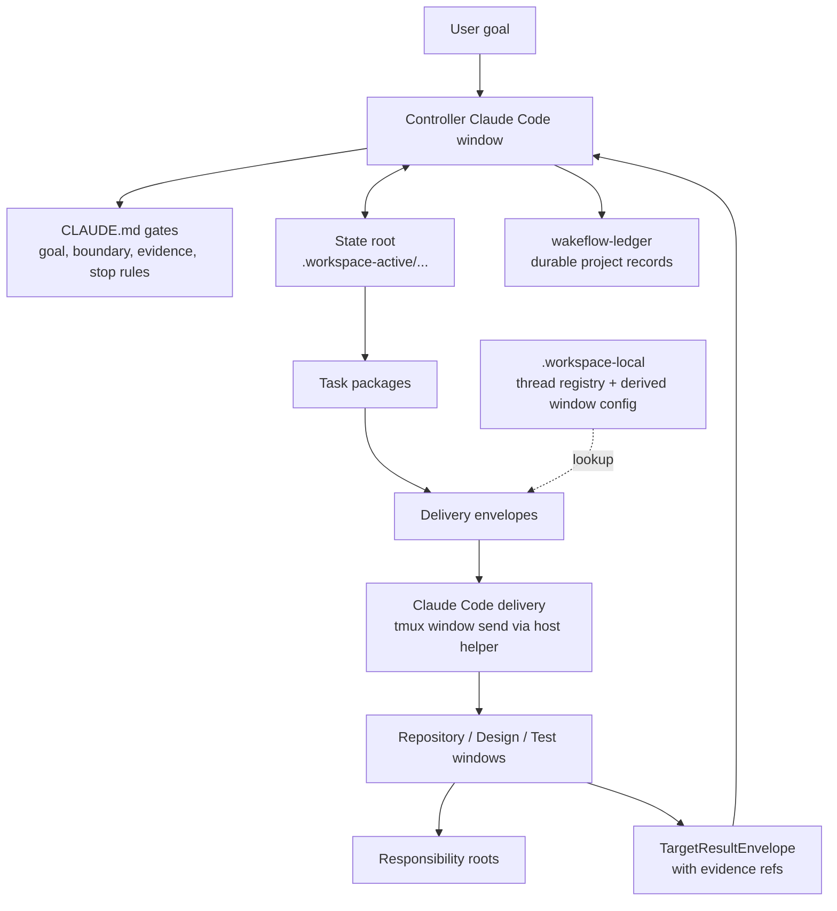

<div align="center">

# Wakeflow for Claude Code

Unattended control loops for multi-window agent work.

[English](README.md) | [Simplified Chinese](README.zh-CN.md)

Wakeflow turns a local Claude Code workspace into a disciplined controller
system: one controller window, focused repository windows, explicit state
roots, compact delivery envelopes, and evidence-based acceptance.

</div>

---

- [Why Wakeflow](#why-wakeflow)
- [System Model](#system-model)
- [Install Wakeflow](#install-wakeflow)
- [Window Model](#window-model)
- [One Vocabulary Across Hosts](#one-vocabulary-across-hosts)
- [Initialize A Workspace](#initialize-a-workspace)
- [What Wakeflow Creates](#what-wakeflow-creates)
- [How Work Moves](#how-work-moves)
- [Automation Semantics](#automation-semantics)
- [MCP Capability Surface](#mcp-capability-surface)
- [Runtime And Ledger Boundaries](#runtime-and-ledger-boundaries)
- [Dual-Host Workspaces](#dual-host-workspaces)
- [Working In This Repository](#working-in-this-repository)
- [Design Principles](#design-principles)

## Why Wakeflow

Large agent-assisted work rarely lives in one repository or one conversation.
A single goal may require a controller, product repositories, a design window,
and a real-scenario test window. Without a shared operating model, the work
degrades into scattered prompts, copied status tables, unclear ownership, and
unfinished evidence review.

Wakeflow provides the missing control layer:

- **Controller-first judgment**: the parent workspace owns goals, boundaries,
  dispatch decisions, acceptance, TODO routing, and archive decisions.
- **One state root per demand**: task packages, target results, review
  candidates, decisions, and progress projections stay tied to the same demand.
- **Focused child windows**: each repository window works only inside its
  configured responsibility boundary.
- **Compact delivery**: delivery prompts wake the right window with a small
  envelope; the state root and skills hold the task details.
- **Evidence before acceptance**: target backfill is input, not a conclusion.
  The controller still reviews raw evidence before completing work.
- **Local-first runtime**: real session ids live only in the local thread
  registry; window config is a derived sendability view, and active state stays
  out of tracked source.

Wakeflow is not a command launcher with nicer names. It is a reusable workflow
capability for keeping multi-window agent work legible, bounded, and resumable.

## System Model



The controller is the only acceptance authority. Scripts and MCP tools create,
validate, summarize, and record machine data, but they do not widen scope,
decide product behavior, or declare a task complete.

## Install Wakeflow

The repository root is the development workspace, and the installable Claude
Code plugin artifact lives in `plugins/claude-code-wakeflow/`. Install it from
inside Claude Code:

```text
/plugin marketplace add GxFn/Wakeflow
/plugin install wakeflow@gxfn
```

For local development, add this checkout as a local marketplace instead:

```text
/plugin marketplace add /absolute/path/to/Wakeflow
/plugin install wakeflow@gxfn
```

The plugin ships four coordinated surfaces:

| Surface | Contents |
| --- | --- |
| MCP server | `.mcp.json` starts `node ${CLAUDE_PLUGIN_ROOT}/mcp/server.cjs`, a standalone server with no `node_modules` dependency. |
| Skills | `wakeflow-controller`, `wakeflow-target`, and `wakeflow-governance` operating manuals. |
| Slash commands | `/wakeflow:init`, `/wakeflow:status`, `/wakeflow:dispatch`, and `/wakeflow:review`. |
| Host transport helper | `scripts/lib/wakeflow-claude-host.mjs` with the commands `preflight`, `ensure-server`, `launch-window`, `retitle`, `send`, `readback`, `release-lock`, `wait-results`, and `attach-window`. |

The helper requires tmux. Initialization runs `preflight`, which installs tmux
with `brew install tmux` after one explicit user consent when it is missing,
retrying once on transient bottle errors.

## Window Model

Window transport is the key Claude Code difference, and the Claude Code
edition is terminal-only. Every Wakeflow window (controller included) is a
tmux-resident interactive `claude` session, and all windows live in one tmux
server session named `wakeflow` by default. The session name is configurable
in `workspace.config.json`:

```json
{
  "hosts": {
    "claude-code": {
      "tmuxSession": "wakeflow"
    }
  }
}
```

A Wakeflow thread id is the window's Claude Code session id, which stays
stable across resumes. Desktop windows are not an automation transport. The
envelope, evidence, and review contracts are unchanged from the shared
Wakeflow model.

**Launch.** Initialization runs the helper's `preflight` (tmux install with
consent when missing), then `launch-window` for each planned window: the
helper creates a tmux window running `claude --session-id`, pastes the
entry-sync prompt, sets the `displayTitle` as the tmux window name, and
returns the session id, which is registered once in the local thread
registry.

**Dispatch.** The controller writes the envelope prompt to a temp file and
runs `send --window <target> --prompt-file <file>`. The helper enforces a
shared per-window delivery lock, pastes the prompt through a tmux buffer, and
returns pane readback evidence; the agent records it with
`wakeflow_record_delivery`. Target windows controller-return the same way
toward the controller window. `wait-results --group <id>` can run as a
background watcher for stall insurance.

**Recovery.** When a tmux window dies, the registered session id remains the
thread id: run `claude -p --resume <registered session id>` (same id), then
`launch-window --replace` with that id.

**Watching.** Attach to the whole server with `tmux attach -t wakeflow`, open
one window in macOS Terminal with the helper's
`attach-window --open-terminal`, or use iTerm2 native integration with
`tmux -CC`.

**Unattended permissions.** Unattended permission behavior remains the user's
decision. Configure per-repository allowlists in each repository's
`.claude/settings.json`, or consciously choose an explicit permission mode at
launch for sessions you trust with edits. Wakeflow never makes this choice
for the user: it is a deliberate per-repository decision, not a default.

## One Vocabulary Across Hosts

Wakeflow keeps one machine vocabulary across host editions. A "thread id" in
registries, payload fields, and CLI flags is the Claude Code session id,
stable across resumes; no field is renamed per host. The per-window rules file is `CLAUDE.md`, which
Claude Code auto-loads when the session starts, so each window reads its own
gates and access card without extra prompting.

## Initialize A Workspace

Wakeflow is installed as a Claude Code plugin. A target workspace does not
need to contain Wakeflow source code. The expected target shape is:

```text
MyWorkspace/
  CLAUDE.md
  workspace.config.json
  .workspace-active/          # ignored active controller state
  .workspace-local/           # ignored thread registry and derived runtime
  wakeflow-ledger/            # durable project coordination records
  ProductRepo/
  CoreRepo/
  Design/                     # default internal requirement-design surface
  Test/                       # default internal test coordination surface
```

The simplest user prompt is:

```text
Use Wakeflow to initialize the current workspace.
Preview the plan first and wait for my confirmation before writing.
```

The operating flow is:

1. Claude Code calls `wakeflow_initialize_workspace` with `apply: false`.
2. Wakeflow returns directory facts and an `agentSelectionProtocol`.
3. Claude Code judges whether the workspace is clean or messy from those facts
   and user context.
4. For a clean workspace, Claude Code calls the tool again with explicit
   `repositories` mappings for the intended work windows.
5. For a messy workspace, Claude Code asks which directories are managed
   windows before writing. It must not use a broad discovered-directory
   import.
6. After user confirmation, Claude Code calls `wakeflow_initialize_workspace`
   with `apply: true`.
7. Claude Code runs the host helper: `preflight` first, then `launch-window`
   for each window in the returned launch plan. Each launch creates a tmux
   window running `claude --session-id`, pastes the entry-sync prompt, sets
   the `displayTitle` as the tmux window name, and returns the session id,
   which is passed once to Wakeflow's local registration command. The thread
   registry is the only session-id authority; window config is refreshed as a
   derived view.

Design and Test are fresh support surfaces by default. Existing similarly
named directories such as `<Product>Design` or `<Product>Test` are treated as
ordinary directory facts unless the user explicitly maps them as Design/Test.

Wakeflow supports localized initialization. Pass `language: "zh"` for Chinese
workspaces, `language: "en"` for English workspaces, or `language: "auto"`
when there is no clear preference. Generated session titles keep the window
name at the front so the important repository name remains visible in narrow
sidebars. New state-root progress documents and subsequent Unified Status
renders also use the selected interface language.

Controller and child windows can use Claude Code subagents to speed up bounded
code search, log triage, test localization, and evidence summaries. Subagent
output is evidence or advice only; controller review, dispatch, state writes,
and repository boundaries remain with the Wakeflow window that owns the task.

## What Wakeflow Creates

Initialization writes only the surfaces needed for the confirmed workspace
boundary:

| Surface | Purpose |
| --- | --- |
| `CLAUDE.md` | Parent controller gates and durable boundaries. |
| Child `CLAUDE.md` access cards | Per-window responsibility and read paths. |
| `workspace.config.json` | Managed windows, repository paths, roles, host transport settings such as the tmux session name, and default language. |
| `.workspace-active/` | Active state roots, current indexes, progress docs, TODO projections, intake, and test cards. |
| `.workspace-local/` | Thread registry, delivery runtime, local overrides, and derived window config. |
| `wakeflow-ledger/` | Long-term project coordination records and archives. |
| `Design/` | Internal requirement-design workspace when no external Design repository is mapped. |
| `Test/` | Internal test coordination workspace when no external Test repository is mapped. |

Wakeflow also synchronizes `.gitignore` so only `.workspace-active/` and
`.workspace-local/` remain local runtime directories. It does not add product
repositories, Design/Test folders, ledgers, `.DS_Store`, or other user
workspace noise to `.gitignore`.

## How Work Moves

The normal Wakeflow loop is deliberately small:

1. A user goal, Design handoff, or controller intake creates a demand.
2. The controller defines completion, boundaries, phase order, and the first
   blocker.
3. A state root records the demand and creates eligible task packages.
4. The controller prepares compact delivery envelopes for the target windows.
5. Target windows read their own rules, execute only their assigned package,
   and return target result envelopes with reviewable evidence.
6. The controller reviews raw evidence, records a decision, and either creates
   the next eligible package, stops for user judgment, marks the demand
   blocked, or completes the demand.
7. Durable conclusions move to `wakeflow-ledger/`; local runtime stays local.

Design and Test are supporting roles:

- **Design** clarifies requirements, options, risks, and handoff candidates.
  It does not dispatch implementation or become product truth by itself.
- **Test** is reserved for real-scenario evidence that the controller or
  product repository cannot safely reproduce alone.

## Automation Semantics

Wakeflow automation is direct session delivery plus explicit result return.

Core rules:

- Real session ids live only in
  `.workspace-local/wakeflow-delivery/hosts/claude-code/thread-registry/`.
- Window config is derived from `workspace.config.json` plus thread-registry
  presence; it is not a second session-id or window-semantics authority.
- Delivery prompts remain compact and human-readable.
- The controller writes the envelope prompt to a temp file and sends it with
  the host helper (`send --window <target> --prompt-file <file>`); the helper
  enforces the shared per-window delivery lock, pastes through a tmux buffer,
  and returns pane readback evidence that the agent records with
  `wakeflow_record_delivery`.
- Targets controller-return through the same helper send toward the
  controller window; `wait-results --group <id>` can run as a background
  watcher for stall insurance.
- `group-ready` waits for the expected target results before a controller
  return.
- `per-target` can wake the controller once per target while still preserving
  a group snapshot.
- After a real send is recorded as sent with readback evidence, the controller
  turn stops. It does not sleep or poll in the same turn.
- Keep-live support is runtime assistance only. It is not task logic,
  transport authority, or acceptance evidence.

Automation stops on final completion, hard gates, user stop, no eligible work,
missing evidence, blocked state, or any condition that requires controller or
user judgment.

## MCP Capability Surface

Wakeflow exposes only stable outer workflow contracts as MCP tools, and the
tool names are identical to the Codex edition. Runtime scripts remain the
internal implementation and test surface; they are not public tools just
because they exist. A target closeout uses the same delivery model as
controller dispatch: prepare an envelope, send the prompt through the tmux
host helper, then record the delivery run.

Primary tool groups:

| Need | MCP tools |
| --- | --- |
| Setup and workspace discovery | `wakeflow_initialize_workspace` |
| Demand and task state | `wakeflow_status`, `wakeflow_init_demand`, `wakeflow_add_task`, `wakeflow_next_work` |
| Delivery and returns | `wakeflow_prepare_delivery`, `wakeflow_record_delivery` |
| Results and review | `wakeflow_record_target_result`, `wakeflow_review_pack`, `wakeflow_reduce_results`, `wakeflow_decide_review`, `wakeflow_complete_demand` |
| Design and Test intake | `wakeflow_intake_design_handoff`, `wakeflow_intake_test_card` |
| Archive, maintenance, and verification | `wakeflow_archive_todo`, `wakeflow_archive_workspace_docs`, `wakeflow_verify`, `wakeflow_trace_spine` |

Public MCP tools are for outer agent workflows. Target closeout is
deliberately split: record a target result, review readiness, prepare a
controller-return envelope when policy allows, send through the tmux host
helper, and record delivery evidence. Controller review stays split as review
pack, result reduction, and explicit decision; result reduction only creates a
review candidate and is not acceptance. Do not collapse those steps into a
single target-window MCP tool. Internal steps such as archive summary refresh
internals, keep-live state, and script backend execution stay inside Wakeflow
runtime scripts and skills. Public archive MCP tools wrap only
controller-approved TODO or workspace document archive flows; they do not make
acceptance decisions or send host messages.

Wakeflow declares MCP tool annotations for every public tool: read-only tools
are marked read-only, write tools are local, non-destructive, and
closed-world. Tool approval is still controlled by the user's Claude Code
permission settings; a trusted local installation can allowlist the
`wakeflow` MCP server in `.claude/settings.json`.

## Runtime And Ledger Boundaries

Wakeflow keeps source, active runtime, and durable records separate:

| Path | Boundary |
| --- | --- |
| `skills/` | Reusable operating instructions installed with the plugin. |
| `scripts/` | Runtime implementation and validation scripts packaged by the plugin. |
| `templates/wakeflow-template-bundle.json` | Bundled starter state, Design/Test, and ledger skeletons expanded during setup. |
| `.workspace-active/` | Current active work in a target workspace; ignored by Git. |
| `.workspace-local/` | Machine-local thread registry, derived runtime views, and local state; ignored by Git. |
| `wakeflow-ledger/` | Project-specific durable records outside reusable Wakeflow source. |

The source repository tracks reusable Wakeflow capability. Product code,
project-specific active state, real session ids, and derived local runtime
artifacts do not belong in Wakeflow source.

## Dual-Host Workspaces

One workspace may run the Codex and Claude Code Wakeflow editions side by
side. Shared business state stays host-neutral: `.workspace-active/`,
`wakeflow-ledger/`, and the delivery state under
`.workspace-local/wakeflow-delivery/` (`dispatch-packets/`,
`dispatch-groups/`, `delivery-envelopes/`, `delivery-runs/`,
`target-results/`), plus the shared `locks/` directory that enforces one
in-flight delivery per window across hosts.

Host-scoped runtime is separated per host:

- `.workspace-local/wakeflow-delivery/hosts/codex/{thread-registry,window-config,keep-live}/`
- `.workspace-local/wakeflow-delivery/hosts/claude-code/{thread-registry,window-config,window-host,keep-live}/`

`AGENTS.md` (Codex) and `CLAUDE.md` (Claude Code) coexist at the workspace
and child roots, and each demand has exactly one controller across hosts.

## Working In This Repository

Use the repository root to develop the Wakeflow plugin itself:

```sh
npm run validate
npm run smoke
npm run test:wakeflow
npm test
```

Common source areas inside this plugin artifact:

| Path | Purpose |
| --- | --- |
| `.claude-plugin/plugin.json` | Plugin manifest with the MCP server reference. |
| `.mcp.json` | MCP server wiring (`node ${CLAUDE_PLUGIN_ROOT}/mcp/server.cjs`). |
| `mcp/server.cjs` | Standalone MCP server entrypoint with no `node_modules` dependency. |
| `bin/wakeflow-mcp.mjs` | Compatibility wrapper for the MCP server entrypoint. |
| `lib/` | MCP tool definitions, runtime helpers, process and trace support. |
| `scripts/` | Setup, state, delivery, intake, archive, validation, and CLI runtime shipped with the plugin. |
| `skills/` | Controller, target, and governance operating manuals shipped with the plugin. |
| `commands/` | Slash command definitions for `/wakeflow:*`. |
| `templates/wakeflow-template-bundle.json` | Installed workspace starter documents and support surfaces, bundled for marketplace scan size. |
| `assets/` | Marketplace and plugin presentation assets. |

The repository root README explains the shared system model; this README is
the Claude Code edition manual.

## Design Principles

1. **Judgment stays visible**: script output, status rows, and target backfill
   are evidence, not acceptance.
2. **One demand, one state root**: JSON state and Markdown progress surfaces
   stay tied to the same demand.
3. **Prompts wake, state instructs**: prompts should be compact; task detail
   belongs in state roots, task packages, and installed skills.
4. **Repository boundaries matter**: each window owns its source, tests,
   commits, and evidence.
5. **Automation moves work, not authority**: delivery proves that a prompt was
   sent, not that the result is complete.
6. **Local runtime stays local**: real session ids stay only in the local
   thread registry, and active runtime state never enters tracked
   documentation.
7. **Fresh support windows by default**: Design and Test are created as clear
   Wakeflow support surfaces unless the user explicitly maps existing ones.

Wakeflow exists to make unattended multi-window work safe to resume, easy to
inspect, and hard to fake.
