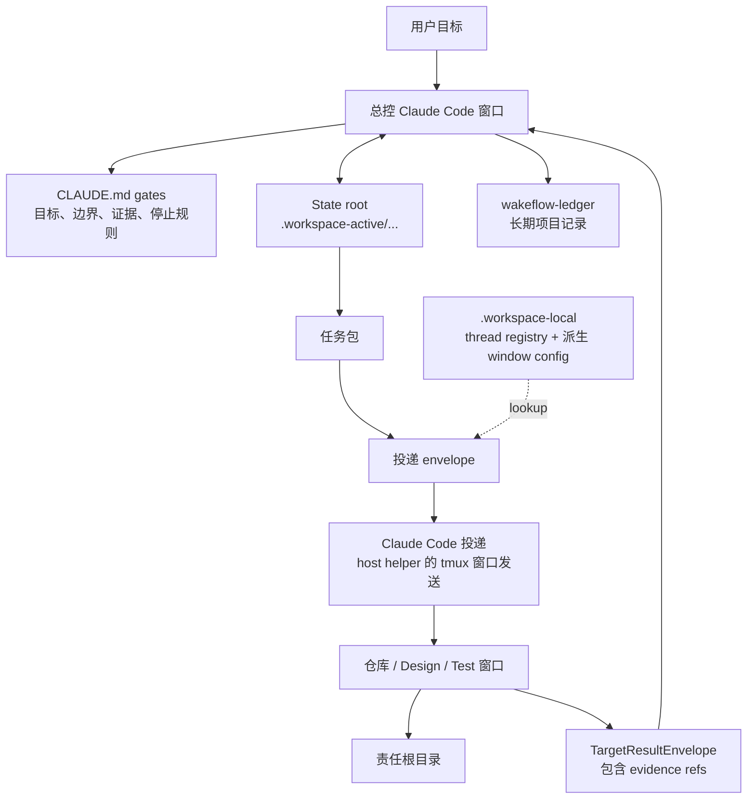

<div align="center">

# Wakeflow for Claude Code

面向多窗口 agent 工作的无人值守控制循环。

[English](README.md) | [简体中文](README.zh-CN.md)

Wakeflow 把一个本地 Claude Code 工作区变成有纪律的控制系统：一个总控窗口、
多个聚焦的仓库窗口、明确的 state root、轻量 delivery envelope，以及基于证据的验收。

</div>

---

- [为什么需要 Wakeflow](#为什么需要-wakeflow)
- [系统模型](#系统模型)
- [安装 Wakeflow](#安装-wakeflow)
- [窗口模型](#窗口模型)
- [跨宿主统一词汇](#跨宿主统一词汇)
- [初始化工作区](#初始化工作区)
- [Wakeflow 会创建什么](#wakeflow-会创建什么)
- [工作如何流转](#工作如何流转)
- [自动化语义](#自动化语义)
- [MCP 能力面](#mcp-能力面)
- [运行时与账本边界](#运行时与账本边界)
- [双宿主工作区](#双宿主工作区)
- [开发本仓库](#开发本仓库)
- [设计原则](#设计原则)

## 为什么需要 Wakeflow

大型 agent 辅助工作很少只发生在一个仓库或一个会话里。一个目标可能需要
总控、多个产品仓库、一个 Design 窗口，以及一个真实场景 Test 窗口。没有共同的
操作模型时，工作很容易退化成零散 prompt、复制粘贴的状态表、不清晰的责任边界，
以及没有真正验收的“完成”。

Wakeflow 提供缺失的控制层：

- **总控优先判断**：父工作区负责目标、边界、投递决策、验收、TODO 路由和归档决策。
- **一个需求一个 state root**：任务包、目标结果、review candidate、决策和进度投影都绑定到同一个需求。
- **聚焦的子窗口**：每个仓库窗口只在配置好的责任边界内工作。
- **轻量投递**：delivery prompt 只负责用一个小 envelope 唤醒正确窗口；state root 和 skills 保存任务细节。
- **先证据，后验收**：target backfill 是输入，不是结论；总控仍然要检查原始证据。
- **本地优先运行时**：真实 session id 只存在本地 thread registry；window config 是派生视图，active state 不进入源码。

Wakeflow 不是换了名字的命令启动器。它是一个可复用的工作流能力，用来让多窗口
agent 工作保持可读、有边界、可恢复。

## 系统模型



总控是唯一验收权威。脚本和 MCP 工具可以创建、验证、汇总、记录机器数据，但不能扩大范围、
决定产品行为，或宣称任务已经完成。

## 安装 Wakeflow

仓库根目录是开发工作区，真正可安装的 Claude Code 插件 artifact 位于
`plugins/claude-code-wakeflow/`。在 Claude Code 内安装：

```text
/plugin marketplace add GxFn/Wakeflow
/plugin install wakeflow@gxfn
```

本地开发时，把当前 checkout 作为本地 marketplace 添加：

```text
/plugin marketplace add /absolute/path/to/Wakeflow
/plugin install wakeflow@gxfn
```

插件包含四个相互配合的 surface：

| Surface | 内容 |
| --- | --- |
| MCP server | `.mcp.json` 启动 `node ${CLAUDE_PLUGIN_ROOT}/mcp/server.cjs`，无 `node_modules` 依赖的 standalone server。 |
| Skills | `wakeflow-controller`、`wakeflow-target`、`wakeflow-governance` 操作手册。 |
| Slash commands | `/wakeflow:init`、`/wakeflow:status`、`/wakeflow:dispatch`、`/wakeflow:review`。 |
| Host transport helper | `scripts/lib/wakeflow-claude-host.mjs`，提供 `preflight`、`ensure-server`、`launch-window`、`retitle`、`send`、`readback`、`release-lock`、`wait-results`、`attach-window` 命令。 |

helper 依赖 tmux。初始化会先运行 `preflight`：缺少 tmux 时，在获得用户一次明确
同意后用 `brew install tmux` 安装，遇到临时 bottle 错误会重试一次。

## 窗口模型

窗口传输是 Claude Code 版本的关键差异，而且 Claude Code 版本只使用终端。
每个 Wakeflow 窗口（包括总控）都是常驻 tmux 的交互式 `claude` session，
所有窗口位于同一个 tmux server session 内，默认名为 `wakeflow`。
session 名可在 `workspace.config.json` 中配置：

```json
{
  "hosts": {
    "claude-code": {
      "tmuxSession": "wakeflow"
    }
  }
}
```

Wakeflow thread id 就是该窗口的 Claude Code session id，跨 resume 保持稳定。
桌面窗口不是自动化传输通道。envelope、证据和 review 合约与共享 Wakeflow
模型完全一致。

**启动。** 初始化先运行 helper 的 `preflight`（缺少 tmux 时在用户同意后安装），
再对 launch plan 中的每个窗口运行 `launch-window`：helper 创建运行
`claude --session-id` 的 tmux 窗口、粘贴 entry-sync prompt、把 `displayTitle`
设为 tmux 窗口名，并返回 session id；每个 id 只在本地 thread registry 注册一次。

**投递。** 总控把 envelope prompt 写入临时文件，然后运行
`send --window <target> --prompt-file <file>`。helper 强制共享的按窗口投递锁，
通过 tmux buffer 粘贴 prompt，并返回 pane readback 证据；agent 用
`wakeflow_record_delivery` 记录这次投递。目标窗口以同样方式向总控窗口做
controller-return。`wait-results --group <id>` 可以作为后台 watcher 运行，
提供 stall 保险。

**恢复。** tmux 窗口挂掉时，已注册的 session id 仍然是 thread id：先运行
`launch-window --resume --session-id <已注册 id> --replace` 交互式复活同一会话（订阅额度不变）。`claude -p --resume` 仅作最后手段：2026-06-15 起 `claude -p` 走独立的 Agent SDK 额度按 API 价计费。如确需 headless，再用该 id 运行
`launch-window --replace`。

**观察。** 用 `tmux attach -t wakeflow` 附着整个 server，用 helper 的
`attach-window --open-terminal` 在 macOS Terminal 打开单个窗口，或用 iTerm2
的 `tmux -CC` 原生集成。

**无人值守权限。** 无人值守的权限行为仍由用户决定。请在每个仓库的
`.claude/settings.json` 中配置按仓库的 allowlist，或在清楚后果的前提下为可信
session 在启动时选择显式 permission mode。Wakeflow 永远不替用户做这个选择：
这是按仓库的主动决策，不是默认值。

## 跨宿主统一词汇

Wakeflow 在不同宿主版本之间保持同一套机器词汇。registry、payload 字段和 CLI flag
里的 "thread id" 就是 Claude Code session id（跨 resume 保持稳定）；
没有任何字段按宿主改名。
每个窗口的规则文件是 `CLAUDE.md`，Claude Code 会在 session 启动时自动加载它，
所以每个窗口无需额外 prompt 即可读到自己的 gate 和 access card。

## 初始化工作区

Wakeflow 作为 Claude Code 插件安装。目标工作区不需要包含 Wakeflow 源码。
推荐的目标形态是：

```text
MyWorkspace/
  CLAUDE.md
  workspace.config.json
  .workspace-active/          # ignored active controller state
  .workspace-local/           # ignored thread registry and derived runtime
  wakeflow-ledger/            # durable project coordination records
  ProductRepo/
  CoreRepo/
  Design/                     # 默认内部需求设计 surface
  Test/                       # 默认内部测试协作 surface
```

最简单的用户 prompt：

```text
Use Wakeflow to initialize the current workspace.
Preview the plan first and wait for my confirmation before writing.
```

执行流程：

1. Claude Code 调用 `wakeflow_initialize_workspace`，`apply: false`。
2. Wakeflow 返回目录事实和 `agentSelectionProtocol`。
3. Claude Code 根据目录事实和用户上下文判断工作区是 clean 还是 messy。
4. 对 clean 工作区，Claude Code 再次调用工具，并显式传入目标 work windows 的 `repositories` 映射。
5. 对 messy 工作区，Claude Code 先问用户哪些目录是受管窗口，不能直接广泛导入 discovered 目录。
6. 用户确认后，Claude Code 调用 `wakeflow_initialize_workspace`，`apply: true`。
7. Claude Code 运行 host helper：先 `preflight`，再对返回 launch plan 中的
   每个窗口运行 `launch-window`。每次 launch 创建运行 `claude --session-id`
   的 tmux 窗口、粘贴 entry-sync prompt、把 `displayTitle` 设为 tmux 窗口名，
   并返回 session id；每个真实 session id 只传一次给 Wakeflow 本地注册命令。
   thread registry 是唯一 session-id 权威；window config 是由它派生的视图。

Design 和 Test 默认创建为新的支持 surface。`<Product>Design` 或 `<Product>Test`
这类相似目录只被当作目录事实，除非用户明确把它们映射成 Design/Test。

Wakeflow 支持本地化初始化。中文工作区传 `language: "zh"`，英文工作区传
`language: "en"`，没有明显偏好时传 `language: "auto"`。生成的 session 标题会把
窗口名放在最前面，方便在窄侧边栏里识别仓库。新的 state-root progress 文档和
后续的 Unified Status 渲染也使用所选界面语言。

总控和子窗口可以使用 Claude Code subagent 加速有边界的代码搜索、日志分诊、
测试定位和证据汇总。Subagent 输出只是证据或建议；总控 review、投递、状态写入
和仓库边界仍归拥有该任务的 Wakeflow 窗口。

## Wakeflow 会创建什么

初始化只写入已确认边界所需的 surface：

| Surface | 用途 |
| --- | --- |
| `CLAUDE.md` | 父级总控 gate 和长期边界规则。 |
| 子窗口 `CLAUDE.md` access cards | 每个窗口的责任和读取路径。 |
| `workspace.config.json` | 受管窗口、仓库路径、角色、host transport 设置（如 tmux session 名）和默认语言。 |
| `.workspace-active/` | active state roots、当前索引、progress docs、TODO 投影、intake 和 test cards。 |
| `.workspace-local/` | thread registry、投递 runtime、本地 overrides 和派生 window config。 |
| `wakeflow-ledger/` | 长期项目协作记录和归档。 |
| `Design/` | 未映射外部 Design 仓库时创建的内部需求设计工作区。 |
| `Test/` | 未映射外部 Test 仓库时创建的内部测试协作工作区。 |

Wakeflow 也会同步 `.gitignore`，只把 `.workspace-active/` 和 `.workspace-local/`
作为本地运行时目录忽略。它不会把产品仓库、Design/Test、ledger、`.DS_Store`
或其他本地杂项加入 `.gitignore`。

## 工作如何流转

Wakeflow 的正常循环刻意保持小而清晰：

1. 用户目标、Design handoff 或 controller intake 创建一个 demand。
2. 总控定义完成标准、边界、阶段顺序和第一个 blocker。
3. state root 记录 demand 并创建可执行任务包。
4. 总控为目标窗口准备轻量 delivery envelope。
5. 目标窗口读取自己的规则，只执行分配给自己的任务包，并返回带可审查证据的 target result envelope。
6. 总控审查原始证据，记录决策，然后创建下一批可执行任务、等待用户判断、标记 blocked，或完成 demand。
7. 长期结论进入 `wakeflow-ledger/`；本地运行时继续留在本地。

Design 和 Test 是支持角色：

- **Design** 澄清需求、选项、风险和 handoff 候选。Design 不投递实现，也不会自动成为产品真相。
- **Test** 只用于总控或产品仓库无法安全复现的真实场景证据。

## 自动化语义

Wakeflow 自动化是直接 session 投递加显式结果返回。

核心规则：

- 真实 session id 只存在 `.workspace-local/wakeflow-delivery/hosts/claude-code/thread-registry/`。
- Window config 从 `workspace.config.json` 和 thread-registry presence 派生，不是第二份 session-id 权威。
- Delivery prompts 保持轻量、可读。
- 总控把 envelope prompt 写入临时文件，由 host helper
  `send --window <target> --prompt-file <file>` 发送；helper 强制共享的按窗口
  投递锁，通过 tmux buffer 粘贴，并返回 pane readback 证据，由 agent 用
  `wakeflow_record_delivery` 记录。
- 目标窗口通过同样的 helper send 向总控窗口 controller-return；
  `wait-results --group <id>` 可以作为后台 watcher 提供 stall 保险。
- `group-ready` 会等待预期 target results，再允许 controller return。
- `per-target` 可以每个 target 唤醒一次 controller，同时保留 group snapshot。
- 一次真实发送被记录为 `sent` 且有 readback 证据后，总控本轮停止，不在同一轮 sleep 或 poll。
- Keep-live 只是运行时辅助，不是任务逻辑、传输权威或验收证据。

自动化会在最终完成、硬 gate、用户停止、没有 eligible work、缺失证据、blocked state、
或任何需要总控/用户判断的条件下停止。

## MCP 能力面

Wakeflow 只把稳定的外层工作流合约暴露成 MCP tools，工具名与 Codex 版本完全一致。
运行时脚本仍然是内部实现和测试 surface；脚本存在不等于它就是公共工具。
目标窗口 closeout 与总控投递使用同一套投递模型：准备 envelope、
通过 tmux host helper 发送 prompt、记录 delivery run。

主要工具组：

| 需求 | MCP tools |
| --- | --- |
| 设置和工作区发现 | `wakeflow_initialize_workspace` |
| Demand 和任务状态 | `wakeflow_status`, `wakeflow_init_demand`, `wakeflow_add_task`, `wakeflow_next_work` |
| 投递和返回 | `wakeflow_prepare_delivery`, `wakeflow_record_delivery` |
| 结果和 review | `wakeflow_record_target_result`, `wakeflow_review_pack`, `wakeflow_reduce_results`, `wakeflow_decide_review`, `wakeflow_complete_demand` |
| Design 和 Test intake | `wakeflow_intake_design_handoff`, `wakeflow_intake_test_card` |
| 归档、维护和验证 | `wakeflow_archive_todo`, `wakeflow_archive_workspace_docs`, `wakeflow_verify`, `wakeflow_trace_spine` |

公共 MCP tools 面向外层 agent 工作流。target closeout 被故意拆开：
记录 target result、审查 readiness、在策略允许时准备 controller-return envelope、
通过 tmux host helper 发送，再记录 delivery evidence。总控 review 也保持拆分：
review pack、result reduction、显式决策；result reduction 只创建 review candidate，
不是验收。不要把这些步骤合并成一个 target-window MCP tool。归档摘要刷新内部步骤、
keep-live 状态和脚本后端执行这类内部环节留在 Wakeflow runtime scripts 和 skills 里。
公共归档 MCP tools 只包装总控批准的 TODO 或工作区文档归档流程；
它们不做验收决策，也不发送 host 消息。

Wakeflow 为每个公共工具声明 MCP tool annotations：只读工具标记为 read-only，
写工具是 local、non-destructive、closed-world。工具审批仍由用户的 Claude Code
权限设置控制；可信的本地安装可以在 `.claude/settings.json` 中为 `wakeflow`
MCP server 配置 allowlist。

## 运行时与账本边界

Wakeflow 把源码、active runtime 和长期记录分开：

| Path | 边界 |
| --- | --- |
| `skills/` | 随插件安装的可复用操作说明。 |
| `scripts/` | 插件打包的运行时实现和验证脚本。 |
| `templates/wakeflow-template-bundle.json` | setup 时展开的 starter state、Design/Test 和 ledger skeletons bundle。 |
| `.workspace-active/` | 目标工作区中的当前 active work；被 Git 忽略。 |
| `.workspace-local/` | 机器本地 thread registry、派生 runtime views 和 local state；被 Git 忽略。 |
| `wakeflow-ledger/` | 项目特定的长期记录，不属于可复用 Wakeflow 源码。 |

Wakeflow 源仓库只跟踪可复用能力。产品代码、项目特定 active state、真实 session id
和派生本地运行时 artifacts 都不应进入 Wakeflow 源码。

## 双宿主工作区

同一个工作区可以同时运行 Codex 和 Claude Code 两个 Wakeflow 版本。共享业务
状态保持宿主中立：`.workspace-active/`、`wakeflow-ledger/`，以及
`.workspace-local/wakeflow-delivery/` 下的投递状态（`dispatch-packets/`、
`dispatch-groups/`、`delivery-envelopes/`、`delivery-runs/`、
`target-results/`），加上共享 `locks/` 目录——它跨宿主强制每个窗口同一时间
只有一个 in-flight 投递。

宿主独立的运行时按宿主分开：

- `.workspace-local/wakeflow-delivery/hosts/codex/{thread-registry,window-config,keep-live}/`
- `.workspace-local/wakeflow-delivery/hosts/claude-code/{thread-registry,window-config,window-host,keep-live}/`

`AGENTS.md`（Codex）与 `CLAUDE.md`（Claude Code）在工作区根目录和子目录根
共存，每个 demand 跨宿主只有一个总控。Demand 创建是宿主中立的
（`controllerHost: null`）；第一个真正驱动命令会把所有权认领为 `codex`
或 `claude-code`；非归属宿主的 controller 写操作和投递准备会 fail-closed；
`--adopt-host` 是显式转移机制。`wakeflow_status` 会在
`dualHost.demandOwnership` 暴露当前映射。

## 开发本仓库

在仓库根目录开发 Wakeflow 插件本身：

```sh
npm run validate
npm run smoke
npm run test:wakeflow
npm test
```

本插件 artifact 内的常见源码区域：

| Path | 用途 |
| --- | --- |
| `.claude-plugin/plugin.json` | 插件 manifest 与 MCP server 引用。 |
| `.mcp.json` | MCP server wiring（`node ${CLAUDE_PLUGIN_ROOT}/mcp/server.cjs`）。 |
| `mcp/server.cjs` | 无 `node_modules` 依赖的 standalone MCP server entrypoint。 |
| `bin/wakeflow-mcp.mjs` | MCP server entrypoint 的兼容 wrapper。 |
| `lib/` | MCP 工具定义、runtime helpers、进程与 trace 支持。 |
| `scripts/` | 随插件发布的 setup、state、delivery、intake、archive、validation 和 CLI runtime。 |
| `skills/` | 随插件发布的 controller、target 和 governance 操作手册。 |
| `commands/` | `/wakeflow:*` slash command 定义。 |
| `templates/wakeflow-template-bundle.json` | 已安装工作区 starter documents 和 support surfaces 的 bundle，用于控制 marketplace scan 文件数。 |
| `assets/` | Marketplace 和插件展示资源。 |

仓库根 README 解释共享的系统模型；本 README 是 Claude Code 版本手册。

## 设计原则

1. **判断必须可见**：脚本输出、状态行、target backfill 是证据，不是验收。
2. **一个需求，一个 state root**：JSON state 和 Markdown progress surface 绑定到同一个 demand。
3. **Prompt 负责唤醒，state 负责指令**：prompt 应轻量；任务细节属于 state roots、task packages 和 installed skills。
4. **仓库边界很重要**：每个窗口拥有自己的源码、测试、提交和证据。
5. **自动化移动工作，不转移权威**：投递只能证明 prompt 已发送，不能证明结果完成。
6. **本地运行时留在本地**：真实 session id 只留在本地 thread registry，active runtime state 不进入 tracked docs。
7. **默认创建新的支持窗口**：Design 和 Test 默认作为清晰的 Wakeflow support surfaces 创建，除非用户明确映射既有目录。

Wakeflow 的目标是让无人值守的多窗口工作可以安全恢复、容易审查，并且难以伪造完成。
