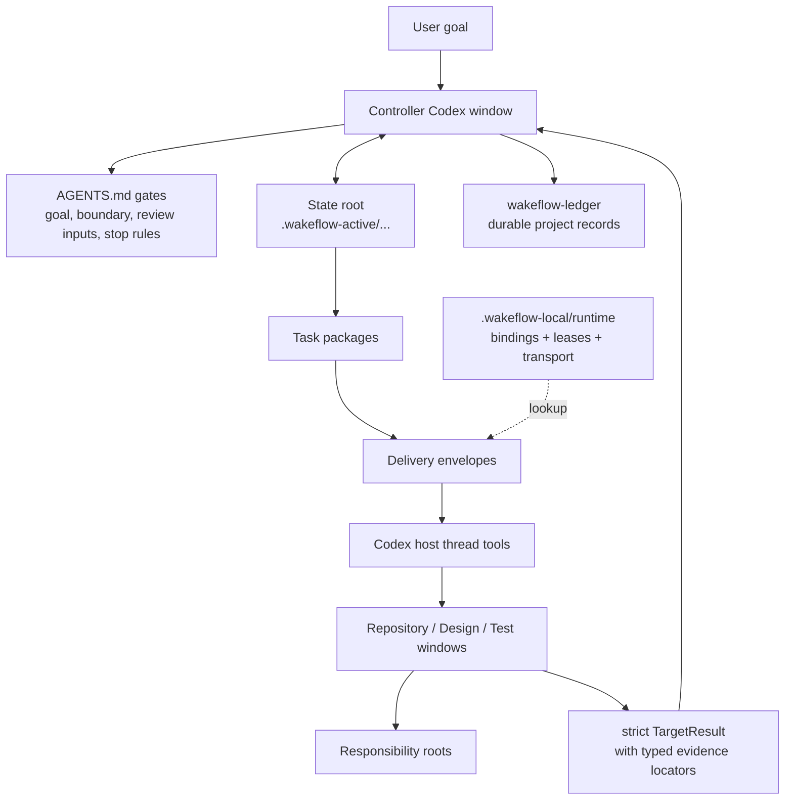

<div align="center">

# Wakeflow

A disciplined control loop for multi-window agent work — every step traced, every result reviewable.

[English](README.md) | [Simplified Chinese](README.zh-CN.md)

Wakeflow turns a local Codex workspace into a disciplined controller system:
a controller-owned loop for each active demand, focused repository windows, explicit state roots,
compact direct-thread delivery, and controller-validated acceptance. The controller runs this as a closed loop — plan, dispatch, collect review inputs, independently validate, decide, repeat — and records every step, so the whole run is auditable after the fact.

</div>

---

- [Why Wakeflow](#why-wakeflow)
- [System Model](#system-model)
- [Install Wakeflow](#install-wakeflow)
- [Quick Start](#quick-start)
- [Initialize A Workspace](#initialize-a-workspace)
- [What Wakeflow Creates](#what-wakeflow-creates)
- [How Work Moves](#how-work-moves)
- [Automation Semantics](#automation-semantics)
- [MCP Capability Surface](#mcp-capability-surface)
- [Runtime And Ledger Boundaries](#runtime-and-ledger-boundaries)
- [Dual-Host Workspaces](#dual-host-workspaces)
- [Marketplace Release](#marketplace-release)
- [Working In This Repository](#working-in-this-repository)
- [Design Principles](#design-principles)

## Why Wakeflow

Large agent-assisted work rarely lives in one repository or one conversation.
A single goal may require a controller, product repositories, a design window,
and a real-scenario test window. Without a shared operating model, the work
degrades into scattered prompts, copied status tables, unclear ownership, and
unfinished controller validation.

Wakeflow provides the missing control layer:

- **Controller-first judgment**: the parent workspace owns goals, boundaries,
  dispatch decisions, acceptance, TODO routing, and archive decisions.
- **One state root per demand**: task packages, target results, review
  candidates, decisions, and progress projections stay tied to the same demand.
- **Context-complete task packages**: each new package records one objective,
  anchored requirement references, boundaries, completion expectations,
  dependencies, and the repository commit decision; dispatch derives the
  required execution Skills from that package.
- **Focused child windows**: each repository window works only inside its
  configured responsibility boundary.
- **Preview-gated compact delivery**: the controller reviews the resolved
  repository, task briefing, Skills, and exact prompt before a digest-matched
  apply can write the direct-thread envelope.
- **Acceptance-anchored craft**: every new implementation package carries concrete
  claim/probe/expected anchors that targets map to RED checks before coding;
  the mapping is review input and the controller still validates independently.
- **Review inputs before acceptance**: target backfill, logs, paths, and test
  summaries are inputs, not conclusions. Wakeflow checks structure and path
  locatability; the controller independently validates behavior before completing work.
- **Local-first runtime**: raw thread ids live only in typed host-local window
  bindings; redacted window-runtime files are projections, and active state
  stays out of tracked source.

Wakeflow is not a command launcher with nicer names. It is a reusable workflow
capability for keeping multi-window agent work legible, bounded, and resumable.

## System Model



The controller is the only acceptance authority. Scripts and MCP tools create,
validate, summarize, and record machine data, but they do not choose acceptance,
widen scope, or decide product behavior on their own; they only persist an
explicit controller decision.

## Install Wakeflow

Wakeflow uses the same two-layer marketplace shape as Lark Remote: the
repository root is the development workspace, and the installable plugin
artifact lives in `plugins/codex-wakeflow/`. The root
`.agents/plugins/marketplace.json` contains a single `wakeflow` entry whose
`source.path` is `./plugins/codex-wakeflow`.

Install the public plugin artifact:

```bash
npx codex-marketplace add GxFn/Wakeflow/plugins/codex-wakeflow --plugin
```

For a pinned release after the matching tag exists:

```bash
npx codex-marketplace add https://github.com/GxFn/Wakeflow/tree/v0.9.6/plugins/codex-wakeflow --plugin
```

If the Codex dialog separates source, ref, and sparse path, use the repository
URL, the desired ref, and `plugins/codex-wakeflow` as the sparse path.

For local development, register this checkout as its own local marketplace:

```toml
[marketplaces.gxfn]
source_type = "local"
source = "/absolute/path/to/Wakeflow"

[plugins."wakeflow@gxfn"]
enabled = true

[plugins."wakeflow@gxfn".mcp_servers.wakeflow]
default_tools_approval_mode = "approve"
```

Wakeflow does not require an aggregate marketplace repository. A separate
catalog can still list Wakeflow for brand discovery, but that is not part of
the primary install or release path.

After reinstalling or updating Wakeflow locally, **fully quit and restart the
Codex App** before creating or resuming Wakeflow windows. Creating another task
inside the same App process may still inherit the stale or missing MCP surface.

## Quick Start

Wakeflow on Codex is driven through MCP tools (no slash commands). Tell Codex what you want in plain language and it calls the matching tool.

1. **Initialize** (once per workspace):
   ```text
   Use Wakeflow to initialize this workspace. Preview the plan first and wait for my confirmation.
   ```
   Codex calls `wakeflow_maintain_workspace` with `action: "fresh-initialize"` (preview -> confirm the exact plan and digest -> apply), then creates each window with the host `create_thread` tool and registers the real thread ids. Already initialized? Use `reconfigure` for an intentional model change, `reconcile` for managed repair, or `wakeflow_replace_windows` for one stale binding.
2. **Start work** — give the controller a demand, or ask Codex to dispatch the next eligible task.

### Tool cheat sheet (intent -> MCP tool)

| You want to... | Tool |
| --- | --- |
| Set up or maintain a workspace | `wakeflow_maintain_workspace` (`fresh-initialize`, `reconfigure`, or `reconcile`) |
| Rebuild a stale window | `wakeflow_replace_windows` |
| See demands / eligible work / readiness | `wakeflow_status`, `wakeflow_next_work` |
| Start a demand | `wakeflow_create_demand` -> `wakeflow_add_task` |
| Open an explicitly authorized Pod | `wakeflow_pod_open` launch preview/apply -> record `creating` -> one host create -> finalize `wakeflow_pod_record operation=record-materialization` -> `wakeflow_pod_bind operation=creation-receipt` |
| Hand work to a window | `wakeflow_prepare_delivery` target preview -> exact apply/claim -> host send -> `wakeflow_record_delivery` |
| Record a target's result | `wakeflow_record_target_result` |
| Review and decide | `wakeflow_review_pack` -> `wakeflow_reduce_results` -> `wakeflow_decide_review` -> `wakeflow_complete_demand` |
| Preserve selected local artifacts | `wakeflow_storage_preserve` inspect/preview -> exact apply |
| Import managed evidence | `wakeflow_record_evidence` preview -> exact apply |
| Read-only strict health check | `wakeflow_verify operation=inspect` |

## Initialize A Workspace

Wakeflow is installed as a Codex plugin. A target workspace does not need to
contain Wakeflow source code. The expected target shape is:

```text
MyWorkspace/
  AGENTS.md
  wakeflow.config.json
  .wakeflow-active/          # ignored active controller state
  .wakeflow-local/           # ignored audit + shared/host runtime
  wakeflow-ledger/            # durable project coordination records
  ProductRepo/
  CoreRepo/
  Design/                     # default internal requirement-design surface
  Test/                       # default internal test coordination surface
```

The simplest user prompt is:

```text
Use Wakeflow to initialize the current workspace.
Preview the plan first and wait for my confirmation before writing.
```

The operating flow is:

1. Codex builds one explicit selection split into `program`, `topology`,
   `storage`, `governance`, and `hosts`, with request-local `selectionKey`
   links. Wakeflow allocates the durable typed IDs.
2. Codex calls `wakeflow_maintain_workspace` with
   `action: "fresh-initialize"`, `mode: "preview"`, and that closed selection.
   Preview is read-only.
3. Codex reviews the blockers, exact `confirmedActionPlan`, returned
   `confirmedActionPlanDigest`, and `launchIntents`. Legacy or unclear ownership
   stays blocked instead of being broadly imported.
4. After user confirmation, Codex calls the same tool with `mode: "apply"`,
   the exact confirmed plan, and its returned digest.
5. Codex executes only the retained launch intents and calls
   `wakeflow_register_window` for
   each real thread id, then resets each title to `displayTitle` so host
   auto-title cannot persist. Registration writes the typed host-local binding
   and refreshes its redacted window-runtime projection. Wakeflow does not classify
   initialization replies or maintain a separate thread-readiness state.

An initialized v3 workspace is never refreshed by replaying fresh setup. Use
`action: "reconfigure"` for an intentional complete desired-model change and
`action: "reconcile"` to restore managed bytes or projections from current v3
authority; both are preview-before-apply. Heavy or stale windows use the
replacement command. Explicit legacy migration is available only through the
exact artifact's unregistered `bin/wakeflow-bootstrap`, never normal MCP/CLI.

Command responsibilities stay separate:

| Need | Command | Responsibility |
| --- | --- | --- |
| First-time setup | `wakeflow_maintain_workspace`, action `fresh-initialize` | Preview one explicit selection, then atomically apply the exact confirmed owner plan. |
| Intentional model change | `wakeflow_maintain_workspace`, action `reconfigure` | Preview a complete desired v3 model and apply only the reviewed delta. |
| Repair from current authority | `wakeflow_maintain_workspace`, action `reconcile` | Rebuild managed bytes/projections without changing the desired model. |
| One heavy/stale window | `wakeflow_replace_windows` (pass `window`) | Return one replacement launch entry with a `wakeflow_register_window` call template; no workspace docs refresh. |
| Several heavy/stale windows | `wakeflow_replace_windows` | Return only the requested replacement entries and registration call templates; no unrelated window rewrites. |

Design and Test are fresh support surfaces by default. Existing similarly named
directories such as `<Product>Design` or `<Product>Test` are treated as ordinary
directory facts unless the user explicitly maps them as Design/Test.

Wakeflow supports localized initialization. Pass `language: "zh"` for Chinese
workspaces, `language: "en"` for English workspaces, or `language: "auto"` when
there is no clear preference. Generated thread titles keep the window name at
the front so the important repository name remains visible in narrow sidebars.
New and regenerated demand-progress projections also use the selected
interface language.

Controller and child windows can use Codex subagents to speed up bounded code
search, log triage, test localization, and input summaries. Subagent output
is review input or advice only; controller validation, dispatch, state writes, and
repository boundaries remain with the Wakeflow window that owns the task.

## What Wakeflow Creates

Initialization writes only the surfaces needed for the confirmed workspace
boundary:

| Surface | Purpose |
| --- | --- |
| `AGENTS.md` | Parent controller gates and durable boundaries. |
| Child `AGENTS.md` access cards | Per-window responsibility and read paths. |
| `wakeflow.config.json` | Typed program identity plus topology, storage, governance, and host policy. |
| `.wakeflow-active/` | Current demand/business authority, immutable artifacts/events, TODO authority, and progress projections. |
| `.wakeflow-local/` | Typed audit holds plus shared/host runtime: bindings, leases, transport, Pod evidence, keep-live data, projections, and mutation journals. |
| `wakeflow-ledger/` | Durable program indexes and portable whole-demand BusinessArchives. |
| `Design/` | Internal requirement-design workspace when no external Design repository is mapped. |
| `Test/` | Internal test coordination workspace when no external Test repository is mapped. |

Wakeflow also synchronizes `.gitignore` so only `.wakeflow-active/` and
`.wakeflow-local/` remain local runtime directories. It does not add product
repositories, Design/Test folders, ledgers, `.DS_Store`, or other user
workspace noise to `.gitignore`.

## How Work Moves

The normal Wakeflow loop is deliberately small:

1. A user goal, Design handoff, or controller intake creates a demand.
   Design is the default author for substantial new product behavior, but the
   controller may create bounded or already-documented work directly. Both
   routes use the same proportional `demandAuthority`. Whenever the demand will
   need any TaskPackage, the controller includes it in the initial
   `wakeflow_create_demand` publication as `demand-authority.json`; public v3
   cannot add it later. A no-authority demand therefore cannot later acquire a
   TaskPackage through the public surface. `Auto Claim` only controls unattended
   claiming and never substitutes for missing anchors.
2. The controller defines completion, boundaries, phase order, and the first
   blocker.
3. A state root records the demand and creates eligible task packages.
4. The controller prepares compact delivery envelopes for the target windows.
5. Target windows read their own rules, execute only their assigned package,
   and return strict TargetResult records with target-authored review inputs.
6. The controller inspects those inputs, independently validates the relevant behavior, records a decision, and either creates
   the next eligible package, stops for user judgment, marks the demand blocked,
   or completes the demand.
   Ordinary rework redispatches the same task. Mainline redesign preserves the rejected
   task, then the controller creates a new full-context implementation task in
   the product responsibility window with
   exact `replacesTargetTask` task/package tuple after the Design handoff;
   accepting the replacement
   explicitly supersedes the old task and package.
   The current implementation freezes exactly one Design request/handoff generation per
   Pod; that sole request may be `initial-design`, `supplement`, or `redesign`.
   A different second generation remains blocked rather than overwriting it or
   falling back to mainline Design.
7. Durable conclusions move to `wakeflow-ledger/`; local runtime stays local.

Design and Test are supporting roles:

- **Design** clarifies requirements, options, risks, and handoff candidates. It
  also redesigns non-bug outcome mismatches when implementation inputs are
  valid but the user-visible effect is still wrong. It does not dispatch
  implementation or become product truth by itself.
- **Test** starts only after every active required non-Test target is accepted
  (valid superseded lineage is excluded) and the
  controller has completed its own functional validation. It then explores the
  approved real-environment boundary for hidden bugs. It cannot invent a goal,
  gate, environment, skill, or method. The Test card freezes
  `controllerSelfChecks`, approved plan, allowed skills, setup policy, and
  attempt bound; progressive-chain-validation is usable only when explicitly
  listed. Test-only reproduction/environment diagnostics remain valid when
  there are no non-Test targets.

## Demand Pods (multi-demand parallelism)

Mainline is the default execution surface. If it is busy, ordinary work and
Auto Claim wait. Missing/unhealthy required mainline identity returns
`mainline-unavailable` before demand/TODO mutation and is repaired. Wakeflow
never turns a second demand into a Pod automatically. A Pod requires an
auditable, explicit user authorization and Wakeflow applies no numeric Pod or
per-repository limit.

- One Pod owns independent `Controller__<pod>`, `Design__<pod>`,
  `Test__<pod>`, and one product thread per selected repository. Within the
  demand, each repository still receives one combined package at a time.
- `wakeflow_pod_open operation=launch-preview/launch-apply` records the
  host-neutral initial launch intents under the strict creation gate.
  It creates no Git branch/worktree, Codex thread, or dynamic repository
  overlay. For an already-bound Pod, `operation=inspect-materialization` is read-only: it verifies
  the manifest/binding/cwd/Git common-dir identity, reports current
  HEAD/dirty as observations, and never creates or rebinds a resource.
- Codex creates Controller/Design/Test as three distinct local control-project
  threads. Each product uses the exact saved repository project with
  `environment.type=worktree`; missing project identity fails closed and never
  falls back to the parent workspace or `local`.
- Before each Codex create call, record `creating` with
  `wakeflow_pod_record operation=record-materialization`. If `create_thread` returns a temporary
  `clientThreadId`, record `pending`, then call bounded
  `list_threads(limit=50)` and match the exact launch-correlation marker in
  `preview`; host-supported `query` is optional, not required. Zero or multiple
  matches cannot finalize, and create must not be called again. Only the
  uniquely matched final `threadId` may enter the typed host-local binding; the
  temporary id is retained only as a digest.
- Register only the final real `threadId`, then verify the entry-sync cwd,
  Git common dir, base HEAD, and `mainCheckout=false` receipt with
  `wakeflow_pod_bind`. All three control bindings produce `control-ready`; the
  Pod Design handoff plus all product bindings produce `execution-ready`.
- The Pod's single Design generation stays between `Controller__<pod>` and
  `Design__<pod>`.
  Freeze the controller request with
  `wakeflow_pod_plan operation=design-request`, then record its exact
  `PodDesignHandoffEnvelope` with `wakeflow_pod_record operation=design-handoff`; neither
  step creates a second global TODO. The current implementation does not persist a second
  Pod Design generation, so later supplement/redesign is an explicit
  capability blocker.
- Before Pod Test dispatch, run `wakeflow_pod_plan operation=test-access-plan` and
  record the independent Test session's exact probe through
  `wakeflow_pod_record operation=test-access-receipt`. Only `validated` +
  `direct-multi-root` coverage of every active product binding opens dispatch.
  An unsupported host remains blocked: there is no main-checkout, product-
  window, or unverified per-repository-executor fallback.
- `wakeflow_pod_plan operation=close-intent` emits a host-close intent. Pass an
  exact archive/handoff result to `wakeflow_pod_record operation=close-observe`.
  Codex archival remains `manual-host-gate`, so it cannot create the
  machine-verified `close-receipt`, close the logical binding, archive the
  demand, or prune transport. Dedicated Pod inspect operations read canonical
  state and host-scoped observations, never guessed paths; physical worktree
  cleanup remains a separate host fact.

## Automation Semantics

Wakeflow automation is direct-thread delivery plus explicit result return.

Core rules:

- Raw thread ids live only in typed records under
  `.wakeflow-local/runtime/hosts/codex/identity/window-bindings/`.
- Window-runtime files under `projections/` are redacted derived views; they
  are not identity, handle, or topology authority.
- Delivery prompts remain compact and human-readable.
- The host sends prompts with Codex thread tools; Wakeflow records the send and
  readback evidence.
- After explicit host acceptance, make one bounded readback observation. If the
  new turn is not visible, expose `sent-unconfirmed`; do not read again or
  resend automatically.
- Accepted transport is the send-completion fact. Readback is independently
  recorded as `confirmed`, `pending`, or `unavailable`. A matching target result
  normally releases its target work lease; for send-failure recovery, only a
  proven pre-send rejection may release the exact matching delivery lease,
  while an ambiguous outcome preserves it.
- `group-ready` waits for the expected target results before a controller
  return.
- `per-target` can wake the controller once per target while still preserving a
  group snapshot.
- Only confirmed readback proves the destination was reached. Accepted
  transport with pending/unavailable readback is exposed as `sent-unconfirmed`;
  the turn stops without polling or automatic resend.
- Keep-live support is runtime assistance only. It is not task logic, transport
  authority, or acceptance evidence.
- Demand/business authority is host-neutral. The exact current binding and
  strict group/packet/envelope chain choose the host; callers cannot adopt a
  demand or override internal paths.
- Shared typed window leases serialize target effects across hosts, and
  historical envelopes/results cannot release a successor lease.
- Active-demand counts are observation only. They do not calculate a numeric
  admission ceiling or authorize Pod placement.

Automation stops on final completion, hard gates, user stop, no eligible work,
missing review inputs, blocked state, or any condition that requires controller or
user judgment.

## MCP Capability Surface

Wakeflow exposes only stable outer workflow contracts as MCP tools. Runtime
scripts remain the internal implementation and test surface; they are not
public tools just because they exist. A target closeout uses the same
direct-thread delivery model as controller dispatch: prepare an envelope, send
the prompt with the host thread tool, then record the delivery run.

Primary tool groups:

| Need | MCP tools |
| --- | --- |
| Workspace maintenance and window identity | `wakeflow_maintain_workspace`, `wakeflow_replace_windows`, `wakeflow_register_window` |
| Demand and task state | `wakeflow_status`, `wakeflow_create_demand`, `wakeflow_claim_next`, `wakeflow_add_task`, `wakeflow_continue_demand`, `wakeflow_recover_state_transition`, `wakeflow_cancel_demand` |
| Candidate scan and explicit Pod lifecycle | `wakeflow_next_work`, `wakeflow_pod_open`, `wakeflow_pod_bind`, `wakeflow_pod_plan` (design-request, test-access-plan/inspect, close-intent/inspect), `wakeflow_pod_record` (record-materialization, design-handoff, test-access-observe/receipt, close-observe/receipt); materialized Codex close remains manual-host-gated |
| Delivery and returns | `wakeflow_prepare_delivery`, `wakeflow_record_delivery` |
| Results and review | `wakeflow_record_target_result`, `wakeflow_review_pack`, `wakeflow_reduce_results`, `wakeflow_decide_review`, `wakeflow_complete_demand` |
| Design and Test intake | `wakeflow_deliver`, `wakeflow_intake_test_card` |
| Evidence, archive, views, storage, and verification | `wakeflow_record_evidence`, `wakeflow_archive`, `wakeflow_view`, `wakeflow_storage_preserve`, `wakeflow_prune_runtime`, `wakeflow_verify` |
| Exact target lease release | `wakeflow_release_window_lock` |

Public MCP tools are for outer agent workflows. Target closeout is deliberately
split: record a target result, review readiness, prepare a controller-return
envelope when policy allows, send with the Codex host thread tool, and record
delivery facts. Controller review stays split as review pack, result
reduction, and explicit decision; result reduction only creates a review
candidate and is not acceptance. Do not collapse those steps into a single
target-window MCP tool. Internal keep-live state and backend execution stay
inside Wakeflow runtime owners and skills. `wakeflow_archive` has only
`preview/apply/inspect/recover`: it creates one portable whole-demand
`BusinessArchive` after lifecycle, Pod-close, transport, and privacy gates
close. The old TODO/docs/sanitize subroutes are not public v3 compatibility
aliases. `wakeflow_storage_preserve` separately owns typed machine-local audit
holds through inspect/preview/apply/recover; preserved bytes never become
business-state authority. None of these tools makes acceptance decisions or
sends host messages.

Wakeflow declares MCP tool annotations for every public tool. Read-only and
open-world hints match the public boundary, while `destructiveHint` follows the
strongest operation a tool can perform (maintenance, replacement, release,
archive, preservation, Pod decommission, and prune are destructive-capable).
Annotations are client hints, not authorization. Codex approval policy is
still controlled by the user's Codex config. For a
trusted local Wakeflow installation, the matching Codex server policy is:

```toml
[plugins."wakeflow@gxfn".mcp_servers.wakeflow]
default_tools_approval_mode = "approve"
```

## Runtime And Ledger Boundaries

Wakeflow keeps source, active runtime, and durable records separate:

| Path | Boundary |
| --- | --- |
| `skills/` | Reusable operating instructions installed with the plugin. |
| `scripts/` | Runtime implementation and validation scripts packaged by the plugin. |
| `templates/wakeflow-asset-bundle.json` | Generated carrier for the two canonical localized demand-progress assets authored under `core/template-sources/`. |
| `.wakeflow-active/` | Current active work in a target workspace; ignored by Git. |
| `.wakeflow-local/` | Machine-local audit preservation plus shared/host runtime authority and projections: bindings, leases, transport, Pod evidence, keep-live state, and maintenance journals; ignored by Git. |
| `wakeflow-ledger/` | Project-specific durable records outside reusable Wakeflow source. |

The source repository tracks reusable Wakeflow capability. Product code,
project-specific active state, real thread ids, and derived local runtime
artifacts do not belong in Wakeflow source.

## Dual-Host Workspaces

A workspace may run the Codex and Claude Code Wakeflow editions side by side.
Shared business state stays host-neutral in `.wakeflow-active/` and
`wakeflow-ledger/`; shared coordination and transport live under
`.wakeflow-local/runtime/shared/{coordination,transport}/`. Shared typed leases
serialize target delivery across hosts.

Host runtime remains separated under
`.wakeflow-local/runtime/hosts/<host>/{identity,projections,evidence,operations}/`.
Normal v3 reads do not fall back to legacy registry or delivery paths.

`AGENTS.md` (Codex) and `CLAUDE.md` (Claude Code) may coexist at workspace and
child roots. Each physical operation uses the exact current binding and strict
transport ancestry; there is no demand-host adoption alias.

## Marketplace Release

Wakeflow is packaged as a Codex plugin source repository. The public source of
truth is:

```text
https://github.com/GxFn/Wakeflow.git
```

The repository carries its own marketplace catalog at
`.agents/plugins/marketplace.json`. That catalog is intentionally single-plugin:
it names the marketplace `gxfn`, displays as `GxFn`, and points the only plugin
entry at `./plugins/codex-wakeflow`. Publishing Wakeflow means tagging the repository
and submitting the nested plugin artifact, not the development workspace root.

Before publishing a release tag:

1. Run `npm test` from this repository.
2. Run the Codex plugin manifest validator in an environment with its Python
   dependencies installed.
3. Confirm `plugins/codex-wakeflow/.codex-plugin/plugin.json` has no more than three
   starter prompts.
4. Confirm `.agents/plugins/marketplace.json` contains only the nested
   `./plugins/codex-wakeflow` entry.
5. Confirm runtime scripts and installed skills contain no project-specific
   default controller names, product overlays, local paths, or private thread
   ids.
6. Tag the exact commit that Codex should install.

## Working In This Repository

Use this repository to develop the Wakeflow plugin itself.

```sh
npm run validate
npm run smoke
npm run test:wakeflow
npm test
```

Common source areas:

| Path | Purpose |
| --- | --- |
| `.codex-plugin/plugin.json` | Plugin metadata; its `mcpServers` field points at `.mcp.json`. |
| `.mcp.json` | MCP process wiring (`./bin/wakeflow-mcp` from the plugin root). The launcher selects a Node.js 20+ runtime even when Codex Desktop does not export `node` on the app-server `PATH`. |
| `bin/wakeflow-mcp` | Dependency-free MCP launcher. It honors `WAKEFLOW_NODE`, then checks `PATH` and supported local/Codex runtime locations before starting `mcp/server.cjs`. |
| `mcp/server.cjs` | Standalone MCP server entrypoint with no `node_modules` dependency. |
| `scripts/` | Setup, state, delivery, intake, archive, validation, and CLI runtime shipped with the plugin. |
| `skills/` | Controller, target protocol, target craft, and governance manuals shipped with the plugin. |
| `../../core/template-sources/` | Canonical authoring source for the two localized demand-progress projection assets. |
| `templates/wakeflow-asset-bundle.json` | Deterministically generated install carrier for those templates; never hand-edited. |
| `assets/` | Marketplace and plugin presentation assets. |
| `../../test/` | Development-only regression tests kept outside the marketplace scan surface. |
| `../../docs/` | Development planning and architecture notes kept outside the plugin artifact. |

Backend/source-maintenance command references live in
[scripts/README.md](scripts/README.md). Installed controllers use MCP tools and
skills rather than treating raw scripts as their operator interface.

## Design Principles

1. **Judgment stays visible**: script output, status rows, and target backfill
   are review inputs, not acceptance.
2. **One demand, one state root**: JSON state and Markdown progress surfaces
   stay tied to the same demand.
3. **Prompts brief, packages contextualize, skills execute**: prompts carry
   bounded priority cues, the current target, and reading order; task packages own complete per-target
   context, requirement anchors retain original background, and installed
   skills own execution procedure.
4. **Repository boundaries matter**: each window owns its source, tests,
   commits, and review inputs.
5. **Automation moves work, not authority**: direct-thread delivery proves that
   a prompt was sent, not that the result is complete.
6. **Local runtime stays local**: real thread ids stay only in typed host-local
   bindings, and active runtime state never enters tracked documentation.
7. **Fresh support windows by default**: Design and Test are created as clear
   Wakeflow support surfaces unless the user explicitly maps existing ones.

Wakeflow exists to make multi-window agent work safe to resume, easy to
inspect, and hard to accept without controller review.
