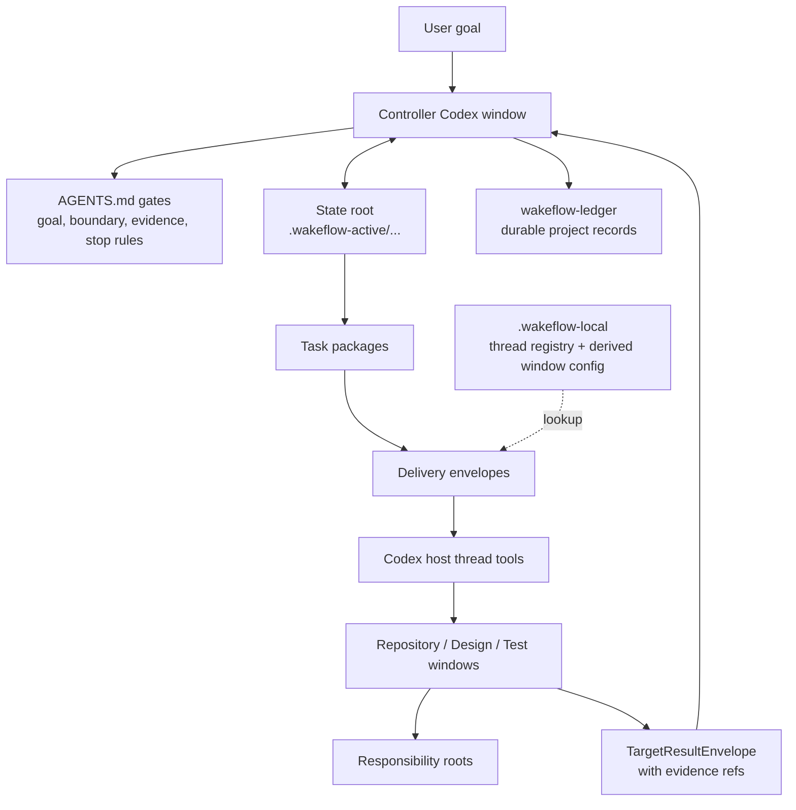

<div align="center">

# Wakeflow

A disciplined control loop for multi-window agent work — every step traced, every result proven.

[English](README.md) | [Simplified Chinese](README.zh-CN.md)

Wakeflow turns a local Codex workspace into a disciplined controller system:
one controller window, focused repository windows, explicit state roots,
compact direct-thread delivery, and evidence-based acceptance. The controller runs this as a closed loop — plan, dispatch, collect evidence, review, decide, repeat — and records every step, so the whole run is auditable after the fact.

</div>

---

- [Why Wakeflow](#why-wakeflow)
- [System Model](#system-model)
- [Install Wakeflow](#install-wakeflow)
- [Quick Start](#quick-start)
- [Initialize A Workspace](#initialize-a-workspace)
- [What Wakeflow Creates](#what-wakeflow-creates)
- [How Work Moves](#how-work-moves)
- [Automation Semantics](#automation-semantics)
- [MCP Capability Surface](#mcp-capability-surface)
- [Runtime And Ledger Boundaries](#runtime-and-ledger-boundaries)
- [Dual-Host Workspaces](#dual-host-workspaces)
- [Marketplace Release](#marketplace-release)
- [Working In This Repository](#working-in-this-repository)
- [Design Principles](#design-principles)

## Why Wakeflow

Large agent-assisted work rarely lives in one repository or one conversation.
A single goal may require a controller, product repositories, a design window,
and a real-scenario test window. Without a shared operating model, the work
degrades into scattered prompts, copied status tables, unclear ownership, and
unfinished evidence review.

Wakeflow provides the missing control layer:

- **Controller-first judgment**: the parent workspace owns goals, boundaries,
  dispatch decisions, acceptance, TODO routing, and archive decisions.
- **One state root per demand**: task packages, target results, review
  candidates, decisions, and progress projections stay tied to the same demand.
- **Focused child windows**: each repository window works only inside its
  configured responsibility boundary.
- **Compact delivery**: direct-thread prompts wake the right window with a small
  envelope; the state root and skills hold the task details.
- **Evidence before acceptance**: target backfill is input, not a conclusion.
  The controller still reviews raw evidence before completing work.
- **Local-first runtime**: real thread ids live only in the local thread
  registry; window config is a derived sendability view, and active state stays
  out of tracked source.

Wakeflow is not a command launcher with nicer names. It is a reusable workflow
capability for keeping multi-window agent work legible, bounded, and resumable.

## System Model



The controller is the only acceptance authority. Scripts and MCP tools create,
validate, summarize, and record machine data, but they do not widen scope,
decide product behavior, or declare a task complete.

## Install Wakeflow

Wakeflow uses the same two-layer marketplace shape as Lark Remote: the
repository root is the development workspace, and the installable plugin
artifact lives in `plugins/codex-wakeflow/`. The root
`.agents/plugins/marketplace.json` contains a single `wakeflow` entry whose
`source.path` is `./plugins/codex-wakeflow`.

Install the public plugin artifact:

```bash
npx codex-marketplace add GxFn/Wakeflow/plugins/codex-wakeflow --plugin
```

For a pinned release after the matching tag exists:

```bash
npx codex-marketplace add https://github.com/GxFn/Wakeflow/tree/v0.7.10/plugins/codex-wakeflow --plugin
```

If the Codex dialog separates source, ref, and sparse path, use the repository
URL, the desired ref, and `plugins/codex-wakeflow` as the sparse path.

For local development, register this checkout as its own local marketplace:

```toml
[marketplaces.gxfn]
source_type = "local"
source = "/absolute/path/to/Wakeflow"

[plugins."wakeflow@gxfn"]
enabled = true

[plugins."wakeflow@gxfn".mcp_servers.wakeflow]
default_tools_approval_mode = "approve"
```

Wakeflow does not require an aggregate marketplace repository. A separate
catalog can still list Wakeflow for brand discovery, but that is not part of
the primary install or release path.

## Quick Start

Wakeflow on Codex is driven through MCP tools (no slash commands). Tell Codex what you want in plain language and it calls the matching tool.

1. **Initialize** (once per workspace):
   ```text
   Use Wakeflow to initialize this workspace. Preview the plan first and wait for my confirmation.
   ```
   Codex calls `wakeflow_initialize_workspace` (dry-run -> confirm -> apply), then creates each window with the host `create_thread` tool and registers the real thread ids. Already initialized? Re-init is refused on purpose — rebuild one stale window with `wakeflow_replace_windows`, or do an explicit reset.
2. **Start work** — give the controller a demand, or ask Codex to dispatch the next eligible task.

### Tool cheat sheet (intent -> MCP tool)

| You want to... | Tool |
| --- | --- |
| Set up a new workspace | `wakeflow_initialize_workspace` |
| Rebuild a stale window | `wakeflow_replace_windows` |
| See demands / eligible work / readiness | `wakeflow_status`, `wakeflow_next_work` |
| Start a demand | `wakeflow_create_demand` -> `wakeflow_add_task` |
| Hand work to a window | `wakeflow_prepare_delivery` -> host send -> `wakeflow_record_delivery` |
| Record a target's result | `wakeflow_record_target_result` |
| Review and decide | `wakeflow_review_pack` -> `wakeflow_reduce_results` -> `wakeflow_decide_review` -> `wakeflow_complete_demand` |
| Hand a demand to the other host | `wakeflow_adopt_demand_host` |
| Health-check / converge runtime | `wakeflow_verify` |

## Initialize A Workspace

Wakeflow is installed as a Codex plugin. A target workspace does not need to
contain Wakeflow source code. The expected target shape is:

```text
MyWorkspace/
  AGENTS.md
  wakeflow.config.json
  .wakeflow-active/          # ignored active controller state
  .wakeflow-local/           # ignored thread registry and derived runtime
  wakeflow-ledger/            # durable project coordination records
  ProductRepo/
  CoreRepo/
  Design/                     # default internal requirement-design surface
  Test/                       # default internal test coordination surface
```

The simplest user prompt is:

```text
Use Wakeflow to initialize the current workspace.
Preview the plan first and wait for my confirmation before writing.
```

The operating flow is:

1. Codex calls `wakeflow_initialize_workspace` with `apply: false`.
2. Wakeflow returns directory facts and an `agentSelectionProtocol`.
3. Codex judges whether the workspace is clean or messy from those facts and
   user context.
4. For a clean workspace, Codex calls the tool again with explicit
   `repositories` mappings for the intended work windows.
5. For a messy workspace, Codex asks which directories are managed windows
   before writing. It must not use a broad discovered-directory import.
6. After user confirmation for a fresh workspace, Codex calls
   `wakeflow_initialize_workspace` with `apply: true`.
7. Codex creates the returned threads, resets each title to `displayTitle`, and
   calls `wakeflow_register_window` once per real `create_thread.threadId`.
   The tool updates the local registry and derived window config without
   exposing the id.

For an already initialized workspace, `wakeflow_initialize_workspace` is not a
general refresh button. It may write only after the user explicitly requests a
reset initialization; the apply call must set `resetInitialization: true`, pass
explicit `repositories`, reconfirm Design/Test mode, and must not use
`useDiscovered`. Heavy or stale windows use the replacement commands instead.

Command responsibilities stay separate:

| Need | Command | Responsibility |
| --- | --- | --- |
| First-time setup | `wakeflow_initialize_workspace` | Discover, confirm, write workspace config/docs/support surfaces, and return the full launch plan. |
| Explicit reset setup | `wakeflow_initialize_workspace` with `resetInitialization: true` | Reconfirm work directories, clean stale managed window cards/runtime for removed windows, and rewrite setup surfaces. |
| One heavy/stale window | `wakeflow_replace_windows` (pass `window`) | Return one replacement launch entry with a `wakeflow_register_window` call template; no workspace docs refresh. |
| Several heavy/stale windows | `wakeflow_replace_windows` | Return only the requested replacement entries and registration call templates; no unrelated window rewrites. |

Design and Test are fresh support surfaces by default. Existing similarly named
directories such as `<Product>Design` or `<Product>Test` are treated as ordinary
directory facts unless the user explicitly maps them as Design/Test.

Wakeflow supports localized initialization. Pass `language: "zh"` for Chinese
workspaces, `language: "en"` for English workspaces, or `language: "auto"` when
there is no clear preference. Generated thread titles keep the window name at
the front so the important repository name remains visible in narrow sidebars.
New state-root progress documents and subsequent Unified Status renders also
use the selected interface language.

Controller and child windows can use Codex subagents to speed up bounded code
search, log triage, test localization, and evidence summaries. Subagent output
is evidence or advice only; controller review, dispatch, state writes, and
repository boundaries remain with the Wakeflow window that owns the task.

## What Wakeflow Creates

Initialization writes only the surfaces needed for the confirmed workspace
boundary:

| Surface | Purpose |
| --- | --- |
| `AGENTS.md` | Parent controller gates and durable boundaries. |
| Child `AGENTS.md` access cards | Per-window responsibility and read paths. |
| `wakeflow.config.json` | Managed windows, repository paths, roles, and default language. |
| `.wakeflow-active/` | Active state roots, current indexes, progress docs, TODO projections, intake, and test cards. |
| `.wakeflow-local/` | Thread registry, direct-thread runtime, local overrides, and derived window config. |
| `wakeflow-ledger/` | Long-term project coordination records and archives. |
| `Design/` | Internal requirement-design workspace when no external Design repository is mapped. |
| `Test/` | Internal test coordination workspace when no external Test repository is mapped. |

Wakeflow also synchronizes `.gitignore` so only `.wakeflow-active/` and
`.wakeflow-local/` remain local runtime directories. It does not add product
repositories, Design/Test folders, ledgers, `.DS_Store`, or other user
workspace noise to `.gitignore`.

## How Work Moves

The normal Wakeflow loop is deliberately small:

1. A user goal, Design handoff, or controller intake creates a demand.
2. The controller defines completion, boundaries, phase order, and the first
   blocker.
3. A state root records the demand and creates eligible task packages.
4. The controller prepares compact delivery envelopes for the target windows.
5. Target windows read their own rules, execute only their assigned package, and
   return target result envelopes with reviewable evidence.
6. The controller reviews raw evidence, records a decision, and either creates
   the next eligible package, stops for user judgment, marks the demand blocked,
   or completes the demand.
7. Durable conclusions move to `wakeflow-ledger/`; local runtime stays local.

Design and Test are supporting roles:

- **Design** clarifies requirements, options, risks, and handoff candidates. It
  also redesigns non-bug outcome mismatches when implementation evidence is
  valid but the user-visible effect is still wrong. It does not dispatch
  implementation or become product truth by itself.
- **Test** is reserved for real-scenario evidence that the controller or product
  repository cannot safely reproduce alone.

## Demand Pods (multi-demand parallelism)

Parallelism exists ONLY at the demand level. Within one demand each repository
runs exactly ONE window with ONE combined task package (the window
self-sequences its items); across demands, up to `maxActiveDemands` (default
2, `wakeflow.config.json`) demands run side by side as pods:

- One demand = one pod: its own `Controller__<pod>`, per-repo isolation
  worktree windows (`<repo>__<pod>` on branch `<demandKey>/<pod>`), and its
  own `Test__<pod>` — a per-demand thread set. The WHOLE pod shares the
  demand's one worktree set: every window, Test included, works and verifies
  inside those worktrees, never on a main checkout. Pods are mutually unaware.
- Open with `wakeflow_pod_open` (idempotent — re-run resumes): it creates the
  worktrees + overlay entries and returns a windowPlan; create each entry's
  thread with `create_thread` (cwd = the entry's worktree, prompt = the
  entry's `createThreadPrompt`) and register it via `wakeflow_register_window`.
  `wakeflow_pod_list` is the one global view.
- The pod controller claims its demand itself (`wakeflow_create_demand` with
  `controllerWindow: "Controller__<pod>"`), so every controller-return routes
  to the pod, not the default controller.
- Close order: `complete-demand` → `wakeflow_pod_close` (worktrees down;
  surviving branches land on `wakeflow-ledger/workspace/pending-merges.md`)
  → archive. Merge-back is human-reviewed and decentralized — no controller
  merges pod branches.
- `maxStreamsPerRepo` bounds how many pods may hold isolation worktrees on
  one repository; claiming past `maxActiveDemands` fails closed.

## Automation Semantics

Wakeflow automation is direct-thread delivery plus explicit result return.

Core rules:

- Real thread ids live only in
  `.wakeflow-local/wakeflow-delivery/hosts/codex/thread-registry/`.
- Window config is derived from `wakeflow.config.json` plus thread-registry
  presence; it is not a second thread-id or window-semantics authority.
- Delivery prompts remain compact and human-readable.
- The host sends prompts with Codex thread tools; Wakeflow records the send and
  readback evidence.
- `group-ready` waits for the expected target results before a controller
  return.
- `per-target` can wake the controller once per target while still preserving a
  group snapshot.
- After a real send is recorded as sent with readback evidence, the controller
  turn stops. It does not sleep or poll in the same turn.
- Keep-live support is runtime assistance only. It is not task logic, transport
  authority, or acceptance evidence.
- Demand creation is host-neutral: `wakeflow_create_demand` writes
  `controllerHost: null`, so Codex and Claude Code can both create or import
  demand material without taking ownership.
- The first real driving command claims the demand for its platform by writing
  `controllerHost: "codex"` or `controllerHost: "claude-code"`.
- After a demand is owned by one host, the other host fails closed on
  controller mutations and dispatch preparation unless ownership is explicitly
  transferred with `--adopt-host`.
- Up to `maxActiveDemands` (default 2, top-level `wakeflow.config.json`) demands may be active at once; claiming past capacity fails closed until one completes and archives. `wakeflow_next_work` reports the `activeDemands` list and `demandCapacity`.
- `wakeflow_status` exposes demand ownership under `dualHost.demandOwnership`
  so mixed-host controllers can see which platform owns active work before
  acting.

Automation stops on final completion, hard gates, user stop, no eligible work,
missing evidence, blocked state, or any condition that requires controller or
user judgment.

## MCP Capability Surface

Wakeflow exposes only stable outer workflow contracts as MCP tools. Runtime
scripts remain the internal implementation and test surface; they are not
public tools just because they exist. A target closeout uses the same
direct-thread delivery model as controller dispatch: prepare an envelope, send
the prompt with the host thread tool, then record the delivery run.

Primary tool groups:

| Need | MCP tools |
| --- | --- |
| Setup and workspace discovery | `wakeflow_initialize_workspace` |
| Responsibility window replacement | `wakeflow_replace_windows` (one via `window`, many via `windows`) |
| Demand and task state | `wakeflow_status`, `wakeflow_create_demand`, `wakeflow_add_task`, `wakeflow_next_work` |
| Delivery and returns | `wakeflow_prepare_delivery`, `wakeflow_record_delivery` |
| Results and review | `wakeflow_record_target_result`, `wakeflow_review_pack`, `wakeflow_reduce_results`, `wakeflow_decide_review`, `wakeflow_complete_demand` |
| Design and Test intake | `wakeflow_deliver`, `wakeflow_intake_test_card` |
| Archive, maintenance, and verification | `wakeflow_archive` (target demand/todo/docs), `wakeflow_prune_runtime`, `wakeflow_verify`, `wakeflow_view` (scope trace) |

Public MCP tools are for outer agent workflows. Target closeout is deliberately
split: record a target result, review readiness, prepare a controller-return
envelope when policy allows, send with the Codex host thread tool, and record
delivery evidence. Controller review stays split as review pack, result
reduction, and explicit decision; result reduction only creates a review
candidate and is not acceptance. Do not collapse those steps into a single
target-window MCP tool. Internal steps such as archive summary refresh internals,
keep-live state, and script backend execution stay inside Wakeflow JS/runtime
scripts and skills. Public archive MCP tools wrap only controller-approved TODO
or workspace document archive flows; they do not make acceptance decisions or
send host messages.

Wakeflow declares MCP tool annotations for every public tool: read-only tools
are marked read-only, write tools are local, non-destructive, and closed-world.
Codex approval policy is still controlled by the user's Codex config. For a
trusted local Wakeflow installation, the matching Codex server policy is:

```toml
[plugins."wakeflow@gxfn".mcp_servers.wakeflow]
default_tools_approval_mode = "approve"
```

## Runtime And Ledger Boundaries

Wakeflow keeps source, active runtime, and durable records separate:

| Path | Boundary |
| --- | --- |
| `skills/` | Reusable operating instructions installed with the plugin. |
| `scripts/` | Runtime implementation and validation scripts packaged by the plugin. |
| `templates/wakeflow-template-bundle.json` | Bundled starter state, Design/Test, and ledger skeletons expanded during setup. |
| `.wakeflow-active/` | Current active work in a target workspace; ignored by Git. |
| `.wakeflow-local/` | Machine-local thread registry, derived runtime views, and local state; ignored by Git. |
| `wakeflow-ledger/` | Project-specific durable records outside reusable Wakeflow source. |

The source repository tracks reusable Wakeflow capability. Product code,
project-specific active state, real thread ids, and derived local runtime
artifacts do not belong in Wakeflow source.

## Dual-Host Workspaces

A workspace may run the Codex and Claude Code Wakeflow editions side by side.
Shared business state (`.wakeflow-active/`, `wakeflow-ledger/`, and the
dispatch packets, dispatch groups, delivery envelopes, delivery runs, target
results, and shared `locks/` under `.wakeflow-local/wakeflow-delivery/`)
stays host-neutral. Shared locks enforce one in-flight delivery per window
across hosts.

Codex runtime remains host-scoped under
`.wakeflow-local/wakeflow-delivery/hosts/codex/{thread-registry,window-config,keep-live}/`.
Claude Code stores its own runtime under
`.wakeflow-local/wakeflow-delivery/hosts/claude-code/{thread-registry,window-config,window-host,keep-live}/`.
Records in the legacy `.wakeflow-local/wakeflow-delivery/thread-registry/`
location are still read as a fallback; new registrations write the host-scoped
path and `wakeflow_verify` reports the migration state.

`AGENTS.md` (Codex) and `CLAUDE.md` (Claude Code) may coexist at the
workspace and child roots. Each demand still has exactly one controller host:
creation is neutral, the first driving command claims ownership, non-owning
hosts fail closed, and `--adopt-host` is the explicit transfer mechanism.

## Marketplace Release

Wakeflow is packaged as a Codex plugin source repository. The public source of
truth is:

```text
https://github.com/GxFn/Wakeflow.git
```

The repository carries its own marketplace catalog at
`.agents/plugins/marketplace.json`. That catalog is intentionally single-plugin:
it names the marketplace `gxfn`, displays as `GxFn`, and points the only plugin
entry at `./plugins/codex-wakeflow`. Publishing Wakeflow means tagging the repository
and submitting the nested plugin artifact, not the development workspace root.

Before publishing a release tag:

1. Run `npm test` from this repository.
2. Run the Codex plugin manifest validator in an environment with its Python
   dependencies installed.
3. Confirm `plugins/codex-wakeflow/.codex-plugin/plugin.json` has no more than three
   starter prompts.
4. Confirm `.agents/plugins/marketplace.json` contains only the nested
   `./plugins/codex-wakeflow` entry.
5. Confirm runtime scripts and installed skills contain no project-specific
   default controller names, product overlays, local paths, or private thread
   ids.
6. Tag the exact commit that Codex should install.

## Working In This Repository

Use this repository to develop the Wakeflow plugin itself.

```sh
npm run validate
npm run smoke
npm run test:wakeflow
npm test
```

Common source areas:

| Path | Purpose |
| --- | --- |
| `.codex-plugin/plugin.json` | Plugin manifest and MCP wiring. |
| `mcp/server.cjs` | Standalone MCP server entrypoint with no `node_modules` dependency. |
| `scripts/` | Setup, state, delivery, intake, archive, validation, and CLI runtime shipped with the plugin. |
| `skills/` | Controller, target, governance, and validation operating manuals shipped with the plugin. |
| `templates/wakeflow-template-bundle.json` | Installed workspace starter documents and support surfaces, bundled for marketplace scan size. |
| `assets/` | Marketplace and plugin presentation assets. |
| `../../test/` | Development-only regression tests kept outside the marketplace scan surface. |
| `../../docs/` | Development planning and architecture notes kept outside the plugin artifact. |

Detailed command references live in [scripts/README.md](scripts/README.md).
The top-level README explains the system model; the script README is the
operator manual.

## Design Principles

1. **Judgment stays visible**: script output, status rows, and target backfill
   are evidence, not acceptance.
2. **One demand, one state root**: JSON state and Markdown progress surfaces
   stay tied to the same demand.
3. **Prompts wake, state instructs**: prompts should be compact; task detail
   belongs in state roots, task packages, and installed skills.
4. **Repository boundaries matter**: each window owns its source, tests,
   commits, and evidence.
5. **Automation moves work, not authority**: direct-thread delivery proves that
   a prompt was sent, not that the result is complete.
6. **Local runtime stays local**: real thread ids stay only in the local thread
   registry, and active runtime state never enters tracked documentation.
7. **Fresh support windows by default**: Design and Test are created as clear
   Wakeflow support surfaces unless the user explicitly maps existing ones.

Wakeflow exists to make multi-window agent work safe to resume, easy to
inspect, and hard to fake.
