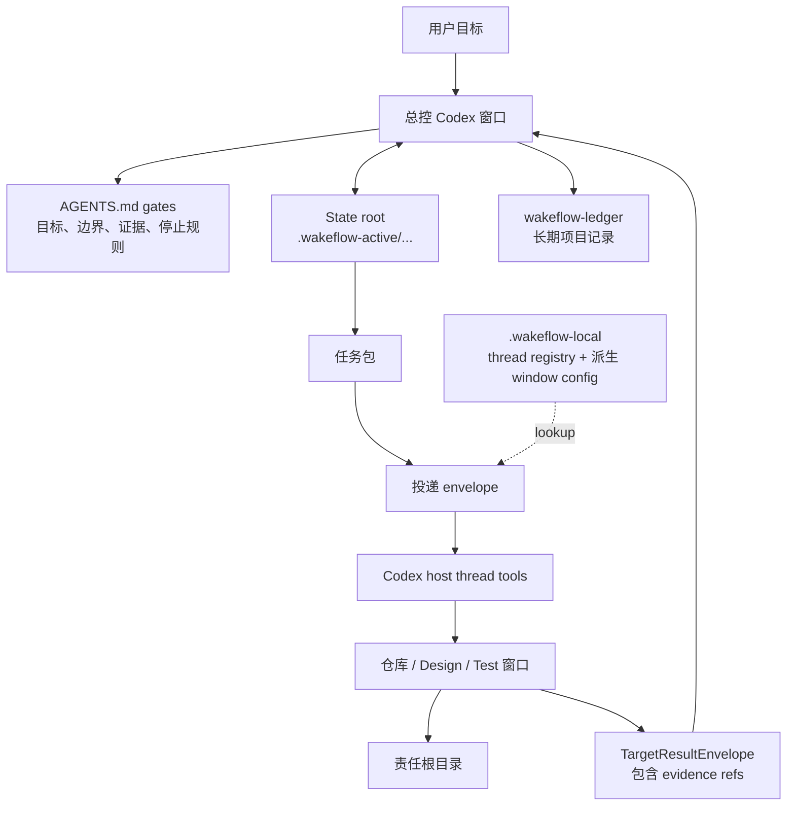

<div align="center">

# Wakeflow

面向多窗口 agent 工作的严谨控制循环——每一步留痕、每个结果实证。

[English](README.md) | [简体中文](README.zh-CN.md)

Wakeflow 把一个本地 Codex 工作区变成有纪律的控制系统：一个总控窗口、
多个聚焦的仓库窗口、明确的 state root、轻量 direct-thread 投递，以及基于证据的验收。总控以闭环方式运行这套系统——规划、派发、收集证据、审查、决策、循环往复——并记录每一步，整个过程事后可审计。

</div>

---

- [为什么需要 Wakeflow](#为什么需要-wakeflow)
- [系统模型](#系统模型)
- [安装 Wakeflow](#安装-wakeflow)
- [快速开始](#快速开始)
- [初始化工作区](#初始化工作区)
- [Wakeflow 会创建什么](#wakeflow-会创建什么)
- [工作如何流转](#工作如何流转)
- [自动化语义](#自动化语义)
- [MCP 能力面](#mcp-能力面)
- [运行时与账本边界](#运行时与账本边界)
- [双宿主工作区](#双宿主工作区)
- [Marketplace 发布](#marketplace-发布)
- [开发本仓库](#开发本仓库)
- [设计原则](#设计原则)

## 为什么需要 Wakeflow

大型 agent 辅助工作很少只发生在一个仓库或一个会话里。一个目标可能需要
总控、多个产品仓库、一个 Design 窗口，以及一个真实场景 Test 窗口。没有共同的
操作模型时，工作很容易退化成零散 prompt、复制粘贴的状态表、不清晰的责任边界，
以及没有真正验收的“完成”。

Wakeflow 提供缺失的控制层：

- **总控优先判断**：父工作区负责目标、边界、投递决策、验收、TODO 路由和归档决策。
- **一个需求一个 state root**：任务包、目标结果、review candidate、决策和进度投影都绑定到同一个需求。
- **聚焦的子窗口**：每个仓库窗口只在配置好的责任边界内工作。
- **轻量投递**：direct-thread prompt 只负责唤醒正确窗口；state root 和 skills 保存任务细节。
- **先证据，后验收**：target backfill 是输入，不是结论；总控仍然要检查原始证据。
- **本地优先运行时**：真实 thread id 只存在本地 thread registry；window config 是派生视图，active state 不进入源码。

Wakeflow 不是换了名字的命令启动器。它是一个可复用的工作流能力，用来让多窗口
agent 工作保持可读、有边界、可恢复。

## 系统模型



总控是唯一验收权威。脚本和 MCP 工具可以创建、验证、汇总、记录机器数据，但不能扩大范围、
决定产品行为，或宣称任务已经完成。

## 安装 Wakeflow

Wakeflow 采用和 Lark Remote 一样的双层 marketplace 结构：仓库根目录是开发工作区，
真正可安装的插件 artifact 位于 `plugins/codex-wakeflow/`。根目录
`.agents/plugins/marketplace.json` 内只有一个 `wakeflow` 条目，`source.path`
指向 `./plugins/codex-wakeflow`。

安装公开插件 artifact：

```bash
npx codex-marketplace add GxFn/Wakeflow/plugins/codex-wakeflow --plugin
```

如果已经有匹配 tag，可以固定版本安装：

```bash
npx codex-marketplace add https://github.com/GxFn/Wakeflow/tree/v0.7.10/plugins/codex-wakeflow --plugin
```

如果 Codex 对话框把 source、ref 和 sparse path 分开填写，请使用仓库 URL、目标 ref，
并把 sparse path 填成 `plugins/codex-wakeflow`。

本地开发时，可以把当前 checkout 注册成本地 marketplace：

```toml
[marketplaces.gxfn]
source_type = "local"
source = "/absolute/path/to/Wakeflow"

[plugins."wakeflow@gxfn"]
enabled = true

[plugins."wakeflow@gxfn".mcp_servers.wakeflow]
default_tools_approval_mode = "approve"
```

Wakeflow 不要求额外的聚合 marketplace 仓库。单独的 catalog 可以用于品牌展示，
但不是主要安装或发布路径。

本地重装或更新 Wakeflow 后，需要**完整退出并重启 Codex App**，再创建或恢复
Wakeflow 窗口。仅在同一个 App 进程里新建任务，仍可能继承旧的或缺失的 MCP 能力面。

## 快速开始

Codex 版通过 MCP 工具驱动(没有 slash 命令)。用自然语言告诉 Codex 你要做什么,它会调用对应工具。

1. **初始化**(每个工作区一次):
   ```text
   用 Wakeflow 初始化这个工作区,先预览计划,等我确认再写入。
   ```
   Codex 调用 `wakeflow_initialize_workspace`(dry-run -> 确认 -> apply),再用宿主 `create_thread` 工具创建每个窗口并注册真实 thread id。已初始化过?重初始化会有意被拒——单个陈旧窗口用 `wakeflow_replace_windows` 重建,或做显式 reset。
2. **开始干活**——给总控一个需求,或让 Codex 派发下一个可领取任务。

### 工具速查表(意图 -> MCP 工具)

| 你想... | 工具 |
| --- | --- |
| 搭建新工作区 | `wakeflow_initialize_workspace` |
| 重建陈旧窗口 | `wakeflow_replace_windows` |
| 看需求 / 可领取工作 / 就绪度 | `wakeflow_status`、`wakeflow_next_work` |
| 启动一个需求 | `wakeflow_create_demand` -> `wakeflow_add_task` |
| 把活交给窗口 | `wakeflow_prepare_delivery` -> 宿主发送 -> `wakeflow_record_delivery` |
| 记录目标结果 | `wakeflow_record_target_result` |
| 评审并决策 | `wakeflow_review_pack` -> `wakeflow_reduce_results` -> `wakeflow_decide_review` -> `wakeflow_complete_demand` |
| 把需求移交另一宿主 | `wakeflow_adopt_demand_host` |
| 体检 / 收敛运行时 | `wakeflow_verify` |

## 初始化工作区

Wakeflow 作为 Codex 插件安装。目标工作区不需要包含 Wakeflow 源码。推荐的目标形态是：

```text
MyWorkspace/
  AGENTS.md
  wakeflow.config.json
  .wakeflow-active/          # ignored active controller state
  .wakeflow-local/           # ignored thread registry and derived runtime
  wakeflow-ledger/            # durable project coordination records
  ProductRepo/
  CoreRepo/
  Design/                     # 默认内部需求设计 surface
  Test/                       # 默认内部测试协作 surface
```

最简单的用户 prompt：

```text
Use Wakeflow to initialize the current workspace.
Preview the plan first and wait for my confirmation before writing.
```

执行流程：

1. Codex 调用 `wakeflow_initialize_workspace`，`apply: false`。
2. Wakeflow 返回目录事实和 `agentSelectionProtocol`。
3. Codex 根据目录事实和用户上下文判断工作区是 clean 还是 messy。
4. 对 clean 工作区，Codex 再次调用工具，并显式传入目标 work windows 的 `repositories` 映射。
5. 对 messy 工作区，Codex 先问用户哪些目录是受管窗口，不能直接广泛导入 discovered 目录。
6. 对首次初始化的工作区，用户确认后，Codex 调用
   `wakeflow_initialize_workspace`，`apply: true`。
7. Codex 创建返回的线程，将标题重设为 `displayTitle`，再对每个真实
   `create_thread.threadId` 调用一次 `wakeflow_register_window`。工具会更新本地
   registry 和派生 window config，并从输出中隐藏 id。

已经初始化过的工作区里，`wakeflow_initialize_workspace` 不是通用“刷新”按钮。
只有用户明确要求“重置初始化”时才能写入；apply 调用必须设置
`resetInitialization: true`，显式传入 `repositories`，重新确认 Design/Test 模式，
并且不能使用 `useDiscovered`。窗口上下文过重或过期时，使用替换窗口命令。

三个高层入口的职责要分清：

| 需求 | 命令 | 职责 |
| --- | --- | --- |
| 首次 setup | `wakeflow_initialize_workspace` | 发现、确认、写入 workspace config/docs/support surfaces，并返回完整 launch plan。 |
| 明确重置 setup | `wakeflow_initialize_workspace` + `resetInitialization: true` | 重新确认工作目录，清理被移除窗口的受管 cards/runtime，并重写 setup surfaces。 |
| 替换单个上下文过重/过期窗口 | `wakeflow_replace_windows`（传 `window`） | 只返回一个 replacement launch entry 和 `wakeflow_register_window` 调用模板，不刷新 workspace docs。 |
| 替换多个上下文过重/过期窗口 | `wakeflow_replace_windows` | 只返回指定窗口的 replacement entries 和注册调用模板，不改无关窗口。 |

Design 和 Test 默认创建为新的支持 surface。`<Product>Design` 或 `<Product>Test`
这类相似目录只被当作目录事实，除非用户明确把它们映射成 Design/Test。

Wakeflow 支持本地化初始化。中文工作区传 `language: "zh"`，英文工作区传
`language: "en"`，没有明显偏好时传 `language: "auto"`。生成的线程标题会把窗口名放在最前面，
方便在窄侧边栏里识别仓库。

## Wakeflow 会创建什么

初始化只写入已确认边界所需的 surface：

| Surface | 用途 |
| --- | --- |
| `AGENTS.md` | 父级总控 gate 和长期边界规则。 |
| 子窗口 `AGENTS.md` access cards | 每个窗口的责任和读取路径。 |
| `wakeflow.config.json` | 受管窗口、仓库路径、角色和默认语言。 |
| `.wakeflow-active/` | active state roots、当前索引、progress docs、TODO 投影、intake 和 test cards。 |
| `.wakeflow-local/` | thread registry、direct-thread runtime、本地 overrides 和派生 window config。 |
| `wakeflow-ledger/` | 长期项目协作记录和归档。 |
| `Design/` | 未映射外部 Design 仓库时创建的内部需求设计工作区。 |
| `Test/` | 未映射外部 Test 仓库时创建的内部测试协作工作区。 |

Wakeflow 也会同步 `.gitignore`，只把 `.wakeflow-active/` 和 `.wakeflow-local/`
作为本地运行时目录忽略。它不会把产品仓库、Design/Test、ledger、`.DS_Store`
或其他本地杂项加入 `.gitignore`。

## 工作如何流转

Wakeflow 的正常循环刻意保持小而清晰：

1. 用户目标、Design handoff 或 controller intake 创建一个 demand。
2. 总控定义完成标准、边界、阶段顺序和第一个 blocker。
3. state root 记录 demand 并创建可执行任务包。
4. 总控为目标窗口准备轻量 delivery envelope。
5. 目标窗口读取自己的规则，只执行分配给自己的任务包，并返回带可审查证据的 target result envelope。
6. 总控审查原始证据，记录决策，然后创建下一批可执行任务、等待用户判断、标记 blocked，或完成 demand。
7. 长期结论进入 `wakeflow-ledger/`；本地运行时继续留在本地。

Design 和 Test 是支持角色：

- **Design** 澄清需求、选项、风险和 handoff 候选。当实现证据有效但用户可见效果仍不对、且不是明确 bug 时，Design 负责重新设计真实调整方案。Design 不投递实现，也不会自动成为产品真相。
- **Test** 只用于总控或产品仓库无法安全复现的真实场景证据。

## Demand Pods（多需求并行）

并行只存在于需求层面。同一需求内每个仓库只有一个窗口、一个组合任务包
（窗口自排序）；跨需求最多 `maxActiveDemands`（默认 2，`wakeflow.config.json`）
个需求以 pod 并行：

- 一个需求 = 一个执行 pod。持久舰队是 pod 0，使用主检出；第 2..N 个需求才
  获得专属 `Controller__<pod>`、`Test__<pod>` 和按仓库的 isolation worktree
  窗口（`<repo>__<pod>`，分支 `<demandKey>/<pod>`）。整个隔离 pod 共用 ONE
  worktree set，其中所有窗口都在该集合工作和验证，绝不碰主检出。pod 之间
  互不感知。
- 用 `wakeflow_pod_open` 打开（幂等——重跑即续开）：它创建 worktree 和 overlay
  条目并返回 windowPlan；按计划逐条用 `create_thread` 建线程（cwd = 该条目的
  worktree，提示词 = `createThreadPrompt`），再用 `wakeflow_register_window`
  注册。`wakeflow_pod_list` 是唯一全局视图。
- pod 总控自己 claim 需求（`wakeflow_create_demand` 带
  `controllerWindow: "Controller__<pod>"`），所有 controller-return 都路由回
  该 pod，而不是默认总控。
- 关闭顺序：`complete-demand` → `wakeflow_pod_close`（拆 worktree；存活分支落在
  `wakeflow-ledger/workspace/pending-merges.md`）→ 归档。合并回主线由人工审核、
  去中心化——任何总控都不合并 pod 分支。
- `maxStreamsPerRepo` 限制一个仓库上可有多少 pod 持有 isolation worktree；
  超出 `maxActiveDemands` 的 claim 会 fail-closed。

## 自动化语义

Wakeflow 自动化是 direct-thread 投递加显式结果返回。

核心规则：

- 真实 thread id 只存在 `.wakeflow-local/wakeflow-delivery/hosts/codex/thread-registry/`。
- Window config 从 `wakeflow.config.json` 和 thread-registry presence 派生，不是第二份 thread-id 权威。
- Delivery prompts 保持轻量、可读。
- Host 通过 Codex thread tools 发送 prompt；Wakeflow 记录发送和 readback 证据。
- `group-ready` 会等待预期 target results，再允许 controller return。
- `per-target` 可以每个 target 唤醒一次 controller，同时保留 group snapshot。
- 一次真实发送被记录为 `sent` 且有 readback 证据后，总控本轮停止，不在同一轮 sleep 或 poll。
- Keep-live 只是运行时辅助，不是任务逻辑、传输权威或验收证据。
- Demand 创建是宿主中立的：`wakeflow_create_demand` 写入
  `controllerHost: null`，所以 Codex 和 Claude Code 都可以创建或导入需求材料，
  但不会因此抢占控制权。
- 第一个真正驱动需求的命令会把 demand 绑定到当前平台，写入
  `controllerHost: "codex"` 或 `controllerHost: "claude-code"`。
- demand 归属于某个宿主后，另一个宿主的 controller 写操作和投递准备会 fail-closed；
  只有显式 `--adopt-host` 才能转移控制权。
- 最多 `maxActiveDemands`（默认 2，顶层 `wakeflow.config.json`）个需求可以同时 active；超出容量的 claim 会 fail-closed，直到有需求完成并归档。`wakeflow_next_work` 会报告 `activeDemands` 列表和 `demandCapacity`。
- `wakeflow_status` 会在 `dualHost.demandOwnership` 暴露 active demand 的宿主归属，
  让混合宿主总控在行动前先看清归属。

自动化会在最终完成、硬 gate、用户停止、没有 eligible work、缺失证据、blocked state、
或任何需要总控/用户判断的条件下停止。

## MCP 能力面

Wakeflow 只把稳定的外层工作流合约暴露成 MCP tools。运行时脚本仍然是内部实现和测试 surface；
脚本存在不等于它就是公共工具。目标窗口 closeout 与总控投递使用同一套 direct-thread 模型：
准备 envelope、用 host thread tool 发送 prompt、记录 delivery run。

主要工具组：

| 需求 | MCP tools |
| --- | --- |
| 设置和工作区发现 | `wakeflow_initialize_workspace` |
| 职责窗口替换 | `wakeflow_replace_windows`（单个传 `window`，多个传 `windows`） |
| Demand 和任务状态 | `wakeflow_status`, `wakeflow_create_demand`, `wakeflow_add_task`, `wakeflow_next_work` |
| 投递和返回 | `wakeflow_prepare_delivery`, `wakeflow_record_delivery` |
| 结果和 review | `wakeflow_record_target_result`, `wakeflow_review_pack`, `wakeflow_reduce_results`, `wakeflow_decide_review`, `wakeflow_complete_demand` |
| Design 和 Test intake | `wakeflow_deliver`, `wakeflow_intake_test_card` |
| 归档、维护和验证 | `wakeflow_archive`（target demand/todo/docs）、`wakeflow_prune_runtime`、`wakeflow_verify`、`wakeflow_view`（scope trace） |

公共 MCP tools 面向外层 agent 工作流。target closeout 被故意拆开：
记录 target result、审查 readiness、在策略允许时准备 controller-return envelope、
用 Codex host thread tool 发送，再记录 delivery evidence。不要把这些步骤合并成一个 target-window MCP tool。

## 运行时与账本边界

Wakeflow 把源码、active runtime 和长期记录分开：

| Path | 边界 |
| --- | --- |
| `skills/` | 随插件安装的可复用操作说明。 |
| `scripts/` | 插件打包的运行时实现和验证脚本。 |
| `templates/wakeflow-template-bundle.json` | setup 时展开的 starter state、Design/Test 和 ledger skeletons bundle。 |
| `.wakeflow-active/` | 目标工作区中的当前 active work；被 Git 忽略。 |
| `.wakeflow-local/` | 机器本地 thread registry、派生 runtime views 和 local state；被 Git 忽略。 |
| `wakeflow-ledger/` | 项目特定的长期记录，不属于可复用 Wakeflow 源码。 |

Wakeflow 源仓库只跟踪可复用能力。产品代码、项目特定 active state、真实 thread id
和派生本地运行时 artifacts 都不应进入 Wakeflow 源码。

## 双宿主工作区

同一个工作区可以同时运行 Codex 和 Claude Code 两个 Wakeflow 版本。共享业务状态
（`.wakeflow-active/`、`wakeflow-ledger/`，以及 `.wakeflow-local/wakeflow-delivery/`
下的 dispatch packets、dispatch groups、delivery envelopes、delivery runs、
target results 和共享 `locks/`）保持宿主中立。共享锁会跨宿主强制每个窗口同一时间
只有一个 in-flight 投递。

Codex 运行时仍位于宿主独立路径：
`.wakeflow-local/wakeflow-delivery/hosts/codex/{thread-registry,window-config,keep-live}/`。
Claude Code 运行时位于：
`.wakeflow-local/wakeflow-delivery/hosts/claude-code/{thread-registry,window-config,window-host,keep-live}/`。
旧位置 `.wakeflow-local/wakeflow-delivery/thread-registry/` 的记录仍会作为
fallback 被读取；新注册写入宿主独立路径，`wakeflow_verify` 会报告迁移状态。

`AGENTS.md`（Codex）与 `CLAUDE.md`（Claude Code）可以在工作区根目录和子目录根
共存。每个 demand 仍然只有一个 controller host：创建中立，第一次驱动命令认领，
非归属宿主 fail-closed，`--adopt-host` 是显式转移机制。

## Marketplace 发布

Wakeflow 被打包成 Codex 插件源仓库。公开 source of truth 是：

```text
https://github.com/GxFn/Wakeflow.git
```

仓库自带 marketplace catalog：`.agents/plugins/marketplace.json`。这个 catalog
故意只包含一个插件：marketplace 名为 `gxfn`，显示为 `GxFn`，唯一插件条目指向
`./plugins/codex-wakeflow`。发布 Wakeflow 意味着给仓库打 tag，并提交嵌套插件 artifact，
不是提交开发工作区根目录。

发布 release tag 前：

1. 在本仓库运行 `npm test`。
2. 在有 Python 依赖的环境中运行 Codex plugin manifest validator。
3. 确认 `plugins/codex-wakeflow/.codex-plugin/plugin.json` starter prompts 不超过 3 条。
4. 确认 `.agents/plugins/marketplace.json` 只包含嵌套的 `./plugins/codex-wakeflow` 条目。
5. 确认 runtime scripts 和 installed skills 没有项目特定默认 controller 名、产品 overlay、
   本地路径或私有 thread id。
6. 给 Codex 应安装的精确 commit 打 tag。

## 开发本仓库

本仓库用于开发 Wakeflow 插件本身。

```sh
npm run validate
npm run smoke
npm run test:wakeflow
npm test
```

常见源码区域：

| Path | 用途 |
| --- | --- |
| `.codex-plugin/plugin.json` | 插件 manifest 和 MCP wiring。 |
| `mcp/server.cjs` | 无 `node_modules` 依赖的 standalone MCP server entrypoint。 |
| `scripts/` | 随插件发布的 setup、state、delivery、intake、archive、validation 和 CLI runtime。 |
| `skills/` | 随插件发布的 controller、target、governance 和 validation 操作手册。 |
| `templates/wakeflow-template-bundle.json` | 已安装工作区 starter documents 和 support surfaces 的 bundle，用于控制 marketplace scan 文件数。 |
| `assets/` | Marketplace 和插件展示资源。 |
| `../../test/` | 开发期回归测试，不进入 marketplace 扫描面。 |
| `../../docs/` | 开发期规划和架构文档，不进入插件 artifact。 |

详细命令说明在 [scripts/README.md](scripts/README.md)。顶层 README 解释系统模型；
script README 是操作者手册。

## 设计原则

1. **判断必须可见**：脚本输出、状态行、target backfill 是证据，不是验收。
2. **一个需求，一个 state root**：JSON state 和 Markdown progress surface 绑定到同一个 demand。
3. **Prompt 负责唤醒，state 负责指令**：prompt 应轻量；任务细节属于 state roots、task packages 和 installed skills。
4. **仓库边界很重要**：每个窗口拥有自己的源码、测试、提交和证据。
5. **自动化移动工作，不转移权威**：direct-thread delivery 只能证明 prompt 已发送，不能证明结果完成。
6. **本地运行时留在本地**：真实 thread id 只留在本地 thread registry，active runtime state 不进入 tracked docs。
7. **默认创建新的支持窗口**：Design 和 Test 默认作为清晰的 Wakeflow support surfaces 创建，除非用户明确映射既有目录。

Wakeflow 的目标是让多窗口 agent 工作可以安全恢复、容易审查，并且难以伪造完成。
