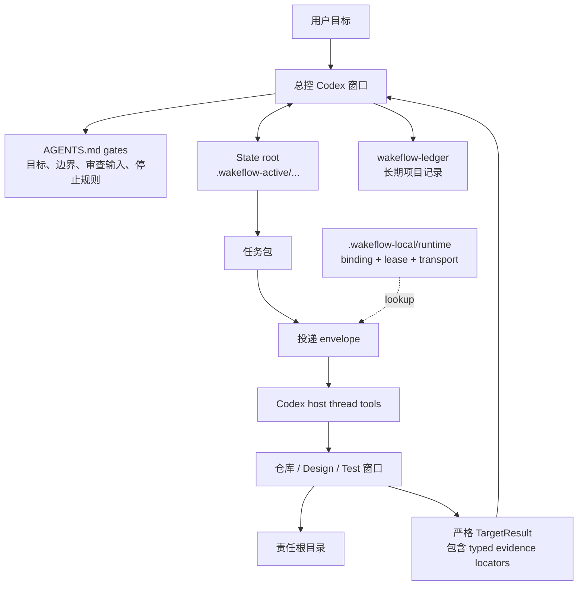

<div align="center">

# Wakeflow

面向多窗口 agent 工作的严谨控制循环——每一步留痕、每个结果可审查。

[English](README.md) | [简体中文](README.zh-CN.md)

Wakeflow 把一个本地 Codex 工作区变成有纪律的控制系统：每个 active demand 一条由总控负责的闭环、
多个聚焦的仓库窗口、明确的 state root、轻量 direct-thread 投递，以及由总控独立验证的验收。总控以闭环方式运行这套系统——规划、派发、收集审查输入、独立复验、决策、循环往复——并记录每一步，整个过程事后可审计。

</div>

---

- [为什么需要 Wakeflow](#为什么需要-wakeflow)
- [系统模型](#系统模型)
- [安装 Wakeflow](#安装-wakeflow)
- [快速开始](#快速开始)
- [初始化工作区](#初始化工作区)
- [Wakeflow 会创建什么](#wakeflow-会创建什么)
- [工作如何流转](#工作如何流转)
- [自动化语义](#自动化语义)
- [MCP 能力面](#mcp-能力面)
- [运行时与账本边界](#运行时与账本边界)
- [双宿主工作区](#双宿主工作区)
- [Marketplace 发布](#marketplace-发布)
- [开发本仓库](#开发本仓库)
- [设计原则](#设计原则)

## 为什么需要 Wakeflow

大型 agent 辅助工作很少只发生在一个仓库或一个会话里。一个目标可能需要
总控、多个产品仓库、一个 Design 窗口，以及一个真实场景 Test 窗口。没有共同的
操作模型时，工作很容易退化成零散 prompt、复制粘贴的状态表、不清晰的责任边界，
以及没有真正验收的“完成”。

Wakeflow 提供缺失的控制层：

- **总控优先判断**：父工作区负责目标、边界、投递决策、验收、TODO 路由和归档决策。
- **一个需求一个 state root**：任务包、目标结果、review candidate、决策和进度投影都绑定到同一个需求。
- **上下文完整的任务包**：每个新任务包一次性记录目标、带锚点的需求引用、边界、完成预期、依赖与仓库提交决定；派发再据此推导必须加载的执行 Skills。
- **聚焦的子窗口**：每个仓库窗口只在配置好的责任边界内工作。
- **先预览再投递**：总控先审阅解析后的仓库、任务简报、Skills 和最终 prompt，再用匹配计划的 `target-apply` 写入 direct-thread envelope，并以 `target-claim` 取得精确 lease。
- **验收锚点驱动工艺**：每个新 implementation 任务包必须携带至少一个明确的
  claim/probe/expected 锚点，子窗口编码前先映射为 RED 检查；总控仍独立复验。
- **先有审查输入，再做验收**：target backfill、日志、路径和测试摘要是输入，不是结论；Wakeflow 只检查结构和路径可定位性，总控仍要独立验证行为。
- **本地优先运行时**：raw thread id 只存在 typed 宿主本地 window binding；脱敏
  window-runtime 文件只是投影，active state 不进入源码。

Wakeflow 不是换了名字的命令启动器。它是一个可复用的工作流能力，用来让多窗口
agent 工作保持可读、有边界、可恢复。

## 系统模型



总控是唯一验收权威。脚本和 MCP 工具可以创建、验证、汇总、记录机器数据，但不能自行
选择验收、扩大范围或决定产品行为；它们只持久化总控的显式决策。

## 安装 Wakeflow

Wakeflow 采用和 Lark Remote 一样的双层 marketplace 结构：仓库根目录是开发工作区，
真正可安装的插件 artifact 位于 `plugins/codex-wakeflow/`。根目录
`.agents/plugins/marketplace.json` 内只有一个 `wakeflow` 条目，`source.path`
指向 `./plugins/codex-wakeflow`。

安装公开插件 artifact：

```bash
npx codex-marketplace add GxFn/Wakeflow/plugins/codex-wakeflow --plugin
```

如果已经有匹配 tag，可以固定版本安装：

```bash
npx codex-marketplace add https://github.com/GxFn/Wakeflow/tree/v0.9.6/plugins/codex-wakeflow --plugin
```

如果 Codex 对话框把 source、ref 和 sparse path 分开填写，请使用仓库 URL、目标 ref，
并把 sparse path 填成 `plugins/codex-wakeflow`。

本地开发时，可以把当前 checkout 注册成本地 marketplace：

```toml
[marketplaces.gxfn]
source_type = "local"
source = "/absolute/path/to/Wakeflow"

[plugins."wakeflow@gxfn"]
enabled = true

[plugins."wakeflow@gxfn".mcp_servers.wakeflow]
default_tools_approval_mode = "approve"
```

Wakeflow 不要求额外的聚合 marketplace 仓库。单独的 catalog 可以用于品牌展示，
但不是主要安装或发布路径。

本地重装或更新 Wakeflow 后，需要**完整退出并重启 Codex App**，再创建或恢复
Wakeflow 窗口。仅在同一个 App 进程里新建任务，仍可能继承旧的或缺失的 MCP 能力面。

## 快速开始

Codex 版通过 MCP 工具驱动(没有 slash 命令)。用自然语言告诉 Codex 你要做什么,它会调用对应工具。

1. **初始化**(每个工作区一次):
   ```text
   用 Wakeflow 初始化这个工作区,先预览计划,等我确认再写入。
   ```
   Codex 调用 `wakeflow_maintain_workspace`，使用 `action: "fresh-initialize"`（preview -> 确认精确 plan/digest -> apply），再用宿主 `create_thread` 创建窗口并注册真实 thread id。已初始化工作区使用 `reconfigure` 做有意模型变更、`reconcile` 做受管修复，或用 `wakeflow_replace_windows` 替换单个过期 binding。
2. **开始干活**——给总控一个需求,或让 Codex 派发下一个可领取任务。

### 工具速查表(意图 -> MCP 工具)

| 你想... | 工具 |
| --- | --- |
| 搭建或维护工作区 | `wakeflow_maintain_workspace`（`fresh-initialize`、`reconfigure`、`reconcile`） |
| 重建陈旧窗口 | `wakeflow_replace_windows` |
| 看需求 / 可领取工作 / 就绪度 | `wakeflow_status`、`wakeflow_next_work` |
| 启动一个需求 | `wakeflow_create_demand` -> `wakeflow_add_task` |
| 打开用户明确授权的 Pod | `wakeflow_pod_open` launch preview/apply -> 记录 `creating` -> 单次宿主创建 -> finalize `wakeflow_pod_record operation=record-materialization` -> `wakeflow_pod_bind operation=creation-receipt` |
| 把活交给窗口 | `wakeflow_prepare_delivery` target preview -> 精确 apply/claim -> 宿主发送 -> `wakeflow_record_delivery` |
| 记录目标结果 | `wakeflow_record_target_result` |
| 评审并决策 | `wakeflow_review_pack` -> `wakeflow_reduce_results` -> `wakeflow_decide_review` -> `wakeflow_complete_demand` |
| 保全用户选定的本地材料 | `wakeflow_storage_preserve` inspect/preview -> 精确 apply |
| 导入受管证据 | `wakeflow_record_evidence` preview -> 精确 apply |
| 只读 strict 体检 | `wakeflow_verify operation=inspect` |

## 初始化工作区

Wakeflow 作为 Codex 插件安装。目标工作区不需要包含 Wakeflow 源码。推荐的目标形态是：

```text
MyWorkspace/
  AGENTS.md
  wakeflow.config.json
  .wakeflow-active/          # ignored active controller state
  .wakeflow-local/           # ignored audit + shared/host runtime
  wakeflow-ledger/            # durable project coordination records
  ProductRepo/
  CoreRepo/
  Design/                     # 默认内部需求设计 surface
  Test/                       # 默认内部测试协作 surface
```

最简单的用户 prompt：

```text
Use Wakeflow to initialize the current workspace.
Preview the plan first and wait for my confirmation before writing.
```

执行流程：

1. Codex 构造按 `program`、`topology`、`storage`、`governance`、`hosts`
   分区的显式 selection，并用请求内 `selectionKey` 关联实体；typed ID 由 Wakeflow 分配。
2. Codex 调用 `wakeflow_maintain_workspace`，传入
   `action: "fresh-initialize"`、`mode: "preview"` 和闭合 selection；preview 严格只读。
3. Codex 审查 blockers、精确 `confirmedActionPlan`、返回的
   `confirmedActionPlanDigest` 与 `launchIntents`。legacy 或归属不明内容保持阻断。
4. 用户确认后，Codex 使用相同 root/action、`mode: "apply"`、精确确认计划和返回 digest 再次调用。
5. Codex 只执行对应 preview 的 launch intents，对每个真实 `create_thread.threadId` 调用
   `wakeflow_register_window`，再把标题最终复位为 `displayTitle`，避免宿主自动
   标题漂移。raw handle 保持私有；宿主本地 binding 是身份权威，window runtime 是投影。
   Wakeflow 不判定初始化回复，也不维护独立的线程 ready 状态。

已初始化的 v3 工作区不能通过重跑 fresh setup 来刷新。完整 desired model 的有意变更用
`reconfigure`，按当前 v3 权威恢复受管 bytes/projections 用 `reconcile`；两者都必须
preview 后再 apply。过期宿主 binding 使用窗口替换。legacy migration 仅进入精确
artifact 未注册的 `bin/wakeflow-bootstrap`，不进入普通 MCP/CLI。

三个高层入口的职责要分清：

| 需求 | 命令 | 职责 |
| --- | --- | --- |
| 首次 setup | `wakeflow_maintain_workspace`，action `fresh-initialize` | preview 显式 selection，再原子应用精确确认的 owner plan。 |
| 有意修改模型 | `wakeflow_maintain_workspace`，action `reconfigure` | preview 完整 desired v3 model，只应用已审查差异。 |
| 按当前权威修复 | `wakeflow_maintain_workspace`，action `reconcile` | 不改变 desired model，只重建受管 bytes/projections。 |
| 替换单个上下文过重/过期窗口 | `wakeflow_replace_windows`（传 `window`） | 只返回一个 replacement launch entry 和 `wakeflow_register_window` 调用模板，不刷新 workspace docs。 |
| 替换多个上下文过重/过期窗口 | `wakeflow_replace_windows` | 只返回指定窗口的 replacement entries 和注册调用模板，不改无关窗口。 |

Design 和 Test 默认创建为新的支持 surface。`<Product>Design` 或 `<Product>Test`
这类相似目录只被当作目录事实，除非用户明确把它们映射成 Design/Test。

Wakeflow 支持本地化初始化。中文工作区传 `language: "zh"`，英文工作区传
`language: "en"`，没有明显偏好时传 `language: "auto"`。生成的线程标题会把窗口名放在最前面，
方便在窄侧边栏里识别仓库。

## Wakeflow 会创建什么

初始化只写入已确认边界所需的 surface：

| Surface | 用途 |
| --- | --- |
| `AGENTS.md` | 父级总控 gate 和长期边界规则。 |
| 子窗口 `AGENTS.md` access cards | 每个窗口的责任和读取路径。 |
| `wakeflow.config.json` | typed program identity，以及 topology、storage、governance、host policy。 |
| `.wakeflow-active/` | 当前 demand/business 权威、immutable artifacts/events、TODO 权威和进度投影。 |
| `.wakeflow-local/` | typed audit hold，加共享/宿主 runtime：binding、lease、transport、Pod evidence、keep-live、projection、mutation journal。 |
| `wakeflow-ledger/` | 持久 program index 与可移植完整需求 BusinessArchive。 |
| `Design/` | 未映射外部 Design 仓库时创建的内部需求设计工作区。 |
| `Test/` | 未映射外部 Test 仓库时创建的内部测试协作工作区。 |

Wakeflow 也会同步 `.gitignore`，只把 `.wakeflow-active/` 和 `.wakeflow-local/`
作为本地运行时目录忽略。它不会把产品仓库、Design/Test、ledger、`.DS_Store`
或其他本地杂项加入 `.gitignore`。

## 工作如何流转

Wakeflow 的正常循环刻意保持小而清晰：

1. 用户目标、Design handoff 或 controller intake 创建一个 demand。只要后续需要任何
   TaskPackage，总控就必须在首次 `wakeflow_create_demand` 发布时一并写入完整
   `demand-authority.json`；公开 v3 没有事后补 authority 的操作。无 authority 的
   demand 不能再通过公开接口获得 TaskPackage。
2. 总控定义完成标准、边界、阶段顺序和第一个 blocker。
3. state root 记录 demand 并创建可执行任务包。
4. 总控为目标窗口准备轻量 delivery envelope。
5. 目标窗口读取自己的规则，只执行分配给自己的任务包，并返回带审查输入的 strict TargetResult。
6. 总控检查这些输入并独立验证相关行为，记录决策，然后创建下一批可执行任务、等待用户判断、标记 blocked，或完成 demand。普通 rework 重派同一任务；主线 redesign
   使用精确 `replacesTargetTask:{targetTaskId,taskPackageRef,taskPackageDigest}`
   创建 replacement，接受后旧任务与包才变为 `superseded`。
7. 长期结论进入 `wakeflow-ledger/`；本地运行时继续留在本地。

Design 和 Test 是支持角色：

- **Design** 澄清需求、选项、风险和 handoff 候选。当实现材料已经总控验证、但用户可见效果仍不对且不是明确 bug 时，Design 负责重新设计真实调整方案。Design 不投递实现，也不会自动成为产品真相。
- **Test** 只有在所有活跃/开放的非 Test target accepted、总控完成自身功能验证后
  才能开始；具有正典 replacement lineage 的 `superseded` 历史不属于开放目标。
  它只探索获批真实环境边界中的隐藏 bug，不能自创目标、gate、环境、skill 或方法。
  Test card 会冻结 `controllerSelfChecks`、获批计划、allowed skills、setup policy 与
  attempt bound；progressive-chain-validation 只有被显式列出时才能使用。没有非 Test
  target 的 Test-only 复现/环境诊断仍然有效。

## Demand Pods（多需求并行）

主线是默认执行面。主线忙时普通需求和 Auto Claim 等待；必需主线身份缺失/不健康
会在 demand/TODO 写入前返回 `mainline-unavailable`，先恢复主线。Wakeflow 不会
因为第二个需求出现就自动创建 Pod。Pod 必须带用户明确授权的可审计锚点，Wakeflow
不设置数字总量或每仓上限。

- 一个 Pod 有独立的 `Controller__<pod>`、`Design__<pod>`、
  `Test__<pod>`，以及每个选中仓库一个产品线程；需求内每仓仍一次只收一个组合包。
- `wakeflow_pod_open operation=launch-preview/launch-apply` 在严格创建门禁下记录宿主中立 launch intents，不创建
  Git branch/worktree、Codex thread 或动态仓库 overlay。已绑定 Pod 使用只读
  `operation=inspect-materialization`：验真 manifest/binding/cwd/Git common-dir 身份，把当前
  HEAD/dirty 作为观察返回，绝不创建或重绑资源。
- Codex 把 Controller/Design/Test 建成三个独立 control-project local thread；
  产品线程必须使用精确 saved repository project +
  `environment.type=worktree`。找不到精确项目就 fail-closed，不回退父项目或
  `local`。
- 每次调用 Codex 创建前，先用 `wakeflow_pod_record operation=record-materialization` 记录
  `creating`。如果 `create_thread` 返回临时 `clientThreadId`，记录
  `pending`，再调用有界 `list_threads(limit=50)`，在 `preview` 中精确匹配
  launch-correlation 标记；宿主支持时可用 `query` 优化，但不能依赖。零个或
  多个匹配都不能 finalized，也绝不重复 create。只有唯一匹配的最终
  `threadId` 能进入 typed host-local binding；临时 id 只保存摘要。
- 只登记最终真实 `threadId`，再用 `wakeflow_pod_bind` 验真 entry-sync 的 cwd、
  Git common dir、base HEAD 与 `mainCheckout=false`。三个 control 绑定形成
  `control-ready`；Pod Design handoff 加全部产品绑定形成 `execution-ready`。
- Pod 唯一一代 Design 只在 `Controller__<pod>` 与 `Design__<pod>` 之间往返。
  先用 `wakeflow_pod_plan operation=design-request` 冻结总控请求，再用
  `wakeflow_pod_record operation=design-handoff` 记录精确
  `PodDesignHandoffEnvelope`；两步都不新建第二条全局 TODO。当前实现不持久化
  第二代 Pod Design，后续 supplement/redesign 必须作为能力 blocker 停止，
  不覆盖旧 handoff，也不回退主线 Design。
- Pod Test 派发前，先运行 `wakeflow_pod_plan operation=test-access-plan`，再用
  `wakeflow_pod_record operation=test-access-receipt` 记录独立 Test 会话的精确探测结果。只有覆盖
  全部 active 产品绑定的 `validated` + `direct-multi-root` 才开放派发。宿主不支持
  时保持 blocked，不回退主检出、产品窗口或未经验证的 per-repository executor。
- `wakeflow_pod_plan operation=close-intent` 只生成 host-close intent；精确的
  archive/Handoff 结果只能交给 `wakeflow_pod_record operation=close-observe`。
  Codex 归档始终是 `manual-host-gate`，不能生成 machine-verified
  `close-receipt`、关闭逻辑 binding、归档需求或清理 transport。专用 Pod
  inspect operations 只读取 canonical state 与宿主观察，不猜路径；物理
  worktree 清理仍是独立宿主事实。

## 自动化语义

Wakeflow 自动化是 direct-thread 投递加显式结果返回。

核心规则：

- raw thread id 只存在 `.wakeflow-local/runtime/hosts/codex/identity/window-bindings/` 的 typed record。
- `projections/window-runtime/` 是脱敏派生视图，不是 identity、handle 或 topology 权威。
- Delivery prompts 保持轻量、可读。
- Host 通过 Codex thread tools 发送 prompt；Wakeflow 记录发送和 readback 证据。
- send 明确接受后只做一次有界 readback；新 turn 暂不可见时记录为
  `sent-unconfirmed`，既不声称总控已收到，也不再次读取或自动重发。
- transport 已接受才是发送完成事实。readback 独立记录为 `confirmed` / `pending` /
  `unavailable`；匹配的 target result 会正常释放目标工作租约。发送失败恢复中，只有
  证明“发送前拒绝”才可释放精确匹配的 delivery lease，结果不明确时保留 lease。
- `group-ready` 会等待预期 target results，再允许 controller return。
- `per-target` 可以每个 target 唤醒一次 controller，同时保留 group snapshot。
- 只有 `readbackStatus=confirmed` 才证明目标窗口已收到；`sent-unconfirmed`
  保留不重发语义，但不会被折叠成成功。
- Keep-live 只是运行时辅助，不是任务逻辑、传输权威或验收证据。
- demand/business 权威保持宿主中立；宿主选择来自精确 current binding 与严格
  group/packet/envelope chain，调用方不能 adopt demand 或覆盖内部路径。
- 共享 typed window lease 跨宿主串行化 target effect；历史 envelope/result 不能释放 successor lease。
- active demand 数量只用于观测，不计算数字 admission，也不授权 Pod 放置。

自动化会在最终完成、硬 gate、用户停止、没有 eligible work、缺失审查输入、blocked state、
或任何需要总控/用户判断的条件下停止。

## MCP 能力面

Wakeflow 只把稳定的外层工作流合约暴露成 MCP tools。运行时脚本仍然是内部实现和测试 surface；
脚本存在不等于它就是公共工具。目标窗口 closeout 与总控投递使用同一套 direct-thread 模型：
准备 envelope、用 host thread tool 发送 prompt、记录 delivery run。

主要工具组：

| 需求 | MCP tools |
| --- | --- |
| 工作区维护与窗口身份 | `wakeflow_maintain_workspace`, `wakeflow_replace_windows`, `wakeflow_register_window` |
| Demand 和任务状态 | `wakeflow_status`, `wakeflow_create_demand`, `wakeflow_claim_next`, `wakeflow_add_task`, `wakeflow_continue_demand`, `wakeflow_recover_state_transition`, `wakeflow_cancel_demand` |
| 候选扫描与显式 Pod 生命周期 | `wakeflow_next_work`, `wakeflow_pod_open`, `wakeflow_pod_bind`, `wakeflow_pod_plan`（design-request、test-access-plan/inspect、close-intent/inspect）、`wakeflow_pod_record`（record-materialization、design-handoff、test-access-observe/receipt、close-observe/receipt）；materialized Codex close 保持 manual-host-gate |
| 投递和返回 | `wakeflow_prepare_delivery`, `wakeflow_record_delivery` |
| 结果和 review | `wakeflow_record_target_result`, `wakeflow_review_pack`, `wakeflow_reduce_results`, `wakeflow_decide_review`, `wakeflow_complete_demand` |
| Design 和 Test intake | `wakeflow_deliver`, `wakeflow_intake_test_card` |
| 证据、归档、视图、存储与验证 | `wakeflow_record_evidence`、`wakeflow_archive`、`wakeflow_view`、`wakeflow_storage_preserve`、`wakeflow_prune_runtime`、`wakeflow_verify` |
| 精确释放 target lease | `wakeflow_release_window_lock` |

公共 MCP tools 面向外层 agent 工作流。target closeout 被故意拆开：
记录 target result、审查 readiness、在策略允许时准备 controller-return envelope、
用 Codex host thread tool 发送，再记录 delivery facts。不要把这些步骤合并成一个 target-window MCP tool。
`wakeflow_archive` 只接受 `preview/apply/inspect/recover`，在所有闭合门禁通过后生成
完整需求 `BusinessArchive`；旧 TODO/docs/sanitize 子路由不是 v3 兼容别名。
`wakeflow_storage_preserve` 独立负责 typed 机器本地 audit hold，保留字节不成为业务状态权威。

每个公共工具都有 MCP annotations：read-only/open-world 提示与公共边界一致，
`destructiveHint` 则按工具可能执行的最强 operation 声明（maintenance、replacement、
release、archive、preservation、Pod decommission 与 prune 都可能具有破坏性）。这些
annotations 只是客户端提示，不授予写权限。

## 运行时与账本边界

Wakeflow 把源码、active runtime 和长期记录分开：

| Path | 边界 |
| --- | --- |
| `skills/` | 随插件安装的可复用操作说明。 |
| `scripts/` | 插件打包的运行时实现和验证脚本。 |
| `templates/wakeflow-asset-bundle.json` | `core/template-sources/` 中 2 份 canonical 本地化 demand-progress asset 的生成运输物。 |
| `.wakeflow-active/` | 目标工作区中的当前 active work；被 Git 忽略。 |
| `.wakeflow-local/` | 机器本地 audit preservation，以及共享/宿主 runtime 权威与投影：binding、lease、transport、Pod evidence、keep-live state、maintenance journal；被 Git 忽略。 |
| `wakeflow-ledger/` | 项目特定的长期记录，不属于可复用 Wakeflow 源码。 |

Wakeflow 源仓库只跟踪可复用能力。产品代码、项目特定 active state、真实 thread id
和派生本地运行时 artifacts 都不应进入 Wakeflow 源码。

## 双宿主工作区

同一个工作区可以同时运行 Codex 和 Claude Code 两个 Wakeflow 版本。共享业务状态位于
`.wakeflow-active/` 与 `wakeflow-ledger/`；共享 coordination/transport 位于
`.wakeflow-local/runtime/shared/{coordination,transport}/`。共享 typed lease 保证跨宿主
target effect 不重叠。

宿主 runtime 分别位于
`.wakeflow-local/runtime/hosts/<host>/{identity,projections,evidence,operations}/`；普通 v3
读取不回退 legacy registry/delivery 路径。

`AGENTS.md`（Codex）与 `CLAUDE.md`（Claude Code）可在工作区和子目录根共存。
每个物理操作使用精确 current binding 与严格 transport ancestry，不存在 demand-host adoption alias。

## Marketplace 发布

Wakeflow 被打包成 Codex 插件源仓库。公开 source of truth 是：

```text
https://github.com/GxFn/Wakeflow.git
```

仓库自带 marketplace catalog：`.agents/plugins/marketplace.json`。这个 catalog
故意只包含一个插件：marketplace 名为 `gxfn`，显示为 `GxFn`，唯一插件条目指向
`./plugins/codex-wakeflow`。发布 Wakeflow 意味着给仓库打 tag，并提交嵌套插件 artifact，
不是提交开发工作区根目录。

发布 release tag 前：

1. 在本仓库运行 `npm test`。
2. 在有 Python 依赖的环境中运行 Codex plugin manifest validator。
3. 确认 `plugins/codex-wakeflow/.codex-plugin/plugin.json` starter prompts 不超过 3 条。
4. 确认 `.agents/plugins/marketplace.json` 只包含嵌套的 `./plugins/codex-wakeflow` 条目。
5. 确认 runtime scripts 和 installed skills 没有项目特定默认 controller 名、产品 overlay、
   本地路径或私有 thread id。
6. 给 Codex 应安装的精确 commit 打 tag。

## 开发本仓库

本仓库用于开发 Wakeflow 插件本身。

```sh
npm run validate
npm run smoke
npm run test:wakeflow
npm test
```

常见源码区域：

| Path | 用途 |
| --- | --- |
| `.codex-plugin/plugin.json` | 插件 metadata；`mcpServers` 指向 `.mcp.json`。 |
| `.mcp.json` | MCP 进程 wiring（从插件根运行 `./bin/wakeflow-mcp`）。即使 Codex Desktop 的 app-server `PATH` 没有导出 `node`，启动器也会选择 Node.js 20+ runtime。 |
| `bin/wakeflow-mcp` | 无依赖 MCP 启动器。它先尊重 `WAKEFLOW_NODE`，再检查 `PATH` 及受支持的本地/Codex runtime 位置，最后启动 `mcp/server.cjs`。 |
| `mcp/server.cjs` | 无 `node_modules` 依赖的 standalone MCP server entrypoint。 |
| `scripts/` | 随插件发布的 setup、state、delivery、intake、archive、validation 和 CLI runtime。 |
| `skills/` | 随插件发布的 controller、target protocol、target craft 与 governance 操作手册。 |
| `../../core/template-sources/` | 两项本地化 demand-progress 投影资产的 canonical authoring source。 |
| `templates/wakeflow-asset-bundle.json` | 确定性生成的安装运输物，不可手工编辑。 |
| `assets/` | Marketplace 和插件展示资源。 |
| `../../test/` | 开发期回归测试，不进入 marketplace 扫描面。 |
| `../../docs/` | 开发期规划和架构文档，不进入插件 artifact。 |

后端/源码维护命令说明在 [scripts/README.md](scripts/README.md)。已安装总控使用 MCP
tools 与 skills，不把原始脚本当作操作入口。

## 设计原则

1. **判断必须可见**：脚本输出、状态行、target backfill 是审查输入，不是验收。
2. **一个需求，一个 state root**：JSON state 和 Markdown progress surface 绑定到同一个 demand。
3. **Prompt 分层提示，任务包提供上下文，Skills 负责执行工艺**：prompt 携带有界
   优先信息、本轮目标和读取顺序；任务包保存完整任务上下文，需求锚点保留原始背景。
4. **仓库边界很重要**：每个窗口拥有自己的源码、测试、提交和审查输入。
5. **自动化移动工作，不转移权威**：direct-thread delivery 只能证明 prompt 已发送，不能证明结果完成。
6. **本地运行时留在本地**：raw thread id 只留在宿主本地 typed binding，active runtime state 不进入 tracked docs。
7. **默认创建新的支持窗口**：Design 和 Test 默认作为清晰的 Wakeflow support surfaces 创建，除非用户明确映射既有目录。

Wakeflow 的目标是让多窗口 agent 工作可以安全恢复、容易审查，并且难以跳过总控的独立验证。
