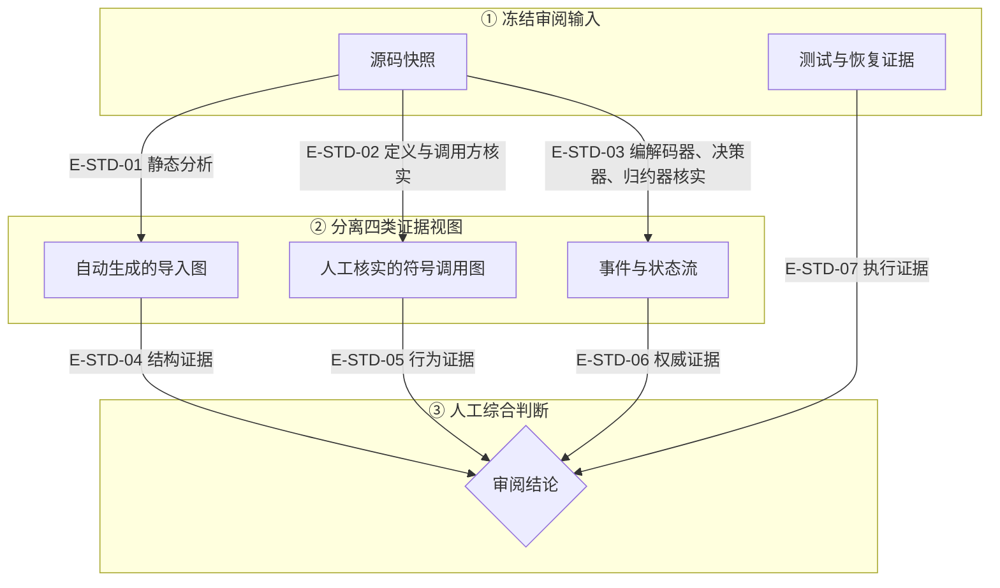

# Wakeflow 架构与代码图谱标准

> 适用范围：`wakeflow-architecture-atlas/maps/` 下对当前 TypeScript 源码的总体架构、文件依赖、
> 符号调用、状态恢复和业务纵切文档。

**任何流程图都不得把缺少真实生产者、消费者和验证证据的能力画成当前已实现。**

**所有面向读者的图内文案必须使用中文，并在每张图后紧邻解释本图术语。**

违反这条规则的字面要求，就是违反它的本意。图比文字更容易制造“已经存在”的错觉，因此缺口必须
标成缺口，不能用虚构节点补齐视觉闭环。

## 1. 核心模型

Wakeflow 图集采用两个正交维度：

| 维度 | 分类 | 含义 |
| --- | --- | --- |
| 控制平面 | 合同平面 | 代码、Schema、守卫、事件、权威、CAS、锁、恢复和投影 |
| 控制平面 | 执行平面 | Agent 选择、tool/handoff、宿主效果、人类暂停/恢复和运行观察 |
| 审阅深度 | L0–L2 | 总体架构、领域关系和业务纵切 |
| 审阅深度 | L3–L5 | 文件导入、符号调用、状态恢复和验证证据 |

合同平面回答“代码必须保证什么”；执行平面回答“Agent、宿主和人类实际做了什么或可以选择什么”。
两者可以在同一纵切交汇，但不得合并成一个状态机。

## 2. 中文与术语规则

| 规则 | 要求 |
| --- | --- |
| 中文优先 | 图标题、节点职责、连线动词、判断条件、状态说明和结论使用中文 |
| 原始标识 | 文件路径、导出符号、Schema字段、事件类型、工具名和协议名保持源码拼写 |
| 首次释义 | 固定技术词首次出现时写成“中文名称（英文或代码词）” |
| 图内术语表 | 每张图后立即列出本图使用的缩写、节点前缀、技术词和特殊连线；不能只引用全局表 |
| 无障碍说明 | Mermaid图使用中文`accTitle`与`accDescr`，准确概括图的范围和结论 |
| 不翻译代码 | 不把`TargetTaskPlanningService`等符号翻译后冒充源码名称；中文职责写在旁边 |
| 不展示隐藏推理 | 只展示Agent对外可观察的计划、工具调用、委派、结果和暂停，不展示隐藏思维链 |

### 2.1 全局基础术语

| 中文术语 | 原始词 | 在本图集中的含义 |
| --- | --- | --- |
| 生产者 | `producer` | 创建事件、权威记录、计划或投影的真实代码入口 |
| 消费者 | `consumer` | 实际读取并使用某个合同或记录的代码 |
| 权威 | `authority` | 拥有业务、身份或状态事实的唯一耐久来源 |
| 投影 | `projection` | 可从权威重新生成的读取视图，不反向拥有事实 |
| 计划 | `plan` | 写入或宿主效果前冻结的输入；计划本身不证明效果发生 |
| 意图 | `intent` | 描述将要执行什么及其精确来源的不可变合同 |
| 观察 | `observation` | Agent、宿主或环境回传的事实；不自动等于授权或验收 |
| 入口 | `entrypoint` | 公共工具、组合根或领域纵切的第一段生产代码 |
| 调用方/被调用方 | `caller` / `callee` | 运行时直接发起调用和接收调用的符号 |
| 守卫 | `guard` | 在状态转换或副作用前强制复验的条件 |
| 宿主接缝 | `host seam` | Wakeflow合同与Codex/Claude宿主能力的明确边界 |
| 运行轨迹 | `trace` | 某次运行中可观察的调用、事件和结果序列 |
| 环境结果 | `outcome` | 某次执行结束后环境中的真实状态，而非Agent自述 |
| 静态导入 | `import` | TypeScript文件间的源码依赖，不自动证明运行时调用 |
| 垂直切片 | `vertical slice` | 从入口到可观察结果的一条完整跨领域能力链 |

## 3. 审阅级视图集

**静态导入、运行时调用、耐久状态转换和运行观察必须分图表达。**

| 视图编号 | 视图 | 唯一问题 | 来源 | 推荐 Mermaid |
| --- | --- | --- | --- | --- |
| `A0` | 总体架构 | 技术层、领域所有者、入口与宿主接缝如何组织？ | 目录、组合根、架构规则 | `flowchart` / `block` |
| `A1` | 权威关系 | 谁拥有事实，谁只生成计划、投影或观察？ | Schema、所有者、存储、投影器 | `flowchart` |
| `D0` | 变更影响 | 本次Git差异影响哪些消费者、状态、公共合同和测试？ | Git差异、导入闭包、Schema与测试 | `flowchart` / 表格 |
| `V0` | 垂直切片 | 一个用户结果按什么顺序跨参与者完成？ | 入口、协调器、服务、宿主边界 | `sequenceDiagram` |
| `F0` | 文件依赖 | 一个切片的`.ts`文件直接导入哪些文件？ | dependency-cruiser / 静态解析 | `flowchart`，优先自动生成 |
| `F1` | 符号调用 | 运行时实际从哪个导出符号调用到哪个符号？ | 定义、直接调用方、构造/注入点 | `flowchart` / `sequenceDiagram` |
| `S0` | 状态机 | 哪些事件在什么守卫下改变耐久状态？ | 事件编解码器、决策器、聚合归约器 | `stateDiagram-v2` |
| `R0` | 恢复时序 | 预览/应用、CAS、锁、崩溃和幂等重试如何收敛？ | 服务、存储、恢复测试 | `sequenceDiagram` |
| `E0` | 需求与证据 | 需求、代码、测试、运行轨迹和环境结果如何互证？ | 权威引用、测试、审阅台账 | `requirementDiagram` / 表格 |

审阅结论至少需要`V0 + F0 + F1`。存在耐久状态或外部副作用时，还必须增加`S0/R0`；否则只能
称为结构说明，不能称为完整流程审阅。

## 4. 为什么导入图与调用图必须分开

| 图 | 可以证明 | 不能证明 |
| --- | --- | --- |
| 文件导入图 | 静态耦合、分层方向、循环、跨层/宿主违规 | 某个符号一定被调用、调用顺序、分支和副作用 |
| 符号调用图 | 真实入口、调用方/被调用方、参数/结果传递和效果边界 | 未显示文件不存在其他导入或隐藏调用方 |
| 状态图 | 允许的状态与事件转换、守卫和终态 | 进程间实际消息顺序或某次执行证据 |
| 运行轨迹 | 某次执行的工具、控制转移、外部效果和观察 | 所有合法路径或业务权威 |

不得因为`a.ts`导入`b.ts`就画成“运行时a调用了b”；必须读取导入符号及其真实使用点。

## 5. 文件级依赖图规则

### 5.1 范围

- 每张图从一个明确入口、公共协调器或领域所有者开始。
- 默认只展开完成当前结果所需的直接/传递闭包；公共 Foundation 依赖可折叠为具名能力组。
- 生产源码、生成合同、Schema、工具代码和测试使用不同子图。
- 宿主中立与Codex/Claude宿主专用文件不得混在一个无边界子图中。

### 5.2 节点

文件节点至少写明：

```text
[文件编号] path/to/file.ts
主要符号：ExportedSymbol
职责：一句话
```

图中使用稳定文件编号；完整路径、符号、输入输出和测试映射放在图下表格，避免节点膨胀。

### 5.3 边

每条边必须带关系动词：

| 关系 | 含义 |
| --- | --- |
| `导入` | 源文件静态导入目标文件 |
| `调用` | 一个已核验符号直接调用另一个符号 |
| `构造` | 组合根或协调器创建所有者/服务 |
| `解析` | 编解码器或解析器对输入执行准入 |
| `读取` / `复验` | 只读查询或复验，不写权威 |
| `写入` / `追加事件` | 写入或仅追加持久事实 |
| `生成投影` | 从权威派生可重建视图 |
| `取得声明` | 获取有界工作或效果权限 |
| `记录观察` | 记录外部事实，不自动授权业务结论 |
| `测试` | 测试文件直接覆盖目标符号或纵切 |
| `禁止依赖` | 架构规则明确禁止的方向；只出现在负例/规则图 |

线型只作辅助，关系含义以文字标签为准。

## 6. 智能体节点语义

| 前缀 | 节点类型 | 约束 |
| --- | --- | --- |
| `[代码]` | 确定性代码、编解码器、服务、守卫 | 使用“必须”描述强制行为 |
| `[智能体]` | 模型拥有选择权的步骤 | 使用“可选择”；不展示隐藏推理链 |
| `[人工]` | 用户或Controller的判断 | 显示批准、拒绝、澄清与恢复入口 |
| `[权威]` | 持久业务或身份权威 | 标明唯一写入者与变更边界 |
| `[计划]` | 冻结计划或意图 | 不是权威，也不证明效果发生 |
| `[视图]` | 投影或读取模型 | 必须可从来源重新生成 |
| `[外部效果]` | Wakeflow外部的宿主或环境副作用 | 与计划、声明、观察分离 |
| `[观察]` | 宿主或环境观察 | 观察不等于验收或授权 |
| `[运行轨迹]` | 某次运行证据 | 不反向定义合法状态机 |

### 6.1 文件来源前缀

| 前缀 | 文件来源 | 约束 |
| --- | --- | --- |
| `[源码]` | 手写生产TypeScript | 由对应领域或入口职责审阅 |
| `[Schema]` | JSON Schema合同来源 | 结构或wire词汇的可移植权威 |
| `[生成]` | 从Schema派生的TypeScript | 禁止手改；必须回指生成它的Schema |
| `[测试]` | 测试、fixture或测试运行器 | 证明声明路径，不拥有生产行为 |
| `[工具]` | codegen、dependency-cruiser或制品构建 | 生成/检查证据，不拥有业务状态 |

智能体控制转移（handoff）必须标为“转移控制权”；管理者调用有界专家标为“调用/返回”。两者不能都写成
“委派”。人类等待必须显示持久化暂停/恢复，不能只画一个没有恢复来源的菱形审批节点。

## 7. 状态与实现状态

| 标记 | 使用条件 |
| --- | --- |
| `[已实现]` | 当前代码存在真实生产者、消费者和验证证据 |
| `[进行中]` | 工作树正在实现；图必须写明未提交和未闭环边界 |
| `[未实现]` | 相邻能力缺失；只画停止节点，不画内部设计 |
| `[历史]` | 旧 JS 或历史文档；与 TS 当前图物理分离 |
| `[待复核]` | 来源路径在上次核验后变化；图不得继续作为当前事实 |

颜色不能作为唯一编码。黑白输出或不支持样式的 Markdown renderer 中，文本标记仍必须完整表达状态。

### 7.1 默认阅读与视觉分区

| 规则 | 要求 |
| --- | --- |
| 第一阅读路径 | 总体图必须有唯一的左到右或上到下主路径；入口节点是默认阅读锚点 |
| 阶段分区 | 架构或业务主图按 3–5 个编号阶段分区；同一区只表达一种关系语义 |
| 恢复旁路 | retry、rearm、resume、rollback等回边进入独立恢复区，不能遮挡成功主链 |
| 证据编号 | 边编号继续保留为审阅定位；本地阅读器默认收起编号，只显示关系动词，按需展开 |
| 密度边界 | 超过 15 个节点或 20 条关系时，必须提供分区、精选视图或交互下钻，不能只缩小整图 |
| 文件依赖 | 完整依赖优先使用ELK正交交互图；Mermaid仅保留可审阅精选范围 |
| 时序参与者 | 默认不超过 8 个；超过时按控制平面、领域平面、宿主效果平面拆分或分组 |
| 默认视口 | “阅读”模式锚定入口并保持文字可读；“全图”只用于定位，不作为正文阅读尺度 |

图的验收单位是单张图本身，不是图是否已出现在目录、台账或总览中。每张图都必须分别检查入口、
主路径、回边、状态编码、证据定位、默认缩放和术语说明。

## 8. 文档元数据

每份文档顶部使用以下 frontmatter；值必须来自当前核验，禁止 `TBD`：

```yaml
---
diagramId: ts-<domain>-<view>
viewType: architecture | authority | vertical-slice | file-dependency | call-flow | state | recovery | evidence
truthKind: current-code | in-progress-worktree | stale | historical
reviewDepth: L0 | L1 | L2 | L3 | L4 | L5
verifiedAt: YYYY-MM-DD
baselineCommit: <git-commit>
sourceFingerprint: sha256:<digest>
audience:
  - maintainer
documentationOwner: <domain-or-team>
generatedBy: manual-review | dependency-cruiser | mixed
refreshTriggers:
  - src/...
sourcePaths:
  - src/...
schemaPaths:
  - src/contracts/schemas/...
testPaths:
  - tests/...
---
```

若工作树包含未提交实现，`truthKind`必须为`in-progress-worktree`，并在正文列出范围；不能只写HEAD，
让读者误以为图完全来自已提交代码。

来源触发路径在`verifiedAt`之后发生变化时，文档必须标为`[待复核]`或重新生成/核验。`sourceFingerprint`
覆盖排序后的相对路径与文件内容；它用于发现陈旧，不替代源码本身。

## 9. 审阅文档包

一个可交付的 review 级文档包至少包含：

1. 当前结论与明确非目标；
2. 一张总体/纵切主图；
3. 一张文件导入图；
4. 一张真实符号调用图；
5. 紧邻每张图的“本图术语说明”；
6. 文件—符号—职责—输入—输出—副作用映射表；
7. 权威、投影、计划、观察分责表；
8. 守卫、错误分类、幂等/CAS/锁和恢复说明；
9. 测试正例、负例、并发/恢复证据；
10. 未实现边界和未运行验证；
11. 下一层或上一层文档链接。

### 9.1 边级证据表

每条非装饰连线都必须有稳定边编号，并在图后映射真实证据：

| 边编号 | 起点文件/符号 | 终点文件/符号 | 关系 | 代码证据 | 测试证据 |
| --- | --- | --- | --- | --- | --- |
| `E-01` | `path/a.ts#symbolA` | `path/b.ts#symbolB` | 调用 | 直接调用点 | 测试文件与测试名称 |

图中省略实现细节时，证据表仍必须保留精确关系。没有证据行的箭头不能进入审阅结论。

### 9.2 稳定定位

- 主定位使用“仓库相对路径 + 导出符号 + 核验提交”。
- 行号只作核验快照的辅助信息，不能成为唯一定位依据。
- 内部未导出符号使用“相对路径 + 最近导出owner + 内部符号名”。
- 文件移动或符号重命名触发重新核验，不能只修正文档链接。

### 9.3 原始图与审阅精选图

| 产物 | 用途 | 维护方式 |
| --- | --- | --- |
| 原始依赖数据 | 完整模块、直接导入、违规和统计 | dependency-cruiser确定性生成 |
| 审阅精选图 | 围绕一个入口/结果裁剪并解释关键关系 | 从原始数据选择，人工核实语义 |
| 折叠清单 | 记录被折叠的公共Foundation或generated闭包 | 图下表格明确列出 |

审阅精选图不得声称是完整依赖图；原始依赖数据也不能直接替代可读的审阅结论。

## 10. 生成与人工审阅边界



### 本图术语说明

| 图中术语 | 解释 |
| --- | --- |
| 源码快照 | 本次审阅冻结的Git提交与明确未提交工作树范围 |
| 自动生成的导入图 | 由静态解析得到的文件直接导入关系，只证明结构依赖 |
| 人工核实的符号调用图 | 阅读导入符号和真实使用点后确认的调用方/被调用方关系 |
| 事件与状态流 | 由Schema、编解码器、决策器和聚合归约器共同定义的合法转换 |
| 测试与恢复证据 | 正例、负例、并发、崩溃恢复和幂等测试结果 |
| 审阅结论 | 综合结构、行为、权威与执行证据形成的判断，不由单一脚本自动给出 |

### 本图边级证据

| 边编号 | 起点 | 终点 | 关系依据 |
| --- | --- | --- | --- |
| `E-STD-01` | 源码快照 | 自动生成的导入图 | §4–§5规定静态导入必须来自dependency-cruiser或等价解析 |
| `E-STD-02` | 源码快照 | 人工核实的符号调用图 | §4规定导入不能替代真实使用点核实 |
| `E-STD-03` | 源码快照 | 事件与状态流 | §3的`S0`视图要求共同核对Schema、codec、decider与reducer |
| `E-STD-04` | 导入图 | 审阅结论 | §9要求提供结构和禁止依赖证据 |
| `E-STD-05` | 调用图 | 审阅结论 | §9要求提供真实调用、输入输出和副作用证据 |
| `E-STD-06` | 状态流 | 审阅结论 | §9要求提供权威、守卫与恢复证据 |
| `E-STD-07` | 测试与恢复证据 | 审阅结论 | §9要求正例、负例、并发和恢复证据 |

- dependency-cruiser生成`F0`候选和架构违规事实；人工不得手抄全量import图。
- Agent或人工审阅真实符号用法，生成`F1`；静态图不能代替这一判断。
- 事件/状态图从Schema、编解码器、决策器、归约器和测试共同核对。
- 运行轨迹只作为某次路径证据；最终结论还要复核环境结果和代码合同。

## 11. 常见错误

| 借口 | 事实 |
| --- | --- |
| “一张大图更完整” | 多种关系混在一图会让箭头失去明确语义；应通过稳定ID和下钻链接连接视图。 |
| “import到了，所以一定调用了” | import只证明静态依赖；调用必须核对导入符号和使用点。 |
| “测试通过，所以整条链已实现” | 测试只覆盖它声明的路径；还要核对真实生产者、消费者、未运行面和公共接线。 |
| “Agent完成了，所以结果被接受” | Agent结果是审阅输入；Controller acceptance和独立验证仍是另一责任。 |
| “projection里有字段，所以它是权威” | projection只能从authority重建，不能反向拥有状态。 |
| “把未来节点画成灰色就不算误报” | 未实现只允许一个明确停止节点，不能展开虚构的内部流程。 |
| “行号能精确定位，所以足够稳定” | 行号会随编辑漂移；必须同时记录文件、符号和核验提交。 |
| “全量依赖图已经自动生成，不需要人工审阅” | 自动图证明结构；调用语义、权威和副作用仍需核实。 |

## 12. 文档自动检查目标

独立子项目的`npm run check:structure`至少验证：

1. 所有Mermaid块可由仓库锁定版本渲染；
2. 每张图包含中文`accTitle`、`accDescr`和紧邻的“本图术语说明”；
3. 相对路径存在，映射的导出符号能由TypeScript/SWC解析；
4. 每条边编号在边级证据表中恰好出现一次；
5. `sourceFingerprint`与触发路径状态一致，陈旧文档不能标为当前；
6. 文档不含本机绝对路径、raw handle、线程/会话ID或secret；
7. 自动生成的导入关系与dependency-cruiser当前结果一致；
8. 文档只引用存在的上钻/下钻目标。

## 13. 创建步骤

1. 冻结核验范围与Git/工作树基线。
2. 读取定义、直接imports/callers、Schema、writer、consumer和tests。
3. 先生成/检查`F0`导入候选，再人工建立`F1`符号调用链。
4. 为每条非装饰边建立边级证据行，缺证据则删除箭头或停止结论。
5. 根据真实状态owner补`S0/R0`，根据测试与审阅记录补`E0`。
6. 审阅未提交实现时补`D0`变更影响图，并记录来源指纹和触发路径。
7. 建立L0–L5双向下钻链接，检查每张图只回答一个问题。
8. 为每张图添加中文`accTitle`、`accDescr`和紧邻的“本图术语说明”。
9. 渲染所有Mermaid块，检查路径、符号和测试链接存在。
10. 运行`git diff --check`，记录未执行的代码或发布验证。
