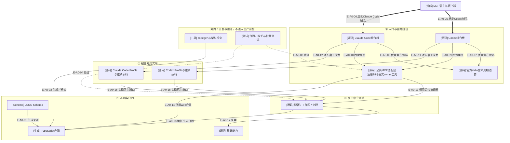

# Wakeflow TypeScript 总体架构

> 本文绑定Demand Publication实现提交`f7c005d`。该能力已经完成聚焦验证，但尚未通过当前完整
> TypeScript发布门；双宿主候选仍明确`releaseEligible=false`。

## 当前结论

当前TypeScript候选运行时由一套共享源码组成：基础能力、配置、工作区和治理领域保持宿主中立；
Codex与Claude Code只在宿主实现和固定组合根分开。官方MCP SDK拥有协议、stdio和工具路由；
Wakeflow公共适配层当前注册18个已有真实领域owner的工具，其中`wakeflow_create_demand`以
`preview → exact apply / explicit recover`公开TODO-backed Demand Publication。

治理源码已经闭合Demand Publication、Controller Route、implementation/test Tasking、Delivery、Host Effect事实记录、Result、
Implementation/Test Review、blocked Resume、Product Defect Remediation/retest与Completion。Agent仍独占真实
宿主效果执行；Research Completion、Implementation Redesign及Evidence/Archive仍是明确缺口。`core/`、
`plugins/`和安装缓存仍是旧JS对照/发布面，不属于本图描述的TS候选闭包。

## 核验快照

| 项目 | 读取值 |
| --- | --- |
| 分支 | `main`，与本地`origin/main`一致 |
| `HEAD` | `f7c005d73c11e29f284dbde1d7117193376c0ef6` |
| 工作树 | 仅Atlas同步待提交；另有一份排除的异常历史文档diff |
| dependency-cruiser | 723个模块、5059条依赖、0条违规 |
| 生产TS模块 | 368个手写模块 + 101个生成合同 |
| 当前公共MCP工具 | 18个，双宿主名称与Schema集合一致 |
| 当前验证 | Publication聚焦25项与MCP注册/双宿主3项通过；101 Schema、207 external refs |
| 最近完整TypeScript门 | 902 pass、0 fail、0 skip；属于Publication Public之前的提交基线 |

### 生产模块分布

| 技术层 | 模块数 | 核心职责 |
| --- | ---: | --- |
| 基础能力 | 62 | 数据、加密、身份、时间、根目录文件系统、原子性、锁、树与Git观察 |
| 配置 | 10 | v3配置、选择、放置与配置权威 |
| 工作区 | 81 | 维护事务、资源矩阵、活动面、静态物化、宿主本地布局和窗口身份 |
| 治理 | 175 | TODO、台账、Demand Publication、Controller Route、Tasking、Delivery、Result、Review、Lifecycle与Testing |
| 宿主 | 11 | Codex/Claude Code资源Profile、身份Profile与宿主专用维护执行 |
| 入口 | 28 | 两宿主固定组合、公共MCP适配、固定host facade和stdio生命周期 |
| 手写合同 | 1 | 应用级类型化身份解析边界 |
| 生成合同 | 101 | 由JSON Schema派生的类型和运行时Schema常量 |

## A0：总体架构与边界

### 本图术语说明

| 图中术语 | 解释 |
| --- | --- |
| 固定组合根 | 在模块装载时绑定宿主Profile与执行端口的入口，不接受运行时宿主选择器 |
| 公共MCP适配层 | 将官方MCP SDK调用转换为当前18个公共领域执行函数的薄层 |
| 宿主中立领域 | 不直接导入Codex或Claude Code具体实现的配置、工作区和治理代码 |
| 宿主专用实现 | 只在对应组合根注入的资源Profile、身份Profile或宿主维护执行 |
| wire合同 | MCP输入/输出使用的自包含JSON Schema和生成TypeScript合同 |
| 资源目录 | 由配置、工作区与治理能力共同声明的受管资源清单 |
| 运行权威 | 业务或身份事实的耐久来源，不是Markdown或投影 |
| 宿主端口 | 由宿主专用入口实现、供共享领域调用的有界Profile或执行能力 |

## 节点映射

| 节点 | 主要路径 | 代表符号/职责 |
| --- | --- | --- |
| Codex组合根 | `src/entrypoints/codex-wakeflow-mcp.ts` | `createCodexWakeflowMcpServer`、`runCodexWakeflowMcpStdio` |
| Claude Code组合根 | `src/entrypoints/claude-code-wakeflow-mcp.ts` | `createClaudeCodeWakeflowMcpServer`、`runClaudeCodeWakeflowMcpStdio` |
| 公共MCP适配层 | `src/entrypoints/wakeflow-public-mcp-server.ts` | `createWakeflowPublicMcpServer` |
| stdio边界 | `src/entrypoints/wakeflow-mcp-stdio.ts` | `runWakeflowMcpStdio` |
| 配置 | `src/configuration/` | Config v3、authority snapshot、selection、placement |
| 工作区 | `src/workspace/` | Maintenance、Active、Managed Integration、Window Runtime |
| 治理 | `src/governance/` | TODO、Ledger、Demand、Tasking、Delivery、Result、Review、Testing |
| 基础能力 | `src/foundation/` | 无产品语义的共享确定性能力 |
| 生成合同 | `src/contracts/generated/` | Schema派生类型和冻结运行时Schema |
| 宿主实现 | `src/hosts/codex/`、`src/hosts/claude-code/` | Profile与宿主专用执行 |

## 边级证据

| 边编号 | 起点 | 终点 | 关系 | 代码证据 | 测试证据 |
| --- | --- | --- | --- | --- | --- |
| `E-A0-01` | JSON Schema | 生成合同 | 生成来源 | `tooling/codegen/schema-types.ts` | `tests/codegen/schema-types.test.ts` |
| `E-A0-02` | 工具 | 生成合同 | 生成并检查 | `schema:build`、`schema:check`脚本 | codegen测试 |
| `E-A0-03`、`E-A0-04` | 测试 | 公共MCP/领域 | 验证 | `tests/`直接导入`src/` | TypeScript source-manifest runner |
| `E-A0-05`、`E-A0-06`、`E-A0-07`、`E-A0-08` | MCP宿主/组合根 | 固定制品/stdio | 启动与调用 | 两宿主`run*WakeflowMcpStdio` | 公共MCP官方Client测试 |
| `E-A0-09`、`E-A0-10` | 组合根 | 公共Server | 固定组合 | 两宿主`create*WakeflowMcpServer` | 公共MCP与Window Binding入口测试 |
| `E-A0-11`、`E-A0-12` | 组合根 | 宿主实现 | 固定注入 | 两宿主Maintenance/Binding入口 | 两宿主Maintenance入口测试 |
| `E-A0-13`、`E-A0-14` | 公共MCP层 | 领域/合同 | 调用与Schema准入 | `createWakeflowPublicMcpServer` | 18工具list/call、双宿主一致性、自包含Schema与Demand Publication真实MCP测试 |
| `E-A0-15`、`E-A0-16` | 宿主实现 | 宿主中立领域 | 实现宿主端口 | `src/hosts/*`和宿主entrypoint facade | Maintenance与Binding纵切测试 |
| `E-A0-17`、`E-A0-18` | 宿主中立领域 | 基础/生成合同 | 静态依赖 | dependency-cruiser快照 | 架构规则与0违规结果 |

## 架构硬边界

- Foundation不得依赖配置、工作区、治理、宿主或入口。
- 宿主中立运行时不得导入`src/hosts/`。
- 普通运行时不得反向依赖`src/entrypoints/`。
- Codex与Claude Code宿主实现不得互相导入。
- 生产源码不得依赖测试、tooling、旧`core/`或`plugins/`实现。
- 领域文件系统和进程效果必须经过Foundation封闭能力。
- 生成合同由Schema/codegen拥有，不能手工维护。

## 当前停止边界

- 当前公共MCP发布18个工具；`wakeflow_create_demand`可从pending TODO生成完整计划、精确应用或显式恢复，并在成功后进入Route检查。
- 公共Target Task Planning支持完整implementation输入和最小`{workType:"test"}`派生请求。
- Agent执行宿主效果，MCP只规划、验证并记录Wakeflow自己的权威。
- 当前Publication切片已通过聚焦门，但尚未重跑完整TypeScript门；旧JS对照、双宿主插件smoke与release gate不属于本次证据。
- 本文必须在`src/**`或架构规则变化后重新核验。

## 下钻入口

- [关键文件依赖](./file-dependencies.md)
- [公共MCP符号调用流](./runtime-call-flow.md)
- [总体架构审阅证据与变更影响](./review-evidence.md)
