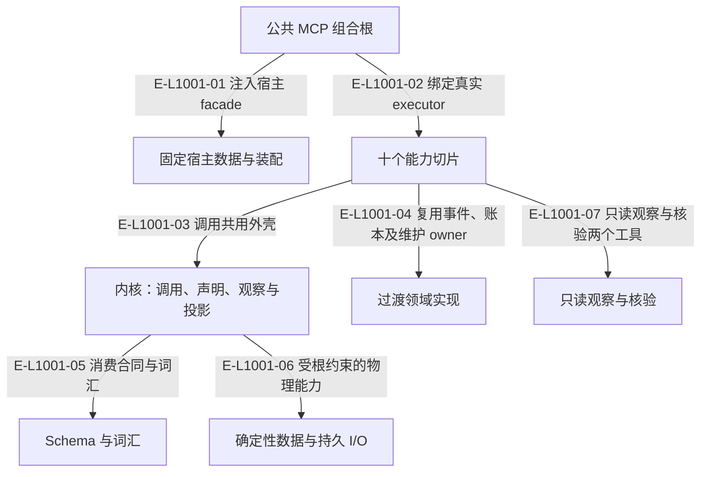

# Wakeflow：十个切片的当前架构

Wakeflow 提供权威账本、精确内容和证据准入。observation 是第十片，只读派生视图。用户与 Agent 拥有需求与执行判断，宿主拥有会话动作。六层依赖约束已经生效；configuration、workspace、governance 中仍存在被新切片消费的实现，不能把目录尚未收敛解释为另一个控制器。

> 核验基线：`1480271`（L1 observation 第十片已落地，20 个公共工具、18 个一次性场景）。工作树另有并行未提交改动（宿主 hook 通道等），本图不描绘；来源指纹按当前工作树计算。本文说明实现事实，未宣称双宿主真实会话已经验证。

## 六层职责与当前过渡实现

### 本图术语说明

| 术语 | 本图含义 |
| --- | --- |
| host | Codex 或 Claude Code；真实会话动作由 Agent 调用宿主完成。 |
| Demand | 一个需求的不可变身份和事件流；当前执行环境由 podId 指定。 |
| projection | 根据权威重建的视图，不反向决定事实。 |

### 节点与实现定位

| 节点 | 文件 / 符号 | 责任 |
| --- | --- | --- |
| entry | `src/entrypoints/wakeflow-public-mcp-server.ts#createWakeflowPublicMcpServer` | 公共 MCP 组合根 |
| hosts | `src/entrypoints/codex-wakeflow-mcp.ts#createCodexWakeflowMcpServer` | 固定宿主数据与装配 |
| caps | `src/entrypoints/wakeflow-public-mcp-catalog.ts#WAKEFLOW_PUBLIC_TOOL_CATALOG` | 十个能力切片 |
| kernel | `src/kernel/command-shell.ts#runCommandShell` | 内核：调用、声明、观察与投影 |
| contracts | `src/governance/tasking/task-package.ts#TaskPackage` | Schema 与词汇 |
| foundation | `src/foundation/filesystem/rooted-directory.ts#RootedDirectory` | 确定性数据与持久 I/O |
| legacy | `src/governance/demand/event-sourcing/demand-event-sourcing-repository.ts#DemandEventSourcingRepository` | 过渡领域实现 |
| observation | `src/capabilities/observation/service.ts#executeStatusRequest` | 只读观察与核验 |

### 本图边级证据

| 编号 | 代码定位 | 测试 / 核验 | 关系依据 |
| --- | --- | --- | --- |
| E-L1001-01 | `src/entrypoints/codex-wakeflow-mcp.ts#createCodexWakeflowMcpServer` | `tests/entrypoints/wakeflow-public-mcp-catalog.test.ts` | 注入宿主 facade |
| E-L1001-02 | `src/entrypoints/wakeflow-public-mcp-server.ts#createWakeflowPublicMcpServer` | `tests/entrypoints/wakeflow-public-mcp-catalog.test.ts` | 绑定真实 executor |
| E-L1001-03 | `src/capabilities/tasking/service.ts#executeTargetTaskPlanningPublicRequest` | `tests/capabilities/tasking/service.test.ts` | 调用共用外壳 |
| E-L1001-04 | `src/capabilities/demand/service.ts#executeDemandCreationRequest` | `tests/capabilities/demand/service.test.ts` | 复用事件、账本及维护 owner |
| E-L1001-05 | `src/kernel/requirement-board.ts` | `tests/kernel/command-shell.test.ts` | 消费合同与词汇 |
| E-L1001-06 | `src/kernel/work-claims.ts` | `tests/kernel/command-shell.test.ts` | 受根约束的物理能力 |
| E-L1001-07 | `src/capabilities/observation/service.ts#executeStatusRequest` | `tests/capabilities/observation/service.test.ts` | 只读观察与核验两个工具 |

## 守卫、恢复与验证范围

当前公共目录为 20 项，配置仍为 v3 且已包含 pods[]。observation 只读，不新增业务权威；十片场景验证不等于 L2 的两宿主真实投递，也不等于 L3 可安装新制品。Foundation 物理收敛与目录体积仍按现行计划继续。

涉及的测试与核验入口：

- `tests/capabilities/demand/service.test.ts`。
- `tests/capabilities/observation/service.test.ts`。
- `tests/capabilities/tasking/service.test.ts`。
- `tests/entrypoints/wakeflow-public-mcp-catalog.test.ts`。
- `tests/kernel/command-shell.test.ts`。
- `tooling/architecture/check-dependencies.ts`。

## 下钻与相关视图

- [文件直接导入](./file-dependencies.md)
- [运行调用与恢复](./runtime-call-flow.md)
- [业务主线](../10-end-to-end-business-flow/README.md)
- [内核](../11-kernel/README.md)
- [只读观察与核验](../16-observation/README.md)
- [图谱总索引](../README.md)
- [核验与剩余范围](../01-diagram-review-ledger.md)
