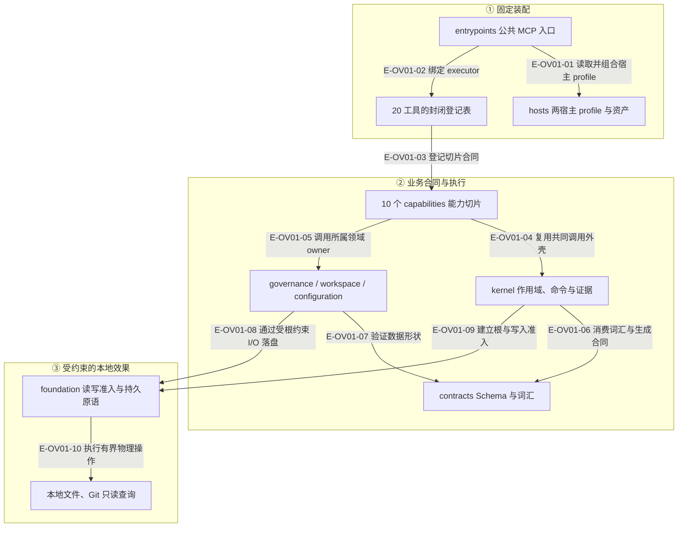

# 总体架构：合同、业务权威与宿主执行

本图解释当前代码的职责和依赖，不把技术层次画成业务步骤。当前版本输入为 **1.1.0-rc.5 源码候选**，配置合同为 schemaVersion 2；公共工具目录为 20 项，分属 10 个能力切片。当前工作树已包含租约交接清理、隐私披露判定和回调数据引用的本轮修订，详见[逐文件台账](../02-file-review-index.md)。这是一份工作树审阅快照，不证明候选已发布、已安装或宿主已加载。

```mermaid
flowchart TB
  accTitle: 当前六层架构与职责边界
  accDescr: 入口组合宿主数据和能力切片，内核提供共同协议，治理所有者维护事实，基础层提供受根约束的物理原语。
  subgraph composition["① 固定装配"]
    entry["entrypoints 公共 MCP 入口"]
    host["hosts 两宿主 profile 与资产"]
    catalog["20 工具的封闭登记表"]
  end
  subgraph behavior["② 业务合同与执行"]
    slices["10 个 capabilities 能力切片"]
    owners["governance / workspace / configuration"]
    kernel["kernel 作用域、命令与证据"]
    contracts["contracts Schema 与词汇"]
  end
  subgraph physical["③ 受约束的本地效果"]
    foundation["foundation 读写准入与持久原语"]
    disk["本地文件、Git 只读查询"]
  end
  entry -->|"E-OV01-01 读取并组合宿主 profile"| host
  entry -->|"E-OV01-02 绑定 executor"| catalog
  catalog -->|"E-OV01-03 登记切片合同"| slices
  slices -->|"E-OV01-04 复用共同调用外壳"| kernel
  slices -->|"E-OV01-05 调用所属领域 owner"| owners
  kernel -->|"E-OV01-06 消费词汇与生成合同"| contracts
  owners -->|"E-OV01-07 验证数据形状"| contracts
  owners -->|"E-OV01-08 通过受根约束 I/O 落盘"| foundation
  kernel -->|"E-OV01-09 建立根与写入准入"| foundation
  foundation -->|"E-OV01-10 执行有界物理操作"| disk
```

### 本图术语说明

| 术语 | 含义 |
| --- | --- |
| facade / profile | 入口注入的宿主事实；共享切片据此工作，真实发送由 Agent 调宿主完成。 |
| owner | 拥有某类业务事实及恢复规则的模块；不等于第二个 Controller。 |
| kernel | 跨切片共同机制；不直接导入任何能力切片。 |
| Schema | 可移植数据合同；基础层只允许引用自己的基础生成合同，不能借此反向取得业务能力。 |

### 本图边级证据

| 编号 | 代码定位 | 测试 / 核验 | 关系依据 |
| --- | --- | --- | --- |
| E-OV01-01 | `src/entrypoints/codex-wakeflow-mcp.ts#createCodexWakeflowMcpServer` | 间接覆盖：`tests/entrypoints/wakeflow-public-mcp-catalog.test.ts#createCodexWakeflowMcpServer`（构造真实组合根） | 宿主能力在组合处固定。 |
| E-OV01-02 | `src/entrypoints/wakeflow-public-mcp-catalog.ts#WAKEFLOW_PUBLIC_TOOL_CATALOG` | `tests/entrypoints/wakeflow-public-mcp-catalog.test.ts#WAKEFLOW_PUBLIC_TOOL_CATALOG` | 封闭登记与绑定。 |
| E-OV01-03 | `src/entrypoints/wakeflow-public-mcp-catalog.ts#WAKEFLOW_PUBLIC_TOOL_CATALOG` | `tests/entrypoints/wakeflow-public-mcp-catalog.test.ts#WAKEFLOW_PUBLIC_TOOL_CATALOG` | 数据表汇总各切片 contract。 |
| E-OV01-04 | `src/kernel/append-command.ts#runAppendCommand` | `tests/kernel/append-command.test.ts#runAppendCommand` | append 与 effect 使用共同 shell；endpoint 的 append 登记形状有自己的局部 owner。 |
| E-OV01-05 | `src/capabilities/tasking/service.ts#execute` → `src/governance/demand/event-sourcing/demand-event-sourcing-command-handler.ts#executeDemandEventSourcingCommand` | 间接覆盖：`tests/capabilities/tasking/service.test.ts#planFixtureTargetTask`（真实调用标准事件管线） | Demand 切片调用标准命令管线；其他 owner 不因图中聚合而合并。 |
| E-OV01-06 | `src/kernel/command-shell.ts#runCommandShell` | `tests/kernel/command-shell.test.ts#runCommandShell` | 读取基础合同、错误词汇与隐私边界。 |
| E-OV01-07 | `src/configuration/wakeflow-config.ts#parseWakeflowConfig` | `tests/configuration/wakeflow-config.test.ts#parseWakeflowConfig` | 配置严格身份为 v2；当前基线不支持旧格式迁移。 |
| E-OV01-08 | `src/foundation/filesystem/rooted-directory.ts#RootedDirectory` | 未覆盖：聚合 I/O 边不代表每个 owner 的覆盖，基础原语的正负例见 Foundation 页。 | 多数持久操作经 Foundation；现有 archive.ts 的 retireDemandRoot 仍在核验后直接 rm，不能宣称已消除所有直接物理操作。 |
| E-OV01-09 | `src/kernel/command-shell.ts#runCommandShell` | 间接覆盖：`tests/kernel/command-shell.test.ts#runCommandShell`（仅read型外壳；写作用域包围次序由源码核验） | 请求与结果边界保持；共享/独占scope包住领域上下文加载、业务执行与结算，maintenance由维护owner接管。 |
| E-OV01-10 | `src/foundation/filesystem/rooted-directory.ts#RootedDirectory` | 未覆盖：此处描述物理能力集合；不能把一条聚合边视为完整系统验证。 | 稳定读取、精确变更与明确错误分类。 |

## 能力与实际职责

| 切片 | 公共工具 | 持久事实 / 对外结果 |
| --- | --- | --- |
| workspace | maintain_workspace | 配置、维护 intent/journal、资源物化与显式恢复 |
| endpoint | register_window_binding | 私有宿主绑定、工作位置与登记回执 |
| requirement | publish_requirement、inspect_board | 不可变需求记录与独立可变认领板 |
| demand | create / complete / cancel / continue | 身份、authority、事件、生命周期日志与归档 |
| tasking | plan_target_task | 任务包、验收锚点、谱系与冻结测试合同 |
| delivery | prepare / record_outcome / rearm | 信封、工作声明、一次发送许可及观察结局 |
| result-review | import / inspect_review / implementation_decision / test_decision | 结果、回调、评审单元及 Controller 决定 |
| evidence | record_evidence | 证据来源选择、捕获计划、manifest 与受管字节 |
| pod | pod | 配置内完整窗口组、检出回执和两段关闭 |
| observation | status、verify | 单次只读观察、检查门和建议动作 |

表内工具名按职责缩写，精确工具名以`src/entrypoints/wakeflow-public-mcp-catalog.ts`为准。登记表有 8 个 effect、8 个 append、4 个 read；形状不是权限证明，混合动作还要看各工具自身准入。

## 必须保持的分责

- 需求内容、看板认领、Demand 事件、窗口绑定、宿主观察各有 owner；不能用一份状态页覆盖全部权威。
- 事件提交先于可重建快照/活动投影。投影失败可以陈旧，不能撤销已经提交的事实。
- 发送许可不是落地事实，落地事实不是结果验收；Controller 的业务判断仍需独立记录。
- 当前 configuration/workspace/governance 是切片真实消费的实现。目录尚未完全收敛，不等于能力未实现。
- 不同宿主具有不同落地证据；Codex 成功发送返回可成为证据，Claude 粘贴和屏幕文本不能单独证明落地。

继续阅读：[实际导入](./file-dependencies.md) · [调用外壳与分支](./runtime-call-flow.md) · [业务接力](../10-end-to-end-business-flow/README.md) · [验证与限制](./review-evidence.md)。

## 最新实现的三个分责

- **写入与配置**：普通变更持共享许可，Pod结构变更持独占许可；维护owner在自己的gate内取得所需许可，权限收窄仍是逐节点CAS。读/preview不借写许可。详见[作用域](../11-kernel/workspace-operation-scope.md)与[物理准入](../02-foundation/read-write-admission.md)。
- **项目与目录**：Codex角色聊天属于外层Workspace项目，SessionStart根也在Workspace；角色执行目录/产品检出单独准入。Claude保持会话根规则。详见[宿主边界](../09-public-mcp-host-seams/README.md)。
- **三类运行身份**：本服务启动manifest、当前磁盘manifest与hook生产者摘要分别说明不同主体；缺少可信宿主关联时，目标runtime仍为unverified。详见[观察](../16-observation/README.md)与[安装/分派门](../17-artifacts-and-contracts/installation-and-runtime-identity.md)。

本轮更细的失败边界：[取得许可后的结算失败](../02-foundation/admission-races-and-recovery.md)、[公开私有值检查与内容扫描](../11-kernel/privacy-boundary.md)、[回调信任与只读评审](../07-review-rework-completion/callback-trust-and-review.md)。这些边界分别约束物理占用、内容披露与评审输入，不合并成新的业务状态机。
