# 总体架构：关键文件导入依赖

> 本图是全量架构检查结果的审阅精选视图，只展开当前两个MCP组合根及18个公共工具的
> 关键直接依赖。当前完整原始快照包含740个模块和5182条依赖，未全部塞入图中；本图的
> 具体文件级直接import声明由图谱检查器逐边复验。

## F0：MCP组合根关键文件导入图

```mermaid
flowchart TB
  accTitle: Wakeflow TypeScript MCP组合根关键文件导入关系
  accDescr: Codex和Claude Code组合根分别导入宿主专用facade，同时共享公共MCP适配、stdio边界和宿主中立协调器；公共适配导入十八组wire合同与领域错误类型，两个组合根都直接固定Demand Publication公共协调器。

  subgraph ROOTS["MCP固定组合根"]
    C_MCP["[源码][F-ENTRY-01]\nsrc/entrypoints/codex-wakeflow-mcp.ts"]
    CL_MCP["[源码][F-ENTRY-02]\nsrc/entrypoints/claude-code-wakeflow-mcp.ts"]
  end

  subgraph SHARED_ENTRY["共享入口"]
    PUBLIC["[源码][F-ENTRY-03]\nwakeflow-public-mcp-server.ts"]
    STDIO["[源码][F-ENTRY-04]\nwakeflow-mcp-stdio.ts"]
    TASKING["[源码][F-GOV-01]\ntarget-task-planning-public-coordinator.ts"]
    GOV_PUBLIC["[折叠][F-GOV-02]\nRoute / Delivery / Result / Review\nTesting / Lifecycle公共owner"]
  end

  subgraph HOST_ENTRY["宿主专用入口"]
    C_MAINT["[源码][F-ENTRY-05]\ncodex-wakeflow-maintenance.ts"]
    C_BIND["[源码][F-ENTRY-06]\ncodex-wakeflow-window-host-binding.ts"]
    CL_MAINT["[源码][F-ENTRY-07]\nclaude-code-wakeflow-maintenance.ts"]
    CL_BIND["[源码][F-ENTRY-08]\nclaude-code-wakeflow-window-host-binding.ts"]
  end

  subgraph DOMAIN["共享领域公共所有者"]
    MAINT_COORD["[源码][F-WS-01]\nwakeflow-maintenance-public-coordinator.ts"]
    BIND_COORD["[源码][F-WS-02]\nwakeflow-window-host-binding-public-coordinator.ts"]
    PUB_COORD["[源码][F-GOV-03]\ndemand-publication-public-coordinator.ts"]
  end

  subgraph HOST_IMPL["宿主Profile与执行"]
    C_HOST["[源码][F-HOST-01]\nsrc/hosts/codex/*"]
    CL_HOST["[源码][F-HOST-02]\nsrc/hosts/claude-code/*"]
  end

  WIRE["[生成][F-GEN-01]\nsrc/contracts/generated/entrypoints/*"]

  C_MCP -->|"E-F0-01 导入"| C_MAINT
  C_MCP -->|"E-F0-02 导入"| C_BIND
  C_MCP -->|"E-F0-03 导入"| PUBLIC
  C_MCP -->|"E-F0-04 导入"| TASKING
  C_MCP -->|"E-F0-05 导入"| STDIO

  CL_MCP -->|"E-F0-06 导入"| CL_MAINT
  CL_MCP -->|"E-F0-07 导入"| CL_BIND
  CL_MCP -->|"E-F0-08 导入"| PUBLIC
  CL_MCP -->|"E-F0-09 导入"| TASKING
  CL_MCP -->|"E-F0-10 导入"| STDIO

  PUBLIC -->|"E-F0-11 wire合同"| WIRE
  PUBLIC -->|"E-F0-12 导入合同/错误类型"| MAINT_COORD
  PUBLIC -->|"E-F0-13 导入合同/错误类型"| BIND_COORD
  PUBLIC -->|"E-F0-14 导入合同/错误类型"| TASKING
  PUBLIC -->|"E-F0-23 导入合同/错误类型"| GOV_PUBLIC
  C_MCP -->|"E-F0-24 固定组合"| GOV_PUBLIC
  CL_MCP -->|"E-F0-25 固定组合"| GOV_PUBLIC
  C_MCP -->|"E-F0-26 固定组合"| PUB_COORD
  CL_MCP -->|"E-F0-27 固定组合"| PUB_COORD
  PUBLIC -->|"E-F0-28 导入合同/错误类型"| PUB_COORD

  C_MAINT -->|"E-F0-15 导入"| C_HOST
  C_MAINT -->|"E-F0-16 导入"| MAINT_COORD
  CL_MAINT -->|"E-F0-17 导入"| CL_HOST
  CL_MAINT -->|"E-F0-18 导入"| MAINT_COORD
  C_BIND -->|"E-F0-19 导入"| C_HOST
  C_BIND -->|"E-F0-20 导入"| BIND_COORD
  CL_BIND -->|"E-F0-21 导入"| CL_HOST
  CL_BIND -->|"E-F0-22 导入"| BIND_COORD
```

### 本图术语说明

| 图中术语 | 解释 |
| --- | --- |
| 固定组合根 | 为一个宿主固定注入执行函数和Profile的MCP入口 |
| 共享入口 | 两个宿主复用且不拥有具体宿主语义的公共Server与stdio代码 |
| 宿主专用入口 | 把Codex或Claude Code的资源/身份Profile注入共享协调器的文件 |
| 共享领域公共所有者 | 对公共请求再次解析、打开根目录、调用真实领域服务并脱敏输出的协调器 |
| wire合同 | 从entrypoint JSON Schema生成并直接交给MCP SDK的输入/输出合同 |
| 导入合同/错误类型 | 该箭头只证明静态导入；公共Server运行时通过注入的executor调用领域协调器 |
| 宿主Profile | 描述资源能力或opaque handle准入规则的数据，不是运行时宿主选择器 |

## 文件与符号映射

| 文件编号 | 相对路径 | 主要符号 | 来源 | 职责 |
| --- | --- | --- | --- | --- |
| `F-ENTRY-01` | `src/entrypoints/codex-wakeflow-mcp.ts` | `createCodexWakeflowMcpServer` | 手写源码 | 固定组合Codex执行函数 |
| `F-ENTRY-02` | `src/entrypoints/claude-code-wakeflow-mcp.ts` | `createClaudeCodeWakeflowMcpServer` | 手写源码 | 固定组合Claude Code执行函数 |
| `F-ENTRY-03` | `src/entrypoints/wakeflow-public-mcp-server.ts` | `createWakeflowPublicMcpServer` | 手写源码 | 注册18个MCP工具并映射稳定错误 |
| `F-ENTRY-04` | `src/entrypoints/wakeflow-mcp-stdio.ts` | `runWakeflowMcpStdio` | 手写源码 | 官方`serveStdio`生命周期与稳定stderr边界 |
| `F-ENTRY-05`、`F-ENTRY-07` | 两宿主Maintenance入口 | `execute*WakeflowMaintenance` | 手写源码 | 固定宿主facade后调用共享维护协调器 |
| `F-ENTRY-06`、`F-ENTRY-08` | 两宿主Window Binding入口 | `execute*WakeflowWindowHostBindingRegistration` | 手写源码 | 固定资源/身份Profile后调用共享绑定协调器 |
| `F-GOV-01` | `src/governance/tasking/target-task-planning-public-coordinator.ts` | `executeTargetTaskPlanningPublicRequest` | 手写源码 | 规划implementation或owner派生test Target Task |
| `F-GOV-02` | `src/governance/{controller,delivery,result,review,testing,lifecycle}/` | 各`execute*PublicRequest` | 手写源码 | Route选择后的Delivery、Result、Review、Testing与Completion owners |
| `F-GOV-03` | `src/governance/demand/publication/demand-publication-public-coordinator.ts` | `executeDemandPublicationPublicRequest` | 手写源码 | Publication preview/apply/recover路由、根隐私和公开回执闭合 |
| `F-WS-01` | `src/workspace/maintenance/wakeflow-maintenance-public-coordinator.ts` | `executeWakeflowMaintenancePublicRequest` | 手写源码 | Maintenance preview/apply/recover公共owner |
| `F-WS-02` | `src/workspace/window-runtime/wakeflow-window-host-binding-public-coordinator.ts` | `executeWakeflowWindowHostBindingPublicRequest` | 手写源码 | 私有Binding注册与脱敏结果公共owner |
| `F-HOST-01` | `src/hosts/codex/*` | Codex Profile与维护执行 | 手写源码 | Codex宿主的资源、身份与执行接缝 |
| `F-HOST-02` | `src/hosts/claude-code/*` | Claude Code Profile与维护执行 | 手写源码 | Claude Code宿主的资源、身份与执行接缝 |
| `F-GEN-01` | `src/contracts/generated/entrypoints/*.generated.ts` | `*_SCHEMA` | 生成代码 | MCP SDK使用的自包含运行时Schema |

## 原始依赖快照

| 范围 | 闭包模块数 | 入口 | 工作区 | 治理 | 宿主 | 基础能力 | 配置 | 生成合同 | 手写合同 |
| --- | ---: | ---: | ---: | ---: | ---: | ---: | ---: | ---: | ---: |
| Codex候选可达闭包 | 439 | 折叠 | 折叠 | 折叠 | Codex固定 | 折叠 | 折叠 | 103 | 1 |
| Claude Code候选可达闭包 | 444 | 折叠 | 折叠 | 折叠 | Claude固定 | 折叠 | 折叠 | 103 | 1 |

两个闭包只在宿主实现数量上不同；共享入口、工作区、治理、基础能力、配置和合同闭包相同。

## 边级证据

| 边编号 | 起点文件/符号 | 终点文件/符号 | 关系 | 代码证据 | 测试证据 |
| --- | --- | --- | --- | --- | --- |
| `E-F0-01`、`E-F0-02`、`E-F0-03`、`E-F0-04`、`E-F0-05` | `codex-wakeflow-mcp.ts` | Codex入口、共享Server、Tasking、stdio | 直接导入 | 文件顶部5个本地import | Window Binding与公共MCP入口测试 |
| `E-F0-06`、`E-F0-07`、`E-F0-08`、`E-F0-09`、`E-F0-10` | `claude-code-wakeflow-mcp.ts` | Claude入口、共享Server、Tasking、stdio | 直接导入 | 文件顶部5个本地import | Maintenance与公共MCP入口测试 |
| `E-F0-11` | `wakeflow-public-mcp-server.ts` | 36个entrypoint generated合同 | 直接导入 | 18组request/result imports | `mcp-wire-schema-self-contained.test.ts` |
| `E-F0-12`–`E-F0-14`、`E-F0-23`、`E-F0-28` | `wakeflow-public-mcp-server.ts` | 18个公共领域owner | 直接导入 | 合同错误、协调器错误与结果类型imports | `wakeflow-public-mcp-server.test.ts`与Publication MCP测试 |
| `E-F0-24`–`E-F0-27` | 双宿主组合根 | Route/Delivery/Result/Review/Testing/Lifecycle与Publication facades | 固定组合 | 两个composition root的18字段options | 双宿主18工具集合一致性测试 |
| `E-F0-15`、`E-F0-16`、`E-F0-17`、`E-F0-18` | 两宿主Maintenance入口 | 宿主Profile/执行、共享维护协调器 | 直接导入 | facade常量与执行函数 | `wakeflow-maintenance-entrypoints.test.ts` |
| `E-F0-19`、`E-F0-20`、`E-F0-21`、`E-F0-22` | 两宿主Binding入口 | 宿主资源/身份Profile、共享绑定协调器 | 直接导入 | facade常量与注册执行函数 | `wakeflow-window-host-binding-entrypoint.test.ts` |

## 折叠清单

本图折叠了以下闭包，但原始dependency-cruiser数据仍包含它们：

- 公共协调器下的完整Maintenance、Tasking和Window Runtime服务；
- Foundation数据、Schema、根目录文件系统、原子性、锁和时间能力；
- Config v3 authority与静态资源矩阵；
- 生成合同的外部Schema引用闭包；
- 领域聚焦测试与fixture依赖。

## 停止边界

- 本图证明静态导入，不证明运行时调用顺序；调用顺序见[公共MCP符号调用流](./runtime-call-flow.md)。
- 本图不是全量740模块的可视化替代品。
- 任一触发路径变化后本文应标为`[待复核]`并重新运行严格指纹门。
