# 总体架构：关键文件导入依赖

> 本图是全量架构检查结果的审阅精选视图，只展开当前两个MCP组合根及23个公共工具的
> 关键直接依赖。当前完整原始快照包含823个模块和5817条依赖，未全部塞入图中；本图的
> 具体文件级直接import声明由图谱检查器逐边复验。

## F0：MCP组合根关键文件导入图

```mermaid
flowchart TB
  accTitle: Wakeflow TypeScript MCP组合根关键文件导入关系
  accDescr: Codex和Claude Code组合根共享一个58行公共Server；Server只导入配置准入和Workspace、Authority、Execution、Review四个静态注册组。各组分别导入自己的wire合同、领域错误类型和共享Canonical结果适配器，不保存动态registry或第二路由器。

  subgraph ROOTS["MCP固定组合根"]
    C_MCP["[源码][F-ENTRY-01]\nsrc/entrypoints/codex-wakeflow-mcp.ts"]
    CL_MCP["[源码][F-ENTRY-02]\nsrc/entrypoints/claude-code-wakeflow-mcp.ts"]
  end

  subgraph SHARED_ENTRY["共享入口"]
    PUBLIC["[源码][F-ENTRY-03]\nwakeflow-public-mcp-server.ts"]
    STDIO["[源码][F-ENTRY-04]\nwakeflow-mcp-stdio.ts"]
    CONFIG["[源码][F-ENTRY-09]\nwakeflow-public-mcp-server-configuration.ts"]
    WORKSPACE_GROUP["[源码][F-ENTRY-10]\nwakeflow-public-mcp-workspace-tools.ts"]
    AUTHORITY_GROUP["[源码][F-ENTRY-11]\nwakeflow-public-mcp-authority-tools.ts"]
    EXECUTION_GROUP["[源码][F-ENTRY-12]\nwakeflow-public-mcp-execution-tools.ts"]
    REVIEW_GROUP["[源码][F-ENTRY-13]\nwakeflow-public-mcp-review-tools.ts"]
    TOOL_ADAPTER["[源码][F-ENTRY-14]\nwakeflow-public-mcp-tool.ts"]
  end

  subgraph HOST_ENTRY["宿主专用入口"]
    C_MAINT["[源码][F-ENTRY-05]\ncodex-wakeflow-maintenance.ts"]
    C_BIND["[源码][F-ENTRY-06]\ncodex-wakeflow-window-host-binding.ts"]
    CL_MAINT["[源码][F-ENTRY-07]\nclaude-code-wakeflow-maintenance.ts"]
    CL_BIND["[源码][F-ENTRY-08]\nclaude-code-wakeflow-window-host-binding.ts"]
  end

  subgraph DOMAIN["共享领域公共所有者"]
    WORKSPACE_OWNERS["[折叠][F-WS-01]\nMaintenance / Binding owners"]
    AUTHORITY_OWNERS["[折叠][F-GOV-01]\nLedger / TODO / Demand / Evidence / Route owners"]
    EXECUTION_OWNERS["[折叠][F-GOV-02]\nTask / Delivery / Host Effect / Result owners"]
    REVIEW_OWNERS["[折叠][F-GOV-03]\nReview / Remediation / Completion owners"]
  end

  subgraph HOST_IMPL["宿主Profile与执行"]
    C_HOST["[源码][F-HOST-01]\nsrc/hosts/codex/*"]
    CL_HOST["[源码][F-HOST-02]\nsrc/hosts/claude-code/*"]
  end

  WIRE["[生成][F-GEN-01]\nsrc/contracts/generated/entrypoints/*"]
  CANONICAL["[源码][F-FOUNDATION-01]\ncanonical-json.ts"]

  C_MCP -->|"E-F0-01 导入"| PUBLIC
  C_MCP -->|"E-F0-02 导入"| STDIO
  C_MCP -->|"E-F0-03 导入"| C_MAINT
  C_MCP -->|"E-F0-04 导入"| C_BIND
  CL_MCP -->|"E-F0-05 导入"| PUBLIC
  CL_MCP -->|"E-F0-06 导入"| STDIO
  CL_MCP -->|"E-F0-07 导入"| CL_MAINT
  CL_MCP -->|"E-F0-08 导入"| CL_BIND

  PUBLIC -->|"E-F0-09 配置准入"| CONFIG
  PUBLIC -->|"E-F0-10 静态注册"| WORKSPACE_GROUP
  PUBLIC -->|"E-F0-11 静态注册"| AUTHORITY_GROUP
  PUBLIC -->|"E-F0-12 静态注册"| EXECUTION_GROUP
  PUBLIC -->|"E-F0-13 静态注册"| REVIEW_GROUP
  WORKSPACE_GROUP -->|"E-F0-14 共享结果适配"| TOOL_ADAPTER
  AUTHORITY_GROUP -->|"E-F0-15 共享结果适配"| TOOL_ADAPTER
  EXECUTION_GROUP -->|"E-F0-16 共享结果适配"| TOOL_ADAPTER
  REVIEW_GROUP -->|"E-F0-17 共享结果适配"| TOOL_ADAPTER
  TOOL_ADAPTER -->|"E-F0-18 Canonical结果"| CANONICAL

  WORKSPACE_GROUP -->|"E-F0-19 wire合同"| WIRE
  AUTHORITY_GROUP -->|"E-F0-20 wire合同"| WIRE
  EXECUTION_GROUP -->|"E-F0-21 wire合同"| WIRE
  REVIEW_GROUP -->|"E-F0-22 wire合同"| WIRE
  WORKSPACE_GROUP -->|"E-F0-23 错误投影与executor"| WORKSPACE_OWNERS
  AUTHORITY_GROUP -->|"E-F0-24 错误投影与executor"| AUTHORITY_OWNERS
  EXECUTION_GROUP -->|"E-F0-25 错误投影与executor"| EXECUTION_OWNERS
  REVIEW_GROUP -->|"E-F0-26 错误投影与executor"| REVIEW_OWNERS

  C_MAINT -->|"E-F0-27 导入"| C_HOST
  C_MAINT -->|"E-F0-28 调用"| WORKSPACE_OWNERS
  C_BIND -->|"E-F0-29 导入"| C_HOST
  C_BIND -->|"E-F0-30 调用"| WORKSPACE_OWNERS
  CL_MAINT -->|"E-F0-31 导入"| CL_HOST
  CL_MAINT -->|"E-F0-32 调用"| WORKSPACE_OWNERS
  CL_BIND -->|"E-F0-33 导入"| CL_HOST
  CL_BIND -->|"E-F0-34 调用"| WORKSPACE_OWNERS
```

### 本图术语说明

| 图中术语 | 解释 |
| --- | --- |
| 固定组合根 | 为一个宿主固定注入执行函数和Profile的MCP入口 |
| 共享入口 | 两个宿主复用且不拥有具体宿主语义的公共Server与stdio代码 |
| 静态注册组 | 源码固定的Workspace、Authority、Execution和Review工具集合；只在创建Server时立即注册，不形成运行时registry |
| 共享结果适配 | 统一Canonical text、structuredContent和未知错误脱敏，不解释领域状态 |
| 宿主专用入口 | 把Codex或Claude Code的资源/身份Profile注入共享协调器的文件 |
| 共享领域公共所有者 | 对公共请求再次解析、打开根目录、调用真实领域服务并脱敏输出的协调器 |
| wire合同 | 从entrypoint JSON Schema生成并直接交给MCP SDK的输入/输出合同 |
| 导入合同/错误类型 | 该箭头只证明静态导入；公共Server运行时通过注入的executor调用领域协调器 |
| 宿主Profile | 描述资源能力或opaque handle准入规则的数据，不是运行时宿主选择器 |

## 文件与符号映射

| 文件编号 | 相对路径 | 主要符号 | 来源 | 职责 |
| --- | --- | --- | --- | --- |
| `F-ENTRY-01` | `src/entrypoints/codex-wakeflow-mcp.ts` | `createCodexWakeflowMcpServer` | 手写源码 | 固定组合Codex执行函数 |
| `F-ENTRY-02` | `src/entrypoints/claude-code-wakeflow-mcp.ts` | `createClaudeCodeWakeflowMcpServer` | 手写源码 | 固定组合Claude Code执行函数 |
| `F-ENTRY-03` | `src/entrypoints/wakeflow-public-mcp-server.ts` | `createWakeflowPublicMcpServer` | 手写源码 | 准入配置、创建SDK Server并按固定顺序调用四个注册组 |
| `F-ENTRY-04` | `src/entrypoints/wakeflow-mcp-stdio.ts` | `runWakeflowMcpStdio` | 手写源码 | 官方`serveStdio`生命周期与稳定stderr边界 |
| `F-ENTRY-09` | `src/entrypoints/wakeflow-public-mcp-server-configuration.ts` | `parseCreateWakeflowPublicMcpServerOptions` | 手写源码 | 关闭Server身份与23个非Proxy executor |
| `F-ENTRY-10`～`F-ENTRY-13` | `src/entrypoints/wakeflow-public-mcp-{workspace,authority,execution,review}-tools.ts` | `registerWakeflowPublicMcp*Tools` | 手写源码 | 分组拥有Schema、description、annotations、executor选择与领域错误映射 |
| `F-ENTRY-14` | `src/entrypoints/wakeflow-public-mcp-tool.ts` | `registerWakeflowPublicMcpTool` | 手写源码 | 立即注册单工具并统一Canonical成功/错误结果 |
| `F-ENTRY-05`、`F-ENTRY-07` | 两宿主Maintenance入口 | `execute*WakeflowMaintenance` | 手写源码 | 固定宿主facade后调用共享维护协调器 |
| `F-ENTRY-06`、`F-ENTRY-08` | 两宿主Window Binding入口 | `execute*WakeflowWindowHostBindingRegistration` | 手写源码 | 固定资源/身份Profile后调用共享绑定协调器 |
| `F-GOV-01` | `src/governance/tasking/target-task-planning-public-coordinator.ts` | `executeTargetTaskPlanningPublicRequest` | 手写源码 | 规划implementation或owner派生test Target Task |
| `F-GOV-02` | `src/governance/{controller,delivery,result,review,testing,lifecycle}/` | 各`execute*PublicRequest` | 手写源码 | Route选择后的Delivery、Result、Review、Testing与Completion owners |
| `F-GOV-03` | `src/governance/demand/publication/demand-publication-public-coordinator.ts` | `executeDemandPublicationPublicRequest` | 手写源码 | Publication preview/apply/recover路由、根隐私和公开回执闭合 |
| `F-GOV-04` | `src/governance/evidence/managed-evidence-public-coordinator.ts` | `executeManagedEvidencePublicRequest` | 手写源码 | Evidence preview/apply/recover路由、metadata-only回执与publication authority |
| `F-GOV-05` | `src/governance/ledger/ledger-authority-public-coordinator.ts` | `executeRequirementPublicationPublicRequest`、`executeConfirmationPublicationPublicRequest` | 手写源码 | 双family Ledger Authority preview/apply/recover、根隐私与metadata-only回执 |
| `F-GOV-06` | `src/governance/todo/todo-inspection-public-coordinator.ts` | `executeTodoInspectionPublicRequest` | 手写源码 | 有界list/item、同snapshot token与脱敏只读结果 |
| `F-GOV-07` | `src/governance/todo/todo-intake-publication-public-coordinator.ts` | `executeTodoIntakePublicationPublicRequest` | 手写源码 | owner-derived Intake preview/apply/recover与metadata receipt |
| `F-WS-01` | `src/workspace/maintenance/wakeflow-maintenance-public-coordinator.ts` | `executeWakeflowMaintenancePublicRequest` | 手写源码 | Maintenance preview/apply/recover公共owner |
| `F-WS-02` | `src/workspace/window-runtime/wakeflow-window-host-binding-public-coordinator.ts` | `executeWakeflowWindowHostBindingPublicRequest` | 手写源码 | 私有Binding注册与脱敏结果公共owner |
| `F-HOST-01` | `src/hosts/codex/*` | Codex Profile与维护执行 | 手写源码 | Codex宿主的资源、身份与执行接缝 |
| `F-HOST-02` | `src/hosts/claude-code/*` | Claude Code Profile与维护执行 | 手写源码 | Claude Code宿主的资源、身份与执行接缝 |
| `F-GEN-01` | `src/contracts/generated/entrypoints/*.generated.ts` | `*_SCHEMA` | 生成代码 | MCP SDK使用的自包含运行时Schema |

## 原始依赖快照

| 范围 | 闭包模块数 | 入口 | 工作区 | 治理 | 宿主 | 基础能力 | 配置 | 生成合同 | 手写合同 |
| --- | ---: | ---: | ---: | ---: | ---: | ---: | ---: | ---: | ---: |
| Codex候选可达闭包 | 496 | 折叠 | 折叠 | 折叠 | Codex固定 | 折叠 | 折叠 | 114 | 1 |
| Claude Code候选可达闭包 | 501 | 折叠 | 折叠 | 折叠 | Claude固定 | 折叠 | 折叠 | 114 | 1 |

两个闭包只在宿主实现数量上不同；共享入口、工作区、治理、基础能力、配置和合同闭包相同。
全仓当前114个生成合同均进入双宿主候选闭包；23组request/result由四个静态注册组按owner导入。

## 显式跨层组合缝

统一Review确认目录层存在`configuration → workspace`以及`workspace ↔ governance`关系，但文件级无循环。
这些关系不是自由双向依赖：Configuration只可取得纯`workspace-resource-declaration`；Workspace只有Active
初始化、静态物化和资源矩阵六个组合文件可取得列明的Governance布局/初始化owner；Governance只可取得
Workspace布局、资源声明、宿主Profile和Window身份合同。`.dependency-cruiser.cjs`现把三类白名单写成错误级
规则，任何新跨层边都必须先明确其所有者，而不能继续依赖“全仓0循环”掩盖目录耦合。

架构检查器还要求每个没有生产调用方的`src/`模块属于10个显式生产根之一：两个进程入口，以及已经审定的
Config/Workspace运维恢复、Loaded Artifact publication和内部Evidence Reader库入口。测试引用不再足以让新的
孤立生产模块进入骨干；既有根一旦取得真实consumer，其准入表也必须同步删除。

## 边级证据

| 边编号 | 起点文件/符号 | 终点文件/符号 | 关系 | 代码证据 | 测试证据 |
| --- | --- | --- | --- | --- | --- |
| `E-F0-01`–`E-F0-08` | 两宿主组合根 | Public Server、stdio及宿主facade | 直接导入 | 两个composition root的本地imports | 双宿主catalog、Maintenance与Binding入口测试 |
| `E-F0-09`–`E-F0-13` | `wakeflow-public-mcp-server.ts` | 配置准入与四个注册组 | 直接导入 | 58行composition root的固定imports和调用顺序 | catalog证明23工具闭合；拆分前后完整`tools/list`一致 |
| `E-F0-14`–`E-F0-18` | 四注册组 | 共享结果适配与Canonical JSON | 直接导入 | `registerWakeflowPublicMcpTool`与`canonicalizeJson` | 四组错误矩阵、真实生命周期链与未知异常脱敏测试 |
| `E-F0-19`–`E-F0-26` | 四注册组 | 46个wire合同与对应领域owner | 直接导入 | 分组Schema、错误类型、结果类型与executor | catalog、各owner MCP测试及领域Public测试 |
| `E-F0-27`–`E-F0-34` | 两宿主Maintenance/Binding facade | 宿主Profile与Workspace owners | 导入/调用 | facade固定宿主后调用共享协调器 | Maintenance与Window Binding入口测试 |

## 折叠清单

本图折叠了以下闭包，但原始dependency-cruiser数据仍包含它们：

- 公共协调器下的完整Maintenance、Tasking和Window Runtime服务；
- Foundation数据、Schema、根目录文件系统、原子性、锁和时间能力；
- Config v3 authority与静态资源矩阵；
- 生成合同的外部Schema引用闭包；
- 领域聚焦测试与fixture依赖。

## 停止边界

- 本图证明静态导入，不证明运行时调用顺序；调用顺序见[公共MCP符号调用流](./runtime-call-flow.md)。
- 本图不是全量823模块的可视化替代品。
- 任一触发路径变化后本文应标为`[待复核]`并重新运行严格指纹门。
