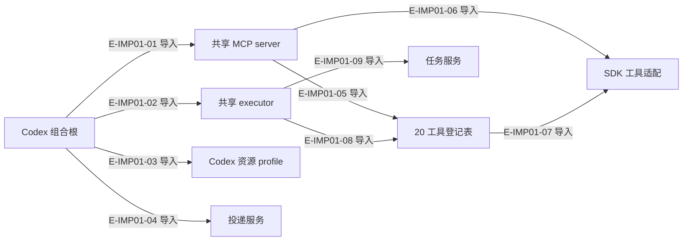
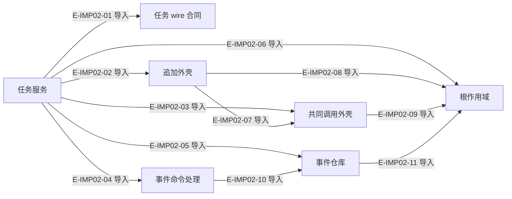

# 实际导入：组合根与一次追加切片

每条箭头都由当前TypeScript AST中的直接import或再导出核实，包含仅类型依赖。它不能证明运行时调用、分支顺序、测试覆盖或权限。以下是围绕问题选择的子图；省略的完整静态关系保存在[原始导入数据](../../plans/review-2026-10-03/import-graph.json)。

## 公共 MCP 装配的直接导入

```mermaid
flowchart LR
  accTitle: 公共 MCP 装配的直接导入
  accDescr: 当前代码精选的直接导入关系，完整文件身份在节点表，静态导入不等于运行时调用。
  f1["Codex 组合根"]
  f2["共享 MCP server"]
  f3["20 工具登记表"]
  f4["SDK 工具适配"]
  f5["共享 executor"]
  f6["Codex 资源 profile"]
  f7["投递服务"]
  f8["任务服务"]
  f1 -->|"E-IMP01-01 导入"| f2
  f1 -->|"E-IMP01-02 导入"| f5
  f1 -->|"E-IMP01-03 导入"| f6
  f1 -->|"E-IMP01-04 导入"| f7
  f2 -->|"E-IMP01-05 导入"| f3
  f2 -->|"E-IMP01-06 导入"| f4
  f3 -->|"E-IMP01-07 导入"| f4
  f5 -->|"E-IMP01-08 导入"| f3
  f5 -->|"E-IMP01-09 导入"| f8
```

### 本图术语说明

| 术语 | 含义 |
| --- | --- |
| 导入 | AST中存在的直接模块引用，可能仅供类型检查。 |
| 精选 | 仅展示所选文件之间的边，不声称是完整传递闭包。 |
| 文件节点 | 使用稳定节点ID与完整相对路径，避免同名service.ts混淆。 |

### 节点与实现定位

| 节点 | 文件 / 符号 | 职责 |
| --- | --- | --- |
| f1 | `src/entrypoints/codex-wakeflow-mcp.ts` | Codex 组合根 |
| f2 | `src/entrypoints/wakeflow-public-mcp-server.ts` | 共享 MCP server |
| f3 | `src/entrypoints/wakeflow-public-mcp-catalog.ts` | 20 工具登记表 |
| f4 | `src/entrypoints/wakeflow-public-mcp-tool.ts` | SDK 工具适配 |
| f5 | `src/entrypoints/wakeflow-public-mcp-shared-executors.ts` | 共享 executor |
| f6 | `src/hosts/codex/wakeflow-workspace-host-resource-profile.ts` | Codex 资源 profile |
| f7 | `src/capabilities/delivery/service.ts` | 投递服务 |
| f8 | `src/capabilities/tasking/service.ts` | 任务服务 |

### 本图边级证据

| 编号 | 起点文件 | 终点文件 | 测试 / 核验 | 关系依据 |
| --- | --- | --- | --- | --- |
| E-IMP01-01 | `src/entrypoints/codex-wakeflow-mcp.ts` | `src/entrypoints/wakeflow-public-mcp-server.ts` | 未覆盖：静态关系由AST直接核验，不以运行测试冒充调用证据。 | 当前源文件的直接import或再导出 |
| E-IMP01-02 | `src/entrypoints/codex-wakeflow-mcp.ts` | `src/entrypoints/wakeflow-public-mcp-shared-executors.ts` | 未覆盖：静态关系由AST直接核验，不以运行测试冒充调用证据。 | 当前源文件的直接import或再导出 |
| E-IMP01-03 | `src/entrypoints/codex-wakeflow-mcp.ts` | `src/hosts/codex/wakeflow-workspace-host-resource-profile.ts` | 未覆盖：静态关系由AST直接核验，不以运行测试冒充调用证据。 | 当前源文件的直接import或再导出 |
| E-IMP01-04 | `src/entrypoints/codex-wakeflow-mcp.ts` | `src/capabilities/delivery/service.ts` | 未覆盖：静态关系由AST直接核验，不以运行测试冒充调用证据。 | 当前源文件的直接import或再导出 |
| E-IMP01-05 | `src/entrypoints/wakeflow-public-mcp-server.ts` | `src/entrypoints/wakeflow-public-mcp-catalog.ts` | 未覆盖：静态关系由AST直接核验，不以运行测试冒充调用证据。 | 当前源文件的直接import或再导出 |
| E-IMP01-06 | `src/entrypoints/wakeflow-public-mcp-server.ts` | `src/entrypoints/wakeflow-public-mcp-tool.ts` | 未覆盖：静态关系由AST直接核验，不以运行测试冒充调用证据。 | 当前源文件的直接import或再导出 |
| E-IMP01-07 | `src/entrypoints/wakeflow-public-mcp-catalog.ts` | `src/entrypoints/wakeflow-public-mcp-tool.ts` | 未覆盖：静态关系由AST直接核验，不以运行测试冒充调用证据。 | 当前源文件的直接import或再导出 |
| E-IMP01-08 | `src/entrypoints/wakeflow-public-mcp-shared-executors.ts` | `src/entrypoints/wakeflow-public-mcp-catalog.ts` | 未覆盖：静态关系由AST直接核验，不以运行测试冒充调用证据。 | 当前源文件的直接import或再导出 |
| E-IMP01-09 | `src/entrypoints/wakeflow-public-mcp-shared-executors.ts` | `src/capabilities/tasking/service.ts` | 未覆盖：静态关系由AST直接核验，不以运行测试冒充调用证据。 | 当前源文件的直接import或再导出 |

## 任务切片向下依赖的精选关系

```mermaid
flowchart LR
  accTitle: 任务切片向下依赖的精选关系
  accDescr: 当前代码精选的直接导入关系，完整文件身份在节点表，静态导入不等于运行时调用。
  f9["任务服务"]
  f10["任务 wire 合同"]
  f11["追加外壳"]
  f12["共同调用外壳"]
  f13["事件命令处理"]
  f14["事件仓库"]
  f15["根作用域"]
  f9 -->|"E-IMP02-01 导入"| f10
  f9 -->|"E-IMP02-02 导入"| f11
  f9 -->|"E-IMP02-03 导入"| f12
  f9 -->|"E-IMP02-04 导入"| f13
  f9 -->|"E-IMP02-05 导入"| f14
  f9 -->|"E-IMP02-06 导入"| f15
  f11 -->|"E-IMP02-07 导入"| f12
  f11 -->|"E-IMP02-08 导入"| f15
  f12 -->|"E-IMP02-09 导入"| f15
  f13 -->|"E-IMP02-10 导入"| f14
  f14 -->|"E-IMP02-11 导入"| f15
```

### 本图术语说明

| 术语 | 含义 |
| --- | --- |
| 导入 | AST中存在的直接模块引用，可能仅供类型检查。 |
| 精选 | 仅展示所选文件之间的边，不声称是完整传递闭包。 |
| 文件节点 | 使用稳定节点ID与完整相对路径，避免同名service.ts混淆。 |

### 节点与实现定位

| 节点 | 文件 / 符号 | 职责 |
| --- | --- | --- |
| f9 | `src/capabilities/tasking/service.ts` | 任务服务 |
| f10 | `src/capabilities/tasking/contract.ts` | 任务 wire 合同 |
| f11 | `src/kernel/append-command.ts` | 追加外壳 |
| f12 | `src/kernel/command-shell.ts` | 共同调用外壳 |
| f13 | `src/governance/demand/event-sourcing/demand-event-sourcing-command-handler.ts` | 事件命令处理 |
| f14 | `src/governance/demand/event-sourcing/demand-event-sourcing-repository.ts` | 事件仓库 |
| f15 | `src/foundation/filesystem/rooted-directory.ts` | 根作用域 |

### 本图边级证据

| 编号 | 起点文件 | 终点文件 | 测试 / 核验 | 关系依据 |
| --- | --- | --- | --- | --- |
| E-IMP02-01 | `src/capabilities/tasking/service.ts` | `src/capabilities/tasking/contract.ts` | 未覆盖：静态关系由AST直接核验，不以运行测试冒充调用证据。 | 当前源文件的直接import或再导出 |
| E-IMP02-02 | `src/capabilities/tasking/service.ts` | `src/kernel/append-command.ts` | 未覆盖：静态关系由AST直接核验，不以运行测试冒充调用证据。 | 当前源文件的直接import或再导出 |
| E-IMP02-03 | `src/capabilities/tasking/service.ts` | `src/kernel/command-shell.ts` | 未覆盖：静态关系由AST直接核验，不以运行测试冒充调用证据。 | 当前源文件的直接import或再导出 |
| E-IMP02-04 | `src/capabilities/tasking/service.ts` | `src/governance/demand/event-sourcing/demand-event-sourcing-command-handler.ts` | 未覆盖：静态关系由AST直接核验，不以运行测试冒充调用证据。 | 当前源文件的直接import或再导出 |
| E-IMP02-05 | `src/capabilities/tasking/service.ts` | `src/governance/demand/event-sourcing/demand-event-sourcing-repository.ts` | 未覆盖：静态关系由AST直接核验，不以运行测试冒充调用证据。 | 当前源文件的直接import或再导出 |
| E-IMP02-06 | `src/capabilities/tasking/service.ts` | `src/foundation/filesystem/rooted-directory.ts` | 未覆盖：静态关系由AST直接核验，不以运行测试冒充调用证据。 | 当前源文件的直接import或再导出 |
| E-IMP02-07 | `src/kernel/append-command.ts` | `src/kernel/command-shell.ts` | 未覆盖：静态关系由AST直接核验，不以运行测试冒充调用证据。 | 当前源文件的直接import或再导出 |
| E-IMP02-08 | `src/kernel/append-command.ts` | `src/foundation/filesystem/rooted-directory.ts` | 未覆盖：静态关系由AST直接核验，不以运行测试冒充调用证据。 | 当前源文件的直接import或再导出 |
| E-IMP02-09 | `src/kernel/command-shell.ts` | `src/foundation/filesystem/rooted-directory.ts` | 未覆盖：静态关系由AST直接核验，不以运行测试冒充调用证据。 | 当前源文件的直接import或再导出 |
| E-IMP02-10 | `src/governance/demand/event-sourcing/demand-event-sourcing-command-handler.ts` | `src/governance/demand/event-sourcing/demand-event-sourcing-repository.ts` | 未覆盖：静态关系由AST直接核验，不以运行测试冒充调用证据。 | 当前源文件的直接import或再导出 |
| E-IMP02-11 | `src/governance/demand/event-sourcing/demand-event-sourcing-repository.ts` | `src/foundation/filesystem/rooted-directory.ts` | 未覆盖：静态关系由AST直接核验，不以运行测试冒充调用证据。 | 当前源文件的直接import或再导出 |

[本模块总览](./README.md) · [实际调用与分支](./runtime-call-flow.md) · [逐文件台账](../02-file-review-index.md)。

现有精选直接边在新代码中仍成立；新增workspace-operation-scope依赖另见[Kernel下钻](../11-kernel/workspace-operation-scope.md)。本图没有将source中新的scope导入冒充原有的直接调用。
