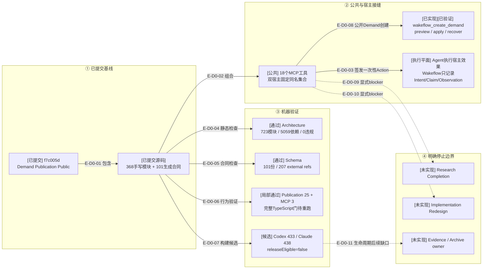

# 总体架构：提交影响与审阅证据

> 本文绑定Demand Publication实现提交`f7c005d`。目标任务或脚本自述只是审阅输入；本文依据实际
> 源码、Schema、测试和差异，不把聚焦验证或候选制品描述为release-ready。

## D0：Demand Publication提交影响

### 本图术语说明

| 图中术语 | 解释 |
| --- | --- |
| 已提交基线 | Git提交`f7c005d`中的Demand Publication源码、Schema、测试与Review记录 |
| 固定组合 | Codex与Claude Code各自绑定host facade，但共享同一18工具及宿主中立owner |
| Agent宿主效果 | Agent调用宿主API；Wakeflow不直接操作Codex/Claude窗口，只签发并记录有界事实 |
| 候选制品 | 可重建的TypeScript闭包；manifest明确`releaseEligible=false` |
| 停止边界 | 代码明确不支持的相邻能力，不允许从当前闭环推断为存在 |

## 当前规模

| 区域 | 当前值 |
| --- | ---: |
| 手写生产TypeScript | 368 |
| 生成TypeScript合同 | 101 |
| JSON Schema | 101 |
| 正式测试文件 | 225 |
| 公共MCP工具 | 18 |
| Architecture | 723模块 / 5059依赖 / 0违规 |
| 当前Publication聚焦门 | 25 pass；MCP注册/双宿主3 pass |
| 最近TypeScript完整门 | 902 pass / 0 fail / 0 skip；早于`f7c005d` |

## 边级证据

| 边编号 | 代码/差异证据 | 测试/审阅证据 |
| --- | --- | --- |
| `E-D0-01`–`E-D0-03` | `src/{foundation,workspace,governance,entrypoints}/`与双宿主composition roots | 公共MCP 18工具、双宿主一致性和真实纵切测试 |
| `E-D0-04` | 架构检查器读取当前源码图 | 723模块、5059依赖、0违规 |
| `E-D0-05` | 101份Schema与生成合同 | `schema:check`：207 external refs、生成输出一致 |
| `E-D0-06` | 225个测试文件 | 当前Publication 25项与MCP注册/双宿主3项；完整源清单尚未重跑 |
| `E-D0-07` | 双宿主候选闭包与manifest | Codex 433、Claude Code 438个编译文件；仍不可发布 |
| `E-D0-08` | Demand Publication Public | authored input、Planning/Application、Schema、Coordinator与MCP | pending TODO→Demand→首个Route真实MCP测试 |
| `E-D0-09`–`E-D0-11` | Controller Route blocker与无Archive owner | 技术骨干核实文档与22项Route矩阵 |

## 当前风险与结论

- 18工具已覆盖“pending TODO → Demand → Completion”；每一步仍由Agent按Route显式调用，不是公共Server自动编排。
- Agent Host Action不是持久权威，真实宿主效果仍必须由Agent最多执行一次并回传观察。
- Research Completion与Implementation Redesign仍为显式blocker，不允许绕过。
- Loaded Artifact transfer保持冻结，等待Evidence/Archive首个真实consumer复审。
- `f7c005d`尚未重跑完整TypeScript源清单、旧JS等价对照、双宿主插件smoke
  或release gate；聚焦通过不能替代发布就绪结论。
