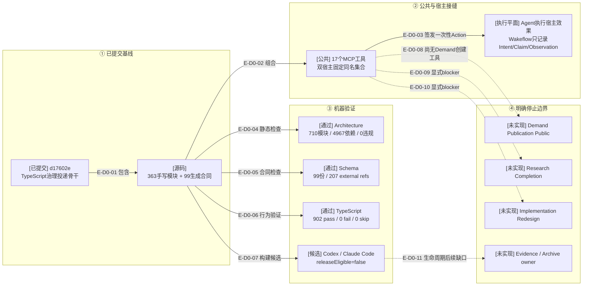

# 总体架构：提交影响与审阅证据

> 本文绑定已提交的TypeScript骨干`d17602e`。目标任务或脚本自述只是审阅输入；本文依据实际
> 源码、Schema、测试和提交差异，不把候选制品描述为release-ready。

## D0：当前提交影响

### 本图术语说明

| 图中术语 | 解释 |
| --- | --- |
| 已提交基线 | Git提交`d17602e`中的确定源码，不含Atlas和异常历史文档diff |
| 固定组合 | Codex与Claude Code各自绑定host facade，但共享同一17工具及宿主中立owner |
| Agent宿主效果 | Agent调用宿主API；Wakeflow不直接操作Codex/Claude窗口，只签发并记录有界事实 |
| 候选制品 | 可重建的TypeScript闭包；manifest明确`releaseEligible=false` |
| 停止边界 | 代码明确不支持的相邻能力，不允许从当前闭环推断为存在 |

## 当前规模

| 区域 | 当前值 |
| --- | ---: |
| 手写生产TypeScript | 363 |
| 生成TypeScript合同 | 99 |
| JSON Schema | 99 |
| 正式测试文件 | 220 |
| 公共MCP工具 | 17 |
| Architecture | 710模块 / 4967依赖 / 0违规 |
| TypeScript完整门 | 902 pass / 0 fail / 0 skip |

## 边级证据

| 边编号 | 代码/差异证据 | 测试/审阅证据 |
| --- | --- | --- |
| `E-D0-01`–`E-D0-03` | `src/{foundation,workspace,governance,entrypoints}/`与双宿主composition roots | 公共MCP 17工具、双宿主一致性和真实纵切测试 |
| `E-D0-04` | 架构检查器读取当前源码图 | 710模块、4967依赖、0违规 |
| `E-D0-05` | 99份Schema与生成合同 | `schema:check`：207 external refs、生成输出一致 |
| `E-D0-06` | 220个测试文件 | 当前source-manifest：902 pass |
| `E-D0-07` | 双宿主候选闭包与manifest | 候选构建测试通过；仍不可发布 |
| `E-D0-08`–`E-D0-11` | Controller Route blocker、无Publication Public、无Archive owner | 技术骨干核实文档与22项Route矩阵 |

## 当前风险与结论

- 17工具覆盖“已有Demand → Completion”，不覆盖“从零创建Demand”。
- Agent Host Action不是持久权威，真实宿主效果仍必须由Agent最多执行一次并回传观察。
- Research Completion与Implementation Redesign仍为显式blocker，不允许绕过。
- Loaded Artifact transfer保持冻结，等待Evidence/Archive首个真实consumer复审。
- 本轮没有运行旧JS等价对照、双宿主插件smoke或release gate；这些缺口不影响TypeScript提交的
  当前测试结论，但禁止宣称发布就绪。
