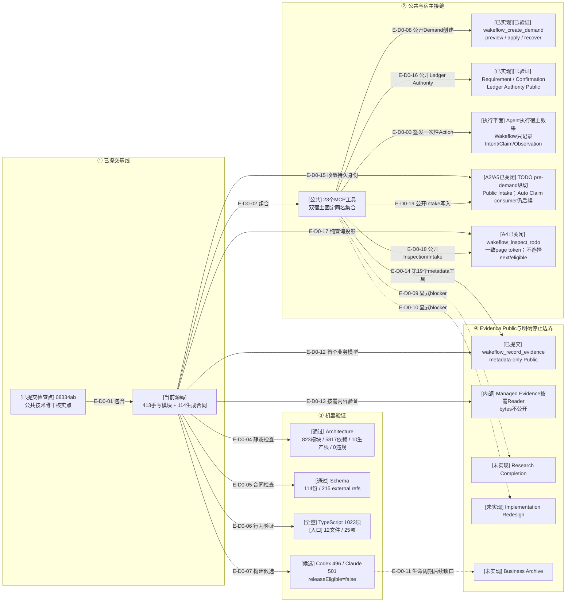

# 总体架构：提交影响与审阅证据

> 本文以提交`08334ab`为当前核实点；`cfc61f4`是公共pre-Demand链的前一检查点。目标任务或脚本自述只是审阅输入；本文依据实际源码、Schema、测试和差异。

## D0：公共骨干技术Review提交影响

### 本图术语说明

| 图中术语 | 解释 |
| --- | --- |
| 已提交基线 | Git提交`08334ab`中的公共pre-Demand链、四个静态注册组与技术Review门 |
| 固定组合 | Codex与Claude Code各自绑定host facade，但共享同一23工具及宿主中立owner |
| Agent宿主效果 | Agent调用宿主API；Wakeflow不直接操作Codex/Claude窗口，只签发并记录有界事实 |
| 候选制品 | 可重建的TypeScript闭包；manifest明确`releaseEligible=false` |
| 停止边界 | 代码明确不支持的相邻能力，不允许从当前闭环推断为存在 |
| Managed Evidence内部Application/Recovery | 增加strict journal、Manifest-last stage、Event-before-final、事务期闭包、Event前stale退休和journal-last健康闭包；仍不公开MCP |
| Managed Evidence Reader | `deferred / member / complete`三级内容证明；只读Authority允许Snapshot + tail；仍不公开原始bytes |
| Managed Evidence Public | `wakeflow_record_evidence`公开preview/apply/recover；Apply/Recover只返回typed ID、摘要与游标 |
| Ledger Authority Public | 两个family专用工具共享内部pipeline，返回Requirement/Confirmation及member-reference metadata；不创建TODO/Demand |
| typed、Ledger-bound TODO | Intake、State、五操作Transaction/Recovery与Public Intake已闭合；Auto Claim仍无执行consumer |
| TODO Inspection Query | Public list/item读模型；page token绑定Collection/filter/offset，不是调度或mutation许可 |

## 当前规模

| 区域 | 当前值 |
| --- | ---: |
| 手写生产TypeScript | 413 |
| 生成TypeScript合同 | 114 |
| JSON Schema | 114 |
| 正式测试文件 | 262 |
| 公共MCP工具 | 23 |
| Architecture | 823模块 / 5817依赖 / 10个显式生产根 / 0违规 |
| 当前聚焦门 | entrypoint 12文件/25项；Demand input反向依赖18文件/80项 |
| 最近TypeScript完整门 | 1023 pass / 0 fail / 0 cancelled / 0 skip；覆盖提交`08334ab` |

## 边级证据

| 边编号 | 代码/差异证据 | 测试/审阅证据 |
| --- | --- | --- |
| `E-D0-01`–`E-D0-03` | `src/{foundation,workspace,governance,entrypoints}/`与双宿主composition roots | 独立catalog证明23工具/双宿主一致性，owner文件证明真实纵切 |
| `E-D0-04` | 架构检查器读取当前源码图 | 823模块、5817依赖、10个显式生产根、0违规 |
| `E-D0-05` | 114份Schema与生成合同 | `schema:check`：215 external refs、生成输出一致 |
| `E-D0-06` | 当前测试源集合 | 完整门1023项；entrypoint 25项与Demand input反向依赖80项通过 |
| `E-D0-07` | 双宿主候选闭包与manifest | Codex 496、Claude Code 501个编译文件；仍不可发布 |
| `E-D0-08` | Demand Publication Public | authored input、Planning/Application、Schema、Coordinator与MCP | pending TODO→Demand→首个Route真实MCP测试 |
| `E-D0-09`–`E-D0-11` | Controller Route blocker与无Archive owner | 技术骨干核实文档与22项Route矩阵 |
| `E-D0-12` | Managed Evidence内部Application/Recovery | Capture Plan、strict journal、Manifest-last、Event/final顺序、Root phase、stale retirement及journal-last | 此前44项聚焦与4项真实Application崩溃恢复测试 |
| `E-D0-13` | Managed Evidence Reader | Manifest/member/complete三级验证、Snapshot + tail、容量和opaque bytes边界 | 2项真实Reader测试及Portable Path join测试 |
| `E-D0-14` | Managed Evidence Public | Planning、Schema、Contract、Coordinator、MCP Server与双宿主composition | 4类结果、错误authority、23工具catalog、真实MCP和候选stdio测试 |
| `E-D0-15` | durable ID kind、TodoIntake/State/Collection/Board/Transaction Storage/Service、Ledger合同与Demand/Tasking consumer | A2覆盖完整内部纵切及Intake/State精确revision可达性；TODO 63项 + 直接consumer 31项通过 |
| `E-D0-16` | Ledger Authority Input/Plan/Planning/Payload/Application/Store、双family wire/Coordinator及MCP接线 | Requirement/Confirmation真实MCP、错误authority、23工具catalog与完整Ledger面合计62项通过 |
| `E-D0-17` | `todo-inspection-query.ts` | list/item、规范filter、同snapshot page token与summary/detail纯投影；由Public Coordinator真实消费 |
| `E-D0-18`、`E-D0-19` | TODO Inspection/Intake Schema、Contract、Coordinator与双宿主MCP | Public查询/写入、recoverable错误及23工具catalog |

## 当前风险与结论

- 23工具已覆盖Ledger Authority producer、TODO Inspection/Intake、“pending TODO → Demand → Completion”及Evidence记录；每一步仍由Agent显式调用，不是公共Server自动编排。
- A4/A5/A6已形成公开零到一pre-demand链，但Auto Claim没有执行consumer，不能据此声称无人值守调度。
- A3～A6已形成真实Requirement/Confirmation → TODO Intake/Inspection → Demand → Route公共入口；Auto Claim仍缺失，不能据此声称无人值守调度。
- Agent Host Action不是持久权威，真实宿主效果仍必须由Agent最多执行一次并回传观察。
- Research Completion与Implementation Redesign仍为显式blocker，不允许绕过。
- Loaded Artifact transfer plan/candidate已有Evidence Payload Materializer真实tree consumer；transfer publication与Archive仍未实现。
- 当前Planning已消费Loaded Artifact identity与Stable File Read，Event已进入Demand事件族，但尚未消费transfer candidate/publication。
- 统一技术Review已提交于`08334ab`，并通过完整TypeScript、架构、Schema、候选stdio及反向依赖聚焦门。旧JS等价、双宿主plugin smoke与release gate不属于当前核实结论。
