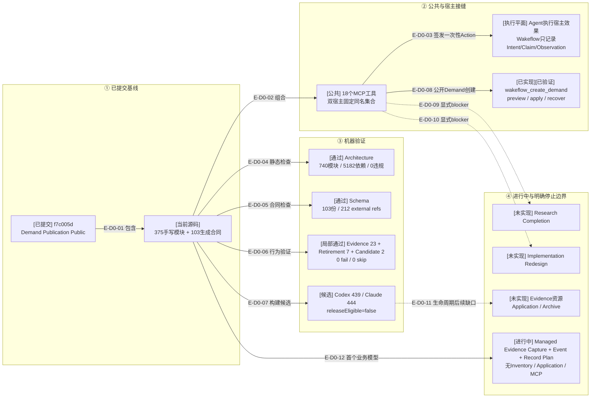

# 总体架构：提交影响与审阅证据

> 本文绑定Demand Publication实现提交`f7c005d`及当前Managed Evidence Capture/Event/Resource/Record Plan工作树。目标任务或
> 脚本自述只是审阅输入；本文依据实际源码、Schema、测试和差异。

## D0：Demand Publication提交影响

### 本图术语说明

| 图中术语 | 解释 |
| --- | --- |
| 已提交基线 | Git提交`f7c005d`中的Demand Publication源码、Schema、测试与Review记录 |
| 固定组合 | Codex与Claude Code各自绑定host facade，但共享同一18工具及宿主中立owner |
| Agent宿主效果 | Agent调用宿主API；Wakeflow不直接操作Codex/Claude窗口，只签发并记录有界事实 |
| 候选制品 | 可重建的TypeScript闭包；manifest明确`releaseEligible=false` |
| 停止边界 | 代码明确不支持的相邻能力，不允许从当前闭环推断为存在 |
| Managed Evidence Capture/Event/Record Plan | 从Config根稳定读取file/tree并零写生成Manifest/CAS计划；Event保存完整Manifest；record plan关闭Manifest文件字节与payload整树路径/mode/digest但不执行写入 |

## 当前规模

| 区域 | 当前值 |
| --- | ---: |
| 手写生产TypeScript | 375 |
| 生成TypeScript合同 | 103 |
| JSON Schema | 103 |
| 正式测试文件 | 232 |
| 公共MCP工具 | 18 |
| Architecture | 740模块 / 5182依赖 / 0违规 |
| 当前聚焦门 | Evidence 23 + Retirement 7 + Candidate 2；0 fail / 0 skip |
| 最近TypeScript完整门 | 948 pass / 0 fail / 0 cancelled / 0 skip；覆盖当前全部增量 |

## 边级证据

| 边编号 | 代码/差异证据 | 测试/审阅证据 |
| --- | --- | --- |
| `E-D0-01`–`E-D0-03` | `src/{foundation,workspace,governance,entrypoints}/`与双宿主composition roots | 公共MCP 18工具、双宿主一致性和真实纵切测试 |
| `E-D0-04` | 架构检查器读取当前源码图 | 740模块、5182依赖、0违规 |
| `E-D0-05` | 103份Schema与生成合同 | `schema:check`：212 external refs、生成输出一致 |
| `E-D0-06` | 232个测试文件 | `check:typescript`完整运行948项；0 fail / 0 cancelled / 0 skip |
| `E-D0-07` | 双宿主候选闭包与manifest | Codex 439、Claude Code 444个编译文件；仍不可发布 |
| `E-D0-08` | Demand Publication Public | authored input、Planning/Application、Schema、Coordinator与MCP | pending TODO→Demand→首个Route真实MCP测试 |
| `E-D0-09`–`E-D0-11` | Controller Route blocker与无Archive owner | 技术骨干核实文档与22项Route矩阵 |
| `E-D0-12` | Managed Evidence Capture/Event/Record Plan | Manifest/ID、source selection、稳定读取、Event/selector、Commit重放、资源目录、容量预留及完整record tree plan | Evidence聚焦测试 |

## 当前风险与结论

- 18工具已覆盖“pending TODO → Demand → Completion”；每一步仍由Agent按Route显式调用，不是公共Server自动编排。
- Agent Host Action不是持久权威，真实宿主效果仍必须由Agent最多执行一次并回传观察。
- Research Completion与Implementation Redesign仍为显式blocker，不允许绕过。
- Loaded Artifact transfer保持冻结，等待Evidence资源Application或Archive首个真实consumer复审。
- 当前Planning已消费Loaded Artifact identity与Stable File Read，Event已进入Demand事件族，但尚未消费transfer candidate/publication。
- 当前Evidence Capture/Event/Resource/Record Plan增量只通过聚焦门，尚未重跑完整TypeScript源清单；旧JS等价、双宿主plugin smoke与release gate也未运行。
