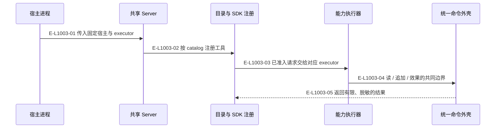

# 公共入口：登记表到能力执行器

两个宿主共用登记表与通用 executor；需要宿主身份的能力由对应组合根固定注入。工具目录是静态数据，不保存工作区运行状态。

> 核验基线：`7ba1f38`；核验时实现代码均已提交，本轮图谱更新另列。开发阶段为 L1 九片已落地，observation 尚未开始。本文说明实现事实，未宣称双宿主真实会话已经验证。

## MCP 启动与单次工具调用

### 本图术语说明

| 术语 | 本图含义 |
| --- | --- |
| next | 根据当前事实派生的下一责任与建议工具。 |
| host | Codex 或 Claude Code；真实会话动作由 Agent 调用宿主完成。 |

### 节点与实现定位

| 节点 | 文件 / 符号 | 责任 |
| --- | --- | --- |
| host | `src/entrypoints/codex-wakeflow-mcp.ts#createCodexWakeflowMcpServer` | 宿主进程 |
| server | `src/entrypoints/wakeflow-public-mcp-server.ts#createWakeflowPublicMcpServer` | 共享 Server |
| registry | `src/entrypoints/wakeflow-public-mcp-tool.ts#registerWakeflowPublicMcpCatalog` | 目录与 SDK 注册 |
| slice | `src/capabilities/tasking/service.ts#executeTargetTaskPlanningPublicRequest` | 能力执行器 |
| shell | `src/kernel/command-shell.ts#runCommandShell` | 统一命令外壳 |

### 本图边级证据

| 编号 | 代码定位 | 测试 / 核验 | 关系依据 |
| --- | --- | --- | --- |
| E-L1003-01 | `src/entrypoints/codex-wakeflow-mcp.ts#createCodexWakeflowMcpServer` | `tests/entrypoints/wakeflow-public-mcp-catalog.test.ts` | 传入固定宿主与 executor |
| E-L1003-02 | `src/entrypoints/wakeflow-public-mcp-server.ts#createWakeflowPublicMcpServer` | `tests/entrypoints/wakeflow-public-mcp-catalog.test.ts` | 按 catalog 注册工具 |
| E-L1003-03 | `src/entrypoints/wakeflow-public-mcp-tool.ts#registerWakeflowPublicMcpCatalog` | `tests/entrypoints/wakeflow-public-mcp-catalog.test.ts` | 已准入请求交给对应 executor |
| E-L1003-04 | `src/kernel/append-command.ts#runAppendCommand` | `tests/capabilities/tasking/service.test.ts` | 读 / 追加 / 效果的共同边界 |
| E-L1003-05 | `src/entrypoints/wakeflow-public-mcp-tool.ts#successfulToolResult` | `tests/entrypoints/wakeflow-public-mcp-catalog.test.ts` | 返回有限、脱敏的结果 |

## 守卫、恢复与验证范围

outputSchema 留在服务端校验，不内联到公开目录。Ajv 首次使用时编译；没有新的通用宿主 transport 执行器。

涉及的测试与核验入口：

- `tests/capabilities/tasking/service.test.ts`。
- `tests/entrypoints/wakeflow-public-mcp-catalog.test.ts`。

## 下钻与相关视图

- [本专题总览](./README.md)
- [图谱总索引](../README.md)
- [核验与剩余范围](../01-diagram-review-ledger.md)
