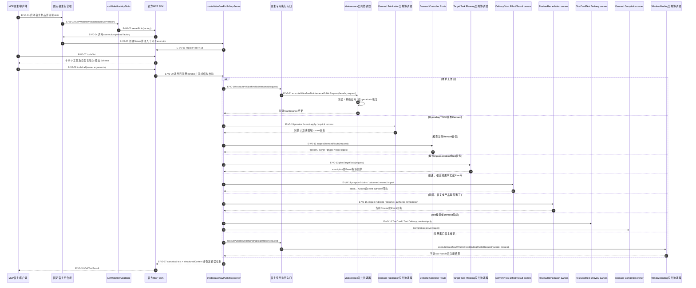

# 总体架构：公共MCP符号调用流

## 当前结论

一个宿主进程只创建对应宿主的固定组合根。组合根把18项真实执行函数注入共享公共MCP Server；
官方SDK负责`tools/list`、`tools/call`、输入/输出Schema校验和stdio协议。公共Server不使用动态handler
registry，也不从请求中选择Codex或Claude Code。

公共Target Task Planning以判别联合支持`implementation`和`test`：implementation由Controller提供完整内容；
test请求只能提供`workType:test`，其余Package事实由当前TestCard和Route派生。Demand Publication先以
零写preview派生完整事务，再以精确plan/digest应用，或在已有sidecar时按Demand ID显式恢复；成功后
由Controller Route选择下一owner。其他工具分别拥有Delivery、Host Effect事实、Result、Review、Testing、
Remediation和Completion。

## V0：进程启动与18工具调用时序

### 本图术语说明

| 图中术语 | 解释 |
| --- | --- |
| 固定宿主组合根 | `createCodexWakeflowMcpServer`或`createClaudeCodeWakeflowMcpServer`，在源码中固定宿主执行函数 |
| connection-pinned factory | 官方stdio服务为连接调用的Server factory；不从公共请求动态选择宿主 |
| executor | 组合根注入公共Server的18个具名执行函数之一 |
| handler | `registerTool`注册的薄回调，调用executor并把领域错误转换成稳定公开错误 |
| RootedDirectory | 对调用方工作区根执行规范化、包含关系和安全文件访问的Foundation边界 |
| Event authority | 目标任务规划应用后对事件提交状态的脱敏判断：`unchanged/current/unknown` |
| Publication authority | 发布失败后可证明的`unchanged/recoverable/current/unknown`状态；只有`recoverable`允许显式恢复 |
| Binding | 按宿主持久化opaque窗口句柄的私有身份权威 |
| structuredContent | 通过MCP output Schema校验的结构化成功结果 |
| 稳定错误信封 | 公开`code/reason`和有界authority状态，不泄漏异常消息、栈或私有路径 |

## 符号映射

| 参与者 | 文件与符号 | 输入 | 输出/副作用 |
| --- | --- | --- | --- |
| 固定宿主组合根 | `src/entrypoints/*-wakeflow-mcp.ts#create*WakeflowMcpServer` | server版本 | 固定宿主的`McpServer` |
| stdio边界 | `src/entrypoints/wakeflow-mcp-stdio.ts#runWakeflowMcpStdio` | `McpServerFactory` | 官方stdio handle；稳定stderr错误 |
| 公共MCP Server | `src/entrypoints/wakeflow-public-mcp-server.ts#createWakeflowPublicMcpServer` | 18个executor与Server身份 | 注册18个工具 |
| 宿主Maintenance入口 | `src/entrypoints/*-wakeflow-maintenance.ts#execute*WakeflowMaintenance` | 公共请求 | 固定facade后的共享维护结果 |
| Maintenance协调器 | `executeWakeflowMaintenancePublicRequest` | facade与请求 | preview/apply/recover脱敏结果 |
| Demand Publication协调器 | `executeDemandPublicationPublicRequest` | authored preview、exact plan或demandId | 完整preview计划或脱敏Publication回执 |
| Route协调器 | `executeDemandControllerRoutePublicRequest` | demandId | 当前22类责任frontier中的一个或多个 |
| Tasking协调器 | `executeTargetTaskPlanningPublicRequest` | implementation完整内容或最小test选择 | plan或已提交Event/投影摘要 |
| Delivery/Result协调器 | `src/entrypoints/*delivery*`、`*host-effect*`、`*result*` | Route选中的精确selector与plan | Intent、一次性Action、Observation/Result Event回执 |
| Review协调器 | `src/entrypoints/*review*`、`*remediation*` | Inspection来源与Controller独立判断 | Decision/Resume/Remediation Event回执 |
| Testing/Lifecycle协调器 | TestCard、Test Delivery与Completion Public Coordinator | Route选中的preview/apply | owner派生计划与Event回执 |
| 宿主Binding入口 | `src/entrypoints/*-wakeflow-window-host-binding.ts#execute*Registration` | Agent观察 | 固定Profile后的共享注册结果 |
| Binding协调器 | `executeWakeflowWindowHostBindingPublicRequest` | facade与请求 | 私有Binding、脱敏投影与公开结果 |

## 边级证据

| 边编号 | 起点符号 | 终点符号 | 关系 | 代码证据 | 测试证据 |
| --- | --- | --- | --- | --- | --- |
| `E-V0-01`、`E-V0-02` | 宿主启动 | `run*WakeflowMcpStdio` | 启动/调用 | 两宿主MCP入口导出 | 候选制品stdio与入口测试 |
| `E-V0-03`、`E-V0-04` | `runWakeflowMcpStdio` | 官方`serveStdio`/factory | 调用/回调 | `wakeflow-mcp-stdio.ts` | 公共Server官方Client测试 |
| `E-V0-05` | 两宿主factory | `createWakeflowPublicMcpServer` | 构造 | 两宿主MCP组合根 | 公共Server配置负例 |
| `E-V0-06` | 公共Server | `McpServer.registerTool` | 注册 | 18个`server.registerTool`调用 | “只发布十八个已有真实owner”测试 |
| `E-V0-07`、`E-V0-08`、`E-V0-09` | MCP Client/SDK | 注册handler | 协议调用 | 官方SDK负责list/call与Schema | `wakeflow-public-mcp-server.test.ts` |
| `E-V0-10`、`E-V0-11` | Maintenance handler | 宿主入口/共享协调器 | 调用 | 注入的`executeMaintenance`与两宿主入口 | `wakeflow-maintenance-entrypoints.test.ts` |
| `E-V0-12`、`E-V0-13` | Route/Tasking handlers | Route与Planning owner | 调用 | `inspectDemandRoute`、`planTargetTask` | 22项Route矩阵与implementation/test真实preview/apply |
| `E-V0-14`–`E-V0-16` | Delivery/Result/Review/Testing/Lifecycle handlers | 各公共owner | 调用 | 组合根具名executor与对应registerTool | 公共MCP真实纵切、公共Coordinator与Schema测试 |
| `E-V0-19` | Demand Publication handler | Planning/Application/Public Coordinator | 调用 | `createDemand`executor与`wakeflow_create_demand`注册 | pending TODO→Demand→首个Route及recoverable错误信封测试 |
| `E-V0-17`、`E-V0-18` | 公共Server/SDK | MCP Client | 返回 | `canonicalizeJson`、`structuredContent`、`failedToolResult` | 成功与错误信封测试 |

## 安全与责任边界

- MCP input Schema准入不替代领域owner的关系、容量、根作用域和authority复验。
- Window Binding raw handle只进入0600私有文件，不进入MCP结果或投影。
- Maintenance返回launch intent，但不创建宿主窗口。
- 公共Task Planning可按Route创建Test TaskPackage，但调用方不能重写Card派生内容。
- Delivery Claim只签发Action；Wakeflow不会替Agent执行宿主效果，也不会自动重试indeterminate结果。
- Demand Publication preview只接受调用方拥有的文字、位置与Ledger成员选择；apply必须重放精确plan/digest，recover只接受Demand ID。
- stdout只用于MCP；transport/shutdown稳定摘要只写stderr。

## 停止边界

本图只覆盖公共MCP入口到领域owner的组合与路由。每个owner内部的文件、状态和恢复细节由后续领域文档包下钻。
