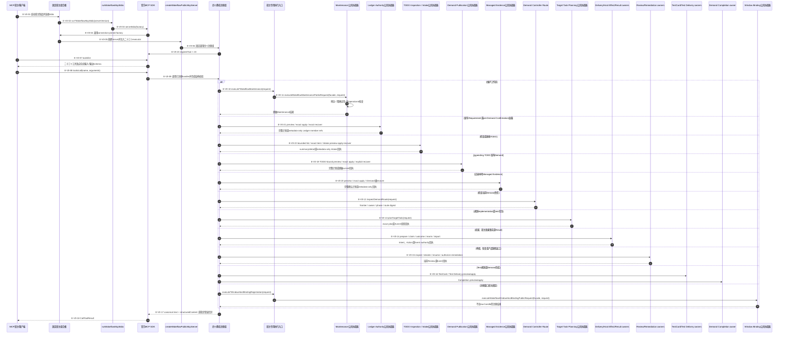

# 总体架构：公共MCP符号调用流

## 当前结论

一个宿主进程只创建对应宿主的固定组合根。组合根把23项真实执行函数注入共享公共MCP Server；
Server严格准入配置后，按Workspace、Authority、Execution、Review四组静态注册。官方SDK负责
`tools/list`、`tools/call`、输入/输出Schema校验和stdio协议；注册组与共享结果适配器不保存动态handler
registry，也不从请求中选择Codex或Claude Code。

公共Target Task Planning以判别联合支持`implementation`和`test`：implementation由Controller提供完整内容；
test请求只能提供`workType:test`，其余Package事实由当前TestCard和Route派生。Demand Publication先以
零写preview派生完整事务，再以精确plan/digest应用，或在已有sidecar时按Demand ID显式恢复；成功后
由Controller Route选择下一owner。其他工具分别拥有Delivery、Host Effect事实、Result、Review、Testing、
Remediation和Completion。

## V0：进程启动与23工具调用时序

### 本图术语说明

| 图中术语 | 解释 |
| --- | --- |
| 固定宿主组合根 | `createCodexWakeflowMcpServer`或`createClaudeCodeWakeflowMcpServer`，在源码中固定宿主执行函数 |
| connection-pinned factory | 官方stdio服务为连接调用的Server factory；不从公共请求动态选择宿主 |
| executor | 组合根注入公共Server的23个具名执行函数之一 |
| 静态注册组 | 四个源码固定模块，分别拥有Schema、description、annotations、executor选择和领域错误映射 |
| handler | 共享`registerWakeflowPublicMcpTool`注册的薄回调，调用executor并生成Canonical结果或稳定错误 |
| RootedDirectory | 对调用方工作区根执行规范化、包含关系和安全文件访问的Foundation边界 |
| Event authority | 目标任务规划应用后对事件提交状态的脱敏判断：`unchanged/current/unknown` |
| Publication authority | 发布失败后可证明的`unchanged/recoverable/current/unknown`状态；只有`recoverable`允许显式恢复 |
| Binding | 按宿主持久化opaque窗口句柄的私有身份权威 |
| structuredContent | 通过MCP output Schema校验的结构化成功结果 |
| 稳定错误信封 | 公开`code/reason`和有界authority状态，不泄漏异常消息、栈或私有路径 |

## 符号映射

| 参与者 | 文件与符号 | 输入 | 输出/副作用 |
| --- | --- | --- | --- |
| 固定宿主组合根 | `src/entrypoints/*-wakeflow-mcp.ts#create*WakeflowMcpServer` | server版本 | 固定宿主的`McpServer` |
| stdio边界 | `src/entrypoints/wakeflow-mcp-stdio.ts#runWakeflowMcpStdio` | `McpServerFactory` | 官方stdio handle；稳定stderr错误 |
| 公共MCP Server | `src/entrypoints/wakeflow-public-mcp-server.ts#createWakeflowPublicMcpServer` | 23个executor与Server身份 | 创建SDK Server并固定调用四个注册组 |
| 静态注册组 | `wakeflow-public-mcp-{workspace,authority,execution,review}-tools.ts#registerWakeflowPublicMcp*Tools` | 对应executor子集 | 注册23个工具并局部映射领域错误 |
| 共享结果适配 | `wakeflow-public-mcp-tool.ts#registerWakeflowPublicMcpTool` | Schema、executor、错误mapper | Canonical text、structuredContent或脱敏错误信封 |
| 宿主Maintenance入口 | `src/entrypoints/*-wakeflow-maintenance.ts#execute*WakeflowMaintenance` | 公共请求 | 固定facade后的共享维护结果 |
| Maintenance协调器 | `executeWakeflowMaintenancePublicRequest` | facade与请求 | preview/apply/recover脱敏结果 |
| Ledger Authority协调器 | `executeRequirementPublicationPublicRequest`、`executeConfirmationPublicationPublicRequest` | Design Markdown选择或exact plan/digest | 完整preview计划或metadata-only Requirement/Confirmation回执 |
| TODO协调器 | `executeTodoInspectionPublicRequest`、`executeTodoIntakePublicationPublicRequest` | list/item或authored Intake/exact plan | 有界读模型或metadata-only Intake回执 |
| Demand Publication协调器 | `executeDemandPublicationPublicRequest` | authored preview、exact plan或demandId | 完整preview计划或脱敏Publication回执 |
| Managed Evidence协调器 | `executeManagedEvidencePublicRequest` | Demand ID、逻辑source selection或exact plan | 完整preview计划；Apply/Recover只返回metadata receipt |
| Route协调器 | `executeDemandControllerRoutePublicRequest` | demandId | 当前22类责任frontier中的一个或多个 |
| Tasking协调器 | `executeTargetTaskPlanningPublicRequest` | implementation完整内容或最小test选择 | plan或已提交Event/投影摘要 |
| Delivery/Result协调器 | `src/entrypoints/*delivery*`、`*host-effect*`、`*result*` | Route选中的精确selector与plan | Intent、一次性Action、Observation/Result Event回执 |
| Review协调器 | `src/entrypoints/*review*`、`*remediation*` | Inspection来源与Controller独立判断 | Decision/Resume/Remediation Event回执 |
| Testing/Lifecycle协调器 | TestCard、Test Delivery与Completion Public Coordinator | Route选中的preview/apply | owner派生计划与Event回执 |
| 宿主Binding入口 | `src/entrypoints/*-wakeflow-window-host-binding.ts#execute*Registration` | Agent观察 | 固定Profile后的共享注册结果 |
| Binding协调器 | `executeWakeflowWindowHostBindingPublicRequest` | facade与请求 | 私有Binding、脱敏投影与公开结果 |

## 边级证据

| 边编号 | 起点符号 | 终点符号 | 关系 | 代码证据 | 测试证据 |
| --- | --- | --- | --- | --- | --- |
| `E-V0-01`、`E-V0-02` | 宿主启动 | `run*WakeflowMcpStdio` | 启动/调用 | 两宿主MCP入口导出 | 候选制品stdio与入口测试 |
| `E-V0-03`、`E-V0-04` | `runWakeflowMcpStdio` | 官方`serveStdio`/factory | 调用/回调 | `wakeflow-mcp-stdio.ts` | 公共Server官方Client测试 |
| `E-V0-05` | 两宿主factory | `createWakeflowPublicMcpServer` | 构造 | 两宿主MCP组合根 | `wakeflow-public-mcp-catalog.test.ts`配置负例 |
| `E-V0-06`、`E-V0-23` | 公共Server/四注册组 | `McpServer.registerTool` | 静态装配/注册 | Server固定调用四组；共享helper立即注册23项 | catalog/Schema/annotations矩阵与拆分前后完整`tools/list`对比 |
| `E-V0-07`、`E-V0-08`、`E-V0-09` | MCP Client/SDK | 注册handler | 协议调用 | 官方SDK负责list/call与Schema | catalog、group错误矩阵及单一真实生命周期链 |
| `E-V0-10`、`E-V0-11` | Maintenance handler | 宿主入口/共享协调器 | 调用 | 注入的`executeMaintenance`与两宿主入口 | `wakeflow-maintenance-entrypoints.test.ts` |
| `E-V0-12`、`E-V0-13` | Route/Tasking handlers | Route与Planning owner | 调用 | `inspectDemandRoute`、`planTargetTask` | 22项Route矩阵与implementation/test真实preview/apply |
| `E-V0-14`–`E-V0-16` | Execution/Review注册组handlers | 各公共owner | 调用 | 分组具名executor与共享register helper | 单一真实生命周期链、公共Coordinator与Schema测试 |
| `E-V0-19` | Demand Publication handler | Planning/Application/Public Coordinator | 调用 | `createDemand`executor与`wakeflow_create_demand`注册 | pending TODO→Demand→首个Route及recoverable错误信封测试 |
| `E-V0-20` | Managed Evidence handler | Planning/Application/Public Coordinator | 调用 | `recordManagedEvidence`executor与`wakeflow_record_evidence`注册 | preview/apply/recover、metadata-only结果及recoverable错误信封测试 |
| `E-V0-21` | Ledger Authority handlers | 双family Planning/Application/Public Coordinator | 调用 | `publishRequirement / publishConfirmation` executor与两项工具注册 | Codex Requirement、Claude Confirmation真实MCP纵切及recoverable错误信封测试 |
| `E-V0-22` | TODO Inspection/Intake handlers | Collection Authority、纯Query、Planning/Application与Public Coordinator | 调用 | `inspectTodo / intakeTodo` executor与两项工具注册 | A4/A5真实MCP、错误信封与零到一链测试 |
| `E-V0-17`、`E-V0-18` | 注册组/SDK | MCP Client | 返回 | 共享helper的`canonicalizeJson`、`structuredContent`与错误脱敏 | 四组错误矩阵、未知异常和真实成功链测试 |

## 安全与责任边界

- MCP input Schema准入不替代领域owner的关系、容量、根作用域和authority复验。
- Window Binding raw handle只进入0600私有文件，不进入MCP结果或投影。
- Maintenance返回launch intent，但不创建宿主窗口。
- 公共Task Planning可按Route创建Test TaskPackage，但调用方不能重写Card派生内容。
- Delivery Claim只签发Action；Wakeflow不会替Agent执行宿主效果，也不会自动重试indeterminate结果。
- Demand Publication preview只接受TODO ID和调用方拥有的文字/位置；完整Ledger集合只来自immutable Intake。Apply重放精确plan/digest，recover只接受Demand ID。
- Managed Evidence preview只接受Demand ID和逻辑source selection；Apply/Recover不返回source ref、Manifest或payload bytes。
- Requirement与Confirmation均已连接双宿主Server；它们只发布immutable Ledger Authority，不创建TODO或Demand。
- TODO Inspection不选择next/eligible；Intake不执行Auto Claim或创建Demand。
- stdout只用于MCP；transport/shutdown稳定摘要只写stderr。

## 停止边界

本图只覆盖公共MCP入口到领域owner的组合与路由。每个owner内部的文件、状态和恢复细节由后续领域文档包下钻。
