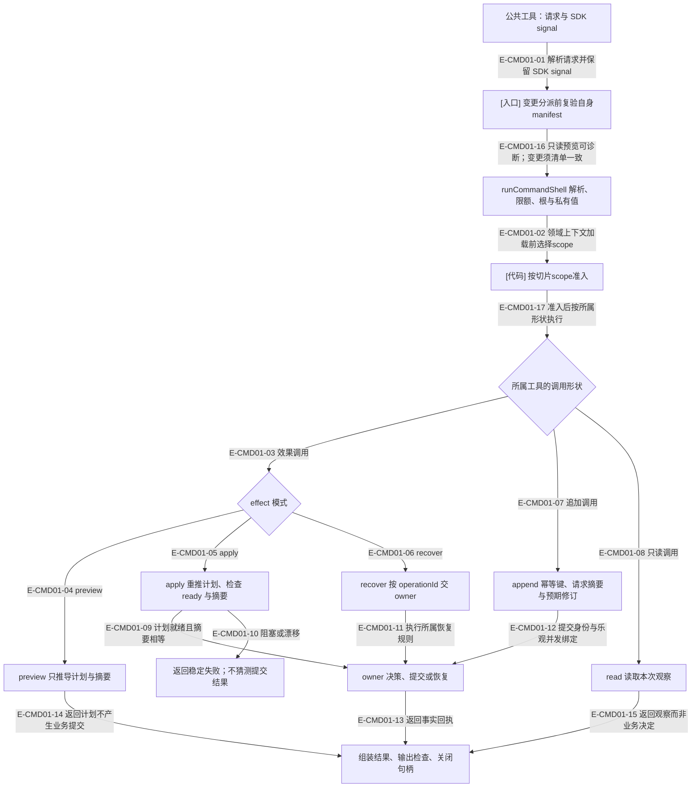

# 一次公共调用：边界、分支与提交点

图中展示调用语义，不表示 effect、append、read 会依次执行。SDK 取消信号由上下文进入执行选项，Agent 无法通过 wire 请求伪造它。当前 SDK取消、制品分派门和工作区作用域均按未提交工作树核验。scope在打开领域上下文前选择；read/preview不取写许可，maintenance把准入交给维护owner。

```mermaid
flowchart TB
  accTitle: 公共调用的三种形状与共同边界
  accDescr: 公共请求先通过共同外壳，效果命令分别预览、重新推导后应用或按操作标识恢复，追加命令使用幂等与预期修订，只读命令生成观察结果。
  request["公共工具：请求与 SDK signal"]
  dispatch["[入口] 变更分派前复验自身manifest"]
  shell["runCommandShell 解析、限额、根与私有值"]
  admission["[代码] 按切片scope准入"]
  shape{"所属工具的调用形状"}
  effect{"effect 模式"}
  preview["preview 只推导计划与摘要"]
  apply["apply 重推计划、检查 ready 与摘要"]
  recover["recover 按 operationId 交 owner"]
  append["append 幂等键、请求摘要与预期修订"]
  owner["owner 决策、提交或恢复"]
  read["read 读取本次观察"]
  result["组装结果、输出检查、关闭句柄"]
  reject["返回稳定失败；不猜测提交结果"]
  request -->|"E-CMD01-01 解析请求并保留 SDK signal"| dispatch
  dispatch -->|"E-CMD01-16 只读预览可诊断；变更须清单一致"| shell
  shell -->|"E-CMD01-02 领域上下文加载前选择scope"| admission
  admission -->|"E-CMD01-17 准入后按所属形状执行"| shape
  shape -->|"E-CMD01-03 效果调用"| effect
  effect -->|"E-CMD01-04 preview"| preview
  effect -->|"E-CMD01-05 apply"| apply
  effect -->|"E-CMD01-06 recover"| recover
  shape -->|"E-CMD01-07 追加调用"| append
  shape -->|"E-CMD01-08 只读调用"| read
  apply -->|"E-CMD01-09 计划就绪且摘要相等"| owner
  apply -->|"E-CMD01-10 阻塞或漂移"| reject
  recover -->|"E-CMD01-11 执行所属恢复规则"| owner
  append -->|"E-CMD01-12 提交身份与乐观并发绑定"| owner
  owner -->|"E-CMD01-13 返回事实回执"| result
  preview -->|"E-CMD01-14 返回计划不产生业务提交"| result
  read -->|"E-CMD01-15 返回观察而非业务决定"| result
```

### 本图术语说明

| 术语 | 含义 |
| --- | --- |
| effect | 可能改变多个资源的工具形状；preview/apply/recover 的具体计划由 owner 决定。 |
| append | 追加事实的命令形状；Demand 的 commitId 由 demandId 与幂等键派生。 |
| 预期修订 | 调用者见到的事件流位置；过期修订不能直接覆盖当前事实。 |
| operationId | 已冻结事务的恢复指针，不是重新授权任意操作的通行证。 |

### 本图边级证据

| 编号 | 代码定位 | 测试 / 核验 | 关系依据 |
| --- | --- | --- | --- |
| E-CMD01-01 | `src/entrypoints/wakeflow-public-mcp-tool.ts#registerWakeflowPublicMcpCatalog` | 间接覆盖：`tests/entrypoints/wakeflow-public-mcp-cancellation.test.ts#createCodexWakeflowMcpServer`（经真实 MCP 取消上下文） | signal 从 SDK 上下文进入 executor。 |
| E-CMD01-02 | `src/kernel/command-shell.ts#runCommandShell` | 间接覆盖：`tests/kernel/command-shell.test.ts#runCommandShell`（仅read型外壳；写作用域包围次序由源码核验） | 打开根后admit，再按scope包住领域上下文加载、body、输出检查与关闭；read/maintenance由各自路径负责。 |
| E-CMD01-03 | `src/kernel/publication-transaction.ts#runPublicationTransaction` | `tests/kernel/publication-transaction.test.ts#runPublicationTransaction` | effect 使用共同 shell。 |
| E-CMD01-04 | `src/kernel/publication-transaction.ts#runPhase` | 间接覆盖：`tests/kernel/publication-transaction.test.ts#runPublicationTransaction`（preview trace 无 apply） | plan 后直接返回预览。 |
| E-CMD01-05 | `src/kernel/publication-transaction.ts#runPhase` | 间接覆盖：`tests/kernel/publication-transaction.test.ts#runPublicationTransaction`（apply trace 重推计划） | 不接受预览对象直接执行。 |
| E-CMD01-06 | `src/kernel/publication-transaction.ts#runPhase` | 间接覆盖：`tests/kernel/publication-transaction.test.ts#runPublicationTransaction`（recover trace） | recover 走单独 owner。 |
| E-CMD01-07 | `src/kernel/append-command.ts#runAppendCommand` | `tests/kernel/append-command.test.ts#runAppendCommand` | 验证幂等键和 expectedStreamRevision。 |
| E-CMD01-08 | `src/kernel/command-shell.ts#runCommandShell` | 未覆盖：此处是只读调用族的聚合路径，零写断言见 observation 与 review 所属测试。 | 只读主体也受结果边界约束。 |
| E-CMD01-09 | `src/kernel/publication-transaction.ts#runPhase` | 间接覆盖：`tests/kernel/publication-transaction.test.ts#runPublicationTransaction`（就绪计划） | 计划、摘要均非空且与请求一致。 |
| E-CMD01-10 | `src/kernel/publication-transaction.ts#runPhase` | 间接覆盖：`tests/kernel/publication-transaction.test.ts#runPublicationTransaction`（plan-blocked / plan-drift） | 两类阻断原因分开。 |
| E-CMD01-11 | `src/kernel/publication-transaction.ts#runPhase` | 间接覆盖：`tests/kernel/publication-transaction.test.ts#runPublicationTransaction`（spec.recover） | 幂等恢复机制由 owner 实现。 |
| E-CMD01-12 | `src/kernel/append-command.ts#runAppendCommand` | `tests/kernel/append-command.test.ts#runAppendCommand` | shell 不替 owner 实现领域转换。 |
| E-CMD01-13 | `src/kernel/command-shell.ts#runCommandShell` | `tests/kernel/command-shell.test.ts#runCommandShell` | 结果检查失败不等于底层没有提交。 |
| E-CMD01-14 | `src/kernel/publication-transaction.ts#runPhase` | 间接覆盖：`tests/kernel/publication-transaction.test.ts#runPublicationTransaction`（预览只有plan） | 调用者仍须审阅具体计划。 |
| E-CMD01-15 | `src/kernel/command-shell.ts#runCommandShell` | 未覆盖：通用外壳不证明具体读取零写；应使用所属能力测试。 | 观察不成为业务权威。 |
| E-CMD01-16 | `src/entrypoints/wakeflow-public-mcp-tool.ts#registerWakeflowPublicMcpCatalog` / `src/entrypoints/wakeflow-artifact-identity.ts#resolveWakeflowArtifactIdentity` | 间接覆盖：`tests/entrypoints/wakeflow-artifact-mutation-guard.test.ts#createWakeflowPublicMcpServer`（preview允许，apply在executor前被拒） | 真实生成入口注入beforeMutation；不是完整加载器证明。 |
| E-CMD01-17 | `src/kernel/command-shell.ts#runCommandShell` / `src/kernel/workspace-operation-scope.ts#withWorkspaceOperationScope` | `tests/kernel/workspace-operation-scope.test.ts#withWorkspaceOperationScope`（只覆盖作用域本身；shell包围上下文的次序由源码核验） | shared/exclusive在上下文读取前进入，领域锁仍保留；维护权限收窄并不统一进入独占scope。 |

## 提交、失败和取消

| 时点 | 实际处理 | 调用者应如何解释 |
| --- | --- | --- |
| 准入、等待或提交前 | owner 观察 signal 并拒绝新增效果 | 可以报告中止；不能推断其他调用也中止。 |
| 事实已经提交 | 具体原语继续结算；部分业务后续仍传signal，可停在回放/日志恢复点 | 按owner规则用相同幂等键或operationId恢复；不能概括为所有提交后步骤都忽略取消。 |
| 输出边界或句柄关闭失败 | 公共结果可能失败 | 失败回包不证明提交未发生。 |
| 同幂等键、相同摘要 | owner 返回既有事实 | 回执重放不是自动再次执行宿主发送的授权。 |
| 同键不同摘要、过期修订 | 明确拒绝 | 重新观察业务状态后决定下一步。 |

`next` 由各工具的真实结果合同决定；不能声称所有读取都具有同一种 next 字段，也不能把建议动作当作已经执行的效果。进一步见[内核](../11-kernel/README.md)及[Demand 事件](../04-governance-event-sourcing/README.md)。

## 两类隐私边界并不相同

`src/kernel/command-shell.ts#runCommandShell` 先用工作区原始根、规范根与 home 建立已知私有值集合，检查去掉 root 和明确豁免字段后的请求；打开领域上下文后再合并 spec.privateValues，返回前检查全部结果 JSON。`src/kernel/redaction.ts#assertPublicJson` 遍历键和值，命中已知字符串则拒绝，既不改写返回文本，也不自动调用凭证分类器。`tests/kernel/redaction.test.ts#assertPublicJson` 验证命中拒绝及错误路径不回显私有键。

`src/kernel/privacy-scan.ts#scanPrivacyText` 是另一条内容扫描链，由需求、报告、证据等真实消费者显式调用，处理凭证、路径、UUID 与终端装饰。公开结果通过已知值检查，不代表其任意未知凭证已被扫描；内容扫描失败也不能倒推出所有公共工具都有同一策略。详见[扫描器与公共边界分责](../11-kernel/privacy-boundary.md)及[需求的独立披露判定](../13-requirement/privacy-preview.md)。

[共享/独占与维护保留门](../11-kernel/workspace-operation-scope.md) · [自身制品清单门](../17-artifacts-and-contracts/installation-and-runtime-identity.md)。
