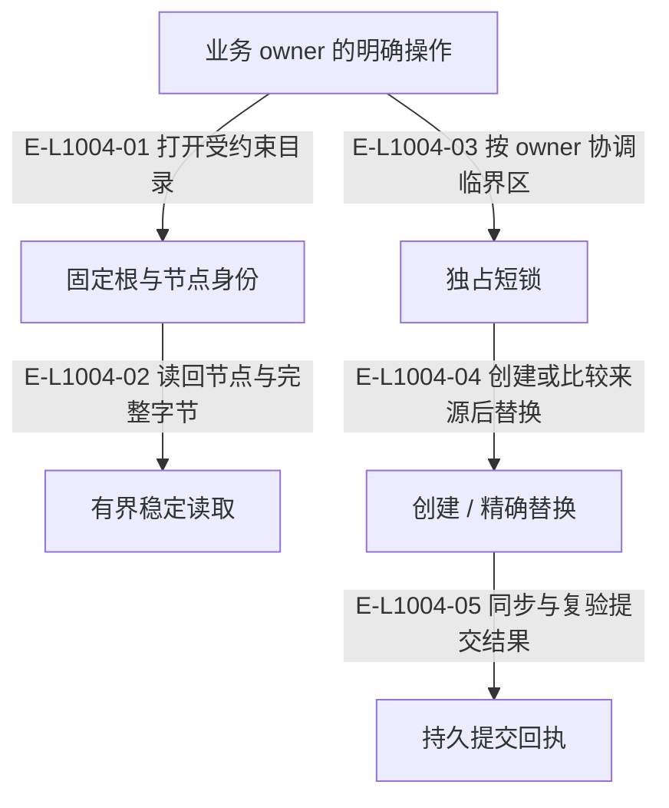

# Foundation：持久性与根约束

基础层只解释字节、路径、节点和持久提交，不决定需求、验收或恢复授权。

> 核验基线：`1480271`（L1 observation 第十片已落地，20 个公共工具、18 个一次性场景）。工作树另有并行未提交改动（宿主 hook 通道等），本图不描绘；来源指纹按当前工作树计算。本文说明实现事实，未宣称双宿主真实会话已经验证。

## 基础原语与业务 owner 的边界

### 本图术语说明

| 术语 | 本图含义 |
| --- | --- |
| CAS | 比较已观察的摘要/修订后提交；来源已改变则拒绝。 |
| commit | 一次不可变事件提交批；文件槽位以预期修订防止并发覆盖。 |

### 节点与实现定位

| 节点 | 文件 / 符号 | 责任 |
| --- | --- | --- |
| owner | `src/capabilities/demand/archive.ts#sealDemandArchive` | 业务 owner 的明确操作 |
| root | `src/foundation/filesystem/rooted-directory.ts#RootedDirectory` | 固定根与节点身份 |
| read | `src/foundation/filesystem/stable-file-read.ts` | 有界稳定读取 |
| write | `src/foundation/filesystem/durable-atomic-file-write.ts` | 创建 / 精确替换 |
| lock | `src/foundation/filesystem/rooted-exclusive-file-lock.ts` | 独占短锁 |
| receipt | `src/foundation/filesystem/durable-atomic-file-write.ts` | 持久提交回执 |

### 本图边级证据

| 编号 | 代码定位 | 测试 / 核验 | 关系依据 |
| --- | --- | --- | --- |
| E-L1004-01 | `src/capabilities/demand/archive.ts#readDemandRootSnapshot` | `tests/capabilities/demand/service.test.ts` | 打开受约束目录 |
| E-L1004-02 | `src/foundation/filesystem/stable-file-read.ts` | `tests/foundation/filesystem/durable-atomic-file-write.test.ts` | 读回节点与完整字节 |
| E-L1004-03 | `src/kernel/requirement-board.ts` | `tests/capabilities/requirement/service.test.ts` | 按 owner 协调临界区 |
| E-L1004-04 | `src/kernel/requirement-board.ts#replaceRequirementClaimStateFile` | `tests/capabilities/requirement/service.test.ts` | 创建或比较来源后替换 |
| E-L1004-05 | `src/foundation/filesystem/durable-atomic-file-write.ts` | `tests/foundation/filesystem/durable-atomic-file-write.test.ts` | 同步与复验提交结果 |

## 守卫、恢复与验证范围

当前源码仍保留细分原语文件。创建提交用 no-replace link，替换用 rename；显式 durability 选项服务于缓存等调用方，不能据此宣称权威写入无需持久化。

涉及的测试与核验入口：

- `tests/capabilities/demand/service.test.ts`。
- `tests/capabilities/requirement/service.test.ts`。
- `tests/foundation/filesystem/durable-atomic-file-write.test.ts`。

## 下钻与相关视图

- [文件直接导入](./file-dependencies.md)
- [运行调用与恢复](./runtime-call-flow.md)
- [图谱总索引](../README.md)
- [核验与剩余范围](../01-diagram-review-ledger.md)
