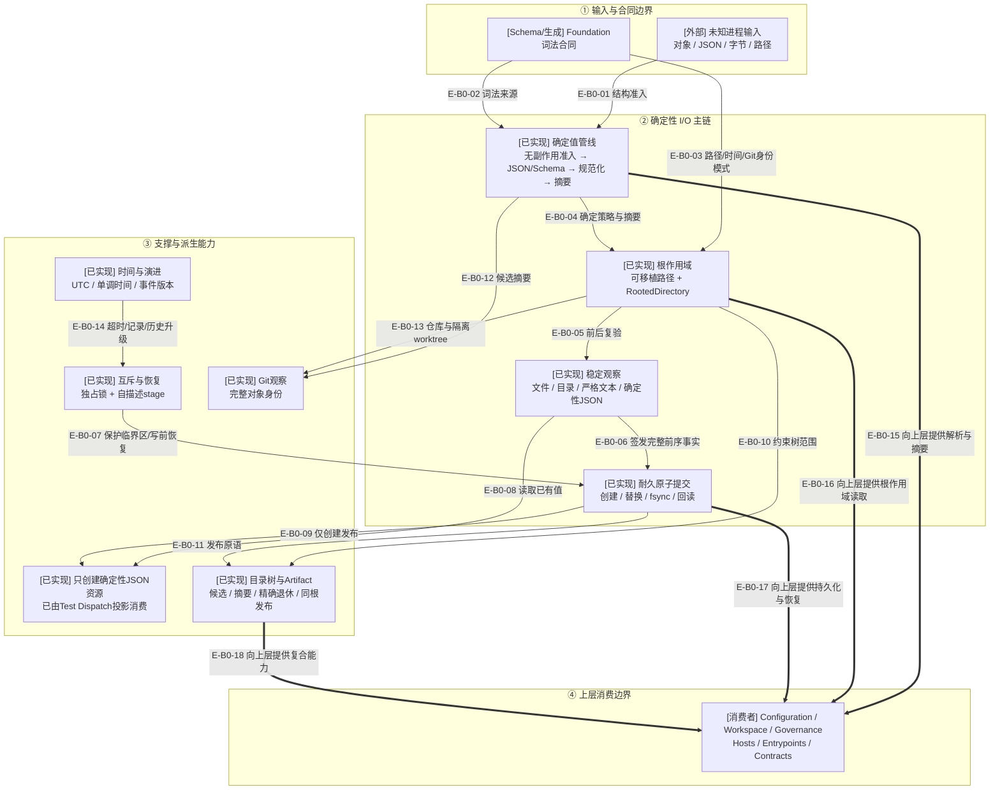

# Foundation：确定性能力与安全边界

> 本文描述提交`d17602e`中的TypeScript Foundation。Foundation 是宿主中立的能力层，不拥有
> Wakeflow 配置、工作区或治理业务状态。
>
> Runtime JSON Schema、`utc-instant`、只创建确定性 JSON 资源和完整 Git object ID均已进入提交基线；
> 当前工作树进一步增加封闭directory candidate的精确、可续接退休能力；Managed Evidence仍只是未来consumer。

## 当前结论

Foundation 把任意进程内输入逐步收窄为确定值，并把文件系统效果封装在根作用域、稳定观察、
原子提交、耐久同步和恢复边界内。上层配置、工作区、治理、宿主与公共入口复用这些能力，但
Foundation 不反向依赖任何产品领域。

当前 `src/foundation/` 有 63 个生产模块；聚焦 dependency-cruiser 闭包包含 68 个模块、301 条依赖、
0 条规则违规。文件系统占 36 个模块，是该层最大且最具状态/恢复语义的能力簇。

## 核验快照

| 项目 | 读取值 |
| --- | --- |
| 分支/提交 | `main`；`d17602ed9931a1898f713c740752c54b94bd8086` |
| 工作树 | Loaded Artifact runtime export及directory candidate精确退休待提交 |
| 生产源码 | 63 个 `.ts` 模块 |
| Foundation 测试 | 57 个 `*.test.ts`；另有 2 个测试支持文件 |
| Foundation 合同 | 6 个 JSON Schema、6 个生成 TypeScript 合同 |
| 依赖扫描 | 68 个闭包模块、301 条依赖、0 违规；SWC 解析器 |
| 来源指纹 | `6d67a06cfe0baa9cea6c8e4816b029ed8a5f7846d04475569fc9f704528c44f8` |

## B0：Foundation 能力全景

### 本图术语说明

| 图中术语 | 解释 |
| --- | --- |
| 无副作用自有数据读取 | 通过 Proxy 检测、原型和属性描述符读取数据，不触发 getter、`toJSON` 或调用方代码 |
| 递归 JSON 值准入 | 把未知值转换为无源引用、递归冻结的 JSON 树，并拒绝循环、代理、隐藏字段和非法数值 |
| RFC 8785 | JSON Canonicalization Scheme；为相同 JSON 值生成稳定字节表示 |
| 可移植资源路径 | 只表达根目录内逻辑位置的 NFC 相对路径；不包含物理绝对根 |
| `RootedDirectory` | 持有真实目录句柄、规范路径和初始节点快照的一次操作范围能力 |
| 稳定读取 | 打开前后复验根、路径和节点，并对内容施加容量、节点类型、摘要与取消边界 |
| stage | 原子提交前的自描述暂存文件；提交或崩溃后必须可被有界恢复识别 |
| Loaded Artifact Tree | 已闭合、可摘要、可同根发布的一棵制品候选目录树 |
| candidate tree退休 | 逐文件精确unlink并按最深目录优先rmdir；恢复只允许原计划的安全子集 |
| 单调时间 | 只用于持续时间和截止点，不与 UTC 墙上时间混用 |
| 事件版本演进 | 按相邻版本逐步 upcast 持久事件数据，再由当前 codec 重新准入 |

## B0边级证据

| 边编号 | 代码证据 | 核验结论 |
| --- | --- | --- |
| `E-B0-01`–`E-B0-06` | Data/Crypto、RootedDirectory、稳定读取与原子写入模块 | 未知输入按无副作用准入、根作用域、稳定观察和完整前序事实逐层收窄 |
| `E-B0-07`–`E-B0-14` | 锁/stage恢复、create-only、目录树、Artifact、Git与时间模块 | 恢复和派生能力只组合Foundation原语，不取得领域状态权威 |
| `E-B0-15`–`E-B0-18` | 全仓直接import扫描 | Configuration、Workspace、Governance、Hosts、Entrypoints与Contracts单向消费Foundation |

## 能力模块分布

| 能力簇 | 生产模块数 | 主要职责 |
| --- | ---: | --- |
| `filesystem` | 36 | 根作用域、稳定读取、原子写入、锁、目录树候选、精确退休与发布 |
| `time` | 5 | UTC 时刻、墙上时钟、单调时钟、时长和截止点 |
| `artifact` | 4 | Loaded Artifact Tree身份、候选、计划和发布 |
| `data` | 4 | 无副作用数据、JSON值、规范JSON和确定性JSON文档 |
| `crypto` | 3 | SHA-256类型、流式hasher和规范JSON摘要 |
| `git` | 3 | 当前/候选 `.gitignore` 观察与完整 object ID |
| 其他 8 个能力簇 | 8 | UTF-8、字节数、UUID、Node错误、Schema、资源处理与事件版本演进 |

## 直接消费者

聚焦扫描把 Foundation 与一层直接邻居一起读取；以下数量是直接导入 Foundation 的生产模块数，
不是业务调用次数。

| 消费层 | 直接消费者模块数 | 典型用途 |
| --- | ---: | --- |
| Governance | 173 | 事件存储、投影、任务包、Delivery/Review/Testing、完成与Managed Evidence骨干 |
| Workspace | 78 | 维护事务、活动投影、窗口绑定、资源布局与静态物化 |
| Configuration | 9 | v3配置读取、替换、锁、恢复和选择 |
| Hosts | 7 | Claude Code可移植设置与两宿主维护执行能力 |
| Entrypoints | 1 | 公共MCP结果的规范JSON表示 |
| Contracts | 1 | 应用级身份合同复用Foundation解析能力 |

## 状态、恢复与失败关闭

- `RootedDirectory` 在打开、操作中和关闭前复验物理节点身份；根被替换、别名化或关闭后稳定失败。
- 稳定读取不信任 `Dirent`、路径名或一次 `stat`；文件和目录都在读取前后复验。
- 原子文件创建使用硬链接提交，替换使用重命名提交；成功前同步文件与父目录。
- 自描述 stage 在写前和显式恢复时被扫描；未知或仍活动的 stage 不会被猜测删除。
- `withRootedExclusiveFileLock` 只保护短生命周期临界区；锁记录不是业务权威，也不是跨宿主租约。
- 目录树与 Loaded Artifact Tree 只在同一文件系统发布；跨设备移动明确失败。
- directory candidate退休拒绝recursive删除；首次只接受完整candidate，journal恢复只续接原计划的安全子集。
- 所有公共 Foundation 错误都暴露稳定 `code/reason/path`，不回显物理路径、令牌或底层异常。

## 架构边界

- Foundation 只能依赖更低 Foundation、Foundation 生成合同、Node 内建模块和声明的生产依赖。
- Foundation 不得导入 Configuration、Workspace、Governance、Hosts 或 Entrypoints。
- 上层宿主中立领域不得直接使用 `node:fs`；文件系统效果必须经过 Foundation。
- 物理绝对路径和打开句柄只在进程内存在，不进入可移植记录、MCP结果或领域事件。
- Foundation 提供机制，不决定业务资源所有权、状态转换、Controller权限或用户流程。

## 当前边界

- `runtime-json-schema.ts`安全支持无原型JSON对象的`uniqueItems`比较；
- `utc-instant.ts`只在明确的UTC解析/比较边界使用，不拥有跨authority因果排序；
- `create-only-deterministic-json-resource.ts`已由Test Dispatch等真实consumer使用；
- Loaded Artifact tree identity已由进行中的Managed Evidence Manifest复用；transfer candidate/publication仍无生产consumer；
- directory candidate retirement已实现并验证，但尚无生产consumer；Event前/Event后调用权仍属于未来Evidence事务owner；
- `git-object-id.ts`闭合完整SHA-1/SHA-256身份，不接受缩写。

Foundation继续只提供机制；任何领域owner、资源family或业务事务必须留在上层。

## 验证证据

| 证据 | 当前结果 | 能证明什么 |
| --- | --- | --- |
| Foundation dependency-cruiser | 68 模块、301 依赖、0 违规 | 当前读取范围没有循环、未解析依赖或跨层反向依赖 |
| Foundation测试清单 | 57 个正式测试文件 | 新退休能力7项及相邻Foundation 19项通过；不等于本轮已重新执行全部测试 |
| Schema/生成合同 | 6/6 | Artifact manifest新增冻结runtime Schema常量，词法和物理语义不变 |
| 来源指纹 | 128 个源码/Schema/测试文件 | 本文绑定当前 Foundation 文件内容快照 |

## 下钻入口

- [Foundation关键文件依赖](./file-dependencies.md)
- [Foundation稳定读取、原子写入与恢复调用流](./runtime-call-flow.md)
- [返回总体架构](../01-overall-architecture/README.md)
