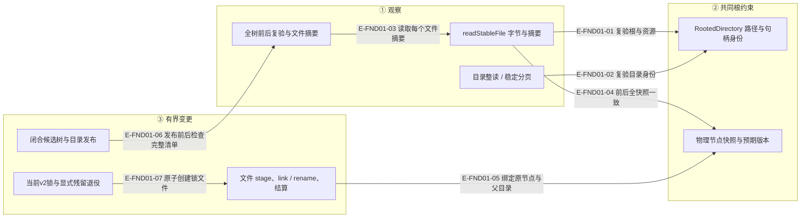

# Foundation：每种保证由谁提供

当前累计覆盖65个Foundation文件。这里提供数据准入、物理观察与有界变更，不拥有需求、投递、验收或恢复决策。本轮重新核对读写准入中的观察竞态与许可交接清理；其他已核验文件按相同字节继承既有记录，不能把继承数量当成本轮重新逐行审阅数量。

```mermaid
flowchart LR
  accTitle: Foundation 物理保证的组合边界
  accDescr: 稳定读取、精确文件变更、目录树发布和锁是四种不同的能力，它们共同复用根与节点身份检查，而业务owner保留计划和恢复责任。
  subgraph observe["① 观察"]
    fileRead["readStableFile 字节与摘要"]
    dirRead["目录整读 / 稳定分页"]
    treeRead["全树前后复验与文件摘要"]
  end
  subgraph scope["② 共同根约束"]
    root["RootedDirectory 路径与句柄身份"]
    exact["物理节点快照与预期版本"]
  end
  subgraph mutate["③ 有界变更"]
    atomic["文件 stage、link / rename、结算"]
    tree["闭合候选树与目录发布"]
    lock["当前v2锁与显式残留退役"]
  end
  fileRead -->|"E-FND01-01 复验根与资源"| root
  dirRead -->|"E-FND01-02 复验目录身份"| root
  treeRead -->|"E-FND01-03 读取每个文件摘要"| fileRead
  fileRead -->|"E-FND01-04 前后全快照一致"| exact
  atomic -->|"E-FND01-05 绑定原节点与父目录"| exact
  tree -->|"E-FND01-06 发布前后检查完整清单"| treeRead
  lock -->|"E-FND01-07 原子创建锁文件"| atomic
```

### 本图术语说明

| 术语 | 含义 |
| --- | --- |
| 根约束 | 规范路径、无符号链接祖先、已打开句柄与路径身份复验；不等于通用 OS 沙箱。 |
| identity / snapshot | 前者是 device+inode；后者还包含类型、模式、链接数、大小、mtime/ctime等物理事实。 |
| stage / candidate | 尚未成为最终事实的受管候选；不同候选有不同 owner 与清理规则。 |
| 结算 | 提交后证明目标、同步必要节点、退役暂存；不自动撤销业务事实。 |

### 本图边级证据

| 编号 | 代码定位 | 测试 / 核验 | 关系依据 |
| --- | --- | --- | --- |
| E-FND01-01 | `src/foundation/filesystem/stable-file-read.ts#readStableFile` | `tests/foundation/filesystem/stable-file-read.test.ts#readStableFile` | 精确字节读取前后观察路径。 |
| E-FND01-02 | `src/foundation/filesystem/stable-directory-read.ts#readStableResourceDirectoryPage` | `tests/foundation/filesystem/stable-directory-read.test.ts#readStableResourceDirectoryPage` | 分页不能把变化后的目录续读成同一观察。 |
| E-FND01-03 | `src/foundation/filesystem/stable-resource-tree-read.ts#readTree` | 未覆盖：此聚合边的直接回归见完整逐文件索引；本页不以相邻文件测试推定全树覆盖。 | 扫描、hash、再扫描分别承担不同观察。 |
| E-FND01-04 | `src/foundation/filesystem/stable-file-read.ts#readStableFileVersion` | 间接覆盖：`tests/foundation/filesystem/stable-file-read.test.ts#readStableFile`（变更和预期节点反例） | 内容摘要不能替代节点快照。 |
| E-FND01-05 | `src/foundation/filesystem/durable-atomic-file-write.ts#performWrite` | 间接覆盖：`tests/foundation/filesystem/durable-atomic-file-write.test.ts#replaceFileAtomically`（过期expectation拒绝） | 替换前重读node、size与digest。 |
| E-FND01-06 | `src/foundation/filesystem/durable-directory-tree-publication.ts#publishDirectoryTreeCandidateDurably` | `tests/foundation/filesystem/durable-directory-tree-publication.test.ts#publishDirectoryTreeCandidateDurably` | 完整候选才可发布，发布后重新检查。 |
| E-FND01-07 | `src/foundation/filesystem/rooted-exclusive-file-lock.ts#tryAcquire` | 间接覆盖：`tests/foundation/filesystem/rooted-exclusive-file-lock.test.ts#withRootedExclusiveFileLock`（竞争临界区） | 获取与死锁退役是不同入口。 |

## 不可混用的合同

| 问题 | 代码保证 | 仍由调用者/owner负责 |
| --- | --- | --- |
| JSON摘要 | `canonical-json` 使用 JCS，再编码 UTF-8 | 业务语义、领域分隔和摘要用途 |
| JSON落盘 | `deterministic-json-document` 两空格、末尾LF、精确重渲染 | 不是 JCS 排序；对象构造顺序仍有意义 |
| 路径 | portable path、根身份、no-follow与前后复验 | 拥有该资源的业务权限、锁和预算 |
| 文件新建 | stage后硬链接发布，目标已存在不会覆盖 | 同内容幂等语义与事件身份 |
| 文件替换 | 原节点与字节摘要复验后rename | 跨调用领域并发协调；不是任意外部writer间的事务 |
| 目录树 | 清单闭合、大小写冲突、权限、hash和单设备发布 | 已发布/未发布的业务判断与恢复入口 |
| 锁 | v2记录结合出生摘要、registry、token，有界等待与精确释放 | 业务恢复准入与相关暂存目标集合；不按TTL夺锁 |
| 读写准入 | 短latch登记，多reader并发，writer关闭新准入后排空旧reader | beforeEnter业务保留门；操作作用域不是全局业务事务 |
| 时间 | UTC可持久化；monotonic仅用于进程内时长 | 墙上时钟回拨、跨进程顺序与租约政策 |

## 容量与恢复限制

稳定目录分页每次只保留一页加一个前瞻，但仍扫描目录；它降低内存，不等于数据库游标或持久快照。连续页要传首轮 directoryNode，发生变化应重建观察。

扫描器记录特殊叶而不跟随 symlink；拒绝特殊节点由候选清单与artifact manifest等消费者落实。不要把“能够观察”画成“允许发布”。

[文件导入](./file-dependencies.md) · [稳定读取](./runtime-call-flow.md) · [文件写入与恢复](./file-publication-and-recovery.md) · [目录树与加载树](./tree-publication-and-recovery.md) · [全部逐文件结论](../02-file-review-index.md)。

下钻：[读写准入与锁实例身份](./read-write-admission.md) · [观察竞态、许可交接与失败清理](./admission-races-and-recovery.md)。未知配置/锁格式拒绝，当前基线不迁移旧数据；正常同格式恢复保持。

当前 `withRootedReadWriteScope` 在取得 reader/writer 许可时立即把所有权交给外层 lease，早于短 latch 的结算；因此 latch.release 失败后仍会尝试精确释放已取得的业务许可。reader 正常释放导致 residue-changed 时按仍占用重观测，不能当作缺席直接进入。未知同名替换者保持原字节并要求恢复；cleanup 自身失败可能覆盖先前错误，不能概括为“finally 保证目录清空或总保留首错”。对应回归在 `tests/foundation/filesystem/rooted-read-write-scope.test.ts#withRootedReadWriteScope` 覆盖三种结算时机与未知替换者。
