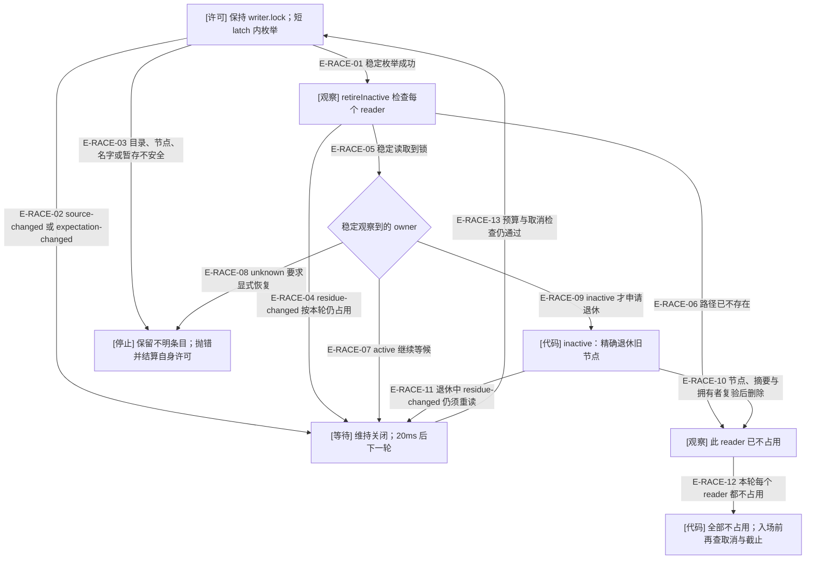
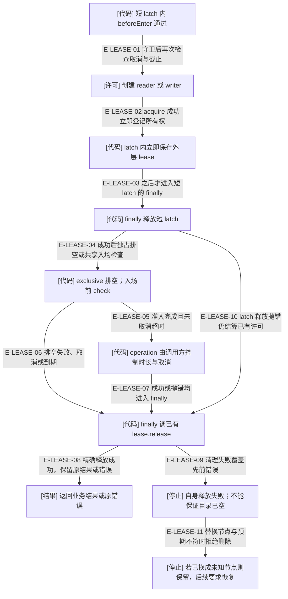

# 准入竞争与失败结算：重读事实，不猜测失活

rc.4 修复了一个正常竞争窗口：reader 可以不持 latch 释放自己的文件，writer 恰好正在稳定读取该文件时会收到 `residue-changed`。这个错误现在只意味着“本轮仍按占用处理”，writer 保持关闭新准入并重新观察；它不授权删除，也不把未知替换者视为已退出。

## 已持 writer 的排空循环怎样处理变化

### 本图术语说明

| 术语 | 本图含义 |
| --- | --- |
| reader / writer | 准入许可名称；上层 shared 业务写者持 reader，不能理解为只读工具。 |
| residue-changed | 锁的稳定读取或精确退休不能闭合当前观察；仅延后准入，不保证是正常释放。 |
| inactive | 由进程实例或当前模块活动令牌证明旧拥有者已失活；不由文件年龄或等待时长推断。 |
| 自身许可 | 只释放当前调用已经接收的 writer；不能删除另一 reader 或未知替换者。 |

### 本图边级证据

| 编号 | 代码证据 | 测试证据 | 断言范围与边界 |
| --- | --- | --- | --- |
| E-RACE-01 | `src/foundation/filesystem/rooted-read-write-scope.ts#entriesOf` | `tests/foundation/filesystem/rooted-read-write-scope.test.ts#withRootedReadWriteScope` | 实际 reader 文件和 writer 排空回归；1024 项上限未单独触发。 |
| E-RACE-02 | `src/foundation/filesystem/rooted-read-write-scope.ts#transientListing` | 间接覆盖：`tests/foundation/filesystem/rooted-read-write-scope.test.ts#withRootedReadWriteScope` 的并发排空；未强制两种目录错误各自出现。 | 只重试列出的两种 StableDirectoryReadError，其他枚举错误向外抛出。 |
| E-RACE-03 | `src/foundation/filesystem/rooted-read-write-scope.ts#entriesOf` | `tests/foundation/filesystem/rooted-read-write-scope.test.ts#RootedReadWriteScopeError` | 未知文件保持原字节；stage owner 与权限各组合未由此用例覆盖。 |
| E-RACE-04 | `src/foundation/filesystem/rooted-read-write-scope.ts#retireInactive` | `tests/foundation/filesystem/rooted-read-write-scope.test.ts#withRootedReadWriteScope` | 新回归在 inspectExistingResource 返回快照后真实释放 reader，强制读取交错并确认 writer 最终进入。 |
| E-RACE-05 | `src/foundation/filesystem/rooted-exclusive-file-lock.ts#inspectRootedExclusiveFileLock` | `tests/foundation/filesystem/rooted-exclusive-file-lock.test.ts#inspectRootedExclusiveFileLock` | 锁读取、严格 v2 与 active/inactive/unknown 观察；完整 owner 分支见上一页。 |
| E-RACE-06 | `src/foundation/filesystem/rooted-read-write-scope.ts#retireInactive` | 间接覆盖：`tests/foundation/filesystem/rooted-read-write-scope.test.ts#withRootedReadWriteScope` 的正常释放后重观测。 | 已不存在才返回 false，不把 residue-changed 当不存在。 |
| E-RACE-07 | `src/foundation/filesystem/rooted-read-write-scope.ts#retireInactive` | `tests/foundation/filesystem/rooted-read-write-scope.test.ts#withRootedReadWriteScope` | 等待 writer 存在时，旧 reader 未退出就不能进入。 |
| E-RACE-08 | `src/foundation/filesystem/rooted-read-write-scope.ts#retireInactive` | `tests/foundation/filesystem/rooted-read-write-scope.test.ts#RootedReadWriteScopeError` | 新回归把释放后的同名 reader 替换为未知 registry 记录；writer 不进入、替换字节完整保留。 |
| E-RACE-09 | `src/foundation/filesystem/rooted-read-write-scope.ts#retireInactive` | `tests/foundation/filesystem/rooted-read-write-scope.test.ts#withRootedReadWriteScope` | 真实 reader 子进程被杀后才退休并进入独占操作；不以等待时间作死亡证据。 |
| E-RACE-10 | `src/foundation/filesystem/rooted-exclusive-file-lock.ts#retireRootedExclusiveFileLockResidue` | `tests/foundation/filesystem/rooted-exclusive-file-lock.test.ts#retireRootedExclusiveFileLockResidue` | inactive 精确退休及相关目标范围；该测试未注入最后删除前的节点替换。 |
| E-RACE-11 | `src/foundation/filesystem/rooted-read-write-scope.ts#retireInactive` | 未覆盖：新增回归强制的是 inspect 期间释放，没有单独强制 inactive 退休期间发生替换；按同一 catch 核验。 | 捕获范围包括 inspect 与 retire 两步，均不能忽略安全失败。 |
| E-RACE-12 | `src/foundation/filesystem/rooted-read-write-scope.ts#withRootedReadWriteScope` | `tests/foundation/filesystem/rooted-read-write-scope.test.ts#withRootedReadWriteScope` | active 按逻辑或累计；必须整轮无 active/变化观察。 |
| E-RACE-13 | `src/foundation/filesystem/rooted-read-write-scope.ts#withRootedReadWriteScope` | `tests/foundation/filesystem/rooted-read-write-scope.test.ts#RootedReadWriteScopeError` | 已覆盖等待取消；排空期间独立 timeout 断言尚缺。 |

图中省略了每一轮 latch 自身的取得和释放，以及 timeout/aborted 的错误出口；它们与首次登记共享同一个获取截止时间。`retireInactive` 的变化处理同样用于 latch、writer，针对这两类锁的强制竞态尚无新专门回归。

## 许可取得即登记，latch 失败仍结算已有许可

### 本图术语说明

| 术语 | 本图含义 |
| --- | --- |
| beforeEnter | 仍在 latch 内、业务许可创建之前的上层保留门；守卫拒绝不会授予 reader/writer。 |
| lease 接收 | 当前实现 acquire 成功即在 latch body 内执行 `lease = acquired`；无需等 latched 整体返回，外层 finally 已可找到许可。 |
| 获取预算 | 默认 30 秒、允许 1–300000 毫秒；覆盖取得 latch、登记、排空及入场前检查，不给 operation 安装截止定时器。 |
| CF-01 | 本轮发现并由开发线程修复的异常交接缺口；前态证据保留，下方后态探针单独验证当前结算。 |

### 本图边级证据

| 编号 | 代码证据 | 测试证据 | 断言范围与边界 |
| --- | --- | --- | --- |
| E-LEASE-01 | `src/foundation/filesystem/rooted-read-write-scope.ts#withRootedReadWriteScope` | 间接覆盖：`tests/kernel/workspace-operation-scope.test.ts#withWorkspaceOperationScope`，维护事务残留拒绝新 shared/exclusive 且目录无许可。 | beforeEnter 在许可创建前，后续 check 再判取消和 deadline。 |
| E-LEASE-02 | `src/foundation/filesystem/rooted-read-write-scope.ts#withRootedReadWriteScope` | `tests/foundation/filesystem/rooted-read-write-scope.test.ts#withRootedReadWriteScope` | 新回归在 shared/exclusive 首次 latch 结算失败时仍清空许可，并在同一进程重入两种模式。 |
| E-LEASE-03 | `src/foundation/filesystem/rooted-read-write-scope.ts#withRootedReadWriteScope` | 间接覆盖：`tests/foundation/filesystem/rooted-read-write-scope.test.ts#withRootedReadWriteScope` 的定点 latch sync 故障。 | 程序赋值发生在 latch finally 之前；不再依赖外层 await 正常返回。 |
| E-LEASE-04 | `src/foundation/filesystem/rooted-read-write-scope.ts#withRootedReadWriteScope` | `tests/foundation/filesystem/rooted-read-write-scope.test.ts#withRootedReadWriteScope` | writer 关闭后到 reader，并等待现有 reader。 |
| E-LEASE-05 | `src/foundation/filesystem/rooted-read-write-scope.ts#withRootedReadWriteScope` | 未覆盖：源码明确只在 operation 前 check；现有测试没有让 operation 超过获取预算的独立断言。 | beforeEnter 本身也不被硬中断；返回后才检查 deadline。 |
| E-LEASE-06 | `src/foundation/filesystem/rooted-read-write-scope.ts#withRootedReadWriteScope` | 间接覆盖：`tests/foundation/filesystem/rooted-read-write-scope.test.ts#RootedReadWriteScopeError` 的 unknown replacement 拒绝；未独立断言排空取消/超时后仅保留旧 reader。 | 仅已由外层接收的 lease 进入最终释放。 |
| E-LEASE-07 | `src/foundation/filesystem/rooted-read-write-scope.ts#withRootedReadWriteScope` | `tests/foundation/filesystem/rooted-read-write-scope.test.ts#withRootedReadWriteScope` | body-failed 后许可目录为空；回调中响应取消仍由调用方实现。 |
| E-LEASE-08 | `src/foundation/filesystem/rooted-exclusive-file-lock.ts#acquireRootedExclusiveFileLock` | 间接覆盖：`tests/foundation/filesystem/rooted-exclusive-file-lock.test.ts#withRootedExclusiveFileLock`，回调失败仍移除精确锁。 | release 共享同一 Promise；结算 finally 才退役内存 token。 |
| E-LEASE-09 | `src/foundation/filesystem/rooted-exclusive-file-lock.ts#release` | `tests/foundation/filesystem/rooted-read-write-scope.test.ts#RootedExclusiveFileLockError` 覆盖未知替换导致 cleanup 失败；未区分首错与后错的 path，具体优先级由下方后态探针确认。 | 外层 finally 的清理错误可覆盖原 latch/业务错误；没有复合错误保存首错。删除后错误不证明路径仍存在。 |
| E-LEASE-10 | `src/foundation/filesystem/rooted-read-write-scope.ts#withRootedReadWriteScope` | `tests/foundation/filesystem/rooted-read-write-scope.test.ts#withRootedReadWriteScope` | 新回归覆盖 shared 首次、exclusive 首次及排空时第二次 latch 结算失败，业务不进入，许可清空。 |
| E-LEASE-11 | `src/foundation/filesystem/rooted-exclusive-file-lock.ts#release` | `tests/foundation/filesystem/rooted-read-write-scope.test.ts#withRootedReadWriteScope` | shared/exclusive 均在 latch 失败前换入未知同名记录；清理不能误删，后续 exclusive 要求 recovery-required。 |

CF-01 的[历史复现脚本](../../plans/review-2026-10-03-rc4/concurrency-release-probe.mjs)和[修复前结果](../../plans/review-2026-10-03-rc4/concurrency-release-probe-before-fix.json)保持原样，证明旧路径在 latch 删除后同步失败时遗留 active writer。当前代码已在取得许可的同一回调内登记所有权，图中不再把旧缺口画成当前行为。

独立[修复后探针](../../plans/review-2026-10-03-rc4/concurrency-release-post-fix-probe.mjs)运行了 5 个一次性文件系统场景，完整[后态结果](../../plans/review-2026-10-03-rc4/concurrency-release-probe-after-fix.json)单独保存：shared/exclusive 初次及 exclusive 排空时的 latch 失败都清空许可、拒绝进入业务且同进程可重入；两种模式的未知替换者均保留原字节，后续独占要求恢复。清理成功时原 latch `durability-failure` 保留；清理也失败时最终返回 `source-changed`，原 latch 错误被覆盖。这是当前明确的错误优先级，不能声称双失败保留了首错。

正常最终释放不传本次调用的 signal，避免仅因已取消而跳过精确结算；但它没有独立超时器，也不承诺 I/O 失败后文件必然消失。作用域释放不撤销业务 owner 已发布的事实；maintenance intent/journal 仍可继续预留工作区。

[读写准入总览](./read-write-admission.md) · [工作区作用域](../11-kernel/workspace-operation-scope.md) · [维护预留与配置](../03-configuration-workspace/operation-scope-and-config-baseline.md) · [本轮并发审阅](../../plans/review-2026-10-03-rc4/concurrency-review.md)
