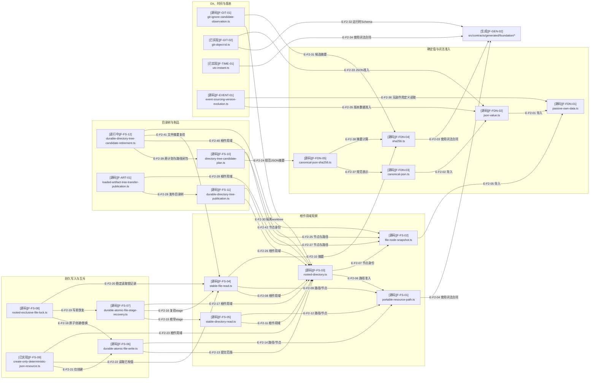

# Foundation：关键文件导入依赖

> 本图从 63 个 Foundation 生产模块中选出 22 个审阅骨干文件。交互阅读页默认展示入口概览，
> 可切换 ELK 全图、搜索文件、筛选关系并聚焦 1-hop/上游/下游。
>
> 箭头只证明静态导入；真实操作顺序见[关键调用流](./runtime-call-flow.md)。

## F2：Foundation关键文件依赖图

### 本图术语说明

| 图中术语 | 解释 |
| --- | --- |
| 词法准入 | 只确认字符串或结构外形满足 Schema 与附加 Unicode/范围规则，不拥有业务关系 |
| 节点身份 | 设备号、inode、类型、大小和时间等冻结文件节点观察，用于前后复验 |
| stage | 名称中携带操作、目标和摘要的原子写入暂存文件 |
| 仅创建 | 目标不存在时创建；目标已存在时只接受完全相同的确定值，永不替换 |
| 目录树候选 | 已按确定性计划检查、尚未发布到最终位置的完整树 |
| 隔离 worktree | 为候选 `.gitignore` 临时建立、操作结束后精确删除的未注册工作树 |
| 运行时 Schema | 由 JSON Schema 生成并在进程内用于结构准入的冻结常量 |
| 上游/下游 | 在导入图中，上游是导入当前文件的模块，下游是当前文件导入的模块 |

## 文件与符号映射

| 文件编号 | 相对路径 | 代表符号 | 状态 | 职责 |
| --- | --- | --- | --- | --- |
| `F-FDN-01` | `src/foundation/data/passive-own-data.ts` | `parsePlainRecord`、`parseDenseArray` | 已实现 | 不触发调用方行为地读取自有数据属性 |
| `F-FDN-02` | `src/foundation/data/json-value.ts` | `parseJsonValue` | 已实现 | 创建递归冻结、无源引用的 JSON 数据树 |
| `F-FDN-03` | `src/foundation/data/canonical-json.ts` | `canonicalizeJson` | 已实现 | 生成 RFC 8785 规范 JSON 与 UTF-8 字节 |
| `F-FDN-04` | `src/foundation/crypto/sha256.ts` | `parseSha256Digest`、`computeSha256Digest` | 已实现 | 完整 SHA-256 摘要词法与计算 |
| `F-FDN-05` | `src/foundation/crypto/canonical-json-sha256.ts` | `computeCanonicalJsonSha256Digest` | 已实现 | 组合规范 JSON 与 SHA-256 形成语义摘要 |
| `F-FS-01` | `src/foundation/filesystem/portable-resource-path.ts` | `parsePortableResourcePath` | 已实现 | 根目录内可移植 NFC 相对路径 |
| `F-FS-02` | `src/foundation/filesystem/file-node-snapshot.ts` | `createFileNodeSnapshot`、`sameFileNodeSnapshot` | 已实现 | 文件节点身份与完整快照比较 |
| `F-FS-03` | `src/foundation/filesystem/rooted-directory.ts` | `RootedDirectory` | 已实现 | 打开、复验并关闭一次操作范围的真实目录根 |
| `F-FS-04` | `src/foundation/filesystem/stable-file-read.ts` | `readStableFile` | 已实现 | O_NOFOLLOW、有界精确读取、摘要和前后复验 |
| `F-FS-05` | `src/foundation/filesystem/stable-directory-read.ts` | `readStableRootDirectory`、`readStableResourceDirectory` | 已实现 | 两次枚举/`lstat`并确定排序的一层目录观察 |
| `F-FS-06` | `src/foundation/filesystem/durable-atomic-file-write.ts` | `createFileAtomically`、`replaceFileAtomically` | 已实现 | 单文件硬链接/重命名提交与耐久同步 |
| `F-FS-07` | `src/foundation/filesystem/durable-atomic-file-stage-recovery.ts` | `recoverDurableAtomicFileStages*` | 已实现 | 有界扫描并退休安全、非活动的自描述 stage |
| `F-FS-08` | `src/foundation/filesystem/rooted-exclusive-file-lock.ts` | `withRootedExclusiveFileLock` | 已实现 | 有超时、token和残留恢复的短生命周期独占锁 |
| `F-FS-09` | `src/foundation/filesystem/create-only-deterministic-json-resource.ts` | `materializeCreateOnlyDeterministicJsonResource` | 已实现 | 固定权限目录内的幂等只创建 JSON 物化 |
| `F-FS-10` | `src/foundation/filesystem/directory-tree-candidate-plan.ts` | `planDirectoryTreeCandidate`、`parseDirectoryTreeCandidatePlan` | 已实现 | 规范化并摘要目录树候选计划 |
| `F-FS-11` | `src/foundation/filesystem/durable-directory-tree-publication.ts` | `publishDirectoryTreeCandidateDurably` | 已实现 | 同根、同设备的目录树重命名发布 |
| `F-FS-12` | `src/foundation/filesystem/durable-directory-tree-candidate-retirement.ts` | `retire/settleDirectoryTreeCandidate*` | 进行中 | 完整candidate首次退休与原计划安全子集恢复；拒绝recursive删除 |
| `F-ART-01` | `src/foundation/artifact/loaded-artifact-tree-transfer-publication.ts` | `publishLoadedArtifactTreeTransferCandidate` | 已实现 | 幂等读取或发布已闭合 Loaded Artifact Tree |
| `F-GIT-01` | `src/foundation/git/git-ignore-candidate-observation.ts` | `observeGitIgnoreCandidate` | 已实现 | 在隔离临时 worktree 中观察候选忽略语义 |
| `F-GIT-02` | `src/foundation/git/git-object-id.ts` | `parseGitObjectId` | 已实现 | 解析带算法标签的完整 Git 对象身份 |
| `F-TIME-01` | `src/foundation/time/utc-instant.ts` | `parseUtcInstant`、`compareUtcInstants` | 已实现 | 严格 UTC 文本、公历复验和纳秒时间线 |
| `F-EVENT-01` | `src/foundation/event-sourcing/event-sourcing-version-evolution.ts` | `EventSourcingVersionEvolutionRegistry` | 已实现 | 相邻版本 codec/upcast 注册与演进 |
| `F-GEN-02` | `src/contracts/generated/foundation/*` | `*_SCHEMA`、生成类型 | 混合 | 6 个 Foundation 词法/结构合同，其中 Git object ID 正在变化 |

## 原始依赖快照

| 范围 | 模块数 | 依赖数 | 违规 |
| --- | ---: | ---: | ---: |
| `src/foundation/**`闭包 | 68 | 301 | 0 |
| Foundation生产源码 | 63 | — | 0 |

最密集的内部依赖簇是 `filesystem → filesystem`（152 条）；其次是
`filesystem → data`（27 条）、`artifact → filesystem`（17 条）、
`filesystem → node`（17 条）和`filesystem → crypto`（14 条）。

## 边级证据

| 边编号 | 起点 | 终点 | 代码证据 | 测试证据 |
| --- | --- | --- | --- | --- |
| `E-F2-01`–`E-F2-03` | 数据/摘要 | 被依赖的准入与生成合同 | 文件顶部静态 imports | `tests/foundation/{data,crypto}/**` |
| `E-F2-04`–`E-F2-12` | 路径、根与稳定读取 | 生成模式、节点、摘要和根作用域 | dependency-cruiser直接边 | `tests/foundation/filesystem/{portable-resource-path,rooted-directory,stable-*}.test.ts` |
| `E-F2-13`–`E-F2-23` | 原子写入、恢复、锁与只创建 | 根、路径、稳定读取与提交门面 | 写入/恢复模块静态 imports | 原子写入、stage recovery、exclusive lock与create-only测试 |
| `E-F2-24`–`E-F2-29`、`E-F2-37`–`E-F2-42` | 目录树、退休与Artifact发布 | 规范摘要、节点、路径、精确退休和发布能力 | plan/retirement/publication静态 imports | directory tree、retirement与loaded artifact tree测试 |
| `E-F2-30`–`E-F2-36` | Git、UTC与事件演进 | 根、摘要、Schema和JSON准入 | 对应模块静态 imports | Git观察、Git object ID、UTC与版本演进测试 |

## 折叠清单

本图有意折叠但未否认以下直接闭包：

- UTF-8、字节数、UUID和 Node system error 等单职责原语；
- 原子写入的 stage address、stage I/O、target I/O、settlement 与 unlink 子模块；
- 目录物化、文件/目录 candidate、复制 candidate、tree scan 与稳定资源树读取；
- Loaded Artifact Tree 的 identity、candidate 与 transfer plan；identity已由进行中的Managed Evidence Manifest消费，transfer仍无生产consumer；
- 单调时钟、时长、截止点与墙上时钟；
- 6 个 JSON Schema 到 6 个生成合同的逐文件映射。

## 停止边界

- 本图不证明调用顺序、提交点或失败恢复顺序。
- Foundation机制不拥有配置、治理或宿主业务状态。
- Foundation 62个生产模块已进入`d17602e`；当前工作树新增第63个candidate retirement模块，后续来源变化仍须复核。
- 完整 63 模块导入图应由 dependency-cruiser数据按需查询，不应一次塞入文档主图。
