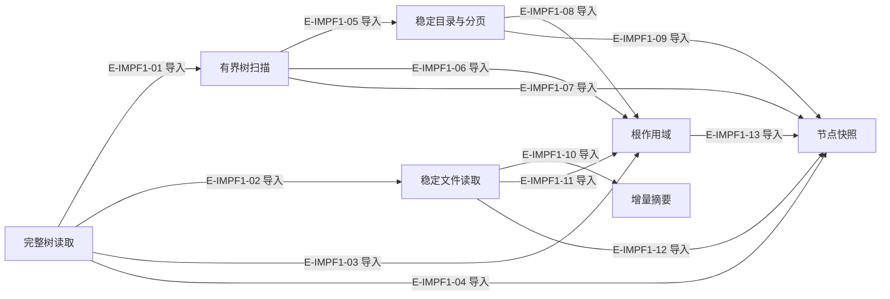
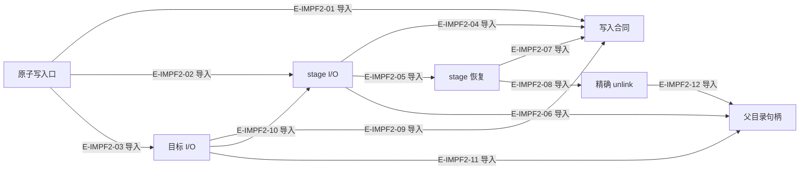

# Foundation 实际导入：读取与写入分别下钻

每条箭头都由当前TypeScript AST中的直接import或再导出核实，包含仅类型依赖。它不能证明运行时调用、分支顺序、测试覆盖或权限。以下是围绕问题选择的子图；省略的完整静态关系保存在[原始导入数据](../../plans/review-2026-10-02/import-graph.json)。

## 稳定读取依赖

```mermaid
flowchart LR
  accTitle: 稳定读取依赖
  accDescr: 当前代码精选的直接导入关系，完整文件身份在节点表，静态导入不等于运行时调用。
  f1["完整树读取"]
  f2["有界树扫描"]
  f3["稳定目录与分页"]
  f4["稳定文件读取"]
  f5["增量摘要"]
  f6["根作用域"]
  f7["节点快照"]
  f1 -->|"E-IMPF1-01 导入"| f2
  f1 -->|"E-IMPF1-02 导入"| f4
  f1 -->|"E-IMPF1-03 导入"| f6
  f1 -->|"E-IMPF1-04 导入"| f7
  f2 -->|"E-IMPF1-05 导入"| f3
  f2 -->|"E-IMPF1-06 导入"| f6
  f2 -->|"E-IMPF1-07 导入"| f7
  f3 -->|"E-IMPF1-08 导入"| f6
  f3 -->|"E-IMPF1-09 导入"| f7
  f4 -->|"E-IMPF1-10 导入"| f5
  f4 -->|"E-IMPF1-11 导入"| f6
  f4 -->|"E-IMPF1-12 导入"| f7
  f6 -->|"E-IMPF1-13 导入"| f7
```

### 本图术语说明

| 术语 | 含义 |
| --- | --- |
| 导入 | AST中存在的直接模块引用，可能仅供类型检查。 |
| 精选 | 仅展示所选文件之间的边，不声称是完整传递闭包。 |
| 文件节点 | 使用稳定节点ID与完整相对路径，避免同名service.ts混淆。 |

### 节点与实现定位

| 节点 | 文件 / 符号 | 职责 |
| --- | --- | --- |
| f1 | `src/foundation/filesystem/stable-resource-tree-read.ts` | 完整树读取 |
| f2 | `src/foundation/filesystem/bounded-directory-tree-scan.ts` | 有界树扫描 |
| f3 | `src/foundation/filesystem/stable-directory-read.ts` | 稳定目录与分页 |
| f4 | `src/foundation/filesystem/stable-file-read.ts` | 稳定文件读取 |
| f5 | `src/foundation/crypto/sha256-hasher.ts` | 增量摘要 |
| f6 | `src/foundation/filesystem/rooted-directory.ts` | 根作用域 |
| f7 | `src/foundation/filesystem/file-node-snapshot.ts` | 节点快照 |

### 本图边级证据

| 编号 | 起点文件 | 终点文件 | 测试 / 核验 | 关系依据 |
| --- | --- | --- | --- | --- |
| E-IMPF1-01 | `src/foundation/filesystem/stable-resource-tree-read.ts` | `src/foundation/filesystem/bounded-directory-tree-scan.ts` | 未覆盖：静态关系由AST直接核验，不以运行测试冒充调用证据。 | 当前源文件的直接import或再导出 |
| E-IMPF1-02 | `src/foundation/filesystem/stable-resource-tree-read.ts` | `src/foundation/filesystem/stable-file-read.ts` | 未覆盖：静态关系由AST直接核验，不以运行测试冒充调用证据。 | 当前源文件的直接import或再导出 |
| E-IMPF1-03 | `src/foundation/filesystem/stable-resource-tree-read.ts` | `src/foundation/filesystem/rooted-directory.ts` | 未覆盖：静态关系由AST直接核验，不以运行测试冒充调用证据。 | 当前源文件的直接import或再导出 |
| E-IMPF1-04 | `src/foundation/filesystem/stable-resource-tree-read.ts` | `src/foundation/filesystem/file-node-snapshot.ts` | 未覆盖：静态关系由AST直接核验，不以运行测试冒充调用证据。 | 当前源文件的直接import或再导出 |
| E-IMPF1-05 | `src/foundation/filesystem/bounded-directory-tree-scan.ts` | `src/foundation/filesystem/stable-directory-read.ts` | 未覆盖：静态关系由AST直接核验，不以运行测试冒充调用证据。 | 当前源文件的直接import或再导出 |
| E-IMPF1-06 | `src/foundation/filesystem/bounded-directory-tree-scan.ts` | `src/foundation/filesystem/rooted-directory.ts` | 未覆盖：静态关系由AST直接核验，不以运行测试冒充调用证据。 | 当前源文件的直接import或再导出 |
| E-IMPF1-07 | `src/foundation/filesystem/bounded-directory-tree-scan.ts` | `src/foundation/filesystem/file-node-snapshot.ts` | 未覆盖：静态关系由AST直接核验，不以运行测试冒充调用证据。 | 当前源文件的直接import或再导出 |
| E-IMPF1-08 | `src/foundation/filesystem/stable-directory-read.ts` | `src/foundation/filesystem/rooted-directory.ts` | 未覆盖：静态关系由AST直接核验，不以运行测试冒充调用证据。 | 当前源文件的直接import或再导出 |
| E-IMPF1-09 | `src/foundation/filesystem/stable-directory-read.ts` | `src/foundation/filesystem/file-node-snapshot.ts` | 未覆盖：静态关系由AST直接核验，不以运行测试冒充调用证据。 | 当前源文件的直接import或再导出 |
| E-IMPF1-10 | `src/foundation/filesystem/stable-file-read.ts` | `src/foundation/crypto/sha256-hasher.ts` | 未覆盖：静态关系由AST直接核验，不以运行测试冒充调用证据。 | 当前源文件的直接import或再导出 |
| E-IMPF1-11 | `src/foundation/filesystem/stable-file-read.ts` | `src/foundation/filesystem/rooted-directory.ts` | 未覆盖：静态关系由AST直接核验，不以运行测试冒充调用证据。 | 当前源文件的直接import或再导出 |
| E-IMPF1-12 | `src/foundation/filesystem/stable-file-read.ts` | `src/foundation/filesystem/file-node-snapshot.ts` | 未覆盖：静态关系由AST直接核验，不以运行测试冒充调用证据。 | 当前源文件的直接import或再导出 |
| E-IMPF1-13 | `src/foundation/filesystem/rooted-directory.ts` | `src/foundation/filesystem/file-node-snapshot.ts` | 未覆盖：静态关系由AST直接核验，不以运行测试冒充调用证据。 | 当前源文件的直接import或再导出 |

## 文件原子发布依赖

```mermaid
flowchart LR
  accTitle: 文件原子发布依赖
  accDescr: 当前代码精选的直接导入关系，完整文件身份在节点表，静态导入不等于运行时调用。
  f8["原子写入口"]
  f9["写入合同"]
  f10["stage I/O"]
  f11["stage 恢复"]
  f12["目标 I/O"]
  f13["父目录句柄"]
  f14["精确 unlink"]
  f8 -->|"E-IMPF2-01 导入"| f9
  f8 -->|"E-IMPF2-02 导入"| f10
  f8 -->|"E-IMPF2-03 导入"| f12
  f10 -->|"E-IMPF2-04 导入"| f9
  f10 -->|"E-IMPF2-05 导入"| f11
  f10 -->|"E-IMPF2-06 导入"| f13
  f11 -->|"E-IMPF2-07 导入"| f9
  f11 -->|"E-IMPF2-08 导入"| f14
  f12 -->|"E-IMPF2-09 导入"| f9
  f12 -->|"E-IMPF2-10 导入"| f10
  f12 -->|"E-IMPF2-11 导入"| f13
  f14 -->|"E-IMPF2-12 导入"| f13
```

### 本图术语说明

| 术语 | 含义 |
| --- | --- |
| 导入 | AST中存在的直接模块引用，可能仅供类型检查。 |
| 精选 | 仅展示所选文件之间的边，不声称是完整传递闭包。 |
| 文件节点 | 使用稳定节点ID与完整相对路径，避免同名service.ts混淆。 |

### 节点与实现定位

| 节点 | 文件 / 符号 | 职责 |
| --- | --- | --- |
| f8 | `src/foundation/filesystem/durable-atomic-file-write.ts` | 原子写入口 |
| f9 | `src/foundation/filesystem/durable-atomic-file-write-contract.ts` | 写入合同 |
| f10 | `src/foundation/filesystem/durable-atomic-file-stage-io.ts` | stage I/O |
| f11 | `src/foundation/filesystem/durable-atomic-file-stage-recovery.ts` | stage 恢复 |
| f12 | `src/foundation/filesystem/durable-atomic-file-target-io.ts` | 目标 I/O |
| f13 | `src/foundation/filesystem/rooted-resource-parent-handle.ts` | 父目录句柄 |
| f14 | `src/foundation/filesystem/exact-regular-file-unlink.ts` | 精确 unlink |

### 本图边级证据

| 编号 | 起点文件 | 终点文件 | 测试 / 核验 | 关系依据 |
| --- | --- | --- | --- | --- |
| E-IMPF2-01 | `src/foundation/filesystem/durable-atomic-file-write.ts` | `src/foundation/filesystem/durable-atomic-file-write-contract.ts` | 未覆盖：静态关系由AST直接核验，不以运行测试冒充调用证据。 | 当前源文件的直接import或再导出 |
| E-IMPF2-02 | `src/foundation/filesystem/durable-atomic-file-write.ts` | `src/foundation/filesystem/durable-atomic-file-stage-io.ts` | 未覆盖：静态关系由AST直接核验，不以运行测试冒充调用证据。 | 当前源文件的直接import或再导出 |
| E-IMPF2-03 | `src/foundation/filesystem/durable-atomic-file-write.ts` | `src/foundation/filesystem/durable-atomic-file-target-io.ts` | 未覆盖：静态关系由AST直接核验，不以运行测试冒充调用证据。 | 当前源文件的直接import或再导出 |
| E-IMPF2-04 | `src/foundation/filesystem/durable-atomic-file-stage-io.ts` | `src/foundation/filesystem/durable-atomic-file-write-contract.ts` | 未覆盖：静态关系由AST直接核验，不以运行测试冒充调用证据。 | 当前源文件的直接import或再导出 |
| E-IMPF2-05 | `src/foundation/filesystem/durable-atomic-file-stage-io.ts` | `src/foundation/filesystem/durable-atomic-file-stage-recovery.ts` | 未覆盖：静态关系由AST直接核验，不以运行测试冒充调用证据。 | 当前源文件的直接import或再导出 |
| E-IMPF2-06 | `src/foundation/filesystem/durable-atomic-file-stage-io.ts` | `src/foundation/filesystem/rooted-resource-parent-handle.ts` | 未覆盖：静态关系由AST直接核验，不以运行测试冒充调用证据。 | 当前源文件的直接import或再导出 |
| E-IMPF2-07 | `src/foundation/filesystem/durable-atomic-file-stage-recovery.ts` | `src/foundation/filesystem/durable-atomic-file-write-contract.ts` | 未覆盖：静态关系由AST直接核验，不以运行测试冒充调用证据。 | 当前源文件的直接import或再导出 |
| E-IMPF2-08 | `src/foundation/filesystem/durable-atomic-file-stage-recovery.ts` | `src/foundation/filesystem/exact-regular-file-unlink.ts` | 未覆盖：静态关系由AST直接核验，不以运行测试冒充调用证据。 | 当前源文件的直接import或再导出 |
| E-IMPF2-09 | `src/foundation/filesystem/durable-atomic-file-target-io.ts` | `src/foundation/filesystem/durable-atomic-file-write-contract.ts` | 未覆盖：静态关系由AST直接核验，不以运行测试冒充调用证据。 | 当前源文件的直接import或再导出 |
| E-IMPF2-10 | `src/foundation/filesystem/durable-atomic-file-target-io.ts` | `src/foundation/filesystem/durable-atomic-file-stage-io.ts` | 未覆盖：静态关系由AST直接核验，不以运行测试冒充调用证据。 | 当前源文件的直接import或再导出 |
| E-IMPF2-11 | `src/foundation/filesystem/durable-atomic-file-target-io.ts` | `src/foundation/filesystem/rooted-resource-parent-handle.ts` | 未覆盖：静态关系由AST直接核验，不以运行测试冒充调用证据。 | 当前源文件的直接import或再导出 |
| E-IMPF2-12 | `src/foundation/filesystem/exact-regular-file-unlink.ts` | `src/foundation/filesystem/rooted-resource-parent-handle.ts` | 未覆盖：静态关系由AST直接核验，不以运行测试冒充调用证据。 | 当前源文件的直接import或再导出 |

[本模块总览](./README.md) · [实际调用与分支](./runtime-call-flow.md) · [逐文件台账](../02-file-review-index.md)。
