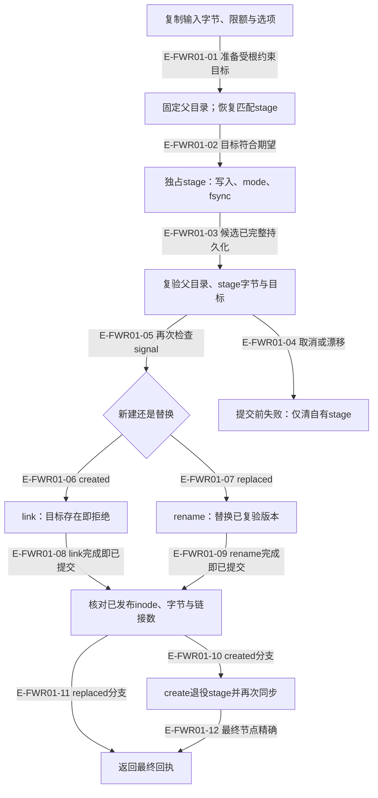
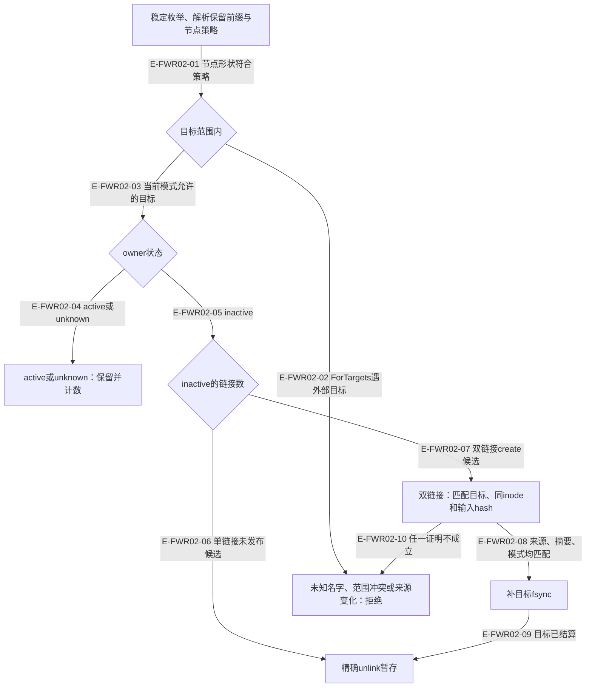

# 文件发布：提交前中止，提交后结算

本图按生产默认fsync档描绘。根durability=none（或create显式请求none）跳过同步，仍验证节点与字节；不能宣称none具有持久化保证。新建和替换共享候选准备，但提交原语不同。这里的原子边界是一个文件名字的发布；跨文件事务、业务锁和事件修订仍由对应 owner 负责。常规 create/replace 的预检可能恢复已证明失活的匹配暂存，故它不是纯观察函数。

### 本图术语说明

| 术语 | 含义 |
| --- | --- |
| stage | 名字携带操作、目标摘要、输入摘要、模式和owner；不是领域事件。 |
| expected | replace用稳定读取给出的path/node/byteCount/digest。 |
| 已提交 | link或rename成功；随后错误不能等同“没写入”。 |

### 本图边级证据

| 编号 | 代码定位 | 测试 / 核验 | 关系依据 |
| --- | --- | --- | --- |
| E-FWR01-01 | `src/foundation/filesystem/durable-atomic-file-write.ts#performWrite` | 间接覆盖：`tests/foundation/filesystem/durable-atomic-file-write.test.ts#createFileAtomically`（新建回执、不覆盖与并发正反例） | 输入必须被动且≤64MiB。 |
| E-FWR01-02 | `src/foundation/filesystem/durable-atomic-file-write.ts#performWrite` | 间接覆盖：`tests/foundation/filesystem/durable-atomic-file-write.test.ts#createFileAtomically`（新建回执、不覆盖与并发正反例） | create要求不存在；replace要求稳定原版本。 |
| E-FWR01-03 | `src/foundation/filesystem/durable-atomic-file-write.ts#performWrite` | 间接覆盖：`tests/foundation/filesystem/durable-atomic-file-write.test.ts#createFileAtomically`（新建回执、不覆盖与并发正反例） | 准备不等于目标已发布。 |
| E-FWR01-04 | `src/foundation/filesystem/durable-atomic-file-write.ts#performWrite` | 间接覆盖：`tests/foundation/filesystem/durable-atomic-file-write.test.ts#replaceFileAtomically`（原版本与过期expectation） | 尚未提交时允许精确清理。 |
| E-FWR01-05 | `src/foundation/filesystem/durable-atomic-file-write.ts#performWrite` | 间接覆盖：`tests/foundation/filesystem/durable-atomic-file-write.test.ts#createFileAtomically`（新建回执、不覆盖与并发正反例） | 最后一个可中止的提交前点。 |
| E-FWR01-06 | `src/foundation/filesystem/durable-atomic-file-write.ts#performWrite` | 间接覆盖：`tests/foundation/filesystem/durable-atomic-file-write.test.ts#createFileAtomically`（新建回执、不覆盖与并发正反例） | OS硬链接拒覆盖；两个并发create只有一方成功。 |
| E-FWR01-07 | `src/foundation/filesystem/durable-atomic-file-write.ts#performWrite` | 间接覆盖：`tests/foundation/filesystem/durable-atomic-file-write.test.ts#replaceFileAtomically`（原版本与过期expectation） | 替换前重读node/size/digest；不是多writer的全局锁。 |
| E-FWR01-08 | `src/foundation/filesystem/durable-atomic-file-write.ts#performWrite` | 间接覆盖：`tests/foundation/filesystem/durable-atomic-file-write.test.ts#createFileAtomically`（新建回执、不覆盖与并发正反例） | 此时stage和target有两个链接。 |
| E-FWR01-09 | `src/foundation/filesystem/durable-atomic-file-write.ts#performWrite` | 间接覆盖：`tests/foundation/filesystem/durable-atomic-file-write.test.ts#replaceFileAtomically`（原版本与过期expectation） | stage名字已消失；目标指向新inode。 |
| E-FWR01-10 | `src/foundation/filesystem/durable-atomic-file-write.ts#performWrite` | 间接覆盖：`tests/foundation/filesystem/durable-atomic-file-write.test.ts#createFileAtomically`（新建回执、不覆盖与并发正反例） | 同步目标与父目录，再删除stage链接，再同步。 |
| E-FWR01-11 | `src/foundation/filesystem/durable-atomic-file-write.ts#performWrite` | 间接覆盖：`tests/foundation/filesystem/durable-atomic-file-write.test.ts#replaceFileAtomically`（原版本与过期expectation） | 保持最终节点证据，不回滚已替换目标。 |
| E-FWR01-12 | `src/foundation/filesystem/durable-atomic-file-write.ts#performWrite` | 间接覆盖：`tests/foundation/filesystem/durable-atomic-file-write.test.ts#createFileAtomically`（新建回执、不覆盖与并发正反例） | commit-uncertain与durability-failure须交owner恢复。 |

## 暂存恢复的保守分支

### 本图术语说明

| 术语 | 含义 |
| --- | --- |
| ForTargets | 要求同父目录中的保留暂存均属于声明集合。 |
| MatchingTargets | 只恢复匹配目标；其他安全暂存不进入处理计数。 |
| inactive | 同进程token已不活动，或跨进程探测ESRCH；其他不确定性为unknown。 |

### 本图边级证据

| 编号 | 代码定位 | 测试 / 核验 | 关系依据 |
| --- | --- | --- | --- |
| E-FWR02-01 | `src/foundation/filesystem/durable-atomic-file-stage-recovery.ts#recoverDirectoryStages` | 间接覆盖：`tests/foundation/filesystem/durable-atomic-file-write.test.ts#createFileAtomically`（inactive partial与two-link stage恢复） | 不把未知保留名字当作垃圾。 |
| E-FWR02-02 | `src/foundation/filesystem/durable-atomic-file-stage-recovery.ts#recoverDirectoryStages` | `tests/foundation/filesystem/durable-atomic-file-stage-recovery.test.ts#recoverDurableAtomicFileStagesForTargets` | 严格集合恢复与匹配恢复是不同入口。 |
| E-FWR02-03 | `src/foundation/filesystem/durable-atomic-file-stage-recovery.ts#recoverDirectoryStages` | 间接覆盖：`tests/foundation/filesystem/durable-atomic-file-write.test.ts#createFileAtomically`（inactive partial与two-link stage恢复） | MatchingTargets跳过其他安全目标。 |
| E-FWR02-04 | `src/foundation/filesystem/durable-atomic-file-stage-recovery.ts#recoverDirectoryStages` | 间接覆盖：`tests/foundation/filesystem/durable-atomic-file-stage-recovery.test.ts#recoverDurableAtomicFileStagesForTargets`（active保留已有反例；unknown没有专门回归） | 跨线程或进程权限不明不会偷取。 |
| E-FWR02-05 | `src/foundation/filesystem/durable-atomic-file-stage-recovery.ts#recoverDirectoryStages` | 间接覆盖：`tests/foundation/filesystem/durable-atomic-file-write.test.ts#createFileAtomically`（inactive partial与two-link stage恢复） | 单凭文件存在时间不能证明owner死亡。 |
| E-FWR02-06 | `src/foundation/filesystem/durable-atomic-file-stage-recovery.ts#recoverDirectoryStages` | 间接覆盖：`tests/foundation/filesystem/durable-atomic-file-write.test.ts#createFileAtomically`（inactive partial与two-link stage恢复） | 只退休已观察的精确节点。 |
| E-FWR02-07 | `src/foundation/filesystem/durable-atomic-file-stage-recovery.ts#recoverDirectoryStages` | 间接覆盖：`tests/foundation/filesystem/durable-atomic-file-write.test.ts#createFileAtomically`（inactive partial与two-link stage恢复） | replace暂存不允许双链接。 |
| E-FWR02-08 | `src/foundation/filesystem/durable-atomic-file-stage-recovery.ts#assertPublishedTarget` | 间接覆盖：`tests/foundation/filesystem/durable-atomic-file-write.test.ts#createFileAtomically`（inactive partial与two-link stage恢复） | 先保护已发布目标的耐久性。 |
| E-FWR02-09 | `src/foundation/filesystem/durable-atomic-file-stage-recovery.ts#recoverDirectoryStages` | 间接覆盖：`tests/foundation/filesystem/durable-atomic-file-write.test.ts#createFileAtomically`（inactive partial与two-link stage恢复） | 不改目标内容或历史事件。 |
| E-FWR02-10 | `src/foundation/filesystem/durable-atomic-file-stage-recovery.ts#assertPublishedTarget` | 未覆盖：现有inactive成功恢复用例不能证明目标冲突反例；此分支按函数体核验。 | target-conflict保留现场。 |

文件发布与stage恢复本体字节相对上一轮未变。锁已经更新为严格v2实例记录，结合进程出生摘要、模块registry与活动token；这些判定不能扩大成所有stage/candidate的身份机制，详见[读写准入](./read-write-admission.md)。锁的 acquire 只等待并超时，不自动退休死锁；显式 `retireRootedExclusiveFileLockResidue` 还要求本进程签发的观察、inactive owner、原token/摘要/节点一致，以及相关stage已闭合。测试 `tests/foundation/filesystem/rooted-exclusive-file-lock.test.ts#retireRootedExclusiveFileLockResidue` 覆盖明确退休入口。

本图描述Foundation函数，不泛化为所有业务提交后的取消行为：业务owner后续若仍传signal，可能停在日志恢复点。具体看[Demand生命周期](../07-review-rework-completion/README.md)。

[基础总览](./README.md) · [目录树发布](./tree-publication-and-recovery.md)。
