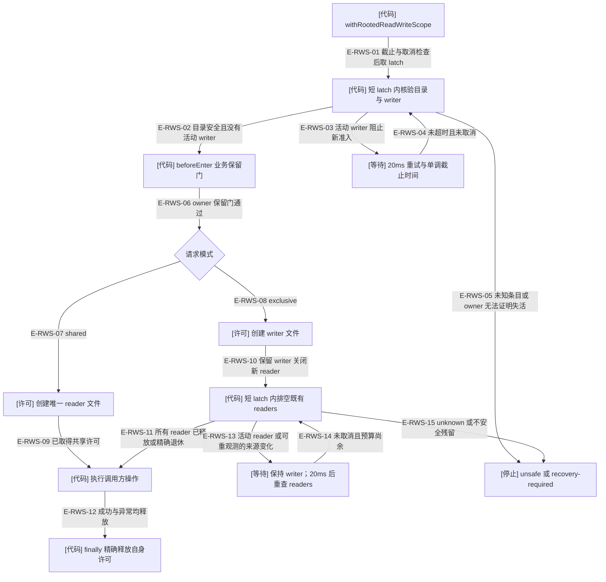
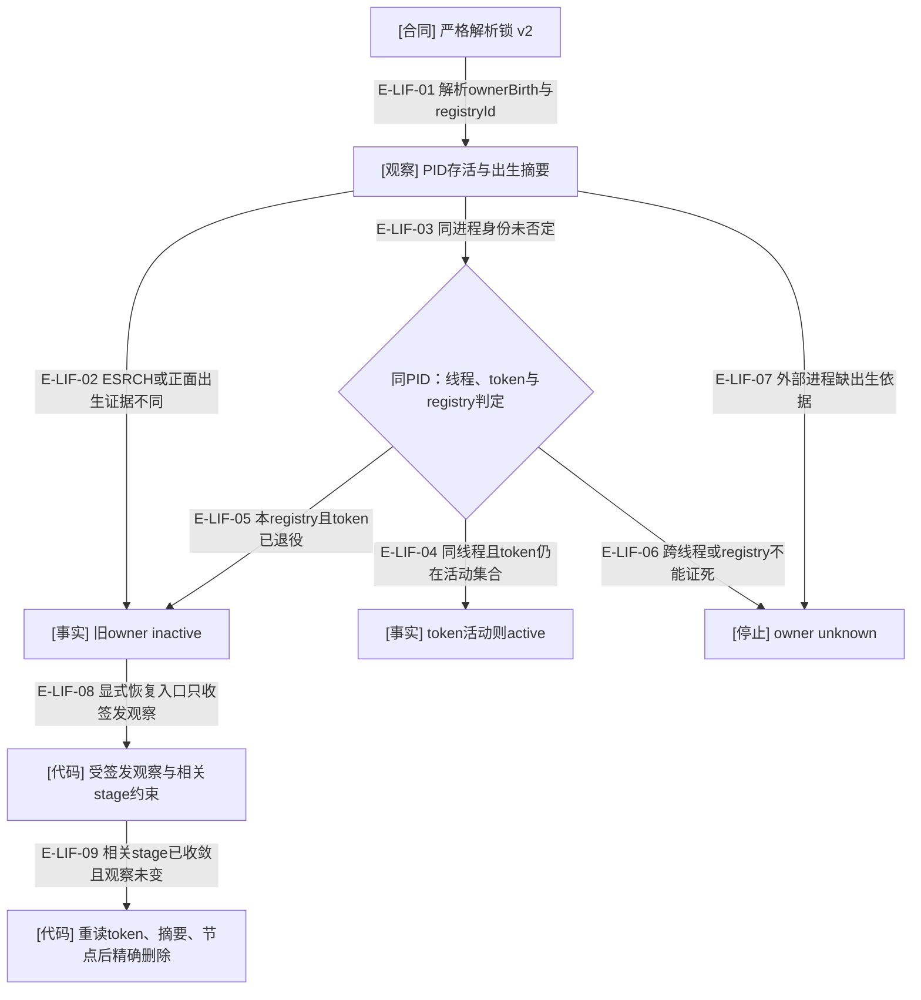

# 读写准入：关闭新 reader，排空旧 reader

当前 Foundation 提供共享/独占文件许可。rc.4 进一步修复 reader 正常释放与 writer 检查交错时的 `residue-changed` 处理；业务恢复意图仍由 Kernel 或领域 owner 检查。底层只负责准入顺序、当前锁身份与精确退休，不把目录里“看起来旧”的条目自动当垃圾。

### 本图术语说明

| 术语 | 含义 |
| --- | --- |
| latch | 短临界区内协调 reader 登记和 writer 关闭；不是覆盖全部业务执行的锁。 |
| writer | 已取得独占准入位置；排空 reader 前还不能执行业务操作。 |
| reader | 每个调用独有的文件许可；多个 reader 可同时执行，释放不需要 latch。 |
| beforeEnter | 调用方在准入串行时核对自己的保留条件；Foundation 不读取业务 intent。 |
| 精确退休 | 只有已证明 inactive 的 owner 和未改变的节点/摘要，才能进入显式删除。 |

### 本图边级证据

| 编号 | 代码证据 | 测试证据 | 关系与限制 |
| --- | --- | --- | --- |
| E-RWS-01 | `src/foundation/filesystem/rooted-read-write-scope.ts#withRootedReadWriteScope` | `tests/foundation/filesystem/rooted-read-write-scope.test.ts#withRootedReadWriteScope` | 获取预算默认30秒、上限300秒；等待预算不是业务超时。 |
| E-RWS-02 | `src/foundation/filesystem/rooted-read-write-scope.ts#entriesOf` / retireInactive | 间接覆盖：`tests/foundation/filesystem/rooted-read-write-scope.test.ts#withRootedReadWriteScope`（reader/writer实际文件测试） | 区域0700、文件0600与owner一致；枚举上限1024项。 |
| E-RWS-03 | `src/foundation/filesystem/rooted-read-write-scope.ts#retireInactive` | `tests/foundation/filesystem/rooted-read-write-scope.test.ts#withRootedReadWriteScope` | 待执行writer持有writer.lock，后到reader等待。 |
| E-RWS-04 | `src/foundation/filesystem/rooted-read-write-scope.ts#withRootedReadWriteScope` | `tests/foundation/filesystem/rooted-read-write-scope.test.ts#RootedReadWriteScopeError`（覆盖取消；截止分支源码已读但未见独立断言） | 取消或截止返回错误；不按等候时长夺锁。 |
| E-RWS-05 | `src/foundation/filesystem/rooted-read-write-scope.ts#entriesOf` | `tests/foundation/filesystem/rooted-read-write-scope.test.ts#RootedReadWriteScopeError` | 同PID的未知registry owner与未知文件均保留。 |
| E-RWS-06 | `src/foundation/filesystem/rooted-read-write-scope.ts#withRootedReadWriteScope` | 未覆盖：Foundation测试没有独立beforeEnter断言，Kernel作用域页提供业务保留门覆盖。 | 回调错误不授予许可。 |
| E-RWS-07 | `src/foundation/filesystem/rooted-read-write-scope.ts#withRootedReadWriteScope` | `tests/foundation/filesystem/rooted-read-write-scope.test.ts#withRootedReadWriteScope` | shared创建唯一reader路径。 |
| E-RWS-08 | `src/foundation/filesystem/rooted-read-write-scope.ts#withRootedReadWriteScope` | `tests/foundation/filesystem/rooted-read-write-scope.test.ts#withRootedReadWriteScope` | exclusive先创建writer，再等待reader。 |
| E-RWS-09 | `src/foundation/filesystem/rooted-read-write-scope.ts#withRootedReadWriteScope` | `tests/foundation/filesystem/rooted-read-write-scope.test.ts#withRootedReadWriteScope` | 两reader重叠执行有真实文件系统回归。 |
| E-RWS-10 | `src/foundation/filesystem/rooted-read-write-scope.ts#withRootedReadWriteScope` | `tests/foundation/filesystem/rooted-read-write-scope.test.ts#withRootedReadWriteScope` | writer锁存续期间不再登记新reader。 |
| E-RWS-11 | `src/foundation/filesystem/rooted-read-write-scope.ts#retireInactive` | `tests/foundation/filesystem/rooted-read-write-scope.test.ts#withRootedReadWriteScope` | 真实reader子进程SIGKILL后退休；active继续等候，unknown停止。 |
| E-RWS-12 | `src/foundation/filesystem/rooted-exclusive-file-lock.ts#acquireRootedExclusiveFileLock` | `tests/foundation/filesystem/rooted-read-write-scope.test.ts#withRootedReadWriteScope` | release共享同一结算Promise；业务异常也释放许可。 |
| E-RWS-13 | `src/foundation/filesystem/rooted-read-write-scope.ts#retireInactive` / `src/foundation/filesystem/rooted-read-write-scope.ts#transientListing` | `tests/foundation/filesystem/rooted-read-write-scope.test.ts#withRootedReadWriteScope` | 新回归强制 reader 在锁检查中释放；residue-changed 只按本轮仍占用，目录 source/expectation-changed 也重试。 |
| E-RWS-14 | `src/foundation/filesystem/rooted-read-write-scope.ts#withRootedReadWriteScope` | 间接覆盖：`tests/foundation/filesystem/rooted-read-write-scope.test.ts#withRootedReadWriteScope` 的正常释放重观测；排空等待的独立 timeout 断言尚缺。 | 已持有 writer 的重试返回排空阶段，不重新登记许可。 |
| E-RWS-15 | `src/foundation/filesystem/rooted-read-write-scope.ts#retireInactive` | `tests/foundation/filesystem/rooted-read-write-scope.test.ts#RootedReadWriteScopeError` | 同一竞态替换为未知 registry 时拒绝进入，完整保留替换记录。 |

排空时 reader 释放可造成目录变化或锁观察变化：前者只重试 `source-changed` / `expectation-changed`，后者只将 `residue-changed` 记为本轮仍占用。权限、未知文件和不确定 owner 不能因等待而忽略。持许可后检查 signal 和 deadline 再执行业务，回调运行期间的取消仍由调用者负责。创建暂存文件使用既有 stage owner 判定，不能把下面锁的出生摘要保证扩大到所有 stage/candidate 格式。

本轮发现的 CF-01 已修复：许可创建成功后在 latch 回调内立即登记给外层，因此随后 latch 结算失败也会尝试释放已有许可。新增正式回归与独立后态探针确认 shared/exclusive 清理和同进程重入，以及未知替换者保留；释放本身仍可能失败。详见[竞争、获取预算与异常结算](./admission-races-and-recovery.md)，不得把本图的正常释放边理解为任何失败都能保证目录清空。

## 锁实例身份与残留退休

### 本图术语说明

| 术语 | 含义 |
| --- | --- |
| 出生摘要 | Linux boot ID和进程start ticks，或macOS boot session与lstart；不同正面摘要能否定旧实例，相同粗粒度时间不授权退休。 |
| registry | 本模块实例生成的随机身份，防止同PID但另一模块实例被误判为已结束。 |
| token | 单次持有的活动令牌；不进入公共结果或文档实例。 |
| unknown | 尚不能授权退休；不是等候足够长之后就算死亡。 |

### 本图边级证据

| 编号 | 代码证据 | 测试证据 | 关系与限制 |
| --- | --- | --- | --- |
| E-LIF-01 | `src/foundation/filesystem/rooted-exclusive-file-lock.ts#parseLockRecord` | 间接覆盖：`tests/foundation/filesystem/rooted-exclusive-file-lock.test.ts#inspectRootedExclusiveFileLock`（严格记录与不安全节点） | 只接受当前v2形状，不提供旧锁格式迁移。 |
| E-LIF-02 | `src/foundation/node/process-instance.ts#recordedProcessIsInactive` | `tests/foundation/node/process-instance.test.ts#recordedProcessIsInactive` | 非空且不相同的出生摘要可证明记录实例已消失。 |
| E-LIF-03 | `src/foundation/filesystem/rooted-exclusive-file-lock.ts#observeOwnerState` | 间接覆盖：`tests/foundation/filesystem/rooted-read-write-scope.test.ts#withRootedReadWriteScope`（同PID未知owner） | 同PID不直接等于同实例owner。 |
| E-LIF-04 | `src/foundation/filesystem/rooted-exclusive-file-lock.ts#observeOwnerState` | `tests/foundation/filesystem/rooted-exclusive-file-lock.test.ts#inspectRootedExclusiveFileLock`（同PID同线程持有期间明确断言active，并拒绝退休） | 同线程的活动token优先判active。 |
| E-LIF-05 | `src/foundation/filesystem/rooted-exclusive-file-lock.ts#observeOwnerState` | 未覆盖：现有回归覆盖外部死PID和同PID未知registry，未确认本registry无活动token的独立断言。 | 本registry无活动token才可判失活。 |
| E-LIF-06 | `src/foundation/filesystem/rooted-exclusive-file-lock.ts#observeOwnerState` | `tests/foundation/filesystem/rooted-read-write-scope.test.ts#RootedReadWriteScopeError` | 同PID未知registry保持unknown；跨线程同样保守。 |
| E-LIF-07 | `src/foundation/node/process-instance.ts#observeProcessInstance` | `tests/foundation/node/process-instance.test.ts#observeProcessInstance` | 平台/权限证据不足不冒充死亡；原生Linux与Windows未由当前macOS运行证明。 |
| E-LIF-08 | `src/foundation/filesystem/rooted-exclusive-file-lock.ts#retireRootedExclusiveFileLockResidue` | `tests/foundation/filesystem/rooted-exclusive-file-lock.test.ts#retireRootedExclusiveFileLockResidue`（覆盖真实观察的inactive退休；伪造观察负例未覆盖） | 冻结对象还必须在本模块WeakSet中；伪造观察不获得删除权。 |
| E-LIF-09 | `src/foundation/filesystem/rooted-exclusive-file-lock.ts#retireRootedExclusiveFileLockResidue` | `tests/foundation/filesystem/rooted-exclusive-file-lock.test.ts#retireRootedExclusiveFileLockResidue`（覆盖inactive精确退休和relatedTarget准入；stage活动/unknown及节点漂移负例未覆盖） | 复核token、digest、完整node，stage活动/未知或残留变化则拒绝。 |

外部进程有出生依据且仍存活时保留active，图中不再展开其等待分支。该机制不替领域owner决定是否退休业务意图，也不承诺网络文件系统上的分布式互斥。

[Foundation总览](./README.md) · [工作区操作作用域](../11-kernel/workspace-operation-scope.md) · [配置与维护](../03-configuration-workspace/README.md)
