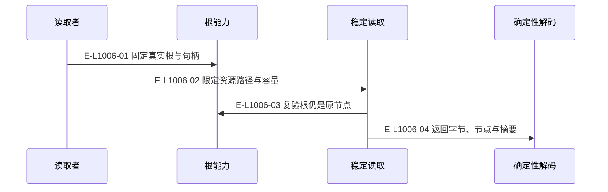
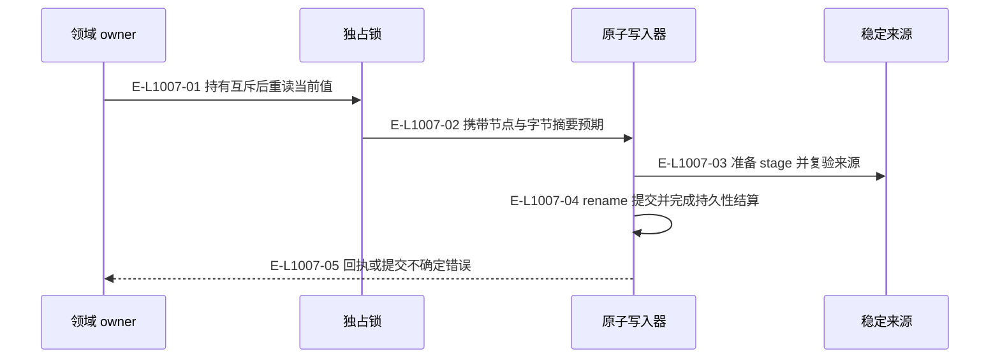
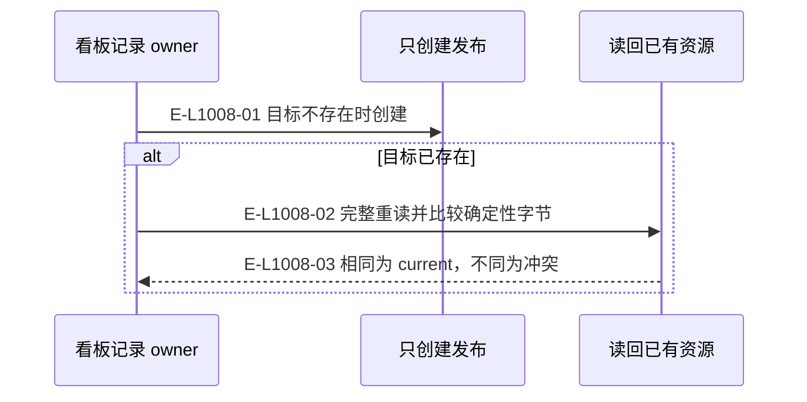

# Foundation：稳定读取、提交与恢复

三张图分别描述读取、替换和只创建资源；跨调用业务恢复由拥有 journal 的领域负责。

> 核验基线：`1480271`（L1 observation 第十片已落地，20 个公共工具、18 个一次性场景）。工作树另有并行未提交改动（宿主 hook 通道等），本图不描绘；来源指纹按当前工作树计算。本文说明实现事实，未宣称双宿主真实会话已经验证。

## 稳定读取的节点与字节核对

### 本图术语说明

| 术语 | 本图含义 |
| --- | --- |
| CAS | 比较已观察的摘要/修订后提交；来源已改变则拒绝。 |

### 节点与实现定位

| 节点 | 文件 / 符号 | 责任 |
| --- | --- | --- |
| caller | `src/configuration/wakeflow-config-authority-snapshot.ts` | 读取者 |
| root | `src/foundation/filesystem/rooted-directory.ts#RootedDirectory` | 根能力 |
| read | `src/foundation/filesystem/stable-file-read.ts` | 稳定读取 |
| json | `src/foundation/filesystem/deterministic-json-file.ts` | 确定性解码 |

### 本图边级证据

| 编号 | 代码定位 | 测试 / 核验 | 关系依据 |
| --- | --- | --- | --- |
| E-L1006-01 | `src/foundation/filesystem/rooted-directory.ts#RootedDirectory.open` | `tests/foundation/filesystem/durable-atomic-file-write.test.ts` | 固定真实根与句柄 |
| E-L1006-02 | `src/configuration/wakeflow-config-authority-snapshot.ts` | `tests/foundation/filesystem/durable-atomic-file-write.test.ts` | 限定资源路径与容量 |
| E-L1006-03 | `src/foundation/filesystem/stable-file-read.ts` | `tests/foundation/filesystem/durable-atomic-file-write.test.ts` | 复验根仍是原节点 |
| E-L1006-04 | `src/foundation/filesystem/deterministic-json-file.ts` | `tests/foundation/filesystem/durable-atomic-file-write.test.ts` | 返回字节、节点与摘要 |

## 精确文件替换与提交边界

### 本图术语说明

| 术语 | 本图含义 |
| --- | --- |
| CAS | 比较已观察的摘要/修订后提交；来源已改变则拒绝。 |
| commit | 一次不可变事件提交批；文件槽位以预期修订防止并发覆盖。 |

### 节点与实现定位

| 节点 | 文件 / 符号 | 责任 |
| --- | --- | --- |
| owner | `src/kernel/requirement-board.ts` | 领域 owner |
| lock | `src/foundation/filesystem/rooted-exclusive-file-lock.ts` | 独占锁 |
| writer | `src/foundation/filesystem/durable-atomic-file-write.ts` | 原子写入器 |
| source | `src/foundation/filesystem/stable-file-read.ts` | 稳定来源 |

### 本图边级证据

| 编号 | 代码定位 | 测试 / 核验 | 关系依据 |
| --- | --- | --- | --- |
| E-L1007-01 | `src/kernel/requirement-board.ts#replaceRequirementClaimStateFile` | `tests/capabilities/requirement/service.test.ts` | 持有互斥后重读当前值 |
| E-L1007-02 | `src/kernel/requirement-board.ts#replaceRequirementClaimStateFile` | `tests/capabilities/requirement/service.test.ts` | 携带节点与字节摘要预期 |
| E-L1007-03 | `src/foundation/filesystem/durable-atomic-file-write.ts#performWrite` | `tests/foundation/filesystem/durable-atomic-file-write.test.ts` | 准备 stage 并复验来源 |
| E-L1007-04 | `src/foundation/filesystem/durable-atomic-file-write.ts#performWrite` | `tests/foundation/filesystem/durable-atomic-file-write.test.ts` | rename 提交并完成持久性结算 |
| E-L1007-05 | `src/foundation/filesystem/durable-atomic-file-write.ts#performWrite` | `tests/foundation/filesystem/durable-atomic-file-write.test.ts` | 回执或提交不确定错误 |

## 具体 owner 的只创建记录幂等

### 本图术语说明

| 术语 | 本图含义 |
| --- | --- |
| CAS | 比较已观察的摘要/修订后提交；来源已改变则拒绝。 |
| projection | 根据权威重建的视图，不反向决定事实。 |

### 节点与实现定位

| 节点 | 文件 / 符号 | 责任 |
| --- | --- | --- |
| owner | `src/kernel/requirement-board.ts` | 看板记录 owner |
| writer | `src/foundation/filesystem/durable-atomic-file-write.ts` | 只创建发布 |
| read | `src/foundation/filesystem/deterministic-json-file.ts` | 读回已有资源 |

### 本图边级证据

| 编号 | 代码定位 | 测试 / 核验 | 关系依据 |
| --- | --- | --- | --- |
| E-L1008-01 | `src/kernel/requirement-board.ts` | `tests/capabilities/requirement/service.test.ts` | 目标不存在时创建 |
| E-L1008-02 | `src/kernel/requirement-board.ts` | `tests/capabilities/requirement/service.test.ts` | 完整重读并比较确定性字节 |
| E-L1008-03 | `src/kernel/requirement-board.ts` | `tests/capabilities/requirement/service.test.ts` | 相同为 current，不同为冲突 |

## 守卫、恢复与验证范围

原通用 create-only helper 已删除；最后一图以看板记录 owner 为当前消费者示例。锁不会按时间自动打破；创建者和领域恢复器依照精确节点、记录及提交事实决定退休。文件系统原语不构成对恶意同权限进程的 OS 沙箱。

涉及的测试与核验入口：

- `tests/capabilities/requirement/service.test.ts`。
- `tests/foundation/filesystem/durable-atomic-file-write.test.ts`。

## 下钻与相关视图

- [本专题总览](./README.md)
- [图谱总索引](../README.md)
- [核验与剩余范围](../01-diagram-review-ledger.md)
