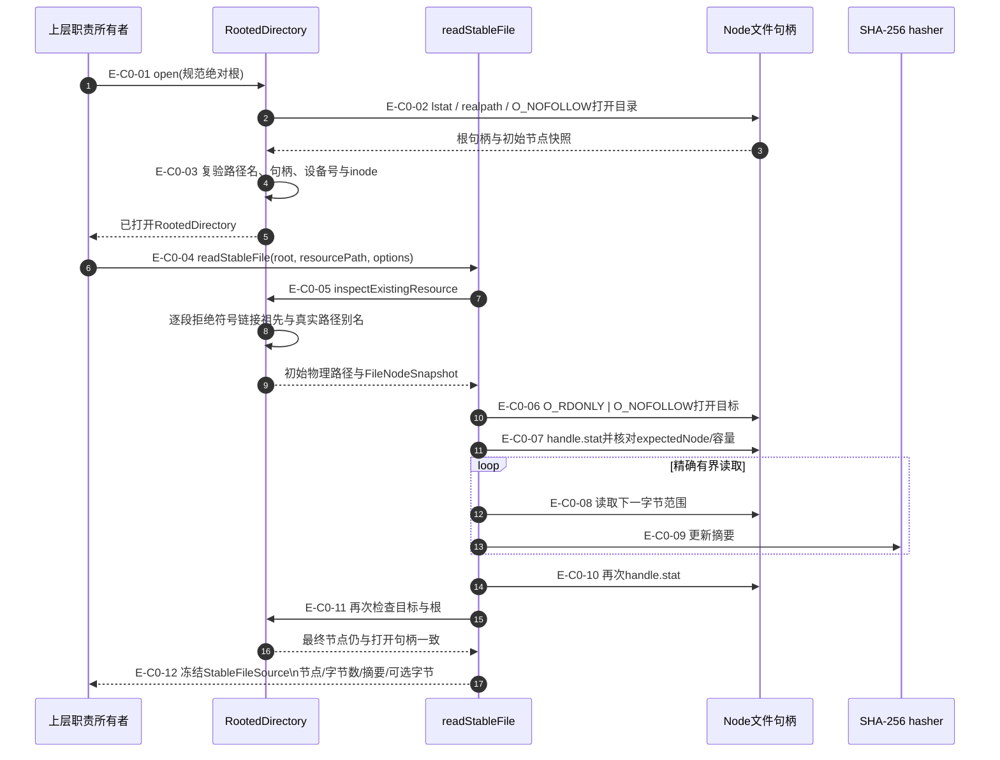
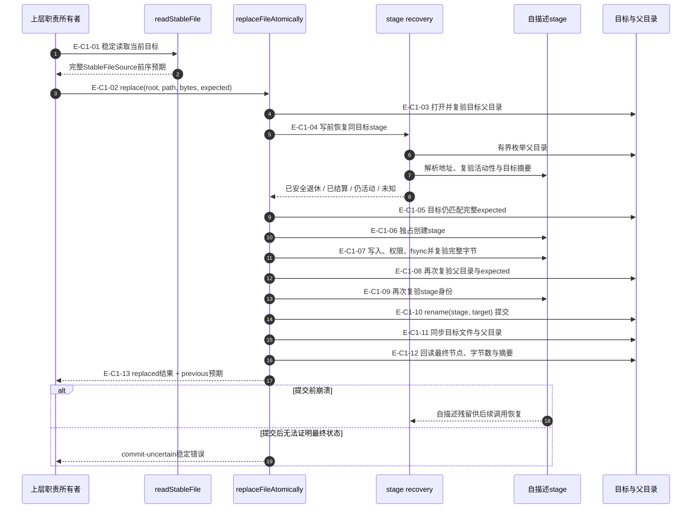
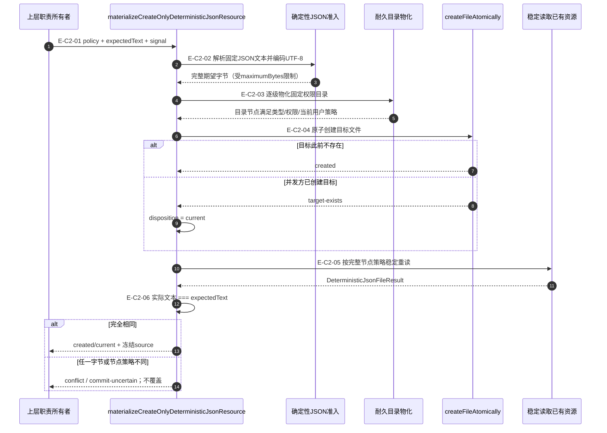

# Foundation：稳定读取、原子写入与恢复调用流

> 本文只描述 Foundation 机制调用顺序。上层领域必须先决定业务权威、锁路径、资源策略和是否允许
> 创建/替换；Foundation 不替代这些判断。

## 当前结论

Foundation 文件系统主链不是“读文件/写文件”的薄包装，而是三层证据组合：

1. `RootedDirectory`固定并持续复验一次操作的物理根；
2. 稳定读取把路径、打开句柄、节点快照、容量和内容摘要绑定为前序事实；
3. 耐久写入在提交前再次验证前序事实和 stage，提交后同步并回读最终目标。

崩溃恢复只处理可证明归属且不再活动的自描述 stage；无法证明的残留保持不动并返回稳定错误。

## C0：稳定文件读取

### 本图术语说明

| 图中术语 | 解释 |
| --- | --- |
| 规范绝对根 | 已去除路径歧义、不是文件系统根、并固定到真实目录节点的绝对路径 |
| `O_NOFOLLOW` | Node文件打开标志；拒绝最终目标通过符号链接被跟随 |
| `FileNodeSnapshot` | 包含节点类型、设备号、inode、大小、权限和时间等确定观察的冻结值 |
| `expectedNode` | 调用方上一观察签发的完整节点预期；变化时读取失败而不是静默接受新文件 |
| 精确有界读取 | 按已观察字节数读取，受最大容量和取消信号限制，不接受提前EOF或额外字节 |
| `StableFileSource` | 把路径、最终节点、字节数、摘要与可选完整字节绑定的成功事实 |

### C0边级证据

| 边编号 | 代码位置 | 验证重点 |
| --- | --- | --- |
| `E-C0-01`–`E-C0-03` | `rooted-directory.ts#RootedDirectory.open/assertCurrent` | 根符号链接、别名、替换、关闭和句柄一致性 |
| `E-C0-04`–`E-C0-07` | `stable-file-read.ts#readStableFile`输入与初始检查 | 容量、节点类型、预期节点、O_NOFOLLOW与路径竞态 |
| `E-C0-08`–`E-C0-10` | `stable-file-read.ts#readExactFile` | 取消、精确字节数、摘要、句柄节点复验 |
| `E-C0-11`、`E-C0-12` | `stable-file-read.ts`最终复验与返回 | 源变化时失败；成功结果冻结且不泄漏物理根 |

## C1：耐久原子替换与stage恢复

### 本图术语说明

| 图中术语 | 解释 |
| --- | --- |
| 完整前序预期 | 路径、节点、字节数与摘要全部来自稳定读取，替换不只比较部分字段 |
| 自描述 stage | 名称编码操作、目标和摘要，内容与打开句柄在提交前再次复验 |
| 唯一提交点 | 替换只在`rename(stage, target)`发生；相邻模块不得提供第二套提交 API |
| `fsync` | 要求文件内容和目录项进入持久介质的同步边界；失败不会被报告为成功 |
| 写前恢复 | 每次写入前先处理同一目标遗留的安全stage，避免叠加未知候选 |
| `commit-uncertain` | 提交可能发生但最终目标无法被精确证明；调用方必须恢复/重读，不能盲重试 |

### C1边级证据

| 边编号 | 代码位置 | 验证重点 |
| --- | --- | --- |
| `E-C1-01`、`E-C1-02` | `stable-file-read.ts`、`durable-atomic-file-write-contract.ts` | 替换只接受绑定目标路径的完整稳定前序事实 |
| `E-C1-03`–`E-C1-05` | `durable-atomic-file-target-io.ts`、`stage-recovery.ts` | 父目录、目标预期与残留stage先于新写入验证 |
| `E-C1-06`–`E-C1-09` | `durable-atomic-file-stage-io.ts` | 独占stage、内容/模式同步、句柄与路径身份一致 |
| `E-C1-10` | `durable-atomic-file-write.ts#performWrite` | `rename`是替换提交点；创建路径使用硬链接提交 |
| `E-C1-11`–`E-C1-13` | target I/O与write门面 | 文件/父目录耐久性、最终回读、previous事实和不确定提交 |

## C2：只创建确定性JSON资源

### 本图术语说明

| 图中术语 | 解释 |
| --- | --- |
| 只创建资源 | 一旦存在便不可由本能力替换；适合不可变身份、投影或派发记录 |
| policy | 目录路径、资源路径、目录/文件权限和最大字节数的固定策略 |
| 确定性 JSON 文本 | 已符合严格 UTF-8、固定换行和确定性 JSON 文档合同的完整文本 |
| `created` | 本次调用完成了唯一创建提交并回读一致 |
| `current` | 目标已存在，但完整文本和节点策略与期望一致，因此幂等成功 |
| `conflict` | 已有目标与期望不同；能力拒绝替换或“修复”它 |

### C2边级证据

| 边编号 | 代码位置 | 验证重点 |
| --- | --- | --- |
| `E-C2-01`、`E-C2-02` | `create-only-deterministic-json-resource.ts#parsePolicy/materialize*` | 严格字段选择、路径后代关系、权限、容量、JSON与UTF-8 |
| `E-C2-03` | `durable-directory-materialization.ts` | 逐级固定权限、根作用域、耐久目录项与节点策略 |
| `E-C2-04` | `durable-atomic-file-write.ts#createFileAtomically` | 硬链接创建提交、target-exists并发判定与stage恢复 |
| `E-C2-05`、`E-C2-06` | `loadCreateOnlyDeterministicJsonResource` | 完整稳定重读、单链接/权限/用户策略及文本全等比较 |

## 文件与职责映射

| 层 | 文件/符号 | 拥有的责任 | 不拥有的责任 |
| --- | --- | --- | --- |
| 根作用域 | `rooted-directory.ts#RootedDirectory` | 根句柄、路径映射、符号链接/别名/替换复验 | 业务目录结构和资源所有权 |
| 稳定读取 | `stable-file-read.ts#readStableFile` | 有界字节、摘要、节点和前后观察一致性 | JSON/文本/领域字段语义 |
| 原子门面 | `durable-atomic-file-write.ts#create/replaceFileAtomically` | 创建/替换提交点、stage编排、同步和回读 | 父目录创建、领域锁和业务权威 |
| stage恢复 | `durable-atomic-file-stage-recovery.ts#recover*` | 有界识别、活动性判断、结算或退休安全stage | 猜测未知文件或跨目标批量删除 |
| 独占锁 | `rooted-exclusive-file-lock.ts#withRootedExclusiveFileLock` | 进程/线程/token记录、超时重试和临界区释放 | 分布式租约或业务状态机 |
| 只创建组合 | `create-only-deterministic-json-resource.ts#materialize*` | 固定目录策略、原子创建、并发幂等与完整回读 | 替换已存在的不同资源 |

## 停止边界

- Node.js未暴露`openat/openat2`；路径名竞态防护是受信任单用户工作区中的尽力验证，不是OS沙箱。
- Foundation锁不是业务权威；上层必须选择正确锁路径并在锁内复验领域状态。
- 取消只保证提交点之前停止；提交后必须通过回读和恢复确定事实。
- `create-only-deterministic-json-resource`已提交并由Test Dispatch投影等真实consumer使用。
