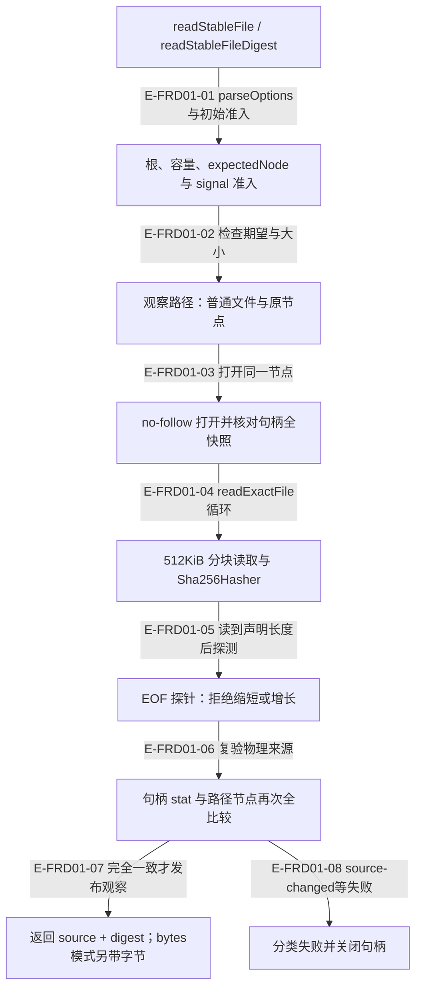

# 稳定读取：既要检查字节，也要检查来源

读取结果是本次受验证的观察。没有读到、读取超限、目录变化与确实为空有不同结局。当前目录分页实现包含既有未提交改动。

```mermaid
flowchart TB
  accTitle: 稳定文件读取的真实验证顺序
  accDescr: 文件读取绑定根、原始节点和no-follow句柄，逐块累计摘要，探测增长，最后复验句柄与路径全快照后才返回。
  beginRead["readStableFile / readStableFileDigest"]
  admission["根、容量、expectedNode 与 signal 准入"]
  initial["观察路径：普通文件与原节点"]
  opened["no-follow 打开并核对句柄全快照"]
  bytes["512KiB 分块读取与 Sha256Hasher"]
  eof["EOF 探针：拒绝缩短或增长"]
  finalCheck["句柄 stat 与路径节点再次全比较"]
  resultRead["返回 source + digest；bytes模式另带字节"]
  failureRead["分类失败并关闭句柄"]
  beginRead -->|"E-FRD01-01 parseOptions与初始准入"| admission
  admission -->|"E-FRD01-02 检查期望与大小"| initial
  initial -->|"E-FRD01-03 打开同一节点"| opened
  opened -->|"E-FRD01-04 readExactFile循环"| bytes
  bytes -->|"E-FRD01-05 读到声明长度后探测"| eof
  eof -->|"E-FRD01-06 复验物理来源"| finalCheck
  finalCheck -->|"E-FRD01-07 完全一致才发布观察"| resultRead
  finalCheck -->|"E-FRD01-08 source-changed等失败"| failureRead
```

### 本图术语说明

| 术语 | 含义 |
| --- | --- |
| expectedNode | 可选的已观察物理版本；本次读取不允许悄悄切到更新节点。 |
| digest模式 | 同样读取全部字节并hash，但不在内存收集整个文件。 |
| EOF探针 | 在声明长度后多读一个字节，用于识别读期间增长。 |
| 分类失败 | not-found、symlink、too-large、source-changed、aborted等；不能统一解释成“无数据”。 |

### 本图边级证据

| 编号 | 代码定位 | 测试 / 核验 | 关系依据 |
| --- | --- | --- | --- |
| E-FRD01-01 | `src/foundation/filesystem/stable-file-read.ts#readStableFileVersion` | `tests/foundation/filesystem/stable-file-read.test.ts#readStableFile` | 封闭选项与signal准入。 |
| E-FRD01-02 | `src/foundation/filesystem/stable-file-read.ts#assertExpectedNode` | 间接覆盖：`tests/foundation/filesystem/stable-file-read.test.ts#readStableFile`（预期版本反例） | 读取前全快照比较。 |
| E-FRD01-03 | `src/foundation/filesystem/stable-file-read.ts#openStableFile` | 间接覆盖：`tests/foundation/filesystem/stable-file-read.test.ts#readStableFile`（symlink拒绝） | O_NOFOLLOW句柄。 |
| E-FRD01-04 | `src/foundation/filesystem/stable-file-read.ts#readExactFile` | 间接覆盖：`tests/foundation/filesystem/stable-file-read.test.ts#readStableFileDigest`（hash路径） | 两种模式共用读取主体。 |
| E-FRD01-05 | `src/foundation/filesystem/stable-file-read.ts#readExactFile` | 未覆盖：本页不把常规读取测试当作EOF竞态注入证据。 | 少读或探测额外字节即拒绝。 |
| E-FRD01-06 | `src/foundation/filesystem/stable-file-read.ts#readStableFileVersion` | 未覆盖：当前该测试文件未注入读取期间的路径/句柄变更；此处结论来自函数体核对。 | 再次stat和路径观察。 |
| E-FRD01-07 | `src/foundation/filesystem/stable-file-read.ts#readStableFile` | `tests/foundation/filesystem/stable-file-read.test.ts#readStableFile` | 冻结source描述；Uint8Array本身不被深冻结。 |
| E-FRD01-08 | `src/foundation/filesystem/stable-file-read.ts#readStableFileVersion` | `tests/foundation/filesystem/stable-file-read.test.ts#readStableFile` | 主体错误优先，成功后关闭失败单独报告。 |

## 目录分页是另一条读取协议

1. 两次完整枚举，各保留 `maximumEntries + 1` 个字典序最小候选。
2. 对页内节点做两轮 lstat（最多8并发），名称与完整节点快照均需相等。
3. 目录句柄及路径前后必须为同一完整快照。
4. 返回一页及 `hasMore`；下一页携带上一页末名称与首个 `directoryNode`。
5. 连续页目录漂移报 `expectation-changed`，中止报 `aborted`；不能拼接成伪完整清单。

上述协议由 `src/foundation/filesystem/stable-directory-read.ts#readStableResourceDirectoryPage` 实现，正例与跨页修改反例见 `tests/foundation/filesystem/stable-directory-read.test.ts#readStableResourceDirectoryPage`。hook消费者另外要求查询complete，详见[观察模块](../16-observation/README.md)。

[基础总览](./README.md) · [写入与恢复](./file-publication-and-recovery.md)。
