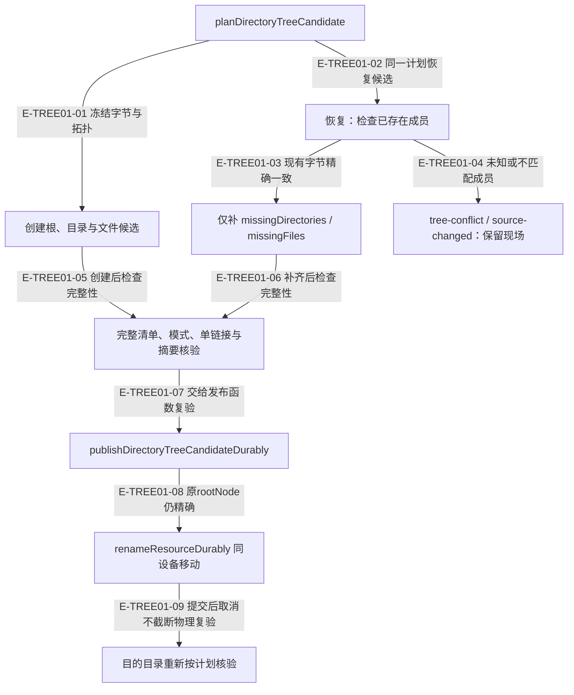
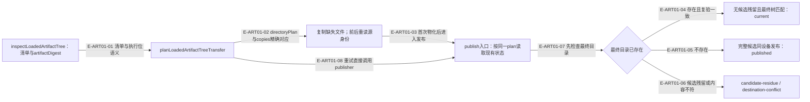

# 目录树：闭合计划、发布与精确退休

目录候选计划包含文件、推导的父目录、权限、字节数和摘要。它是可验证输入，是否以及何时发布/退休仍由业务 owner 决定；Foundation 不另建业务日志或状态机。

### 本图术语说明

| 术语 | 含义 |
| --- | --- |
| 闭合计划 | 文件排序唯一、目录由文件推导、无大小写或文件/目录冲突、明确容量和模式。 |
| 部分候选 | 只缺计划内成员；多余、变化或不安全成员是冲突，不能视作可补齐。 |
| 单设备 | 最终目录rename不能跨文件系统；复制到候选与最终发布是两种效果。 |
| rootNode | 候选目录的物理版本，用于避免换到另一棵同名树。 |

### 本图边级证据

| 编号 | 代码定位 | 测试 / 核验 | 关系依据 |
| --- | --- | --- | --- |
| E-TREE01-01 | `src/foundation/filesystem/durable-directory-tree-candidate.ts#createDirectoryTreeCandidateDurably` | `tests/foundation/filesystem/durable-directory-tree-candidate.test.ts#createDirectoryTreeCandidateDurably` | 顺序建目录、文件，最终校验。 |
| E-TREE01-02 | `src/foundation/filesystem/durable-directory-tree-candidate.ts#settleDirectoryTreeCandidateDurably` | `tests/foundation/filesystem/durable-directory-tree-candidate.test.ts#settleDirectoryTreeCandidateDurably` | 恢复使用相同文件输入与计划。 |
| E-TREE01-03 | `src/foundation/filesystem/directory-tree-candidate-inspection.ts#inspectPartialDirectoryTreeCandidate` | 间接覆盖：`tests/foundation/filesystem/durable-directory-tree-candidate.test.ts#settleDirectoryTreeCandidateDurably`（只补缺项） | 存在成员额外按字节等值核对。 |
| E-TREE01-04 | `src/foundation/filesystem/directory-tree-candidate-inspection.ts#inspectDirectoryTreeCandidateProgress` | 间接覆盖：`tests/foundation/filesystem/durable-directory-tree-candidate.test.ts#settleDirectoryTreeCandidateDurably`（不匹配候选拒绝） | 未知成员不得被吞掉。 |
| E-TREE01-05 | `src/foundation/filesystem/durable-directory-tree-candidate.ts#createDirectoryTreeCandidateDurably` | `tests/foundation/filesystem/durable-directory-tree-candidate.test.ts#createDirectoryTreeCandidateDurably` | 完整清单才返回candidate回执。 |
| E-TREE01-06 | `src/foundation/filesystem/durable-directory-tree-candidate.ts#settleDirectoryTreeCandidateDurably` | `tests/foundation/filesystem/durable-directory-tree-candidate.test.ts#settleDirectoryTreeCandidateDurably` | 部分候选不能直接发布。 |
| E-TREE01-07 | `src/foundation/filesystem/durable-directory-tree-publication.ts#publishDirectoryTreeCandidateDurably` | `tests/foundation/filesystem/durable-directory-tree-publication.test.ts#publishDirectoryTreeCandidateDurably` | 发布函数重新检查计划和rootNode。 |
| E-TREE01-08 | `src/foundation/filesystem/durable-resource-rename.ts#renameResourceDurably` | 间接覆盖：`tests/foundation/filesystem/durable-directory-tree-publication.test.ts#publishDirectoryTreeCandidateDurably`（现存目的与来源漂移） | 两次观察目的缺失后调用rename；不能宣称OS级RENAME_NOREPLACE。 |
| E-TREE01-09 | `src/foundation/filesystem/durable-directory-tree-publication.ts#publishDirectoryTreeCandidateDurably` | `tests/foundation/filesystem/durable-directory-tree-publication.test.ts#publishDirectoryTreeCandidateDurably` | 移动后完整读取没有传signal；失败是commit-uncertain。 |

## 退休协议与发布协议分开

`src/foundation/filesystem/durable-directory-tree-candidate-retirement.ts#retireDirectoryTreeCandidateDurably` 要求先证明完整候选。恢复入口 `settleDirectoryTreeCandidateRetirement` 可接受已经缺失的成员，只有整根已不存在才返回 absent。

实际顺序是：按计划捕获剩余成员及hash → 逐个精确unlink文件 → 按深度从叶到根rmdir → 复验根消失。目录不空、身份变化或出现未知成员立即停止。它不使用 recursive rm，也不把任意目录当作可清理候选。各成员有独立提交点，部分退休可由同一计划续做。该保证仅适用于这组 Foundation 入口；Demand归档的活动根退休另有直接rm实现，见生命周期模块。

## 加载树迁移是可用库能力，不是自动升级流程

### 本图术语说明

| 术语 | 含义 |
| --- | --- |
| artifactDigest | 排序文件清单、每文件hash/字节数/可执行位组成的JCS摘要；不是发布授权。 |
| copies | 源相对路径到候选相对路径的闭合映射，不允许隐式多复制或漏复制。 |
| current | 既有最终树已经符合计划，且不存在冲突候选；不代表宿主正在加载它。 |
| 库入口 | 架构检查列明的独立生产入口；不能用“模块存在”推导已接入公开工具。 |

### 本图边级证据

| 编号 | 代码定位 | 测试 / 核验 | 关系依据 |
| --- | --- | --- | --- |
| E-ART01-01 | `src/foundation/artifact/loaded-artifact-tree-transfer-plan.ts#planLoadedArtifactTreeTransfer` | 间接覆盖：`tests/foundation/artifact/loaded-artifact-tree-transfer-publication.test.ts#planLoadedArtifactTreeTransfer`（构造真实计划） | 目录与文件mode不能破坏可执行语义。 |
| E-ART01-02 | `src/foundation/artifact/loaded-artifact-tree-transfer-candidate.ts#materializeLoadedArtifactTreeTransferCandidate` | `tests/foundation/artifact/loaded-artifact-tree-transfer-publication.test.ts#materializeLoadedArtifactTreeTransferCandidate` | 只复制缺项，且源摘要前后相等。 |
| E-ART01-03 | `src/foundation/artifact/loaded-artifact-tree-transfer-publication.ts#publishLoadedArtifactTreeTransferCandidate` | `tests/foundation/artifact/loaded-artifact-tree-transfer-publication.test.ts#publishLoadedArtifactTreeTransferCandidate` | 最终目录与候选状态分别读取。 |
| E-ART01-04 | `src/foundation/artifact/loaded-artifact-tree-transfer-publication.ts#readCurrentFinal` | 间接覆盖：`tests/foundation/artifact/loaded-artifact-tree-transfer-publication.test.ts#publishLoadedArtifactTreeTransferCandidate`（幂等最终读取） | 按directoryPlan复验全树。 |
| E-ART01-05 | `src/foundation/artifact/loaded-artifact-tree-transfer-publication.ts#publishLoadedArtifactTreeTransferCandidate` | `tests/foundation/artifact/loaded-artifact-tree-transfer-publication.test.ts#publishLoadedArtifactTreeTransferCandidate` | 不覆盖已观察到的最终树。 |
| E-ART01-07 | `src/foundation/artifact/loaded-artifact-tree-transfer-publication.ts#publishLoadedArtifactTreeTransferCandidate` | `tests/foundation/artifact/loaded-artifact-tree-transfer-publication.test.ts#publishLoadedArtifactTreeTransferCandidate` | current检查先于读取候选；不可要求先重复物化候选。 |
| E-ART01-08 | `src/foundation/artifact/loaded-artifact-tree-transfer-publication.ts#publishLoadedArtifactTreeTransferCandidate` | `tests/foundation/artifact/loaded-artifact-tree-transfer-publication.test.ts#publishLoadedArtifactTreeTransferCandidate` | 同计划的发布重放可直接从最终状态返回。 |
| E-ART01-06 | `src/foundation/artifact/loaded-artifact-tree-transfer-publication.ts#publishLoadedArtifactTreeTransferCandidate` | `tests/foundation/artifact/loaded-artifact-tree-transfer-publication.test.ts#publishLoadedArtifactTreeTransferCandidate` | 有候选残留或目的冲突则拒绝。 |

加载树身份不记录空目录本身，物理扫描仍对它们计预算。产品安装、版本选择、已运行进程更新与此处纯树能力是不同问题。

[基础总览](./README.md) · [文件发布](./file-publication-and-recovery.md) · [制品与合同生成](../17-artifacts-and-contracts/README.md)。
