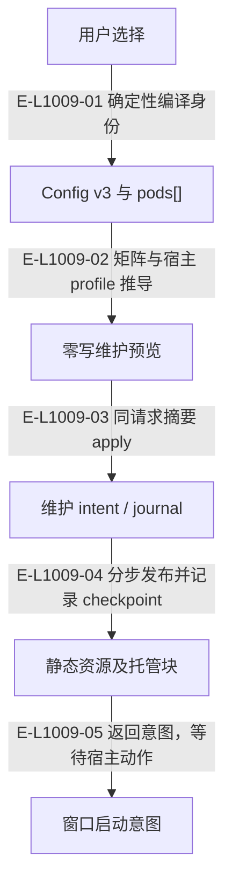

# 工作区：配置、维护事务与静态资源

初始化产生 primary Pod、逻辑窗口和托管资源；创建真实宿主会话是随后由 Agent 执行的动作。配置仍由严格 v3 codec 校验。

> 核验基线：`1480271`（L1 observation 第十片已落地，20 个公共工具、18 个一次性场景）。工作树另有并行未提交改动（宿主 hook 通道等），本图不描绘；来源指纹按当前工作树计算。本文说明实现事实，未宣称双宿主真实会话已经验证。

## 工作区维护的权威与生成物

### 本图术语说明

| 术语 | 本图含义 |
| --- | --- |
| Pod | 完整窗口组与每仓执行位置；main 是 primary Pod。 |
| host | Codex 或 Claude Code；真实会话动作由 Agent 调用宿主完成。 |
| CAS | 比较已观察的摘要/修订后提交；来源已改变则拒绝。 |

### 节点与实现定位

| 节点 | 文件 / 符号 | 责任 |
| --- | --- | --- |
| selection | `src/configuration/wakeflow-fresh-config-selection.ts` | 用户选择 |
| config | `src/configuration/wakeflow-config-v3.ts` | Config v3 与 pods[] |
| preview | `src/capabilities/workspace/maintain-workspace.ts` | 零写维护预览 |
| txn | `src/workspace/maintenance/wakeflow-maintenance-execution-transaction.ts` | 维护 intent / journal |
| resources | `src/workspace/maintenance/wakeflow-static-materialization-preview.ts` | 静态资源及托管块 |
| launch | `src/capabilities/endpoint/service.ts` | 窗口启动意图 |

### 本图边级证据

| 编号 | 代码定位 | 测试 / 核验 | 关系依据 |
| --- | --- | --- | --- |
| E-L1009-01 | `src/configuration/wakeflow-fresh-config-selection.ts` | `tests/capabilities/workspace/maintain-workspace.test.ts` | 确定性编译身份 |
| E-L1009-02 | `src/capabilities/workspace/maintain-workspace.ts` | `tests/capabilities/workspace/maintain-workspace.test.ts` | 矩阵与宿主 profile 推导 |
| E-L1009-03 | `src/kernel/publication-transaction.ts#runPublicationTransaction` | `tests/capabilities/workspace/maintain-workspace.test.ts` | 同请求摘要 apply |
| E-L1009-04 | `src/workspace/maintenance/wakeflow-maintenance-execution-transaction.ts` | `tests/capabilities/workspace/maintain-workspace.test.ts` | 分步发布并记录 checkpoint |
| E-L1009-05 | `src/capabilities/workspace/maintain-workspace.ts` | `tests/capabilities/workspace/maintain-workspace.test.ts` | 返回意图，等待宿主动作 |

## 守卫、恢复与验证范围

reconfigure 对 pods 的改变仍报告 unsupported，Pod 生命周期由专属工具处理。全局 status/verify、活动投影与 Claude 状态栏已随 observation 落地：维护事务仍拥有布局与静态资源，投影页面由内核渲染、由变更后刷新重写，不反向决定配置。

涉及的测试与核验入口：

- `tests/capabilities/workspace/maintain-workspace.test.ts`。

## 下钻与相关视图

- [文件直接导入](./file-dependencies.md)
- [运行调用与恢复](./runtime-call-flow.md)
- [端点握手](../12-endpoint/README.md)
- [Pod 配置与生命周期](../15-pod/README.md)
- [图谱总索引](../README.md)
- [核验与剩余范围](../01-diagram-review-ledger.md)
