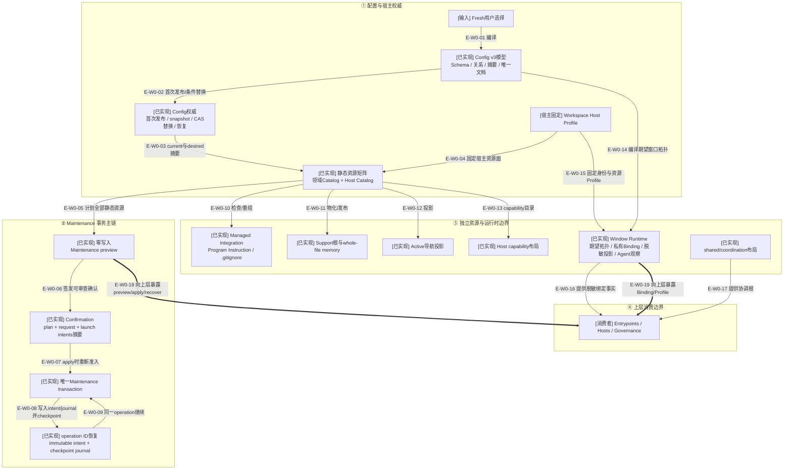

# Configuration 与 Workspace：权威、资源和维护边界

> 本文描述提交`d17602e`中的Config v3与Workspace候选运行时。配置文件、私有Binding、
> 不可变 Maintenance intent 和可变 checkpoint journal 是不同权威，不能合并成一个状态。
>
> 静态物化、共享协调布局和Agent宿主窗口观察均已提交，并由Maintenance、Delivery与Testing消费。

## 当前结论

Configuration 负责把 Fresh 选择编译为严格、递归冻结的 v3 模型，并以
`wakeflow.config.json`作为 Workspace 配置权威。Workspace 使用当前/目标配置摘要、固定宿主
Profile和静态 Resource Catalog 编译资源矩阵，再通过零写入 preview、显式 confirmation、
唯一 Maintenance transaction 和 operation ID 恢复执行。

Window Runtime 另有私有 Binding authority 与脱敏 projection；Agent 提供的窗口观察必须与
当前 Binding、Host Profile和 Config 逻辑根精确闭合后，才能供 Delivery/Testing 等治理消费者使用。

## 核验快照

| 项目 | 读取值 |
| --- | --- |
| 分支/提交 | `main`；`d17602ed9931a1898f713c740752c54b94bd8086` |
| 生产源码 | Configuration 10 个模块；Workspace 81 个模块 |
| 聚焦闭包 | 202 个模块、1373 条依赖、0 违规 |
| 测试 | 54 个正式测试；另有 2 个 fixture |
| 合同 | 7 个 JSON Schema、7 个生成 TypeScript 合同 |
| 提交状态 | Configuration/Workspace源码、7个Schema及相关测试已提交 |
| 来源指纹 | `505f4f76b12dd208bcd117075a93a6f626d6b11503f47109b3d9fec484fddc7a` |

## W0：配置权威与工作区能力全景

### 本图术语说明

| 图中术语 | 解释 |
| --- | --- |
| Fresh选择 | 尚未持久化的用户闭合选择；编译结果包含完整 Config 和可审查 ID allocation |
| Config权威 | Workspace根的`wakeflow.config.json`；snapshot只对一次读取有效，写入时必须锁内重读 |
| Host Profile | 由固定宿主组合根注入、会改变静态资源矩阵形状的宿主资源与身份能力 |
| Resource Catalog | 领域所有者声明的静态或动态资源、路径、节点策略、权限和职责元数据 |
| 静态资源矩阵 | 纯组合、冻结且按 declaration ID 唯一的领域/宿主资源全集 |
| preview | 读取当前状态并产生零写入计划；不能直接作为后续执行授权 |
| Confirmation | 绑定 exact plan、request、host profiles与可选launch intents的摘要证明 |
| intent | operation创建后不可变的完整执行意图，可在进程重启后重建 exact plan/request |
| journal | mutable checkpoint权威；每一步只允许单调 successor并在读回后推进 |
| Binding authority | 0600私有资源中的窗口ID、宿主ID与opaque handle身份，不进入公开投影 |
| projection | 可重建、脱敏、面向人类或治理消费者的派生视图，不反向成为权威 |

## W0边级证据

| 边编号 | 代码证据 | 核验结论 |
| --- | --- | --- |
| `E-W0-01`–`E-W0-04` | Fresh Config编译、Config Authority与Host Profile | Config与宿主Profile先于资源矩阵，且各自保持独立权威 |
| `E-W0-05`–`E-W0-09` | Maintenance Preview/Confirmation/Transaction/Recovery | preview零写；apply重验exact confirmation；intent/journal支持同operation恢复 |
| `E-W0-10`–`E-W0-17` | Static Matrix与各领域Resource owner | Managed、Support、Active、Host/Window/Shared资源由各自owner物化或投影 |
| `E-W0-18`、`E-W0-19` | Public Coordinator与Window Binding入口 | 上层只取得有界Maintenance结果和脱敏Binding事实 |

## 模块分布

| 能力簇 | 生产模块数 | 主要职责 |
| --- | ---: | --- |
| Configuration | 10 | Config v3模型、确定文档、权威snapshot、发布、替换、恢复与根位置 |
| Maintenance | 22 | 资源计划、confirmation、gate、intent、journal、transaction与恢复 |
| Window Runtime | 21 | 路径、期望拓扑、Fresh投影、Binding store、注册与registered projection |
| Managed Integration | 13 | Program Instruction、`.gitignore`和受管文本精确重组 |
| Active | 7 | 活动布局、Fresh权威、检查和两份可丢弃投影发布 |
| Support | 7 | Support根、whole-file memory检查、CAS发布与恢复 |
| Host Runtime | 2 | 按Profile capability编译并物化宿主能力目录 |
| Workspace根级 | 9 | Resource Declaration、Host Profile、Catalog、静态矩阵与共享协调布局 |

## 权威与投影边界

| 事实 | 权威来源 | 派生/消费者 | 恢复方式 |
| --- | --- | --- | --- |
| Config v3 | `wakeflow.config.json` | Config indexes、root placement、资源矩阵、期望拓扑 | Config专属锁 + stage恢复 + 精确前序替换 |
| Maintenance exact执行 | immutable execution intent | plan/request重建 | operation ID读取intent并验证唯一事务前缀 |
| Maintenance checkpoint | mutable journal | step receipts与terminal结果 | 单调successor、读回验证、prepared/affected状态恢复 |
| Window Host Binding | 当前宿主0600私有Binding store | registered runtime projection、Delivery/Testing | store锁、inventory恢复、projection独立重建 |
| Active workspace状态 | Config/Demand等领域权威 | `index.md`与`workspace-current-status.md` | projector锁内幂等重建 |
| Managed文本 | 外部原文 + Wakeflow受管body权威 | 重组候选与最终文件 | 短锁内重做inspection，CAS替换或显式recovery |

## 直接消费者

| 消费层 | 直接消费者模块数 | 典型用途 |
| --- | ---: | --- |
| Governance | 28 | Delivery/Testing宿主行动、WindowWorkClaim、Demand窗口身份与任务投递 |
| Hosts | 9 | 固定Maintenance capability、宿主设置组合与操作执行器 |
| Entrypoints | 5 | 公共Maintenance/Binding协调器和两宿主固定组合入口 |

## 状态与恢复原则

- Config snapshot不是长期租约；Config发布、替换和恢复各有独立职责，替换必须在专属短锁内重读。
- Maintenance `preview`是零写入；`apply`必须携带完整confirmation并复验宿主profiles和摘要。
- 非空transaction先创建immutable intent，再创建prepared journal，之后每个step执行前/后推进checkpoint。
- 恢复只凭operation ID、磁盘intent/journal和固定宿主capability；不会复用旧进程内对象。
- Binding写入成功但registered projection失败时，Binding不回滚；返回projection recovery required。
- 投影、Markdown和launch intents都不是业务权威；宿主效果仍由Agent/宿主执行。

## 当前边界

- 静态物化preview/step executor、资源矩阵及恢复测试已进入提交基线；
- Agent宿主窗口观察、Binding store authority和共享协调布局由治理纵切真实消费；
- Maintenance仍只管理Wakeflow静态资源，不执行Agent宿主效果或治理业务转换。

## 验证证据

| 证据 | 当前结果 | 能证明什么 |
| --- | --- | --- |
| Configuration/Workspace dependency-cruiser | 202 模块、1373 依赖、0 违规 | 当前闭包无循环、未解析依赖或跨层违规 |
| 正式测试清单 | 54 个 `*.test.ts` | 覆盖主要配置、Maintenance、Managed、Support、Active和Window边界；已进入948项完整门 |
| Schema/生成合同 | 7/7 | Config、Maintenance、Binding和投影具有生成合同来源 |
| 公共入口静态检查 | 18工具双宿主组合 | Maintenance与Binding保持Workspace owner；Demand Publication与其余治理工具只消费关闭、脱敏或owner派生事实 |

## 下钻入口

- [Configuration/Workspace关键文件依赖](./file-dependencies.md)
- [Config、Maintenance与Binding运行时流程](./runtime-call-flow.md)
- [返回Foundation](../02-foundation/README.md)
