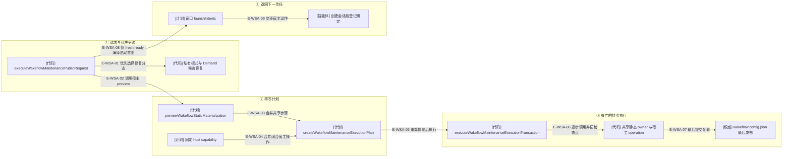

# 工作区：配置权威、维护事务与资源所有权

本轮按 **2026-10-03 当前工作树**核验。配置合同是 `WakeflowConfig` **schemaVersion 2**，只接受当前格式；没有 v1 读取、升级动作或停写确认字段。配置保存持久意图，窗口句柄、进程和业务事件有各自 owner。`reconfigure`、`reconcile` 和中断 `recover` 均限于当前格式，不能被解释为旧工作区迁移。

维护有三层不同的工作：公共入口选择本轮优先处理的问题；静态计划组合共享资源与固定宿主贡献；事务按冻结的意图和检查点向前完成。Codex/Claude 的宿主维护能力由入口固定注入，请求不能选另一个宿主。

```mermaid
flowchart LR
  accTitle: 工作区从维护请求到持久配置的责任分层
  accDescr: 公共入口先分流权限模式和业务恢复，再把共享静态计划与宿主贡献冻结为事务，领域所有者发布资源，配置最后提交，窗口启动仍由智能体执行。
  subgraph REQUEST_STAGE["① 请求与优先分流"]
    M["[代码] executeWakeflowMaintenancePublicRequest"]
    P["[代码] 私有模式与 Demand 候选恢复"]
  end
  subgraph B["② 零写计划"]
    S["[计划] previewWakeflowStaticMaterialization"]
    H["[计划] 固定 host capability"]
    X["[计划] createWakeflowMaintenanceExecutionPlan"]
  end
  subgraph EFFECT_STAGE["③ 有门的持久执行"]
    T["[代码] executeWakeflowMaintenanceExecutionTransaction"]
    O["[代码] 共享静态 owner 与宿主 operation"]
    C["[权威] wakeflow.config.json 最后发布"]
  end
  subgraph D["④ 返回下一责任"]
    L["[计划] 窗口 launchIntents"]
    A["[智能体] 创建会话后登记绑定"]
  end
  M -->|"E-WSA-01 优先选择修复分支"| P
  M -->|"E-WSA-02 调用宿主 preview"| S
  S -->|"E-WSA-03 合并共享步骤"| X
  H -->|"E-WSA-04 合并闭合宿主操作"| X
  X -->|"E-WSA-05 重算摘要后执行"| T
  T -->|"E-WSA-06 逐步调用并记检查点"| O
  O -->|"E-WSA-07 最后提交配置"| C
  M -->|"E-WSA-08 仅 fresh ready 编译启动意图"| L
  L -->|"E-WSA-09 交还宿主动作"| A
```

### 本图术语说明

| 术语 | 含义 |
| --- | --- |
| 零写计划 | preview 不创建工作区资源；返回摘要不能证明任何效果已经发生。 |
| 固定宿主贡献 | Codex 贡献窗口投影；Claude 另贡献 portable settings、状态栏、tmux 资产及本地状态栏设置。 |
| 检查点 | journal 在效果前登记 affectedStepId，效果成功后推进 checkpoint；中断后重放同一步。未退休的事务保留对普通写者的阻断。 |
| 配置最后提交 | 共享步骤、宿主步骤完成后才 publish-config；不代表跨文件原子事务或自动回滚。 |
| 启动意图 | 当前配置的派生合同；不创建线程、窗格或 worktree。 |

### 本图边级证据

| 编号 | 源码 / 符号与真实关系 | 测试证据 |
| --- | --- | --- |
| E-WSA-01 | `src/capabilities/workspace/maintain-workspace.ts#planMaintenance` 依次调用 privateModePlan、planRuntimeRecovery。 | `tests/capabilities/workspace/demand-runtime-recovery.test.ts#executeCodexWakeflowMaintenance` |
| E-WSA-02 | `src/workspace/maintenance/wakeflow-maintenance-execution-preview.ts#previewWakeflowMaintenanceExecution` 调用 `src/workspace/maintenance/wakeflow-static-materialization-preview.ts#previewWakeflowStaticMaterialization`。 | 间接覆盖：`tests/capabilities/workspace/maintain-workspace.test.ts#executeCodexWakeflowMaintenance` 经固定 Codex facade。 |
| E-WSA-03 | `src/workspace/maintenance/wakeflow-maintenance-execution-plan.ts#createWakeflowMaintenanceExecutionPlan` 重建步骤顺序。 | `tests/workspace/maintenance/wakeflow-maintenance-execution-plan.test.ts#createWakeflowMaintenanceExecutionPlan` |
| E-WSA-04 | `src/workspace/maintenance/wakeflow-maintenance-execution-preview.ts#previewWakeflowMaintenanceExecution` 调 capability.planContribution 并校验 host/capability 身份。 | 间接覆盖：`tests/hosts/claude-code/claude-code-maintenance-execution.test.ts#previewClaudeCodeMaintenanceExecution` 组合 Claude 操作。 |
| E-WSA-05 | `src/workspace/maintenance/wakeflow-maintenance-execution-transaction.ts#executeWakeflowMaintenanceExecutionTransaction` 在门外和门内各复算计划；`src/workspace/maintenance/wakeflow-maintenance-gate.ts#runCorrelatedGate` 在维护锁内进入独占工作区作用域。 | `tests/workspace/maintenance/wakeflow-maintenance-execution-transaction.test.ts#executeWakeflowMaintenanceExecutionTransaction`；`tests/capabilities/workspace/operation-scope.test.ts#executeCodexWakeflowMaintenance` |
| E-WSA-06 | `src/workspace/maintenance/wakeflow-maintenance-execution-transaction.ts#advanceJournal` 分派 shared-static / host-capability。 | `tests/workspace/maintenance/wakeflow-maintenance-execution-transaction.test.ts#executeWakeflowStaticMaterializationStep` |
| E-WSA-07 | `src/workspace/maintenance/wakeflow-static-materialization-step-executor.ts#executeConfig` 创建或精确替换；`src/workspace/maintenance/wakeflow-maintenance-execution-plan.ts#orderedSteps` 保证末位。 | `tests/workspace/maintenance/wakeflow-maintenance-execution-transaction.test.ts#executeWakeflowMaintenanceExecutionTransaction` |
| E-WSA-08 | `src/capabilities/workspace/maintain-workspace.ts#expectedLaunchIntents` 调 `src/workspace/window-runtime/wakeflow-window-launch-intent.ts#compileWakeflowWindowLaunchIntents`。 | `tests/capabilities/workspace/maintain-workspace.test.ts#executeCodexWakeflowMaintenance` |
| E-WSA-09 | `src/workspace/window-runtime/wakeflow-window-launch-intent.ts#createIntent` 明示 not-authorized-by-preview；`src/capabilities/workspace/maintain-workspace.ts#nextAfterLaunchIntents` 返回 window-launch。 | `tests/workspace/window-runtime/wakeflow-window-launch-intent.test.ts#compileWakeflowWindowLaunchIntents` |

### 资源所有权与写入界限

| 对象 | 真实 producer / consumer | 权限与恢复 |
| --- | --- | --- |
| 配置 | `src/configuration/wakeflow-config.ts#parseWakeflowConfig`；`src/configuration/wakeflow-config-authority-snapshot.ts#readWakeflowConfigAuthoritySnapshot` 被业务 owner 读取 | 0644、单硬链接、当前用户；语义摘要与源字节摘要分别核验。 |
| 外部仓库 / external-owned 支撑面 | `src/workspace/managed-integration/wakeflow-external-instruction-recomposition.ts#recomposeWakeflowExternalInstruction` | 只在已有根维护受管块；保留块外字节及已有文件模式，不创建产品根。 |
| wakeflow-managed 支撑面 | `src/workspace/support/wakeflow-managed-support-root-materialization.ts#materializeWakeflowManagedSupportRoot` 与 `src/workspace/support/wakeflow-support-memory-publication.ts#publishWakeflowSupportMemory` | design 建 drafts，test 建 harnesses/fixtures；指令文件整份由 Wakeflow 渲染，未知内容拒绝覆盖。 |
| 私有维护合同 | `src/workspace/maintenance/wakeflow-maintenance-execution-intent-store.ts#publishWakeflowMaintenanceExecutionIntent`；`src/workspace/maintenance/wakeflow-maintenance-journal-store.ts#checkpointWakeflowMaintenanceJournal` | 0600、active gate context、唯一事务目录；成功后依次退休 intent、journal。 |
| 窗口投影 | `src/workspace/window-runtime/wakeflow-window-runtime-projection-maintenance.ts#refreshWakeflowWindowRuntimeProjections` | 在 shared 作用域与 binding store 锁内重新读取配置和绑定，再派生文档；registered 投影不替代端点实时 preflight，也不证明目标 MCP 版本。 |
| 资源矩阵 | `src/workspace/wakeflow-workspace-static-resource-matrix.ts#createWakeflowWorkspaceStaticResourceMatrix` | 编译声明/模式/owner/recipe，无 I/O；声明允许某个 recipe 不等于已获得锁或用户授权。 |

### 当前边界

- reconfigure 允许保留既有仓库/窗口的前提下，为 primary Pod 添加仓库及恰好一个 product 窗口；拒绝移动/删除既有根、改变既有窗口及修改 Pod。Pod 变更走其独立能力。
- 权限模式修复和 Demand 候选恢复先单独完成，结果指向下一次 reconcile；它们没有 maintenance operationId。静态物化中断才按 operationId 读取 intent/journal 恢复。
- 普通写者先取得 shared 或 exclusive 作用域再加载上下文；静态维护先取得关联门，再独占并等待在途写者。权限模式收敛仍只用逐节点 CAS，不套用这个总括。详见[作用域与当前配置基线](./operation-scope-and-config-baseline.md)。
- Codex 角色聊天统一属于外层工作区项目，启动根与实际执行根分离；配置中的角色根仍约束任务执行。启动说明由宿主纯渲染端口产生，详见[项目聊天与执行根](../09-public-mcp-host-seams/project-chats-and-execution-roots.md)。
- Claude 的 portable-settings 计划对非 fresh 的缺失 managed 支撑面根仍返回 support-root-missing；共享层虽能安排重建，该宿主贡献会阻塞聚合计划。此限制由源码可见，本轮未独立执行复现。
- 零写、计划漂移、取消、effect-before-checkpoint 与 intent-only/terminal-only 前缀有测试；本次图谱工作未执行真实宿主登录会话。

[直接导入图](./file-dependencies.md) · [分支、事务与资源流程](./runtime-call-flow.md) · [MCP 与宿主](../09-public-mcp-host-seams/README.md) · [本轮变更核验](../../plans/review-2026-10-03/hosts-workspace.md)
