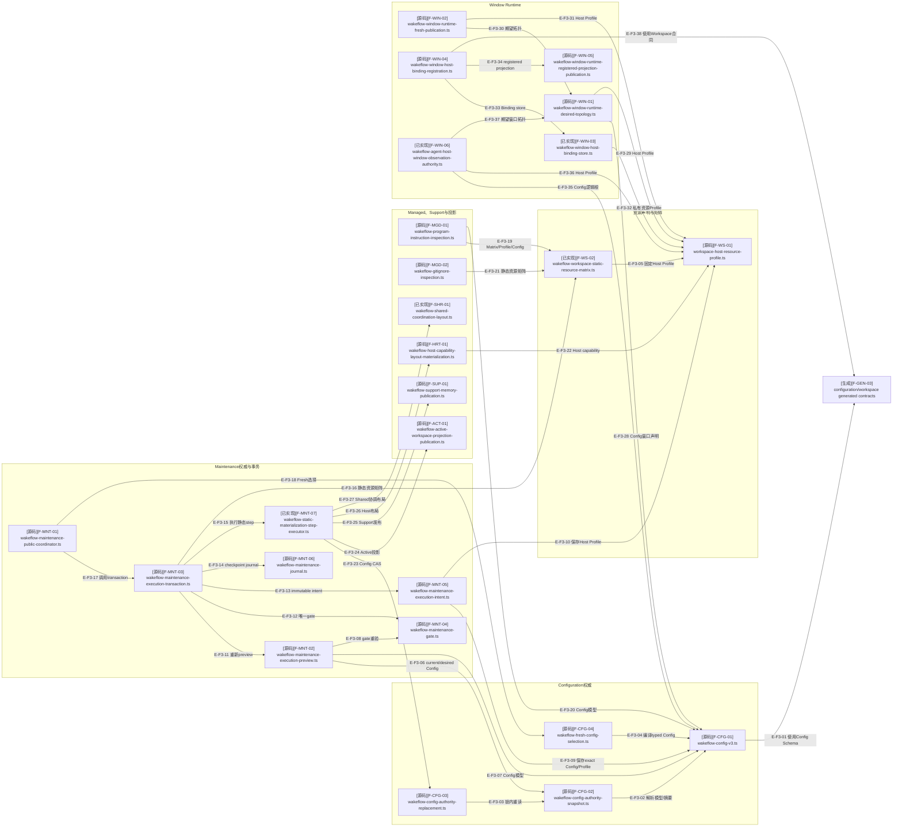

# Configuration 与 Workspace：关键文件导入依赖

> 本图从 91 个生产模块中选择 25 个权威、编排和派生发布骨干文件。页面默认显示高连接入口概览，
> ELK全图用于检查静态依赖方向；运行时状态顺序见[关键调用流](./runtime-call-flow.md)。

## F3：配置与工作区关键文件依赖

### 本图术语说明

| 图中术语 | 解释 |
| --- | --- |
| typed Config | 通过Schema、类型化引用和跨实体关系复验的递归冻结 v3 模型 |
| Config CAS | 在专属短锁中重读当前权威，并以完整稳定源预期条件替换 |
| Host Profile | 会改变静态资源矩阵、宿主能力目录与窗口身份面的固定宿主画像 |
| gate重验 | 取得唯一Maintenance gate后重新检查Core Layout和完整plan，防止preview陈旧 |
| exact intent | 足以在重启后重建相同plan/request/desired Config/Profile的不可变记录 |
| checkpoint journal | 执行步骤前后单调推进、支持prepared/affected/terminal恢复的可变权威 |
| registered projection | 从私有Binding派生的脱敏窗口投影；失败不回滚Binding |
| Agent观察权威 | Agent观察与当前Binding、Host Profile、Config逻辑根闭合后的脱敏事实 |

## 文件与符号映射

| 文件编号 | 相对路径 | 代表符号 | 状态 | 职责 |
| --- | --- | --- | --- | --- |
| `F-CFG-01` | `src/configuration/wakeflow-config-v3.ts` | `parseWakeflowConfigV3`、`computeWakeflowConfigV3Digest` | 已实现 | v3模型、跨字段关系、摘要与索引 |
| `F-CFG-02` | `src/configuration/wakeflow-config-authority-snapshot.ts` | `readWakeflowConfigAuthoritySnapshot` | 已实现 | 一次操作范围的完整配置权威快照 |
| `F-CFG-03` | `src/configuration/wakeflow-config-authority-replacement.ts` | `replaceWakeflowConfigAuthority` | 已实现 | Config锁内幂等判断与条件替换 |
| `F-CFG-04` | `src/configuration/wakeflow-fresh-config-selection.ts` | `compileWakeflowFreshConfigSelection` | 已实现 | Fresh选择编译为Config与ID allocation |
| `F-WS-01` | `src/workspace/workspace-host-resource-profile.ts` | `parseWakeflowWorkspaceHostResourceProfile` | 已实现 | 宿主静态资源与能力表面 |
| `F-WS-02` | `src/workspace/wakeflow-workspace-static-resource-matrix.ts` | `createWakeflowWorkspaceStaticResourceMatrix` | 已实现 | 组合领域/宿主Catalog并复验全局唯一性 |
| `F-MNT-01` | `src/workspace/maintenance/wakeflow-maintenance-public-coordinator.ts` | `executeWakeflowMaintenancePublicRequest` | 已实现 | 公共preview/apply/recover唯一编排边界 |
| `F-MNT-02` | `src/workspace/maintenance/wakeflow-maintenance-execution-preview.ts` | `previewWakeflowMaintenanceExecution` | 已实现 | 合并共享步骤与宿主contribution的零写入计划 |
| `F-MNT-03` | `src/workspace/maintenance/wakeflow-maintenance-execution-transaction.ts` | `execute*Transaction`、`recover*Transaction` | 已实现 | 重验plan、intent/journal、step执行与恢复 |
| `F-MNT-04` | `src/workspace/maintenance/wakeflow-maintenance-gate.ts` | `withWakeflowMaintenanceGate` | 已实现 | bootstrap后唯一gate及锁内Core Layout重验 |
| `F-MNT-05` | `src/workspace/maintenance/wakeflow-maintenance-execution-intent.ts` | `create*Intent`、`reconstruct*FromIntent` | 已实现 | immutable exact execution intent |
| `F-MNT-06` | `src/workspace/maintenance/wakeflow-maintenance-journal.ts` | `begin*Step`、`complete*Step`、`terminalize*` | 已实现 | mutable checkpoint领域模型与单调后继 |
| `F-MNT-07` | `src/workspace/maintenance/wakeflow-static-materialization-step-executor.ts` | `executeWakeflowStaticMaterializationStep` | 已实现 | 按step路由Config、Active、Support、Host/Window/Shared owner |
| `F-MGD-01` | `src/workspace/managed-integration/wakeflow-program-instruction-inspection.ts` | `inspectWakeflowProgramInstruction` | 已实现 | Program Instruction零写入检查与重组候选 |
| `F-MGD-02` | `src/workspace/managed-integration/wakeflow-gitignore-inspection.ts` | `inspectWakeflowWorkspaceGitignore` | 已实现 | `.gitignore`原文/受管body/Git语义检查 |
| `F-SUP-01` | `src/workspace/support/wakeflow-support-memory-publication.ts` | `publishWakeflowSupportMemory` | 已实现 | whole-file memory无锁单资源CAS发布 |
| `F-ACT-01` | `src/workspace/active/wakeflow-active-workspace-projection-publication.ts` | `publishWakeflowActiveWorkspaceProjection` | 已实现 | projector锁内幂等发布两份导航投影 |
| `F-HRT-01` | `src/workspace/host-runtime/wakeflow-host-capability-layout-materialization.ts` | `materializeWakeflowHostCapabilityLayout` | 已实现 | 按Profile capability物化空父目录 |
| `F-SHR-01` | `src/workspace/wakeflow-shared-coordination-layout.ts` | `materializeWakeflowSharedCoordinationLayout` | 已实现 | shared/coordination/WindowWorkClaim三层布局owner |
| `F-WIN-01` | `src/workspace/window-runtime/wakeflow-window-runtime-desired-topology.ts` | `compileWakeflowWindowRuntimeDesiredTopology` | 已实现 | 从Config编译窗口逻辑根与静态拓扑 |
| `F-WIN-02` | `src/workspace/window-runtime/wakeflow-window-runtime-fresh-publication.ts` | `publishFreshWakeflowWindowRuntime` | 已实现 | 独占发布Fresh宿主本地布局与未注册投影 |
| `F-WIN-03` | `src/workspace/window-runtime/wakeflow-window-host-binding-store.ts` | `with*Store`、`create*InStore` | 已实现 | 0600私有Binding inventory、锁、恢复和no-replace创建 |
| `F-WIN-04` | `src/workspace/window-runtime/wakeflow-window-host-binding-registration.ts` | `registerWakeflowWindowHostBinding` | 已实现 | 首次注册或replay并同步registered projection |
| `F-WIN-05` | `src/workspace/window-runtime/wakeflow-window-runtime-registered-projection-publication.ts` | `publishWakeflowWindowRuntimeRegisteredProjection` | 已实现 | 由Binding幂等创建/替换脱敏registered投影 |
| `F-WIN-06` | `src/workspace/window-runtime/wakeflow-agent-host-window-observation-authority.ts` | `compileWakeflowAgentHostWindowObservationAuthority` | 已实现 | 闭合Agent观察、Binding、Profile和Config逻辑根 |
| `F-GEN-03` | `src/contracts/generated/{configuration,workspace}/*` | `*_SCHEMA`、生成类型 | 已实现 | 7个配置/工作区合同及Agent观察合同 |

## 原始依赖快照

| 范围 | 生产模块 | 聚焦闭包模块 | 依赖 | 违规 |
| --- | ---: | ---: | ---: | ---: |
| Configuration + Workspace | 91 | 202 | 1373 | 0 |

内部最密集依赖是`maintenance → maintenance`（76条）、`window-runtime → window-runtime`
（55条）、`managed-integration → managed-integration`（23条）和
`configuration → configuration`（21条）。

## 边级证据

| 边编号 | 范围 | 代码证据 | 测试证据 |
| --- | --- | --- | --- |
| `E-F3-01`–`E-F3-04` | Config模型、snapshot、替换与Fresh编译 | Configuration模块直接imports | Config v3、document、snapshot、publication/replacement测试 |
| `E-F3-05`–`E-F3-18` | Profile、Matrix与Maintenance事务 | dependency-cruiser直接边；transaction显式导入preview/gate/intent/journal/step | Maintenance preview、plan、confirmation、transaction、gate/journal与recovery测试 |
| `E-F3-19`–`E-F3-27` | Managed、Support、Active、Host/Shared布局 | Inspection和step executor直接imports | Managed integration、Support、Active、Host Runtime与静态step测试 |
| `E-F3-28`–`E-F3-38` | Window desired/Fresh/Binding/registered/Agent观察 | Window Runtime模块直接imports | topology、Fresh publication、Binding、registered/unregistered projection与Agent观察测试 |

## 折叠清单

- Config确定文档、首次publication、replacement contract和显式recovery；
- 各领域Resource Catalog、Resource Declaration与Operation Context；
- Managed Integration重组contract、recomposition owner与recovery；
- Support memory inspection、authority、publication contract与recovery；
- Maintenance plan/confirmation、intent/journal store、orphan gate recovery与prepared recovery；
- Window路径、identity profile、Binding模型/authority、Fresh authority及registered/unregistered投影模型。

## 停止边界

- 本图证明直接导入，不把projection、confirmation或Markdown升级为状态权威。
- `wakeflow-static-materialization-*`、共享协调与Agent观察均已进入`d17602e`。
- 公共MCP只接线已有Maintenance与Binding入口；内部新增文件不自动成为新工具。
