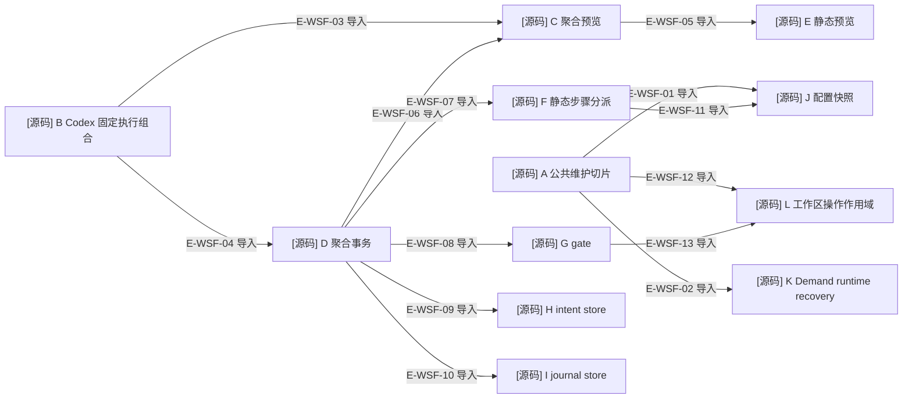

# 维护的直接文件依赖

精选图只展开公共入口、计划聚合、事务、检查点和领域分派。每条边均为当前 TypeScript 文件的直接 import；能力目录与宿主配置不被误画为运行顺序。完整逐文件消费者见审阅记录。

```mermaid
flowchart LR
  accTitle: 工作区维护的直接导入边界
  accDescr: 公共维护入口依赖事务端口与治理恢复，宿主组合固定能力，共享预览和事务分别依赖其领域所有者和检查点文件。
  A["[源码] A 公共维护切片"]
  B["[源码] B Codex 固定执行组合"]
  C["[源码] C 聚合预览"]
  D["[源码] D 聚合事务"]
  E["[源码] E 静态预览"]
  F["[源码] F 静态步骤分派"]
  G["[源码] G gate"]
  H["[源码] H intent store"]
  I["[源码] I journal store"]
  J["[源码] J 配置快照"]
  K["[源码] K Demand runtime recovery"]
  L["[源码] L 工作区操作作用域"]
  A -->|"E-WSF-01 导入"| J
  A -->|"E-WSF-02 导入"| K
  B -->|"E-WSF-03 导入"| C
  B -->|"E-WSF-04 导入"| D
  C -->|"E-WSF-05 导入"| E
  D -->|"E-WSF-06 导入"| C
  D -->|"E-WSF-07 导入"| F
  D -->|"E-WSF-08 导入"| G
  D -->|"E-WSF-09 导入"| H
  D -->|"E-WSF-10 导入"| I
  F -->|"E-WSF-11 导入"| J
  A -->|"E-WSF-12 导入"| L
  G -->|"E-WSF-13 导入"| L
```

### 本图术语说明

| 术语 | 含义 |
| --- | --- |
| import | 编译时直接依赖，只证明结构关系；例如 gate 的 import 不证明已经取得门。 |
| 精选图 | 为维护入口挑选的直接边，省略 Foundation 原语、错误类型、generated 合同与其他领域 owner。 |
| 固定执行组合 | 此处选 Codex 为实例；Claude 另将其 capability 传入同一预览/事务，不由共享模块识别宿主。 |

### 文件、符号与消费者

| 节点 | 文件 / 主符号 | 职责 |
| --- | --- | --- |
| A | `src/capabilities/workspace/maintain-workspace.ts#executeWakeflowMaintenancePublicRequest` | 公开请求、分支和 next；消费者是两个维护入口。 |
| B | `src/hosts/codex/codex-maintenance-execution.ts#executeCodexMaintenanceExecution` | 固定传入 Codex capability；消费者是 Codex entrypoint。 |
| C | `src/workspace/maintenance/wakeflow-maintenance-execution-preview.ts#previewWakeflowMaintenanceExecution` | 合并共享预览与宿主贡献。 |
| D | `src/workspace/maintenance/wakeflow-maintenance-execution-transaction.ts#executeWakeflowMaintenanceExecutionTransaction` | 门、意图、检查点、恢复与终态收尾。 |
| E | `src/workspace/maintenance/wakeflow-static-materialization-preview.ts#previewWakeflowStaticMaterialization` | 读取布局与 owner 检查，生成 15 种共享 step 的候选序列。 |
| F | `src/workspace/maintenance/wakeflow-static-materialization-step-executor.ts#executeWakeflowStaticMaterializationStep` | 验证门与摘要，再分派真实 owner。 |
| G | `src/workspace/maintenance/wakeflow-maintenance-gate.ts#withWakeflowMaintenanceGate` | 关联操作 ID 的 rooted lock 与不可伪造的活动 context。 |
| H | `src/workspace/maintenance/wakeflow-maintenance-execution-intent-store.ts#publishWakeflowMaintenanceExecutionIntent` | 冻结恢复输入，严格目录集合和源身份。 |
| I | `src/workspace/maintenance/wakeflow-maintenance-journal-store.ts#checkpointWakeflowMaintenanceJournal` | 仅允许合法 successor 的精确源替换。 |
| J | `src/configuration/wakeflow-config-authority-snapshot.ts#readWakeflowConfigAuthoritySnapshot` | 读取规范配置表示、身份、位置与摘要。 |
| K | `src/governance/demand/demand-runtime-recovery.ts#inspectDemandRuntimeRecovery` | reconcile 的独立业务恢复 owner。 |
| L | `src/kernel/workspace-operation-scope.ts#withWorkspaceOperationScope` | 共享/独占准入、维护预留和嵌套借用。 |

### 本图边级证据

| 编号 | import 所在文件 / 被导入符号 | 测试证据 |
| --- | --- | --- |
| E-WSF-01 | A 导入 readWakeflowConfigAuthoritySnapshot，用于 hasRecoveryConfig。 | `tests/capabilities/workspace/demand-runtime-recovery.test.ts#executeCodexWakeflowMaintenance` |
| E-WSF-02 | A 导入 inspectDemandRuntimeRecovery / applyDemandRuntimeRecovery。 | `tests/capabilities/workspace/demand-runtime-recovery.test.ts#executeCodexWakeflowMaintenance` |
| E-WSF-03 | B 导入 previewWakeflowMaintenanceExecution。 | `tests/hosts/codex/codex-maintenance-execution.test.ts#previewCodexMaintenanceExecution` |
| E-WSF-04 | B 导入 execute / recoverWakeflowMaintenanceExecutionTransaction。 | `tests/hosts/codex/codex-maintenance-execution.test.ts#executeCodexMaintenanceExecution` |
| E-WSF-05 | C 导入 previewWakeflowStaticMaterialization。 | 间接覆盖：`tests/capabilities/workspace/maintain-workspace.test.ts#executeCodexWakeflowMaintenance` 经聚合预览。 |
| E-WSF-06 | D 导入 previewWakeflowMaintenanceExecution，用于门内外复算。 | `tests/workspace/maintenance/wakeflow-maintenance-execution-transaction.test.ts#executeWakeflowMaintenanceExecutionTransaction` |
| E-WSF-07 | D 导入 executeWakeflowStaticMaterializationStep。 | `tests/workspace/maintenance/wakeflow-maintenance-execution-transaction.test.ts#executeWakeflowStaticMaterializationStep` |
| E-WSF-08 | D 导入 withWakeflowMaintenanceGate 与 withExistingWakeflowMaintenanceGate。 | `tests/workspace/maintenance/wakeflow-maintenance-execution-transaction.test.ts#withWakeflowMaintenanceGate` |
| E-WSF-09 | D 导入 intent publish/read/retire/recovery。 | `tests/workspace/maintenance/wakeflow-maintenance-execution-transaction.test.ts#publishWakeflowMaintenanceExecutionIntent` |
| E-WSF-10 | D 导入 journal publish/checkpoint/read/retire/recovery。 | `tests/workspace/maintenance/wakeflow-maintenance-execution-transaction.test.ts#checkpointWakeflowMaintenanceJournal` |
| E-WSF-11 | F 导入配置快照用于 executeConfig 的当前/创建/替换分支。 | `tests/workspace/maintenance/wakeflow-static-materialization-step-executor.test.ts#executeWakeflowStaticMaterializationStep` |
| E-WSF-12 | A import withWorkspaceOperationScope，用于 Demand 候选恢复 apply。 | `tests/capabilities/workspace/demand-runtime-recovery.test.ts#executeCodexWakeflowMaintenance` |
| E-WSF-13 | G import withWorkspaceOperationScope，将静态维护放入独占范围。 | `tests/capabilities/workspace/operation-scope.test.ts#executeCodexWakeflowMaintenance` |

生成 Schema 由独立生成链核验，没有作为手写 runtime 重复审阅。静态依赖检查不会证明并发或效果行为，需结合 [实际调用与恢复图](./runtime-call-flow.md)。

[返回工作区总览](./README.md)
