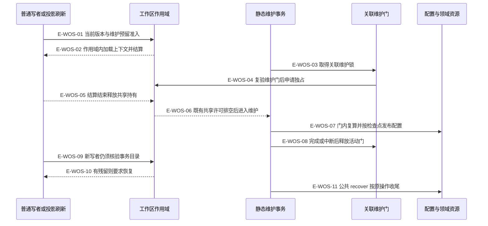
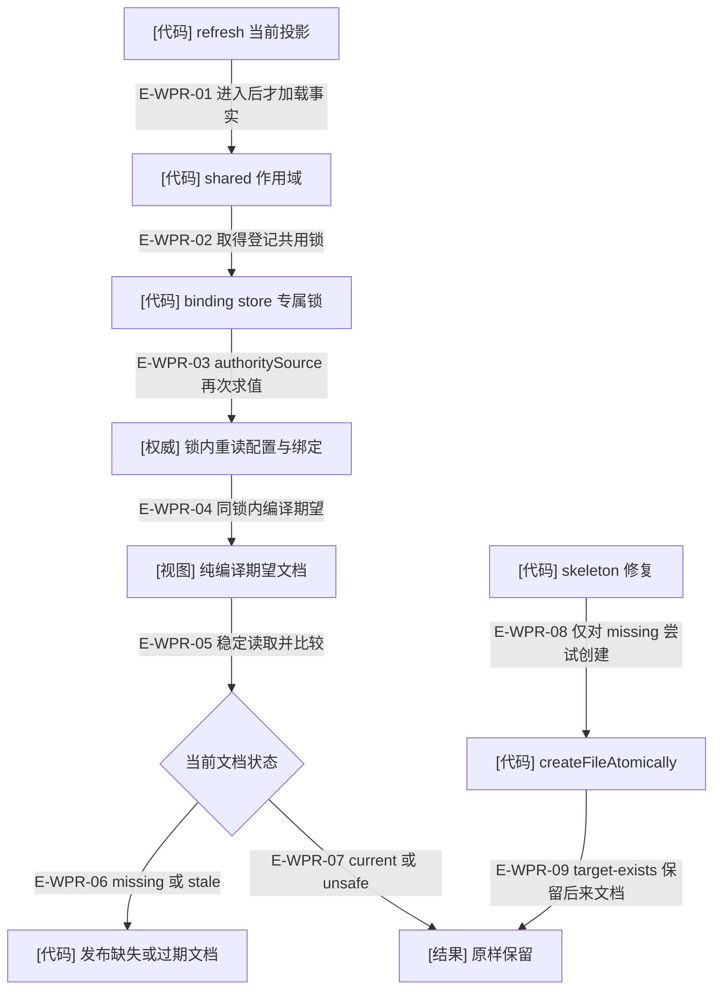

# 当前配置基线与写操作隔离

当前配置身份严格为 `urn:wakeflow:config:v2` / `schemaVersion: 2`。`parseWakeflowConfig` 先按 Schema 拒绝不支持的版本，再执行位置和拓扑关系校验。普通写者的轻量准入也要求当前版本；不存在格式转换、原地升级或 `quiescenceConfirmed` 参数。正常恢复只继续当前格式的未完成操作。配置拒绝行为见 `tests/configuration/wakeflow-config.test.ts#parseWakeflowConfig`；未知版本不写、不升级的完整维护路径见 `tests/capabilities/workspace/operation-scope.test.ts#executeCodexWakeflowMaintenance`。

## 维护与其他写者如何相遇

### 本图术语说明

| 术语 | 含义 |
| --- | --- |
| shared / exclusive | 工作区写操作的读写准入模式；shared 允许多个独立业务写者，不等同于只读请求。只读检查和 preview 不创建该作用域。 |
| 关联维护门 | 维护锁的 token 与 operationId 关联；持有期间包括等待工作区独占与执行维护，不是只包围登记的短 latch。活动 context、锁所有者和 token 一并复验。 |
| 事务预留 | maintenance/transactions 有残留即阻止普通写者；进程退出、活动锁释放不表示未完成维护已消失。 |
| 借用 | 同一异步链可在同根借用现有作用域；exclusive 可容纳 shared，shared 不能升级 exclusive；过期或跨根借用拒绝。 |
| 恢复 | 使用原 operationId 继续已冻结意图和检查点；不是格式迁移，也不是清除未知文件。 |

### 本图边级证据

| 编号 | 代码证据 | 测试证据 |
| --- | --- | --- |
| E-WOS-01 | `src/kernel/workspace-operation-scope.ts#withWorkspaceOperationScope` 调 assertWriterProtocol，再由 beforeEnter 检查维护预留。 | `tests/capabilities/workspace/operation-scope.test.ts#withWorkspaceOperationScope` |
| E-WOS-02 | `src/kernel/command-shell.ts#runCommandShell` 将 spec.open、主体、结果边界和 close 放在作用域 execute 内。 | 间接覆盖：`tests/capabilities/workspace/operation-scope.test.ts#refreshActiveProjection` 断言维护不能越过在途配置读者。 |
| E-WOS-03 | `src/workspace/maintenance/wakeflow-maintenance-gate.ts#runCorrelatedGate` 调专属文件锁；operationId 提供关联 UUID。 | `tests/capabilities/workspace/operation-scope.test.ts#executeCodexWakeflowMaintenance` |
| E-WOS-04 | runCorrelatedGate 持维护锁调用 `src/kernel/workspace-operation-scope.ts#withWorkspaceOperationScope`，maintenanceGuard 验 active context、owner 和 token。 | `tests/capabilities/workspace/operation-scope.test.ts#executeCodexWakeflowMaintenance` |
| E-WOS-05 | `src/kernel/workspace-operation-scope.ts#withWorkspaceOperationScope` 的 operation finally 失效借用上下文，底层作用域释放持有。 | `tests/kernel/workspace-operation-scope.test.ts#withWorkspaceOperationScope` |
| E-WOS-06 | 同一函数用 withRootedReadWriteScope 执行 exclusive；等待期间配置保持旧摘要。 | `tests/capabilities/workspace/operation-scope.test.ts#readWakeflowConfigAuthoritySnapshot` |
| E-WOS-07 | `src/workspace/maintenance/wakeflow-maintenance-execution-transaction.ts#executeWakeflowMaintenanceExecutionTransaction` 在 gate callback 内复算并推进。 | `tests/capabilities/workspace/operation-scope.test.ts#executeCodexWakeflowMaintenance` |
| E-WOS-08 | `src/workspace/maintenance/wakeflow-maintenance-gate.ts#runCorrelatedGate` finally 失效 context；文件锁外壳独立释放。 | `tests/capabilities/workspace/operation-scope.test.ts#executeCodexWakeflowMaintenance` 的配置已写、收尾中断用例。 |
| E-WOS-09 | `src/kernel/workspace-operation-scope.ts#assertNoMaintenanceReservation` 读取活动门与 transactions。 | `tests/capabilities/workspace/operation-scope.test.ts#withWorkspaceOperationScope` |
| E-WOS-10 | 同一守卫对非空 transactions 返回 maintenance-recovery-required，既不清理也不进入回调。 | `tests/capabilities/workspace/operation-scope.test.ts#withWorkspaceOperationScope` |
| E-WOS-11 | `src/capabilities/workspace/maintain-workspace.ts#executeWakeflowMaintenancePublicRequest` 的 recover 调固定 facade.recover。 | `tests/capabilities/workspace/operation-scope.test.ts#executeCodexWakeflowMaintenance` 验证 recover 后目录清空且写者可进入。 |

此图只展开静态维护。`mutationScope: maintenance` 让公共外壳把进入时机交回维护 owner；Demand 候选恢复显式申请 exclusive，私有权限收敛仍采用逐节点 CAS，没有同一作用域包装。也不能由 shared 推论不同 Demand 的写入全部串行：领域锁、事件 CAS、Pod 占用仍分别承担各自职责。

维护门、工作区许可和业务事务是三种生命期。`runCorrelatedGate` 先持维护锁，再以 live guard 进入 exclusive；guard 在准备阶段和短 latch 内分别复验，业务许可尚未登记时即可拒绝。维护锁的获取预算与内部工作区获取预算不是同一个时钟：前者可由 maintenance options 指定，当前调用只把 signal 和 guard 传给内部作用域，因此内部使用默认 30 秒获取预算；两者都没有给业务回调安装运行时限。

获取或排空失败后不自动撤销 intent/journal；只要事务目录仍有条目，后续普通写者即使看不到活动维护锁也要等待 owner 恢复。`read` 和 preview 不持这种共享许可，所以此图不能推出维护期间所有只读请求都被阻塞、或跨目录观察具有原子快照。rc.4 的正常 reader 释放竞态及本轮已修复的 latch 异常交接见[准入竞争与失败结算](../02-foundation/admission-races-and-recovery.md)。

## 窗口投影怎样避免覆盖并发登记

### 本图术语说明

| 术语 | 含义 |
| --- | --- |
| authoritySource | store 锁前/锁内都可求值的事实提供函数；锁位置、程序和宿主身份必须保持。 |
| 同锁内编译 | Config + 当前 Binding inventory → registered/unregistered 文档；旧调用者的 config 参数不再定义 refresh 目标。 |
| unsafe | 文档不可读或不满足安全格式，计数并保留；不是“过期可自动覆盖”。 |
| skeleton | 先补缺失目录，再只创建缺失的未登记文档；并发登记已发布时 target-exists 是保留信号。 |

### 本图边级证据

| 编号 | 代码证据 | 测试证据 |
| --- | --- | --- |
| E-WPR-01 | `src/workspace/window-runtime/wakeflow-window-runtime-projection-maintenance.ts#refreshWakeflowWindowRuntimeProjections` 的 loadInputs 由 shared 内调用。 | `tests/workspace/window-runtime/wakeflow-window-runtime-projection-maintenance.test.ts#refreshWakeflowWindowRuntimeProjections` |
| E-WPR-02 | `src/workspace/window-runtime/wakeflow-window-runtime-projection-maintenance.ts#withCurrentProjectionEntries` 调 withWakeflowWindowHostBindingStore。 | `tests/workspace/window-runtime/wakeflow-window-runtime-projection-maintenance.test.ts#withWakeflowWindowHostBindingStore` |
| E-WPR-03 | `src/workspace/window-runtime/wakeflow-window-host-binding-store.ts#withWakeflowWindowHostBindingStore` 锁内再次取 authoritySource。 | `tests/workspace/window-runtime/wakeflow-window-runtime-projection-maintenance.test.ts#refreshWakeflowWindowRuntimeProjections` 的延迟配置与并发登记断言。 |
| E-WPR-04 | `src/workspace/window-runtime/wakeflow-window-runtime-projection-inspection.ts#compileWakeflowWindowRuntimeProjectionExpectedEntries` 接收锁内 inventory。 | 间接覆盖：`tests/workspace/window-runtime/wakeflow-window-runtime-projection-maintenance.test.ts#executeWakeflowWindowRuntimeProjectionOperation` 经发布路径核验重算目标，没有直接调用纯编译器。 |
| E-WPR-05 | `src/workspace/window-runtime/wakeflow-window-runtime-projection-inspection.ts#inspectWakeflowWindowRuntimeProjectionEntries` 调文档检查。 | `tests/workspace/window-runtime/wakeflow-window-runtime-projection-maintenance.test.ts#planWakeflowWindowRuntimeProjectionMaintenance` |
| E-WPR-06 | refresh 在锁内调用 publishWakeflowWindowRuntimeProjectionDocument。 | `tests/workspace/window-runtime/wakeflow-window-runtime-projection-maintenance.test.ts#refreshWakeflowWindowRuntimeProjections` |
| E-WPR-07 | refresh 遇 current continue，unsafe 计数后 continue；runtime 或 inventory 不可用整组不写。 | `tests/workspace/window-runtime/wakeflow-window-runtime-projection-maintenance.test.ts#planWakeflowWindowRuntimeProjectionMaintenance`；未覆盖：该锚点的 unsafe 断言直接覆盖计划，非所有刷新错误组合。 |
| E-WPR-08 | `src/workspace/window-runtime/wakeflow-window-runtime-projection-maintenance.ts#ensureWakeflowWindowRuntimeSkeleton` 对 missing 使用 createFileAtomically。 | `tests/workspace/window-runtime/wakeflow-window-runtime-projection-maintenance.test.ts#ensureWakeflowWindowRuntimeSkeleton` |
| E-WPR-09 | 同一函数捕获 target-exists 后 continue，绝不把后来登记文档按 stale 替换。 | 同上测试文件中的 `tests/workspace/window-runtime/wakeflow-window-runtime-projection-maintenance.test.ts#createWakeflowWindowHostBindingInStore`，覆盖双宿主 skeleton 与登记竞态。 |

自动回归构造了投影读暂停、并发登记和配置收尾中断；没有真实宿主登录参与。此页只确认断言覆盖的机制，执行结果见本轮统一验证记录。

[维护总览](./README.md) · [检查点恢复](./runtime-call-flow.md) · [内核作用域](../11-kernel/workspace-operation-scope.md)
