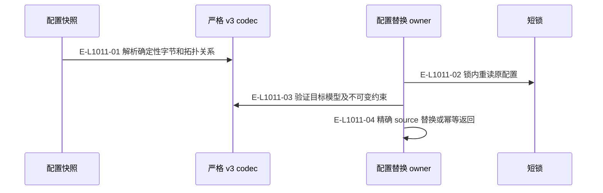
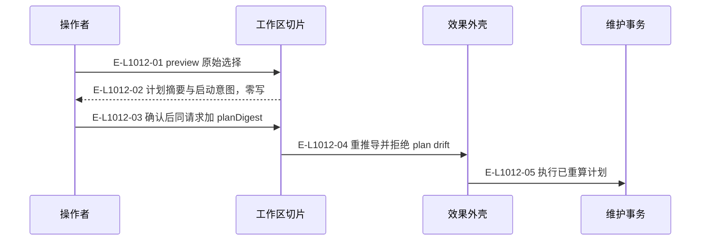
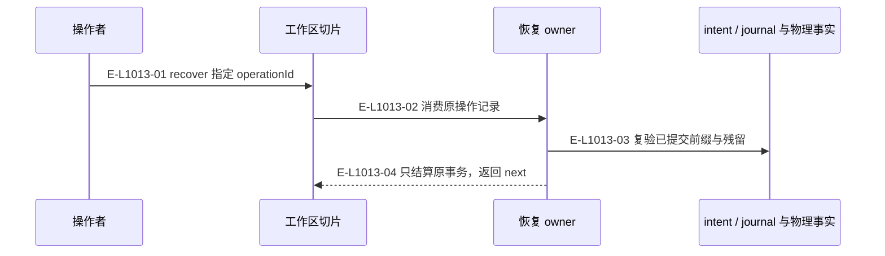

# 工作区维护：预览、应用与恢复

维护工具采用同一请求加 planDigest，服务端重新推导计划；已经移除公共 confirmation 交换形状。

> 核验基线：`7ba1f38`；核验时实现代码均已提交，本轮图谱更新另列。开发阶段为 L1 九片已落地，observation 尚未开始。本文说明实现事实，未宣称双宿主真实会话已经验证。

## 配置权威读取与 CAS

### 本图术语说明

| 术语 | 本图含义 |
| --- | --- |
| CAS | 比较已观察的摘要/修订后提交；来源已改变则拒绝。 |
| Pod | 完整窗口组与每仓执行位置；main 是 primary Pod。 |

### 节点与实现定位

| 节点 | 文件 / 符号 | 责任 |
| --- | --- | --- |
| reader | `src/configuration/wakeflow-config-authority-snapshot.ts` | 配置快照 |
| codec | `src/configuration/wakeflow-config-v3.ts` | 严格 v3 codec |
| replace | `src/configuration/wakeflow-config-authority-replacement.ts` | 配置替换 owner |
| lock | `src/foundation/filesystem/rooted-exclusive-file-lock.ts` | 短锁 |

### 本图边级证据

| 编号 | 代码定位 | 测试 / 核验 | 关系依据 |
| --- | --- | --- | --- |
| E-L1011-01 | `src/configuration/wakeflow-config-authority-snapshot.ts` | `tests/capabilities/workspace/maintain-workspace.test.ts` | 解析确定性字节和拓扑关系 |
| E-L1011-02 | `src/configuration/wakeflow-config-authority-replacement.ts` | `tests/capabilities/workspace/maintain-workspace.test.ts` | 锁内重读原配置 |
| E-L1011-03 | `src/configuration/wakeflow-config-authority-replacement.ts` | `tests/capabilities/workspace/maintain-workspace.test.ts` | 验证目标模型及不可变约束 |
| E-L1011-04 | `src/configuration/wakeflow-config-authority-replacement.ts` | `tests/capabilities/workspace/maintain-workspace.test.ts` | 精确 source 替换或幂等返回 |

## 维护的 preview 和 apply

### 本图术语说明

| 术语 | 本图含义 |
| --- | --- |
| CAS | 比较已观察的摘要/修订后提交；来源已改变则拒绝。 |
| next | 根据当前事实派生的下一责任与建议工具。 |

### 节点与实现定位

| 节点 | 文件 / 符号 | 责任 |
| --- | --- | --- |
| agent | Agent / 用户 / 外部效果或条件视图 | 操作者 |
| slice | `src/capabilities/workspace/maintain-workspace.ts` | 工作区切片 |
| shell | `src/kernel/publication-transaction.ts#runPublicationTransaction` | 效果外壳 |
| txn | `src/workspace/maintenance/wakeflow-maintenance-execution-transaction.ts` | 维护事务 |

### 本图边级证据

| 编号 | 代码定位 | 测试 / 核验 | 关系依据 |
| --- | --- | --- | --- |
| E-L1012-01 | `src/capabilities/workspace/maintain-workspace.ts` | `tests/capabilities/workspace/maintain-workspace.test.ts` | preview 原始选择 |
| E-L1012-02 | `src/capabilities/workspace/maintain-workspace.ts` | `tests/capabilities/workspace/maintain-workspace.test.ts` | 计划摘要与启动意图，零写 |
| E-L1012-03 | `src/capabilities/workspace/maintain-workspace.ts` | `tests/capabilities/workspace/maintain-workspace.test.ts` | 确认后同请求加 planDigest |
| E-L1012-04 | `src/kernel/publication-transaction.ts#runPublicationTransaction` | `tests/capabilities/workspace/maintain-workspace.test.ts` | 重推导并拒绝 plan drift |
| E-L1012-05 | `src/workspace/maintenance/wakeflow-maintenance-execution-transaction.ts#executeWakeflowMaintenanceExecutionTransaction` | `tests/capabilities/workspace/maintain-workspace.test.ts` | 执行已重算计划 |

## 维护中断的前向恢复

### 本图术语说明

| 术语 | 本图含义 |
| --- | --- |
| CAS | 比较已观察的摘要/修订后提交；来源已改变则拒绝。 |
| next | 根据当前事实派生的下一责任与建议工具。 |

### 节点与实现定位

| 节点 | 文件 / 符号 | 责任 |
| --- | --- | --- |
| agent | Agent / 用户 / 外部效果或条件视图 | 操作者 |
| slice | `src/capabilities/workspace/maintain-workspace.ts` | 工作区切片 |
| recover | `src/workspace/maintenance/wakeflow-maintenance-execution-transaction.ts` | 恢复 owner |
| facts | `src/workspace/maintenance/wakeflow-maintenance-execution-transaction.ts` | intent / journal 与物理事实 |

### 本图边级证据

| 编号 | 代码定位 | 测试 / 核验 | 关系依据 |
| --- | --- | --- | --- |
| E-L1013-01 | `src/capabilities/workspace/maintain-workspace.ts` | `tests/capabilities/workspace/maintain-workspace.test.ts` | recover 指定 operationId |
| E-L1013-02 | `src/workspace/maintenance/wakeflow-maintenance-execution-transaction.ts#recoverWakeflowMaintenanceExecutionTransaction` | `tests/capabilities/workspace/maintain-workspace.test.ts` | 消费原操作记录 |
| E-L1013-03 | `src/workspace/maintenance/wakeflow-maintenance-execution-transaction.ts` | `tests/capabilities/workspace/maintain-workspace.test.ts` | 复验已提交前缀与残留 |
| E-L1013-04 | `src/workspace/maintenance/wakeflow-maintenance-execution-transaction.ts` | `tests/capabilities/workspace/maintain-workspace.test.ts` | 只结算原事务，返回 next |

## 守卫、恢复与验证范围

preview 不为了保存 planRef 而写文件。托管块含用户改动或源摘要改变时拒绝覆盖。宿主启动、测试与归档不属于初始化的隐含动作。

涉及的测试与核验入口：

- `tests/capabilities/workspace/maintain-workspace.test.ts`。

## 下钻与相关视图

- [本专题总览](./README.md)
- [图谱总索引](../README.md)
- [核验与剩余范围](../01-diagram-review-ledger.md)
