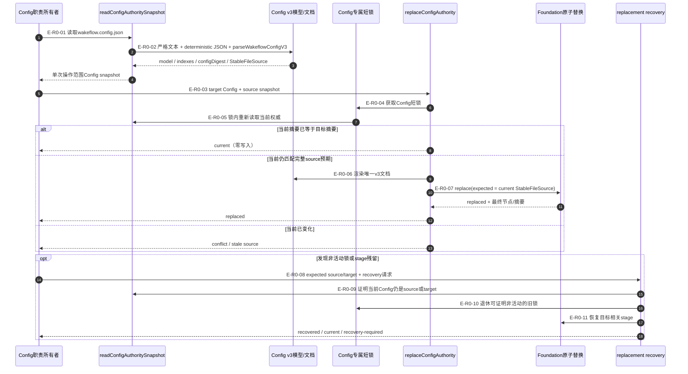
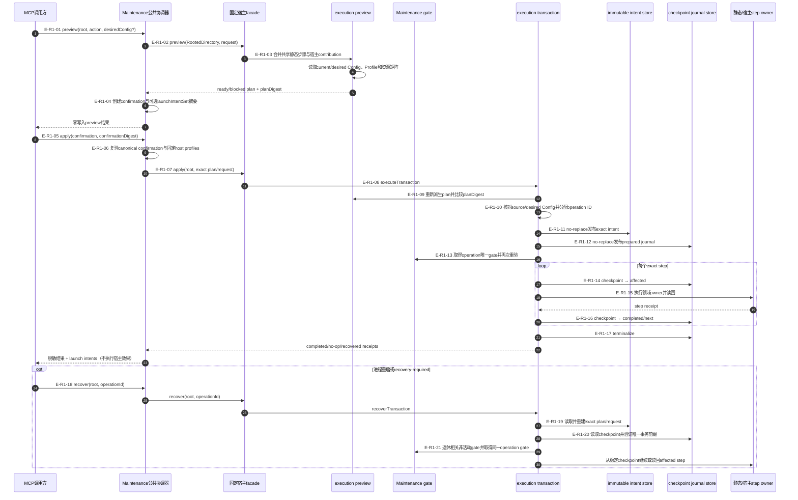
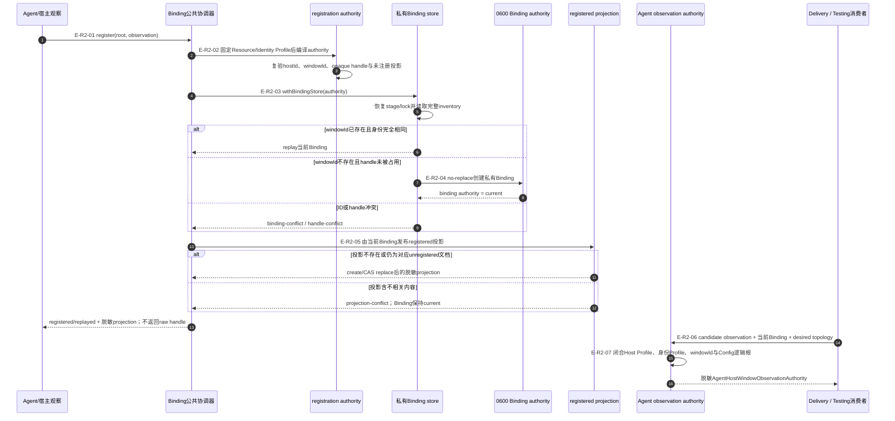

# Configuration 与 Workspace：Config、Maintenance与Binding运行时流程

> 三张图分别回答配置权威如何读取/替换、Maintenance如何从preview进入可恢复事务、以及私有
> Window Binding如何注册并派生脱敏投影。它们共享Foundation根作用域与原子能力，但状态权威互不替代。

## R0：Config权威读取、条件替换与恢复

### 本图术语说明

| 图中术语 | 解释 |
| --- | --- |
| Config snapshot | 模型、索引、语义摘要、确定文档和完整稳定文件源的冻结组合；返回后可能过期 |
| 唯一v3文档 | 从已验证模型按固定字段顺序渲染的 deterministic pretty JSON |
| Config专属短锁 | 只覆盖当前值检查和单次替换/恢复的RootedExclusiveFileLock，不是长期租约 |
| `current` | 当前权威已等于目标，未执行文件写入的幂等结果 |
| 完整source预期 | snapshot签发的路径、节点、字节数和摘要，用作原子替换CAS条件 |
| 非活动残留 | 可证明旧owner不再活动的lock/stage；证据不足时保持不动并要求恢复 |

### R0边级证据

| 边编号 | 代码位置 | 测试重点 |
| --- | --- | --- |
| `E-R0-01`、`E-R0-02` | `wakeflow-config-authority-snapshot.ts` | 缺失、权限、格式、Schema、关系、表示漂移与摘要 |
| `E-R0-03`–`E-R0-07` | `wakeflow-config-authority-replacement.ts` | 锁内重读、幂等、陈旧source、并发替换和原子发布 |
| `E-R0-08`–`E-R0-11` | `wakeflow-config-authority-replacement-recovery.ts` | source/target闭合、旧锁、stage恢复与不确定提交 |

## R1：Maintenance preview、apply与operation恢复

### 本图术语说明

| 图中术语 | 解释 |
| --- | --- |
| 固定宿主facade | Codex或Claude Code入口提供的Host Profile、capability和preview/apply/recover函数集合 |
| shared static step | 所有宿主共享的Config、Active、Support、Managed、Host/Window布局物化步骤 |
| host contribution | 某宿主额外提供的静态设置或操作，必须合并进同一exact plan |
| `planDigest` | 对完整preview计划的语义摘要；apply前重新派生后必须完全一致 |
| launch intent | 返回给Agent/宿主执行的窗口启动意图；Maintenance本身不创建窗口 |
| prepared journal | intent已存在、尚未尝试第一个step的初始checkpoint |
| affected step | 已记录“即将尝试”但尚未写入稳定完成checkpoint的步骤，恢复时必须先读回 |
| 唯一事务前缀 | operation相关intent、journal和gate之外不存在无法解释的同operation资源 |

### R1边级证据

| 边编号 | 代码位置 | 测试重点 |
| --- | --- | --- |
| `E-R1-01`–`E-R1-04` | `maintenance-public-coordinator.ts`、`execution-preview.ts` | preview零写入、blocked/ready、Profile绑定、confirmation与launch摘要 |
| `E-R1-05`–`E-R1-10` | Public coordinator、Host execution、transaction | confirmation篡改、宿主错配、plan陈旧、Config变化和operation ID |
| `E-R1-11`–`E-R1-17` | intent/journal store、gate、step executor | no-replace、checkpoint单调性、并发gate、step读回和terminal结果 |
| `E-R1-18`–`E-R1-21` | `recoverWakeflowMaintenanceExecutionTransaction` | 只凭operation ID恢复、intent/journal不一致、affected step和orphan gate |

## R2：Window Host Binding注册与脱敏观察

### 本图术语说明

| 图中术语 | 解释 |
| --- | --- |
| opaque handle | 宿主用于再次定位窗口的私有不透明句柄；只写入0600 Binding，不进入投影或MCP结果 |
| registration authority | 把固定Profiles、Agent观察、windowId和未注册投影编译成闭合注册请求的内存事实 |
| Binding inventory | 当前宿主全部私有Binding的锁内一致视图，用于ID和handle唯一性判断 |
| replay | 相同windowId和注册身份已经存在时的幂等成功，不创建第二份Binding |
| unregistered projection | Fresh Window Runtime为尚未绑定宿主窗口的期望窗口创建的脱敏文档 |
| registered projection | 在unregistered文档基础上加入当前Binding脱敏事实后的派生文档 |
| observation authority | 候选Agent观察与当前私有Binding、Profile、期望窗口和Config根闭合后的治理输入 |

### R2边级证据

| 边编号 | 代码位置 | 测试重点 |
| --- | --- | --- |
| `E-R2-01`、`E-R2-02` | Public coordinator、`window-host-binding-registration-authority.ts` | Profile错配、观察结构、ID/handle准入和未注册投影绑定 |
| `E-R2-03`、`E-R2-04` | `window-host-binding-store.ts`、registration | 锁恢复、inventory、并发ID/handle冲突、no-replace与replay |
| `E-R2-05` | `window-runtime-registered-projection-publication.ts` | 只接受缺失或对应unregistered源、0600权限、CAS与失败不回滚Binding |
| `E-R2-06`、`E-R2-07` | `wakeflow-agent-host-window-observation-authority.ts` | 当前Binding、Host Profile、desired topology、逻辑根和脱敏handle fingerprint |

## 责任边界

- Configuration权威、Maintenance intent/journal、Window Binding和各投影分别拥有自己的写入与恢复边界。
- Public coordinator只返回脱敏结果；绝对路径、锁token、raw handle和异常栈不进入MCP结果。
- Maintenance launch intents与Agent observation authority都是执行平面输入，不会自行调用宿主API。
- Agent观察与共享协调布局已提交；后续路径变化仍必须刷新本文指纹。
