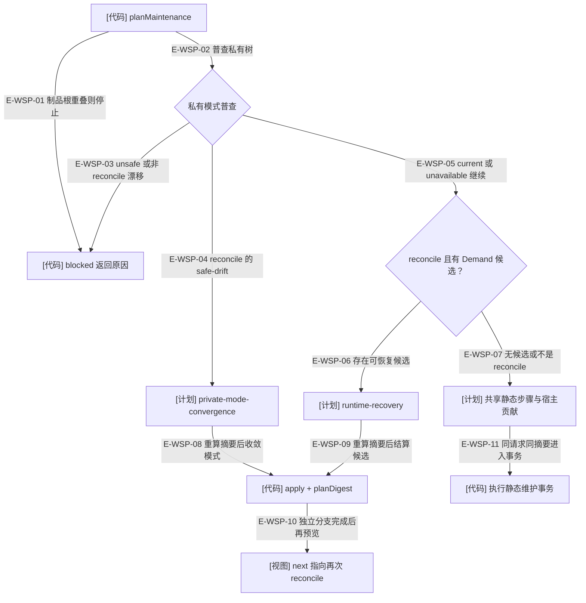
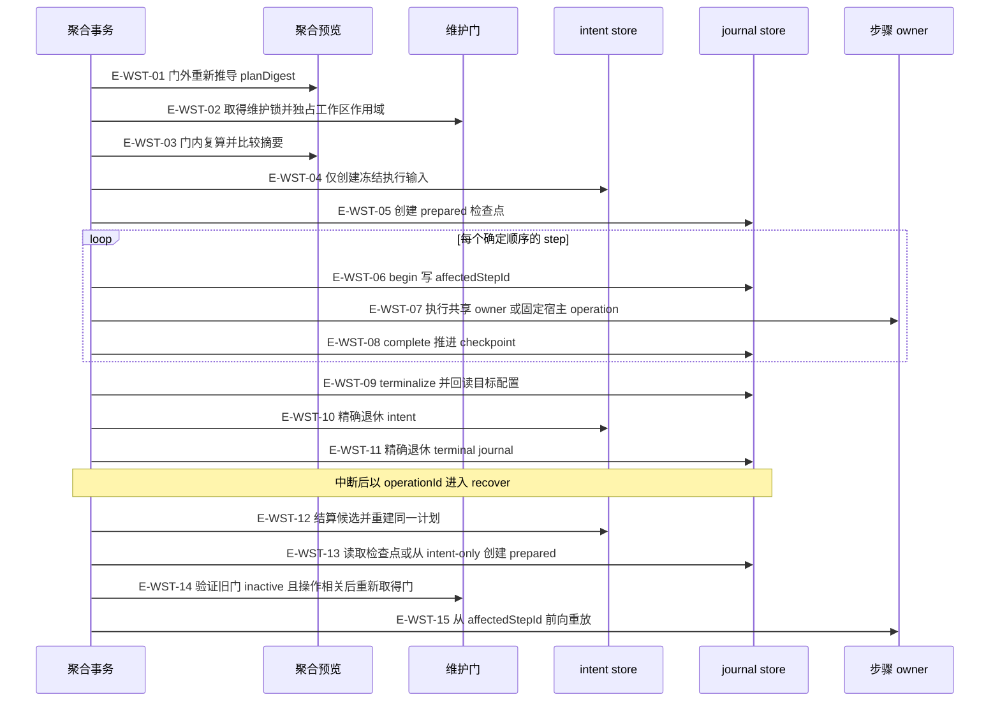
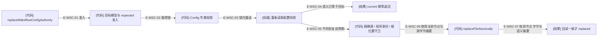

# 维护：优先分支、配置 CAS 与中断恢复

当前工作树的公共入口是 `src/capabilities/workspace/maintain-workspace.ts#executeWakeflowMaintenancePublicRequest`。它把请求交给 `runPublicationTransaction`：preview 只读，apply 重推相同请求并比较摘要，recover 只收 operationId。以下拆开四个不同问题，避免用一张大图混合业务优先级与持久步骤。

```mermaid
flowchart TB
  accTitle: 维护公共入口按当前问题选择单轮工作
  accDescr: 维护先拒绝制品重叠和不安全私有节点，reconcile 先收敛安全模式漂移，再恢复已知 Demand 候选，最后才生成静态物化计划。
  M["[代码] planMaintenance"]
  P{"私有模式普查"}
  R{"reconcile 且有 Demand 候选？"}
  S["[计划] 共享静态步骤与宿主贡献"]
  B["[代码] blocked 返回原因"]
  C["[计划] private-mode-convergence"]
  D["[计划] runtime-recovery"]
  A["[代码] apply + planDigest"]
  N["[视图] next 指向再次 reconcile"]
  T["[代码] 执行静态维护事务"]
  M -->|"E-WSP-01 制品根重叠则停止"| B
  M -->|"E-WSP-02 普查私有树"| P
  P -->|"E-WSP-03 unsafe 或非 reconcile 漂移"| B
  P -->|"E-WSP-04 reconcile 的 safe-drift"| C
  P -->|"E-WSP-05 current 或 unavailable 继续"| R
  R -->|"E-WSP-06 存在可恢复候选"| D
  R -->|"E-WSP-07 无候选或不是 reconcile"| S
  C -->|"E-WSP-08 重算摘要后收敛模式"| A
  D -->|"E-WSP-09 重算摘要后结算候选"| A
  A -->|"E-WSP-10 独立分支完成后再预览"| N
  S -->|"E-WSP-11 同请求同摘要进入事务"| T
```

### 本图术语说明

| 术语 | 含义 |
| --- | --- |
| safe-drift | 私有节点只是其他用户读取/执行位放宽；可按精确节点恢复目录 0700、文件 0600。 |
| unsafe | 别人可写、错误所有者、硬链接等不安全事实，只报告不自动修。 |
| unavailable | 普查不完整时不把它当 current；继续由布局检查报告，不能声称全部私有树已验证。 |
| runtime-recovery | 对既有 Demand 的候选/提交事实进行归属复核与恢复，不重建未知业务权威。 |

### 本图边级证据

| 编号 | 代码证据 | 测试证据 |
| --- | --- | --- |
| E-WSP-01 | `src/capabilities/workspace/maintain-workspace.ts#deriveArtifactOverlapBlockers` 与 planMaintenance。 | `tests/capabilities/workspace/maintain-workspace.test.ts#executeWakeflowMaintenancePublicRequest` |
| E-WSP-02 | `src/capabilities/workspace/maintain-workspace.ts#privateModePlan` 调 `src/workspace/maintenance/wakeflow-private-mode-census.ts#inspectWakeflowPrivateModes`。 | `tests/capabilities/workspace/private-mode-reconcile.test.ts#executeCodexWakeflowMaintenance` |
| E-WSP-03 | `src/capabilities/workspace/maintain-workspace.ts#privateModePlan` 返回 private-mode-unsafe / private-mode-drift。 | `tests/capabilities/workspace/private-mode-reconcile.test.ts#executeCodexWakeflowMaintenance` |
| E-WSP-04 | privateModePlan 冻结 census 与公开统计，不写模式。 | `tests/workspace/maintenance/wakeflow-private-mode-census.test.ts#inspectWakeflowPrivateModes` |
| E-WSP-05 | `src/capabilities/workspace/maintain-workspace.ts#planMaintenance` 在 privateModes 为 null 后进入 runtime 分支。 | `tests/capabilities/workspace/demand-runtime-recovery.test.ts#executeCodexWakeflowMaintenance` |
| E-WSP-06 | `src/capabilities/workspace/maintain-workspace.ts#planRuntimeRecovery` 调 `src/governance/demand/demand-runtime-recovery.ts#inspectDemandRuntimeRecovery`；有 blocker 时停止，不进入静态步骤。 | `tests/capabilities/workspace/demand-runtime-recovery.test.ts#executeCodexWakeflowMaintenance` |
| E-WSP-07 | planMaintenance 调固定 facade.preview；`src/workspace/maintenance/wakeflow-maintenance-execution-preview.ts#previewWakeflowMaintenanceExecution` 聚合。 | `tests/capabilities/workspace/maintain-workspace.test.ts#executeCodexWakeflowMaintenance` |
| E-WSP-08 | `src/capabilities/workspace/maintain-workspace.ts#convergePrivateModes` 调 `src/workspace/maintenance/wakeflow-private-mode-census.ts#convergeWakeflowPrivateModes`。 | `tests/capabilities/workspace/private-mode-reconcile.test.ts#executeCodexWakeflowMaintenance` |
| E-WSP-09 | executeWakeflowMaintenancePublicRequest 的 apply 调 `src/governance/demand/demand-runtime-recovery.ts#applyDemandRuntimeRecovery`。 | `tests/capabilities/workspace/demand-runtime-recovery.test.ts#executeCodexWakeflowMaintenance` |
| E-WSP-10 | `src/capabilities/workspace/maintain-workspace.ts#deriveNext` 的非 materialization 分支。 | `tests/capabilities/workspace/private-mode-reconcile.test.ts#executeCodexWakeflowMaintenance` |
| E-WSP-11 | `src/kernel/publication-transaction.ts#runPublicationTransaction` 执行计划摘要门，再由公共切片调用 facade.apply。 | `tests/capabilities/workspace/maintain-workspace.test.ts#executeCodexWakeflowMaintenance` |

模式收敛会逐节点重新核验；节点变了则计入 changed 并保留，不把变化中的节点强行 chmod。两个独立修复分支返回 operationId:null；静态事务的 recover 不负责它们。当前 runtime-recovery 的 apply 显式取得 exclusive 作用域，权限模式收敛仍没有该作用域包装；不能把维护的三条分支都画成从入口起持有同一锁。

```mermaid
sequenceDiagram
  accTitle: 静态维护的检查点与前向恢复
  accDescr: 事务重算后取得维护门并冻结意图，每步先标记再执行再完成，配置末位发布，恢复重放受影响步骤并依次退休意图和日志。
  participant T as 聚合事务
  participant P as 聚合预览
  participant G as 维护门
  participant I as intent store
  participant J as journal store
  participant O as 步骤 owner
  T->>P: E-WST-01 门外重新推导 planDigest
  T->>G: E-WST-02 取得维护锁并独占工作区作用域
  T->>P: E-WST-03 门内复算并比较摘要
  T->>I: E-WST-04 仅创建冻结执行输入
  T->>J: E-WST-05 创建 prepared 检查点
  loop 每个确定顺序的 step
    T->>J: E-WST-06 begin 写 affectedStepId
    T->>O: E-WST-07 执行共享 owner 或固定宿主 operation
    T->>J: E-WST-08 complete 推进 checkpoint
  end
  T->>J: E-WST-09 terminalize 并回读目标配置
  T->>I: E-WST-10 精确退休 intent
  T->>J: E-WST-11 精确退休 terminal journal
  Note over T,J: 中断后以 operationId 进入 recover
  T->>I: E-WST-12 结算候选并重建同一计划
  T->>J: E-WST-13 读取检查点或从 intent-only 创建 prepared
  T->>G: E-WST-14 验证旧门 inactive 且操作相关后重新取得门
  T->>O: E-WST-15 从 affectedStepId 前向重放
```

### 本图术语说明

| 术语 | 含义 |
| --- | --- |
| intent | 不可变恢复合同，含 desiredConfig、两个 host profiles、sharedPreview、hostContribution 与 planDigest；不保存用户文件全文。 |
| prepared / executing / terminal | journal 的三个持久状态；只允许 begin、complete、terminalize 的直接 successor。 |
| affectedStepId | 在副作用前写入；即使效果已完成但未记成功，恢复也知道精确重放哪个 owner。 |
| 前向恢复 | owner 识别精确当前目标/部分完成前缀后继续；不是一遇错误就撤销所有已写文件。 |
| no-op | 计划无 steps 时不分配 operationId、不创建 intent/journal。 |

### 本图边级证据

| 编号 | 代码证据 | 测试证据 |
| --- | --- | --- |
| E-WST-01 | `src/workspace/maintenance/wakeflow-maintenance-execution-transaction.ts#executeWakeflowMaintenanceExecutionTransaction` 调 previewWakeflowMaintenanceExecution。 | `tests/workspace/maintenance/wakeflow-maintenance-execution-transaction.test.ts#executeWakeflowMaintenanceExecutionTransaction` |
| E-WST-02 | `src/workspace/maintenance/wakeflow-maintenance-gate.ts#withWakeflowMaintenanceGate` 校验 core inspection；`src/workspace/maintenance/wakeflow-maintenance-gate.ts#runCorrelatedGate` 持关联短锁进入 exclusive 作用域，maintenanceGuard 复验 token 与 active context。 | `tests/workspace/maintenance/wakeflow-maintenance-execution-transaction.test.ts#withWakeflowMaintenanceGate`；`tests/capabilities/workspace/operation-scope.test.ts#executeCodexWakeflowMaintenance` |
| E-WST-03 | executeWakeflowMaintenanceExecutionTransaction 在 gate callback 内再次 preview。 | `tests/workspace/maintenance/wakeflow-maintenance-execution-transaction.test.ts#executeWakeflowMaintenanceExecutionTransaction` |
| E-WST-04 | `src/workspace/maintenance/wakeflow-maintenance-execution-intent-store.ts#publishWakeflowMaintenanceExecutionIntent` 限定空事务目录。 | `tests/workspace/maintenance/wakeflow-maintenance-execution-transaction.test.ts#publishWakeflowMaintenanceExecutionIntent` |
| E-WST-05 | `src/workspace/maintenance/wakeflow-maintenance-journal-store.ts#publishPreparedWakeflowMaintenanceJournal` 验证 intent-only 前缀。 | `tests/workspace/maintenance/wakeflow-maintenance-execution-transaction.test.ts#publishPreparedWakeflowMaintenanceJournal` |
| E-WST-06 | `src/workspace/maintenance/wakeflow-maintenance-execution-transaction.ts#advanceJournal` 调 begin 与 checkpoint。 | `tests/workspace/maintenance/wakeflow-maintenance-execution-transaction.test.ts#beginWakeflowMaintenanceJournalStep` |
| E-WST-07 | `src/workspace/maintenance/wakeflow-maintenance-execution-transaction.ts#executeStep`；`src/workspace/maintenance/wakeflow-static-materialization-step-executor.ts#executeWakeflowStaticMaterializationStep`。 | `tests/workspace/maintenance/wakeflow-maintenance-execution-transaction.test.ts#executeWakeflowStaticMaterializationStep` |
| E-WST-08 | advanceJournal 调 complete 与 checkpoint，后者拒绝跳步/改不可变字段。 | `tests/workspace/maintenance/wakeflow-maintenance-execution-transaction.test.ts#completeWakeflowMaintenanceJournalStep` |
| E-WST-09 | `src/workspace/maintenance/wakeflow-maintenance-execution-transaction.ts#assertTerminalConfig` 验证目标摘要。 | `tests/workspace/maintenance/wakeflow-maintenance-execution-transaction.test.ts#terminalizeWakeflowMaintenanceJournal` |
| E-WST-10 | `src/workspace/maintenance/wakeflow-maintenance-execution-intent-store.ts#retireWakeflowMaintenanceExecutionIntent` 要求同一 intent+journal 目录。 | `tests/workspace/maintenance/wakeflow-maintenance-execution-transaction.test.ts#retireWakeflowMaintenanceExecutionIntent` |
| E-WST-11 | `src/workspace/maintenance/wakeflow-maintenance-journal-store.ts#retireTerminalWakeflowMaintenanceJournal` 要求只剩此 journal。 | 间接覆盖：`tests/workspace/maintenance/wakeflow-maintenance-execution-transaction.test.ts#recoverWakeflowMaintenanceExecutionTransaction` 测 terminal-only 收尾。 |
| E-WST-12 | `src/workspace/maintenance/wakeflow-maintenance-execution-transaction.ts#recoverWakeflowMaintenanceExecutionTransaction` 用 `src/workspace/maintenance/wakeflow-maintenance-execution-intent.ts#reconstructWakeflowMaintenanceExecutionFromIntent` 重建。 | `tests/workspace/maintenance/wakeflow-maintenance-execution-transaction.test.ts#recoverWakeflowMaintenanceExecutionTransaction` |
| E-WST-13 | recover 允许 intent-only，拒绝无 intent 的非 terminal journal。 | `tests/workspace/maintenance/wakeflow-maintenance-execution-transaction.test.ts#recoverWakeflowMaintenanceExecutionTransaction` |
| E-WST-14 | `src/workspace/maintenance/wakeflow-maintenance-execution-transaction.ts#retireInactiveCorrelatedGate` 检查 inactive 与 token 后缀，再 withExistingWakeflowMaintenanceGate。 | `tests/workspace/maintenance/wakeflow-maintenance-execution-transaction.test.ts#recoverWakeflowMaintenanceExecutionTransaction` |
| E-WST-15 | advanceJournal 将 recoveringAffectedOperation 传给原 step owner，完成后清 affected。 | `tests/workspace/maintenance/wakeflow-maintenance-execution-transaction.test.ts#recoverWakeflowMaintenanceExecutionTransaction` |

只剩 terminal journal 时，recover 先检查配置目标摘要再退休。另有 `src/workspace/maintenance/wakeflow-prepared-maintenance-recovery.ts#recoverPreparedWakeflowMaintenanceTransaction` 仅取消未执行的 prepared 前缀，及 `src/workspace/maintenance/wakeflow-maintenance-orphan-gate-recovery.ts#recoverWakeflowMaintenanceOrphanGate` 仅退休没有事务资源的孤立门；这些是低层 owner 入口，并未被公共 recover 自动分派。图中没有把它们画成已开放的 MCP 动作。

```mermaid
flowchart LR
  accTitle: 配置条件替换按源事实与目标事实分支
  accDescr: 配置替换先验证目标与预期，在短锁内重读；已经是目标则幂等返回，否则必须精确匹配源且保持程序身份，原子替换后回读节点与摘要。
  R["[代码] replaceWakeflowConfigAuthority"]
  V["[代码] 目标模型与 expected 准入"]
  L["[代码] Config 专属短锁"]
  S["[权威] 重新读取配置快照"]
  I["[结果] current 幂等返回"]
  C["[代码] 精确源 / 程序身份 / 根位置守卫"]
  W["[代码] replaceFileAtomically"]
  B["[结果] 回读一致才 replaced"]
  R -->|"E-WSC-01 准入"| V
  V -->|"E-WSC-02 取得锁"| L
  L -->|"E-WSC-03 锁内重读"| S
  S -->|"E-WSC-04 语义已等于目标"| I
  S -->|"E-WSC-05 不同则复验预期"| C
  C -->|"E-WSC-06 使用当前节点与源字节摘要"| W
  W -->|"E-WSC-07 核验节点 字节与语义摘要"| B
```

### 本图术语说明

| 术语 | 含义 |
| --- | --- |
| expected | 调用方读到的 workspaceRoot、源节点/字节/摘要、configDigest 和 programId。 |
| CAS | 原子替换前必须重新匹配精确源；旧预期不允许覆盖第三方更改。 |
| current | 当前语义已是目标时允许旧请求幂等返回，不重新写文件。 |
| commit-uncertain | 原子提交后的读回/关闭/持久性失败，不伪装成提交前取消或未写入。 |

### 本图边级证据

| 编号 | 代码证据 | 测试证据 |
| --- | --- | --- |
| E-WSC-01 | `src/configuration/wakeflow-config-authority-replacement.ts#replaceWakeflowConfigAuthority` 调 `src/configuration/wakeflow-config-authority-replacement-contract.ts#prepareWakeflowConfigAuthorityDesired` 与 expectation parser。 | `tests/configuration/wakeflow-config-authority-replacement.test.ts#replaceWakeflowConfigAuthority` |
| E-WSC-02 | replaceWakeflowConfigAuthority 调 withRootedExclusiveFileLock。 | `tests/configuration/wakeflow-config-authority-replacement.test.ts#withRootedExclusiveFileLock` |
| E-WSC-03 | `src/configuration/wakeflow-config-authority-replacement.ts#replaceUnderLock` 调 `src/configuration/wakeflow-config-authority-snapshot.ts#readWakeflowConfigAuthoritySnapshot` 的合同包装。 | `tests/configuration/wakeflow-config-authority-replacement.test.ts#readWakeflowConfigAuthoritySnapshot` |
| E-WSC-04 | replaceUnderLock 比较 current.configDigest 与 desired.configDigest。 | `tests/configuration/wakeflow-config-authority-replacement.test.ts#replaceWakeflowConfigAuthority` |
| E-WSC-05 | `src/configuration/wakeflow-config-authority-replacement-contract.ts#matchesWakeflowConfigAuthorityExpectation` 与位置复验。 | `tests/configuration/wakeflow-config-authority-replacement.test.ts#replaceWakeflowConfigAuthority` |
| E-WSC-06 | `src/configuration/wakeflow-config-authority-replacement.ts#replaceCurrentBytes` 调 `src/foundation/filesystem/durable-atomic-file-write.ts#replaceFileAtomically`。 | 间接覆盖：`tests/configuration/wakeflow-config-authority-replacement.test.ts#replaceWakeflowConfigAuthority` 走真实文件替换。 |
| E-WSC-07 | `src/configuration/wakeflow-config-authority-replacement.ts#assertReplacementReadback` 对 effect.previous、inode、mode、字节/语义摘要逐项比较。 | `tests/configuration/wakeflow-config-authority-replacement.test.ts#replaceWakeflowConfigAuthority` |

配置恢复入口 `src/configuration/wakeflow-config-authority-replacement-recovery.ts#recoverWakeflowConfigAuthorityReplacement` 先证明非活动旧锁、相关 stage 的归属与目标，再退休旧锁并重新进入正常替换；不直接继续旧锁内操作。

### 静态资源分支：哪些内容能改

| 目标与入口 | 准入 / 分支 | 效果与恢复 |
| --- | --- | --- |
| `src/workspace/managed-integration/wakeflow-gitignore-inspection.ts#inspectWakeflowWorkspaceGitignore` | managed-current / satisfied-user-owned / recompose-required；未知受管正文、否定规则或 Git 语义失败阻塞 | 调 Git 验证候选真实忽略语义；已有用户规则足够则不插块。 |
| `src/workspace/managed-integration/wakeflow-managed-text-authority-transition.ts#planWakeflowManagedTextAuthorityTransition` | desired → current；已准入旧正文 → 更新；unmanaged → 插块；未知旧正文 → 拒绝 | `src/workspace/managed-integration/wakeflow-managed-text-envelope.ts#recomposeWakeflowManagedTextEnvelope` 保留块外原字节及 owned-leading-lf。 |
| `src/workspace/managed-integration/wakeflow-external-instruction-recomposition.ts#recomposeWakeflowExternalInstruction` | 只针对 config 选择 managed-block 的仓库/外部支撑面 | 已有根内精确源替换，不创建产品根，不改块外文本；已有模式保留。 |
| `src/workspace/support/wakeflow-support-memory-inspection.ts#inspectWakeflowSupportMemory` | 根/配置/目录摘要一致；整文件只能是 desired 或已准入 current render | `src/workspace/support/wakeflow-support-memory-publication.ts#publishWakeflowSupportMemory` 原子发布；未知用户内容不覆盖。 |
| `src/hosts/claude-code/claude-code-portable-settings-transition.ts#planClaudeCodePortableSettingsTransition` | 严格 JSON、拒绝重复键与旧宽泛 Bash 规则；只调整 permissions.allow | `src/hosts/claude-code/claude-code-portable-settings-publication.ts#publishClaudeCodePortableSettings` 保留其余 JSON 段，0644；只在 program/managed 支撑面安装。 |
| `src/hosts/claude-code/claude-code-statusline-settings-operation.ts#executeClaudeCodeStatuslineSettingsOperation` | sourceDigest / targetDigest 与重算字节相符 | 只改 settings.local.json 的 statusLine 键，0600；它是 JSON 键，不是 Markdown managed envelope。 |

受管块正/负例：`tests/workspace/managed-integration/wakeflow-managed-text-authority-transition.test.ts#planWakeflowManagedTextAuthorityTransition`；整文件保护：`tests/workspace/support/wakeflow-support-memory-inspection.test.ts#inspectWakeflowSupportMemory`。上表说明所有权，不将测试符号存在当成全部路径已执行。

[返回总览](./README.md) · [直接导入](./file-dependencies.md) · [宿主效果握手](../09-public-mcp-host-seams/host-effect-handshake.md)
