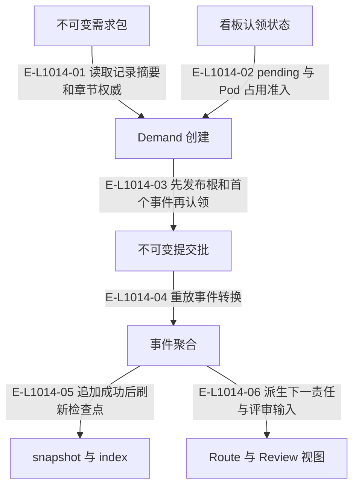

# Demand：不可变事实与可重建视图

需求包是单一来源，Demand 身份含 podId。事件流拥有执行状态；查询、检查点和阅读投影不创建第二份业务状态。

> 核验基线：`1480271`（L1 observation 第十片已落地，20 个公共工具、18 个一次性场景）。工作树另有并行未提交改动（宿主 hook 通道等），本图不描绘；来源指纹按当前工作树计算。本文说明实现事实，未宣称双宿主真实会话已经验证。

## 从需求包到 Demand 事件与视图

### 本图术语说明

| 术语 | 本图含义 |
| --- | --- |
| Demand | 一个需求的不可变身份和事件流；当前执行环境由 podId 指定。 |
| commit | 一次不可变事件提交批；文件槽位以预期修订防止并发覆盖。 |
| snapshot | 可重建的事件聚合检查点；损坏时回退重放。 |
| projection | 根据权威重建的视图，不反向决定事实。 |

### 节点与实现定位

| 节点 | 文件 / 符号 | 责任 |
| --- | --- | --- |
| record | `src/governance/ledger/ledger-authority-store.ts` | 不可变需求包 |
| board | `src/kernel/requirement-board.ts` | 看板认领状态 |
| create | `src/capabilities/demand/service.ts` | Demand 创建 |
| commit | `src/governance/demand/event-sourcing/demand-event-stream-commit.ts` | 不可变提交批 |
| aggregate | `src/governance/demand/model/demand-aggregate-state.ts` | 事件聚合 |
| cache | `src/governance/demand/event-sourcing/demand-event-sourcing-repository.ts` | snapshot 与 index |
| views | `src/governance/review/demand-result-review-snapshot.ts` | Route 与 Review 视图 |

### 本图边级证据

| 编号 | 代码定位 | 测试 / 核验 | 关系依据 |
| --- | --- | --- | --- |
| E-L1014-01 | `src/capabilities/demand/service.ts#executeDemandCreationRequest` | `tests/capabilities/demand/service.test.ts` | 读取记录摘要和章节权威 |
| E-L1014-02 | `src/capabilities/demand/service.ts#executeDemandCreationRequest` | `tests/capabilities/demand/service.test.ts` | pending 与 Pod 占用准入 |
| E-L1014-03 | `src/governance/demand/publication/demand-event-sourcing-publication-service.ts#publishDemandFromPackage` | `tests/capabilities/demand/service.test.ts` | 先发布根和首个事件再认领 |
| E-L1014-04 | `src/governance/demand/event-sourcing/demand-event-sourcing-decider.ts#evolveDemandEventSourcingState` | `tests/governance/demand/demand-event-sourcing-command-handler.test.ts` | 重放事件转换 |
| E-L1014-05 | `src/governance/demand/event-sourcing/demand-event-sourcing-command-handler.ts#executeDemandEventSourcingCommand` | `tests/governance/demand/demand-event-sourcing-command-handler.test.ts` | 追加成功后刷新检查点 |
| E-L1014-06 | `src/governance/controller/demand-controller-route.ts#buildDemandControllerRoute` | `tests/capabilities/demand/service.test.ts` | 派生下一责任与评审输入 |

## 守卫、恢复与验证范围

Snapshot 和索引保留的是派生缓存。读取遇到坏缓存可回退完整重放；权威提交链损坏仍应失败。完成和取消已经连接归档，详见生命周期专题。

涉及的测试与核验入口：

- `tests/capabilities/demand/service.test.ts`。
- `tests/governance/demand/demand-event-sourcing-command-handler.test.ts`。

## 下钻与相关视图

- [文件直接导入](./file-dependencies.md)
- [运行调用与恢复](./runtime-call-flow.md)
- [需求包与看板](../13-requirement/README.md)
- [完成、归档与继续](../07-review-rework-completion/runtime-call-flow.md)
- [图谱总索引](../README.md)
- [核验与剩余范围](../01-diagram-review-ledger.md)
